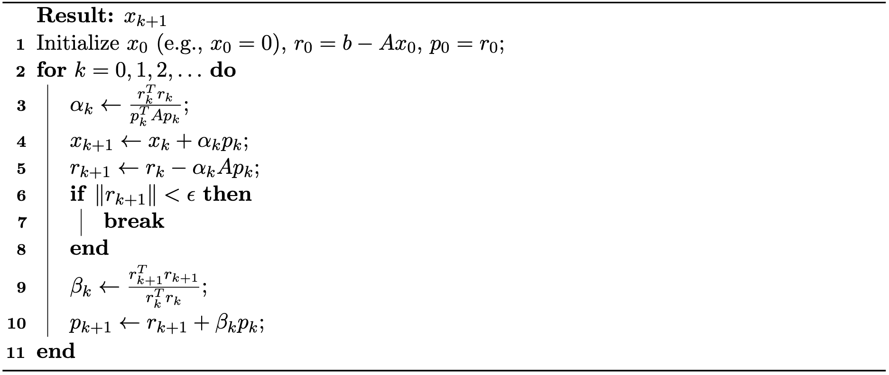

# 共轭梯度法

> 原文：[`phys-sim-book.github.io/lec33.3-conjugate_gradient.html`](https://phys-sim-book.github.io/lec33.3-conjugate_gradient.html)

<link rel="stylesheet" href="https://cdn.jsdelivr.net/npm/katex@0.16.4/dist/katex.min.css">

共轭梯度（CG）法是一种强大的迭代算法，用于求解形式为 Ax=b 的大型稀疏线性系统，其中 A 是对称正定（SPD）。与雅可比和高斯-赛德尔等通用迭代方法不同，CG 是专门为 SPD 矩阵设计的，并在科学计算和数值模拟中变得至关重要。

### 作为二次优化的表述

共轭梯度法可以优雅地理解为最小化二次函数的优化算法：f(x)=21xTAx−bTx，（34.3.1）其中 A 是对称正定（SPD）。f(x) 的唯一全局最小值正是 Ax=b 的解。

经典的梯度下降法沿着负梯度方向 −∇f(x)=b−Ax 更新 x，但这种方法可能会因为收敛速度慢而受到限制，尤其是在 A 是病态的情况下。CG 方法通过沿着精心选择的序列方向 p(k) 搜索来克服这一限制，这些方向是 A-共轭的（或 A-正交的），意味着 p(i)TAp(j)=0 对于 i≠j。这种共轭性质确保了沿一个方向取得的进展不会被后续步骤所抵消，并且沿每个方向的最小化独立于其他方向。

### 线搜索

给定一系列共轭方向 p(0),p(1),p(2),…，最小化二次函数的问题简化为寻找最优步长 α(i)，使得 ∑i=0n−1α(i)p(i) 紧密逼近解 x∗。

最直接的方法是**贪婪线搜索**：从初始点 x(0) 开始，选择一个搜索方向 p(0)，然后最小化 f(x(0)+α(0)p(0)) 关于 α(0)。对于二次函数，这种优化有一个简单的闭式解，避免了矩阵求逆：α(0)=p(0)TAp(0)p(0)T(b−Ax(0))。直观上：我们从 x(0) 开始，选择一个方向 p(0)，沿着这个方向移动，直到目标函数最小化。虽然这可能在一步内不会达到全局最小值，但它保证了向最优解的进步。

然后重复迭代这个过程：在新的点 x(1)=x(0)+α(0)p(0) 处，选择下一个方向 p(1)，计算相应的步长 α(1)，并继续。

通用迭代过程可以总结如下：α(i)x(i+1)r(i+1)=p(i)TAp(i)p(i)Tr(i)=x(i)+α(i)p(i)=r(i)−α(i)Ap(i)（34.3.2），其中 p(0)，p(1)，p(2)，…是搜索方向，r(i)=b−Ax(i)是第 i 步的残差。请注意，残差可以更新，而无需从头开始重新计算 Ax(i+1)：r(i+1)=b−Ax(i+1)=b−A(x(i)+α(i)p(i))=r(i)−α(i)Ap(i)。在实践中，当∥r(i+1)∥足够小（通常低于规定的容差）时，迭代过程可以提前终止，以实现更好的计算效率。

### 共轭方向

搜索方向的选择对于方法性能至关重要。如果方向 p(0)，p(1)，p(2)，…选择不当，收敛将很慢。特别是，梯度下降（使用最速下降方向）对于条件不良的矩阵 A 表现出慢速收敛。

与之相反，如果我们选择相互 A-共轭的方向：p(i)TAp(j)=0，∀i≠j，（34.3.3）算法将实现显著的效率：没有“之字形”行为，并且我们最多在 n 步内获得精确解，其中 n 是系统的维度：

为了不失一般性，假设 x(0)=0 并将 p(0)设置为初始残差。由于 x(0)=0，x(0)处的梯度是 Ax(0)−b=−b，因此我们设置 p(0)=b。剩余的方向将被构建为与所有先前的方向 A-共轭。

令 r(k)表示第 k 步的残差：r(k)=b−Ax(k)。（34.3.4）注意，r(k)等于 f 在 x(k)处的负梯度，因此标准梯度下降将沿着 r(k)的方向移动。

为了构建共轭方向，我们需要确保每个新的搜索方向 p(k)都是从当前的残差 r(k)构建的，同时与所有先前的搜索方向 A-共轭。我们以负梯度 r(k)开始，并使用 Gram-Schmidt 过程将其相对于 A 正交化，以对抗所有先前的搜索方向 p(0)，p(1)，…，p(k−1)：p(k)=r(k)−i=0∑k−1p(i)TAp(i)p(i)TAr(k)p(i)。（34.3.5）

### 算法简化

上述表达式可以显著简化，从而得到共轭梯度算法的优雅最终形式。关键洞察在于证明两个基本正交关系。

**正交性性质。**我们首先建立以下正交关系成立：p(i)Tr(j)=0，∀i<j，（34.3.6）r(i)Tr(j)=0，∀i≠j。（34.3.7）

**证明概要。**从残差更新公式（方程式(34.3.4)），我们可以递归地写出：rj=r(j−1)−α(j−1)Ap(j−1)=r(i)−k=i∑j−1α(k)Ap(k)。将 p(i)与等式两边进行点积：p(i)Tr(j)=p(i)Tr(i)−k=i∑j−1αkpiTApk。通过 A-共轭性质（方程式(34.3.3)）和步长公式α(i)=p(i)TAp(i)p(i)Tr(i)，我们可以验证对于 i<j，p(i)Tr(j)=0。

第二个正交关系 r(i)^T r(j) = 0 来源于每个残差 r(j)按照构造位于搜索方向{p(0), p(1), …, p(j-1)}的范围内，而这些方向是由之前的残差构建的。

**简化公式**。使用这些正交性质，共轭方向公式（方程(34.3.5)）大大简化。由于对于 i<k，p(i)^T r(k) = 0，我们有：p(k)^T r(k) = r(k)^T r(k)。

这允许我们简化步长计算：α(k) = p(k)^T A p(k) r(k)^T r(k)。(34.3.8)

对于共轭方向更新，我们可以证明只有最近的方向才是重要的。使用残差更新公式和正交性质：p(k+1) = r(k+1) - i=0∑k p(i)^T A p(i) p(i)^T A r(k+1) p(i) = r(k+1) - i=0∑k p(i)^T A r(k+1) T A p(i) p(i) = r(k+1) - i=0∑k α(i) p(i)^T A p(i) r(k+1)^T (r(i) - r(i+1)) p(i)。

应用正交关系（方程(34.3.7)和(34.3.8)），这简化为：p(k+1) = r(k+1) + i=0∑k α(i) p(i)^T A p(i) r(k+1)^T r(i+1) p(i) = r(k+1) + i=0∑k r(i)^T r(i) r(k+1)^T r(i+1) p(i) = r(k+1) + r(k)^T r(k) r(k+1)^T r(k+1) p(k)。

这种显著简化表明，我们只需要保留最近的搜索方向 p(k)来计算下一个方向 p(k+1)。

**最终算法**。简化的共轭梯度算法总结在算法 34.3.1 中：

**算法 34.3.1（共轭梯度法）**。

### 预条件化

共轭梯度法的收敛速率从根本上取决于矩阵 A 的条件数。当 A 是病态的（即具有大的条件数）时，CG 可能收敛缓慢，需要多次迭代才能达到可接受的精度。

**预条件化**是一种通过将原始系统转换为具有更有利谱性质的等效系统来加速收敛的关键技术。其思想是解决一个修改后的系统：M^-1 A x = M^-1 b，其中 M 是一个精心选择的**预条件器**矩阵，它近似 A 但更容易求逆。

一个简单而有效的方法是**对角（雅可比）预条件器**，其中 M=diag(A)只包含 A 的对角元素。预条件化的共轭梯度算法随后解决转换后的系统，同时保持原始算法的基本结构。

在实践中，预条件化相当于在每次迭代中将残差乘以 M^-1，当 M 是对角矩阵时，这计算上并不昂贵。预条件化的共轭梯度算法遵循与标准 CG 相同的迭代结构，但操作在预条件化的残差上，通常对于病态问题能显著加快收敛速度。
