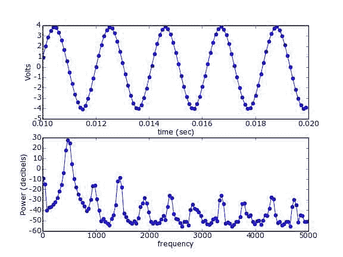

# 二、图形

*   [线积分卷积](LineIntegralConvolution.html)
*   [玛雅维](MayaVi.html)
*   tvtk
*   [Vtk 体绘制](vtkVolumeRendering.html)

# 线积分卷积

# 线积分卷积

线积分卷积是一种表示二维矢量场的技术或技术族。其思想是产生在矢量场方向上高度相关但在整个矢量场上不相关的纹理。这是通过生成一个噪声纹理来完成的，然后，对于图像的每个像素，沿着矢量场向前和向后“流动”。沿着这条路径的点在噪声纹理中被查找，并且被平均以给出起点处的 LIC 纹理。基本技术忽略了矢量场的大小和符号。只要稍加修改，同样的技术可以用来沿着矢量场产生“流动”动画。


本页附有 cython 代码，用于实现简单的线积分卷积运算符，外加一些演示 python 代码。演示代码可以或多或少地制作上面的图像——一个简单的漩涡数组；注意一个整体旋转是如何出现在单个涡旋矢量场的总和中的，就像超流体的“整体旋转”实际上是一个涡旋数组一样——或者它可以制作一个相同矢量场的视频。视频处理起来有点笨拙，因为所有标准的视频压缩技术都将其严重破坏，但它确实工作得很好。

## 附件

*   [`flow-image.png`](../_downloads/flow-image.jpg)
*   [`lic.py`](../_downloads/lic.py)
*   [`lic_demo.py`](../_downloads/lic_demo.py)
*   [`lic_internal.pyx`](../_downloads/lic_internal.pyx)
*   [`setup.py`](../_downloads/setup.py)


# 宫六世

# 宫六世

[Mayavi2](http://code.enthought.com/projects/mayavi/) 是一个交互式程序，允许用 Python 和 scipy 精心绘制科学数据的 3D 图。它是三维可视化的[玛雅维](http://mayavi.sf.net)的继承者。

|| 这一页的信息有点陈旧过时。请参考 [Mayavi2 用户指南](http://enthought.github.com/mayavi/mayavi/)作为参考。有关脚本的快速介绍，请参见 [mlab](http://enthought.github.com/mayavi/mayavi/mlab.html) 。在最近版本的 Mayavi2 中，可以在帮助菜单中访问用户指南，但是最新版本的 Mayavi 的用户指南也可以在线上的[找到。||](http://enthought.github.com/mayavi/mayavi/)

如果您需要更多帮助，我们将邀请您在[entnown-dev](https://mail.enthought.com/mailman/listinfo/enthought-dev)邮件列表中提问。

```py
#!figure
#class right
## Snazzy graphics here...
# >` _ _

`* Using !MayaVi2:`

`There are (at least) two ways to use !MayaVi2:`

`* [:Cookbook/MayaVi/RunningMayavi2: Running MayaVi2] on the command line.`

`* [:Cookbook/MayaVi/ScriptingMayavi2: Scripting MayaVi2] in Python.`

`* [:Cookbook/MayaVi/Examples: Scripting Examples] (all provided in !MayaVi2 svn tree):`

`* Using Contour Module (contour.py)`

`* Using Glyph Module (glyph.py)`

`* Using Mayavi2 without GUI (nongui.py)`

`* A 3D array as numerical source (numeric_source.py)`

`* Using Streamline Module (streamline.py)`

`* Using !ImagePlaneWidget Module (test.py)`

`* Plotting a surface from a matrix (surf_regular_mlab.py). See also [:Cookbook/MayaVi/Surf: Cookbook/MayaVi/Surf]`

`* [:Cookbook/MayaVi/Tips: Tips]: General tips for !MayaVi2 and around.`

# Vtk 体绘制

# Vtk 体绘制

由于我在计算如何使用 VTK 来渲染包含在三维 numpy 数组中的数据时遇到了一些问题，所以我决定分享我的代码。这段代码基于 VTK 的优秀文档和大卫·戈比在 http://public.kitware.com/cgi-bin/cvsweb.cgi/vtk/python/?创建的过时的 vtkImageImportFromArray 类 cvsroot=vtk

对于更高级的功能，这个例子非常简单:阅读文档。

```
import vtk
from numpy import *

# We begin by creating the data we want to render.
# For this tutorial, we create a 3D-image containing three overlaping cubes.
# This data can of course easily be replaced by data from a medical CT-scan or anything else three dimensional.
# The only limit is that the data must be reduced to unsigned 8 bit or 16 bit integers.
data_matrix = zeros([75, 75, 75], dtype=uint8)
data_matrix[0:35, 0:35, 0:35] = 50
data_matrix[25:55, 25:55, 25:55] = 100
data_matrix[45:74, 45:74, 45:74] = 150

# For VTK to be able to use the data, it must be stored as a VTK-image. This can be done by the vtkImageImport-class which
# imports raw data and stores it.
dataImporter = vtk.vtkImageImport()
# The preaviusly created array is converted to a string of chars and imported.
data_string = data_matrix.tostring()
dataImporter.CopyImportVoidPointer(data_string, len(data_string))
# The type of the newly imported data is set to unsigned char (uint8)
dataImporter.SetDataScalarTypeToUnsignedChar()
# Because the data that is imported only contains an intensity value (it isnt RGB-coded or someting similar), the importer
# must be told this is the case.
dataImporter.SetNumberOfScalarComponents(1)
# The following two functions describe how the data is stored and the dimensions of the array it is stored in. For this
# simple case, all axes are of length 75 and begins with the first element. For other data, this is probably not the case.
# I have to admit however, that I honestly dont know the difference between SetDataExtent() and SetWholeExtent() although
# VTK complains if not both are used.
dataImporter.SetDataExtent(0, 74, 0, 74, 0, 74)
dataImporter.SetWholeExtent(0, 74, 0, 74, 0, 74)

# The following class is used to store transparencyv-values for later retrival. In our case, we want the value 0 to be
# completly opaque whereas the three different cubes are given different transperancy-values to show how it works.
alphaChannelFunc = vtk.vtkPiecewiseFunction()
alphaChannelFunc.AddPoint(0, 0.0)
alphaChannelFunc.AddPoint(50, 0.05)
alphaChannelFunc.AddPoint(100, 0.1)
alphaChannelFunc.AddPoint(150, 0.2)

# This class stores color data and can create color tables from a few color points. For this demo, we want the three cubes
# to be of the colors red green and blue.
colorFunc = vtk.vtkColorTransferFunction()
colorFunc.AddRGBPoint(50, 1.0, 0.0, 0.0)
colorFunc.AddRGBPoint(100, 0.0, 1.0, 0.0)
colorFunc.AddRGBPoint(150, 0.0, 0.0, 1.0)

# The preavius two classes stored properties. Because we want to apply these properties to the volume we want to render,
# we have to store them in a class that stores volume prpoperties.
volumeProperty = vtk.vtkVolumeProperty()
volumeProperty.SetColor(colorFunc)
volumeProperty.SetScalarOpacity(alphaChannelFunc)

# This class describes how the volume is rendered (through ray tracing).
compositeFunction = vtk.vtkVolumeRayCastCompositeFunction()
# We can finally create our volume. We also have to specify the data for it, as well as how the data will be rendered.
volumeMapper = vtk.vtkVolumeRayCastMapper()
volumeMapper.SetVolumeRayCastFunction(compositeFunction)
volumeMapper.SetInputConnection(dataImporter.GetOutputPort())

# The class vtkVolume is used to pair the preaviusly declared volume as well as the properties to be used when rendering that volume.
volume = vtk.vtkVolume()
volume.SetMapper(volumeMapper)
volume.SetProperty(volumeProperty)

# With almost everything else ready, its time to initialize the renderer and window, as well as creating a method for exiting the application
renderer = vtk.vtkRenderer()
renderWin = vtk.vtkRenderWindow()
renderWin.AddRenderer(renderer)
renderInteractor = vtk.vtkRenderWindowInteractor()
renderInteractor.SetRenderWindow(renderWin)

# We add the volume to the renderer ...
renderer.AddVolume(volume)
# ... set background color to white ...
renderer.SetBackground(1, 1, 1)
# ... and set window size.
renderWin.SetSize(400, 400)

# A simple function to be called when the user decides to quit the application.
def exitCheck(obj, event):
    if obj.GetEventPending() != 0:
        obj.SetAbortRender(1)

# Tell the application to use the function as an exit check.
renderWin.AddObserver("AbortCheckEvent", exitCheck)

renderInteractor.Initialize()
# Because nothing will be rendered without any input, we order the first render manually before control is handed over to the main-loop.
renderWin.Render()
renderInteractor.Start() 
```py

要退出应用，只需按下 *q* 。

在我看来，如果不使用以下选项，体积渲染器会创建非常难看的图像:

```
volumeProperty.ShadeOn() 
```py

# 输入输出

# 输入输出

*   [用 NIDAQmx 采集数据](Data_Acquisition_with_NIDAQmx.html)
*   [用 PyUL 采集数据](Data_Acquisition_with_PyUL.html)
*   [Fortran 输入/输出格式](FortranIO.html)
*   [输入输出](InputOutput.html)
*   读者
*   [从 CCD 摄像头读取 SPE 文件](Reading_SPE_files.html)
*   [读取 mat 文件](Reading_mat_files.html)
*   [Matlab 7.3 及更高版本](Reading_mat_files.html#matlab-7-3-and-greater)
*   [Matlab 中的 hdf 5](hdf5_in_Matlab.html)

# 使用 NIDAQmx 进行数据采集

# 使用 NIDAQmx 进行数据采集

这些是使用[国家仪器公司的](http://ni.com) [NI-DAQmx](http://www.ni.com/dataacquisition/nidaqmx.htm) 库使用 [ctypes](http://docs.python.org/lib/module-ctypes.html) 和 numpy 进行数据采集和回放的快速示例。该库允许访问他们的各种数据采集设备。通过使用 ctypes，我们就不需要 C 编译器了。下面的代码假设是一个 Windows 平台。NI-DAQmx 也适用于 Linux，但是下面的代码需要一些小的改动，即加载共享库和设置函数签名。

另请参见`Data acquisition with PyUniversalLibrary`。

另请参见用 Linux 支持包装 NI-DAQmx 库的项目: [pylibnidaqmx](http://code.google.com/p/pylibnidaqmx/) 、 [pydaqmx](http://code.google.com/p/pydaqmx/) 、 [daqmxbase-swig](http://code.google.com/p/daqmxbase-swig/) 。

好了，说够了，让我们看看代码！

## 模拟采集

```
#!python numbers=disable
#Acq_IncClk.py
# This is a near-verbatim translation of the example program
# C:\Program Files\National Instruments\NI-DAQ\Examples\DAQmx ANSI C\Analog In\Measure Voltage\Acq-Int Clk\Acq-IntClk.c
import ctypes
import numpy
nidaq = ctypes.windll.nicaiu # load the DLL
##############################
# Setup some typedefs and constants
# to correspond with values in
# C:\Program Files\National Instruments\NI-DAQ\DAQmx ANSI C Dev\include\NIDAQmx.h
# the typedefs
int32 = ctypes.c_long
uInt32 = ctypes.c_ulong
uInt64 = ctypes.c_ulonglong
float64 = ctypes.c_double
TaskHandle = uInt32
# the constants
DAQmx_Val_Cfg_Default = int32(-1)
DAQmx_Val_Volts = 10348
DAQmx_Val_Rising = 10280
DAQmx_Val_FiniteSamps = 10178
DAQmx_Val_GroupByChannel = 0
##############################
def CHK(err):
    """a simple error checking routine"""
    if err < 0:
        buf_size = 100
        buf = ctypes.create_string_buffer('\000' * buf_size)
        nidaq.DAQmxGetErrorString(err,ctypes.byref(buf),buf_size)
        raise RuntimeError('nidaq call failed with error %d: %s'%(err,repr(buf.value)))
# initialize variables
taskHandle = TaskHandle(0)
max_num_samples = 1000
data = numpy.zeros((max_num_samples,),dtype=numpy.float64)
# now, on with the program
CHK(nidaq.DAQmxCreateTask("",ctypes.byref(taskHandle)))
CHK(nidaq.DAQmxCreateAIVoltageChan(taskHandle,"Dev1/ai0","",
                                   DAQmx_Val_Cfg_Default,
                                   float64(-10.0),float64(10.0),
                                   DAQmx_Val_Volts,None))
CHK(nidaq.DAQmxCfgSampClkTiming(taskHandle,"",float64(10000.0),
                                DAQmx_Val_Rising,DAQmx_Val_FiniteSamps,
                                uInt64(max_num_samples)));
CHK(nidaq.DAQmxStartTask(taskHandle))
read = int32()
CHK(nidaq.DAQmxReadAnalogF64(taskHandle,max_num_samples,float64(10.0),
                             DAQmx_Val_GroupByChannel,data.ctypes.data,
                             max_num_samples,ctypes.byref(read),None))
print "Acquired %d points"%(read.value)
if taskHandle.value != 0:
    nidaq.DAQmxStopTask(taskHandle)
    nidaq.DAQmxClearTask(taskHandle)
print "End of program, press Enter key to quit"
raw_input() 
```py

## 模拟生成

```
#!python numbers=disable
"""
This is an interpretation of the example program
C:\Program Files\National Instruments\NI-DAQ\Examples\DAQmx ANSI C\Analog Out\Generate Voltage\Cont Gen Volt Wfm-Int Clk\ContGen-IntClk.c
This routine will play an arbitrary-length waveform file.
This module depends on:
numpy
Adapted by Martin Bures [ mbures { @ } zoll { . } com ]
"""
# import system libraries
import ctypes
import numpy
import threading
# load any DLLs
nidaq = ctypes.windll.nicaiu # load the DLL
##############################
# Setup some typedefs and constants
# to correspond with values in
# C:\Program Files\National Instruments\NI-DAQ\DAQmx ANSI C Dev\include\NIDAQmx.h
# the typedefs
int32 = ctypes.c_long
uInt32 = ctypes.c_ulong
uInt64 = ctypes.c_ulonglong
float64 = ctypes.c_double
TaskHandle = uInt32
# the constants
DAQmx_Val_Cfg_Default = int32(-1)
DAQmx_Val_Volts = 10348
DAQmx_Val_Rising = 10280
DAQmx_Val_FiniteSamps = 10178
DAQmx_Val_ContSamps = 10123
DAQmx_Val_GroupByChannel = 0
##############################
class WaveformThread( threading.Thread ):
    """
 This class performs the necessary initialization of the DAQ hardware and
 spawns a thread to handle playback of the signal.
 It takes as input arguments the waveform to play and the sample rate at which
 to play it.
 This will play an arbitrary-length waveform file.
 """
    def __init__( self, waveform, sampleRate ):
        self.running = True
        self.sampleRate = sampleRate
        self.periodLength = len( waveform )
        self.taskHandle = TaskHandle( 0 )
        self.data = numpy.zeros( ( self.periodLength, ), dtype=numpy.float64 )
        # convert waveform to a numpy array
        for i in range( self.periodLength ):
            self.data[ i ] = waveform[ i ]
        # setup the DAQ hardware
        self.CHK(nidaq.DAQmxCreateTask("",
                          ctypes.byref( self.taskHandle )))
        self.CHK(nidaq.DAQmxCreateAOVoltageChan( self.taskHandle,
                                   "Dev1/ao0",
                                   "",
                                   float64(-10.0),
                                   float64(10.0),
                                   DAQmx_Val_Volts,
                                   None))
        self.CHK(nidaq.DAQmxCfgSampClkTiming( self.taskHandle,
                                "",
                                float64(self.sampleRate),
                                DAQmx_Val_Rising,
                                DAQmx_Val_FiniteSamps,
                                uInt64(self.periodLength)));
        self.CHK(nidaq.DAQmxWriteAnalogF64( self.taskHandle,
                              int32(self.periodLength),
                              0,
                              float64(-1),
                              DAQmx_Val_GroupByChannel,
                              self.data.ctypes.data,
                              None,
                              None))
        threading.Thread.__init__( self )
    def CHK( self, err ):
        """a simple error checking routine"""
        if err < 0:
            buf_size = 100
            buf = ctypes.create_string_buffer('\000' * buf_size)
            nidaq.DAQmxGetErrorString(err,ctypes.byref(buf),buf_size)
            raise RuntimeError('nidaq call failed with error %d: %s'%(err,repr(buf.value)))
        if err > 0:
            buf_size = 100
            buf = ctypes.create_string_buffer('\000' * buf_size)
            nidaq.DAQmxGetErrorString(err,ctypes.byref(buf),buf_size)
            raise RuntimeError('nidaq generated warning %d: %s'%(err,repr(buf.value)))
    def run( self ):
        counter = 0
        self.CHK(nidaq.DAQmxStartTask( self.taskHandle ))
    def stop( self ):
        self.running = False
        nidaq.DAQmxStopTask( self.taskHandle )
        nidaq.DAQmxClearTask( self.taskHandle )
if __name__ == '__main__':
    import time
    # generate a time signal 5 seconds long with 250Hz sample rate
    t = numpy.arange( 0, 5, 1.0/250.0 )
    # generate sine wave
    x = sin( t )
    mythread = WaveformThread( x, 250 )
    # start playing waveform
    mythread.start()
    # wait 5 seconds then stop
    time.sleep( 5 )
    mythread.stop() 
```py

# 用 PyUL 采集数据

# 用 PyUL 采集数据

## 介绍

本页说明了来自[测量计算](http://www.measurementcomputing.com)的廉价(约 150 美元) [PMD USB-1208FS](http://www.measurementcomputing.com/cbicatalog/cbiproduct_new.asp?dept_id=412&pf_id=1665&mscssid=G9PDTGJV5VES9P694WLRS3JWG3J615M7) 数据采集设备的使用。它利用了[pyuniversallbrary](http://www.its.caltech.edu/~astraw/pyul.html)，一个测量计算的[世界图书馆](http://www.measurementcomputing.com/cbicatalog/cbiproduct.asp?dept%5Fid=261&pf%5Fid=1084&mscssid=RDNUK9VN7L3L8PL34QF282AX3F987098)的开源包装器。

另请参见使用 Ni-DAQmx 采集数据。

以下示例是用 PyUL 发行版 20050624 制作的。这个版本的[预编译的 win32 二进制文件](http://www.its.caltech.edu/~astraw/PyUniversalLibrary/PyUniversalLibrary-20050624.win32-py2.4-num23.7.exe)与 Python 2.4 的[entrement 版本(1.0.0 版，2006-08-02 12:20)兼容，这就是运行这些示例的方式。](http://code.enthought.com/enthon/)

## 示例 1 -简单模拟输入

第一个示例说明了无缓冲模拟输入的使用:

```
# example1.py
import UniversalLibrary as UL
import time

BoardNum = 0
Gain = UL.BIP5VOLTS
Chan = 0

tstart = time.time()
data = []
times = []
while 1:
    DataValue = UL.cbAIn(BoardNum, Chan, Gain)
    data.append( DataValue )
    times.append( time.time()-tstart )
    if times[-1] > 1.0:
        break

import pylab
pylab.plot(times,data,'o-')
pylab.xlabel('time (sec)')
pylab.ylabel('ADC units')
pylab.show() 
```py

当我运行这个程序时，有一个函数发生器产生一个正弦波，连接到我的设备的引脚 1 和 2。这将产生如下图:


## 示例 2 -获取伏特而不是任意单位

示例 1 中记录的值是“模数转换器单位”，即由模数硬件直接记录的值。事实上，该器件有一个 12 位模数转换器，但数值存储为 16 位有符号整数。为了将这些值转换成伏特，我们使用测量计算的功能。在这里，我们对每一条数据都这样做，并绘制结果。

```
#example2.py
import UniversalLibrary as UL
import time

BoardNum = 0
Gain = UL.BIP5VOLTS
Chan = 0

tstart = time.time()
data = []
times = []
while 1:
    DataValue = UL.cbAIn(BoardNum, Chan, Gain)
    EngUnits = UL.cbToEngUnits(BoardNum, Gain, DataValue)
    data.append( EngUnits )
    times.append( time.time()-tstart )
    if times[-1] > 1.0:
        break

import pylab
pylab.plot(times,data,'o-')
pylab.xlabel('time (sec)')
pylab.ylabel('Volts')
#pylab.savefig('example2.png',dpi=72)
pylab.show() 
```py

现在输出值以伏特为单位:


## 示例 3 -缓冲输入

正如你无疑已经注意到的，上面的图不是非常“纯”的正弦波。这无疑是由于我们采样数据的方式。我们不是依靠稳定的时钟来完成收购，而是以设备(和操作系统)允许的速度轮询设备。还有一个更好的方法——我们可以使用测量计算设备上的时钟，以均匀间隔的样本获取数据缓冲区。

```
#example3.py
import UniversalLibrary as UL
import Numeric
import pylab

BoardNum = 0
Gain = UL.BIP5VOLTS

LowChan = 0
HighChan = 0

Count = 2000
Rate = 3125

Options = UL.CONVERTDATA
ADData = Numeric.zeros((Count,), Numeric.Int16)

ActualRate = UL.cbAInScan(BoardNum, LowChan, HighChan, Count,
                     Rate, Gain, ADData, Options)

# convert to Volts
data_in_volts = [ UL.cbToEngUnits(BoardNum, Gain, y) for y in ADData]

time = Numeric.arange( ADData.shape[0] )*1.0/ActualRate

pylab.plot(time, data_in_volts, 'o-')
pylab.xlabel('time (sec)')
pylab.ylabel('Volts')
pylab.savefig('example3.png',dpi=72)
pylab.show() 
```py

输出看起来好多了:

## 示例 4 -计算功率谱

现在我们可以使用 py lab(matplotlib 的一部分)的函数来计算功率谱密度。

```
#example4.py
import UniversalLibrary as UL
import Numeric
import pylab

BoardNum = 0
Gain = UL.BIP5VOLTS

LowChan = 0
HighChan = 0

Count = 2000
Rate = 10000

Options = UL.CONVERTDATA
ADData = Numeric.zeros((Count,), Numeric.Int16)

ActualRate = UL.cbAInScan(BoardNum, LowChan, HighChan, Count,
                     Rate, Gain, ADData, Options)
time = Numeric.arange( ADData.shape[0] )*1.0/ActualRate

# convert to Volts
data_in_volts = [ UL.cbToEngUnits(BoardNum, Gain, y) for y in ADData]
data_in_volts = Numeric.array(data_in_volts) # convert to Numeric array

pxx, freqs = pylab.psd( data_in_volts, Fs=ActualRate )
decibels = 10*Numeric.log10(pxx)
pylab.subplot(2,1,1)
pylab.plot(time[100:200],data_in_volts[100:200],'o-') # plot a few samples
pylab.xlabel('time (sec)')
pylab.ylabel('Volts')
pylab.subplot(2,1,2)
pylab.plot(freqs, decibels, 'o-')
pylab.xlabel('frequency')
pylab.ylabel('Power (decibels)')
pylab.savefig('example4.png',dpi=72)
pylab.show() 
```py

在这个例子中，我把函数发生器的频率调到了 480 赫兹。你可以看到，这就是`psd()`函数告诉我们的:



## 附件

*   [`example1.png`](../_downloads/example1.jpg)
*   [`example2.png`](../_downloads/example2.jpg)
*   [`example3.png`](../_downloads/example3.jpg)
*   [`example4.png`](../_downloads/example4.jpg)

   

# Fortran 输入输出格式

# Fortran 输入输出格式

> **注意**:你可能想用 [scipy.io.FortranFile](http://docs.scipy.org/doc/scipy/reference/generated/scipy.io.FortranFile.html) 代替。

由 Fortran 程序编写的文件可以使用两种格式之一编写:格式化的或未格式化的。格式化文件是以人类可读的格式编写的，应该可以使用 numpy.fromfile 加载它们。未格式化文件是使用 Fortran 标准未指定的二进制格式编写的。实际上，大多数编译器/运行时使用基于记录的格式，其整数头由以字节为单位的记录长度组成，然后是记录本身，其后是以字节为单位的整数尾。

假设头和数据的精度和端序是未指定的，那么在野外可能会看到大量可能的组合。 [*FortranFile*](FortranIO_FortranFile.html) 类可以处理其中的许多。

以下是如何读取特定未格式化输出文件的示例。请注意代表页眉和页脚的数据类型的“i4”元素的存在。

## 读取 FORTRAN“无格式输入输出”文件

许多科学代码都是用 FORTRAN 编写的。在 FORTRAN 中创建的最方便的文件格式之一是所谓的“[无格式二进制文件](http://local.wasp.uwa.edu.au/~pbourke/dataformats/fortran/)”。这些文件具有原始二进制 IO 的所有缺点-没有元数据，数据依赖于主机端序、浮点表示以及可能的字长-但不仅仅是原始二进制。它们被组织成“记录”，用大小信息填充。然而，人们确实不时会遇到这样的文件。在 numpy/scipy 中似乎没有预写的代码可以用来读取它们，但是使用 numpy 的记录数组可以相对容易地完成:

```
>>> A = N.fromfile("/tmp/tmp_i7j_a/resid2.tmp",
...   N.dtype([('pad1','i4'),
...    ('TOA','f8'),
...    ('resid_p','f8'),
...    ('resid_s','f8'),
...    ('orb_p','f8'),
...    ('f','f8'),
...    ('wt','f8'),
...    ('sig','f8'),
...    ('preres_s','f8'),
...    ('pad3','i8'),
...    ('pad2','i4')])) 
```

此示例旨在读取由[[http://www.atnf.csiro.au/research/pulsar/tempo/](http://www.atnf.csiro.au/research/pulsar/tempo/)TEMPO 输出的[[http://www . atnf . CSIRO . au/research/pulsar/TEMPO/ref _ man _ sections/output . txt](http://www.atnf.csiro.au/research/pulsar/tempo/ref_man_sections/output.txt)a file]。大多数字段，“TOA”到“preres_s”都是文件中存在且感兴趣的字段。字段“pad3”要么是文件格式的未记录的增加，要么是某种填充(在我的测试文件中总是零)。FORTRAN 无格式输入输出增加了字段“pad1”和“pad2”。每个都应该包含每个记录的长度(以字节为单位)(因此可以推断出额外的“pad3”字段的存在)。这段代码忽略 t