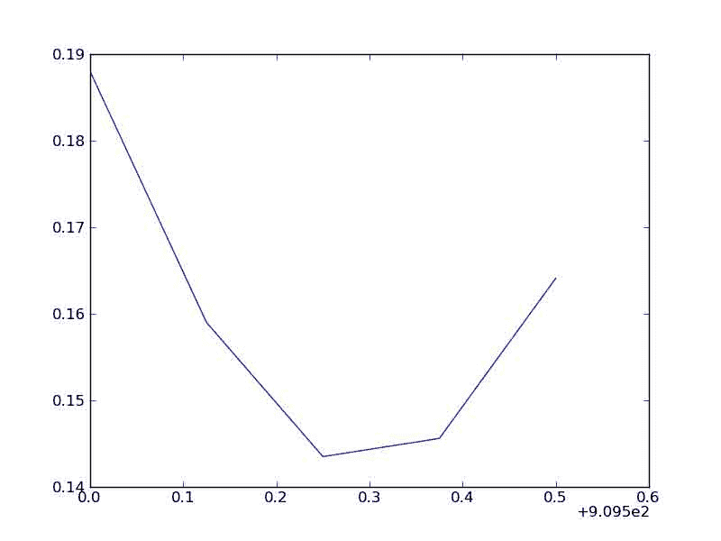
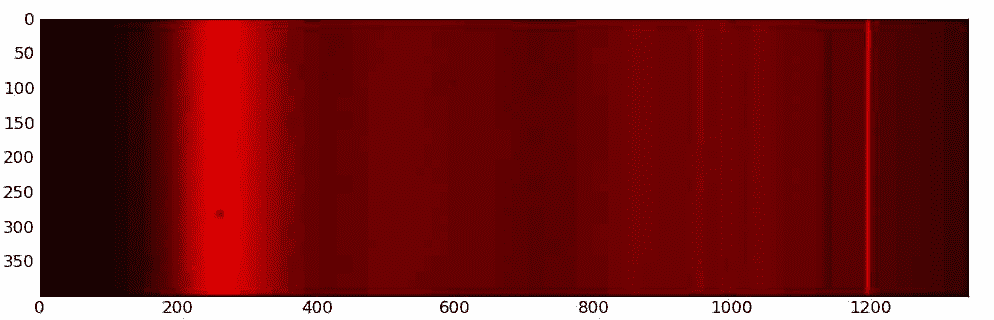

# 三、输入和输出

## 介绍

本页举例说明如何读或写！NumPy 数组，无论是 ascii 还是二进制。所展示的各种方法都有丰富的、有时是复杂的选项，请致电帮助获取详细信息。

我们将考虑一个简单的例子，我们创建一个名为`data`的零数组，将其写入一个文件`myfile.txt` (myfile.dat 代表二进制情况)，并将其读入`read_data`。

可以通过讨论更复杂的情况(例如多个数组)和讨论所提出的各种方法的成本/收益来改进该文档。

## 文本文件

### 我的天啊

写文件可以使用`savetxt`完成。到目前为止，读取文本数据最简单的方法是通过 genfromtxt(或派生的便利函数 recfromtxt 和 recfromcsv)。

```py
>>> from numpy import *
>>> data = zeros((3,3))
>>>#Write data:
>>> savetxt("myfile.txt", data)
>>>#Read:
>>> data = genfromtxt("myfile.txt") }}}

== Matplotlib (pylab) ==

Matplotlib  provides an easy solution which seems to load data faster than read_array:

{{{#!python numbers=disable
>>> from numpy import *
>>> from pylab import load           # warning, the load() function of numpy will be shadowed
>>> from pylab import save
>>> data = zeros((3,3))
>>> save('myfile.txt', data)
>>> read_data = load("myfile.txt") 
```

### numPy

```py
>>> savetxt('myfile.txt', data, fmt="%12.6G")    # save to file 
```

```py
>>> from numpy import *
>>> data = genfromtxt('table.dat', unpack=True) 
```

### csv 文件

请注意，csv 代表“逗号分隔值”。这意味着分隔符(也称为分隔符)，即用于分隔文件中各个值的字符，是逗号。在上面的例子中，默认的分隔符是一个空格，但是上面所有的方法都有一个选项(详情参见它们各自的帮助)，可以设置为逗号，以便读取或写入 csv 文件。

### 一个更复杂的例子

或者，假设您已经将 numpy 作为 N 导入，您可能想要读取任意的列类型。你也可以返回一个重数组，让你给你的数组分配“列标题”。

```py
def read_array(filename, dtype, separator=','):
    """ Read a file with an arbitrary number of columns.
 The type of data in each column is arbitrary
 It will be cast to the given dtype at runtime
 """
    cast = N.cast
    data = [[] for dummy in xrange(len(dtype))]
    for line in open(filename, 'r'):
        fields = line.strip().split(separator)
        for i, number in enumerate(fields):
            data[i].append(number)
    for i in xrange(len(dtype)):
        data[i] = cast[dtype[i]](data[i])
    return N.rec.array(data, dtype=dtype) 
```

然后可以用相应的数据类型调用它:

```py
mydescr = N.dtype([('column1', 'int32'), ('column2Name', 'uint32'), ('col3', 'uint64'), ('c4', 'float32')])
myrecarray = read_array('file.csv', mydescr) 
```

## 二进制文件

二进制文件的优点是文件大小大大减小。付出的代价是失去了人的可读性，在某些格式中，失去了可移植性。

让我们考虑前面例子中的数组。

### 带有元数据的文件格式

最简单的可能是使用自己的二进制文件格式。看吧。

```py
>>> numpy.save('test.npy', data)
>>> data2 = numpy.load('test.npy') 
```

您可以使用将多个数组保存在一个文件中。加载文件时，您会得到一个类型为的对象。您可以获得数组列表，并像这样加载单个数组:

```py
>>> numpy.savez('foo.npz', a=a,b=b)
>>> foo = numpy.load('foo.npz')
>>> foo.files
['a', 'b']
>>> a2 = foo['a']
>>> b2 = foo['b'] 
```

在旧系统上，标准是使用 python 的 pickle 模块来酸洗数组。

### 原始二进制

这些文件格式只是写出了数组的内部表示。这依赖于平台，不包含关于数组形状或数据类型的信息，但是快速简单。

SciPy 提供了来自 SciPy . io . numpiyo 的 fwrite()。您必须设置数据的大小，并可选地设置其类型(整数、短整型、浮点型等；见 [1](http://docs.neuroinf.de/api/scipy/scipy.io.numpyio-module.html) )。

为了读取二进制文件，scipy . io . numpiyo 提供了 fread()。你必须知道数组的数据类型、大小和形状。

```py
>>> from scipy.io.numpyio import fwrite, fread
>>> data = zeros((3,3))
>>>#write:  fd = open('myfile.dat', 'wb')
>>> fwrite(fd, data.size, data)
>>> fd.close()
>>>#read:
>>> fd = open('myfile.dat', 'rb')
>>> datatype = 'i'
>>> size = 9
>>> shape = (3,3)
>>> read_data = fread(fd, size, datatype)
>>> read_data = data.reshape(shape) 
```

或者，您可以简单地使用和。遵循前面的示例:

```py
>>> data.tofile('myfile.dat')
>>> fd = open('myfile.dat', 'rb')
>>> read_data = numpy.fromfile(file=fd, dtype=numpy.uint8).reshape(shape) 
```

```py
numpy data type. The option {{{fromfile(..., count=<number>)}}} specifies the number of data entries of that type you want to read in (the default -1 means read in the whole file, which is what you usually want). However, the method is not recommended for data storage and transfer between different platforms, since no byteorder and datatype information is stored (see also the docstrings).
If you want that, use {{{numpy}}}'s own binary file format. See {{{numpy.save}}}, {{{numpy.savez}}} and {{{numpy.load}}}.
{{{#! python numbers=disable
>>> numpy.save('test.npy', data)
>>> data2 = numpy.load('test.npy') 
```

另一种完全控制写入和回读的 rank > 1 数组和数据类型的字节顺序(byteorder)、存储顺序(row-major、column-major)的方法是，但不推荐使用。写作:

```py
>>> from scipy.io import npfile
>>> shape = (3,3)
>>> data = numpy.random.random(shape)
>>> npf = npfile('test.dat', order='F', endian='<', permission='wb')
>>> npf.write_array(data)
>>> npf.close() 
```

回读:

```py
>>> npf = npfile('test.dat', order='F', endian='<', permission='rb')
>>> data2 = npf.read_array(float, shape=shape)
>>> npf.close() 
```

### 将 Fortran 或 C 数组写入带有元数据的二进制文件

[libnpy](http://www.maths.unsw.edu.au/~mclean/libnpy-0.5.tgz) 是一个小型库，提供了使用 NumPy 自己的二进制格式将 C 或 Fortran 数组保存到数据文件的简单例程。有关此格式的描述，请执行以下操作

```py
>>> from numpy.lib import format
>>> help(format) 
```

下面是一个最小的 C 例子`cex.c`:

```py
#include"npy.h"
int main(){
    double a[2][4] = { { 1, 2, 3, 4 },
                       { 5, 6, 7, 8 } };
    int shape[2] = { 2, 4 }, fortran_order = 0;

    npy_save_double("ca.npy", fortran_order, 2, shape, &a[0][0]);
    return 0;
} 
```

程序创建一个文件`ca.npy`，你可以用通常的方式加载到 python 中。

```py
>>> ca = np.load('ca.npy')
>>> print ca
[[ 1\.  2\.  3\.  4.]
 [ 5\.  6\.  7\.  8.]] 
```

对应的 Fortran 程序`fex.f95`，看起来像

```py
program fex
    use fnpy
    use iso_c_binding
    implicit none

    integer  :: i
    real(C_DOUBLE) :: a(2,4) = reshape([(i, i=1,8)], [2,4])

    call save_double("fa.npy", shape(a), a)
end program fex 
```

但是 NumPy 数组的条目现在遵循 Fortran(列-主)顺序。

```py
>>> fa = np.load('fa.npy')
>>> print fa
[[ 1\.  3\.  5\.  7.]
 [ 2\.  4\.  6\.  8.]] 
```

源代码发行版中的`README`文件解释了如何使用`make`编译库。

如果您将`npy.h`和`libnpy.a`放在与`cex.c`相同的目录中，那么您可以使用命令构建可执行文件`cex`

```py
gcc -o cex cex.c libnpy.a 
```

同样，将`npy.mod`和`libnpy.a`放在与`fex.f95`相同的目录中，使用命令构建`fex`

```py
gfortran -o fex fex.f95 libnpy.a 
```

# 读者群

# 读者群

本秘籍示例包含一个模块，该模块实现了 LAS (Log ASCII Standard)测井文件(LAS 2.0)的读取器。更多信息见[加拿大测井协会页面](http://www.cwls.org/las_info.php)关于该格式。

```py
#!python
"""LAS File Reader

The main class defined here is LASReader, a class that reads a LAS file
and makes the data available as a Python object.
"""

# Copyright (c) 2011, Warren Weckesser
#
# Permission to use, copy, modify, and/or distribute this software for any
# purpose with or without fee is hereby granted, provided that the above
# copyright notice and this permission notice appear in all copies.
#
# THE SOFTWARE IS PROVIDED "AS IS" AND THE AUTHOR DISCLAIMS ALL WARRANTIES
# WITH REGARD TO THIS SOFTWARE INCLUDING ALL IMPLIED WARRANTIES OF
# MERCHANTABILITY AND FITNESS. IN NO EVENT SHALL THE AUTHOR BE LIABLE FOR
# ANY SPECIAL, DIRECT, INDIRECT, OR CONSEQUENTIAL DAMAGES OR ANY DAMAGES
# WHATSOEVER RESULTING FROM LOSS OF USE, DATA OR PROFITS, WHETHER IN AN
# ACTION OF CONTRACT, NEGLIGENCE OR OTHER TORTIOUS ACTION, ARISING OUT OF
# OR IN CONNECTION WITH THE USE OR PERFORMANCE OF THIS SOFTWARE.

import re
import keyword

import numpy as np

def isidentifier(s):
    if s in keyword.kwlist:
        return False
    return re.match(r'^[a-z_][a-z0-9_]*$', s, re.I) is not None

def _convert_to_value(s):
    try:
        value = int(s)
    except ValueError:
        try:
            value = float(s)
        except ValueError:
            value = s
    return value

class LASError(Exception):
    pass

class LASItem(object):
    """This class is just a namespace, holding the attributes 'name',
 'units', 'data', 'value', and 'descr'.  'value' is the numerical
 value of 'data', if it has a numerical value (specifically, if
 int() or float() don't raise an exception when given the value
 of the 'data' attribute).

 A class method, from_line(cls, line), is provided to parse
 a line from a LAS file and create a LASItem instance.
 """
    def __init__(self, name, units='', data='', descr=''):
        self.name = name
        self.units = units
        self.data = data
        self.value = _convert_to_value(data)
        self.descr = descr

    def __str__(self):
        s = ("name='%s', units='%s', data='%s', descr='%s'" %
                (self.name, self.units, self.data, self.descr))
        return s

    def __repr__(self):
        s = str(self)
        return "LASItem(%s)" % s

    @classmethod
    def from_line(cls, line):
        first, descr = line.rsplit(':', 1)
        descr = descr.strip()
        name, mid = first.split('.', 1)
        name = name.strip()
        if mid.startswith(' '):
            # No units
            units = ''
            data = mid
        else:
            units_data = mid.split(None, 1)
            if len(units_data) == 1:
                units = units_data[0]
                data = ''
            else:
                units, data = units_data
        return LASItem(name=name, units=units, data=data.strip(),
                       descr=descr.strip())

def _read_wrapped_row(f, n):
    """Read a "row" of data from the Ascii section of a "wrapped" LAS file.

 `f` must be a file object opened for reading.
 `n` is the number of fields in the row.

 Returns the list of floats read from the file.
 """
    depth = float(f.readline().strip())
    values = [depth]
    while len(values) < n:
        new_values = [float(s) for s in f.readline().split()]
        values.extend(new_values)
    return values

def _read_wrapped_data(f, dt):
    data = []
    ncols = len(dt.names)
    while True:
        try:
            row = _read_wrapped_row(f, ncols)
        except Exception:
            break
        data.append(tuple(row))
    data = np.array(data, dtype=dt)
    return data

class LASSection(object):
    """Represents a "section" of a LAS file.

 A section is basically a collection of items, where each item has the
 attributes 'name', 'units', 'data' and 'descr'.

 Any item in the section whose name is a valid Python identifier is
 also attached to the object as an attribute.  For example, if `s` is a
 LASSection instance, and the corresponding section in the LAS file
 contained this line:

 FD   .K/M3               999.9999        :  Fluid Density

 then the item may be referred to as `s.FD` (in addition to the longer
 `s.items['FD']`).

 Attributes
 ----------
 items : dict
 The keys are the item names, and the values are LASItem instances.
 names : list
 List of item names, in the order they were read from the LAS file.

 """
    def __init__(self):
        # Note: In Python 2.7, 'items' could be an OrderedDict, and
        # then 'names' would not be necessary--one could use items.keys().
        self.items = dict()
        self.names = []

    def add_item(self, item):
        self.items[item.name] = item
        self.names.append(item.name)
        if isidentifier(item.name) and not hasattr(self, item.name):
            setattr(self, item.name, item)

    def display(self):
        for name in self.names:
            item = self.items[name]
            namestr = name
            if item.units != '':
                namestr = namestr + (" (%s)" % item.units)
            print "%-16s  %-30s [%s]" % (namestr, "'" + item.data + "'",
                                        item.descr)

class LASReader(object):
    """The LASReader class holds data from a LAS file.

 This reader only handles LAS 2.0 files (as far as I know).

 Constructor
 -----------
 LASReader(f, null_subs=None)

 f : file object or string
 If f is a file object, it must be opened for reading.
 If f is a string, it must be the filename of a LAS file.
 In that case, the file will be opened and read.

 Attributes for LAS Sections
 ---------------------------
 version : LASSection instance
 This LASSection holds the items from the '~V' section.

 well : LASSection instance
 This LASSection holds the items from the '~W' section.

 curves : LASection instance
 This LASSection holds the items from the '~C' section.

 parameters : LASSection instance
 This LASSection holds the items from the '~P' section.

 other : str
 Holds the contents of the '~O' section as a single string.

 data : numpy 1D structured array
 The numerical data from the '~A' section.  The data type
 of the array is constructed from the items in the '~C'
 section.

 Other attributes
 ----------------
 data2d : numpy 2D array of floats
 The numerical data from the '~A' section, as a 2D array.
 This is a view of the same data as in the `data` attribute.

 wrap : bool
 True if the LAS file was wrapped. (More specifically, this
 attribute is True if the data field of the item with the
 name 'WRAP' in the '~V' section has the value 'YES'.)

 vers : str
 The LAS version. (More specifically, the value of the data
 field of the item with the name 'VERS' in the '~V' section).

 null : float or None
 The numerical value of the 'NULL' item in the '~W' section.
 The value will be None if the 'NULL' item was missing.

 null_subs : float or None
 The value given in the constructor, to be used as the
 replacement value of each occurrence of `null_value` in
 the log data.  The value will be None (and no substitution
 will be done) if the `null_subs` argument is not given to
 the constructor.

 start : float, or None
 Numerical value of the 'STRT' item from the '~W' section.
 The value will be None if 'STRT' was not given in the file.

 start_units : str
 Units of the 'STRT' item from the '~W' section.
 The value will be None if 'STRT' was not given in the file.

 stop : float
 Numerical value of the 'STOP' item from the '~W' section.
 The value will be None if 'STOP' was not given in the file.

 stop_units : str
 Units of the 'STOP' item from the '~W' section.
 The value will be None if 'STOP' was not given in the file.

 step : float
 Numerical value of the 'STEP' item from the '~W' section.
 The value will be None if 'STEP' was not given in the file.

 step_units : str
 Units of the 'STEP' item from the '~W' section.
 The value will be None if 'STEP' was not given in the file.

 """

    def __init__(self, f, null_subs=None):
        """f can be a filename (str) or a file object.

 If 'null_subs' is not None, its value replaces any values in the data
 that matches the NULL value specified in the Version section of the LAS
 file.
 """
        self.null = None
        self.null_subs = null_subs
        self.start = None
        self.start_units = None
        self.stop = None
        self.stop_units = None
        self.step = None
        self.step_units = None

        self.version = LASSection()
        self.well = LASSection()
        self.curves = LASSection()
        self.parameters = LASSection()
        self.other = ''
        self.data = None

        self._read_las(f)

        self.data2d = self.data.view(float).reshape(-1, len(self.curves.items))
        if null_subs is not None:
            self.data2d[self.data2d == self.null] = null_subs

    def _read_las(self, f):
        """Read a LAS file.

 Returns a dictionary with keys 'V', 'W', 'C', 'P', 'O' and 'A',
 corresponding to the sections of a LAS file.  The values associated
 with keys 'V', 'W', 'C' and 'P' will be lists of Item instances.  The
 value associated with the 'O' key is a list of strings.  The value
 associated with the 'A' key is a numpy structured array containing the
 log data.  The field names of the array are the mnemonics from the
 Curve section of the file.
 """
        opened_here = False
        if isinstance(f, basestring):
            opened_here = True
            f = open(f, 'r')

        self.wrap = False

        line = f.readline()
        current_section = None
        current_section_label = ''
        while not line.startswith('~A'):
            if not line.startswith('#'):
                if line.startswith('~'):
                    if len(line) < 2:
                        raise LASError("Missing section character after '~'.")
                    current_section_label = line[1:2]
                    other = False
                    if current_section_label == 'V':
                        current_section = self.version
                    elif current_section_label == 'W':
                        current_section = self.well
                    elif current_section_label == 'C':
                        current_section = self.curves
                    elif current_section_label == 'P':
                        current_section = self.parameters
                    elif current_section_label == 'O':
                        current_section = self.other
                        other = True
                    else:
                        raise LASError("Unknown section '%s'" % line)
                elif current_section is None:
                    raise LASError("Missing first section.")
                else:
                    if other:
                        # The 'Other' section is just lines of text, so we
                        # assemble them into a single string.
                        self.other += line
                        current_section = self.other
                    else:
                        # Parse the line into a LASItem and add it to the
                        # current section.
                        m = LASItem.from_line(line)
                        current_section.add_item(m)
                        # Check for the required items whose values we'll
                        # store as attributes of the LASReader instance.
                        if current_section == self.version:
                            if m.name == 'WRAP':
                                if m.data.strip() == 'YES':
                                    self.wrap = True
                            if m.name == 'VERS':
                                self.vers = m.data.strip()
                        if current_section == self.well:
                            if m.name == 'NULL':
                                self.null = float(m.data)
                            elif m.name == 'STRT':
                                self.start = float(m.data)
                                self.start_units = m.units
                            elif m.name == 'STOP':
                                self.stop = float(m.data)
                                self.stop_units = m.units
                            elif m.name == 'STEP':
                                self.step = float(m.data)
                                self.step_units = m.units
            line = f.readline()

        # Finished reading the header--all that is left is the numerical
        # data that follows the '~A' line.  We'll construct a structured
        # data type, and, if the data is not wrapped, use numpy.loadtext
        # to read the data into an array.  For wrapped rows, we use the
        # function _read_wrapped() defined elsewhere in this module.
        # The data type is determined by the items from the '~Curves' section.
        dt = np.dtype([(name, float) for name in self.curves.names])
        if self.wrap:
            a = _read_wrapped_data(f, dt)
        else:
            a = np.loadtxt(f, dtype=dt)
        self.data = a

        if opened_here:
            f.close()

if __name__ == "__main__":
    import sys

    las = LASReader(sys.argv[1], null_subs=np.nan)
    print "wrap? ", las.wrap
    print "vers? ", las.vers
    print "null =", las.null
    print "start =", las.start
    print "stop  =", las.stop
    print "step  =", las.step
    print "Version ---"
    las.version.display()
    print "Well ---"
    las.well.display()
    print "Curves ---"
    las.curves.display()
    print "Parameters ---"
    las.parameters.display()
    print "Other ---"
    print las.other
    print "Data ---"
    print las.data2d 
```

源代码: [`las.py`](../_downloads/las.py)

以下是使用本模块的示例:

```py
>>> import numpy as np
>>> from las import LASReader
>>> sample3 = LASReader('sample3.las', null_subs=np.nan)
>>> print sample3.null
-999.25
>>> print sample3.start, sample3.stop, sample3.step
910.0 909.5 -0.125
>>> print sample3.well.PROV.data, sample3.well.UWI.data
ALBERTA 100123401234W500
>>> from matplotlib.pyplot import plot, show
>>> plot(sample3.data['DEPT'], sample3.data['PHIE'])
[<matplotlib.lines.Line2D object at 0x4c2ae90>]
>>> show() 
```

它创建了以下图:

[`sample3plot.png`](../_downloads/sample3plot.jpg)

LAS 文件示例如下:

[`sample3.las`](../_downloads/sample3.las)

## 附件

*   [`las.py`](../_downloads/las.py)
*   [`sample3.las`](../_downloads/sample3.las)
*   [`sample3plot.png`](../_downloads/sample3plot.jpg)



# 从 CCD 摄像机读取固相萃取文件

# 从 CCD 摄像机读取固相萃取文件

有些[电荷耦合器件(CCD)](http://en.wikipedia.org/wiki/CCD_camera) 相机(普林斯顿之类的)会产生 SPE 文件。本页建议如何用 Numpy 读取这样的二进制文件，但是代码并不健壮。下面的代码只能读取与示例相同格式的文件，“lampe_dt.spe”(不幸的是维基上唯一的 spe 文件)。

## 用 numpy 加载固相萃取文件

加载 SPE 文件只需要 Numpy，结果将是一个由颜色组成的数组。图像大小在位置 42 和 656，数据在 4100。SPE 文件头中还有许多其他数据，其中一个必须是数据类型(如果您知道在哪里，欢迎您编辑此页面)。最后请注意，图像总是由 16 位无符号整数编码的颜色组成，但在您的输入文件中可能不是这样。

```py
#!python numbers=disabled
# read_spe.py
import numpy as N

class File(object):

    def __init__(self, fname):
        self._fid = open(fname, 'rb')
        self._load_size()

    def _load_size(self):
        self._xdim = N.int64(self.read_at(42, 1, N.int16)[0])
        self._ydim = N.int64(self.read_at(656, 1, N.int16)[0])

    def _load_date_time(self):
        rawdate = self.read_at(20, 9, N.int8)
        rawtime = self.read_at(172, 6, N.int8)
        strdate = ''
        for ch in rawdate :
            strdate += chr(ch)
        for ch in rawtime:
            strdate += chr(ch)
        self._date_time = time.strptime(strdate,"%d%b%Y%H%M%S")

    def get_size(self):
        return (self._xdim, self._ydim)

    def read_at(self, pos, size, ntype):
        self._fid.seek(pos)
        return N.fromfile(self._fid, ntype, size)

    def load_img(self):
        img = self.read_at(4100, self._xdim * self._ydim, N.uint16)
        return img.reshape((self._ydim, self._xdim))

    def close(self):
        self._fid.close()

def load(fname):
    fid = File(fname)
    img = fid.load_img()
    fid.close()
    return img

if __name__ == "__main__":
    import sys
    img = load(sys.argv[-1]) 
```

## 使用 matplotlib 和 ipython 查看图像

档案 [`read_spe.zip`](../_downloads/read_spe.zip) 中提供了上面的“read_spe.py”脚本和“lampe_dt.spe”示例。一旦反编译完毕，#，您就可以在脚本所在的目录中启动 ipython:

```py
ipython -pylab read_spe.py lampe_dt.spe 
```

下面的第一行将在新窗口中显示图像。第二行将更改颜色映射(请尝试“帮助(pylab.colormaps)”来列出它们)。

```py
#!python
>>> pylab.imshow(img)
>>> pylab.hot() 
```

## 附件

*   [`lampe_dt.png`](../_downloads/lampe_dt.jpg)
*   [`read_spe.zip`](../_downloads/read_spe.zip)



# 阅读 mat 文件

# 阅读 mat 文件

```py
Here are exemples of how to read two variables {{{lat}}} and {{{lon}}} from a mat file called "test.mat".

= Matlab up to 7.1 =
mat files created with Matlab up to version 7.1 can be read using the {{{mio}}} module part of {{{scipy.io}}}. Reading structures (and arrays of structures) is supported, elements are accessed with the same syntax as in Matlab: after reading a structure called e.g. {{{struct}}}, its {{{lat}}} element can be obtained with {{{struct.lat}}}, or {{{struct.__getattribute__('lat')}}} if the element name comes from a string.

{{{
#!python
#!/usr/bin/env python
from scipy.io import loadmat
x = loadmat('test.mat')
lon = x['lon']
lat = x['lat']
# one-liner to read a single variable
lon = loadmat('test.mat')['lon'] 
```

# Matlab 中的 hdf5

# Matlab 中的 hdf5

Python 可以以 hdf5 格式保存丰富的分层数据集。Matlab 可以读取 hdf5，但 api 太重，几乎无法使用。下面是一些 matlab 脚本(由 Gail Varoquaux 编写)，用于在 matlab 下以 hdf5 格式加载和保存数据，签名与标准的 Matlab 加载/保存功能相同。

[`hdf5matlab.zip`](../_downloads/hdf5matlab.zip)

这些 Matlab 脚本无法加载 hdf5 中允许的所有类型。请随意提供 python 脚本来使用 pytables 实现与此 hdf5 子集兼容的简单加载/保存功能。

一个注意事项:这些脚本使用“Workspace”命名空间来存储一些变量，它们会在从 Matlab 保存数据时污染您的工作空间。没有什么是我不能接受的。

## 另一个加载器脚本

下面是第二个 HDF5 加载器脚本，它将数据从一个 HDF5 文件加载到一个 Matlab 结构中

[`h5load.m`](../_downloads/h5load.m)

通过仅使用低级别的 HDF5 API，它可以处理比 Matlab 高级功能更多样的 HDF5 数据集(至少 R2008a hdf5info 在分块压缩数据集上失败)。

该脚本还可以识别 Pytables 格式的复数，并根据文件中的逻辑顺序(即。来匹配 Python。默认情况下，内置的 Matlab 函数以相反的顺序返回数据，因此 Python 中的第一维将是 Matlab 中的最后一维)。

## 附件

*   [`h5load.m`](../_downloads/h5load.m)
*   [`hdf5matlab.zip`](../_downloads/hdf5matlab.zip)