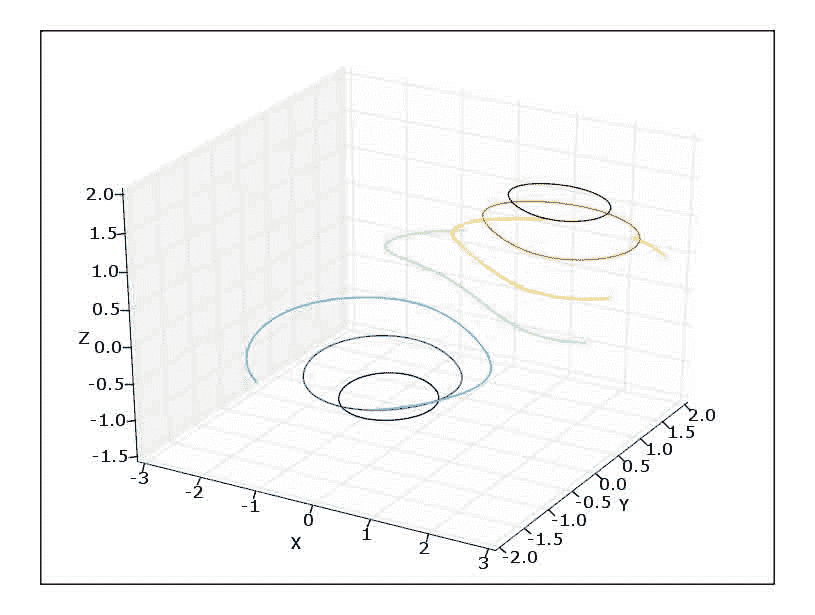
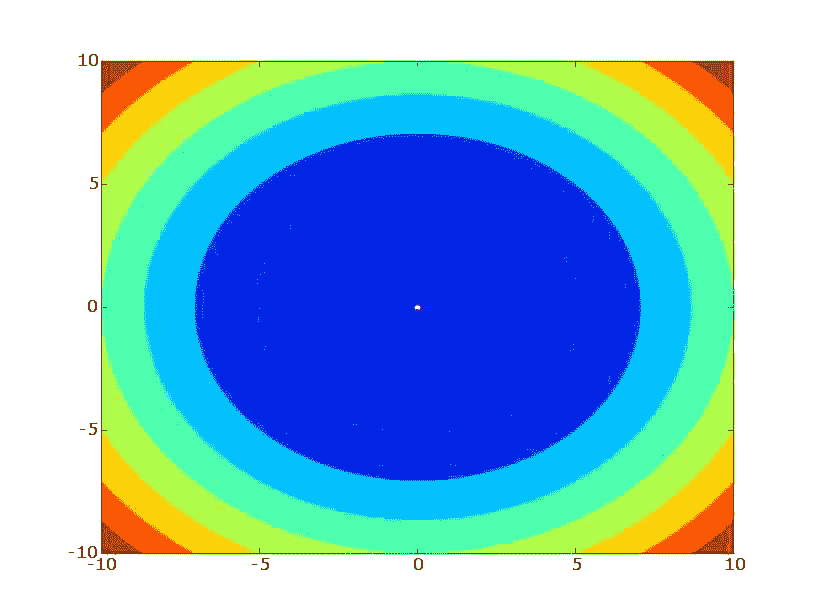
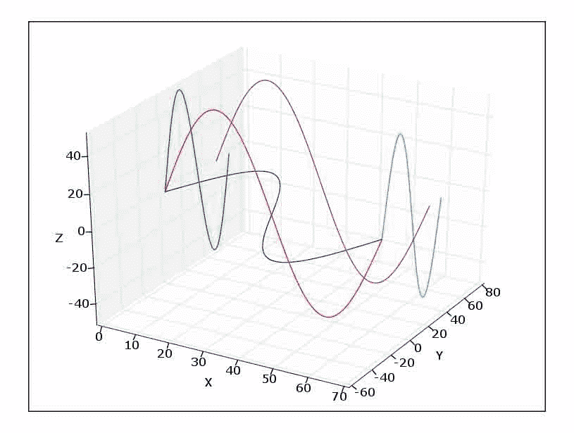

# 四、Matplotlib / 3D 绘图

*   [Matplotlib VTK 集成](Matplotlib_VTK_Integration.html)
*   [Matplotlib: mplot3d](Matplotlib_mplot3D.html)

# Matplotlib VTK 集成

# Matplotlib VTK 集成

万一你想把 matplotlib 图合并到你的 vtk 应用中，vtk 提供了一个非常简单的方法来导入它们。

下面是一个完整的例子:

```py
from vtk import *

import matplotlib
matplotlib.use('Agg')
from matplotlib.figure import Figure
from matplotlib.backends.backend_agg import FigureCanvasAgg
import pylab as p

# The vtkImageImporter will treat a python string as a void pointer
importer = vtkImageImport()
importer.SetDataScalarTypeToUnsignedChar()
importer.SetNumberOfScalarComponents(4)

# It's upside-down when loaded, so add a flip filter
imflip = vtkImageFlip()
imflip.SetInput(importer.GetOutput())
imflip.SetFilteredAxis(1)

# Map the plot as a texture on a cube
cube = vtkCubeSource()

cubeMapper = vtkPolyDataMapper()
cubeMapper.SetInput(cube.GetOutput())

cubeActor = vtkActor()
cubeActor.SetMapper(cubeMapper)

# Create a texture based off of the image
cubeTexture = vtkTexture()
cubeTexture.InterpolateOn()
cubeTexture.SetInput(imflip.GetOutput())
cubeActor.SetTexture(cubeTexture)

ren = vtkRenderer()
ren.AddActor(cubeActor)

renWin = vtkRenderWindow()
renWin.AddRenderer(ren)

iren = vtkRenderWindowInteractor()
iren.SetRenderWindow(renWin)

# Now create our plot
fig = Figure()
canvas = FigureCanvasAgg(fig)
ax = fig.add_subplot(111)
ax.grid(True)
ax.set_xlabel('Hello from VTK!', size=16)
ax.bar(xrange(10), p.rand(10))

# Powers of 2 image to be clean
w,h = 1024, 1024
dpi = canvas.figure.get_dpi()
fig.set_figsize_inches(w / dpi, h / dpi)
canvas.draw() # force a draw

# This is where we tell the image importer about the mpl image
extent = (0, w - 1, 0, h - 1, 0, 0)
importer.SetWholeExtent(extent)
importer.SetDataExtent(extent)
importer.SetImportVoidPointer(canvas.buffer_rgba(0,0), 1)
importer.Update()

iren.Initialize()
iren.Start() 
```

让情节成为一个广告牌:

```py
bbmap = vtkImageMapper()
bbmap.SetColorWindow(255.5)
bbmap.SetColorLevel(127.5)
bbmap.SetInput(imflip.GetOutput())

bbact = vtkActor2D()
bbact.SetMapper(hmap) 
```

## 评论

```py
From zunzun Fri Aug 19 07:06:44 -0500 2005
From: zunzun
Date: Fri, 19 Aug 2005 07:06:44 -0500
Subject:
Message-ID: <20050819070644-0500@www.scipy.org>

from http://sourceforge.net/mailarchive/forum.php?thread_id=7884469&forum_id=33405

If pylab is imported before vtk, everything works fine:

import pylab, vtkpython
pylab.ylabel("Frequency\n", multialignment="center", rotation=90)
n, bins, patches = pylab.hist([1,1,1,2,2,3,4,5,5,5,8,8,8,8], 5)
pylab.show()

If however vtk is imported first:

import vtkpython, pylab
pylab.ylabel("Frequency\n", multialignment="center", rotation=90)
n, bins, patches = pylab.hist([1,1,1,2,2,3,4,5,5,5,8,8,8,8], 5)
pylab.show()

then the Y axis label is positioned incorrectly on the plots. 
```

```py
From earthman Tue Oct 25 15:21:14 -0500 2005
From: earthman
Date: Tue, 25 Oct 2005 15:21:14 -0500
Subject:
Message-ID: <20051025152114-0500@www.scipy.org>

The reason for this is that vtk comes with it's own freetype library, and this is the one being used if vtk is loaded first. Worse symptoms could be errors about fonts not being found. This is typically solved by importing vtk after other packages which might use freetype (pylab, wxPython, etc). 
```

```py
From mroublic Tue Jan 10 11:26:45 -0600 2006
From: mroublic
Date: Tue, 10 Jan 2006 11:26:45 -0600
Subject: One more change I had to make
Message-ID: <20060110112645-0600@www.scipy.org>
In-reply-to: <20050819070644-0500@www.scipy.org>

When I first tried this, I had the error:

Traceback (most recent call last):
  File "MatplotlibToVTK.py", line 61, in ?
    importer.SetImportVoidPointer(canvas.buffer_rgba(), 1)
TypeError: buffer_rgba() takes exactly 3 arguments (1 given)

I had to add 0,0 to the import line:
 importer.SetImportVoidPointer(canvas.buffer_rgba(0,0), 1)

I'm using VTK from CVS using the 5_0 Branch from around November 2005 
```

上面的代码没有在我的系统上运行。我不得不把下面的行:fig.set_figsize_inches(w / dpi，h / dpi)改成:fig . set _ fig size _ inches(1.0 _ w/dpi，1.0_h / dpi)

# matplot lib:3d mplot

# matplot lib:3d mplot

下面的例子显示了使用 matplotlib 的简单 3D 绘图。matplotlib 的 3D 功能是通过合并约翰·波特的 mplot3d 模块而增加的，因此不再需要额外的下载，以下示例将与最新的 matplotlib 安装一起运行。''注意，matplotlib-0.98 分支不支持此代码，但是如果您需要此功能，可以使用最新的 0.99 版本或 0.91 维护版本。'或者，Mayavi2 项目提供了一个类似 pylab 的 API，用于广泛的 3D 绘图:[http://code . entnought . com/projects/mayavi/docs/development/html/mayavi/mlab . html](http://code.enthought.com/projects/mayavi/docs/development/html/mayavi/mlab.html)

请注意，并非本页上的所有示例都是最新的，因此其中一些可能无法正常工作。其他例子见[http://matplotlib.sourceforge.net/examples/mplot3d/](http://matplotlib.sourceforge.net/examples/mplot3d/)

三维绘图示例:

```py
#!python
from numpy import *
import pylab as p
#import matplotlib.axes3d as p3
import mpl_toolkits.mplot3d.axes3d as p3

# u and v are parametric variables.
# u is an array from 0 to 2*pi, with 100 elements
u=r_[0:2*pi:100j]
# v is an array from 0 to 2*pi, with 100 elements
v=r_[0:pi:100j]
# x, y, and z are the coordinates of the points for plotting
# each is arranged in a 100x100 array
x=10*outer(cos(u),sin(v))
y=10*outer(sin(u),sin(v))
z=10*outer(ones(size(u)),cos(v)) 
```

线框(适用于 0.87.5):

```py
#!python
fig=p.figure()
ax = p3.Axes3D(fig)
ax.plot_wireframe(x,y,z)
ax.set_xlabel('X')
ax.set_ylabel('Y')
ax.set_zlabel('Z')
p.show() 
```


3D 绘图：

```py
#!python
# this connects each of the points with lines
fig=p.figure()
ax = p3.Axes3D(fig)
# plot3D requires a 1D array for x, y, and z
# ravel() converts the 100x100 array into a 1x10000 array
ax.plot3D(ravel(x),ravel(y),ravel(z))
ax.set_xlabel('X')
ax.set_ylabel('Y')
ax.set_zlabel('Z')
fig.add_axes(ax)
p.show() 
```


散布(工作于 0.87.5，显示一些假象):

```py
#!python
fig=p.figure()
ax = p3.Axes3D(fig)
# scatter3D requires a 1D array for x, y, and z
# ravel() converts the 100x100 array into a 1x10000 array
ax.scatter3D(ravel(x),ravel(y),ravel(z))
ax.set_xlabel('X')
ax.set_ylabel('Y')
ax.set_zlabel('Z')
p.show() 
```


表面(在 0.87.5 上工作):

```py
#!python
fig=p.figure()
ax = p3.Axes3D(fig)
# x, y, and z are 100x100 arrays
ax.plot_surface(x,y,z)
ax.set_xlabel('X')
ax.set_ylabel('Y')
ax.set_zlabel('Z')
p.show() 
```


Contour3D(适用于 0.87.5):

```py
#!python
delta = 0.025
x = arange(-3.0, 3.0, delta)
y = arange(-2.0, 2.0, delta)
X, Y = p.meshgrid(x, y)
Z1 = p.bivariate_normal(X, Y, 1.0, 1.0, 0.0, 0.0)
Z2 = p.bivariate_normal(X, Y, 1.5, 0.5, 1, 1)
# difference of Gaussians
Z = 10.0 * (Z2 - Z1)
fig=p.figure()
ax = p3.Axes3D(fig)
ax.contour3D(X,Y,Z)
ax.set_xlabel('X')
ax.set_ylabel('Y')
ax.set_zlabel('Z')
p.show() 
```


三维轮廓:

```py
#!python
# in mplt3D change:
# levels, colls = self.contourf(X, Y, Z, 20)
# to:
# C = self.contourf(X, Y, Z, *args, **kwargs)
# levels, colls = (C.levels, C.collections)
fig=p.figure()
ax = p3.Axes3D(fig)
ax.contourf3D(X,Y,Z)
ax.set_xlabel('X')
ax.set_ylabel('Y')
ax.set_zlabel('Z')
fig.add_axes(ax)
p.show() 
```


2D 等高线图(工作范围为 0.87.5):

```py
#!python
x=r_[-10:10:100j]
y=r_[-10:10:100j]
z= add.outer(x*x, y*y)
### Contour plot of z = x**2 + y**2
p.contour(x,y,z)
### ContourF plot of z = x**2 + y**2
p.figure()
p.contourf(x,y,z)
p.show() 
```

 

有关 3d 绘图功能的其他一些示例，请运行以下命令。有关更多信息，请参见 matplotlib/axes3d.py 的源代码:

```py
#!python
# note that for the following to work you have to modify the test funcitons in your site-packages/matplotlib/axes3d.py like this:
#def test_xxxx():
#    import pylab
#    ax = Axes3D(pylab.figure())
#    ....
#    ....
#    pylab.show()
# the following then work on 0.87.5
p3.test_bar2D()
p3.test_contour()
p3.test_scatter()
p3.test_scatter2D()
p3.test_surface()
# the following fail on 0.87.5
p3.test_plot()
p3.test_polys()
p3.test_wir 
```

## 附件

*   [`contour.jpg`](../_downloads/contour.jpg)
*   [`contour.png`](../_downloads/contour.jpg)
*   [`contour3D.jpg`](../_downloads/contour3D.jpg)
*   [`contour3D.png`](../_downloads/contour3D.jpg)
*   [`contourf.jpg`](../_downloads/contourf.jpg)
*   [`contourf.png`](../_downloads/contourf.jpg)
*   [`contourf3D.jpg`](../_downloads/contourf3D.jpg)
*   [`contourf3D.png`](../_downloads/contourf3D.jpg)
*   [`plot.jpg`](../_downloads/plot.jpg)
*   [`plot.png`](../_downloads/plot.jpg)
*   [`scatter.jpg`](../_downloads/scatter.jpg)
*   [`scatter.png`](../_downloads/scatter.jpg)
*   [`surface.jpg`](../_downloads/surface.jpg)
*   [`surface.png`](../_downloads/surface.jpg)
*   [`test1.jpg`](../_downloads/test1.jpg)
*   [`test1.png`](../_downloads/test1.jpg)
*   [`test2.jpg`](../_downloads/test2.jpg)
*   [`test2.png`](../_downloads/test2.jpg)
*   [`test3.jpg`](../_downloads/test3.jpg)
*   [`test3.png`](../_downloads/test3.jpg)
*   [`wireframe.jpg`](../_downloads/wireframe.jpg)
*   [`wireframe.png`](../_downloads/wireframe.jpg)

