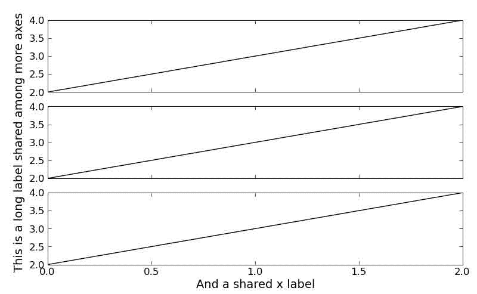
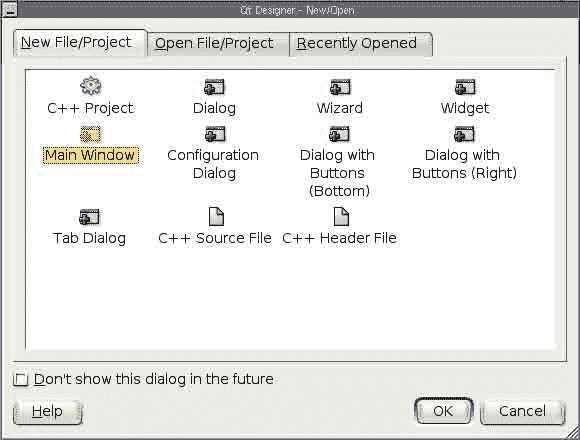
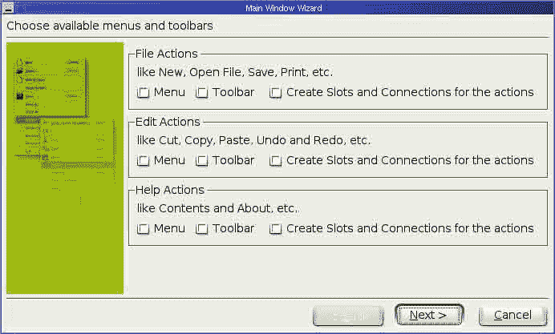
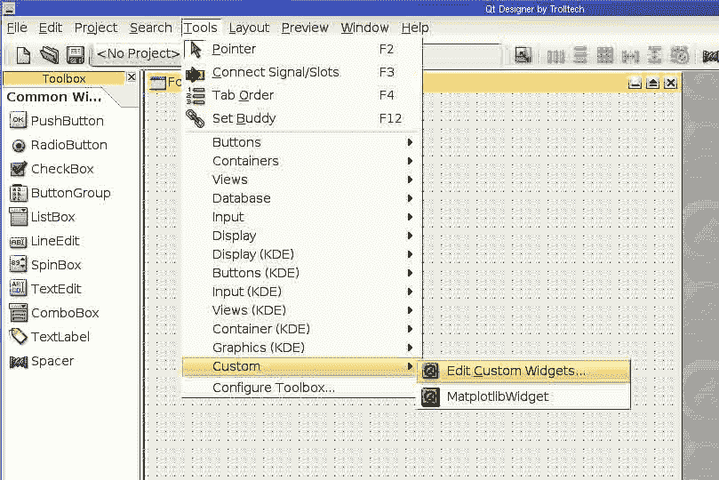
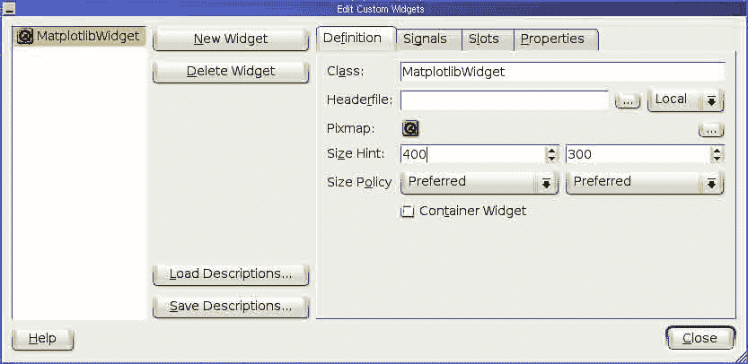
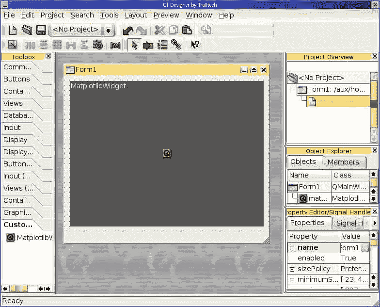
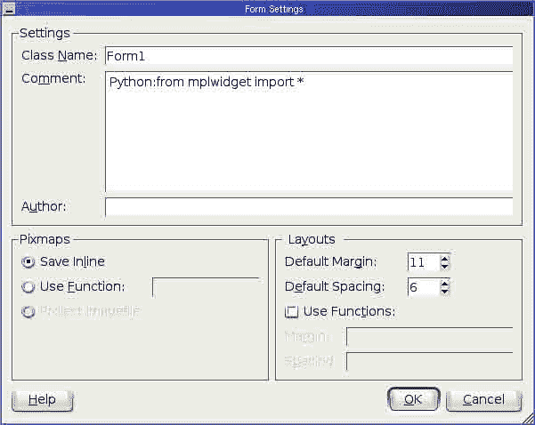
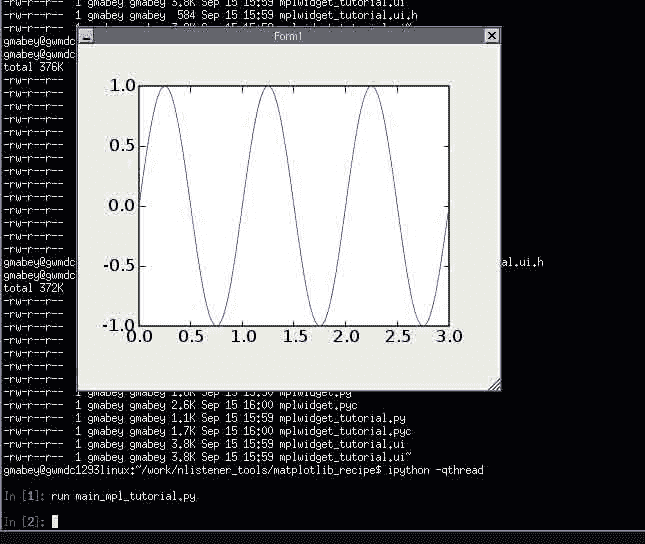
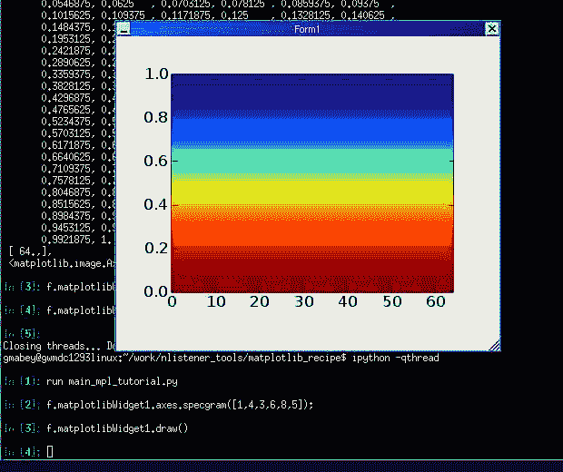

# 六、Matplotlib / 杂项

*   [加载图像](Matplotlib_LoadImage.html)
*   [Matplotlib:调整图像尺寸](Matplotlib_AdjustingImageSize.html)
*   [Matplotlib:编译 solaris10 上的 matplotlib](Matplotlib_CompilingMatPlotLibOnSolaris10.html)
*   [Matplotlib:删除已有数据系列](Matplotlib_DeletingAnExistingDataSeries.html)
*   [Matplotlib: django](Matplotlib_Django.html)
*   [Matplotlib:交互绘图](Matplotlib_Interactive_Plotting.html)
*   [缩放时处理点击事件](Matplotlib_Interactive_Plotting.html#handling-click-events-while-zoomed)
*   [Matplotlib: matplotlib 和 zope](Matplotlib_Matplotlib_and_Zope.html)
*   [Matplotlib:多个子剧情，一个轴标签](Matplotlib_Multiple_Subplots_with_One_Axis_Label.html)
*   [Matplotlib:带 ipython 和设计师的 Qt](Matplotlib_Qt_with_IPython_and_Designer.html)
*   [Matplotlib:在 CGI 脚本中使用 Matplotlib](Matplotlib_Using_MatPlotLib_in_a_CGI_script.html)

# 负载图像

# 负载图像

图像处理通常对存储为 PNG 文件的灰度图像起作用。我们如何将该文件导入/导出到{{{python}}}？

*   下面是使用{{{imread}}}函数对 Matplotlib 执行此操作的副本(您的图像称为{{{lena.png}}})。

```py
 from pylab import imread, imshow, gray, mean
a = imread('lena.png')
 # generates a RGB image, so do
aa=mean(a,2) # to get a 2-D array
imshow(aa)
gray() 
```

这允许为进一步导出进行一些处理，例如[:Cookbook/Matplotlib/converting _ a _ matrix _ to _ a _ raster _ image:将矩阵转换为光栅图像]。在最新版本的 pylab 中(检查您的{{{pylab.matplotlib. **版本** }}}优于{{{'0.98.0'}}})，如果图像是灰度的，您将直接获得一个 2D numpy 数组。

*   若要写入图像，请执行以下操作:导入图像模式= 'L' size= (256，256) imNew=Image.new(模式，大小)mat = numpy.random.uniform(大小=大小)data = numpy . ravel(mat)data = numpy . floor(数据* 256)

imNew.putdata（date） imNew.save（"rand.png"）

*   这类函数也存在于{{{scipy.misc}}}下，例如参见{{{scipy.misc.imsave}}}创建彩色图像:从 scipy . misc import imsave import numpy a = numpy . zeros((4，4，3)) a[0，0，] = [128，0，255]imsave(' gray background _ with _ a _ greish _ blue _ square _ on _ top . png '，a)
*   要定义范围，请使用:从 scipy.misc import 到 image import numpy a = numpy . random . rand(25，50)# 0 之间。和 1。toimage(a，cmin=0。，cmax=2。).保存(' low_contrast_snow.png ')(改编自[http://telin.ugent.be/~slippens/drupal/scipy_unscaledimsave](http://telin.ugent.be/~slippens/drupal/scipy_unscaledimsave)
*   http://jehiah.cz/archive/creating-images-with-numpy 提出了另一种(更直接的)方法

# Matplotlib:调整图像大小

# Matplotlib:调整图像大小

这是一个小的演示文件，帮助教授如何调整 matplotlib 的图形大小

## 首先简单介绍一下

### 有三个参数定义图像大小(这不是 MPL 特定的):

`* Size in length units (inches, cm, pt, etc): e.g. 5"x7"``* Size in pixels: e.g. 800x600 pixels``* Dots per inch (dpi) e.g. 100 dpi`

`Only two of these are independent, so if you define two of them, the third can be calculated from the others.`

当在计算机屏幕上显示(或保存为 PNG)时，长度单位的大小无关紧要，只是显示像素。当打印或保存到 PS、EPS 或 PDF(都设计为支持打印)时，将使用大小或 dpi 来确定如何缩放图像。

### 现在我开始研究 MPL 是如何工作的

`. 1) The size of a figure is defined in length units (inches), and can be set by``. 2) The layout of the figure is defined in 'figure units' so that as the figure size is changed, the layout (eg axes positions) will update.``. 3) Size of text, width of lines, etc is defined in terms of length units (points?).``. 4) When displaying to the screen, or creating an image (PNG) the pixel size of text and line widths, etc is determined by the dpi setting, which is set by`

`The trick here is that when printing, it's natural to think in terms of inches, but when creating an image (for a web page, for instance), it is natural to think in terms of pixel size. However, as of 0.84, pixel size can only be set directly in the GTK* back-ends, with the canvas.resize(w,h) method. (remember that you can only set two of the three size parameters, the third must be calculated from the other two).`

## 另一个技巧

Figure.savefig()覆盖了图中的 dpi 设置，并使用默认值(在我的系统上至少是 100 dpi)。如果要覆盖它，可以在 savefig 调用中指定“dpi ”:

下面的代码有望使这一点变得更加清楚，至少对于为网页等生成 png 来说是如此。

[`MPL_size_test.py`](../_downloads/MPL_size_test.py)

```py
#!python

"""
This is a small demo file that helps teach how to adjust figure sizes
for matplotlib

"""

import matplotlib
print "using MPL version:", matplotlib.__version__
matplotlib.use("WXAgg") # do this before pylab so you don'tget the default back end.

import pylab
import matplotlib.numerix as N

# Generate and plot some simple data:
x = N.arange(0, 2*N.pi, 0.1)
y = N.sin(x)

pylab.plot(x,y)
F = pylab.gcf()

# Now check everything with the defaults:
DPI = F.get_dpi()
print "DPI:", DPI
DefaultSize = F.get_size_inches()
print "Default size in Inches", DefaultSize
print "Which should result in a %i x %i Image"%(DPI*DefaultSize[0], DPI*DefaultSize[1])
# the default is 100dpi for savefig:
F.savefig("test1.jpg")
# this gives me a 797 x 566 pixel image, which is about 100 DPI

# Now make the image twice as big, while keeping the fonts and all the
# same size
F.set_figsize_inches( (DefaultSize[0]*2, DefaultSize[1]*2) )
Size = F.get_size_inches()
print "Size in Inches", Size
F.savefig("test2.jpg")
# this results in a 1595x1132 image

# Now make the image twice as big, making all the fonts and lines
# bigger too.

F.set_figsize_inches( DefaultSize )# resetthe size
Size = F.get_size_inches()
print "Size in Inches", Size
F.savefig("test3.jpg", dpi = (200)) # change the dpi
# this also results in a 1595x1132 image, but the fonts are larger. 
```

## 在一个图形中放置多个图像

假设您有两个图像:100x100 和 100x50，您希望在图形中显示这两个图像，它们之间有 20 个像素的缓冲区(相对于图像像素)，四周有 10 个像素的边框。

这个解决方案并不是特别面向对象，但至少它触及到了实际的细节。

```py
#!python
def _calcsize(matrix1, matrix2, top=10, left=10, right=10, bottom=10, buffer=20, height=4, scale = 1.):
   size1 = array(matrix1.shape) * scale
   size2 = array(matrix2.shape) * scale
   _width = float(size1[1] + size2[1] + left + right + buffer)
   _height = float(max(size1[0], size2[0]) + top + bottom)
   x1 = left / _width
   y1 = bottom / _height
   dx1 = size1[1] / _width
   dy1 = size1[0] / _height
   size1 = (x1, y1, dx1, dy1)
   x2 = (size1[1] + left + buffer) / _width
   y2 = bottom / _height
   dx2 = size2[1] / _width
   dy2 = size2[0] / _height
   size2 = (x2, y2, dx2, dy2)
   figure = pylab.figure(figsize=(_width * height / _height, height))
   axis1 = apply(pylab.axes, size1)
   pylab.imshow(X1, aspect='preserve')
   axis2 = apply(pylab.axes, size2)
   pylab.imshow(X2, aspect='preserve')
   return axes1, axes2, figure 
```

## 附件

*   [`MPL_size_test.py`](../_downloads/MPL_size_test.py)

# Matplotlib:编译 solaris10 上的 matplotlib

# Matplotlib:编译 solaris10 上的 matplotlib

[如何在 solaris 10](http://blogs.sun.com/migi/entry/opensolaris_howto_install_sun_studio) 上安装 sunstudio 和[构建 matplotlib 可能会给出一些提示。](http://blogs.sun.com/yongsun/entry/build_matplotlib_0_98_3)

JDH 说:

> 嗨，埃里克——如果你成功了，那么我们将有令人信服的证据证明在 solaris 上编译 mpl 比放弃调味汁更容易。

嗯，事实证明，这比放弃调味汁(至少对我来说)容易，但只是微乎其微。最后，修复非常简单(如果您考虑重新编译 python 并手动调整自动生成的 pyconfig.h，无论如何都非常简单)。经过整整两天的评论，从周日开始以 76 种不同的方式重新编译所有东西和它的母亲，仔细研究了一大群 Solaris sys，屠宰了几只洁白的羔羊和一只纯黑色的绵羊，将骨头、肌腱和内脏包裹在双层脂肪中，并将祭品焚烧给德尔菲阿波罗，我找到了答案:

1 下载 Python 2.4.2

2 提取后运行。/configure，编辑生成的 pyconfig.h，如下所示:

```py
i) if _XOPEN_SOURCE is defined to be 600 (i.e., if the line "#define _XOPEN_SOURCE 600" appears in the file), redefine it to 500

ii) if _XOPEN_SOURCE_EXTENDED is defined at all (i.e. if the line "#define _XOPEN_SOURCE_EXTENDED 1" appears in the file), comment out its definition 
```

3 制作和制作安装

问题在于 Solaris 对 X/Open 标准的支持。长话短说，当且仅当您使用 ISO C99 编译器时，您可以使用开放组技术标准，第 6 期(xpg 6/UNIX 03/SUSv3)(_ XOPEN _ SOURCE = = 600)。如果使用 X/Open CAE 规范，第 5 期(xpg 5/UNIX 98/sus v2)(_ XOPEN _ SOURCE = = 500)，就不用使用 ISO C99 编译器了。有关完整的详细信息，请参见 Solaris 头文件/usr/include/sys/feature _ tests . h。

这就是为什么 muhpubuh(又名 matplotlib——长话短说)在 Solaris 10 上编译的原因，如果你有足够的钱并且能够负担得起孙的 OpenStudio 10 编译器的话。gcc 还没有完全的 C99 支持。特别是，它缺乏对宽字符库的支持，使得构建失败。(例如，参见[http://gcc.gnu.org/c99status.html](http://gcc.gnu.org/c99status.html)。)

关于 Python.h 和 Solaris 的 wchar 问题的更多有用链接:

*   [http://lists . stemp . de/pipermail/rxvt-unicode/2005 Q2/000092 . html](http://lists.schmorp.de/pipermail/rxvt-unicode/2005q2/000092.html)
*   [http://bugs.opensolaris.org/bugdatabase/view_bug.do?bug_id=6395191](http://bugs.opensolaris.org/bugdatabase/view_bug.do?bug_id=6395191)
*   [http://mail . python . org/piper mail/patches/2005-06/017820 . html](http://mail.python.org/pipermail/patches/2005-June/017820.html)
*   [http://mail . python . org/piper mail/python-bugs-list/2005-11/030900 . html](http://mail.python.org/pipermail/python-bugs-list/2005-November/030900.html)

# Matplotlib:删除现有数据系列

# Matplotlib:删除现有数据系列

每个轴实例都包含一个 lines 属性，它是图中数据系列的列表，按时间顺序添加。要删除特定的数据系列，只需删除行列表中适当的元素，并在必要时重新绘制。

互动会话的以下示例说明了:

```py
>>> x = N.arange(10)

>>> fig = P.figure()
>>> ax = fig.add_subplot(111)
>>> ax.plot(x)
[<matplotlib.lines.Line2D instance at 0x427ce7ec>]

>>> ax.plot(x+10)
[<matplotlib.lines.Line2D instance at 0x427ce88c>]

>>> ax.plot(x+20)
[<matplotlib.lines.Line2D instance at 0x427ce9ac>]

>>> P.show()
>>> ax.lines
[<matplotlib.lines.Line2D instance at 0x427ce7ec>,
 <matplotlib.lines.Line2D instance at 0x427ce88c>,
 <matplotlib.lines.Line2D instance at 0x427ce9ac>]

>>> del ax.lines[1]
>>> P.show() 
```

它将绘制三行，然后删除第二行。

# Matplotlib:决哥

# Matplotlib:决哥

## 使用 MatPlotLib 在 Django 网络服务中动态生成图表

您需要有一个工作的 Django 安装，加上 matplotlib。

### 示例 1 - PIL 缓冲区

```py
# file charts.py
def simple(request):
    import random
    import django
    import datetime

    from matplotlib.backends.backend_agg import FigureCanvasAgg as FigureCanvas
    from matplotlib.figure import Figure
    from matplotlib.dates import DateFormatter

    fig=Figure()
    ax=fig.add_subplot(111)
    x=[]
    y=[]
    now=datetime.datetime.now()
    delta=datetime.timedelta(days=1)
    for i in range(10):
        x.append(now)
        now+=delta
        y.append(random.randint(0, 1000))
    ax.plot_date(x, y, '-')
    ax.xaxis.set_major_formatter(DateFormatter('%Y-%m-%d'))
    fig.autofmt_xdate()
    canvas=FigureCanvas(fig)
    response=django.http.HttpResponse(content_type='image/png')
    canvas.print_png(response)
    return response 
```

因为某些版本的 Internet Explorer 忽略了内容类型。网址应以“.”结尾。巴布亚新几内亚”。您可以在 urls.py 中创建一个条目，如下所示:

```py
...
(r'^charts/simple.png$', 'myapp.views.charts.simple'),
... 
```

# Matplotlib:交互式绘图

# Matplotlib:交互式绘图

## 交互式点识别

我发现仅仅通过点击就能识别一个图中的点是非常有用的。这个秘籍提供了一个相当简单的[函子](http://en.wikipedia.org/wiki/Function_object)，可以连接到任何一个地块。我把它用于散点图和标准图。

因为通常情况下，数据集的多个视图分布在多个图形上，或者至少分布在多个轴上，所以我还提供了一个工具来将这些图链接在一起，这样单击一个图中的某个点将突出显示并识别所有其他链接图上的该数据点。

```py
import math

import matplotlib.pyplot as plt

class AnnoteFinder(object):
    """callback for matplotlib to display an annotation when points are
 clicked on.  The point which is closest to the click and within
 xtol and ytol is identified.

 Register this function like this:

 scatter(xdata, ydata)
 af = AnnoteFinder(xdata, ydata, annotes)
 connect('button_press_event', af)
 """

    def __init__(self, xdata, ydata, annotes, ax=None, xtol=None, ytol=None):
        self.data = list(zip(xdata, ydata, annotes))
        if xtol is None:
            xtol = ((max(xdata) - min(xdata))/float(len(xdata)))/2
        if ytol is None:
            ytol = ((max(ydata) - min(ydata))/float(len(ydata)))/2
        self.xtol = xtol
        self.ytol = ytol
        if ax is None:
            self.ax = plt.gca()
        else:
            self.ax = ax
        self.drawnAnnotations = {}
        self.links = []

    def distance(self, x1, x2, y1, y2):
        """
 return the distance between two points
 """
        return(math.sqrt((x1 - x2)**2 + (y1 - y2)**2))

    def __call__(self, event):

        if event.inaxes:

            clickX = event.xdata
            clickY = event.ydata
            if (self.ax is None) or (self.ax is event.inaxes):
                annotes = []
                # print(event.xdata, event.ydata)
                for x, y, a in self.data:
                    # print(x, y, a)
                    if ((clickX-self.xtol < x < clickX+self.xtol) and
                            (clickY-self.ytol < y < clickY+self.ytol)):
                        annotes.append(
                            (self.distance(x, clickX, y, clickY), x, y, a))
                if annotes:
                    annotes.sort()
                    distance, x, y, annote = annotes[0]
                    self.drawAnnote(event.inaxes, x, y, annote)
                    for l in self.links:
                        l.drawSpecificAnnote(annote)

    def drawAnnote(self, ax, x, y, annote):
        """
 Draw the annotation on the plot
 """
        if (x, y) in self.drawnAnnotations:
            markers = self.drawnAnnotations[(x, y)]
            for m in markers:
                m.set_visible(not m.get_visible())
            self.ax.figure.canvas.draw_idle()
        else:
            t = ax.text(x, y, " - %s" % (annote),)
            m = ax.scatter([x], [y], marker='d', c='r', zorder=100)
            self.drawnAnnotations[(x, y)] = (t, m)
            self.ax.figure.canvas.draw_idle()

    def drawSpecificAnnote(self, annote):
        annotesToDraw = [(x, y, a) for x, y, a in self.data if a == annote]
        for x, y, a in annotesToDraw:
            self.drawAnnote(self.ax, x, y, a) 
```

要使用这个函子，您可以简单地做如下事情:

```py
x = range(10)
y = range(10)
annotes = ['a', 'b', 'c', 'd', 'e', 'f', 'g', 'h', 'i', 'j']

fig, ax = plt.subplots()
ax.scatter(x,y)
af =  AnnoteFinder(x,y, annotes, ax=ax)
fig.canvas.mpl_connect('button_press_event', af)
plt.show() 
```

这是相当有用的，但有时您会有一个数据集的多个视图，单击并识别一个图中的点并在另一个图中找到它是很有用的。下面的代码演示了这种联系，应该在多个轴或图形之间工作。

```py
def linkAnnotationFinders(afs):
  for i in range(len(afs)):
    allButSelfAfs = afs[:i]+afs[i+1:]
    afs[i].links.extend(allButSelfAfs)

subplot(121)
scatter(x,y)
af1 = AnnoteFinder(x,y, annotes)
connect('button_press_event', af1)

subplot(122)
scatter(x,y)
af2 = AnnoteFinder(x,y, annotes)
connect('button_press_event', af2)

linkAnnotationFinders([af1, af2]) 
```

我觉得这相当有用。通过子类化和重新定义 drive 这个简单的框架可以用来驱动更复杂的用户界面。

目前，当数据点的数量变大时，这种实现有点慢。我特别感兴趣的是人们可能提出的让这个过程更快更好的建议。

# Matplotlib: matplotlib 和 zope

# Matplotlib: matplotlib 和 zope

`0\. Prerequisites: You need to have the following installed to successfully run this example: Zope, Matplotlib (on top of Zope's Python), Python Image Library (PIL). And one more thing - probably every body does this right, but just in case - zope instance home directory has to be writable, for following to work.`

`1\. Create a file (e.g. mpl.py) in INSTANCEHOME\Extensions:`

```py
import matplotlib
matplotlib.use('Agg')
from pylab import *
from os import *
from StringIO import StringIO
from PIL import Image as PILImage
from matplotlib.backends.backend_agg import FigureCanvasAgg
def chart(self):
    clf()
    img_dpi=72
    width=400
    height=300
    fig=figure(dpi=img_dpi, figsize=(width/img_dpi, height/img_dpi))
    x=arange(0, 2*pi+0.1, 0.1)
    sine=plot(x, sin(x))
    legend(sine, "y=sin x", "upper right")
    xlabel('x')
    ylabel('y=sin x')
    grid(True)
    canvas = FigureCanvasAgg(fig)
    canvas.draw()
    size = (int(canvas.figure.get_figwidth())*img_dpi, int(canvas.figure.get_figheight())*img_dpi)
    buf=canvas.tostring_rgb()
    im=PILImage.fromstring('RGB', size, buf, 'raw', 'RGB', 0, 1)
    imgdata=StringIO()
    im.save(imgdata, 'PNG')
    self.REQUEST.RESPONSE.setHeader('Pragma', 'no-cache')
    self.REQUEST.RESPONSE.setHeader('Content-Type', 'image/png')
    return imgdata.getvalue() 
```

1.  然后在 ZMI 创建一个外部方法(例如 Id -> mplchart，模块名-> mpl，函数名-> chart)。
2.  单击测试选项卡，您应该会看到正弦图。

# Matplotlib:具有一个轴标签的多个子图

# Matplotlib:具有一个轴标签的多个子图

## 使用单个轴标签来注释多个子图轴

当使用具有相同轴单位的多个子图时，单独标记每个轴是多余的，并且使得图形过于复杂。您可以使用位于绘图框中心的单个轴标签来标记多个子绘图轴。下面是如何做到的:

```py
#!python
# note that this a code fragment...you will have to define your own data to plot
# Set up a whole-figure axes, with invisible axis, ticks, and ticklabels,
# which we use to get the xlabel and ylabel in the right place
bigAxes = pylab.axes(frameon=False)     # hide frame
pylab.xticks([])                        # don't want to see any ticks on this axis
pylab.yticks([])
# I'm using TeX for typesetting the labels--not necessary
pylab.ylabel(r'\textbf{Surface Concentration $(nmol/m^2)$}', size='medium')
pylab.xlabel(r'\textbf{Time (hours)}', size='medium')
# Create subplots and shift them up and to the right to keep tick labels
# from overlapping the axis labels defined above
topSubplot = pylab.subplot(2,1,1)
position = topSubplot.get_position()
position[0] = 0.15
position[1] = position[1] + 0.01
topSubplot.set_position(position)
pylab.errorbar(times150, average150)
bottomSubplot = pylab.subplot(2,1,2)
position = bottomSubplot.get_position()
position[0] = 0.15
position[1] = position[1] + 0.03
bottomSubplot.set_position(position)
pylab.errorbar(times300, average300) 
```

或者，您可以使用下面的代码片段在您的支线剧情中共享 ylabels。另见附图[图输出](%21%5B%5D%28files/attachments/Matplotlib_Multiple_Subplots_with_One_Axis_Label/Same_ylabel_subplots.jpg)。)#

```py
#!python
import pylab

figprops = dict(figsize=(8., 8\. / 1.618), dpi=128)                                          # Figure properties
adjustprops = dict(left=0.1, bottom=0.1, right=0.97, top=0.93, wspace=0.2 hspace=0.2)       # Subplot properties

fig = pylab.figure(**figprops)                                                              # New figure
fig.subplots_adjust(**adjustprops)                                                          # Tunes the subplot layout

ax = fig.add_subplot(3, 1, 1)
bx = fig.add_subplot(3, 1, 2, sharex=ax, sharey=ax)
cx = fig.add_subplot(3, 1, 3, sharex=ax, sharey=ax)

ax.plot([0,1,2], [2,3,4], 'k-')
bx.plot([0,1,2], [2,3,4], 'k-')
cx.plot([0,1,2], [2,3,4], 'k-')

pylab.setp(ax.get_xticklabels(), visible=False)
pylab.setp(bx.get_xticklabels(), visible=False)

bx.set_ylabel('This is a long label shared among more axes', fontsize=14)
cx.set_xlabel('And a shared x label', fontsize=14) 
```

感谢 matplotlib 用户列表中的塞巴斯蒂安·克里格使用了这个技巧。

简单的功能，去掉多余的 XT signs，但保留底部的 XT signs(在 pylab 中工作)。把它和上面的片段结合起来，得到一个没有太多多余的好情节:

```py
#!python
def rem_x():
    '''Removes superfluous x ticks when multiple subplots  share
    their axis works only in pylab mode but can easily be rewritten
    for api use'''
    nr_ax=len(gcf().get_axes())
    count=0
    for z in gcf().get_axes():
        if count == nr_ax-1: break
            setp(z.get_xticklabels(),visible=False)
            count+=1 
```

上面第一个对我不适用。子图命令覆盖大轴。然而，我找到了一个简单得多的解决方案，为两个轴和一个依拉贝尔做一件体面的工作:

yyl=plt.ylabel(r '我希望垂直居中的最长标签')

yyl . set _ position((yyl . get _ position()[0]，1)) #这表示使用底轴的顶部作为参考点。

yyl.set_verticalalignment('中心')

## 附件

*   [`Same_ylabel_subplots.png`](../_downloads/Same_ylabel_subplots.jpg)



# Matplotlib:带有 ipython 和 designer 的 qt

# Matplotlib:带有 ipython 和 designer 的 qt

在 Qt 应用中嵌入 Matplotlib 的示例代码在 [embedding_in_qt.py](http://cvs.sourceforge.net/viewcvs.py/matplotlib/matplotlib/examples/) 中给出。这个方法扩展了与其他强大工具集成的基本公式。特别是，我们将[巨魔科技](http://www.trolltech.com)(Qt 的创建者)制作的图形用户界面创建工具的使用和通过 [IPython](http://ipython.scipy.org) 与正在运行的 Qt 应用交互的能力结合在一起。

[亚历克斯·费多索夫](http://www.cs.usfca.edu/~afedosov/qttut/)发布了使用设计器的基本教程(以及相关的系统要求)。请在继续之前查看它。

然而，出于我们的目的，我们将在 Designer 中创建一个简单得多的设计。

打开设计器，创建一个新的“主窗口”:



当向导出现时，删除它建议生成的所有菜单和工具栏:



现在将自定义小部件添加到您的项目中，如下所示:



为这个新的小部件命名，并将大小设置为 400，300:



现在应该会出现在工具箱中。单击它，然后在已创建的表单中单击。如果您知道“垂直布局(Ctrl+L)”和“调整大小(Ctrl+J)”是什么，也可以在表单上执行这些操作(不选择小部件)。此时，您的工作空间可能如下所示:



现在我们需要输入“导入”设置，如这里指定的:



当然，您还需要包含的文件: [`mplwidget.py`](../_downloads/mplwidget.py) 。

Designer 中所有这些操作的产物是一个. ui 文件。因此，保存我们一直在处理的表单，并将其称为“mplwidget_tutorial.ui”。

造成这种混乱的一个原因是，Designer 会自动递增小部件实例的名称(Form1、Form2、matplotlibWidget1、matplotlibWidget2 等)。)因此，如果这些与我使用的不匹配，您可能需要对您的过程进行一些逻辑调整。

现在，我们使用工具 pyuic(包含在 [PyQt](http://www.riverbankcomputing.co.uk/pyqt/index.php) 中)来转换这个。ui 文件导入到 Python 类中。这很容易通过以下方式实现:

```py
pyuic mplwidget_tutorial.ui > mplwidget_tutorial.py 
```

继续查看 mplwidget_tutorial.py 的内容，并将其与我得到的进行比较。你也可以看看)#看我的 [`mplwidget_tutorial.ui`](../_downloads/mplwidget_tutorial.ui)

现在，将调用写在自己的 [`main_mpl_tutorial.py`](../_downloads/main_mpl_tutorial.py) 文件中很好，该文件非常短:#

```py
from mplwidget_tutorial import *

f = Form1()
f.show() 
```

然后，我们想要启动 ipython 并实例化该窗口。为了在这项工作中取得成功，您需要一堆包(每个包都有最低版本要求)，比如 python2.3-ipython、python2.3-qt3 等等。不过，最重要的是 ipython >= 0.6.13(我认为)。从那个版本开始，有一个超级棒的特性添加了一个调用开关{{{-qthread}}}，它在一个单独的线程中启动一个 QApplication，这样 ipython 提示符仍然可以与之交互。



因此，如果上面的命令对您不起作用，请检查版本。根据您的配置，它也可以作为“python2.3-ipython”调用。

好了，现在最酷的部分来了:互动。



而且，很容易回到设计器，添加一个按钮，重新运行 pyuic，你就有了另一个版本。

## 附件

*   [`designer_edit_custom_widgets.png`](../_downloads/designer_edit_custom_widgets.jpg)
*   [`designer_form_settings_comment.png`](../_downloads/designer_form_settings_comment.jpg)
*   [`designer_full_workspace.png`](../_downloads/designer_full_workspace.jpg)
*   [`designer_new_widget.png`](../_downloads/designer_new_widget.jpg)
*   [`designer_newopen.png`](../_downloads/designer_newopen.jpg)
*   [`designer_wizard.png`](../_downloads/designer_wizard.jpg)
*   [`ipython_interacted.png`](../_downloads/ipython_interacted.jpg)
*   [`ipython_invoked.png`](../_downloads/ipython_invoked.jpg)
*   [`main_mpl_tutorial.py`](../_downloads/main_mpl_tutorial.py)
*   [`mplwidget.py`](../_downloads/mplwidget.py)
*   [`mplwidget_tutorial.py`](../_downloads/mplwidget_tutorial.py)
*   [`mplwidget_tutorial.ui`](../_downloads/mplwidget_tutorial.ui)

       

# Matplotlib:在 CGI 脚本中使用 matplotlib

# Matplotlib:在 CGI 脚本中使用 matplotlib

试图天真地在 python CGI 脚本中使用 matplotlib 很可能会导致以下错误:

```py
...
352, in _get_configdir
raise RuntimeError("'%s' is not a writable dir; you must set
environment variable HOME to be a writable dir "%h)
RuntimeError: '<WebServer DocumentRoot>' is not a writable dir; you must set
environment variable HOME to be a writable dir 
```

Matplotlib 需要环境变量 HOME 指向一个可写目录。实现这一点的一种方法是在运行时从 CGI 脚本中设置这个环境变量(另一种方法是修改文件，但这种方法不可移植)。以下模板可用于使用 matplotlib 创建 png 图像的 cgi:

```py
#!/usr/bin/python
import os,sys
import cgi
import cgitb; cgitb.enable()

# set HOME environment variable to a directory the httpd server can write to
os.environ[ 'HOME' ] = '/tmp/'

import matplotlib
# chose a non-GUI backend
matplotlib.use( 'Agg' )

import pylab

#Deals with inputing data into python from the html form
form = cgi.FieldStorage()

# construct your plot
pylab.plot([1,2,3])

print "Content-Type: image/png\n"

# save the plot as a png and output directly to webserver
pylab.savefig( sys.stdout, format='png' ) 
```

然后可以通过网址访问该图像，如:[http://localhost/showpng . py](http://localhost/showpng.py)

如文件所述，某些后端不允许将输出发送到 sys.stdout。可以用以下内容替换最后一行来解决这个问题:

```py
pylab.savefig( "tempfile.jpg", format='png' )
import shutil
shutil.copyfileobj(open("tempfile.jpg",'rb'), sys.stdout) 
```

(当然，有必要创建和删除适当的临时文件，以便在生产中使用。)