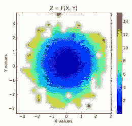
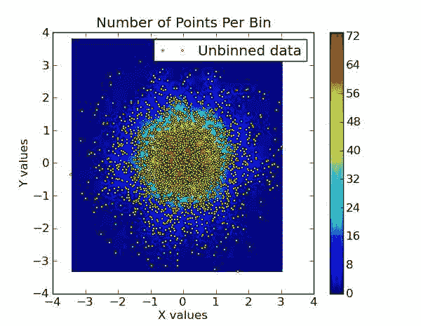

# 七、Matplotlib / 伪彩色打印

*   [matplot lib:color map transformation](Matplotlib_ColormapTransformations.html)
*   [Matplotlib:将矩阵转换为光栅图像](Matplotlib_converting_a_matrix_to_a_raster_image.html)
*   [Matplotlib:网格化不规则间隔的数据](Matplotlib_Gridding_irregularly_spaced_data.html)
*   [Matplotlib:动态加载颜色图](Matplotlib_Loading_a_colormap_dynamically.html)
*   [Matplotlib:用特殊值绘制图像](Matplotlib_Plotting_Images_with_Special_Values.html)
*   [Matplotlib:展示彩色地图](Matplotlib_Show_colormaps.html)

# Matplotlib: colormap 转换

# Matplotlib: colormap 转换

## 对颜色向量进行操作

有没有想过反转颜色图，或者去饱和颜色图？下面是一个将函数应用于颜色映射表的例程:

```py
def cmap_map(function,cmap):
    """ Applies function (which should operate on vectors of shape 3:
 [r, g, b], on colormap cmap. This routine will break any discontinuous     points in a colormap.
 """
    cdict = cmap._segmentdata
    step_dict = {}
    # Firt get the list of points where the segments start or end
    for key in ('red','green','blue'):         step_dict[key] = map(lambda x: x[0], cdict[key])
    step_list = sum(step_dict.values(), [])
    step_list = array(list(set(step_list)))
    # Then compute the LUT, and apply the function to the LUT
    reduced_cmap = lambda step : array(cmap(step)[0:3])
    old_LUT = array(map( reduced_cmap, step_list))
    new_LUT = array(map( function, old_LUT))
    # Now try to make a minimal segment definition of the new LUT
    cdict = {}
    for i,key in enumerate(('red','green','blue')):
        this_cdict = {}
        for j,step in enumerate(step_list):
            if step in step_dict[key]:
                this_cdict[step] = new_LUT[j,i]
            elif new_LUT[j,i]!=old_LUT[j,i]:
                this_cdict[step] = new_LUT[j,i]
        colorvector=  map(lambda x: x + (x[1], ), this_cdict.items())
        colorvector.sort()
        cdict[key] = colorvector

    return matplotlib.colors.LinearSegmentedColormap('colormap',cdict,1024) 
```

让我们试一试:我想要一个喷射彩色地图，但是要轻一些，这样我就可以在上面画出一些东西:

```py
light_jet = cmap_map(lambda x: x/2+0.5, cm.jet)
x,y=mgrid[1:2,1:10:0.1]
imshow(y, cmap=light_jet) 
```

[]文件/附件/matplotlib _ colormap transformation/light _ jet 4 . png

作为比较，这是原始 jet 的样子:[](文件/附件/Matplotlib _ colormaptations/jet . png

## 指数运行

好的，但是如果你想改变颜色图的索引，而不是它的颜色。

```py
def cmap_xmap(function,cmap):
    """ Applies function, on the indices of colormap cmap. Beware, function
    should map the [0, 1] segment to itself, or you are in for surprises.

    See also cmap_xmap.
    """
    cdict = cmap._segmentdata
    function_to_map = lambda x : (function(x[0]), x[1], x[2])
    for key in ('red','green','blue'):         cdict[key] = map(function_to_map, cdict[key])
        cdict[key].sort()
        assert (cdict[key][0]<0 or cdict[key][-1]>1), "Resulting indices extend out of the [0, 1] segment."

    return matplotlib.colors.LinearSegmentedColormap('colormap',cdict,1024) 
```

## 离散色图

以下是如何离散化连续的颜色映射。

```py
def cmap_discretize(cmap, N):
    """Return a discrete colormap from the continuous colormap cmap.

 cmap: colormap instance, eg. cm.jet.
 N: number of colors.

 Example
 x = resize(arange(100), (5,100))
 djet = cmap_discretize(cm.jet, 5)
 imshow(x, cmap=djet)
 """

    if type(cmap) == str:
        cmap = get_cmap(cmap)
    colors_i = concatenate((linspace(0, 1., N), (0.,0.,0.,0.)))
    colors_rgba = cmap(colors_i)
    indices = linspace(0, 1., N+1)
    cdict = {}
    for ki,key in enumerate(('red','green','blue')):
        cdict[key] = [ (indices[i], colors_rgba[i-1,ki], colors_rgba[i,ki]) for i in xrange(N+1) ]
    # Return colormap object.
    return matplotlib.colors.LinearSegmentedColormap(cmap.name + "_%d"%N, cdict, 1024) 
```

举个例子，这就是你通过做{ { { cmap _ discrete ze(cm . jet，6)}}得到的结果。


## 附件

*   [`dicrete_jet1.png`](../_downloads/dicrete_jet1.jpg)
*   [`discrete_jet.png`](../_downloads/discrete_jet.jpg)
*   [`jet.png`](../_downloads/jet.jpg)
*   [`light_jet.png`](../_downloads/light_jet.jpg)
*   [`light_jet2.png`](../_downloads/light_jet2.jpg)
*   [`light_jet3.png`](../_downloads/light_jet3.jpg)
*   [`light_jet4.png`](../_downloads/light_jet4.jpg)

      

# Matplotlib:将矩阵转换为光栅图像

# Matplotlib:将矩阵转换为光栅图像

Scipy 提供了一个命令(imsave)来制作栅格(png，jpg...)来自 2D 数组的图像，每个像素对应于该数组的一个值。然而图像是黑白的。

这里有一个用 Matplotlib 实现这一点的例子，并使用一个颜色映射给图像赋予颜色。

```py
from matplotlib.pyplot import *
from scipy import mgrid

def imsave(filename, X, **kwargs):
    """ Homebrewed imsave to have nice colors... """
    figsize=(array(X.shape)/100.0)[::-1]
    rcParams.update({'figure.figsize':figsize})
    fig = figure(figsize=figsize)
    axes([0,0,1,1]) # Make the plot occupy the whole canvas
    axis('off')
    fig.set_size_inches(figsize)
    imshow(X,origin='lower', **kwargs)
    savefig(filename, facecolor='black', edgecolor='black', dpi=100)
    close(fig)

X,Y=mgrid[-5:5:0.1,-5:5:0.1]
Z=sin(X**2+Y**2+1e-4)/(X**2+Y**2+1e-4) # Create the data to be plotted
imsave('imsave.png', Z, cmap=cm.hot ) 
```

```py
imshow(imread('imsave.png')) 
```

```py
 <matplotlib.image.AxesImage at 0x7f1733edf610> 
```


## 附件

*   [`imsave.jpg`](../_downloads/imsave.jpg)
*   [`imsave.png`](../_downloads/imsave.jpg)

 

# Matplotlib:网格化不规则间距的数据

# Matplotlib:网格化不规则间距的数据

matplotlib 邮件列表中一个常见的问题是“如何绘制不规则间距数据的等高线图？”。答案是，首先你把它插入一个规则的网格。从 0.98.3 版本开始，matplotlib 提供了一个 griddata 函数，其行为类似于 matlab 版本。它对规则网格中不规则间隔的数据执行“自然邻近插值”，然后可以用等高线、imshow 或 pcolor 绘制。

## 例 1

这需要 Scipy 0.9:

```py
import numpy as np
from scipy.interpolate import griddata
import matplotlib.pyplot as plt
import numpy.ma as ma
from numpy.random import uniform, seed
# make up some randomly distributed data
seed(1234)
npts = 200
x = uniform(-2,2,npts)
y = uniform(-2,2,npts)
z = x*np.exp(-x**2-y**2)
# define grid.
xi = np.linspace(-2.1,2.1,100)
yi = np.linspace(-2.1,2.1,100)
# grid the data.
zi = griddata((x, y), z, (xi[None,:], yi[:,None]), method='cubic')
# contour the gridded data, plotting dots at the randomly spaced data points.
CS = plt.contour(xi,yi,zi,15,linewidths=0.5,colors='k')
CS = plt.contourf(xi,yi,zi,15,cmap=plt.cm.jet)
plt.colorbar() # draw colorbar
# plot data points.
plt.scatter(x,y,marker='o',c='b',s=5)
plt.xlim(-2,2)
plt.ylim(-2,2)
plt.title('griddata test (%d points)' % npts)
plt.show() 
```


## 例 2

```py
import numpy as np
from matplotlib.mlab import griddata
import matplotlib.pyplot as plt
import numpy.ma as ma
from numpy.random import uniform
# make up some randomly distributed data
npts = 200
x = uniform(-2,2,npts)
y = uniform(-2,2,npts)
z = x*np.exp(-x**2-y**2)
# define grid.
xi = np.linspace(-2.1,2.1,100)
yi = np.linspace(-2.1,2.1,100)
# grid the data.
zi = griddata(x,y,z,xi,yi)
# contour the gridded data, plotting dots at the randomly spaced data points.
CS = plt.contour(xi,yi,zi,15,linewidths=0.5,colors='k')
CS = plt.contourf(xi,yi,zi,15,cmap=plt.cm.jet)
plt.colorbar() # draw colorbar
# plot data points.
plt.scatter(x,y,marker='o',c='b',s=5)
plt.xlim(-2,2)
plt.ylim(-2,2)
plt.title('griddata test (%d points)' % npts)
plt.show() 
```

默认情况下，griddata 使用 scikits delaunay 包(包含在 matplotlib 中)进行自然邻域插值。不幸的是，delaunay 包是众所周知的失败，为一些近乎病态的情况。如果遇到其中一种情况，可以安装 matplotlib natgrid 工具包。一旦安装完毕，griddata 函数将使用它代替 delaunay 进行插值。natgrid 算法稍微健壮一点，但由于许可问题，不能包含在 matplotlib 中。

scipy 沙盒中的径向基函数模块也可用于插值/平滑 n 维的分散数据。详情见[“秘籍/RadialBasisFunctions”]。

## 例 3

下面的代码展示了一个不太健壮但可能更直观的方法。该函数采用三个 1D 数组，即两个独立的数据数组和一个相关的数据数组，并将它们归入一个 2D 网格。除此之外，代码还返回另外两个网格，一个网格中的每个面元值代表该面元中的点数，另一个网格中的每个面元包含该面元中包含的原始相关数组的索引。如果需要，这些可以进一步用于仓之间的插值。

本质上是奥卡姆剃刀方法对 matplotlib.mlab griddata 函数，因为两者产生相似的结果。

```py
# griddata.py - 2010-07-11 ccampo
import numpy as np

def griddata(x, y, z, binsize=0.01, retbin=True, retloc=True):
    """
 Place unevenly spaced 2D data on a grid by 2D binning (nearest
 neighbor interpolation).

 Parameters
 ----------
 x : ndarray (1D)
 The idependent data x-axis of the grid.
 y : ndarray (1D)
 The idependent data y-axis of the grid.
 z : ndarray (1D)
 The dependent data in the form z = f(x,y).
 binsize : scalar, optional
 The full width and height of each bin on the grid.  If each
 bin is a cube, then this is the x and y dimension.  This is
 the step in both directions, x and y. Defaults to 0.01.
 retbin : boolean, optional
 Function returns `bins` variable (see below for description)
 if set to True.  Defaults to True.
 retloc : boolean, optional
 Function returns `wherebins` variable (see below for description)
 if set to True.  Defaults to True.

 Returns
 -------
 grid : ndarray (2D)
 The evenly gridded data.  The value of each cell is the median
 value of the contents of the bin.
 bins : ndarray (2D)
 A grid the same shape as `grid`, except the value of each cell
 is the number of points in that bin.  Returns only if
 `retbin` is set to True.
 wherebin : list (2D)
 A 2D list the same shape as `grid` and `bins` where each cell
 contains the indicies of `z` which contain the values stored
 in the particular bin.

 Revisions
 ---------
 2010-07-11  ccampo  Initial version
 """
    # get extrema values.
    xmin, xmax = x.min(), x.max()
    ymin, ymax = y.min(), y.max()

    # make coordinate arrays.
    xi      = np.arange(xmin, xmax+binsize, binsize)
    yi      = np.arange(ymin, ymax+binsize, binsize)
    xi, yi = np.meshgrid(xi,yi)

    # make the grid.
    grid           = np.zeros(xi.shape, dtype=x.dtype)
    nrow, ncol = grid.shape
    if retbin: bins = np.copy(grid)

    # create list in same shape as grid to store indices
    if retloc:
        wherebin = np.copy(grid)
        wherebin = wherebin.tolist()

    # fill in the grid.
    for row in range(nrow):
        for col in range(ncol):
            xc = xi[row, col]    # x coordinate.
            yc = yi[row, col]    # y coordinate.

            # find the position that xc and yc correspond to.
            posx = np.abs(x - xc)
            posy = np.abs(y - yc)
            ibin = np.logical_and(posx < binsize/2., posy < binsize/2.)
            ind  = np.where(ibin == True)[0]

            # fill the bin.
            bin = z[ibin]
            if retloc: wherebin[row][col] = ind
            if retbin: bins[row, col] = bin.size
            if bin.size != 0:
                binval         = np.median(bin)
                grid[row, col] = binval
            else:
                grid[row, col] = np.nan   # fill empty bins with nans.

    # return the grid
    if retbin:
        if retloc:
            return grid, bins, wherebin
        else:
            return grid, bins
    else:
        if retloc:
            return grid, wherebin
        else:
            return grid 
```

下面的示例演示了此方法的用法。

```py
import numpy as np
import matplotlib.pyplot as plt
import griddata

npr = np.random
npts = 3000\.                            # the total number of data points.
x = npr.normal(size=npts)            # create some normally distributed dependent data in x.
y = npr.normal(size=npts)            # ... do the same for y.
zorig = x**2 + y**2                      # z is a function of the form z = f(x, y).
noise = npr.normal(scale=1.0, size=npts) # add a good amount of noise
z = zorig + noise                    # z = f(x, y) = x**2 + y**2

# plot some profiles / cross-sections for some visualization.  our
# function is a symmetric, upward opening paraboloid z = x**2 + y**2.
# We expect it to be symmetric about and and y, attain a minimum on
# the origin and display minor Gaussian noise.

plt.ion()   # pyplot interactive mode on

# x vs z cross-section.  notice the noise.
plt.plot(x, z, '.')
plt.title('X vs Z=F(X,Y=constant)')
plt.xlabel('X')
plt.ylabel('Z')

# y vs z cross-section.  notice the noise.
plt.plot(y, z, '.')
plt.title('Y vs Z=F(Y,X=constant)')
plt.xlabel('Y')
plt.ylabel('Z')

# now show the dependent data (x vs y).  we could represent the z data
# as a third axis by either a 3d plot or contour plot, but we need to
# grid it first....
plt.plot(x, y, '.')
plt.title('X vs Y')
plt.xlabel('X')
plt.ylabel('Y')

# enter the gridding.  imagine drawing a symmetrical grid over the
# plot above.  the binsize is the width and height of one of the grid
# cells, or bins in units of x and y.
binsize = 0.3
grid, bins, binloc = griddata.griddata(x, y, z, binsize=binsize)  # see this routine's docstring

# minimum values for colorbar. filter our nans which are in the grid
zmin    = grid[np.where(np.isnan(grid) == False)].min()
zmax    = grid[np.where(np.isnan(grid) == False)].max()

# colorbar stuff
palette = plt.matplotlib.colors.LinearSegmentedColormap('jet3',plt.cm.datad['jet'],2048)
palette.set_under(alpha=0.0)

# plot the results.  first plot is x, y vs z, where z is a filled level plot.
extent = (x.min(), x.max(), y.min(), y.max()) # extent of the plot
plt.subplot(1, 2, 1)
plt.imshow(grid, extent=extent, cmap=palette, origin='lower', vmin=zmin, vmax=zmax, aspect='auto', interpolation='bilinear')
plt.xlabel('X values')
plt.ylabel('Y values')
plt.title('Z = F(X, Y)')
plt.colorbar()

# now show the number of points in each bin.  since the independent data are
# Gaussian distributed, we expect a 2D Gaussian.
plt.subplot(1, 2, 2)
plt.imshow(bins, extent=extent, cmap=palette, origin='lower', vmin=0, vmax=bins.max(), aspect='auto', interpolation='bilinear')
plt.xlabel('X values')
plt.ylabel('Y values')
plt.title('X, Y vs The No. of Pts Per Bin')
plt.colorbar() 
```

入库数据:

叠加在入库数据顶部的原始数据:

## 附件

*   [`bin.png`](../_downloads/bin.jpg)
*   [`bin_small`](../_downloads/bin_small)
*   [`bin_small.png`](../_downloads/bin_small.jpg)
*   [`binned_data.png`](../_downloads/binned_data.jpg)
*   [`griddataexample1.png`](../_downloads/griddataexample1.jpg)
*   [`ppb.png`](../_downloads/ppb.jpg)
*   [`ppb_raw.png`](../_downloads/ppb_raw.jpg)
*   [`raw.png`](../_downloads/raw.jpg)
*   [`raw_small`](../_downloads/raw_small)
*   [`raw_small.png`](../_downloads/raw_small.jpg)
*   [`unbinned_data.png`](../_downloads/unbinned_data.jpg)



# Matplotlib:动态加载颜色图

# Matplotlib:动态加载颜色图

在 matplotlib 邮件列表中的一个[线程](http://thread.gmane.org/gmane.comp.python.matplotlib.general/1536)中，詹姆斯·博伊尔发布了一种从文件中加载彩色地图的方法。这里稍微修改了一下。

**gmtColormap.py**

```py
def gmtColormap(fileName,GMTPath = None):
      import colorsys
      import Numeric
      N = Numeric
      if type(GMTPath) == type(None):
          filePath = "/usr/local/cmaps/"+ fileName+".cpt"
      else:
          filePath = GMTPath+"/"+ fileName +".cpt"
      try:
          f = open(filePath)
      except:
          print "file ",filePath, "not found"
          return None

      lines = f.readlines()
      f.close()

      x = []
      r = []
      g = []
      b = []
      colorModel = "RGB"
      for l in lines:
          ls = l.split()
          if l[0] == "#":
             if ls[-1] == "HSV":
                 colorModel = "HSV"
                 continue
             else:
                 continue
          if ls[0] == "B" or ls[0] == "F" or ls[0] == "N":
             pass
          else:
              x.append(float(ls[0]))
              r.append(float(ls[1]))
              g.append(float(ls[2]))
              b.append(float(ls[3]))
              xtemp = float(ls[4])
              rtemp = float(ls[5])
              gtemp = float(ls[6])
              btemp = float(ls[7])

      x.append(xtemp)
      r.append(rtemp)
      g.append(gtemp)
      b.append(btemp)

      nTable = len(r)
      x = N.array( x , N.Float)
      r = N.array( r , N.Float)
      g = N.array( g , N.Float)
      b = N.array( b , N.Float)
      if colorModel == "HSV":
         for i in range(r.shape[0]):
             rr,gg,bb = colorsys.hsv_to_rgb(r[i]/360.,g[i],b[i])
             r[i] = rr ; g[i] = gg ; b[i] = bb
      if colorModel == "HSV":
         for i in range(r.shape[0]):
             rr,gg,bb = colorsys.hsv_to_rgb(r[i]/360.,g[i],b[i])
             r[i] = rr ; g[i] = gg ; b[i] = bb
      if colorModel == "RGB":
          r = r/255.
          g = g/255.
          b = b/255.
      xNorm = (x - x[0])/(x[-1] - x[0])

      red = []
      blue = []
      green = []
      for i in range(len(x)):
          red.append([xNorm[i],r[i],r[i]])
          green.append([xNorm[i],g[i],g[i]])
          blue.append([xNorm[i],b[i],b[i]])
      colorDict = {"red":red, "green":green, "blue":blue}
      return (colorDict) 
```

# Matplotlib:用特殊值绘制图像

# Matplotlib:用特殊值绘制图像

图像绘图需要数据、颜色图和标准化。一个常见的愿望是以指定的颜色显示缺失的数据或其他值。下面的代码显示了如何做到这一点的示例。

该代码创建了一个新的颜色映射子类和一个范数子类。

初始化需要一个值字典，颜色对。数据已经被认为是标准化的(除了被保留的哨兵)。标记值处的 RGB 值被指定的颜色替换。

除了一个子所有权之外，该类以标准方式规范化数据。接受“忽略”参数。忽略的值需要从规范化中排除，以便它们不会扭曲结果。

我使用了一个不是特别好的算法，明确地对数据进行排序，并使用第一个非标记值来定义最小值和最大值。这可能会有所改善，但对我来说是简单而充分的。数据然后被标准化，包括哨兵。最后，哨兵被替换。

```py
from matplotlib.colors import Colormap, normalize
import matplotlib.numerix as nx
from types import IntType, FloatType, ListType

class SentinelMap(Colormap):
        def __init__(self, cmap, sentinels={}):
                # boilerplate stuff
                self.N = cmap.N
                self.name = 'SentinelMap'
                self.cmap = cmap
                self.sentinels = sentinels
                for rgb in sentinels.values():
                        if len(rgb)!=3:
                                raise ValueError('sentinel color must be RGB')

        def __call__(self, scaledImageData, alpha=1):
                # assumes the data is already normalized (ignoring sentinels)
                # clip to be on the safe side
                rgbaValues = self.cmap(nx.clip(scaledImageData, 0.,1.))

                #replace sentinel data with sentinel colors
                for sentinel,rgb in self.sentinels.items():
                        r,g,b = rgb
                        rgbaValues[:,:,0] =  nx.where(scaledImageData==sentinel, r, rgbaValues[:,:,0])
                        rgbaValues[:,:,1] =  nx.where(scaledImageData==sentinel, g, rgbaValues[:,:,1])
                        rgbaValues[:,:,2] =  nx.where(scaledImageData==sentinel, b, rgbaValues[:,:,2])
                        rgbaValues[:,:,3] =  nx.where(scaledImageData==sentinel, alpha, rgbaValues[:,:,3])

                return rgbaValues

class SentinelNorm(normalize):
        """
 Leave the sentinel unchanged
 """
        def __init__(self, ignore=[], vmin=None, vmax=None):
                self.vmin=vmin
                self.vmax=vmax

                if type(ignore) in [IntType, FloatType]:
                        self.ignore = [ignore]
                else:
                        self.ignore = list(ignore)

        def __call__(self, value):

                vmin = self.vmin
                vmax = self.vmax

                if type(value) in [IntType, FloatType]:
                        vtype = 'scalar'
                        val = array([value])
                else:
                        vtype = 'array'
                        val = nx.asarray(value)

                # if both vmin is None and vmax is None, we'll automatically
                # norm the data to vmin/vmax of the actual data, so the
                # clipping step won't be needed.
                if vmin is None and vmax is None:
                        needs_clipping = False
                else:
                        needs_clipping = True

                if vmin is None or vmax is None:
                        rval = nx.ravel(val)
                        #do this if sentinels (values to ignore in data)
                        if self.ignore:
                                sortValues=nx.sort(rval)
                                if vmin is None:
                                        # find the lowest non-sentinel value
                                        for thisVal in sortValues:
                                                if thisVal not in self.ignore:
                                                        vmin=thisVal #vmin is the lowest non-sentinel value
                                                        break
                                        else:
                                                vmin=0.
                                if vmax is None:
                                        for thisVal in sortValues[::-1]:
                                                if thisVal not in self.ignore:
                                                        vmax=thisVal #vmax is the greatest non-sentinel value
                                                        break
                                        else:
                                                vmax=0.
                        else:
                                if vmin is None: vmin = min(rval)
                                if vmax is None: vmax = max(rval)
                if vmin > vmax:
                        raise ValueError("minvalue must be less than or equal to maxvalue")
                elif vmin==vmax:
                        return 0.*value
                else:
                        if needs_clipping:
                                val = nx.clip(val,vmin, vmax)
                        result = (1.0/(vmax-vmin))*(val-vmin)

                # replace sentinels with original (non-normalized) values
                for thisIgnore in self.ignore:
                        result = nx.where(val==thisIgnore,thisIgnore,result)

                if vtype == 'scalar':
                        result = result[0]
                return result

if __name__=="__main__":
        import pylab
        import matplotlib.colors
        n=100

        # create a random array
        X = nx.mlab.rand(n,n)
        cmBase = pylab.cm.jet

        # plot it array as an image
        pylab.figure(1)
        pylab.imshow(X, cmap=cmBase, interpolation='nearest')

        # define the sentinels
        sentinel1 = -10
        sentinel2 = 10

        # replace some data with sentinels
        X[int(.1*n):int(.2*n), int(.5*n):int(.7*n)]  = sentinel1
        X[int(.6*n):int(.8*n), int(.2*n):int(.3*n)]  = sentinel2

        # define the colormap and norm
        rgb1 = (0.,0.,0.)
        rgb2 = (1.,0.,0.)
        cmap = SentinelMap(cmBase, sentinels={sentinel1:rgb1,sentinel2:rgb2,})
        norm = SentinelNorm(ignore=[sentinel1,sentinel2])

        # plot with the modified colormap and norm
        pylab.figure(2)
        pylab.imshow(X, cmap = cmap, norm=norm, interpolation='nearest')

        pylab.show() 
```

如果前面的代码是从提示符运行的，则会生成两个图像。第一个是随机数据的原始图像。第二个图像是通过将一些块设置为哨兵值，然后以特定颜色绘制哨兵而修改的数据。示例结果如下所示。

## 附件

*   [`sentinel.png`](../_downloads/sentinel.jpg)
*   [`sentinel_pristine.png`](../_downloads/sentinel_pristine.jpg)

 

# Matplotlib:显示颜色贴图

# Matplotlib:显示颜色贴图

显示 Matplotlib 颜色映射

```py
#!python
from pylab import *
from numpy import outer
rc('text', usetex=False)
a=outer(arange(0,1,0.01),ones(10))
figure(figsize=(10,5))
subplots_adjust(top=0.8,bottom=0.05,left=0.01,right=0.99)
maps=[m for m in cm.datad if not m.endswith("_r")]
maps.sort()
l=len(maps)+1
for i, m in enumerate(maps):
    subplot(1,l,i+1)
    axis("off")
    imshow(a,aspect='auto',cmap=get_cmap(m),origin="lower")
    title(m,rotation=90,fontsize=10)
savefig("colormaps.jpg",dpi=100,facecolor='gray') 
```


但是，如果我认为那些彩色地图很丑呢？好吧，就用 matplotlib.colors 自己做吧！LinearSegmentedColormap。

首先，创建一个脚本，将范围(0，1)映射到 RGB 光谱中的值。在本词典中，您将为每种颜色“红色”、“绿色”和“蓝色”设置一系列元组。每个颜色系列中的第一个元素需要从 0 到 1 排序，中间有任意的间距。现在，考虑下面“红色”系列中的(0.5，1.0，0.7)。这个元组表示在(0，1)范围内的 0.5 处，从低于 1.0 处插值，从 0.7 处插值。通常，每个元组中的后两个值是相同的，但是使用不同的值有助于在颜色映射中放置分隔符。这比听起来更容易理解，如这个简单的脚本所示:

```py
#!python
from pylab import *
cdict = {'red': ((0.0, 0.0, 0.0),
                 (0.5, 1.0, 0.7),
                 (1.0, 1.0, 1.0)),
         'green': ((0.0, 0.0, 0.0),
                   (0.5, 1.0, 0.0),
                   (1.0, 1.0, 1.0)),
         'blue': ((0.0, 0.0, 0.0),
                  (0.5, 1.0, 0.0),
                  (1.0, 0.5, 1.0))}
my_cmap = matplotlib.colors.LinearSegmentedColormap('my_colormap',cdict,256)
pcolor(rand(10,10),cmap=my_cmap)
colorbar() 
```


如你所见，彩色地图中途有一个缺口。请负责任地使用这种新力量。

这是上面代码的一个稍加修改的版本，允许显示预定义的彩色地图以及自行创建的注册彩色地图。请注意，cm 模块中的 cmap_d 字典没有记录。在 distributed _ cmap 中选择索引颜色有些冒险...

```py
"""Python colormaps demo

includes:
examples for registering own color maps
utility for showing all or selected named colormaps including self-defined ones"""

import matplotlib
import matplotlib.colors as col
import matplotlib.cm as cm
import matplotlib.pyplot as plt
import numpy as np

def register_own_cmaps():
    """define two example colormaps as segmented lists and register them"""
    # a good guide for choosing colors is provided at
    # http://geography.uoregon.edu/datagraphics/color_scales.htm
    #
    # example 1:
    # create own colormap from purple, blue, green, orange to red
    # cdict contains a tuple structure for 'red', 'green', and 'blue'.
    # Each color has a list of (x,y0,y1) tuples, where
    # x defines the "index" in the colormap (range 0..1), y0 is the
    # color value (0..1) left of x, and y1 the color value right of x.
    # The LinearSegmentedColormap method will linearly interpolate between
    # (x[i],y1) and (x[i+1],y0)
    # The gamma value denotes a "gamma curve" value which adjusts the brightness
    # at the bottom and top of the colormap. According to matlab documentation
    # this means:
    # colormap values are modified as c^gamma, where gamma is (1-beta) for
    # beta>0 and 1/(1+beta) for beta<=0
    cdict = {'red': ((0.0, 0.0, 0.0),
                     (0.3, 0.5, 0.5),
                     (0.6, 0.7, 0.7),
                     (0.9, 0.8, 0.8),
                     (1.0, 0.8, 0.8)),
         'green': ((0.0, 0.0, 0.0),
                   (0.3, 0.8, 0.8),
                   (0.6, 0.7, 0.7),
                   (0.9, 0.0, 0.0),
                   (1.0, 0.7, 0.7)),
         'blue': ((0.0, 1.0, 1.0),
                  (0.3, 1.0, 1.0),
                  (0.6, 0.0, 0.0),
                  (0.9, 0.0, 0.0),
                  (1.0, 1.0, 1.0))}
    cmap1 = col.LinearSegmentedColormap('my_colormap',cdict,N=256,gamma=0.75)
    cm.register_cmap(name='own1', cmap=cmap1)

    # example 2: use the "fromList() method
    startcolor = '#586323'  # a dark olive
    midcolor = '#fcffc9'    # a bright yellow
    endcolor = '#bd2309'    # medium dark red
    cmap2 = col.LinearSegmentedColormap.from_list('own2',[startcolor,midcolor,endcolor])
    # extra arguments are N=256, gamma=1.0
    cm.register_cmap(cmap=cmap2)
    # we can skip name here as it was already defined

def discrete_cmap(N=8):
    """create a colormap with N (N<15) discrete colors and register it"""
    # define individual colors as hex values
    cpool = [ '#bd2309', '#bbb12d', '#1480fa', '#14fa2f', '#000000',
              '#faf214', '#2edfea', '#ea2ec4', '#ea2e40', '#cdcdcd',
              '#577a4d', '#2e46c0', '#f59422', '#219774', '#8086d9' ]
    cmap3 = col.ListedColormap(cpool[0:N], 'indexed')
    cm.register_cmap(cmap=cmap3)

def show_cmaps(names=None):
    """display all colormaps included in the names list. If names is None, all
defined colormaps will be shown."""
    # base code from http://www.scipy.org/Cookbook/Matplotlib/Show_colormaps
    matplotlib.rc('text', usetex=False)
    a=np.outer(np.arange(0,1,0.01),np.ones(10))   # pseudo image data
    f=plt.figure(figsize=(10,5))
    f.subplots_adjust(top=0.8,bottom=0.05,left=0.01,right=0.99)
    # get list of all colormap names
    # this only obtains names of built-in colormaps:
    maps=[m for m in cm.datad if not m.endswith("_r")]
    # use undocumented cmap_d dictionary instead
    maps = [m for m in cm.cmap_d if not m.endswith("_r")]
    maps.sort()
    # determine number of subplots to make
    l=len(maps)+1
    if names is not None: l=len(names)  # assume all names are correct!
    # loop over maps and plot the selected ones
    i=0
    for m in maps:
        if names is None or m in names:
            i+=1
            ax = plt.subplot(1,l,i)
            ax.axis("off")
            plt.imshow(a,aspect='auto',cmap=cm.get_cmap(m),origin="lower")
            plt.title(m,rotation=90,fontsize=10,verticalalignment='bottom')
    plt.savefig("colormaps.jpg",dpi=100,facecolor='gray')

if __name__ == "__main__":
    register_own_cmaps()
    discrete_cmap(8)
    show_cmaps(['indexed','Blues','OrRd','PiYG','PuOr',
                'RdYlBu','RdYlGn','afmhot','binary','copper',
                'gist_ncar','gist_rainbow','own1','own2']) 
```

## 附件

*   [`cmap_example.png`](../_downloads/cmap_example.jpg)
*   [`colormaps3.png`](../_downloads/colormaps3.jpg)

 