# 八、Matplotlib / 简单绘图

*   [Matplotlib:动画](Matplotlib_Animations.html)
*   [Matplotlib:阿罗兹](Matplotlib_Arrows.html)
*   [matplot lib:bar chart](Matplotlib_BarCharts.html)
*   [Matplotlib:自定义日志标签](Matplotlib_CustomLogLabels.html)
*   [Matplotlib:图表上的提示](Matplotlib_HintonDiagrams.html)
*   [Matplotlib: legend](Matplotlib_Legend.html)
*   [Matplotlib:地图](Matplotlib_Maps.html)
*   [Matplotlib:多色线](Matplotlib_MulticoloredLine.html)
*   [Matplotlib:多行打印](Matplotlib_MultilinePlots.html)
*   [Matplotlib:用屏蔽数组绘制值](Matplotlib_Plotting_values_with_masked_arrays.html)
*   [Matplotlib:阴影区域](Matplotlib_ShadedRegions.html)
*   [Matplotlib:乙状线函数](Matplotlib_SigmoidalFunctions.html)
*   [Matplotlib:粗轴](Matplotlib_ThickAxes.html)
*   [Matplotlib:转换](Matplotlib_Transformations.html)
*   [Matplotlib:未填充的直方图](Matplotlib_UnfilledHistograms.html)

# Matplotlib:动画

# Matplotlib:动画

***注:*** 本秘籍条目中的一些 matplotlib 代码可能已被弃用或过时。例如下面提到的文件 **anim.py** 在 matplotlib 中已经不存在了。matplotlib 中的动画示例见[http://matplotlib . SourceForge . net/examples/animation/index . html](http://matplotlib.sourceforge.net/examples/animation/index.html)，主要动画 API 文档为[http://matplotlib.sourceforge.net/api/animation_api.html](http://matplotlib.sourceforge.net/api/animation_api.html)。

* * *

matplotlib 支持动画情节，并提供了大量演示。在考虑是否将 matplotlib 用于动画时，一个重要的问题是您需要什么样的速度。matplotlib 不是西方最快的绘图库，对于某些动画应用来说可能太慢了。尽管如此，它对许多人来说足够快，如果不是大多数人的话，本教程旨在向您展示如何让它对您来说足够快。特别是*动画所选绘图元素*一节向您展示了如何从 matplotlib 动画中获得最高速度。

## 性能

matplotlib 支持 5 种不同的图形用户界面(GTK、WX、Qt、Tkinter、FLTK)，对于其中一些图形用户界面，有各种各样的方法可以绘制到画布上。例如，对于 GTK，可以使用原生的 [GDK 绘图](http://www.pygtk.org/pygtk2reference/class-gdkdrawable.html)、[安提格雷](http://antigrain.com)或[开罗](http://cairographics.org/)。一个图形用户界面工具包结合了一些绘图方法，包括一个[后端](http://matplotlib.sourceforge.net/backends.html)。例如，使用 antigrain 绘图工具包绘制到 GTK 画布上称为 GTKAgg 后端。这一点很重要，因为不同的后端具有不同的性能特征，差异可能相当大。

考虑性能时，典型的度量是每秒帧数。电视是每秒 30 帧，对于许多应用，如果你能获得每秒 10 帧或更多的帧，动画就足够流畅，可以“看起来很好”。显示器通常以每秒 75-80 帧的速度刷新，因此这是性能的上限。更快的速度可能会浪费 CPU 周期。

以下是动画脚本 [anim.py](http://matplotlib.sf.net/examples/anim.py) 的一些数字，它只是在各种后端更新一个正弦波，在 3GHz 奔腾 4 上的 linux 下运行。要在不同的后端下分析脚本，您可以使用下面描述的“图形用户界面中立”动画技术，然后使用标志运行它，如中所示:

```py
> python anim.py -dWX
> python anim.py -dGTKAgg 
```

以下是结果。请注意，应该谨慎地解释这些，因为有些图形用户界面可能在单独的线程中调用一个绘制操作，并在完成之前返回，或者在队列中有一个绘制操作时丢弃该操作。最重要的评估是定性的。

```py
Backend  Frames/second
 GTK         43
 GTKAgg      36
 TkAgg       20
 WX          11
 WXAgg       27 
```

## pylab 中的图形用户界面中性动画

pylab 界面支持不依赖于特定 GUI 工具包的动画。不建议在制作中使用，但这通常是制作快速且简单的动画的好方法。导入 pylab 后，您需要使用[[http://matplotlib.sf.net/matplotlib.pylab.html](http://matplotlib.sf.net/matplotlib.pylab.html)#-ion]命令打开交互。然后，您可以随时使用【[http://matplotlib.sf.net/matplotlib.pylab.html](http://matplotlib.sf.net/matplotlib.pylab.html)#-抽奖抽奖】强制抽奖。在交互模式下，每个 pylab 命令后都会发出一个新的绘制命令，您也可以暂时关闭一组绘图命令的此行为，在这些命令中，您不希望使用[[http://matplotlib.sf.net/matplotlib.pylab.html](http://matplotlib.sf.net/matplotlib.pylab.html)#-ioff ioff]命令进行更新。这在[交互](http://matplotlib.sf.net/interactive.html)页面有更详细的描述。

这是 anim.py 脚本，用于生成上表中后端的分析数据

```py
from pylab import *
import time

ion()

tstart = time.time()               # for profiling
x = arange(0,2*pi,0.01)            # x-array
line, = plot(x,sin(x))
for i in arange(1,200):
    line.set_ydata(sin(x+i/10.0))  # update the data
    draw()                         # redraw the canvas

print 'FPS:' , 200/(time.time()-tstart) 
```

注意通过调用【[http://matplotlib.sf.net/matplotlib.pylab.html](http://matplotlib.sf.net/matplotlib.pylab.html)#-绘制图】来创建一条线的技巧:

```py
line, = plot(x,sin(x)) 
```

然后用 set_ydata 方法设置其数据并调用 draw:

```py
line.set_ydata(sin(x+i/10.0))  # update the data
draw()                         # redraw the canvas 
```

这比清除轴和/或为每个绘图命令创建新对象要快得多。

要激活 pcolor 绘图，请使用:

```py
p = pcolor(XI,YI,C[0])

for i in range(1,len(C)):
  p.set_array(C[i,0:-1,0:-1].ravel())
  p.autoscale()
  draw() 
```

这假设 C 是一个 3D 数组，其中第一维是时间，XI，YI 和 C[i，:]具有相同的形状。如果 C[i，，]小一行一列，只需使用 C.ravel()。

## 使用图形用户界面定时器或空闲处理程序

如果你正在做生产代码或任何半严肃的事情，建议你使用特定于你的动画工具包的图形用户界面事件处理，因为这将使你比 matplotlib 通过图形用户界面中立的 pylab 界面对动画提供更多的控制。如何做到这一点取决于您的工具包，但是 matplotlib 示例目录中有几个后端的示例，例如， [anim_tk.py](http://matplotlib.sf.net/examples/anim_tk.py) 代表 Tkinter， [dynamic_image_gtkagg.py](http://matplotlib.sf.net/examples/dynamic_image_gtkagg.py) 代表 gtkagg， [dynamic_image_wxagg.py](http://matplotlib.sf.net/examples/dynamic_image_wxagg.py) 代表 wxagg。

基本思想是创建你的身材和一个更新你身材的回调函数。然后将回调传递给图形用户界面空闲处理程序或计时器。GTK 的一个简单例子如下

```py
def callback(*args):
   line.set_ydata(get_next_plot())
   canvas.draw()  # or simply "draw" in pylab

gtk.idle_add(callback) 
```

WX 或 WXAgg 中的一个简单示例如下所示

```py
def callback(*args):
   line.set_ydata(get_next_plot())
   canvas.draw()
   wx.WakeUpIdle() # ensure that the idle event keeps firing

wx.EVT_IDLE(wx.GetApp(), callback) 
```

## 为选定的绘图元素设置动画

上面介绍的方法的一个限制是，每次调用绘制时，所有的图形元素都会被重新绘制，但是我们只更新了一个元素。通常我们想做的是画一个背景，并在它上面制作一两个元素的动画。截止 matplotlib-0.87，GTKAgg，！TkAgg、WXAgg 和 FLTKAgg 支持这里讨论的方法。

基本思想是设置您想要制作动画的艺术家的“动画”属性(从图到轴到线 2D 到文本的所有图形元素都是从基类[艺术家](http://matplotlib.sf.net/matplotlib.artist.html)派生的)。然后，当调用标准画布绘制操作时，除了动画艺术家之外的所有艺术家都将被绘制。然后，您可以使用方法将矩形区域(例如轴边界框)复制到像素缓冲区中。在动画中，您使用恢复背景，然后调用将动画艺术家绘制到干净的背景上，并将更新后的坐标轴矩形块复制到图形中。当我在为上面的 GTKAgg 生成 36 FPS 的相同环境中运行下面的示例时，我使用下面的技术测量了 327 FPS。请参见上面提到的关于性能数字的注意事项。简单地说，从数量和质量上来说，它要快得多。

```py
import sys
import gtk, gobject
import pylab as p
import matplotlib.numerix as nx
import time

ax = p.subplot(111)
canvas = ax.figure.canvas

# for profiling
tstart = time.time()

# create the initial line
x = nx.arange(0,2*nx.pi,0.01)
line, = p.plot(x, nx.sin(x), animated=True)

# save the clean slate background -- everything but the animated line
# is drawn and saved in the pixel buffer background
background = canvas.copy_from_bbox(ax.bbox)

def update_line(*args):
    # restore the clean slate background
    canvas.restore_region(background)
    # update the data
    line.set_ydata(nx.sin(x+update_line.cnt/10.0))
    # just draw the animated artist
    ax.draw_artist(line)
    # just redraw the axes rectangle
    canvas.blit(ax.bbox)

    if update_line.cnt==50:
        # print the timing info and quit
        print 'FPS:' , update_line.cnt/(time.time()-tstart)
        sys.exit()

    update_line.cnt += 1
    return True
update_line.cnt = 0

gobject.idle_add(update_line)
p.show() 
```

## 示例:光标移动

matplotlib 0.83.2 引入了一个游标类，它可以利用这些 blit 方法进行无滞后游标。该类在构造函数中接受一个参数。对于支持新 API 集的后端:

```py
from matplotlib.widgets import Cursor
import pylab

fig = pylab.figure(figsize=(8,6))
ax = fig.add_axes([0.075, 0.25, 0.9, 0.725], axisbg='#FFFFCC')

x,y = 4*(pylab.rand(2,100)-.5)
ax.plot(x,y,'o')
ax.set_xlim(-2,2)
ax.set_ylim(-2,2)

# set useblit = True on gtkagg for enhanced performance
cursor = Cursor(ax, useblit=True, color='red', linewidth=2 )

pylab.show() 
```

## “blit”动画方法

如上所述，只有 GTKAgg 支持上面的方法来制作选定演员的动画。需要以下内容

### 图形画布方法

`* `` - copy the region in ax.bbox into a pixel buffer and return it in an object type of your choosing. bbox is a matplotlib BBox instance from the ```pytransforms``module`<[【http://matplotlib.sf.net/transforms.html】](http://matplotlib.sf.net/transforms.html)>`__`。`is not used by the matplotlib frontend, but it stores it and passes it back to the backend in the`方法。您可能不仅想存储像素缓冲区，还想存储背景对象中的矩形画布区域

`* `` - restore the region copied above to the canvas.`

`* `` - transfer the pixel buffer in region bounded by bbox to the canvas.`

对于*Agg 后端，没有必要实现前两个，因为 Agg 将完成所有工作(定义它们)。因此，您只需要能够从一个选定的矩形 blit agg 缓冲区。对于使用字符串方法将 agg 像素缓冲区传输到各自画布的后端来说，有一件事可能会使这变得更容易，那就是在 agg 中定义一个方法。如果您正在进行这项工作并需要帮助，请联系[matplotlib-dev 列表](http://sourceforge.net/mailarchive/forum.php?forum_id=36187)。

一旦所有/大多数后端都实现了这些方法，matplotlib 前端就可以完成管理后台/恢复/复制操作的所有工作，userland 动画代码看起来就像

```
line, = plot(something, animated=True)
draw()
def callback(*args):
    line.set_ydata(somedata)
    ax.draw_animated() 
```py

其余的将自动发生。由于某些后端‘‘‘‘目前没有实现所需的方法，所以我让用户可以自行管理它们，但不在轴绘图代码中假设它们。

# Matplotlib: arrows

# Matplotlib: arrows

一些使用箭头函数绘制箭头的示例代码。

```
from matplotlib.pyplot import *
from numpy import *

x = arange(10)
y = x

# Plot junk and then a filled region
plot(x, y)

# Now lets make an arrow object
arr = Arrow(2, 2, 1, 1, edgecolor='white')

# Get the subplot that we are currently working on
ax = gca()

# Now add the arrow
ax.add_patch(arr)

# We should be able to make modifications to the arrow.
# Lets make it green.
arr.set_facecolor('g') 
```py

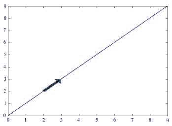

## 附件

*   [`plot_arrow.png`](../_downloads/plot_arrow.jpg)

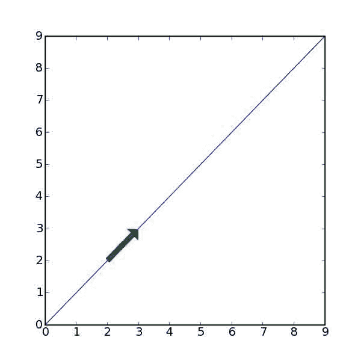

# Matplotlib:栏图

# Matplotlib:栏图

使用条形图功能制作条形图:[http://matplotlib.sourceforge.net/matplotlib.pylab.html](http://matplotlib.sourceforge.net/matplotlib.pylab.html)#-条形图

下面是一个示例脚本，它使一个带有误差线和位于误差线中心的标签的条形成为字符。

```
#!/usr/bin/env python
import numpy as na

from matplotlib.pyplot import *

labels = ["Baseline", "System"]
data =   [3.75               , 4.75]
error =  [0.3497             , 0.3108]

xlocations = na.array(range(len(data)))+0.5
width = 0.5
bar(xlocations, data, yerr=error, width=width)
yticks(range(0, 8))
xticks(xlocations+ width/2, labels)
xlim(0, xlocations[-1]+width*2)
title("Average Ratings on the Training Set")
gca().get_xaxis().tick_bottom()
gca().get_yaxis().tick_left()

show() 
```py

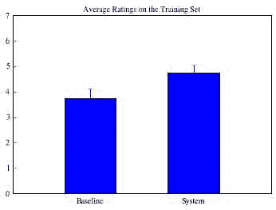

## 附件

*   [`barchart.png`](../_downloads/barchart.jpg)

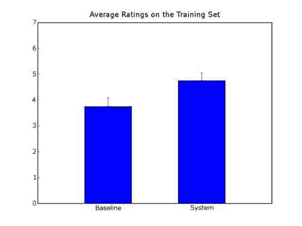

# Matplotlib:自定义日志标签

# Matplotlib:自定义日志标签

如何用整数标签替换默认对数图指数标签的示例。同样的方法适用于任何类型的定制标签。这个例子是从 Python 列表邮件列表中提取的，原文可以在[这里](http://mail.python.org/pipermail/python-list/2006-February/369976.html)找到。

```
from matplotlib.pyplot import *

def log_10_product(x, pos):
    """The two args are the value and tick position.
 Label ticks with the product of the exponentiation"""
    return '%1i' % (x)

# Axis scale must be set prior to declaring the Formatter
# If it is not the Formatter will use the default log labels for ticks.
ax = subplot(111)
ax.set_xscale('log')
ax.set_yscale('log')

formatter = FuncFormatter(log_10_product)
ax.xaxis.set_major_formatter(formatter)
ax.yaxis.set_major_formatter(formatter)

# Create some artificial data.
result1 = [3, 5, 70, 700, 900]
result2 = [1000, 2000, 3000, 4000, 5000]
predict1 = [4, 8, 120, 160, 200]
predict2 = [2000, 4000, 6000, 8000, 1000]

# Plot
ax.scatter(result1, predict1, s=40, c='b', marker='s', faceted=False)
ax.scatter(result2, predict2, s=40, c='r', marker='s', faceted=False)

ax.set_xlim(1e-1, 1e4)
ax.set_ylim(1e-1, 1e4)
grid(True)

xlabel(r"Result", fontsize = 12)
ylabel(r"Prediction", fontsize = 12) 
```py

```
 /usr/lib/python2.7/dist-packages/matplotlib/cbook.py:137: MatplotlibDeprecationWarning: The faceted option was deprecated in version 1.2\. Use edgecolor instead.
   warnings.warn(message, mplDeprecation, stacklevel=1) 
```py

```
 <matplotlib.text.Text at 0x7f07874f2410> 
```py

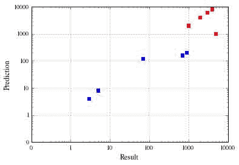

## 附件

*   [`log_labels.png`](../_downloads/log_labels.jpg)

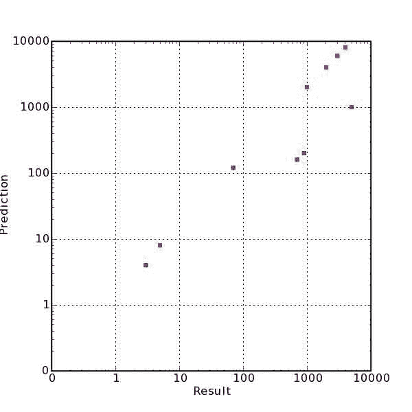

# Matplotlib:图表上的提示

# Matplotlib:图表上的提示

## 带有 matplotlib 的 Hinton 图

Hinton 图是一种将矩阵/向量中的数值可视化的方法，在神经网络和机器学习文献中很流行。正方形所占的面积与值的大小成正比，颜色(在这种情况下是黑色或白色)表示它的符号(正/负)。

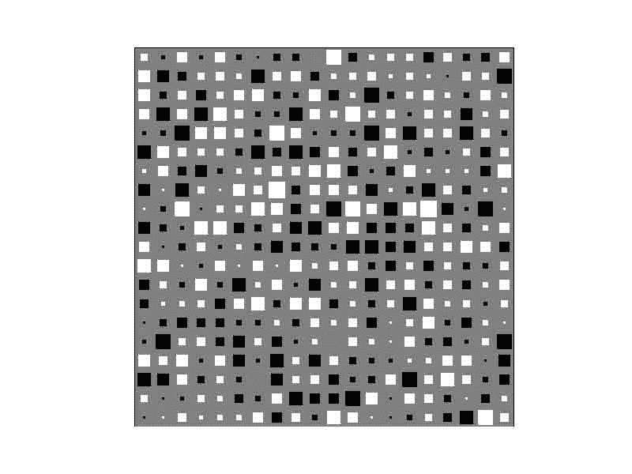 )#

```
import numpy as N
import pylab as P

def _blob(x,y,area,colour):
    """
 Draws a square-shaped blob with the given area (< 1) at
 the given coordinates.
 """
    hs = N.sqrt(area) / 2
    xcorners = N.array([x - hs, x + hs, x + hs, x - hs])
    ycorners = N.array([y - hs, y - hs, y + hs, y + hs])
    P.fill(xcorners, ycorners, colour, edgecolor=colour)

def hinton(W, maxWeight=None):
    """
 Draws a Hinton diagram for visualizing a weight matrix.
 Temporarily disables matplotlib interactive mode if it is on,
 otherwise this takes forever.
 """
    reenable = False
    if P.isinteractive():
        P.ioff()
    P.clf()
    height, width = W.shape
    if not maxWeight:
        maxWeight = 2**N.ceil(N.log(N.max(N.abs(W)))/N.log(2))

    P.fill(N.array([0,width,width,0]),N.array([0,0,height,height]),'gray')
    P.axis('off')
    P.axis('equal')
    for x in xrange(width):
        for y in xrange(height):
            _x = x+1
            _y = y+1
            w = W[y,x]
            if w > 0:
                _blob(_x - 0.5, height - _y + 0.5, min(1,w/maxWeight),'white')
            elif w < 0:
                _blob(_x - 0.5, height - _y + 0.5, min(1,-w/maxWeight),'black')
    if reenable:
        P.ion()
    P.show() 
```py

## 附件

*   [`hinton.png`](../_downloads/hinton.jpg)


# Matplotlib:图例

# Matplotlib:图例

## 重叠线条和标记的图例

如果你有很多点要画，你可能想每 *n* 点只设置一次标记，例如

```
plot(x, y, '-r')
plot(x[::20], y[::20], 'ro') 
```py

然后自动图例将此视为两个不同的图。一种方法是创建一个额外的线对象，该对象不绘制在任何地方，而仅用于图例:

```
from matplotlib.lines import Line2D
line = Line2D(range(10), range(10), linestyle='-', marker='o')
legend((line,), (label,)) 
```py

另一种可能是修改图例中的线条对象:

```
line = plot(x, y, '-r')
markers = plot(x[::20], y[::20], 'ro')
lgd = legend([line], ['data'], numpoints=3)
lgd.get_lines()[0].set_marker('o')
draw() 
```py

## 剧情外的传奇

没有很好的简单方法可以在你的剧情外(右边)添加一个图例，但是如果你一开始就设置好了轴，它就可以工作了:

```
figure()
axes([0.1,0.1,0.71,0.8])
plot([0,1],[0,1],label="line 1")
hold(1)
plot([0,1],[1,0.5],label="line 2")
legend(loc=(1.03,0.2))
show() 
```py

## 从情节中移除图例

可以简单地将轴的属性设置为并重新绘制:

```
ax = gca()
ax.legend_ = None
draw() 
```py

如果您发现自己经常这样做，请使用以下函数

```
def remove_legend(ax=None):
    """Remove legend for ax or the current axes."""

    from pylab import gca, draw
    if ax is None:
        ax = gca()
    ax.legend_ = None
    draw() 
```py

(来源: [Re:如何用 matplotlib OO 从图中删除图例？](http://osdir.com/ml/python.matplotlib.general/2005-07/msg00285.html))

## 更改图例文本的字体大小

请注意，要设置默认字体大小，可以更改 matplotlib rc 参数文件中的 *legend.size* 属性。

要仅更改一个绘图的字体大小，请使用 matplotlib.font *管理器。FontProperties 参数，_prop* ，用于图例创建。

```
x = range(10)
y = range(10)
handles = plot(x, y)
legend(handles, ["label1"], prop={"size":12}) 
```py

# Matplotlib:贴图

# Matplotlib:贴图

使用底图工具包可以轻松地在地图投影上绘制数据。工具包是扩展 matplotlib 的特定于应用的函数的集合。

**底图工具包不在默认 matplotlib 安装**中-可以从 matplotlib sourceforge [下载页面](http://sourceforge.net/project/showfiles.php?group_id=80706&package_id=142792)下载。

假设你想用正投影或卫星投影制作一张世界地图，并在上面绘制一些数据。以下是如何制作地图(使用 matplotlib >= 0.98.0 和底图> = 0.99):

```
from mpl_toolkits.basemap import Basemap
import matplotlib.pyplot as plt
import numpy as np
# set up orthographic map projection with
# perspective of satellite looking down at 50N, 100W.
# use low resolution coastlines.
# don't plot features that are smaller than 1000 square km.
map = Basemap(projection='ortho', lat_0 = 50, lon_0 = -100,
              resolution = 'l', area_thresh = 1000.)
# draw coastlines, country boundaries, fill continents.
map.drawcoastlines()
map.drawcountries()
map.fillcontinents(color = 'coral')
# draw the edge of the map projection region (the projection limb)
map.drawmapboundary()
# draw lat/lon grid lines every 30 degrees.
map.drawmeridians(np.arange(0, 360, 30))
map.drawparallels(np.arange(-90, 90, 30))
plt.show() 
```py

还有许多其他可用的地图投影，可能比你以前听说过的还要多。完整列表可在[底图文档字符串](http://matplotlib.sourceforge.net/mpl_toolkits.basemap.basemap.html)中找到。海岸线、政治边界和河流有四种分辨率:、、和。这是分辨率海岸线的样子。

[](文件/附件/Matplotlib_Maps/basemap0.png

现在，假设你想在这张地图上画出五个城市的位置。在上述脚本中的之前添加以下内容:

```
# lat/lon coordinates of five cities.
lats = [40.02, 32.73, 38.55, 48.25, 17.29]
lons = [-105.16, -117.16, -77.00, -114.21, -88.10]
cities=['Boulder, CO','San Diego, CA',
        'Washington, DC','Whitefish, MT','Belize City, Belize']
# compute the native map projection coordinates for cities.
x,y = map(lons,lats)
# plot filled circles at the locations of the cities.
map.plot(x,y,'bo')
# plot the names of those five cities.
for name,xpt,ypt in zip(cities,x,y):
    plt.text(xpt+50000,ypt+50000,name) 
```py

[](文件/附件/Matplotlib_Maps/basemap1b.png

使用经度和纬度数组调用底图类实例会使用[项目 4](http://proj.maptools.org) 库返回原生地图投影坐标中的这些位置。现在假设您有一些关于常规纬度/经度网格的数据，并且您想要在地图上绘制这些数据的等高线。尝试在前面添加以下几行

```
# make up some data on a regular lat/lon grid.
nlats = 73; nlons = 145; delta = 2.*np.pi/(nlons-1)
lats = (0.5*np.pi-delta*np.indices((nlats,nlons))[0,:,:])
lons = (delta*np.indices((nlats,nlons))[1,:,:])
wave = 0.75*(np.sin(2.*lats)**8*np.cos(4.*lons))
mean = 0.5*np.cos(2.*lats)*((np.sin(2.*lats))**2 + 2.)
# compute native map projection coordinates of lat/lon grid.
x, y = map(lons*180./np.pi, lats*180./np.pi)
# contour data over the map.
CS = map.contour(x,y,wave+mean,15,linewidths=1.5) 
```py

[](文件/附件/Matplotlib_Maps/basemap2b.png

您可以使用方法将图像用作地图背景，而不是绘制大陆和海岸线。默认的背景图像是 NASA 的“蓝色大理石”图像，您可以使用

```
map.bluemarble() 
```py

代替

```
map.drawcoastlines()
map.drawcountries()
map.fillcontinents(color='coral') 
```py

下面是结果图的样子(用白色文字代替黑色，用白点代替蓝色)

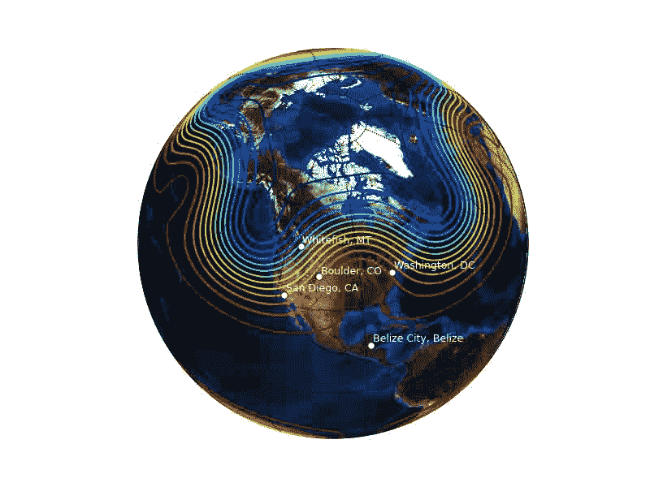

您还可以在地图投影上绘制图像、pcolor 图和矢量。在底图源分布的示例目录中可以找到说明这一点和更多内容的示例。

## 附件

*   [`basemap0.png`](../_downloads/basemap0.jpg)
*   [`basemap1.png`](../_downloads/basemap1.jpg)
*   [`basemap1b.png`](../_downloads/basemap1b.jpg)
*   [`basemap2.png`](../_downloads/basemap2.jpg)
*   [`basemap2b.png`](../_downloads/basemap2b.jpg)
*   [`basemap3.png`](../_downloads/basemap3.jpg)
*   [`basemap3b.png`](../_downloads/basemap3b.jpg)
*   [`basemap3c.png`](../_downloads/basemap3c.jpg)

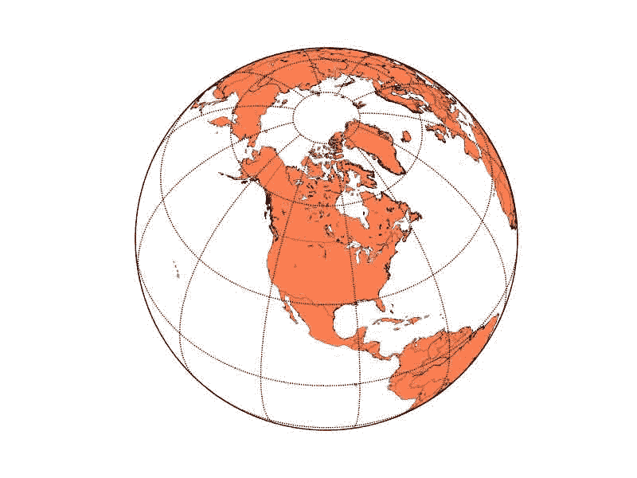 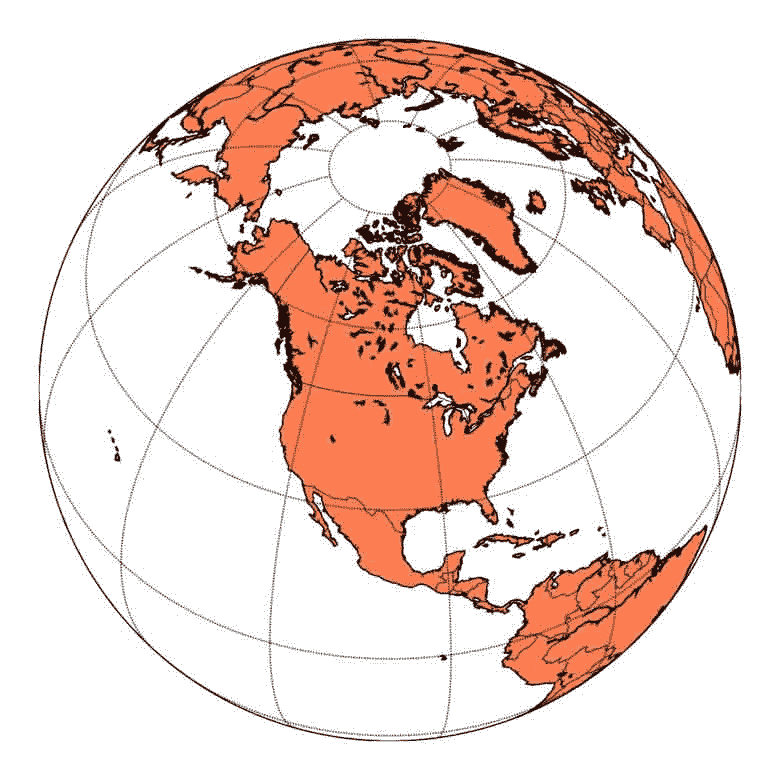 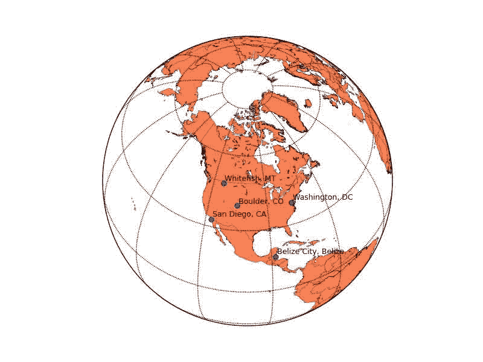 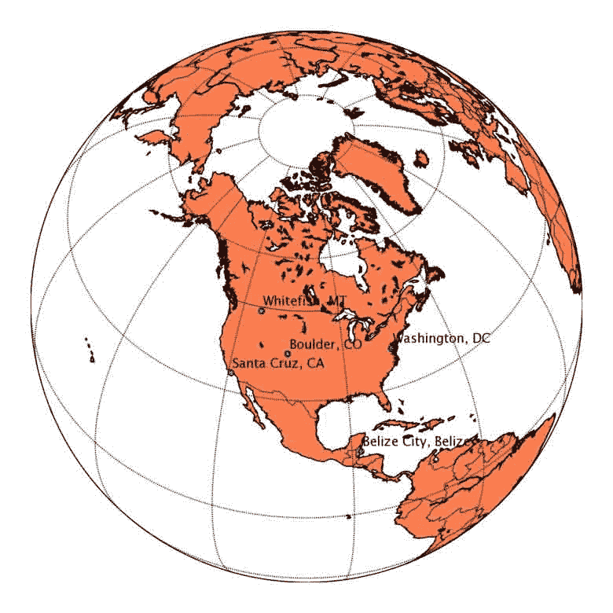 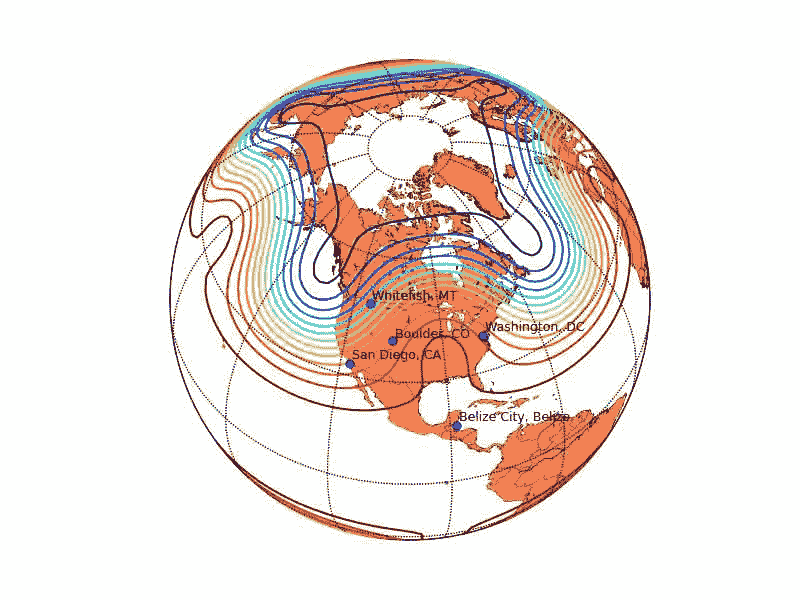 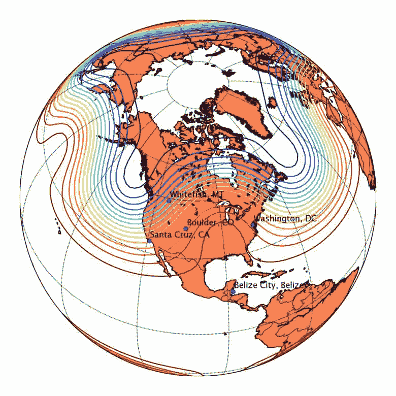  

# Matplotlib:多色线

# Matplotlib:多色线

## 手动定义颜色

[`colored_line.py`](../_downloads/colored_line.py) 是一个简单的例子，说明了如何使一条线的每一段的颜色依赖于所绘制数据的某些属性。

脚本的最新版本可以在[这里](http://matplotlib.sourceforge.net/gallery.html)找到。

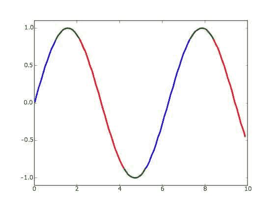

以下是脚本:

```
#!/usr/bin/env python
'''
Color parts of a line based on its properties, e.g., slope.
'''
import numpy as np
import matplotlib.pyplot as plt
from matplotlib.collections import LineCollection
from matplotlib.colors import ListedColormap, BoundaryNorm

x = np.linspace(0, 3 * np.pi, 500)
y = np.sin(x)
z = np.cos(0.5 * (x[:-1] + x[1:]))  # first derivative

# Create a colormap for red, green and blue and a norm to color
# f' < -0.5 red, f' > 0.5 blue, and the rest green
cmap = ListedColormap(['r', 'g', 'b'])
norm = BoundaryNorm([-1, -0.5, 0.5, 1], cmap.N)

# Create a set of line segments so that we can color them individually
# This creates the points as a N x 1 x 2 array so that we can stack points
# together easily to get the segments. The segments array for line collection
# needs to be numlines x points per line x 2 (x and y)
points = np.array([x, y]).T.reshape(-1, 1, 2)
segments = np.concatenate([points[:-1], points[1:]], axis=1)

# Create the line collection object, setting the colormapping parameters.
# Have to set the actual values used for colormapping separately.
lc = LineCollection(segments, cmap=cmap, norm=norm)
lc.set_array(z)
lc.set_linewidth(3)
plt.gca().add_collection(lc)

plt.xlim(x.min(), x.max())
plt.ylim(-1.1, 1.1)
plt.show() 
```py

请注意，线段数比点数少一个。

另一种策略是为给定颜色的每个连续区域生成一个片段。

## 使用平滑的内置彩色地图

如果要显示参数曲线，并且希望使用颜色表示参数。

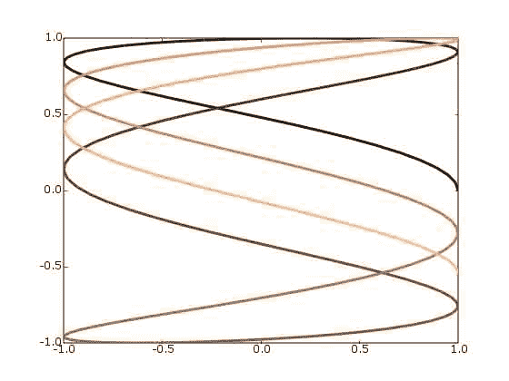

```
import numpy as np
import matplotlib.pyplot as plt
from matplotlib.collections import LineCollection

t = np.linspace(0, 10, 200)
x = np.cos(np.pi * t)
y = np.sin(t)

# Create a set of line segments so that we can color them individually
# This creates the points as a N x 1 x 2 array so that we can stack points
# together easily to get the segments. The segments array for line collection
# needs to be numlines x points per line x 2 (x and y)
points = np.array([x, y]).T.reshape(-1, 1, 2)
segments = np.concatenate([points[:-1], points[1:]], axis=1)

# Create the line collection object, setting the colormapping parameters.
# Have to set the actual values used for colormapping separately.
lc = LineCollection(segments, cmap=plt.get_cmap('copper'),
    norm=plt.Normalize(0, 10))
lc.set_array(t)
lc.set_linewidth(3)

plt.gca().add_collection(lc)
plt.xlim(-1, 1)
plt.ylim(-1, 1)
plt.show() 
```py

## 附件

*   [`colored_line.png`](../_downloads/colored_line.jpg)
*   [`colored_line.py`](../_downloads/colored_line.py)
*   [`colored_line2.png`](../_downloads/colored_line2.jpg)

 

# Matplotlib:多行打印

# Matplotlib:多行打印

## 多线图

人们常常想把许多信号画在另一个信号上。有几种方法可以做到这一点。最简单的实现就是给每个信号增加一个恒定的偏移:

```
from pylab import plot, show, ylim, yticks
from matplotlib.numerix import sin, cos, exp, pi, arange

t = arange(0.0, 2.0, 0.01)
s1 = sin(2*pi*t)
s2 = exp(-t)
s3 = sin(2*pi*t)*exp(-t)
s4 = sin(2*pi*t)*cos(4*pi*t)

t = arange(0.0, 2.0, 0.01)
plot(t, s1, t, s2+1, t, s3+2, t, s4+3, color='k')
ylim(-1,4)
yticks(arange(4), ['S1', 'S2', 'S3', 'S4'])

show() 
```py

但是很难以合理的方式改变 y 刻度。例如，当您放大 y 时，顶部和底部的信号将离开屏幕。通常我们想要的是每个信号的 y 位置保持不变，并且信号的增益被改变。

## 使用多轴

如果你只有几个信号，你可以把每个信号做成单独的轴，把 y 标签做成水平的。这对于少量信号(比如 4-10 个)来说效果不错，除了额外的水平线和轴周围的刻度可能会令人讨厌。改变这些轴线的绘制方式是我们的任务之一，这样你就可以去掉它，但是还没有完成:

```
from pylab import figure, show, setp
from matplotlib.numerix import sin, cos, exp, pi, arange

t = arange(0.0, 2.0, 0.01)
s1 = sin(2*pi*t)
s2 = exp(-t)
s3 = sin(2*pi*t)*exp(-t)
s4 = sin(2*pi*t)*cos(4*pi*t)

fig = figure()
t = arange(0.0, 2.0, 0.01)

yprops = dict(rotation=0,
              horizontalalignment='right',
              verticalalignment='center',
              x=-0.01)

axprops = dict(yticks=[])

ax1 =fig.add_axes([0.1, 0.7, 0.8, 0.2], **axprops)
ax1.plot(t, s1)
ax1.set_ylabel('S1', **yprops)

axprops['sharex'] = ax1
axprops['sharey'] = ax1
# force x axes to remain in register, even with toolbar navigation
ax2 = fig.add_axes([0.1, 0.5, 0.8, 0.2], **axprops)

ax2.plot(t, s2)
ax2.set_ylabel('S2', **yprops)

ax3 = fig.add_axes([0.1, 0.3, 0.8, 0.2], **axprops)
ax3.plot(t, s4)
ax3.set_ylabel('S3', **yprops)

ax4 = fig.add_axes([0.1, 0.1, 0.8, 0.2], **axprops)
ax4.plot(t, s4)
ax4.set_ylabel('S4', **yprops)

# turn off x ticklabels for all but the lower axes
for ax in ax1, ax2, ax3:
    setp(ax.get_xticklabels(), visible=False)

show() 
```py

[]文件/附件/matplotlib _ multi line plot/multiple axes . png

## 操纵变换

对于大量的线，上面的方法是低效的，因为为每条线创建单独的轴会产生大量无用的开销。催生 matplotlib 的应用是[脑电查看器](http://matplotlib.sourceforge.net/screenshots/eeg_small.jpg)，它必须高效处理数百行；这是 [pbrain 套装](http://pbrain.sf.net)的一部分。

下面是一个例子，说明该应用如何在增益变化的情况下进行多线绘图。请注意，这将破坏工具栏的 y 行为，因为我们已经更改了所有默认转换。在我的应用中，我有一个自定义工具栏来增加或减少 y 比例。在这个例子中，我将加号/减号键绑定到一个增加或减少 y 增益的函数。也许我会把它打包成一个名为 plot_signals 的函数或类似的东西，因为代码有点复杂，因为它大量使用了有点晦涩的 matplotlib 变换。在试图理解这个例子之前，我建议阅读一下[转换模块](http://matplotlib.sourceforge.net/matplotlib.transforms.html):

```
from pylab import figure, show, setp, connect, draw
from matplotlib.numerix import sin, cos, exp, pi, arange
from matplotlib.numerix.mlab import mean
from matplotlib.transforms import Bbox, Value, Point, \
     get_bbox_transform, unit_bbox
# load the data

t = arange(0.0, 2.0, 0.01)
s1 = sin(2*pi*t)
s2 = exp(-t)
s3 = sin(2*pi*t)*exp(-t)
s4 = sin(2*pi*t)*cos(4*pi*t)
s5 = s1*s2
s6 = s1-s4
s7 = s3*s4-s1

signals = s1, s2, s3, s4, s5, s6, s7
for sig in signals:
    sig = sig-mean(sig)

lineprops = dict(linewidth=1, color='black', linestyle='-')
fig = figure()
ax = fig.add_axes([0.1, 0.1, 0.8, 0.8])

# The normal matplotlib transformation is the view lim bounding box
# (ax.viewLim) to the axes bounding box (ax.bbox).  Where are going to
# define a new transform by defining a new input bounding box. See the
# matplotlib.transforms module helkp for more information on
# transforms

# This bounding reuses the x data of the viewLim for the xscale -10 to
# 10 on the y scale.  -10 to 10 means that a signal with a min/max
# amplitude of 10 will span the entire vertical extent of the axes
scale = 10
boxin = Bbox(
    Point(ax.viewLim.ll().x(), Value(-scale)),
    Point(ax.viewLim.ur().x(), Value(scale)))

# height is a lazy value
height = ax.bbox.ur().y() - ax.bbox.ll().y()

boxout = Bbox(
    Point(ax.bbox.ll().x(), Value(-0.5) * height),
    Point(ax.bbox.ur().x(), Value( 0.5) * height))

# matplotlib transforms can accepts an offset, which is defined as a
# point and another transform to map that point to display.  This
# transform maps x as identity and maps the 0-1 y interval to the
# vertical extent of the yaxis.  This will be used to offset the lines
# and ticks vertically
transOffset = get_bbox_transform(
    unit_bbox(),
    Bbox( Point( Value(0), ax.bbox.ll().y()),
          Point( Value(1), ax.bbox.ur().y())
          ))

# now add the signals, set the transform, and set the offset of each
# line
ticklocs = []
for i, s in enumerate(signals):
    trans = get_bbox_transform(boxin, boxout)
    offset = (i+1.)/(len(signals)+1.)
    trans.set_offset( (0, offset), transOffset)

    ax.plot(t, s, transform=trans, **lineprops)
    ticklocs.append(offset)

ax.set_yticks(ticklocs)
ax.set_yticklabels(['S%d'%(i+1) for i in range(len(signals))])

# place all the y tick attributes in axes coords
all = []
labels = []
ax.set_yticks(ticklocs)
for tick in ax.yaxis.get_major_ticks():
    all.extend(( tick.label1, tick.label2, tick.tick1line,
                 tick.tick2line, tick.gridline))
    labels.append(tick.label1)

setp(all, transform=ax.transAxes)
setp(labels, x=-0.01)

ax.set_xlabel('time (s)')

# Because we have hacked the transforms, you need a special method to
# set the voltage gain; this is a naive implementation of how you
# might want to do this in real life (eg make the scale changes
# exponential rather than linear) but it gives you the idea
def set_ygain(direction):
    set_ygain.scale += direction
    if set_ygain.scale <=0:
        set_ygain.scale -= direction
        return

    for line in ax.lines:
        trans = line.get_transform()
        box1 =  trans.get_bbox1()
        box1.intervaly().set_bounds(-set_ygain.scale, set_ygain.scale)
    draw()
set_ygain.scale = scale

def keypress(event):
    if event.key in ('+', '='): set_ygain(-1)
    elif event.key in ('-', '_'): set_ygain(1)

connect('key_press_event', keypress)
ax.set_title('Use + / - to change y gain')
show() 
```py

## 附件

*   [`multiline.png`](../_downloads/multiline.jpg)
*   [`multipleaxes.png`](../_downloads/multipleaxes.jpg)

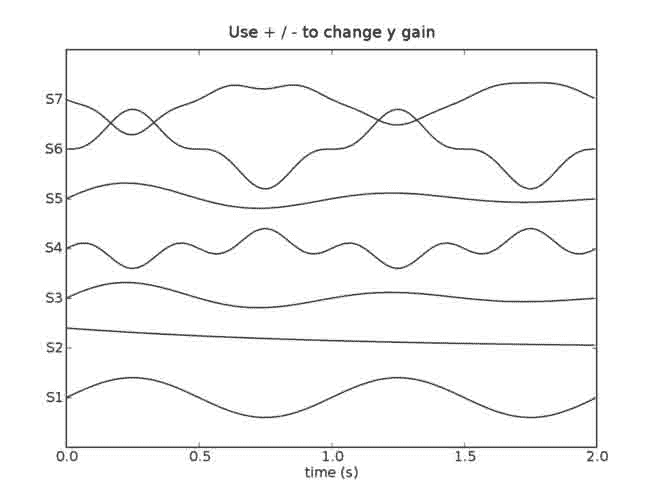 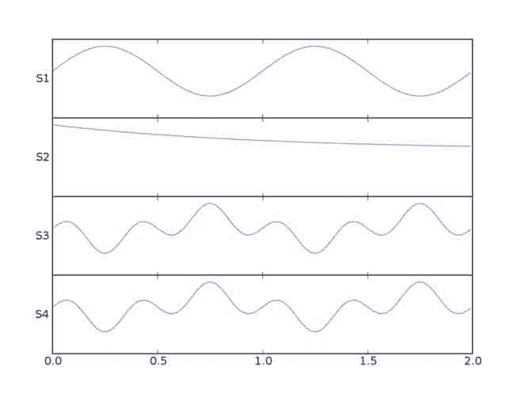

# Matplotlib:用屏蔽数组绘制值

# Matplotlib:用屏蔽数组绘制值

有时一个人可能会在数组中得到“无意义”的数据。是因为探测器工作不正常还是其他原因。或者必须处理完全不同范围的数据。在这两种情况下，绘制所有值都会破坏绘图。这个简短的示例脚本解决了这个问题，并展示了一个使用屏蔽数组的可能解决方案。也可以参考 matplotlib 示例中的“masked_demo.py”。

```
import numpy as np
import matplotlib.pyplot as plt

y_values = [0,0,100,97,98,0,99,101,0,102,99,105,101]
x_values = [0,1,2,3,4,5,6,7,8,9,10,11,12]

#give a threshold
threshold = 1

#prepare for masking arrays - 'conventional' arrays won't do it
y_values = np.ma.array(y_values)
#mask values below a certain threshold
y_values_masked = np.ma.masked_where(y_values < threshold , y_values)

#plot all data
plt.subplots_adjust(hspace=0.5)
plt.subplot(311)
plt.plot(x_values, y_values,'ko')
plt.title('All values')
plt.subplot(312)
plt.plot(x_values, y_values_masked,'ko')
plt.title('Plot without masked values')
ax = plt.subplot(313)
ax.plot(x_values, y_values_masked,'ko')
#for otherwise the range of x_values gets truncated:
ax.set_xlim(x_values[0], x_values[-1])
plt.title('Plot without masked values -\nwith full range x-axis')

savefig('masked_test.png') 
```py

结果图可能说明了这个问题——注意所有三个子情节中不同的尺度:

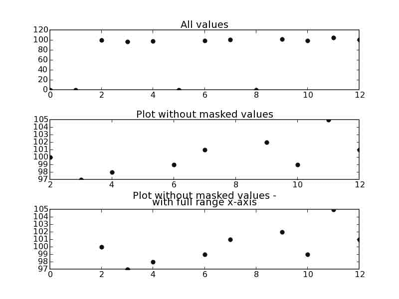

## 附件

*   [`masked_test.png`](../_downloads/masked_test.jpg)


# Matplotlib:阴影区域

# Matplotlib:阴影区域

使用填充功能使任何颜色的阴影区域变浅。这里有一个例子。

```
from pylab import *

x = arange(10)
y = x

# Plot junk and then a filled region
plot(x, y)

# Make a blue box that is somewhat see-through
# and has a red border.
# WARNING: alpha doesn't work in postscript output....
fill([3,4,4,3], [2,2,4,4], 'b', alpha=0.2, edgecolor='r') 
```py

```
 [<matplotlib.patches.Polygon at 0x7f7a19aac890>] 
```py

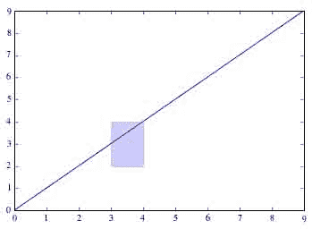

## 附件

*   [`shaded.png`](../_downloads/shaded.jpg)

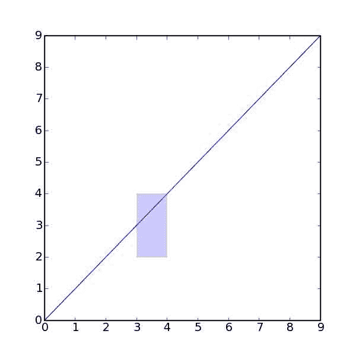

# matplotlib:sigma ly 函数

# matplotlib:sigma ly 函数

matplotlib 绘制函数的方法要求您计算要绘制的曲线的 x 和 y 顶点，然后将其传递给绘图。例如对于普通的 pdf，matplotlib.mlab 提供了这样一个功能:

```
from matplotlib.mlab import normpdf
import matplotlib.numerix as nx
import pylab as p

x = nx.arange(-4, 4, 0.01)
y = normpdf(x, 0, 1) # unit normal
p.plot(x,y, color='red', lw=2)
p.show() 
```py

当然，有些曲线没有封闭形式的表达式，不适合这种处理。matplotlib 的一些后端能够用样条(三次和四次)绘制任意路径，但是这个功能还没有向用户公开(从 0.83 开始)。如有需要，请发送至[邮件列表](http://sourceforge.net/mail/?group_id=80706)或提交 sourceforge [支持请求](http://sourceforge.net/tracker/?group_id=80706&atid=560721)。

Rich Shepard 对绘制“S 曲线”和“Z 曲线”很感兴趣，通过一点谷歌搜索发现，S 曲线是一个 sigmoid，Z 曲线只是 1.0-sigmoid。sigmoids 有许多简单的形式:如希尔德函数、玻尔兹曼函数和反正切函数。下面是玻尔兹曼函数的一个例子:

```
import matplotlib.numerix as nx
import pylab as p

def boltzman(x, xmid, tau):
    """
 evaluate the boltzman function with midpoint xmid and time constant tau
 over x
 """
    return 1\. / (1\. + nx.exp(-(x-xmid)/tau))

x = nx.arange(-6, 6, .01)
S = boltzman(x, 0, 1)
Z = 1-boltzman(x, 0.5, 1)
p.plot(x, S, x, Z, color='red', lw=2)
p.show() 
```py

另请参见数学世界中的[乙状结肠。](http://mathworld.wolfram.com/SigmoidFunction.html)

人们经常想给这些曲线下的区域着色，例如它们的交点下的[，这可以通过 numerix 和 matplotlib【](http://www.appl-ecosys.com/newstuff.html)[http://matplotlib.sourceforge.net/matplotlib.pylab.html](http://matplotlib.sourceforge.net/matplotlib.pylab.html)#-fill fill】函数来实现:

```
import matplotlib.numerix as nx
import pylab as p

def boltzman(x, xmid, tau):
    """
 evaluate the boltzman function with midpoint xmid and time constant tau
 over x
 """
    return 1\. / (1\. + nx.exp(-(x-xmid)/tau))

def fill_below_intersection(x, S, Z):
    """
 fill the region below the intersection of S and Z
 """
    #find the intersection point
    ind = nx.nonzero( nx.absolute(S-Z)==min(nx.absolute(S-Z)))[0]
    # compute a new curve which we will fill below
    Y = nx.zeros(S.shape, typecode=nx.Float)
    Y[:ind] = S[:ind]  # Y is S up to the intersection
    Y[ind:] = Z[ind:]  # and Z beyond it
    p.fill(x, Y, facecolor='blue', alpha=0.5)

x = nx.arange(-6, 6, .01)
S = boltzman(x, 0, 1)
Z = 1-boltzman(x, 0.5, 1)
p.plot(x, S, x, Z, color='red', lw=2)
fill_below_intersection(x, S, Z)
p.show() 
```py

正如这些例子所说明的，matplotlib 并没有为人们想要绘制的所有类型的曲线提供帮助函数，但是与 numerix 和 python 一起提供了基本的工具，使您能够自己构建它们。

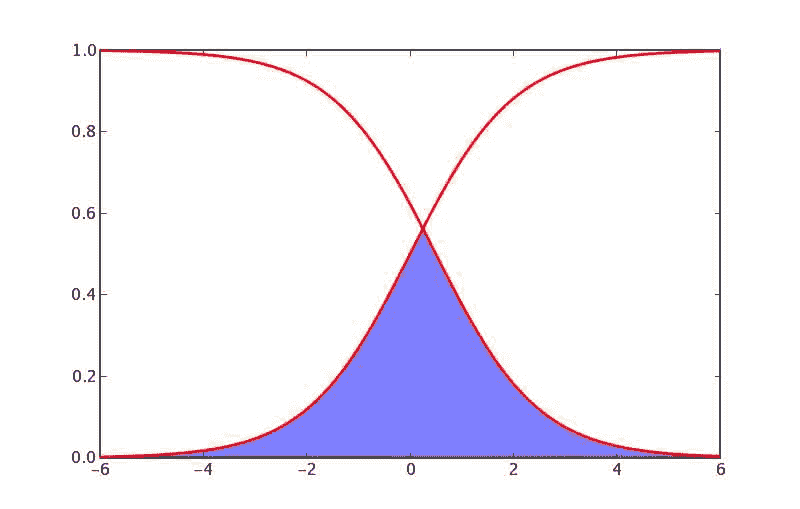

## 附件

*   [`sigmoids.png`](../_downloads/sigmoids.jpg)
*   [`sigmoids2.png`](../_downloads/sigmoids2.jpg)

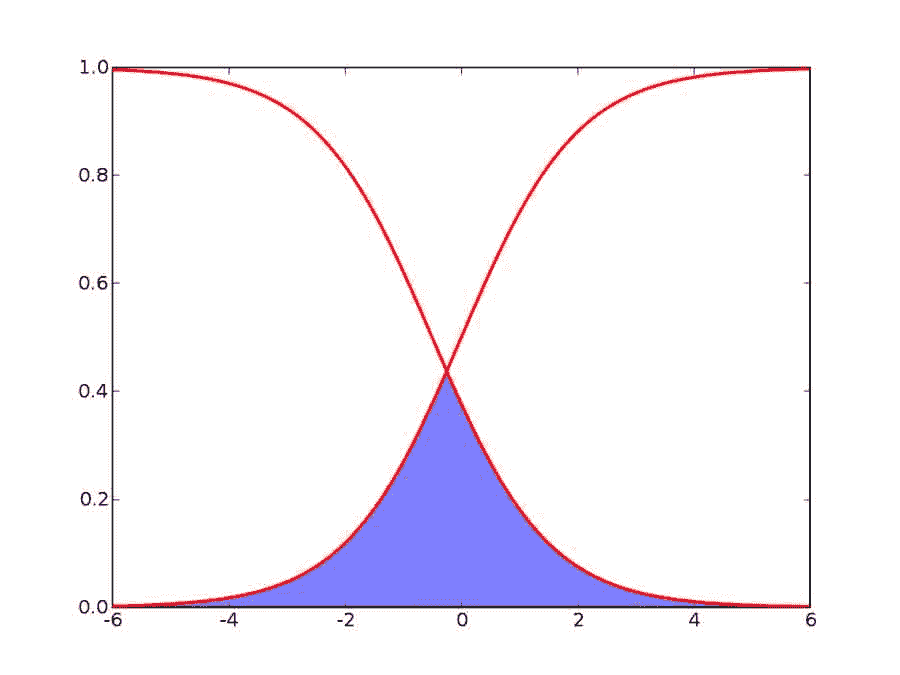 

# Matplotlib:粗轴

# Matplotlib:粗轴

如何加厚绘图周围的线条(坐标轴线条)以及如何在刻度和坐标轴标签上获得大粗体字体的示例。

```
from pylab import *

# Thicken the axes lines and labels
#
#   Comment by J. R. Lu:
#       I couldn't figure out a way to do this on the
#       individual plot and have it work with all backends
#       and in interactive mode. So, used rc instead.
#
rc('axes', linewidth=2)

# Make a dummy plot
plot([0, 1], [0, 1])

# Change size and font of tick labels
# Again, this doesn't work in interactive mode.
fontsize = 14
ax = gca()

for tick in ax.xaxis.get_major_ticks():
    tick.label1.set_fontsize(fontsize)
    tick.label1.set_fontweight('bold')
for tick in ax.yaxis.get_major_ticks():
    tick.label1.set_fontsize(fontsize)
    tick.label1.set_fontweight('bold')

xlabel('X Axis', fontsize=16, fontweight='bold')
ylabel('Y Axis', fontsize=16, fontweight='bold')

# Save figure
savefig('thick_axes.png') 
```py

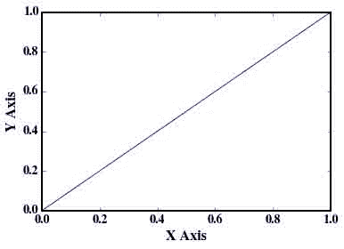

## 附件

*   [`thick_axes.png`](../_downloads/thick_axes.jpg)

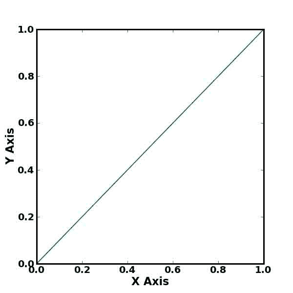

# Matplotlib:转换

# Matplotlib:转换

每当你把坐标传给 matplotlib，问题就来了，你指的是什么样的坐标。考虑以下示例

```
axes.text(x,y, "my label") 
```py

标签“我的标签”被添加到坐标 x，y 的轴上，或者更清楚地说明:文本被放置在数据点(x，y)的理论位置。因此，我们称之为“数据坐标”。然而，人们可以想到其他坐标。例如，您可能希望在图表的正中间放置一个标签。如果您通过上面的方法指定了这一点，那么您将需要确定 x 和 y 的最小值和最大值来确定中间值。但是，使用转换，您可以简单地使用

```
axes.text(0.5, 0.5, "middle of graph", transform=axes.transAxes) 
```py

您应该知道四种内置转换(假设 ax 是 Axes 实例，fig 是 fig 实例):

```
matplotlib.transforms.identity_transform()  # display coords
ax.transData     # data coords
ax.transAxes     # 0,0 is bottom,left of axes and 1,1 is top,right
fig.transFigure  # 0,0 is bottom,left of figure and 1,1 is top,right 
```py

这些变换可以用于任何类型的艺术家，而不仅仅是文本对象。

ax.text 的默认转换是 ax.transData，而 fig.text 的默认转换是 fig . trans configure。

当然，您可以定义更一般的变换，例如 matplotlib.transforms.Affine，但是上面列出的四种变换出现在很多应用中。

xy_tup()不再存在。请参见[处的 Matplotlib 官方文档 http://Matplotlib . SourceForge . net/users/transforms _ tutorial . html](http://matplotlib.sourceforge.net/users/transforms_tutorial.html)以获取进一步参考。

## 示例:类似注释的刻度标签

如果您发现 Matplotlib 的内置刻度标签对您来说不够，您可以使用转换来实现类似的东西。下面是一个示例，该示例在刻度标签下方绘制注释，并使用变换来保证注释的 x 坐标对应于绘图的 x 坐标，但 y 坐标位于固定位置，与绘图的比例无关:

```
import matplotlib as M
import Numeric as N
import pylab as P
blend = M.transforms.blend_xy_sep_transform

def doplot(fig, subplot, function):
    ax = fig.add_subplot(subplot)
    x = N.arange(0, 2*N.pi, 0.05)
    ax.plot(x, function(x))

    trans = blend(ax.transData, ax.transAxes)

    for x,text in [(0.0, '|'), (N.pi/2, r'$\rm{zero\ to\ }\pi$'),
                   (N.pi, '|'), (N.pi*1.5, r'$\pi\rm{\ to\ }2\pi$'),
                   (2*N.pi, '|')]:
        ax.text(x, -0.1, text, transform=trans,
                horizontalalignment='center')

fig = P.figure()
doplot(fig, 121, N.sin)
doplot(fig, 122, lambda x: 10*N.sin(x))
P.show() 
```py

## 示例:向数据坐标添加像素偏移

有时，您希望指定标签显示相对于相应数据点的固定*像素*偏移，而不考虑缩放。这里有一种方法；试着在一个交互式后端运行这个程序，缩放和平移图片。

其工作方式是首先获取`transData`的一个浅拷贝，然后添加一个偏移量。所有的变换都可以有一个偏移量，这个偏移量可以用`set_offset`修改，复制是为了避免修改数据本身的变换。足够新的 matplotlib 版本(目前只有 svn 版本)有一个`offset_copy`功能，可以自动完成这项工作。

```
import matplotlib
import matplotlib.transforms
from pylab import figure, show

# New enough versions have offset_copy by Eric Firing:
if 'offset_copy' in dir(matplotlib.transforms):
    from matplotlib.transforms import offset_copy
    def offset(ax, x, y):
        return offset_copy(ax.transData, x=x, y=y, units='dots')
else: # Without offset_copy we have to do some black transform magic
    from matplotlib.transforms import blend_xy_sep_transform, identity_transform
    def offset(ax, x, y):
        # This trick makes a shallow copy of ax.transData (but fails for polar plots):
        trans = blend_xy_sep_transform(ax.transData, ax.transData)
        # Now we set the offset in pixels
        trans.set_offset((x,y), identity_transform())
        return trans

fig=figure()
ax=fig.add_subplot(111)

# plot some data
x = (3,1,4,1,5,9,2,6,5,3,5,8,9,7,9,3)
y = (2,7,1,8,2,8,1,8,2,8,4,5,9,0,4,5)
ax.plot(x,y,'.')

# add labels
trans=offset(ax, 10, 5)
for a,b in zip(x,y):
    ax.text(a, b, '(%d,%d)'%(a,b), transform=trans)

show() 
```py

# Matplotlib:未填充的直方图

# Matplotlib:未填充的直方图

下面是一些用于绘制直方图的模板代码，它们看起来不像条形图，而是只有轮廓(像 IDL 创建的那样)。

首先定义一个承担大部分繁重工作的函数。

```
import numpy as np

def histOutline(dataIn, *args, **kwargs):
    (histIn, binsIn) = np.histogram(dataIn, *args, **kwargs)

    stepSize = binsIn[1] - binsIn[0]

    bins = np.zeros(len(binsIn)*2 + 2, dtype=np.float)
    data = np.zeros(len(binsIn)*2 + 2, dtype=np.float)
    for bb in range(len(binsIn)):
        bins[2*bb + 1] = binsIn[bb]
        bins[2*bb + 2] = binsIn[bb] + stepSize
        if bb < len(histIn):
            data[2*bb + 1] = histIn[bb]
            data[2*bb + 2] = histIn[bb]

    bins[0] = bins[1]
    bins[-1] = bins[-2]
    data[0] = 0
    data[-1] = 0

    return (bins, data) 
```py

现在，我们可以制作图表:

```
# Make some data to plot
data = randn(500)

figure(2, figsize=(10, 5))
clf()

##########
#
# First make a normal histogram
#
##########
subplot(1, 2, 1)
(n, bins, patches) = hist(data)

# Boundaries
xlo = -max(abs(bins))
xhi = max(abs(bins))
ylo = 0
yhi = max(n) * 1.1

axis([xlo, xhi, ylo, yhi])

##########
#
# Now make a histogram in outline format
#
##########
(bins, n) = histOutline(data)

subplot(1, 2, 2)
plot(bins, n, 'k-')
axis([xlo, xhi, ylo, yhi]) 
```

在下面，您可以找到打包到 histOutline.py 中的这个功能

## 附件

*   [`histNofill.py`](../_downloads/histNofill.py)
*   [`histOutline.py`](../_downloads/histOutline.py)
*   [`hist_outline.png`](../_downloads/hist_outline.jpg)

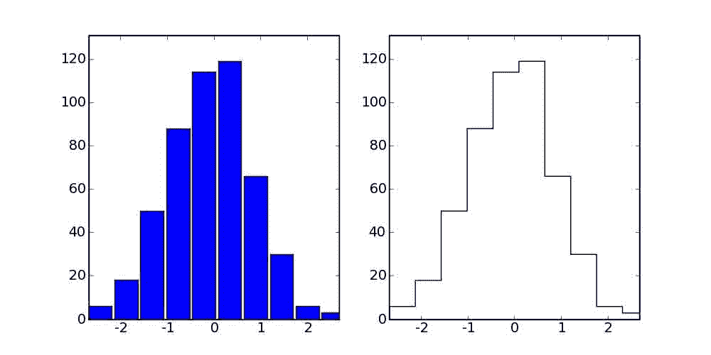