# 九、Matplotlib / 排版

*   [Matplotlib: latex 示例](Matplotlib_LaTeX_Examples.html)
*   [Matplotlib:使用 tex](Matplotlib_UsingTex.html)

# Matplotlib: latex examples

# Matplotlib: latex examples

## 使用 LaTeX 制作用于发布的图形

本页描述了用 LaTeX 制作出版物质量图形的几种方法。

### 乳胶加工

本节描述了一种遵循[“秘籍/Matplotlib/using tex”]指南的技术。

以下是用于包含该图的 LaTeX 文件的概要(例如`REVTeX4`用于出版的是具有两列格式的 APS 物理期刊。)

```py
\documentclass[prl,10pt,twocolumn]{revtex4}
\usepackage{graphicx}    % Used to import the graphics
\begin{document}
%...
\begin{figure}[t]
  \begin{center}
    \showthe\columnwidth % Use this to determine the width of the figure.
    \includegraphics[width=\columnwidth]{fig1.eps}
    \caption{\label{fig:sin_cos} Plot of the sine and cosine functions.}
  \end{center}
\end{figure}
%...
\end{document} 
```

### 确定图形尺寸

第一步是确定图形的大小:这样，当包含图形时，它不会被调整大小，字体等。将与您设置的完全一样，而不是缩放(可能会失真)。这可以在 LaTeX 中通过显式设置图形的宽度并使用`\showthe`命令打印该宽度来完成。(在上例中，图形宽度设置为`\columnwidth`。)

当文件被 LaTeX 处理时，看看输出。以上示例产生以下输出(注意:LaTeX 将在`\showthe`命令后暂停，按 enter 键继续):

```py
This is TeX, Version 3.14159 (Web2C 7.4.5)
LaTeX2e <2001/06/01>
...
> 246.0pt.
l.8     \showthe\columnwidth
                             % Use this to determine the width of the figure.
?
<fig1.eps> [1] (./tst.aux) )
... 
```

因此，该数字将为 246.0 磅宽。有 1 英寸= 72.27pt (in [La]TeX)，所以这意味着图形宽度应为 3.40390 英寸。高度取决于图形的内容，但是中庸之道可以用来做出令人愉悦的图形。一旦确定了这一点，就可以使用`figure.figsize`属性来设置默认的图形尺寸。

```py
#!python numbers=disable
fig_width_pt = 246.0  # Get this from LaTeX using \showthe\columnwidth
inches_per_pt = 1.0/72.27               # Convert pt to inches
golden_mean = (sqrt(5)-1.0)/2.0         # Aesthetic ratio
fig_width = fig_width_pt*inches_per_pt  # width in inches
fig_height =fig_width*golden_mean       # height in inches
fig_size = [fig_width,fig_height] 
```

### 设置字体大小

由于图形不会缩小，我们可以明确设置字体大小。

```py
#!python numbers=disable
          'font.size' : 10,
          'axes.labelsize' : 10,
          'font.size' : 10,
          'text.fontsize' : 10,
          'legend.fontsize': 10,
          'xtick.labelsize' : 8,
          'ytick.labelsize' : 8, 
```

### 微调

对于这些较小的绘图尺寸，默认边距不足以显示轴标签，因此我们需要指定较大的边距。我们通过对`axes()`函数的显式调用来做到这一点。在这个例子中，我们只有一个轴。排版后的 LaTeX 文档在图的两边都有空白，所以我们不需要在图中包含这个。因此，我们在顶部和右侧只保留一点空白，这样标签就不会超出边界框，并在底部为 x 标签添加更多空间:

```py
#!python numbers=disable
pylab.axes([0.125,0.2,0.95-0.125,0.95-0.2]) 
```

### 把它们放在一起

下面是生成图的 python 文件。

```py
#!python
import pylab
from pylab import arange,pi,sin,cos,sqrt
fig_width_pt = 246.0  # Get this from LaTeX using \showthe\columnwidth
inches_per_pt = 1.0/72.27               # Convert pt to inch
golden_mean = (sqrt(5)-1.0)/2.0         # Aesthetic ratio
fig_width = fig_width_pt*inches_per_pt  # width in inches
fig_height = fig_width*golden_mean      # height in inches
fig_size =  [fig_width,fig_height]
params = {'backend': 'ps',
          'axes.labelsize': 10,
          'text.fontsize': 10,
          'legend.fontsize': 10,
          'xtick.labelsize': 8,
          'ytick.labelsize': 8,
          'text.usetex': True,
          'figure.figsize': fig_size}
pylab.rcParams.update(params)
# Generate data
x = pylab.arange(-2*pi,2*pi,0.01)
y1 = sin(x)
y2 = cos(x)
# Plot data
pylab.figure(1)
pylab.clf()
pylab.axes([0.125,0.2,0.95-0.125,0.95-0.2])
pylab.plot(x,y1,'g:',label='$\sin(x)$')
pylab.plot(x,y2,'-b',label='$\cos(x)$')
pylab.xlabel('$x$ (radians)')
pylab.ylabel('$y$')
pylab.legend()
pylab.savefig('fig1.eps') 
```

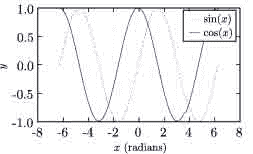

### 产生灰度虚线

`An obvious solution is to greyscale convert your figure, but for readibility, adding dashes is often better.. This maybe implemented for an example of a SigmoidalFunctions with`

### 使用 psfrag 的 LaTeX

**注:此部分已过时。【matplotlib 的最新版本打破了 psfrag 功能(例如参见[这一讨论](http://article.gmane.org/gmane.comp.python.matplotlib.general/26740/))。也就是说，可以使用 usetex 特性直接渲染 LaTeX 文本，效果非常好(如果你在选择字体时很小心的话)。在不久的将来，我将尝试在这里进一步讨论这个问题。–迈克尔·麦克尼尔·福布斯**

为了确保您的图形使用与文档完全相同的字体，您可以让 LaTeX 使用 psfrag 包生成并替换图形中的文本。如果您对`text.usetex`方法有问题(例如，找不到合适的字体)，这是一个很好的选择。)

为此，只需对标签使用纯文本，然后使用 psfrag 包替换它们。下面是使用这种方法的修改文件:

```py
\documentclass[prl,10pt,twocolumn]{revtex4}
\usepackage{graphicx}    % Used to import the graphics
\usepackage{psfrag}
\begin{document}
%...
\begin{figure}[t]
  \begin{center}
    \psfrag{sin(x)}{$\sin(x)$}
    \psfrag{cos(x)}{$\cos(x)$}
    \psfrag{x (radians)}{$x$ (radians)}
    \psfrag{y}{$y$}
    {\footnotesize                  % Replace tick-lables with smaller font.
      \psfrag{1.0}{1.0}
      \psfrag{0.5}{0.5}
      \psfrag{0.0}{0.0}
      \psfrag{-0.5}{-0.5}
      \psfrag{-1.0}{-1.0}
      \psfrag{-8}{-8}
      \psfrag{-6}{-6}
      \psfrag{-4}{-4}
      \psfrag{-2}{-2}
      \psfrag{0}{0}
      \psfrag{2}{2}
      \psfrag{4}{4}
      \psfrag{6}{6}
      \psfrag{8}{8}
      \showthe\columnwidth % Use this to determine the width of the figure.
      \includegraphics[width=\columnwidth]{fig2.eps}
    } % Note that the psfrag commands only work in the top-most environment.
    \caption{\label{fig:sin_cos} Plot of the sine and cosine functions.}
  \end{center}
\end{figure}
%...
\end{document} 
```

```py
#!python
import pylab
from pylab import arange,pi,sin,cos,sqrt
fig_width_pt = 246.0  # Get this from LaTeX using \showthe\columnwidth
inches_per_pt = 1.0/72.27               # Convert pt to inch
golden_mean = (sqrt(5)-1.0)/2.0         # Aesthetic ratio
fig_width = fig_width_pt*inches_per_pt  # width in inches
fig_height = fig_width*golden_mean      # height in inches
fig_size =  [fig_width,fig_height]
params = {'backend': 'ps',
          'axes.labelsize': 10,
          'text.fontsize': 10,
          'legend.fontsize': 10,
          'xtick.labelsize': 8,
          'ytick.labelsize': 8,
          'text.usetex': False,
          'figure.figsize': fig_size}
pylab.rcParams.update(params)
# Generate data
x = pylab.arange(-2*pi,2*pi,0.01)
y1 = sin(x)
y2 = cos(x)
# Plot data
# Plot data
pylab.figure(1)
pylab.clf()
pylab.axes([0.125,0.2,0.95-0.125,0.95-0.2])
pylab.plot(x,y1,'g:',label='sin(x)')
pylab.plot(x,y2,'-b',label='cos(x)')
pylab.xlabel('x (radians)')
pylab.ylabel('y')
pylab.legend()
pylab.savefig('fig2.eps') 
```

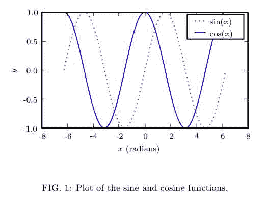

### 零碎东西

绘制图例后，设置图例字体的另一种方法是使用，例如:

```py
from matplotlib.font_manager import fontManager, FontProperties
font= FontProperties(size='x-small');
pylab.legend(loc=0, prop=font); 
```

大卫·多诺万

### PDF 文件大小

如果您有非常复杂的图像，如高分辨率等高线图或三维图，将这些图像保存为矢量图形格式(如 PDF 或 EPS)可能会导致无法接受的大文件(尽管具有惊人的缩放能力)。一种解决方案是选择性地将部分绘图(而不是文本标签)转换为光栅化图像。这可以通过 matplotlib 最新版本中所谓的“混合模式渲染”功能来实现。这里有一个例子，它可能会起作用:

```py
#!python
from pylab import meshgrid, sin, cos, linspace, contourf, savefig, clf
x, y = meshgrid(*(linspace(-1,1,500),)*2)
z = sin(20*x**2)*cos(30*y)
c = contourf(x,y,z,50)
savefig('full_vector.pdf')
clf()
c = contourf(x,y,z,50,rasterized=True)
savefig('rasterized.pdf') 
```

但是，{{{contourf}}}当前不支持{ { {栅格化}}}选项(该选项被忽略)。然而，其他一些情节元素确实如此。我正在寻找解决办法。–迈克尔·麦克尼尔·福布斯

## 附件

*   [`fig.png`](../_downloads/fig.jpg)
*   [`fig1.png`](../_downloads/fig1.jpg)
*   [`naka-rushton.png`](../_downloads/naka-rushton.jpg)
*   [`psfrag_example.png`](../_downloads/psfrag_example.jpg)

 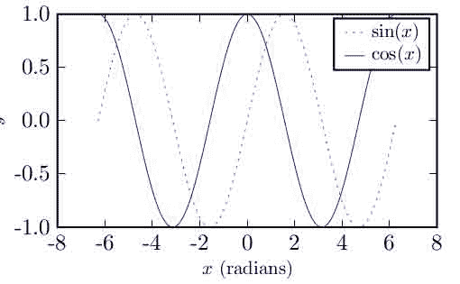 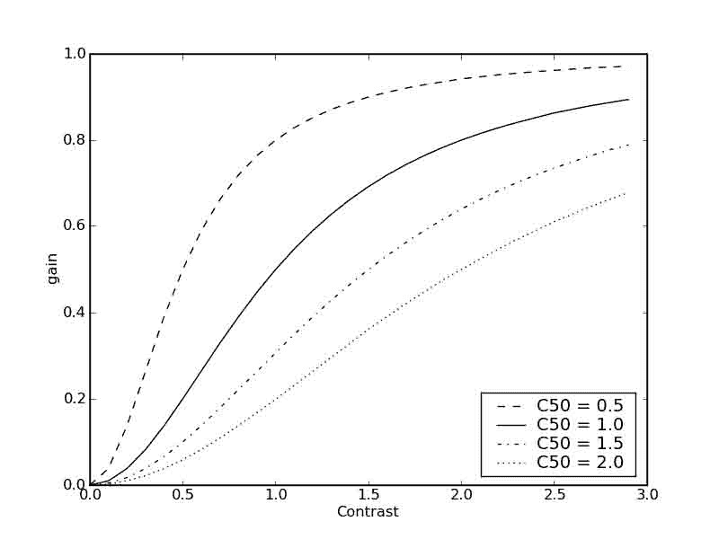 

# Matplotlib:使用 tex

# Matplotlib:使用 tex

Matplotlib 可以使用 LaTeX 来处理图形中的文本布局。这个选项(仍然是实验性的)可以通过在 rc 设置中设置 text.usetex : true 来激活。matplotlib 的 LaTeX 支持的文本处理比标准文本处理慢，但是更灵活，并且产生出版物质量的图。结果是惊人的，尤其是当你注意在你的图形中使用与主文档中相同的字体时。

Matplotlib 的 LaTeX 支持仍在开发中，尽管至少有两个人依靠它来为他们的博士论文生成数据。从 matplotlib-0.87 开始已经做了很多改进，如果你有更早的版本，请更新 matplotlib。此选项需要运行中的 LaTeX 安装、 [dvipng](http://sourceforge.net/projects/dvipng) (可能包含在您的 TeX 安装中)和 ghostscript ( [AFPL、GPL](http://www.cs.wisc.edu/~ghost/) 或 [ESP](http://www.cups.org/espgs/index.php) ghostscript 应该都可以，但建议使用 GPL ghostscript-8.60 或更高版本)。这些外部依赖项的可执行文件必须位于您的路径上。

有几个选项值得一提，可以使用 rc 设置进行更改，可以使用 matplotlibrc 文件，也可以使用程序中的 rcParams dict。下面是 matplotlibrc 文件的一个示例:

```py
font.family        : serif
font.serif         : Times, Palatino, New Century Schoolbook, Bookman, Computer Modern Roman
font.sans-serif    : Helvetica, Avant Garde, Computer Modern Sans serif
font.cursive       : Zapf Chancery
font.monospace     : Courier, Computer Modern Typewriter

text.usetex        : true 
```

每个系列中的第一个有效字体是将要加载的字体。如果未指定字体，默认情况下将使用计算机现代字体。所有其他字体都是 Adobe 字体。泰晤士报和帕拉蒂诺都有自己的数学字体，而其他的 Adobe 衬线字体使用计算机现代数学字体。详见[psnfss2e.pdf](http://www.ctan.org/tex-archive/macros/latex/required/psnfss/psnfss2e.pdf)。

要使用 tex 并选择例如 Helvetica 作为默认字体，而不编辑 matplotlibrc，请使用:

```py
#!python
from matplotlib import rc
rc('font',**{'family':'sans-serif','sans-serif':['Helvetica']})
## for Palatino and other serif fonts use:
#rc('font',**{'family':'serif','serif':['Palatino']})
rc('text', usetex=True) 
```

**注意**你需要在进口`matplotlib.pylab`之前做这个*。*

下面是标准示例，tex_demo.py:

```py
from matplotlib import rc
from matplotlib.numerix import arange, cos, pi
from pylab import figure, axes, plot, xlabel, ylabel, title, grid, savefig, show

rc('text', usetex=True)
figure(1)
ax = axes([0.1, 0.1, 0.8, 0.7])
t = arange(0.0, 1.0+0.01, 0.01)
s = cos(2*2*pi*t)+2
plot(t, s)

xlabel(r'\textbf{time (s)}')
ylabel(r'\textit{voltage (mV)}',fontsize=16)
title(r"\TeX\ is Number $\displaystyle\sum_{n=1}^\infty\frac{-e^{i\pi}}{2^n}$!", fontsize=16, color='r')
grid(True)
savefig('tex_demo')

show() 
```

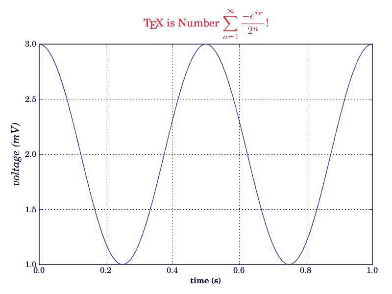

请注意，当 TeX/LaTeX 支持启用时，您可以混合文本和数学模式。不支持显示数学模式($$ e=mc^2 $$)，但是添加命令(如 tex_demo.py 中)将产生相同的结果。

为了生成可以嵌入到新 LaTeX 文档中的封装 postscript 文件，matplotlib 的默认行为是提取输出，这将删除 LaTeX 使用的一些 postscript 运算符，这些运算符在 eps 文件中是非法的。这一步会产生一些用户可能无法接受的字体。一种解决方法是在 rc 设置中将 ps.distiller.res 设置为更高的值(可能是 6000)。更好的解决方法，需要[[http://www.foolabs.com/xpdf/download.html](http://www.foolabs.com/xpdf/download.html)xpdf]或[[http://poppler.freedesktop.org/](http://poppler.freedesktop.org/)poppler](xpdf 的新后端)可以通过将 rc ps.usedistiller 设置更改为 xpdf 来激活。xpdf 替代方案生成的 postscript 文本可以在 Adobe Illustrator 中编辑，也可以在转换为 pdf 后搜索。

## 可能的问题

*   在 Windows 上，可能需要修改 PATH 环境变量来查找 latex、dvipng 和 ghostscript 可执行文件。这是通过转到控制面板，选择“系统”图标，选择“高级”选项卡，然后单击“环境变量”按钮来完成的(人们认为 Linux 很复杂。嘘。)选择 PATH 变量，并添加适当的目录。
*   使用 MiKTeX 与计算机现代字体，如果你得到奇数-Agg 和 PNG 的结果，去 MiKTeX/选项和更新你的格式文件
*   这些字体在屏幕上看起来很糟糕。你可能正在运行苹果操作系统，在苹果电脑上使用 dvipng 有一些有趣的事情。在 matplotlibrc 文件中设置为 True。
*   在 Ubuntu 和 Gentoo 上，基本的 texlive 安装没有附带 type1cm 包。您可能需要安装一些额外的软件包来获得与其他乳胶发行版捆绑在一起的所有好东西。
*   已经取得了一些进展，因此 Matplotlib 直接使用 dvi 文件进行文本布局。这允许 latex 用于 pdf 和 svg 后端以及*Agg 和 PS 后端的文本布局。未来，乳胶安装可能是唯一的外部依赖。

## 万一事情不顺利

*   试试`rm -r ~/.matplotlib/*cache`
*   确保 LaTeX、dvipng 和 ghostscript 都在您的 PATH 上工作。
*   在启用详细模式的情况下运行您的脚本:python example . py–verbose-help(或–verbose-debug-烦人)并检查输出。很可能那里报告了一个问题。如果您需要帮助，可以发布一个简短的例子来重现这种行为，明确指出对 rc 设置的任何更改，以及您安装了什么版本的 matplotlib、您的操作系统和–verbose-*输出。

## 附件

*   [`tex_demo.png`](../_downloads/tex_demo.jpg)


# 宫六世

# 宫六世

*   [玛雅维冲浪](MayaVi_Surf.html)
*   [【may avi tips】](MayaVi_Tips.html)
*   [玛雅 avi:奔跑玛雅 avi 2](MayaVi_RunningMayavi2.html)
*   [编写 Mayavi 2 脚本](MayaVi_ScriptingMayavi2.html)

# 玛雅维冲浪

# 玛雅维冲浪

如果你想绘制一个表面表示矩阵的高程和颜色的点，你必须转换矩阵数据的三维数据！MayaVi2 可以理解。[:Cookbook/MayaVi/mlab:mlab]知道如何做到这一点，但它没有的漂亮的用户界面！MayaVi2。这是一个创建！SurfRegular 对象，然后把它加载进去！MayaVi2。该脚本的更详细版本在示例页面中给出。

```py
import numpy
def f(x, y):
    return numpy.sin(x*y)/(x*y)
x = numpy.arange(-7., 7.05, 0.1)
y = numpy.arange(-5., 5.05, 0.05)
from enthought.tvtk.tools import mlab
s = mlab.SurfRegular(x, y, f)
from enthought.mayavi.sources.vtk_data_source import VTKDataSource
d = VTKDataSource()
d.data = s.data
mayavi.add_source(d)
from enthought.mayavi.filters.warp_scalar import WarpScalar
w = WarpScalar()
mayavi.add_filter(w)
from enthought.mayavi.modules.outline import Outline
from enthought.mayavi.modules.surface import Surface
o = Outline()
s = Surface()
mayavi.add_module(o)
mayavi.add_module(s) 
```

您可以通过运行“mayavi2 -n -x script.py”来运行这个脚本，通过菜单(File -> Open File)加载它，然后按 Ctrl+R，或者在 python shell 中输入“execfile('script.py ')。

## 附件

*   [`surf.png`](../_downloads/surf.jpg)

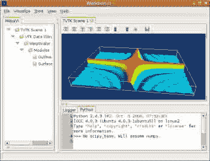

# 玛雅·提斯

# 玛雅·提斯

## 介绍

以下是如何最好地使用的一般提示！MayaVi2。

## 有效编写 MayaVi2 脚本

这里有一些提示，展示了如何交互式和有效地编写 mayavi2 脚本。

### 拖放对象

运行 contour.py python 脚本示例，您应该会得到:

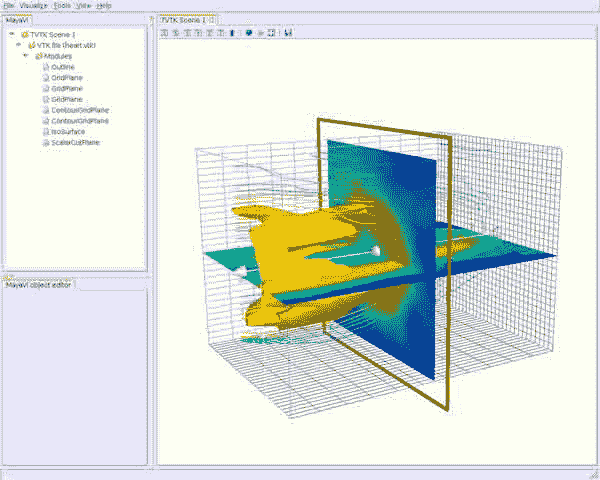

首先，在“视图”菜单中点击 python，启用 python shell。底部应该会出现一个 python 外壳！MayaVi2 窗口:

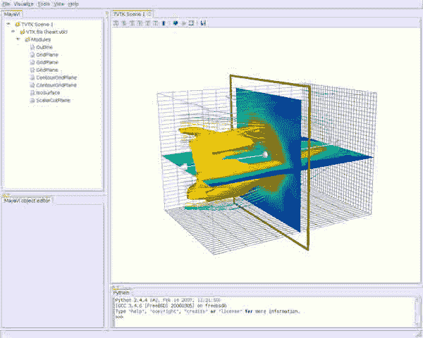

然后从左侧的树视图中拖动任何对象，并将其放到 python shell 中，您将获得该对象。假设您想要获得大纲模块:

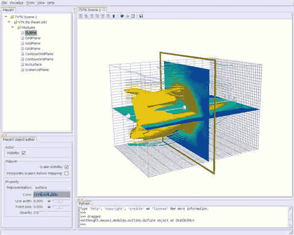

现在，您可以通过以下两种方式使用您的对象:直接在 python shell 中键入或者使用 explore()方法。

### 键入 python 外壳

您可以在 python shell 窗口中创建对象的实例。

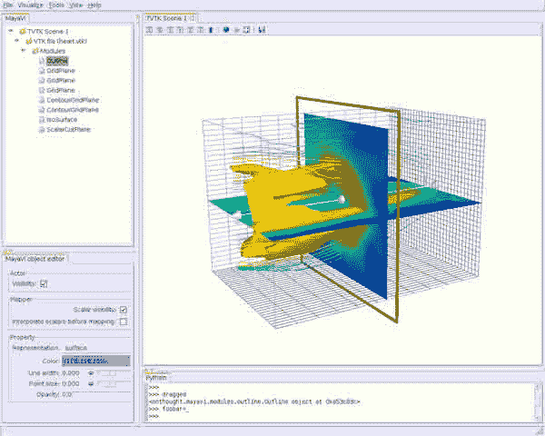

请注意，在这个 python shell 中，您受益于“单词完成”，即一个小窗口弹出，让您选择期望的对象或方法的名称。

因此，您可以显示轮廓颜色的 RGB 值，例如:

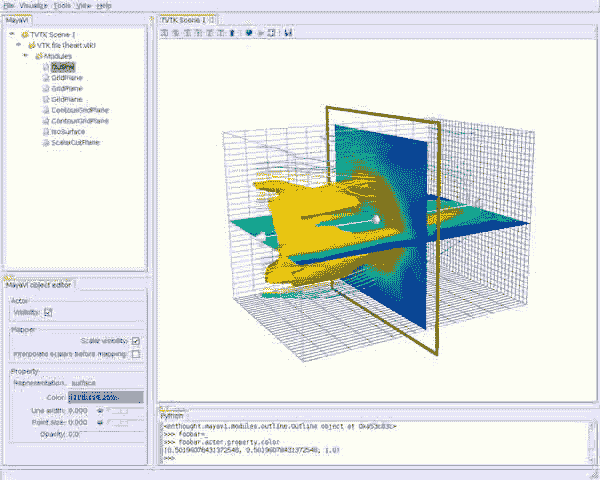

然而，找出对象或方法可能并不那么容易:你可能不知道它们是如何相互依赖的。更简单的方法是使用 explore()方法。

### 使用 explore()方法

简单地打字

```py
explore(_) 
```

或者

```py
explore(foobar) 
```

如果您之前已经定义了它:


然后，您会看到以下窗口:

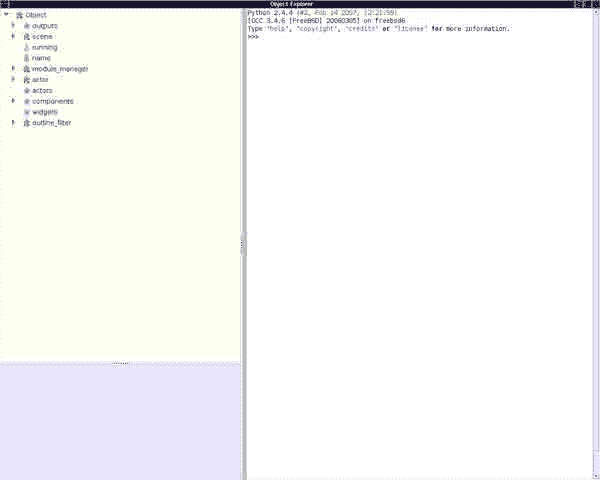

考虑最后一个例子，关于轮廓模块的颜色，您可以展开“树”，从而获得您需要的信息:

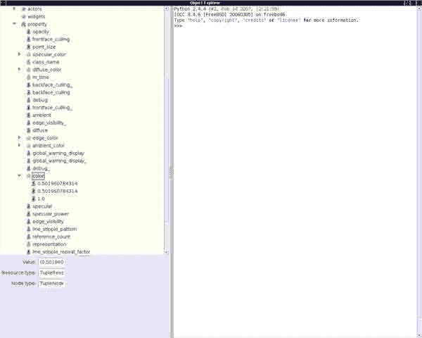

很厉害吧！:-)

您也可以在 pyhon shell 中工作，创建您的对象等等...

### 在 python 外壳中工作

在嵌入的 Python 外壳上！MayaVi2 应用，名字‘may avi’是绑定的！MayaVi 脚本界面，可用于编写 mayavi 脚本，如下所示:

```py
e = mayavi.engine # Get the MayaVi engine.
mayavi.new_scene() # Create a new scene
# [...]
mayavi.save_visualization('foo.mv2')
mayavi.load_visualization('foo.mv2') 
```

请注意，mayavi 引擎允许您以强大的方式编写 Mayavi 脚本。例如:

```py
e = mayavi.engine 
```

这里的“e”是正在运行的引擎实例(mayavi/engine.py)，其层次结构与您在 mayavi 树视图中看到的相同。例如:

```py
e.scenes[0]             # --> first scene in mayavi.
e.scenes[0].children[0] # --> first scene's first source (vtkfile) 
```

另一个例子，只需运行 examples/contour.py 并键入/剪切/粘贴以下内容，即可获得标量剪切平面模块:

```py
e = mayavi.engine
s = e.scenes[0].children[0].children[0].children[-1]
# Think scene.datafile.module_manager.last_module 
```

可以从 [IPython](http://ipython.scipy.org) 内部使用 Mayavi2 并编写脚本。您必须首先使用“-wthread”命令行选项启动 IPython。这里有一个例子:

```py
from enthought.mayavi.app import Mayavi
m = Mayavi()
m.main()
m.script.new_scene() # m.script is the mayavi.script.Script instance
engine = m.script.engine 
```

在上图中，“m.script”与嵌入式 shell 上的“mayavi”实例相同。

如果您正在编写一个独立的脚本来可视化类似于示例/目录中的脚本，请使用任何示例作为模板。

## 保存快照

在 python 脚本中保存快照非常简单:

```py
s = script.engine.current_scene
s.scene.save('test.jpg', size=(width,height)) 
```

你也可以用很多其他格式保存图片:！附言(ps)，封装！PostScript (eps)，PDF (pdf)，位图(bmp)，TIFF (tiff)，PNG (png)，！OpenInventor (iv)，虚拟现实标记语言(wrl，vrml)，Geomview (oogl)，！渲染人肋骨(肋骨)，波前(物体)。

保存快照的显而易见的必然结果是，为了拍电影而保存大量的快照，例如，没有！记录的每个快照的 MayaVi2 窗口弹出。

答案很简单(仅在 UN*X 框下):使用“X 虚拟帧缓冲区”。

以下几行给了你诀窍。当然，您可以通过用 shell、python 等编写脚本来改进它。

`* create your X virtual framebuffer with the following command: 'xvfb :1 -screen 0 1280x1024x24'. It will use the display #1, with a size of 1280x1024 and 24 bit depth color;`

`* export your display: 'export DISPLAY=:1' (sh/bash syntax) or 'setenv DISPLAY :1' (csh/tcsh syntax)`

`* run your !MayaVi2 script as usual;`

`* once finished, and all your snapshots have been created, don't forget to kill the X virtual framebuffer and reset your display to its previous value. If not, you won't be able to see your movie ;-)`

## 在颜色映射中启用 alpha 透明度

将模块管理器拖到 python shell 中，您将能够通过以下方式在颜色映射中启用 alpha 透明度:

```py
dragged.scalar_lut_manager.lut.alpha_range=(0,1) 
```

## 设置 MayaVi2 会话颜色

快跑！MayaVi2，转到“工具”菜单，然后“首选项”，然后“TVTK 场景”。

假设你想改变背景颜色:点击“背景颜色”标签。

在这里，你可以选择一个预定义的颜色，或者点击方块来设置你的 RGB 值。

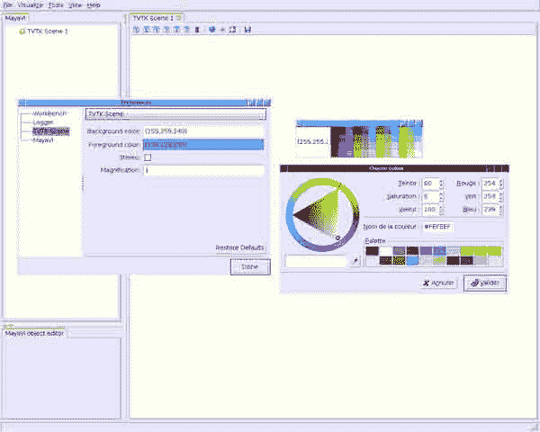

此外，如果您想要设置前景色，它将应用于所有模块和过滤器，即轮廓颜色、文本颜色、标签轴等。

您的首选项将保存在！MayaVi2 配置文件，所以每次运行一个！MayaVi2 会话。

=使用 TVTK 写入 VTK 数据文件=

即将推出...

## 附件

*   [`ps1.png`](../_downloads/ps1.jpg)
*   [`ps2.png`](../_downloads/ps2.jpg)
*   [`ps3.png`](../_downloads/ps3.jpg)
*   [`ps4.png`](../_downloads/ps4.jpg)
*   [`ps5.png`](../_downloads/ps5.jpg)
*   [`ps6.png`](../_downloads/ps6.jpg)
*   [`ps7.png`](../_downloads/ps7.jpg)
*   [`ps8.png`](../_downloads/ps8.jpg)
*   [`setcolors.png`](../_downloads/setcolors.jpg)


# 玛雅维:运行玛雅维 2

# 玛雅维:运行玛雅维 2

## 介绍

！MayaVi2 使用两种“对象”:模块和过滤器。

！P. Ramachandran 的《MayaVi 用户指南》(第 1.5 节)对它们的定义如下:

`* "A Module is an object that actually visualizes the data.";`

`* "A Filter is an object that filters out the data in some way or the other. A simple example is the !ExtractVectorNorm filter. This extracts the magnitude of the selected vector data field attribute for the data file. All modules that use this as an input will receive the vector magnitude as the scalar field data."`

你可以跑了！MayaVi2 使用以下两种方式之一:

`* run !MayaVi2 as is, without any options on the command line. You'll manage modules and/or filters using the GUI;`

`* run !MayaVi2 with some options on the command line, thus loading directly the modules and/or the filters you want to use.`

## 按原样运行 MayaVi2

注意:为了工作，这里假设您的 PATH 变量包含目录！安装了 MayaVi2 二进制文件(例如，/usr/local/bin)。

开始跑！MayaVi2:

```py
mayavi2 
```

！MayaVi2 将推出一个空白的 TVTK 场景。

`* Let's start by loading some data. Go into File/Open/Vtk file. This will bring up a file dialogue, use this to select the heart.vtk file under examples/data directory.`

`The TVTK Scene has not changed, but you see that the file is loaded by looking at the upper left window.`

`* Now that we have data, we can visualize it. First lets create an outline. Click on "VTK File (heart.vtk)" in the upper left window.`

`Go into the menu item Visualize/Modules/Outline. This creates an Outline object. We can edit the properties of the outline in the object editor, and we can rotate and manipulate the object in the scene editor.`

`* Now lets add three grid planes.`

`Select Visualize/Modules/!GridPlane, this create a grid plane in the X axis. We can create two more grid planes. By selecting Axis in object editor, we can set those grid planes in the Y and Z axis.`

`* We can project the object onto the Grid planes using contour grid planes. Select Visualize/Modules/Contour grid plane. Do this for the Y, and Z planes as well.`

`* Now we can look at our data by selecting Visualize/Modules/Isosurface.`

`* We can now finish adding a scalar cut plane by selecting Visualize/Modules/Scalar Cut Plane. By clicking on the white arrow we can move the plane around.`

结果应该是这样的(有关背景/前景色的问题，请参阅[:Cookbook/MayaVi/Tips:Cookbook/MayaVi/Tips]):

[](文件/附件/MayaVi_RunningMayavi2/mv2.png

## 使用一些参数运行 MayaVi2:模块和过滤器可用

为了知道可以在命令行上设置哪些参数，请键入

```py
mayavi2 -h 
```

这将列出所有可用的选项。所有这些选项包括:

`* -d file.vtk: set the VTK file to load into !MayaVi2;`

`* -m` *`module`* `: set the module to use. The following list displays all available modules, in alphabetical order with a short description (taken from Python doc files):`

`*` *`Axes`* `: draws a simple axes using tvtk.!CubeAxesActor;`

`*` *`!ContourGridPlane`* `: a contour grid plane module. This module lets one take a slice of input grid data and view contours of the data. The module only works for structured points, rectilinear grid and structured grid input.`

`*` *`!CustomGridPlane`* `: a custom grid plane with a lot more flexibility than !GridPlane. This also only works for non-unstructured/non-polygonal datasets.`

`*` *`Glyph`* `: displays different types of glyphs oriented and colored as per scalar or vector data at the input points;`

`*` *`!GridPlane`* `: a simple grid plane module;`

`*` *`!ImagePlaneWidget`* `: a simple !ImagePlaneWidget module to view image data;`

`*` *`!IsoSurface`* `: an !IsoSurface module that allows the user to make contours of input point data;`

`*` *`!OrientationAxes`* `: creates a small axes on the side that indicates the position of the co-ordinate axes and thereby marks the orientation of the scene. It uses the !OrientationMarkerWidget which requires VTK-4.5 and above.`

`*` *`Outline`* `: an outline module that draws an outline for the given data;`

`*` *`!ScalarCutPlane`* `: takes a cut plane of any input data set using an implicit plane and plots the data with optional contouring and scalar warping;`

`*` *`!SliceUnstructuredGrid`* `: this module takes a slice of the unstructured grid data and shows the cells that intersect or touch the slice;`

`*` *`Streamline`* `: allows the user to draw streamlines for given vector data. This supports various types of seed objects (line, sphere, plane and point seeds). It also allows the user to draw ribbons or tubes and further supports different types of interactive modes of calculating the streamlines.`

`*` *`!StructuredGridOutline`* `: draws a grid-conforming outline for structured grids;`

`*` *`Surface`* `: draws a surface for any input dataset with optional contouring;`

`*` *`Text`* `: this module allows the user to place text on the screen;`

`*` *`!VectorCutPlane`* `: takes an arbitrary slice of the input data using an implicit cut plane and places glyphs according to the vector field data. The glyphs may be colored using either the vector magnitude or the scalar attributes.`

`*` *`Vectors`* `: displays different types of glyphs oriented and colored as per vector data at the input points. This is merely a convenience module that is entirely based on the Glyph module.`

`*` *`Volume`* `: the Volume module visualizes scalar fields using volumetric visualization techniques. This supports !ImageData and !UnstructuredGrid data. It also supports the !FixedPointRenderer for !ImageData. However, the performance is slow so your best bet is probably with the !ImageData based renderers.`

`*` *`!WarpVectorCutPlane`* `: takes an arbitrary slice of the input data using an implicit cut plane and warps it according to the vector field data. The scalars are displayed on the warped surface as colors.`

`* -f` *`filter`* `: set the filter to use (load it before module if you want to see your data filtered). Available filters are:`

`*` *`!CellToPointData`* `: transforms cell attribute data to point data by averaging the cell data from the cells at the point.`

`*` *`Delaunay2D`* `: performs a 2D Delaunay triangulation using the tvtk.Delaunay2D class;`

`*` *`Delaunay3D`* `: performs a 3D Delaunay triangulation using the tvtk.Delaunay3D class;`

`*` *`!ExtractGrid`* `: allows a user to select a part of a structured grid;`

`*` *`!ExtractUnstructuredGrid`* `: allows a user to select a part of an unstructured grid;`

`*` *`!ExtractVectorNorm`* `: computes the norm (Eucliedean) of the input vector data (with optional scaling between [0, 1]). This is useful when the input data has vector input but no scalar data for the magnitude of the vectors.`

`*` *`!MaskPoints`* `: selectively passes the input points downstream. This can be used to subsample the input points. Note that this does not pass geometry data, this means all grid information is lost.`

`*` *`!PointToCellData`* `: does the inverse of the !CellToPointData filter;`

`*` *`!PolyDataNormals`* `: computes normals from input data. This gives meshes a smoother appearance. This should work for any input dataset. Note: this filter is called "Compute Normals" in !MayaVi2 GUI (Visualize/Filters/Compute Normals).`

`*` *`Threshold`* `: a simple filter that thresholds on input data;`

`*` *`!TransformData`* `: performs a linear transformation to input data using a tvtk.!BoxWidget. This does not work with !ImageData/StructuredPoints.`

`*` *`!WarpScalar`* `: warps the input data along a particular direction (either the normals or a specified direction) with a scale specified by the local scalar value. Useful for making carpet plots.`

`*` *`!WarpVector`* `: warps the input data along a the point vector attribute scaled as per a scale factor. Useful for showing flow profiles or displacements.`

好吧，你认为你会很快厌倦键入所有这些长名称模块和过滤器吗？别担心，使用你的 shell 完成命令！

例如，对于(t)csh shell，您可以将这一行放在配置 shell 文件中:

```py
complete mayavi2 c/-/"(3 d f m n M p q w x z)"/ n/-3/f:*.3ds/ n/-d/f:*.vt?/ n/-f/"(CellToPointData Delaunay2D Delaunay3D ExtractGrid ExtractUnstructuredGrid ExtractVectorNorm MaskPoints PointToCellData PolyDataNormals Threshold TransformData WarpScalar WarpVector)"/ n/-m/"(Axes ContourGridPlane CustomGridPlane Glyph GridPlane ImagePlaneWidget IsoSurface Outline OrientationAxes ScalarCutPlane SliceUnstructuredGrid Streamline StructuredGridOutline Surface Text Vectors VectorCutPlane Volume WarpVectorCutPlane)"/ n/-p/f:{*xyz.bin,*.xyz}/ n/-q/f:{*q.bin,*.q}/ n/-w/f:*.wrl/ n/-x/f:*.py/ n/-z/f:*.mv2/ 
```

第一次输入相当长的时间，但是一旦输入，就不再需要加载您想要使用的模块或过滤器了！；-)

于是，打字(在！MayaVi2 的示例目录，参见[:cook book/may avi/Installation:cook book/may avi/Installation]]:

```py
mayavi2 -d data/heart.vtk -m Outline -m GridPlane -m GridPlane -m GridPlane -m ContourGridPlane -m ContourGridPlane -m IsoSurface -m ScalarCutPlane 
```

你应该明白:

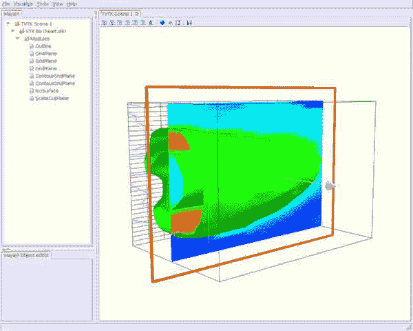

好的，这与上图不完全相同，尽管加载了完全相同的模块。

原因是你没有设置(也不能，AFAIK)一些模块属性，比如 iso-value for！Iso 曲面模块，法线到！GridPlane 等。

希望您可以使用图形用户界面“手动”设置这些参数。

那么现在，让我们来玩这个 GUI-)

## 四处走动

所以，你可以在这两幅图上看到右边的渲染窗口(TVTK 场景)在左边的模块树旁边。让我们考虑第一个数字。

您可以像往常一样使用 OpenGL 使用鼠标处理渲染场景:

*   按住左键移动鼠标旋转场景；
*   按下中间按钮移动鼠标可以平移它；
*   按住右键移动鼠标可以放大/缩小(注意:如果你有鼠标的话，你也可以使用它的滚轮)。

注意:你可以通过点击“视图”项或每个小图标获得一个“预定义”的视角(垂直于 X 轴、y 轴或 z 轴)(第一个 X: Ox 轴指向你的后方，第二个 X: Ox 轴指向你的方向，等等...)

在窗口左侧可以看到加载了哪些模块(“TVTK Scene”是场景的“根”，“VTK 文件”是数据源，即 heart.vtk 文件):

*   “轮廓”模块显示场景周围的方框；
*   您有三个网格平面("！GridPlane "模块)，在坐标 x = 0、y = 0 和 z = 0 处；
*   两个轮廓网格平面("！ContourGridPlane "模块):第一个显示等高线(垂直方向)，第二个，z = const 处的剖切面；
*   "!等值面”模块将心脏显示为黄色；
*   最后一个剖切面(垂直方向，y = const)由"！ScalarCutPlane”模块。

请注意，这些场景中没有使用滤镜。

使用每个模块/过滤器非常直观。单击树中的模块/过滤器，用鼠标设置一些参数，或者在图形用户界面左下方的窗口中用键盘输入一些值。

如果您想要复制/粘贴/删除/剪切给定的模块/过滤器，请用右键单击它。一个小窗口弹出，有一个项目列表。

注意:双击树中选择的模块/过滤器可以得到一个更大的窗口。

要加载其他模块或添加过滤器，请单击窗口顶部的“可视化”项目。

最后，你还可以加载另一个 VTK 数据文件，加载/保存场景在一个"！MayaVi2 "文件(扩展名为. mv2)，或者将其转换为所需的图像格式(PNG、JPEG...)，单击“文件”项目或相应的图标(小软盘)。

你也可以通过点击小方块中代表四个红色箭头的小图标来全屏显示你的场景。要禁用全屏模式，请键入“e”或“q”。

这是最简单的使用方法！MayaVi2。这里提醒您，您也可以尝试“mayavi2 -h”来查看可以添加到！MayaVi2 命令行。

## 附件

*   [`mv2.png`](../_downloads/mv2.jpg)
*   [`mv2_cmdline.png`](../_downloads/mv2_cmdline.jpg)

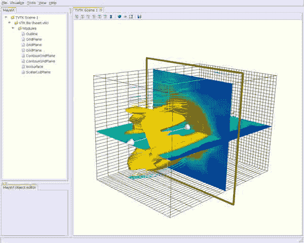 

# 编写 Mayavi 2 脚本

# 编写 Mayavi 2 脚本

|| 本页展示了使用高级、面向对象的 API 编写 Mayavi2 脚本。Mayavi2 最近获得了一个易于使用的脚本模块:mlab，虽然它的功能可能不那么强大。请参考[美亚威 2 用户指南](http://code.enthought.com/projects/mayavi/docs/development/mayavi/html/)的[部分](http://code.enthought.com/projects/mayavi/docs/development/mayavi/html/mlab.html)。阅读此页面将让您更深入地了解 Mayavi2 的工作原理，它是对用户指南的补充。||

## 介绍

去写剧本！MayaVi2，你需要(至少):

`* your favorite text editor;``* python installed ;-)``* !MayaVi2 installed ;-)`

脚本！MayaVi2 相当简单，因为！MayaVi2 是用 python 编写的，基于 TVTK，它简化了所有 VTK 对象的使用。

在下面，您将学习如何编写脚本和使用！MayaVi2 模块和过滤器。

模块可以分为两部分:

`* modules which do not interact with VTK data, and are seldom modified/handled (Outline, Axes, !OrientationAxes and Text). These are called the "basic" modules. Although color bar is not strictly speaking a module, it will be presented here. Setting a few parameters for rendering your scene will be also presented.`

`* modules which do interact with VTK data, and those you want to play with (i.e. all the remainder modules ;-).`

开始之前，我们先来看看 a 的“主模板”！用 python 编写的 MayaVi2 脚本。

## 主模板:创建你的 MayaVi2 类

a！MayaVi2 脚本应该至少包含以下几行:

```py
#! /usr/bin/env python

from enthought.mayavi.app import Mayavi

class MyClass(Mayavi):

    def run(self):
        script = self.script
        # `self.script` is the MayaVi Script interface (an instance of
        # enthought.mayavi.script.Script) that is created by the
        # base `Mayavi` class.  Here we save a local reference for
        # convenience.

        ## import any Mayavi modules and filters you want (they must be done here!)
        .../...

        script.new_scene()                      # to create the rendering scene

        ## your stuff (modules, filters, etc) here
        .../...

if __name__ == '__main__':

    mc = MyClass()
    mc.main() 
```

添加模块或过滤器非常简单:您必须导入它，然后将其添加到您的！MayaVi2 类。

要添加模块，请键入:

```py
from enthought.mayavi.modules.foo_module import FooModule
.../...
mymodule = FooModule()
script.add_module(mymodule) 
```

要添加过滤器，请键入:

```py
from enthought.mayavi.filters.bar_filter import BarFilter
.../...
myfilter = BarFilter()
script.add_filter(myfilter) 
```

请注意使用的语法:例如，对于模块，foo_module 是 foo_module python 文件(没有扩展名。py)在 mayavi/目录的子目录 module/中(小写，下划线)；该文件包含类 FooModule(无下划线，大写名称)。

但是首先，在用您想要使用的模块和过滤器渲染场景之前，您当然必须加载一些数据。

## 正在加载数据

你可以选择:

`* create a 3D data array, for scalars data (for vectors data, you have to use a 4D scalars data, i.e. a 3D scalar data for each component) and load it with !ArraySource method;`

`* load a data file with !FileReader methods.`

### 使用 ArraySource 方法从数组加载数据

例如，我们将创建余弦&正弦函数乘积的 50 *50* 50 3D(标量)数组。

为此，我们需要加载适当的模块:

```py
import scipy
from scipy import ogrid, sin, cos, sqrt, pi

from enthought.mayavi.sources.array_source import ArraySource

Nx = 50
Ny = 50
Nz = 50

Lx = 1
Ly = 1
Lz = 1

x, y, z = ogrid[0:Lx:(Nx+1)*1j,0:Ly:(Ny+1)*1j,0:Lz:(Nz+1)*1j]

# Strictly speaking, H is the magnetic field of the "transverse electric" eigenmode m=n=p=1
# of a rectangular resonator cavity, with dimensions Lx, Ly, Lz
Hx = sin(x*pi/Lx)*cos(y*pi/Ly)*cos(z*pi/Lz)
Hy = cos(x*pi/Lx)*sin(y*pi/Ly)*cos(z*pi/Lz)
Hz = cos(x*pi/Lx)*cos(y*pi/Ly)*sin(z*pi/Lz)
Hv_scal = sqrt(Hx**2 + Hy**2 + Hz**2)

# We want to load a scalars data (Hv_scal) as magnitude of a given 3D vector (Hv = {Hx, Hy, Hz})
# Hv_scal is a 3D scalars data, Hv is a 4D scalars data
src = ArraySource()
src.scalar_data = Hv_scal # load scalars data

# To load vectors data
# src.vector_data = Hv 
```

### 使用文件阅读器方法从文件加载数据

要加载 VTK 数据文件，比如 mayavi/examples/data/ directory 中的 heart.vtk 文件，只需键入:

```py
from enthought.mayavi.sources.vtk_file_reader import VTKFileReader

src = VTKFileReader()
src.initialize("heart.vtk") 
```

注意:文件带有。vtk 扩展名被称为“传统 VTK”文件。！MayaVi2 可以读取很多其他文件格式(XML、来自 Ensight、Plot3D 等的文件)。例如，您可以加载一个 XML 文件(扩展名为。vti，。vtp，。vtr，。vts，。vtu 等)使用 VTKXML！FileReader 方法。

### 将源代码添加到您的 MayaVi2 类中

然后，一旦使用上述两种方法之一加载了数据，就在类的主体中使用 add_source()方法添加源！MyClass(在 script.new_scene 之后):

```py
script.add_source(src) 
```

四个基本模块轮廓，轴，！现在将呈现方向轴和文本。

## 基本模块

请参见[:cook book/MayaVi/scriptingmayavi 2/Basic Modules:Basic Modules]维基页面。

## 主要模块

请参见[:cook book/MayaVi/scriptingmayavi 2/Main Modules:Main Modules]维基页面。

## 过滤

请参见[:Cookbook/MayaVi/scriptingmayavi 2/Filters:Filters]维基页面。