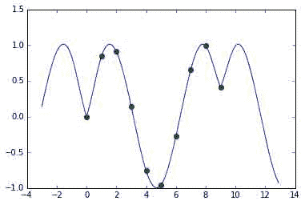
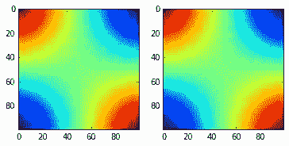
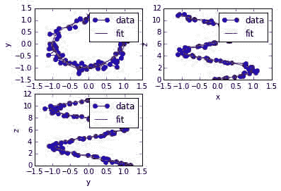

# 十二、Numpy 和 Scipy / 插值

*   [插值](Interpolation.html)
*   [使用径向基函数进行平滑/插值](RadialBasisFunctions.html)
*   [2d 示例](RadialBasisFunctions.html#id1)

# 插入文字

# 插入文字

## 在科学信号中使用 B 样条

演示如何在 scipy.signal 中使用 B 样条进行插值的示例。输入点必须等距才能使用这些例程。

```py
from numpy import r_, sin
from scipy.signal import cspline1d, cspline1d_eval
%pylab inline

x = r_[0:10]
dx = x[1]-x[0]
newx = r_[-3:13:0.1]  # notice outside the original domain
y = sin(x)
cj = cspline1d(y)
newy = cspline1d_eval(cj, newx, dx=dx,x0=x[0])
from pylab import plot, show
plot(newx, newy, x, y, 'o')
show() 
```

```py
 Populating the interactive namespace from numpy and matplotlib 
```



## 等间距数据的二维插值

scipy.ndimage 包还包含 spline_filter 和 map _ 坐标，可用于对等间距数据执行 N 维插值。下面给出了一个二维例子:

```py
from scipy import ogrid, sin, mgrid, ndimage, array
from matplotlib import pyplot as plt

x,y = ogrid[-1:1:5j,-1:1:5j]
fvals = sin(x)*sin(y)
newx,newy = mgrid[-1:1:100j,-1:1:100j]
x0 = x[0,0]
y0 = y[0,0]
dx = x[1,0] - x0
dy = y[0,1] - y0
ivals = (newx - x0)/dx
jvals = (newy - y0)/dy
coords = array([ivals, jvals])
newf1 = ndimage.map_coordinates(fvals, coords) 
```

要预先计算权重(对于多个插值结果)，您可以使用

```py
coeffs = ndimage.spline_filter(fvals)
newf2 = ndimage.map_coordinates(coeffs, coords, prefilter=False)

plt.subplot(1,2,1)
plt.imshow(newf1)
plt.subplot(1,2,2)
plt.imshow(newf2)
plt.show() 
```



## 一维曲线的插值

scipy.interpolate 软件包包装了 netlib FITPACK 例程(Dierckx)，用于计算各种数据和几何图形的平滑样条。虽然在这个例子中数据是均匀分布的，但是使用这个例程并不需要如此。

```py
from numpy import arange, cos, linspace, pi, sin, random
from scipy.interpolate import splprep, splev

# make ascending spiral in 3-space
t=linspace(0,1.75*2*pi,100)

x = sin(t)
y = cos(t)
z = t

# add noise
x+= random.normal(scale=0.1, size=x.shape)
y+= random.normal(scale=0.1, size=y.shape)
z+= random.normal(scale=0.1, size=z.shape)

# spline parameters
s=3.0 # smoothness parameter
k=2 # spline order
nest=-1 # estimate of number of knots needed (-1 = maximal)

# find the knot points
tckp,u = splprep([x,y,z],s=s,k=k,nest=-1)

# evaluate spline, including interpolated points
xnew,ynew,znew = splev(linspace(0,1,400),tckp)

import pylab
pylab.subplot(2,2,1)
data,=pylab.plot(x,y,'bo-',label='data')
fit,=pylab.plot(xnew,ynew,'r-',label='fit')
pylab.legend()
pylab.xlabel('x')
pylab.ylabel('y')

pylab.subplot(2,2,2)
data,=pylab.plot(x,z,'bo-',label='data')
fit,=pylab.plot(xnew,znew,'r-',label='fit')
pylab.legend()
pylab.xlabel('x')
pylab.ylabel('z')

pylab.subplot(2,2,3)
data,=pylab.plot(y,z,'bo-',label='data')
fit,=pylab.plot(ynew,znew,'r-',label='fit')
pylab.legend()
pylab.xlabel('y')
pylab.ylabel('z')
plt.show() 
```



# 使用径向基函数进行平滑/插值

# 使用径向基函数进行平滑/插值

径向基函数可用于平滑/插值 n 维中的分散数据，但应谨慎用于观测数据范围之外的外推。

## 1d 示例

这个例子比较了 scipy.interpolate 模块中 Rbf 和 UnivariateSpline 类的用法。

```py
import numpy as np
from scipy.interpolate import Rbf, InterpolatedUnivariateSpline

import matplotlib
matplotlib.use('Agg')
import matplotlib.pyplot as plt

# setup data
x = np.linspace(0, 10, 9)
y = np.sin(x)
xi = np.linspace(0, 10, 101)

# use fitpack2 method
ius = InterpolatedUnivariateSpline(x, y)
yi = ius(xi)

plt.subplot(2, 1, 1)
plt.plot(x, y, 'bo')
plt.plot(xi, yi, 'g')
plt.plot(xi, np.sin(xi), 'r')
plt.title('Interpolation using univariate spline')

# use RBF method
rbf = Rbf(x, y)
fi = rbf(xi)

plt.subplot(2, 1, 2)
plt.plot(x, y, 'bo')
plt.plot(xi, yi, 'g')
plt.plot(xi, np.sin(xi), 'r')
plt.title('Interpolation using RBF - multiquadrics')
plt.savefig('rbf1d.png') 
```

[](文件/附件/RadialBasisFunctions/rbf1 dnew . png