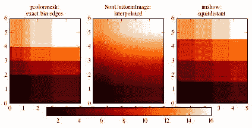
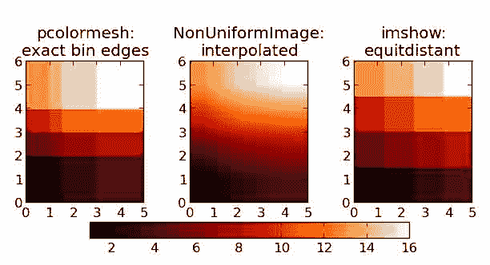

# 十四、Numpy 和 Scipy / Matplotlib 直方图

*   [直方图](Histograms.html)

# 直方图

# 直方图

下面是一个创建可变仓位大小的 2D 直方图并显示的例子。

```py
#!/usr/bin/python
import numpy as np
import matplotlib as ml
import matplotlib.pyplot as plt

# First we define the bin edges
xedges = [0, 1, 1.5, 3, 5]
yedges = [0, 2, 3, 4, 6]

# Next we create a histogram H with random bin content
x = np.random.normal(3, 1, 100)
y = np.random.normal(1, 1, 100)
H, xedges, yedges = np.histogram2d(y, x, bins=(xedges, yedges))

# Or we fill the histogram H with a determined bin content
H = np.ones((4, 4)).cumsum().reshape(4, 4)
print H[::-1]  # This shows the bin content in the order as plotted

ml.rcParams['image.cmap'] = 'gist_heat'

fig = plt.figure(figsize=(6, 3.2))

# pcolormesh is useful for displaying exact bin edges
ax = fig.add_subplot(131)
ax.set_title('pcolormesh:\nexact bin edges')
X, Y = np.meshgrid(xedges, yedges)
plt.pcolormesh(X, Y, H)
ax.set_aspect('equal')

# NonUniformImage can be used for interpolation
ax = fig.add_subplot(132)
ax.set_title('NonUniformImage:\ninterpolated')
im = ml.image.NonUniformImage(ax, interpolation='bilinear')
xcenters = xedges[:-1] + 0.5 * (xedges[1:] - xedges[:-1])
ycenters = yedges[:-1] + 0.5 * (yedges[1:] - yedges[:-1])
im.set_data(xcenters, ycenters, H)
ax.images.append(im)
ax.set_xlim(xedges[0], xedges[-1])
ax.set_ylim(yedges[0], yedges[-1])
ax.set_aspect('equal')

# Imshow is useful for a simple equidistant representation of bin content
ax = fig.add_subplot(133)
ax.set_title('imshow:\nequitdistant')
im = plt.imshow(H, interpolation='nearest', origin='low',
                extent=[xedges[0], xedges[-1], yedges[0], yedges[-1]])

# Finally we add a color bar
cax = fig.add_axes([0.12, 0.1, 0.78, 0.4])
cax.get_xaxis().set_visible(False)
cax.get_yaxis().set_visible(False)
cax.patch.set_alpha(0)
cax.set_frame_on(False)
plt.colorbar(orientation='horizontal', ax=cax)
plt.tight_layout()
plt.show() 
```

```py
 [[ 13\.  14\.  15\.  16.]
  [  9\.  10\.  11\.  12.]
  [  5\.   6\.   7\.   8.]
  [  1\.   2\.   3\.   4.]] 
```



## 附件

*   [`histogram2d.png`](../_downloads/histogram2d.jpg)

