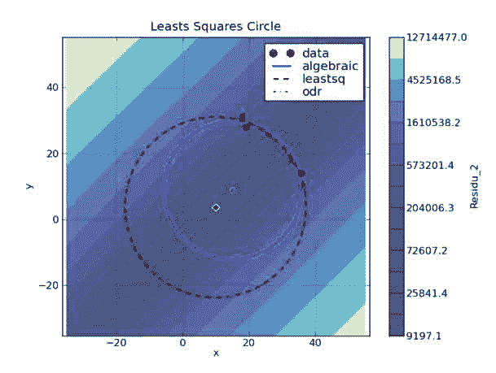
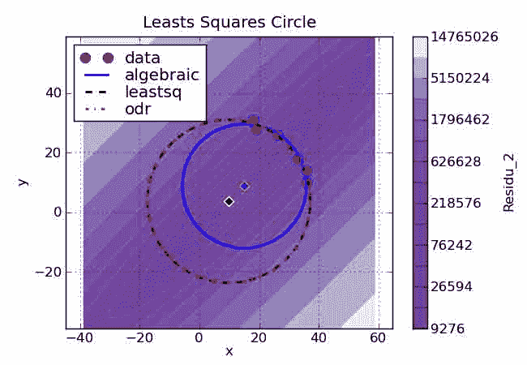
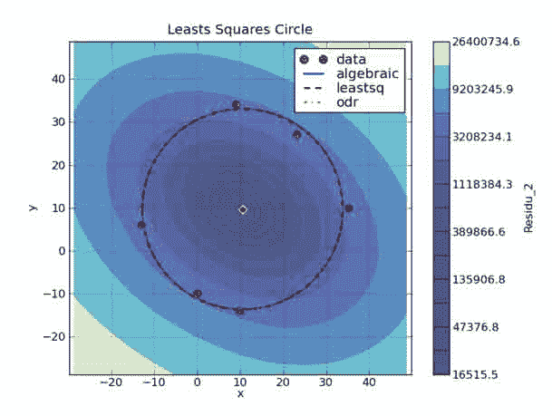
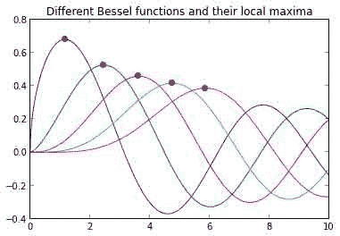

# 十五、Numpy 和 Scipy / 优化和拟合技术

*   [拟合数据](FittingData.html)
*   [scipy](bundle_adjustment.html)大规模管束调整
*   [最小二乘圆](Least_Squares_Circle.html)
*   [线性回归](LinearRegression.html)
*   ols
*   [优化和拟合演示](OptimizationAndFitDemo1.html)
*   [优化演示](OptimizationDemo1.html)
*   [transac](RANSAC.html)
*   [scipy 中的稳健非线性回归](robust_regression.html)
*   [在 scipy 中求解离散边值问题](discrete_bvp.html)

# 拟合数据

# 拟合数据

本页向您展示了如何使用 matplotlib 拟合实验数据和绘制结果。

## 用正弦函数拟合示例

### 生成数据

使用真实数据要有趣得多，但是，为了让您能够重现这个示例，我将生成适合的数据

```py
import numpy as np
from numpy import pi, r_
import matplotlib.pyplot as plt
from scipy import optimize

# Generate data points with noise
num_points = 150
Tx = np.linspace(5., 8., num_points)
Ty = Tx

tX = 11.86*np.cos(2*pi/0.81*Tx-1.32) + 0.64*Tx+4*((0.5-np.random.rand(num_points))*np.exp(2*np.random.rand(num_points)**2))
tY = -32.14*np.cos(2*np.pi/0.8*Ty-1.94) + 0.15*Ty+7*((0.5-np.random.rand(num_points))*np.exp(2*np.random.rand(num_points)**2)) 
```

### 拟合数据

我们现在有两组数据:时间序列 tX 和 tY，以及带噪声的正弦数据 Tx 和 Ty。我们感兴趣的是找到正弦波的频率。

```py
# Fit the first set
fitfunc = lambda p, x: p[0]*np.cos(2*np.pi/p[1]*x+p[2]) + p[3]*x # Target function
errfunc = lambda p, x, y: fitfunc(p, x) - y # Distance to the target function
p0 = [-15., 0.8, 0., -1.] # Initial guess for the parameters
p1, success = optimize.leastsq(errfunc, p0[:], args=(Tx, tX))

time = np.linspace(Tx.min(), Tx.max(), 100)
plt.plot(Tx, tX, "ro", time, fitfunc(p1, time), "r-") # Plot of the data and the fit

# Fit the second set
p0 = [-15., 0.8, 0., -1.]
p2,success = optimize.leastsq(errfunc, p0[:], args=(Ty, tY))

time = np.linspace(Ty.min(), Ty.max(), 100)
plt.plot(Ty, tY, "b^", time, fitfunc(p2, time), "b-")

# Legend the plot
plt.title("Oscillations in the compressed trap")
plt.xlabel("time [ms]")
plt.ylabel("displacement [um]")
plt.legend(('x position', 'x fit', 'y position', 'y fit'))

ax = plt.axes()

plt.text(0.8, 0.07,
         'x freq : %.3f kHz \n y freq : %.3f kHz' % (1/p1[1],1/p2[1]),
         fontsize=16,
         horizontalalignment='center',
         verticalalignment='center',
         transform=ax.transAxes)

plt.show() 
```


### 成本函数的巧妙运用

假设你有相同的数据集:两个时间序列的振荡现象，但你知道两个振荡的频率是相同的。成本函数的巧妙使用可以让您使用相同的频率在一次拟合中拟合两组数据。其思想是将两个数据集的成本串联起来作为一个“成本”数组返回给一个参数选择。因此，最小化例程同时优化两个数据集。

```py
# Target function
fitfunc = lambda T, p, x: p[0]*np.cos(2*np.pi/T*x+p[1]) + p[2]*x
# Initial guess for the first set's parameters
p1 = r_[-15., 0., -1.]
# Initial guess for the second set's parameters
p2 = r_[-15., 0., -1.]
# Initial guess for the common period
T = 0.8
# Vector of the parameters to fit, it contains all the parameters of the problem, and the period of the oscillation is not there twice !
p = r_[T, p1, p2]
# Cost function of the fit, compare it to the previous example.
errfunc = lambda p, x1, y1, x2, y2: r_[
                fitfunc(p[0], p[1:4], x1) - y1,
                fitfunc(p[0], p[4:7], x2) - y2
            ]
# This time we need to pass the two sets of data, there are thus four "args".
p,success = optimize.leastsq(errfunc, p, args=(Tx, tX, Ty, tY))
time = np.linspace(Tx.min(), Tx.max(), 100) # Plot of the first data and the fit
plt.plot(Tx, tX, "ro", time, fitfunc(p[0], p[1:4], time),"r-")

# Plot of the second data and the fit
time = np.linspace(Ty.min(), Ty.max(),100)
plt.plot(Ty, tY, "b^", time, fitfunc(p[0], p[4:7], time),"b-")

# Legend the plot
plt.title("Oscillations in the compressed trap")
plt.xlabel("time [ms]")
plt.ylabel("displacement [um]")
plt.legend(('x position', 'x fit', 'y position', 'y fit'))

ax = plt.axes()

plt.text(0.8, 0.07,
         'x freq : %.3f kHz' % (1/p[0]),
         fontsize=16,
         horizontalalignment='center',
         verticalalignment='center',
         transform=ax.transAxes) 
```

```py
 <matplotlib.text.Text at 0x7fab996e5b90> 
```


## 简化语法

尤其是在使用 fits 进行交互时，optimize.leastsq 的标准语法可能会变得很长。使用以下脚本可以简化您的生活:

```py
import numpy as np
from scipy import optimize

class Parameter:
    def __init__(self, value):
            self.value = value

    def set(self, value):
            self.value = value

    def __call__(self):
            return self.value

def fit(function, parameters, y, x = None):
    def f(params):
        i = 0
        for p in parameters:
            p.set(params[i])
            i += 1
        return y - function(x)

    if x is None: x = np.arange(y.shape[0])
    p = [param() for param in parameters]
    return optimize.leastsq(f, p) 
```

现在拟合变得非常容易，例如拟合高斯:

```py
# giving initial parameters
mu = Parameter(7)
sigma = Parameter(3)
height = Parameter(5)

# define your function:
def f(x): return height() * np.exp(-((x-mu())/sigma())**2)

# fit! (given that data is an array with the data to fit)
data = 10*np.exp(-np.linspace(0, 10, 100)**2) + np.random.rand(100)
print fit(f, [mu, sigma, height], data) 
```

```py
 (array([ -1.7202343 ,  12.29906459,  10.74194291]), 1) 
```

## 拟合高斯型数据

### 计算分布的矩

拟合高斯形状的数据不需要优化程序。仅仅计算分布的矩就足够了，而且这要快得多。

然而，这只有在高斯没有被切掉太多，并且不是太小的情况下才起作用。

```py
gaussian = lambda x: 3*np.exp(-(30-x)**2/20.)

data = gaussian(np.arange(100))

plt.plot(data, '.')

X = np.arange(data.size)
x = np.sum(X*data)/np.sum(data)
width = np.sqrt(np.abs(np.sum((X-x)**2*data)/np.sum(data)))

max = data.max()

fit = lambda t : max*np.exp(-(t-x)**2/(2*width**2))

plt.plot(fit(X), '-') 
```

```py
 [<matplotlib.lines.Line2D at 0x7fab9977d990>] 
```


### 拟合 2D 高斯

这是适合 2D 高斯分布的健壮代码。它计算数据的矩来猜测优化例程的初始参数。对于更完整的高斯，一个可选的加性常数和旋转，请参见[。它还允许指定已知的错误。](http://code.google.com/p/agpy/source/browse/trunk/agpy/gaussfitter.py)

```py
def gaussian(height, center_x, center_y, width_x, width_y):
    """Returns a gaussian function with the given parameters"""
    width_x = float(width_x)
    width_y = float(width_y)
    return lambda x,y: height*np.exp(
                -(((center_x-x)/width_x)**2+((center_y-y)/width_y)**2)/2)

def moments(data):
    """Returns (height, x, y, width_x, width_y)
 the gaussian parameters of a 2D distribution by calculating its
 moments """
    total = data.sum()
    X, Y = np.indices(data.shape)
    x = (X*data).sum()/total
    y = (Y*data).sum()/total
    col = data[:, int(y)]
    width_x = np.sqrt(np.abs((np.arange(col.size)-y)**2*col).sum()/col.sum())
    row = data[int(x), :]
    width_y = np.sqrt(np.abs((np.arange(row.size)-x)**2*row).sum()/row.sum())
    height = data.max()
    return height, x, y, width_x, width_y

def fitgaussian(data):
    """Returns (height, x, y, width_x, width_y)
 the gaussian parameters of a 2D distribution found by a fit"""
    params = moments(data)
    errorfunction = lambda p: np.ravel(gaussian(*p)(*np.indices(data.shape)) -
                                 data)
    p, success = optimize.leastsq(errorfunction, params)
    return p 
```

这里有一个使用它的例子:

```py
# Create the gaussian data
Xin, Yin = np.mgrid[0:201, 0:201]
data = gaussian(3, 100, 100, 20, 40)(Xin, Yin) + np.random.random(Xin.shape)

plt.matshow(data, cmap=plt.cm.gist_earth_r)

params = fitgaussian(data)
fit = gaussian(*params)

plt.contour(fit(*np.indices(data.shape)), cmap=plt.cm.copper)
ax = plt.gca()
(height, x, y, width_x, width_y) = params

plt.text(0.95, 0.05, """
x : %.1f
y : %.1f
width_x : %.1f
width_y : %.1f""" %(x, y, width_x, width_y),
        fontsize=16, horizontalalignment='right',
        verticalalignment='bottom', transform=ax.transAxes) 
```

```py
 <matplotlib.text.Text at 0x7fab9d8a4dd0> 
```


## 用幂律拟合有误差的数据

### 生成数据

生成一些带噪声的数据来演示拟合过程。生成的数据振幅为 10，幂律指数为-2.0。请注意，当记录日志时，我们所有的数据都表现良好...对于真实数据，您可能需要更加小心。

```py
# Define function for calculating a power law
powerlaw = lambda x, amp, index: amp * (x**index)

##########
# Generate data points with noise
##########
num_points = 20

# Note: all positive, non-zero data
xdata = np.linspace(1.1, 10.1, num_points)
ydata = powerlaw(xdata, 10.0, -2.0)     # simulated perfect data
yerr = 0.2 * ydata                      # simulated errors (10%)

ydata += np.random.randn(num_points) * yerr       # simulated noisy data 
```

### 拟合数据

如果你的数据表现良好，你可以通过对数转换成线性方程来拟合幂律函数。然后使用优化功能拟合一条直线。请注意，我们是通过拟合过程中的位置不确定性来加权的。此外，最佳拟合参数的不确定性是根据方差-协方差矩阵估计的。当使用这种形式的误差估计不合适时，你应该仔细阅读。如果你试图拟合一个幂律分布，[这个解](http://code.google.com/p/agpy/wiki/PowerLaw?ts=1251337886&updated=PowerLaw)更合适。

```py
##########
# Fitting the data -- Least Squares Method
##########

# Power-law fitting is best done by first converting
# to a linear equation and then fitting to a straight line.
#
#  y = a * x^b
#  log(y) = log(a) + b*log(x)
#

logx = np.log10(xdata)
logy = np.log10(ydata)
logyerr = yerr / ydata

# define our (line) fitting function
fitfunc = lambda p, x: p[0] + p[1] * x
errfunc = lambda p, x, y, err: (y - fitfunc(p, x)) / err

pinit = [1.0, -1.0]
out = optimize.leastsq(errfunc, pinit,
                       args=(logx, logy, logyerr), full_output=1)

pfinal = out[0]
covar = out[1]
print pfinal
print covar

index = pfinal[1]
amp = 10.0**pfinal[0]

indexErr = np.sqrt( covar[0][0] )
ampErr = np.sqrt( covar[1][1] ) * amp

##########
# Plotting data
##########

plt.clf()
plt.subplot(2, 1, 1)
plt.plot(xdata, powerlaw(xdata, amp, index))     # Fit
plt.errorbar(xdata, ydata, yerr=yerr, fmt='k.')  # Data
plt.text(5, 6.5, 'Ampli = %5.2f +/- %5.2f' % (amp, ampErr))
plt.text(5, 5.5, 'Index = %5.2f +/- %5.2f' % (index, indexErr))
plt.title('Best Fit Power Law')
plt.xlabel('X')
plt.ylabel('Y')
plt.xlim(1, 11)

plt.subplot(2, 1, 2)
plt.loglog(xdata, powerlaw(xdata, amp, index))
plt.errorbar(xdata, ydata, yerr=yerr, fmt='k.')  # Data
plt.xlabel('X (log scale)')
plt.ylabel('Y (log scale)')
plt.xlim(1.0, 11) 
```

```py
 [ 1.00341313 -2.00447676]
 [[ 0.01592265 -0.0204523 ]
  [-0.0204523   0.03027352]] 
```

```py
 (1.0, 11) 
```


## 附件

*   [`gaussfitter.py`](../_downloads/gaussfitter.py)
*   [`gaussfitter2.py`](../_downloads/gaussfitter2.py)

# scipy 中的大规模束调整

# scipy 中的大规模束调整

三维重建中出现束调整问题，可表述如下(摘自[https://en.wikipedia.org/wiki/Bundle_adjustment](https://en.wikipedia.org/wiki/Bundle_adjustment)):

> 给定一组描绘来自不同视点的多个 3D 点的图像，束调整可以被定义为根据涉及所有点的对应图像投影的最优性标准，同时细化描述场景几何形状以及用于获取图像的摄像机的相对运动和光学特性的参数的 3D 坐标的问题。

更准确地说。我们在现实世界中有一组点，它们的坐标`\((X, Y, Z)\)`定义在一些先验选择的“世界坐标框架”中。我们用不同的相机拍摄这些点，相机的特征是它们相对于世界坐标系的方向和平移，以及焦距和两个径向失真参数(总共 9 个参数)。然后我们精确地测量由摄像机投射到图像上的点的二维坐标`\((x, y)\)`。我们的任务是通过最小化重投影误差的平方和来细化原始点的三维坐标以及相机参数。

让`\(\pmb{P} = (X, Y, Z)^T\)` -一个点的半径向量，`\(\pmb{R}\)` -一个摄像机的旋转矩阵，`\(\pmb{t}\)` -一个摄像机的平移向量，`\(f\)` -它的焦距，`\(k_1, k_2\)` -它的畸变参数。然后重新投影如下进行:

```py
\[\begin{align} \pmb{Q} = \pmb{R} \pmb{P} + \pmb{t} \\ \pmb{q} = -\begin{pmatrix} Q_x / Q_z \\ Q_y / Q_z \end{pmatrix} \\ \pmb{p} = f (1 + k_1 \lVert \pmb{q} \rVert^2 + k_2 \lVert \pmb{q} \rVert^4) \pmb{q} \end{align}\] 
```

得到的矢量`\(\pmb{p}=(x, y)^T\)`包含原始点的图像坐标。这个模型叫做“针孔摄像头模型”，关于这个课题我在这里找到了一个很好的笔记[http://www.comp.nus.edu.sg/~cs4243/lecture/camera.pdf](http://www.comp.nus.edu.sg/~cs4243/lecture/camera.pdf)

* * *

现在让我们开始解决一些真正的捆绑调整问题。我们将从[http://grail.cs.washington.edu/projects/bal/](http://grail.cs.washington.edu/projects/bal/)来解决一个问题。

```py
from __future__ import print_function 
```

```py
import urllib
import bz2
import os
import numpy as np 
```

首先下载数据文件:

```py
BASE_URL = "http://grail.cs.washington.edu/projects/bal/data/ladybug/"
FILE_NAME = "problem-49-7776-pre.txt.bz2"
URL = BASE_URL + FILE_NAME 
```

```py
if not os.path.isfile(FILE_NAME):
    urllib.request.urlretrieve(URL, FILE_NAME) 
```

现在从文件中读取数据:

```py
def read_bal_data(file_name):
    with bz2.open(file_name, "rt") as file:
        n_cameras, n_points, n_observations = map(
            int, file.readline().split())

        camera_indices = np.empty(n_observations, dtype=int)
        point_indices = np.empty(n_observations, dtype=int)
        points_2d = np.empty((n_observations, 2))

        for i in range(n_observations):
            camera_index, point_index, x, y = file.readline().split()
            camera_indices[i] = int(camera_index)
            point_indices[i] = int(point_index)
            points_2d[i] = [float(x), float(y)]

        camera_params = np.empty(n_cameras * 9)
        for i in range(n_cameras * 9):
            camera_params[i] = float(file.readline())
        camera_params = camera_params.reshape((n_cameras, -1))

        points_3d = np.empty(n_points * 3)
        for i in range(n_points * 3):
            points_3d[i] = float(file.readline())
        points_3d = points_3d.reshape((n_points, -1))

    return camera_params, points_3d, camera_indices, point_indices, points_2d 
```

```py
camera_params, points_3d, camera_indices, point_indices, points_2d = read_bal_data(FILE_NAME) 
```

这里有 numpy 数组:

1.  带有形状`(n_cameras, 9)`的`camera_params`包含所有摄像机参数的初始估计。每行前 3 个分量形成一个旋转矢量([https://en.wikipedia.org/wiki/Rodrigues%27_rotation_formula](https://en.wikipedia.org/wiki/Rodrigues%27_rotation_formula))，后 3 个分量形成一个平移矢量，然后是一个焦距和两个畸变参数。
2.  `points_3d`带形状`(n_points, 3)`包含世界帧中点坐标的初始估计。
3.  带形状`(n_observations,)`的`camera_ind`包含每次观察涉及的摄像机指数(从 0 到`n_cameras - 1`)。
4.  `point_ind`形状`(n_observations,)`包含每次观察涉及的点的指数(从 0 到`n_points - 1`)。
5.  `points_2d`带形状`(n_observations, 2)`包含每次观测中投影到图像上的点的测量二维坐标。

这些数字是:

```py
n_cameras = camera_params.shape[0]
n_points = points_3d.shape[0]

n = 9 * n_cameras + 3 * n_points
m = 2 * points_2d.shape[0]

print("n_cameras: {}".format(n_cameras))
print("n_points: {}".format(n_points))
print("Total number of parameters: {}".format(n))
print("Total number of residuals: {}".format(m)) 
```

```py
 n_cameras: 49
 n_points: 7776
 Total number of parameters: 23769
 Total number of residuals: 63686 
```

我们选择了一个相对较小的问题来减少计算时间，但是 scipy 的算法能够解决更大的问题，尽管所需的时间会成比例地增长。

现在定义返回残差向量的函数。我们使用 numpy 矢量化计算:

```py
def rotate(points, rot_vecs):
    """Rotate points by given rotation vectors.

 Rodrigues' rotation formula is used.
 """
    theta = np.linalg.norm(rot_vecs, axis=1)[:, np.newaxis]
    with np.errstate(invalid='ignore'):
        v = rot_vecs / theta
        v = np.nan_to_num(v)
    dot = np.sum(points * v, axis=1)[:, np.newaxis]
    cos_theta = np.cos(theta)
    sin_theta = np.sin(theta)

    return cos_theta * points + sin_theta * np.cross(v, points) + dot * (1 - cos_theta) * v 
```

```py
def project(points, camera_params):
    """Convert 3-D points to 2-D by projecting onto images."""
    points_proj = rotate(points, camera_params[:, :3])
    points_proj += camera_params[:, 3:6]
    points_proj = -points_proj[:, :2] / points_proj[:, 2, np.newaxis]
    f = camera_params[:, 6]
    k1 = camera_params[:, 7]
    k2 = camera_params[:, 8]
    n = np.sum(points_proj**2, axis=1)
    r = 1 + k1 * n + k2 * n**2
    points_proj *= (r * f)[:, np.newaxis]
    return points_proj 
```

```py
def fun(params, n_cameras, n_points, camera_indices, point_indices, points_2d):
    """Compute residuals.

 `params` contains camera parameters and 3-D coordinates.
 """
    camera_params = params[:n_cameras * 9].reshape((n_cameras, 9))
    points_3d = params[n_cameras * 9:].reshape((n_points, 3))
    points_proj = project(points_3d[point_indices], camera_params[camera_indices])
    return (points_proj - points_2d).ravel() 
```

你可以看到计算`fun`的雅可比是很麻烦的，因此我们将依赖于有限差分近似。为了使这个处理时间可行，我们提供雅可比稀疏结构(即，标记已知非零的元素):

```py
from scipy.sparse import lil_matrix 
```

```py
def bundle_adjustment_sparsity(n_cameras, n_points, camera_indices, point_indices):
    m = camera_indices.size * 2
    n = n_cameras * 9 + n_points * 3
    A = lil_matrix((m, n), dtype=int)

    i = np.arange(camera_indices.size)
    for s in range(9):
        A[2 * i, camera_indices * 9 + s] = 1
        A[2 * i + 1, camera_indices * 9 + s] = 1

    for s in range(3):
        A[2 * i, n_cameras * 9 + point_indices * 3 + s] = 1
        A[2 * i + 1, n_cameras * 9 + point_indices * 3 + s] = 1

    return A 
```

现在我们准备运行优化。让我们可视化用初始参数评估的残差。

```py
%matplotlib inline
import matplotlib.pyplot as plt 
```

```py
x0 = np.hstack((camera_params.ravel(), points_3d.ravel())) 
```

```py
f0 = fun(x0, n_cameras, n_points, camera_indices, point_indices, points_2d) 
```

```py
plt.plot(f0) 
```

```py
 [<matplotlib.lines.Line2D at 0x1067696d8>] 
```


```py
A = bundle_adjustment_sparsity(n_cameras, n_points, camera_indices, point_indices) 
```

```py
import time
from scipy.optimize import least_squares 
```

```py
t0 = time.time()
res = least_squares(fun, x0, jac_sparsity=A, verbose=2, x_scale='jac', ftol=1e-4, method='trf',
                    args=(n_cameras, n_points, camera_indices, point_indices, points_2d))
t1 = time.time() 
```

```py
 Iteration     Total nfev        Cost      Cost reduction    Step norm     Optimality
        0              1         8.5091e+05                                    8.57e+06
        1              3         5.0985e+04      8.00e+05       1.46e+02       1.15e+06
        2              4         1.6077e+04      3.49e+04       2.59e+01       2.43e+05
        3              5         1.4163e+04      1.91e+03       2.86e+02       1.21e+05
        4              7         1.3695e+04      4.67e+02       1.32e+02       2.51e+04
        5              8         1.3481e+04      2.14e+02       2.24e+02       1.54e+04
        6              9         1.3436e+04      4.55e+01       3.18e+02       2.73e+04
        7             10         1.3422e+04      1.37e+01       6.84e+01       2.20e+03
        8             11         1.3418e+04      3.70e+00       1.28e+02       7.88e+03
        9             12         1.3414e+04      4.19e+00       2.64e+01       6.24e+02
       10             13         1.3412e+04      1.88e+00       7.55e+01       2.61e+03
       11             14         1.3410e+04      2.09e+00       1.77e+01       4.97e+02
       12             15         1.3409e+04      1.04e+00       4.02e+01       1.32e+03
 ftol termination condition is satisfied.
 Function evaluations 15, initial cost 8.5091e+05, final cost 1.3409e+04, first-order optimality 1.32e+03. 
```

```py
print("Optimization took {0:.0f} seconds".format(t1 - t0)) 
```

```py
 Optimization took 33 seconds 
```

设置`scaling='jac'`是为了自动缩放变量并均衡它们对成本函数的影响(很明显，摄像机参数和点的坐标是非常不同的实体)。事实证明，该选项对于成功的捆绑调整至关重要。

现在让我们绘制找到的解的残差图:

```py
plt.plot(res.fun) 
```

```py
 [<matplotlib.lines.Line2D at 0x10de73438>] 
```


我们现在看到了更好的残差图像，平均值非常接近于零。还剩下一些尖刺。这可以用数据中的异常值来解释，也可能是算法找到了一个局部极小值(虽然是一个非常好的极小值)或者没有收敛到足够的程度。请注意，该算法使用雅可比有限差分近似，这可能会由于精度不足而阻碍接近最小值的过程(但是，计算该问题的精确雅可比相当困难)。

# 最小二乘圆

# 最小二乘圆

## 介绍

本页收集了用于寻找拟合一组 2D 点(x，y)的最小二乘圆的不同方法。

此分析的完整代码可在此获得: [`least_squares_circle_v1d.py`](../_downloads/least_squares_circle_v1d.py) 。

寻找最小二乘圆对应于寻找圆的中心(xc，yc)及其半径 Rc，其最小化下面定义的剩余函数:

```py
#! python
Ri = sqrt( (x - xc)**2 + (y - yc)**2)
residu = sum( (Ri - Rc)**2) 
```

这是一个非线性问题。我们可以看到解决这个问题的三种方法，并比较它们的结果和速度。

## 使用代数近似

如本文件所述，如果我们将函数定义为如下最小化，则该问题可以近似为线性问题:

```py
#! python
residu_2 = sum( (Ri**2 - Rc**2)**2) 
```

这导致使用 linalg.solve 的以下方法:

```py
#! python
# == METHOD 1 ==
method_1 = 'algebraic'

# coordinates of the barycenter
x_m = mean(x)
y_m = mean(y)

# calculation of the reduced coordinates
u = x - x_m
v = y - y_m

# linear system defining the center (uc, vc) in reduced coordinates:
#    Suu * uc +  Suv * vc = (Suuu + Suvv)/2
#    Suv * uc +  Svv * vc = (Suuv + Svvv)/2
Suv  = sum(u*v)
Suu  = sum(u**2)
Svv  = sum(v**2)
Suuv = sum(u**2 * v)
Suvv = sum(u * v**2)
Suuu = sum(u**3)
Svvv = sum(v**3)

# Solving the linear system
A = array([ [ Suu, Suv ], [Suv, Svv]])
B = array([ Suuu + Suvv, Svvv + Suuv ])/2.0
uc, vc = linalg.solve(A, B)

xc_1 = x_m + uc
yc_1 = y_m + vc

# Calcul des distances au centre (xc_1, yc_1)
Ri_1     = sqrt((x-xc_1)**2 + (y-yc_1)**2)
R_1      = mean(Ri_1)
residu_1 = sum((Ri_1-R_1)**2) 
```

## 使用 scipy.optimize.leastsq

Scipy 将提供几种工具来解决上述非线性问题。其中[scipy . optimize . lestsq](http://docs.scipy.org/doc/scipy/reference/tutorial/optimize.html#least-square-fitting-leastsq)在这种情况下使用起来非常简单。

事实上，一旦定义了圆心，半径就可以直接计算出来，并等于平均值(Ri)。所以只剩下两个参数:xc 和 yc。

### 基本用法

```py
#! python
#  == METHOD 2 ==
from scipy      import optimize

method_2 = "leastsq"

def calc_R(xc, yc):
    """ calculate the distance of each 2D points from the center (xc, yc) """
    return sqrt((x-xc)**2 + (y-yc)**2)

def f_2(c):
    """ calculate the algebraic distance between the data points and the mean circle centered at c=(xc, yc) """
    Ri = calc_R(*c)
    return Ri - Ri.mean()

center_estimate = x_m, y_m
center_2, ier = optimize.leastsq(f_2, center_estimate)

xc_2, yc_2 = center_2
Ri_2       = calc_R(*center_2)
R_2        = Ri_2.mean()
residu_2   = sum((Ri_2 - R_2)**2) 
```

### 高级用法，带雅可比函数

为了提高速度，可以告诉 optimize.leastsq 如何通过添加一个 Dfun 参数来计算函数的雅可比:

```py
#! python
# == METHOD 2b ==
method_2b  = "leastsq with jacobian"

def calc_R(xc, yc):
    """ calculate the distance of each data points from the center (xc, yc) """
    return sqrt((x-xc)**2 + (y-yc)**2)

def f_2b(c):
    """ calculate the algebraic distance between the 2D points and the mean circle centered at c=(xc, yc) """
    Ri = calc_R(*c)
    return Ri - Ri.mean()

def Df_2b(c):
    """ Jacobian of f_2b
 The axis corresponding to derivatives must be coherent with the col_deriv option of leastsq"""
    xc, yc     = c
    df2b_dc    = empty((len(c), x.size))

    Ri = calc_R(xc, yc)
    df2b_dc[0] = (xc - x)/Ri                   # dR/dxc
    df2b_dc[1] = (yc - y)/Ri                   # dR/dyc
    df2b_dc    = df2b_dc - df2b_dc.mean(axis=1)[:, newaxis]

    return df2b_dc

center_estimate = x_m, y_m
center_2b, ier = optimize.leastsq(f_2b, center_estimate, Dfun=Df_2b, col_deriv=True)

xc_2b, yc_2b = center_2b
Ri_2b        = calc_R(*center_2b)
R_2b         = Ri_2b.mean()
residu_2b    = sum((Ri_2b - R_2b)**2) 
```

## 使用 scipy.odr

Scipy 有一个处理正交距离回归的专用包，即 [scipy.odr](http://docs.scipy.org/doc/scipy/reference/odr.html) 。这个包可以处理显式和隐式函数定义，在这种情况下，我们将使用第二种形式。

这是圆的隐含定义:

```py
#! python
(x - xc)**2 + (y-yc)**2 - Rc**2 = 0 
```

### 基本用法

这将导致以下代码:

```py
#! python
# == METHOD 3 ==
from scipy      import  odr

method_3 = "odr"

def f_3(beta, x):
    """ implicit definition of the circle """
    return (x[0]-beta[0])**2 + (x[1]-beta[1])**2 -beta[2]**2

# initial guess for parameters
R_m = calc_R(x_m, y_m).mean()
beta0 = [ x_m, y_m, R_m]

# for implicit function :
#       data.x contains both coordinates of the points (data.x = [x, y])
#       data.y is the dimensionality of the response
lsc_data  = odr.Data(row_stack([x, y]), y=1)
lsc_model = odr.Model(f_3, implicit=True)
lsc_odr   = odr.ODR(lsc_data, lsc_model, beta0)
lsc_out   = lsc_odr.run()

xc_3, yc_3, R_3 = lsc_out.beta
Ri_3 = calc_R([xc_3, yc_3])
residu_3 = sum((Ri_3 - R_3)**2) 
```

### 高级用法，带有雅可比函数

隐函数定义的优点之一是它的导数很容易计算。

这可用于完成模型:

```py
#! python
# == METHOD 3b ==
method_3b  = "odr with jacobian"

def f_3b(beta, x):
    """ implicit definition of the circle """
    return (x[0]-beta[0])**2 + (x[1]-beta[1])**2 -beta[2]**2

def jacb(beta, x):
    """ Jacobian function with respect to the parameters beta.
 return df_3b/dbeta
 """
    xc, yc, r = beta
    xi, yi    = x

    df_db    = empty((beta.size, x.shape[1]))
    df_db[0] =  2*(xc-xi)                     # d_f/dxc
    df_db[1] =  2*(yc-yi)                     # d_f/dyc
    df_db[2] = -2*r                           # d_f/dr

    return df_db

def jacd(beta, x):
    """ Jacobian function with respect to the input x.
 return df_3b/dx
 """
    xc, yc, r = beta
    xi, yi    = x

    df_dx    = empty_like(x)
    df_dx[0] =  2*(xi-xc)                     # d_f/dxi
    df_dx[1] =  2*(yi-yc)                     # d_f/dyi

    return df_dx

def calc_estimate(data):
    """ Return a first estimation on the parameter from the data  """
    xc0, yc0 = data.x.mean(axis=1)
    r0 = sqrt((data.x[0]-xc0)**2 +(data.x[1] -yc0)**2).mean()
    return xc0, yc0, r0

# for implicit function :
#       data.x contains both coordinates of the points
#       data.y is the dimensionality of the response
lsc_data  = odr.Data(row_stack([x, y]), y=1)
lsc_model = odr.Model(f_3b, implicit=True, estimate=calc_estimate, fjacd=jacd, fjacb=jacb)
lsc_odr   = odr.ODR(lsc_data, lsc_model)    # beta0 has been replaced by an estimate function
lsc_odr.set_job(deriv=3)                    # use user derivatives function without checking
lsc_odr.set_iprint(iter=1, iter_step=1)     # print details for each iteration
lsc_out   = lsc_odr.run()

xc_3b, yc_3b, R_3b = lsc_out.beta
Ri_3b       = calc_R(xc_3b, yc_3b)
residu_3b   = sum((Ri_3b - R_3b)**2) 
```

## 三种方法的比较

我们将在两种情况下比较这三种方法的结果:

`* when 2D points are all around the circle`

`* when 2D points are in a small arc`

### 圆圈周围的数据点

下面是一个数据点环绕圆圈的例子:

```py
#! python
# Coordinates of the 2D points
x = r_[  9,  35, -13,  10,  23,   0]
y = r_[ 34,  10,   6, -14,  27, -10] 
```

这给出了:

| | | | | | | | | | | | | | | |**SUMMARY**| | | |**Method**|**Xc**|**Yc**|**Rc**|**nb _ calls**|**STD(Ri)**|**残差**|**残差 2** ||代数| | 10 . 555

注意:

`*` nb_calls `correspond to the number of function calls of the function to be minimized, and do not take into account the number of calls to derivatives function. This differs from the number of iteration as ODR can make multiple calls during an iteration.`

`* as shown on the figures below, the two functions` 废弃物 `and` residu_2 `are not equivalent, but their minima are close in this case.`

 

### 圆弧周围的数据点

下面是一个数据点形成弧形的例子:

```py
#! python
x = r_[36, 36, 19, 18, 33, 26]
y = r_[14, 10, 28, 31, 18, 26] 
```

| ''方法''' | ' ' Xc ' ' ' | ' ' Yc ' ' ' | ' ' Rc ' ' ' | ' ' nb_calls ' ' ' | ''标准(Ri)' ' ' | ''残留物''' | ''剩余 2 ' ' ' |
| --- | --- | --- | --- | --- | --- | --- | --- |
| 代数的 | 15.05503 | 8.83615 | 20.82995 | one | 0.930508 | 5.195076 | Nine thousand one hundred and fifty-three point four |
| 最小 q | 9.88760 | 3.68753 | 27.35040 | Twenty-four | 0.820825 | 4.042522 | Twelve thousand and one point nine eight |
| 雅可比最小二乘法 | 9.88759 | 3.68752 | 27.35041 | Ten | 0.820825 | 4.042522 | Twelve thousand and one point nine eight |
| odr | 9.88757 | 3.68750 | 27.35044 | Four hundred and seventy-two | 0.820825 | 4.042522 | Twelve thousand and two point zero one |
| 带雅可比的 odr | 9.88757 | 3.68750 | 27.35044 | One hundred and nine | 0.820825 | 4.042522 | Twelve thousand and two point zero one |

[`arc_v5.png`](../_downloads/arc_v5.jpg) [`arc_residu2_v6.png`](../_downloads/arc_residu2_v6.jpg)

### 结论

ODR 和莱斯特给出了同样的结果。

Optimize.leastsq 是最有效的方法，至少在函数调用次数上比 ODR 快两到十倍。

增加一个计算雅可比的函数可以使函数调用的数量减少 2 到 5 倍。

在这种情况下，使用 ODR 似乎有点矫枉过正，但是对于像省略号这样的更复杂的用例来说，它可能非常方便。

当点都在圆的周围时，代数近似给出了很好的结果，但是当只有一个弧要拟合时，代数近似就受到了限制。

事实上，当数据点不完全在一个圆上时，两个最小化误差的函数是不等价的。在大多数情况下，代数方法比最小二乘圆的半径小，因为它的误差函数是基于平方距离，而不是距离本身。

## 附件

*   [`arc_residu2_v1.png`](../_downloads/arc_residu2_v1.jpg)
*   [`arc_residu2_v2.png`](../_downloads/arc_residu2_v2.jpg)
*   [`arc_residu2_v3.png`](../_downloads/arc_residu2_v3.jpg)
*   [`arc_residu2_v4.png`](../_downloads/arc_residu2_v4.jpg)
*   [`arc_residu2_v5.png`](../_downloads/arc_residu2_v5.jpg)
*   [`arc_residu2_v6.png`](../_downloads/arc_residu2_v6.jpg)
*   [`arc_v1.png`](../_downloads/arc_v1.jpg)
*   [`arc_v2.png`](../_downloads/arc_v2.jpg)
*   [`arc_v3.png`](../_downloads/arc_v3.jpg)
*   [`arc_v4.png`](../_downloads/arc_v4.jpg)
*   [`arc_v5.png`](../_downloads/arc_v5.jpg)
*   [`full_cercle_residu2_v1.png`](../_downloads/full_cercle_residu2_v1.jpg)
*   [`full_cercle_residu2_v2.png`](../_downloads/full_cercle_residu2_v2.jpg)
*   [`full_cercle_residu2_v3.png`](../_downloads/full_cercle_residu2_v3.jpg)
*   [`full_cercle_residu2_v4.png`](../_downloads/full_cercle_residu2_v4.jpg)
*   [`full_cercle_residu2_v5.png`](../_downloads/full_cercle_residu2_v5.jpg)
*   [`full_cercle_v1.png`](../_downloads/full_cercle_v1.jpg)
*   [`full_cercle_v2.png`](../_downloads/full_cercle_v2.jpg)
*   [`full_cercle_v3.png`](../_downloads/full_cercle_v3.jpg)
*   [`full_cercle_v4.png`](../_downloads/full_cercle_v4.jpg)
*   [`full_cercle_v5.png`](../_downloads/full_cercle_v5.jpg)
*   [`least_squares_circle.py`](../_downloads/least_squares_circle.py)
*   [`least_squares_circle_v1.py`](../_downloads/least_squares_circle_v1.py)
*   [`least_squares_circle_v1b.py`](../_downloads/least_squares_circle_v1b.py)
*   [`least_squares_circle_v1c.py`](../_downloads/least_squares_circle_v1c.py)
*   [`least_squares_circle_v1d.py`](../_downloads/least_squares_circle_v1d.py)
*   [`least_squares_circle_v2.py`](../_downloads/least_squares_circle_v2.py)
*   [`least_squares_circle_v3.py`](../_downloads/least_squares_circle_v3.py)



# 线性回归

# 线性回归

线性回归示例

```py
from scipy import linspace, polyval, polyfit, sqrt, stats, randn
from pylab import plot, title, show , legend

#Linear regression example
# This is a very simple example of using two scipy tools
# for linear regression, polyfit and stats.linregress

#Sample data creation
#number of points
n=50
t=linspace(-5,5,n)
#parameters
a=0.8; b=-4
x=polyval([a,b],t)
#add some noise
xn=x+randn(n)

#Linear regressison -polyfit - polyfit can be used other orders polys
(ar,br)=polyfit(t,xn,1)
xr=polyval([ar,br],t)
#compute the mean square error
err=sqrt(sum((xr-xn)**2)/n)

print('Linear regression using polyfit')
print('parameters: a=%.2f b=%.2f  \nregression: a=%.2f b=%.2f, ms error= %.3f' % (a,b,ar,br,err))

#matplotlib ploting
title('Linear Regression Example')
plot(t,x,'g.--')
plot(t,xn,'k.')
plot(t,xr,'r.-')
legend(['original','plus noise', 'regression'])

show()

#Linear regression using stats.linregress
(a_s,b_s,r,tt,stderr)=stats.linregress(t,xn)
print('Linear regression using stats.linregress')
print('parameters: a=%.2f b=%.2f  \nregression: a=%.2f b=%.2f, std error= %.3f' % (a,b,a_s,b_s,stderr)) 
```


另一个例子:[[http://www2 . warwick . AC . uk/fac/sci/moac/current students/Peter _ cock/python/Lin _ reg](http://www2.warwick.ac.uk/fac/sci/moac/currentstudents/peter_cock/python/lin_reg)使用 scipy(和 R)计算线性回归】

## 附件

*   [`linregress.png`](../_downloads/linregress.jpg)


# 内源性阿片样物质

# 内源性阿片样物质

OLS 是普通最小二乘法的缩写。

该类估计多变量回归模型，并提供各种拟合统计。要查看正在运行的类，请下载 [`ols.py`](../_downloads/ols.0.2.py) 文件并运行它。这)#将使用模拟数据估计多变量回归并提供输出。如果您安装了 rpy([http://rpy.sourceforge.net/](http://rpy.sourceforge.net/))，它还将提供来自 R 的输出来验证结果。

要导入该类，请执行以下操作:

```py
#!python
import ols 
```

导入类后，您可以通过向模型传递数据来估计模型，如下所示

```py
#!python
mymodel = ols.ols(y,x,y_varnm,x_varnm) 
```

其中 y 是包含因变量数据的数组，x 包含自变量，y_varnm 是包含因变量变量标签的字符串，x_varnm 是自变量变量标签的列表。注意:截取项和变量标签会自动添加到模型中。

## 示例用法

```py
#!python
>>> import ols
>>> from numpy.random import randn
>>> data = randn(100,5)
>>> y = data[:,0]
>>> x = data[:,1:]
>>> mymodel = ols.ols(y,x,'y',['x1','x2','x3','x4'])
>>> mymodel.p               # return coefficient p-values
array([ 0.31883448,  0.7450663 ,  0.95372471,  0.97437927,  0.09993078])
>>> mymodel.summary()       # print results
==============================================================================
Dependent Variable: y
Method: Least Squares
Date: Thu, 28 Feb 2008
Time: 22:32:24
# obs:             100
# variables:         5
==============================================================================
variable     coefficient     std. Error      t-statistic     prob.
==============================================================================
const           0.107348      0.107121      1.002113      0.318834
x1             -0.037116      0.113819     -0.326100      0.745066
x2              0.006657      0.114407      0.058183      0.953725
x3              0.003617      0.112318      0.032201      0.974379
x4              0.186022      0.111967      1.661396      0.099931
==============================================================================
Models stats                         Residual stats
==============================================================================
R-squared             0.033047         Durbin-Watson stat   2.012949
Adjusted R-squared   -0.007667         Omnibus stat         5.664393
F-statistic           0.811684         Prob(Omnibus stat)   0.058883
Prob (F-statistic)    0.520770             JB stat              6.109005
Log likelihood       -145.182795       Prob(JB)             0.047146
AIC criterion         3.003656         Skew                 0.327103
BIC criterion         3.133914         Kurtosis             4.018910
============================================================================== 
```

==注意==

库函数[[http://docs . scipy . org/doc/numpy/reference/generated/numpy . linalg . lstsq . html](http://docs.scipy.org/doc/numpy/reference/generated/numpy.linalg.lstsq.html)numpy . linalg . lstsq()]进行基本的 OLS 估计。

## 附件

*   [`ols.0.1.py`](../_downloads/ols.0.1.py)
*   [`ols.0.2.py`](../_downloads/ols.0.2.py)

# 优化和安装演示

# 优化和安装演示

这是一个从几个[贝塞尔函数](http://docs.scipy.org/doc/scipy/reference/special.html)创建数据并找到局部最大值，然后使用来自[scipy . interpole](http://docs.scipy.org/doc/scipy/reference/interpolate.html)模块的一些样条函数拟合曲线的快速示例。[恩图克](http://code.enthought.com/chaco/)包和 [wxpython](http://www.wxpython.org/) 用于创建剧情。[py 地壳](http://wiki.wxpython.org/index.cgi/PyCrust)(wxpython 附带)被用作 python 外壳。

```py
from enthought.chaco.wx import plt
from scipy import arange, optimize, special

plt.figure()
plt.hold()
w = []
z = []
x = arange(0,10,.01)

for k in arange(1,5,.5):
   y = special.jv(k,x)
   plt.plot(x,y)
   f = lambda x: -special.jv(k,x)
   x_max = optimize.fminbound(f,0,6)
   w.append(x_max)
   z.append(special.jv(k,x_max))

plt.plot(w,z, 'ro')
from scipy import interpolate
t = interpolate.splrep(w, z, k=3)
s_fit3 = interpolate.splev(x,t)
plt.plot(x,s_fit3, 'g-')
t5 = interpolate.splrep(w, z, k=5)
s_fit5 = interpolate.splev(x,t5)
plt.plot(x,s_fit5, 'y-') 
```

```py
#class left

# 


# 优化演示

# 优化演示

SciPy 的优化包是 scipy.optimize。最基本的非线性优化函数是:

```py
* optimize.fmin(func, x0), which finds the minimum of func(x) starting x with x0 (x can be a vector)
* optimize.fsolve(func, x0), which finds a solution to func(x) = 0 starting with x = x0 (x can be a vector)
* optimize.fminbound(func, x1, x2), which finds the minimum of a scalar function func(x) for the range [x1,x2] (x1,x2 must be a scalar and func(x) must return a scalar) 
```

详见 [scipy.optimze 文档](http://docs.scipy.org/doc/scipy/reference/optimize.html)。

这是从几个贝塞尔函数生成数据并使用 fminbound 找到一些局部最大值的快速演示。这将 ipython 与-pylab 开关配合使用。

```py
from scipy import optimize, special
from numpy import *
from pylab import *

x = arange(0,10,0.01)

for k in arange(0.5,5.5):
     y = special.jv(k,x)
     plot(x,y)
     f = lambda x: -special.jv(k,x)
     x_max = optimize.fminbound(f,0,6)
     plot([x_max], [special.jv(k,x_max)],'ro')

title('Different Bessel functions and their local maxima')
show() 
```



# RANSAC

# RANSAC

附件 [`ransac.py`](../_downloads/ransac.py) 实现 [RANSAC 算法](http://en.wikipedia.org/wiki/RANSAC)。示例图像:


要运行该文件，请将其保存到您的计算机上，启动 IPython

```py
ipython -wthread 
```

导入模块并运行测试程序

```py
import ransac
ransac.test() 
```

要使用该模块，您需要用两种方法创建一个模型类

```py
def fit(self, data):
  """Given the data fit the data with your model and return the model (a vector)"""
def get_error(self, data, model):
  """Given a set of data and a model, what is the error of using this model to estimate the data """ 
```

这种模型的一个例子是类 LinearLeastSquaresModel，如源文件所示(如下)

[`ransac.py`](../_downloads/ransac.py)

## 附件

*   [`ransac.png`](../_downloads/ransac.jpg)
*   [`ransac.py`](../_downloads/ransac.py)


# scipy 中的稳健非线性回归

# scipy 中的稳健非线性回归

非线性最小二乘法的主要应用之一是非线性回归或曲线拟合。也就是说，通过给定对`\(\left\{ (t_i, y_i) \: i = 1, \ldots, n \right\}\)`估计参数`\(\mathbf{x}\)`，定义非线性函数`\(\varphi(t; \mathbf{x})\)`，假设模型:

```py
\[\begin{equation} y_i = \varphi(t_i; \mathbf{x}) + \epsilon_i \end{equation}\] 
```

其中`\(\epsilon_i\)`为测量(观察)误差。在最小二乘估计中，我们搜索`\(\mathbf{x}\)`作为以下优化问题的解:

```py
\[\begin{equation} \frac{1}{2} \sum_{i=1}^n (\varphi(t_i; \mathbf{x}) - y_i)^2 \rightarrow \min_\mathbf{x} \end{equation}\] 
```

从数学角度来看，这种公式既直观又方便。从概率的角度来看，已知最小二乘解是[最大似然](https://en.wikipedia.org/wiki/Maximum_likelihood)估计，假设所有`\(\epsilon_i\)`都是独立且正态分布的随机变量。

所以理论上当`\(\epsilon_i\)`有非正态分布时不是最优的。尽管在工程实践中，这通常并不重要，即如果误差表现为一些合理的随机变量，且均值为零，则最小二乘估计的结果将是令人满意的。

真正的问题始于数据被异常值污染(完全错误的测量)。在这种情况下，最小二乘解会变得明显有偏差，以避免异常值的残差很高。为了定性地解释为什么会发生这种情况，让我们考虑最简单的最小二乘问题:

```py
\[\begin{align} \frac{1}{2} \sum_{i=1}^n (a - x_i)^2 \rightarrow \min_a \end{align}\] 
```

解是平均值:

```py
\[\begin{align} a^* = \frac{1}{n} \sum_{i=1}^n x_i \end{align}\] 
```

现在想象一下:`\(a = 1, n=4, x_1 = 0.9, x_2 = 1.05, x_3=0.95, x_4=10 \text{ (outlier) }\)`。解决方案`\(a^* = 3.225\)`，即完全被一个孤立点毁掉。

众所周知的稳健估计量之一是 l1 估计量，其中残差绝对值之和最小。为了演示，再次考虑最简单的问题:

```py
\[\begin{equation} \sum_{i=1}^n |a - x_i| \rightarrow \min_a \end{equation}\] 
```

而众所周知的解是`\(\{x_i\}\)`的[中值](https://en.wikipedia.org/wiki/Median)，这样少量的离群值不会影响解。在我们的玩具问题中，我们有`\(a^* = 1\)`。

l1 估计器的唯一缺点是产生的优化问题是困难的，因为函数在任何地方都是不可微的，这对于有效的非线性优化是特别麻烦的。这意味着我们更好地处理可微的问题，但在估计中以某种方式结合稳健性。为了实现这一点，我们引入了一个次线性函数`\(\rho(z)\)`(即它的增长应该慢于线性)，并提出了一个新的类似最小二乘的优化问题:

```py
\[\begin{equation} \frac{1}{2} \sum_{i=1}^n \rho \left((\varphi(t_i; x) - y_i)^2 \right) \rightarrow \min_x \end{equation}\] 
```

结果表明，通过在每次迭代中修改残差向量和雅可比矩阵，可以将这个问题简化为标准的非线性最小二乘问题，这样计算出的梯度和 Hessian appxoximation 与目标函数的梯度和 Hessian appxoximation 相匹配。详见[纸](http://link.springer.com/chapter/10.1007%2F3-540-44480-7_21)。

`\(\rho\)`实现的选择如下:

1.  给出标准最小二乘的线性函数:`\(\rho(z) = z\)`。
2.  [胡贝尔损失](https://en.wikipedia.org/wiki/Huber_loss) : `\(\rho(z) = \begin{cases} z & z \leq 1 \\ \sqrt{z} - 1 & z &gt; 1 \end{cases}\)`
3.  绝对值损失平滑逼近，“软 l1 损失”:`\(\rho(z) = 2 (\sqrt{1 + z} - 1)\)`
4.  柯西损失:`\(\rho(z) = \ln(1 + z)\)`。
5.  arctan 损失:`\(\rho(z) = \arctan z\)`。

函数 2 和 3 相对温和，对于较大的残差给出近似的绝对值损失。后两个函数是强次线性的，对异常值有显著的衰减。

上面的损失函数是在内联和外联之间的软阈值等于 1.0 的假设下编写的。概括地说，我们引入了比例参数`\(C\)`并将损耗评估为

```py
\[\begin{equation} \hat{\rho}(r^2) = C^2 \rho \left( \left(\frac{r}{C} \right)^2 \right) \end{equation}\] 
```

请注意，如果残差很小，我们对上面定义的任何`\(\rho(z)\)`都有`\(\hat{\rho}(r^2) \approx \rho(r^2) \approx r^2\)`。

为了说明引入的函数的行为，我们构建了一个图:

```py
import numpy as np

%matplotlib inline
import matplotlib.pyplot as plt

from matplotlib import rcParams
rcParams['figure.figsize'] = (10, 6)
rcParams['legend.fontsize'] = 16
rcParams['axes.labelsize'] = 16 
```

```py
r = np.linspace(0, 5, 100)

linear = r**2

huber = r**2
huber[huber > 1] = 2 * r[huber > 1] - 1

soft_l1 = 2 * (np.sqrt(1 + r**2) - 1)

cauchy = np.log1p(r**2)

arctan = np.arctan(r**2) 
```

```py
plt.plot(r, linear, label='linear')
plt.plot(r, huber, label='huber')
plt.plot(r, soft_l1, label='soft_l1')
plt.plot(r, cauchy, label='cauchy')
plt.plot(r, arctan, label='arctan')
plt.xlabel("$r$")
plt.ylabel(r"$\rho(r^2)$")
plt.legend(loc='upper left') 
```

```py
 <matplotlib.legend.Legend at 0x1058c1ef0> 
```


* * *

现在，我们将展示稳健的损失函数如何在一个模型例子中工作。我们将模型函数定义为

```py
\[\begin{equation} f(t; A, \sigma, \omega) = A e^{-\sigma t} \sin (\omega t) \end{equation}\] 
```

它可以模拟线性阻尼振荡器的观测位移。

定义数据生成器:

```py
def generate_data(t, A, sigma, omega, noise=0, n_outliers=0, random_state=0):
    y = A * np.exp(-sigma * t) * np.sin(omega * t)
    rnd = np.random.RandomState(random_state)
    error = noise * rnd.randn(t.size)
    outliers = rnd.randint(0, t.size, n_outliers)
    error[outliers] *= 35
    return y + error 
```

定义模型参数:

```py
A = 2
sigma = 0.1
omega = 0.1 * 2 * np.pi
x_true = np.array([A, sigma, omega])

noise = 0.1

t_min = 0
t_max = 30 
```

用于拟合参数的数据将包含 3 个异常值:

```py
t_train = np.linspace(t_min, t_max, 30)
y_train = generate_data(t_train, A, sigma, omega, noise=noise, n_outliers=4) 
```

定义最小二乘最小化的残差计算函数:

```py
def fun(x, t, y):
    return x[0] * np.exp(-x[1] * t) * np.sin(x[2] * t) - y 
```

使用所有 1 作为初始估计。

```py
x0 = np.ones(3) 
```

```py
from scipy.optimize import least_squares 
```

运行标准最小二乘法:

```py
res_lsq = least_squares(fun, x0, args=(t_train, y_train)) 
```

使用`loss='soft_l1'`运行稳健最小二乘法，将`f_scale`设置为 0.1，这意味着内联残差大约低于 0.1。

```py
res_robust = least_squares(fun, x0, loss='soft_l1', f_scale=0.1, args=(t_train, y_train)) 
```

定义绘制全曲线的数据。

```py
t_test = np.linspace(t_min, t_max, 300)
y_test = generate_data(t_test, A, sigma, omega) 
```

使用找到的参数计算预测:

```py
y_lsq = generate_data(t_test, *res_lsq.x)
y_robust = generate_data(t_test, *res_robust.x) 
```

```py
plt.plot(t_train, y_train, 'o', label='data')
plt.plot(t_test, y_test, label='true')
plt.plot(t_test, y_lsq, label='lsq')
plt.plot(t_test, y_robust, label='robust lsq')
plt.xlabel('$t$')
plt.ylabel('$y$')
plt.legend() 
```

```py
 <matplotlib.legend.Legend at 0x107031898> 
```


我们清楚地看到，标准最小二乘对异常值有显著反应，并给出非常有偏差的解，而稳健最小二乘(具有软 l1 损失)给出的解非常接近真实模型。

# 用 scipy 求解一个离散边值问题

# 用 scipy 求解一个离散边值问题

## 数学公式

我们考虑一个正方形区域内的非线性椭圆边值问题`\(\Omega = [0, 1] \times [0, 1]\)`:

```py
\[\begin{split}\Delta u + k f(u) = 0 \\ u = 0 \text{ on } \partial \Omega\end{split}\] 
```

这里`\(u = u(x,y)\)`是未知函数，`\(\Delta\)`是[拉普拉斯算子](https://en.wikipedia.org/wiki/Laplace_operator)，`\(k\)`是某常数，`\(f(u)\)`是给定函数。

解决这类问题的一种常用计算方法是离散化。我们用统一的网格加上一些步骤`\(h\)`，并定义`\(u_{i, j} = u(i h , jh)\)`。通过使用 [5 点有限差分](https://en.wikipedia.org/wiki/Discrete_Laplace_operator)逼近拉普拉斯算子，我们得到了如下形式的方程组:

```py
\[\begin{split}u_{i - 1, j} + u_{i + 1, j} + u_{i, j - 1} + u_{i, j + 1} - 4 u_{i,j} + c f(u_{i,j}) = 0 \\ u_{i, j} = 0 \text{ on } \partial \Omega\end{split}\] 
```

这里`\(c = k h^2\)`。

## 为 scipy 定义问题

从现在开始，我们关注离散版本，考虑每个维度都有`\(n = 100\)`记号的网格，并设置`\(c = 1\)`和`\(f(u) = u^3\)`。

```py
%matplotlib inline
import matplotlib.pyplot as plt
import numpy as np
from scipy.optimize import least_squares
from scipy.sparse import coo_matrix 
```

```py
n = 100
c = 1 
```

```py
def f(u):
    return u**3

def f_prime(u):
    return 3 * u**2 
```

为了求解方程组，我们将使用`scipy.optimize.least_squares`。

我们定义了一个函数来计算每个方程的左边。请注意，我们假设边界上的值固定为零，并且在优化过程中不会改变它们。

```py
def fun(u, n, f, f_prime, c, **kwargs):
    v = np.zeros((n + 2, n + 2))
    u = u.reshape((n, n))
    v[1:-1, 1:-1] = u
    y = v[:-2, 1:-1] + v[2:, 1:-1] + v[1:-1, :-2] + v[1:-1, 2:] - 4 * u + c * f(u)
    return y.ravel() 
```

如果可能，总是建议提供解析雅可比。在我们的问题中，我们有`\(n^2=10000\)`方程和变量，但是每个方程只依赖于很少的变量，因此我们应该以稀疏的格式计算雅可比。

在雅可比矩阵中预先计算非零元素的行和列的索引是很方便的。我们定义了相应的函数:

```py
def compute_jac_indices(n):
    i = np.arange(n)
    jj, ii = np.meshgrid(i, i)

    ii = ii.ravel()
    jj = jj.ravel()

    ij = np.arange(n**2)

    jac_rows = [ij]
    jac_cols = [ij]

    mask = ii > 0
    ij_mask = ij[mask]
    jac_rows.append(ij_mask)
    jac_cols.append(ij_mask - n)

    mask = ii < n - 1
    ij_mask = ij[mask]
    jac_rows.append(ij_mask)
    jac_cols.append(ij_mask + n)

    mask = jj > 0
    ij_mask = ij[mask]
    jac_rows.append(ij_mask)
    jac_cols.append(ij_mask - 1)

    mask = jj < n - 1
    ij_mask = ij[mask]
    jac_rows.append(ij_mask)
    jac_cols.append(ij_mask + 1)

    return np.hstack(jac_rows), np.hstack(jac_cols) 
```

之后计算`coo_matrix`格式的雅可比就简单了:

```py
jac_rows, jac_cols = compute_jac_indices(n) 
```

```py
def jac(u, n, f, f_prime, c, jac_rows=None, jac_cols=None):
    jac_values = np.ones_like(jac_cols, dtype=float)
    jac_values[:n**2] = -4 + c * f_prime(u)
    return coo_matrix((jac_values, (jac_rows, jac_cols)), shape=(n**2, n**2)) 
```

## 解决问题

在对问题没有任何洞察力的情况下，我们最初将所有值设置为 0.5。注意，不能保证给定的连续或离散问题有唯一的解。

```py
u0 = np.ones(n**2) * 0.5 
```

预计算雅可比矩阵中非零元素的行和列:

```py
jac_rows, jac_cols = compute_jac_indices(n) 
```

现在我们准备运行优化。第一个解的计算不会对变量施加任何限制。

```py
res_1 = least_squares(fun, u0, jac=jac, gtol=1e-3, args=(n, f, f_prime, c), kwargs={'jac_rows': jac_rows, 'jac_cols': jac_cols}, verbose=1) 
```

```py
 gtol termination condition is satisfied.
 Function evaluations 106, initial cost 1.0412e+02, final cost 5.2767e-03, first-order optimality 9.04e-04. 
```

下面我们设想第一个解决方案。左边的图显示了展平解决方案，中间的图显示了解决方案在方形域中的外观，右边的图显示了每个节点中的最终残差。

```py
plt.figure(figsize=(16, 5))
plt.subplot(132)
plt.imshow(res_1.x.reshape((n, n)), cmap='coolwarm', vmin=-max(abs(res_1.x)), vmax=max(abs(res_1.x)))
plt.colorbar(use_gridspec=True, fraction=0.046, pad=0.04)
plt.subplot(131)
plt.plot(res_1.x)
plt.subplot(133)
plt.plot(res_1.fun)
plt.tight_layout() 
```


可能有些物理因素要求解在任何地方都必须是非负的。我们可以通过指定求解器的边界来实现:

```py
res_2 = least_squares(fun, u0, jac=jac, bounds=(0, np.inf), gtol=1e-3,
                      args=(n, f, f_prime, c), kwargs={'jac_rows': jac_rows, 'jac_cols': jac_cols}, verbose=1) 
```

```py
 gtol termination condition is satisfied.
 Function evaluations 34, initial cost 1.0412e+02, final cost 4.1342e-02, first-order optimality 9.55e-04. 
```

```py
plt.figure(figsize=(16, 5))
plt.subplot(132)
plt.imshow(res_2.x.reshape((n, n)), cmap='Reds')
plt.colorbar(use_gridspec=True, fraction=0.046, pad=0.04)
plt.subplot(131)
plt.plot(res_2.x)
plt.subplot(133)
plt.plot(res_2.fun)
plt.tight_layout() 
```


我们看到，设置下限允许我们找到不同的非负解。

您可以尝试从不同的起点运行优化，使用不同的界限或更改`\(c\)`和`\(f(u)\)`，并从`least_squares`解算器中查看它如何影响结果。