# 十六、Numpy 和 Scipy / 常微分方程

*   [耦合弹簧-质量系统](CoupledSpringMassSystem.html)
*   [Korteweg de Vries 方程](KdV.html)
*   [matplot lib:loka Volterra 教程](LoktaVolterraTutorial.html)
*   [模拟僵尸启示录](Zombie_Apocalypse_ODEINT.html)
*   [理论生态学:黑斯廷斯和鲍威尔](Theoretical_Ecology_Hastings_and_Powell.html)

# 耦合弹簧-质量系统

# 耦合弹簧-质量系统

这个秘籍的例子展示了如何解决一个微分方程系统。(其他例子包括 [*【洛特卡-沃尔泰拉教程】*](LoktaVolterraTutorial.html)[*【僵尸启示录】*](Zombie_Apocalypse_ODEINT.html) 和`KdV example`)。)

## 弹簧-质量耦合系统

此图显示了要建模的系统:

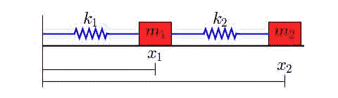

质量为`\(m_1\)`和`\(m_2\)`的两个物体通过弹簧常数为`\(k_1\)`和`\(k_2\)`的弹簧耦合。左弹簧的左端是固定的。我们假设弹簧在不受外力作用时的长度为`\(L_1\)`和`\(L_2\)`。

质量在产生摩擦的表面上滑动，因此有两个摩擦系数，b，，1，，和 b，，2，…。

该系统的微分方程为

`\(m_1 x_1'' + b_1 x_1' + k_1 (x_1 - L_1) - k_2 (x_2 - x_1 - L_2) = 0\)`

`\(m_2 x_2'' + b_2 x_2' + k_2 (x_2 - x_1 - L_2) = 0\)`

这是一对耦合的二阶方程。要用 SciPy 提供的一个 ODE 解算器求解这个系统，我们必须首先把它转换成一个一阶微分方程系统。我们引入了两个变量

`\(y_1 = x_1'\)`、`\(y_2 = x_2'\)`

这些是质量的速度。

用一点代数，我们可以把两个二阶方程改写成以下四个一阶方程的系统:

`\(x_1' = y_1\)`

`\(y_1' = (-b_1 y_1 - k_1 (x_1 - L_1) + k_2 (x_2 - x_1 - L_2))/m_1\)`

`\(x_2' = y_2\)`

`\(y_2' = (-b_2 y_2 - k_2 (x_2 - x_1 - L_2))/m_2\)`

这些方程现在是我们可以用 Python 实现的形式。

下面的代码定义了方程组(也称为矢量场)的“右手边”。我选择将定义向量场的函数放在它自己的模块中(即放在它自己的文件中)，但这不是必需的。请注意，函数的参数被配置为与函数一起使用:时间 t 是第二个参数。

```py
def vectorfield(w, t, p):
    """
 Defines the differential equations for the coupled spring-mass system.

 Arguments:
 w :  vector of the state variables:
 w = [x1,y1,x2,y2]
 t :  time
 p :  vector of the parameters:
 p = [m1,m2,k1,k2,L1,L2,b1,b2]
 """
    x1, y1, x2, y2 = w
    m1, m2, k1, k2, L1, L2, b1, b2 = p

    # Create f = (x1',y1',x2',y2'):
    f = [y1,
         (-b1 * y1 - k1 * (x1 - L1) + k2 * (x2 - x1 - L2)) / m1,
         y2,
         (-b2 * y2 - k2 * (x2 - x1 - L2)) / m2]
    return f 
```

接下来，这里有一个脚本，用于求解一组给定参数值、初始条件和时间间隔的方程。该脚本将解决方案中的点打印到终端。通常情况下，您会将其输出重定向到一个文件。

```py
# Use ODEINT to solve the differential equations defined by the vector field
from scipy.integrate import odeint

# Parameter values
# Masses:
m1 = 1.0
m2 = 1.5
# Spring constants
k1 = 8.0
k2 = 40.0
# Natural lengths
L1 = 0.5
L2 = 1.0
# Friction coefficients
b1 = 0.8
b2 = 0.5

# Initial conditions
# x1 and x2 are the initial displacements; y1 and y2 are the initial velocities
x1 = 0.5
y1 = 0.0
x2 = 2.25
y2 = 0.0

# ODE solver parameters
abserr = 1.0e-8
relerr = 1.0e-6
stoptime = 10.0
numpoints = 250

# Create the time samples for the output of the ODE solver.
# I use a large number of points, only because I want to make
# a plot of the solution that looks nice.
t = [stoptime * float(i) / (numpoints - 1) for i in range(numpoints)]

# Pack up the parameters and initial conditions:
p = [m1, m2, k1, k2, L1, L2, b1, b2]
w0 = [x1, y1, x2, y2]

# Call the ODE solver.
wsol = odeint(vectorfield, w0, t, args=(p,),
              atol=abserr, rtol=relerr)

with open('two_springs.dat', 'w') as f:
    # Print & save the solution.
    for t1, w1 in zip(t, wsol):
        print >> f, t1, w1[0], w1[1], w1[2], w1[3] 
```

下面的脚本使用 Matplotlib 绘制由

```py
# Plot the solution that was generated

from numpy import loadtxt
from pylab import figure, plot, xlabel, grid, hold, legend, title, savefig
from matplotlib.font_manager import FontProperties

t, x1, xy, x2, y2 = loadtxt('two_springs.dat', unpack=True)

figure(1, figsize=(6, 4.5))

xlabel('t')
grid(True)
hold(True)
lw = 1

plot(t, x1, 'b', linewidth=lw)
plot(t, x2, 'g', linewidth=lw)

legend((r'$x_1$', r'$x_2$'), prop=FontProperties(size=16))
title('Mass Displacements for the\nCoupled Spring-Mass System')
savefig('two_springs.png', dpi=100) 
```

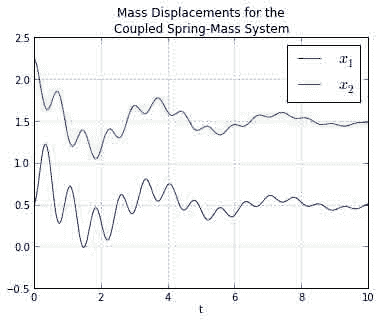

## 附件

*   [`two_springs_diagram.png`](../_downloads/two_springs_diagram.jpg)


# 库尔特韦格-德弗里斯方程

# 库尔特韦格-德弗里斯方程

本页显示如何使用线的[方法](http://www.scholarpedia.org/article/Method_of_lines)在周期域上求解 [Korteweg-de Vries 方程](http://en.wikipedia.org/wiki/Korteweg-de_Vries_equation)，使用伪谱方法计算空间导数。在这种方法中，首先对数据进行快速傅立叶变换，然后乘以适当的值，并通过逆快速傅立叶变换转换回空间域，从而在频域中计算导数。这种区分方法是通过模块**中的**差异**功能实现的。**

我们离散化空间域，并使用在 **scipy.fftpack** 模块中定义的 **diff** 函数计算空间导数。在下面的代码中，这个函数被赋予别名 **psdiff** 以避免与 numpy 函数 **diff** 混淆。通过只离散空间维度，我们得到了一个常微分方程组，它在函数 **kdv(u，t，L)** 中实现。功能 **kdv_solution(u0，t，L)** 使用 **scipy.integrate.odeint** 对本系统进行求解。

```py
#!python

import numpy as np
from scipy.integrate import odeint
from scipy.fftpack import diff as psdiff

def kdv_exact(x, c):
    """Profile of the exact solution to the KdV for a single soliton on the real line."""
    u = 0.5*c*np.cosh(0.5*np.sqrt(c)*x)**(-2)
    return u

def kdv(u, t, L):
    """Differential equations for the KdV equation, discretized in x."""
    # Compute the x derivatives using the pseudo-spectral method.
    ux = psdiff(u, period=L)
    uxxx = psdiff(u, period=L, order=3)

    # Compute du/dt.
    dudt = -6*u*ux - uxxx

    return dudt

def kdv_solution(u0, t, L):
    """Use odeint to solve the KdV equation on a periodic domain.

 `u0` is initial condition, `t` is the array of time values at which
 the solution is to be computed, and `L` is the length of the periodic
 domain."""

    sol = odeint(kdv, u0, t, args=(L,), mxstep=5000)
    return sol

if __name__ == "__main__":
    # Set the size of the domain, and create the discretized grid.
    L = 50.0
    N = 64
    dx = L / (N - 1.0)
    x = np.linspace(0, (1-1.0/N)*L, N)

    # Set the initial conditions.
    # Not exact for two solitons on a periodic domain, but close enough...
    u0 = kdv_exact(x-0.33*L, 0.75) + kdv_exact(x-0.65*L, 0.4)

    # Set the time sample grid.
    T = 200
    t = np.linspace(0, T, 501)

    print "Computing the solution."
    sol = kdv_solution(u0, t, L)

    print "Plotting."

    import matplotlib.pyplot as plt

    plt.figure(figsize=(6,5))
    plt.imshow(sol[::-1, :], extent=[0,L,0,T])
    plt.colorbar()
    plt.xlabel('x')
    plt.ylabel('t')
    plt.axis('normal')
    plt.title('Korteweg-de Vries on a Periodic Domain')
    plt.show() 
```

```py
 Computing the solution.
 Plotting. 
```

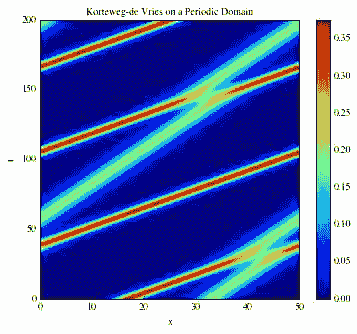

## 附件

*   [`kdv.png`](../_downloads/kdv.jpg)
*   [`kdv2.png`](../_downloads/kdv2.jpg)

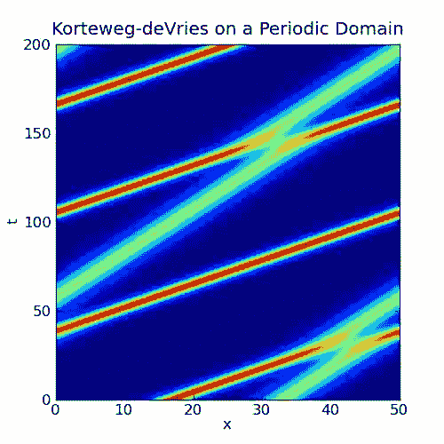 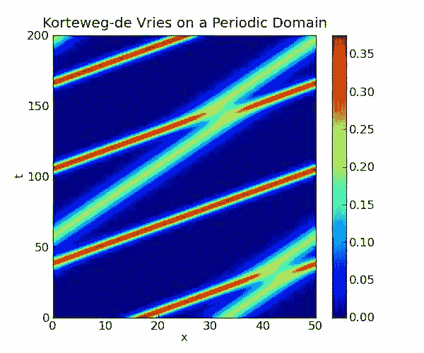

# Matplotlib: lotka volterra 教程

# Matplotlib: lotka volterra 教程

此示例描述了如何将 ODs 与 scipy.integrate 模块集成，以及如何使用 matplotlib 模块绘制轨迹、方向场和其他信息。

你可以在这里获得本教程的源代码: [`tutorial_lokta-voltera_v4.py`](../_downloads/tutorial_lokta-voltera_v4.py) 。

## 洛特卡-沃尔泰拉模型的介绍

我们将看看 Lotka-Volterra 模型，也称为捕食者-食饵方程，这是一对一阶非线性微分方程，常用于描述两个物种相互作用的生物系统的动力学，一个是捕食者，另一个是猎物。该模型是由阿尔弗雷德·洛特卡于 1925 年和维托·沃尔泰拉于 1926 年独立提出的，可以用

```py
du/dt =  a*u -   b*u*v
dv/dt = -c*v + d*b*u*v 
```

```py
with the following notations:

*  u: number of preys (for example, rabbits)

*  v: number of predators (for example, foxes)

* a, b, c, d are constant parameters defining the behavior of the population:

  + a is the natural growing rate of rabbits, when there's no fox

  + b is the natural dying rate of rabbits, due to predation

  + c is the natural dying rate of fox, when there's no rabbit

  + d is the factor describing how many caught rabbits let create a new fox 
```

我们将使用 X=[u，v]来描述两个种群的状态。

方程的定义:

```py
#!python
from numpy import *
import pylab as p
# Definition of parameters
a = 1.
b = 0.1
c = 1.5
d = 0.75
def dX_dt(X, t=0):
    """ Return the growth rate of fox and rabbit populations. """
    return array([ a*X[0] -   b*X[0]*X[1] ,
                  -c*X[1] + d*b*X[0]*X[1] ]) 
```

### 人口平衡

使用前！SciPy 为了整合这个系统，我们将仔细研究位置平衡。当增长率等于 0 时，平衡发生。这给出了两个固定点:

```py
#!python
X_f0 = array([     0\. ,  0.])
X_f1 = array([ c/(d*b), a/b])
all(dX_dt(X_f0) == zeros(2) ) and all(dX_dt(X_f1) == zeros(2)) # => True 
```

### 不动点稳定性

在这两个点附近，系统可以线性化:dX_dt = A_f*X 其中 A 是在对应点评估的雅可比矩阵。我们必须定义雅可比矩阵:

```py
#!python
def d2X_dt2(X, t=0):
    """ Return the Jacobian matrix evaluated in X. """
    return array([[a -b*X[1],   -b*X[0]     ],
                  [b*d*X[1] ,   -c +b*d*X[0]] ]) 
```

所以在代表两个物种灭绝的 X_f0 附近，我们有:

```py
#! python
A_f0 = d2X_dt2(X_f0)                    # >>> array([[ 1\. , -0\. ],
                                        #            [ 0\. , -1.5]]) 
```

在 X_f0 附近，兔子数量增加，狐狸数量减少。因此原点是一个[鞍点](http://en.wikipedia.org/wiki/Saddle_point)。

在 X_f1 附近，我们有:

```py
#!python
A_f1 = d2X_dt2(X_f1)                    # >>> array([[ 0\.  , -2\.  ],
                                        #            [ 0.75,  0\.  ]])
# whose eigenvalues are +/- sqrt(c*a).j:
lambda1, lambda2 = linalg.eigvals(A_f1) # >>> (1.22474j, -1.22474j)
# They are imaginary numbers. The fox and rabbit populations are periodic as follows from further
# analysis. Their period is given by:
T_f1 = 2*pi/abs(lambda1)                # >>> 5.130199 
```

## 使用 scipy.integrate 集成 ODE

现在我们将使用 scipy.integrate 模块来集成这些操作系统。这个模块提供了一个名为 odeint 的方法，它非常容易用来集成 ODEs:

```py
#!python
from scipy import integrate
t = linspace(0, 15,  1000)              # time
X0 = array([10, 5])                     # initials conditions: 10 rabbits and 5 foxes
X, infodict = integrate.odeint(dX_dt, X0, t, full_output=True)
infodict['message']                     # >>> 'Integration successful.' 
```

`infodict`是可选的，如果不想要可以省略`full_output`参数。如果您想了解有关 odeint 输入和输出的更多信息，请键入“info(odeint)”。

我们现在可以使用 Matplotlib 来绘制这两个种群的进化:

```py
#!python
rabbits, foxes = X.T
f1 = p.figure()
p.plot(t, rabbits, 'r-', label='Rabbits')
p.plot(t, foxes  , 'b-', label='Foxes')
p.grid()
p.legend(loc='best')
p.xlabel('time')
p.ylabel('population')
p.title('Evolution of fox and rabbit populations')
f1.savefig('rabbits_and_foxes_1.png') 
```


总体确实是周期性的，它们的周期接近我们计算的值 T_f1。

## 在相平面中绘制方向场和轨迹

对于 X_f0 和 X_f1 之间的不同起始点，我们将在相平面中绘制一些轨迹。

我们将使用 Matplotlib 的颜色映射来定义轨迹的颜色。这些彩色地图对制作精美的绘图非常有用。想了解更多信息，可以看看 [ShowColormaps](http://www.scipy.org/Cookbook/Matplotlib/Show_colormaps) 。

```py
values  = linspace(0.3, 0.9, 5)                          # position of X0 between X_f0 and X_f1
vcolors = p.cm.autumn_r(linspace(0.3, 1., len(values)))  # colors for each trajectory

f2 = p.figure()

#-------------------------------------------------------
# plot trajectories
for v, col in zip(values, vcolors):
    X0 = v * X_f1                               # starting point
    X = integrate.odeint( dX_dt, X0, t)         # we don't need infodict here
    p.plot( X[:,0], X[:,1], lw=3.5*v, color=col, label='X0=(%.f, %.f)' % ( X0[0], X0[1]) )

#-------------------------------------------------------
# define a grid and compute direction at each point
ymax = p.ylim(ymin=0)[1]                        # get axis limits
xmax = p.xlim(xmin=0)[1]
nb_points   = 20

x = linspace(0, xmax, nb_points)
y = linspace(0, ymax, nb_points)

X1 , Y1  = meshgrid(x, y)                       # create a grid
DX1, DY1 = dX_dt([X1, Y1])                      # compute growth rate on the gridt
M = (hypot(DX1, DY1))                           # Norm of the growth rate
M[ M == 0] = 1\.                                 # Avoid zero division errors
DX1 /= M                                        # Normalize each arrows
DY1 /= M

#-------------------------------------------------------
# Drow direction fields, using matplotlib 's quiver function
# I choose to plot normalized arrows and to use colors to give information on
# the growth speed
p.title('Trajectories and direction fields')
Q = p.quiver(X1, Y1, DX1, DY1, M, pivot='mid', cmap=p.cm.jet)
p.xlabel('Number of rabbits')
p.ylabel('Number of foxes')
p.legend()
p.grid()
p.xlim(0, xmax)
p.ylim(0, ymax)
f2.savefig('rabbits_and_foxes_2.png') 
```

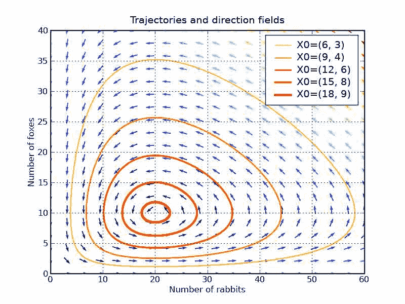

这张图告诉我们，改变狐狸或兔子的数量会产生非直觉的影响。如果为了减少兔子的数量，我们引入狐狸，从长远来看，这可能会导致兔子的增加，这取决于干预的时间。

## 绘制等高线

我们可以验证下面定义的函数 IF 沿轨迹保持不变:

```py
#!python
def IF(X):
    u, v = X
    return u**(c/a) * v * exp( -(b/a)*(d*u+v) )
# We will verify that IF remains constant for different trajectories
for v in values:
    X0 = v * X_f1                               # starting point
    X = integrate.odeint( dX_dt, X0, t)
    I = IF(X.T)                                 # compute IF along the trajectory
    I_mean = I.mean()
    delta = 100 * (I.max()-I.min())/I_mean
    print 'X0=(%2.f,%2.f) => I ~ %.1f |delta = %.3G  %%' % (X0[0], X0[1], I_mean, delta)
# >>> X0=( 6, 3) => I ~ 20.8 |delta = 6.19E-05 %
#     X0=( 9, 4) => I ~ 39.4 |delta = 2.67E-05 %
#     X0=(12, 6) => I ~ 55.7 |delta = 1.82E-05 %
#     X0=(15, 8) => I ~ 66.8 |delta = 1.12E-05 %
#     X0=(18, 9) => I ~ 72.4 |delta = 4.68E-06 % 
```

绘制中频的等值线可以很好地表示轨迹，而不必集成常微分方程

```py
#!python
#-------------------------------------------------------
# plot iso contours
nb_points = 80                              # grid size
x = linspace(0, xmax, nb_points)
y = linspace(0, ymax, nb_points)
X2 , Y2  = meshgrid(x, y)                   # create the grid
Z2 = IF([X2, Y2])                           # compute IF on each point
f3 = p.figure()
CS = p.contourf(X2, Y2, Z2, cmap=p.cm.Purples_r, alpha=0.5)
CS2 = p.contour(X2, Y2, Z2, colors='black', linewidths=2\. )
p.clabel(CS2, inline=1, fontsize=16, fmt='%.f')
p.grid()
p.xlabel('Number of rabbits')
p.ylabel('Number of foxes')
p.ylim(1, ymax)
p.xlim(1, xmax)
p.title('IF contours')
f3.savefig('rabbits_and_foxes_3.png')
p.show() 
```

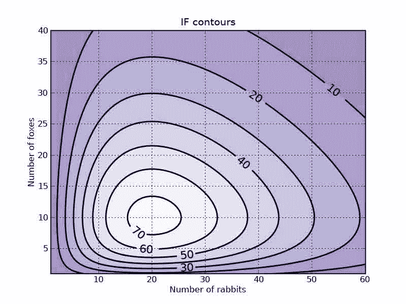

## 附件

*   [`rabbits_and_foxes_1.png`](../_downloads/rabbits_and_foxes_1.jpg)
*   [`rabbits_and_foxes_1v2.png`](../_downloads/rabbits_and_foxes_1v2.jpg)
*   [`rabbits_and_foxes_2.png`](../_downloads/rabbits_and_foxes_2.jpg)
*   [`rabbits_and_foxes_2v2.png`](../_downloads/rabbits_and_foxes_2v2.jpg)
*   [`rabbits_and_foxes_2v3.png`](../_downloads/rabbits_and_foxes_2v3.jpg)
*   [`rabbits_and_foxes_3.png`](../_downloads/rabbits_and_foxes_3.jpg)
*   [`rabbits_and_foxes_3v2.png`](../_downloads/rabbits_and_foxes_3v2.jpg)
*   [`tutorial_lokta-voltera.py`](../_downloads/tutorial_lokta-voltera.py)
*   [`tutorial_lokta-voltera_v2.py`](../_downloads/tutorial_lokta-voltera_v2.py)
*   [`tutorial_lokta-voltera_v3.py`](../_downloads/tutorial_lokta-voltera_v3.py)
*   [`tutorial_lokta-voltera_v4.py`](../_downloads/tutorial_lokta-voltera_v4.py)
*   [`zombie_nodead_nobirths.png`](../_downloads/zombie_nodead_nobirths.jpg)
*   [`zombie_somedead_10births.png`](../_downloads/zombie_somedead_10births.jpg)
*   [`zombie_somedead_nobirths.png`](../_downloads/zombie_somedead_nobirths.jpg)
*   [`zombie_somedeaddead_nobirths.png`](../_downloads/zombie_somedeaddead_nobirths.jpg)

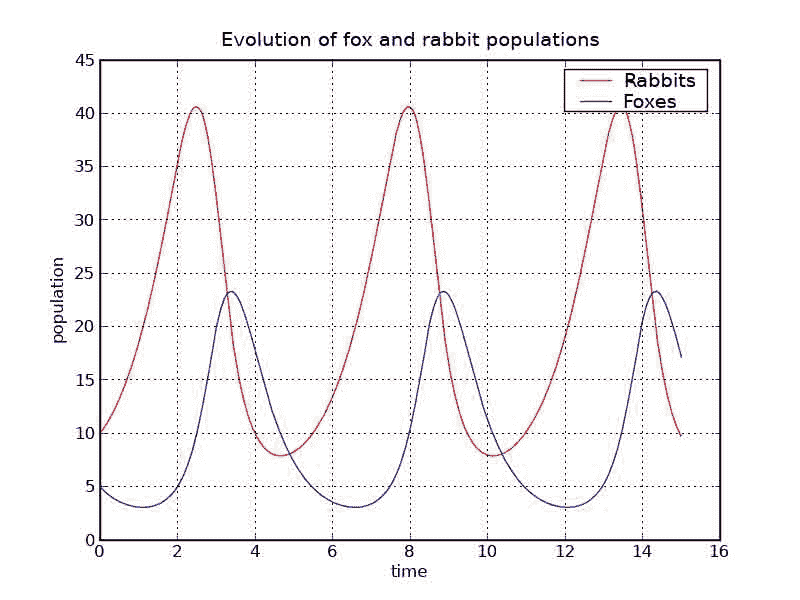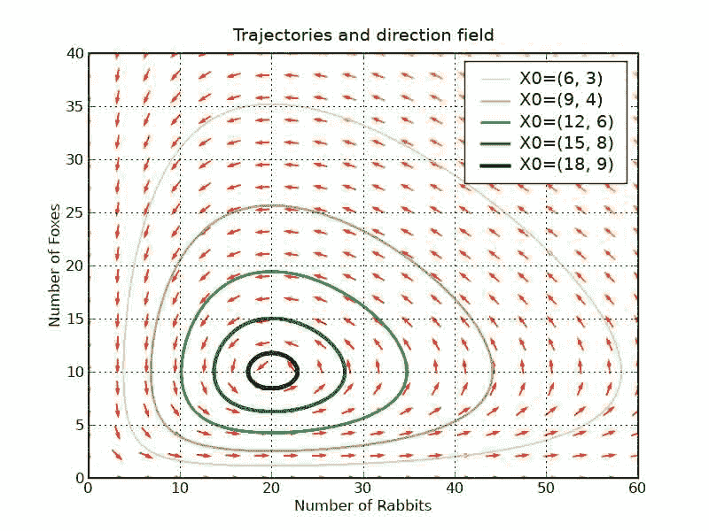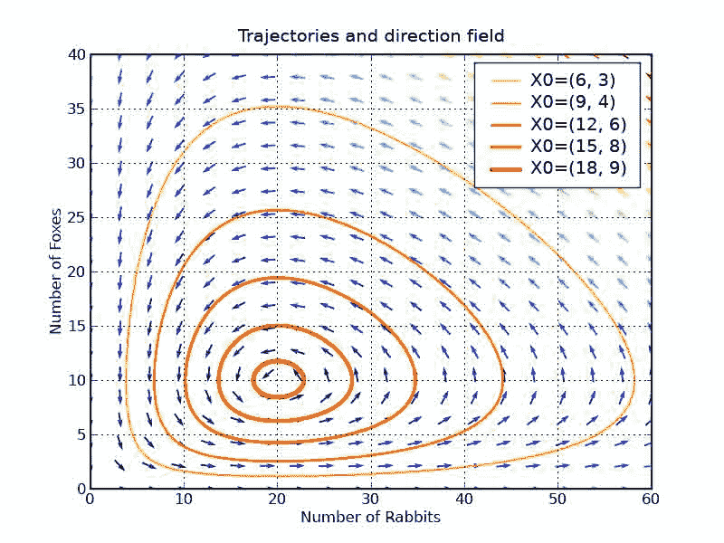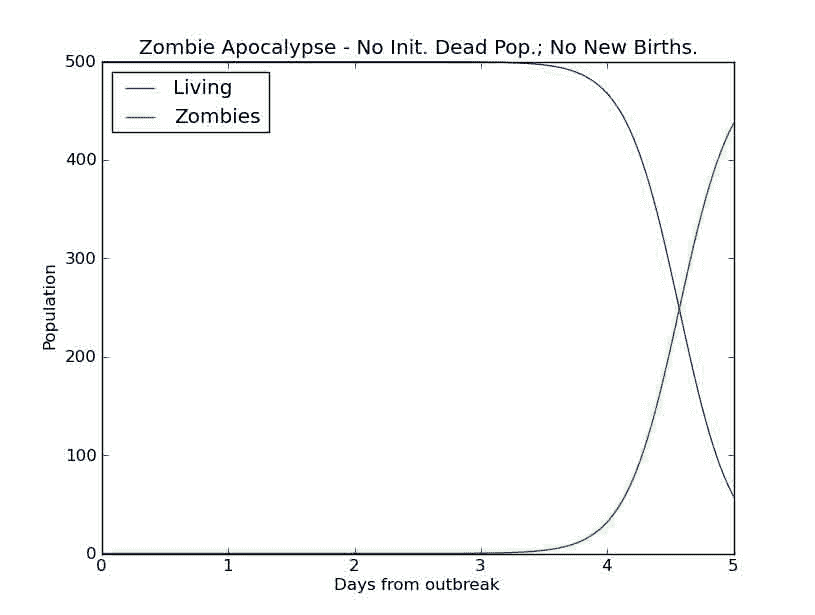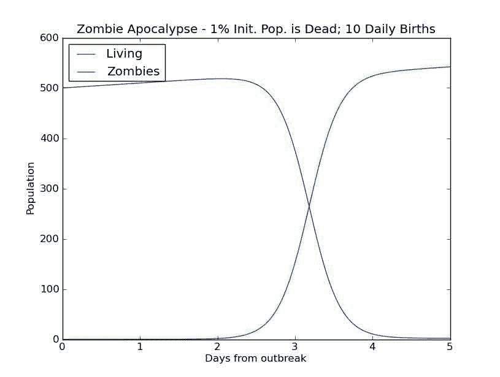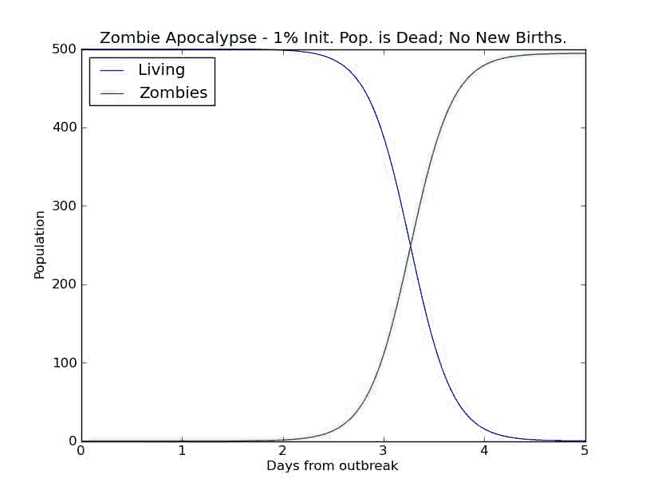

# 模拟僵尸启示录

# 模拟僵尸启示录

这个例子演示了如何使用 SciPy 求解一阶常微分方程组。注意，一个第 n 阶方程也可以使用 SciPy 通过将其转换为[一个一阶方程系统](http://en.wikipedia.org/wiki/Ordinary_differential_equation#Reduction_to_a_first_order_system)来求解。在这个轻松的例子中，一个常微分方程系统可以用来模拟“僵尸入侵”，使用的是 [Munz 等人 2009](http://mysite.science.uottawa.ca/rsmith43/Zombies.pdf) 中规定的方程。

该系统如下所示:

dS/dt = P-B _ S _ Z-d _ S dZ/dt = B _ S _ Z+G _ R-A _ S _ Z dR/dt = d _ S+A _ S _ Z-G _ R

带有以下符号:

*   s:易受影响的受害者人数
*   z:僵尸的数量
*   r:被“杀死”的人数
*   人口出生率
*   自然死亡的可能性
*   “僵尸疾病”传播的几率(一个活着的人变成僵尸)
*   g:死人复活成僵尸的几率
*   答:僵尸被彻底消灭的可能性

这包括求解一阶常微分方程组，由下式给出:d**y**/dt =**f**(**y**，t)

其中 **y** = [S，Z，R]。

用于解决该系统的代码如下:

```py
# zombie apocalypse modeling
import numpy as np
import matplotlib.pyplot as plt
from scipy.integrate import odeint
plt.ion()
plt.rcParams['figure.figsize'] = 10, 8

P = 0           # birth rate
d = 0.0001  # natural death percent (per day)
B = 0.0095  # transmission percent  (per day)
G = 0.0001  # resurect percent (per day)
A = 0.0001  # destroy percent  (per day)

# solve the system dy/dt = f(y, t)
def f(y, t):
    Si = y[0]
    Zi = y[1]
    Ri = y[2]
    # the model equations (see Munz et al. 2009)
    f0 = P - B*Si*Zi - d*Si
    f1 = B*Si*Zi + G*Ri - A*Si*Zi
    f2 = d*Si + A*Si*Zi - G*Ri
    return [f0, f1, f2]

# initial conditions
S0 = 500\.                   # initial population
Z0 = 0                      # initial zombie population
R0 = 0                      # initial death population
y0 = [S0, Z0, R0]   # initial condition vector
t  = np.linspace(0, 5., 1000)       # time grid

# solve the DEs
soln = odeint(f, y0, t)
S = soln[:, 0]
Z = soln[:, 1]
R = soln[:, 2]

# plot results
plt.figure()
plt.plot(t, S, label='Living')
plt.plot(t, Z, label='Zombies')
plt.xlabel('Days from outbreak')
plt.ylabel('Population')
plt.title('Zombie Apocalypse - No Init. Dead Pop.; No New Births.')
plt.legend(loc=0)

# change the initial conditions
R0 = 0.01*S0   # 1% of initial pop is dead
y0 = [S0, Z0, R0]

# solve the DEs
soln = odeint(f, y0, t)
S = soln[:, 0]
Z = soln[:, 1]
R = soln[:, 2]

plt.figure()
plt.plot(t, S, label='Living')
plt.plot(t, Z, label='Zombies')
plt.xlabel('Days from outbreak')
plt.ylabel('Population')
plt.title('Zombie Apocalypse - 1% Init. Pop. is Dead; No New Births.')
plt.legend(loc=0)

# change the initial conditions
R0 = 0.01*S0   # 1% of initial pop is dead
P  = 10        # 10 new births daily
y0 = [S0, Z0, R0]

# solve the DEs
soln = odeint(f, y0, t)
S = soln[:, 0]
Z = soln[:, 1]
R = soln[:, 2]

plt.figure()
plt.plot(t, S, label='Living')
plt.plot(t, Z, label='Zombies')
plt.xlabel('Days from outbreak')
plt.ylabel('Population')
plt.title('Zombie Apocalypse - 1% Init. Pop. is Dead; 10 Daily Births')
plt.legend(loc=0) 
```

```py
 <matplotlib.legend.Legend at 0x392ac90> 
```

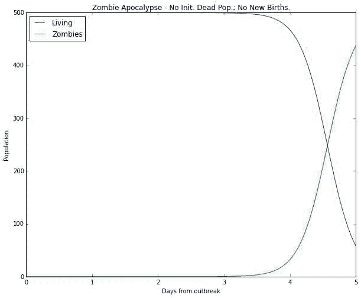 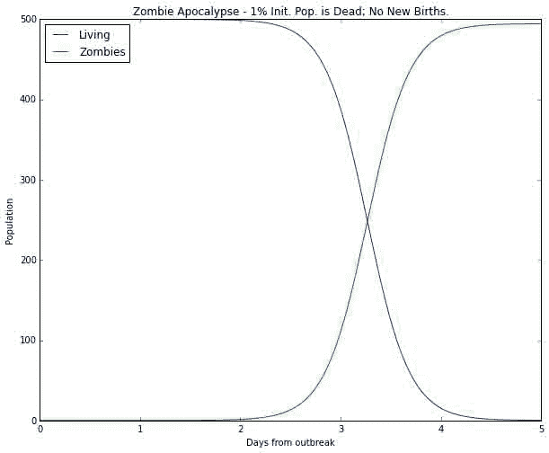 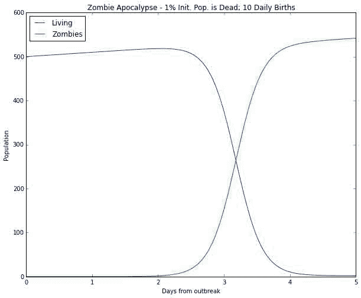

# 理论生态学:黑斯廷斯和鲍威尔

# 理论生态学:黑斯廷斯和鲍威尔

## 概观

一个简单的脚本，从黑斯廷斯和鲍威尔 1991 年重新创建最小/最大分叉图。

## 库函数

在模块 bif.py 中定义了两个有用的函数。

```py
import numpy

def window(data, size):
    """A generator that returns the moving window of length
 `size` over the `data`

 """
    for start in range(len(data) - (size - 1)):
        yield data[start:(start + size)]

def min_max(data, tol=1e-14):
    """Return a list of the local min/max found
 in a `data` series, given the relative tolerance `tol`

 """
    maxes = []
    mins = []
    for first, second, third in window(data, size=3):
        if first < second and third < second:
            maxes.append(second)
        elif first > second and third > second:
            mins.append(second)
        elif abs(first - second) < tol and abs(second - third) < tol:
            # an equilibrium is both the maximum and minimum
            maxes.append(second)
            mins.append(second)

    return {'max': numpy.asarray(maxes),
            'min': numpy.asarray(mins)} 
```

## 模型

为了提高速度，模型被定义在一个 fortran 文件中，并被编译成一个库，供 python 使用。使用这种方法速度提高了 100 倍。该文件使用 Fortran 90，这使得使用 f2py 变得特别容易。文件名为 hastings.f90。

```py
module model
    implicit none

    real(8), save :: a1, a2, b1, b2, d1, d2

contains

    subroutine fweb(y, t, yprime)
        real(8), dimension(3), intent(in) :: y
        real(8), intent(in) :: t
        real(8), dimension(3), intent(out) :: yprime

        yprime(1) = y(1)*(1.0d0 - y(1)) - a1*y(1)*y(2)/(1.0d0 + b1*y(1))
        yprime(2) = a1*y(1)*y(2)/(1.0d0 + b1*y(1)) - a2*y(2)*y(3)/(1.0d0 + b2*y(2)) - d1*y(2)
        yprime(3) = a2*y(2)*y(3)/(1.0d0 + b2*y(2)) - d2*y(3)
    end subroutine fweb

end module model 
```

它是用命令`f2py -c -m hastings hastings.f90 --fcompiler=gnu95`编译的(使用 gfortran 编译器)

```py
import numpy
from scipy.integrate import odeint
import bif

import hastings

# setup the food web parameters
hastings.model.a1 = 5.0
hastings.model.a2 = 0.1
hastings.model.b2 = 2.0
hastings.model.d1 = 0.4
hastings.model.d2 = 0.01

# setup the ode solver parameters
t = numpy.arange(10000)
y0 = [0.8, 0.2, 10.0]

def print_max(data, maxfile):
    for a_max in data['max']:
        print >> maxfile, hastings.model.b1, a_max

x_maxfile = open('x_maxfile.dat', 'w')
y_maxfile = open('y_maxfile.dat', 'w')
z_maxfile = open('z_maxfile.dat', 'w')
for i, hastings.model.b1 in enumerate(numpy.linspace(2.0, 6.2, 420)):
    print i, hastings.model.b1
    y = odeint(hastings.model.fweb, y0, t)

    # use the last 'stationary' solution as an intial guess for the
    # next run. This both speeds up the computations, as well as helps
    # make sure that solver doesn't need to do too much work.
    y0 = y[-1, :]

    x_minmax = bif.min_max(y[5000:, 0])
    y_minmax = bif.min_max(y[5000:, 1])
    z_minmax = bif.min_max(y[5000:, 2])

    print_max(x_minmax, x_maxfile)
    print_max(y_minmax, y_maxfile)
    print_max(z_minmax, z_maxfile) 
```