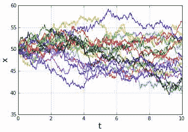
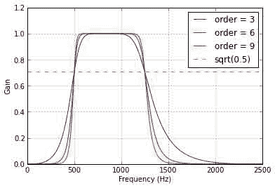
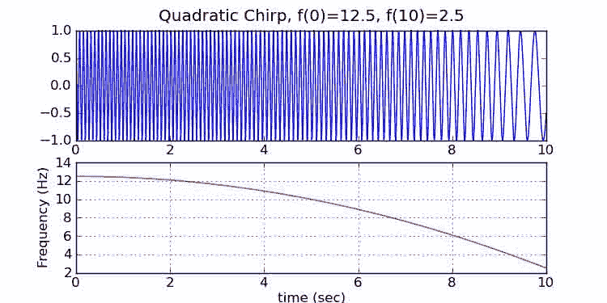
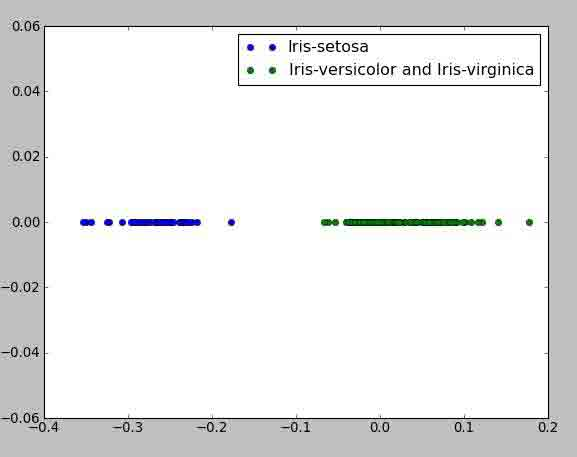

# 十七、Numpy 和 Scipy / 其他示例

*   [应用 FIR 滤波器](ApplyFIRFilter.html)
*   [布朗运动](BrownianMotion.html)
*   [巴特沃斯带通](ButterworthBandpass.html)
*   [沟通理论](CommTheory.html)
*   [相关随机样本](CorrelatedRandomSamples.html)
*   [轻松多线程](Multithreading.html)
*   [眼图](EyeDiagram.html)
*   [FIR 滤波器](FIRFilter.html)
*   [过滤过滤器](FiltFilt.html)
*   [寻找二维数据集的凸包](Finding_Convex_Hull.html)
*   [求有限点集凸包中的最小点](Finding_Convex_Hull_Minimum_Point.html)
*   [扫频信号](FrequencySweptDemo.html)
*   [KDTree 示例](KDTree_example.html)
*   [卡尔曼滤波](KalmanFiltering.html)
*   [线性分类](LinearClassification.html)
*   [粒子过滤器](ParticleFilter.html)
*   [重新绑定](Rebinning.html)
*   [萨维奇基·戈莱滤波](SavitzkyGolay.html)
*   [1D 信号的平滑](SignalSmooth.html)
*   [2D 信号的平滑](SignalSmooth.html#smoothing-of-a-2d-signal)
*   [求解大型马氏链](Solving_Large_Markov_Chains.html)
*   [分水岭](Watershed.html)

# 应用 f.i.r 滤波器

# 应用 f.i.r 滤波器

## 如何应用 FIR 滤波器:卷积、fftconvolve、卷积 1d 或 lfilter？

下图显示了使用 numpy 和 scipy 中提供的几种不同函数对长度为 131072 的信号应用不同长度的有限脉冲响应(FIR)滤波器所需的时间。下面给出了如何创建该数字的详细信息。

```py
fig 
```


## 细节

numpy 和 scipy 库中有几个函数可用于将 [FIR 滤波器](http://en.wikipedia.org/wiki/Finite_impulse_response)应用于信号。从 scipy.signal 开始，lfilter()被设计为将离散的 [IIR 滤波器](http://en.wikipedia.org/wiki/Infinite_impulse_response)应用于信号，因此通过简单地将分母系数数组设置为[1.0]，它可以用于应用 FIR 滤波器。应用 FIR 滤波器相当于离散的[卷积](http://en.wikipedia.org/wiki/Convolution)，因此还可以使用 numpy 中的卷积()和 scipy.signal 中的卷积()或 fftconvolve()或 scipy.ndimage 中的卷积 1d()。在本页中，我们演示了这些函数中的每一个，并研究了当数据信号大小固定且 FIR 滤波器长度变化时，计算时间如何变化。我们将使用 131072 的数据信号长度，即 2**17。我们假设我们有 *m* 个数据通道，所以我们的输入信号是一个由 *n* 组成的 *m* 数组。

我们假设我们的 FIR 滤波器系数在一维数组 *b* 中。numpy.convolve 函数只接受一维数组，所以我们必须在输入数组上使用 python 循环来执行所有通道的卷积。一种方法是

```py
y = np.array([np.convolve(xi, b, mode='valid') for xi in x]) 
```

我们使用列表理解来循环遍历 *x* 的行，并将结果传递给 *np.array* ，以将过滤后的数据重组为二维数组。

signal .卷积和 signal.fftconvolve 都执行二维数组的二维卷积。为了用这些函数中的任何一个来过滤我们的 *m* 的 *n* 数组，我们将我们的过滤器成形为二维数组，用*透镜(b)* 来成形 1。python 代码如下所示:

```py
y = convolve(x, b[np.newaxis, :], mode='valid') 
```

其中 *x* 是形状为 *(m，n)* 的 numpy 数组， *b* 是 FIR 滤波器系数的一维数组。*b【NP . new axis，】*是 *b* 的二维视图，形状 1 由*透镜(b)* 表示。 *y* 为过滤后的数据；它只包括计算完整卷积的那些项，因此它具有形状 *(m，n - len(b) + 1)* 。

ndi image .卷积 1d()被设计为沿着另一个 n 维数组的给定轴对 1d 数组进行卷积。它没有选项 mode='valid '，因此为了提取结果的有效部分，我们对函数的结果进行切片:

```py
y = convolve1d(x, b)[:, (len(b)-1)//2 : -(len(b)//2)] 
```

signal.lfilter 设计用于过滤一维数据。它可以采用一个二维数组(或者，一般来说，一个 n 维数组)，并在任何给定的轴上过滤数据。它也可以用于 IIR 滤波器，因此在我们的例子中，我们将传递[1.0]作为分母系数。在 python 中，这看起来像:

```py
y = lfilter(b, [1.0], x) 
```

为了获得与卷积或 fftconvolve 计算的完全相同的数组(即，为了获得“有效”模式的等价形式)，我们必须丢弃由 lfilter 计算的数组的开头。我们可以通过在调用 filter 后立即对数组进行切片来实现这一点:

```py
y = lfilter(b, [1.0], x)[:, len(b) - 1:] 
```

以下脚本计算并绘制了将 FIR 滤波器应用于 2 乘 131072 数据数组的结果，其中一系列 FIR 滤波器的长度不断增加。

```py
#!python
import time

import numpy as np
from numpy import convolve as np_convolve
from scipy.signal import convolve as sig_convolve, fftconvolve, lfilter, firwin
from scipy.ndimage import convolve1d
from pylab import grid, show, legend, loglog, xlabel, ylabel, figure

# Create the m by n data to be filtered.
m = 4
n = 2 ** 17
x = np.random.random(size=(m, n))

conv_time = []
npconv_time = []
fftconv_time = []
conv1d_time = []
lfilt_time = []

diff_list = []
diff2_list = []
diff3_list = []

ntaps_list = 2 ** np.arange(2, 13)

for ntaps in ntaps_list:
    # Create a FIR filter.
    b = firwin(ntaps, [0.05, 0.95], width=0.05, pass_zero=False)

    if ntaps <= 2 ** 9:
        # --- signal.convolve ---
        # We know this is slower than the others when ntaps is
        # large, so we only compute it for small values.
        tstart = time.time()
        conv_result = sig_convolve(x, b[np.newaxis, :], mode='valid')
        conv_time.append(time.time() - tstart)

    # --- numpy.convolve ---
    tstart = time.time()
    npconv_result = np.array([np_convolve(xi, b, mode='valid') for xi in x])
    npconv_time.append(time.time() - tstart)

    # --- signal.fftconvolve ---
    tstart = time.time()
    fftconv_result = fftconvolve(x, b[np.newaxis, :], mode='valid')
    fftconv_time.append(time.time() - tstart)

    # --- convolve1d ---
    tstart = time.time()
    # convolve1d doesn't have a 'valid' mode, so we expliclity slice out
    # the valid part of the result.
    conv1d_result = convolve1d(x, b)[:, (len(b)-1)//2 : -(len(b)//2)]
    conv1d_time.append(time.time() - tstart)

    # --- lfilter ---
    tstart = time.time()
    lfilt_result = lfilter(b, [1.0], x)[:, len(b) - 1:]
    lfilt_time.append(time.time() - tstart)

    diff = np.abs(fftconv_result - lfilt_result).max()
    diff_list.append(diff)

    diff2 = np.abs(conv1d_result - lfilt_result).max()
    diff2_list.append(diff2)

    diff3 = np.abs(npconv_result - lfilt_result).max()
    diff3_list.append(diff3)

# Verify that np.convolve and lfilter gave the same results.
print "Did np.convolve and lfilter produce the same results?",
check = all(diff < 1e-13 for diff in diff3_list)
if check:
    print "Yes."
else:
    print "No!  Something went wrong."

# Verify that fftconvolve and lfilter gave the same results.
print "Did fftconvolve and lfilter produce the same results?",
check = all(diff < 1e-13 for diff in diff_list)
if check:
    print "Yes."
else:
    print "No!  Something went wrong."

# Verify that convolve1d and lfilter gave the same results.
print "Did convolve1d and lfilter produce the same results?",
check = all(diff2 < 1e-13 for diff2 in diff2_list)
if check:
    print "Yes."
else:
    print "No!  Something went wrong."

fig = figure(1, figsize=(8, 5.5))
loglog(ntaps_list, npconv_time, 'c-s', label='numpy.convolve')
loglog(ntaps_list, conv1d_time, 'k-p', label='ndimage.convolve1d')
loglog(ntaps_list, fftconv_time, 'g-*', markersize=8, label='signal.fftconvolve')
loglog(ntaps_list[:len(conv_time)], conv_time, 'm-d', label='signal.convolve')
loglog(ntaps_list, lfilt_time, 'b-o', label='signal.lfilter')
legend(loc='best', numpoints=1)
grid(True)
xlabel('Number of taps')
ylabel('Time to filter (seconds)') 
```

```py
 Did np.convolve and lfilter produce the same results? Yes.
 Did fftconvolve and lfilter produce the same results? Yes.
 Did convolve1d and lfilter produce the same results? Yes. 
```

```py
 <matplotlib.text.Text at 0x4612c50> 
```


该图显示，根据抽头数，scipy . ndi image .卷积 1d、numpy .卷积或 scipy.signal.fftconvolve 是最快的。上面的脚本可以用来探索这些结果的变体。

# 布朗运动

# 布朗运动

*布朗运动*是一个随机过程。布朗运动方程的一种形式是

`\(X(0) = X_0\)`

`\(X(t + dt) = X(t) + N(0, (delta)^2 dt; t, t+dt)\)`

其中`\(N(a, b; t_1, t_2)\)`为均值为 a、方差为 b 的正态分布随机变量，参数 t，，1，，和 t，，2，，明确了 *N* 在不同时间间隔上的统计独立性；也就是说，如果`\([t_1, t_2)\)`和`\([t_3, t_4)\)`是不相交的区间，那么`\(N(a, b; t_1, t_2)\)`和`\(N(a, b; t_3, t_4)\)`是独立的。

计算其实很简单。打印布朗运动的 *n* 步的简单实现可能如下所示:

```py
from scipy.stats import norm

# Process parameters
delta = 0.25
dt = 0.1

# Initial condition.
x = 0.0

# Number of iterations to compute.
n = 20

# Iterate to compute the steps of the Brownian motion.
for k in range(n):
    x = x + norm.rvs(scale=delta**2*dt)
    print x 
```

```py
 0.0149783802189
 0.0153383445186
 0.0234318982959
 0.0212808305024
 0.0114258184942
 0.01354252966
 0.024915691657
 0.0225717389674
 0.0202001899576
 0.0210395736257
 0.0346234119557
 0.0315723937897
 0.0296012566384
 0.0296135943506
 0.0198499273499
 0.0165205162055
 0.00688369775327
 0.0069949507719
 0.00888200058681
 0.00297662267152 
```

上面的代码可以很容易地修改，将迭代保存在数组中，而不是打印它们。

上面代码的问题是速度慢。如果我们想计算大量的迭代，我们可以做得更好。关键是要注意，计算是来自正态分布的样本的累积和。快速版本可以这样实现:首先通过调用 scipy.stats.norm.rvs()从正态分布生成所有样本，然后使用 numpy *cumsum* 函数形成累积和。

下面的函数利用这个思想实现了函数*布朗()*。该函数允许初始条件是一个数组(或任何可以转换成数组的东西)。 *x0* 的每个元素都被视为布朗运动的初始条件。

```py
"""
brownian() implements one dimensional Brownian motion (i.e. the Wiener process).
"""

# File: brownian.py

from math import sqrt
from scipy.stats import norm
import numpy as np

def brownian(x0, n, dt, delta, out=None):
    """
 Generate an instance of Brownian motion (i.e. the Wiener process):

 X(t) = X(0) + N(0, delta**2 * t; 0, t)

 where N(a,b; t0, t1) is a normally distributed random variable with mean a and
 variance b.  The parameters t0 and t1 make explicit the statistical
 independence of N on different time intervals; that is, if [t0, t1) and
 [t2, t3) are disjoint intervals, then N(a, b; t0, t1) and N(a, b; t2, t3)
 are independent.

 Written as an iteration scheme,

 X(t + dt) = X(t) + N(0, delta**2 * dt; t, t+dt)

 If `x0` is an array (or array-like), each value in `x0` is treated as
 an initial condition, and the value returned is a numpy array with one
 more dimension than `x0`.

 Arguments
 ---------
 x0 : float or numpy array (or something that can be converted to a numpy array
 using numpy.asarray(x0)).
 The initial condition(s) (i.e. position(s)) of the Brownian motion.
 n : int
 The number of steps to take.
 dt : float
 The time step.
 delta : float
 delta determines the "speed" of the Brownian motion.  The random variable
 of the position at time t, X(t), has a normal distribution whose mean is
 the position at time t=0 and whose variance is delta**2*t.
 out : numpy array or None
 If `out` is not None, it specifies the array in which to put the
 result.  If `out` is None, a new numpy array is created and returned.

 Returns
 -------
 A numpy array of floats with shape `x0.shape + (n,)`.

 Note that the initial value `x0` is not included in the returned array.
 """

    x0 = np.asarray(x0)

    # For each element of x0, generate a sample of n numbers from a
    # normal distribution.
    r = norm.rvs(size=x0.shape + (n,), scale=delta*sqrt(dt))

    # If `out` was not given, create an output array.
    if out is None:
        out = np.empty(r.shape)

    # This computes the Brownian motion by forming the cumulative sum of
    # the random samples.
    np.cumsum(r, axis=-1, out=out)

    # Add the initial condition.
    out += np.expand_dims(x0, axis=-1)

    return out 
```

## 例子

这里有一个脚本，使用这个函数和 matplotlib 的 pylab 模块来绘制布朗运动的几种实现。

```py
import numpy
from pylab import plot, show, grid, xlabel, ylabel

# The Wiener process parameter.
delta = 2
# Total time.
T = 10.0
# Number of steps.
N = 500
# Time step size
dt = T/N
# Number of realizations to generate.
m = 20
# Create an empty array to store the realizations.
x = numpy.empty((m,N+1))
# Initial values of x.
x[:, 0] = 50

brownian(x[:,0], N, dt, delta, out=x[:,1:])

t = numpy.linspace(0.0, N*dt, N+1)
for k in range(m):
    plot(t, x[k])
xlabel('t', fontsize=16)
ylabel('x', fontsize=16)
grid(True)
show() 
```



## 2D 布朗运动

同样的函数可以用来生成二维的布朗运动，因为每个维度都只是一维的布朗运动。

以下脚本提供了一个演示。

```py
import numpy
from pylab import plot, show, grid, axis, xlabel, ylabel, title

# The Wiener process parameter.
delta = 0.25
# Total time.
T = 10.0
# Number of steps.
N = 500
# Time step size
dt = T/N
# Initial values of x.
x = numpy.empty((2,N+1))
x[:, 0] = 0.0

brownian(x[:,0], N, dt, delta, out=x[:,1:])

# Plot the 2D trajectory.
plot(x[0],x[1])

# Mark the start and end points.
plot(x[0,0],x[1,0], 'go')
plot(x[0,-1], x[1,-1], 'ro')

# More plot decorations.
title('2D Brownian Motion')
xlabel('x', fontsize=16)
ylabel('y', fontsize=16)
axis('equal')
grid(True)
show() 
```


# 巴特沃斯带通

# 巴特沃斯带通

这本秘籍演示了如何使用`scipy.signal.butter`来创建带通巴特沃斯滤波器。`scipy.signal.freqz`用于计算频率响应，`scipy.signal.lfilter`用于将滤波器应用于信号。(该代码最初是在 stackoverflow.com 回答[问题时给出的。)](http://stackoverflow.com/questions/12093594/how-to-implement-band-pass-butterworth-filter-with-scipy-signal-butter)

```py
from scipy.signal import butter, lfilter

def butter_bandpass(lowcut, highcut, fs, order=5):
    nyq = 0.5 * fs
    low = lowcut / nyq
    high = highcut / nyq
    b, a = butter(order, [low, high], btype='band')
    return b, a

def butter_bandpass_filter(data, lowcut, highcut, fs, order=5):
    b, a = butter_bandpass(lowcut, highcut, fs, order=order)
    y = lfilter(b, a, data)
    return y

def run():
    import numpy as np
    import matplotlib.pyplot as plt
    from scipy.signal import freqz

    # Sample rate and desired cutoff frequencies (in Hz).
    fs = 5000.0
    lowcut = 500.0
    highcut = 1250.0

    # Plot the frequency response for a few different orders.
    plt.figure(1)
    plt.clf()
    for order in [3, 6, 9]:
        b, a = butter_bandpass(lowcut, highcut, fs, order=order)
        w, h = freqz(b, a, worN=2000)
        plt.plot((fs * 0.5 / np.pi) * w, abs(h), label="order = %d" % order)

    plt.plot([0, 0.5 * fs], [np.sqrt(0.5), np.sqrt(0.5)],
             '--', label='sqrt(0.5)')
    plt.xlabel('Frequency (Hz)')
    plt.ylabel('Gain')
    plt.grid(True)
    plt.legend(loc='best')

    # Filter a noisy signal.
    T = 0.05
    nsamples = T * fs
    t = np.linspace(0, T, nsamples, endpoint=False)
    a = 0.02
    f0 = 600.0
    x = 0.1 * np.sin(2 * np.pi * 1.2 * np.sqrt(t))
    x += 0.01 * np.cos(2 * np.pi * 312 * t + 0.1)
    x += a * np.cos(2 * np.pi * f0 * t + .11)
    x += 0.03 * np.cos(2 * np.pi * 2000 * t)
    plt.figure(2)
    plt.clf()
    plt.plot(t, x, label='Noisy signal')

    y = butter_bandpass_filter(x, lowcut, highcut, fs, order=6)
    plt.plot(t, y, label='Filtered signal (%g Hz)' % f0)
    plt.xlabel('time (seconds)')
    plt.hlines([-a, a], 0, T, linestyles='--')
    plt.grid(True)
    plt.axis('tight')
    plt.legend(loc='upper left')

    plt.show()

run() 
```

 

# 通信理论

# 通信理论

这两个例子说明了数字 BPSK 调制通信系统的简单模拟，其中每个符号仅使用一个样本，并且信号仅受 AWGN 噪声的影响。

在第一个例子中，我们循环通过不同的信噪比值，信号长度是理论误差概率的函数。根据经验，我们希望为每个信噪比值计算大约 100 个误差，这决定了信号(和噪声)向量的长度。

```py
#!/usr/bin/python
# BPSK digital modulation example
# by Ivo Maljevic

from numpy import *
from scipy.special import erfc
import matplotlib.pyplot as plt

SNR_MIN     = 0
SNR_MAX     = 9
Eb_No_dB    = arange(SNR_MIN,SNR_MAX+1)
SNR         = 10**(Eb_No_dB/10.0)  # linear SNR

Pe          = empty(shape(SNR))
BER         = empty(shape(SNR))

loop = 0
for snr in SNR:      # SNR loop
 Pe[loop] = 0.5*erfc(sqrt(snr))
 VEC_SIZE = ceil(100/Pe[loop])  # vector length is a function of Pe

 # signal vector, new vector for each SNR value
 s = 2*random.randint(0,high=2,size=VEC_SIZE)-1

 # linear power of the noise; average signal power = 1
 No = 1.0/snr

 # noise
 n = sqrt(No/2)*random.randn(VEC_SIZE)

 # signal + noise
 x = s + n

 # decode received signal + noise
 y = sign(x)

 # find erroneous symbols
 err = where(y != s)
 error_sum = float(len(err[0]))
 BER[loop] = error_sum/VEC_SIZE
 print 'Eb_No_dB=%4.2f, BER=%10.4e, Pe=%10.4e' % \
        (Eb_No_dB[loop], BER[loop], Pe[loop])
 loop += 1

#plt.semilogy(Eb_No_dB, Pe,'r',Eb_No_dB, BER,'s')
plt.semilogy(Eb_No_dB, Pe,'r',linewidth=2)
plt.semilogy(Eb_No_dB, BER,'-s')
plt.grid(True)
plt.legend(('analytical','simulation'))
plt.xlabel('Eb/No (dB)')
plt.ylabel('BER')
plt.show() 
```

```py
 Eb_No_dB=0.00, BER=8.0975e-02, Pe=7.8650e-02
 Eb_No_dB=1.00, BER=4.9522e-02, Pe=5.6282e-02
 Eb_No_dB=2.00, BER=4.3870e-02, Pe=3.7506e-02
 Eb_No_dB=3.00, BER=2.0819e-02, Pe=2.2878e-02
 Eb_No_dB=4.00, BER=1.1750e-02, Pe=1.2501e-02
 Eb_No_dB=5.00, BER=6.2515e-03, Pe=5.9539e-03
 Eb_No_dB=6.00, BER=2.2450e-03, Pe=2.3883e-03
 Eb_No_dB=7.00, BER=6.3359e-04, Pe=7.7267e-04
 Eb_No_dB=8.00, BER=1.8709e-04, Pe=1.9091e-04
 Eb_No_dB=9.00, BER=3.0265e-05, Pe=3.3627e-05 
```


在第二个稍加修改的例子中，信号长度增长的问题通过将信号制动成帧来解决。也就是说，给定信噪比下的样本数量增长很快，因此上述模拟不适用于大于 9 或 10 分贝的 Eb/No 值。

```py
#!/usr/bin/python
# BPSK digital modulation: modified example
# by Ivo Maljevic

from scipy import *
from math import sqrt, ceil  # scalar calls are faster
from scipy.special import erfc
import matplotlib.pyplot as plt

rand   = random.rand
normal = random.normal

SNR_MIN   = 0
SNR_MAX   = 10
FrameSize = 10000
Eb_No_dB  = arange(SNR_MIN,SNR_MAX+1)
Eb_No_lin = 10**(Eb_No_dB/10.0)  # linear SNR

# Allocate memory
Pe        = empty(shape(Eb_No_lin))
BER       = empty(shape(Eb_No_lin))

# signal vector (for faster exec we can repeat the same frame)
s = 2*random.randint(0,high=2,size=FrameSize)-1

loop = 0
for snr in Eb_No_lin:
 No        = 1.0/snr
 Pe[loop]  = 0.5*erfc(sqrt(snr))
 nFrames   = ceil(100.0/FrameSize/Pe[loop])
 error_sum = 0
 scale = sqrt(No/2)

 for frame in arange(nFrames):
   # noise
   n = normal(scale=scale, size=FrameSize)

   # received signal + noise
   x = s + n

   # detection (information is encoded in signal phase)
   y = sign(x)

   # error counting
   err = where (y != s)
   error_sum += len(err[0])

   # end of frame loop
   ##################################################

 BER[loop] = error_sum/(FrameSize*nFrames)  # SNR loop level
 print 'Eb_No_dB=%2d, BER=%10.4e, Pe[loop]=%10.4e' % \
        (Eb_No_dB[loop], BER[loop], Pe[loop])
 loop += 1

plt.semilogy(Eb_No_dB, Pe,'r',linewidth=2)
plt.semilogy(Eb_No_dB, BER,'-s')
plt.grid(True)
plt.legend(('analytical','simulation'))
plt.xlabel('Eb/No (dB)')
plt.ylabel('BER')
plt.show() 
```

```py
 Eb_No_dB= 0, BER=7.6900e-02, Pe[loop]=7.8650e-02
 Eb_No_dB= 1, BER=5.5800e-02, Pe[loop]=5.6282e-02
 Eb_No_dB= 2, BER=3.7600e-02, Pe[loop]=3.7506e-02
 Eb_No_dB= 3, BER=2.2600e-02, Pe[loop]=2.2878e-02
 Eb_No_dB= 4, BER=1.2300e-02, Pe[loop]=1.2501e-02
 Eb_No_dB= 5, BER=6.6500e-03, Pe[loop]=5.9539e-03
 Eb_No_dB= 6, BER=2.3000e-03, Pe[loop]=2.3883e-03
 Eb_No_dB= 7, BER=9.0000e-04, Pe[loop]=7.7267e-04
 Eb_No_dB= 8, BER=2.0566e-04, Pe[loop]=1.9091e-04
 Eb_No_dB= 9, BER=3.3893e-05, Pe[loop]=3.3627e-05
 Eb_No_dB=10, BER=4.1425e-06, Pe[loop]=3.8721e-06 
```


## 附件

*   [`BPSK_BER.PNG`](../_downloads/BPSK_BER.PNG)


# 相关随机样本

# 相关随机样本

***注:*** *这个秘籍条目展示了如何使用来自 SciPy 的工具从多元正态分布中生成随机样本，但实际上 NumPy 包含函数`numpy.random.multivariate_normal`来完成同样的任务。*

为了生成相关的正态分布随机样本，可以首先生成不相关的样本，然后将它们乘以矩阵 *C* ，使得`\(C C^T = R\)`，其中 *R* 是期望的协方差矩阵。例如，通过使用 *R* 的乔莱斯基分解，或者从 *R* 的特征值和特征向量，可以创建 *C* 。

```py
"""Example of generating correlated normally distributed random samples."""

import numpy as np
from scipy.linalg import eigh, cholesky
from scipy.stats import norm

from pylab import plot, show, axis, subplot, xlabel, ylabel, grid

# Choice of cholesky or eigenvector method.
method = 'cholesky'
#method = 'eigenvectors'

num_samples = 400

# The desired covariance matrix.
r = np.array([
        [  3.40, -2.75, -2.00],
        [ -2.75,  5.50,  1.50],
        [ -2.00,  1.50,  1.25]
    ])

# Generate samples from three independent normally distributed random
# variables (with mean 0 and std. dev. 1).
x = norm.rvs(size=(3, num_samples))

# We need a matrix `c` for which `c*c^T = r`.  We can use, for example,
# the Cholesky decomposition, or the we can construct `c` from the
# eigenvectors and eigenvalues.

if method == 'cholesky':
    # Compute the Cholesky decomposition.
    c = cholesky(r, lower=True)
else:
    # Compute the eigenvalues and eigenvectors.
    evals, evecs = eigh(r)
    # Construct c, so c*c^T = r.
    c = np.dot(evecs, np.diag(np.sqrt(evals)))

# Convert the data to correlated random variables.
y = np.dot(c, x)

#
# Plot various projections of the samples.
#
subplot(2,2,1)
plot(y[0], y[1], 'b.')
ylabel('y[1]')
axis('equal')
grid(True)

subplot(2,2,3)
plot(y[0], y[2], 'b.')
xlabel('y[0]')
ylabel('y[2]')
axis('equal')
grid(True)

subplot(2,2,4)
plot(y[1], y[2], 'b.')
xlabel('y[1]')
axis('equal')
grid(True)

show() 
```


## 附件

*   [`correlated_random_vars.png`](../_downloads/correlated_random_vars.jpg)


# 轻松多线程

# 轻松多线程

Python 包含一个多线程包“threading”，但是 python 的多线程受到全局解释器 Lock 的严重限制，它一次只允许一个线程与解释器交互。对于纯解释代码，这使得多线程有效协作，无法利用多核。

然而，numpy 代码经常在计算时释放 GIL，因此简单的并行可以加快代码的速度。对于复杂的应用，人们应该直接研究 MPI 或使用线程，但令人惊讶的是，人们的应用通常是“令人尴尬的并行”，也就是说，人们只需对许多对象执行相同的操作，迭代之间没有交互。这种计算很容易并行化:

```py
dft = parallel_map(lambda f: sum(exp(2.j*pi*f*times)), frequencies) 
```

实现 parallel_map 的代码并不太复杂，附在这个条目之后。更简单的是，如果不想返回值:

```py
def compute(n):
    ...do something...
foreach(compute, range(100)) 
```

这将替换 for 循环。

代码见附件(AMArchibald 编写)。[[附件列表]]

另请参见并行编程，了解替代方案和更多讨论。

## 附件

*   [`handythread.py`](../_downloads/handythread.py)
*   [`test_handythread.py`](../_downloads/test_handythread.py)

# 可见图形

# 可见图形

下面的代码生成以下图表:


主脚本生成`num_traces`轨迹，在 600x600 的网格上，它计算轨迹穿过网格点的次数。然后使用 matplotlib 的 imshow()函数绘制网格。计数使用[布雷森汉线算法](http://en.wikipedia.org/wiki/Bresenham%27s_line_algorithm)进行，以确保计数正确，并且曲线的陡峭部分不会导致遗漏计数。

Bresenham 的算法在纯 Python 中速度很慢，所以包含了 Cython 版本。如果您没有构建 Cython 版本的 Bresenham 代码，请确保在运行程序之前减少`num_traces`！

下面是主要的演示脚本，eye_demo.py。

```py
#!python
import numpy as np

use_fast = True
try:
    from brescount import bres_curve_count
except ImportError:
    print "The cython version of the curve counter is not available."
    use_fast = False

def bres_segment_count_slow(x0, y0, x1, y1, grid):
    """Bresenham's algorithm.

 The value of grid[x,y] is incremented for each x,y
 in the line from (x0,y0) up to but not including (x1, y1).
 """

    nrows, ncols = grid.shape

    dx = abs(x1 - x0)
    dy = abs(y1 - y0)

    sx = 0
    if x0 < x1:
        sx = 1
    else:
        sx = -1
    sy = 0
    if y0 < y1:
        sy = 1
    else:
        sy = -1

    err = dx - dy

    while True:
        # Note: this test is moved before setting
        # the value, so we don't set the last point.
        if x0 == x1 and y0 == y1:
            break

        if 0 <= x0 < nrows and 0 <= y0 < ncols:
            grid[x0, y0] += 1

        e2 = 2 * err
        if e2 > -dy:
            err -= dy
            x0 += sx
        if e2 < dx:
            err += dx
            y0 += sy

def bres_curve_count_slow(x, y, grid):
    for k in range(x.size - 1):
        x0 = x[k]
        y0 = y[k]
        x1 = x[k+1]
        y1 = y[k+1]
        bres_segment_count_slow(x0, y0, x1, y1, grid)

def random_trace(t):
    s = 2*(np.random.randint(0, 5) % 2) - 1
    r = 0.01 * np.random.randn()
    s += r
    a = 2.0 + 0.001 * np.random.randn()
    q = 2*(np.random.randint(0, 7) % 2) - 1
    t2 = t + q*(6 + 0.01*np.random.randn())
    t2 += 0.05*np.random.randn()*t
    y = a * (np.exp(s*t2) / (1 + np.exp(s*t2)) - 0.5) + 0.07*np.random.randn()
    return y

if __name__ == "__main__":
    import matplotlib.pyplot as plt
    grid_size = 600
    grid = np.zeros((grid_size, grid_size), dtype=np.int32)

    tmin = -10.0
    tmax = 10.0
    n = 81
    t = np.linspace(tmin, tmax, n)
    dt = (tmax - tmin) / (n - 1)

    ymin = -1.5
    ymax = 1.5

    num_traces = 1000

    for k in range(num_traces):

        # Add some noise to the times at which the signal
        # will be sampled.  Without this, all the samples occur
        # at the same times, and this produces an aliasing
        # effect in the resulting bin counts.
        # If n == grid_size, this can be dropped, and t2 = t
        # can be used instead. (Or, implement an antialiased
        # version of bres_curve_count.)
        steps = dt + np.sqrt(0.01 * dt) * np.random.randn(n)
        steps[0] = 0
        steps_sum = steps.cumsum()
        t2 = tmin + (tmax - tmin) * steps_sum / steps_sum[-1]

        td = (((t2 - tmin) / (tmax - tmin)) * grid_size).astype(np.int32)

        y = random_trace(t2)

        # Convert y to integers in the range [0,grid_size).
        yd = (((y - ymin) / (ymax - ymin)) * grid_size).astype(np.int32)

        if use_fast:
            bres_curve_count(td, yd, grid)
        else:
            bres_curve_count_slow(td, yd, grid)

    plt.figure()
    # Convert to float32 so we can use nan instead of 0.
    grid = grid.astype(np.float32)
    grid[grid==0] = np.nan
    plt.grid(color='w')
    plt.imshow(grid.T[::-1,:], extent=[0,1,0,1], cmap=plt.cm.coolwarm,
               interpolation='gaussian')
    ax = plt.gca()
    ax.set_axis_bgcolor('k')
    ax.set_xticks(np.linspace(0,1,11))
    ax.set_yticks(np.linspace(0,1,11))
    ax.set_xticklabels([])
    ax.set_yticklabels([])
    plt.colorbar()
    fig = plt.gcf()

    #plt.savefig("eye-diagram.jpg", bbox_inches='tight')
    plt.show() 
```

```py
 The cython version of the curve counter is not available. 
```


这是 Bresenham 的线算法的 Cython 实现 brescount.pyx:

```py
#!python
import numpy as np
cimport numpy as np
cimport cython

@cython.boundscheck(False)
cdef int bres_segment_count(unsigned x0, unsigned y0,
                            unsigned x1, unsigned y1,
                            np.ndarray[np.int32_t, ndim=2] grid):
    """Bresenham's algorithm.

    See http://en.wikipedia.org/wiki/Bresenham%27s_line_algorithm
    """

    cdef unsigned nrows, ncols
    cdef int e2, sx, sy, err
    cdef int dx, dy

    nrows = grid.shape[0]
    ncols = grid.shape[1]

    if x1 > x0:
        dx = x1 - x0
    else:
        dx = x0 - x1
    if y1 > y0:
        dy = y1 - y0
    else:
        dy = y0 - y1

    sx = 0
    if x0 < x1:
        sx = 1
    else:
        sx = -1
    sy = 0
    if y0 < y1:
        sy = 1
    else:
        sy = -1

    err = dx - dy

    while True:
        # Note: this test occurs before increment the
        # grid value, so we don't count the last point.
        if x0 == x1 and y0 == y1:
            break

        if (x0 < nrows) and (y0 < ncols):
            grid[x0, y0] += 1

        e2 = 2 * err
        if e2 > -dy:
            err -= dy
            x0 += sx
        if e2 < dx:
            err += dx
            y0 += sy

    return 0

def bres_curve_count(np.ndarray[np.int32_t, ndim=1] x,
                     np.ndarray[np.int32_t, ndim=1] y,
                     np.ndarray[np.int32_t, ndim=2] grid):
    cdef unsigned k
    cdef int x0, y0, x1, y1

    for k in range(len(x)-1):
        x0 = x[k]
        y0 = y[k]
        x1 = x[k+1]
        y1 = y[k+1]
        bres_segment_count(x0, y0, x1, y1, grid)
    if 0 <= x1 < grid.shape[0] and 0 <= y1 < grid.shape[1]:
        grid[x1, y1] += 1 
```

该文件 setup.py 可用于构建 Cython 扩展模块:

```py
#!python
from distutils.core import setup
from distutils.extension import Extension
from Cython.Distutils import build_ext

import numpy

ext = Extension("brescount", ["brescount.pyx"],
    include_dirs = [numpy.get_include()])

setup(ext_modules=[ext],
      cmdclass = {'build_ext': build_ext}) 
```

要构建扩展模块，您必须安装 Cython。

您可以按如下方式构建扩展模块:

`$ python setup.py build_ext --inplace`

## 附件

*   [`eye-diagram3.png`](../_downloads/eye-diagram3.jpg)


# 射频滤波器

# 射频滤波器

本秘籍示例展示了如何使用 scipy.signal 中的函数设计和使用低通 FIR 滤波器。

matplotlib 中的 pylab 模块用于创建地块。

```py
#!python

from numpy import cos, sin, pi, absolute, arange
from scipy.signal import kaiserord, lfilter, firwin, freqz
from pylab import figure, clf, plot, xlabel, ylabel, xlim, ylim, title, grid, axes, show

#------------------------------------------------
# Create a signal for demonstration.
#------------------------------------------------

sample_rate = 100.0
nsamples = 400
t = arange(nsamples) / sample_rate
x = cos(2*pi*0.5*t) + 0.2*sin(2*pi*2.5*t+0.1) + \
        0.2*sin(2*pi*15.3*t) + 0.1*sin(2*pi*16.7*t + 0.1) + \
            0.1*sin(2*pi*23.45*t+.8)

#------------------------------------------------
# Create a FIR filter and apply it to x.
#------------------------------------------------

# The Nyquist rate of the signal.
nyq_rate = sample_rate / 2.0

# The desired width of the transition from pass to stop,
# relative to the Nyquist rate.  We'll design the filter
# with a 5 Hz transition width.
width = 5.0/nyq_rate

# The desired attenuation in the stop band, in dB.
ripple_db = 60.0

# Compute the order and Kaiser parameter for the FIR filter.
N, beta = kaiserord(ripple_db, width)

# The cutoff frequency of the filter.
cutoff_hz = 10.0

# Use firwin with a Kaiser window to create a lowpass FIR filter.
taps = firwin(N, cutoff_hz/nyq_rate, window=('kaiser', beta))

# Use lfilter to filter x with the FIR filter.
filtered_x = lfilter(taps, 1.0, x)

#------------------------------------------------
# Plot the FIR filter coefficients.
#------------------------------------------------

figure(1)
plot(taps, 'bo-', linewidth=2)
title('Filter Coefficients (%d taps)' % N)
grid(True)

#------------------------------------------------
# Plot the magnitude response of the filter.
#------------------------------------------------

figure(2)
clf()
w, h = freqz(taps, worN=8000)
plot((w/pi)*nyq_rate, absolute(h), linewidth=2)
xlabel('Frequency (Hz)')
ylabel('Gain')
title('Frequency Response')
ylim(-0.05, 1.05)
grid(True)

# Upper inset plot.
ax1 = axes([0.42, 0.6, .45, .25])
plot((w/pi)*nyq_rate, absolute(h), linewidth=2)
xlim(0,8.0)
ylim(0.9985, 1.001)
grid(True)

# Lower inset plot
ax2 = axes([0.42, 0.25, .45, .25])
plot((w/pi)*nyq_rate, absolute(h), linewidth=2)
xlim(12.0, 20.0)
ylim(0.0, 0.0025)
grid(True)

#------------------------------------------------
# Plot the original and filtered signals.
#------------------------------------------------

# The phase delay of the filtered signal.
delay = 0.5 * (N-1) / sample_rate

figure(3)
# Plot the original signal.
plot(t, x)
# Plot the filtered signal, shifted to compensate for the phase delay.
plot(t-delay, filtered_x, 'r-')
# Plot just the "good" part of the filtered signal.  The first N-1
# samples are "corrupted" by the initial conditions.
plot(t[N-1:]-delay, filtered_x[N-1:], 'g', linewidth=4)

xlabel('t')
grid(True)

show() 
```

  

最后的图显示了原始信号(细蓝线)、滤波信号(偏移适当的相位延迟以与原始信号对齐；细红线)和滤波信号的“好”部分(粗绿线)。“好的部分”是信号中不受初始条件影响的部分。

## 附件

*   [`fir_demo_freq_resp.png`](../_downloads/fir_demo_freq_resp.jpg)
*   [`fir_demo_signals.png`](../_downloads/fir_demo_signals.jpg)
*   [`fir_demo_taps.png`](../_downloads/fir_demo_taps.jpg)

  

# Filtfilt

# Filtfilt

此示例代码演示了函数 scipy.signal.filtfilt 的使用，这是一种线性滤波器，通过对信号应用两次 [IIR 滤波器](http://en.wikipedia.org/wiki/Infinite_impulse_response)来实现零相位延迟，一次向前，一次向后。过滤器的顺序是原始过滤器顺序的两倍。该函数还计算初始滤波器参数，以提供更稳定的响应(通过 lfilter_zi)。

为了进行比较，该脚本还使用 scipy.signal.lfilter 对信号应用相同的 IIR 滤波器；对于这些计算，lfilter_zi 用于为滤波器选择合适的初始条件。如果没有这一点，这些图将有接近 0 的长瞬变。事实上，它们在信号初始值附近有很长的瞬变。

## 密码

```py
from numpy import sin, cos, pi, linspace
from numpy.random import randn
from scipy.signal import lfilter, lfilter_zi, filtfilt, butter

from matplotlib.pyplot import plot, legend, show, hold, grid, figure, savefig

# Generate a noisy signal to be filtered.
t = linspace(-1, 1, 201)
x = (sin(2 * pi * 0.75 * t*(1-t) + 2.1) + 0.1*sin(2 * pi * 1.25 * t + 1) +
    0.18*cos(2 * pi * 3.85 * t))
xn = x + randn(len(t)) * 0.08

# Create an order 3 lowpass butterworth filter.
b, a = butter(3, 0.05)

# Apply the filter to xn.  Use lfilter_zi to choose the initial condition
# of the filter.
zi = lfilter_zi(b, a)
z, _ = lfilter(b, a, xn, zi=zi*xn[0])

# Apply the filter again, to have a result filtered at an order
# the same as filtfilt.
z2, _ = lfilter(b, a, z, zi=zi*z[0])

# Use filtfilt to apply the filter.
y = filtfilt(b, a, xn)

# Make the plot.
figure(figsize=(10,5))
hold(True)
plot(t, xn, 'b', linewidth=1.75, alpha=0.75)
plot(t, z, 'r--', linewidth=1.75)
plot(t, z2, 'r', linewidth=1.75)
plot(t, y, 'k', linewidth=1.75)
legend(('noisy signal',
        'lfilter, once',
        'lfilter, twice',
        'filtfilt'),
        loc='best')
hold(False)
grid(True)
show()
#savefig('plot.png', dpi=65) 
```


# 寻找二维数据集的凸包

# 寻找二维数据集的凸包

> **注意**:你可能想用 [scipy.spatial .凸包](http://docs.scipy.org/doc/scipy/reference/generated/scipy.spatial.ConvexHull.html)来代替这个。

这段代码找到描述一组二维数据点周围凸包的点的子集。该代码可选地使用 pylab 来制作其进度动画。

```py
import numpy as n, pylab as p, time

def _angle_to_point(point, centre):
    '''calculate angle in 2-D between points and x axis'''
    delta = point - centre
    res = n.arctan(delta[1] / delta[0])
    if delta[0] < 0:
        res += n.pi
    return res

def _draw_triangle(p1, p2, p3, **kwargs):
    tmp = n.vstack((p1,p2,p3))
    x,y = [x[0] for x in zip(tmp.transpose())]
    p.fill(x,y, **kwargs)
    #time.sleep(0.2)

def area_of_triangle(p1, p2, p3):
    '''calculate area of any triangle given co-ordinates of the corners'''
    return n.linalg.norm(n.cross((p2 - p1), (p3 - p1)))/2.

def convex_hull(points, graphic=True, smidgen=0.0075):
    '''Calculate subset of points that make a convex hull around points

Recursively eliminates points that lie inside two neighbouring points until only convex hull is remaining.

:Parameters:
 points : ndarray (2 x m)
 array of points for which to find hull
 graphic : bool
 use pylab to show progress?
 smidgen : float
 offset for graphic number labels - useful values depend on your data range

:Returns:
 hull_points : ndarray (2 x n)
 convex hull surrounding points
'''
    if graphic:
        p.clf()
        p.plot(points[0], points[1], 'ro')
    n_pts = points.shape[1]
    assert(n_pts > 5)
    centre = points.mean(1)
    if graphic: p.plot((centre[0],),(centre[1],),'bo')
    angles = n.apply_along_axis(_angle_to_point, 0, points, centre)
    pts_ord = points[:,angles.argsort()]
    if graphic:
        for i in xrange(n_pts):
            p.text(pts_ord[0,i] + smidgen, pts_ord[1,i] + smidgen, \
                   '%d' % i)
    pts = [x[0] for x in zip(pts_ord.transpose())]
    prev_pts = len(pts) + 1
    k = 0
    while prev_pts > n_pts:
        prev_pts = n_pts
        n_pts = len(pts)
        if graphic: p.gca().patches = []
        i = -2
        while i < (n_pts - 2):
            Aij = area_of_triangle(centre, pts[i],     pts[(i + 1) % n_pts])
            Ajk = area_of_triangle(centre, pts[(i + 1) % n_pts], \
                                   pts[(i + 2) % n_pts])
            Aik = area_of_triangle(centre, pts[i],     pts[(i + 2) % n_pts])
            if graphic:
                _draw_triangle(centre, pts[i], pts[(i + 1) % n_pts], \
                               facecolor='blue', alpha = 0.2)
                _draw_triangle(centre, pts[(i + 1) % n_pts], \
                               pts[(i + 2) % n_pts], \
                               facecolor='green', alpha = 0.2)
                _draw_triangle(centre, pts[i], pts[(i + 2) % n_pts], \
                               facecolor='red', alpha = 0.2)
            if Aij + Ajk < Aik:
                if graphic: p.plot((pts[i + 1][0],),(pts[i + 1][1],),'go')
                del pts[i+1]
            i += 1
            n_pts = len(pts)
        k += 1
    return n.asarray(pts)

if __name__ == "__main__":
    points = n.random.random_sample((2,40))
    hull_pts = convex_hull(points) 
```


# 求有限点集凸包中的最小点

# 求有限点集凸包中的最小点

基于 Philip Wolf [1]的工作和 Kazuyuki Sekitani 和 yoshitsuku Yamamoto[2]的递归算法。

[2]中的算法有 3ε，以避免算法三个部分的比较问题。下面的代码几乎没有变化，只有一个ε。改变的目的是避免无限循环。

## 密码

```py
from numpy import array, matrix, sin, sqrt, dot, cos, ix_, zeros, concatenate, abs, log10, exp, ones
from numpy.linalg import norm

from mpmath import mpf, mp
mp.dps=80

def find_min_point(P):
#    print "Calling find_min with P: ", P

    if len(P) == 1:
        return P[0]

    eps = mpf(10)**-40

    P = [array([mpf(i) for i in p]) for p in P]

    # Step 0\. Choose a point from C(P)
    x  = P[array([dot(p,p) for p in P]).argmin()]

    while True:

        # Step 1\. \alpha_k := min{x_{k-1}^T p | p \in P}
        p_alpha = P[array([dot(x,p) for p in P]).argmin()]

        if dot(x,x-p_alpha) < eps:
            return array([float(i) for i in x])

        Pk = [p for p in P if abs(dot(x,p-p_alpha)) < eps]

        # Step 2\. P_k := { p | p \in P and x_{k-1}^T p = \alpha_k}
        P_Pk = [p for p in P if not array([(p == q).all() for q in Pk]).any()]

        if len(Pk) == len(P):
            return array([float(i) for i in x])

        y = find_min_point(Pk)

        p_beta = P_Pk[array([dot(y,p) for p in P_Pk]).argmin()]

        if dot(y,y-p_beta) < eps:
            return array([float(i) for i in y])

        # Step 4.
        P_aux = [p for p in P_Pk if (dot(y-x,y-p)>eps) and (dot(x,y-p)!=0)]
        p_lambda = P_aux[array([dot(y,y-p)/dot(x,y-p) for p in P_aux]).argmin()]
        lam = dot(x,p_lambda-y) / dot(y-x,y-p_lambda)

        x += lam * (y-x)

if __name__ == '__main__':
    print find_min_point( [array([ -4.83907292e+00,   2.22438863e+04,  -2.67496763e+04]), array([   9.71147604, -351.46404195, -292.18064276]), array([  4.60452808e+00,   1.07020174e+05,  -1.25310230e+05]), array([  2.16080134e+00,   5.12019937e+04,  -5.96167833e+04]), array([  2.65472146e+00,   6.70546443e+04,  -7.71619656e+04]), array([  1.55775358e+00,  -1.34347516e+05,   1.53209265e+05]), array([   13.22464295,  1869.01251292, -2137.61850989])])

    print find_min_point( [array([ -4.83907292e+00,   2.22438863e+04,  -2.67496763e+04]), array([   9.71147604, -351.46404195, -292.18064276]), array([  4.60452808e+00,   1.07020174e+05,  -1.25310230e+05]), array([  2.16080134e+00,   5.12019937e+04,  -5.96167833e+04]), array([  2.65472146e+00,   6.70546443e+04,  -7.71619656e+04]), array([  1.55775358e+00,  -1.34347516e+05,   1.53209265e+05]), array([   13.22464295,  1869.01251292, -2137.61850989]), array([ 12273.18670123,  -1233.32015854,  61690.10864825])]) 
```

```py
 [ 13.0643029   -3.03446491  -2.65980139]
 [  1.61870596e-04  -3.78774039e-05  -3.29329552e-05] 
```

## 参考

1.  [在 A 多面体中寻找最近的点](http://www.springerlink.com/content/hw0l2n1271260604/)
2.  [求多面体中最小范数点和两个多面体中一对最近点的递归算法](http://www.springerlink.com/content/j25702174115q68x/)

# 扫频信号

# 扫频信号

本页演示了 scipy.signal 中产生扫频信号的两个功能:`chirp`和`sweep_poly`。

其中一些需要 SciPy 0.8。

要运行代码示例，您需要以下导入:

```py
import numpy as np
from scipy.signal import chirp, sweep_poly 
```

## 线性啁啾

示例代码:

```py
t = np.linspace(0, 10, 5001)
w = chirp(t, f0=12.5, f1=2.5, t1=10, method='linear') 
```


## 二次啁啾

示例代码:

```py
t = np.linspace(0, 10, 5001)
w = chirp(t, f0=12.5, f1=2.5, t1=10, method='quadratic') 
```



使用`vertex_zero`的示例代码:

```py
t = np.linspace(0, 10, 5001)
w = chirp(t, f0=12.5, f1=2.5, t1=10, method='quadratic', vertex_zero=False) 
```


## 对数啁啾

示例代码:

```py
t = np.linspace(0, 10, 5001)
w = chirp(t, f0=12.5, f1=2.5, t1=10, method='logarithmic') 
```


## 双曲线啁啾

示例代码:

```py
t = np.linspace(0, 10, 5001)
w = chirp(t, f0=12.5, f1=2.5, t1=10, method='hyperbolic') 
```


## 扫聚

示例代码:

```py
p = np.poly1d([0.05, -0.75, 2.5, 5.0])
t = np.linspace(0, 10, 5001)
w = sweep_poly(t, p) 
```


生成剧情的脚本是 [`here`](../_downloads/chirp_plot.py)

## 附件

*   [`chirp_hyperbolic.png`](../_downloads/chirp_hyperbolic.jpg)
*   [`chirp_linear.png`](../_downloads/chirp_linear.jpg)
*   [`chirp_logarithmic.png`](../_downloads/chirp_logarithmic.jpg)
*   [`chirp_plot.py`](../_downloads/chirp_plot.py)
*   [`chirp_quadratic.png`](../_downloads/chirp_quadratic.jpg)
*   [`chirp_quadratic_v0false.png`](../_downloads/chirp_quadratic_v0false.jpg)
*   [`sweep_poly.png`](../_downloads/sweep_poly.jpg)

     

# KDTree 示例

# KDTree 示例

**'注意:scipy 中有一个 kdtree 的实现:[http://docs . scipy . org/scipy/docs/scipy . spatial . kdtree . kdtree/](http://docs.scipy.org/scipy/docs/scipy.spatial.kdtree.KDTree/)建议用那个代替下面的。**'

这是一个如何用 NumPy 在 [Python](http://www.python.org) 中构建和搜索 [kd 树](http://en.wikipedia.org/wiki/Kd-tree)的例子。kd 树例如用于在多维空间中搜索相邻的数据点。在 KD-树中搜索所有 n 个点的最近邻居相对于样本大小具有 O(n log n)复杂度。

## 构建 kd 树

```py
#!python numbers=disable

# Copyleft 2008 Sturla Molden
# University of Oslo

#import psyco
#psyco.full()

import numpy

def kdtree( data, leafsize=10 ):
    """
 build a kd-tree for O(n log n) nearest neighbour search

 input:
 data:       2D ndarray, shape =(ndim,ndata), preferentially C order
 leafsize:   max. number of data points to leave in a leaf

 output:
 kd-tree:    list of tuples
 """

    ndim = data.shape[0]
    ndata = data.shape[1]

    # find bounding hyper-rectangle
    hrect = numpy.zeros((2,data.shape[0]))
    hrect[0,:] = data.min(axis=1)
    hrect[1,:] = data.max(axis=1)

    # create root of kd-tree
    idx = numpy.argsort(data[0,:], kind='mergesort')
    data[:,:] = data[:,idx]
    splitval = data[0,ndata/2]

    left_hrect = hrect.copy()
    right_hrect = hrect.copy()
    left_hrect[1, 0] = splitval
    right_hrect[0, 0] = splitval

    tree = [(None, None, left_hrect, right_hrect, None, None)]

    stack = [(data[:,:ndata/2], idx[:ndata/2], 1, 0, True),
             (data[:,ndata/2:], idx[ndata/2:], 1, 0, False)]

    # recursively split data in halves using hyper-rectangles:
    while stack:

        # pop data off stack
        data, didx, depth, parent, leftbranch = stack.pop()
        ndata = data.shape[1]
        nodeptr = len(tree)

        # update parent node

        _didx, _data, _left_hrect, _right_hrect, left, right = tree[parent]

        tree[parent] = (_didx, _data, _left_hrect, _right_hrect, nodeptr, right) if leftbranch \
            else (_didx, _data, _left_hrect, _right_hrect, left, nodeptr)

        # insert node in kd-tree

        # leaf node?
        if ndata <= leafsize:
            _didx = didx.copy()
            _data = data.copy()
            leaf = (_didx, _data, None, None, 0, 0)
            tree.append(leaf)

        # not a leaf, split the data in two
        else:
            splitdim = depth % ndim
            idx = numpy.argsort(data[splitdim,:], kind='mergesort')
            data[:,:] = data[:,idx]
            didx = didx[idx]
            nodeptr = len(tree)
            stack.append((data[:,:ndata/2], didx[:ndata/2], depth+1, nodeptr, True))
            stack.append((data[:,ndata/2:], didx[ndata/2:], depth+1, nodeptr, False))
            splitval = data[splitdim,ndata/2]
            if leftbranch:
                left_hrect = _left_hrect.copy()
                right_hrect = _left_hrect.copy()
            else:
                left_hrect = _right_hrect.copy()
                right_hrect = _right_hrect.copy()
            left_hrect[1, splitdim] = splitval
            right_hrect[0, splitdim] = splitval
            # append node to tree
            tree.append((None, None, left_hrect, right_hrect, None, None))

    return tree 
```

## 搜索 kd 树

```py
#!python numbers=disable

def intersect(hrect, r2, centroid):
    """
 checks if the hyperrectangle hrect intersects with the
 hypersphere defined by centroid and r2
 """
    maxval = hrect[1,:]
    minval = hrect[0,:]
    p = centroid.copy()
    idx = p < minval
    p[idx] = minval[idx]
    idx = p > maxval
    p[idx] = maxval[idx]
    return ((p-centroid)**2).sum() < r2

def quadratic_knn_search(data, lidx, ldata, K):
    """ find K nearest neighbours of data among ldata """
    ndata = ldata.shape[1]
    param = ldata.shape[0]
    K = K if K < ndata else ndata
    retval = []
    sqd = ((ldata - data[:,:ndata])**2).sum(axis=0) # data.reshape((param,1)).repeat(ndata, axis=1);
    idx = numpy.argsort(sqd, kind='mergesort')
    idx = idx[:K]
    return zip(sqd[idx], lidx[idx])

def search_kdtree(tree, datapoint, K):
    """ find the k nearest neighbours of datapoint in a kdtree """
    stack = [tree[0]]
    knn = [(numpy.inf, None)]*K
    _datapt = datapoint[:,0]
    while stack:

        leaf_idx, leaf_data, left_hrect, \
                  right_hrect, left, right = stack.pop()

        # leaf
        if leaf_idx is not None:
            _knn = quadratic_knn_search(datapoint, leaf_idx, leaf_data, K)
            if _knn[0][0] < knn[-1][0]:
                knn = sorted(knn + _knn)[:K]

        # not a leaf
        else:

            # check left branch
            if intersect(left_hrect, knn[-1][0], _datapt):
                stack.append(tree[left])

            # chech right branch
            if intersect(right_hrect, knn[-1][0], _datapt):
                stack.append(tree[right])
    return knn

def knn_search( data, K, leafsize=2048 ):

    """ find the K nearest neighbours for data points in data,
 using an O(n log n) kd-tree """

    ndata = data.shape[1]
    param = data.shape[0]

    # build kdtree
    tree = kdtree(data.copy(), leafsize=leafsize)

    # search kdtree
    knn = []
    for i in numpy.arange(ndata):
        _data = data[:,i].reshape((param,1)).repeat(leafsize, axis=1);
        _knn = search_kdtree(tree, _data, K+1)
        knn.append(_knn[1:])

    return knn

def radius_search(tree, datapoint, radius):
    """ find all points within radius of datapoint """
    stack = [tree[0]]
    inside = []
    while stack:

        leaf_idx, leaf_data, left_hrect, \
                  right_hrect, left, right = stack.pop()

        # leaf
        if leaf_idx is not None:
            param=leaf_data.shape[0]
            distance = numpy.sqrt(((leaf_data - datapoint.reshape((param,1)))**2).sum(axis=0))
            near = numpy.where(distance<=radius)
            if len(near[0]):
                idx = leaf_idx[near]
                distance = distance[near]
                inside += (zip(distance, idx))

        else:

            if intersect(left_hrect, radius, datapoint):
                stack.append(tree[left])

            if intersect(right_hrect, radius, datapoint):
                stack.append(tree[right])

    return inside 
```

## 小数据集的二次搜索

与 kd 树相反，直接穷举搜索相对于样本大小具有二次复杂度。当样本量很小时，它可能比使用 kd-tree 更快。在我的电脑上，大约有 500 个或更少的样本。

```py
#!python numbers=disable

def knn_search( data, K ):
    """ find the K nearest neighbours for data points in data,
 using O(n**2) search """
    ndata = data.shape[1]
    knn = []
    idx = numpy.arange(ndata)
    for i in numpy.arange(ndata):
        _knn = quadratic_knn_search(data[:,i], idx, data, K+1) # see above
        knn.append( _knn[1:] )
    return knn 
```

## 大型数据集的并行搜索

虽然创建一个 kd-tree 非常快，但是搜索它可能很耗时。由于 Python 可怕的“全局解释器锁”(GIL)，线程不能用于并行执行多个搜索。也就是说，Python 线程可以用于异步，但不能用于并发。但是，我们可以使用多个进程(多个解释器)。 [pyprocessing](http://pyprocessing.berlios.de/) 包使这变得容易。它有一个类似于 Python 的线程和队列标准模块的 API，但是使用进程而不是线程。从 Python 2.6 开始，pyprocessing 已经作为“多处理”模块包含在 Python 的标准库中。使用多个进程会有少量开销，包括进程创建、进程启动、进程间通信和进程终止。但是，由于进程在不同的地址空间中运行，因此不会发生内存争用。在下面的示例中，与计算相比，使用多个进程的开销非常小，这使得速度接近计算机上的 CPU 数量。

```py
#!python numbers=disable

try:
    import multiprocessing as processing
except:
    import processing

import ctypes, os

def __num_processors():
    if os.name == 'nt': # Windows
        return int(os.getenv('NUMBER_OF_PROCESSORS'))
    else: # glibc (Linux, *BSD, Apple)
        get_nprocs = ctypes.cdll.libc.get_nprocs
        get_nprocs.restype = ctypes.c_int
        get_nprocs.argtypes = []
        return get_nprocs()

def __search_kdtree(tree, data, K, leafsize):
    knn = []
    param = data.shape[0]
    ndata = data.shape[1]
    for i in numpy.arange(ndata):
        _data = data[:,i].reshape((param,1)).repeat(leafsize, axis=1);
        _knn = search_kdtree(tree, _data, K+1)
        knn.append(_knn[1:])
    return knn

def __remote_process(rank, qin, qout, tree, K, leafsize):
    while 1:
        # read input queue (block until data arrives)
        nc, data = qin.get()
        # process data
        knn = __search_kdtree(tree, data, K, leafsize)
        # write to output queue
        qout.put((nc,knn))

def knn_search_parallel(data, K, leafsize=2048):

    """ find the K nearest neighbours for data points in data,
 using an O(n log n) kd-tree, exploiting all logical
 processors on the computer """

    ndata = data.shape[1]
    param = data.shape[0]
    nproc = __num_processors()
    # build kdtree
    tree = kdtree(data.copy(), leafsize=leafsize)
    # compute chunk size
    chunk_size = data.shape[1] / (4*nproc)
    chunk_size = 100 if chunk_size < 100 else chunk_size
    # set up a pool of processes
    qin = processing.Queue(maxsize=ndata/chunk_size)
    qout = processing.Queue(maxsize=ndata/chunk_size)
    pool = [processing.Process(target=__remote_process,
                args=(rank, qin, qout, tree, K, leafsize))
                    for rank in range(nproc)]
    for p in pool: p.start()
    # put data chunks in input queue
    cur, nc = 0, 0
    while 1:
        _data = data[:,cur:cur+chunk_size]
        if _data.shape[1] == 0: break
        qin.put((nc,_data))
        cur += chunk_size
        nc += 1
    # read output queue
    knn = []
    while len(knn) < nc:
        knn += [qout.get()]
    # avoid race condition
    _knn = [n for i,n in sorted(knn)]
    knn = []
    for tmp in _knn:
        knn += tmp
    # terminate workers
    for p in pool: p.terminate()
    return knn 
```

## 运行代码

下面显示了如何运行示例代码(包括如何格式化输入数据):

```py
#!python numbers=disable

from time import clock

def test():
    K = 11
    ndata = 10000
    ndim = 12
    data =  10 * numpy.random.rand(ndata*ndim).reshape((ndim,ndata) )
    knn_search(data, K)

if __name__ == '__main__':
    t0 = clock()
    test()
    t1 = clock()
    print "Elapsed time %.2f seconds" % t1-t0

    #import profile          # using Python's profiler is not useful if you are
    #profile.run('test()')   # running the parallel search. 
```

# 卡尔曼滤波

# 卡尔曼滤波

这是实现卡尔曼滤波器简介第 11-15 页给出的例子的代码，作者是格雷格·韦尔奇和加里·毕肖普，北卡罗来纳大学教堂山分校计算机科学系。

```py
# Kalman filter example demo in Python

# A Python implementation of the example given in pages 11-15 of "An
# Introduction to the Kalman Filter" by Greg Welch and Gary Bishop,
# University of North Carolina at Chapel Hill, Department of Computer
# Science, TR 95-041,
# http://www.cs.unc.edu/~welch/kalman/kalmanIntro.html

# by Andrew D. Straw

import numpy as np
import matplotlib.pyplot as plt

plt.rcParams['figure.figsize'] = (10, 8)

# intial parameters
n_iter = 50
sz = (n_iter,) # size of array
x = -0.37727 # truth value (typo in example at top of p. 13 calls this z)
z = np.random.normal(x,0.1,size=sz) # observations (normal about x, sigma=0.1)

Q = 1e-5 # process variance

# allocate space for arrays
xhat=np.zeros(sz)      # a posteri estimate of x
P=np.zeros(sz)         # a posteri error estimate
xhatminus=np.zeros(sz) # a priori estimate of x
Pminus=np.zeros(sz)    # a priori error estimate
K=np.zeros(sz)         # gain or blending factor

R = 0.1**2 # estimate of measurement variance, change to see effect

# intial guesses
xhat[0] = 0.0
P[0] = 1.0

for k in range(1,n_iter):
    # time update
    xhatminus[k] = xhat[k-1]
    Pminus[k] = P[k-1]+Q

    # measurement update
    K[k] = Pminus[k]/( Pminus[k]+R )
    xhat[k] = xhatminus[k]+K[k]*(z[k]-xhatminus[k])
    P[k] = (1-K[k])*Pminus[k]

plt.figure()
plt.plot(z,'k+',label='noisy measurements')
plt.plot(xhat,'b-',label='a posteri estimate')
plt.axhline(x,color='g',label='truth value')
plt.legend()
plt.title('Estimate vs. iteration step', fontweight='bold')
plt.xlabel('Iteration')
plt.ylabel('Voltage')

plt.figure()
valid_iter = range(1,n_iter) # Pminus not valid at step 0
plt.plot(valid_iter,Pminus[valid_iter],label='a priori error estimate')
plt.title('Estimated $\it{\mathbf{a \ priori}}$ error vs. iteration step', fontweight='bold')
plt.xlabel('Iteration')
plt.ylabel('$(Voltage)^2$')
plt.setp(plt.gca(),'ylim',[0,.01])
plt.show() 
```

 

# 线性分类

# 线性分类

## 费希尔线性判别式

第一个例子展示了费希尔线性分类器在 2 类问题中的实现，克里斯托弗·M·毕肖普在《模式识别和机器学习》一书中对该算法进行了精确描述(第 186 页，第 4.1 节)。该算法的主要思想是，我们尝试降低输入向量 X 的维数，并使用等式 y = W . T X 将其投影到 1D 空间，其中 W.T -行是权重向量，我们调整权重向量 W 并选择最大化类分离的投影。下面的程序使用了具有 150 个实例和 4 个属性的 famouse 数据集 Iris(4D 空间)，目标向量包含标签:“Iris-setosa”、“Iris-virginica”、“Iris-versicolor”，因此，我们有 3 个类，但是，在这种情况下，我们可以假设我们有带有标签“Iris-setosa”的类 1 和带有其他实例的类 2。Iris 数据集可在此处获得:[http://archive.ics.uci.edu/ml/datasets/Iris/](http://archive.ics.uci.edu/ml/datasets/Iris/)或此处(逗号分隔格式)-[`bezdekIris.data.txt`T4】](../_downloads/bezdekIris.data.txt)

```py
#! python
from __future__ import division
import numpy as np
import matplotlib.pyplot as plt

def read_data():
  f=open("Iris.txt", 'r')
  lines=[line.strip() for line in f.readlines()]
  f.close()

  lines=[line.split(",") for line in lines if line]

  class1=np.array([line[:4] for line in lines if line[-1]=="Iris-setosa"], dtype=np.float)

  class2=np.array([line[:4] for line in lines if line[-1]!="Iris-setosa"], dtype=np.float)

  return class1, class2

def main():

  class1, class2=read_data()

  mean1=np.mean(class1, axis=0)
  mean2=np.mean(class2, axis=0)

  #calculate variance within class
  Sw=np.dot((class1-mean1).T, (class1-mean1))+np.dot((class2-mean2).T, (class2-mean2))

  #calculate weights which maximize linear separation
  w=np.dot(np.linalg.inv(Sw), (mean2-mean1))

  print "vector of max weights", w
  #projection of classes on 1D space
  plt.plot(np.dot(class1, w), [0]*class1.shape[0], "bo", label="Iris-setosa")
  plt.plot(np.dot(class2, w), [0]*class2.shape[0], "go", label="Iris-versicolor and Iris-virginica")
  plt.legend()

  plt.show()

main() 
```



## 概率生成模型

这个程序是 K 类问题概率生成模型的实现，克里斯托弗·M·毕肖普在《模式识别和机器学习》一书中也有描述(第 196 页，第 4.2 节)。我们尝试学习每一类 K 的类条件密度(似然)p(x|Ck)和先验概率密度 p(Ck)，然后利用贝叶斯规则计算后验概率 p(Ck|x)。这里我们假设 p(x|Ck)是 4D 高斯，参数是 K 类的 uk -均值向量，K 类的 Sk -协方差矩阵，并且所有 K 的 p(Ck)是 1/3。然后我们计算所谓的量 ak(程序中的变量 pc)和如果 ak>>aj 为所有 k！=j 然后分配 p(Ck|x)=1 和 p(Cj|x)=0。

```py
#! python
from __future__ import division
import numpy as np
import matplotlib.pyplot as plt
import math

def read_data():
  f=open("Iris.txt", 'r')
  lines=[line.strip() for line in f.readlines()]
  f.close()

  lines=[line.split(",") for line in lines if line]

  data=np.array([line[:4] for line in lines if line], dtype=np.float)

  class1=np.array([line[:4] for line in lines if line[-1]=="Iris-setosa"], dtype=np.float)

  class2=np.array([line[:4] for line in lines if line[-1]=="Iris-virginica"], dtype=np.float)

  class3=np.array([line[:4] for line in lines if line[-1]=="Iris-versicolor"], dtype=np.float)

 #list of class labels
  labels=[]
  for line in lines:
   strt=line.pop()
   labels.append(strt)
  #create array of labels
  labels=[line.split(",") for line in labels if line]
  t=np.zeros(shape=(150, 3))
  #create target vector encoded according to 1-of-K scheme
  for i in xrange(len(data)):
   if labels[i]==["Iris-setosa"]: t[i][0]=1
   elif labels[i]==["Iris-versicolor"]: t[i][1]=1
   elif labels[i]==["Iris-virginica"]: t[i][2]=1

  return class1, class2, class3, data, t

def gaussian(x, mean, cov):
  xm=np.reshape((x-mean), (-1, 1))
  px=1/(math.pow(2.0*math.pi, 2))*1/math.sqrt(np.linalg.det(cov))*math.exp(-(np.dot(np.dot(xm.T, np.linalg.inv(cov)), xm))/2)
  return px

def main():
 class1, class2, class3, data, t=read_data()

 count=np.zeros(shape=(150,1))
 t_assigned=np.zeros(shape=(150, 3))
 cov=np.zeros(shape=(3, 4, 4))
 mean=np.zeros(shape=(3, 4))

  #compute means for each class
 mean1=class1.mean(axis=0)
 mean2=class2.mean(axis=0)
 mean3=class3.mean(axis=0)
  #compute covariance matrices, such that the columns are variables and rows are observations of variables
 cov1=np.cov(class1, rowvar=0)
 cov2=np.cov(class2, rowvar=0)
 cov3=np.cov(class3, rowvar=0)

#compute gaussian likelihood functions p(x|Ck) for each class
 for i in xrange(len(data)):
     px1=(1/3.0)*gaussian(data[i], mean1, cov1)
     px2=(1/3.0)*gaussian(data[i], mean2, cov2)
     px3=(1/3.0)*gaussian(data[i], mean3, cov3)
     m=np.max([px1, px2, px3])
 #compute posterior probability p(Ck|x) assuming that p(x|Ck) is gaussian and the entire expression is wrapped by sigmoid function
     pc1=((math.exp(px1)*math.exp(-m))*math.exp(m))/((math.exp(px2)*math.exp(-m)+math.exp(px3)*math.exp(-m))*math.exp(m))
     pc2=((math.exp(px2)*math.exp(-m))*math.exp(m))/((math.exp(px1)*math.exp(-m)+math.exp(px3)*math.exp(-m))*math.exp(m))
     pc3=((math.exp(px3)*math.exp(-m))*math.exp(m))/((math.exp(px1)*math.exp(-m)+math.exp(px2)*math.exp(-m))*math.exp(m))
 #assign p(Ck|x)=1 if p(Ck|x)>>p(Cj|x) for all j!=k
     if pc1>pc2 and pc1>pc3: t_assigned[i][0]=1
     elif pc3>pc1 and pc3>pc2: t_assigned[i][1]=1
     elif pc2>pc1 and pc2>pc3: t_assigned[i][2]=1
 #count the number of misclassifications
     for j in xrange(3):
      if t[i][j]-t_assigned[i][j]!=0: count[i]=1

 cov=[cov1, cov2, cov3]
 mean=[mean1, mean2, mean3]

 t1=np.zeros(shape=(len(class1), 1))
 t2=np.zeros(shape=(len(class2), 1))
 t3=np.zeros(shape=(len(class3), 1))
 for i in xrange(len(data)):
  for j in xrange(len(class1)):
   if t_assigned[i][0]==1: t1[j]=1
   elif t_assigned[i][1]==1: t2[j]=2
   elif t_assigned[i][2]==1: t3[j]=3

 plt.plot(t1, "bo", label="Iris-setosa")
 plt.plot(t2, "go", label="Iris-versicolor")
 plt.plot(t3, "ro", label="Iris-virginica")
 plt.legend()
 plt.show()

 print "number of misclassifications", sum(count), "assigned labels to data points", t_assigned, "target data", t

main() 
```

该程序导致所有 150 个实例中的错误分类数= 3


## 附件

*   [`Fisher_discriminant.png`](../_downloads/Fisher_discriminant.jpg)
*   [`Fisher_disrciminant.JPG`](../_downloads/Fisher_disrciminant.JPG)
*   [`Fisher_disrciminant.PNG`](../_downloads/Fisher_disrciminant.PNG)
*   [`Probabilistic_model.PNG`](../_downloads/Probabilistic_model.PNG)
*   [`bezdekIris.data.txt`](../_downloads/bezdekIris.data.txt)
*   [`fisher`](../_downloads/fisher)
*   [`prob_gen_model.png`](../_downloads/prob_gen_model.jpg)

    

# 粒子过滤器

# 粒子过滤器

一种基本的粒子滤波跟踪算法，使用均匀分布的步长作为运动模型，初始目标颜色作为加权函数的决定特征。这需要一个颜色近似均匀的物体，其移动速度不大于每帧步长。

这个实现假设视频流是一个 numpy 数组序列，一个指向这个序列的迭代器或者一个生成这个序列的生成器。粒子滤波器本身是一个生成器，允许对实时视频流进行操作。

```py
#!python
from numpy import *
from numpy.random import *

def resample(weights):
  n = len(weights)
  indices = []
  C = [0.] + [sum(weights[:i+1]) for i in range(n)]
  u0, j = random(), 0
  for u in [(u0+i)/n for i in range(n)]:
    while u > C[j]:
      j+=1
    indices.append(j-1)
  return indices

def particlefilter(sequence, pos, stepsize, n):
  seq = iter(sequence)
  x = ones((n, 2), int) * pos                   # Initial position
  f0 = seq.next()[tuple(pos)] * ones(n)         # Target colour model
  yield pos, x, ones(n)/n                       # Return expected position, particles and weights
  for im in seq:
    x += uniform(-stepsize, stepsize, x.shape)  # Particle motion model: uniform step
    x  = x.clip(zeros(2), array(im.shape)-1).astype(int) # Clip out-of-bounds particles
    f  = im[tuple(x.T)]                         # Measure particle colours
    w  = 1./(1\. + (f0-f)**2)                    # Weight~ inverse quadratic colour distance
    w /= sum(w)                                 # Normalize w
    yield sum(x.T*w, axis=1), x, w              # Return expected position, particles and weights
    if 1./sum(w**2) < n/2.:                     # If particle cloud degenerate:
      x  = x[resample(w),:]                     # Resample particles according to weights 
```

下面的代码显示了跟踪器在一个测试序列上运行，该序列的特征是一个在统一背景下移动的正方形。

```py
#!python
if __name__ == "__main__":
  from pylab import *
  from itertools import izip
  import time
  ion()
  seq = [ im for im in zeros((20,240,320), int)]      # Create an image sequence of 20 frames long
  x0 = array([120, 160])                              # Add a square with starting position x0 moving along trajectory xs
  xs = vstack((arange(20)*3, arange(20)*2)).T + x0
  for t, x in enumerate(xs):
    xslice = slice(x[0]-8, x[0]+8)
    yslice = slice(x[1]-8, x[1]+8)
    seq[t][xslice, yslice] = 255

  for im, p in izip(seq, particlefilter(seq, x0, 8, 100)): # Track the square through the sequence
    pos, xs, ws = p
    position_overlay = zeros_like(im)
    position_overlay[tuple(pos)] = 1
    particle_overlay = zeros_like(im)
    particle_overlay[tuple(xs.T)] = 1
    hold(True)
    draw()
    time.sleep(0.3)
    clf()                                           # Causes flickering, but without the spy plots aren't overwritten
    imshow(im,cmap=cm.gray)                         # Plot the image
    spy(position_overlay, marker='.', color='b')    # Plot the expected position
    spy(particle_overlay, marker=',', color='r')    # Plot the particles
  show() 
```

## 附件

*   [`pftrack.jpg`](../_downloads/pftrack.jpg)
*   [`pftrack.png`](../_downloads/pftrack.jpg)
*   [`pftracking.jpg`](../_downloads/pftracking.jpg)
*   [`track.jpg`](../_downloads/track.jpg)

   

# 重新绑定

# 重新绑定

显示如何重新绑定数据以生成更小或更大的数组，而不使用(和使用)插值的示例。

## 例 1

这里，我们处理最简单的情况，其中任何所需的新形状都是有效的，并且没有对数据进行插值来确定新值。*首先，为每个维度创建浮动切片对象。*其次，使用 mgrid 根据切片计算新面元的坐标。*然后，坐标被转换成整数指数。*最后，“花式索引”用于在所需索引处评估原始数组。

```py
def rebin( a, newshape ):
        '''Rebin an array to a new shape.
 '''
        assert len(a.shape) == len(newshape)

        slices = [ slice(0,old, float(old)/new) for old,new in zip(a.shape,newshape) ]
        coordinates = mgrid[slices]
        indices = coordinates.astype('i')   #choose the biggest smaller integer index
        return a[tuple(indices)] 
```

如果我们只对将尺寸缩小整数倍感兴趣，那么我们可以使用:

```py
def rebin_factor( a, newshape ):
        '''Rebin an array to a new shape.
 newshape must be a factor of a.shape.
 '''
        assert len(a.shape) == len(newshape)
        assert not sometrue(mod( a.shape, newshape ))

        slices = [ slice(None,None, old/new) for old,new in zip(a.shape,newshape) ]
        return a[slices] 
```

## 例 2

这里有另一种方法来处理 ndarrays 的缩减情况。这与 IDL 的 rebin 命令作用相同，在该命令中，原始数组中的所有值被求和，并在新数组中的条目之间进行划分。正如在 IDL 中一样，新的形状必须是旧形状的一个因素。丑陋的“evList 技巧”构建并执行一个 python 命令

a .重塑(参数[0]，因子[0])。sum(1)/factor[0] a .重塑(args[0]，factor[0]，args[1]，factor[1，)。总和(1)。总和(2)/因子[0]/因子[1]

等等。这种通用形式被扩展到包括所需尺寸的数量。

```py
def rebin(a, *args):
    '''rebin ndarray data into a smaller ndarray of the same rank whose dimensions
 are factors of the original dimensions. eg. An array with 6 columns and 4 rows
 can be reduced to have 6,3,2 or 1 columns and 4,2 or 1 rows.
 example usages:
 >>> a=rand(6,4); b=rebin(a,3,2)
 >>> a=rand(6); b=rebin(a,2)
 '''
    shape = a.shape
    lenShape = len(shape)
    factor = asarray(shape)/asarray(args)
    evList = ['a.reshape('] + \
             ['args[%d],factor[%d],'%(i,i) for i in range(lenShape)] + \
             [')'] + ['.sum(%d)'%(i+1) for i in range(lenShape)] + \
             ['/factor[%d]'%i for i in range(lenShape)]
    print ''.join(evList)
    return eval(''.join(evList)) 
```

上面的代码返回一个与输入数组类型相同的数组。如果输入是整数数组，输出值将向下舍入。如果您想要一个无需舍入就能正确平均输入值的浮点数组，您可以执行以下操作。

a .重塑(参数[0]，因子[0])。均值(1) a .重塑(args[0]，因子[0]，args[1]，因子[1])。平均值(1)。平均值(2)

```py
def rebin(a, *args):
    shape = a.shape
    lenShape = len(shape)
    factor = asarray(shape)/asarray(args)
    evList = ['a.reshape('] + \
             ['args[%d],factor[%d],'%(i,i) for i in range(lenShape)] + \
             [')'] + ['.mean(%d)'%(i+1) for i in range(lenShape)]
    print ''.join(evList)
    return eval(''.join(evList)) 
```

一些测试案例:

```py
# 2-D case
a=rand(6,4)
print a
b=rebin(a,6,4)
print b
b=rebin(a,6,2)
print b
b=rebin(a,3,2)
print b
b=rebin(a,1,1)

# 1-D case
print b
a=rand(4)
print a
b=rebin(a,4)
print b
b=rebin(a,2)
print b
b=rebin(a,1)
print b 
```

## 例 3

在 IDL 中使用的 congrid 的 python 版本，使用各种最近邻和插值例程将数据重新采样到任意大小。

```py
import numpy as n
import scipy.interpolate
import scipy.ndimage

def congrid(a, newdims, method='linear', centre=False, minusone=False):
    '''Arbitrary resampling of source array to new dimension sizes.
 Currently only supports maintaining the same number of dimensions.
 To use 1-D arrays, first promote them to shape (x,1).

 Uses the same parameters and creates the same co-ordinate lookup points
 as IDL''s congrid routine, which apparently originally came from a VAX/VMS
 routine of the same name.

 method:
 neighbour - closest value from original data
 nearest and linear - uses n x 1-D interpolations using
 scipy.interpolate.interp1d
 (see Numerical Recipes for validity of use of n 1-D interpolations)
 spline - uses ndimage.map_coordinates

 centre:
 True - interpolation points are at the centres of the bins
 False - points are at the front edge of the bin

 minusone:
 For example- inarray.shape = (i,j) & new dimensions = (x,y)
 False - inarray is resampled by factors of (i/x) * (j/y)
 True - inarray is resampled by(i-1)/(x-1) * (j-1)/(y-1)
 This prevents extrapolation one element beyond bounds of input array.
 '''
    if not a.dtype in [n.float64, n.float32]:
        a = n.cast[float](a)

    m1 = n.cast[int](minusone)
    ofs = n.cast[int](centre) * 0.5
    old = n.array( a.shape )
    ndims = len( a.shape )
    if len( newdims ) != ndims:
        print "[congrid] dimensions error. " \
              "This routine currently only support " \
              "rebinning to the same number of dimensions."
        return None
    newdims = n.asarray( newdims, dtype=float )
    dimlist = []

    if method == 'neighbour':
        for i in range( ndims ):
            base = n.indices(newdims)[i]
            dimlist.append( (old[i] - m1) / (newdims[i] - m1) \
                            * (base + ofs) - ofs )
        cd = n.array( dimlist ).round().astype(int)
        newa = a[list( cd )]
        return newa

    elif method in ['nearest','linear']:
        # calculate new dims
        for i in range( ndims ):
            base = n.arange( newdims[i] )
            dimlist.append( (old[i] - m1) / (newdims[i] - m1) \
                            * (base + ofs) - ofs )
        # specify old dims
        olddims = [n.arange(i, dtype = n.float) for i in list( a.shape )]

        # first interpolation - for ndims = any
        mint = scipy.interpolate.interp1d( olddims[-1], a, kind=method )
        newa = mint( dimlist[-1] )

        trorder = [ndims - 1] + range( ndims - 1 )
        for i in range( ndims - 2, -1, -1 ):
            newa = newa.transpose( trorder )

            mint = scipy.interpolate.interp1d( olddims[i], newa, kind=method )
            newa = mint( dimlist[i] )

        if ndims > 1:
            # need one more transpose to return to original dimensions
            newa = newa.transpose( trorder )

        return newa
    elif method in ['spline']:
        oslices = [ slice(0,j) for j in old ]
        oldcoords = n.ogrid[oslices]
        nslices = [ slice(0,j) for j in list(newdims) ]
        newcoords = n.mgrid[nslices]

        newcoords_dims = range(n.rank(newcoords))
        #make first index last
        newcoords_dims.append(newcoords_dims.pop(0))
        newcoords_tr = newcoords.transpose(newcoords_dims)
        # makes a view that affects newcoords

        newcoords_tr += ofs

        deltas = (n.asarray(old) - m1) / (newdims - m1)
        newcoords_tr *= deltas

        newcoords_tr -= ofs

        newa = scipy.ndimage.map_coordinates(a, newcoords)
        return newa
    else:
        print "Congrid error: Unrecognized interpolation type.\n", \
              "Currently only \'neighbour\', \'nearest\',\'linear\',", \
              "and \'spline\' are supported."
        return None 
```

# 萨维奇基·戈雷滤波

# 萨维奇基·戈雷滤波

Savitzky Golay 滤波器是一种特殊类型的低通滤波器，非常适合数据平滑。有关更多信息，请参见:[http://www.wire.tu-bs.de/OLDWEB/mameyer/cmr/savgol.pdf](http://www.wire.tu-bs.de/OLDWEB/mameyer/cmr/savgol.pdf)(或[http://www . dalkescientific . com/writes/NBN/data/savitzky _ golay . py](http://www.dalkescientific.com/writings/NBN/data/savitzky_golay.py)了解 numpy 之前的实现)。

## 示例代码

```py
#!python
def savitzky_golay(y, window_size, order, deriv=0, rate=1):
    r"""Smooth (and optionally differentiate) data with a Savitzky-Golay filter.
 The Savitzky-Golay filter removes high frequency noise from data.
 It has the advantage of preserving the original shape and
 features of the signal better than other types of filtering
 approaches, such as moving averages techniques.
 Parameters
 ----------
 y : array_like, shape (N,)
 the values of the time history of the signal.
 window_size : int
 the length of the window. Must be an odd integer number.
 order : int
 the order of the polynomial used in the filtering.
 Must be less then `window_size` - 1.
 deriv: int
 the order of the derivative to compute (default = 0 means only smoothing)
 Returns
 -------
 ys : ndarray, shape (N)
 the smoothed signal (or it's n-th derivative).
 Notes
 -----
 The Savitzky-Golay is a type of low-pass filter, particularly
 suited for smoothing noisy data. The main idea behind this
 approach is to make for each point a least-square fit with a
 polynomial of high order over a odd-sized window centered at
 the point.
 Examples
 --------
 t = np.linspace(-4, 4, 500)
 y = np.exp( -t**2 ) + np.random.normal(0, 0.05, t.shape)
 ysg = savitzky_golay(y, window_size=31, order=4)
 import matplotlib.pyplot as plt
 plt.plot(t, y, label='Noisy signal')
 plt.plot(t, np.exp(-t**2), 'k', lw=1.5, label='Original signal')
 plt.plot(t, ysg, 'r', label='Filtered signal')
 plt.legend()
 plt.show()
 References
 ----------
 .. [1] A. Savitzky, M. J. E. Golay, Smoothing and Differentiation of
 Data by Simplified Least Squares Procedures. Analytical
 Chemistry, 1964, 36 (8), pp 1627-1639.
 .. [2] Numerical Recipes 3rd Edition: The Art of Scientific Computing
 W.H. Press, S.A. Teukolsky, W.T. Vetterling, B.P. Flannery
 Cambridge University Press ISBN-13: 9780521880688
 """
    import numpy as np
    from math import factorial

    try:
        window_size = np.abs(np.int(window_size))
        order = np.abs(np.int(order))
    except ValueError, msg:
        raise ValueError("window_size and order have to be of type int")
    if window_size % 2 != 1 or window_size < 1:
        raise TypeError("window_size size must be a positive odd number")
    if window_size < order + 2:
        raise TypeError("window_size is too small for the polynomials order")
    order_range = range(order+1)
    half_window = (window_size -1) // 2
    # precompute coefficients
    b = np.mat([[k**i for i in order_range] for k in range(-half_window, half_window+1)])
    m = np.linalg.pinv(b).A[deriv] * rate**deriv * factorial(deriv)
    # pad the signal at the extremes with
    # values taken from the signal itself
    firstvals = y[0] - np.abs( y[1:half_window+1][::-1] - y[0] )
    lastvals = y[-1] + np.abs(y[-half_window-1:-1][::-1] - y[-1])
    y = np.concatenate((firstvals, y, lastvals))
    return np.convolve( m[::-1], y, mode='valid') 
```

## 代码解释

在线 61-62 中，预先计算局部最小二乘多项式拟合的系数。这些将在稍后的线路 68 上使用，在那里它们将与信号相关联。为了防止在数据的极端出现虚假结果，信号的两端都填充了镜像(第 65-67 行)。

## 数字


蛋白质的镉光谱。黑色:原始数据。红色:应用了过滤器

## 循环伏安法数据包装器

除了平滑紫外-可见和红外光谱之外，S-G 滤光器最受欢迎的应用之一是平滑在电分析实验中获得的曲线。在循环伏安法中，电压(abcissa)像三角波一样变化。并且在信号中，在转折点(在开关电势处)有永远不应该平滑的尖点。在这种情况下，Savitzky-Golay 平滑应该分段进行，即。在 x 方向上单调的片段上分别进行:

```py
#!python numbers=disable
def savitzky_golay_piecewise(xvals, data, kernel=11, order =4):
    turnpoint=0
    last=len(xvals)
    if xvals[1]>xvals[0] : #x is increasing?
        for i in range(1,last) : #yes
            if xvals[i]<xvals[i-1] : #search where x starts to fall
                turnpoint=i
                break
    else: #no, x is decreasing
        for i in range(1,last) : #search where it starts to rise
            if xvals[i]>xvals[i-1] :
                turnpoint=i
                break
    if turnpoint==0 : #no change in direction of x
        return savitzky_golay(data, kernel, order)
    else:
        #smooth the first piece
        firstpart=savitzky_golay(data[0:turnpoint],kernel,order)
        #recursively smooth the rest
        rest=savitzky_golay_piecewise(xvals[turnpoint:], data[turnpoint:], kernel, order)
        return numpy.concatenate((firstpart,rest)) 
```

## 二维数据平滑和最小二乘梯度估计

Savitsky-Golay 滤波器也可用于平滑受噪声影响的二维数据。算法和一维情况完全一样，只是数学稍微复杂一点。基本算法如下:1 .对于二维矩阵的每个点，提取一个子矩阵，以该点为中心，其大小等于奇数“window_size”。2.对于这个子矩阵，计算多项式曲面最小二乘拟合，定义为 p(x，y)= A0+a1*x+a2*y+a3*x^2+a4*y^2+a5*x*y+...。注意 x 和 y 在中心点等于零。3.用拟合计算的值替换初始中心点。

请注意，因为拟合系数相对于数据间距是线性的，所以可以预先计算它们以提高效率。此外，用数据本身的镜像适当填充数据的边界是很重要的，这样数据边界处的拟合评估可以顺利进行。

这是二维过滤的代码。

```py
#!python numbers=enable
def sgolay2d ( z, window_size, order, derivative=None):
    """
 """
    # number of terms in the polynomial expression
    n_terms = ( order + 1 ) * ( order + 2)  / 2.0

    if  window_size % 2 == 0:
        raise ValueError('window_size must be odd')

    if window_size**2 < n_terms:
        raise ValueError('order is too high for the window size')

    half_size = window_size // 2

    # exponents of the polynomial.
    # p(x,y) = a0 + a1*x + a2*y + a3*x^2 + a4*y^2 + a5*x*y + ...
    # this line gives a list of two item tuple. Each tuple contains
    # the exponents of the k-th term. First element of tuple is for x
    # second element for y.
    # Ex. exps = [(0,0), (1,0), (0,1), (2,0), (1,1), (0,2), ...]
    exps = [ (k-n, n) for k in range(order+1) for n in range(k+1) ]

    # coordinates of points
    ind = np.arange(-half_size, half_size+1, dtype=np.float64)
    dx = np.repeat( ind, window_size )
    dy = np.tile( ind, [window_size, 1]).reshape(window_size**2, )

    # build matrix of system of equation
    A = np.empty( (window_size**2, len(exps)) )
    for i, exp in enumerate( exps ):
        A[:,i] = (dx**exp[0]) * (dy**exp[1])

    # pad input array with appropriate values at the four borders
    new_shape = z.shape[0] + 2*half_size, z.shape[1] + 2*half_size
    Z = np.zeros( (new_shape) )
    # top band
    band = z[0, :]
    Z[:half_size, half_size:-half_size] =  band -  np.abs( np.flipud( z[1:half_size+1, :] ) - band )
    # bottom band
    band = z[-1, :]
    Z[-half_size:, half_size:-half_size] = band  + np.abs( np.flipud( z[-half_size-1:-1, :] )  -band )
    # left band
    band = np.tile( z[:,0].reshape(-1,1), [1,half_size])
    Z[half_size:-half_size, :half_size] = band - np.abs( np.fliplr( z[:, 1:half_size+1] ) - band )
    # right band
    band = np.tile( z[:,-1].reshape(-1,1), [1,half_size] )
    Z[half_size:-half_size, -half_size:] =  band + np.abs( np.fliplr( z[:, -half_size-1:-1] ) - band )
    # central band
    Z[half_size:-half_size, half_size:-half_size] = z

    # top left corner
    band = z[0,0]
    Z[:half_size,:half_size] = band - np.abs( np.flipud(np.fliplr(z[1:half_size+1,1:half_size+1]) ) - band )
    # bottom right corner
    band = z[-1,-1]
    Z[-half_size:,-half_size:] = band + np.abs( np.flipud(np.fliplr(z[-half_size-1:-1,-half_size-1:-1]) ) - band )

    # top right corner
    band = Z[half_size,-half_size:]
    Z[:half_size,-half_size:] = band - np.abs( np.flipud(Z[half_size+1:2*half_size+1,-half_size:]) - band )
    # bottom left corner
    band = Z[-half_size:,half_size].reshape(-1,1)
    Z[-half_size:,:half_size] = band - np.abs( np.fliplr(Z[-half_size:, half_size+1:2*half_size+1]) - band )

    # solve system and convolve
    if derivative == None:
        m = np.linalg.pinv(A)[0].reshape((window_size, -1))
        return scipy.signal.fftconvolve(Z, m, mode='valid')
    elif derivative == 'col':
        c = np.linalg.pinv(A)[1].reshape((window_size, -1))
        return scipy.signal.fftconvolve(Z, -c, mode='valid')
    elif derivative == 'row':
        r = np.linalg.pinv(A)[2].reshape((window_size, -1))
        return scipy.signal.fftconvolve(Z, -r, mode='valid')
    elif derivative == 'both':
        c = np.linalg.pinv(A)[1].reshape((window_size, -1))
        r = np.linalg.pinv(A)[2].reshape((window_size, -1))
        return scipy.signal.fftconvolve(Z, -r, mode='valid'), scipy.signal.fftconvolve(Z, -c, mode='valid') 
```

这是一个演示

```py
#!python number=enable

# create some sample twoD data
x = np.linspace(-3,3,100)
y = np.linspace(-3,3,100)
X, Y = np.meshgrid(x,y)
Z = np.exp( -(X**2+Y**2))

# add noise
Zn = Z + np.random.normal( 0, 0.2, Z.shape )

# filter it
Zf = sgolay2d( Zn, window_size=29, order=4)

# do some plotting
matshow(Z)
matshow(Zn)
matshow(Zf) 
```

附件:Original.pdf 原始数据附件:Original+noise.pdf 原始数据+noise 附件:Original+noise+filter . pdf(原始数据+noise)filter

## 二维函数的梯度

因为我们已经计算了最佳拟合插值多项式曲面，所以很容易计算它的梯度。这种计算二维函数梯度的方法相当稳健，并且部分地隐藏了数据中的噪声，这强烈地影响了微分操作。可以计算的导数的最大阶数显然取决于拟合中使用的多项式的阶数。

上面提供的代码有一个选项`derivative`，它现在允许计算 2D 数据的一阶导数。它可以是“行”或“列”，指示导数的方向，也可以是“两者”，返回梯度。

## 附件

*   [`Original+noise+filtered.pdf`](../_downloads/Original%2Bnoise%2Bfiltered.pdf)
*   [`Original+noise.pdf`](../_downloads/Original%2Bnoise.pdf)
*   [`Original.pdf`](../_downloads/Original.pdf)
*   [`cd_spec.png`](../_downloads/cd_spec.jpg)


# 1D 信号的平滑

# 1D 信号的平滑

该方法基于缩放窗口与信号的卷积。通过在两端引入信号的反射窗口长度副本来准备信号，以便在输出信号的开始和结束部分最小化边界效应。

## 密码

```py
import numpy

def smooth(x,window_len=11,window='hanning'):
    """smooth the data using a window with requested size.

 This method is based on the convolution of a scaled window with the signal.
 The signal is prepared by introducing reflected copies of the signal
 (with the window size) in both ends so that transient parts are minimized
 in the begining and end part of the output signal.

 input:
 x: the input signal
 window_len: the dimension of the smoothing window; should be an odd integer
 window: the type of window from 'flat', 'hanning', 'hamming', 'bartlett', 'blackman'
 flat window will produce a moving average smoothing.

 output:
 the smoothed signal

 example:

 t=linspace(-2,2,0.1)
 x=sin(t)+randn(len(t))*0.1
 y=smooth(x)

 see also:

 numpy.hanning, numpy.hamming, numpy.bartlett, numpy.blackman, numpy.convolve
 scipy.signal.lfilter

 TODO: the window parameter could be the window itself if an array instead of a string
 NOTE: length(output) != length(input), to correct this: return y[(window_len/2-1):-(window_len/2)] instead of just y.
 """

    if x.ndim != 1:
        raise ValueError, "smooth only accepts 1 dimension arrays."

    if x.size < window_len:
        raise ValueError, "Input vector needs to be bigger than window size."

    if window_len<3:
        return x

    if not window in ['flat', 'hanning', 'hamming', 'bartlett', 'blackman']:
        raise ValueError, "Window is on of 'flat', 'hanning', 'hamming', 'bartlett', 'blackman'"

    s=numpy.r_[x[window_len-1:0:-1],x,x[-1:-window_len:-1]]
    #print(len(s))
    if window == 'flat': #moving average
        w=numpy.ones(window_len,'d')
    else:
        w=eval('numpy.'+window+'(window_len)')

    y=numpy.convolve(w/w.sum(),s,mode='valid')
    return y

from numpy import *
from pylab import *

def smooth_demo():

    t=linspace(-4,4,100)
    x=sin(t)
    xn=x+randn(len(t))*0.1
    y=smooth(x)

    ws=31

    subplot(211)
    plot(ones(ws))

    windows=['flat', 'hanning', 'hamming', 'bartlett', 'blackman']

    hold(True)
    for w in windows[1:]:
        eval('plot('+w+'(ws) )')

    axis([0,30,0,1.1])

    legend(windows)
    title("The smoothing windows")
    subplot(212)
    plot(x)
    plot(xn)
    for w in windows:
        plot(smooth(xn,10,w))
    l=['original signal', 'signal with noise']
    l.extend(windows)

    legend(l)
    title("Smoothing a noisy signal")
    show()

if __name__=='__main__':
    smooth_demo() 
```

## 数字

[]文件/附件/信号平滑/平滑信号. jpg

# 求解大型马氏链

# 求解大型马氏链

本页展示了如何计算大型马尔可夫链的平稳分布 pi。这个例子是两个 M/M/1 队列的串联。通常马氏链的转移矩阵 P 是稀疏的，因此我们可以使用 scipy.sparse 或 Pysparse。这里我们演示如何使用这两种工具。

## 幂法

在这一节中，我们通过称为幂法的迭代方法来求圆周率。更具体地说，给定一个(随机)转移矩阵 P 和一个初始向量 pi *0，迭代计算 pi_n = pi* {n-1} P，直到 pi *n 和 pi* {n-1}之间的距离(在某个范数下)足够小。

首先，我们为相关的马尔可夫链建立生成矩阵 Q。然后我们用均匀化的方法把 q 变成一个转移矩阵 p，也就是我们把 p 定义为 I - Q/l，其中 I 是单位矩阵(与 q 大小相同)，l 是 q 对角线上的最小元素，一旦我们有了 p，我们就用迭代的 pi_n = pi_0 P^n 来近似 pi(满足 pi = pi P 的 p 的左特征向量)，对于一些初始向量 pi_0。

以上方法的更多细节可以在(或多或少)任何一本关于概率和马尔可夫链的书中找到。一个很好的例子，有许多很好的例子，并关注马氏链的数值解，是“排队网络和马氏链”由 g .博尔奇等人，约翰威利，第二版，2006 年。

你可以在这里获得本教程的源代码: [`tandemqueue.py`](../_downloads/tandemqueue.py)

```py
#!/usr/bin/env python

labda, mu1, mu2 = 1., 1.01, 1.001
N1, N2 = 50, 50
size = N1*N2

from numpy import ones, zeros, empty
import scipy.sparse as sp
import  pysparse
from pylab import matshow, savefig
from scipy.linalg import norm
import time 
```

这个简单的函数将表示第一个队列包含 I 个作业，第二个队列包含 j 个作业的状态(I，j)转换成更合适的形式来定义转移矩阵。

```py
def state(i,j):
    return j*N1 + i 
```

构建生成器矩阵 q 的非对角元素

```py
def fillOffDiagonal(Q):
    # labda
    for i in range(0,N1-1):
        for j in range(0,N2):
            Q[(state(i,j),state(i+1,j))]= labda
    # mu2
    for i in range(0,N1):
        for j in range(1,N2):
            Q[(state(i,j),state(i,j-1))]= mu2
    # mu1
    for i in range(1,N1):
        for j in range(0,N2-1):
            Q[(state(i,j),state(i-1,j+1))]= mu1
    print "ready filling" 
```

在这个函数中，我们使用 scipy.sparse

```py
def computePiMethod1():
    e0 = time.time()
    Q = sp.dok_matrix((size,size))
    fillOffDiagonal(Q)
    # Set the diagonal of Q such that the row sums are zero
    Q.setdiag( -Q*ones(size) )
    # Compute a suitable stochastic matrix by means of uniformization
    l = min(Q.values())*1.001  # avoid periodicity, see the book of Bolch et al.
    P = sp.speye(size, size) - Q/l
    # compute Pi
    P =  P.tocsr()
    pi = zeros(size);  pi1 = zeros(size)
    pi[0] = 1;
    n = norm(pi - pi1,1); i = 0;
    while n > 1e-3 and i < 1e5:
        pi1 = pi*P
        pi = pi1*P   # avoid copying pi1 to pi
        n = norm(pi - pi1,1); i += 1
    print "Method 1: ", time.time() - e0, i
    return pi 
```

现在使用 Pysparse。

```py
def computePiMethod2():
    e0 = time.time()
    Q = pysparse.spmatrix.ll_mat(size,size)
    fillOffDiagonal(Q)
    # fill diagonal
    x =  empty(size)
    Q.matvec(ones(size),x)
    Q.put(-x)
    # uniformize
    l = min(Q.values())*1.001
    P = pysparse.spmatrix.ll_mat(size,size)
    P.put(ones(size))
    P.shift(-1./l, Q)
    # Compute pi
    P = P.to_csr()
    pi = zeros(size);  pi1 = zeros(size)
    pi[0] = 1;
    n = norm(pi - pi1,1); i = 0;
    while n > 1e-3 and i < 1e5:
        P.matvec_transp(pi,pi1)
        P.matvec_transp(pi1,pi)
        n = norm(pi - pi1,1); i += 1
    print "Method 2: ", time.time() - e0, i
    return pi 
```

输出结果。

```py
def plotPi(pi):
    pi = pi.reshape(N2,N1)
    matshow(pi)
    savefig("pi.eps")
if __name__ == "__main__":
    pi = computePiMethod1()
    pi = computePiMethod2()
    plotPi(pi) 
```

结果如下:


## 本教程的改进

包括其他方法，如雅可比方法或高斯塞德尔。

## 附件

*   [`pi.png`](../_downloads/pi.jpg)
*   [`tandemqueue.py`](../_downloads/tandemqueue.py)


# 流域

# 流域

分水岭算法(参见 [1](http://en.wikipedia.org/wiki/Watershed_(algorithm) )用于将图像分割成不同的部分。

假设我们有下面的图像，由三个白色圆盘(像素值为 1)和一个黑色背景(像素值为 0)组成。我们希望获得一个新的数组，其中每个像素都用其所属组件的索引进行标记，这是原始数组的分割，如下图所示。我们将使用 scipy.ndimage、scipy.ndimage .分水岭 _ift 提供的分水岭算法。

```py
# Create the initial black and white image
import numpy as np
from scipy import ndimage
import matplotlib.pyplot as plt
a = np.zeros((512, 512)).astype(np.uint8) #unsigned integer type needed by watershed
y, x = np.ogrid[0:512, 0:512]
m1 = ((y-200)**2 + (x-100)**2 < 30**2)
m2 = ((y-350)**2 + (x-400)**2 < 20**2)
m3 = ((y-260)**2 + (x-200)**2 < 20**2)
a[m1+m2+m3]=1
plt.imshow(a, cmap='gray')# left plot in the image above 
```

```py
 <matplotlib.image.AxesImage at 0x7ff9c8348690> 
```


分水岭算法依赖于不同流域的*淹没*，因此我们需要在图像中放置标记来启动淹没。如果人们大致知道物体在哪里，并且只有几个物体，就有可能用手设置标记

```py
markers = np.zeros_like(a).astype(np.int16)
markers[0, 0] = 1
markers[200, 100] = 2
markers[350, 400] = 3
markers[260, 200] = 4
res1 = ndimage.watershed_ift(a.astype(np.uint8), markers)
plt.imshow(res1, cmap='jet') # central plot in the image above 
```

```py
 <matplotlib.image.AxesImage at 0x7ff9c827a550> 
```


```py
np.unique(res1) # pixels are tagged according to the object they belong to 
```

```py
 array([1, 2, 3, 4], dtype=int16) 
```

如果您不知道标记放在哪里，并且知道对象的最小尺寸，您可以在比对象更细的网格上散布许多标记。

```py
xm, ym = np.ogrid[0:512:10, 0:512:10]
markers = np.zeros_like(a).astype(np.int16)
markers[xm, ym]= np.arange(xm.size*ym.size).reshape((xm.size,ym.size))
res2 = ndimage.watershed_ift(a.astype(np.uint8), markers)
res2[xm, ym] = res2[xm-1, ym-1] # remove the isolate seeds
plt.imshow(res2, cmap='jet') 
```

```py
 <matplotlib.image.AxesImage at 0x7ff9c81a3a10> 
```

