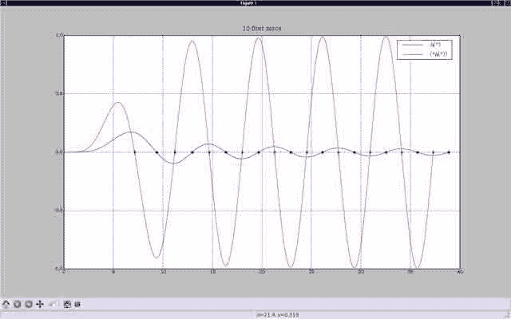
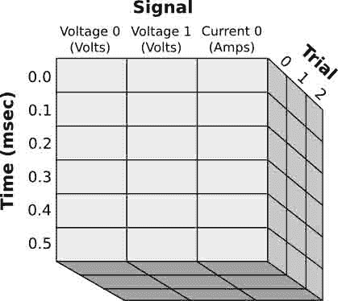

# 十八、NumPy 和 SciPy / 求根

*   [功能交叉点](Intersection.html)
*   [球面贝塞尔零点](SphericalBesselZeros.html)

# 函数交集

# 函数交集

## 找出两个给定函数相交的点

考虑寻找多项式和直线的交点的例子:

`\(y_1=x_1^2\)`

`\(y_2=x_2+1\)`

```py
from scipy.optimize import fsolve

import numpy as np

def f(xy):
   x, y = xy
   z = np.array([y - x**2, y - x - 1.0])
   return z

fsolve(f, [1.0, 2.0]) 
```

```py
 array([ 1.61803399,  2.61803399]) 
```

另见:[http://docs . scipy . org/doc/scipy/reference/generated/scipy . optimize . fsolve . html # scipy . optimize . fsolve](http://docs.scipy.org/doc/scipy/reference/generated/scipy.optimize.fsolve.html#scipy.optimize.fsolve)

# 球形贝塞尔零点

# 球形贝塞尔零点

例如，如果你想计算球形电磁腔的本征频率，找出球形贝塞尔函数的零点可能是有用的(在这种情况下，你还需要(r*Jn(r))导数的零点)。

问题是你必须计算出你应该找到零的范围。

令人高兴的是，第 n 个球面贝塞尔函数的给定零点的范围可以从第(n-1)个球面贝塞尔函数的零点计算出来。

因此，这里提出的方法是递归的，知道 0 阶球面贝塞尔函数等于 sin(r)/r，其零点是众所周知的。

这种方法显然一点也不高效，但它很有效；-).

使用[:Cookbook/Matplotlib:Matplotlib]显示了一个示例，用于 5 阶球面贝塞尔函数的前 10 个零点(以及(r*J5(r))的导数)。

```py
#! /usr/bin/env python

### recursive method: computes zeros ranges of Jn(r,n) from zeros of Jn(r,n-1)
### (also for zeros of (rJn(r,n))')
### pros : you are certain to find the right zeros values;
### cons : all zeros of the n-1 previous Jn have to be computed;
### note : Jn(r,0) = sin(r)/r

from scipy import arange, pi, sqrt, zeros
from scipy.special import jv, jvp
from scipy.optimize import brentq
from sys import argv
from pylab import *

def Jn(r,n):
  return (sqrt(pi/(2*r))*jv(n+0.5,r))
def Jn_zeros(n,nt):
  zerosj = zeros((n+1, nt), dtype=Float32)
  zerosj[0] = arange(1,nt+1)*pi
  points = arange(1,nt+n+1)*pi
  racines = zeros(nt+n, dtype=Float32)
  for i in range(1,n+1):
    for j in range(nt+n-i):
      foo = brentq(Jn, points[j], points[j+1], (i,))
      racines[j] = foo
    points = racines
    zerosj[i][:nt] = racines[:nt]
  return (zerosj)

def rJnp(r,n):
  return (0.5*sqrt(pi/(2*r))*jv(n+0.5,r) + sqrt(pi*r/2)*jvp(n+0.5,r))
def rJnp_zeros(n,nt):
  zerosj = zeros((n+1, nt), dtype=Float32)
  zerosj[0] = (2.*arange(1,nt+1)-1)*pi/2
  points = (2.*arange(1,nt+n+1)-1)*pi/2
  racines = zeros(nt+n, dtype=Float32)
  for i in range(1,n+1):
    for j in range(nt+n-i):
      foo = brentq(rJnp, points[j], points[j+1], (i,))
      racines[j] = foo
    points = racines
    zerosj[i][:nt] = racines[:nt]
  return (zerosj)

n = int(argv[1])  # n'th spherical bessel function
nt = int(argv[2]) # number of zeros to be computed

dr = 0.01
eps = dr/1000

jnz = Jn_zeros(n,nt)[n]
r1 = arange(eps,jnz[len(jnz)-1],dr)
jnzp = rJnp_zeros(n,nt)[n]
r2 = arange(eps,jnzp[len(jnzp)-1],dr)

grid(True)
plot(r1,Jn(r1,n),'b', r2,rJnp(r2,n),'r')
title((str(nt)+' first zeros'))
legend((r'$j_{'+str(n)+'}(r)$', r'$(rj_{'+str(n)+'}(r))\'$'))
plot(jnz,zeros(len(jnz)),'bo', jnzp,zeros(len(jnzp)),'rd')
gca().xaxis.set_minor_locator(MultipleLocator(1))
# gca().xaxis.set_minor_formatter(FormatStrFormatter('%d'))
show() 
```

```py
bessph_zeros_rec 5 10 
```

## 附件

*   [`snapshot.png`](../_downloads/snapshot.jpg)



# Numpy 和 Scipy /提示和技巧

# Numpy 和 Scipy /提示和技巧

*   [按名称寻址数组列](Recarray.html)
*   [转换为规则数组并整形](Recarray.html#converting-to-regular-arrays-and-reshaping)
*   [建造数组](BuildingArrays.html)
*   [类似卷积的运算](SegmentAxis.html)
*   [索引 numpy 数组](Indexing.html)
*   [元数组](MetaArray.html)
*   多点
*   [使用记录数组的对象数组](Obarray.html)
*   [人生游戏的跨步技巧](GameOfLifeStrides.html)
*   [类似累积功能](AccumarrayLike.html)

# 按名称寻址数组列

# 按名称寻址数组列

通过名称访问数组列有两种非常密切相关的方法:recarrays 和结构化数组。结构化数组只是具有复杂数据类型的数组:

```py
#!python numbers=disable
In [1]: from numpy import *
In [2]: ones(3, dtype=dtype([('foo', int), ('bar', float)]))
Out[2]:
array([(1, 1.0), (1, 1.0), (1, 1.0)],
      dtype=[('foo', '<i4'), ('bar', '<f8')])
In [3]: r = _
In [4]: r['foo']
Out[4]: array([1, 1, 1]) 
```

recarray 是 ndarray 的一个子类，它只是将属性访问权限添加到结构化数组中:

```py
#!python numbers=disable
In [10]: r2 = r.view(recarray)
In [11]: r2
Out[11]:
recarray([(1, 1.0), (1, 1.0), (1, 1.0)],
      dtype=[('foo', '<i4'), ('bar', '<f8')])
In [12]: r2.foo
Out[12]: array([1, 1, 1]) 
```

recarrays 的一个缺点是属性访问特性会减慢所有字段访问，甚至是 r['foo']形式，因为它会在中间插入一堆纯 Python 代码。许多代码不会注意到这一点，但是如果您最终不得不遍历一个记录数组，这将是您的一个热点。

结构化数组有时被混乱地称为记录数组。

`. - lightly adapted from a Robert Kern post of Thu, 26 Jun 2008 15:25:11 -0500`

# 构建数组

# 构建数组

这是对数组对象、它们在 scipy 中的声明和使用的简单介绍。在[带文档的 Numpy 示例列表](http://wiki.scipy.org/Numpy_Example_List_With_Doc)中可以找到数组 Numpy 函数示例的完整列表

## 基础

标准 python 语言中尚未定义数字数组。要将数组对象及其方法加载到命名空间中，必须导入 numpy 包:

```py
from numpy import * 
```

可以使用数组函数从通常的 python 列表和元组中创建数组。例如，

```py
a = array([1,2,3]) 
```

返回一维整数数组。数组实例附带了一大组方法和属性。例如，是数组的维数。在这种情况下，它只是。

数组对象和 python 的序列对象之间的一个很大的区别是数学运算符的定义。两个列表的添加将这些列表串联起来，而两个数组的添加将数组元素化。例如:

```py
b = array((10,11,12))
a + b 
```

```py
 array([11, 13, 15]) 
```

减法、乘法和除法的定义相似。

对于初学者来说，一个常见的问题是数组的类型定义。除非另有指示，否则数组构造使用其参数的类型。因为是从整数列表创建的，所以它被定义为整数数组，更准确地说:

```py
a.dtype 
```

```py
 dtype('int64') 
```

因此，除法等数学运算在 python 中会照常运行，即会返回一个整数答案:

```py
a/3 
```

```py
 array([0, 0, 1]) 
```

为了获得预期的答案，一种解决方案是通过除以一个实数来强制将整数转换为实数。更谨慎的方法是在初始化时定义类型:

```py
a = array([1,2,3], dtype=float) 
```

另一种转换方式是使用 Numpy 的内置转换函数作为 type 和 cast。这些选项允许您更改正在使用的数据类型:

```py
a = array([1,2,3], dtype=int)
b = a.astype('float') 
```

数组的元素使用括号符号来访问，其中是从 0 开始的整数索引。子数组可以通过使用`start:stop:step`形式的通用索引来访问。`a[start:stop:step]`将返回对数组`a`的子数组的引用，从(包括)索引`start`处的元素开始，到(不包括)在*步骤*的索引停止处的元素。例如:

```py
data = array([0.5, 1.2, 2.2, 3.4, 3.5, 3.4, 3.4, 3.4], float)
t = arange(len(data), dtype='float') * 2*pi/(len(data)-1)
t[:]              # get all t-values 
```

```py
 array([ 0\.        ,  0.8975979 ,  1.7951958 ,  2.6927937 ,  3.5903916 ,
         4.48798951,  5.38558741,  6.28318531]) 
```

```py
t[2:4]            # get sub-array with the elements at the indexes 2,3 
```

```py
 array([ 1.7951958,  2.6927937]) 
```

```py
t[slice(2,4)]     # the same using slice 
```

```py
 array([ 1.7951958,  2.6927937]) 
```

```py
t[0:6:2]          # every even-indexed value up to but excluding 6 
```

```py
 array([ 0\.       ,  1.7951958,  3.5903916]) 
```

此外，有可能使用布尔数组访问数组元素。布尔数组将要访问的元素的索引设置为*真。*

```py
i = array(len(t)*[False], bool)        # create an bool-array for indexing
i[2] = True; i[4] = True; i[6] = True  # we want elements with indexes 2,4 and 6
t[i] 
```

```py
 array([ 1.7951958 ,  3.5903916 ,  5.38558741]) 
```

我们可以使用这个语法来制作稍微复杂一点的构造。考虑之前定义的`data[:]`和`t[:]`数组。假设我们想要得到四个(`t[i]/data[i]`)-与最靠近一个点`p=1.8`的四个`t[i]-values`配对。我们可以按如下方式进行:

```py
p=1.8                            # set our point
abs(t-p)                         # how much do the t[:]-values differ from p? 
```

```py
 array([ 1.8       ,  0.9024021 ,  0.0048042 ,  0.8927937 ,  1.7903916 ,
         2.68798951,  3.58558741,  4.48318531]) 
```

```py
dt_m = sort(abs(t-p))[3]         # how large is the 4-th largest absolute distance between the
                                 # t[:]-values and p 
```

```py
abs(t-p) <= dt_m                 # where are the four elements of t[:]closest to p ? 
```

```py
 array([False,  True,  True,  True,  True, False, False, False], dtype=bool) 
```

```py
y_p = data[abs(t-p) <= dt_m]     # construct the sub-arrays; (1) get the 4 t[:]-values
t_p = t[abs(t-p) <= dt_m]        # (2) get the data t[:]-values corresponding to the 4 t[:] values
y_p 
```

```py
 array([ 1.2,  2.2,  3.4,  3.5]) 
```

```py
t_p 
```

```py
 array([ 0.8975979,  1.7951958,  2.6927937,  3.5903916]) 
```

必须记住，切片返回对数据的引用。因此，返回的子数组中的更改会导致原始数组中的更改，反之亦然。如果只想复制值，可以使用矩阵对象的 copy()-方法。例如:

```py
# first lets define a 2-d matrix
A = array([[0,   1,  2,  3],   # initialize 2-d array
           [4,   5,  6,  7],
           [8,   9, 10, 11],
           [12, 13, 14, 15]])
A 
```

```py
 array([[ 0,  1,  2,  3],
        [ 4,  5,  6,  7],
        [ 8,  9, 10, 11],
        [12, 13, 14, 15]]) 
```

```py
b=A[1:3,0:2]                    # let's get a sub-matrix containing the cross-section of
                                # rows 1,2 and columns 0,1
                                # !attention! this assigns to b a reference to the
                                # sub-matrix of A
b 
```

```py
 array([[4, 5],
        [8, 9]]) 
```

```py
c=A[1:3,0:2].copy()             # copy the entries
c 
```

```py
 array([[4, 5],
        [8, 9]]) 
```

```py
A[1:3,0:2] = 42                 # we can also assign by slicing (this also changes shallow copies)
b                               # b also affected (only a reference to sub matrix) 
```

```py
 array([[42, 42],
        [42, 42]]) 
```

```py
c                               # still the same (deep copy) 
```

```py
 array([[4, 5],
        [8, 9]]) 
```

## 矩阵点积

下一个示例创建两个矩阵:`a`和`b`，并计算点积`axb`(换句话说，标准矩阵积)

```py
a = array([[1,2], [2,3]])
b = array([[7,1], [0,1]])
dot(a, b) 
```

```py
 array([[ 7,  3],
        [14,  5]]) 
```

## 自动数组创建

Scipy(通过 Numpy)提供了许多自动创建数组的方法。例如，要创建一个均匀间隔的数字向量，可以调用 linspace 函数。这对于计算某个域上函数的结果通常很有用。例如，要计算一个周期上的函数值，我们将定义一个从 0 到 2π的向量，并计算该向量中所有值的函数值:

```py
x = linspace(0, 2*pi, 100)
y = sin(x) 
```

使用类及其一些对象创建方法和，可以在 N 维网格上完成相同的操作。例如，

```py
x, y = mgrid[0:10:.1, 0:10:.2] 
```

返回两个矩阵，x 和 y，它们的元素分别以. 1 和. 2 的增量从 0 到 10(不包括 0 和 10)。这些矩阵可用于计算由这些网格定义的点(x_i，y_i)处的函数值:

```py
z = (x+y)**2 
```

ogrid 对象具有完全相同的行为，但是它没有将 N-D 矩阵存储到内存中，而是只存储定义它的一维向量。对于大型矩阵，这可以显著节省存储空间。

创建矩阵的其他有用函数是和，它们初始化满是 0 和 1 的数组。请注意，默认情况下，这些将是浮点数组。这可能会导致不知情者的奇怪行为。例如，让我们用零初始化一个矩阵，然后逐个元素地在其中放置值。

```py
mz = zeros((2, 2), dtype=int)
mz[0, 0] = .5**2
mz[1, 1] = 1.6**2 
```

在本例中，我们试图将浮点数存储在整数数组中。因此，数字然后被重铸为整数，因此，如果我们打印矩阵，我们得到:

```py
mz 
```

```py
 array([[0, 0],
        [0, 2]]) 
```

要创建实数数组，只需在函数调用中显式声明类型:

```py
mz = zeros((2, 2), dtype=float) 
```

## 重复数组段

ndarray.repeat()方法返回一个新数组，其维数与旧数组相同。

```py
a = array([[0, 1],
...        [2, 3]])
a.repeat(2, axis=0) # repeats each row twice in succession 
```

```py
 array([[0, 1],
        [0, 1],
        [2, 3],
        [2, 3]]) 
```

```py
a.repeat(3, axis=1) # repeats each column 3 times in succession 
```

```py
 array([[0, 0, 0, 1, 1, 1],
        [2, 2, 2, 3, 3, 3]]) 
```

```py
a.repeat(2, axis=None) # flattens (ravels), then repeats each element twice 
```

```py
 array([0, 0, 1, 1, 2, 2, 3, 3]) 
```

这些可以结合起来做一些有用的事情，比如放大存储在 2D 数组中的图像数据:

```py
def enlarge(a, x=2, y=None):
    """Enlarges 2D image array a using simple pixel repetition in both dimensions.
 Enlarges by factor x horizontally and factor y vertically.
 If y is left as None, uses factor x for both dimensions."""
    a = asarray(a)
    assert a.ndim == 2
    if y == None:
        y = x
    for factor in (x, y):
        assert factor.__class__ == int
        assert factor > 0
    return a.repeat(y, axis=0).repeat(x, axis=1)

enlarge(a, x=2, y=2) 
```

```py
 array([[0, 0, 1, 1],
        [0, 0, 1, 1],
        [2, 2, 3, 3],
        [2, 2, 3, 3]]) 
```

# 类卷积运算

# 类卷积运算

用户经常希望将数组分解成重叠的块，然后对每个块应用相同的操作。例如，您可以通过对每个块进行快速傅立叶变换来生成动态功率谱，或者您可以使用点积来构建卷积。其中一些操作已经存在于 numpy 和 scipy 中，但其他操作不存在。解决这个问题的一种方法是制作一个矩阵，其中每一列都是一个起始位置，每一行都是一个块。这通常需要复制一些数据，如果有很多重叠，可能会有很多数据，但是 numpy 的大步可以用来做到这一点。大步的简化不是免费的；如果修改数组，所有共享元素都将被修改。然而，这是一个有用的操作。找到附上的代码， [`segmentaxis.py`](../_downloads/segmentaxis.py) 。示例用法:

```py
In [1]: import numpy as N
In [2]: import segmentaxis
In [3]: a = N.zeros(30)
In [4]: a[15] = 1
In [5]: filter = N.array([0.1,0.5,1,0.5,0.1])
In [6]: sa = segmentaxis.segment_axis(a,len(filter),len(filter)-1)
In [7]: sa
Out[7]:
array([[ 0.,  0.,  0.,  0.,  0.],
       [ 0.,  0.,  0.,  0.,  0.],
       [ 0.,  0.,  0.,  0.,  0.],
       [ 0.,  0.,  0.,  0.,  0.],
       [ 0.,  0.,  0.,  0.,  0.],
       [ 0.,  0.,  0.,  0.,  0.],
       [ 0.,  0.,  0.,  0.,  0.],
       [ 0.,  0.,  0.,  0.,  0.],
       [ 0.,  0.,  0.,  0.,  0.],
       [ 0.,  0.,  0.,  0.,  0.],
       [ 0.,  0.,  0.,  0.,  0.],
       [ 0.,  0.,  0.,  0.,  1.],
       [ 0.,  0.,  0.,  1.,  0.],
       [ 0.,  0.,  1.,  0.,  0.],
       [ 0.,  1.,  0.,  0.,  0.],
       [ 1.,  0.,  0.,  0.,  0.],
       [ 0.,  0.,  0.,  0.,  0.],
       [ 0.,  0.,  0.,  0.,  0.],
       [ 0.,  0.,  0.,  0.,  0.],
       [ 0.,  0.,  0.,  0.,  0.],
       [ 0.,  0.,  0.,  0.,  0.],
       [ 0.,  0.,  0.,  0.,  0.],
       [ 0.,  0.,  0.,  0.,  0.],
       [ 0.,  0.,  0.,  0.,  0.],
       [ 0.,  0.,  0.,  0.,  0.],
       [ 0.,  0.,  0.,  0.,  0.]])
In [8]: N.dot(sa[::2,:],filter)
Out[8]:
array([ 0\. ,  0\. ,  0\. ,  0\. ,  0\. ,  0\. ,  0.5,  0.5,  0\. ,  0\. ,  0\. ,
        0\. ,  0\. ])
In [9]: N.dot(sa[1::2,:],filter)
Out[9]:
array([ 0\. ,  0\. ,  0\. ,  0\. ,  0\. ,  0.1,  1\. ,  0.1,  0\. ,  0\. ,  0\. ,
        0\. ,  0\. ])
In [10]: N.dot(sa,filter)
Out[10]:
array([ 0\. ,  0\. ,  0\. ,  0\. ,  0\. ,  0\. ,  0\. ,  0\. ,  0\. ,  0\. ,  0\. ,
        0.1,  0.5,  1\. ,  0.5,  0.1,  0\. ,  0\. ,  0\. ,  0\. ,  0\. ,  0\. ,
        0\. ,  0\. ,  0\. ,  0\. ]) 
```

## 附件

*   [`segmentaxis.py`](../_downloads/segmentaxis.py)

# 索引 numpy 数组

# 索引 numpy 数组

numpy 的重点是引入一个多维数组对象来保存均匀类型的数值数据。这当然是一个存储数据的有用工具，但也有可能在不编写低效 python 循环的情况下操作大量值。为了实现这一点，人们需要能够以许多不同的方式引用数组的元素，从简单的“切片”到使用数组作为查找表。本页的目的是浏览各种不同类型的索引。希望有时特殊的语法也会变得更加清晰。

我们将尽可能使用相同的数组作为示例:

```py
import numpy as np
A = np.arange(10) 
```

```py
A 
```

```py
 array([0, 1, 2, 3, 4, 5, 6, 7, 8, 9]) 
```

```py
B = np.reshape(np.arange(9),(3,3))
B 
```

```py
 array([[0, 1, 2],
        [3, 4, 5],
        [6, 7, 8]]) 
```

```py
C = np.reshape(np.arange(2*3*4),(2,3,4))
C 
```

```py
 array([[[ 0,  1,  2,  3],
         [ 4,  5,  6,  7],
         [ 8,  9, 10, 11]],

        [[12, 13, 14, 15],
         [16, 17, 18, 19],
         [20, 21, 22, 23]]]) 
```

## 元素

挑选数组的一个或一些元素的最简单方法看起来非常类似于 python 列表:

```py
A[1] 
```

```py
 1 
```

```py
B[1,0] 
```

```py
 3 
```

```py
C[1,0,2] 
```

```py
 14 
```

也就是说，要挑选出一个特定的元素，只需将索引放在它后面的方括号中。作为 python 的标准，元素号从零开始。

如果要就地更改数组值，只需在赋值中使用上面的语法:

```py
T = A.copy()
T[3] = -5
T 
```

```py
 array([ 0,  1,  2, -5,  4,  5,  6,  7,  8,  9]) 
```

```py
T[0] += 7
T 
```

```py
 array([ 7,  1,  2, -5,  4,  5,  6,  7,  8,  9]) 
```

(与的业务。copy()是为了确保我们实际上不会修改 A，因为那样会使进一步的示例变得混乱。)注意，numpy 还支持 python 的“增广赋值”运算符，+=，-=，*=，等等。

请注意，数组元素的类型是数组本身的属性，因此如果您尝试将另一种类型的元素分配给数组，它将被静默转换(如果可能的话):

```py
T = A.copy()
T[3] = -1.5
T 
```

```py
 array([ 0,  1,  2, -1,  4,  5,  6,  7,  8,  9]) 
```

```py
T[3] = -0.5j 
```

```py
---------------------------------------------------------------------------
TypeError                                 Traceback (most recent call last)

<ipython-input-12-513dc3e86c66> in <module>()
----> 1 T[3] = -0.5j

TypeError: can't convert complex to long 
```

```py
T 
```

```py
 array([ 0,  1,  2, -1,  4,  5,  6,  7,  8,  9]) 
```

请注意，发生的转换是默认转换；在浮点到 int 的转换中，它是截断的。如果你想要不同的东西，比如说发言，你必须自己安排(例如用 np.floor())。在将复数值转换为整数的情况下，没有合理的默认方法，因此 numpy 会引发异常并保持数组不变。

最后，还有两个稍微技术性的问题。

如果您想以编程方式操作索引，您应该知道当您编写类似

```py
C[1,0,1] 
```

```py
 13 
```

它与(实际上它在内部转换为)相同

```py
C[(1,0,1)] 
```

```py
 13 
```

这种看起来奇特的语法是构造一个元组，python 中不可变序列的数据结构，并将该元组用作数组的索引。(引擎盖下 C[1，0，1]转换为 C. **getitem** ((1，0，1))。)这意味着如果您愿意，您可以创建元组:

```py
i = (1,0,1)
C[i] 
```

```py
 13 
```

如果您似乎不想这样做，可以考虑迭代任意多维数组:

```py
for i in np.ndindex(B.shape):
    print i, B[i] 
```

```py
 (0, 0) 0
 (0, 1) 1
 (0, 2) 2
 (1, 0) 3
 (1, 1) 4
 (1, 2) 5
 (2, 0) 6
 (2, 1) 7
 (2, 2) 8 
```

当我们开始研究花式索引和函数 np.where()时，用元组进行索引也会变得很重要。

我想提到的最后一个技术问题是，当您从数组中选择一个元素时，您得到的是与数组元素相同的类型。这听起来可能很明显，从某种程度上来说也是如此，但是请记住，即使是像我们的 A、B 和 C 这样无害的 numpy 数组也经常包含不太像 python 类型的类型:

```py
a = C[1,2,3]
a 
```

```py
 23 
```

```py
type(a) 
```

```py
 numpy.int64 
```

```py
type(int(a)) 
```

```py
 int 
```

```py
a**a 
```

```py
 -c:1: RuntimeWarning: overflow encountered in long_scalars 
```

```py
 8450172506621111015 
```

```py
int(a)**int(a) 
```

```py
 20880467999847912034355032910567L 
```

为了一致性，numpy 标量也支持某些索引操作，但这些操作有些微妙，正在讨论中。

## 部分

能够处理数组的单个元素显然是非常重要的。但是 numpy 的卖点之一是“数组式”操作的能力:

```py
2*A 
```

```py
 array([ 0,  2,  4,  6,  8, 10, 12, 14, 16, 18]) 
```

这很方便，但是人们经常希望只处理数组的一部分。例如，假设要计算 A 的差的数组，即元素为 A[1]-A[0]、A[2]-A[1]等的数组。(事实上，函数 np.diff 做到了这一点，但是为了方便说明，我们忽略它。)numpy 使得使用数组操作来实现这一点成为可能:

```py
A[1:] 
```

```py
 array([1, 2, 3, 4, 5, 6, 7, 8, 9]) 
```

```py
A[:-1] 
```

```py
 array([0, 1, 2, 3, 4, 5, 6, 7, 8]) 
```

```py
A[1:] - A[:-1] 
```

```py
 array([1, 1, 1, 1, 1, 1, 1, 1, 1]) 
```

这是通过制作一个除了 A 的第一个元素以外的数组，一个除了 A 的最后一个元素以外的数组，并减去相应的元素来实现的。这样取子阵的过程叫做“切片”。

### 一维切片

切片的一般语法是*数组* [ *开始* : *停止* : *步骤* ]。*开始*、*停止*、*步骤*中的任意一个或全部值可能被遗漏(如果*步骤*被遗漏，其前面的冒号也可能被遗漏):

```py
A[5:] 
```

```py
 array([5, 6, 7, 8, 9]) 
```

```py
A[:5] 
```

```py
 array([0, 1, 2, 3, 4]) 
```

```py
A[::2] 
```

```py
 array([0, 2, 4, 6, 8]) 
```

```py
A[1::2] 
```

```py
 array([1, 3, 5, 7, 9]) 
```

```py
A[1:8:2] 
```

```py
 array([1, 3, 5, 7]) 
```

和 python 一样，*开始*指数包含在内，*停止*指数不包含在内。和 python 一样，负数表示*从数组末尾开始*或*停止*向后计数:

```py
A[-3:] 
```

```py
 array([7, 8, 9]) 
```

```py
A[:-3] 
```

```py
 array([0, 1, 2, 3, 4, 5, 6]) 
```

如果在数组中*停止*先于*开始*，则返回长度为零的数组:

```py
A[5:3] 
```

```py
 array([], dtype=int64) 
```

(“dtype=int32”出现在打印形式中，因为在没有元素的数组中，人们无法从它们的打印表示中分辨出元素的类型。尽管如此，如果数组中有任何元素，跟踪它们的类型还是有意义的。)

如果指定一个恰好只有一个元素的切片，则得到一个恰好只有一个元素的数组:

```py
A[5:6] 
```

```py
 array([5]) 
```

```py
A[5] 
```

```py
 5 
```

这似乎是相当明显和合理的，但当处理花哨的索引和多维数组时，这可能会令人惊讶。

如果数字*步长*为负，则通过数组的步长为负，也就是说，新数组以相反的顺序包含(一些)原始数组的元素:

```py
A[::-1] 
```

```py
 array([9, 8, 7, 6, 5, 4, 3, 2, 1, 0]) 
```

这是非常有用的，但是当给出*启动*和*停止*时，可能会令人困惑:

```py
A[5:3:-1] 
```

```py
 array([5, 4]) 
```

```py
A[3:5:1] 
```

```py
 array([3, 4]) 
```

要记住的规则是:无论*步*是正还是负，*开始*总是包括在内，*停止*从来不是。

正如可以将数组中的元素作为子数组而不是逐个进行检索一样，可以将它们作为子数组而不是逐个进行修改:

```py
#!python numbers=disable
>>> T = A.copy()
>>> T
array([0, 1, 2, 3, 4, 5, 6, 7, 8, 9])
>>> T[1::2]
array([1, 3, 5, 7, 9])
>>> T[1::2] = -np.arange(5)
>>> T[1::2]
array([ 0, -1, -2, -3, -4])
>>> T
array([ 0,  0,  2, -1,  4, -2,  6, -3,  8, -4]) 
```

如果您试图分配的数组是错误的形状，则会引发异常:

```py
#!python numbers=disable
>>> T = A.copy()
>>> T[1::2] = np.arange(6)
Traceback (most recent call last):
  File "<stdin>", line 1, in <module>
ValueError: shape mismatch: objects cannot be broadcast to a single shape
>>> T[:4] = np.array([[0,1],[1,0]])
Traceback (most recent call last):
  File "<stdin>", line 1, in <module>
ValueError: shape mismatch: objects cannot be broadcast to a single shape 
```

如果你认为错误信息听起来令人困惑，我不得不同意，但这是有原因的。在第一种情况下，我们试图将六个元素填充到五个插槽中，因此 numpy 拒绝了。在第二种情况下，有正确数量的元素——四个——但是我们试图填充一个二乘二的数组，这里应该有一个长度为四的一维数组。虽然 numpy 可以将二乘二的数组强制转换成正确的形状，但是设计者选择遵循 python 的哲学“显式比隐式好”，并将任何强制留给用户。不过，让我们这么做吧:

```py
#!python numbers=disable
>>> T = A.copy()
>>> T[:4] = np.array([[0,1],[1,0]]).ravel()
>>> T
array([0, 1, 1, 0, 4, 5, 6, 7, 8, 9]) 
```

因此，为了让分配发挥作用，仅仅有正确数量的元素是不够的——它们必须排列成正确形状的数组。

还有一个问题使错误信息复杂化:numpy 有一些非常方便的规则，用于将低维数组转换为高维数组，以及沿轴隐式重复数组。这个过程叫做“广播”。我们将在其他地方看到更多，但这里它是最简单的形式:

```py
#!python numbers=disable
>>> T = A.copy()
>>> T[1::2] = -1
>>> T
array([ 0, -1,  2, -1,  4, -1,  6, -1,  8, -1]) 
```

我们告诉 numpy 取一个标量，-1，并将其放入长度为 5 的数组中。numpy 的广播规则不是发出错误信号，而是告诉它通过重复标量五次，将这个标量转换成长度为五的有效数组。(当然，它实际上不会创建这样大小的临时数组；事实上，它使用了一个巧妙的技巧，告诉自己临时数组的元素间隔为零字节。)这种特殊的广播情况一直在使用:

```py
#!python numbers=disable
>>> T = A.copy()
>>> T[1::2] -= 1
>>> T
array([0, 0, 2, 2, 4, 4, 6, 6, 8, 8]) 
```

分配有时是使用“一切”部分的好理由:

```py
#!python numbers=disable
>>> T = A.copy()
>>> T[:] = -1
>>> T
array([-1, -1, -1, -1, -1, -1, -1, -1, -1, -1])
>>> T = A.copy()
>>> T = -1
>>> T
-1 
```

这里发生了什么？在第一种情况下，我们告诉 numpy 将-1 赋给 T 的所有元素，这就是它所做的。第二种情况，我们告诉 python“T =-1”。在 python 中，变量只是可以附加到内存中对象的名称。这与 C 语言形成鲜明对比，在 C 语言中，变量是可以存储数据的命名内存区域。对变量名的赋值——在这种情况下是 T——只是改变名称所指的对象，而不会以任何方式改变底层对象。(如果名称是对原始对象的唯一引用，那么在重新分配之后，您的程序就不可能再找到它了，所以 python 会删除原始对象来释放一些内存。)在像 C 语言这样的语言中，给变量赋值会改变存储在内存区域中的值。如果真的一定要用 C 语言来思考，可以把所有 python 变量都看作是持有指向实际对象的指针；对 python 变量的赋值只是指针的修改，并不影响指向的对象(除非垃圾收集删除它)。无论如何，如果你想修改一个数组的*内容*，你不能通过给数组赋一个名字来完成；您必须使用切片分配或其他方法。

最后，一个技术问题:程序如何以编程方式处理切片？如果您想保存一个切片规范，以便以后应用于许多数组，该怎么办？答案是使用切片对象，它是使用 slice()构造的:

```py
#!python numbers=disable
>>> A[1::2]
array([1, 3, 5, 7, 9])
>>> s = slice(1,None,2)
>>> A[s]
array([1, 3, 5, 7, 9]) 
```

(遗憾的是，你不能只写“s = 1::2”。但是在方括号内，1::2 在内部转换为切片(1，无，2)。)您可以像使用冒号符号一样，将参数省略到 slice()中，但有一个例外:

```py
#!python numbers=disable
>>> A[slice(-3)]
array([0, 1, 2, 3, 4, 5, 6])
>>> A[slice(None,3)]
array([0, 1, 2])
>>> A[slice()]
Traceback (most recent call last):
  File "<stdin>", line 1, in <module>
TypeError: slice expected at least 1 arguments, got 0
>>> A[slice(None,None,None)]
array([0, 1, 2, 3, 4, 5, 6, 7, 8, 9]) 
```

### 多维切片

一维数组非常有用，但是通常一个人拥有的数据是自然多维的——例如，图像数据可能是像素值的 N 乘 M 数组，或者是颜色值的 N 乘 M 乘 3 数组。正如获取一维数组的切片很有用一样，获取多维数组的切片也很有用。这相当简单:

```py
#!python numbers=disable
>>> B
array([[0, 1, 2],
       [3, 4, 5],
       [6, 7, 8]])
>>> B[:2,:]
array([[0, 1, 2],
       [3, 4, 5]])
>>> B[:,::-1]
array([[2, 1, 0],
       [5, 4, 3],
       [8, 7, 6]]) 
```

本质上，我们只需为每个轴指定一个一维切片。也可以为轴而不是切片提供一个数字:

```py
#!python numbers=disable
>>> B[0,:]
array([0, 1, 2])
>>> B[0,::-1]
array([2, 1, 0])
>>> B[:,0]
array([0, 3, 6]) 
```

请注意，当人们为第一个轴提供一个数字时，结果不再是二维数组；现在是一维数组。这很有道理:

```py
#!python numbers=disable
>>> B[:,:]
array([[0, 1, 2],
       [3, 4, 5],
       [6, 7, 8]])
>>> B[0,:]
array([0, 1, 2])
>>> B[0,0]
0 
```

如果你不提供数字，你会得到一个二维数组；如果你提供一个数字，维度下降一，你得到一个一维数组；如果你提供两个数字，量纲减 2，你得到一个标量。(如果你认为你应该得到一个零维数组，那你是在打开一罐虫子。标量和零维数组之间的区别或缺乏区别是一个正在讨论和开发的问题。)

如果您习惯于使用矩阵，您可能希望保留“行向量”和“列向量”之间的区别。numpy 只支持一种一维数组，但是您可以将行和列向量表示为*两个*维数组，其中一个维度恰好为 1。不幸的是，这些对象的索引变得很麻烦。

与一维数组一样，如果您指定一个恰好只有一个元素的切片，您将得到一个数组，其中一个轴的长度为 1 -该轴不会像您为该轴提供实际数字时那样“消失”:

```py
#!python numbers=disable
>>> B[:,0:1]
array([[0],
       [3],
       [6]])
>>> B[:,0]
array([0, 3, 6]) 
```

numpy 还有一些快捷方式，非常适合处理维数不确定的数组。如果这看起来不合理，请记住 numpy 的许多函数(例如 np.sort()、np.sum()和 np.transpose())必须在任意维度的数组上工作。当然可以从数组中提取维数并显式地使用它，但是一个人的代码往往会充满像(slice(None，None，None)，)*(C.ndim-1)这样的东西，读起来很不舒服。所以 numpy 有一些捷径可以简化事情。

首先是省略号对象:

```py
#!python numbers=disable
>>> A[...]
array([0, 1, 2, 3, 4, 5, 6, 7, 8, 9])
>>> B[...]
array([[0, 1, 2],
       [3, 4, 5],
       [6, 7, 8]])
>>> B[0,...]
array([0, 1, 2])
>>> B[0,...,0]
array(0)
>>> C[0,...,0]
array([0, 4, 8])
>>> C[0,Ellipsis,0]
array([0, 4, 8]) 
```

省略号(三个点)表示“需要多少就有多少”:”。(它在索引篡改代码中使用的名称是省略号，它不是 numpy 特定的。)这使得只操作数组的一个维度变得很容易，让 numpy 在“不需要的”维度上进行数组操作。在任何给定的索引表达式中，您实际上只能有一个省略号，否则表达式对每个省略号中应该放多少个“:”会有歧义。(事实上，出于某种原因，允许有类似“C[...,...]";这实际上并不含糊。)

在某些情况下，完全省略省略号是很方便的:

```py
#!python numbers=disable
>>> B[0]
array([0, 1, 2])
>>> C[0]
array([[ 0,  1,  2,  3],
       [ 4,  5,  6,  7],
       [ 8,  9, 10, 11]])
>>> C[0,0]
array([0, 1, 2, 3])
>>> B[0:2]
array([[0, 1, 2],
       [3, 4, 5]]) 
```

如果没有为数组提供足够的索引，将会默默添加一个省略号。这意味着在某种意义上，您可以将二维数组视为一维数组的数组。结合 numpy 的数组操作，这意味着为一维数组编写的函数通常只适用于二维数组。例如，回想一下我们在一维切片一节中写的差分运算:

```py
#!python numbers=disable
>>> A[1:] - A[:-1]
array([1, 1, 1, 1, 1, 1, 1, 1, 1])
>>> B[1:] - B[:-1]
array([[3, 3, 3],
       [3, 3, 3]]) 
```

它可以不加修改地沿着二维数组的第一个轴取差。

写入多维切片的工作方式与写入一维切片的工作方式相同:

```py
>>> T = B.copy()
>>> T[1,:] = -1
>>> T
array([[ 0,  1,  2],
 [-1, -1, -1],
 [ 6,  7,  8]])
>>> T[:,:2] = -2
>>> T
array([[-2, -2,  2],
 [-2, -2, -1],
 [-2, -2,  8]]) 
```

FIXME: np.newaxis 和广播规则。

### 视图与副本

零维数组，单个元素的视图。

## 花式索引

切片非常方便，而且它们可以创建为视图的事实使它们非常高效。但是有些操作真的不能用切片来完成；例如，假设一个人想要对一个数组中的所有负值求平方。除了用 python 编写一个循环之外，人们还希望能够找到负值，提取它们，将其平方，并将新值放在旧值所在的位置:

```py
#!python numbers=disable
>>> T = A.copy() - 5
>>> T[T<0] **= 2
>>> T
array([25, 16,  9,  4,  1,  0,  1,  2,  3,  4]) 
```

或者假设你想使用一个数组作为查找表，也就是说，对于一个数组 B，产生一个数组，它的第 I，j 个元素是 LUT[B[i，j]]: FIXME: argsort 是一个更好的例子

```py
#!python numbers=disable
>>> LUT = np.sin(A)
>>> LUT
array([ 0\.        ,  0.84147098,  0.90929743,  0.14112001, -0.7568025 ,
       -0.95892427, -0.2794155 ,  0.6569866 ,  0.98935825,  0.41211849])
>>> LUT[B]
array([[ 0\.        ,  0.84147098,  0.90929743],
       [ 0.14112001, -0.7568025 , -0.95892427],
       [-0.2794155 ,  0.6569866 ,  0.98935825]]) 
```

对于这类事情，numpy 提供了所谓的“花式索引”。它不像切片那样快速和轻量级，但它允许人们做一些相当复杂的事情，同时让 numpy 在 c 语言中做所有的艰苦工作。

### 布尔索引

经常发生的情况是，人们只想选择或修改满足某些条件的数组元素。numpy 提供了几种工具来处理这种情况。首先是布尔数组。numpy 数组之间的比较(等于、小于等)生成布尔值数组:

```py
#!python numbers=disable
>>> A<5
array([ True,  True,  True,  True,  True, False, False, False, False, False], dtype=bool) 
```

这些是普通的数组。实际的存储类型通常是每个值一个字节，而不是打包成一个字节的位，但是布尔数组提供了与其他数组相同的索引和数组操作范围。不幸的是，python 的“and”和“or”不能被覆盖来执行数组式操作，因此必须使用按位操作“&”、“|”和“^”(用于异或)。同样，python 的链式不等式不能被覆盖。此外，令人遗憾的是，我们无法更改按位运算符的优先级:

```py
#!python numbers=disable
>>> c = A<5 & A>1
Traceback (most recent call last):
  File "<stdin>", line 1, in <module>
ValueError: The truth value of an array with more than one element is ambiguous. Use a.any() or a.all()
>>> c = (A<5) & (A>1)
>>> c
array([False, False,  True,  True,  True, False, False, False, False, False], dtype=bool) 
```

然而，numpy 的布尔数组非常强大。

可以使用布尔数组从数组中提取值:

```py
#!python numbers=disable
>>> c = (A<5) & (A>1)
>>> A[c]
array([2, 3, 4]) 
```

结果必然是原始数组的副本，而不是视图，因为通常情况下，c 的 True 元素不会选择均匀分布的内存布局。然而，也可以使用布尔数组来写入特定元素:

```py
>>> T = A.copy()
>>> c = (A<5) & (A>1)
>>> T[c] = -7
>>> T
array([ 0,  1, -7, -7, -7,  5,  6,  7,  8,  9]) 
```

FIXME:提到哪里()

#### 多维布尔索引

布尔索引也适用于多维数组。在其最简单(也是最常见)的体现中，您只需提供一个布尔数组作为索引，其形状与原始数组相同:

```py
>>> C[C%5==0]
array([ 0,  5, 10, 15, 20]) 
```

然后，您将获得条件为真的元素的一维数组。(请注意，数组必须是一维的，因为布尔值可以围绕数组任意排列。如果您想跟踪原始数组中值的排列，请考虑使用 numpy 的“屏蔽数组”工具。)您也可以使用布尔索引进行赋值，就像对一维数组一样。

布尔数组上两个非常有用的操作是 np.any()和 np.all():

```py
>>> np.any(B<5)
True
>>> np.all(B<5)
False 
```

他们只做他们在 tin 上说的事情，评估布尔矩阵中的任何条目是否为真，或者布尔矩阵中的所有元素是否为真。但是它们也可以用于“沿轴”求值，例如，生成一个布尔数组，说明给定行中的任何元素是否为真:

```py
>>> B<5
array([[ True,  True,  True],
 [ True,  True, False],
 [False, False, False]], dtype=bool)
>>> np.any(B<5, axis=1)
array([ True,  True, False], dtype=bool)
>>> np.all(B<5, axis=1)
array([ True, False, False], dtype=bool) 
```

还可以使用布尔索引来拉出符合某些标准的行或列:

```py
>>> B[np.any(B<5, axis=1),:]
array([[0, 1, 2],
 [3, 4, 5]]) 
```

这里的结果是二维的，因为布尔索引的结果是一维的，因为每行都是一维的。

这也适用于高维布尔数组:

```py
>>> c = np.any(C<5,axis=2)
>>> c
array([[ True,  True, False],
 [False, False, False]], dtype=bool)
>>> C[c,:]
array([[0, 1, 2, 3],
 [4, 5, 6, 7]]) 
```

这里的结果也是二维的，尽管这可能有点令人惊讶。布尔数组是二维的，但是对应于布尔数组的返回值部分必须是一维的，因为真值可以任意分布。每个真值或假值对应的 C 的子阵是一维的，所以我们得到一个二维的返回数组。

最后，如果您想同时对行和列应用布尔条件，请注意:

```py
>>> B[np.array([True, False, True]), np.array([False, True, True])]
array([1, 8])
>>> B[np.array([True, False, True]),:][:,np.array([False, True, True])]
array([[1, 2],
 [7, 8]]) 
```

显而易见的方法没有给出正确的答案。我不知道为什么不，或者为什么它产生了它所产生的价值。你可以通过索引两次来得到正确的答案，但是这样做既笨拙又低效，而且不允许赋值。

FIXME:出于某种原因，适用于太小的布尔数组？

### 位置列表索引

它以某种频率发生，人们希望在数组中的特定位置提取值。如果想要一个单一的位置，可以只使用简单的索引。但是如果有很多地方，你需要一些更聪明的东西。幸运的是，numpy 支持一种花式索引模式，可以实现这一点:

```py
>>> primes = np.array([2,3,5,7,11,13,17,19,23])
>>> idx = [3,4,1,2,2]
>>> primes[idx]
array([ 7, 11,  3,  5,  5])
>>> idx = np.array([3,4,1,2,2])
>>> primes[idx]
array([ 7, 11,  3,  5,  5]) 
```

当您使用不是布尔数组的数组或列表进行索引时，numpy 会将其视为索引数组。数组可以是任何形状，返回的数组具有相同的形状:

```py
>>> primes = np.array([2,3,5,7,11,13,17,19,23,29,31])
>>> primes[B]
array([[ 2,  3,  5],
 [ 7, 11, 13],
 [17, 19, 23]]) 
```

这实际上将原始数组用作查找表。

您也可以通过这种方式分配给数组:

```py
>>> T = A.copy()
>>> T[ [1,3,5,0] ] = -np.arange(4)
>>> T
array([-3,  0,  2, -1,  4, -2,  6,  7,  8,  9]) 
```

**警告:**增广赋值——像“+=”这样的操作符是有效的，但它不一定能达到你的预期。特别是，重复的指数不会导致价值增加两次:

```py
>>> T = A.copy()
>>> T[ [0,1,2,3,3,3] ] += 10
>>> T
array([10, 11, 12, 13,  4,  5,  6,  7,  8,  9]) 
```

这是令人惊讶、不方便和不幸的，但这是 python 如何实现“+=”运算符的直接结果。最常见的情况是类似直方图的东西:

```py
>>> bins = np.zeros(5,dtype=np.int32)
>>> pos = [1,0,2,0,3]
>>> wts = [1,2,1,1,4]
>>> bins[pos]+=wts
>>> bins
array([1, 1, 1, 4, 0]) 
```

不幸的是，这给出了错误的答案。在旧版本的 numpy 中，没有真正令人满意的解决方案，但是从 numpy 1.1 开始，直方图函数可以做到这一点:

```py
>>> bins = np.zeros(5,dtype=np.int32)
>>> pos = [1,0,2,0,3]
>>> wts = [1,2,1,1,4]
>>> np.histogram(pos,bins=5,range=(0,5),weights=wts,new=True)
(array([3, 1, 1, 4, 0]), array([ 0.,  1.,  2.,  3.,  4.,  5.])) 
```

FIXME:提到放()和取()

#### 多维位置列表索引

人们也可以在多维数组上使用位置列表索引，这并不奇怪。然而，语法有点令人惊讶。假设我们想要列表[B[0，0]，B[1，2]，B[0，1]]。然后我们写道:

```py
>>> B[ [0,1,0], [0,2,1] ]
array([0, 5, 1])
>>> [B[0,0],B[1,2],B[0,1]]
[0, 5, 1] 
```

这看起来很奇怪——为什么不提供一个表示坐标的元组列表呢？原因基本上是，对于大型数组，列表和元组的效率非常低，所以 numpy 被设计为只处理数组，用于索引和值。这意味着像 B[ [(0，0)，(1，2)，(0，1)]这样的东西看起来就像用二维数组索引 B，正如我们在上面看到的，这只是意味着 B 应该被用作产生二维结果数组的查找表(每个结果都是一维的，就像我们通常只向二维数组提供一个索引一样)。

总之，在位置列表索引中，您为每个坐标提供一个值数组，所有形状都相同，numpy 返回一个包含通过在原始数组中查找每组坐标获得的值的相同形状的数组。如果坐标数组不是相同的形状，numpy 的广播规则将应用于它们，以尝试使它们的形状相同。如果数组没有原始数组的维数多，则原始数组被视为包含数组，多余的维数出现在结果数组上。

幸运的是，大多数时候，当你想给多维数组提供一个位置列表时，你首先会从 numpy 那里得到这个列表。正常的方法是这样的:

```py
>>> idx = np.nonzero(B%2)
>>> idx
(array([0, 1, 1, 2]), array([1, 0, 2, 1]))
>>> B[idx]
array([1, 3, 5, 7])
>>> B[B%2 != 0]
array([1, 3, 5, 7]) 
```

这里非零()接受一个数组，并返回一个数组非零的位置列表(格式正确)。当然，也可以用布尔数组直接索引到数组中；除非非零位置的数量很少，并且索引被多次执行，否则这将更加有效。但有时直接处理指数列表是有价值的。

#### 挑选行和列

numpy 的位置列表索引语法的一个不幸的后果是，习惯于其他数组语言的用户希望它能够挑选行和列。毕竟，想要从矩阵中拉出行和列的列表是非常合理的。所以 numpy 提供了一个方便的函数 ix_()来完成这个任务:

```py
>>> B[ np.ix_([0,2],[0,2]) ]
array([[0, 2],
 [6, 8]])
>>> np.ix_([0,2],[0,2])
(array([[0],
 [2]]), array([[0, 2]])) 
```

它的工作方式是利用 numpy 的广播设施。您可以看到用作行索引和列索引的两个数组具有不同的形状；numpy 的广播沿着太短的轴重复每一个，这样它们就符合了。

## 混合索引模式

当您尝试混合切片索引、元素索引、布尔索引和位置列表索引时会发生什么？

## 引擎盖下的索引工作原理

numpy 数组是内存块、用于解释内存位置的数据类型、大小列表和步长列表。例如，C[i，j，k]是从位置 i *步距[0]+j* 步距[1]+k *步距[2]开始的元素。举例来说，这意味着转置 amatrix 可以非常有效地完成:只需反转数组的步长和大小。这就是为什么切片是有效的，可以返回视图，但花式索引较慢，不能。

在 python 级别，numpy 的索引是通过覆盖 ndarray 对象中的 **getitem** 和 **setitem** 方法来工作的。当数组被索引时调用这些方法，它们允许任意实现:

```py
>>> class IndexDemo:
...     def __getitem__(self, *args):
...         print "__getitem__", args
...         return 1
...     def __setitem__(self, *args):
...         print "__setitem__", args
...     def __iadd__(self, *args):
...         print "__iadd__", args
...
>>>
>>> T = IndexDemo()
>>> T[1]
__getitem__ (1,)
1
>>> T["fish"]
__getitem__ ('fish',)
1
>>> T[A]
__getitem__ (array([0, 1, 2, 3, 4, 5, 6, 7, 8, 9]),)
1
>>> T[1,2]
__getitem__ ((1, 2),)
1
>>> T[1] = 7
__setitem__ (1, 7)
>>> T[1] += 7
__getitem__ (1,)
__setitem__ (1, 8) 
```

## 类似数组的对象

numpy 和 scipy 还提供了一些其他类型的数组，特别是矩阵和稀疏矩阵。它们的索引与数组的索引有惊人的不同。

# 元数组

# 元数组

！元数组是一个扩展数组的类，增加了对每轴元数据存储的支持。这个类对于存储数据数组以及单位、轴名、列名、轴值等非常有用。！元数组对象可以使用命名的轴和列进行任意索引和切片。

下载到这里: [`MetaArray.py`](../_downloads/MetaArray.py)

## 示例用途

这是一个可以存储的数据类型的例子！元数组:



请注意，每个轴都是命名的，可以存储不同类型的元信息:*信号轴为每个列命名了具有不同单位的列*时间轴将数值与每行相关联*试验轴使用正常的整数索引

可以通过多种不同的方式访问该数组中的数据:

```py
data[0, 1, 1]
data[:, "Voltage 1", 0]
data["Trial":1, "Signal":"Voltage 0"]
data["Time":slice(3,7)] 
```

## 特征

`* Per axis meta-information:`` * Named axes`` * Numerical values with units (e.g., "Time" axis above)`` * Column names/units (e.g., "Signal" axis above)``* Indexing by name:`` * Index each axis by name, so there is no need to remember order of axes`` * Within an axis, index each column by name, so there is no need to remember the order of columns``* Read/write files easily``* Append, extend, and sort convenience functions`

## 证明文件

### 实例化

`Accepted Syntaxes:`

```py
 # Constructs MetaArray from a preexisting ndarray and info list
MetaArray(ndarray, info)

 # Constructs MetaArray using empty(shape, dtype=type) and info list
MetaArray((shape), dtype=type, info)

 # Constructs MetaArray from file written using MetaArray.write()
MetaArray(file='fileName') 
```

`info parameter: This parameter specifies the entire set of meta data for this !MetaArray and must follow a specific format. First, info is a list of axis descriptions:`

```py
info=[axis1, axis2, axis3...] 
```

`Each axis description is a dict which may contain:`` * "name": the name of the axis`` * "values": a list or 1D ndarray of values, one per index in the axis`` * "cols": a list of column descriptions [col1, col2, col3,...]`` * "units": the units associated with the numbers listed in "values"`` All of these parameters are optional. A column description, likewise, is a dict which may contain:`` * "name": the name of the column`` * "units": the units for all values under this column`` In the case where meta information is to apply to the entire array, (for example, if the entire array uses the same units) simply add an extra axis description to the end of the info list. All dicts may contain any extra information you want.`

`For example, the data set shown above would look like:`

```py
MetaArray((3, 6, 3), dtype=float, info=[
  {"name": "Signal", "cols": [
      {"name": "Voltage 0", "units": "V"},
      {"name": "Voltage 1", "units": "V"},
      {"name": "Current 0", "units": "A"}
    ]
  },
  {"name": "Time", "units": "msec", "values":[0.0, 0.1, 0.2, 0.3, 0.4, 0.5] },
  {"name": "Trial"},
  {"note": "Just some extra info"}
] 
```

### 访问数据

可以通过多种方法访问数据:*标准索引–您可以像对任何数组*命名轴一样对数组进行索引–如果不记得轴的顺序，您可以这样指定要索引或切片的轴:

```py
data["AxisName":index]
data["AxisName":slice(...)] 
```

`Note that since this syntax hijacks the original slice mechanism, you must specify a slice using slice() if you want to use named axes.`` * Column selection--If you don't remember the index of a column you wish to select, you may substitute the column's name for the index number. Lists of column names are also acceptable. For example:`

```py
data["AxisName":"ColumnName"]
data["ColumnName"]  ## Works only if the named column exists for this axis
data[["ColumnName1", "ColumnName2"]] 
```

`* Boolean selection--works as you might normally expect, for example:`

```py
sel = data["ColumnName", 0, 0] > 0.2
data[sel] 
```

`* Access axis values using !MetaArray.axisValues(), or .xvals() for short. ``* Access axis units using .axisUnits(), column units using .columnUnits()``* Access any other parameter directly through the info list with .infoCopy()`

### 文件输入输出

```py
data.write('fileName')
newData = MetaArray(file='fileName') 
```

### 性能提示

！元数组是覆盖`__getitem__`和`__setitem__`方法的 ndarray 的子类。由于这些方法必须为每次访问改变元信息的结构，因此与本机方法相比，它们相当慢。因此，当在上操作时，许多内置函数将运行得非常慢！元数组。因此，建议您在执行以下操作之前重铸数组:

```py
data = MetaArray(...)
data.mean()                ## Very slow
data.view(ndarray).mean()  ## native speed 
```

### 更多示例

`A 2D array of altitude values for a topographical map might look like`

```py
info=[
  {'name': 'lat', 'title': 'Latitude'},
  {'name': 'lon', 'title': 'Longitude'},
  {'title': 'Altitude', 'units': 'm'}
] 
```

`In this case, every value in the array represents the altitude in feet at the lat, lon`` position represented by the array index. All of the following return the `` value at lat=10, lon=5:`

```py
array[10, 5]
array['lon':5, 'lat':10]
array['lat':10][5] 
```

`Now suppose we want to combine this data with another array of equal dimensions that`` represents the average rainfall for each location. We could easily store these as two `` separate arrays or combine them into a 3D array with this description:`

```py
info=[
  {'name': 'vals', 'cols': [
    {'name': 'altitude', 'units': 'm'},
    {'name': 'rainfall', 'units': 'cm/year'}
  ]},
  {'name': 'lat', 'title': 'Latitude'},
  {'name': 'lon', 'title': 'Longitude'}
] 
```

`We can now access the altitude values with array[0] or array['altitude'], and the`` rainfall values with array[1] or array['rainfall']. All of the following return`` the rainfall value at lat=10, lon=5:`

```py
array[1, 10, 5]
array['lon':5, 'lat':10, 'val': 'rainfall']
array['rainfall', 'lon':5, 'lat':10] 
```

```py
Notice that in the second example, there is no need for an extra (4th) axis description
since the actual values are described (name and units) in the column info for the first axis. 
```

===联系人= = = = = Luke campaigna-[lcampagn @ email . unc . edu](mailto:lcampagn%40email.unc.edu)

## 附件

*   [`MetaArray.py`](../_downloads/MetaArray.py)
*   [`example.png`](../_downloads/example.jpg)


# 多点

# 多点

矩阵乘法函数 numpy.dot()只接受两个参数。这意味着将两个以上的数组相乘会导致难以读取的嵌套函数调用:

```py
dot(dot(dot(a,b),c),d) 
```

相对于中缀符号，你只需要写

```py
a*b*c*d 
```

有两种方法可以定义一个“mdot”函数，它的行为类似于点，但接受两个以上的参数。使用其中一个允许您将上面的表达式写成

```py
mdot(a,b,c,d) 
```

## 使用 reduce

最简单的方法就是使用 reduce。

```py
def mdot(*args):
    return reduce(numpy.dot, args) 
```

或者使用等效循环(这显然是 Py3K 的首选样式[):](http://www.python.org/dev/peps/pep-3100/#id53)

```py
def mdot(*args):
    ret = args[0]
    for a in args[1:]:
        ret = dot(ret,a)
    return ret 
```

这将始终为您提供从左到右的关联性，即表达式被解释为`(((a*b)*c)*d)`。

您也可以制作循环的右关联版本:

```py
def mdotr(*args):
    ret = args[-1]
    for a in reversed(args[:-1]):
        ret = dot(a,ret)
    return ret 
```

其评估为`(a*(b*(c*d)))`。但有时你希望有更好的控制，因为矩阵乘法的执行顺序会对性能产生很大影响。下一个版本提供了这种控制。

## 控制评估顺序

如果我们愿意牺牲 Numpy 将元组视为数组的能力，我们可以将元组用作分组构造。这个版本的`mdot`允许这样的语法:

```py
mdot(a,((b,c),d)) 
```

控制两两`dot`调用的顺序。

```py
import types
import numpy
def mdot(*args):
   """Multiply all the arguments using matrix product rules.
 The output is equivalent to multiplying the arguments one by one
 from left to right using dot().
 Precedence can be controlled by creating tuples of arguments,
 for instance mdot(a,((b,c),d)) multiplies a (a*((b*c)*d)).
 Note that this means the output of dot(a,b) and mdot(a,b) will differ if
 a or b is a pure tuple of numbers.
 """
   if len(args)==1:
       return args[0]
   elif len(args)==2:
       return _mdot_r(args[0],args[1])
   else:
       return _mdot_r(args[:-1],args[-1])

def _mdot_r(a,b):
   """Recursive helper for mdot"""
   if type(a)==types.TupleType:
       if len(a)>1:
           a = mdot(*a)
       else:
           a = a[0]
   if type(b)==types.TupleType:
       if len(b)>1:
           b = mdot(*b)
       else:
           b = b[0]
   return numpy.dot(a,b) 
```

## 乘；成倍增加；（使）繁殖

请注意，元素乘法函数`numpy.multiply`与`numpy.dot`具有相同的双参数限制。可以为乘法定义完全相同的广义形式。

左关联版本:

```py
def mmultiply(*args):
    return reduce(numpy.multiply, args) 
```

```py
def mmultiply(*args):
    ret = args[0]
    for a in args[1:]:
        ret = multiply(ret,a)
    return ret 
```

右关联版本:

```py
def mmultiplyr(*args):
    ret = args[-1]
    for a in reversed(args[:-1]):
        ret = multiply(a,ret)
    return ret 
```

使用元组控制评估顺序的版本:

```py
import types
import numpy
def mmultiply(*args):
   """Multiply all the arguments using elementwise product.
 The output is equivalent to multiplying the arguments one by one
 from left to right using multiply().
 Precedence can be controlled by creating tuples of arguments,
 for instance mmultiply(a,((b,c),d)) multiplies a (a*((b*c)*d)).
 Note that this means the output of multiply(a,b) and mmultiply(a,b) will differ if
 a or b is a pure tuple of numbers.
 """
   if len(args)==1:
       return args[0]
   elif len(args)==2:
       return _mmultiply_r(args[0],args[1])
   else:
       return _mmultiply_r(args[:-1],args[-1])

def _mmultiply_r(a,b):
   """Recursive helper for mmultiply"""
   if type(a)==types.TupleType:
       if len(a)>1:
           a = mmultiply(*a)
       else:
           a = a[0]
   if type(b)==types.TupleType:
       if len(b)>1:
           b = mmultiply(*b)
       else:
           b = b[0]
   return numpy.multiply(a,b) 
```

# 使用记录数组的对象数组

# 使用记录数组的对象数组

numpy 支持使用 python 对象的数组，但是这些数组缺乏普通 numpy 数组的类型一致性，因此在空间和时间方面效率非常低，并且使用起来非常麻烦。然而，能够在数组中存储用户定义的类通常是有用的。

一种方法是利用 numpy 的记录数组。这些数组中的每个元素都可以很大，因为它有命名和类型化的字段；本质上，它们相当于 C 结构的数组。因此，如果一个类包含一些数据命名的字段，每一个都是 numpy 类型，以及一些方法，那么就可以将这些对象的数组的数据表示为记录数组。获取方法更加棘手。

一种方法是创建 numpy 数组的自定义子类，该子类处理与对象类型之间的转换。其思想是将每个实例的数据存储在记录数组中，但是当索引返回标量时，从记录中的数据构造一个新的实例。类似地，当赋值给一个特定的元素时，数组子类会将一个实例转换为它的记录表示。

附件是上述方案的实现。

## 附件

*   [`obarray.py`](../_downloads/obarray.py)
*   [`test_obarray.py`](../_downloads/test_obarray.py)

# 人生游戏的跨步技巧

# 人生游戏的跨步技巧

这类似于[:../SegmentAxis:Segment axis]，但对于带有 2D 窗口的 2D 数组。

生命的游戏是由英国数学家约翰·何顿·康威在 1970 年设计的细胞自动机，见[1]。

它由一个矩形网格组成，网格中的细胞要么是死的，要么是活的，还有一个用于更新细胞状态的转换规则。为了更新网格中的每个单元，需要检查 8 个相邻单元的状态，即希望有一种简单的方法来同时访问所有单元的 8 个相邻单元，而不需要进行不必要的复制。下面的代码片段展示了如何使用迂回的跨步技巧来达到这个目的。

[1]维基百科上的[生命游戏]([http:/en.wikipedia.org/wiki/Conway's_Game_of_Life](http:/en.wikipedia.org/wiki/Conway's_Game_of_Life)

```py
import numpy as np
from numpy.lib import stride_tricks
x = np.arange(20).reshape([4, 5])
xx = stride_tricks.as_strided(x, shape=(2, 3, 3, 3), strides=x.strides + x.strides) 
```

```py
x 
```

```py
 array([[ 0,  1,  2,  3,  4],
        [ 5,  6,  7,  8,  9],
        [10, 11, 12, 13, 14],
        [15, 16, 17, 18, 19]]) 
```

```py
xx 
```

```py
 array([[[[ 0,  1,  2],
          [ 5,  6,  7],
          [10, 11, 12]],

         [[ 1,  2,  3],
          [ 6,  7,  8],
          [11, 12, 13]],

         [[ 2,  3,  4],
          [ 7,  8,  9],
          [12, 13, 14]]],

        [[[ 5,  6,  7],
          [10, 11, 12],
          [15, 16, 17]],

         [[ 6,  7,  8],
          [11, 12, 13],
          [16, 17, 18]],

         [[ 7,  8,  9],
          [12, 13, 14],
          [17, 18, 19]]]]) 
```

```py
xx[0,0] 
```

```py
 array([[ 0,  1,  2],
        [ 5,  6,  7],
        [10, 11, 12]]) 
```

```py
xx[1,2] 
```

```py
 array([[ 7,  8,  9],
        [12, 13, 14],
        [17, 18, 19]]) 
```

```py
x.strides 
```

```py
 (40, 8) 
```

```py
xx.strides 
```

```py
 (40, 8, 40, 8) 
```

# 类累积函数

# 类累积函数

## 伏隔，一个类似于 MATLAB 伏隔数组的函数

NumPy 不包含相当于 MATLAB`accumarray`函数的函数。以下功能`accum`关闭。

注意`accum`可以处理 n 维数组，并且允许指定结果的数据类型。

```py
from itertools import product
import numpy as np

def accum(accmap, a, func=None, size=None, fill_value=0, dtype=None):
    """
 An accumulation function similar to Matlab's `accumarray` function.

 Parameters
 ----------
 accmap : ndarray
 This is the "accumulation map".  It maps input (i.e. indices into
 `a`) to their destination in the output array.  The first `a.ndim`
 dimensions of `accmap` must be the same as `a.shape`.  That is,
 `accmap.shape[:a.ndim]` must equal `a.shape`.  For example, if `a`
 has shape (15,4), then `accmap.shape[:2]` must equal (15,4).  In this
 case `accmap[i,j]` gives the index into the output array where
 element (i,j) of `a` is to be accumulated.  If the output is, say,
 a 2D, then `accmap` must have shape (15,4,2).  The value in the
 last dimension give indices into the output array. If the output is
 1D, then the shape of `accmap` can be either (15,4) or (15,4,1)
 a : ndarray
 The input data to be accumulated.
 func : callable or None
 The accumulation function.  The function will be passed a list
 of values from `a` to be accumulated.
 If None, numpy.sum is assumed.
 size : ndarray or None
 The size of the output array.  If None, the size will be determined
 from `accmap`.
 fill_value : scalar
 The default value for elements of the output array.
 dtype : numpy data type, or None
 The data type of the output array.  If None, the data type of
 `a` is used.

 Returns
 -------
 out : ndarray
 The accumulated results.

 The shape of `out` is `size` if `size` is given.  Otherwise the
 shape is determined by the (lexicographically) largest indices of
 the output found in `accmap`.

 Examples
 --------
 >>> from numpy import array, prod
 >>> a = array([[1,2,3],[4,-1,6],[-1,8,9]])
 >>> a
 array([[ 1,  2,  3],
 [ 4, -1,  6],
 [-1,  8,  9]])
 >>> # Sum the diagonals.
 >>> accmap = array([[0,1,2],[2,0,1],[1,2,0]])
 >>> s = accum(accmap, a)
 array([9, 7, 15])
 >>> # A 2D output, from sub-arrays with shapes and positions like this:
 >>> # [ (2,2) (2,1)]
 >>> # [ (1,2) (1,1)]
 >>> accmap = array([
 [[0,0],[0,0],[0,1]],
 [[0,0],[0,0],[0,1]],
 [[1,0],[1,0],[1,1]],
 ])
 >>> # Accumulate using a product.
 >>> accum(accmap, a, func=prod, dtype=float)
 array([[ -8.,  18.],
 [ -8.,   9.]])
 >>> # Same accmap, but create an array of lists of values.
 >>> accum(accmap, a, func=lambda x: x, dtype='O')
 array([[[1, 2, 4, -1], [3, 6]],
 [[-1, 8], [9]]], dtype=object)
 """

    # Check for bad arguments and handle the defaults.
    if accmap.shape[:a.ndim] != a.shape:
        raise ValueError("The initial dimensions of accmap must be the same as a.shape")
    if func is None:
        func = np.sum
    if dtype is None:
        dtype = a.dtype
    if accmap.shape == a.shape:
        accmap = np.expand_dims(accmap, -1)
    adims = tuple(range(a.ndim))
    if size is None:
        size = 1 + np.squeeze(np.apply_over_axes(np.max, accmap, axes=adims))
    size = np.atleast_1d(size)

    # Create an array of python lists of values.
    vals = np.empty(size, dtype='O')
    for s in product(*[range(k) for k in size]):
        vals[s] = []
    for s in product(*[range(k) for k in a.shape]):
        indx = tuple(accmap[s])
        val = a[s]
        vals[indx].append(val)

    # Create the output array.
    out = np.empty(size, dtype=dtype)
    for s in product(*[range(k) for k in size]):
        if vals[s] == []:
            out[s] = fill_value
        else:
            out[s] = func(vals[s])

    return out 
```

## 例子

一个基本的例子——对一个 3 乘 3 的数组的对角线求和:

```py
from numpy import array, prod

a = array([[1,2,3],[4,-1,6],[-1,8,9]])
accmap = array([[0,1,2],[2,0,1],[1,2,0]]) 
```

```py
s = accum(accmap, a)
s 
```

```py
 array([ 9,  7, 15]) 
```

使用乘法进行累加，从 3 乘 3 数组到 2 乘 2 数组:

```py
accmap = array([
             [[0,0],[0,0],[0,1]],
             [[0,0],[0,0],[0,1]],
             [[1,0],[1,0],[1,1]],
         ])

accum(accmap, a, func=prod, dtype=float) 
```

```py
 array([[ -8.,  18.],
        [ -8.,   9.]]) 
```

创建一个列表数组，其中包含要在输出数组的每个位置累加的值:

```py
accum(accmap, a, func=lambda x: x, dtype='O') 
```

```py
 array([[[1, 2, 4, -1], [3, 6]],
        [[-1, 8], [9]]], dtype=object) 
```

使用`accum`将 1D 数组中的一些值排列在 2D 数组中(注意，使用`accum`进行此操作有些过火；花哨的索引就足够了):

```py
subs = np.array([[k,5-k] for k in range(6)])
subs 
```

```py
 array([[0, 5],
        [1, 4],
        [2, 3],
        [3, 2],
        [4, 1],
        [5, 0]]) 
```

```py
vals = array(range(10,16))
accum(subs, vals) 
```

```py
 array([[ 0,  0,  0,  0,  0, 10],
        [ 0,  0,  0,  0, 11,  0],
        [ 0,  0,  0, 12,  0,  0],
        [ 0,  0, 13,  0,  0,  0],
        [ 0, 14,  0,  0,  0,  0],
        [15,  0,  0,  0,  0,  0]]) 
```