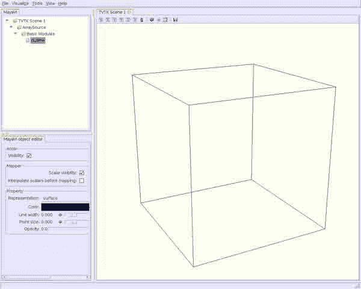

# 十九、其他例子

*   [使用 NumPy 数组的 C 扩展](C_Extensions_NumPy_arrays.html)
*   [嵌入特征图形用户界面](EmbeddingInTraitsGUI.html)
*   [Matplotlib:拖放文本示例](Matplotlib_Drag_n_Drop_Text_Example.html)
*   [Matplotlib: treemap](Matplotlib_TreeMap.html)
*   [Mayavi:安装 python 素材来源](MayaVi_InstallPythonStuffFromSource.html)
*   [玛雅维:示例](MayaVi_examples.html)
*   [用 Pyparsing 读取自定义文本文件](Reading_Custom_Text_Files_with_Pyparsing.html)
*   [编写 Mayavi 2 脚本:基本模块](MayaVi_ScriptingMayavi2_BasicModules.html)
*   [脚本 Mayavi 2:过滤器](MayaVi_ScriptingMayavi2_Filters.html)
*   [编写 Mayavi 2 脚本:主要模块](MayaVi_ScriptingMayavi2_MainModules.html)

# 使用数字数组的扩展

# 使用数字数组的扩展

我已经编写了几个处理 NumPy 数组的 C 扩展。它们很简单，但似乎很有效。他们将向您展示如何将 Python 变量和 NumPy 数组传递给您的 C 代码。一旦你学会了怎么做，那就相当简单了。我怀疑它们对于大多数数字代码来说已经足够了。我把它写成了草稿，并提供了代码和文档文件。我发现对于我的数字需求，我真的只需要传递一组有限的东西(整数、浮点、字符串和 NumPy 数组)。如果那是你的类别，这段代码可能会帮助你。

我已经测试了套路，到目前为止，还不错，但我不能保证什么。我对这个有点陌生。如果您发现任何错误，请在 SciPy 邮件列表中张贴消息。

下面给出了保存代码和文档的 tar 球的链接。

我最近更新了一些信息，包括了更多的例子。下面介绍的文件是仍然有用的原始文件。下面的链接包含最新的文档和源代码。

*   [`Cext_v2.tar.gz`](../_downloads/Cext_v2.tar.gz)

-露羊

## 对 NumPy 和 Python 的扩展

作者卢·佩科拉- 2006-12-07(草稿版本 0.1)

## 概观

### 简介–一点背景知识

在我使用 Python 的过程中，我遇到了一个典型的问题:我需要加速代码的特定部分。我不是 Python 大师或任何类型的编码/计算机大师。我使用 Python 进行数值计算，并大量使用 NumPy/NumPy。几乎每本 Python 书籍或教程都告诉你，当你需要一个例程来快速运行时，可以构建 Python 的 C 扩展。C 扩展是可以编译并链接到共享库的 C 代码，共享库可以像任何 Python 模块一样导入，您可以像调用 Python 函数一样调用指定的 C 例程。

听起来不错，但我有所保留。它看起来不平凡(在某种程度上的确如此)。于是我寻找其他的解决办法。我找到他们了。分别是 [SWIG](http://www.swig.org/) 、 [Pyrex](http://www.cosc.canterbury.ac.nz/greg.ewing/python/Pyrex/) 、 [ctypes](http://python.net/crew/theller/ctypes/) 、 [Psyco](http://psyco.sourceforge.net/) 、 [Weave](http://www.scipy.org/Weave) 等途径。当我尝试这些的时候，我经常得到一些简单的例子(然而不是全部)。但是当我试图将它们应用于 NumPy 时，我遇到了障碍。然后进入类型图或其他混合结构。我并不反对这些方法，但是尽管有许多在线教程和来自各种 Python 支持小组和电子邮件列表的有用建议，我永远也不会弄清楚它们并开始编写自己的代码。

所以我决定看看能不能自己写 C 扩展。康奈尔大学的汤姆·洛雷多以一些简单的 C 扩展例子的形式帮助我使用大约 2000 年编写的 Numeric。这些放在我的硬盘上，直到 5 年后出于绝望，我把它们拿出来，用他的例子，我能够很快组装几个 C 扩展(至少对我来说)，处理所有我想要加速的情况(到目前为止)。这些情况主要涉及传递 Python 整数、浮点(= C doubles)、字符串以及 NumPy 1D 和 2D 浮点和整数数组。我很少需要传递其他任何东西给 C 例程来做计算。如果你和我的情况一样，那么我放在一起的这个包可能会对你有帮助。一旦你开始行动，事情就会变得相当容易。

请注意，汤姆·洛雷多不对我的代码或指令中的任何错误负责，尽管我非常感激他。同样，该代码仅用于研究。只有我的开发和使用对它进行了测试。它没有保证，也没有保修。如果存在任何生命、肢体、财产、金钱或您或他人珍视的任何东西的损失威胁，请不要使用此代码。

我使用系统 OS X 10.4(基本的 BSD Unix)、Python 2.4、NumPy 0.9x 以及 gnu 编译器和链接器 gcc，在 Macintosh G4 笔记本电脑上开发了这些 C 扩展及其 Python 包装器。我想我在这里告诉你的大部分内容将很容易被翻译成 Linux 和其他 Unix 系统，而不仅仅是 Mac。我对 Windows 不太确定。我希望我的低级方法也能让 Windows 用户轻松一些。

扩展的代码(包括 C 和 Python)可能看起来很多，但是它非常重复。一旦你得到了一个扩展函数的主要方案，你会看到它在所有其他的扩展函数中一次又一次地重复，并有微小的变化来处理不同的参数或向调用例程返回不同的对象。不要被代码所迷惑。好消息是，对于许多数字用途，扩展将遵循相同的格式，因此您可以快速重用已经为新项目编写的内容。专注于一个扩展函数，并详细遵循它(事实上，我将在下面这样做)。一旦你理解了，其他的套路就几乎显而易见了。软件包附带的几个实用函数也是如此。它们帮助您创建、测试和操作数据，并且它们还有很多重复。实用函数也非常简短，所以没什么好担心的。

### NumPy 扩展的一般方案

这将在下面详细介绍，但首先我想让您了解每个扩展是如何组织的。

在 C 源文件中的 C 扩展函数之前必须做的三件事。

1.  您必须包含 Python 和 NumPy 头。
2.  每个扩展名必须在文件开头的定义结构中命名。这是一个用于从 Python 函数访问扩展的名称。
3.  接下来进行一组初始化调用来设置 Python 和 NumPy 调用和接口。它对于所有涉及 NumPy 和 Python 的扩展都是一样的，除非您添加扩展来访问 NumPy 数组之外的其他 Python 包或类。我不会在这里讨论这些(因为我不知道)。所以 init 调用可以复制到每个扩展文件中。

每个 C 扩展将具有以下形式。

*   论点永远都是一样的:(`PyObject *self`、`PyObject *args` ) -如果你不知道这些到底是什么，不用担心。它们是指向一般 Python 对象的指针，并且由您将从 NumPy 和 Python 本身使用的头文件自动提供。你只需要知道这些。
*   参数通过一个函数调用进行处理，该函数调用解析它们并将它们分配给 C 定义的对象。
*   接下来，解析的结果可能会被一个实用程序检查，该程序会进入表示对象的结构，并确保数据是正确的类型(float 或 int、1D 或 2D 数组等)。).虽然我包含了一些 C 级检查，但您会发现我认为它们在用于包装 C 扩展的 Python 函数中做得更好。它们在 Python 中也容易做得多。我的调用 Python 包装器中有大量的数据检查。通常这不会导致很大的开销，因为您不会在某个循环中调用这些扩展数十亿次，而是将它们用作 C 或 C++例程的入口，以进行长时间、复杂、重复的专门计算。
*   在一些可能的数据检查之后，在实用函数的帮助下，C 数据类型被初始化为指向 NumPy 数组的数据部分。
*   接下来提取维度信息，这样您就知道列数、行数、向量维度等。
*   现在，您可以使用 C 数组来操作 NumPy 数组中的数据。上述解析中的 C 数组和 C 数据指向原始的 Python/NumPy 数据，因此在扩展返回后返回 Python 时，您所做的更改会影响数组值。你可以把数组传递给其他做计算的 C 函数，等等。请记住，您正在对原始的 NumPy 矩阵和向量进行操作。
*   在计算之后，您必须释放在为 NumPy 数组构建 C 数据时分配的任何内存。这又是由实用程序函数完成的。仅当您分配内存来处理数组时(例如在矩阵例程中)，此步骤才是必需的，但是如果您没有分配内存(例如在向量例程中)，则此步骤不是必需的。
*   最后，通过返回 Python 值或 NumPy 数组，返回 Python 调用函数。我有两个例子的 C 扩展。

### Python 包装函数

最好通过调用 Python 函数来调用 C 扩展，然后 Python 函数调用扩展。这被称为 Python 包装函数。它让您的代码看起来更像 pythonic(例如，您可以很容易地使用关键字)，并且，正如我在上面指出的，允许您在将函数参数和数据转移到 C 扩展和其他 C 函数进行大型计算之前，很容易地检查它们是否正确。这似乎是一个不必要的额外步骤，但这是值得的。

## 《守则》

在本节中，我参考了源文件`C_arraytest.h`、`C_arraytest.c`、`C_arraytest.py`和`C_arraytest.mak`中的代码。您应该将这些文件放在手边(可能会打印出来)，这样您就可以按照下面的代码进行解释。

### C 代码——实用程序的一个详细例子

首先，我将使用来自 C *arraytest.h，C_arraytest.c 的代码示例，用于名为 matsq 的例程。该函数以(NumPy)矩阵 A _ A*、整数 *i* 、(Python)浮点数 *y* 为输入，输出一个返回(NumPy)矩阵 *B* ，每个矩阵的分量等于输入矩阵分量的平方乘以浮点数的整数倍。数学上:

`\(B_{ij} = i y (A_{ij})^2\)`

调用 matsq 例程的 Python 代码是`A=matsq(B,i,y)`。以下是一个地方的相关代码:

头文件:

```py
/* Header to test of C modules for arrays for Python: C_test.c */

/* ==== Prototypes =================================== */

// .... Python callable Vector functions ..................
static PyObject *vecfcn1(PyObject *self, PyObject *args);
static PyObject *vecsq(PyObject *self, PyObject *args);

/* .... C vector utility functions ..................*/
PyArrayObject *pyvector(PyObject *objin);
double *pyvector_to_Carrayptrs(PyArrayObject *arrayin);
int  not_doublevector(PyArrayObject *vec);

/* .... Python callable Matrix functions ..................*/
static PyObject *rowx2(PyObject *self, PyObject *args);
static PyObject *rowx2_v2(PyObject *self, PyObject *args);
static PyObject *matsq(PyObject *self, PyObject *args);
static PyObject *contigmat(PyObject *self, PyObject *args);

/* .... C matrix utility functions ..................*/
PyArrayObject *pymatrix(PyObject *objin);
double **pymatrix_to_Carrayptrs(PyArrayObject *arrayin);
double **ptrvector(long n);
void free_Carrayptrs(double **v);
int  not_doublematrix(PyArrayObject *mat);

/* .... Python callable integer 2D array functions ..................*/
static PyObject *intfcn1(PyObject *self, PyObject *args);

/* .... C 2D int array utility functions ..................*/
PyArrayObject *pyint2Darray(PyObject *objin);
int **pyint2Darray_to_Carrayptrs(PyArrayObject *arrayin);
int **ptrintvector(long n);
void free_Cint2Darrayptrs(int **v);
int  not_int2Darray(PyArrayObject *mat); 
```

源文件:

```py
/* A file to test imorting C modules for handling arrays to Python */

#include "Python.h"
#include "arrayobject.h"
#include "C_arraytest.h"
#include 

/* #### Globals #################################### */

/* ==== Set up the methods table ====================== */
static PyMethodDef _C_arraytestMethods[] = {
    {"vecfcn1", vecfcn1, METH_VARARGS},
    {"vecsq", vecsq, METH_VARARGS},
    {"rowx2", rowx2, METH_VARARGS},
    {"rowx2_v2", rowx2_v2, METH_VARARGS},
    {"matsq", matsq, METH_VARARGS},
    {"contigmat", contigmat, METH_VARARGS},
    {"intfcn1", intfcn1, METH_VARARGS},
    {NULL, NULL}     /* Sentinel - marks the end of this structure */
};

/* ==== Initialize the C_test functions ====================== */
// Module name must be _C_arraytest in compile and linked
void init_C_arraytest()  {
    (void) Py_InitModule("_C_arraytest", _C_arraytestMethods);
    import_array();  // Must be present for NumPy.  Called first after above line.
}

/* #### Vector Extensions ############################## */

/* ==== vector function - manipulate vector in place ======================
    Multiply the input by 2 x dfac and put in output
    Interface:  vecfcn1(vec1, vec2, str1, d1)
                vec1, vec2 are NumPy vectors,
                str1 is Python string, d1 is Python float (double)
                Returns integer 1 if successful                */
static PyObject *vecfcn1(PyObject *self, PyObject *args)
{
    PyArrayObject *vecin, *vecout;  // The python objects to be extracted from the args
    double *cin, *cout;             // The C vectors to be created to point to the
                                    //   python vectors, cin and cout point to the row
                                    //   of vecin and vecout, respectively
    int i,j,n;
    const char *str;
    double dfac;

    /* Parse tuples separately since args will differ between C fcns */
    if (!PyArg_ParseTuple(args, "O!O!sd", &PyArray_Type, &vecin,
        &PyArray_Type, &vecout, &str, &dfac))  return NULL;
    if (NULL == vecin)  return NULL;
    if (NULL == vecout)  return NULL;

    // Print out input string
    printf("Input string: %s\n", str);

    /* Check that objects are 'double' type and vectors
         Not needed if python wrapper function checks before call to this routine */
    if (not_doublevector(vecin)) return NULL;
    if (not_doublevector(vecout)) return NULL;

    /* Change contiguous arrays into C * arrays   */
    cin=pyvector_to_Carrayptrs(vecin);
    cout=pyvector_to_Carrayptrs(vecout);

    /* Get vector dimension. */
    n=vecin->dimensions[0];

    /* Operate on the vectors  */
    for ( i=0; i<n; i++)="" {="" cout[i]="2.0*dfac*cin[i];" }="" return="" py_buildvalue("i",="" 1);="" *="===" square="" vector="" components="" &="" multiply="" by="" a="" float="========================" returns="" new="" numpy="" array="" interface:="" vecsq(vec1,="" x1)="" vec1="" is="" vector,="" x1="" python="" (double)="" static="" pyobject="" *vecsq(pyobject="" *self,="" *args)="" pyarrayobject="" *vecin,="" *vecout;="" double="" *cin,="" *cout,="" dfactor;="" the="" c="" vectors="" to="" be="" created="" point="" vectors,="" cin="" and="" cout="" row="" of="" vecin="" vecout,="" respectively="" int="" i,j,n,m,="" dims[2];="" parse="" tuples="" separately="" since="" args="" will="" differ="" between="" fcns="" if="" (!pyarg_parsetuple(args,="" "o!d",="" &pyarray_type,="" &vecin,="" &dfactor))="" null;="" (null="=" vecin)="" check="" that="" object="" input="" 'double'="" type="" not="" needed="" wrapper="" function="" checks="" before="" call="" this="" routine="" (not_doublevector(vecin))="" get="" dimension="" n="dims[0]=vecin-">dimensions[0];

    /* Make a new double vector of same dimension */
    vecout=(PyArrayObject *) PyArray_FromDims(1,dims,NPY_DOUBLE);

    /* Change contiguous arrays into C *arrays   */
    cin=pyvector_to_Carrayptrs(vecin);
    cout=pyvector_to_Carrayptrs(vecout);

    /* Do the calculation. */
    for ( i=0; i<n; i++)="" {="" cout[i]="dfactor*cin[i]*cin[i];" }="" return="" pyarray_return(vecout);="" *="" ####="" vector="" utility="" functions="" #########################="" make="" a="" python="" array="" obj.="" from="" pyobject,="===============" generates="" double="" w="" contiguous="" memory="" which="" may="" be="" new="" allocation="" if="" the="" original="" was="" not="" type="" or="" !!="" must="" decref="" object="" returned="" this="" routine="" unless="" it="" is="" to="" caller="" of="" routines="" using="" pyarray_return(obj)="" pyarray_buildvalue="" with="" "n"="" construct="" !!!="" pyarrayobject="" *pyvector(pyobject="" *objin)="" (pyarrayobject="" *)="" pyarray_contiguousfromobject(objin,="" npy_double,="" 1,1);="" create="" 1d="" carray="" pyarray="=====================" assumes="" in="" memory.="" *pyvector_to_carrayptrs(pyarrayobject="" *arrayin)="" int="" i,n;="" n="arrayin-">dimensions[0];
    return (double *) arrayin->data;  /* pointer to arrayin data as double */
}
/* ==== Check that PyArrayObject is a double (Float) type and a vector ==============
    return 1 if an error and raise exception */
int  not_doublevector(PyArrayObject *vec)  {
    if (vec->descr->type_num != NPY_DOUBLE || vec->nd != 1)  {
        PyErr_SetString(PyExc_ValueError,
            "In not_doublevector: array must be of type Float and 1 dimensional (n).");
        return 1;  }
    return 0;
}

/* #### Matrix Extensions ############################## */

/* ==== Row x 2 function - manipulate matrix in place ======================
    Multiply the 2nd row of the input by 2 and put in output
    interface:  rowx2(mat1, mat2)
                mat1 and mat2 are NumPy matrices
                Returns integer 1 if successful                        */
static PyObject *rowx2(PyObject *self, PyObject *args)
{
    PyArrayObject *matin, *matout;  // The python objects to be extracted from the args
    double **cin, **cout;           // The C matrices to be created to point to the
                                    //   python matrices, cin and cout point to the rows
                                    //   of matin and matout, respectively
    int i,j,n,m;

    /* Parse tuples separately since args will differ between C fcns */
    if (!PyArg_ParseTuple(args, "O!O!", &PyArray_Type, &matin,
        &PyArray_Type, &matout))  return NULL;
    if (NULL == matin)  return NULL;
    if (NULL == matout)  return NULL;

    /* Check that objects are 'double' type and matrices
         Not needed if python wrapper function checks before call to this routine */
    if (not_doublematrix(matin)) return NULL;
    if (not_doublematrix(matout)) return NULL;

    /* Change contiguous arrays into C ** arrays (Memory is Allocated!) */
    cin=pymatrix_to_Carrayptrs(matin);
    cout=pymatrix_to_Carrayptrs(matout);

    /* Get matrix dimensions. */
    n=matin->dimensions[0];
    m=matin->dimensions[1];

    /* Operate on the matrices  */
    for ( i=0; i<n; 1="" 2="" i++)="" {="" for="" (="" j="0;" j<m;="" j++)="" if="" (i="=1)" cout[i][j]="2.0*cin[i][j];" }="" *="" free="" memory,="" close="" file="" and="" return="" free_carrayptrs(cin);="" free_carrayptrs(cout);="" py_buildvalue("i",="" 1);="" row="" x="" function-="" version="" 2.="" -="" manipulate="" matrix="" in="" place="=====================" multiply="" the="" 2nd="" of="" input="" by="" put="" output="" interface:="" rowx2(mat1,="" mat2)="" mat1="" mat2="" are="" numpy="" matrices="" returns="" integer="" successful="" uses="" utility="" function="" pymatrix="" to="" make="" c="" objects="" from="" pyobjects="" static="" pyobject="" *rowx2_v2(pyobject="" *self,="" *args)="" *pymatin,="" *pymatout;="" python="" be="" extracted="" args="" pyarrayobject="" *matin,="" *matout;="" array="" double="" **cin,="" **cout;="" created="" point="" matrices,="" cin="" cout="" rows="" matin="" matout,="" respectively="" int="" i,j,n,m;="" parse="" tuples="" separately="" since="" will="" differ="" between="" fcns="" (!pyarg_parsetuple(args,="" "oo",="" &pymatin,="" &pymatout))="" null;="" (null="=" pymatin)="" pymatout)="" convert="" matout="pymatrix(Pymatout);" check="" that="" 'double'="" type="" not="" needed="" wrapper="" checks="" before="" call="" this="" routine="" (not_doublematrix(matin))="" (not_doublematrix(matout))="" change="" contiguous="" arrays="" into="" **="" (memory="" is="" allocated!)="" get="" dimensions.="" n="matin-">dimensions[0];
    m=matin->dimensions[1];

    /* Operate on the matrices  */
    for ( i=0; i<n; i++)="" {="" for="" (="" j="0;" j<m;="" j++)="" if="" (i="=1)" cout[i][j]="2.0*cin[i][j];" }="" *="" free="" memory,="" close="" file="" and="" return="" free_carrayptrs(cin);="" free_carrayptrs(cout);="" py_buildvalue("i",="" 1);="" square="" matrix="" components="" function="" &="" multiply="" by="" int="" float="========" returns="" a="" new="" numpy="" array="" interface:="" matsq(mat1,="" i1,="" d1)="" mat1="" is="" matrix,="" i1="" python="" integer,="" d1="" (double)="" static="" pyobject="" *matsq(pyobject="" *self,="" *args)="" pyarrayobject="" *matin,="" *matout;="" double="" **cin,="" **cout,="" dfactor;="" i,j,n,m,="" dims[2],="" ifactor;="" parse="" tuples="" separately="" since="" args="" will="" differ="" between="" c="" fcns="" (!pyarg_parsetuple(args,="" "o!id",="" &pyarray_type,="" &matin,="" &ifactor,="" &dfactor))="" null;="" (null="=" matin)="" check="" that="" object="" input="" 'double'="" type="" not="" needed="" wrapper="" checks="" before="" call="" to="" this="" routine="" (not_doublematrix(matin))="" get="" the="" dimensions="" of="" n="dims[0]=matin-">dimensions[0];
    m=dims[1]=matin->dimensions[1];

    /* Make a new double matrix of same dims */
    matout=(PyArrayObject *) PyArray_FromDims(2,dims,NPY_DOUBLE);

    /* Change contiguous arrays into C ** arrays (Memory is Allocated!) */
    cin=pymatrix_to_Carrayptrs(matin);
    cout=pymatrix_to_Carrayptrs(matout);

    /* Do the calculation. */
    for ( i=0; i<n; i++)="" {="" for="" (="" j="0;" j<m;="" j++)="" cout[i][j]="ifactor*dfactor*cin[i][j]*cin[i][j];" }="" *="" free="" memory,="" close="" file="" and="" return="" free_carrayptrs(cin);="" free_carrayptrs(cout);="" pyarray_return(matout);="" operate="" on="" matrix="" components="" as="" contiguous="" memory="========================" shows="" how="" to="" access="" the="" array="" data="" a="" block="" of="" memory.="" used,="" example,="" in="" classes="" implemented="" contiquous="" rather="" than="" n="" arrays="" pointers="" "rows"="" returns="" new="" numpy="" interface:="" contigmat(mat1,="" x1)="" mat1="" is="" matrix,="" x1="" python="" float="" (double)="" static="" pyobject="" *contigmat(pyobject="" *self,="" *args)="" pyarrayobject="" *matin,="" *matout;="" double="" *cin,="" *cout,="" x1;="" matrices="" be="" used="" by="" c="" (e.g.="" passed="" program="" that="" uses="" int="" i,j,n,m,="" dims[2],="" ncomps;="" ncomps="n*m=total" number="" parse="" tuples="" separately="" since="" args="" will="" differ="" between="" fcns="" if="" (!pyarg_parsetuple(args,="" "o!d",="" &pyarray_type,="" &matin,="" &x1))="" null;="" (null="=" matin)="" check="" object="" input="" 'double'="" type="" not="" needed="" wrapper="" function="" checks="" before="" call="" this="" routine="" (not_doublematrix(matin))="" get="" dimensions="">dimensions[0];
    m=dims[1]=matin->dimensions[1];
    ncomps=n*m;

    /* Make a new double matrix of same dims */
    matout=(PyArrayObject *) PyArray_FromDims(2,dims,NPY_DOUBLE);

    /* Change contiguous arrays into C * arrays pointers to PyArrayObject data */
    cin=pyvector_to_Carrayptrs(matin);
    cout=pyvector_to_Carrayptrs(matout);

    /* Do the calculation. */
    printf("In contigmat, cout (as contiguous memory) =\n");
    for ( i=0; i<ncomps; i++)="" {="" cout[i]="cin[i]-x1;" printf("%e="" ",cout[i]);="" }="" printf("\n");="" return="" pyarray_return(matout);="" *="" ####="" matrix="" utility="" functions="" #########################="" make="" a="" python="" array="" obj.="" from="" pyobject,="===============" generates="" double="" w="" contiguous="" memory="" which="" may="" be="" new="" allocation="" if="" the="" original="" was="" not="" type="" or="" !!="" must="" decref="" object="" returned="" this="" routine="" unless="" it="" is="" to="" caller="" of="" routines="" using="" pyarray_return(obj)="" pyarray_buildvalue="" with="" "n"="" construct="" !!!="" pyarrayobject="" *pymatrix(pyobject="" *objin)="" (pyarrayobject="" *)="" pyarray_contiguousfromobject(objin,="" npy_double,="" 2,2);="" create="" carray="" pyarray="=====================" assumes="" in="" memory.="" allocated!="" **pymatrix_to_carrayptrs(pyarrayobject="" *arrayin)="" **c,="" *a;="" int="" i,n,m;="" n="arrayin-">dimensions[0];
    m=arrayin->dimensions[1];
    c=ptrvector(n);
    a=(double *) arrayin->data;  /* pointer to arrayin data as double */
    for ( i=0; i<n; 1="" i++)="" {="" c[i]="a+i*m;" }="" return="" c;="" *="===" allocate="" a="" double="" *vector="" (vec="" of="" pointers)="=====================" memory="" is="" allocated!="" see="" void="" free_carray(double="" **="" )="" **ptrvector(long="" n)="" **v;="" v="(double" **)malloc((size_t)="" (n*sizeof(double)));="" if="" (!v)="" printf("in="" **ptrvector.="" allocation="" for="" array="" failed.");="" exit(0);="" v;="" free="" free_carrayptrs(double="" **v)="" free((char*)="" v);="" check="" that="" pyarrayobject="" (float)="" type="" and="" matrix="=============" an="" error="" raise="" exception="" int="" not_doublematrix(pyarrayobject="" *mat)="" (mat-="">descr->type_num != NPY_DOUBLE || mat->nd != 2)  {
        PyErr_SetString(PyExc_ValueError,
            "In not_doublematrix: array must be of type Float and 2 dimensional (n x m).");
        return 1;  }
    return 0;
}

/* #### Integer 2D Array Extensions ############################## */

/* ==== Integer function - manipulate integer 2D array in place ======================
    Replace >=0 integer with 1 and < 0 integer with 0 and put in output
    interface:  intfcn1(int1, afloat)
                int1 is a NumPy integer 2D array, afloat is a Python float
                Returns integer 1 if successful                        */
static PyObject *intfcn1(PyObject *self, PyObject *args)
{
    PyArrayObject *intin, *intout;  // The python objects to be extracted from the args
    int **cin, **cout;              // The C integer 2D arrays to be created to point to the
                                    //   python integer 2D arrays, cin and cout point to the rows
                                    //   of intin and intout, respectively
    int i,j,n,m, dims[2];
    double afloat;

    /* Parse tuples separately since args will differ between C fcns */
    if (!PyArg_ParseTuple(args, "O!d",
        &PyArray_Type, &intin, &afloat))  return NULL;
    if (NULL == intin)  return NULL;

    printf("In intfcn1, the input Python float = %e, a C double\n",afloat);

    /* Check that object input is int type and a 2D array
       Not needed if python wrapper function checks before call to this routine */
    if (not_int2Darray(intin)) return NULL;

    /* Get the dimensions of the input */
    n=dims[0]=intin->dimensions[0];
    m=dims[1]=intin->dimensions[1];

    /* Make a new int array of same dims */
    intout=(PyArrayObject *) PyArray_FromDims(2,dims,NPY_LONG);

    /* Change contiguous arrays into C ** arrays (Memory is Allocated!) */
    cin=pyint2Darray_to_Carrayptrs(intin);
    cout=pyint2Darray_to_Carrayptrs(intout);

    /* Do the calculation. */
    for ( i=0; i<n; i++)="" {="" for="" (="" j="0;" j<m;="" j++)="" if="" (cin[i][j]="">= 0)  {
                cout[i][j]= 1;  }
            else  {
                cout[i][j]= 0;  }
    }  }

    printf("In intfcn1, the output array is,\n\n");

    for ( i=0; i<n; i++)="" {="" for="" (="" j="0;" j<m;="" j++)="" printf("%d="" ",cout[i][j]);="" }="" printf("\n");="" *="" free="" memory,="" close="" file="" and="" return="" free_cint2darrayptrs(cin);="" free_cint2darrayptrs(cout);="" pyarray_return(intout);="" ####="" integer="" array="" utility="" functions="" #########################="" make="" a="" python="" int="" obj.="" from="" pyobject,="===============" generates="" 2d="" w="" contiguous="" memory="" which="" may="" be="" new="" allocation="" if="" the="" original="" was="" not="" an="" type="" or="" !!="" must="" decref="" object="" returned="" this="" routine="" unless="" it="" is="" to="" caller="" of="" routines="" using="" pyarray_return(obj)="" pyarray_buildvalue="" with="" "n"="" construct="" !!!="" pyarrayobject="" *pyint2darray(pyobject="" *objin)="" (pyarrayobject="" *)="" pyarray_contiguousfromobject(objin,="" npy_long,="" 2,2);="" create="" carray="" pyarray="=====================" assumes="" in="" memory.="" allocated!="" **pyint2darray_to_carrayptrs(pyarrayobject="" *arrayin)="" **c,="" *a;="" i,n,m;="" n="arrayin-">dimensions[0];
    m=arrayin->dimensions[1];
    c=ptrintvector(n);
    a=(int *) arrayin->data;  /* pointer to arrayin data as int */
    for ( i=0; i<n; 1="" i++)="" {="" c[i]="a+i*m;" }="" return="" c;="" *="===" allocate="" a="" *int="" (vec="" of="" pointers)="=====================" memory="" is="" allocated!="" see="" void="" free_carray(int="" **="" )="" int="" **ptrintvector(long="" n)="" **v;="" v="(int" **)malloc((size_t)="" (n*sizeof(int)));="" if="" (!v)="" printf("in="" **ptrintvector.="" allocation="" for="" array="" failed.");="" exit(0);="" v;="" free="" an="" *vector="" free_cint2darrayptrs(int="" **v)="" free((char*)="" v);="" check="" that="" pyarrayobject="" (integer)="" type="" and="" 2d="" error="" raise="" exception="" note:="" use="" ny_long="" numpy="" integer="" array,="" not="" np_int="" not_int2darray(pyarrayobject="" *mat)="" (mat-="">descr->type_num != NPY_LONG || mat->nd != 2)  {
        PyErr_SetString(PyExc_ValueError,
            "In not_int2Darray: array must be of type int and 2 dimensional (n x m).");
        return 1;  }
    return 0;
}

// EOF</n;> </n;></n;></n;></ncomps;></n;></n;></n;></n;></n;> 
```

现在，让我们看一下小块的源代码。

#### 头球

您必须在 Python 中包含以下标题。h **总是包含第一个标题。**

```py
#include "Python.h"
#include "arrayobject.h" 
```

我还包括标题 C_arraytest.h，它包含 matsq 函数的原型:

```py
static PyObject *matsq(PyObject *self, PyObject *args); 
```

函数声明前面的 static 关键字使这个函数成为扩展模块的私有函数。链接器就是看不到它。这样，您可以对所有扩展模块使用相同的直觉函数名(即 sum、check、trace)，而不会在链接时发生名称冲突。该函数的类型是`PyObject *`，因为它将总是返回一个 Python 调用函数，所以您可以(实际上必须)返回一个 Python 对象。争论总是一样的，

```py
PyObject *self and PyObject *args 
```

第一个自我从未被使用过，但由于 Python 传递参数的方式，它是必要的。第二个参数是指向 Python 元组的指针，该元组包含函数的所有参数(B，I，x)。

#### 方法定义

这将建立一个函数名表，作为 Python 代码到 C 扩展的接口。C 扩展模块的名称将为`_C_arraytest`(注意前导下划线)。每次使用名称时都要正确，这很重要，因为在代码中使用模块名称有严格的要求。该名称首先出现在方法定义表中，作为表名的第一部分:

```py
static PyMethodDef _C_arraytestMethods[] = {
  ...,
  {"matsq", matsq, METH_VARARGS},
  ...,
  {NULL, NULL}     /* Sentinel - marks the end of this structure */
}; 
```

我用省略号(...)忽略与此函数无关的其他代码。`METH_VARARGS`参数告诉编译器，您将以通常的方式传递参数，而不使用关键字，如上面的示例`A=matsq(B,i,x)`所示。Python 关键词有很多使用方法，但是我没有尝试过。表应该总是以{NULL，NULL}结尾，这只是一个“标记”，用来标记表的结尾。

#### 初始化

这些函数告诉 Python 解释器在加载模块时调用什么。请注意，在初始化结构的名称中，模块的名称(`_C_arraytest`)必须直接位于 init 之后。

```py
void init_C_arraytest() {
  (void) Py_InitModule("_C_arraytest", _C_arraytestMethods);
  import_array(); // Must be present for NumPy. Called first after above line.
} 
```

顺序很重要，必须先调用这两个初始化函数。

#### matsqfunction 代码

下面是您将从 Python 代码中调用的实际函数。我将把它分开，并解释每个部分。

函数名称和类型:

```py
static PyObject *matsq(PyObject *self, PyObject *args) 
```

你可以看到它们与 C_arraytest.h 中的原型相匹配

局部变量:

```py
PyArrayObject *matin, *matout;
double **cin, **cout, dfactor;
int i,j,n,m, dims[2], ifactor; 
```

`PyArrayObjects`是 NumPy 头文件中定义的结构，它们将被分配指向实际输入和输出 NumPy 数组(A 和 B)的指针。C 数组`cin`和`cout`是指针，它们将(最终)指向 NumPy 数组中的实际数据，并允许您对其进行操作。变量`dfactor`将是 Python 浮点 y，`ifactor`将是 Python int i，变量 I，j，n 和 m 将是 A 和 b 中的循环变量(I 和 j)和矩阵维数(n=行数，m=列数)。数组 dims 将用于从 NumPy 数组访问 n 和 m。这一切都发生在下面。首先，我们必须从参数元组中提取输入变量(A，I，y)。这是通过调用完成的，

```py
/* Parse tuples separately since args will differ between C fcns */
if (!PyArg_ParseTuple(args, "O!id",
    &PyArray_Type, &matin, &ifactor, &dfactor)) return NULL; 
```

`PyArg_ParseTuple`函数接受参数元组，并使用下一个出现的格式字符串(“O！id”)，它将元组的每个成员分配给一个 C 变量。注意你必须通过引用传递所有的 C 变量。即使 C 变量是一个指向字符串的指针，也是如此(参见 vecfcn1 例程中的代码)。格式字符串告诉解析函数使用什么类型的变量。Python 的公共变量都有字母名称(例如，s 代表字符串，I 代表整数，d 代表(Python 浮点数的两倍))。你可以在圭多的教程([http://docs.python.org/ext/ext.html](http://docs.python.org/ext/ext.html))中找到这些以及更多的列表。对于不在标准 Python 中的数据类型，比如 NumPy 数组，您可以使用 O！告诉解析器寻找类型结构(在这种情况下是 NumPy 结构`PyArray_Type`)的符号，以帮助它转换将被分配给指向 NumPy 数组结构的局部变量(matin)的元组成员。注意这些也是通过引用传递的。顺序必须保持，并与您想要的 Python 函数的调用接口相匹配。格式字符串定义了接口，如果您没有从 Python 中调用函数，因此参数的数量与格式字符串中的数量相匹配，您将会得到一个错误。这很好，因为它将指出问题所在。

如果这不起作用，我们返回空值，这将导致 Python 异常。

```py
if (NULL == matin) return NULL; 
```

接下来我们检查输入矩阵是否真的是 NumPy 类型的双精度矩阵。这个测试也是在这个 C 扩展的 Python 包装器中完成的。最好在那里做，但是我在这里包含测试，向您展示您可以在 C 扩展中做测试，并且您可以“接触”NumPy 结构来挑选它的参数。效用函数`not_doublematrix`将在后面解释。

```py
/* Check that object input is 'double' type and a matrix
   Not needed if python wrapper function checks before call to this routine */
if (not_doublematrix(matin)) return NULL; 
```

这里有一个例子，涉及到 NumPy 结构，以获得矩阵 matin 的维度，并将其分配给如上所述的局部变量。

```py
/* Get the dimensions of the input */
n=dims[0]=matin->dimensions[0];
m=dims[1]=matin->dimensions[1]; 
```

现在我们使用这些矩阵参数在我们的 C 扩展中生成一个新的 NumPy 矩阵 matout(我们的输出)。PyArray_FromDims(2，Dims，NPY_DOUBLE)是一个由 NumPy(不是我)提供的实用函数，它的参数告诉 NumPy NumPy 对象的秩(2)、每个维度的大小(dims)和数据类型(NPY_DOUBLE)。创建不同 NumPy 数组的其他例子在其他 C 扩展中。

```py
/* Make a new double matrix of same dims */
matout=(PyArrayObject *) PyArray_FromDims(2,dims,NPY_DOUBLE); 
```

为了实际进行计算，我们需要 C 结构来处理数据，因此我们生成了两个 C 2 维数组(cin 和 cout)，它们将分别指向 matin 和 matout 中的数据。注意，这里分配了内存，因为我们需要创建一个指向 C doubles 的指针数组，这样我们就可以像通常的 C 矩阵一样用两个索引来处理 cin 和 cout。这个内存必须在这个 C 扩展结束时释放。像这样的内存分配并不总是必要的。请参阅 C 扩展(例程 contigmat)中的 NumPy 向量操作和将 NumPy 矩阵视为连续数组(因为它们在 NumPy 中)的例程。

```py
/* Change contiguous arrays into C ** arrays (Memory is Allocated!) */
cin=pymatrix_to_Carrayptrs(matin);
cout=pymatrix_to_Carrayptrs(matout); 
```

最后，我们可以操作矩阵并进行计算。这里是进行原始方程运算`\(B_{ij}= i y (A_{ij})^2\)`的部分。注意，我们直接操作传递给这个扩展的原始 NumPy 数组 A 和 B 中的数据。因此，您在这里对 cin 或 cout 的组件所做的任何操作都将对原始矩阵进行，并且当您返回 Python 代码时，这些操作将出现在那里。

```py
/* Do the calculation. */
for ( i=0; i<n; i++) {
   for ( j=0; j<m; j++) {
      cout[i][j]= ifactor*dfactor*cin[i][j]*cin[i][j];
   }
} 
```

我们准备回到 Python 调用例程，但是首先我们释放分配给 cin 和 cout 的内存。

```py
/* Free memory, close file and return */
free_Carrayptrs(cin);
free_Carrayptrs(cout); 
```

现在我们返回计算结果。

```py
return PyArray_Return(matout); 
```

如果您查看其他 C 扩展，您可以看到您也可以使用另一个 Python 提供的函数`Py_BuildValue("i", 1)`返回常规 Python 变量(如 ints)，其中字符串“I”告诉函数数据类型，第二个参数(此处为 1)是要返回的数据值。如果您决定不返回任何内容，您必须像这样返回 Python 关键字 None:

```py
Py_INCREF(Py_None);
return Py_None; 
```

Py _ INCREF 函数增加了对 None 的引用数量(请记住，当不再有对数据的引用时，Python 会自动收集分配的内存)。在 C 扩展中，您必须小心这一点。更多信息见[圭多教程](http://docs.python.org/ext/ext.html)。

#### 实用功能

下面是一些矩阵实用函数的快速描述。它们几乎是不言自明的。向量和整数数组实用函数非常相似。

第一个实用函数没有在这里的任何 C 扩展中使用，但是我包含了它，因为一个有用的人把它和一些代码一起发送了，它确实展示了如何将 python 对象转换成 NumPy 数组。我没试过。使用自担风险。

```py
PyArrayObject *pymatrix(PyObject *objin) {
   return (PyArrayObject *) PyArray_ContiguousFromObject(objin,
      NPY_DOUBLE, 2,2);
} 
```

下一个创建 C 数组，用于指向 NumPy 矩阵的行。这将分配指向 NumPy 数据的指针数组。NumPy 数据是连续的，步长(m)用于访问每行。这个函数调用 ptserver ctor(n)，它进行实际的内存分配。使用这个后记得释放内存。

```py
double **pymatrix_to_Carrayptrs(PyArrayObject *arrayin) {
   double **c, *a;
   int i,n,m;

   n=arrayin->dimensions[0];
   m=arrayin->dimensions[1];
   c=ptrvector(n);
   a=(double *) arrayin->data; /* pointer to arrayin data as double */
   for ( i=0; i<n; i++) {
      c[i]=a+i*m;
   }
   return c;
} 
```

这里是指针 C 数组的内存分配位置。这是一个非常标准的数组内存分配器。

```py
double **ptrvector(long n) {
   double **v;
   v=(double **)malloc((size_t) (n*sizeof(double)));
   if (!v)   {
      printf("In **ptrvector. Allocation of memory for double array failed.");
      exit(0);
   }
   return v;
} 
```

这是释放内存的例程。

```py
 void free_Carrayptrs(double **v) {
   free((char*) v);
} 
```

**注**:有一个标准的 C-API，用来从 Python 对象转换成 C 风格的指针数组，叫做 PyArray _ AsCArray

这里有一个实用函数，它检查以确保解析产生的对象是一个 NumPy 矩阵。你可以看到它是如何进入 NumPy 对象结构的。

```py
int not_doublematrix(PyArrayObject *mat) {
   if (mat->descr->type_num != NPY_DOUBLE || mat->nd != 2) {
      PyErr_SetString(PyExc_ValueError,
         "In not_doublematrix: array must be of type Float and 2 dimensional (n x m).");
      return 1; }
   return 0;
} 
```

### 《民法典》——其他变体

正如我在介绍中提到的，这些函数是重复的。所有其他函数遵循非常相似的模式。它们在方法结构中有一行，它们有相同的参数，它们解析参数，它们可能在解析后检查 C 结构，它们设置 C 变量来操作哪个指向输入数据，它们进行实际计算，它们释放内存(如果需要)，它们为 Python 返回一些东西(要么无，要么 Python 对象)。我将只提到上面矩阵 C 扩展 matsq 的代码中的一些差异。

vecfc 1:

解析函数的格式字符串指定 Python 中的变量是字符串。

```py
if (!PyArg_ParseTuple(args, "O!O!sd", &PyArray_Type, &vecin,
      &PyArray_Type, &vecout, &str, &dfac)) return NULL; 
```

在局部 C 数组的指针赋值中没有分配内存，因为它们已经是向量了。

```py
cin=pyvector_to_Carrayptrs(vecin);
cout=pyvector_to_Carrayptrs(vecout); 
```

如果成功，则返回 int = 1。这是作为 Python int 返回的。

```py
return Py_BuildValue("i", 1); 
```

**行 x2：**

在这个例程中，我们通过参数元组列表中的引用传递输出，并通过操作在适当的位置进行更改，从而“传回”输出。将此与从 matsq 中的 C 扩展返回数组进行比较。任何一方都能完成任务。

**和你在一起 mat:**

在这里，矩阵数据被视为一个长向量(就像首尾相连地堆叠行一样)。如果 C++中有数组类，将数据存储为一个长向量，然后像数组一样使用跨步来访问它(二维、三维或其他)，这将非常有用。即使 matin 和 matout 是“矩阵”，我们也像对待向量一样对待它们，并使用向量工具来获得我们的 C 指针 cin 和 cout。

```py
/* Change contiguous arrays into C * arrays pointers to PyArrayObject data */
cin=pyvector_to_Carrayptrs(matin);
cout=pyvector_to_Carrayptrs(matout); 
```

对于其他实用函数，请注意，我们使用不同的等级、维度和 NumPy 参数(例如`NPY_LONG`)来告诉我们正在调用的例程数据类型是什么。

### 制作文件

制作文件非常简单。它是为 Mac OS X 10.4 编写的，称为 BSD Unix。

```py
# ---- Link ---------------------------
_C_arraytest.so: C_arraytest.o C_arraytest.mak      gcc -bundle -flat_namespace -undefined suppress -o _C_arraytest.so C_arraytest.o

# ---- gcc C compile ------------------
C_arraytest.o: C_arraytest.c C_arraytest.h C_arraytest.mak      gcc -c C_arraytest.c

-I/Library/Frameworks/Python.framework/Versions/2.4/include/python2.4
-I/Library/Frameworks/Python.framework/Versions/2.4/lib/python2.4/site-packages/numpy/core/include/numpy/ 
```

编译步骤非常标准。您确实需要添加 Python 头的路径:

`-I/Library/Frameworks/Python.framework/Versions/2.4/include/python2.4`

和 NumPy 头的路径:

`-I/Library/Frameworks/Python.framework/Versions/2.4/lib/python2.4/site-packages/numpy/core/include/numpy/`

这些路径用于在苹果操作系统上安装框架 Python 2.4。您需要提供安装在计算机上的标题路径。他们可能不一样。我的猜测是 gcc 标志对于编译将是相同的。

链接步骤产生实际的模块(`_C_arraytest.so`)，可以导入 Python 代码。这是 Mac OS X 系统特有的。在 Linux 或 Windows 上，您将需要一些不同的东西。我一直在寻找一般性的例子，但我不确定我的发现对大多数人是否有用，所以我选择不在那里显示这些发现。我无法判断代码是否适合那些系统。

请注意，生成的共享库的名称''' '必须' ' '与 C 扩展源代码中的初始化和方法定义调用中的名称相匹配。因此名字中的前导下划线`_C_arraytest.so`。

这是我修改过的 Makefile，它在 Linux 下编译这段代码(把它作为 Makefile 保存在同一个目录下，然后运行‘make’

保罗·伊万诺夫

```py
# ---- Link ---------------------------
_C_arraytest.so:  C_arraytest.o
        gcc -shared C_arraytest.o -o _C_arraytest.so

# ---- gcc C compile ------------------
C_arraytest.o:  C_arraytest.c C_arraytest.h
        gcc  -c C_arraytest.c -I/usr/include/python2.4 -I/usr/lib/python2.4/site-packages/numpy/core/include/numpy 
```

### Python 包装代码

这里就像在 C 代码中一样，我将只显示一个包装函数及其使用的详细描述。重复太多了，如果你理解一个，其他包装器就会很清楚。我将再次使用 matsq 函数。这是在导入包装器模块(`C_arraytest.py`)后，当您在自己的 Python 代码中调用 matsq 函数时将首先调用的代码，该包装器模块会自动导入并使用`_C_arraytest.so`中的实际 C 扩展(以对用户隐藏的方式)(注意将名称分开的前导下划线)。

**进口:**

导入 C 扩展、NumPy 和系统模块(用于结尾的 exit 语句，这是可选的)。

```py
import _C_arraytest
import numpy as NP
import sys 
```

**Python matsq 函数的定义**

传递一个 NumPy 矩阵(matin)、一个 Python int (ifac)和一个 Python float (dfac)。检查参数，确保它们是正确的类型、尺寸和大小。这在 Python 方面更加容易和安全，这就是为什么我在这里这样做，尽管我在 C 扩展中展示了一种方法来做到这一点。

```py
def matsq(matin, ifac, dfac):
    # .... Check arguments, double NumPy matrices?
    test=NP.zeros((2,2)) # create a NumPy matrix as a test object to check matin
    typetest= type(test) # get its type
    datatest=test.dtype   # get data type
    if type(matin) != typetest:
        raise 'In matsq, matrix argument is not *NumPy* array'
    if len(NP.shape(matin)) != 2:
        raise 'In matsq, matrix argument is not NumPy *matrix*'
    if matin.dtype != datatest:
        raise 'In matsq, matrix argument is not *Float* NumPy matrix'
    if type(ifac) != type(1):
        raise 'In matsq, ifac argument is not an int'
    if type(dfac) != type(1.0):
        raise 'In matsq, dfac argument is not a python float' 
```

最后，调用 C 扩展在 matin 上进行实际计算。

```py
# .... Call C extension function
return _C_arraytest.matsq(matin, ifac, dfac) 
```

你可以看到 python 部分是最简单的。

**使用你的 C 分机**

如果测试函数`mattest2`在另一个模块中(您正在编写的模块)，下面是如何在脚本中使用它来调用包装的 matsq 函数。

```py
from C_arraytest import * # Note, NO underscore since you are importing the wrapper.

import numpy as NP
import sys

def mattest2():
    print "\n--- Test matsq ------------------------------"
    print " Each 2nd matrix component should = square of 1st matrix component x ifac x dfac \n"
    n=4 # Number of columns      # Make 2 x n matrices
    z=NP.arange(float(n))
    x=NP.array([z,3.0*z])
    jfac=2
    xfac=1.5
    y=matsq(x, jfac, xfac)
    print "x=",x
    print "y=",y

if __name__ == '__main__':
    mattest2() 
```

输出如下所示:

```py
--- Test matsq ------------------------------
Each 2nd matrix component should = square of 1st matrix component x ifac x dfac

x= [[ 0\. 1\. 2\. 3.]
 [ 0\. 3\. 6\. 9.]]
y= [[   0\.    3\.   12\.   27.]
 [   0\.   27\. 108\. 243.]] 
```

所有测试功能的输出都在文件`C_arraytest`输出中。

## 摘要

这是解释我写的 C 扩展的初稿(有帮助)。如果你对代码、错误等有意见。请将它们发布在 pythonmac 电子邮件列表中。我会看到他们的。

我编写了 C 扩展来使用 NumPy，尽管它们最初是为 Numeric 编写的。如果你必须使用数字，你应该测试它们是否兼容。我怀疑像`NPY_DOUBLE`这样的名字，比如不会是。我强烈建议你升级到 NumPy，因为它是 Python 中数值的未来。值得付出努力。

## 评论

请注意，这一行虽然在上面的头文件中，但在。沥青球里的 h。

```py
static PyObject *rowx2_v2(PyObject *self, PyObject *args); 
```

保罗·伊万诺夫

* * *

对于调试版本，输出文件名应为 _C_arraytest_d.pyd，对于发布版本，输出文件名应为 _C_arraytest.pyd。

杰弗里·朱

* * *

ptrvector()分配`n*sizeof(double)`，但应该真的分配指针到 double 所以:`n*sizeof(double *)`

-彼得·梅尔沃德

* * *

在 vecsq()中，第 86 行，因为您将创建一个一维向量:

```py
int i,j,n,m, dims[2]; 
```

应该是:

```py
int i,j,n,m, dims[1]; 
```

在`pyvector_to_Carrayptrs()`中，从不使用`n`。

–弗雷德里克森

## 附件

*   [`C_arraytest.c`](../_downloads/C_arraytest.c)
*   [`C_arraytest.c_v2`](../_downloads/C_arraytest.c_v2)
*   [`C_arraytest.h`](../_downloads/C_arraytest.h)
*   [`C_arraytest.h_v2`](../_downloads/C_arraytest.h_v2)
*   [`Cext_v2.tar.gz`](../_downloads/Cext_v2.tar.gz)

# 在图形用户界面中嵌入特征

# 在图形用户界面中嵌入特征

## 在特性应用中嵌入 Matplotlib 图形

特性是[智能工具套装](http://code.enthought.com/)的一部分，它为创建图形用户界面应用提供了一个很好的框架，而不需要很多将用户界面与应用逻辑的其余部分连接起来的普通样板。性状的简单介绍可以在[这里](http://wiki.scipy.org/TraitsUI)找到。虽然 ETS 自带了自己的特征感知绘图框架(查科)，但如果你已经知道 matplotlib，那么嵌入这个框架也同样容易。Chaco (IMHO)的优势在于其交互式“工具”、一个(正在开发中的)OpenGL 渲染后端和一个易于理解的代码库。然而，matplotlib 有更多更好的文档和更好的默认值；它就是有效。让 TraitsUI 和 matplotlib 发挥出色的关键是使用 mpl 面向对象的 API，而不是 pylab / pyplot。该秘籍需要以下包装:

*   numpy
*   wxPython
*   matplotlib
*   性状> 3.0
*   TraitsGUI > 3.0
*   TraitsBackendWX > 3.0

在本例中，我们将显示一个函数(y，正弦波)，该函数由一个变量(x，numpy ndarray)和一个参数(scale，一个有边界的浮点值)组成。我们希望能够改变用户界面中的参数，并在绘图窗口中看到 y 的变化。最终结果是这样的:火车！“CustomEditor”可用于显示任何 wxPython 窗口作为对象的编辑器。你只要通过了！CustomEditor 是一个可调用的，当被调用时，返回您想要显示的 wxPython 窗口。这种情况下，我们的！函数的作用是:返回一个包含 mpl 的 wxPanel！图形画布和导航工具栏。这个例子利用了一些特征。我们使用“动态初始化”按需创建轴和线 2D 对象(使用 _xxx_default 方法)。我们用性状“通知”，来调用 update_line(...)每当 x 或 y 数据改变时。此外，y 数据被声明为属性特征，该属性特征取决于“比例”参数和 x 数据无论何时“比例”或“x”发生变化，“y”都会根据需要重新计算。如果 y 的从属关系`*`未被`*`修改，则“缓存属性”装饰器会阻止 y 的重新计算

最后，在 redraw()方法中有一点 wx-magic，通过将实际绘制延迟 50 毫秒来限制重绘速率。这使用了 wx。！调用 class 类。这可以防止拖动滑块时过度重绘，防止用户界面滞后。 [`Here's`](../_downloads/mpl_editor.py) 完整上市:

```py
#!python
"""
A simple demonstration of embedding a matplotlib plot window in
a traits-application. The CustomEditor allow any wxPython window
to be used as an editor. The demo also illustrates Property traits,
which provide nice dependency-handling and dynamic initialisation, using
the _xxx_default(...) method.
"""
from enthought.traits.api import HasTraits, Instance, Range,\
                                Array, on_trait_change, Property,\
                                cached_property, Bool
from enthought.traits.ui.api import View, Item
from matplotlib.backends.backend_wxagg import FigureCanvasWxAgg
from matplotlib.backends.backend_wx import NavigationToolbar2Wx
from matplotlib.figure import Figure
from matplotlib.axes import Axes
from matplotlib.lines import Line2D
from enthought.traits.ui.api import CustomEditor
import wx
import numpy
def MakePlot(parent, editor):
    """
 Builds the Canvas window for displaying the mpl-figure
 """
    fig = editor.object.figure
    panel = wx.Panel(parent, -1)
    canvas = FigureCanvasWxAgg(panel, -1, fig)
    toolbar = NavigationToolbar2Wx(canvas)
    toolbar.Realize()
    sizer = wx.BoxSizer(wx.VERTICAL)
    sizer.Add(canvas,1,wx.EXPAND|wx.ALL,1)
    sizer.Add(toolbar,0,wx.EXPAND|wx.ALL,1)
    panel.SetSizer(sizer)
    return panel
class PlotModel(HasTraits):
    """A Model for displaying a matplotlib figure"""
    #we need instances of a Figure, a Axes and a Line2D
    figure = Instance(Figure, ())
    axes = Instance(Axes)
    line = Instance(Line2D)
    _draw_pending = Bool(False) #a flag to throttle the redraw rate
    #a variable paremeter
    scale = Range(0.1,10.0)
    #an independent variable
    x = Array(value=numpy.linspace(-5,5,512))
    #a dependent variable
    y = Property(Array, depends_on=['scale','x'])
    traits_view = View(
                    Item('figure',
                         editor=CustomEditor(MakePlot),
                         resizable=True),
                    Item('scale'),
                    resizable=True
                    )
    def _axes_default(self):
        return self.figure.add_subplot(111)
    def _line_default(self):
        return self.axes.plot(self.x, self.y)[0]
    @cached_property
    def _get_y(self):
        return numpy.sin(self.scale * self.x)
    @on_trait_change("x, y")
    def update_line(self, obj, name, val):
        attr = {'x': "set_xdata", 'y': "set_ydata"}[name]
        getattr(self.line, attr)(val)
        self.redraw()
    def redraw(self):
        if self._draw_pending:
            return
        canvas = self.figure.canvas
        if canvas is None:
            return
        def _draw():
            canvas.draw()
            self._draw_pending = False
        wx.CallLater(50, _draw).Start()
        self._draw_pending = True
if __name__=="__main__":
    model = PlotModel(scale=2.0)
    model.configure_traits() 
```

## 附件

*   [`mpl_editor.py`](../_downloads/mpl_editor.py)
*   [`mpl_in_traits_view.png`](../_downloads/mpl_in_traits_view.jpg)


# Matplotlib:拖放文本示例

# Matplotlib:拖放文本示例

## 介绍

Matplotlib 提供事件处理来确定诸如按键、鼠标位置和按钮点击之类的事情。Matplotlib 支持许多图形用户界面，并通过 mpl_connect 和 mpl_disconnect 方法为图形用户界面事件处理提供了一个接口。

该页面通过为文本对象添加拖放处理程序给出了使用这些工具的示例。这里可以得到这个例子的源代码: [`Text_DragnDrop_v0.1.py`](../_downloads/Text_DragnDrop_v0.1.py) 。)

## 定义处理程序类

```py
#!python numbers=disable
from matplotlib         import pylab as p
from matplotlib.text        import Text

class DragHandler(object):
    """ A simple class to handle Drag n Drop.

 This is a simple example, which works for Text objects only
 """
    def __init__(self, figure=None) :
        """ Create a new drag handler and connect it to the figure's event system.
 If the figure handler is not given, the current figure is used instead
 """

        if figure is None : figure = p.gcf()
        # simple attibute to store the dragged text object
        self.dragged = None

        # Connect events and callbacks
        figure.canvas.mpl_connect("pick_event", self.on_pick_event)
        figure.canvas.mpl_connect("button_release_event", self.on_release_event)

    def on_pick_event(self, event):
        " Store which text object was picked and were the pick event occurs."

        if isinstance(event.artist, Text):
            self.dragged = event.artist
            self.pick_pos = (event.mouseevent.xdata, event.mouseevent.ydata)
        return True

    def on_release_event(self, event):
        " Update text position and redraw"

        if self.dragged is not None :
            old_pos = self.dragged.get_position()
            new_pos = (old_pos[0] + event.xdata - self.pick_pos[0],
                       old_pos[1] + event.ydata - self.pick_pos[1])
            self.dragged.set_position(new_pos)
            self.dragged = None
            p.draw()
        return True 
```

## 一个小用例

```py
#! python numbers=disable

# Usage example
from numpy import *

# Create arbitrary points and labels
x, y = random.normal(5, 2, size=(2, 9))
labels = [ "Point %d" % i for i in xrange(x.size)]

# trace a scatter plot
p.scatter(x, y)
p.grid()

# add labels and set their picker attribute to True
for a,b,l in zip(x,y, labels):
    p.text(a, b, l, picker=True)

# Create the event hendler
dragh = DragHandler()

p.show() 
```

现在可以用鼠标移动文本对象。

## 附件

*   [`Text_DragnDrop.py`](../_downloads/Text_DragnDrop.py)
*   [`Text_DragnDrop_v0.1.py`](../_downloads/Text_DragnDrop_v0.1.py)
*   [`Text_DragnDrop_v2.py`](../_downloads/Text_DragnDrop_v2.py)

# Matplotlib: treemap

# Matplotlib: treemap

树图是一种显示树信息的好方法，它不是基于连接节点的方法。

参见[http://www.cs.umd.edu/hcil/treemap/](http://www.cs.umd.edu/hcil/treemap/)

[]文件/附件/matplotlib _ tree map/tree map . png

```py
"""
Treemap builder using pylab.

Uses algorithm straight from http://hcil.cs.umd.edu/trs/91-03/91-03.html

James Casbon 29/7/2006
"""

import pylab
from matplotlib.patches import Rectangle

class Treemap:
    def __init__(self, tree, iter_method, size_method, color_method):
        """create a tree map from tree, using itermethod(node) to walk tree,
 size_method(node) to get object size and color_method(node) to get its
 color"""

        self.ax = pylab.subplot(111,aspect='equal')
        pylab.subplots_adjust(left=0, right=1, top=1, bottom=0)
        self.ax.set_xticks([])
        self.ax.set_yticks([])

        self.size_method = size_method
        self.iter_method = iter_method
        self.color_method = color_method
        self.addnode(tree)

    def addnode(self, node, lower=[0,0], upper=[1,1], axis=0):
        axis = axis % 2
        self.draw_rectangle(lower, upper, node)
        width = upper[axis] - lower[axis]
        try:
            for child in self.iter_method(node):
                upper[axis] = lower[axis] + (width * float(size(child))) / size(node)
                self.addnode(child, list(lower), list(upper), axis + 1)
                lower[axis] = upper[axis]

        except TypeError:
            pass

    def draw_rectangle(self, lower, upper, node):
        print lower, upper
        r = Rectangle( lower, upper[0]-lower[0], upper[1] - lower[1],
                   edgecolor='k',
                   facecolor= self.color_method(node))
        self.ax.add_patch(r)

if __name__ == '__main__':
    # example using nested lists, iter to walk and random colors

    size_cache = {}
    def size(thing):
        if isinstance(thing, int):
            return thing
        if thing in size_cache:
            return size_cache[thing]
        else:
            size_cache[thing] = reduce(int.__add__, [size(x) for x in thing])
            return size_cache[thing]
    import random
    def random_color(thing):
        return (random.random(),random.random(),random.random())

    tree= ((5,(3,5)), 4, (5,2,(2,3,(3,2,2)),(3,3)), (3,2) )

    Treemap(tree, iter, size, random_color)
    pylab.show() 
```

## 附件

*   [`TreeMap.png`](../_downloads/TreeMap.jpg)


# Mayavi:从源代码安装 python

# Mayavi:从源代码安装 python

继[http://www.enthought.com/enthought/wiki/GrabbingAndBuilding](http://www.enthought.com/enthought/wiki/GrabbingAndBuilding)之后，你必须从源代码中构建/安装 VTK 5.0 和一些 python 扩展。

给定 python 模块或 VTK 所需的所有安装信息都可以在其网页上找到。

对于不耐烦的人，这些信息在这里恢复。

关于配置脚本的注意事项:如果您没有指定软件包的安装目标，它们将通过/usr/local 中的 defaut 进行安装。

我们在这里选择将它们安装在个人目录中，比如~/Mayavi2。所以我们将环境变量 DESTDIR 设置为~/Mayavi2，后面会称之为 DESTDIR:

在 sh 壳状下，键入:

```py
export DESTDIR=~/Mayavi2 
```

在 csh 壳状下，键入:

```py
setenv DESTDIR ~/Mayavi2 
```

Is 还假设您在一个名为 src/的特定目录中下载并解压缩所有 tarball 源。

## 安装 python2.3/python2.4

在[http://www.python.org/download/releases/2.3.5](http://www.python.org/download/releases/2.3.5)下载 Python-2.3.5.tar.bz2，或者在[http://www.python.org/download/releases/2.4.3](http://www.python.org/download/releases/2.4.3)下载 Python-2.4.3.tar.bz2，并在 src/:

```py
cd src && tar xvfj Python-2.4.3.tar.bz2 
```

然后运行:

```py
cd Python-2.4.3/ && ./configure --enable-shared --enable-unicode=ucs4 --prefix=$DESTDIR 
```

然后，您可以制作并安装:

```py
make && make install 
```

## 安装 VTK 5.0

在[http://public.kitware.com/VTK/get-software.php](http://public.kitware.com/VTK/get-software.php)下载 vtk-5.0.0.tar.gz 和 vtkdata-5.0.0.tar.gz，并在 src/取消下载:

```py
cd src/ && tar xvfz vtk-5.0.0.tar.gz && tar xvfz vtkdata-5.0.0.tar.gz 
```

注意:继续之前必须安装 cmake 包。

运行:

```py
cd VTK && ccmake . 
```

创建所需的 Makefile。

按“c”进行配置。

然后按下所选项目上的“回车”来切换标志。

如果 ccmake 没有找到它们，您应该指定一些信息，特别是关于一些库的位置(tcl/tk libs + dev 包和刚刚安装的 python2.3/python2.4)和目的地(将其设置为 DESTDIR)。

不要忘记将标志“VTK_WRAP_PYTHON”设置为开(如果您想使用 Tcl/Tk，则设置为“VTK_WRAP_TCL”):

```py
BUILD_EXAMPLES                   ON
BUILD_SHARED_LIBS                ON
CMAKE_BACKWARDS_COMPATIBILITY    2.0
CMAKE_BUILD_TYPE
CMAKE_INSTALL_PREFIX             DESTDIR
VTK_DATA_ROOT                    DESTDIR/VTKData
VTK_USE_PARALLEL                 OFF
VTK_USE_RENDERING                ON
VTK_WRAP_JAVA                    OFF
VTK_WRAP_PYTHON                  ON
VTK_WRAP_TCL                     ON 
```

按“c”继续配置:

```py
PYTHON_INCLUDE_PATH             *DESTDIR/include/python2.4
PYTHON_LIBRARY                  *DESTDIR/lib/libpython2.4.so
TCL_INCLUDE_PATH                */usr/include/tcl8.4
TCL_LIBRARY                     */usr/lib/libtcl8.4.so
TK_INCLUDE_PATH                 */usr/include/tcl8.4
TK_LIBRARY                      */usr/lib/libtk8.4.so
VTK_USE_RPATH                   *OFF
BUILD_EXAMPLES                   ON
BUILD_SHARED_LIBS                ON
CMAKE_BACKWARDS_COMPATIBILITY    2.0
CMAKE_BUILD_TYPE
CMAKE_INSTALL_PREFIX             DESTDIR
VTK_DATA_ROOT                    DESTDIR/VTKData
VTK_USE_PARALLEL                 OFF
VTK_USE_RENDERING                ON
VTK_WRAP_JAVA                    OFF
VTK_WRAP_PYTHON                  ON
VTK_WRAP_TCL                     ON 
```

注意:您可以按“t”获取更多配置选项。

按“c”然后按“g”退出配置，然后键入:

```py
make && make install 
```

## 安装 wx-Python2.6

在 https://sourceforge.net/project/showfiles.php?下载 wxPython-src-2.6.3.2.tar.gzgroup_id=10718 并在 src/中取消绑定:

```py
cd src/ && tar xvfz wxPython-src-2.6.3.2.tar.gz 
```

注意:您应该安装 GTK 2，也就是说，您应该安装 libgtk-2.6。*`and`libgtk 2.6 .*-安装了开发包。

然后运行:

```py
cd wxPython-src-2.6.3.2/ && ./configure --enable-unicode --with-opengl --prefix=$DESTDIR 
```

然后你可以做:

```py
make; make -C contrib/src/animate; make -C contrib/src/gizmos; make -C contrib/src/stc 
```

或者按照 wx-Python2.6 网页上的说明，创建一个小脚本，自动运行上面的命令。

然后安装所有:

```py
make install; make -C contrib/src/animate install ; make -C contrib/src/gizmos install; make -C contrib/src/stc install 
```

要构建 python 模块:

```py
cd wxPython 
```

然后运行:

```py
./setup.py build_ext --inplace --debug UNICODE=1 
```

并安装它们:

```py
./setup.py install UNICODE=1 --prefix=$DESTDIR 
```

## 安装 scipy 0.5 和 numpy 1.0

在[http://www.scipy.org/Download](http://www.scipy.org/Download)下载 scipy-0.5.1.tar.gz

在安装 scipy 之前，您必须下载并安装:

`* numpy-1.0.tar.gz (http://sourceforge.net/project/showfiles.php?group_id=1369&package_id=175103)`

`* Atlas libraries (you could install it with your packages manager, no need to build it in src/)`

安装这些 python 扩展不需要特殊选项。

要在我们的$DESTDIR 中安装这些软件包，只需更改目录并键入:

```py
./setup.py install --prefix=$DESTDIR 
```

## 就这样，伙计们！

安装前！MayaVi2，你要设置一些环境变量，才能讲！可以找到 python 扩展的 MayaVi2。

在 sh 壳状下，键入:

```py
export PYTHONPATH=$DESTDIR:$PYTHONPATH
export LD_LIBRARY_PATH=$DESTDIR:$LD_LIBRARY_PATH 
```

在 csh 壳状下，键入:

```py
setenv PYTHONPATH ${DESTDIR}:${PYTHONPATH}
setenv LD_LIBRARY_PATH ${DESTDIR}:${LD_LIBRARY_PATH} 
```

# 玛雅维:例子

# 玛雅维:例子

|| 本页展示了使用高级、面向对象的 API 编写 Mayavi2 脚本。Mayavi2 最近获得了一个易于使用的脚本模块:mlab，虽然它的功能可能不那么强大。请参考[美亚威 2 用户指南](http://enthought.github.com/mayavi/mayavi)的[部分](http://enthought.github.com/mayavi/mayavi/mlab.html)。||

## 介绍

在这里，你将看到一些你可以使用的渲染场景的例子！MayaVi2。建议您阅读[:Cookbook/MayaVi/scriptingmayavi 2]以了解您看到的内容，尽管这里给出的大多数示例都是不言自明的。

|| 请注意，这些例子不是最新的。最新版本的 Mayavi 的示例库可以在[上找到。||](http://enthought.github.com/mayavi/mayavi/auto/examples.html)

## 使用等值面模块的示例

```py
#!/usr/bin/env mayavi2

"""This script demonstrates how one can script MayaVi and use its
contour related modules.  Notice the magic line at the top.
"""
# Author: Prabhu Ramachandran <prabhu_r@users.sf.net>
# Copyright (c) 2005-2007, Enthought, Inc.
# License: BSD Style.

# Standard library imports
from os.path import join, dirname

# Enthought library imports
import enthought.mayavi
from enthought.mayavi.sources.vtk_file_reader import VTKFileReader
from enthought.mayavi.filters.threshold import Threshold
from enthought.mayavi.modules.outline import Outline
from enthought.mayavi.modules.grid_plane import GridPlane
from enthought.mayavi.modules.contour_grid_plane import ContourGridPlane
from enthought.mayavi.modules.iso_surface import IsoSurface
from enthought.mayavi.modules.scalar_cut_plane import ScalarCutPlane

def contour():
    """The script itself.  We needn't have defined a function but
 having a function makes this more reusable.
 """
    # 'mayavi' is always defined on the interpreter.
    # Create a new scene.
    mayavi.new_scene()

    # Read a VTK (old style) data file.
    r = VTKFileReader()
    r.initialize(join(dirname(enthought.mayavi.__file__),
                      'examples', 'data', 'heart.vtk'))
    mayavi.add_source(r)

    # Create an outline for the data.
    o = Outline()
    mayavi.add_module(o)

    # Create three simple grid plane modules.
    # First normal to 'x' axis.
    gp = GridPlane()
    mayavi.add_module(gp)
    # Second normal to 'y' axis.
    gp = GridPlane()
    mayavi.add_module(gp)
    gp.grid_plane.axis = 'y'
    # Third normal to 'z' axis.
    gp = GridPlane()
    mayavi.add_module(gp)
    gp.grid_plane.axis = 'z'

    # Create one ContourGridPlane normal to the 'x' axis.
    cgp = ContourGridPlane()
    mayavi.add_module(cgp)
    # Set the position to the middle of the data.
    cgp.grid_plane.position = 15

    # Another with filled contours normal to 'y' axis.
    cgp = ContourGridPlane()
    mayavi.add_module(cgp)
    # Set the axis and position to the middle of the data.
    cgp.grid_plane.axis = 'y'
    cgp.grid_plane.position = 15
    cgp.contour.filled_contours = True

    # An isosurface module.
    iso = IsoSurface(compute_normals=True)
    mayavi.add_module(iso)
    iso.contour.contours = [220.0]

    # An interactive scalar cut plane.
    cp = ScalarCutPlane()
    mayavi.add_module(cp)
    cp.implicit_plane.normal = 0,0,1

if __name__ == '__main__':
    contour() 
```

[](文件/附件/MayaVi_examples/contour.png

## 使用字形模块的示例

```py
#!/usr/bin/env mayavi2

"""This script demonstrates the use of a VectorCutPlane, splitting the
pipeline using a MaskPoints filter and then viewing the filtered data
with the Glyph module.
"""
# Author: Prabhu Ramachandran <prabhu_r@users.sf.net>
# Copyright (c) 2005-2007, Enthought, Inc.
# License: BSD Style.

# Standard library imports
from os.path import join, dirname

# Enthought library imports
import enthought.mayavi
from enthought.mayavi.sources.vtk_xml_file_reader import VTKXMLFileReader
from enthought.mayavi.modules.outline import Outline
from enthought.mayavi.modules.glyph import Glyph
from enthought.mayavi.modules.vector_cut_plane import VectorCutPlane
from enthought.mayavi.modules.vectors import Vectors
from enthought.mayavi.filters.mask_points import MaskPoints

def glyph():
    """The script itself.  We needn't have defined a function but
 having a function makes this more reusable.
 """
    # 'mayavi' is always defined on the interpreter.
    # Create a new VTK scene.
    mayavi.new_scene()

    # Read a VTK (old style) data file.
    r = VTKXMLFileReader()
    r.initialize(join(dirname(enthought.mayavi.__file__),
                      'examples', 'data', 'fire_ug.vtu'))
    mayavi.add_source(r)

    # Create an outline and a vector cut plane.
    mayavi.add_module(Outline())

    v = VectorCutPlane()
    mayavi.add_module(v)
    v.glyph.color_mode = 'color_by_scalar'

    # Now mask the points and show glyphs (we could also use
    # Vectors but glyphs are a bit more generic)
    m = MaskPoints()
    m.filter.set(on_ratio=10, random_mode=True)
    mayavi.add_filter(m)

    g = Glyph()
    mayavi.add_module(g)
    # Note that this adds the module to the filtered output.
    g.glyph.scale_mode = 'scale_by_vector'
    # Use arrows to view the scalars.
    g.glyph.glyph_source = g.glyph.glyph_list[1]

if __name__ == '__main__':
    glyph() 
```

[](文件/附件/MayaVi_examples/glyph.png

## 不带 Mayavi 2 UI(nonui . py)的示例

```py
#!/usr/bin/env python

"""This script demonstrates how one can use the MayaVi framework
without displaying MayaVi's UI.  Note: look at the end of this file to
see how the non gui plugin is chosen instead of the default gui
mayavi plugin.

"""
# Author: Prabhu Ramachandran <prabhu_r@users.sf.net>
# Copyright (c) 2005, Enthought, Inc.
# License: BSD Style.

# On systems with multiple wx installations installed, pick one that works
# with the libraries Mayavi depends on.
try:
    import wxversion
    wxversion.ensureMinimal('2.6')
except ImportError:
    pass

# Standard library imports
import sys
from os.path import join, dirname

# Enthought library imports
from enthought.mayavi.app import Mayavi, NONGUI_PLUGIN_DEFINITIONS

class MyApp(Mayavi):
    def run(self):
        """This is executed once the application GUI has started.
 *Make sure all other MayaVi specific imports are made here!*
 """

        # Various imports to do different things.
        from enthought.mayavi.sources.vtk_file_reader import VTKFileReader
        from enthought.mayavi.modules.outline import Outline
        from enthought.mayavi.modules.axes import Axes
        from enthought.mayavi.modules.grid_plane import GridPlane
        from enthought.mayavi.modules.image_plane_widget import ImagePlaneWidget
        from enthought.mayavi.modules.text import Text
        from enthought.mayavi.modules.contour_grid_plane import ContourGridPlane
        from enthought.mayavi.modules.iso_surface import IsoSurface

        script = self.script

        # Create a new scene.
        script.new_scene()

        # Read a VTK (old style) data file.
        r = VTKFileReader()
        r.initialize('data/heart.vtk')
        r.initialize(join(dirname(__file__), 'data', 'heart.vtk'))
        script.add_source(r)

        # Put up some text.
        t = Text(text='MayaVi rules!', x_position=0.2, y_position=0.9, width=0.8)
        t.property.color = 1, 1, 0  # Bright yellow, yeah!
        script.add_module(t)

        # Create an outline for the data.
        o = Outline()
        script.add_module(o)

        # Create an axes for the data.
        a = Axes()
        script.add_module(a)

        # Create three simple grid plane modules.
        # First normal to 'x' axis.
        gp = GridPlane()
        script.add_module(gp)
        # Second normal to 'y' axis.
        gp = GridPlane()
        gp.grid_plane.axis = 'y'
        script.add_module(gp)
        # Third normal to 'z' axis.
        gp = GridPlane()
        script.add_module(gp)
        gp.grid_plane.axis = 'z'

        # Create one ImagePlaneWidget.
        ipw = ImagePlaneWidget()
        script.add_module(ipw)
        # Set the position to the middle of the data.
        ipw.ipw.slice_position = 16

        # Create one ContourGridPlane normal to the 'x' axis.
        cgp = ContourGridPlane()
        script.add_module(cgp)
        # Set the position to the middle of the data.
        cgp.grid_plane.axis = 'y'
        cgp.grid_plane.position = 15

        # An isosurface module.
        iso = IsoSurface(compute_normals=True)
        script.add_module(iso)
        iso.contour.contours = [200.0]

        # Set the view.
        s = script.engine.current_scene
        cam = s.scene.camera
        cam.azimuth(45)
        cam.elevation(15)
        s.render()

if __name__ == '__main__':
    m = MyApp()
    # Note how we change the plugins that are loaded only here.
    m.main(plugin_defs=NONGUI_PLUGIN_DEFINITIONS) 
```

[](文件/附件/Mayavi _ examples/non ui . png

## 以三维数组作为数值源的示例

```py
#!/usr/bin/env mayavi2

"""This script demonstrates how to create a numpy array data and
visualize it as image data using a few modules.

"""
# Author: Prabhu Ramachandran <prabhu_r@users.sf.net>
# Copyright (c) 2005-2007, Enthought, Inc.
# License: BSD Style.

# Standard library imports
import enthought.util.scipyx as scipy

# Enthought library imports
from enthought.mayavi.sources.array_source import ArraySource
from enthought.mayavi.modules.outline import Outline
from enthought.mayavi.modules.image_plane_widget import ImagePlaneWidget

def make_data(dims=(128, 128, 128)):
    """Creates some simple array data of the given dimensions to test
 with."""
    np = dims[0]*dims[1]*dims[2]

    # Create some scalars to render.
    x, y, z = scipy.ogrid[-5:5:dims[0]*1j,-5:5:dims[1]*1j,-5:5:dims[2]*1j]
    x = x.astype('f')
    y = y.astype('f')
    z = z.astype('f')

    scalars = (scipy.sin(x*y*z)/(x*y*z))
    return scipy.transpose(scalars).copy() # This makes the data contiguous.

def view_numpy():
    """Example showing how to view a 3D numpy array in mayavi2.
 """
    # 'mayavi' is always defined on the interpreter.
    mayavi.new_scene()
    # Make the data and add it to the pipeline.
    data = make_data()
    src = ArraySource(transpose_input_array=False)
    src.scalar_data = data
    mayavi.add_source(src)
    # Visualize the data.
    o = Outline()
    mayavi.add_module(o)
    ipw = ImagePlaneWidget()
    mayavi.add_module(ipw)
    ipw.module_manager.scalar_lut_manager.show_scalar_bar = True

    ipw_y = ImagePlaneWidget()
    mayavi.add_module(ipw_y)
    ipw_y.ipw.plane_orientation = 'y_axes'

if __name__ == '__main__':
    view_numpy() 
```

[](文件/附件/Mayavi _ examples/numeric _ source . png

## 使用流线模块的示例

```py
#!/usr/bin/env mayavi2
"""This script demonstrates how one can script MayaVi to display
streamlines and an iso surface.
"""
# Author: Prabhu Ramachandran <prabhu_r@users.sf.net>
# Copyright (c) 2005-2007, Enthought, Inc.
# License: BSD Style.

# Standard library imports
from os.path import join, dirname

# Enthought library imports
from enthought.mayavi.sources.vtk_xml_file_reader import VTKXMLFileReader
from enthought.mayavi.modules.outline import Outline
from enthought.mayavi.modules.streamline import Streamline
from enthought.mayavi.modules.iso_surface import IsoSurface

def setup_data(fname):
    """Given a VTK XML file name `fname`, this creates a mayavi2
 reader for it and adds it to the pipeline.  It returns the reader
 created.
 """
    mayavi.new_scene()
    r = VTKXMLFileReader()
    r.initialize(fname)
    mayavi.add_source(r)
    return r

def streamline():
    """Sets up the mayavi pipeline for the visualization.
 """
    # Create an outline for the data.
    o = Outline()
    mayavi.add_module(o)

    s = Streamline(streamline_type='tube')
    mayavi.add_module(s)
    s.stream_tracer.integration_direction = 'both'
    s.seed.widget.center = 3.5, 0.625, 1.25
    s.module_manager.scalar_lut_manager.show_scalar_bar = True

    i = IsoSurface()
    mayavi.add_module(i)
    i.contour.contours[0] = 550
    i.actor.property.opacity = 0.5

if __name__ == '__main__':
    import enthought.mayavi
    fname = join(dirname(enthought.mayavi.__file__),
                 'examples', 'data', 'fire_ug.vtu')
    r = setup_data(fname)
    streamline() 
```

[](文件/附件/Mayavi _ examples/streamline . png

## 使用 ImagePlaneWidget 模块的示例

```py
#!/usr/bin/env python

"""This script demonstrates how one can script MayaVi, set its size,
create a new VTK scene and create a few simple modules.

"""
# Author: Prabhu Ramachandran <prabhu_r@users.sf.net>
# Copyright (c) 2005, Enthought, Inc.
# License: BSD Style.

# On systems with multiple wx installations installed, pick one that works
# with the libraries Mayavi depends on.
try:
    import wxversion
    wxversion.ensureMinimal('2.6')
except ImportError:
    pass

# Standard library imports
import sys
from os.path import join, dirname

# Enthought library imports
from enthought.mayavi.app import Mayavi

class MyApp(Mayavi):
    def run(self):
        """This is executed once the application GUI has started.
 *Make sure all other MayaVi specific imports are made here!*
 """
        # Various imports to do different things.
        from enthought.mayavi.sources.vtk_file_reader import VTKFileReader
        from enthought.mayavi.filters.threshold import Threshold
        from enthought.mayavi.modules.outline import Outline
        from enthought.mayavi.modules.axes import Axes
        from enthought.mayavi.modules.grid_plane import GridPlane
        from enthought.mayavi.modules.image_plane_widget import ImagePlaneWidget
        from enthought.mayavi.modules.text import Text

        script = self.script
        # Create a new scene.
        script.new_scene()

        # Read a VTK (old style) data file.
        r = VTKFileReader()
        r.initialize(join(dirname(__file__), 'data', 'heart.vtk'))
        script.add_source(r)

        # Put up some text.
        t = Text(text='MayaVi rules!', x_position=0.2,
                 y_position=0.9, width=0.8)
        t.property.color = 1, 1, 0  # Bright yellow, yeah!
        script.add_module(t)

        # Create an outline for the data.
        o = Outline()
        script.add_module(o)

        # Create an axes for the data.
        a = Axes()
        script.add_module(a)

        # Create an orientation axes for the scene.  This only works with
        # VTK-4.5 and above which is why we have the try block.
        try:
            from enthought.mayavi.modules.orientation_axes import OrientationAxes
        except ImportError:
            pass
        else:
            a = OrientationAxes()
            a.marker.set_viewport(0.0, 0.8, 0.2, 1.0)
            script.add_module(a)

        # Create three simple grid plane modules.
        # First normal to 'x' axis.
        gp = GridPlane()
        script.add_module(gp)
        # Second normal to 'y' axis.
        gp = GridPlane()
        gp.grid_plane.axis = 'y'
        script.add_module(gp)
        # Third normal to 'z' axis.
        gp = GridPlane()
        script.add_module(gp)
        gp.grid_plane.axis = 'z'

        # Create one ImagePlaneWidget.
        ipw = ImagePlaneWidget()
        script.add_module(ipw)
        # Set the position to the middle of the data.
        ipw.ipw.slice_position = 16

if __name__ == '__main__':
    a = MyApp()
    a.main() 
```

[](文件/附件/MayaVi_examples/test.png

## 使用 mlab (surf_regular_mlab.py)的示例

另请参阅[:Cookbook/MayaVi/Surf]了解另一种方法。

```py
#!/usr/bin/env mayavi2
"""Shows how to view data created by `enthought.tvtk.tools.mlab` with
mayavi2.
"""

# Author: Prabhu Ramachandran <prabhu@aero.iitb.ac.in>
# Copyright (c) 2006-2007, Enthought Inc.
# License: BSD Style.

import numpy

from enthought.tvtk.tools import mlab
from enthought.mayavi.sources.vtk_data_source import VTKDataSource
from enthought.mayavi.filters.warp_scalar import WarpScalar
from enthought.mayavi.modules.outline import Outline
from enthought.mayavi.modules.surface import Surface

def f(x, y):
    """Some test function.
 """
    return numpy.sin(x*y)/(x*y)

def make_data():
    """Make some test numpy data and create a TVTK data object from it
 that we will visualize.
 """
    x = numpy.arange(-7., 7.05, 0.1)
    y = numpy.arange(-5., 5.05, 0.05)
    s = mlab.SurfRegular(x, y, f)
    return s.data

def add_data(tvtk_data):
    """Add a TVTK data object `tvtk_data` to the mayavi pipleine.
 """
    d = VTKDataSource()
    d.data = tvtk_data
    mayavi.add_source(d)

def surf_regular():
    """Now visualize the data as done in mlab.
 """
    w = WarpScalar()
    mayavi.add_filter(w)
    o = Outline()
    s = Surface()
    mayavi.add_module(o)
    mayavi.add_module(s)

if __name__ == '__main__':
    mayavi.new_scene()
    d = make_data()
    add_data(d)
    surf_regular() 
```

## 附件

*   [`contour.png`](../_downloads/contour1.jpg)
*   [`glyph.png`](../_downloads/glyph.jpg)
*   [`nongui.png`](../_downloads/nongui.jpg)
*   [`numeric_source.png`](../_downloads/numeric_source.jpg)
*   [`streamline.png`](../_downloads/streamline.jpg)
*   [`surf_regular_mlab.png`](../_downloads/surf_regular_mlab.jpg)
*   [`test.png`](../_downloads/test.jpg)

      

# 使用 Pyparsing 读取自定义文本文件

# 使用 Pyparsing 读取自定义文本文件

## 介绍

在这本秘籍中，我们将重点使用 [pyparsing](http://pyparsing.wikispaces.com/) 和 numpy 来阅读像这样的结构化文本文件， [`data.txt`](../_downloads/data3.txt) :

```py
# This is is an example file structured in section
# with comments begining with '#'

[ INFOS ]
Debug          = False
Shape  (mm^-1) = 2.3                                                            # here is a unit
Length (mm)    = 25361.15
Path 1         = C:\\This\is\a\long\path\with some space in it\data.txt
description    = raw values can have multiple lines, but additional lines must start
                 with a whitespace which is automatically skipped
Parent         = None

[ EMPTY SECTION ]
# empty section should not be taken into account

[ TABLE IN ROWS ]
Temp    (C)             100             200        300       450.0        600
E XX    (GPa)           159.4       16.9E+0       51.8      .15E02        4     # Here is a space in the row name
Words               'hundred'   'two hundreds'  'a lot'     'four'      'five'  # Here are QuotedStrings with space

[ TABLE IN COLUMNS ]
STATION         PRECIPITATION   T_MAX_ABS  T_MIN_ABS
(/)                     (mm)    (C)        (C)       # Columns must have a unit
Ajaccio                 64.8    18.8E+0    -2.6
Auxerre                 49.6    16.9E+0    Nan       # Here is a Nan
Bastia                  114.2   20.8E+0    -0.9

[ MATRIX ]
True    2       3
4\.      5\.      6.
7\.      nan     8 
```

我们将创建一个可重用的解析器类来自动:

`* detect section blocs, among four possible kinds :`` * a set of variable declarations :`*`name`*`(`*`unit`*`) =`*`value`*`,`*`unit`*`is optional`` * a table defined row by row, where the first column defines the name of the row. This name can have spaces in it if it is followed by an unit, otherwise it can't.`` * a table defined column by column. Column names can't contain spaces and the second row should in this case contains units`` * a matrix containing only numeric values, True, False or NaN``* convert values into the adequate Python or Numpy type (True, False, None, NaN, float, str or array)``* detect associated units if present``* return a data structure with the same organization in section as the input file and clean up variable name to get a name compatible with named attribute access`

下面是这个解析器的会话示例， [`ConfigNumParser`](../_downloads/ConfigNumParser_v0.1.1.py) : )#

```py
>>> from ConfigNumParser import *
>>> data = parseConfigFile('data.txt')
>>> pprint(data.asList())
[['infos',
 ['debug', False],
 ['shape', 2.2999999999999998],
 ['length', 25361.150000000001],
 ['path_1', 'C:\\\\This\\is\\a\\long\\path\\with some space in it\\data.txt'],
 ['description',
 'raw values can have multiple lines, but additional lines must start\nwith a whitespace which is automatically skipped'],
 ['parent', None],
 ['names_', ['debug', 'shape', 'length', 'path_1', 'description', 'parent']],
 ['unit_', {'length': 'mm', 'shape': 'mm^-1'}]],
 ['table_in_rows',
 ['temp', array([ 100.,  200.,  300.,  450.,  600.])],
 ['e_xx', array([ 159.4,   16.9,   51.8,   15\. ,    4\. ])],
 ['words', array(['hundred', 'two hundreds', 'a lot', 'four', 'five'], dtype='|S12')],
 ['names_', ['temp', 'e_xx', 'words']],
 ['unit_', {'e_xx': 'GPa', 'temp': 'C'}]],
 ['table_in_columns',
 ['station', array(['Ajaccio', 'Auxerre', 'Bastia'], dtype='|S7')],
 ['precipitation', array([  64.8,   49.6,  114.2])],
 ['t_max_abs', array([ 18.8,  16.9,  20.8])],
 ['t_min_abs', array([-2.6,  NaN, -0.9])],
 ['names_', ['station', 'precipitation', 't_max_abs', 't_min_abs']],
 ['unit_',  {'precipitation': 'mm', 't_max_abs': 'C', 't_min_abs': 'C'}]],
 ['matrix',
 array([[  1.,   2.,   3.],
 [  4.,   5.,   6.],
 [  7.,  NaN,   8.]])]]

>>> data.matrix
array([[  1.,   2.,   3.],
 [  4.,   5.,   6.],
 [  7.,  NaN,   8.]])

>>> data.table_in_columns.t_max_abs
array([ 18.8,  16.9,  20.8])

>>> data.infos.length, data.infos.unit_['length']
(25361.15, 'mm') 
```

这个解析器在除矩阵字段之外的所有部分中添加了两个特殊字段:

`*` *“名称”* `_` : a list containing the names of all variables found in this section` * `_``unit_``_`:包含每个变量名对应的单位的字典，如果有的话

## 为参数声明定义解析器

[pyparsing](http://pyparsing.wikispaces.com/) 是处理格式化文本的高效工具，让你分两步处理:

`1\. Define rules to identify strings representing sections, variable names, and so on. With pyparsing, theses rules can be combined easily with the standard operators | and + and creating reusable components becomes easy too.`

`1\. Define actions to be executed on theses fields, to convert them into python objects.`

在上面的文件示例中，有四种数据:参数定义、行中的表、列中的表和矩阵。

因此，我们将为每个解析器定义一个解析器，并将它们组合起来定义最终的解析器。

### py 解析的第一步

本节将逐步描述如何构建在 [`ConfigNumParser`](../_downloads/ConfigNumParser_v0.1.1.py) 中定义的函数`paramParser`，用于解析)#上例中的 bloc【INFOS】。

参数声明的形式如下:

*`key`*`(`*`unit`*`) =`*`value`*`with:`` *`*`key`*`: a set of alphanumeric characters or _`` *`*`unit`*`: an optional set of alphanumeric characters or ^ * / - . _`` *`*`value`*`: anything to the end of line or to the character # which starts a comment`

这几乎可以用 pyparsing 语法逐字翻译(更多信息参见[如何使用 pyparsing](http://pyparsing.wikispaces.com/HowToUsePyparsing) ):

```py
from    pyparsing   import *
# parameter definition
keyName       = Word(alphanums + '_')
unitDef       = '(' + Word(alphanums + '^*/-._') + ')'
paramValueDef = SkipTo('#'|lineEnd)

paramDef = keyName + Optional(unitDef) + "=" + empty + paramValueDef 
```

很容易测试在数据文件中使用这种模式会发现什么:

```py
# print all params found
>>> for param in paramDef.searchString(file('data.txt').read()):
...     print param.dump()
...     print '...'
['Context', '=', 'full']
...
['Temp_ref', '(', 'K', ')', '=', '298.15']
...
... 
```

我们可以在几个方面进行改进:

`element, ``* give a name to the different fields, with the`抑制`element, ``* give a name to the different fields, with the`七个结果名称`method, or simply just by calling an element with the name in argument`

```py
# parameter definition
keyName       = Word(alphanums + '_')
unitDef       = Suppress('(') + Word(alphanums + '^*/-._') + Suppress(')')
paramValueDef = SkipTo('#'|lineEnd)

paramDef = keyName('name') + Optional(unitDef)('unit') + Suppress("="+empty) + paramValueDef('value') 
```

现在，测试将为结果命名，并给出更好的输出:

```py
['Context', 'full']
- name: Context
- value: full
...
['Temp_ref', 'K', '298.15']
- name: Temp_ref
- unit: ['K']
- value: 298.15
...
... 
```

### 将数据转换为 Python 对象

我们将进一步详细说明什么样的值可以让 pyparsing 处理转换。

它们可以分为两部分:

`* Python objects like numbers, True, False, None, NaN or any string between quotes.``* Raw strings that should not be converted`

让我们从数字开始。我们可以使用`Regex`元素快速检测代表数字的字符串:

```py
from re        import VERBOSE
number = Regex(r"""
 [+-]?                           # optional sign
 (
 (?:\d+(?P<float1>\.\d*)?)   # match 2 or 2.02
 |                             # or
 (?P<float2>\.\d+)           # match .02
 )
 (?P<float3>[Ee][+-]?\d+)?      # optional exponent
 """, flags=VERBOSE
        ) 
```

有关正则表达式的更多信息，请参见[正则表达式操作](http://docs.python.org/library/re.html#module-re)。我们可以用标准的 pyparsing 元素(`Combine`、`Optional`、`oneOf`等)构建一个解析器。)但是像浮点数这样的低级表达式据说使用`Regex`类会做得更好。我知道这感觉像作弊，但事实上，pyparsing 在封面下使用了许多 re。

现在，我们将定义一个函数，将该字符串转换为 python float 或 integer，并设置一个`parseAction`来告诉 pyparsing 在找到一个数字时自动转换该数字:

```py
def convertNumber(t):
    """Convert a string matching a number to a python number"""
    if t.float1 or t.float2 or t.float3 : return [float(t[0])]
    else                                : return [int(t[0])  ]

number.setParseAction(convertNumber) 
```

`convertNumber`功能是`parseAction`的一个简单例子:

`* it should accepts a` 解析结果 `object as input value (some functions can accepts 3 parameters, see` 设置解析操作 `documentation). A` 解析结果 `object can be used as a list, as a dict or directly with a named attribute if you have named your results. Here we had set three named group float1, float2 and float3 and we can use them to decide whether to use int() or float().`

`* it should return either a`解析结果`object or a list of results which will be automatically converted to a`解析结果`object.`

Pyparsing 附带了一个非常方便的功能，可以将字段转换为常量对象，即`replaceWith`。这可用于创建将字符串转换为 python 对象的元素列表:

```py
from numpy     import NAN

pyValue_list = [ number                                                        ,
                 Keyword('True').setParseAction(replaceWith(True))             ,
                 Keyword('False').setParseAction(replaceWith(False))           ,
                 Keyword('NAN', caseless=True).setParseAction(replaceWith(NAN)),
                 Keyword('None').setParseAction(replaceWith(None))             ,
                 QuotedString('"""', multiline=True)                           ,
                 QuotedString("'''", multiline=True)                           ,
                 QuotedString('"')                                             ,
                 QuotedString("'")                                             ,
               ]

pyValue     = MatchFirst( e.setWhitespaceChars(' \t\r') for e in pyValue_list) 
```

这里我们使用了:

`*`关键词`to detect standard python keyword and replace them on the fly ``*`上市串`to detect quoted string and automatically unquote them``*`配对第`to build a super element,` pyValue `to convert all kind of python values.`

让我们看看我们得到了什么:

```py
>>> test2 = '''
>>>     1   2   3.0  0.3 .3  2e2  -.2e+2 +2.2256E-2
>>>     True False nan NAN None
>>>     "word" "two words"
>>>     """'more words', he said"""
>>> '''
>>> print pyValue.searchString(test2)
[[1], [2], [3.0], [0.29999999999999999], [0.29999999999999999], [200.0], [-20.0], [0.022256000000000001],
[True], [False], [nan], [nan], [None], ['word'], ['two words'], ["'more words', he said"]] 
```

### 一些关于空白字符的单词

默认情况下，pyparsing 将' \t\r\n '中的任何字符视为空白且无意义。如果您需要检测线端，您需要使用`setWhitespaceChars`或`setDefaultWhitespaceChars`来更改此行为。

因为我们要一行一行地处理表格，我们需要配置这个，这个应该在最底层设置*:*

```py
>>> pyValue2     = MatchFirst(pyValue_list)          # default behavior
>>> print OneOrMore(pyValue2).searchString(test2)
[[1, 2, 3.0, 0.29999999999999999, 0.29999999999999999, 200.0, -20.0, 0.022256000000000001, True, False, nan, nan, None, 'word', 'two words', "'more words', he said"]]

>>> # to compare to

>>> for r, s, t in OneOrMore(pyValue).searchString(test2)
[[1, 2, 3.0, 0.29999999999999999, 0.29999999999999999, 200.0, -20.0, 0.022256000000000001],
[True, False, nan, nan, None],
['word', 'two words'],
["'more words', he said"]] 
```

### 转换变量名称

我们还必须详细说明什么是可接受的参数名称。

由于参数名的末尾由=字符分隔，我们可以接受其中包含空格。但是，由于我们希望有可能通过一个命名属性来访问它的值，我们需要将它转换成一个标准的形式，与 python 的命名约定兼容。在这里，我们选择将参数名称格式化为小写，并在“-/.”中包含任意一组字符替换为下划线。

稍后，我们将不得不处理不允许有空格的参数名。所以我们必须定义两种名称:

```py
def variableParser(escapedChars, baseChars=alphanums):
    """ Return pattern matching any characters in baseChars separated by
 characters defined in escapedChars. Thoses characters are replaced with '_'

 The '_' character is therefore automatically in escapedChars.
 """
    escapeDef = Word(escapedChars + '_').setParseAction(replaceWith('_'))
    whitespaceChars = ''.join( x for x in ' \t\r' if not x in escapedChars )
    escapeDef = escapeDef.setWhitespaceChars(whitespaceChars)
    return Combine(Word(baseChars) + Optional(OneOrMore(escapeDef + Word(baseChars))))

keyName             = variableParser(' _-./').setParseAction(downcaseTokens)
keyNameWithoutSpace = variableParser('_-./').setParseAction(downcaseTokens) 
```

`downcaseTokens`是一个特殊的 pyparsing 函数，返回每个匹配的小写标记。

### 处理原始文本

为了完成这个解析器，我们现在需要添加一个规则来匹配以下条件下的原始文本:

`* anything after the # character is considered as a comment and skipped``* a raw value can be on several lines, but the additional lines must start with a whitespace and not with a [`

```py
# rawValue can be multiline but theses lines should start with a Whitespace
rawLine  = CharsNotIn('#\n') + (lineEnd | Suppress('#'+restOfLine))
rawValue = Combine( rawLine + ZeroOrMore(White(' \t').suppress()+ NotAny('[') + rawLine))
rawValue.setParseAction(lambda t: [x.strip() for x in t]) 
```

我们还将细化单元的定义，以处理特殊情况，如(-)、(/)或()，对应于空白单元。

这导致:

```py
unitDef  = Suppress('(') + (Suppress(oneOf('- /')) | Optional(Word(alphanums + '^*/-._'))) + Suppress(')')
valueDef = pyValue | rawValue
paramDef = keyName('name') + Optional(unitDef)('unit') + Suppress("="+empty) + valueDef('value') 
```

### 结构化数据

我们将尝试以易于使用的数据结构来组织结果。

为此，我们将使用`Dict`元素，它允许像普通字典一样通过键或命名属性进行访问。这个元素接受找到的每个标记，它的第一个字段作为键名，后面的字段作为值。当您可以使用`Group`元素将数据分组为只有两个字段时，这非常方便。

因为我们可以有三个(带单位)，我们将把这些单位放在一边:

```py
def formatBloc(t):
    """ Format the result to have a list of (key, values) easily usable with Dict

 Add two fields :
 names_ : the list of column names found
 units_ : a dict in the form {key : unit}
 """
    rows = []

    # store units and names
    units = {}
    names = []

    for row in t :
        rows.append(ParseResults([ row.name, row.value ]))
        names.append(row.name)
        if row.unit : units[row.name] = row.unit[0]

    rows.append( ParseResults([ 'names_', names ]))
    rows.append( ParseResults([ 'unit_',  units]))

    return rows

paramParser = Dict( OneOrMore( Group(paramDef)).setParseAction(formatBloc)) 
```

这个`paramParser`元素正是在 [`ConfigNumParser`](../_downloads/ConfigNumParser_v0.1.1.py) 中定义的函数`paramParser`创建的解析器。

让我们看看我们得到了什么:

```py
>>> paramParser.ignore('#' + restOfLine)
>>> data = paramParser.searchString(file('data.txt').read())[0]
>>> print data.dump()
[...]
- debug: False
- description: raw values can have multiple lines, but additional lines must start
with a whitespace which is automatically skipped
- length: 25361.15
- names_: ['debug', 'shape', 'length', 'path_1', 'description', 'parent']
- parent: None
- path_1: 'C:\\This\is\a\long\path\with some space in it\data.txt'
- shape: 2.3
- unit_: {'shape': 'mm^-1', 'length': 'mm'}
>>> data.length, data.unit_['length']
Out[12]: (25361.150000000001, 'mm') 
```

## 为表定义解析器

对于解析参数声明，我们已经看到了大多数常见的技术，但只有一种:使用`Forward`元素动态定义解析规则。

让我们看看如何根据这个模式，用它来一列一列地解析一个表:

```py
Name_1       Name_2     ...      Name_n
(unit_1)    (unit_2)    ...     (unit_n)
value_11    value_21    ...     value_n1
  ...         ...       ...       ... 
```

以及以下规则:

`* Names can't contains any whitespaces.``* Units are mandatory.``* Value can be any standard python value (int, number, None, False, True, NaN or quoted strings) or a raw string which can't contains spaces or '['.`

这样的解析器可以用 [`ConfigNumParser`](../_downloads/ConfigNumParser_v0.1.1.py) 中定义的`tableColParser`函数生成。

问题的核心是告诉 pyparsing 每行应该有相同数量的列，而这个数量是未知的。

### 使用前进元素

我们将在读取标题行之后，通过定义对应于单元行及其追随者的模式来解决这个问题。

事实上，这些行可以用一个`Forward`元素来定义，我们可以在标题行上附加一个`parseAction`来重新定义这些元素，一旦我们知道标题中有多少列。

通过< <操作符重新定义`Forward`元素:

```py
# We define ends-of-line and what kind of values we expect in tables
EOL          = LineEnd().suppress()
tabValueDef  = pyValue | CharsNotIn('[ \t\r\n').setWhitespaceChars(" \t")

# We define how to detect the first line, which is a header line
# following lines will be defined later
firstLine    = Group(OneOrMore(keyNameWithoutSpace)+EOL)
unitLine     = Forward()
tabValueLine = Forward()

def defineColNumber(t):
    """ Define unitLine and tabValueLine to match the same number of columns than
 the header line"""
    nbcols = len(t.header)
    unitLine      << Group( unitDef*nbcols + EOL)
    tabValueLine  << Group( tabValueDef*nbcols + EOL)

tableColDef = (   firstLine('header').setParseAction(defineColNumber)
                + unitLine('unit')
                + Group(OneOrMore(tabValueLine))('data')
              ) 
```

### 构建我们的数据

现在，我们将像组织参数一样组织数据，但这次我们将使用列名作为关键字，并将数据转换为 numpy 数组:

```py
def formatBloc(t):
    """ Format the result to have a list of (key, values) easily usable
 with Dict and transform data into array

 Add two fields :
 names_ : the list of column names found
 units_ : a dict in the form {key : unit}
 """
    columns = []

    # store names and units names
    names = t.header
    units   = {}

    transposedData = zip(*t.data)
    for header, unit, data in zip(t.header, t.unit, transposedData):
        units[header] = unit
        columns.append(ParseResults([header, array(data)]))

    columns.append(ParseResults(['names_', names]))
    columns.append(ParseResults(['unit_'   , units  ]))

    return columns

tableColParser = Dict(tableColDef.setParseAction(formatBloc)) 
```

让我们看看我们得到了什么:

```py
>>> tableColParser.ignore('#' + restOfLine)
>>> data = tableColParser.searchString(file('data3.txt').read())[0]
>>> print data.dump()
[...]
- names_: ['station', 'precipitation', 't_max_abs', 't_min_abs']
- precipitation: [  64.8   49.6  114.2]
- station: ['Ajaccio' 'Auxerre' 'Bastia']
- t_max_abs: [ 18.8  16.9  20.8]
- t_min_abs: [-2.6  NaN -0.9]
- unit_: {'station': '/', 'precipitation': 'mm', 't_min_abs': 'C', 't_max_abs': 'C'} 
```

## 构建最终的解析器

我们现在有三种解析器:

`*`变量解析器:`handle variables names``*`参数解析器:`handle a set of variable definitions``*`数组解析器:`handle tables defined column by column`

[`ConfigNumParser`](../_downloads/ConfigNumParser_v0.1.1.py) 中还有两个:

`*`表解析器`handle tables defined row by row``*`矩阵解析器`handle matrix containg only python values or NaN`

我们不会在这里详述它们，因为它们使用了我们已经看到的完全相同的技术。

我们更愿意看到如何将它们组合成一个复杂的解析器，就像在`parseConfigFile`函数中所做的那样:

```py
# Section header
sectionName = Suppress('[') + keyName + Suppress(']')

# Group section name and content
section = Group (sectionName +
                  ( paramParser()
                  | tableColParser()
                  | tableRowParser()
                  | matrixParser()
            )     )

# Build the final parser and suppress empty sections
parser = Dict( OneOrMore( section | Suppress(sectionName) ))

# Defines comments
parser.ignore('#' + restOfLine) 
```

仅此而已。

解析器现在可以通过其方法`parseString`或`parseFile`使用。有关更多信息，请参见[附件:ConfigNumParser _ v 0 . 1 . 1 . py ConfigNumParser]。

我希望这能给你一个阅读复杂格式文本的良好起点。

## 附件

*   [`ConfigNumParser_v0.1.1.py`](../_downloads/ConfigNumParser_v0.1.1.py)
*   [`ConfigNumParser_v0.1.py`](../_downloads/ConfigNumParser_v0.1.py)
*   [`data.txt`](../_downloads/data.txt)
*   [`data3.txt`](../_downloads/data3.txt)

# 脚本 Mayavi 2:基本模块

# 脚本 Mayavi 2:基本模块

## 介绍

这些模块被称为“基本”模块，因为它们是通用的，并且独立于所有类型的数据。

在使用模块之前，提醒您必须导入它。

通常，如果要更改对象的颜色，您必须键入:

```py
module.actor.property.color = fg_color 
```

其中 fg_color 是一个“元组”，比如黑色的(0，0，0)。

注意:如上所述，您可以为每个模块/过滤器设置颜色(当然，如果有)。但是你也可以为你所有的设置背景色/前景色！MayaVi2 会话。参见[:秘籍/MayaVi/Tips:秘籍/MayaVi/Tips]。所以，你的背景色和前景色可能(事实上，必须)不同于这里展示的图片。

## 大纲模块

这个非常简单的模块没有什么特别的。

开始导入大纲模块:

```py
from enthought.mayavi.modules.outline import Outline 
```

然后

```py
fg_color = (0, 0, 0)    # black foreground color
o = Outline()
script.add_module(o)
o.actor.property.color = fg_color 
```

[](文件/附件/MayaVi _ scriptingmayavi 2 _ BasicModules/basic _ outline . png

## 轴模块

对于轴，您可以设置几个参数:

`* color for axes;``* color for labels;``* labels name;``* and label format.`

以下是您可以键入的内容:

```py
from enthought.mayavi.modules.axes import Axes 
```

然后

```py
a = Axes()
script.add_module(a)
a.axes.property.color = fg_color                     # color for axes
a.axes.axis_title_text_property.color = fg_color     # color for axes title
a.axes.x_label = "Lx"                                # label for Ox axis
a.axes.y_label = "Ly"                                # label for Oy axis
a.axes.z_label = "Lz"                                # label for Oz axis
a.axes.label_format = ""                             # no dimensions displayed
a.axes.axis_label_text_property.color = fg_color     # in case we want to display them 
```

标签格式是沿 Ox、Oy 和 Oz 轴的尺寸格式。默认设置为%6.3g。

[](文件/附件/MayaVi _ scriptingmayavi 2 _ BasicModules/basic _ axes . png

## 定向克斯模块

！OrientationAxes 模块将在渲染窗口的角落显示一个小的三面体，显示三个轴的方向，Ox，Oy，Oz。

注意:要使用此模块，必须安装 VTK > 5.0。

这里没有什么特别的，作为大纲模块，您可以设置标签颜色:

```py
from enthought.mayavi.modules.orientation_axes import OrientationAxes 
```

和

```py
oa = OrientationAxes()
script.add_module(oa)
oa.text_property.color = fg_color 
```

[](文件/附件/MayaVi _ scriptingmayavi 2 _ BasicModules/basic _ orientonax . png

## 文本模块

您可以使用此模块显示渲染窗口的标题。

您需要一个文本(一个字符串)，并且您必须使用 x_position 和 y_position 参数设置它在窗口中的位置(坐标在 x 和 y 中从 0 到 1)。

然后，您可以设置文本的高度和宽度:

```py
from enthought.mayavi.modules.text import Text 
```

和

```py
# I like my title centered and at top of the window
t = Text()
t.text = "My Title Centered at the Top"
script.add_module(t)
t.actor.scaled_text = False
t.actor.text_property.font_size = 34
t.actor.text_property.color = fg_color
# have to find out text width to center it. Tricky, but works fine. Thanks to Prabhu.
t.width = 1.0*t.actor.mapper.get_width(t.scene.renderer)/t.scene.renderer.size[0]
height = 1.0*t.actor.mapper.get_height(t.scene.renderer)/t.scene.renderer.size[1]
t.x_position = 0.5-t.width/2
t.y_position = 1-height 
```

[](文件/附件/MayaVi _ scriptingmayavi 2 _ BasicModules/basic _ title . png

现在，我们将介绍如何设置颜色条，称为“标量”或“矢量”颜色条。这取决于您文件中的数据。

## 设置颜色条

严格来说，颜色条不是一个模块，也就是说，您不需要用 add_module()命令来添加它:您必须将“module_manager”对象与先前加载的模块相关联，例如 Text 模块。

然后，您可以按如下方式配置颜色栏(关键词不言自明):

```py
mmsclut = t.module_manager.scalar_lut_manager
mmsclut.show_scalar_bar = True
mmsclutsc = mmsclut.scalar_bar
mmsclutsc.orientation = "vertical"    # or "horizontal"
mmsclutsc.width = 0.1
mmsclutsc.height = 0.8
mmsclutsc.position = (0.01, 0.15)     # color bar located to the left of the rendering window
mmsclutsc.label_text_property.color = fg_color
mmsclutsc.title_text_property.color = fg_color
mmsclut.number_of_labels = 10
mmsclut.number_of_colors = 64
mmsclut.data_name = "My Label" 
```

[](文件/附件/MayaVi _ scriptingmayavi 2 _ BasicModules/basic _ color bar . png

注意:要为向量而不是标量配置颜色条，请用上面的“向量管理器”替换“标量管理器”。

最后，为了结束“基本”模块部分，让我们看看如何设置场景。

## 设置场景

通过“设置场景”，你必须阅读“场景将如何被看到”:例如，设置场景的颜色背景和视点。

像往常一样，使用 python & TVTK 设置这些参数非常容易。

如果要更改背景色，可能还需要更改所有模块的前景色。我们在这里回忆他们。

```py
#! /usr/bin/env python

from enthought.mayavi.modules.outline import Outline
from enthought.mayavi.modules.axes import Axes
from enthought.mayavi.modules.orientation_axes import OrientationAxes
from enthought.mayavi.modules.text import Text

# we want a dark foreground color on a bright background
fg_color = (0.06666, 0.06666, 0.1804)   # dark blue
bg_color = (1, 1, 0.94118)              # ivory

# setting foreground color for Outline module
o = Outline()
script.add_module(o)
o.actor.property.color = fg_color

# setting foreground color for Axes module
a = Axes()
script.add_module(a)
a.axes.property.color = fg_color                     # color for axes
a.axes.axis_title_text_property.color = fg_color     # color for axes label
a.axes.x_label = "Lx"                                # label for Ox axis
a.axes.y_label = "Ly"                                # label for Oy axis
a.axes.z_label = "Lz"                                # label for Oz axis
a.axes.label_format = ""                             # no dimensions displayed

# setting foreground color for OrientationAxes module
oa = OrientationAxes()
script.add_module(oa)
oa.text_property.color = fg_color

# setting foreground color for Text module
t = Text()
t.text = "My Title Centered at the Top"
script.add_module(t)
t.actor.scaled_text = False
t.actor.text_property.font_size = 34
t.actor.text_property.color = fg_color
t.width = 1.0*t.actor.mapper.get_width(t.scene.renderer)/t.scene.renderer.size[0]
height = 1.0*t.actor.mapper.get_height(t.scene.renderer)/t.scene.renderer.size[1]
t.x_position = 0.5-t.width/2
t.y_position = 1-height

# setting foreground color for labels and title color bar.
mmsclut = t.module_manager.scalar_lut_manager
mmsclut.show_scalar_bar = True
mmsclutsc = mmsclut.scalar_bar
mmsclutsc.orientation = "vertical"
mmsclutsc.width = 0.1
mmsclutsc.height = 0.8
mmsclutsc.position = (0.01, 0.15)
mmsclutsc.label_text_property.color = fg_color
mmsclutsc.title_text_property.color = fg_color
mmsclut.number_of_labels = 10
mmsclut.number_of_colors = 64
mmsclut.data_name = "My Label"

# setting background color for the scene.
t.scene.background = bg_color 
```

有些观点也是在！MayaVi2。

如果你想:

`* Ox axis normal to the scene: use x_plus_view() (towards) or x_minus_view() (backwards) method;`

`* Oy axis normal to the scene: use y_plus_view() (towards) or y_minus_view() (backwards) method;`

`* Oz axis normal to the scene: use z_plus_view() (towards) or z_minus_view() (backwards) method;`

`* an isometric view (coordinates normal are (1, 1, 1)), use isometric_view method.`

您还可以:

`* set the elevation and azimuth angles to your needs (in degrees);`

`* set a zooming factor of your scene.`

与:

```py
t.scene.x_plus_view()
t.scene.camera.azimuth(62)
t.scene.camera.elevation(19.5)
t.scene.camera.zoom(1.5) 
```

最后，您可以选择想要场景的透视图还是平行投影:

```py
t.scene.camera.parallel_projection = True 
```

[](文件/附件/MayaVi _ scriptingmayavi 2 _ BasicModules/basic _ scene _ parall . png

对于平行投影，或者:

```py
t.scene.camera.parallel_projection = False 
```


以获得透视图。

这里，“t”代表先前加载的文本模块。

注意:您可以为场景设置许多其他参数。请参阅[:cook book/MayaVi/Tips:cook book/MayaVi/Tips]了解如何获取有关设置参数模块的更多信息。

现在，是时候阅读最有趣的部分了:配置和使用与数据交互的模块和过滤器。

## 附件

*   [`basic_axes.png`](../_downloads/basic_axes.jpg)
*   [`basic_colorbar.png`](../_downloads/basic_colorbar.jpg)
*   [`basic_orientationaxes.png`](../_downloads/basic_orientationaxes.jpg)
*   [`basic_outline.png`](../_downloads/basic_outline.jpg)
*   [`basic_scene_parall.png`](../_downloads/basic_scene_parall.jpg)
*   [`basic_scene_persp.png`](../_downloads/basic_scene_persp.jpg)
*   [`basic_title.png`](../_downloads/basic_title.jpg)

      

# 编写 Mayavi 2 脚本:过滤器

# 编写 Mayavi 2 脚本:过滤器

## 介绍

到目前为止，上面的例子很简单:标量或向量数据呈现在“真空”中，也就是说，没有物体或材料或任何东西。

换句话说，如何在标量或向量字段中显示某个对象，比如金属平行六面体？

您将在这里看到的第一个过滤器处理这个问题。

## 提取非结构化网格过滤器

对于这个例子，我们假设几个假设:

`* the mesh of the volume data is made of 76x60x72 cubic cells (8 vertices); thus, the VTK object cell used for the "vaccum" is called VTK_HEXAHEDRON (#12). Cell ids begins at 0 and ends at #342880.`

`* a metallic parallellepiped is immersed in a EM field spreading over the whole volume data ; this object is made of faceted cells (4 vertices), called VTK_QUAD (#9) cells in VTK denomination. These faceted cells are used here because of the null EM field within the parallellepiped. Cell ids begin at #342881 and end at #345966.`

`* as there are different kinds of cells, the !UnstructuredGrid data set must be used (see ```pyhttp://www.vtk.org/pdf/file-formats.pdf`<[http://www.vtk.org/pdf/file-formats.pdf](http://www.vtk.org/pdf/file-formats.pdf)>`__`要知道如何！必须编写非结构化的网格文件，VTK 单元语法等)

要显示金属平行六面体作为一个独立于真空的物体，你必须提取对应于这个物体的细胞。因此，例如，您将能够使用“曲面”模块显示该对象。

第一，进口！提取未结构化的网格过滤器和曲面模块，如往常一样:

```
from enthought.mayavi.modules.surface import Surface

from enthought.mayavi.filters.extract_unstructured_grid import ExtractUnstructuredGrid 
```py

然后

```
### for the metallic parallellepiped
script.engine.current_object = src  # current object must be set to the source
eug1 = ExtractUnstructuredGrid()
script.add_filter(eug1)
eug1.filter.cell_clipping = True
eug1.filter.cell_minimum = 342881
eug1.filter.cell_maximum = 345966
s = Surface()                       # the metallic is displayed using Surface module
eug1.add_module(s)                  # the module must be added to the current filter
s.actor.mapper.scalar_visibility = False
s.actor.property.color = (0.509804, 0.5098040, 0.5490196) # grey color for the metallic parallellepiped

### we need also extract the required cells for and only for the vaccum
script.engine.current_object = src  # current object must be set to the source
eug2 = ExtractUnstructuredGrid()
script.add_filter(eug2)
eug2.filter.cell_clipping = True
eug2.filter.cell_minimum = 0
eug2.filter.cell_maximum = 342880

### here, we can display the EM field using ScalarCutPlane/VectorCutPlane,
### Surface, Vectors modules as usual
.../... 
```py

应该是这样的:

[](文件/附件/Mayavi _ scriptingMayavi2 _ Filters/filter _ eug 1 . png

对于第一个例子，只有一个物体，它是多面的。

现在，假设我们有第二个物体，不是金属的，而是电介质的(所以它里面的电磁场不应该是零)。因此，我们必须使用一些三维单元，如 VTK *六面体单元(单元编号从#345967 到#349094)。我们还想显示金属物体表面的场和电介质物体中的*。

```
### for the metallic parallellepiped
script.engine.current_object = src
eug1 = ExtractUnstructuredGrid()
script.add_filter(eug1)
eug1.filter.cell_clipping = True
eug1.filter.cell_minimum = 342881
eug1.filter.cell_maximum = 345966
s = Surface()
eug1.add_module(s)
s.actor.mapper.scalar_visibility = True # scalar field on the surface

### for the dielectric parallellepiped
script.engine.current_object = src
eug2 = ExtractUnstructuredGrid()
script.add_filter(eug2)
eug2.filter.cell_clipping = True
eug2.filter.cell_minimum = 345967
eug2.filter.cell_maximum = 349094
s = Surface()
eug2.add_module(s)
s.actor.mapper.scalar_visibility = True # scalar field set to on
s.enable_contours = True                # in the volume

### we need also extract the required cells for and only for the vaccum
script.engine.current_object = src  # current object must be set to the source
eug3 = ExtractUnstructuredGrid()
script.add_filter(eug3)
eug3.filter.cell_clipping = True
eug3.filter.cell_minimum = 0
eug3.filter.cell_maximum = 342880

.../... 
```py

这应该会导致:

[](文件/附件/Mayavi _ scriptingMayavi2 _ Filters/filter _ eug 2 . png

## 提取网格过滤器

使用！提取网格过滤器更容易，因为它(仅)在结构化网格上工作:您只需设置 x、y、z 坐标的最小值/最大值。因此，您可以剪切数据的子体积。您也可以在每个坐标上应用一个比率，以减少单元格的数量。

像往常一样，导入所需的模块和/或过滤器:

```
from enthought.mayavi.modules.surface import Surface

from enthought.mayavi.filters.extract_grid import ExtractGrid 
```py

然后，您可以将过滤器的限制设置为:

```
eg = ExtractGrid()
script.add_filter(eg)
eg.x_min, eg.x_max = 10, 40
eg.y_min, eg.y_max = 10, 40
eg.z_min, eg.z_max = 10, 40

# eg.x_ratio = 2
# eg.y_ratio = 2
# eg.z_ratio = 2

# same example using Surface module
s = Surface()
s.enable_contours = True
s.contour.auto_contours = True
s.contour.number_of_contours = 10
s.actor.property.opacity = 0.2
script.add_module(s)
s.contour.minimum_contour = 0
s.contour.maximum_contour = 1
s.module_manager.scalar_lut_manager.data_range = [0, 1] 
```py

[](文件/附件/Mayavi _ scriptingMayavi2 _ Filters/filter _ eg . png

## 阈值滤波器

使用这个过滤器，您可以考虑包含在特定范围内的标量值。

假设您的标量数据从 0 扩展到 1，但是您只对[0.4，0.6]范围内的值感兴趣，并且您想要使用！等值面模块在这个范围内，大约 0.5。根据您的数据范围，默认情况下，滑动条的最小值和最大值将设置为 0 和 1:

[](文件/附件/Mayavi _ scriptingMayavi2 _ Filters/filter _ thr D1 . png

更准确地使用！等值面模块，您必须将最小值和最大值设置为所需值，即 0.4 和 0.6。因此，如果你想看到你的标量数据在 0.5 左右，你可以设置滑动条从 0.4 到 0.6 比滑动条从 0 到 1 更容易。

阈值过滤器可以帮助您做到这一点。

首先开始导入模块和过滤器:

```
from enthought.mayavi.modules.iso_surface import IsoSurface

from enthought.mayavi.filters.threshold import Threshold 
```py

然后，设置阈值:

```
thh = Threshold()
script.add_filter(thh)
thh.lower_threshold = 0.4
thh.upper_threshold = 0.6
isosurf = IsoSurface()
thh.add_module(isosurf)
isosurf.contour.contours = [0.5]
isosurf.compute_normals = True
isosurf.actor.property.opacity = 0.2
isosurf.module_manager.scalar_lut_manager.data_range = [0, 1] 
```py

你完蛋了！

应该是这样的:

[](文件/附件/Mayavi _ scriptingMayavi2 _ Filters/filter _ thrld 2 . png

您可以从前面的两个图中注意到，阈值模块将边界近似为最接近的值(严格来说不等于 0.4 和 0.6)。

## PointToCellData 筛选器

通常，数据在每个点之间进行插值。因此，他们看起来更好。

但也许在某些情况下，您不希望它们被插值，并看到数据“原样”:它们不是显示为点，而是显示为单元格。在这种情况下，您可以使用！PointToCellData 筛选器。

让我们再次看看使用！ScalarCutPlane 模块，并导入！点至细胞数据过滤器:

```
from enthought.mayavi.modules.scalar_cut_plane import ScalarCutPlane

from enthought.mayavi.filters.point_to_cell_data import PointToCellData 
```py

然后添加！ScalarCutPlane 模块“在”上面！像往常一样，指向细胞数据过滤器:

```
ptocd = PointToCellData()
script.add_filter(ptocd)
scp = ScalarCutPlane()
ptocd.add_module(scp)
scp.implicit_plane.normal = (1, 0, 0)
scp.implicit_plane.origin = (10, 25, 25)
scp.implicit_plane.widget.enabled = False
scp.actor.property.diffuse = 0.0
scp.actor.property.ambient = 1.0
scp.actor.property.opacity = 1.0
scp.module_manager.scalar_lut_manager.data_range = [0, 1] 
```py

因此，您可以看到每个单元格上的数据，而不是点(与第一个显示使用！ScalarCutPlane 模块):


## WarpScalar 滤波器

你可以用！例如，WarpScalar 滤镜扭曲 2D 曲面。参见[:Cookbook/MayaVi/Examples:使用 mlab (surf_regular_mlab.py)的示例]。

## 转换数据过滤器

## 附件

*   [`filter_eg.png`](../_downloads/filter_eg.jpg)
*   [`filter_eug1.png`](../_downloads/filter_eug1.jpg)
*   [`filter_eug2.png`](../_downloads/filter_eug2.jpg)
*   [`filter_p2c.png`](../_downloads/filter_p2c.jpg)
*   [`filter_thrld1.png`](../_downloads/filter_thrld1.jpg)
*   [`filter_thrld2.png`](../_downloads/filter_thrld2.jpg)

     

# 编写 Mayavi 2 脚本:主要模块

# 编写 Mayavi 2 脚本:主要模块

## 介绍

这是真正的东西；-)

您将在这里了解如何使用中的各种模块！MayaVi2。

注意:某些模块不能添加到任何类型的数据集。有些工作只为！StructuredGrid or！例如结构点(有关 VTK 数据类型的更多信息，请参见[http://www.vtk.org/pdf/file-formats.pdf](http://www.vtk.org/pdf/file-formats.pdf))。每次需要时都会指定。

注 2:在！在 MayaVi2 树视图中，“主模块”(称为“模块”)已经从“基本模块”加载中分离出来了！ModuleManager。当然，您可以不使用！ModuleManager。

## imageplanedwidget/ScalarCutPlane/slicensstructuredgrid 模块

最简单(也最容易，但不是最令人印象深刻；-))显示 3D 数据的方式无疑是在一些平面上进行切片，垂直于 Ox、Oy 或 Oz 轴，或者是倾斜的。

其中一个你可以用来做这个的模块叫做！ScalarCutPlane。它适用于任何数据。

注意:作为！imageplanewwidget 模块也显示平面上的标量数据(但它不“剪切”数据)，请参见[:Cookbook/MayaVi/Examples:以 3D 数组作为数值源(numeric_source.py)的示例]或[:Cookbook/MayaVi/Examples:使用 imageplanewwidget 模块(test.py)的示例]以获取如何使用此模块的更多信息。

您必须设置几个参数:

`* plane normal;``* its origin;``* widget enabled or not: if enabled, you can play with the mouse to modify normal orientation, position, etc.;``* some colors properties.`

因此，您必须键入:

```
from enthought.mayavi.modules.scalar_cut_plane import ScalarCutPlane 
```py

和

```
scp = ScalarCutPlane() # set scp as ScalarCutPlane() module
script.add_module(scp) # add module to the scene
scp.implicit_plane.normal = (1, 0, 0) # set normal to Ox axis
# set origin to (i=10, j=25, k=25) i.e. integers for a structured grid
scp.implicit_plane.origin = (10, 25, 25)
# set origin to (x=1.0, y=2.5, z=2.5) i.e. reals for unstructured grids
# scp.implicit_plane.origin = (1.0, 2.5, 2.5)
scp.implicit_plane.widget.enabled = False
scp.actor.property.diffuse = 0.0 # set some color properties
scp.actor.property.ambient = 1.0 #
scp.actor.property.opacity = 1.0 #
scp.module_manager.scalar_lut_manager.data_range = [0, 1] 
```py

[](文件/附件/Mayavi _ scriptingMayavi2 _ main modules/module _ scp . png

请注意，如果您启用小部件，您将能够“实时”平移(将鼠标移动到红色框架)、更改剖切面的法线(将鼠标移动到灰色箭头):

[]文件/附件/Maya avi _ script ingayavi 2 _ main modules/module _ scp _ widg _ en . png

您也可以将剖切面显示为“扭曲表面”，只需添加几条线，设置要计算的比例因子和法线(更平滑的表面)或不要:

```
scp.enable_warp_scalar = True
scp.compute_normals = True
scp.warp_scalar.filter.scale_factor = 20 
```py

[](文件/附件/Mayavi _ scriptingMayavi2 _ main modules/module _ scp _ warp . png

当然，您可以添加任意数量的剖切面，无论是否倾斜。

现在让我们看一个更复杂的例子:我们希望每个剖切面的不透明度设置为 0.2，并且添加相同剖切面的轮廓(#10)。上面的行已更改如下:

注意:我同意，这不是编写这样一个代码的最好方法。显然，您可以编写一个方法来完成同样的工作。但这不是这里的目的。

```
### cutplane #1, normal to Ox, opacity = 0.2, representation = surface
scp = ScalarCutPlane()
script.add_module(scp)
scp.implicit_plane.normal = (1, 0, 0)
scp.implicit_plane.origin = (25, 25, 25)
scp.implicit_plane.widget.enabled = False
scp.actor.property.diffuse = 0.0
scp.actor.property.ambient = 1.0
scp.actor.property.opacity = 0.2
scp.module_manager.scalar_lut_manager.data_range = [0, 1]

### cutplane #2, normal to Oy, opacity = 0.2, representation = surface
scp = ScalarCutPlane()
script.add_module(scp)
scp.implicit_plane.normal = (0, 1, 0)
scp.implicit_plane.origin = (25, 25, 25)
scp.implicit_plane.widget.enabled = False
scp.actor.property.diffuse = 0.0
scp.actor.property.ambient = 1.0
scp.actor.property.opacity = 0.2
scp.module_manager.scalar_lut_manager.data_range = [0, 1]

### cutplane #3, normal to Oz, opacity = 0.2, representation = surface
scp = ScalarCutPlane()
script.add_module(scp)
scp.implicit_plane.normal = (0, 0, 1)
scp.implicit_plane.origin = (25, 25, 25)
scp.implicit_plane.widget.enabled = False
scp.actor.property.diffuse = 0.0
scp.actor.property.ambient = 1.0
scp.actor.property.opacity = 0.2
scp.module_manager.scalar_lut_manager.data_range = [0, 1]

### cutplane #4, normal to Ox, representation = contour
scp = ScalarCutPlane()
script.add_module(scp)
scp.implicit_plane.normal = (1, 0, 0)
scp.implicit_plane.origin = (25, 25, 25)
scp.implicit_plane.widget.enabled = False
scp.actor.property.diffuse = 0.0
scp.actor.property.ambient = 1.0
scp.enable_contours = True
scp.contour.number_of_contours = 10
scp.contour.minimum_contour, scp.contour.maximum_contour = [0, 1]
scp.module_manager.scalar_lut_manager.data_range = [0, 1]

### cutplane #5, normal to Oy, representation = contour
scp = ScalarCutPlane()
script.add_module(scp)
scp.implicit_plane.normal = (0, 1, 0)
scp.implicit_plane.origin = (25, 25, 25)
scp.implicit_plane.widget.enabled = False
scp.actor.property.diffuse = 0.0
scp.actor.property.ambient = 1.0
scp.enable_contours = True
scp.contour.number_of_contours = 10
scp.contour.minimum_contour, scp.contour.maximum_contour = [0, 1]
scp.module_manager.scalar_lut_manager.data_range = [0, 1]

### cutplane #6, normal to Oz, representation = contour
scp = ScalarCutPlane()
script.add_module(scp)
scp.implicit_plane.normal = (0, 0, 1)
scp.implicit_plane.origin = (25, 25, 25)
scp.implicit_plane.widget.enabled = False
scp.actor.property.diffuse = 0.0
scp.actor.property.ambient = 1.0
scp.enable_contours = True
scp.contour.number_of_contours = 10
scp.contour.minimum_contour, scp.contour.maximum_contour = [0, 1]
scp.module_manager.scalar_lut_manager.data_range = [0, 1] 
```py

看起来像这样:

[](文件/附件/Mayavi _ scriptingMayavi2 _ main modules/module _ scp 2 . png

另一个切片网格的模块叫做！SliceUnstructuredGrid。正如它所称，它应该只适用于非结构化网格。但是，因为它已经在结构化网格上测试过了，甚至！MayaVi2 用一条警告消息来抱怨它，它甚至对结构化网格也“起作用”(对我们的例子来说，令人高兴；-) )

事实上，它的兴趣并不是真正的切片网格，而是更多地展示你的网格的结构，即你的网格单元。这样你就可以看到是否没有任何问题(孔洞等)。).

```
from enthought.mayavi.modules.slice_unstructured_grid import SliceUnstructuredGrid 
```py

和

```
sug = SliceUnstructuredGrid()
script.add_module(sug)
# unstructured grid so origin coordinates are reals
sug.implicit_plane.origin = (25., 25., 25.)
sug.implicit_plane.normal = (1, 1, 1)
sug.implicit_plane.widget.enabled = False
sug.extract_geometry.extract_boundary_cells = False
sug.extract_geometry.extract_inside = True
sug.extract_geometry.extract_only_boundary_cells = False
sug.geom_filter.cell_clipping = False
sug.geom_filter.extent_clipping = False
sug.geom_filter.merging = True
sug.geom_filter.point_clipping = False
sug.actor.property.representation = 'wireframe'
sug.actor.property.diffuse = 0.0
sug.actor.property.ambient = 1.0
sug.actor.property.opacity = 1.0
sug.module_manager.scalar_lut_manager.data_range = [0, 1] 
```py

场景应该是这样的:

[](文件/附件/Mayavi _ scriptingMayavi2 _ main modules/module _ sug . png

## grid plane/StructuredGridOutline 模块

使用！GridPlane 模块也会切割你的网格，但与！ScalarCutPlane 模块。你不能只沿着 Ox，Oy 和 Oz 轴得到法线平面，它只适用于结构化网格。但不像！ScalarCutPlane 模块，它总是在一个平面上切割你的网格，！GridPlane 穿过你的网格:如果它是一个共形的网格，切割将不是一个平面，而是一些跟随你的网格曲率的东西。

那个！StructuredGridOutline 模块的作用与 Outline 模块相同，但适用于保形网格。

为了说明我们如何使用这些模块，让我们考虑一个在 VTKData 目录中提供的例子，combxyz.bin & combq.bin 文件(Plot3D 格式)从 tarball vtkdata-5.0.3.tar.gz 你可以下载[这里](http://www.vtk.org/get-software.php#latest)。

所以，输入:

```
from enthought.mayavi.modules.strucured_grid_outline import StructuredGridOutline
from enthought.mayavi.modules.grid_plane import GridPlane

# to load Plot3D files format
from enthought.mayavi.sources.plot3d_reader import PLOT3DReader 
```py

和

```
src = PLOT3DReader()
src.initialize('combxyz.bin', 'combq.bin')
script.add_source(src)

sgo = StructuredGridOutline()
script.add_module(sgo)

gp = GridPlane()
script.add_module(gp)
gp.grid_plane.axis = 'x'
gp.grid_plane.position = 2
gp.actor.mapper.scalar_visibility = True
gp.actor.property.representation = 'surface'
gp.actor.property.diffuse = 0.0
gp.actor.property.ambient = 1.0
gp.actor.property.opacity = 1

gp = GridPlane()
script.add_module(gp)
gp.grid_plane.axis = 'x'
gp.grid_plane.position = 25
gp.actor.mapper.scalar_visibility = True
gp.actor.property.representation = 'surface'
gp.actor.property.diffuse = 0.0
gp.actor.property.ambient = 1.0
gp.actor.property.opacity = 1

gp = GridPlane()
script.add_module(gp)
gp.grid_plane.axis = 'x'
gp.grid_plane.position = 55
gp.actor.mapper.scalar_visibility = True
gp.actor.property.representation = 'surface'
gp.actor.property.diffuse = 0.0
gp.actor.property.ambient = 1.0
gp.actor.property.opacity = 1 
```py

场景渲染如下:

[](文件/附件/Mayavi _ scriptingMayavi2 _ main modules/module _ sgo _ gp . png

## 表面/等值面模块

其他模块是 Surface 和！等值面。这些模块可以处理任何数据。

曲面模块与相同！等值面，但会自动显示给定范围内给定数量值的多个等值面。

其实，你可以用得到同样的结果！等值面模块，但你必须设置每个等值面。

当显示几个等值面时，使用 Surface 或！等值面模块，你应该设置不透明度为 1 以下的值，以便看到所有的等值面。

使用 Surface 模块很简单:

```
from enthought.mayavi.modules.surface import Surface 
```py

然后

```
s = Surface()
s.enable_contours = True # we want contours enabled
s.contour.auto_contours = True # we want isovalues automatically well-defined
s.contour.number_of_contours = 10 # self-explanatory ;-)
s.actor.property.opacity = 0.2
script.add_module(s)
s.contour.minimum_contour = 0
s.contour.maximum_contour = 1
s.module_manager.scalar_lut_manager.data_range = [0, 1] 
```py

场景应该是这样的:

[](文件/附件/Mayavi _ scriptingMayavi2 _ main modules/module _ surface . png

使用！等值面模块并不难。例如，假设我们希望得到与曲面模块显示相同的结果。

```
from enthought.mayavi.modules.iso_surface import IsoSurface 
```py

和

```
isosurf = IsoSurface()
script.add_module(isosurf)
isosurf.contour.contours = [0.1111, 0.2222, 0.3333, 0.4444, 0.5555, 0.6666, 0.7777, 0.8888]
isosurf.compute_normals = True
isosurf.actor.property.opacity = 0.2
isosurf.module_manager.scalar_lut_manager.data_range = [0, 1] 
```py

当然，这与之前的场景相同，但是现在，您可以分别控制每个等值。

[](文件/附件/Mayavi _ scriptingMayavi2 _ main modules/module _ isosurface . png

有趣的是，您可以为“曲面”或“轮廓”设置最小/最大轮廓！“实时”等值面，移动滑杆。这是一个非常有用的特性。并且可以渲染非常好看的“动态”场景！:-)

## 音量模块

对我来说还是相当实验性的(可以设置很多参数)，所以这一节会很短；-)

数据显示在整个体积中，而不是查看表面。

开始导入所需模块:

```
from enthought.mayavi.modules.volume import Volume 
```py

然后，像往常一样将其添加到源中:

```
v = Volume()
script.add_module(v)
v.lut_manager.show_scalar_bar = True
v.lut_manager.scalar_bar.orientation = 'vertical'
v.lut_manager.scalar_bar.width = 0.1
v.lut_manager.scalar_bar.height = 0.8
v.lut_manager.scalar_bar.position = (0.01, 0.15)
v.lut_manager.scalar_bar.label_text_property.color = fg_color
v.lut_manager.scalar_bar.title_text_property.color = fg_color
v.lut_manager.number_of_labels = 10
v.lut_manager.data_name = "" 
```py

请注意，音量模块有一个“颜色转换功能”，这与！其他模块使用的查找表。

渲染后的场景应该是这样的(感谢帕布让 CTF 与 LUT 相似) :

[](文件/附件/Mayavi _ scriptingMayavi2 _ main modules/module _ volume . png

## 矢量/字形/矢量控制平面/作战飞机模块

到目前为止，我们只处理标量值。您也可以将值显示为矢量。您可以使用以下三个模块之一:

`* Vectors module: scale and color are set by vectors data, i.e. a 3D array vectors field;`

`* Glyph module: scale and color are set by scalar data;`

`* !VectorCutPlane module; in this case, vectors are not diplayed in the whole volume, but only on cutplanes, as !ScalarCutPlane module does with scalar values.`

您可以为这些模块设置几个参数，例如箭头形状等。

首先，这取决于你的卷中的点数，但建议你抽取数据。如果你不这样做，你应该什么也看不到，除了到处都是箭，从而失去了相关的信息。你可以选择随机抽取，也可以不抽取。

第二，你可以选择矢量的形状，在下面的列表中:2D 字形或箭头，圆锥，圆柱，球体和立方体三维矢量形状。

第三，您可以为所选形状设置一些参数。例如，使用箭头形状，可以为轴和尖端设置以下属性:

`* the shaft radius;`

`* the shaft resolution (number of polygons);`

`* the tip length;`

`* the tip radius;`

`* the tip resolution;`

您还可以设置矢量位置，在“尾部”、“居中”和“头部”之间，比例模式、颜色模式、比例因子(您的矢量将显示多大)等。

现在让我们看看如何做到这一点。

首先，导入所需的模块。

对于矢量模块，

```
from enthought.mayavi.modules.vectors import Vectors 
```py

对于字形模块，

```
from enthought.mayavi.modules.glyph import Glyph 
```py

为了！向量输出平面模块，

```
from enthought.mayavi.modules.vector_cut_plane import VectorCutPlane 
```py

事实上，您会看到这三个模块使用相同的对象和方法。只有默认值不同。

例如，对于矢量模块，您可以键入:

```
v = Vectors()
script.add_module(v)
v.glyph.mask_input_points = True             # we want to decimate our data...
v.glyph.mask_points.on_ratio = 100           # ...by a ratio of 100
v.glyph.mask_points.random_mode = True       # I want a randomly decimation
v.glyph.glyph_source = v.glyph.glyph_list[1] # I like ArrowSource ;-)
# following values are the default values: tweak your own !
v.glyph.glyph_source.shaft_radius = 0.03
v.glyph.glyph_source.shaft_resolution = 6
v.glyph.glyph_source.tip_length = 0.35
v.glyph.glyph_source.tip_radius = 0.1
v.glyph.glyph_source.tip_resolution = 6
v.glyph.glyph.scale_factor = 10
v.glyph.glyph_position = 'tail'
v.glyph.scale_mode = 'scale_by_vector'
v.glyph.color_mode = 'color_by_vector'
### if you use Glyph module, here are the default values
# v.glyph.glyph_position = 'center'
# v.glyph.scale_mode = 'scale_by_scalar'
# v.glyph.color_mode = 'color_by_scalar' 
```py

如果我们再考虑一下；-)，与之前已经显示的 3D 数据相同，但这次，使用矢量而不是标量数据，场景应该如下所示:

[](文件/附件/Mayavi _ scriptingMayavi2 _ main modules/module _ vectors . png

为了！VectorCutPlane 模块，可以设置与上面相同的属性加上！ScalarCutPlane 模块，如 implicit_plane.normal、implicit_plane.origin、implicit_plane.widget.enabled 等:

```
vcp = VectorCutPlane()
script.add_module(vcp)
vcp.glyph.mask_input_points = True
vcp.glyph.mask_points.on_ratio = 5
vcp.glyph.mask_points.random_mode = False
vcp.glyph.glyph_source = vcp.glyph.glyph_list[1]
vcp.glyph.glyph_source.shaft_radius = 0.03
vcp.glyph.glyph_source.shaft_resolution = 6
vcp.glyph.glyph_source.tip_length = 0.35
vcp.glyph.glyph_source.tip_radius = 0.1
vcp.glyph.glyph_source.tip_resolution = 6
vcp.glyph.glyph.scale_factor = 20
vcp.glyph.glyph_position = 'tail'
vcp.glyph.scale_mode = 'scale_by_vector'
vcp.glyph.color_mode = 'color_by_vector'
vcp.implicit_plane.normal = (1, 0, 0) # set normal to Ox axis
vcp.implicit_plane.origin = (10, 25, 25) # set origin to (i=10, j=25, k=25) for a structured grid
vcp.implicit_plane.widget.enabled = True
vcp.actor.property.diffuse = 0.0 # set some color properties
vcp.actor.property.ambient = 1.0 #
vcp.actor.property.opacity = 1.0 #
vcp.module_manager.vector_lut_manager.data_range = [0, 1] 
```py

这将渲染此场景:

[](文件/附件/Mayavi _ scriptingMayavi2 _ main modules/module _ VCP . png

您也可以根据向量字段扭曲剖切面。为此，您必须加载另一个模块，而不是！VectorCutPlane，叫！WarpVectorCutPlane。

类型:

```
from enthought.mayavi.modules.warp_vector_cut_plane import WarpVectorCutPlane 
```py

然后

```
wvcp = WarpVectorCutPlane()
script.add_module(wvcp)
wvcp.implicit_plane.normal = (1, 0, 0) # set normal to Ox axis
wvcp.implicit_plane.origin = (10, 25, 25) # set origin to (i=10, j=25, k=25) for a structured grid
wvcp.implicit_plane.widget.enabled = True
wvcp.compute_normals = True
wvcp.warp_vector.filter.scale_factor = 10 
```py

你应该得到这个(与扭曲的表面相比！ScalarCutPlane 模块):

[](文件/附件/Mayavi _ scriptingMayavi2 _ main modules/module _ warpvcp . png

## 流线模块

显示向量字段的另一种方法是使用流线模块。

我们这里考虑其他的 Plot3D 文件:posxyz . bin & postq . bin 你可以在这里下载[。你可以在 VTK 主页](http://www.vtk.org/files/VTKTextbook/Data.tgz)[这里](http://www.vtk.org)找到一些使用这些文件的截图。

您可以为此模块设置几个参数:例如，流线的类型(管、带或线)及其属性，以及“种子”。

我们也用了！本例中的 GridPlane 模块:

开始导入所需模块:

```
from enthought.mayavi.sources.plot3d_reader import PLOT3DReader
from enthought.mayavi.modules.streamline import Streamline
from enthought.mayavi.modules.grid_plane import GridPlane 
```py

在本例中，我们希望流线显示为具有 10 条边的管，并且种子设置为线种子。我们还选择显示 Plot3D 文件的“动能”部分。

```
src = PLOT3DReader()
src.initialize('postxyz.bin', 'postq.bin')
src.scalars_name = "kinetic energy"
script.add_source(src)

gp = GridPlane()
script.add_module(gp)
gp.grid_plane.axis = 'x'
gp.actor.mapper.scalar_visibility = True
gp.actor.property.representation = 'surface'
gp.actor.property.diffuse = 0.0
gp.actor.property.ambient = 1.0
gp.actor.property.opacity = 1

gp = GridPlane()
script.add_module(gp)
gp.grid_plane.axis = 'z'
gp.actor.mapper.scalar_visibility = False
gp.actor.property.representation = 'wireframe'
gp.actor.property.diffuse = 0.0
gp.actor.property.ambient = 1.0
gp.actor.property.opacity = 1

strl = Streamline()
script.add_module(strl)
strl.streamline_type = "tube" # tube, ribbon or line
strl.tube_filter.number_of_sides = 10
strl.tube_filter.radius = 0.1
strl.seed.widget = strl.seed.widget_list[1] # [Sphere, Line, Plane, Point]
strl.seed.widget.align = "z_axis" # or "x_axis", "y_axis"
strl.seed.widget.point1 = (-0.7, 0, 0)
strl.seed.widget.point2 = (-0.7, 0, 4.82)
strl.seed.widget.resolution = 10
strl.seed.widget.enabled = False 
```

这应该看起来像:


注意:您还可以在[:Cookbook/MayaVi/Examples:Cookbook/MayaVi/Examples]中看到使用流线模块的示例。

## 附件

*   [`module_isosurface.png`](../_downloads/module_isosurface.jpg)
*   [`module_scp.png`](../_downloads/module_scp.jpg)
*   [`module_scp2.png`](../_downloads/module_scp2.jpg)
*   [`module_scp_warp.png`](../_downloads/module_scp_warp.jpg)
*   [`module_scp_widg_en.png`](../_downloads/module_scp_widg_en.jpg)
*   [`module_sgo_gp.png`](../_downloads/module_sgo_gp.jpg)
*   [`module_streamline.png`](../_downloads/module_streamline.jpg)
*   [`module_sug.png`](../_downloads/module_sug.jpg)
*   [`module_surface.png`](../_downloads/module_surface.jpg)
*   [`module_vcp.png`](../_downloads/module_vcp.jpg)
*   [`module_vectors.png`](../_downloads/module_vectors.jpg)
*   [`module_volume.png`](../_downloads/module_volume.jpg)
*   [`module_warpvcp.png`](../_downloads/module_warpvcp.jpg)

