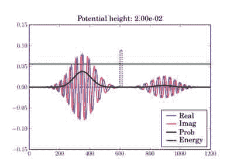

# 二十二、科学脚本

*   [应用于薛定谔方程的 FDTD 算法](SchrodingerFDTD.html)

# FDTD 算法在薛定谔方程中的应用

# FDTD 算法在薛定谔方程中的应用

下面的代码说明了一维时域有限差分(FDTD)算法在求解简单势的一维薛定谔方程中的应用。它只需要 Numpy 和 Matplotlib。

所有的数学细节都在这个 PDF 中描述:`Schrodinger_FDTD.pdf`

## 例子

在这些图中，电势用黄色的任意单位表示，而波包的总能量用绿色的线表示，单位与电势相同。因此，虽然能量单位是*而不是*在左轴上，但两个能量图使用相同的单位，因此可以有效地相互比较。

根据粒子能量，黄色区域可能是经典禁止的(当绿线在黄色区域内时)。

波包从 t=0 开始，如下所示(所示阶跃电位):


在模拟的最后，它看起来像这样，取决于实际的潜在高度:

 

这说明了根据屏障高度，隧道穿过薄屏障。在第二种情况下，经典粒子会完全反弹，因为它的能量低于势垒:

 

## 密码

```py
#=============================================================================
#
#               Quantum Mechanical Simulation using Finite-Difference
#               Time-Domain (FDTD) Method
#
#       This script simulates a probability wave in the presence of multiple
#       potentials.  The simulation is c arried out by using the FDTD algorithm
#       applied to the Schrodinger equation.  The program is intended to act as
#       a demonstration of the FDTD algorithm and can be used as an educational
#       aid for quantum mechanics and numerical methods.  The simulation
#       parameters are defined in the code constants and can be freely
#       manipulated to see different behaviors.
#
#       NOTES
#
#       The probability density plots are amplified by a factor for visual
#       purposes.  The psi_p quanity contains the actual probability density
#       without any rescaling.
#
#       BEWARE: The time step, dt, has strict requirements or else the
#       simulation becomes unstable.
#
#       The code has three built-in potential functions for demonstration.
#
#       1) Constant potential: Demonstrates a free particle with dispersion.
#
#       2) Step potential: Demonstrates transmission and reflection.
#
#       3) Potential barrier: Demonstrates tunneling.
#
#       By tweaking the height of the potential (V0 below) as well as the
#       barrier thickness (THCK below), you can see different behaviors: full
#       reflection with no noticeable transmission, transmission and
#       reflection, or mostly transmission with tunneling.
#
#               This script requires pylab and numpy to be installed with
#               Python or else it will not run.
#
#============================================================================
# Author:  James Nagel <nagel@mers.byu.edu>
#          5/25/07
#
# Updates by Fernando Perez <Fernando.Perez@colorado.edu>, 7/28/07
#============================================================================
#  Numerical and plotting libraries
import numpy as np
import pylab
# Set pylab to interactive mode so plots update when run outside ipython
pylab.ion()
#=============================================================================
# Utility functions
#  Defines a quick Gaussian pulse function to act as an envelope to the wave
#  function.
def Gaussian(x,t,sigma):
    """  A Gaussian curve.
 x = Variable
 t = time shift
 sigma = standard deviation      """
    return np.exp(-(x-t)**2/(2*sigma**2))
def free(npts):
    "Free particle."
    return np.zeros(npts)
def step(npts,v0):
    "Potential step"
    v = free(npts)
    v[npts/2:] = v0
    return v
def barrier(npts,v0,thickness):
    "Barrier potential"
    v = free(npts)
    v[npts/2:npts/2+thickness] = v0
    return v
def fillax(x,y,*args,**kw):
    """Fill the space between an array of y values and the x axis.
 All args/kwargs are passed to the pylab.fill function.
 Returns the value of the pylab.fill() call.
 """
    xx = np.concatenate((x,np.array([x[-1],x[0]],x.dtype)))
    yy = np.concatenate((y,np.zeros(2,y.dtype)))
    return pylab.fill(xx, yy, *args,**kw)

#=============================================================================
#
#  Simulation Constants.  Be sure to include decimal points on appropriate
#  variables so they become floats instead of integers.
#
N    = 1200     #  Number of spatial points.
T    = 5*N      #  Number of time steps.  5*N is a nice value for terminating
                #  before anything reaches the boundaries.
Tp   = 50       #  Number of time steps to increment before updating the plot.
dx   = 1.0e0    #  Spatial resolution
m    = 1.0e0    #  Particle mass
hbar = 1.0e0    #  Plank's constant
X    = dx*np.linspace(0,N,N)        #  Spatial axis.
# Potential parameters.  By playing with the type of potential and the height
# and thickness (for barriers), you'll see the various transmission/reflection
# regimes of quantum mechanical tunneling.
V0   = 1.0e-2   #  Potential amplitude (used for steps and barriers)
THCK = 15       # "Thickness" of the potential barrier (if appropriate
                # V-function is chosen)
# Uncomment the potential type you want to use here:
# Zero potential, packet propagates freely.
#POTENTIAL = 'free'
# Potential step.  The height (V0) of the potential chosen above will determine
# the amount of reflection/transmission you'll observe
POTENTIAL = 'step'
# Potential barrier.  Note that BOTH the potential height (V0) and thickness
# of the barrier (THCK) affect the amount of tunneling vs reflection you'll
# observe.
#POTENTIAL = 'barrier'
#  Initial wave function constants
sigma = 40.0 # Standard deviation on the Gaussian envelope (remember Heisenberg
             #  uncertainty).
x0 = round(N/2) - 5*sigma # Time shift
k0 = np.pi/20 # Wavenumber (note that energy is a function of k)
# Energy for a localized gaussian wavepacket interacting with a localized
# potential (so the interaction term can be neglected by computing the energy
# integral over a region where V=0)
E = (hbar**2/2.0/m)*(k0**2+0.5/sigma**2)
#=============================================================================
# Code begins
#
# You shouldn't need to change anything below unless you want to actually play
# with the numerical algorithm or modify the plotting.
#
#  Fill in the appropriate potential function (is there a Python equivalent to
#  the SWITCH statement?).
if POTENTIAL=='free':
    V = free(N)
elif POTENTIAL=='step':
    V = step(N,V0)
elif POTENTIAL=='barrier':
    V = barrier(N,V0,THCK)
else:
    raise ValueError("Unrecognized potential type: %s" % POTENTIAL)
#  More simulation parameters.  The maximum stable time step is a function of
#  the potential, V.
Vmax = V.max()            #  Maximum potential of the domain.
dt   = hbar/(2*hbar**2/(m*dx**2)+Vmax)         #  Critical time step.
c1   = hbar*dt/(m*dx**2)                       #  Constant coefficient 1.
c2   = 2*dt/hbar                               #  Constant coefficient 2.
c2V  = c2*V  # pre-compute outside of update loop
# Print summary info
print 'One-dimensional Schrodinger equation - time evolution'
print 'Wavepacket energy:   ',E
print 'Potential type:      ',POTENTIAL
print 'Potential height V0: ',V0
print 'Barrier thickness:   ',THCK
#  Wave functions.  Three states represent past, present, and future.
psi_r = np.zeros((3,N)) #  Real
psi_i = np.zeros((3,N)) #  Imaginary
psi_p = np.zeros(N,)   # Observable probability (magnitude-squared
                          #  of the complex wave function).
#  Temporal indexing constants, used for accessing rows of the wavefunctions.
PA = 0                 #  Past
PR = 1                 #  Present
FU = 2                 #  Future
#  Initialize wave function.  A present-only state will "split" with half the
#  wave function propagating to the left and the other half to the right.
#  Including a "past" state will cause it to propagate one way.
xn = range(1,N/2)
x = X[xn]/dx    #  Normalized position coordinate
gg = Gaussian(x,x0,sigma)
cx = np.cos(k0*x)
sx = np.sin(k0*x)
psi_r[PR,xn] = cx*gg
psi_i[PR,xn] = sx*gg
psi_r[PA,xn] = cx*gg
psi_i[PA,xn] = sx*gg
# Initial normalization of wavefunctions
#   Compute the observable probability.
psi_p = psi_r[PR]**2 + psi_i[PR]**2
#  Normalize the wave functions so that the total probability in the simulation
#  is equal to 1.
P   = dx * psi_p.sum()                      #  Total probability.
nrm = np.sqrt(P)
psi_r /= nrm
psi_i /= nrm
psi_p /= P
#  Initialize the figure and axes.
pylab.figure()
xmin = X.min()
xmax = X.max()
ymax = 1.5*(psi_r[PR]).max()
pylab.axis([xmin,xmax,-ymax,ymax])
#  Initialize the plots with their own line objects.  The figures plot MUCH
#  faster if you simply update the lines as opposed to redrawing the entire
#  figure.  For reference, include the potential function as well.
lineR, = pylab.plot(X,psi_r[PR],'b',alpha=0.7,label='Real')
lineI, = pylab.plot(X,psi_i[PR],'r',alpha=0.7,label='Imag')
lineP, = pylab.plot(X,6*psi_p,'k',label='Prob')
pylab.title('Potential height: %.2e' % V0)
# For non-zero potentials, plot them and shade the classically forbidden region
# in light red, as well as drawing a green line at the wavepacket's total
# energy, in the same units the potential is being plotted.
if Vmax !=0 :
    # Scaling factor for energies, so they fit in the same plot as the
    # wavefunctions
    Efac = ymax/2.0/Vmax
    V_plot = V*Efac
    pylab.plot(X,V_plot,':k',zorder=0)   #  Potential line.
    fillax(X,V_plot, facecolor='y', alpha=0.2,zorder=0)
    # Plot the wavefunction energy, in the same scale as the potential
    pylab.axhline(E*Efac,color='g',label='Energy',zorder=1)
pylab.legend(loc='lower right')
pylab.draw()
# I think there's a problem with pylab, because it resets the xlim after
# plotting the E line.  Fix it back manually.
pylab.xlim(xmin,xmax)
#  Direct index assignment is MUCH faster than using a spatial FOR loop, so
#  these constants are used in the update equations.  Remember that Python uses
#  zero-based indexing.
IDX1 = range(1,N-1)                            #  psi [ k ]
IDX2 = range(2,N)                              #  psi [ k + 1 ]
IDX3 = range(0,N-2)                            #  psi [ k - 1 ]
for t in range(T+1):
    # Precompute a couple of indexing constants, this speeds up the computation
    psi_rPR = psi_r[PR]
    psi_iPR = psi_i[PR]
    #  Apply the update equations.
    psi_i[FU,IDX1] = psi_i[PA,IDX1] + \
                      c1*(psi_rPR[IDX2] - 2*psi_rPR[IDX1] +
                          psi_rPR[IDX3])
    psi_i[FU] -= c2V*psi_r[PR]

    psi_r[FU,IDX1] = psi_r[PA,IDX1] - \
                      c1*(psi_iPR[IDX2] - 2*psi_iPR[IDX1] +
                          psi_iPR[IDX3])
    psi_r[FU] += c2V*psi_i[PR]
    #  Increment the time steps.  PR -> PA and FU -> PR
    psi_r[PA] = psi_rPR
    psi_r[PR] = psi_r[FU]
    psi_i[PA] = psi_iPR
    psi_i[PR] = psi_i[FU]
    #  Only plot after a few iterations to make the simulation run faster.
    if t % Tp == 0:
        #  Compute observable probability for the plot.
        psi_p = psi_r[PR]**2 + psi_i[PR]**2
        #  Update the plots.
        lineR.set_ydata(psi_r[PR])
        lineI.set_ydata(psi_i[PR])
        # Note: we plot the probability density amplified by a factor so it's a
        # bit easier to see.
        lineP.set_ydata(6*psi_p)

        pylab.draw()
# So the windows don't auto-close at the end if run outside ipython
pylab.ioff()
pylab.show() 
```

```py
 One-dimensional Schrodinger equation - time evolution
 Wavepacket energy:    0.0124932555014
 Potential type:       step
 Potential height V0:  0.01
 Barrier thickness:    15 
```


## 附件

*   [`Schrodinger_FDTD.pdf`](../_downloads/Schrodinger_FDTD.pdf)
*   [`schrod_barrier_hi_sm2.png`](../_downloads/schrod_barrier_hi_sm2.jpg)
*   [`schrod_barrier_lo_sm2.png`](../_downloads/schrod_barrier_lo_sm2.jpg)
*   [`schrod_step_hi_sm2.png`](../_downloads/schrod_step_hi_sm2.jpg)
*   [`schrod_step_init_sm2.png`](../_downloads/schrod_step_init_sm2.jpg)
*   [`schrod_step_lo_sm2.png`](../_downloads/schrod_step_lo_sm2.jpg)

    

# 将 NumPy 与其他语言一起使用(高级)

# 将 NumPy 与其他语言一起使用(高级)

*   [C 延伸](C_Extensions.html)
*   [ctype](Ctypes.html)
*   [F2py](F2Py.html)
*   [带基本数组转换的直列编织(无闪击)](Weave.html)
*   [派热克斯和 NumPy](Pyrex_and_NumPy.html)
*   [SWIG Numpy 示例](SWIG_NumPy_examples.html)
*   [SWIG 和 Numpy](SWIG_and_NumPy.html)
*   [SWIG 内存释放](SWIG_Memory_Deallocation.html)
*   [f2py 和 numpy](f2py_and_NumPy.html)

# 扩展

# 扩展

## 骨骼

`extmodule.h`:

```py
#ifndef EXTMODULE_H 
#define EXTMODULE_H
#ifdef __cplusplus 
extern “C” { 
#endif
/* Python.h must be included before everything else */ 
#include “Python.h”
/* include system headers here */
#if !defined(EXTMODULE_IMPORT_ARRAY) 
#define NO_IMPORT_ARRAY 
#endif 
#include “numpy/arrayobject.h”
#ifdef __cplusplus 
} 
#endif
#endif 
```

注意`PY_ARRAY_UNIQUE_SYMBOL`必须为每个扩展模块设置一个唯一的值。但是，您实际上根本不需要设置它，除非您要编译一个使用两个不同源文件的扩展模块

`extmodule.c`:

```py
#define EXTMODULE_IMPORT_ARRAY 
#include “extmodule.h” 
#undef EXTMODULE_IMPORT_ARRAY
static PyObject* FooError;
static PyObject* Ext_Foo(PyObject* obj, PyObject* args) {
    Py_INCREF(Py_None); return Py_None;
}
static PyMethodDef methods[] = {
    {“foo”, (PyCFunction) Ext_Foo, METH_VARARGS, “”}, {NULL, NULL, 0, NULL}
};
PyMODINIT_FUNC init_extmodule() {
    PyObject* m;
    m = Py_InitModule(“_extmodule”, methods); 
    import_array(); 
    SVMError = PyErr_NewException(“_extmodule.FooError”, NULL, NULL); 
    Py_INCREF(FooError); 
    PyModule_AddObject(m, “FooError”, FooError);
} 
```

如果您的扩展模块包含在一个单独的源文件中，那么您可以完全去掉 extmodule.h，并用

```py
#inlude “Python.h” 
#include “numpy/arrayobject.h”
/* remainder of extmodule.c after here */ 
```

## 在 Windows 上调试 C 扩展

在 Windows 上调试 C 扩展可能很棘手。如果在调试模式下编译扩展代码，必须链接 Python 库的调试版本，例如`Python24_d.lib`。使用 Visual Studio 构建时，这由`Python24.h`中的一个实用程序处理。如果您强制编译器将调试代码链接到发布库，您可能会得到以下错误(尤其是在编译 SWIG 包装的代码时):

```py
extmodule.obj : error LNK2019: unresolved external symbol __imp___Py_Dealloc referenced in function _PySwigObject_format 
extmodule.obj : error LNK2019: unresolved external symbol __imp___Py_NegativeRefcount referenced in function _PySwigObject_format 
extmodule.obj : error LNK2001: unresolved external symbol __imp___Py_RefTotal 
extmodule.obj : error LNK2019: unresolved external symbol __imp___PyObject_DebugFree referenced in function _PySwigObject_dealloc 
extmodule.obj : error LNK2019: unresolved external symbol __imp___PyObject_DebugMalloc referenced in function _PySwigObject_New 
extmodule.obj : error LNK2019: unresolved external symbol __imp__Py_InitModule4TraceRefs referenced in function _init_extmodule 
```

但是，如果您想导入这个可调试的扩展模块，现在还需要 Python 解释器的调试版本。现在，您还需要调试您使用的每一个其他扩展模块。显然，这可能需要一些时间来解决。

另一种方法是将库代码构建为调试 DLL。这样，您至少可以确保您的扩展模块将正确的数据传递给您包装的库代码。

另外，MinGW GCC 编译器似乎没有生成 Visual Studio 调试器能够理解的调试符号。

## 瓦尔格林德

为了开发一个稳定的扩展模块，检查由 C 代码完成的内存分配和内存访问是非常重要的。在 Linux 上，可以使用 [Valgrind](http://www.valgrind.org/) 。在 Windows 上，您可以尝试商业工具，如 [Rational PurifyPlus](http://www-306.ibm.com/software/awdtools/purifyplus/) 。

在使用 Valgrind 之前，请确保您的扩展模块是使用`-g`开关编译到 GCC 的，以便在检测到错误时可以获得有用的堆栈跟踪。

然后将以下内容放入一个 shell 脚本中，说`valgrind_py.sh`:

```py
#!/bin/sh valgrind

–tool=memcheck –leak-check=yes –error-limit=no –suppressions=valgrind-python.supp –num-callers=10 -v python $1 
```

`valgrind-python.supp`抑制 Python 代码引起的一些警告。您可以在 Python SVN 存储库中找到 Python 2.4 [的抑制文件。另请参见同一位置的](http://svn.python.org/projects/python/branches/release24-maint/Misc/valgrind-python.supp)[自述文件](http://svn.python.org/projects/python/branches/release24-maint/Misc/README.valgrind)。默认情况下，某些抑制会被注释掉。通过删除#注释标记来启用它们。

执行`chmod +x valgrind_py.sh`并作为`./valgrind_py.sh test_extmodule.py`运行。

## 证明文件

*   [扩展和嵌入 Python 解释器](http://docs.python.org/ext/ext.html)(先看这个)
*   [Python/C API 参考手册](http://docs.python.org/api/api.html)(然后浏览此处)
*   [NumPy 指南](http://www.tramy.us/)第 13 章描述了完整的 API
*   第 14 章涉及延伸！NumPy(确保您有日期为 2006 年 3 月 15 日或更晚的版本)

## 例子

*   [SciPy SVN 存储库中的图像](http://projects.scipy.org/scipy/scipy/browser/trunk/Lib/ndimage)
*   `NumPy arrays`(小例子集锦)

## 邮件列表线程

*   [释放 C 中分配的内存](http://thread.gmane.org/gmane.comp.python.numeric.general/5206/focus=5206)
*   [端口 C/C++ matlab mexing 代码到 numpy](http://thread.gmane.org/gmane.comp.python.scientific.user/7392/focus=7400)
*   [编写 numpy/scipy 扩展的新手](http://thread.gmane.org/gmane.comp.python.numeric.general/5186/focus=5186)
*   [数组数据和结构对齐](http://thread.gmane.org/gmane.comp.python.numeric.general/5234/focus=5234)

# ctypes(类型)

# ctypes(类型)

## 介绍

[ctypes](http://starship.python.net/crew/theller/ctypes/) 是 Python 2.3 及更高版本的高级外来函数接口包。它包含在 Python 2.5 的标准库中。

ctypes 允许调用从 DLLs 共享库公开的函数，并拥有广泛的设施来创建、访问和操作 Python 中简单和复杂的 C 数据类型——换句话说:用纯 Python 包装库。甚至可以用纯 Python 实现 C 回调函数。

ctypes 还包括一个代码生成器工具链，允许从 C 头文件自动创建库包装器。ctypes 适用于 Windows、Mac OS X、Linux、Solaris、FreeBSD、OpenBSD 等系统。

**确保您至少有 ctypes 1 . 0 . 1 或更高版本。**

用 python 调用或运行 C 代码的其他可能性包括: [SWIG](http://www.scipy.org/Cookbook/SWIG_and_NumPy) 、 [Cython](http://wiki.cython.org/tutorials/numpy) 、 [Weave](http://python.org/pypi/weave) 、 [cffi](http://python.org/pypi/cffi) 等。

## ctypes 入门

Python 的 [ctypes 教程](http://starship.python.net/crew/theller/ctypes/tutorial.html)和 [ctypes 文档](http://docs.python.org/lib/module-ctypes.html)提供了大量关于 ctypes 入门的信息。

假设您已经构建了一个名为`foo.dll`或`libfoo.so`的库，其中包含一个名为`bar`的函数，该函数将一个指向双精度缓冲区的指针和一个 int 作为参数并返回一个 int，下面的代码应该可以让您开始运行。以下几节涵盖了一些可能的构建脚本、C 代码和 Python 代码。

如果你想用 distutils 构建你的 DLL/共享库，看看！ [OOF2](http://www.ctcms.nist.gov/oof/oof2/index.html) 中包含的共享数据库扩展。这可能会在某个时候包含在 numpy.distutils 中。

### Nmake Makefile (Windows)

在 Visual Studio 命令提示符下运行 nmake，使用以下文件进行生成。

您应该能够使用任何版本的 Visual Studio 编译器来构建 DLL，而不管用于编译 Python 的编译器是什么。请记住，您不应该在不同的调试/发布和单线程/多线程运行时之间分配/释放内存，也不应该在不同运行时的文件上操作。

```py
CXX = cl.exe
LINK = link.exe

CPPFLAGS = -D_WIN32 -D_USRDLL -DFOO_DLL -DFOO_EXPORTS
CXXFLAGSALL = -nologo -EHsc -GS -W3 -Wp64 $(CPPFLAGS)
CXXFLAGSDBG = -MDd -Od -Z7 -RTCcsu
CXXFLAGSOPT = -MD -O2
#CXXFLAGS = $(CXXFLAGSALL) $(CXXFLAGSDBG)
CXXFLAGS = $(CXXFLAGSALL) $(CXXFLAGSOPT)

LINKFLAGSALL = /nologo /DLL
LINKFLAGSDBG = /DEBUG
LINKFLAGSOPT =
#LINKFLAGS = $(LINKFLAGSALL) $(LINKFLAGSDBG)
LINKFLAGS = $(LINKFLAGSALL) $(LINKFLAGSOPT)

all: foo.dll

foo.dll: foo.obj
    $(LINK) $(LINKFLAGS) foo.obj /OUT:foo.dll

svm.obj: svm.cpp svm.h
    $(CXX) $(CXXFLAGS) -c foo.cpp

clean:
    -erase /Q *.obj *.dll *.exp *.lib 
```

### 建筑

您可以将以下文件与 [SCons](http://www.scons.org) 一起使用来构建共享库。

```py
env = Environment()
env.Replace(CFLAGS=['-O2','-Wall','-ansi','-pedantic'])
env.SharedLibrary('foo', ['foo.cpp']) 
```

### foo.cpp

```py
#include <stdio.h>

#ifdef FOO_DLL
#ifdef FOO_EXPORTS
#define FOO_API __declspec(dllexport)
#else
#define FOO_API __declspec(dllimport)
#endif /* FOO_EXPORTS */
#else
#define FOO_API extern /* XXX confirm this */
#endif /* FOO_DLL */

#ifdef __cplusplus
extern "C" {
#endif

extern FOO_API int bar(double* data, int len) {
   int i;
   printf("data = %p\n", (void*) data);
   for (i = 0; i < len; i++) {
      printf("data[%d] = %f\n", i, data[i]);
   }
   printf("len = %d\n", len);
   return len + 1;
}

#ifdef __cplusplus
}
#endif 
```

在 Windows 上为 foo 构建 DLL 时，定义`FOO_DLL`和`FOO_EXPORTS`(这是您在构建与 ctypes 一起使用的 DLL 时想要做的)。链接动态链接库时，定义`FOO_DLL`。当链接包含 foo 的静态库时，或者当在可执行文件中包含 foo 时，不要定义任何东西。

如果你不清楚是为了什么，请阅读 c++ d open 迷你 HOWTO 的[部分 3。这允许您在一堆 C++类之上编写带有 C 链接的函数包装器，以便您可以将它们与 ctypes 一起使用。或者，您可能更喜欢编写 C 代码。](http://www.tldp.org/HOWTO/C++-dlopen/thesolution.html)

### foo.py

```py
import numpy as N
import ctypes as C
_foo = N.ctypeslib.load_library('libfoo', '.')
_foo.bar.restype = C.c_int
_foo.bar.argtypes = [C.POINTER(C.c_double), C.c_int]
def bar(x):
    return _foo.bar(x.ctypes.data_as(C.POINTER(C.c_double)), len(x))
x = N.random.randn(10)
n = bar(x) 
```

## NumPy 数组的 ctypes 属性

最近向 NumPy 数组添加了 ctypes 属性:

```py
In [18]: x = N.random.randn(2,3,4)

In [19]: x.ctypes.data
Out[19]: c_void_p(14394256)

In [21]: x.ctypes.data_as(ctypes.POINTER(c_double))

In [24]: x.ctypes.shape
Out[24]: <ctypes._endian.c_long_Array_3 object at 0x00DEF2B0>

In [25]: x.ctypes.shape[:3]
Out[25]: [2, 3, 4]

In [26]: x.ctypes.strides
Out[26]: <ctypes._endian.c_long_Array_3 object at 0x00DEF300>

In [27]: x.ctypes.strides[:3]
Out[27]: [96, 32, 8] 
```

一般来说，C 函数可能会取一个指向数组数据的指针、一个指示数组维数的整数(在这里传递 ndim 属性的值)和两个指向形状和跨距信息的 int 指针。

如果你的 C 函数假定存储是连续的，你可能想用一个 Python 函数包装它，这个函数调用！所有输入数组上的 NumPy`ascontiguousarray`功能。

## 带有 ctypes 参数类型的 NumPy 的 ndpointer

从 ctypes 0.9.9.9 开始，任何实现 from_param 方法的类都可以在函数的 argtypes 列表中使用。在 ctypes 调用 C 函数之前，它使用 argtypes 列表来检查每个参数。

使用！NumPy 的 ndpointer 函数，可以构造一些非常有用的 argtypes 类，例如:

```py
from numpy.ctypeslib import ndpointer
arg1 = ndpointer(dtype='<f4')
arg2 = ndpointer(ndim=2)
arg3 = ndpointer(shape=(10,10))
arg4 = ndpointer(flags='CONTIGUOUS,ALIGNED')
# or any combination of the above
arg5 = ndpointer(dtype='>i4', flags='CONTIGUOUS')
func.argtypes = [arg1,arg2,arg3,arg4,arg5] 
```

现在，如果一个论点不符合要求，a！引发类型错误。这使得人们可以确保传递给 C 函数的数组是该函数可以处理的形式。

另请参见 [ctypes 和 ndpointer](http://thread.gmane.org/gmane.comp.python.numeric.general/7418/focus=7418) 上的邮件列表线程。

## 通过回调动态分配

ctypes 支持[回调](http://docs.python.org/lib/ctypes-callback-functions.html)的思想，允许 C 代码通过函数指针回调到 Python 中。这是可能的，因为 ctypes 在调用 C 函数之前会释放 Python 全局解释器锁(GIL)。

我们可以用这个功能来分配！NumPy 数组，如果我们需要一个 C 代码操作的缓冲区。这可以避免在某些情况下必须复制数据。您也不必担心在完成后释放 C 数据。通过将缓冲区分配为！NumPy 数组，Python 垃圾收集器可以解决这个问题。

Python 代码:

```py
from ctypes import *
ALLOCATOR = CFUNCTYPE(c_long, c_int, POINTER(c_int))
# load your library as lib
lib.baz.restype = None
lib.baz.argtypes = [c_float, c_int, ALLOCATOR] 
```

这并不是定义分配器最漂亮的方式(我也不确定 c_long 是否是正确的返回类型)，但是 ctype 中有一些 bug 似乎使这成为目前唯一的方式。最终，我们希望像这样编写分配器(但它还不起作用):

```py
from numpy.ctypeslib import ndpointer
ALLOCATOR = CFUNCTYPE(ndpointer('f4'), c_int, POINTER(c_int)) 
```

以下情况似乎也会引起问题:

```py
ALLOCATOR = CFUNCTYPE(POINTER(c_float), c_int, POINTER(c_int))
ALLOCATOR = CFUNCTYPE(c_void_p, c_int, POINTER(c_int))
ALLOCATOR = CFUNCTYPE(None, c_int, POINTER(c_int), POINTER(c_void_p)) 
```

可能的故障包括！引发系统错误异常，解释器崩溃或解释器挂起。查看这些邮件列表线程了解更多详细信息: *[在回调中赋值时指针指针不变](http://thread.gmane.org/gmane.comp.python.ctypes/2979)* [使用回调返回指针(c_float)](http://thread.gmane.org/gmane.comp.python.ctypes/2974) * [使用回调函数和 as_parameter 使用 NumPy ndpointer](http://thread.gmane.org/gmane.comp.python.ctypes/2972)

举个例子。示例的 C 代码:

```py
#ifndef CSPKREC_H
#define CSPKREC_H
#ifdef FOO_DLL
#ifdef FOO_EXPORTS
#define FOO_API __declspec(dllexport)
#else
#define FOO_API __declspec(dllimport)
#endif
#else
#define FOO_API
#endif
#endif
#include <stdio.h>
#ifdef __cplusplus
extern "C" {
#endif

typedef void*(*allocator_t)(int, int*);

extern FOO_API void foo(allocator_t allocator) {
   int dim = 2;
   int shape[] = {2, 3};
   float* data = NULL;
   int i, j;
   printf("foo calling allocator\n");
   data = (float*) allocator(dim, shape);
   printf("allocator returned in foo\n");
   printf("data = 0x%p\n", data);
   for (i = 0; i < shape[0]; i++) {
      for (j = 0; j < shape[1]; j++) {
         *data++ = (i + 1) * (j + 1);
      }
   }
}

#ifdef __cplusplus
}
#endif 
```

如果您是 C 或 C++中函数指针的新手，请查看[函数指针教程](http://www.newty.de/fpt/index.html)。和 Python 代码:

```py
from ctypes import *
import numpy as N

allocated_arrays = []
def allocate(dim, shape):
    print 'allocate called'
    x = N.zeros(shape[:dim], 'f4')
    allocated_arrays.append(x)
    ptr = x.ctypes.data_as(c_void_p).value
    print hex(ptr)
    print 'allocate returning'
    return ptr

lib = cdll['callback.dll']
lib.foo.restype = None
ALLOCATOR = CFUNCTYPE(c_long, c_int, POINTER(c_int))
lib.foo.argtypes = [ALLOCATOR]

print 'calling foo'
lib.foo(ALLOCATOR(allocate))
print 'foo returned'

print allocated_arrays[0] 
```

分配函数创建一个新的！NumPy 数组，并将其放在列表中，以便我们在回调函数返回后保留对它的引用。预期产出:

```py
calling foo
foo calling allocator
allocate called
0xaf5778
allocate returning
allocator returned in foo
data = 0x00AF5778
foo returned
[[ 1\.  2\.  3.]
 [ 2\.  4\.  6.]] 
```

这是分配器类管理这类事情的另一个想法。除了维度和形状之外，这个分配器函数还接受一个字符来指示要分配什么类型的数组。您可以在`NPY_TYPECHAR`枚举中从 ndarrayobject.h 头中获取这些类型代码。

```py
from ctypes import *
import numpy as N

class Allocator:
    CFUNCTYPE = CFUNCTYPE(c_long, c_int, POINTER(c_int), c_char)

    def __init__(self):
        self.allocated_arrays = []

    def __call__(self, dims, shape, dtype):
        x = N.empty(shape[:dims], N.dtype(dtype))
        self.allocated_arrays.append(x)
        return x.ctypes.data_as(c_void_p).value

    def getcfunc(self):
        return self.CFUNCTYPE(self)
    cfunc = property(getcfunc) 
```

在 Python 中这样使用它:

```py
lib.func.argtypes = [..., Allocator.CFUNCTYPE]
def func():
    alloc = Allocator()
    lib.func(..., alloc.cfunc)
    return tuple(alloc.allocated_arrays[:3]) 
```

对应的 C 代码:

```py
typedef void*(*allocator_t)(int, int*, char);

void func(..., allocator_t allocator) {
   /* ... */
   int dims[] = {2, 3, 4};
   double* data = (double*) allocator(3, dims, 'd');
   /* allocate more arrays here */
} 
```

上面介绍的分配器都不是线程安全的。如果您有多个 Python 线程调用调用回调的 C 代码，您将不得不做一些更聪明的事情。

## 更有用的代码片段

假设您有一个类似下面这样的 C 函数，它对指针对指针的数据结构进行操作。

```py
void foo(float** data, int len) {
    float** x = data;
    for (int i = 0; i < len; i++, x++) {
        /* do something with *x */
    }
} 
```

您可以从现有的二维创建必要的结构！使用以下代码的 NumPy 数组:

```py
x = N.array([[10,20,30], [40,50,60], [80,90,100]], 'f4')
f4ptr = POINTER(c_float)
data = (f4ptr*len(x))(*[row.ctypes.data_as(f4ptr) for row in x]) 
```

`f4ptr*len(x)`创建一个 ctypes 数组类型，该类型足够大，可以包含指向数组中每一行的指针。

## 异构类型示例

这里有一个使用异构数据类型(记录数组)的简单例子。

但是，要注意的是，C ***中的 NumPy 重数组和相应的结构可能不*** 是全等的。

此外，跨平台的结构不是标准化的...换句话说，**' '注意填充问题！**' '

样本 c

```py
#include <stdio.h>

typedef struct Weather_t {
    int timestamp;
    char desc[12];
} Weather;

void print_weather(Weather* w, int nelems)
{
    int i;
    for (i=0;i<nelems;++i) {
        printf("timestamp: %d\ndescription: %s\n\n", w[i].timestamp, w[i].desc);
    }
} 
```

结构

```py
env = Environment()
env.Replace(CFLAGS=['-O2','-Wall','-ansi','-pedantic'])
env.SharedLibrary('sample', ['sample.c']) 
```

sample.py

```py
import numpy as N
import ctypes as C

dat = [[1126877361,'sunny'], [1126877371,'rain'], [1126877385,'damn nasty'], [1126877387,'sunny']]

dat_dtype = N.dtype([('timestamp','i4'),('desc','|S12')])
arr = N.rec.fromrecords(dat,dtype=dat_dtype)

_sample = N.ctypeslib.load_library('libsample','.')
_sample.print_weather.restype = None
_sample.print_weather.argtypes = [N.ctypeslib.ndpointer(dat_dtype, flags='aligned, contiguous'), C.c_int]

def print_weather(x):
    _sample.print_weather(x, x.size)

if __name__=='__main__':
    print_weather(arr) 
```

## 斐波那契示例(使用 NumPy 数组、C 和 Scons)

以下内容在 Windows(使用 MinGW)和 GNU/Linux 32 位操作系统(最近一次测试是 2009 年 8 月 13 日)上进行了测试和工作。将所有三个文件复制到同一个目录。

C 代码(递归计算斐波那契数):

```py
/*
    Filename: fibonacci.c
    To be used with fibonacci.py, as an imported library. Use Scons to compile,
    simply type 'scons' in the same directory as this file (see www.scons.org).
*/

/* Function prototypes */
int fib(int a);
void fibseries(int *a, int elements, int *series);
void fibmatrix(int *a, int rows, int columns, int *matrix);

int fib(int a)
{
    if (a <= 0) /*  Error -- wrong input will return -1\. */
        return -1;
    else if (a==1)
        return 0;
    else if ((a==2)||(a==3))
        return 1;
    else
        return fib(a - 2) + fib(a - 1);
}

void fibseries(int *a, int elements, int *series)
{
    int i;
    for (i=0; i < elements; i++)
    {
    series[i] = fib(a[i]);
    }
}

void fibmatrix(int *a, int rows, int columns, int *matrix)
{
    int i, j;
    for (i=0; i<rows; i++)
        for (j=0; j<columns; j++)
        {
            matrix[i * columns + j] = fib(a[i * columns + j]);
        }
} 
```

Python 代码:

```py
"""
Filename: fibonacci.py
Demonstrates the use of ctypes with three functions:

 (1) fib(a)
 (2) fibseries(b)
 (3) fibmatrix(c)
"""

import numpy as nm
import ctypes as ct

# Load the library as _libfibonacci.
# Why the underscore (_) in front of _libfibonacci below?
# To mimimise namespace pollution -- see PEP 8 (www.python.org).
_libfibonacci = nm.ctypeslib.load_library('libfibonacci', '.')

_libfibonacci.fib.argtypes = [ct.c_int] #  Declare arg type, same below.
_libfibonacci.fib.restype  =  ct.c_int  #  Declare result type, same below.

_libfibonacci.fibseries.argtypes = [nm.ctypeslib.ndpointer(dtype = nm.int),\
                                     ct.c_int,\
                                     nm.ctypeslib.ndpointer(dtype = nm.int)]
_libfibonacci.fibseries.restype  = ct.c_void_p

_libfibonacci.fibmatrix.argtypes = [nm.ctypeslib.ndpointer(dtype = nm.int),\
                                     ct.c_int, ct.c_int,\
                                    nm.ctypeslib.ndpointer(dtype = nm.int)]
_libfibonacci.fibmatrix.restype  = ct.c_void_p

def fib(a):
    """Compute the n'th Fibonacci number.

 ARGUMENT(S):
 An integer.

 RESULT(S):
 The n'th Fibonacci number.

 EXAMPLE(S):
 >>> fib(8)
 13
 >>> fib(23)
 17711
 >>> fib(0)
 -1
 """
    return _libfibonacci.fib(int(a))

def fibseries(b):
    """Compute an array containing the n'th Fibonacci number of each entry.

 ARGUMENT(S):
 A list or NumPy array (dim = 1) of integers.

 RESULT(S):
 NumPy array containing the n'th Fibonacci number of each entry.

 EXAMPLE(S):
 >>> fibseries([1,2,3,4,5,6,7,8])
 array([ 0,  1,  1,  2,  3,  5,  8, 13])
 >>> fibseries(range(1,12))
 array([ 0,  1,  1,  2,  3,  5,  8, 13, 21, 34, 55])
 """
    b = nm.asarray(b, dtype=nm.intc)
    result = nm.empty(len(b), dtype=nm.intc)
    _libfibonacci.fibseries(b, len(b), result)
    return result

def fibmatrix(c):
    """Compute a matrix containing the n'th Fibonacci number of each entry.

 ARGUMENT(S):
 A nested list or NumPy array (dim = 2) of integers.

 RESULT(S):
 NumPy array containing the n'th Fibonacci number of each entry.

 EXAMPLE(S):
 >>> from numpy import array
 >>> fibmatrix([[3,4],[5,6]])
 array([[1, 2],
 [3, 5]])
 >>> fibmatrix(array([[1,2,3],[4,5,6],[7,8,9]]))
 array([[ 0,  1,  1],
 [ 2,  3,  5],
 [ 8, 13, 21]])
 """
    tmp = nm.asarray(c)
    rows, cols = tmp.shape
    c = tmp.astype(nm.intc)
    result = nm.empty(c.shape, dtype=nm.intc)
    _libfibonacci.fibmatrix(c, rows, cols, result)
    return result 
```

下面是结构文件内容(文件名:结构):

```py
env = Environment()
env.Replace(CFLAGS=['-O2', '-Wall', '-ansi', '-pedantic'])
env.SharedLibrary('libfibonacci', ['fibonacci.c']) 
```

在 Python 解释器(或您使用的任何解释器)中，执行以下操作:

```py
>>> import fibonacci as fb
>>> fb.fib(8)
13
>>> fb.fibseries([5,13,2,6]
array([  3, 144,   1,   5]) 
```

## 相关邮件列表线索

ctypes-user 邮件列表中的一些有用的线索:

*   [[http://aspn . activestate . com/ASPN/Mail/Message/ctypes-users/3119087](http://aspn.activestate.com/ASPN/Mail/Message/ctypes-users/3119087)对指针(POINTER(ctype))进行索引时出现索引错误]
*   [[http://aspn . activestate . com/ASPN/Mail/Message/ctypes-users/3118513](http://aspn.activestate.com/ASPN/Mail/Message/ctypes-users/3118513)向 NumPy 添加 ctypes 支持]
*   [[http://aspn . activestate . com/ASPN/Mail/Message/ctypes-users/3118656](http://aspn.activestate.com/ASPN/Mail/Message/ctypes-users/3118656)确定 ctype 是否为指针类型(曾为 RE:向 NumPy 添加 ctype 支持)】
*   [[http://aspn . activestate . com/ASPN/Mail/Message/ctypes-users/3117306](http://aspn.activestate.com/ASPN/Mail/Message/ctypes-users/3117306)检查无值的空指针错误]
*   【[http://aspn . activestate . com/ASPN/Mail/Message/ctypes-users/3205951](http://aspn.activestate.com/ASPN/Mail/Message/ctypes-users/3205951)从 C 到 Python 的回调问题】
*   [[http://thread . gmane . org/gmane . comp . python . numeric . general/7418](http://thread.gmane.org/gmane.comp.python.numeric.general/7418)ctypes 和 ndpointer]
*   [[http://thread.gmane.org/gmane.comp.python.ctypes/3116](http://thread.gmane.org/gmane.comp.python.ctypes/3116)64 符号整数问题]

托马斯·海勒的回答特别有见地。

## 证明文件

*   【[http://starship . python . net/crew/theller/ctypes/tutorial . html](http://starship.python.net/crew/theller/ctypes/tutorial.html)ctypes tutorial】
*   [[http://docs.python.org/dev/lib/module-ctypes.html](http://docs.python.org/dev/lib/module-ctypes.html)13.14 ctypes–Python 的一个外来函数库。]

# F2py

# F2py

本页提供了如何使用 [F2py](http://docs.scipy.org/doc/numpy-dev/f2py/) fortran 包装程序的示例。

可以从简单的例程开始，甚至可以包装完整的 Fortran 模块。 [F2py](http://docs.scipy.org/doc/numpy-dev/f2py/) 用在 SciPy 本身，你可以在 SciPy 的源代码中找到一些例子。

## 简短的例子

### 从 lapack 包装函数

*摘自 ArndBaecker 于 2006-06-22 给 scipy 用户的消息*

多亏了 f2py，在许多情况下包装 Fortran 代码(稍加努力)是微不足道的。对于需要很多参数的复杂函数，包装器会变得很长。幸运的是，看`scipy/Lib/linalg/generic_flapack.pyf`可以学到很多东西，尤其是[http://cens.ioc.ee/projects/f2py2e/](http://cens.ioc.ee/projects/f2py2e/)的文档非常棒。我也发现 FernandoPerez 的 f2py 笔记很有帮助

让我试着对如何开始给出一些一般性的评论(这一切的真正权威当然是 Pearu，所以如果我在这里弄错了，请纠正我):*首先找到一个例程，它将完成您想要的工作:*如果 lapack 文档在 Linux 上安装正确，您可以做*[http://www.netlib.org/](http://www.netlib.org/)提供了一个很好的决策树*确保它不存在于 scipy 中:

```py
from scipy.lib import lapack
lapack.clapack.<TAB>         (assuming Ipython)
lapack.clapack.<routine_name> 
```

`Remark: routines starting with c/z are for double/single complex`` and routines for d/s for double/single real numbers.`` The calling sequence for c/z and d/s are (I think always) the same and`` sometimes they are also the same for the real and complex case.``* Then one has to download the fortran file for the lapack routine of interest.``* Generate wrapper by calling``* Generate library`

`* You can use this by`

```py
import wrap_lap 
```

`Note, that this is not yet polished (this is the part on`` which has to spent some effort ;-) ), i.e. one`` has to tell which variables are input, which are output`` and which are optional. In addition temporary`` storage has to be provided with the right dimensions`` as described in the documentation part of the lapack routine.`

具体(非常简单)的例子(非 lapack):

### 包装埃尔米特多项式

下载代码(在几个小时的谷歌搜索后找到；-)，来自[http://CDM . unimo . it/home/mate matica/funa ro . daniele/splib . txt](http://cdm.unimo.it/home/matematica/funaro.daniele/splib.txt)

和提取

生成包装框架:

```py
# only run the following line _once_
# (and never again, otherwise the hand-modified hermite.pyf
#  goes down the drains)
f2py -m hermite -h hermite.pyf hermite.f 
```

然后修改

创建模块:

```py
f2py -c hermite.pyf  hermite.f

# add this if you want:
-DF2PY_REPORT_ON_ARRAY_COPY=1 -DF2PY_REPORT_ATEXIT 
```

简单测试:

```py
import hermite
hermite.vahepo(2,2.0)
import scipy
scipy.special.hermite(2)(2.0) 
```

关于如何包装带状矩阵的例程的一个更复杂的例子可以在[http://www.physik.tu-dresden.de/~baecker/comp_talks.html](http://www.physik.tu-dresden.de/~baecker/comp_talks.html)的“Python 和 Co -一些最近的发展”中找到。

## 包装一个简单的 C 代码

f2py 也能够处理 C 代码。维基上有一个例子:[“Cookbook/f2py _ and _ NumPy”]。

## 简单数字代码的逐步包装:冰原模拟交互系统

[http://websrv.cs.umt.edu/isis/index.php/F2py_example](http://websrv.cs.umt.edu/isis/index.php/F2py_example)

# 带有基本数组转换的直列编织(无闪电战)

# 带有基本数组转换的直列编织(无闪电战)

Python 和 Numpy 旨在表达对许多大小的传入数据透明工作的通用语句。在闪电战转换中使用内联编织可以显著加快许多数值运算(例如，添加一系列数组)，因为在某些方面它绕过了通用性。如何在保持通用性的同时，用内联 C 代码加速算法？Numpy 提供的一个工具是**迭代器**。因为迭代器为您跟踪内存索引，所以它的操作非常类似于 Python 本身的迭代概念。你可以用 C 语言编写一个循环，简单地说“获取一个串行对象中的下一个元素——the！PyArrayObject–对其进行操作，直到不再有元素为止。”

* * *

这是多维迭代器的一个非常简单的例子，以及它们“广播”兼容形状数组的能力。它表明，完全不知道维度的同一代码可以根据广播规则实现完全不同的计算。在这种情况下，我假设 ***a*** 的维度至少和 ***b*** 一样多。重要的是要知道 ***a*** 的编织数组转换可以让你在 C++中访问到:*py _ a–！py object**a _ array–！PyArrayObject**a –( c 型* ) py_array- >数据

```py
import numpy as npy
from scipy.weave import inline

def multi_iter_example():
    a = npy.ones((4,4), npy.float64)
    # for the sake of driving home the "dynamic code" approach...
    dtype2ctype = {
        npy.dtype(npy.float64): 'double',
        npy.dtype(npy.float32): 'float',
        npy.dtype(npy.int32): 'int',
        npy.dtype(npy.int16): 'short',
    }
    dt = dtype2ctype.get(a.dtype)

    # this code does a = a*b inplace, broadcasting b to fit the shape of a
    code = \
"""
%s *p1, *p2;
PyObject *itr;
itr = PyArray_MultiIterNew(2, a_array, b_array);
while(PyArray_MultiIter_NOTDONE(itr)) {
 p1 = (%s *) PyArray_MultiIter_DATA(itr, 0);
 p2 = (%s *) PyArray_MultiIter_DATA(itr, 1);
 *p1 = (*p1) * (*p2);
 PyArray_MultiIter_NEXT(itr);
}
""" % (dt, dt, dt)

    b = npy.arange(4, dtype=a.dtype)
    print '\n A                  B     '
    print a, b
    # this reshaping is redundant, it would be the default broadcast
    b.shape = (1,4)
    inline(code, ['a', 'b'])
    print "\ninline version of a*b[None,:],"
    print a
    a = npy.ones((4,4), npy.float64)
    b = npy.arange(4, dtype=a.dtype)
    b.shape = (4,1)
    inline(code, ['a', 'b'])
    print "\ninline version of a*b[:,None],"
    print a 
```

在 [`iterators_example.py`](../_downloads/iterators_example.py) 和 [`iterators.py`](../_downloads/iterators.py) 中还有另外两个迭代器应用。

## 深入“内联”方法

**内联**的[文档字符串](http://www.scipy.org/scipy/scipy/browser/trunk/scipy/weave/inline_tools.py)非常庞大，表明在集成内联代码时支持各种编译选项。我利用这一点让一些专门的 FFTW 调用变得简单多了，并且只在几行代码中增加了对内联快速傅立叶变换的支持。在这个例子中，我读入了一个纯 C 代码的文件，并在我的内联语句中将其用作 ***support_code*** 。我还使用了一个来自 Numpy distutils 的工具来定位我的 FFTW 库和头文件。

```py
import numpy as N
from scipy.weave import inline
from os.path import join, split
from numpy.distutils.system_info import get_info

fft1_code = \
"""
char *i, *o;
i = (char *) a;
o = inplace ? i : (char *) b;
if(isfloat) {
 cfft1d(reinterpret_cast<fftwf_complex*>(i),
 reinterpret_cast<fftwf_complex*>(o),
 xdim, len_array, direction, shift);
} else {
 zfft1d(reinterpret_cast<fftw_complex*>(i),
 reinterpret_cast<fftw_complex*>(o),
 xdim, len_array, direction, shift);
}
"""
extra_code = open(join(split(__file__)[0],'src/cmplx_fft.c')).read()
fftw_info = get_info('fftw3')

def fft1(a, shift=True, inplace=False):
    if inplace:
        _fft1_work(a, -1, shift, inplace)
    else:
        return _fft1_work(a, -1, shift, inplace)

def ifft1(a, shift=True, inplace=False):
    if inplace:
        _fft1_work(a, +1, shift, inplace)
    else:
        return _fft1_work(a, +1, shift, inplace)

def _fft1_work(a, direction, shift, inplace):
    # to get correct C-code, b always must be an array (but if it's
    # not being used, it can be trivially small)
    b = N.empty_like(a) if not inplace else N.array([1j], a.dtype)
    inplace = 1 if inplace else 0
    shift = 1 if shift else 0
    isfloat = 1 if a.dtype.itemsize==8 else 0
    len_array = N.product(a.shape)
    xdim = a.shape[-1]
    inline(fft1_code, ['a', 'b', 'isfloat', 'inplace',
                       'len_array', 'xdim', 'direction', 'shift'],
           support_code=extra_code,
           headers=['<fftw3.h>'],
           libraries=['fftw3', 'fftw3f'],
           include_dirs=fftw_info['include_dirs'],
           library_dirs=fftw_info['library_dirs'],
           compiler='gcc')
    if not inplace:
        return b 
```

该代码可在[附件:fftmod.tar.gz fftmod.tar.gz]中找到。

### 附件

*   [`fftmod.tar.gz`](../_downloads/fftmod.tar.gz)
*   [`iterators.py`](../_downloads/iterators.py)
*   [`iterators_example.py`](../_downloads/iterators_example.py)

# Pyrex 和 NumPy

# Pyrex 和 NumPy

请注意，这里描述的代码有点过时，因为今天[cynthon](http://cython.org)是 Pyrex 的主动维护版本，numpy 现在附带了 cynthon 示例。

我们不会同时维护维基和源代码目录，而是继续更新源代码，将[保留在这里](http://projects.scipy.org/scipy/numpy/browser/trunk/numpy/doc/cython)。

## 旧 Pyrex 页面

[Pyrex](http://nz.cosc.canterbury.ac.nz/~greg/python/Pyrex/) 是一种为 Python 编写 C 扩展的语言。它的语法与编写 Python 非常相似。一个文件被编译成一个文件，然后像 Python 的标准 C 扩展模块一样被编译。许多人发现用 Pyrex 编写扩展模块比用 C 语言或使用其他工具(如 SWIG)更可取。

这个页面是用 Pyrex 访问 numpy 数组的起点。请注意，在 NumPy (SVN)的当前版本中，该目录包含一个完整的工作示例，该示例包含本页中的代码，还包含一个适当的文件，因此您可以使用标准 Python 机制安装它。这应该有助于你快速起床和跑步。

这里有一个我称之为“c_python.pxd”的文件:

```py
cdef extern from "Python.h":
    ctypedef int Py_intptr_t 
```

这是“c_numpy.pxd”:

```py
cimport c_python

cdef extern from "numpy/arrayobject.h":
    ctypedef class numpy.ndarray [object PyArrayObject]:
        cdef char *data
        cdef int nd
        cdef c_python.Py_intptr_t *dimensions
        cdef c_python.Py_intptr_t *strides
        cdef object base
        # descr not implemented yet here...
        cdef int flags
        cdef int itemsize
        cdef object weakreflist

    cdef void import_array() 
```

这里有一个示例程序，将它命名为类似“test.pyx”的后缀。

```py
cimport c_numpy
cimport c_python
import numpy

c_numpy.import_array()

def print_array_info(c_numpy.ndarray arr):
    cdef int i

    print '-='*10
    print 'printing array info for ndarray at 0x%0lx'%(<c_python.Py_intptr_t>arr,)
    print 'print number of dimensions:',arr.nd
    print 'address of strides: 0x%0lx'%(<c_python.Py_intptr_t>arr.strides,)
    print 'strides:'
    for i from 0<=i<arr.nd:
        # print each stride
        print '  stride %d:'%i,<c_python.Py_intptr_t>arr.strides[i]
    print 'memory dump:'
    print_elements( arr.data, arr.strides, arr.dimensions, arr.nd, sizeof(double), arr.dtype )
    print '-='*10
    print

cdef print_elements(char *data,
                    c_python.Py_intptr_t* strides,
                    c_python.Py_intptr_t* dimensions,
                    int nd,
                    int elsize,
                    object dtype):
    cdef c_python.Py_intptr_t i,j
    cdef void* elptr

    if dtype not in [numpy.dtype(numpy.object_),
                     numpy.dtype(numpy.float64)]:
        print '   print_elements() not (yet) implemented for dtype %s'%dtype.name
        return

    if nd ==0:
        if dtype==numpy.dtype(numpy.object_):
            elptr = (<void**>data)[0] #[0] dereferences pointer in Pyrex
            print '  ',<object>elptr
        elif dtype==numpy.dtype(numpy.float64):
            print '  ',(<double*>data)[0]
    elif nd == 1:
        for i from 0<=i<dimensions[0]:
            if dtype==numpy.dtype(numpy.object_):
                elptr = (<void**>data)[0]
                print '  ',<object>elptr
            elif dtype==numpy.dtype(numpy.float64):
                print '  ',(<double*>data)[0]
            data = data + strides[0]
    else:
        for i from 0<=i<dimensions[0]:
            print_elements(data, strides+1, dimensions+1, nd-1, elsize, dtype)
            data = data + strides[0]

def test():
    """this function is pure Python"""
    arr1 = numpy.array(-1e-30,dtype=numpy.Float64)
    arr2 = numpy.array([1.0,2.0,3.0],dtype=numpy.Float64)

    arr3 = numpy.arange(9,dtype=numpy.Float64)
    arr3.shape = 3,3

    four = 4
    arr4 = numpy.array(['one','two',3,four],dtype=numpy.object_)

    arr5 = numpy.array([1,2,3]) # int types not (yet) supported by print_elements

    for arr in [arr1,arr2,arr3,arr4,arr5]:
        print_array_info(arr) 
```

现在，如果您编译并安装上面的 test.pyx，的输出应该如下所示:

```py
-=-=-=-=-=-=-=-=-=-=
printing array info for ndarray at 0x8184508
print number of dimensions: 0
address of strides: 0xb764f7ec
strides:
memory dump:
   -1e-30
-=-=-=-=-=-=-=-=-=-=

-=-=-=-=-=-=-=-=-=-=
printing array info for ndarray at 0x8190060
print number of dimensions: 1
address of strides: 0x818453c
strides:
  stride 0: 8
memory dump:
   1.0
   2.0
   3.0
-=-=-=-=-=-=-=-=-=-=

-=-=-=-=-=-=-=-=-=-=
printing array info for ndarray at 0x82698a0
print number of dimensions: 2
address of strides: 0x8190098
strides:
  stride 0: 24
  stride 1: 8
memory dump:
   0.0
   1.0
   2.0
   3.0
   4.0
   5.0
   6.0
   7.0
   8.0
-=-=-=-=-=-=-=-=-=-=

-=-=-=-=-=-=-=-=-=-=
printing array info for ndarray at 0x821d6e0
print number of dimensions: 1
address of strides: 0x818ed74
strides:
  stride 0: 4
memory dump:
   one
   two
   3
   4
-=-=-=-=-=-=-=-=-=-=

-=-=-=-=-=-=-=-=-=-=
printing array info for ndarray at 0x821d728
print number of dimensions: 1
address of strides: 0x821d75c
strides:
  stride 0: 4
memory dump:
   print_elements() not (yet) implemented for dtype int32
-=-=-=-=-=-=-=-=-=-= 
```

http://pytables.sourceforge.net/ py tables 项目广泛使用了 Pyrex 和 numarray。有关更多想法，请参见 pytables 源代码。

=另请参见= [“秘籍/数组结构 _ 和 _ 派热克斯”]

# SWIG Numpy 示例

# SWIG Numpy 示例

## 介绍

这些都很简单！使用 numpy.i 接口文件的 NumPy 和 SWIG 示例。还有一个 MinGW 部分是为可能想在 Win32 环境中使用它们的人准备的。下面的代码是 C，而不是 C++。

这里包含的信息首先是由比尔·斯波茨在他的文章中提供的。NumPy ，还有那个！可以使用以下命令签出的数字 SVN:

```py
svn co http://scipy.org/svn/numpy/trunk numpy 
```

`* The !NumPy+SWIG manual is available here: ```py1`[【http://scipy . org/SVN/numpy/trunk/doc/swig/doc/numpy _ swig . pdf】(http://scipy . org/SVN/numpy/trunk/doc/swig/doc/numpy _ swig . pdf)]([http:/scipy.org/svn/numpy/trunk/doc/swig/doc/numpy_swig.pdf](http:/scipy.org/svn/numpy/trunk/doc/swig/doc/numpy_swig.pdf))`__`*numpy . I 文件可从 SVN:```2`[【http://scipy . org/SVN/numpy/trunk/doc/swi 下载]([http:/scipy.org/svn/numpy/trunk/doc/swig/numpy.i](http:/scipy.org/svn/numpy/trunk/doc/swig/numpy.i))*

## 初始设置

### 海湾合作委员会和瑞士政府

检查 gcc 和 SWIG 是否可用(已知路径):

```py
swig -version 
```

和

```py
gcc -v 
```

两者都应该输出一些文本...

### 修改 pyfragments.swg 文件(仅限 MinGW)

这是来自我自己的测试，运行 SWIG 1 . 3 . 36 版和 gcc 3 . 4 . 5 版(mingw-vista special r3)。我必须从源代码中删除“静态”语句，否则你的 SWIGed 源代码将无法编译。文件中只有两个“静态”语句，都需要删除。这是我的修改版本: [pyfragments.swg](http://ezwidgets.googlecode.com/svn/trunk/numpy/pyfragments.swg)

### 编译和测试

必须首先写入每个模块特有的 setup.py 文件。我的是基于参考设置。py 在[http://scipy.org/svn/numpy/trunk/doc/swig/test/](http://scipy.org/svn/numpy/trunk/doc/swig/test/)中提供，增加了自动处理痛点。

在类似 un*x 的系统上，命令行是:

```py
python setup.py build 
```

在 Win32 环境(cygwin 或 cmd)中，安装命令行为(用于 MinGW):

```py
python setup.py build --compiler=mingw32 
```

该命令处理 SWIG 过程(包装 C 和 Python 代码的生成)和 gcc 编译。生成的模块(pyd 文件)构建在`build\lib.XXX`目录中(例如，对于 Python 2.5 安装和 Win32 机器上的`build\lib.win32-2.5`目录)。

## 一个简单的 ARGOUT_ARRAY1 例子

这是范围函数的重新实现。这个模块叫做 ezrange。`ARGOUT_ARRAY1`要记住的一点是，数组的维度必须从 Python 中传递。

来自比尔·斯波茨的文章:*python 用户没有传入这些数组，它们只是被返回。对于指定维度的情况，python 用户必须提供该维度作为参数。*

这对于像`numpy.arange(N)`这样的函数很有用，对于这些函数，返回数组的大小是预先知道的，并传递给 C 函数。

对于跟随`array_out = function(array_in)`的函数，其中数组*的大小 out _ not*是预先已知的，并且取决于 C 中分配的内存，请参见[:Cookbook/SWIG 内存解除分配]中给出的示例。

### C 源(ezrange.c 和 ezrange.h)

以下是 [ezrange.h](http://ezwidgets.googlecode.com/svn/trunk/numpy/ezrange.h) 文件:

```py
void range(int *rangevec, int n); 
```

以下是 [ezrange.c](http://ezwidgets.googlecode.com/svn/trunk/numpy/ezrange.c) 文件:

```py
void range(int *rangevec, int n)
{
    int i;

    for (i=0; i< n; i++)
        rangevec[i] = i;
} 
```

### 接口文件(ezrange.i)

这是 [ezrange.i](http://ezwidgets.googlecode.com/svn/trunk/numpy/ezrange.i) 文件。

```py
%module ezrange

%{
    #define SWIG_FILE_WITH_INIT
    #include "ezrange.h"
%}

%include "numpy.i"

%init %{
    import_array();
%}

%apply (int* ARGOUT_ARRAY1, int DIM1) {(int* rangevec, int n)}

%include "ezrange.h" 
```

别忘了你还需要同一个目录下的 [numpy.i](http://scipy.org/svn/numpy/trunk/doc/swig/numpy.i) 文件。

### 安装文件(setup.py)

这是我的[设置文件:](http://ezwidgets.googlecode.com/svn/trunk/numpy/setup_range.py)

```py
#! /usr/bin/env python

# System imports
from distutils.core import *
from distutils      import sysconfig

# Third-party modules - we depend on numpy for everything
import numpy

# Obtain the numpy include directory.  This logic works across numpy versions.
try:
    numpy_include = numpy.get_include()
except AttributeError:
    numpy_include = numpy.get_numpy_include()

# ezrange extension module
_ezrange = Extension("_ezrange",
                   ["ezrange.i","ezrange.c"],
                   include_dirs = [numpy_include],
                   )

# ezrange setup
setup(  name        = "range function",
        description = "range takes an integer and returns an n element int array where each element is equal to its index",
        author      = "Egor Zindy",
        version     = "1.0",
        ext_modules = [_ezrange]
        ) 
```

### 编译模块

安装命令行是:

```py
python setup.py build 
```

或者

```py
python setup.py build --compiler=mingw32 
```

取决于你的环境。

### 测试模块

如果一切按计划进行，在`build\lib.XXX`目录中应该有一个`_ezrange.pyd`文件可用。您需要将文件复制到`ezrange.py`文件所在的目录中(由 swig 生成)，在这种情况下，以下内容将起作用(在 python 中):

```py
>>> import ezrange
>>> ezrange.range(10)
array([0, 1, 2, 3, 4, 5, 6, 7, 8, 9]) 
```

## 一个简单的 INPLACE_ARRAY1 例子

本示例将传递给它的一维数组的元素加倍。操作就地完成，这意味着传递给函数的数组发生了变化。

### C 源(inplace.c 和 inplace.h)

以下是[原位](http://ezwidgets.googlecode.com/svn/trunk/numpy/inplace.h)文件:

```py
void inplace(double *invec, int n); 
```

以下是 [inplace.c](http://ezwidgets.googlecode.com/svn/trunk/numpy/inplace.c) 文件:

```py
void inplace(double *invec, int n)
{
    int i;

    for (i=0; i<n; i++)
    {
        invec[i] = 2*invec[i];
    }
} 
```

### 接口文件(inplace.i)

这里是 [inplace.i](http://ezwidgets.googlecode.com/svn/trunk/numpy/inplace.i) 接口文件:

```py
%module inplace

%{
    #define SWIG_FILE_WITH_INIT
    #include "inplace.h"
%}

%include "numpy.i"

%init %{
    import_array();
%}

%apply (double* INPLACE_ARRAY1, int DIM1) {(double* invec, int n)}
%include "inplace.h" 
```

### 安装文件(setup.py)

这是我的[设置文件:](http://ezwidgets.googlecode.com/svn/trunk/numpy/setup_inplace.py)

```py
#! /usr/bin/env python

# System imports
from distutils.core import *
from distutils      import sysconfig

# Third-party modules - we depend on numpy for everything
import numpy

# Obtain the numpy include directory.  This logic works across numpy versions.
try:
    numpy_include = numpy.get_include()
except AttributeError:
    numpy_include = numpy.get_numpy_include()

# inplace extension module
_inplace = Extension("_inplace",
                   ["inplace.i","inplace.c"],
                   include_dirs = [numpy_include],
                   )

# NumyTypemapTests setup
setup(  name        = "inplace function",
        description = "inplace takes a double array and doubles each of its elements in-place.",

        author      = "Egor Zindy",
        version     = "1.0",
        ext_modules = [_inplace]
        ) 
```

### 编译模块

安装命令行是:

```py
python setup.py build 
```

或者

```py
python setup.py build --compiler=mingw32 
```

取决于你的环境。

### 测试模块

如果一切按计划进行，在`build\lib.XXX`目录中应该有一个`_inplace.pyd`文件可用。您需要将文件复制到`inplace.py`文件所在的目录中(由 swig 生成)，在这种情况下，以下内容将起作用(在 python 中):

```py
>>> import numpy
>>> import inplace
>>> a = numpy.array([1,2,3],'d')
>>> inplace.inplace(a)
>>> a
array([2., 4., 6.]) 
```

## 一个简单的 ARGOUTVIEW_ARRAY1 示例

### 大胖子多重警告

请注意，比尔·斯波茨建议不要使用 argout_view 数组，除非绝对必要:

`Argoutview arrays are for when your C code provides you with a view of its internal data and does not require any memory to be allocated by the user. This can be dangerous. There is almost no way to guarantee that the internal data from the C code will remain in existence for the entire lifetime of the !NumPy array that encapsulates it. If the user destroys the object that provides the view of the data before destroying the !NumPy array, then using that array my result in bad memory references or segmentation faults. Nevertheless, there are situations, working with large data sets, where you simply have no other choice.`

Python 不处理内存分配问题，正如特拉维斯·奥列芬特在这里所说: [1](http://blog.enthought.com/?p=62)

`The tricky part, however, is memory management. How does the memory get deallocated? The suggestions have always been something similar to “make sure the memory doesn’t get deallocated before the !NumPy array disappears.” This is nice advice, but not generally helpful as it basically just tells you to create a memory leak.`

内存释放也很难自动处理，因为没有简单的方法来完成模块“终结”。有一个`Py_InitModule()`函数，但是没有任何东西可以处理删除/销毁/终结(这将在 Python 3000 中处理，如 [PEP3121](http://www.python.org/dev/peps/pep-3121/) 中所述。在我的例子中，我使用 python [模块退出](http://www.python.org/doc/2.5.2/lib/module-atexit.html)，但是一定有更好的方法。

说了这么多，如果你没有其他选择，这里有一个使用 ARGOUTVIEW _ ARRAY1 的例子。和往常一样，欢迎评论！

该模块声明一个内存块和几个函数:*ezview . set _ one()将内存块中的所有元素(双精度)设置为 1，并返回一个 numpy 数组，该数组是内存块的视图。* ezview.get_view()只是返回内存块的视图。* ezview.finalize()负责内存释放(这是本例的薄弱部分)。

### C 来源(ezview.c 和 ezview.h)

以下是 [ezview.h](http://ezwidgets.googlecode.com/svn/trunk/numpy/ezview.h) 文件:

```py
void set_ones(double *array, int n); 
```

以下是 [ezview.c](http://ezwidgets.googlecode.com/svn/trunk/numpy/ezview.c) 文件:

```py
#include <stdio.h>
#include <stdlib.h>

#include "ezview.h"

void set_ones(double *array, int n)
{
    int i;

    if (array == NULL)
        return;

    for (i=0;i<n;i++)
        array[i] = 1.;
} 
```

### 接口文件(ezview.i)

以下是 [ezview.i](http://ezwidgets.googlecode.com/svn/trunk/numpy/ezview.i) 界面文件:

```py
%module ezview

%{
    #define SWIG_FILE_WITH_INIT
    #include "ezview.h"

    double *my_array = NULL;
    int my_n = 10;

    void __call_at_begining()
    {
        printf("__call_at_begining...\n");
        my_array = (double *)malloc(my_n*sizeof(double));
    }

    void __call_at_end(void)
    {
        printf("__call_at_end...\n");
        if (my_array != NULL)
            free(my_array);
    }
%}

%include "numpy.i"

%init %{
    import_array();
    __call_at_begining();
%}

%apply (double** ARGOUTVIEW_ARRAY1, int *DIM1) {(double** vec, int* n)}

%include "ezview.h"
%rename (set_ones) my_set_ones;

%inline %{
void finalize(void){
    __call_at_end();
}

void get_view(double **vec, int* n) {
    *vec = my_array;
    *n = my_n;
}

void my_set_ones(double **vec, int* n) {
    set_ones(my_array,my_n);
    *vec = my_array;
    *n = my_n;
}
%} 
```

不要忘记，您还需要同一个目录中的 numpy.i 文件。

### 安装文件(setup.py)

这是我的[设置文件:](http://ezwidgets.googlecode.com/svn/trunk/numpy/setup_ezview.py)

```py
#! /usr/bin/env python

# System imports
from distutils.core import *
from distutils      import sysconfig

# Third-party modules - we depend on numpy for everything
import numpy

# Obtain the numpy include directory.  This logic works across numpy versions.
try:
    numpy_include = numpy.get_include()
except AttributeError:
    numpy_include = numpy.get_numpy_include()

# view extension module
_ezview = Extension("_ezview",
                   ["ezview.i","ezview.c"],
                   include_dirs = [numpy_include],
                   )

# NumyTypemapTests setup
setup(  name        = "ezview module",
        description = "ezview provides 3 functions: set_ones(), get_view() and finalize(). set_ones() and get_view() provide a view on a memory block allocated in C, finalize() takes care of the memory deallocation.",
        author      = "Egor Zindy",
        version     = "1.0",
        ext_modules = [_ezview]
        ) 
```

### 编译模块

安装命令行是:

```py
python setup.py build 
```

或者

```py
python setup.py build --compiler=mingw32 
```

取决于你的环境。

### 测试模块

如果一切按计划进行，在`build\lib.XXX`目录中应该有一个`_ezview.pyd`文件可用。您需要将文件复制到`ezview.py`文件所在的目录中(由 swig 生成)，在这种情况下，以下内容将起作用(在 python 中):

测试代码 [test_ezview.py](http://ezwidgets.googlecode.com/svn/trunk/numpy/test_ezview.py) 如下:

```py
import atexit
import numpy
print "first message is from __call_at_begining()"
import ezview

#There is no easy way to finalize the module (see PEP3121)
atexit.register(ezview.finalize)

a = ezview.set_ones()
print "\ncalling ezview.set_ones() - now the memory block is all ones.\nReturned array (a view on the allocated memory block) is:"
print a

print "\nwe're setting the array using a[:]=arange(a.shape[0])\nThis changes the content of the allocated memory block:"
a[:] = numpy.arange(a.shape[0])
print a

print "\nwe're now deleting the array  - this only deletes the view,\nnot the allocated memory!"
del a

print "\nlet's get a new view on the allocated memory, should STILL contain [0,1,2,3...]"
b = ezview.get_view()
print b

print "\nnext message from __call_at_end() - finalize() registered via module atexit" 
```

启动 test_ezview.py，希望会发生以下情况:

```py
~> python test_ezview.py
first message is from __call_at_begining()
__call_at_begining...

calling ezview.set_ones() - now the memory block is all ones.
Returned array (a view on the allocated memory block) is:
[ 1\.  1\.  1\.  1\.  1\.  1\.  1\.  1\.  1\.  1.]

we re setting the array using a[:]=arange(a.shape[0])
This changes the content of the allocated memory block:
[ 0\.  1\.  2\.  3\.  4\.  5\.  6\.  7\.  8\.  9.]

we re now deleting the array  - this only deletes the view,
not the allocated memory!

let s get a new view on the allocated memory, should STILL contain [0,1,2,3...]
[ 0\.  1\.  2\.  3\.  4\.  5\.  6\.  7\.  8\.  9.]

next message from __call_at_end() - finalize() registered via module atexit
__call_at_end... 
```

## 使用 errno 和 python 异常处理错误

我已经测试了几个月了，这是我想到的最好的方法。如果有人知道更好的方法，请告诉我。

在 opengroup 网站上，lvalue errno 被许多函数用来返回错误值。其思想是在调用函数之前将全局变量 errno 设置为 0(用 swig 的说法:$action)，然后进行检查。如果 errno 为非零，则根据 errno 的值，会生成一个 python 异常，其中包含有意义的消息。

以下示例包含两个示例:第一个示例在检查数组索引是否有效时使用 errno。第二个示例使用 errno 向用户通知 malloc()问题。

### 碳源

以下是[ezer . h](http://ezwidgets.googlecode.com/svn/trunk/numpy/ezerr.h)文件:

```py
int val(int *array, int n, int index);
void alloc(int n); 
```

以下是 [ezerr.c](http://ezwidgets.googlecode.com/svn/trunk/numpy/ezerr.c) 文件:

```py
#include <stdlib.h>
#include <errno.h>

#include "ezerr.h"

//return the array element defined by index
int val(int *array, int n, int index)
{
    int value=0;

    if (index < 0 || index >=n)
    {
        errno = EPERM;
        goto end;
    }

    value = array[index];

end:
    return value;
}

//allocate (and free) a char array of size n
void alloc(int n)
{
    char *array;

    array = (char *)malloc(n*sizeof(char));
    if (array == NULL)
    {
        errno = ENOMEM;
        goto end;
    }

    //don't keep the memory allocated...
    free(array);

end:
    return;
} 
```

### 接口文件(ezerr.i)

这里是[ezer . I](http://ezwidgets.googlecode.com/svn/trunk/numpy/ezerr.i)界面文件:

```py
%module ezerr
%{
#include <errno.h>
#include "ezerr.h"

#define SWIG_FILE_WITH_INIT
%}

%include "numpy.i"

%init %{
    import_array();
%}

%exception
{
    errno = 0;
    $action

    if (errno != 0)
    {
        switch(errno)
        {
            case EPERM:
                PyErr_Format(PyExc_IndexError, "Index out of range");
                break;
            case ENOMEM:
                PyErr_Format(PyExc_MemoryError, "Failed malloc()");
                break;
            default:
                PyErr_Format(PyExc_Exception, "Unknown exception");
        }
        SWIG_fail;
    }
}

%apply (int* IN_ARRAY1, int DIM1) {(int *array, int n)}

%include "ezerr.h" 
```

注意 *SWIG_fail* ，这是*转到 fail* 的宏，以防有其他清理代码要执行(谢谢比尔！).

不要忘记，您还需要同一个目录中的 numpy.i 文件。

### 安装文件(setup.py)

这是我的[设置文件:](http://ezwidgets.googlecode.com/svn/trunk/numpy/setup_err.py)

```py
#! /usr/bin/env python

# System imports
from distutils.core import *
from distutils      import sysconfig

# Third-party modules - we depend on numpy for everything
import numpy

# Obtain the numpy include directory.  This logic works across numpy versions.
try:
    numpy_include = numpy.get_include()
except AttributeError:
    numpy_include = numpy.get_numpy_include()

# err extension module
ezerr = Extension("_ezerr",
                   ["ezerr.i","ezerr.c"],
                   include_dirs = [numpy_include],

                   extra_compile_args = ["--verbose"]
                   )

# NumyTypemapTests setup
setup(  name        = "err test",
        description = "A simple test to demonstrate the use of errno and python exceptions",
        author      = "Egor Zindy",
        version     = "1.0",
        ext_modules = [ezerr]
        ) 
```

### 编译模块

安装命令行是:

```py
python setup.py build 
```

或者

```py
python setup.py build --compiler=mingw32 
```

取决于你的环境。

### 测试模块

如果一切按计划进行，在`build\lib.XXX`目录中应该有一个`_ezerr.pyd`文件可用。您需要将文件复制到`ezerr.py`文件所在的目录中(由 swig 生成)，在这种情况下，以下内容将起作用(在 python 中):

测试代码 [test_err.py](http://ezwidgets.googlecode.com/svn/trunk/numpy/test_err.py) 如下:

```py
import traceback,sys
import numpy
import ezerr

print "\n--- testing ezerr.val() ---"
a = numpy.arange(10)
indexes = [5,20,-1]

for i in indexes:
    try:
        value = ezerr.val(a,i)
    except:
        print ">> failed for index=%d" % i
        traceback.print_exc(file=sys.stdout)
    else:
        print "using ezerr.val() a[%d]=%d - should be %d" % (i,value,a[i])

print "\n--- testing ezerr.alloc() ---"
amounts = [1,-1] #1 byte, -1 byte

for n in amounts:
    try:
        ezerr.alloc(n)
    except:
        print ">> could not allocate %d bytes" % n
        traceback.print_exc(file=sys.stdout)
    else:
        print "allocated (and deallocated) %d bytes" % n 
```

启动 test_err.py，希望会发生以下情况:

```py
~> python test_err.py

--- testing ezerr.val() ---
using ezerr.val() a[5]=5 - should be 5
>> failed for index=20
Traceback (most recent call last):
  File "test_err.py", line 11, in <module>
    value = ezerr.val(a,i)
IndexError: Index out of range
>> failed for index=-1
Traceback (most recent call last):
  File "test_err.py", line 11, in <module>
    value = ezerr.val(a,i)
IndexError: Index out of range

--- testing ezerr.alloc() ---
allocated (and deallocated) 1 bytes
>> could not allocate -1 bytes
Traceback (most recent call last):
  File "test_err.py", line 23, in <module>
    ezerr.alloc(n)
MemoryError: Failed malloc() 
```

## Dot 产品示例(来自 Bill Spotz 的文章)

比尔·斯波茨文章中给出的最后一个例子是点积函数。这是一个充实的版本。

### C 源(点 C 和点 h)

这里是 [dot.h](http://ezwidgets.googlecode.com/svn/trunk/numpy/dot.h) 文件:

```py
double dot(int len, double* vec1, double* vec2); 
```

以下是[点 c](http://ezwidgets.googlecode.com/svn/trunk/numpy/dot.c) 文件:

```py
#include <stdio.h>
#include "dot.h"

double dot(int len, double* vec1, double* vec2)
{
    int i;
    double d;

    d = 0;
    for(i=0;i<len;i++)
        d += vec1[i]*vec2[i];

    return d;
} 
```

### 接口文件(dot.i 和 numpy.i)

以下是完整的[文件:](http://ezwidgets.googlecode.com/svn/trunk/numpy/dot.i)

```py
%module dot

%{
    #define SWIG_FILE_WITH_INIT
    #include "dot.h"
%}

%include "numpy.i"

%init %{
    import_array();
%}

%apply (int DIM1, double* IN_ARRAY1) {(int len1, double* vec1), (int len2, double* vec2)}

%include "dot.h"
%rename (dot) my_dot;

%inline %{
    double my_dot(int len1, double* vec1, int len2, double* vec2) {
    if (len1 != len2) {
        PyErr_Format(PyExc_ValueError, "Arrays of lengths (%d,%d) given", len1, len2);
        return 0.0;
    }
    return dot(len1, vec1, vec2);
}
%} 
```

### 安装文件(setup.py)

这是[设置文件:](http://ezwidgets.googlecode.com/svn/trunk/numpy/setup_dot.py)

```py
#! /usr/bin/env python

# System imports
from distutils.core import *
from distutils      import sysconfig

# Third-party modules - we depend on numpy for everything
import numpy

# Obtain the numpy include directory.  This logic works across numpy versions.
try:
    numpy_include = numpy.get_include()
except AttributeError:
    numpy_include = numpy.get_numpy_include()

# dot extension module
_dot = Extension("_dot",
                   ["dot.i","dot.c"],
                   include_dirs = [numpy_include],
                   )

# dot setup
setup(  name        = "Dot product",
        description = "Function that performs a dot product (numpy.i: a SWIG Interface File for NumPy)",
        author      = "Egor Zindy (based on the setup.py file available in the numpy tree)",
        version     = "1.0",
        ext_modules = [_dot]
        ) 
```

### 编译模块

安装命令行是:

```py
python setup.py build 
```

或者

```py
python setup.py build --compiler=mingw32 
```

取决于你的环境。

### 测试

如果一切按计划进行，在`build\lib.XXX`目录中应该有一个`_dot.pyd`文件可用。您需要将文件复制到`dot.py`文件所在的目录中(由 swig 生成)，在这种情况下，以下内容将起作用(在 python 中):

```py
>>> import dot
>>> dot.dot([1,2,3],[1,2,3])
14.0 
```

## 结论

这就是所有人(现在)！和往常一样，欢迎评论！

*   '''待办事项'':代码清理并将示例移到！SciPy/！NumPy 存储库？

看，egor

# SWIG 和 Numpy

# SWIG 和 Numpy

请注意，对于 NumPy (SVN)的当前版本，该目录包含一个完整的工作示例，带有简单的 SWIG 类型映射，还包括一个适当的文件，因此您可以使用标准的 Python 机制安装它。这应该有助于你快速起床和跑步。

为了感受如何编写一个真正的极简界面，下面是简单的 SWIG 界面文件 [`umfpack.i`](../_downloads/umfpack.i) (这是针对 SWIG<1 . 3 . 29 版)的相关部分，用来包装 UMFPACK 稀疏线性求解器库。完整的界面可以在 SciPy SVN 存储库中的目录中找到。如果您正在使用 SWIG>1 . 3 . 29 版本，请参考 SciPy SVN 存储库中的文件，该文件略有不同。

```py
/*!
  Gets PyArrayObject from a PyObject.
*/
PyArrayObject *helper_getCArrayObject( PyObject *input, int type,
                                   int minDim, int maxDim ) {
  PyArrayObject *obj;

  if (PyArray_Check( input )) {
    obj = (PyArrayObject *) input;
    if (!PyArray_ISCARRAY( obj )) {
      PyErr_SetString( PyExc_TypeError, "not a C array" );
      return NULL;
    }
    obj = (PyArrayObject *)
      PyArray_ContiguousFromAny( input, type, minDim, maxDim );
    if (!obj) return NULL;
  } else {
    PyErr_SetString( PyExc_TypeError, "not an array" );
    return NULL;
  }
  return obj;
}
%}

/*!
  Use for arrays as input arguments. Could be also used for changing an array
  in place.

  @a rtype ... return this C data type
  @a ctype ... C data type of the C function
  @a atype ... PyArray_* suffix
*/
#define ARRAY_IN( rtype, ctype, atype ) \
%typemap( python, in ) (ctype *array) { \
  PyArrayObject *obj; \
  obj = helper_getCArrayObject( $input, PyArray_##atype, 1, 1 ); \
  if (!obj) return NULL; \
  $1 = (rtype *) obj->data; \
  Py_DECREF( obj ); \
};

ARRAY_IN( int, const int, INT )
%apply const int *array {
    const int Ap [ ],
    const int Ai [ ]
};

ARRAY_IN( long, const long, LONG )
%apply const long *array {
    const long Ap [ ],
    const long Ai [ ]
};

ARRAY_IN( double, const double, DOUBLE )
%apply const double *array {
    const double Ax [ ],
    const double Az [ ],
    const double B [ ]
};

ARRAY_IN( double, double, DOUBLE )
%apply double *array {
    double X [ ]
}; 
```

被包装的函数可能是这样的:

```py
int umfpack_di_solve( int sys, const int Ap [ ], const int Ai [ ],
                      const double Ax [ ], double X [ ], const double B [ ],
                      ... ); 
```

## 附件

*   [`umfpack.i`](../_downloads/umfpack.i)

# SWIG 内存释放

# SWIG 内存释放

## 介绍

### 秘籍描述

本秘籍描述了当相应的 Python numpy 数组对象被销毁时，通过 C 语言中的`malloc()`调用分配的内存块的自动解除分配。秘籍使用 SWIG 和修改后的`numpy.i`辅助文件。

更具体地说，新的片段被添加到现有的`numpy.i`中，以处理数组的自动解除分配，数组的大小事先不知道。与原始片段一样，通过调用`PyArray_SimpleNewFromData()`，一块`malloc()`内存可以被转换为返回的 numpy python 对象。但是，返回的 python 对象是使用`PyCObject_FromVoidPtr()`创建的，这确保了当 Python 对象被销毁时，分配的内存会被自动处置。下面的例子展示了如何使用这些新片段来避免内存泄漏。

由于新碎片基于`_ARGOUTVIEW_`碎片，因此选择了名称`_ARGOUTVIEWM_`，其中`M`代表托管。所有托管片段(ARRAY1、2 和 3、FARRAY1、2 和 3)都已实现，现在已经过广泛测试。

### 哪里可以拿到文件

目前，修改后的 numpy.i 文件可在此获得(上次更新时间为 2012-04-22):*[【http://ezwidgets.googlecode.com/svn/trunk/numpy/numpy.i】](http://ezwidgets.googlecode.com/svn/trunk/numpy/numpy.i)*[http://ezwidgets . googlecode . com/SVN/trunk/numpy/py fragments . swg](http://ezwidgets.googlecode.com/svn/trunk/numpy/pyfragments.swg)

### 代码是如何产生的

最初的内存释放代码是特拉维斯·奥列芬特写的(见[http://blog.enthought.com/?p=62](http://blog.enthought.com/?p=62))，据我所知，这些聪明的人是第一个在 swig 文件中使用它的人(见[http://niftilib.sourceforge.net/pynifti](http://niftilib.sourceforge.net/pynifti)，文件 nifticlib.i)。Lisandro Dalcin 随后指出了一个使用[协同对象](http://docs.python.org/c-api/cobject.html)的简化实现，Travis 在这个[更新的博文](http://blog.enthought.com/python/numpy/simplified-creation-of-numpy-arrays-from-pre-allocated-memory/)中详细介绍了这个实现。

## 如何使用新片段

### 重要步骤

在你的文件中，函数%init 使用你已经知道的相同的`import_array()`调用:

```py
%init %{
    import_array();
%} 
```

...然后只需使用 ARGOUTVIEWM_ARRAY1 而不是 ARGOUTVIEW_ARRAY1，当 python 数组被销毁时，内存释放会自动处理(参见下面的示例)。

## 一个简单的 ARGOUTVIEWM_ARRAY1 例子

C 语言中的 SWIG 包装函数创建一个 N 整数数组，使用`malloc()`分配内存。从 python 中，这个函数被重复调用，创建的数组被销毁(M 次)。

使用 numpy.i 中提供的 ARGOUTVIEW_ARRAY1，这会造成内存泄漏(我知道 ARGOUTVIEW_ARRAY1 不是为此目的而设计的，但它很有诱惑力！).

改为使用 ARGOUTVIEWM_ARRAY1 片段，当数组被删除时，用`malloc()`分配的内存将被自动解除分配。

Python 测试程序使用 ARGOUTVIEW_ARRAY1 和 ARGOUTVIEWM_ARRAY1 创建和删除 1024^2 ints 数组 2048 次，当内存分配失败时，会在 c 语言中生成一个异常，并在 python 中捕获该异常，显示哪一次迭代最终导致分配失败。

### C 来源(ezalloc.c 和 ezalloc.h)

以下是 [ezalloc.h](http://ezwidgets.googlecode.com/svn/trunk/numpy/ezalloc.h) 文件:

```py
void alloc(int ni, int** veco, int *n); 
```

以下是 [ezalloc.c](http://ezwidgets.googlecode.com/svn/trunk/numpy/ezalloc.c) 文件:

```py
#include <stdio.h>
#include <errno.h>
#include "ezalloc.h"

void alloc(int ni, int** veco, int *n)
{
    int *temp;
    temp = (int *)malloc(ni*sizeof(int));

    if (temp == NULL)
        errno = ENOMEM;

    //veco is either NULL or pointing to the allocated block of memory...
    *veco = temp;
    *n = ni;
} 
```

### 接口文件(ezalloc.i)

这个文件(这里有: [ezalloc.i](http://ezwidgets.googlecode.com/svn/trunk/numpy/ezalloc.i) )做了一些有趣的事情:*就像我在介绍中说的，调用`%init`部分的`import_array()`函数现在也初始化了内存释放代码。这里没有其他要补充的了。*如果内存分配失败，会产生异常。在代码构造的几次迭代之后，使用`errno`和`SWIG_fail`是我想到的最简单的方法。*在本例中，创建了两个内联函数，一个使用 ARGOUTVIEW_ARRAY1，另一个使用 ARGOUTVIEWM_ARRAY1。这两个函数都使用`alloc()`函数(参见 ezalloc.h 和 ezalloc.c)。

```py
%module ezalloc
%{
#include <errno.h>
#include "ezalloc.h"

#define SWIG_FILE_WITH_INIT
%}

%include "numpy.i"

%init %{
    import_array();
%}

%apply (int** ARGOUTVIEWM_ARRAY1, int *DIM1) {(int** veco1, int* n1)}
%apply (int** ARGOUTVIEW_ARRAY1, int *DIM1) {(int** veco2, int* n2)}

%include "ezalloc.h"

%exception
{
    errno = 0;
    $action

    if (errno != 0)
    {
        switch(errno)
        {
            case ENOMEM:
                PyErr_Format(PyExc_MemoryError, "Failed malloc()");
                break;
            default:
                PyErr_Format(PyExc_Exception, "Unknown exception");
        }
        SWIG_fail;
    }
}

%rename (alloc_managed) my_alloc1;
%rename (alloc_leaking) my_alloc2;

%inline %{

void my_alloc1(int ni, int** veco1, int *n1)
{
    /* The function... */
    alloc(ni, veco1, n1);
}

void my_alloc2(int ni, int** veco2, int *n2)
{
    /* The function... */
    alloc(ni, veco2, n2);
}

%} 
```

别忘了你需要在同一个目录下的 [numpy.i](http://ezwidgets.googlecode.com/svn/trunk/numpy/numpy.i) 文件来编译这个。

### 安装文件(setup_alloc.py)

这是[设置文件:](http://ezwidgets.googlecode.com/svn/trunk/numpy/setup_alloc.py)

```py
#! /usr/bin/env python

# System imports
from distutils.core import *
from distutils      import sysconfig

# Third-party modules - we depend on numpy for everything
import numpy

# Obtain the numpy include directory.  This logic works across numpy versions.
try:
    numpy_include = numpy.get_include()
except AttributeError:
    numpy_include = numpy.get_numpy_include()

# alloc extension module
_ezalloc = Extension("_ezalloc",
                   ["ezalloc.i","ezalloc.c"],
                   include_dirs = [numpy_include],

                   extra_compile_args = ["--verbose"]
                   )

# NumyTypemapTests setup
setup(  name        = "alloc functions",
        description = "Testing managed arrays",
        author      = "Egor Zindy",
        version     = "1.0",
        ext_modules = [_ezalloc]
        ) 
```

### 编译模块

安装命令行是(在 Windows 中，使用 mingw):

```py
$> python setup_alloc.py build --compiler=mingw32 
```

或者在 UN*X 中，简单地说

```py
$> python setup_alloc.py build 
```

### 测试模块

如果一切按计划进行，在`build\lib.XXX`目录中应该有一个`_ezalloc.pyd`文件可用。文件需要复制到`ezalloc.py`文件的目录中(swig 生成)。

SVN 存储库中提供了一个 python 测试程序( [test_alloc.py](http://ezwidgets.googlecode.com/svn/trunk/numpy/test_alloc.py) )，转载如下:

```py
import ezalloc

n = 2048

# this multiplied by sizeof(int) to get size in bytes...
#assuming sizeof(int)=4 on a 32bit machine (sorry, it's late!)
m = 1024 * 1024
err = 0

print "ARGOUTVIEWM_ARRAY1 (managed arrays) - %d allocations (%d bytes each)" % (n,4*m)
for i in range(n):
    try:
        #allocating some memory
        a = ezalloc.alloc_managed(m)
        #deleting the array
        del a
    except:
        err = 1
        print "Step %d failed" % i
        break

if err == 0:
    print "Done!\n"

print "ARGOUTVIEW_ARRAY1 (unmanaged, leaking) - %d allocations (%d bytes each)" % (n,4*m)
for i in range(n):
    try:
        #allocating some memory
        a = ezalloc.alloc_leaking(m)
        #deleting the array
        del a
    except:
        err = 1
        print "Step %d failed" % i
        break

if err == 0:
    print "Done? Increase n!\n" 
```

然后，一个

```py
$> python test_alloc.py 
```

将产生类似如下的输出:

```py
ARGOUTVIEWM_ARRAY1 (managed arrays) - 2048 allocations (4194304 bytes each)
Done!

ARGOUTVIEW_ARRAY1 (unmanaged, leaking) - 2048 allocations (4194304 bytes each)
Step 483 failed 
```

每次删除数组视图时，非托管数组都会泄漏内存。被管理的将无缝删除内存块。这在 Windows XP 和 Linux 中都进行了测试。

## 一个简单的 ARGOUTVIEWM_ARRAY2 例子

下面的例子展示了如何从 C 返回一个二维数组，这也得益于自动内存释放。

使用 SWIG/numpy.i 包装一个简单的“裁剪”函数，并返回输入数组的一部分。当用作`array_out = crop.crop(array_in, d1_0,d1_1, d2_0,d2_1)`时，相当于原生 numpy 切片`array_out = array_in[d1_0:d1_1, d2_0:d2_1]`。

### 碳源(作物碳和作物氢)

这是[作物文件:](http://ezwidgets.googlecode.com/svn/trunk/numpy/crop.h)

```py
void crop(int *arr_in, int dim1, int dim2, int d1_0, int d1_1, int d2_0, int d2_1, int **arr_out, int *dim1_out, int *dim2_out); 
```

这是 [crop.c](http://ezwidgets.googlecode.com/svn/trunk/numpy/crop.c) 文件:

```py
#include <stdlib.h>
#include <errno.h>

#include "crop.h"

void crop(int *arr_in, int dim1, int dim2, int d1_0, int d1_1, int d2_0, int d2_1, int **arr_out, int *dim1_out, int *dim2_out)
{
    int *arr=NULL;
    int dim1_o=0;
    int dim2_o=0;
    int i,j;

    //value checks
    if ((d1_1 < d1_0) || (d2_1 < d2_0) ||
        (d1_0 >= dim1) || (d1_1 >= dim1) || (d1_0 < 0) || (d1_1 < 0) ||
        (d2_0 >= dim2) || (d2_1 >= dim2) || (d2_0 < 0) || (d2_1 < 0))
    {
        errno = EPERM;
        goto end;
    }

    //output sizes
    dim1_o = d1_1-d1_0;
    dim2_o = d2_1-d2_0;

    //memory allocation
    arr = (int *)malloc(dim1_o*dim2_o*sizeof(int));
    if (arr == NULL)
    {
        errno = ENOMEM;
        goto end;
    }

    //copying the cropped arr_in region to arr (naive implementation)
    printf("\n--- d1_0=%d d1_1=%d (rows)  -- d2_0=%d d2_1=%d (columns)\n",d1_0,d1_1,d2_0,d2_1);
    for (j=0; j<dim1_o; j++)
    {
        for (i=0; i<dim2_o; i++)
        {
            arr[j*dim2_o+i] = arr_in[(j+d1_0)*dim2+(i+d2_0)];
            printf("%d ",arr[j*dim2_o+i]);
        }
        printf("\n");
    }
    printf("---\n\n");

end:
    *dim1_out = dim1_o;
    *dim2_out = dim2_o;
    *arr_out = arr;
} 
```

### 接口文件(作物. I)

文件(在这里可以获得: [crop.i](http://ezwidgets.googlecode.com/svn/trunk/numpy/crop.i) )做了一些有趣的事情:*数组维度 DIM1 和 DIM2 的顺序与 Python 端的 array.shape 相同。在图像的行主数组定义中，DIM1 代表行数，DIM2 代表列数。*使用 errno 库，当内存分配失败(ENOMEM)或索引出现问题(EPERM)时会产生异常。

```py
%module crop
%{
#include <errno.h>
#include "crop.h"

#define SWIG_FILE_WITH_INIT
%}

%include "numpy.i"

%init %{
    import_array();
%}

%exception crop
{
    errno = 0;
    $action

    if (errno != 0)
    {
        switch(errno)
        {
            case EPERM:
                PyErr_Format(PyExc_IndexError, "Index error");
                break;
            case ENOMEM:
                PyErr_Format(PyExc_MemoryError, "Not enough memory");
                break;
            default:
                PyErr_Format(PyExc_Exception, "Unknown exception");
        }
        SWIG_fail;
    }
}

%apply (int* IN_ARRAY2, int DIM1, int DIM2) {(int *arr_in, int dim1, int dim2)}
%apply (int** ARGOUTVIEWM_ARRAY2, int* DIM1, int* DIM2) {(int **arr_out, int *dim1_out, int *dim2_out)}

%include "crop.h" 
```

别忘了你需要在同一个目录下的 [numpy.i](http://ezwidgets.googlecode.com/svn/trunk/numpy/numpy.i) 文件来编译这个。

### 设置文件(setup_crop.py)

这是 [setup_crop.py](http://ezwidgets.googlecode.com/svn/trunk/numpy/setup_crop.py) 文件:

```py
#! /usr/bin/env python

# System imports
from distutils.core import *
from distutils      import sysconfig

# Third-party modules - we depend on numpy for everything
import numpy

# Obtain the numpy include directory.  This logic works across numpy versions.
try:
    numpy_include = numpy.get_include()
except AttributeError:
    numpy_include = numpy.get_numpy_include()

# crop extension module
_crop = Extension("_crop",
                   ["crop.i","crop.c"],
                   include_dirs = [numpy_include],

                   extra_compile_args = ["--verbose"]
                   )

# NumyTypemapTests setup
setup(  name        = "crop test",
        description = "A simple crop test to demonstrate the use of ARGOUTVIEWM_ARRAY2",
        author      = "Egor Zindy",
        version     = "1.0",
        ext_modules = [_crop]
        ) 
```

### 测试模块

如果一切按计划进行，在`build\lib.XXX`目录中应该有一个`_crop.pyd`文件可用。文件需要复制到`crop.py`文件的目录中(swig 生成)。

SVN 存储库中提供了一个 python 测试程序( [test_crop.py](http://ezwidgets.googlecode.com/svn/trunk/numpy/test_crop.py) )，转载如下:

```py
import crop
import numpy

a = numpy.zeros((5,10),numpy.int)
a[numpy.arange(5),:] = numpy.arange(10)

b = numpy.transpose([(10 ** numpy.arange(5))])
a = (a*b)[:,1:] #this array is most likely NOT contiguous

print a
print "dim1=%d dim2=%d" % (a.shape[0],a.shape[1])

d1_0 = 2
d1_1 = 4
d2_0 = 1
d2_1 = 5

c = crop.crop(a, d1_0,d1_1, d2_0,d2_1)
d = a[d1_0:d1_1, d2_0:d2_1]

print "returned array:"
print c

print "native slicing:"
print d 
```

输出如下所示:

```py
$ python test_crop.py
[[    1     2     3     4     5     6     7     8     9]
 [   10    20    30    40    50    60    70    80    90]
 [  100   200   300   400   500   600   700   800   900]
 [ 1000  2000  3000  4000  5000  6000  7000  8000  9000]
 [10000 20000 30000 40000 50000 60000 70000 80000 90000]]
dim1=5 dim2=9

--- d1_0=2 d1_1=4 (rows)  -- d2_0=1 d2_1=5 (columns)
200 300 400 500
2000 3000 4000 5000
---

returned array:
[[ 200  300  400  500]
 [2000 3000 4000 5000]]
native slicing:
[[ 200  300  400  500]
 [2000 3000 4000 5000]] 
```

numpy.i 负责在需要时使数组连续，因此剩下的唯一需要处理的就是数组方向。

## 结论和评论

这就是所有人！文件可在[[http://code . Google . com/p/ezwidgets/source/browse/# SVN/trunk/numpy](http://code.google.com/p/ezwidgets/source/browse/#svn/trunk/numpy)Google code SVN 上获得。和往常一样，欢迎评论！

看，egor

# f2py 和 numpy

# f2py 和 numpy

## 使用 f2py 包装 C 代码

虽然 f2py 最初是为包装 Python 的 Fortran 代码而开发的，但它也可以很容易地用于包装 C 代码。描述包装函数接口的签名文件必须手动创建，函数及其参数必须具有属性。有关签名文件语法的更多信息，请参见 [f2py UsersGuide](http://docs.scipy.org/doc/numpy-dev/f2py/) 。

下面是简单的 C 代码

```py
/* File foo.c */
void foo(int n, double *x, double *y) {
  int i;
  for (i=0;i<n;i++) {
    y[i] = x[i] + i;
  }
} 
```

和相应的签名文件

```py
! File m.pyf
python module m
interface
  subroutine foo(n,x,y)
    intent(c) foo                 ! foo is a C function
    intent(c)                     ! all foo arguments are
                                  ! considered as C based
    integer intent(hide), depend(x) :: n=len(x)  ! n is the length
                                                 ! of input array x
    double precision intent(in) :: x(n)          ! x is input array
                                                 ! (or  arbitrary sequence)
    double precision intent(out) :: y(n)         ! y is output array,
                                                 ! see code in foo.c
  end subroutine foo
end interface
end python module m 
```

要构建包装器，可以创建一个 setup.py 脚本

```py
# File setup.py
def configuration(parent_package='',top_path=None):
    from numpy.distutils.misc_util import Configuration
    config = Configuration('',parent_package,top_path)

    config.add_extension('m',
                         sources = ['m.pyf','foo.c'])
    return config
if __name__ == "__main__":
    from numpy.distutils.core import setup
    setup(**configuration(top_path='').todict()) 
```

并执行:

`python setup.py build_src build_ext --inplace`

或者可以在命令行中直接调用 f2py 来构建包装器，如下所示:

`f2py m.pyf foo.c -c`

在这两种情况下，都将在当前目录下创建一个可导入 python 的扩展模块:

```py
>>> import m
>>> print m.__doc__
This module 'm' is auto-generated with f2py (version:2_2130).
Functions:
 y = foo(x)
.
>>> print m.foo.__doc__
foo - Function signature:
 y = foo(x)
Required arguments:
 x : input rank-1 array('d') with bounds (n)
Return objects:
 y : rank-1 array('d') with bounds (n)

>>> print m.foo([1,2,3,4,5])
[ 1\.  3\.  5\.  7\.  9.]
>>> 
```