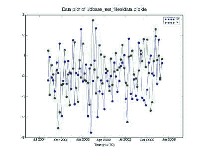
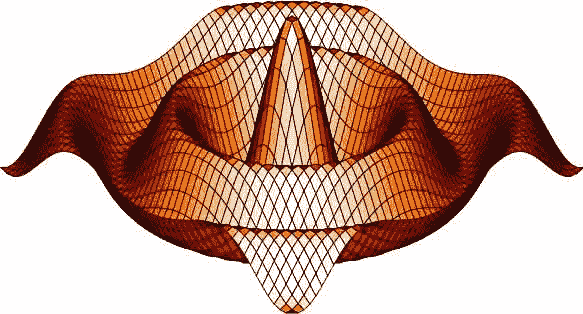

# 二十三、过时内容

*   [数值不可知的 pyrex 类](A_Numerical_Agnostic_Pyrex_Class.html)
*   [数组、结构和派热克斯](ArrayStruct_and_Pyrex.html)
*   [数据帧](DataFrame.html)
*   [Python 映像库](PIL_example.html)
*   [时间序列的秘籍](TimeSeries_FAQ.html)
*   [常见问题](TimeSeries_FAQ.html#faq)
*   [FORTRANfile 类](FortranIO_FortranFile.html)
*   [dbase](dbase.html)
*   xplt

# 一个数值不可知的 pyrex 类

# 一个数值不可知的 pyrex 类

**注**:本条目上次更新时间为 2006-11-04，包含与今天(截至 2013 年)不相关的信息。

## 概观

这里呈现*！NumInd* (数值独立扩展)，一个用 [Pyrex](http://nz.cosc.canterbury.ac.nz/~greg/python/Pyrex/) 编写的类的例子。这个类可以包装来自 Numeric、numarray 或！NumPy 不依赖这些包来编译扩展。它允许您在 Python 和 C 空间中创建统一的接口。此外，您可以通过添加新方法或属性对其进行个性化设置。

为了让这个扩展工作，你需要一个支持[数组接口](http://numpy.scipy.org/array_interface.shtml)的数值包。这些版本中的任何一个都足够好:

[*](#id1) NumPy(所有版本) [*](#id3) 数字(>= 24.2)* numray(>= 1 . 5 . 1)

## NumInd:一个数值独立的基于 Pyrex 的扩展

那个！下面显示的 Numeric 类接受一个 Numeric/numarray/！NumPy 对象，并创建另一个可以从 Python 和 Pyrex(因此也是 C)空间以统一方式访问的对象。此外，它公开了一个数组接口，以便您可以用任何 Numeric/numarray/！NumPy。所有这些功能都是在不实际复制数据本身的情况下实现的。这为开发支持 Numeric/numarray/！NumPy 三元组，无需针对其中任何一个进行编译。

**警告**:这个类主要支持同构数据集，但是也不难支持重数组。这是一项正在进行的工作。

```py
# This Pyrex extension class can take a numpy/numarray/Numeric object
# as a parameter and wrap it so that its information can be accessed
# in a standard way, both in Python space and C space.
#
# Heavily based on an idea of Andrew Straw. See
# http://www.scipy.org/Cookbook/ArrayStruct_and_Pyrex
# Very inspiring! :-)
#
# First version: 2006-03-25
# Last update: 2006-03-25
# Author: Francesc Altet

import sys

cdef extern from "Python.h":
    ctypedef int Py_intptr_t
    long PyInt_AsLong(object)
    void Py_INCREF(object)
    void Py_DECREF(object)
    object PyCObject_FromVoidPtrAndDesc(void* cobj, void* desc,
                                        void (*destr)(void *, void *))

cdef extern from "stdlib.h":
    ctypedef long size_t
    ctypedef long intptr_t
    void *malloc(size_t size)
    void free(void* ptr)

# for PyArrayInterface:
CONTIGUOUS=0x01
FORTRAN=0x02
ALIGNED=0x100
NOTSWAPPED=0x200
WRITEABLE=0x400

# byteorder dictionary
byteorder = {'<':'little', '>':'big'}

ctypedef struct PyArrayInterface:
    int version          # contains the integer 2 as a sanity check
    int nd               # number of dimensions
    char typekind        # kind in array --- character code of typestr
    int itemsize         # size of each element
    int flags            # flags indicating how the data should be interpreted
    Py_intptr_t *shape   # A length-nd array of shape information
    Py_intptr_t *strides # A length-nd array of stride information
    void *data           # A pointer to the first element of the array

cdef void free_array_interface(void *ptr, void *arr):
    arrpy = <object>arr
    Py_DECREF(arrpy)

cdef class NumInd:
    cdef void *data
    cdef int _nd
    cdef Py_intptr_t *_shape, *_strides
    cdef PyArrayInterface *inter
    cdef object _t_shape, _t_strides, _undarray

    def __init__(self, object undarray):
        cdef int i, stride
        cdef object array_shape, array_strides

        # Keep a reference to the underlying object
        self._undarray = undarray
        # Get the shape and strides C arrays
        array_shape = undarray.__array_shape__
        self._t_shape = array_shape
        # The number of dimensions
        self._nd = len(array_shape)
        # The shape
        self._shape = <Py_intptr_t *>malloc(self._nd*sizeof(Py_intptr_t))
        for i from 0 <= i < self._nd:
            self._shape[i] = self._t_shape[i]
        # The strides (compute them if needed)
        array_strides = undarray.__array_strides__
        self._t_strides = array_strides
        self._strides = <Py_intptr_t *>malloc(self._nd*sizeof(Py_intptr_t))
        if array_strides:
            for i from 0 <= i < self._nd:
                self._strides[i] = array_strides[i]
        else:
            # strides is None. Compute them explicitely.
            self._t_strides = [0] * self._nd
            stride = int(self.typestr[2:])
            for i from self._nd > i >= 0:
                self._strides[i] = stride
                self._t_strides[i] = stride
                stride = stride * array_shape[i]
            self._t_strides = tuple(self._t_strides)
        # Populate the C array interface
        self.inter = self._get_array_interface()

    # Properties. This are visible from Python space.
    # Add as many as you want.

    property undarray:  # Returns the underlying array
        def __get__(self):
            return self._undarray

    property shape:
        def __get__(self):
            return self._t_shape

    property strides:
        def __get__(self):
            return self._t_strides

    property typestr:
        def __get__(self):
            return self._undarray.__array_typestr__

    property readonly:
        def __get__(self):
            return self._undarray.__array_data__[1]

    property __array_struct__:
        "Allows other numerical packages to obtain a new object."
        def __get__(self):
            if hasattr(self._undarray, "__array_struct__"):
                return self._undarray.__array_struct__
            else:
                # No an underlying array with __array_struct__
                # Deliver an equivalent PyCObject.
                Py_INCREF(self)
                return PyCObject_FromVoidPtrAndDesc(<void*>self.inter,
                                                    <void*>self,
                                                    free_array_interface)

    cdef PyArrayInterface *_get_array_interface(self):
        "Populates the array interface"
        cdef PyArrayInterface *inter
        cdef object undarray, data_address, typestr

        undarray = self._undarray
        typestr = self.typestr
        inter = <PyArrayInterface *>malloc(sizeof(PyArrayInterface))
        if inter is NULL:
            raise MemoryError()

        inter.version = 2
        inter.nd = self._nd
        inter.typekind = ord(typestr[1])
        inter.itemsize = int(typestr[2:])
        inter.flags = 0  # initialize flags
        if typestr[0] == '|':
            inter.flags = inter.flags | NOTSWAPPED
        elif byteorder[typestr[0]] == sys.byteorder:
            inter.flags = inter.flags | NOTSWAPPED
        if not self.readonly:
            inter.flags = inter.flags | WRITEABLE
        # XXX how to determine the ALIGNED flag?
        inter.strides = self._strides
        inter.shape = self._shape
        # Get the data address
        data_address = int(undarray.__array_data__[0], 16)
        inter.data = <void*>PyInt_AsLong(data_address)
        return inter

    # This is just an example on how to modify the data in C space
    # (and at C speed! :-)
    def modify(self):
        "Modify the values of the underlying array"
        cdef int *data, i

        data = <int *>self.inter.data
        # Modify just the first row
        for i from 0 <= i < self.inter.shape[self.inter.nd-1]:
            data[i] = data[i] + 1

    def __dealloc__(self):
        free(self._shape)
        free(self._strides)
        free(self.inter) 
```

## 使用示例

为了了解上述扩展提供了什么，请尝试针对！数字思维扩展:

```py
import Numeric
import numarray
import numpy
import numind

# Create an arbitrary object for each package
nu=Numeric.arange(12)
nu.shape = (4,3)
na=numarray.arange(12)
na.shape = (4,3)
np=numpy.arange(12)
np.shape = (4,3)

# Wrap the different objects with the NumInd class
# and execute some actions on it
for obj in [nu, na, np]:
    ni = numind.NumInd(obj)
    print "original object type-->", type(ni.undarray)
    # Print some values
    print "typestr -->", ni.typestr
    print "shape -->", ni.shape
    print "strides -->", ni.strides
    npa = numpy.asarray(ni)
    print "object after a numpy re-wrapping -->", npa
    ni.modify()
    print "object after modification in C space -->", npa 
```

您可以在这里查看 [`test_output.txt`](../_downloads/test_output.txt) 的输出

## 请参见

*   ["Cookbook/Pyrex_and_NumPy"]
*   [“秘籍/array struct _ and _ Pyrex”](鼓舞人心的秘籍)

## 附件

*   [`test_output.txt`](../_downloads/test_output.txt)

# 数组、结构和派热克斯

# 数组、结构和派热克斯

**注**:本条目上一次更新是 2007-11-18，可能包含今天(截至 2013 年)不太相关的信息。

## 概观

[Pyrex](http://nz.cosc.canterbury.ac.nz/~greg/python/Pyrex/) 是一种为 Python 编写 C 扩展的语言。它的语法与编写 Python 非常相似。一个文件被编译成一个文件，然后像 Python 的标准 C 扩展模块一样被编译。许多人发现用 Pyrex 编写扩展模块比用 C 语言或使用其他工具(如 SWIG)更可取。

界面说明见[http://numeric.scipy.org/](http://numeric.scipy.org/)。以下软件包支持该接口:

[*](#id1) ！NumPy(所有版本) [*](#id3) 数字(>= 24.2)* numray(>= 1 . 5 . 0)

## 共享由基于 Pyrex 的扩展处理的数据

这是一个 Pyrex 文件，显示了如何使用数组接口导出它的数据。这允许各种 Python 类型查看数据，而无需实际复制数据本身。

```py
cdef extern from "Python.h":
    ctypedef int Py_intptr_t
    void Py_INCREF(object)
    void Py_DECREF(object)
    object PyCObject_FromVoidPtrAndDesc( void* cobj, void* desc, void (*destr)(void *, void *))

cdef extern from "stdlib.h":
    ctypedef int size_t
    ctypedef long intptr_t
    void *malloc(size_t size)
    void free(void* ptr)

# for PyArrayInterface:
CONTIGUOUS=0x01
FORTRAN=0x02
ALIGNED=0x100
NOTSWAPPED=0x200
WRITEABLE=0x400

ctypedef struct PyArrayInterface:
    int version          # contains the integer 2 as a sanity check
    int nd               # number of dimensions
    char typekind        # kind in array --- character code of typestr
    int itemsize         # size of each element
    int flags            # flags indicating how the data should be interpreted
    Py_intptr_t *shape   # A length-nd array of shape information
    Py_intptr_t *strides # A length-nd array of stride information
    void *data           # A pointer to the first element of the array

cdef void free_array_interface( void* ptr, void *arr ):
    cdef PyArrayInterface* inter

    inter = <PyArrayInterface*>ptr
    arrpy = <object>arr
    Py_DECREF( arrpy )
    free(inter)

ctypedef unsigned char fi
ctypedef fi* fiptr
cdef class Unsigned8Buf:
    cdef fiptr data
    cdef Py_intptr_t shape[2]
    cdef Py_intptr_t strides[2]

    def __init__(self, int width, int height):
        cdef int bufsize
        bufsize = width*height*sizeof(fi)
        self.data=<fiptr>malloc( bufsize )
        if self.data==NULL: raise MemoryError("Error allocating memory")
        self.strides[0]=width
        self.strides[1]=1 # 1 byte per element

        self.shape[0]=height
        self.shape[1]=width

    def __dealloc__(self):
            free(self.data)

    property __array_struct__:
        def __get__(self):
            cdef PyArrayInterface* inter

            cdef Py_intptr_t *newshape   # A length-nd array of shape information
            cdef Py_intptr_t *newstrides # A length-nd array of stride information
            cdef int nd

            nd = 2

            inter = <PyArrayInterface*>malloc( sizeof( PyArrayInterface ) )
            if inter is NULL:
                raise MemoryError()

            inter.version = 2
            inter.nd = nd
            inter.typekind = 'u'[0] # unsigned int
            inter.itemsize = 1
            inter.flags = NOTSWAPPED | ALIGNED | WRITEABLE
            inter.strides = self.strides
            inter.shape = self.shape
            inter.data = self.data
            Py_INCREF(self)
            obj = PyCObject_FromVoidPtrAndDesc( <void*>inter, <void*>self, free_array_interface)
            return obj 
```

## 使用基于 Pyrex 的扩展在其他地方处理的数据

一个例子是[mot 相机实用程序](http://code.astraw.com/projects/motmot)软件中 [*cam* iface_shm.pyx](http://code.astraw.com/projects/motmot/browser/trunk/cam_iface/src/_cam_iface_shm.pyx) 的 get_data_copy()函数。在此使用示例中，图像从共享内存复制到支持{{ **array_struct** }}接口的外部 malloced 缓冲区。(共享内存的东西只在 linux 上测试过，但其余的应该可以在任何地方工作。)

## 请参见

*   ["Cookbook/Pyrex_and_NumPy"]

# 数据帧

# 数据帧

> **注**:此条目已过期。你可能会想用[熊猫](http://pandas.pydata.org/)来代替。

安德鲁·斯特劳在 scipy 用户邮件列表[原始链接](http://thread.gmane.org/gmane.comp.python.scientific.user/6860)上发布的 [`DataFrame.py`](../_downloads/DataFrame.py) 类是一个非常有用的工具，可以使用数据库中常见的字母数字表格数据。一些可能被吸收到数据框中的数据可以是:| |**ID**|**LOCATION**|**VAL _ 1**|**VAL _ 2**| | 01 | |某地| | 0.1 | | 0.6 | | | 02 | |其他地方| | 0.2 | | 0.5 | | | 03 | |其他地方|| 0.3 || 0.4 ||

[`DataFrame.py`](../_downloads/DataFrame.py) 类可以从 CSV 文件的数据中填充(以命令分隔的值)。在当前的实现中，这些文件是用 Python 自己的 CSV 模块读取的，这允许大量的定制。

## 示例用法

Access2000 中的一个示例文件 CSV 文件位于 [`CSVSample.csv`](../_downloads/CSVSample.csv) 我们首先导入模块:

```py
import DataFrame 
```

并使用我们想要的 CVS 方言读取文件:

```py
df = DataFrame.read_csv("CSVSample.csv",dialect=DataFrame.access2000) 
```

(请注意，方言实际上是在 DataFrame 类中定义的)。根据某种标准过滤数据通常是有用的。

## 与 Python 2.6 及以上版本的兼容性

从 Python 2.6 开始，set 模块被弃用，为了消除警告，请替换

```py
imports sets 
```

随着

```py
try:
    set
except NameError:
    from sets import Set as set 
```

## 附件

*   [`CSVSample.csv`](../_downloads/CSVSample.csv)
*   [`DataFrame.py`](../_downloads/DataFrame.py)
*   [`SampleCSV.csv`](../_downloads/SampleCSV.csv)

# Python 图像库

# Python 图像库

`(!) see also [:Cookbook/Matplotlib/LoadImage] to load a PNG image`

应用此补丁使 PIL 图像对象既能导出又能使用数组接口(来自 Travis Oliphant):

```py
Index: PIL/Image.py
===================================================================
--- PIL/Image.py    (revision 358)
+++ PIL/Image.py    (working copy)
@@ -187,6 +187,42 @@

 }

+if sys.byteorder == 'little':
+    _ENDIAN = '<'
+else:
+    _ENDIAN = '>'
+
+_MODE_CONV = {
+
+    # official modes
+    "1": ('|b1', None),
+    "L": ('|u1', None),
+    "I": ('%si4' % _ENDIAN, None),
+    "F": ('%sf4' % _ENDIAN, None),
+    "P": ('|u1', None),
+    "RGB": ('|u1', 3),
+    "RGBX": ('|u1', 4),
+    "RGBA": ('|u1', 4),
+    "CMYK": ('|u1', 4),
+    "YCbCr": ('|u1', 4),
+
+    # Experimental modes include I;16, I;16B, RGBa, BGR;15,
+    # and BGR;24\.  Use these modes only if you know exactly
+    # what you're doing...
+
+}
+
+def _conv_type_shape(im):
+    shape = im.size[::-1]
+    typ, extra = _MODE_CONV[im.mode]
+    if extra is None:
+        return shape, typ
+    else:
+        return shape+(extra,), typ
+
+
+
+
 MODES = _MODEINFO.keys()
 MODES.sort()

@@ -491,6 +527,22 @@
         return string.join(data, "")

     ##
+    # Returns the array_interface dictionary
+    #
+    # @return A dictionary with keys 'shape', 'typestr', 'data'
+
+    def __get_array_interface__(self):
+        new = {}
+        shape, typestr = _conv_type_shape(self)
+        new['shape'] = shape
+        new['typestr'] = typestr
+        new['data'] = self.tostring()
+        return new
+
+    __array_interface__ = property(__get_array_interface__, None, doc="array interface")
+
+
+    ##
     # Returns the image converted to an X11 bitmap.  This method
     # only works for mode "1" images.
     #
@@ -1749,7 +1801,61 @@

     return apply(fromstring, (mode, size, data, decoder_name, args))

+
 ##
+# (New in 1.1.6) Create an image memory from an object exporting
+#  the array interface (using the buffer protocol).
+#
+#  If obj is not contiguous, then the tostring method is called
+#  and frombuffer is used
+#
+# @param obj Object with array interface
+# @param mode Mode to use (will be determined from type if None)
+
+def fromarray(obj, mode=None):
+    arr = obj.__array_interface__
+    shape = arr['shape']
+    ndim = len(shape)
+    try:
+        strides = arr['strides']
+    except KeyError:
+        strides = None
+    if mode is None:
+        typestr = arr['typestr']
+        if not (typestr[0] == '|' or typestr[0] == _ENDIAN or
+                typestr[1:] not in ['u1', 'b1', 'i4', 'f4']):
+            raise TypeError, "cannot handle data-type"
+        typestr = typestr[:2]
+        if typestr == 'i4':
+            mode = 'I'
+        elif typestr == 'f4':
+            mode = 'F'
+        elif typestr == 'b1':
+            mode = '1'
+        elif ndim == 2:
+            mode = 'L'
+        elif ndim == 3:
+            mode = 'RGB'
+        elif ndim == 4:
+            mode = 'RGBA'
+        else:
+            raise TypeError, "Do not understand data."
+    ndmax = 4
+    bad_dims=0
+    if mode in ['1','L','I','P','F']:
+        ndmax = 2
+    elif mode == 'RGB':
+        ndmax = 3
+    if ndim > ndmax:
+        raise ValueError, "Too many dimensions."
+
+    size = shape[:2][::-1]
+    if strides is not None:
+        obj = obj.tostring()
+
+    return frombuffer(mode, size, obj)
+
+##
 # Opens and identifies the given image file.
 # <p>
 # This is a lazy operation; this function identifies the file, but the 
```

## 例子

```py
>>> import Image
>>> im=Image.open('foo1.png')
>>> a=numpy.array(p)
# do something with a ...
>>> im = Image.fromarray(a)
>>> im.save( 'foo2.png' ) 
```

# 时间序列的秘籍

# 时间序列的秘籍

注:官方文档和开发者的重要评论可在 [timseries scikit sourceforge 页面](http://pytseries.sourceforge.net)找到。

# FortranFile 类

# FortranFile 类

> **注意**:你可能想用 [scipy.io.FortranFile](http://docs.scipy.org/doc/scipy/reference/generated/scipy.io.FortranFile.html) 代替。

这个文件子类旨在简化 Fortran 无格式二进制文件的读取，这些文件通常以基于记录的格式保存。

```py
# Copyright 2008, 2009 Neil Martinsen-Burrell
#
# Permission is hereby granted, free of charge, to any person obtaining a copy
# of this software and associated documentation files (the "Software"), to deal
# in the Software without restriction, including without limitation the rights
# to use, copy, modify, merge, publish, distribute, sublicense, and/or sell
# copies of the Software, and to permit persons to whom the Software is
# furnished to do so, subject to the following conditions:

# The above copyright notice and this permission notice shall be included in
# all copies or substantial portions of the Software.

# THE SOFTWARE IS PROVIDED "AS IS", WITHOUT WARRANTY OF ANY KIND, EXPRESS OR
# IMPLIED, INCLUDING BUT NOT LIMITED TO THE WARRANTIES OF MERCHANTABILITY,
# FITNESS FOR A PARTICULAR PURPOSE AND NONINFRINGEMENT. IN NO EVENT SHALL THE
# AUTHORS OR COPYRIGHT HOLDERS BE LIABLE FOR ANY CLAIM, DAMAGES OR OTHER
# LIABILITY, WHETHER IN AN ACTION OF CONTRACT, TORT OR OTHERWISE, ARISING FROM,
# OUT OF OR IN CONNECTION WITH THE SOFTWARE OR THE USE OR OTHER DEALINGS IN
# THE SOFTWARE.

"""Defines a file-derived class to read/write Fortran unformatted files.

The assumption is that a Fortran unformatted file is being written by
the Fortran runtime as a sequence of records.  Each record consists of
an integer (of the default size [usually 32 or 64 bits]) giving the
length of the following data in bytes, then the data itself, then the
same integer as before.

Examples
--------

To use the default endian and size settings, one can just do::
 >>> f = FortranFile('filename')
 >>> x = f.readReals()

One can read arrays with varying precisions::
 >>> f = FortranFile('filename')
 >>> x = f.readInts('h')
 >>> y = f.readInts('q')
 >>> z = f.readReals('f')
Where the format codes are those used by Python's struct module.

One can change the default endian-ness and header precision::
 >>> f = FortranFile('filename', endian='>', header_prec='l')
for a file with little-endian data whose record headers are long
integers.
"""

__docformat__ = "restructuredtext en"

import struct
import numpy

class FortranFile(file):

    """File with methods for dealing with fortran unformatted data files"""

    def _get_header_length(self):
        return struct.calcsize(self._header_prec)
    _header_length = property(fget=_get_header_length)

    def _set_endian(self,c):
        """Set endian to big (c='>') or little (c='<') or native (c='@')

 :Parameters:
 `c` : string
 The endian-ness to use when reading from this file.
 """
        if c in '<>@=':
            self._endian = c
        else:
            raise ValueError('Cannot set endian-ness')
    def _get_endian(self):
        return self._endian
    ENDIAN = property(fset=_set_endian,
                      fget=_get_endian,
                      doc="Possible endian values are '<', '>', '@', '='"
                     )

    def _set_header_prec(self, prec):
        if prec in 'hilq':
            self._header_prec = prec
        else:
            raise ValueError('Cannot set header precision')
    def _get_header_prec(self):
        return self._header_prec
    HEADER_PREC = property(fset=_set_header_prec,
                           fget=_get_header_prec,
                           doc="Possible header precisions are 'h', 'i', 'l', 'q'"
                          )

    def __init__(self, fname, endian='@', header_prec='i', *args, **kwargs):
        """Open a Fortran unformatted file for writing.

 Parameters
 ----------
 endian : character, optional
 Specify the endian-ness of the file.  Possible values are
 '>', '<', '@' and '='.  See the documentation of Python's
 struct module for their meanings.  The deafult is '>' (native
 byte order)
 header_prec : character, optional
 Specify the precision used for the record headers.  Possible
 values are 'h', 'i', 'l' and 'q' with their meanings from
 Python's struct module.  The default is 'i' (the system's
 default integer).

 """
        file.__init__(self, fname, *args, **kwargs)
        self.ENDIAN = endian
        self.HEADER_PREC = header_prec

    def _read_exactly(self, num_bytes):
        """Read in exactly num_bytes, raising an error if it can't be done."""
        data = ''
        while True:
            l = len(data)
            if l == num_bytes:
                return data
            else:
                read_data = self.read(num_bytes - l)
            if read_data == '':
                raise IOError('Could not read enough data.'
                              '  Wanted %d bytes, got %d.' % (num_bytes, l))
            data += read_data

    def _read_check(self):
        return struct.unpack(self.ENDIAN+self.HEADER_PREC,
                             self._read_exactly(self._header_length)
                            )[0]

    def _write_check(self, number_of_bytes):
        """Write the header for the given number of bytes"""
        self.write(struct.pack(self.ENDIAN+self.HEADER_PREC,
                               number_of_bytes))

    def readRecord(self):
        """Read a single fortran record"""
        l = self._read_check()
        data_str = self._read_exactly(l)
        check_size = self._read_check()
        if check_size != l:
            raise IOError('Error reading record from data file')
        return data_str

    def writeRecord(self,s):
        """Write a record with the given bytes.

 Parameters
 ----------
 s : the string to write

 """
        length_bytes = len(s)
        self._write_check(length_bytes)
        self.write(s)
        self._write_check(length_bytes)

    def readString(self):
        """Read a string."""
        return self.readRecord()

    def writeString(self,s):
        """Write a string

 Parameters
 ----------
 s : the string to write

 """
        self.writeRecord(s)

    _real_precisions = 'df'

    def readReals(self, prec='f'):
        """Read in an array of real numbers.

 Parameters
 ----------
 prec : character, optional
 Specify the precision of the array using character codes from
 Python's struct module.  Possible values are 'd' and 'f'.

 """

        _numpy_precisions = {'d': numpy.float64,
                             'f': numpy.float32
                            }

        if prec not in self._real_precisions:
            raise ValueError('Not an appropriate precision')

        data_str = self.readRecord()
        num = len(data_str)/struct.calcsize(prec)
        numbers =struct.unpack(self.ENDIAN+str(num)+prec,data_str)
        return numpy.array(numbers, dtype=_numpy_precisions[prec])

    def writeReals(self, reals, prec='f'):
        """Write an array of floats in given precision

 Parameters
 ----------
 reals : array
 Data to write
 prec` : string
 Character code for the precision to use in writing
 """
        if prec not in self._real_precisions:
            raise ValueError('Not an appropriate precision')

        # Don't use writeRecord to avoid having to form a
        # string as large as the array of numbers
        length_bytes = len(reals)*struct.calcsize(prec)
        self._write_check(length_bytes)
        _fmt = self.ENDIAN + prec
        for r in reals:
            self.write(struct.pack(_fmt,r))
        self._write_check(length_bytes)

    _int_precisions = 'hilq'

    def readInts(self, prec='i'):
        """Read an array of integers.

 Parameters
 ----------
 prec : character, optional
 Specify the precision of the data to be read using
 character codes from Python's struct module.  Possible
 values are 'h', 'i', 'l' and 'q'

 """
        if prec not in self._int_precisions:
            raise ValueError('Not an appropriate precision')

        data_str = self.readRecord()
        num = len(data_str)/struct.calcsize(prec)
        return numpy.array(struct.unpack(self.ENDIAN+str(num)+prec,data_str))

    def writeInts(self, ints, prec='i'):
        """Write an array of integers in given precision

 Parameters
 ----------
 reals : array
 Data to write
 prec : string
 Character code for the precision to use in writing
 """
        if prec not in self._int_precisions:
            raise ValueError('Not an appropriate precision')

        # Don't use writeRecord to avoid having to form a
        # string as large as the array of numbers
        length_bytes = len(ints)*struct.calcsize(prec)
        self._write_check(length_bytes)
        _fmt = self.ENDIAN + prec
        for item in ints:
            self.write(struct.pack(_fmt,item))
        self._write_check(length_bytes) 
```

# dbase

# dbase

> **注**:你可能要用[熊猫](http://pandas.pydata.org/)来代替这个。

`dbase.py`类，可用于读取/写入/汇总/绘制时间序列数据。

要总结功能:

1.  存储在字典中的数据和变量名-可使用变量名访问
2.  加载/保存自/至 csv/pickle 格式，包括日期信息(将添加搁置格式)
3.  绘图和描述性统计数据，如果提供了日期
4.  添加/删除变量，包括趋势/(季节性)模型
5.  基于日期或其他变量值选择观察值(例如> 1/1/2003)
6.  复制实例数据

另附 [`dbase_pydoc.txt`](../_downloads/dbase_pydoc.0.2.txt) 班级资料。

## 示例用法

要查看正在运行的类，请下载文件并运行它(python dbase.py)。这将创建一个示例数据文件()。/dbase_test_files/data.csv)，该类将对其进行处理。

要导入模块，请执行以下操作:

```py
import sys
sys.path.append('attachments/dbase')
import dbase 
```

运行该类后，可以使用加载示例数据

```py
data = dbase.dbase("attachments/dbase/data.csv", date = 0) 
```

在上面的命令中，“0”是包含日期的列的索引。

您可以使用在文件中绘制系列“b”和“c”

```py
data.dataplot('b','c') 
```



您可以通过使用获得系列“a”、“b”和“c”的描述性统计数据

```py
data.info('a','b','c') 
```

```py
 ==============================================================================
 ============================ Database information ============================
 ==============================================================================

 file:                               /mnt/data/pauli/prj/scipy/SciPy-CookBook/ipython/attachments/dbase/data.csv
 # obs:                              100
 # variables:                3
 Start date:                 08 Jan 2001
 End date:                   02 Dec 2002

 var                         min                     max                     mean            std.dev         miss    levels
 ==============================================================================
 a                           -2.56            3.35           -0.08            1.08            0
 b                           -2.00            2.16           -0.02            0.98            0
 c                           -1.91            2.54            0.18            0.93            0 
```

## 附件

*   [`data.csv`](../_downloads/data.csv)
*   [`dbase.py`](../_downloads/dbase.py)
*   [`dbase_pydoc.0.2.txt`](../_downloads/dbase_pydoc.0.2.txt)
*   [`ex_plot.0.1.png`](../_downloads/ex_plot.0.1.jpg)


# xplt

# xplt

这展示了一个如何使用 xplt 创建快速三维表面可视化的简单示例。

```py
from scipy.sandbox import xplt
from numpy import *
from scipy import special

x,y = ogrid[-12:12:50j,-12:12:50j]
r = sqrt(x**2+y**2)
z = special.j0(r)
xplt.surf(z,x,y,shade=1,palette='heat') 
```

## 附件

*   [`surface.png`](../_downloads/surface1.jpg)

