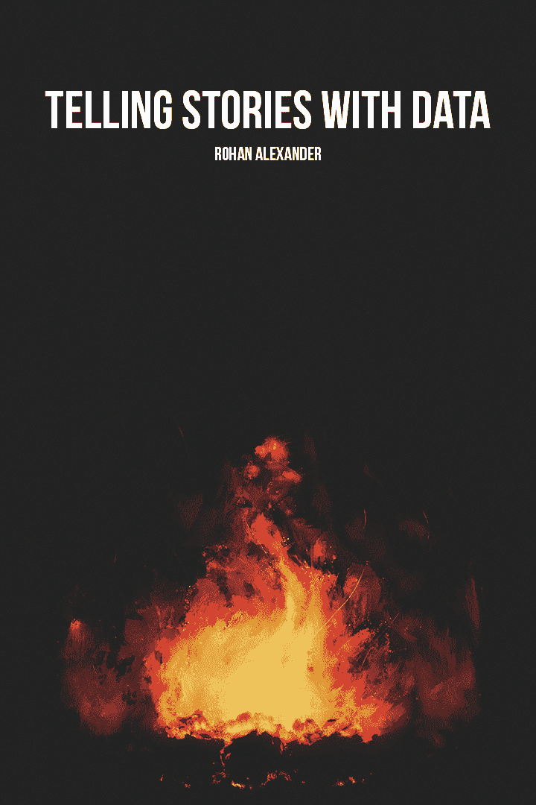

# 用数据讲故事

> 原文：[`tellingstorieswithdata.com/index.html`](https://tellingstorieswithdata.com/index.html)

带有 R 和 Python 应用

作者

罗汉·亚历山大

出版

2023 年 7 月 27 日

*Chapman and Hall/CRC 于 2023 年 7 月出版了这本书。您可以在[这里](https://www.routledge.com/Telling-Stories-with-Data-With-Applications-in-R/Alexander/p/book/9781032134772)购买。*

这个在线版本对印刷版进行了一些更新。匹配印刷版的在线版本可在[这里](https://rohanalexander.github.io/telling_stories-published/)找到。

> 这本干净有趣的书籍涵盖了统计沟通、编程和建模的广泛主题，以这种方式，它应该是对任何统计学课程或自学计划的有用补充。我绝对喜欢这本书！
> 
> **安德鲁·格尔曼**，哥伦比亚大学，以及《回归及其他故事》（[Regression and Other Stories](https://avehtari.github.io/ROS-Examples/)）的作者
> 
> 一本优秀的书。在统计学中，沟通和可重复性越来越受到关注，这本书以实用、吸引人且真正独特的方式涵盖了这些主题以及更多内容。
> 
> **丹妮拉·维滕**，华盛顿大学，以及《统计学习导论》（[An Introduction to Statistical Learning](https://www.statlearning.com)）的作者
> 
> 许多数据科学文本告诉你如何进行例行计算。相反，*用数据讲故事* 告诉你如何参与分析和思维过程。通过为学生提供在意义构建和讲故事中使用数据的计算、统计和哲学技能，这本书在众多书籍中脱颖而出，具有独特的可操作性和赋权性。
> 
> **艾米丽·里德勒**，Capital One，以及《R Markdown 烹饪书》（[R Markdown Cookbook](https://bookdown.org/yihui/rmarkdown-cookbook/)）的作者
> 
> *用数据讲故事* 是一本关于使用数据学习和产生积极变化的深思熟虑的指南。本书涵盖了过程的每个阶段，可以成为许多数据科学家和未来数据故事讲述者的长期伴侣。
> 
> **克里斯托弗·彼得斯**，Zapier
> 
> 这不是另一本统计学书籍。它比那更好。这是一本关于进行定量研究、关于科学论证、关于质量控制、关于沟通和认识论谦卑的书籍。它是任何方法课程的有价值补充，也适用于自学者。
> 
> **理查德·麦克雷思**，马克斯·普朗克进化人类学研究所，以及《统计重思》（[Statistical Rethinking](https://xcelab.net/rm/statistical-rethinking/)）的作者
> 
> 一个聪明的职业选择是选择一个你的技能与增长资源相辅相成的领域。在未来的几十年里，那些擅长数据分析的人将蓬勃发展。这意味着处理统计数据和讲述引人入胜的故事。罗汉·亚历山大的书将帮助你做到这两点。
> 
> **安德鲁·利奇**，澳大利亚国会议员，著有[随机主义者：激进研究者如何改变我们的世界](https://yalebooks.yale.edu/book/9780300236125/randomistas/)
> 
> 每个数据分析人员都必须用数据讲故事，然而传统的教科书只关注统计方法。*用数据讲故事*教授整个数据科学工作流程，包括数据获取、沟通和可重复性。我强烈推荐这本独特的书籍！
> 
> **今井耕介**，哈佛大学，著有[定量社会科学：导论](https://press.princeton.edu/books/quantitative-social-science)
> 
> 这是一本非凡的、精彩的书籍，充满了对任何开始从事数据科学的人的明智建议。将概念和代码混合在一起意味着这些想法立即变得具体，而强调可重复的工作流程为快速发展的领域带来了受欢迎的严谨性。
> 
> **大卫·斯皮格尔哈尔特爵士**，剑桥大学，著有[统计学艺术](https://dspiegel29.github.io/ArtofStatistics/)
> 
> 用数据讲述（真实）故事不仅仅是需要花哨的统计模型和大数据。通过一系列引人入胜的案例研究，罗汉·亚历山大教导我们如何提出好的问题、获取数据、估计模型以及传达我们的结果。这种整体方法用清晰而引人入胜的文风进行解释。书中充满了详细的 R 语言示例，强调了透明度和可重复性的重要性。我非常喜欢这本书，并推荐给我的所有学生。
> 
> **文森特·阿雷尔-邦德克**，蒙特利尔大学，著有[因果分析与定量方法](https://www.leslibraires.ca/livres/analyse-causale-et-methodes-quantitatives-une-vincent-arel-bundock-9782760643215.html)

# 前言

这本书将帮助你用数据讲故事。它为你建立了一个基础，你可以根据你观察到的数据构建和分享你对世界某个方面的知识。在篝火旁的小组中讲故事在人类和社会的发展中发挥了关键作用（Wiessner 2014）。今天，基于数据的我们的故事可以影响数百万人。

在这本书中，我们将探索、探究、推动、操作、揉捏，最终尝试理解数据的意义。这本书的选择受到多种特性的驱动。

我获得博士学位的大学的座右铭是*naturam primum cognoscere rerum*，或者说大致是“首先了解事物的本质”。但原始引言继续说*temporis aeterni quoniam*，或者说大致是“为了永恒的时间”。我们将做这两件事。我专注于工具、方法和工作流程，这些可以帮助你建立持久和可重复的知识。

当我在这本书中谈到数据时，通常是指与人类相关的数据。人类将是大多数故事的核心，我们将讲述社会、文化和经济故事。特别是，在这本书中，我将关注社会现象和数据中的不平等。许多数据分析反映了现实世界。许多最贫困的人在这方面面临双重负担：他们不仅处于不利地位，而且这种程度更难以衡量。尊重那些数据在我们的数据集中的个人是我们首要关注的问题，同样重要的是考虑那些系统地不在我们的数据集中的人。

虽然数据通常特定于各种背景和学科，但用于理解它们的途径往往相似。数据也越来越全球化，资源和服务来自各种来源。因此，我借鉴了来自许多学科和地理区域的例子。

要成为知识，我们的发现必须被传达给、被理解和被信任。科学和经济进步只能建立在他人工作的基础上。而且，这只有在我们能理解他们做了什么的情况下才可能。同样，如果我们想要创造关于世界的知识，我们必须使其他人能够理解我们确切地做了什么，我们发现了什么，以及我们如何进行任务。因此，在这本书中，我将特别强调沟通和可重复性。

提高定量工作的质量是一个巨大的挑战，但这是我们这个时代的挑战。数据无处不在，但很少有持久的知识被创造出来。这本书希望以某种方式为改变这一现状做出贡献。

## 读者和假设背景

阅读这本书的典型读者对一年级本科生统计学有一定了解，例如他们已经运行过回归分析。但本书的目标不是针对特定水平，而是提供与几乎所有定量课程相关的方面。我在本科生、研究生和专业水平上使用过这本书。每个人的需求都是独特的，但希望这本书的某些方面能引起你的共鸣。

热情和兴趣已经帮助人们走得很远。如果你有这些，那么就不用担心太多其他的事情。一些最成功的学生没有任何定量或编码背景。

这本书涵盖了广泛的领域，但不对任何特定方面进行深入探讨。因此，它特别适合与更详细的书籍相辅相成，例如：*数据科学：第一次介绍* (Timbers, Campbell, and Lee 2022)，*R for Data Science* ([Wickham, Çetinkaya-Rundel, and Grolemund [2016] 2023](99-references.html#ref-r4ds))，*统计学习导论* ([James et al. [2013] 2021](99-references.html#ref-islr))，和*统计重思* ([McElreath [2015] 2020](99-references.html#ref-citemcelreath))。如果你对那些书籍感兴趣，那么这本书可能是一个好的起点。

## 结构与内容

本书分为六个部分：I) 基础，II) 沟通，III) 获取，IV) 准备，V) 模型，和 VI) 应用。

第一部分——基础——从 1  用数据讲故事开始，概述了本书试图达成的目标和为什么你应该阅读它。2  喝消防水通过三个工作示例进行讲解。这些示例的目的是让你能够体验本书推荐的完整工作流程，而无需过多关注具体细节。该工作流程是：计划、模拟、获取、建模和沟通。通常情况下，你一开始可能不会完全理解本章内容，但你应该阅读它，亲自输入并执行代码。如果你只有时间阅读本书的一章，那么我推荐这一章。3  可复现的工作流程介绍了我在工作流程中倡导的一些关键工具，用于实现可复现性。这些工具包括 Quarto、R 项目、Git 和 GitHub，以及在实践中使用 R。

第二部分——沟通——考虑书面和静态沟通。4  写研究详细介绍了定量写作应具备的特点以及如何撰写清晰、量化的研究论文。在 5  图表、表格和地图中介绍的静态沟通包括图表、表格和地图等特性。

第三部分——获取——关注将我们的世界转化为数据。6  测量、普查和抽样从测量开始，然后逐步介绍影响我们数据方法的抽样基本概念。接着考虑那些明确为我们提供以供使用的数据集，例如普查和其他政府统计数据。这些通常是干净、文档齐全、预先打包的数据集。7  API、抓取和解析涵盖了使用应用程序编程接口（API）、抓取数据、从 PDF 中获取数据以及光学字符识别（OCR）等方面。其理念是数据是可用的，但并不一定是为了成为数据集而设计的，我们必须去获取它们。最后，8  实验和调查涵盖了需要我们付出更多努力的部分。例如，我们可能需要进行实验、运行 A/B 测试或进行一些调查。

第四部分——准备——涵盖了如何尊重地将原始、未编辑的数据转换成可以探索和分享的形式。9  清理、准备和测试首先详细介绍了在处理数据清理和准备任务时需要遵循的一些原则，然后逐步说明了需要采取的具体步骤和实施的检查。 10  存储和分享专注于存储和检索这些数据集的方法，包括使用 R 数据包和 parquet。接着，它继续讨论了在尽可能广泛地传播数据集的同时，如何尊重基于这些数据集的人。

第五部分——建模——从 11  探索性数据分析开始。这是理解数据集的关键过程，但通常不会出现在最终产品中。这个过程本身就是目的。在 12  线性模型中，介绍了使用线性模型来探索数据。而 13  广义线性模型考虑了广义线性模型，包括逻辑回归、泊松回归和负二项回归。它还介绍了多级建模。

第六部分——应用——提供了建模的三个应用。15  从观察数据中推断因果关系专注于从观察数据中做出因果推断，涵盖了如差异分析、回归间断性和工具变量等方法。16  后分层多级回归介绍了后分层多级回归，这是使用统计模型调整样本以消除已知偏差的过程。17  文本作为数据专注于文本作为数据。

18  结论提供了一些结论性评论，详细说明了一些悬而未决的问题，并建议了一些下一步的行动。

在线附录提供了关键方面，这些方面要么因为页面大小的限制而显得有些难以处理，要么可能需要比印刷书籍合理的更新频率更高。在线附录 A — R 基础介绍了 R 语言中的一些基本任务，这是本书中使用的统计编程语言。它可以作为一个参考章节，一些学生在阅读本书的其他部分时会回过头来查阅它。在线附录 D — 数据集提供了一列可能对评估有用的数据集。本书的核心围绕 Quarto 构建，然而其前身 R Markdown 尚未被淘汰，并且有很多相关材料可用。因此，在线附录 E — R Markdown 包含了 3  可重复工作流程中 Quarto 特定方面的 R Markdown 等效内容。一组论文包含在在线附录 F — 论文中。如果你撰写这些论文，你将在这个对你感兴趣的主题上进行原创研究。尽管开放性研究可能对你来说是新的，但你能够多大程度上：提出自己的问题，使用定量方法来探索它们，以及传达你的发现，这是衡量本书成功与否的标准。在线附录 C — SQL 基础简要概述了 SQL 基础。在线附录 G — 生产考虑了如何使模型估计和预测更广泛地可用。

## 教学法和关键特性

你必须亲自做这项工作。你应该主动地自己阅读材料和代码。金(2000)说“$$a$$mateurs 坐下来等待灵感，我们其他人只是站起来去工作”。不要被动地阅读这本书。我的角色最好由 Hamming([[1997] 2020, 2–3](99-references.html#ref-hamming1996))来描述：

> 我，或者说，只是一个教练。我不能为你跑一英里；最多我只能讨论风格并批评你的。你知道，如果你想从田径课程中获得益处，你就必须跑一英里——因此，你必须仔细思考你在本书中听到和读到的内容，如果它要有效地改变你——这显然是目的所在$\dots$

本书的结构基于一个密集的、12 周的入门课程。它提供了足够的材料，让高级读者感到挑战，同时建立了一个所有读者都应该掌握的核心。典型的课程涵盖了从 13  广义线性模型的大部分内容，然后选择另一个特别感兴趣的章节。但这取决于学生的背景和兴趣。

从 2  像消防水龙带一样汲取知识开始，你将拥有一个工作流程——计划、模拟、获取、建模和沟通——让你能够用数据讲述一个令人信服的故事。在每一章随后的内容中，你将增加这个工作流程的深度。这将使你能够以越来越复杂和可信的方式表达。这个工作流程涵盖了学术界和工业界通常寻求的技能。这些包括：沟通、伦理、可重复性、研究问题开发、数据收集、数据清洗、数据保护和传播、探索性数据分析、统计建模和扩展。

这本书的一个定义性特点是将伦理和公平问题贯穿始终，而不是将它们集中在容易忽视的一章中。这些问题至关重要，但它们的价值可能难以立即看到，因此它们的紧密整合。

这本书的设计目的也是帮助你构建一份可以展示给潜在雇主的个人作品集。如果你想在工业界找工作，那么这可能是你应当做的最重要的事情。罗宾逊和诺利斯（2020, 55）描述了作品集是一系列展示你能做什么的项目集合，并且它能帮助你在求职过程中取得成功。

在小说《最后的武士》（德威特 2000, 326）中，一个角色说：

> [一个]学者应该能够看到段落中的任何单词，并立刻想到另一个段落中它出现的地方；$\dots$ [因此]文本就像一艘冰山，每个单词都是一个雪峰，下面隐藏着巨大的冰冻的交叉引用。

以类似的方式，这本书不仅提供了自包含的文本和指导，还帮助发展了构建专业知识所需的知识量。没有哪一章自认为是最后的定论，相反，它们都是与其他工作相关联来编写的。

有多种方式可以在课堂上使用这本书。虽然传统的粉笔和口头讲座有效，但如果学生能够承诺在课前阅读章节（由每周的测验或期中考试激发），那么利用课堂进行基于小组的项目和讨论是愉快的。每周创建由两到四名学生组成的小组（每周随机创建新小组，以给学生与新人合作的机会）。然后通常遵循“思考-配对-分享”练习（莱曼 1981），让他们首先独立完成大部分练习，然后与小组比较，最后与全班分享所选答案。

在时间安排和覆盖范围方面，只要第一部分“基础”被涵盖，那么其余的章节相对独立。第一篇论文尤为重要，需要迅速返回给学生，以便他们能够从中学到经验，为未来的论文做准备。

每章都有以下特点：

+   在阅读该章节之前，你应该阅读的所需材料清单。为了明确起见，你应该先阅读这些材料，然后返回本书。每个章节也包含大量的参考文献。如果你特别感兴趣，那么你应该将这些作为进一步探索的起点。

+   本章中开发的关键概念和技能的总结。技术章节还包含本章中使用的软件和包的列表。这些功能的组合作为你的学习清单，完成章节后你应该回顾它们。 

+   “实践”部分，我提供一个小的场景，并要求你按照本书中提倡的工作流程进行操作。这可能会花费 15-30 分钟。美国小提琴家希尔里·汉（Hilary Hahn）公开记录自己每天练习小提琴，通常是音阶或类似的练习。我建议你也这样做，这些练习旨在帮助你实现这一点。

+   一些“测验”问题，你应在阅读完所需材料后、进入本章内容之前完成，以测试你的知识。完成本章后，你应该回顾这些问题，以确保你理解每个方面。如有需要，可以提供答案指南。

+   一个“任务”，以进一步鼓励你积极与材料互动。你可以考虑组成小团队来讨论你对这些问题的答案。

一些章节还额外包含以下内容：

+   一个名为“哦，你以为我们在这方面有很好的数据！”的部分，专注于一个通常被认为有无可挑剔和明确数据但现实往往相去甚远的特定环境。

+   一个名为“巨人的肩膀”的部分，专注于那些为我们构建知识基础的人。

## 软件信息和约定

本书开始时使用的软件是 R (R 核心团队 2024)。选择这种语言是因为它是开源的，应用广泛，足够通用以涵盖整个工作流程，同时足够具体，拥有大量成熟的功能。我不假设你之前使用过 R，因此选择 R 作为本书的另一个原因是 R 用户社区。该社区对新来者特别友好，并且有许多适合初学者的互补材料。

如果你没有编程语言，那么 R 是一个很好的入门选择。请务必阅读在线附录 A — R 基础知识。

在对 R 语言感到舒适之后，我鼓励你也学习 Python，这是一种另一种开源编程语言。Python 对于新手来说可能比 R 语言稍微难一些入门，但在工业界中应用广泛。我会根据需要使用 Python，这样你就能熟悉 R 和 Python 两种语言。

1.  在您的电脑上下载 R 和 RStudio。您可以从[这里](http://cran.utstat.utoronto.ca/)免费下载 R，也可以从[这里](https://rstudio.com/products/rstudio/download/#download)免费下载 RStudio Desktop。此外，您还可以从[这里](https://quarto.org/docs/get-started/)下载 Quarto。

1.  在[这里](https://posit.cloud)创建一个 Posit Cloud 账户。这将允许您在云端运行 R。

1.  您可以从[这里](https://code.visualstudio.com)免费下载 VS Code。

1.  在[这里](https://colab.google)创建一个免费的 Google Colab 账户。

包名以打字机文本形式呈现，例如 `tidyverse`，而函数也以打字机文本形式呈现，但包含括号，例如 `filter()`。

## 关于作者

我是多伦多大学的助理教授，由信息学院和统计科学系共同任命。我还是加拿大统计科学研究所（CANSSI）安大略省的助理主任、Massey 学院的资深研究员、Schwartz Reisman 技术与社会研究所的教职员工，以及数据科学研究所可重复性主题计划的共同负责人。我在澳大利亚国立大学获得了经济学博士学位，专注于经济史，由 John Tang（主席）、Martine Mariotti、Tim Hatton 和 Zach Ward 指导。

我的研究探讨了我们如何开发提高数据科学可信度的流程。我特别关注测试在数据科学中的作用。

我喜欢教学，并致力于帮助来自不同背景的学生学习如何使用数据讲述令人信服的故事。我试图培养的学生不仅擅长在各个学科中使用统计方法，而且能够欣赏其局限性，并深入思考他们工作的更广泛背景。我在信息学院和统计科学系，本科和研究生层次的教学。我是 RStudio 认证的 Tidyverse 训练师。

我与 Monica Alexander 结婚，我们有两个孩子。我可能花在书籍上的钱太多，在图书馆的时间也肯定太多。如果您有任何自己的书籍推荐，我会非常乐意听到。

## 土地承认

本书主要是在 Credit 的 Mississaugas、Huron-Wendat 和 Seneca 的传统土地上撰写的。数据长期以来一直被用来压迫和伤害，承认这块土地的历史提醒我们，在自身使用数据时需要努力做得更好。

## 致谢

许多人慷慨地提供了代码、数据、示例、指导、机会、想法和时间，这些都帮助了这本书的发展。

感谢 David Grubbs、Curtis Hill、Robin Lloyd-Starkes 以及 Taylor & Francis 团队编辑和出版这本书，并提供宝贵的指导和支持。我非常感激 Erica Orloff，她彻底编辑了这本书。感谢 Isabella Ghement，她彻底审阅了这本书的早期草稿，并提供了改进它的详细反馈。

感谢 Annie Collins，她阅读了这本书中的每一个字，改进了许多内容，并帮助我更清晰地思考书中涵盖的许多内容。教学的一大乐趣是与像 Annie 这样的有才华的人一起工作，当他们开始自己的职业生涯时。

感谢 Emily Riederer，她提供了关于这本书初始计划的详细评论。她在草稿完成后返回并逐字逐句地审阅了它。她深思熟虑的评论极大地改进了这本书。更广泛地说，她的工作改变了我对这本书大部分内容的看法。

我很幸运拥有许多审稿人，他们阅读了整章，有时甚至两章、三章，甚至更多。他们非常超出了预期，为改进这本书提供了极好的建议。为此，我非常感激 Albert Rapp、Alex Hayes、Alex Luscombe（他还建议了警察暴力“哦，你以为$\dots$”条目）、Ariel Mundo、Benjamin Haibe-Kains、Dan Ryan、Erik Drysdale、Florence Vallée-Dubois、Jack Bailey、Jae Hattrick-Simpers、Jon Khan、Jonathan Keane（他还慷慨地分享了他们的 parquet 专业知识）、Lauren Kennedy（她还慷慨地分享了代码、数据和专业知识，以发展我对 MRP 的看法）、Liam Welsh、Liza Bolton（她还帮助发展了关于这本书应该如何教授的想法）、Luis Correia、Matt Ratto、Matthias Berger、Michael Moon、Roberto Lentini、Ryan Briggs 和 Taylor Wright。

许多人提出了具体的建议，极大地改进了事物。所有这些人共同促进了本书所基于的开源编程语言社区中特有的慷慨精神。我感谢他们所有人。Mahfouz 让我意识到涵盖泊松回归是至关重要的。Aaron Miller 建议了 FINER 框架。Alison Presmanes Hill 建议了 Wordbank。Chris Warshaw 建议了民主基金选民研究小组的调查数据。Christina Wei 指出了许多代码错误。Claire Battershill 指引我阅读了许多关于写作的书籍。Ella Kaye 建议，并且正确地坚持要转向 Quarto。Faria Khandaker 建议了后来成为“R 必备”章节的内容。Hareem Naveed 慷慨地分享了她的行业经验。Heath Priston 帮助获取了多伦多无家可归者数据。Jessica Gronsbell 在统计实践方面提供了宝贵的建议。Keli Chiu 强调了文本作为数据的重要性。Leslie Root 提出了“哦，你认为我们在那方面有很好的数据！”的想法。Michael Chong 塑造了我对 EDA 的方法。Michael Donnelly、Peter Hepburn 和 Léo Raymond-Belzile 分别提供了我未知的经典论文的指导，这些论文涉及政治学、社会学和统计学。Nick Horton 建议了 11  探索性数据分析中的 Hadley Wickham 视频。Paul Hodgetts 教我如何制作 R 包，并为这本书制作了封面艺术。Radu Craiu 确保了抽样得到了其应有的位置。Sharla Gelfand 倡导了如何使用 R 的方法。Thomas William Rosenthal 让我意识到 Shiny 的潜力。Tom Cardoso 和 Zane Schwartz 是记者们精心整理的极好的数据来源。Yanbo Tang 帮助 Nancy Reid 的“巨人的肩膀”条目。最后，Chris Maddison 和 Maia Balint 建议了结尾的诗。

感谢我的博士指导小组 John Tang、Martine Mariotti、Tim Hatton 和 Zach Ward。他们给了我探索对我感兴趣的知识领域的自由，支持我追随这些兴趣，并指导我确保所有这些最终都转化为有形的东西。在那几年里学到的知识成为了这本书的基础。

这本书极大地受益于网络上免费提供的其他人的笔记和教学材料，包括：Chris Bail、Scott Cunningham、Andrew Heiss（他在本书可用之前很久就独立开设了同名课程）、Lisa Lendway、Grant McDermott、Nathan Matias、David Mimno 和 Ed Rubin。感谢这些人。学术界将他们的材料免费公开上网的新规范是伟大的，我希望这本书的免费在线版本，可在[这里](https://tellingstorieswithdata.com/)找到，有助于推动这一规范。

感谢 Samantha-Jo Caetano 帮助开发了一些评估项目。还要感谢 Lisa Romkey 和 Alan Chong，他们允许我调整他们评分标准的一些方面。4 写作研究教程的催化剂是 McPhee (2017, 186)和 Chelsea Parlett-Pelleriti。 “互动交流”教程背后的工作是 Mauricio Vargas Sepúlveda（“Pachá”）和 Andrew Whitby 的研究。

我感谢以下人的校对：Amy Farrow, Arsh Lakhanpal, Cesar Villarreal Guzman, Chloe Thierstein, Finn Korol-O’Dwyer, Flavia López, Gregory Power, Hong Shi, Jayden Jung, John Hayes, Joyce Xuan, Laura Cline, Lorena Almaraz De La Garza, Matthew Robertson, Michaela Drouillard, Mounica Thanam, Reem Alasadi, Rob Zimmerman, Tayedza Chikumbirike, Wijdan Tariq, Yang Wu 和 Yewon Han。

Kelly Lyons 提供了支持、指导、辅导和友谊。她每天都展现出一名学者应有的样子，更广泛地说，也展现出一个人应该追求成为的样子。

Greg Wilson 为思考教学方法提供了一个结构，并建议了“Scales”风格的练习。他是这本书的催化剂，并在草案上提供了有益的评论。他每天都展现出如何为知识界做出贡献。

感谢 Elle Côté在疫情期间照顾一个孩子，然后是两个孩子，使这本书得以完成。

到 2021 年圣诞节时，这本书还是一堆部分完成的笔记；感谢爸爸妈妈，他们放下一切，从世界的另一边过来，为我提供了两个月的时间来重写所有内容并整理出一个连贯的草案。

感谢 Marija Taflaga 和澳大利亚国立大学政治与国际关系学院澳大利亚政治研究中心的资助，在堪培拉举办了两周的“写作 retreat”。

最后，感谢 Monica Alexander。没有你，我就不会写这本书；我甚至不会想到这是可能的。这本书中许多最好的想法都是你的，而那些不是的，你通过多次阅读使它们变得更好。感谢你在写作这本书上提供的无价帮助，提供了它建立的基础（记得在图书馆多次向我展示如何在 R 中获取某些行！），给我写作所需的时间，在我发现写一本书只是意味着不断地重写前一天还完美的内容时给予鼓励，多次阅读这本书，根据需要制作咖啡或鸡尾酒，照顾孩子，等等。

您可以通过以下方式联系我：rohan.alexander@utoronto.ca。

Rohan Alexander

加拿大，多伦多

2023 年 5 月
