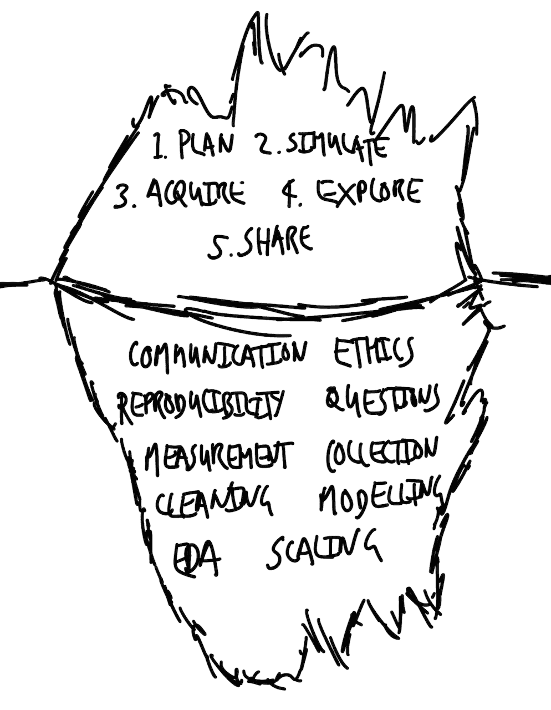

# 1  用数据讲故事

> 原文：[`tellingstorieswithdata.com/01-introduction.html`](https://tellingstorieswithdata.com/01-introduction.html)

1.  基础

1.  1  用数据讲故事

*Chapman and Hall/CRC 于 2023 年 7 月出版了这本书。您可以在[这里](https://www.routledge.com/Telling-Stories-with-Data-With-Applications-in-R/Alexander/p/book/9781032134772)购买。这个在线版本对印刷版有所更新。*  **先决条件**

+   阅读《数不尽的计数》（Keyes 2019）

    +   本文讨论了将世界转化为数据的困难。

+   阅读《厨房观察站》（Healy 2020）

    +   讨论数据隐藏和揭示的内容。

+   观看《6 分钟了解数据科学伦理》（Register 2020）

    +   这段视频以建设性的方式将伦理和数据科学相结合。

+   阅读《什么是代码？》（Ford 2015）

    +   本文概述了代码的作用，你应该关注前三个部分。

## 1.1 讲述故事

许多父母在孩子出生后，通常会做的第一件事就是给他们讲故事。在这个过程中，他们继续着已经持续了数千年的传统。神话、寓言和童话在我们周围随处可见。它们不仅令人娱乐，而且使我们能够了解世界。虽然艾瑞克·卡尔（Eric Carle）的《好饿的毛毛虫》（The Very Hungry Caterpillar）似乎与处理数据的领域相去甚远，但它们之间有相似之处。两者都旨在讲述故事并传授知识。

当使用数据时，我们试图讲述一个令人信服的故事。它可能像预测选举一样令人兴奋，像提高互联网广告点击率一样平凡，像寻找疾病原因一样严肃，或者像预测篮球比赛一样有趣。无论如何，关键要素是相同的。20 世纪初的英国作家 E. M. Forster 描述了所有小说的共同点：故事、人物、情节、幻想、预言、模式和节奏（Forster 1927）。同样，无论背景如何，当我们用数据讲故事时，都存在一些共同的问题：

1.  数据集是什么？谁生成数据集，为什么？

1.  支撑数据集的过程是什么？鉴于这个过程，数据集中缺少什么，或者测量得不好？是否可以生成其他数据集，如果是的话，它们与我们拥有的数据集可能有多大的不同？

1.  数据集试图表达什么，我们如何让它表达这一点？它还能表达什么？我们如何在这之间做出决定？

1.  我们希望别人从数据集中看到什么，我们如何说服他们，以及我们需要做多少工作才能说服他们？

1.  哪些人受到与这个数据集相关的流程和结果的影响？他们在数据集中被代表到了什么程度，并且他们是否参与了分析？

在过去，用数据讲故事的一些元素更容易。例如，实验设计在农业、医学科学、物理学和化学中有着悠久而坚实的传统。学生 t 分布是在 20 世纪初由一位化学家威廉·塞利·高塞特（William Sealy Gosset）发现的，他在啤酒制造商 Guinness 工作（Boland 1984）。对他来说，随机抽取啤酒并逐个改变一个方面相对简单。

我们今天使用的统计方法的基础知识大多是在这样的环境中开发的。在这些情况下，通常可以建立对照组并进行随机化，而且伦理问题较少。用这些数据讲的故事很可能相当有说服力。

然而，鉴于统计方法应用场景的多样性，这些内容中的大部分现在都不适用。另一方面，我们有很多优势。例如，我们有发达的统计技术，更容易访问大量数据集，以及像 R 和 Python 这样的开源语言。但是，进行传统实验的难度意味着我们也必须转向其他方面来讲述一个令人信服的故事。

## 1.2 工作流程组件

用数据讲故事的工作流程有五个核心组成部分：

1.  **规划**并勾勒出终点。

1.  **模拟**并考虑模拟数据。

1.  **获取**和准备实际数据。

1.  **探索**并理解实际数据。

1.  **分享**所做的工作和发现的内容。

我们首先**规划和勾勒出终点**，因为这确保我们仔细思考我们想去哪里。它迫使我们深入考虑我们的情况，有助于保持我们的专注和效率，并有助于减少范围蔓延。在刘易斯·卡罗尔的《爱丽丝梦游仙境》中，爱丽丝问柴郡猫她应该走哪条路。柴郡猫通过问爱丽丝想去哪里来回答。当爱丽丝回答说她不介意，只要她能到达某个地方，柴郡猫说方向不重要，因为如果你“走足够久”，你总是会到达某个地方。在我们的情况下，问题是我们通常无法无目的地长时间行走。虽然终点可能需要改变，但这是一个深思熟虑、有理有据的决定。而这只有在一个初始目标的基础上才有可能。没有必要花太多时间在这上面就能从中获得很多价值。通常用纸和笔十分钟就足够了。

下一步是**模拟数据**，因为这迫使我们深入细节。它有助于清理和准备数据集，因为它让我们专注于数据集中的类别以及我们期望的值分布。例如，如果我们对年龄组对政治偏好的影响感兴趣，那么我们可能期望我们的年龄组变量是一个因素，有四个可能的值：“18-29”，“30-44”，“45-59”，“60+”。模拟过程为我们提供了清晰的特性，我们的实际数据集应该满足这些特性。我们可以使用这些特性来定义测试，这些测试将指导我们的数据清理和准备。例如，我们可以检查我们的实际数据集中是否存在不属于这四个值的年龄组。当这些测试通过时，我们可以有信心我们的年龄组变量只包含我们期望的值。

当我们转向统计建模时，模拟数据也很重要。当我们处于那个阶段时，我们关心的是模型是否反映了数据集中的内容。问题是如果我们直接对真实数据集进行建模，那么我们不知道我们的模型是否存在问题。我们最初模拟数据是为了精确地知道底层的数据生成过程。然后我们将模型应用于模拟数据集。如果我们得到我们放入的内容，那么我们知道我们的模型正在适当地执行，可以转向真实数据集。如果没有对模拟数据的初步应用，那么对我们的模型有信心将会更困难。

模拟通常成本很低——考虑到现代计算资源和编程语言，几乎是免费的——而且速度快。它提供了“对情况的亲密感觉”，([Hamming [1997] 2020, 239](99-references.html#ref-hamming1996))。从只包含基本要素的模拟开始，让它工作，然后逐渐复杂化。

**获取和准备**我们感兴趣的数据是工作流程中经常被忽视的阶段。这很令人惊讶，因为这可能是最困难的阶段之一，需要做出许多决策。它越来越多地成为研究的主题，并且已经发现，在这个阶段做出的决策可能会影响统计结果(Huntington-Klein et al. 2021; Dolatsara et al. 2021; Gould et al. 2023)。

在这个工作流程阶段，人们常常会感到有些不知所措。通常，我们可以获取的数据让我们感到有些害怕。可能数据太少，在这种情况下，我们担心我们如何能让我们的统计机器工作。或者，我们可能面临相反的问题，担心我们如何开始处理如此大量的数据。

> 或许我们生活中的所有龙都是公主，她们只是在等待我们以美丽和勇气行动，只一次。或许我们害怕的一切，在其最深的本质中，都是一些无助的东西，它们渴望我们的爱。
> 
> 里尔克 ([[1929] 2014](99-references.html#ref-rilke))

在这个工作流程的这个阶段感到舒适，可以解锁其余的部分。讲述一个令人信服的故事所需的数据集就在那里。但是，就像雕塑家一样，我们需要迭代地移除我们不需要的所有数据，然后塑造那些数据。

在我们拥有数据集之后，我们接下来想要**探索和理解**数据集中的一些关系。我们通常从描述性统计开始这个过程，然后转向统计模型。使用统计模型来理解我们数据的影响并不是没有偏见，它们也不是“真理”；它们做的是我们告诉它们做的事情。当我们用数据讲故事时，统计模型是我们用来探索数据集的工具和方法，就像我们可能使用图表和表格一样。它们不是会给我们提供明确结果的东西，而是使我们能够以特定方式更清楚地理解数据集。

到我们到达工作流程的这个步骤时，在很大程度上，模型将反映在早期阶段做出的决定，特别是获取和清理，就像它反映了任何类型的数据生成过程一样。熟练的模型师知道他们的统计模型就像冰山之上的那部分：它们建立在下面的大部分基础上，在这种情况下，是数据。但是，当整个数据科学工作流程的专家使用建模时，他们会认识到获得的结果还额外地归因于关于哪些数据重要的选择，关于如何衡量和记录数据的决定，以及其他反映现实世界的方面，在数据可用到他们的特定工作流程之前很久。

最后，我们必须尽可能高保真地**分享**我们所做的一切和我们所发现的内容。谈论只有你拥有的知识并不能让你变得有知识，这包括只有“过去的你”拥有的知识。在沟通时，我们需要清楚地说明我们所做的决定、为什么做出这些决定、我们的发现以及我们方法中的弱点。我们旨在揭示一些重要的事情，因此我们应该首先写下所有内容，尽管这种书面沟通可能后来会补充其他形式的沟通。在这个工作流程中，我们需要做出的决定如此之多，以至于我们想要确保我们对整个流程保持开放——从开始到结束。这意味着远不止统计建模和图表、表格的创建，而是包括一切。没有这些，基于数据的叙述就会缺乏可信度。

世界不是一个理性的人才主义社会，其中一切都被仔细和明智地评估。相反，我们根据经验使用捷径、技巧和启发式方法。不清晰的沟通甚至会使最好的工作变得无效，因为它不会被充分参与。虽然沟通有最低标准，但它的上限是没有的。当它是经过深思熟虑的工作流程的总结时，它甚至可以获得一定的*优雅的随意性*，或是有意为之的随意。达到这种精通需要多年的工作。

## 1.3 用数据讲故事

基于数据的引人入胜的故事大约可以在十到二十页内讲述。少于这个篇幅，它可能对某些细节过于简略。虽然可以写得更长，但往往一些反思可以使内容简洁，或者使多个故事分开。

即使无法进行传统实验，也有可能讲述令人信服的故事。这些方法不依赖于“大数据”——这并不是万能的（Meng 2018；Bradley 等人 2021）——而是更好地利用可用的数据。研究和独立学习，理论与实践的结合，所有这些都与实际技能、复杂的流程以及对未知事物的欣赏相结合，通常足以创造持久的知识。

基于数据的最佳故事往往具有多学科性。它们从它们需要的任何领域汲取，但几乎总是依赖于统计学、软件工程、经济学和工程（仅举几例）。因此，端到端的工作流程需要这些领域的技能融合。学习这些技能的最佳方式是使用真实世界的数据进行研究项目，在这些项目中你：

+   制定研究问题；

+   获取并清理相关数据集；

+   探索数据以回答这些问题；以及

+   以有意义的方式进行沟通。

用数据讲述令人信服的故事的关键要素包括：

1.  沟通。

1.  可重复性。

1.  伦理。

1.  问题。

1.  测量。

1.  数据收集。

1.  数据清洗。

1.  探索性数据分析。

1.  建模。

1.  扩展。

这些元素可以包含在几个不同的类别中，包括：进行良好的研究（伦理和问题）、提出可信的答案（测量、收集、清洗、探索性数据分析、建模）、以及创造引人入胜的解释（沟通、可重复性和扩展）。这些元素是工作流程建立的基础（图 1.1）。

图 1.1：工作流程建立在各种元素之上

这需要掌握很多东西，但**沟通**是最重要的。分析简单，但沟通良好，比分析复杂但沟通不佳更有价值。这是因为后者无法被他人理解或信任。有时，缺乏清晰的沟通反映了研究人员未能理解正在发生的事情，甚至他们正在做什么。因此，虽然分析的水平应该与数据集、仪器、任务和技能集相匹配，但当需要在清晰度和复杂性之间进行权衡时，偏向清晰度是有道理的。

清晰的沟通意味着用表格、图表和模型以平实的语言写作，以使观众与你同行。这意味着阐明所做之事及其原因，以及所发现的内容。最低标准是这样做到一定程度，使另一个人可以独立地做你所做的事情并找到你所发现的内容。一个挑战是，当你沉浸在数据中时，可能会很难记住你最初到达那里的感觉。但这就是你的大部分观众将来自的地方。学会提供适当的细微差别和细节水平可能具有挑战性，但通过专注于为观众写作可以变得更容易。

**可重复性**是构建关于世界持久知识的必要条件。这意味着所做的一切——从头到尾的所有事情——都可以独立重做。理想情况下，端到端的自主可重复性是可能的；任何人都可以获取代码、数据和环境来验证所做的一切（Heil 等人 2021）。几乎总是可以无限制地访问代码。虽然对于数据来说这也是默认的期望，但并不总是合理的。例如，心理学研究可能只有少量、具有个人识别信息的样本。一种前进的方式是公开分享具有相似属性的模拟数据，并定义一个过程，通过这个过程可以在适当的*良好信誉*下访问真实数据。统计模型通常受到广泛的手动检查。可重复性的另一个方面是我们同样需要包括广泛的自动化测试。

由于数据集可能涉及人类，因此需要积极考虑**伦理**问题。这意味着考虑以下问题：数据集中有哪些人，哪些人缺失，以及为什么？我们的故事在多大程度上会延续过去？这是否应该发生？即使数据集不涉及人类，故事也可能是由人类编写的，我们几乎影响着其他所有事情。这意味着我们必须负责任地使用数据，考虑到环境影响和不平等。

伦理的定义有很多，但说到用数据讲故事，至少意味着要考虑数据集的完整背景（D’Ignazio 和 Klein 2020）。在法理学中，法律文本方法意味着字面地考虑法律文字的印刷形式，而目的方法则意味着法律在更广泛的环境中解释。用数据讲故事时的伦理方法意味着采用后者，并考虑塑造我们世界（以及我们的数据）的社会、文化、历史和政治力量（Crawford 2021）。

好奇心为探索数据集及其相关过程提供内部动力，并达到适当的程度。**问题**往往会引发更多问题，并且随着理解数据集的过程的持续，这些问题通常会得到改进和细化。与通常教授的 Popperian 假设检验方法相反，问题通常是通过一个持续和不断发展的过程来发展的（Franklin 2005）。找到一个初始问题可能具有挑战性。将研究问题操作化为合理可用的可测量变量尤其困难。选择一个感兴趣的领域可能会有所帮助，同样，用意将一个广泛的论点发展成具体问题，并最终将两个不同的领域结合起来。

在现实世界数据的混乱中感到舒适和自在意味着每次数据更新时都能提出新的问题。并且详细地了解一个数据集往往能揭示出意外的分组或值，然后你可以与该领域的专家合作来理解。通过在各个领域建立知识基础而成为“混合型”的人特别有价值，同样，对最初提出愚蠢问题的可能性感到舒适也很重要。

**测量**和**数据收集**是决定我们的世界如何成为数据的过程。这是具有挑战性的。世界如此充满活力，很难将其简化为可以持续测量和收集的东西。以某人的身高为例。我们可能都同意在测量身高之前应该脱掉鞋子。但我们的身高在一天中会变化。用卷尺测量某人的身高和使用激光的结果可能会有所不同。如果我们是在比较人与人之间的身高或随时间的变化，那么每天在同一时间使用相同的方法进行测量就变得很重要。但这很快就会变得不可行。因此，这些问题被放在了一边，即关于这些数据的数据库表示问题（Kent 1993）。

我们感兴趣的大部分问题将使用比身高更复杂的数据。我们如何衡量一个人的悲伤程度？我们如何衡量痛苦？谁决定我们将要衡量什么以及如何衡量？认为我们可以将世界简化为一个数值并比较这些数值需要一定的傲慢。最终，我们必须这样做，但一致地定义要衡量什么是有困难的。这个过程不是价值中立的。合理地接受这种残酷的简化唯一的方法是深入理解和尊重我们所衡量和收集的内容。核心本质是什么，什么可以被剥离？

20 世纪西班牙画家巴勃罗·毕加索有一系列画作，他用一条线描绘了动物的轮廓(图 1.2)。尽管它们很简单，但我们能认出被描绘的动物——这幅画足以说明动物是一只狗，而不是猫。这能用来判断狗是否生病吗？可能不能。我们可能想要不同的描绘。关于哪些事物应该被衡量，以及我们决定考虑的事物中哪些特征应该被衡量和收集，哪些应该忽略，这取决于情境和目的。

图 1.2：这幅由巴勃罗·毕加索绘制的画作显然是一只狗，尽管它只是一条线

**数据清洗和准备**是使用数据的关键部分。我们需要将我们拥有的数据进行处理，使其成为一个我们可以使用的数据集。这需要做出许多决定。数据清洗和准备阶段是至关重要的，值得与其他任何阶段一样多的关注和照顾。

遵循 Kennedy 等人(2022)的研究，考虑了一个收集有关一个可能敏感话题——性别——信息的调查，使用了四个选项：“男性”、“女性”、“不愿透露”和“其他”，其中“其他”变成了一个开放式文本框。当我们到达这个数据集时，我们可能会发现大多数回答都是“男性”或“女性”。我们需要决定如何处理“不愿透露”。如果我们从数据集中删除它，那么我们就是在积极忽略这些受访者。如果我们不删除它，那么它会使我们的分析更加复杂。同样，我们还需要决定如何处理开放式文本回答。再次，我们可以删除这些回答，但这忽略了部分受访者的经历。另一个选择是将这些与“不愿透露”合并，但这表明我们对受访者的不尊重，因为他们明确没有选择那个选项。

在许多数据清洗和准备的情况下，没有简单或总是正确的选择。它取决于上下文和目的。数据清洗和准备涉及做出许多这样的选择，记录每一步是至关重要的，以便他人能够理解所做之事及其原因。数据永远不会为自己发声；它们是那些清洗和准备它们的传声筒的木偶。

理解数据集的外观和感觉的过程被称为**探索性数据分析**（EDA）。这是一个开放性的过程。在我们正式建模之前，我们需要了解数据集的形状。EDA 的过程是迭代的，涉及生成汇总统计、图表、表格，有时甚至包括一些建模。这是一个永远不会正式结束的过程，需要各种技能。

在 EDA 结束和正式统计建模开始之间划界是困难的，尤其是在考虑信念和理解如何发展时(Hullman and Gelman 2021)。但就其核心而言，它始于数据，并涉及我们深入其中(Cook, Reid, and Tanaka 2021)。EDA 通常不会明确包含在我们的最终故事中。但它在我们理解所讲述的故事中起着核心作用。记录和共享 EDA 过程中所采取的所有步骤至关重要。

**统计建模**有着悠久而稳健的历史。我们对统计学的了解是经过数百年的积累。统计学不是一系列枯燥的定理和证明，而是一种探索世界的方式。它类似于“掌握外语或代数：在任何情况下都可能有用”(Bowley 1901, 4)。统计模型不是一种盲目遵循的食谱，而是一种理解数据的方式([James et al. [2013] 2021](99-references.html#ref-islr))。建模通常需要从数据中推断统计模式。更正式地说，统计推断是“使用数据推断生成数据的分布的过程”(Wasserman 2005, 87)。

统计显著性并不等同于科学显著性，我们正在认识到以往主导范式所带来的成本。在我们数据上使用任意的通过/失败统计测试很少是合适的。相反，统计建模的正确用途就像是一种回声定位。我们倾听从模型反馈回来的信息，以帮助了解世界的形状，同时认识到这仅仅是世界的一种表征。

使用编程语言，如 R 和 Python，使我们能够快速**扩展**我们的工作。这既指输入也指输出。考虑十个观察结果和 1,000 个，甚至 1,000,000 个一样容易。这使得我们能够更快地看到我们的故事适用到什么程度。同样，我们的输出也可以被一个人或十个人，甚至 100 个人轻松消费。使用应用程序编程接口（API），我们的故事甚至可能每秒被考虑成千上万次。

## 1.4 我们的世界如何成为数据？

> 有一个爱丁顿讲述的著名故事，关于一些人用网在海上捕鱼。在检查他们捕获的鱼的大小后，他们决定海里的鱼有一个最小尺寸！他们的结论是从工具得出的，而不是从现实中得出的。
> 
> 哈明（[[1997] 2020, 177](99-references.html#ref-hamming1996)）

在一定程度上，我们在浪费时间。我们有一个完美的世界模型——那就是世界！但它太复杂了。如果我们完美地知道一切是如何被它影响的无数因素所影响的，那么我们就可以完美地预测每一次抛硬币、掷骰子以及每一个看似随机的过程。但我们不能。相反，我们必须简化事物，使其成为可测量的，这就是我们定义的数据。我们的数据是从它们起源的混乱、复杂世界中简化的。

“可测量性”有不同的近似。因此，数据集总是选择的结果。我们必须决定它们是否仍然适合手头的任务。我们使用统计模型来帮助我们深入思考、探索，并希望更好地理解我们的数据。

统计学的大部分内容都集中在彻底考虑我们所拥有的数据。这在我们的数据是农业、天文或物理科学数据时是合适的。这并不是说系统偏差不能存在于非人类环境中或产生影响，但随着数据科学的兴起，部分原因是其应用于人类生成数据集的价值，我们必须积极考虑我们的数据集中没有的东西。谁在我们的数据集中系统地缺失了？谁的数据不适合我们使用的方法，因此被不适当地简化了？如果世界成为数据的过程需要抽象和简化，那么我们需要清楚何时可以合理地简化，何时会不合适。

我们的世界变成数据的过程必然涉及测量。矛盾的是，那些进行测量并深深沉浸在细节中的人，对数据的信任往往不如那些与之保持距离的人。即使是看似清晰的任务，如测量距离、定义边界和统计人口，在实践中也出奇地困难。将我们的世界转化为数据需要许多决策并产生许多误差。在众多其他考虑因素中，我们需要决定要测量什么，我们将如何准确地进行测量，以及谁将进行测量。

*哦，你以为我们对那方面的数据很好！* *一个看似简单的事情迅速变得困难的重要例子是母系相关死亡。这指的是怀孕期间或终止妊娠后因与怀孕或其管理相关的疾病而死亡的女性数量(世界卫生组织 2019)。将这种死亡的悲剧转化为特定原因的数据是困难的但至关重要的，因为这有助于减少未来的死亡。一些国家已经建立了完善的民事登记和生命统计(CRVS)，收集有关每个死亡的数据。但许多国家缺乏 CRVS，导致死亡未记录。即使死亡被记录，确定死亡原因可能很困难，尤其是在缺乏合格的医疗人员或设备的情况下。母系死亡尤其困难，因为通常有多种原因。一些 CRVS 系统在死亡登记表上有一个复选框，用于指定死亡是否应计入母系(Dattani 2024)。但即使是某些发达国家，也只是在最近才采用这一做法。例如，它仅在 2003 年引入美国，甚至在 2015 年，阿拉巴马州、加利福尼亚州和西弗吉尼亚州还没有采用标准问题(MacDorman and Declercq 2018)。这意味着母系死亡可能被低估或误分类的风险存在。*  *我们通常使用各种仪器将世界转化为数据。在天文学中，更好望远镜的发展，以及最终卫星和探测器的开发，使我们能够了解其他世界。同样，我们每天都在开发新的仪器来将我们的世界转化为数据。曾经的人口普查是一代人的标志性事件，现在我们有定期的调查，每秒都有可用的交易数据，以及几乎所有的互联网互动都成为某种类型的数据。这些仪器的开发使得许多激动人心的新故事成为可能。

我们的世界不完美地变成了数据。如果我们仍然想用数据来了解世界，那么我们需要积极寻求理解它们的不完美及其不完美的影响。*  *## 1.5 什么是数据科学以及我们该如何利用它来了解世界？

对于数据科学没有达成共识的定义。Wickham、Çetinkaya-Rundel 和 Grolemund ([[2016] 2023](99-references.html#ref-r4ds)) 说它“…允许你将原始数据转化为理解、洞察和知识”。同样，Leek 和 Peng (2020) 认为，它是“$\dots$通过数据回答定量问题的过程，收集和清洗数据，分析数据，并将问题的答案传达给相关受众”。Baumer、Kaplan 和 Horton (2021) 认为它是“$\dots$从数据中提取有意义信息的科学”。Timbers、Campbell 和 Lee (2022) 将其定义为“通过可重复和可审计的过程从数据中生成洞察的过程”。从更早的时期，Foster (1968) 在说到：“(s)tatistics are concerned with the processing and analysis of masses of data and with the development of mathematical methods of extracting information from data. Combine all this activity with computer methods and you have something more than the sum of its parts.”时，明确指向了我们现在称之为数据科学的内容。

Craiu (2019) 认为，关于数据科学是什么的不确定性可能并不重要，因为“$\dots$谁又能真正说出是什么让一个人成为诗人或科学家？”他继续广泛地说，数据科学家是“$\dots$一个具有数据驱动研究议程的人，他坚持或渴望使用基于原则的统计方法实施，并使用高效的计算技能。”

在任何情况下，除了具体的、技术性的定义之外，拥有一个简单的定义也是有价值的，即使我们失去了一些具体性。概率通常非正式地定义为“计数事物”([McElreath [2015] 2020, 10](99-references.html#ref-citemcelreath))。在类似非正式的意义上，数据科学可以被定义为类似于：人类测量事物，通常与人类相关，并使用复杂的平均方法来解释和预测。我们将在第十八章中重新审视这一点，以提供一个更详细的定义。

这可能听起来有点可爱，但 19 世纪的统计学家和经济学家弗朗西斯·埃奇沃斯认为统计学是“那些由社会现象呈现的均值”的科学，因此它找到了自己的位置(Edgeworth 1885)。无论如何，这个定义的一个特点是不将数据视为*无主之地*，或者不属于任何人。统计学家倾向于将数据视为我们永远无法了解的过程的结果，但我们试图使用数据来理解。许多统计学家对数据和测量非常关心，但在统计学中，有许多情况下数据似乎只是出现；它们不属于任何人。但这实际上并不是情况。

数据被生成，然后必须收集、清理和准备，这些决策很重要。每个数据集都是* sui generis*，或者是一个独特的类别，因此当你深入了解一个数据集时，你只是了解一个数据集，而不是所有数据集。

数据科学的大部分内容集中在“科学”上，但同时也关注“数据”同样重要。这也是数据科学那个可爱定义的另一个特点。一些数据科学家是通才，他们对广泛的领域感兴趣。通常，这些领域共同的特点是需要收集、清理和准备杂乱的数据。而且，通常这些数据的特定细节需要花费最多的时间，更新最频繁，值得我们最全心的关注。

约翰(2019)描述了自己在医疗办公室的经历，并被提供了一些基于产前初步筛查的概率，即他的孩子，当时还是一个胎儿，患有唐氏综合症。作为背景，可以做一个测试来确保结果，但这个测试伴随着胎儿可能无法存活的危险，因此进行了初步筛查，然后父母通常使用初步筛查中唐氏综合症的概率来决定是否进行最终测试。约翰(2019)发现，初步筛查提供的概率是基于十年前在英国进行的一项研究确定的。问题是，在接下来的十年里，成像技术得到了改善，初步筛查并没有预期到如此高分辨率的图像，并且从初步筛查中出现了随后的（虚假的）唐氏综合症诊断增加。数据是问题所在。

*巨人的肩膀* *迈克尔·乔丹博士是加州大学伯克利分校的裴宏陈杰出教授。1985 年，他在加州大学圣地亚哥分校获得认知科学博士学位后，被任命为麻省理工学院的助理教授，1997 年晋升为教授，1998 年搬到了伯克利。他的研究领域之一是统计机器学习。例如，一篇特别重要的论文是 Blei, Ng, 和 Jordan (2003)，它定义了如何将文本分组以定义主题，我们在第十七章中介绍了这一点。*  *不仅仅是“科学”部分很难，数据部分也同样困难。例如，研究人员回顾并检查了计算机科学中最受欢迎的文本数据集之一，他们发现大约 30%的数据是不正确复制的 (Bandy and Vincent 2021)。有一个专门的领域——语言学——专注于这些类型的数据集，数据的不当使用是任何领域霸权的一个危险。数据科学的力量在于它将来自不同背景和培训的人聚集在一起，共同学习关于某个数据集。它不受过去所做事情的限制。这意味着我们必须尽力尊重那些并非来自我们自己的传统，但对我们所感兴趣的数据集同样感兴趣的人。数据科学是跨学科的，并且越来越重要；因此，它必须反映我们的世界。在数据科学中需要背景、方法和学科的多样性。

我们的世界是混乱的，我们的数据也是如此。要成功地用数据讲故事，你需要习惯这个过程将会很困难的事实。英国数学家汉娜·弗莱描述了她花费六个月时间重写代码，直到解决了她的问题 (Thornhill 2021)。你需要学会坚持下去。你还需要接受有时会失败，这是通过培养韧性和内在动机来实现的。数据科学的世界是关于考虑可能性和概率，以及学会在这两者之间做出权衡。我们几乎不知道任何确定的事情，也没有完美的分析。

最终，我们都在用数据讲述故事，但这些故事正变得越来越重要。*  *## 1.6 练习

### 小测验

1.  用你自己的话来说，数据科学是什么？

1.  根据 Register (2020)，数据决策影响（选择一个）？

    1.  真实的人。

    1.  没有人。

    1.  训练集中的那些人。

    1.  测试集中的那些人。

1.  根据 Keyes (2019)，数据科学是什么（选择一个）？

    1.  数据科学是一个跨学科领域，它使用科学方法、过程、算法和系统从许多结构化和非结构化数据中提取知识和见解。

    1.  为了决策目的，对大量数据进行定量分析。

    1.  将人类不人道地降低到可以计数的东西。

1.  从 Keyes (2019)，需要标准化分类的数据系统的一个后果（选择一个）是什么？

    1.  更差的用户体验。

    1.  妥协的安全措施。

    1.  技术创新的增加。

    1.  消除个人身份和经历。

1.  从 Healy (2020)，关于与数据合作的常见批评（选择一个）是什么？

    1.  它太耗时且效率低下。

    1.  它使人们远离数字背后的人类生活的现实。

    1.  它需要昂贵的软件和广泛的培训来分析。

1.  从 Healy (2020)，对批评（选择一个）的回应是什么？

    1.  与数据合作迫使人们面对意义的问题。

    1.  数据分析不应进行。

    1.  数据应由自动化过程分析。

    1.  定性方法应该是主要方法。

1.  如何调和 Keyes (2019)和 Healy (2020)？

1.  为什么伦理是数据科学的关键要素（选择一个）？

    1.  因为数据科学总是涉及敏感的个人隐私信息。

    1.  因为伦理考虑使得分析更容易进行。

    1.  因为数据集可能涉及人类，需要考虑上下文。

    1.  因为法规要求对任何数据分析进行伦理审查。

1.  根据 Crawford (2021)，正如本章所述，以下哪些力量塑造了我们的世界，从而塑造了我们的数据（选择所有适用的）？

    1.  政治。

    1.  物理。

    1.  历史。

    1.  文化。

    1.  社会。

1.  从 Ford (2015)，编译器（选择一个）是什么？

    1.  软件将你输入到文件中的符号转换为低级指令。

    1.  一系列符号（使用典型的键盘字符，保存到某种类型的文件中），某人输入、复制或从其他地方粘贴的。

    1.  一个有益的时钟。

    1.  在穿孔卡片上打孔，然后放入盒子中，然后加载它们，然后计算机翻阅卡片，识别孔的位置，并更新其内存的部分。

1.  考虑一项关于性别的调查结果，它发现以下计数：“男性：879”，“女性：912”，“非二元：10”，“不愿说：3”和“其他：1”。考虑“不愿说”的适当方式（选择一个）？

    1.  删除它们。

    1.  取决于。

    1.  包含它们。

    1.  将其合并为“其他”。

1.  想象一下，你有一份工作，其中将种族和/或性取向作为预测因素可以提高你模型的性能。在决定是否将这些因素纳入你的分析时，你会考虑哪些因素（用你自己的话）？

1.  数据科学中的可重复性意味着什么（选择一个）？

    1.  能够使用不同的数据集产生相似的结果。

    1.  确保所有分析步骤都可以由其他人独立重做。

    1.  在同行评审的期刊上发表结果。

    1.  使用专有软件来保护数据。

1.  与测量相关的挑战是什么（选择一个）？

    1.  它通常很简单，不需要太多关注。

    1.  决定测量什么以及如何测量是复杂且与上下文相关的。

    1.  数据收集是客观的，且无偏见。

    1.  测量总是随着时间的推移保持准确和一致。

1.  在雕塑家的类比中，数据工作流程中的雕塑行为代表什么（选择一个）？

    1.  创建复杂模型以适应数据。

    1.  获取原始数据。

    1.  清洗和准备数据以揭示所需的数据集。

    1.  可视化结果。

1.  为什么探索性数据分析（EDA）是一个开放式的流程（选择一个）？

    1.  因为它有一套固定的步骤要遵循。

    1.  因为它需要持续迭代以理解数据的形状和模式。

    1.  因为它涉及以结构化的方式测试假设。

    1.  因为它可以自动化。

1.  为什么应该谨慎使用统计模型（选择一个）？

    1.  因为它们总是提供确定性的结果。

    1.  因为它们可以反映早期阶段做出的决策。

    1.  因为它们对大多数受众来说太复杂了。

    1.  因为如果数据展示得很好，它们就是不必要的。

1.  从考虑测量身高挑战的角度来看，我们可以得到什么教训（选择一个）？

    1.  身高是一个简单且变化不大的测量。

    1.  如果使用正确的仪器，所有测量都是准确的。

    1.  即使是简单的测量也可能存在影响数据质量的复杂性。

    1.  身高在数据分析中不是一个有用的变量。

1.  不考虑数据集中缺失的人有什么危险（选择一个）？

    1.  它对分析没有显著影响。

    1.  通过减少数据量简化分析。

    1.  这可能导致不反映完整背景的结论。

1.  统计建模的目的是什么（选择一个）？

    1.  作为帮助探索和理解数据的工具。

    1.  用于验证假设。

    1.  用以取代探索性数据分析。

1.  “我们的数据是对混乱、复杂世界的简化”是什么意思（选择一个）？

    1.  数据完美地捕捉了现实的各个方面。

    1.  数据简化现实，使分析成为可能，但它们无法捕捉每一个细节。

    1.  数据总是不准确且无用。

### 课堂活动

+   教师应该拍下课堂的照片，然后在屏幕上展示。在小组中，学生应该识别照片显示的三个方面，以及照片没有显示的三个方面。讨论这与数据科学的关系。

+   指导老师应该给每个小组分配不同的测量物品，其中一些比其他物品更有用，例如卷尺、纸张、尺子、标记笔、天平等。然后，学生应该使用这些物品来回答以下问题：“你的头发有多长？”将这个数字添加到电子表格中。如果你只有这个电子表格，你会理解什么，又不会理解关于头发长度的什么？将这一点与更广泛的数据科学联系起来。

### 任务

这个任务的目的是在你的脑海中明确测量的难度，即使是看似简单的事情，因此可以推断出在更复杂领域测量问题发生的可能性。

请获取一些快速生长的植物种子，例如萝卜、芥菜或芝麻菜。种植这些种子并测量你使用的土壤量。浇水并测量你使用的水量。每天记录任何变化。更普遍地说，尽可能多地测量并记录。注意你对测量难度的看法。最终，你的种子会发芽，你应该测量它们的生长情况。

Bandy, John, 和 Nicholas Vincent。2021 年。“解决机器学习中的‘文档债务’：BookCorpus 的回顾性数据表。”载于*神经信息处理系统数据集与基准论文集*，由 J. Vanschoren 和 S. Yeung 编辑。第 1 卷。[`datasets-benchmarks-proceedings.neurips.cc/paper_files/paper/2021/file/54229abfcfa5649e7003b83dd4755294-Paper-round1.pdf`](https://datasets-benchmarks-proceedings.neurips.cc/paper_files/paper/2021/file/54229abfcfa5649e7003b83dd4755294-Paper-round1.pdf)。Baumer, Benjamin, Daniel Kaplan, 和 Nicholas Horton。2021 年。*现代数据科学与 R*。第 2 版。Chapman; Hall/CRC。[`mdsr-book.github.io/mdsr2e/`](https://mdsr-book.github.io/mdsr2e/)。Blei, David, Andrew Ng, 和 Michael Jordan。2003 年。“潜在狄利克雷分配。”*机器学习研究杂志* 3 (1 月): 993–1022。[`www.jmlr.org/papers/volume3/blei03a/blei03a.pdf`](https://www.jmlr.org/papers/volume3/blei03a/blei03a.pdf)。Boland, Philip。1984 年。“威廉·西利·戈塞特生平一瞥。”*美国统计学家* 38 (3): 179–83。[`doi.org/10.2307/2683648`](https://doi.org/10.2307/2683648)。Bowley, Arthur Lyon。1901 年。*统计学原理*。伦敦: P. S. King。Bradley, Valerie, Shiro Kuriwaki, Michael Isakov, Dino Sejdinovic, Xiao-Li Meng, 和 Seth Flaxman。2021 年。“无代表性的大型调查显著高估了美国疫苗接种率。”*自然* 600 (7890): 695–700。[`doi.org/10.1038/s41586-021-04198-4`](https://doi.org/10.1038/s41586-021-04198-4)。Cook, Dianne, Nancy Reid, 和 Emi Tanaka。2021 年。“基础已备，可从推断角度思考数据可视化。”*哈佛数据科学评论* 3 (3)。[`doi.org/10.1162/99608f92.8453435d`](https://doi.org/10.1162/99608f92.8453435d)。Craiu, Radu。2019 年。“招聘博弈：寻找双料数据科学家。”*哈佛数据科学评论* 1 (1)。[`doi.org/10.1162/99608f92.440445cb`](https://doi.org/10.1162/99608f92.440445cb)。Crawford, Kate。2021 年。*人工智能图集*。第 1 版。纽黑文: 耶鲁大学出版社。D’Ignazio, Catherine, 和 Lauren Klein。2020 年。*数据女性主义*。马萨诸塞州: 麻省理工学院出版社。[`data-feminism.mitpress.mit.edu`](https://data-feminism.mitpress.mit.edu)。Dattani, Saloni。2024 年。“美国报告孕产妇死亡率上升主要源于测量方式改变。”*数据中的我们的世界*。Dolatsara, Hamidreza Ahady, Ying-Ju Chen, Robert Leonard, Fadel Megahed, 和 Allison Jones-Farmer。2021 年。“解释预测模型性能：数据准备与模型选择的实验研究。”*大数据*，十月。[`doi.org/10.1089/big.2021.0067`](https://doi.org/10.1089/big.2021.0067)。Edgeworth, Francis Ysidro。1885 年。“统计方法。”*伦敦统计学会杂志*，181–217。Ford, Paul。2015 年。“什么是代码？”*彭博商业周刊*，六月。[`www.bloomberg.com/graphics/2015-paul-ford-what-is-code/`](https://www.bloomberg.com/graphics/2015-paul-ford-what-is-code/)。Forster, Edward Morgan。1927 年。*小说面面观*。伦敦: Edward Arnold。Foster, Gordon。1968 年。“计算机、统计与规划：系统还是混沌？”*Geary 讲座*。[`www.esri.ie/system/files/publications/GLS2.pdf`](https://www.esri.ie/system/files/publications/GLS2.pdf)。Franklin, Laura。2005 年。“探索性实验。”*科学哲学* 72 (5): 888–99。[`doi.org/10.1086/508117`](https://doi.org/10.1086/508117)。Gould, Elliot, Hannah Fraser, Timothy Parker, Shinichi Nakagawa, Simon Griffith, Peter Vesk, 和 Fiona Fidler。2023 年。“相同数据，不同分析者：生态学与进化生物学中因分析决策导致的效应量差异”，十月。[`doi.org/10.32942/x2gg62`](https://doi.org/10.32942/x2gg62)。Hamming, Richard。(1997) 2020 年。*科学与工程的艺术*。第 2 版。Stripe Press。Healy, Kieran。2020 年。“厨房柜台观测站”，五月。[`kieranhealy.org/blog/archives/2020/05/21/the-kitchen-counter-observatory/`](https://kieranhealy.org/blog/archives/2020/05/21/the-kitchen-counter-observatory/)。Heil, Benjamin, Michael Hoffman, Florian Markowetz, Su-In Lee, Casey Greene, 和 Stephanie Hicks。2021 年。“生命科学中机器学习的可重复性标准。”*自然方法* 18 (10): 1132–35。[`doi.org/10.1038/s41592-021-01256-7`](https://doi.org/10.1038/s41592-021-01256-7)。Hullman, Jessica, 和 Andrew Gelman。2021 年。“交互式探索性数据分析的设计需要图形推断理论。”*哈佛数据科学评论* 3 (3)。[`doi.org/10.1162/99608f92.3ab8a587`](https://doi.org/10.1162/99608f92.3ab8a587)。Huntington-Klein, Nick, Andreu Arenas, Emily Beam, Marco Bertoni, Jeffrey Bloem, Pralhad Burli, Naibin Chen, 等人。2021 年。“应用微观经济学中隐藏研究者决策的影响。”*经济探究* 59: 944–60。[`doi.org/10.1111/ecin.12992`](https://doi.org/10.1111/ecin.12992)。James, Gareth, Daniela Witten, Trevor Hastie, 和 Robert Tibshirani。(2013) 2021 年。*统计学习导论：R 语言应用*。第 2 版。Springer。[`www.statlearning.com`](https://www.statlearning.com)。Jordan, Michael。2019 年。“人工智能——革命尚未发生。”*哈佛数据科学评论* 1 (1)。[`doi.org/10.1162/99608f92.f06c6e61`](https://doi.org/10.1162/99608f92.f06c6e61)。Kennedy, Lauren, Katharine Khanna, Daniel Simpson, Andrew Gelman, Yajun Jia, 和 Julien Teitler。2022 年。“他，她，他们：在调查调整中使用生理性别与社会性别。”[`arxiv.org/abs/2009.14401`](https://arxiv.org/abs/2009.14401)。Kent, William。1993 年。“我的身高：数值信息模型。”[`www.bkent.net/Doc/myheight.htm`](https://www.bkent.net/Doc/myheight.htm)。Keyes, Os。2019 年。“数不胜数。”*真实生活*。[`reallifemag.com/counting-the-countless/`](https://reallifemag.com/counting-the-countless/)。Leek, Jeff, 和 Roger Peng。2020 年。“高级数据科学 2020。”[`jtleek.com/ads2020/index.html`](http://jtleek.com/ads2020/index.html)。MacDorman, Marian, 和 Eugene Declercq。2018 年。“美国孕产妇死亡率报告的失败及其对女性生活的影响。”*分娩* 45 (2): 105–8。[`doi.org/1111/birt.12333`](https://doi.org/1111/birt.12333)。McElreath, Richard。(2015) 2020 年。*统计再思考：基于 R 和 Stan 的贝叶斯课程*。第 2 版。Chapman; Hall/CRC。Meng, Xiao-Li。2018 年。“大数据中的统计天堂与悖论（一）：大数总体定律、大数据悖论与 2016 年美国总统选举。”*应用统计学年鉴* 12 (2): 685–726。[`doi.org/10.1214/18-AOAS1161SF`](https://doi.org/10.1214/18-AOAS1161SF)。Register, Yim。2020 年。“六分钟了解数据科学伦理。”*YouTube*，十二月。[`youtu.be/mA4gypAiRYU`](https://youtu.be/mA4gypAiRYU)。Rilke, Rainer Maria。(1929) 2014 年。*给青年诗人的信*。企鹅经典。Thornhill, John。2021 年。“与《金融时报》共进午餐：数学家汉娜·弗莱。”*金融时报*，七月。[`www.ft.com/content/a5e33e5a-99b9-4bbc-948f-8a527c7675c3`](https://www.ft.com/content/a5e33e5a-99b9-4bbc-948f-8a527c7675c3)。Timbers, Tiffany, Trevor Campbell, 和 Melissa Lee。2022 年。*数据科学：初步介绍*。Chapman; Hall/CRC。[`datasciencebook.ca`](https://datasciencebook.ca)。Wasserman, Larry。2005 年。*统计学全览*。Springer。Wickham, Hadley, Mine Çetinkaya-Rundel, 和 Garrett Grolemund。(2016) 2023 年。*R 数据科学*。第 2 版。O’Reilly Media。[`r4ds.hadley.nz`](https://r4ds.hadley.nz)。World Health Organization。2019 年。“2000 年至 2017 年孕产妇死亡率趋势：世界卫生组织、联合国儿童基金会、联合国人口基金、世界银行集团和联合国人口司的估计。”[`apps.who.int/iris/handle/10665/327596`](https://apps.who.int/iris/handle/10665/327596)。***
