# 2  喝消防水

> 原文：[`tellingstorieswithdata.com/02-drinking_from_a_fire_hose.html`](https://tellingstorieswithdata.com/02-drinking_from_a_fire_hose.html)

1.  基础

1.  2  喝消防水

Chapman and Hall/CRC 于 2023 年 7 月出版了这本书。您可以在[这里](https://www.routledge.com/Telling-Stories-with-Data-With-Applications-in-R/Alexander/p/book/9781032134772)购买。这个在线版本对印刷版有所更新。*  **先决条件**

+   阅读 *卓越的平凡：关于分层和奥运游泳者的民族志报告* (Chambliss 1989)

    +   这篇论文发现，卓越并非源于某种特殊的天赋或天赋，而是由于技巧、纪律和态度。

+   阅读 *数据科学作为原子习惯* (Barrett 2021)

    +   这篇博客文章描述了一种学习数据科学的方法，该方法涉及采取小而一致的行动。

+   阅读 *这是 AI 偏见真正发生的原因——以及为什么它如此难以修复* (Hao 2019)

    +   本文强调了模型如何持续存在偏见的一些方式。

关键概念和技能**

+   统计编程语言 R 使我们能够使用数据讲述有趣的故事。它就像任何其他语言一样，精通它的路径可能很慢。

+   我们用于处理项目的流程是：计划、模拟、获取、探索和分享。

+   学习 R 的方法是从一个小项目开始，将实现它所需的内容分解成微小的步骤，查看他人的代码，并从中吸取经验以实现每一步。完成该项目后，再进行下一个项目。随着每个项目的完成，你将变得越来越好。

软件和包**

+   基础 R (R Core Team 2024)

+   核心 tidyverse (Wickham et al. 2019)

    +   `dplyr` (Wickham et al. 2022)

    +   `ggplot2` (Wickham 2016)

    +   `tidyr` (Wickham, Vaughan, and Girlich 2023)

    +   `stringr` (Wickham 2022)

    +   `readr` (Wickham, Hester, and Bryan 2022)

+   `janitor` (Firke 2023)

+   `lubridate` (Grolemund and Wickham 2011)

+   `opendatatoronto` (Gelfand 2022)

+   `tinytable` (Arel-Bundock 2024)

```r
library(janitor)
library(lubridate)
library(opendatatoronto)
library(tidyverse)
library(tinytable)
```

## 2.1 Hello, World!

开始的方法就是开始。在本章中，我们探讨了本书所倡导的数据科学工作流程的三个完整示例。这意味着我们：

$$ \mbox{计划} \rightarrow \mbox{模拟} \rightarrow \mbox{获取} \rightarrow \mbox{探索} \rightarrow \mbox{分享} $$ 如果你刚接触 R，那么一些代码可能对你来说有些陌生。如果你刚接触统计学，那么一些概念可能也不熟悉。不要担心，所有这些很快就会变得熟悉。

学习如何讲述故事的唯一方法就是自己开始讲故事。这意味着你应该尝试让这些示例运行起来。自己完成草图，自己输入所有内容（如果你是 R 的新手且没有本地安装，请使用 Posit Cloud），并执行所有操作。重要的是要认识到，一开始这将是具有挑战性的。这是正常的。

> 无论你学习任何新工具，在很长一段时间里，你都会很糟糕$\dots$ 但好消息是这是典型的；这是每个人都会遇到的事情，而且只是暂时的。
> 
> 如巴雷特引用的哈德利·维克汉姆（2021）。

你在这里将得到彻底的指导。希望你能通过体验用数据讲故事带来的兴奋，从而感到有力量坚持下去。

工作流程的第一步是计划。我们这样做是因为我们需要确定一个终点，即使我们后来需要根据对情况的更多了解来更新它。然后我们进行模拟，因为这迫使我们深入到计划的细节中。在某些项目中，数据获取可能像下载一个数据集那样简单，但在其他项目中，数据获取可能成为重点，例如，如果我们进行一项调查。我们使用各种定量方法来探索数据，以便理解它。最后，我们以关注受众需求的方式分享我们的理解。

要开始，请访问[Posit Cloud](https://posit.cloud)并创建一个账户；目前免费版本就足够了。我们最初使用它，而不是桌面版本，这样每个人开始的方式都一样，但为了避免付费，你应该稍后改为本地安装。一旦你有了账户并登录，它应该看起来像图 2.1 (a)。

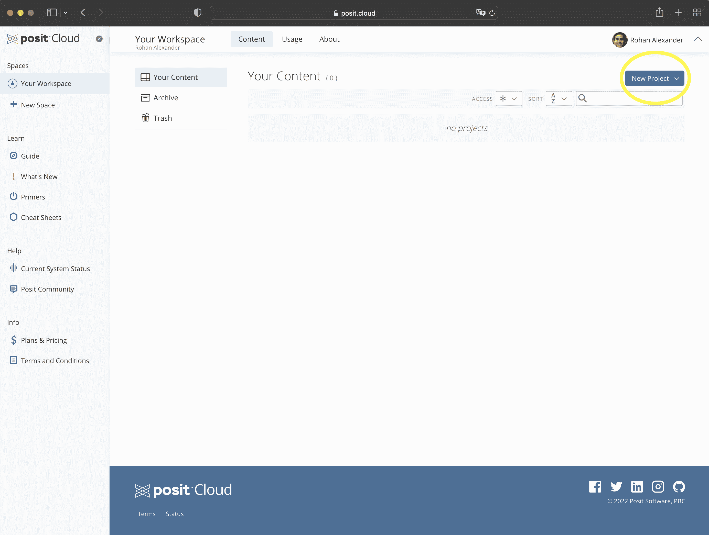

(a) 首次打开 Posit Cloud

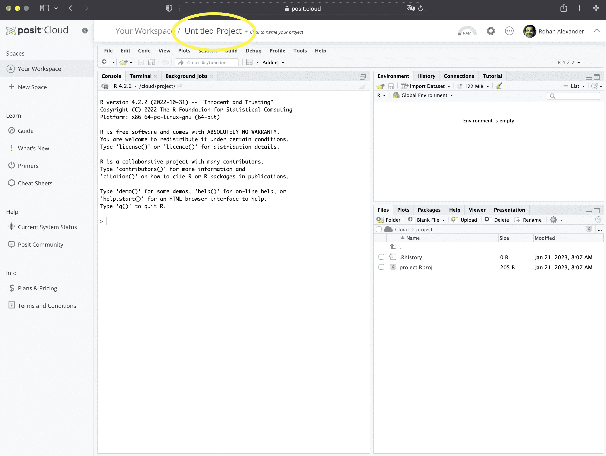

(b) 打开一个新的 RStudio 项目

图 2.1：使用 Posit Cloud 和新建项目入门

你将进入“您的项目”。从这里开始，你应该启动一个新的项目：“新建项目” $\rightarrow$ “新建 RStudio 项目” (图 2.1 (b))。你可以通过点击“未命名项目”并替换它来给项目命名。

我们现在将讨论三个工作示例：澳大利亚选举、多伦多庇护所使用情况和新生儿死亡率。这些示例的复杂性逐渐增加，但从一个开始，我们将用数据讲述一个故事。虽然我们在这里简要解释了许多方面，但几乎所有内容都在本书的其余部分有更详细的解释。

## 2.2 澳大利亚选举

澳大利亚是一个议会民主国家，众议院有 151 个席位，这是下议院，政府就是从那里形成的。有两个主要政党——“自由党”和“工党”——两个小政党——“国家党”和“绿党”——以及许多小党和独立人士。在这个例子中，我们将创建一个图表，显示每个政党在 2022 年联邦选举中赢得的席位数量。

### 2.2.1 规划

对于这个例子，我们需要规划两个方面。第一个是我们需要的数据库将看起来像什么，第二个是最终的图表将看起来像什么。

数据集的基本要求是它包含席位的名称（有时在澳大利亚被称为“选区”），以及当选人的政党。我们需要的数据集的快速草图是 图 2.2 (a)。

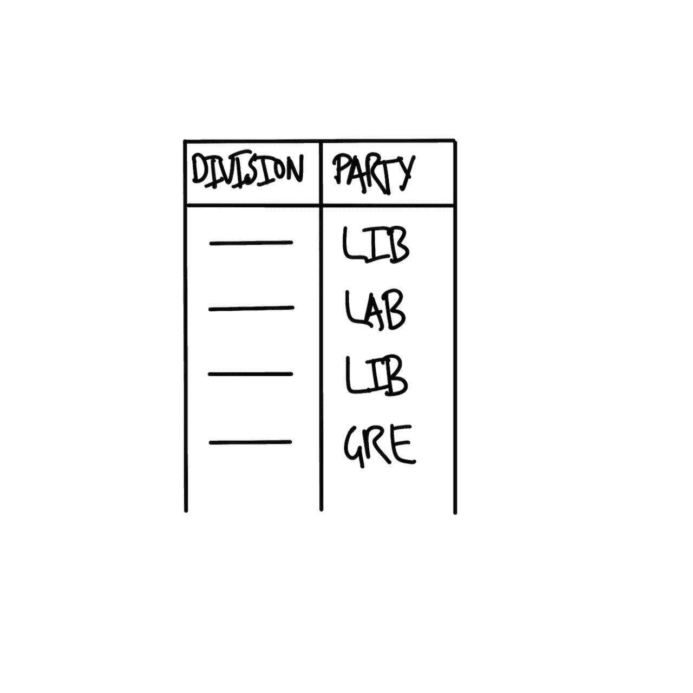

(a) 分析澳大利亚选举可能有用的数据集的快速草图

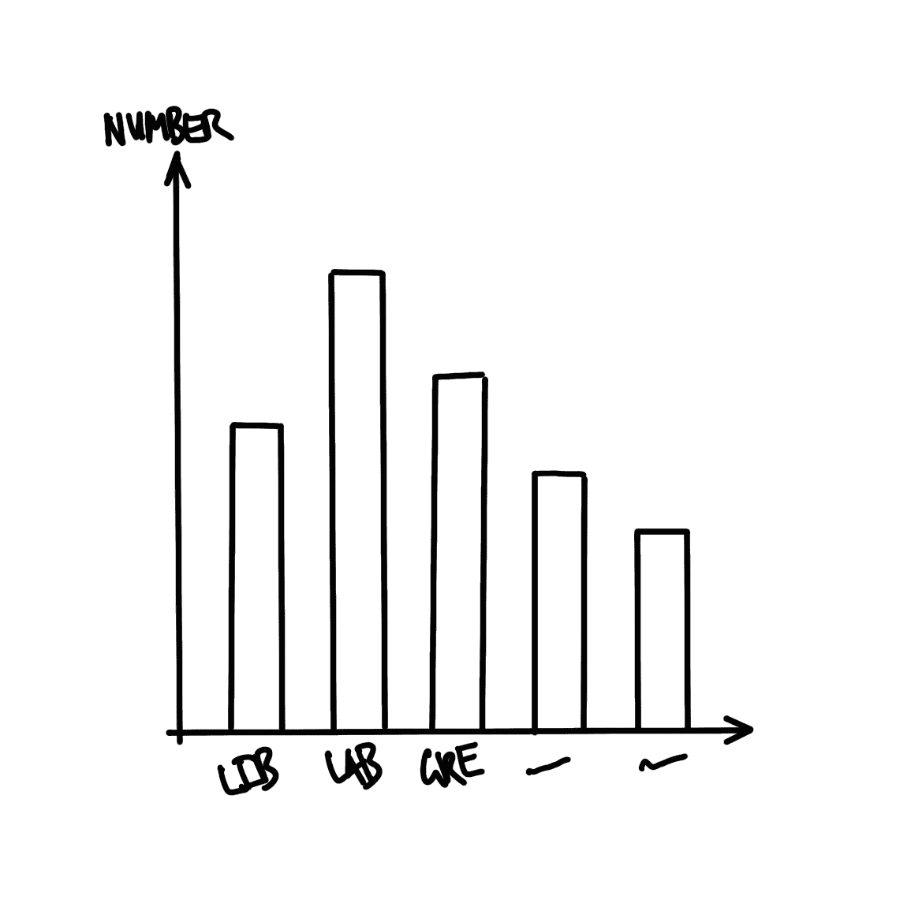

(b) 每个政党赢得的席位数量的可能图表的快速草图

图 2.2：与澳大利亚选举相关的潜在数据集和图表草图

我们还需要规划我们感兴趣的图表。鉴于我们想显示每个政党赢得的席位数量，我们可能的目标草图是 图 2.2 (b)。

### 2.2.2 模拟

我们现在模拟一些数据，以便为我们的草图增加一些具体性。

要开始，在 Posit Cloud 中创建一个新的 Quarto 文档：“文件” $\rightarrow$ “新建文件” $\rightarrow$ “Quarto 文档$\dots$”。给它一个标题，例如“探索 2022 年澳大利亚选举”，添加你的名字作为作者，并取消选中“使用视觉 Markdown 编辑器” (图 2.3 (a))。保留其他选项为默认设置，然后点击“创建”。

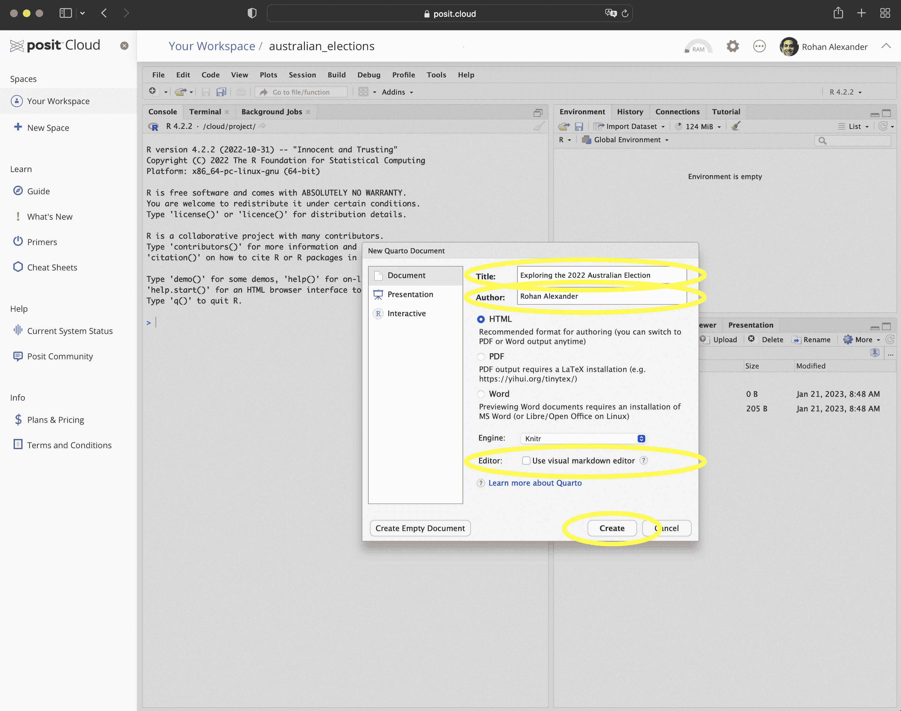

(a) 创建一个新的 Quarto 文档

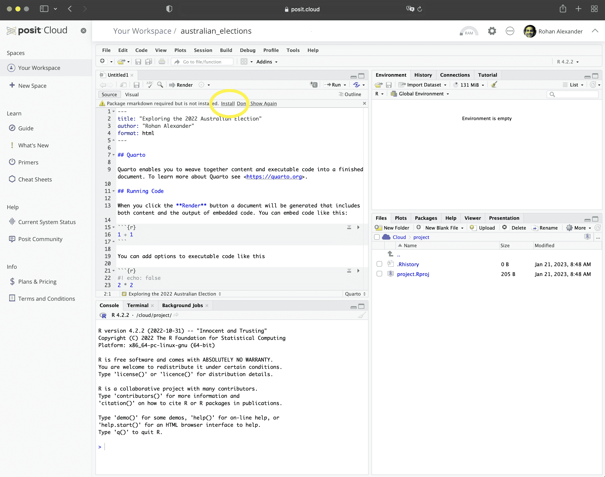

(b) 如果需要，安装 rmarkdown

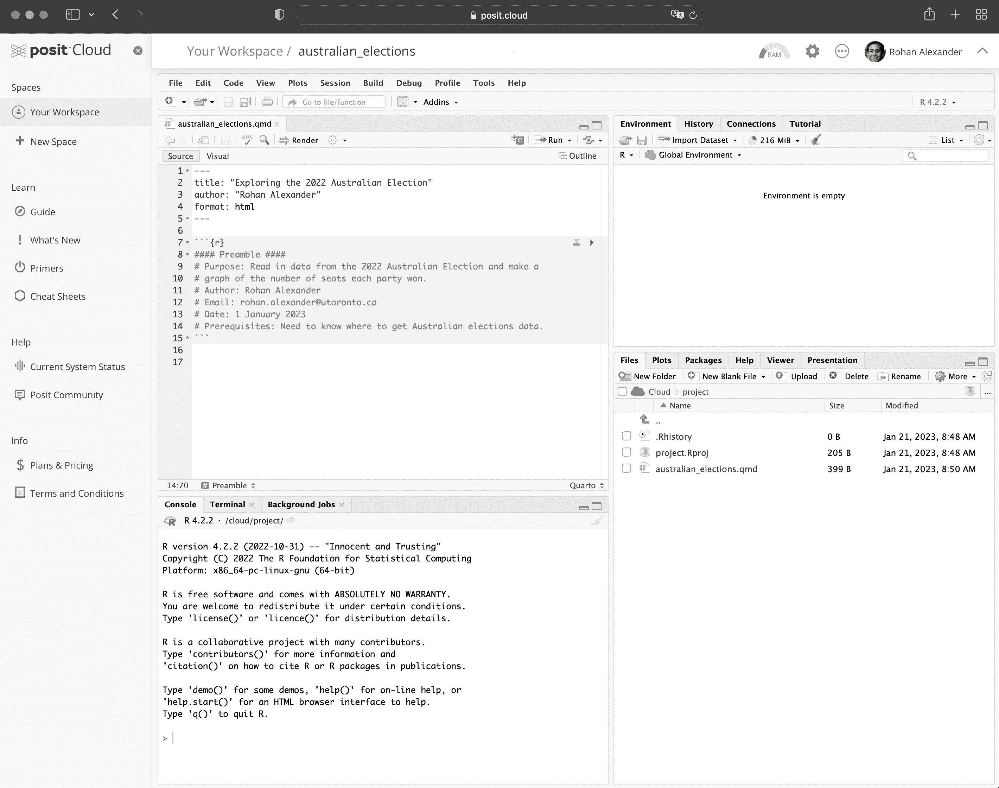

(c) 初始设置和前言之后

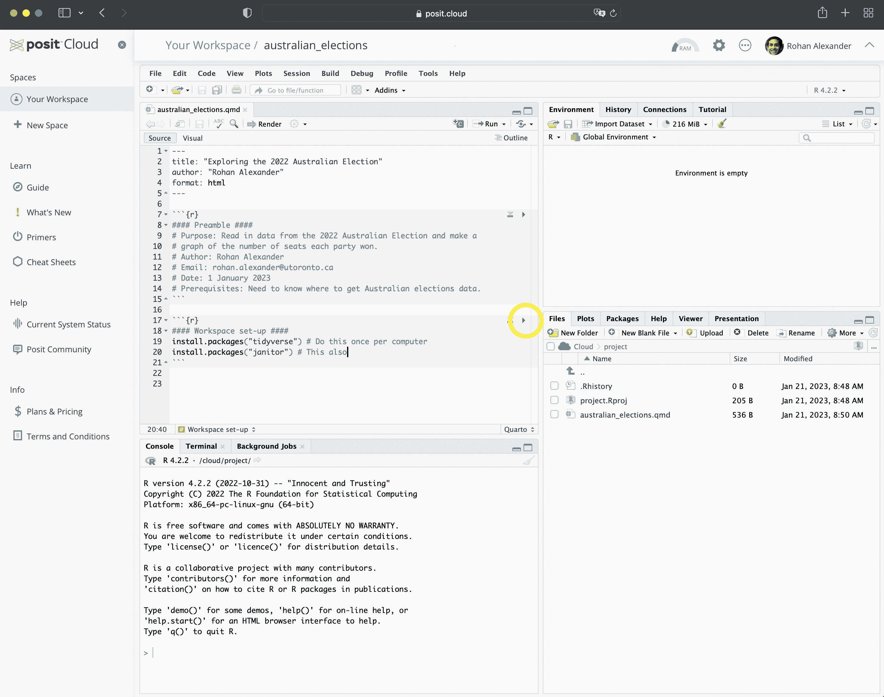

(d) 突出显示绿色箭头以运行代码块

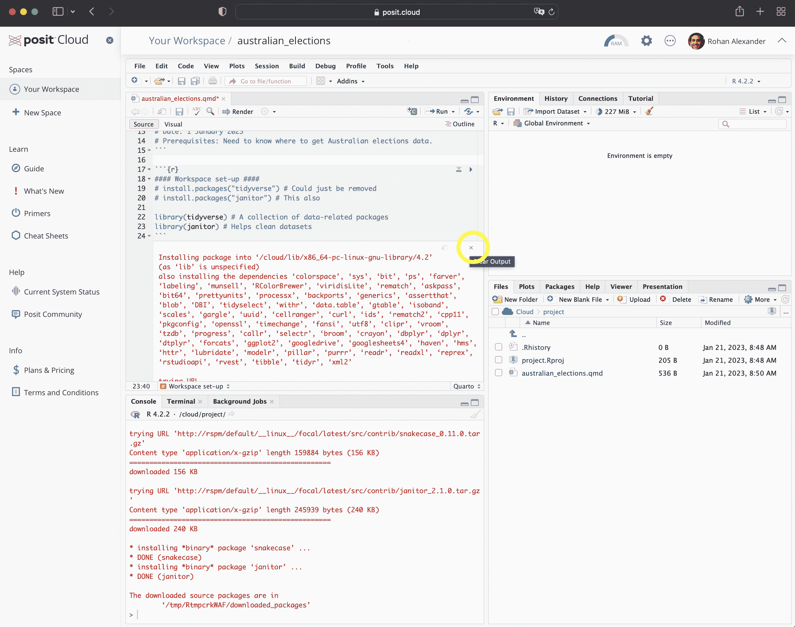

(e) 突出显示十字以移除消息

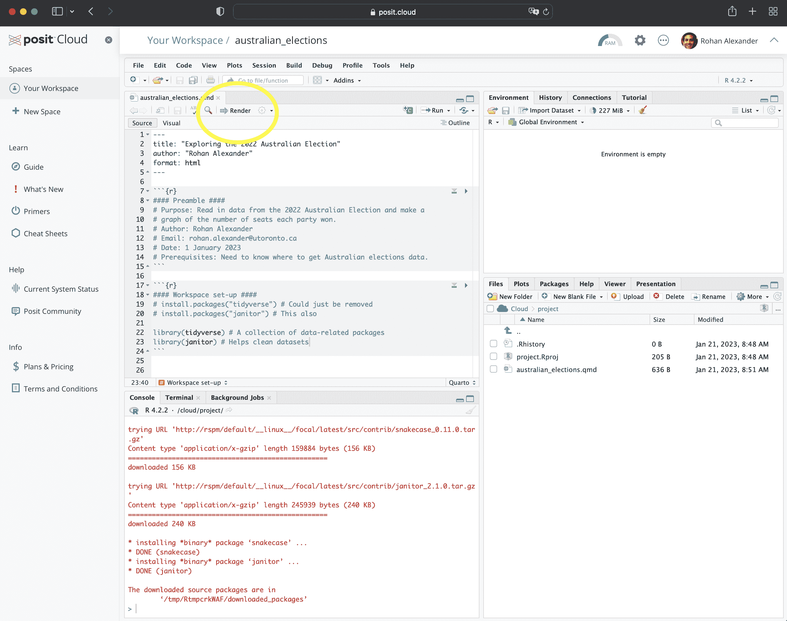

(f) 突出显示渲染按钮

图 2.3：使用 Quarto 文档开始

你可能会收到类似“需要包 rmarkdown$\dots$.”的通知 (图 2.3 (b))。如果发生这种情况，请点击“安装”。在这个例子中，我们将所有内容都放入一个 Quarto 文档中。你应该将其保存为“australian_elections.qmd”： “文件” $\rightarrow$ “另存为$\dots$”。

删除几乎所有默认内容，然后在标题材料下方创建一个新的 R 代码块：“代码” $\rightarrow$ “插入代码块”。然后添加前言文档，解释说明：

+   文档的目的；

+   作者和联系方式；

+   当文件被写入或最后更新时；

+   文件所依赖的先决条件。

```r
#### Preamble ####
# Purpose: Read in data from the 2022 Australian Election and make
# a graph of the number of seats each party won.
# Author: Rohan Alexander
# Email: rohan.alexander@utoronto.ca
# Date: 1 January 2023
# Prerequisites: Know where to get Australian elections data.
```

在 R 中，以“#”开头的行是注释。这意味着它们不会被 R 作为代码执行，而是设计为供人类阅读。这个前言的每一行都应该以一个“#”开头。同时，通过用“####”包围它来清楚地表明这是前言部分。结果应该看起来像图 2.3 (c)。

在此之后，我们需要设置工作区。这涉及到安装和加载任何需要的包。一个包只需要在每个计算机上安装一次，但每次使用时都需要加载。在这种情况下，我们将使用`tidyverse`和`janitor`包。由于这是第一次使用，它们需要被安装，然后每个包都需要被加载。

“巨人的肩膀”* *Hadley Wickham 是 RStudio 的首席科学家。2008 年从爱荷华州立大学获得统计学博士学位后，他被任命为莱斯大学的助理教授，并于 2013 年成为 RStudio（现在是 Posit）的首席科学家。他开发了`tidyverse`包集合，并出版了许多书籍，包括*《R 数据科学》（Wickham, Çetinkaya-Rundel, and Grolemund [2016] 2023）*和*《高级 R》（Wickham 2019）*。他在 2019 年获得了 COPSS 总统奖。* 以下是一个安装包的示例。通过点击与 R 代码块相关的小绿色箭头来运行此代码（图 2.3 (d)）。

```r
#### Workspace setup ####
install.packages("tidyverse")
install.packages("janitor")
```

现在包已经安装，它们需要被加载。由于包安装步骤只需要在每个计算机上执行一次，因此应该将此代码注释掉，以避免意外运行，或者甚至可以直接删除。此外，我们还可以删除安装包时打印的消息（图 2.3 (e)）。

```r
#### Workspace setup ####
# install.packages("tidyverse")
# install.packages("janitor")

library(tidyverse)
library(janitor)
```

我们可以通过点击“渲染”（图 2.3 (f)）来渲染整个文档。当你这样做时，可能会要求你安装一些包。如果发生这种情况，那么你应该同意。这将生成一个 HTML 文档。

对于刚刚安装的包的介绍，每个包都包含一个帮助文件，提供有关它们及其功能的信息。可以通过在包名前加一个问号来访问它，然后在控制台中运行该代码。例如 `?tidyverse`。

为了模拟我们的数据，我们需要创建一个包含两个变量：“Division”和“Party”，以及每个变量的某些值。在“Division”的情况下，合理的值可以是 151 个澳大利亚分区中的一个名称。在“Party”的情况下，合理的值可以是以下五个之一：“Liberal”，“Labor”，“National”，“Green”，或“Other”。同样，这段代码可以通过点击与 R 代码块相关联的小绿色箭头来运行。

```r
simulated_data <-
 tibble(
 # Use 1 through to 151 to represent each division
 "Division" = 1:151,
 # Randomly pick an option, with replacement, 151 times
 "Party" = sample(
 x = c("Liberal", "Labor", "National", "Green", "Other"),
 size = 151,
 replace = TRUE
 )
 )

simulated_data
```

```r
# A tibble: 151 × 2
   Division Party   
      <int> <chr>   
 1        1 Green   
 2        2 Green   
 3        3 Labor   
 4        4 Labor   
 5        5 Green   
 6        6 National
 7        7 Liberal 
 8        8 National
 9        9 Liberal 
10       10 Other   
# ℹ 141 more rows
```
在某个时刻，你的代码将无法运行，你将需要向他人寻求帮助。不要只截取一小段代码的截图，并期望有人能根据这些截图帮助你。他们几乎肯定不能。相反，你需要以他们可以运行的方式提供你的整个脚本。我们将在第三章中更完整地解释 GitHub，但就目前而言，如果你需要帮助，那么你应该天真地创建一个 GitHub Gist，这样你就可以以比截图更有帮助的方式分享你的代码。第一步是在[GitHub](https://github.com)上创建一个免费账户(图 2.4(a))。考虑一个合适的用户名很重要，因为这将成为你专业档案的一部分。拥有一个专业、独立于任何课程，并且理想情况下与你的真实姓名相关的用户名是有意义的。然后寻找右上角的“+”，选择“New gist”(图 2.4(b))。


(a) GitHub 注册屏幕

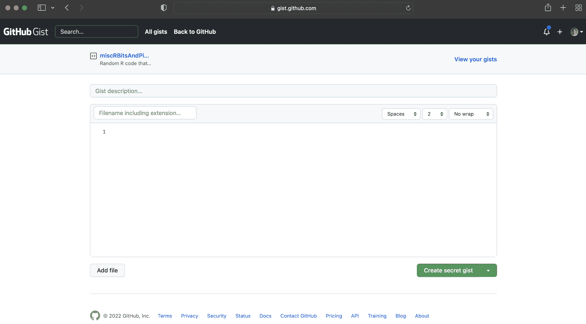

(b) 新 GitHub Gist

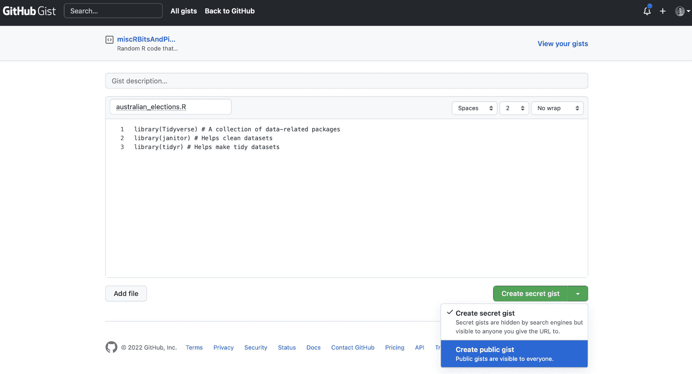

(c) 创建公开的 GitHub Gist 以分享代码

图 2.4：在寻求帮助时创建 Gist 以分享代码

从这里你应该将所有代码添加到那个 Gist 中，而不仅仅是导致错误的最后一段代码。并且给文件起一个有意义的名字，文件名末尾包含“.R”，例如，“australian_elections.R”。在图 2.4(c)中，我们会发现我们使用了错误的字母大小写，`library(Tidyverse)`而不是`library(tidyverse)`。

点击“Create public gist”。然后我们可以将此 Gist 的 URL 分享给任何我们需要帮助的人，解释问题是什么，我们试图实现什么。这将更容易得到他们的帮助，因为所有代码都是可用的。
  
### 2.2.3 获取

现在我们想要获取实际数据。我们需要的数据来自澳大利亚选举委员会(AEC)，这是一个非党派机构，负责组织澳大利亚联邦选举。我们可以将他们的网站页面传递给`read_csv()`函数，该函数来自`readr`包。我们不需要显式加载`readr`包，因为它已经是`tidyverse`的一部分。`<-`或“赋值运算符”将`read_csv()`的输出分配给一个名为“raw_elections_data”的对象。

```r
#### Read in the data ####
raw_elections_data <-
 read_csv(
 file = 
 "https://results.aec.gov.au/27966/website/Downloads/HouseMembersElectedDownload-27966.csv",
 show_col_types = FALSE,
 skip = 1
 )

# We have read the data from the AEC website. We may like to save
# it in case something happens or they move it.
write_csv(
 x = raw_elections_data,
 file = "australian_voting.csv"
)
```

我们可以使用`head()`快速查看数据集，它会显示前六行，而`tail()`会显示最后六行。

```r
head(raw_elections_data)
```

```r
# A tibble: 6 × 8
  DivisionID DivisionNm StateAb CandidateID GivenNm   Surname   PartyNm  PartyAb
       <dbl> <chr>      <chr>         <dbl> <chr>     <chr>     <chr>    <chr>  
1        179 Adelaide   SA            36973 Steve     GEORGANAS Austral… ALP    
2        197 Aston      VIC           36704 Alan      TUDGE     Liberal  LP     
3        198 Ballarat   VIC           36409 Catherine KING      Austral… ALP    
4        103 Banks      NSW           37018 David     COLEMAN   Liberal  LP     
5        180 Barker     SA            37083 Tony      PASIN     Liberal  LP     
6        104 Barton     NSW           36820 Linda     BURNEY    Austral… ALP 
```

```r
tail(raw_elections_data)
```

```r
# A tibble: 6 × 8
  DivisionID DivisionNm StateAb CandidateID GivenNm    Surname  PartyNm  PartyAb
       <dbl> <chr>      <chr>         <dbl> <chr>      <chr>    <chr>    <chr>  
1        152 Wentworth  NSW           37451 Allegra    SPENDER  Indepen… IND    
2        153 Werriwa    NSW           36810 Anne Maree STANLEY  Austral… ALP    
3        150 Whitlam    NSW           36811 Stephen    JONES    Austral… ALP    
4        178 Wide Bay   QLD           37506 Llew       O'BRIEN  Liberal… LNP    
5        234 Wills      VIC           36452 Peter      KHALIL   Austral… ALP    
6        316 Wright     QLD           37500 Scott      BUCHHOLZ Liberal… LNP 
```
我们需要清理数据以便使用。我们试图使其与我们规划阶段认为想要的数据集相似。虽然偏离计划是可以的，但这需要是一个深思熟虑、有理有据的决定。在读取我们保存的数据集后，我们将做的第一件事是调整变量的名称。我们将使用 `janitor` 中的 `clean_names()` 来完成这项工作。

```r
#### Basic cleaning ####
raw_elections_data <-
 read_csv(
 file = "australian_voting.csv",
 show_col_types = FALSE
 )
```

```r
# Make the names easier to type
cleaned_elections_data <-
 clean_names(raw_elections_data)

# Have a look at the first six rows
head(cleaned_elections_data)
```

```r
# A tibble: 6 × 8
  division_id division_nm state_ab candidate_id given_nm  surname   party_nm    
        <dbl> <chr>       <chr>           <dbl> <chr>     <chr>     <chr>       
1         179 Adelaide    SA              36973 Steve     GEORGANAS Australian …
2         197 Aston       VIC             36704 Alan      TUDGE     Liberal     
3         198 Ballarat    VIC             36409 Catherine KING      Australian …
4         103 Banks       NSW             37018 David     COLEMAN   Liberal     
5         180 Barker      SA              37083 Tony      PASIN     Liberal     
6         104 Barton      NSW             36820 Linda     BURNEY    Australian …
# ℹ 1 more variable: party_ab <chr>
```
名称输入更快，因为 RStudio 会自动完成它们。为此，我们开始输入变量的名称，然后使用“tab”键来完成。

数据集中有许多变量，我们主要对两个变量感兴趣：“division_nm”和“party_nm”。我们可以使用 `dplyr` 中的 `select()` 选择感兴趣的变量，它是我们作为 `tidyverse` 部分加载的。 “管道运算符”，`|>`，将一行输出推送到下一行函数的第一个输入。

```r
cleaned_elections_data <-
 cleaned_elections_data |>
 select(
 division_nm,
 party_nm
 )

head(cleaned_elections_data)
```

```r
# A tibble: 6 × 2
  division_nm party_nm              
  <chr>       <chr>                 
1 Adelaide    Australian Labor Party
2 Aston       Liberal               
3 Ballarat    Australian Labor Party
4 Banks       Liberal               
5 Barker      Liberal               
6 Barton      Australian Labor Party
```
一些变量名称仍然不明显，因为它们是缩写的。我们可以使用 `names()` 查看这个数据集中的列名。我们可以使用 `dplyr` 中的 `rename()` 来更改名称。

```r
names(cleaned_elections_data)
```

```r
[1] "division_nm" "party_nm" 


```r
cleaned_elections_data <-
 cleaned_elections_data |>
 rename(
 division = division_nm,
 elected_party = party_nm
 )

head(cleaned_elections_data)
```

```r
# A tibble: 6 × 2
  division elected_party         
  <chr>    <chr>                 
1 Adelaide Australian Labor Party
2 Aston    Liberal               
3 Ballarat Australian Labor Party
4 Banks    Liberal               
5 Barker   Liberal               
6 Barton   Australian Labor Party
```
我们可以现在查看“elected_party”列中的唯一值，使用 `unique()`。

```r
cleaned_elections_data$elected_party |>
 unique()
```

```r
[1] "Australian Labor Party"              
[2] "Liberal"                             
[3] "Liberal National Party of Queensland"
[4] "The Greens"                          
[5] "The Nationals"                       
[6] "Independent"                         
[7] "Katter's Australian Party (KAP)"     
[8] "Centre Alliance" 
```
由于这里比我们想要的更详细，我们可能想要使用 `dplyr` 中的 `case_match()` 简化政党名称，以匹配我们模拟的。

```r
cleaned_elections_data <-
 cleaned_elections_data |>
 mutate(
 elected_party =
 case_match(
 elected_party,
 "Australian Labor Party" ~ "Labor",
 "Liberal National Party of Queensland" ~ "Liberal",
 "Liberal" ~ "Liberal",
 "The Nationals" ~ "Nationals",
 "The Greens" ~ "Greens",
 "Independent" ~ "Other",
 "Katter's Australian Party (KAP)" ~ "Other",
 "Centre Alliance" ~ "Other"
 )
 )

head(cleaned_elections_data)
```

```r
# A tibble: 6 × 2
  division elected_party
  <chr>    <chr>        
1 Adelaide Labor        
2 Aston    Liberal      
3 Ballarat Labor        
4 Banks    Liberal      
5 Barker   Liberal      
6 Barton   Labor 
```
我们的数据现在与我们的计划匹配 (图 2.2 (a)). 对于每个选区，我们都有获胜者的政党。

现在我们已经很好地清理了数据集，我们应该保存它，以便我们可以在下一阶段使用这个清理后的数据集。我们应该确保使用新的文件名保存，这样我们就不会替换原始数据，并且以后可以轻松识别清理后的数据集。

```r
write_csv(
 x = cleaned_elections_data,
 file = "cleaned_elections_data.csv"
)
```
  
### 2.2.4 探索

我们可能想探索我们创建的数据集。更好地理解数据集的一种方法是通过制作图表。特别是，我们想要构建我们在 图 2.2 (b) 中规划的图表。

首先，我们读取我们刚刚创建的数据集。

```r
#### Read in the data ####
cleaned_elections_data <-
 read_csv(
 file = "cleaned_elections_data.csv",
 show_col_types = FALSE
 )
```

我们可以使用 `dplyr` 中的 `count()` 快速统计每个政党赢得的席位数量。

```r
cleaned_elections_data |>
 count(elected_party)
```

```r
# A tibble: 5 × 2
  elected_party     n
  <chr>         <int>
1 Greens            4
2 Labor            77
3 Liberal          48
4 Nationals        10
5 Other            12
```
为了构建我们感兴趣的图表，我们使用 `ggplot2`，它是 `tidyverse` 的一部分。这个包的关键方面是我们通过添加层来构建图表，使用“+”作为“添加运算符”。特别是，我们将使用 `ggplot2` 中的 `geom_bar()` 创建条形图 (图 2.5 (a))。

```r
cleaned_elections_data |>
 ggplot(aes(x = elected_party)) + # aes abbreviates "aesthetics" 
 geom_bar()

cleaned_elections_data |>
 ggplot(aes(x = elected_party)) +
 geom_bar() +
 theme_minimal() + # Make the theme neater
 labs(x = "Party", y = "Number of seats") # Make labels more meaningful
```

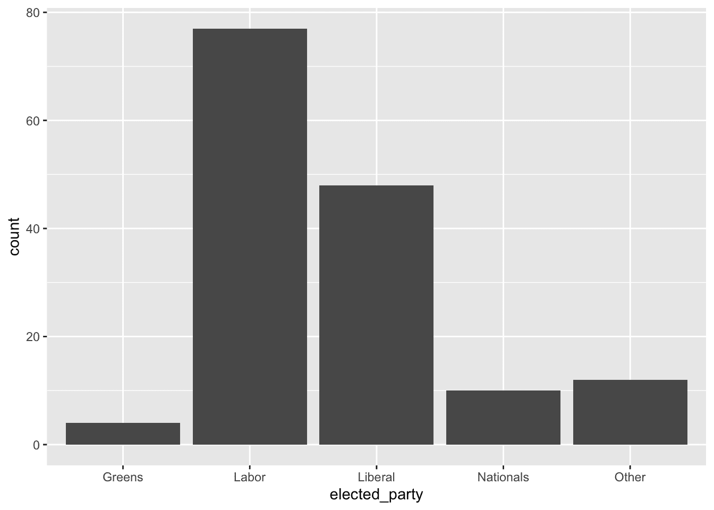

(a) 默认选项

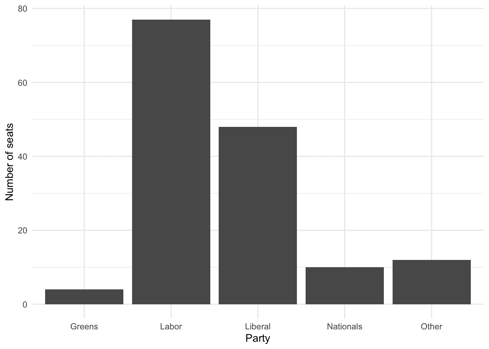

(b) 改进的主题和标签

图 2.5：2022 年澳大利亚联邦选举中各政党赢得的席位数量

图 2.5 (a) 实现了我们设定的目标。但我们可以通过修改默认选项和改进标签(图 2.5 (b))使其看起来更美观。
  
### 2.2.5 分享

到目前为止，我们已经下载了一些数据，对其进行了清理，并制作了一个图表。我们通常需要详细地传达我们所做的工作。在这种情况下，我们可以写几段关于我们所做的工作、为什么这样做以及我们发现了什么，以总结我们的工作流程。以下是一个例子。

> 澳大利亚是一个议会民主国家，众议院有 151 个席位，政府就是从众议院中产生的。有两个主要政党——“自由党”和“工党”——两个小政党——“国家党”和“绿党”——以及许多小政党。2022 年联邦选举于 5 月 21 日举行，约有 1500 万张选票。我们感兴趣的是每个政党赢得的席位数量。
> 
> 我们从澳大利亚选举委员会网站下载了按席位具体结果的数据。我们使用统计编程语言 R(R Core Team 2024)，包括`tidyverse`(Wickham et al. 2019)和`janitor`(Firke 2023)对数据集进行了清理和整理。然后我们创建了一个图表，显示了每个政党赢得的席位数量(图 2.5)。
> 
> 我们发现工党赢得了 77 个席位，其次是自由党，赢得了 48 个席位。小党派赢得了以下数量的席位：国家党赢得了 10 个席位，绿党赢得了 4 个席位。最后，还有 10 名独立候选人以及来自较小政党的候选人当选。
> 
> 席位的分布倾向于两个主要政党，这可能反映了澳大利亚选民相对稳定的偏好，或者可能是由于已经是主要政党所带来的好处，如国家网络或资金等惯性。对这种分布原因的更好理解是未来工作的兴趣所在。虽然数据集包括所有投票者，但值得注意的是，在澳大利亚，有些人系统地被排除在投票之外，有些人投票比其他人更困难。

特别需要注意的一个方面是确保这次沟通专注于听众的需求并讲述一个故事。数据新闻学提供了一些优秀的例子，说明了分析如何需要根据听众进行调整，例如 Cardoso (2020) 和 Bronner (2020)。

多伦多拥有大量无家可归的人口(多伦多市 2021)。寒冷的冬天意味着在避难所中需要有足够的地方。在这个例子中，我们将制作一个 2021 年避难所使用情况的表格，以比较每个月的平均使用情况。我们的预期是，在较冷的月份，例如 12 月，使用率会比较暖和的月份，例如 7 月，更高。

### 2.3.1 计划

我们感兴趣的数据集需要包含日期、避难所和那一晚被占用的床位数。一个可以工作的数据集快速草图是图 2.6 (a)。我们感兴趣的是创建一个表格，显示每晚每月平均被占用的床位数。这个表格可能看起来像图 2.6 (b)。

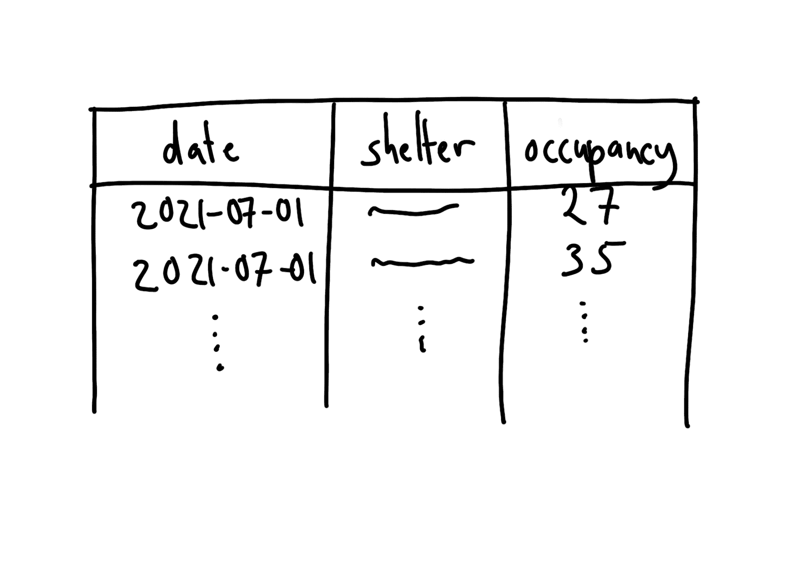

(a) 数据集的快速草图

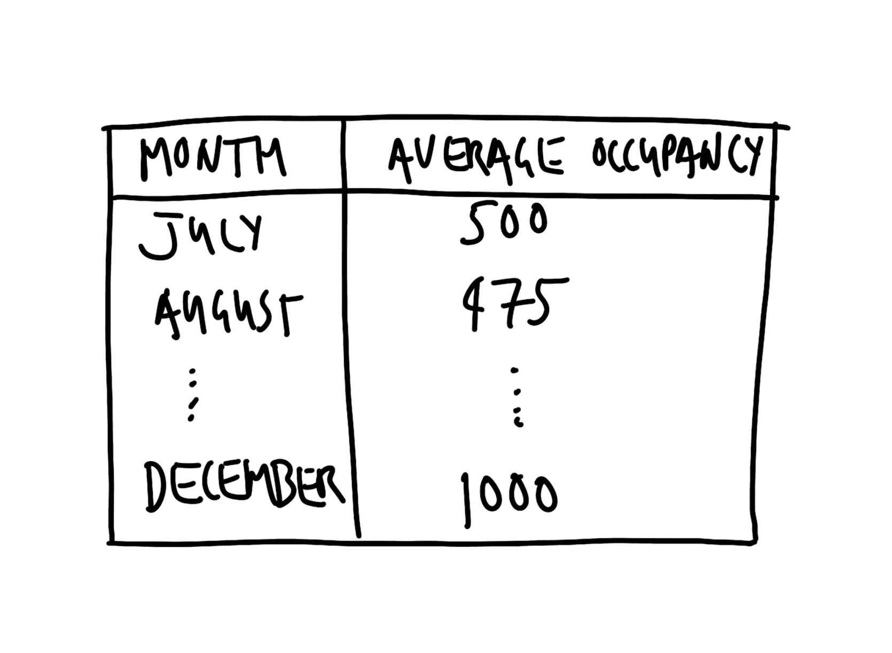

(b) 每月平均床位数表格的快速草图

图 2.6：与多伦多避难所使用相关的数据集和表格草图

### 2.3.2 模拟

下一步是模拟一些可能类似于我们的数据集的数据。模拟为我们提供了一个深入思考数据生成过程的机会。当我们转向分析时，它将为我们提供指导。在没有先进行模拟的情况下进行分析可以被视为没有目标地射箭——虽然你确实在做些什么，但并不清楚你是否做得好。

在 Posit Cloud 中创建一个新的 Quarto 文档，保存它，并创建一个新的 R 代码块并添加前言文档。然后安装和/或加载所需的包。我们再次使用`tidyverse`和`janitor`。由于这些包之前已经安装，因此不需要再次安装。我们还将使用`lubridate`。这是`tidyverse`的一部分，因此不需要独立安装，但需要加载。我们还将使用`opendatatoronto`和`knitr`，这些需要安装和加载。

```r
#### Preamble ####
# Purpose: Get data on 2021 shelter usage and make table
# Author: Rohan Alexander
# Email: rohan.alexander@utoronto.ca
# Date: 1 July 2022
# Prerequisites: -

#### Workspace setup ####
install.packages("opendatatoronto")
install.packages("knitr")

library(knitr)
library(janitor)
library(lubridate)
library(opendatatoronto)
library(tidyverse)
```

为了使前面的例子更加详细，包包含其他人编写的代码。在这本书中，你将经常看到一些常见的包，特别是`tidyverse`。要使用一个包，我们必须首先安装它，然后我们需要加载它。一个包只需要在每个计算机上安装一次，但每次都需要加载。这意味着我们之前安装的包不需要在这里重新安装。

巨人的肩膀* *Dr Robert Gentleman 是 R 的联合创造者。在 1988 年从华盛顿大学获得统计学博士学位后，他搬到了奥克兰大学。然后他担任了包括在 23andMe 在内的各种角色，现在他是哈佛医学院计算生物医学中心的执行主任。* *巨人的肩膀* *Dr Ross Ihaka 是 R 的联合创造者。他在 1985 年从加州大学伯克利分校获得统计学博士学位。他撰写了一篇题为“Ruaumoko”的论文，这是毛利人的地震之神。然后他搬到了奥克兰大学，在那里他完成了整个职业生涯。他在 2008 年获得了新西兰皇家学会 Te Apārangi 的 Pickering 奖。*  *鉴于人们捐赠他们的时间来制作 R 和我们所使用的包，引用它们是很重要的。为了获取所需的信息，我们使用`citation()`。在没有参数运行时，它提供 R 本身的引用信息，当运行带有参数时，它提供该包的引用信息。

```r
citation() # Get the citation information for R
```

```r
To cite R in publications use:

  R Core Team (2024). _R: A Language and Environment for Statistical
  Computing_. R Foundation for Statistical Computing, Vienna, Austria.
  <https://www.R-project.org/>.

A BibTeX entry for LaTeX users is

  @Manual{,
    title = {R: A Language and Environment for Statistical Computing},
    author = {{R Core Team}},
    organization = {R Foundation for Statistical Computing},
    address = {Vienna, Austria},
    year = {2024},
    url = {https://www.R-project.org/},
  }

We have invested a lot of time and effort in creating R, please cite it
when using it for data analysis. See also 'citation("pkgname")' for
citing R packages.
```

```r
citation("ggplot2") # Get citation information for a package
```

```r
To cite ggplot2 in publications, please use

  H. Wickham. ggplot2: Elegant Graphics for Data Analysis.
  Springer-Verlag New York, 2016.

A BibTeX entry for LaTeX users is

  @Book{,
    author = {Hadley Wickham},
    title = {ggplot2: Elegant Graphics for Data Analysis},
    publisher = {Springer-Verlag New York},
    year = {2016},
    isbn = {978-3-319-24277-4},
    url = {https://ggplot2.tidyverse.org},
  }
```
转向模拟，我们需要三个变量：“日期”、“庇护所”和“占用率”。这个例子将在先前的例子基础上增加一个种子，使用`set.seed()`。种子使我们能够在每次运行相同代码时始终生成相同的随机数据。任何整数都可以用作种子。在这种情况下，种子将是 853。如果您使用该种子，那么您应该得到与这个例子中相同的随机数。如果您使用不同的种子，那么您应该期望得到不同的随机数。最后，我们使用`rep()`重复某些内容一定次数。例如，我们重复“庇护所 1”365 次，这大约相当于一年。

```r
#### Simulate ####
set.seed(853)

simulated_occupancy_data <-
 tibble(
 date = rep(x = as.Date("2021-01-01") + c(0:364), times = 3),
 # Based on Eddelbuettel: https://stackoverflow.com/a/21502386
 shelter = c(
 rep(x = "Shelter 1", times = 365),
 rep(x = "Shelter 2", times = 365),
 rep(x = "Shelter 3", times = 365)
 ),
 number_occupied =
 rpois(
 n = 365 * 3,
 lambda = 30
 ) # Draw 1,095 times from the Poisson distribution
 )

head(simulated_occupancy_data)
```

```r
# A tibble: 6 × 3
  date       shelter   number_occupied
  <date>     <chr>               <int>
1 2021-01-01 Shelter 1              28
2 2021-01-02 Shelter 1              29
3 2021-01-03 Shelter 1              35
4 2021-01-04 Shelter 1              25
5 2021-01-05 Shelter 1              21
6 2021-01-06 Shelter 1              30
```
在这个模拟中，我们首先创建 2021 年所有日期的列表。我们重复该列表三次。我们假设每年每一天都有三个庇护所的数据。为了模拟每晚占用的床位数，我们从泊松分布中抽取，假设每个庇护所平均占用 30 张床，尽管这只是任意的选择。作为背景，泊松分布通常用于我们拥有计数数据时，我们将在第十三章中回到它。
  
### 2.3.3 获取

我们使用多伦多市政府提供的多伦多庇护所使用数据。庇护所使用情况通过每晚凌晨 4 点对占用床位的数量进行计数来衡量。为了访问这些数据，我们使用`opendatatoronto`并保存我们自己的副本。

```r
#### Acquire ####
toronto_shelters <-
 # Each package is associated with a unique id  found in the "For 
 # Developers" tab of the relevant page from Open Data Toronto
 # https://open.toronto.ca/dataset/daily-shelter-overnight-service-occupancy-capacity/
 list_package_resources("21c83b32-d5a8-4106-a54f-010dbe49f6f2") |>
 # Within that package, we are interested in the 2021 dataset
 filter(name == 
 "daily-shelter-overnight-service-occupancy-capacity-2021.csv") |>
 # Having reduced the dataset to one row we can get the resource
 get_resource()

write_csv(
 x = toronto_shelters,
 file = "toronto_shelters.csv"
)

head(toronto_shelters)
```

```r
head(toronto_shelters)
```

```r
# A tibble: 6 × 32
   X_id OCCUPANCY_DATE ORGANIZATION_ID ORGANIZATION_NAME        SHELTER_ID
  <dbl> <chr>                    <dbl> <chr>                         <dbl>
1     1 21-01-01                    24 COSTI Immigrant Services         40
2     2 21-01-01                    24 COSTI Immigrant Services         40
3     3 21-01-01                    24 COSTI Immigrant Services         40
4     4 21-01-01                    24 COSTI Immigrant Services         40
5     5 21-01-01                    24 COSTI Immigrant Services         40
6     6 21-01-01                    24 COSTI Immigrant Services         40
# ℹ 27 more variables: SHELTER_GROUP <chr>, LOCATION_ID <dbl>,
#   LOCATION_NAME <chr>, LOCATION_ADDRESS <chr>, LOCATION_POSTAL_CODE <chr>,
#   LOCATION_CITY <chr>, LOCATION_PROVINCE <chr>, PROGRAM_ID <dbl>,
#   PROGRAM_NAME <chr>, SECTOR <chr>, PROGRAM_MODEL <chr>,
#   OVERNIGHT_SERVICE_TYPE <chr>, PROGRAM_AREA <chr>, SERVICE_USER_COUNT <dbl>,
#   CAPACITY_TYPE <chr>, CAPACITY_ACTUAL_BED <dbl>, CAPACITY_FUNDING_BED <dbl>,
#   OCCUPIED_BEDS <dbl>, UNOCCUPIED_BEDS <dbl>, UNAVAILABLE_BEDS <dbl>, …
```
对此进行修改以使其类似于我们感兴趣的数据库（图 2.6 (a)）不需要做太多。我们需要使用`clean_names()`更改名称以使其更容易输入，并使用`select()`仅保留相关列。

```r
toronto_shelters_clean <-
 clean_names(toronto_shelters) |>
 mutate(occupancy_date = ymd(occupancy_date)) |> 
 select(occupancy_date, occupied_beds)

head(toronto_shelters_clean)
```

```r
# A tibble: 6 × 2
  occupancy_date occupied_beds
  <date>                 <dbl>
1 2021-01-01                NA
2 2021-01-01                NA
3 2021-01-01                NA
4 2021-01-01                NA
5 2021-01-01                NA
6 2021-01-01                 6
```
剩下的只是保存清洗后的数据集。

```r
write_csv(
 x = toronto_shelters_clean,
 file = "cleaned_toronto_shelters.csv"
)
```
  
### 2.3.4 探索

首先，我们加载我们刚刚创建的数据集。

```r
#### Explore ####
toronto_shelters_clean <-
 read_csv(
 "cleaned_toronto_shelters.csv",
 show_col_types = FALSE
 )
```

该数据集包含每个避难所的每日记录。我们感兴趣的是了解每个月的平均使用情况。为此，我们需要使用 `lubridate` 中的 `month()` 函数添加一个月份列。默认情况下，`month()` 提供月份的数字，因此我们包含两个参数——“label”和“abbr”——以获取月份的完整名称。我们使用 `tidyr` 中的 `drop_na()` 函数删除没有床位数量数据的行，`tidyr` 是 `tidyverse` 的一部分。我们在这里不加思考地这样做，因为我们的重点是入门，但这是一个重要的决定，我们将在第六章 Chapter 6 和第十一章 Chapter 11 中更多地讨论缺失数据。然后，我们基于月度分组创建汇总统计，使用 `dplyr` 中的 `summarise()` 函数。我们使用 `tinytable` 中的 `tt()` 函数创建 表 2.1。

```r
toronto_shelters_clean |>
 mutate(occupancy_month = month(
 occupancy_date,
 label = TRUE,
 abbr = FALSE
 )) |>
 arrange(month(occupancy_date)) |> 
 drop_na(occupied_beds) |> 
 summarise(number_occupied = mean(occupied_beds),
 .by = occupancy_month) |>
 tt()
```

表 2.1：2021 年多伦多避难所的使用情况

| occupancy_month | number_occupied |
| --- | --- |
| 一月 | 28.55708 |
| 二月 | 27.73821 |
| 三月 | 27.18521 |
| 四月 | 26.31561 |
| 五月 | 27.42596 |
| 六月 | 28.88300 |
| 七月 | 29.67137 |
| 八月 | 30.83975 |
| 九月 | 31.65405 |
| 十月 | 32.32991 |
| 十一月 | 33.26980 |

| 十二月 | 33.52426 |*  *与之前一样，这看起来不错，达到了我们设定的目标。但我们可以对默认设置进行一些调整，使其看起来更好 (表 2.2)。特别是我们使列名更容易阅读，只显示适当的小数位数，并更改对齐方式（`j` 用于指定感兴趣的列号，`r` 是对齐类型，即右对齐）。

```r
toronto_shelters_clean |>
 mutate(occupancy_month = month(
 occupancy_date,
 label = TRUE,
 abbr = FALSE
 )) |>
 arrange(month(occupancy_date)) |> 
 drop_na(occupied_beds) |>
 summarise(number_occupied = mean(occupied_beds),
 .by = occupancy_month) |>
 tt(
 digits = 1
 ) |> 
 style_tt(j = 2, align = "r") |> 
 setNames(c("Month", "Average daily number of occupied beds"))
```

表 2.2：2021 年多伦多避难所的使用情况

| 月份 | 平均每日占用床位数量 |
| --- | --- |
| 一月 | 29 |
| 二月 | 28 |
| 三月 | 27 |
| 四月 | 26 |
| 五月 | 27 |
| 六月 | 29 |
| 七月 | 30 |
| 八月 | 31 |
| 九月 | 32 |
| 十月 | 32 |
| 十一月 | 33 |

| 十二月 | 34 |
  
### 2.3.5 分享

我们需要写几段简短的段落来总结我们所做的工作、我们为什么这样做以及我们发现了什么。以下是一个例子。

> 多伦多有一个庞大的无家可归人口。寒冷的冬天意味着避难所中必须有足够的地方。我们感兴趣的是了解与较暖和的月份相比，在较冷的月份避难所的使用情况如何变化。
> 
> 我们使用多伦多市政府提供的关于多伦多庇护所床位占用情况的数据。具体来说，每晚 4 点进行一次占用床位的计数。我们感兴趣的是对整个月进行平均。我们使用统计编程语言 R (R Core Team 2024) 以及 `tidyverse` (Wickham 2017)、`janitor` (Firke 2023)、`opendatatoronto` (Gelfand 2022)、`lubridate` (Grolemund and Wickham 2011) 和 `knitr` (Xie 2023) 对数据集进行了清理、整理和分析。然后我们制作了一个表格，显示每个月每晚的平均占用床位数量 (表 2.2)。
> 
> 我们发现，2021 年 12 月的每日平均占用床位数量高于 2021 年 7 月，12 月有 34 张占用床位，而 7 月有 30 张 (表 2.2)。更普遍地说，从 7 月到 12 月，每日平均占用床位数量稳步增加，每月略有整体增加。
> 
> 数据集基于庇护所，因此我们的结果可能受到特别大或特别小庇护所特定变化的影响。可能是在较冷的月份，特定的庇护所特别有吸引力。此外，我们关注占用床位的数量，但如果床位的供应在季节中发生变化，那么一个额外的感兴趣统计量将是占用比例。

尽管这个例子只有几段，但它可以被缩减成一个摘要，或者通过扩展每个段落成为一个完整的报告，例如，将每个段落扩展为一个章节。第一段是一个概述，第二段关注数据，第三段关注结果，第四段是讨论。遵循郝(2019)的例子，第四段是考虑可能存在偏差的领域的良好位置。
  
## 2.4 新生儿死亡率

新生儿死亡率是指出生后第一个月内发生的死亡。新生儿死亡率（NMR）是指每 1000 名活产新生儿中的新生儿死亡数 (UN IGME 2021)。第三个可持续发展目标（SDG）呼吁将 NMR 降低到 12。在这个例子中，我们将创建过去 50 年阿根廷、澳大利亚、加拿大和肯尼亚估计 NMR 的图表。

### 2.4.1 计划

对于这个例子，我们需要考虑我们的数据集应该是什么样子，以及图表应该是什么样子。

数据集需要包含指定国家和年份的变量。它还需要包含该国家该年度的 NMR 估计值。大致上，它应该看起来像图 2.7(a)。

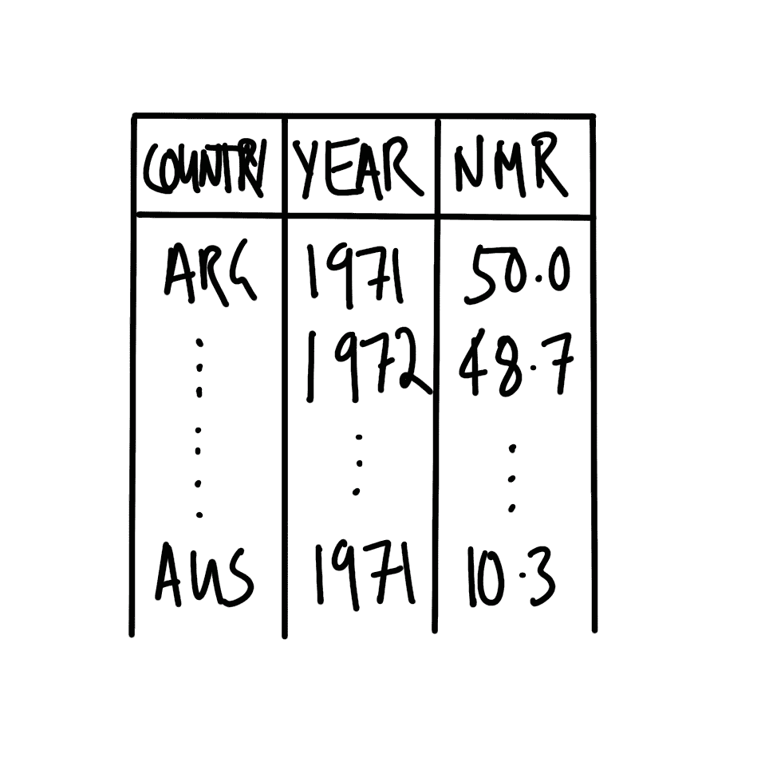

(a) 一个可能有用的 NMR 数据集的快速草图

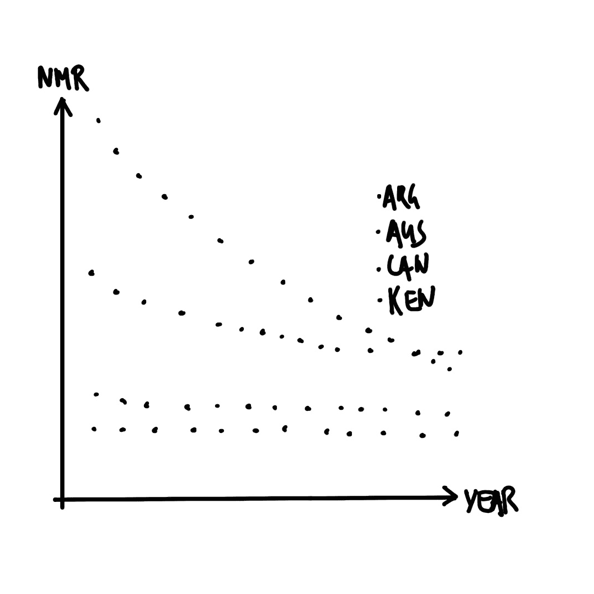

(b) 随时间变化的 NMR 按国家分布的快速草图

图 2.7：关于新生儿死亡率（NMR）的数据集和图表草图

我们对制作一个以年份为 x 轴和估计的 NMR 为 y 轴的图表感兴趣。每个国家都应该有自己的序列。我们正在寻找的快速草图是图 2.7 (b)。

### 2.4.2 模拟

我们希望模拟一些与我们的计划一致的数据。在这种情况下，我们需要三个列：国家、年份和 NMR。

在 Posit Cloud 中创建一个新的 Quarto 文档并保存。添加前言文档并设置工作区。我们将使用`tidyverse`、`janitor`和`lubridate`。

```r
#### Preamble ####
# Purpose: Obtain and prepare data about neonatal mortality for
# four countries for the past fifty years and create a graph.
# Author: Rohan Alexander
# Email: rohan.alexander@utoronto.ca
# Date: 1 July 2022
# Prerequisites: -

#### Workspace setup ####
library(janitor)
library(lubridate)
library(tidyverse)
```

包含在包中的代码可能会随着作者的更新和新版本的发布而随时改变。我们可以使用`packageVersion()`来查看我们正在使用哪个版本的包。例如，我们正在使用`tidyverse`的 2.0.0 版本和`janitor`的 2.2.0 版本。

```r
packageVersion("tidyverse")
```

```r
[1] '2.0.0'
```

```r
packageVersion("janitor")
```

```r
[1] '2.2.0'
```
为了更新我们已安装的所有包的版本，我们使用`update.packages()`。我们可以使用`tidyverse_update()`仅安装`tidyverse`包。这不需要每天运行，但时不时地更新包是值得的。虽然许多包会注意确保向后兼容性，但在某个点上这变得不可能。更新包可能会导致旧代码需要重写。当你刚开始时，这并不是什么大问题，而且无论如何，都有针对加载特定版本的工具，我们将在第三章中介绍。

返回到模拟，我们使用`rep()`重复每个国家的名称 50 次，并启用 50 年的传递。最后，我们使用`runif()`从均匀分布中抽取，为该国家的该年模拟一个估计的 NMR 值。

```r
#### Simulate data ####
set.seed(853)

simulated_nmr_data <-
 tibble(
 country =
 c(rep("Argentina", 50), rep("Australia", 50), 
 rep("Canada", 50), rep("Kenya", 50)),
 year =
 rep(c(1971:2020), 4),
 nmr =
 runif(n = 200, min = 0, max = 100)
 )

head(simulated_nmr_data)
```

```r
# A tibble: 6 × 3
  country    year   nmr
  <chr>     <int> <dbl>
1 Argentina  1971 35.9 
2 Argentina  1972 12.0 
3 Argentina  1973 48.4 
4 Argentina  1974 31.6 
5 Argentina  1975  3.74
6 Argentina  1976 40.4 
```
虽然这个模拟是可行的，但如果我们决定模拟的不是 50 年，而是比如说 60 年，那么这个过程将会耗时且容易出错。改进这个代码的一种方法是将所有 50 的实例替换为一个变量。

```r
#### Simulate data ####
set.seed(853)

number_of_years <- 50

simulated_nmr_data <-
 tibble(
 country =
 c(rep("Argentina", number_of_years), rep("Australia", number_of_years),
 rep("Canada", number_of_years), rep("Kenya", number_of_years)),
 year =
 rep(c(1:number_of_years + 1970), 4),
 nmr =
 runif(n = number_of_years * 4, min = 0, max = 100)
 )

head(simulated_nmr_data)
```

```r
# A tibble: 6 × 3
  country    year   nmr
  <chr>     <dbl> <dbl>
1 Argentina  1971 35.9 
2 Argentina  1972 12.0 
3 Argentina  1973 48.4 
4 Argentina  1974 31.6 
5 Argentina  1975  3.74
6 Argentina  1976 40.4 
```
结果将会相同，但现在如果我们想从 50 年改为 60 年，我们只需要在一个地方进行更改。

我们可以对这个模拟数据集有信心，因为它相对简单，我们为其编写了代码。但是当我们转向真实数据集时，更难确保它就是它所声称的那样。即使我们信任数据，我们也需要能够与他人分享这种信心。一种前进的方法是建立一些测试，以确定我们的数据是否如我们所期望的那样。例如，我们期望：

1.  “国家”仅限于这四个之一：“阿根廷”、“澳大利亚”、“加拿大”或“肯尼亚”。

1.  相反，“国家”包含这四个国家中的所有国家。

1.  “年份”不小于 1971 且不大于 2020，并且是一个整数，不是一个字母或带有小数的数字。

1.  “nmr”是一个介于 0 和 1,000 之间的值，并且是一个数字。

我们可以基于这些特征编写一系列测试，我们期望数据集能够通过这些测试。

```r
simulated_nmr_data$country |>
 unique() == c("Argentina", "Australia", "Canada", "Kenya")

simulated_nmr_data$country |>
 unique() |>
 length() == 4

simulated_nmr_data$year |> min() == 1971
simulated_nmr_data$year |> max() == 2020
simulated_nmr_data$nmr |> min() >= 0
simulated_nmr_data$nmr |> max() <= 1000
simulated_nmr_data$nmr |> class() == "numeric"
```

通过这些测试，我们可以对模拟数据集有信心。更重要的是，我们可以将这些测试应用于实际数据集。这使得我们对该数据集有更大的信心，并且可以与他人分享这种信心。
  
### 2.4.3 获取

联合国儿童死亡率估算机构组（IGME）[提供](https://childmortality.org/)我们可以下载和保存的 NMR 估算。

```r
#### Acquire data ####
raw_igme_data <-
 read_csv(
 file =
 "https://childmortality.org/wp-content/uploads/2021/09/UNIGME-2021.csv",
 show_col_types = FALSE
 )

write_csv(x = raw_igme_data, file = "igme.csv")
```

有了这样的数据，阅读有关数据的支持材料可能会有所帮助。在这种情况下，一个代码簿可在[这里](https://childmortality.org/wp-content/uploads/2021/03/CME-Info_codebook_for_downloads.xlsx)找到。之后我们可以快速查看数据集，以更好地了解它。我们可能对使用`head()`和`tail()`查看数据集的外观以及使用`names()`查看列名感兴趣。

```r
head(raw_igme_data)
```

```r
# A tibble: 6 × 29
  `Geographic area` Indicator              Sex   `Wealth Quintile` `Series Name`
  <chr>             <chr>                  <chr> <chr>             <chr>        
1 Afghanistan       Neonatal mortality ra… Total Total             Multiple Ind…
2 Afghanistan       Neonatal mortality ra… Total Total             Multiple Ind…
3 Afghanistan       Neonatal mortality ra… Total Total             Multiple Ind…
4 Afghanistan       Neonatal mortality ra… Total Total             Multiple Ind…
5 Afghanistan       Neonatal mortality ra… Total Total             Multiple Ind…
6 Afghanistan       Neonatal mortality ra… Total Total             Afghanistan …
# ℹ 24 more variables: `Series Year` <chr>, `Regional group` <chr>,
#   TIME_PERIOD <chr>, OBS_VALUE <dbl>, COUNTRY_NOTES <chr>, CONNECTION <lgl>,
#   DEATH_CATEGORY <lgl>, CATEGORY <chr>, `Observation Status` <chr>,
#   `Unit of measure` <chr>, `Series Category` <chr>, `Series Type` <chr>,
#   STD_ERR <dbl>, REF_DATE <dbl>, `Age Group of Women` <chr>,
#   `Time Since First Birth` <chr>, DEFINITION <chr>, INTERVAL <dbl>,
#   `Series Method` <chr>, LOWER_BOUND <dbl>, UPPER_BOUND <dbl>, …


```r
names(raw_igme_data)
```

```r
 [1] "Geographic area"        "Indicator"              "Sex"                   
 [4] "Wealth Quintile"        "Series Name"            "Series Year"           
 [7] "Regional group"         "TIME_PERIOD"            "OBS_VALUE"             
[10] "COUNTRY_NOTES"          "CONNECTION"             "DEATH_CATEGORY"        
[13] "CATEGORY"               "Observation Status"     "Unit of measure"       
[16] "Series Category"        "Series Type"            "STD_ERR"               
[19] "REF_DATE"               "Age Group of Women"     "Time Since First Birth"
[22] "DEFINITION"             "INTERVAL"               "Series Method"         
[25] "LOWER_BOUND"            "UPPER_BOUND"            "STATUS"                
[28] "YEAR_TO_ACHIEVE"        "Model Used" 
```
我们希望清理名称，只保留我们感兴趣的行和列。根据我们的计划，我们感兴趣的行是“Sex”为“Total”，“Series Name”为“UN IGME estimate”，“Geographic area”为“阿根廷”、“澳大利亚”、“加拿大”和“肯尼亚”之一，“Indicator”为“新生儿死亡率”。之后我们只对以下几列感兴趣：“geographic_area”，“time_period”和“obs_value”。

```r
cleaned_igme_data <-
 clean_names(raw_igme_data) |>
 filter(
 sex == "Total",
 series_name == "UN IGME estimate",
 geographic_area %in% c("Argentina", "Australia", "Canada", "Kenya"),
 indicator == "Neonatal mortality rate"
 ) |>
 select(geographic_area, time_period, obs_value)

head(cleaned_igme_data)
```

```r
# A tibble: 6 × 3
  geographic_area time_period obs_value
  <chr>           <chr>           <dbl>
1 Argentina       1970-06          24.9
2 Argentina       1971-06          24.7
3 Argentina       1972-06          24.6
4 Argentina       1973-06          24.6
5 Argentina       1974-06          24.5
6 Argentina       1975-06          24.1
```
我们需要修复两个其他方面：当我们需要它为年份时，“time_period”的类别是字符，而“obs_value”的名称应该是“nmr”以提供更多信息。

```r
cleaned_igme_data <-
 cleaned_igme_data |>
 mutate(
 time_period = str_remove(time_period, "-06"),
 time_period = as.integer(time_period)
 ) |>
 filter(time_period >= 1971) |>
 rename(nmr = obs_value, year = time_period, country = geographic_area)

head(cleaned_igme_data)
```

```r
# A tibble: 6 × 3
  country    year   nmr
  <chr>     <int> <dbl>
1 Argentina  1971  24.7
2 Argentina  1972  24.6
3 Argentina  1973  24.6
4 Argentina  1974  24.5
5 Argentina  1975  24.1
6 Argentina  1976  23.3
```
最后，我们可以检查我们的数据集是否通过了基于模拟数据集开发的测试。

```r
cleaned_igme_data$country |>
 unique() == c("Argentina", "Australia", "Canada", "Kenya")
```

```r
[1] TRUE TRUE TRUE TRUE
```

```r
cleaned_igme_data$country |>
 unique() |>
 length() == 4
```

```r
[1] TRUE
```

```r
cleaned_igme_data$year |> min() == 1971
```

```r
[1] TRUE
```

```r
cleaned_igme_data$year |> max() == 2020
```

```r
[1] TRUE
```

```r
cleaned_igme_data$nmr |> min() >= 0
```

```r
[1] TRUE
```

```r
cleaned_igme_data$nmr |> max() <= 1000
```

```r
[1] TRUE
```

```r
cleaned_igme_data$nmr |> class() == "numeric"
```

```r
[1] TRUE
```
  
所有剩下的就是保存这个整洁的清洗后的数据集。

```r
write_csv(x = cleaned_igme_data, file = "cleaned_igme_data.csv")
```
  
### 2.4.4 探索

我们希望使用清洗后的数据集制作一个估计的 NMR 图表。首先，我们读取数据集。

```r
#### Explore ####
cleaned_igme_data <-
 read_csv(
 file = "cleaned_igme_data.csv",
 show_col_types = FALSE
 )
```

现在我们可以制作一个图表，展示 NMR 随时间的变化以及各国之间的差异（图 2.8）。

```r
cleaned_igme_data |>
 ggplot(aes(x = year, y = nmr, color = country)) +
 geom_point() +
 theme_minimal() +
 labs(x = "Year", y = "Neonatal Mortality Rate (NMR)", color = "Country") +
 scale_color_brewer(palette = "Set1") +
 theme(legend.position = "bottom")
```


图 2.8：阿根廷、澳大利亚、加拿大和肯尼亚的新生儿死亡率（NMR）（1971-2020)

### 2.4.5 分享

到目前为止，我们下载了一些数据，对其进行了清洗，编写了一些测试，并制作了一个图表。我们通常需要详细地沟通我们所做的工作。在这种情况下，我们将写几段关于我们所做的工作、为什么这样做以及我们发现了什么。

> 新生儿死亡率是指出生后第一个月内发生的死亡。特别是，新生儿死亡率（NMR）是指每 1,000 名活产婴儿中的新生儿死亡数。我们获得了过去 50 年中阿根廷、澳大利亚、加拿大和肯尼亚四个国家的 NMR 估算数据。
> 
> 联合国儿童死亡率估算机构间小组（IGME）在网站：https://childmortality.org/上提供了 NMR 的估算数据。我们下载了他们的估算数据，然后使用统计编程语言 R（R Core Team 2024）对数据集进行了清洗和整理。
> 
> 我们发现，在时间上和四个感兴趣的国家之间，估算的 NMR 发生了相当大的变化（图 2.8）。我们发现，20 世纪 70 年代通常与估算的 NMR 的减少有关。当时澳大利亚和加拿大的 NMR 估计较低，并且一直保持到 2020 年，略有下降。阿根廷和肯尼亚的估算数据在 2020 年之前持续大幅下降。
> 
> 我们的结果表明，估算的 NMR 随着时间的推移有了相当大的改善。NMR 估算基于统计模型和基础数据。数据的双重负担是，对于结果较差的群体，例如国家，高质量的数据往往更难获得。我们的结论受支撑估算的模型和基础数据质量的影响，我们没有独立验证这两者。
  
## 2.5 结论

在本章中，我们覆盖了大量的内容，没有完全跟上是很正常的。最好的做法是自行花时间逐个研究三个案例研究。亲自编写所有代码，而不是复制粘贴，逐步运行，即使你并不完全理解它在做什么。然后尝试为它添加自己的注释。

在这个阶段，没有必要完全理解本章的所有内容。一些学生发现，继续阅读本书的下一章，稍后再回到这一章是最好的做法。令人兴奋的是，我们展示了只需工作一两个小时，就有可能利用数据了解世界的一些情况。随着我们发展这些技能，我们也希望越来越深入地考虑我们工作的更广泛影响。

> “我们不需要思考我们工作的社会影响，因为那很困难，其他人可以为我们做”这种论点是相当糟糕的。我停止了 CV [计算机视觉]研究，因为我看到了我的工作产生的影响。我喜欢这项工作，但军事应用和隐私问题最终变得无法忽视。但基本上，如果我们认真对待更广泛的影响部分，所有面部识别工作都不会被发表。几乎没有正面影响，风险巨大。不过，公平地说，我应该有更多的谦卑。在研究生的大部分时间里，我信奉了科学无政治性和研究客观道德且无论主题如何都是好的这种神话。
> 
> 乔·雷德蒙，2020 年 2 月 20 日

尽管在学术界、工业界以及更广泛的意义上，“数据科学”一词无处不在，但正如我们所看到的，它很难定义。数据科学的一个故意具有对抗性的定义是“将人性无情地降低到可以计数的东西”（Keyes 2019）。虽然这个定义是有意引起争议的，但它突出了过去十年对数据科学和定量方法需求增加的一个原因——个人及其行为现在是核心。许多技术已经存在了几十年，但使它们现在变得流行的是这种对人的关注。

很不幸，尽管大部分工作可能集中在个人身上，但隐私和同意问题以及更广泛的伦理问题似乎很少被放在首位。虽然有一些例外，但总的来说，即使在声称人工智能、机器学习和数据科学将改变社会的同时，对这些问题的考虑似乎被当作是一种美好的愿望，而不是在我们拥抱变革之前需要思考的事情。

在很大程度上，这些问题并不新鲜。在科学领域，围绕 CRISPR 技术和基因编辑已经进行了广泛的伦理考量（Brokowski 和 Adli 2019；Marchese 2022）。在更早的时候，类似的讨论已经发生，例如，关于沃纳·冯·布劳恩被允许为美国建造火箭，尽管他之前为纳粹德国做过同样的事情（Neufeld 2002；Wilford 1977）。在医学领域，这些问题已经有一段时间是关注的焦点（美国医学协会和纽约医学院 1848）。数据科学似乎决心拥有自己的塔斯克基时刻，而不是基于其他领域的经验去思考并积极解决这些问题。

话虽如此，有一些证据表明，一些数据科学家开始更加关注实践中的伦理问题。例如，NeurIPS，一个享有盛誉的机器学习会议，自 2020 年以来要求所有提交的论文都附有伦理声明。

> 为了提供一个平衡的视角，作者需要包括他们工作的潜在更广泛影响声明，包括其伦理方面和未来的社会后果。作者应仔细讨论积极和消极的结果。
> 
> NeurIPS 2020 会议征稿通知

伦理考虑和对数据科学更广泛影响的关注的目的不是为了规定性地决定哪些事情可以或不可以做，而是为了提供一个机会，提出一些应该优先考虑的问题。数据科学应用的多样性、该领域的相对年轻和变化速度，意味着这种考虑有时会被有意地置于一旁，这在其他领域是可以接受的。这与科学、医学、工程和会计等领域形成对比。可能这些领域更加自我意识(图 2.9)。

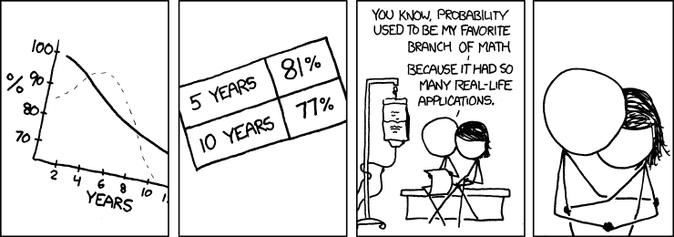

图 2.9：数字不能脱离其上下文，正如 Randall Munroe 在“概率”中所展示的：https://xkcd.com/881/。

## 2.6 练习

### 练习

1.  *(计划)* 考虑以下场景：*一个人每天记录他们是否捐赠了 1 美元、2 美元或 3 美元，持续一年。* 请绘制一个可能的数据集的样子，然后绘制一个图表来展示所有观察结果。

1.  *(模拟)* 进一步考虑所描述的场景，并模拟这种情况。仔细指定一个合适的场景使用`sample()`。然后根据模拟数据编写五个测试。

1.  *(获取)* 请指定一个关于您感兴趣的国家慈善捐赠金额的实际数据来源。

1.  *(探索)* 加载`tidyverse`并使用`geom_bar()`制作条形图。

1.  *(分享)* 请像从您确定的数据源（而不是模拟数据）中收集数据一样，写两段话，并且如果您使用模拟数据构建的图表反映了实际情况。段落中包含的详细内容不必是事实，但应该是合理的（即，您实际上不需要获取数据或创建图表）。提交一个 GitHub Gist 链接。

### 小测验

1.  关于学习数据科学，Barrett(2021)强调了什么（选择一个）？

    1.  快速、密集的学习会话。

    1.  通过失败学习。

    1.  一次性大型项目。

    1.  小而一致的行动。

1.  从 Chambliss(1989)那里，关于卓越（选择一个），他是什么看法？

    1.  在世界级水平上长期表现。

    1.  所有奥运金牌得主。

    1.  性能的一致优越性。

    1.  所有国家级运动员。

1.  从 Chambliss (1989)，导致优秀的关键因素是什么（选择一个）？

    1.  天赋。

    1.  资源访问。

    1.  特殊的训练方法。

    1.  纪律、技术和态度。

1.  思考以下来自 Chambliss (1989, 81)的引言，并列出三个有助于你在数据科学中实现优秀的小技能或活动。

> 优秀是平凡的。卓越的表现实际上是一系列数十个小技能或活动的汇聚，每个都是学习或偶然发现的，经过精心训练成为习惯，然后组合成一个综合的整体。在这些行动中没有任何非凡或超凡脱俗的地方；只有它们被一致且正确地完成，并且整体上产生了优秀。

1.  Hao (2019)的主要关注点是什么（选择一个）？

    1.  招聘实践中的偏见。

    1.  人工智能模型如何加剧偏见。

    1.  人工智能在决策中的好处。

    1.  通过编码技术减少偏见。

1.  不是 Hao（2019）提到的四个减轻偏见挑战之一的是什么（选择一个）？

    1.  未知之未知。

    1.  不完善的过程。

    1.  在考虑利润的情况下不感兴趣。

    1.  社会背景的缺乏。

    1.  公平的定义。

1.  `tidyverse`帮助文件中的第一句话是什么（提示：在控制台中运行`?tidyverse`）（选择一个）？

    1.  “‘tidyverse’是一组有偏见的包集合，旨在帮助处理数据科学中的常见任务。”

    1.  “欢迎使用‘tidyverse’。”

    1.  “‘tidyverse’是一组协同工作的包，因为它们共享常见的数据表示和‘API’设计。”

1.  使用帮助文件确定以下哪些是`read_csv()`的参数（选择所有适用的）？

    1.  “all_cols”

    1.  “file”

    1.  “col_types”

    1.  “show_col_types”

1.  在*用数据讲故事*的工作流程中，数据科学项目的第一步是什么（选择一个）？

    1.  探索。

    1.  模拟。

    1.  分享。

    1.  规划。

1.  在`tidyverse`的核心包中，哪个`R`包主要用于数据操作（选择一个）？

    1.  `ggplot2`

    1.  `dplyr`

    1.  `janitor`

    1.  `lubridate`

1.  哪个函数用于使列名更容易处理（选择一个）？

    1.  `rename()`

    1.  `mutate()`

    1.  `clean_names()`

    1.  `filter()`

1.  `ggplot2`的主要用途是什么（选择一个）？

    1.  执行统计分析。

    1.  创建和定制数据可视化。

    1.  清理杂乱的数据。

    1.  自动化数据录入。

1.  `R`中的哪个运算符用于将一个函数的输出传递给另一个函数作为输入（选择一个）？

    1.  `|>`

    1.  `~`

    1.  `->`

    1.  `+`

1.  `mutate()`函数来自`dplyr`包的作用是什么（选择一个）？

    1.  过滤行。

    1.  分组数据。

    1.  创建或修改列。

    1.  清理数据。

1.  为什么在模拟期间使用`set.seed()`很重要（选择一个）？

    1.  使过程更快。

    1.  使随机结果更具可重复性。

    1.  为了减少代码中的错误。

    1.  为了自动化数据获取。

1.  在*用数据讲故事*的工作流程中，为什么我们要模拟数据（选择所有适用的）？

    1.  它迫使我们深入到计划的细节，并带来一些具体性。

    1.  它为我们提供了一个深入思考数据生成过程的机会。

    1.  模拟就是你所需要的一切。

    1.  它有助于团队合作。

1.  当使用 R 的 `sample()` 函数时，“replace = TRUE” 是什么意思（选择一个）？

    1.  较早的值被较晚的值替换，这有助于可重复性。

    1.  每个值都是唯一的。

    1.  同一个值可以被选择多次。

1.  `rpois()` 从哪个分布中抽取（选择一个）。

    1.  正态分布。

    1.  均匀分布。

    1.  泊松分布。

    1.  指数分布。

1.  `runif()` 从哪个分布中抽取（选择一个）？

    1.  正态分布。

    1.  均匀分布。

    1.  泊松分布。

    1.  指数分布。

1.  以下哪个可以分别用于从正态分布和二项分布中抽取（选择一个）？

    1.  `rnorm()` 和 `rbinom()`.

    1.  `rnorm()` 和 `rbinom()`.

    1.  `rnormal()` 和 `rbinomial()`.

    1.  `rnormal()` 和 `rbinom()`.

1.  当种子设置为“853”时，`sample(x = letters, size = 2)` 的结果是什么？当种子设置为“1234”时呢（选择一个）？

    1.  ‘“i” “q”’ 和 ‘“e” “r”’。

    1.  ‘“e” “l”’ 和 ‘“e” “r”’。

    1.  ‘“i” “q”’ 和 ‘“p” “v”’。

    1.  ‘“e” “l”’ 和 ‘“p” “v”’。

1.  哪个函数提供了引用 R 的推荐引用（选择一个）？

    1.  `cite("R")`.

    1.  `citation()`.

    1.  `citation("R")`.

    1.  `cite()`.

1.  我们如何获取 `opendatatoronto` 的引用信息（选择一个）？

    1.  `cite()`

    1.  `citation()`

    1.  `citation("opendatatoronto")`

    1.  `cite("opendatatoronto")`

1.  哪个函数用于更新包（选择一个）？

    1.  `update.packages()`

    1.  `upgrade.packages()`

    1.  `revise.packages()`

    1.  `renovate.packages()`

1.  我们可能期望一个声称是年份的列有哪些特征（选择所有适用的）？

    1.  类别是“character”。

    1.  没有负数。

    1.  列中有字母。

    1.  每个条目都有四个数字。

1.  请在以下代码中添加一个小错误。然后将它添加到 GitHub Gist 并提交 URL。

```r
midwest |>
 ggplot(aes(x = poptotal, y = popdensity, color = state)) +
 geom_point() +
 scale_x_log10() +
 scale_y_log10()
```

27.  为什么我们要模拟数据集（至少写三个要点）？

1.  这段代码 `library(datasauRus)` 运行后出现错误“Error in library(datasauRus) : there is no package called ‘datasauRus’”。最可能的问题是什么（选择一个）？

    1.  `datasauRus` 包没有被安装。

    1.  名称 `datasauRus` 中的错别字。

    1.  `datasauRus` 和另一个包之间存在包冲突。

1.  在关于新生儿死亡率的数据集中，用于存储国家名称的变量最好的名称是什么（选择一个）？

    1.  “ctry”

    1.  “geo_area”

    1.  “country”

### 课堂活动

+   在 `simulation.R` 脚本中，选择 `dplyr` 的一个动词 – `mutate()`, `select()`, `filter()`, `arrange()`, `summarize()` – 并在模拟的例子中解释它所做的工作。

+   在 `simulation.R` 脚本中模拟从均匀分布中抽取 100 个值，均值为 5，标准差为 2。在 `tests.R` 脚本中为这个数据集写一个测试。

+   在 `simulation.R` 脚本中模拟从泊松分布（lambda=10）中抽取 50 个值。在 `tests.R` 脚本中为这个数据集写两个测试。

+   使用 Open Data Toronto 在`gather.R`脚本中收集多伦多婚姻许可证统计数据。在`cleaning.R`脚本中清理它。¹ 在 Quarto 文档中绘制图表。

+   以下代码产生了一个错误。请将其添加到 GitHub Gist 中，然后在适当的场所寻求帮助。

```r
tibble(year = 1875:1972,
 level = as.numeric(datasets::LakeHuron)) |>
 ggplot(aes(x = year, y = level)) |>
 geom_point()
```

以下代码创建了一个在日期方面的奇形怪状的图表。请识别问题并修复它，通过在`ggplot()`之前添加函数。

```r
set.seed(853)

data <-
 tibble(date = as.character(sample(seq(
 as.Date("2022-01-01"),
 as.Date("2022-12-31"),
 by = "day"
 ),
 10)), # https://stackoverflow.com/a/21502397
 number = rcauchy(n = 10, location = 1) |> round(0))

data |> 
 # MAKE CHANGE HERE
 ggplot(aes(x = date, y = number)) +
 geom_col()
```

考虑以下代码来制作图表。你希望将图例移动到底部，但忘记了`ggplot2`函数如何做到这一点。请使用 LLM 来识别所需的变化。分享你的提示。

```r
penguins |> 
 drop_na() |> 
 ggplot(aes(x = bill_length_mm, y = bill_depth_mm, color = species)) +
 geom_point()
``` 
### 任务

这个任务的目的是要重新做澳大利亚选举的例子，但针对加拿大。这是一个在现实环境中工作的机会，因为加拿大的情况有一些不同，但澳大利亚的例子提供了指导。

作为背景，加拿大的议会共有 338 个席位，也称为“选区”，在众议院中。主要政党有：主要政党：自由党和保守党；小政党：魁北克人党、新民主党、绿党；一些较小的政党和无党派人士。你应该遵循的步骤是：

1.  计划：

    +   数据集：每个观测值应包括选区名称和当选候选人的政党。

    +   图表：图表应显示每个政党赢得的选区数量。

1.  模拟：

    +   创建一个 Quarto 文档。

    +   加载必要的包：`tidyverse`和`janitor`。

    +   通过随机分配政党到选区来模拟选举结果：为选区添加数字，然后使用`sample()`随机选择六个选项之一，重复 338 次。

1.  获取：

    +   从加拿大选举局[这里](https://www.elections.ca/res/rep/off/ovr2021app/53/data_donnees/table_tableau11.csv)下载 CSV 文件。

    +   清理名称，然后选择两个感兴趣的列：“electoral_district_name_nom_de_circonscription”和“elected_candidate_candidat_elu”。最后，重命名这些列以去除法语并简化名称。

    +   我们需要的列是关于当选候选人的。它包含当选候选人的姓氏，后面跟着一个逗号，然后是他们的名字，后面跟着一个空格，然后是英语和法语中的政党名称，由斜杠分隔。使用`tidyr`中的`separate()`将此列拆分成各个部分，然后使用`select()`仅保留政党信息（以下是一些辅助代码）。

    +   最后，将政党名称从法语重编码为英语，以匹配我们模拟的内容。

```r
cleaned_elections_data <-
 cleaned_elections_data |>
 separate(
 col = elected_candidate,
 into = c("Other", "party"),
 sep = "/"
 ) |>
 select(-Other)
```

4.  探索：

    +   制作一张关于 2021 年加拿大联邦选举中每个政党赢得的选区数量的精美图表。

1.  分享：

    +   写几段关于你做了什么，为什么这样做，以及你发现了什么的文字。提交一个 GitHub Gist 的链接。

美国医学协会和纽约医学院。1848 年。*医学伦理准则*。医学院。[`hdl.handle.net/2027/chi.57108026`](https://hdl.handle.net/2027/chi.57108026)。Arel-Bundock, Vincent. 2024 年。*tinytable: 在“HTML”、“LaTeX”、“Markdown”、“Word”、“PNG”、“PDF”和“Typst”格式中的简单且可配置的表格*。[`vincentarelbundock.github.io/tinytable/`](https://vincentarelbundock.github.io/tinytable/).Barrett, Malcolm. 2021 年。*数据科学作为一种原子习惯*。[`malco.io/articles/2021-01-04-data-science-as-an-atomic-habit`](https://malco.io/articles/2021-01-04-data-science-as-an-atomic-habit).Brokowski, Carolyn，和 Mazhar Adli. 2019 年。“CRISPR 伦理：应用强大工具的道德考量。”*分子生物学杂志* 431 (1): 88–101。[`doi.org/10.1016/j.jmb.2018.05.044`](https://doi.org/10.1016/j.jmb.2018.05.044).Bronner, Laura. 2020 年。“为什么统计数据无法捕捉警务系统系统性偏见的全貌。”*五三八大旗*，六月。[`fivethirtyeight.com/features/why-statistics-dont-capture-the-full-extent-of-the-systemic-bias-in-policing/`](https://fivethirtyeight.com/features/why-statistics-dont-capture-the-full-extent-of-the-systemic-bias-in-policing/).Cardoso, Tom. 2020 年。“监狱背后的偏见：环球调查发现监狱系统对黑人原住民囚犯不利。”*环球邮报*，十月。[`www.theglobeandmail.com/canada/article-investigation-racial-bias-in-canadian-prison-risk-assessments/`](https://www.theglobeandmail.com/canada/article-investigation-racial-bias-in-canadian-prison-risk-assessments/).Chambliss, Daniel. 1989 年。“卓越的平凡：关于分层和奥运游泳者的民族志报告。”*社会学理论* 7 (1): 70–86。[`doi.org/10.2307/202063`](https://doi.org/10.2307/202063).多伦多市政府。2021 年。*2021 年街道需求评估*。[`www.toronto.ca/city-government/data-research-maps/research-reports/housing-and-homelessness-research-and-reports/`](https://www.toronto.ca/city-government/data-research-maps/research-reports/housing-and-homelessness-research-and-reports/).Firke, Sam. 2023 年。*janitor: 简单工具用于检查和清理脏数据*。[`CRAN.R-project.org/package=janitor`](https://CRAN.R-project.org/package=janitor).Gelfand, Sharla. 2022 年。*opendatatoronto: 访问多伦多市政府开放数据门户*。[`CRAN.R-project.org/package=opendatatoronto`](https://CRAN.R-project.org/package=opendatatoronto).Grolemund, Garrett，和 Hadley Wickham. 2011 年。“使用 lubridate 使日期和时间变得简单。”*统计软件杂志* 40 (3): 1–25。[`doi.org/10.18637/jss.v040.i03`](https://doi.org/10.18637/jss.v040.i03).Hao, Karen. 2019 年。“这是 AI 偏见真正发生的方式——以及为什么它如此难以修复。”*麻省理工学院技术评论*，二月。[`www.technologyreview.com/2019/02/04/137602/this-is-how-ai-bias-really-happensand-why-its-so-hard-to-fix/`](https://www.technologyreview.com/2019/02/04/137602/this-is-how-ai-bias-really-happensand-why-its-so-hard-to-fix/).Keyes, Os. 2019 年。“计数无数。”*真实生活*。[`reallifemag.com/counting-the-countless/`](https://reallifemag.com/counting-the-countless/).Marchese, David. 2022 年。“她的发现改变了世界。她认为我们应该如何使用它？”*纽约时报*，八月。[`www.nytimes.com/interactive/2022/08/15/magazine/jennifer-doudna-crispr-interview.html`](https://www.nytimes.com/interactive/2022/08/15/magazine/jennifer-doudna-crispr-interview.html).Neufeld, Michael. 2002 年。“沃纳·冯·布劳恩、SS 和集中营劳工：道德、政治和刑事责任问题。”*德国研究评论* 25 (1): 57–78。[`doi.org/10.2307/1433245`](https://doi.org/10.2307/1433245).R 核心团队。2024 年。*R：统计计算的语言和环境*。奥地利维也纳：R 统计计算基金会。[`www.R-project.org/`](https://www.R-project.org/).联合国 IGME。2021 年。“2021 年儿童死亡率水平和趋势。”[`childmortality.org/wp-content/uploads/2021/12/UNICEF-2021-Child-Mortality-Report.pdf`](https://childmortality.org/wp-content/uploads/2021/12/UNICEF-2021-Child-Mortality-Report.pdf).Wickham, Hadley. 2016 年。*ggplot2：数据分析的优雅图形*。施普林格纽约。[`ggplot2.tidyverse.org`](https://ggplot2.tidyverse.org)。——。2017 年。*tidyverse：轻松安装和加载“tidyverse”*。[`CRAN.R-project.org/package=tidyverse`](https://CRAN.R-project.org/package=tidyverse)。——。2019 年。*高级 R*。第 2 版。查普曼；霍尔/CRC。[`adv-r.hadley.nz`](https://adv-r.hadley.nz)。——。2022 年。*stringr：常见字符串操作的简单、一致包装器*。[`CRAN.R-project.org/package=stringr`](https://CRAN.R-project.org/package=stringr)。Wickham, Hadley，Mara Averick，Jenny Bryan，Winston Chang，Lucy D’Agostino McGowan，Romain François，Garrett Grolemund 等。2019 年。“欢迎来到 tidyverse。”*开源软件杂志* 4 (43): 1686。[`doi.org/10.21105/joss.01686`](https://doi.org/10.21105/joss.01686)。Wickham, Hadley，Mine Çetinkaya-Rundel，和 Garrett Grolemund。2016 年。2023 年。*R 数据科学*。第 2 版。奥莱利媒体。[`r4ds.hadley.nz`](https://r4ds.hadley.nz)。Wickham, Hadley，Romain François，Lionel Henry，和 Kirill Müller。2022 年。*dplyr：数据操作的语法*。[`CRAN.R-project.org/package=dplyr`](https://CRAN.R-project.org/package=dplyr)。Wickham, Hadley，Jim Hester，和 Jenny Bryan。2022 年。*readr：读取矩形文本数据*。[`CRAN.R-project.org/package=readr`](https://CRAN.R-project.org/package=readr)。Wickham, Hadley，Davis Vaughan，和 Maximilian Girlich。2023 年。*tidyr：整理混乱的数据*。[`CRAN.R-project.org/package=tidyr`](https://CRAN.R-project.org/package=tidyr)。Wilford, John Noble. 1977 年。“火箭先驱沃纳·冯·布劳恩去世。”*纽约时报*，六月。[`www.nytimes.com/1977/06/18/archives/wernher-von-braun-rocket-pioneer-dies-wernher-von-braun-pioneer-in.html`](https://www.nytimes.com/1977/06/18/archives/wernher-von-braun-rocket-pioneer-dies-wernher-von-braun-pioneer-in.html)。Xie, Yihui. 2023 年。*knitr：R 中动态报告生成的通用包*。[`yihui.org/knitr/`](https://yihui.org/knitr/).

1.  考虑使用 `separate()` 然后是 `lubridate::ymd()` 对日期进行处理。↩︎

