# 3  可重复性工作流程

> 原文：[`tellingstorieswithdata.com/03-workflow.html`](https://tellingstorieswithdata.com/03-workflow.html)

1.  基础

1.  3  可重复性工作流程

Chapman and Hall/CRC 在 2023 年 7 月出版了这本书。您可以在 [这里](https://www.routledge.com/Telling-Stories-with-Data-With-Applications-in-R/Alexander/p/book/9781032134772) 购买。这个在线版本对印刷版有所更新。*  **先决条件**

+   阅读 *What has happened down here is the winds have changed*，(Gelman 2016)

    +   一篇概述复制危机以及社会科学如何应对其变化的博客文章。

+   阅读 *Good enough practices in scientific computing*，(Wilson et al. 2017)

    +   一篇提供一套清晰、易于采纳的数据科学实践建议的论文，重点关注我们如何使用计算机。

+   阅读 *How to improve your relationship with your future self*，(Bowers and Voors 2016)

    +   一篇提供一套清晰、易于采纳的数据科学实践建议的论文，重点关注分析。

+   观看 *Overcoming barriers to sharing code*，(Alexander 2021)

    +   这段视频是对分享代码感到舒适的个人反思。

+   观看 *Make a reprex$\dots$ Please*，(Gelfand 2021)

    +   这段视频详细说明了在寻求帮助时创建可重复示例为什么如此重要。

+   阅读 *The tidyverse style guide*，(Wickham 2021)

    +   记录在 R 中编码时推荐的最佳实践的网站。

+   观看 *Code smells and feels*，(Bryan 2018b)

    +   一段详细说明在编码时应避免尝试的事情的视频。

关键概念和技能**

+   可重复性通常开始于某人强加给你的东西。这可能很繁琐且令人烦恼。这通常持续到你需要在小憩后重新访问项目时。在那个时刻，你通常会意识到可重复性不仅仅是数据科学的要求，因为它是我们取得真正进步的唯一方式，而且它有助于我们帮助自己。

+   可重复性意味着共享数据、代码和环境。使用 Quarto、R Projects 和 Git 以及 GitHub 可以增强这一点：Quarto 构建集成普通文本和 R 代码的文档；R Projects 使文件结构不依赖于用户的个人目录设置；Git 和 GitHub 使共享代码和数据变得更加容易。

+   这不是一个无可挑剔的工作流程，但足够好，并提供了许多好处。我们将通过各种工具改进其各个方面，但改进代码结构和注释已经走了很长的路。

+   总是会发生错误，认识到调试是一项随着实践而提高的技能是很重要的。但能够得到帮助的一个关键方面是能够制作出其他人可以使用的可重复示例。

软件和包**

+   基础 R (R Core Team 2024)

+   `AER` (Kleiber and Zeileis 2008)

+   `future` (Bengtsson 2021)

+   `gitcreds` (Csárdi 2022)

+   `lintr` (Hester et al. 2022)

+   `renv` (Ushey 2022)

+   `reprex` (Bryan et al. 2022)

+   `styler` (Müller and Walthert 2022)

+   `tidyverse` (Wickham et al. 2019)

+   `tinytable` (Arel-Bundock 2024)

+   `tinytex` (Xie 2019)

+   `usethis` (Wickham, Bryan, and Barrett 2022)

```r
library(AER)
library(future)
library(gitcreds)
library(lintr)
library(renv)
library(reprex)
library(styler)
library(tidyverse)
library(tinytable)
library(tinytex)
library(usethis)
```

## 3.1 引言

> 关于机器学习，需要记住的第一件事是，性能是在一个数据集的样本上评估的，但在生产中使用模型时，样本可能不一定具有相同的特征$\dots$ 所以当问“你更愿意使用一个评估为 90%准确的模型，还是一个评估为 80%准确的人类”时，答案取决于你的数据是否按照评估过程是典型的。人类是可适应的，而模型则不是。如果涉及重大不确定性，选择人类。他们可能在模式识别能力上不如基于大量数据训练的模型，但他们理解自己正在做什么，他们可以对此进行推理，并且当面对新情况时可以即兴发挥。
> 
> François Chollet, 2020 年 2 月 20 日。

如果科学是关于系统地根据可测试的解释和预测来构建和组织知识，那么数据科学就是在此基础上专注于数据。这意味着构建、组织和共享知识是一个关键方面。以只有你能做到的方式一次性创造知识，并不符合这一标准。因此，需要可重复的数据科学工作流程。

Alexander (2019) 将可重复研究定义为可以精确重做的，前提是使用所有材料。这强调了提供代码、数据和环境的重要性。最低期望是另一个人能够独立地使用你的代码、数据和环境来得到你的结果，包括图表和表格。讽刺的是，不同学科之间对可重复性的定义不同。Barba (2018) 调查了各种学科，并得出结论，占主导地位的语言使用意味着以下定义：

+   可重复研究是指“作者提供所有必要的数据和运行分析所需的计算机代码，以便再次运行分析，重新创建结果。”

+   复制研究是指“达到与另一项研究相同的科学发现，收集新的数据（可能使用不同的方法）并完成新的分析。”

就我们的目的而言，我们使用国家科学院、工程和医学科学院的定义（2019, 46）：“可重复性是使用相同的输入数据；计算步骤、方法和代码；以及分析条件，获得一致结果。”无论具体叫什么，Gelman (2016) 识别了缺乏可重复性在各个社会科学领域中的严重程度。不可重复的工作不会增加我们对世界知识的存量。这是浪费的，甚至可能是不道德的。自从 Gelman (2016) 以来，许多社会科学领域已经做了大量工作，情况有所改善，但仍有许多工作要做。生命科学(Heil et al. 2021)、癌症研究(Begley and Ellis 2012; Mullard 2021)和计算机科学(Pineau et al. 2021)也是如此。

Gelman (2016) 讨论的一些例子在整体框架中并不那么重要。但与此同时，我们看到了，并且继续看到在具有重大影响领域的类似方法被使用。例如，许多政府已经创建了“微调”部门来实施公共政策(Sunstein and Reisch 2017)，尽管有证据表明其中一些主张缺乏可信度(Maier et al. 2022; Szaszi et al. 2022)。政府越来越多地使用他们不公开的算法(Chouldechova et al. 2018)。Herndon、Ash 和 Pollin (2014) 记录了 2007-2008 年金融危机后，政府用来证明紧缩政策的经济学研究最终证明是不可重复的。

至少在少数例外的情况下，我们必须发布我们的代码、数据集和环境。没有这些，很难知道一个发现意味着什么（Miyakawa 2020）。更明显的是，我们也不知道是否存在错误或被无意中忽略的方面（Merali 2010；Hillel 2017；Silver 2020）。越来越多人遵循 Buckheit 和 Donoho (1995)的观点，我们认为论文是一则广告，而相关的代码、数据和环境才是实际的工作。苹果公司的联合创始人史蒂夫·乔布斯谈到了那些在其工艺上最出色的人如何确保即使是无人会看到的他们工作的方面也和面向公众的方面一样完成得很好、质量很高（Isaacson 2011）。在数据科学领域也是如此，高质量工作的一个显著特点往往是 README 和代码注释的打磨程度与相关论文的摘要相当。

工作流程存在于文化和社会背景下，这为它们需要可重复性增加了额外的伦理理由。例如，王和科斯金斯尼（2018）训练了一个神经网络来区分同性恋和异性恋男性的面孔。（Murphy 2017 对该论文、相关问题和作者评论进行了总结。）为了做到这一点，王和科斯金斯尼（2018, 248）需要一个包含成人、白人、全身可见且性别与用户个人资料上报告的性别相匹配的人的照片数据集。他们使用亚马逊机械工人（Amazon Mechanical Turk），一个在线平台，支付工人少量金钱以完成特定任务，来验证这一点。为机械工人提供的任务说明中规定，拥有白人母亲和黑人父亲的第 44 任美国总统奥巴马应被归类为“黑人”；而拉丁美洲人是一个民族，而不是一个种族（Mattson 2017）。分类任务可能看起来是客观的，但可能没有意识到，它反映了某些阶级和背景的美国人观点。

这只是对 Wang 和 Kosinski（2018）工作流程的一个具体问题的关注。其他人，包括 Gelman、Mattson 和 Simpson（2018）提出了更广泛的问题。主要问题是统计模型是特定于它们所训练的数据的。我们能识别 Wang 和 Kosinski（2018）模型中可能存在的问题的唯一原因是因为，尽管他们没有发布他们使用的具体数据集，但他们仍然对其程序持开放态度。为了使我们的工作具有可信度，它需要被其他人重复。

我们可以采取的一些步骤来使我们的工作更具可重复性包括：

1.  确保整个工作流程得到文档记录。这可能涉及回答以下问题：

    +   原始、未编辑的数据集是如何获得的，以及访问是否可能持续并对他人可用？

    +   为了将原始、未编辑的数据转换为分析数据，采取了哪些具体步骤，以及如何使这些步骤对他人可用？

    +   做了哪些分析，这些分析可以多清晰地共享？

    +   最终论文或报告是如何构建的，以及其他人可以多大程度上自己遵循该过程？

1.  初始时不担心完美的可重复性，而是专注于在每个后续项目中尝试改进。例如，以下要求越来越严格，直到你能够完成第一个，就没有必要担心无法完成最后一个：

    +   你能再次运行整个工作流程吗？

    +   另一个人能再次运行你的整个工作流程吗？

    +   “未来的你”能再次运行你的整个工作流程吗？

    +   “未来的另一个人”能再次运行你的整个工作流程吗？

1.  在最终论文或报告中包括关于数据集和方法的局限性的详细讨论。

我们在这本书中倡导的工作流程是：

$$ \mbox{计划}\rightarrow\mbox{模拟}\rightarrow\mbox{获取}\rightarrow\mbox{探索}\rightarrow\mbox{分享} $$

但也可以这样考虑：“想得很多，主要是阅读和写作，有时是编码”。

在工作流程的不同阶段，我们可以使用各种工具来提高其可重复性。这包括 Quarto、R 项目和 Git 以及 GitHub。

## 3.2 Quarto

### 3.2.1 开始

Quarto 以被称为“文档编程”的方式集成代码和自然语言。它是 R Markdown 的后继者，R Markdown 是一种专为允许包含 R 代码块而设计的 Markdown 变体。与“所见即所得”（WYSIWYG）语言（如 Microsoft Word）相比，Quarto 使用一种类似于超文本标记语言（HTML）或 LaTeX 的标记语言。这意味着所有方面都是一致的，例如，所有顶级标题看起来都一样。但这意味着我们必须指定或“标记”我们希望某些方面如何显示。而且只有在渲染文档时，我们才能看到它的样子。还可以使用可视化编辑器选项，这可以隐藏用户自己进行标记的需求。

虽然使用 Quarto 是合理的，但仍有许多资源是为 R Markdown 编写的。因此，我们提供了在线附录 E 中的 R Markdown 等效版本。

巨人的肩膀* *费尔南多·佩雷斯是加州大学伯克利分校的统计学副教授，同时也是劳伦斯伯克利国家实验室数据科学与技术分部的资深科学家。他在科罗拉多大学博尔德分校获得了粒子物理学的博士学位。在他的博士期间，他创建了 iPython，这使得 Python 能够以交互式的方式使用，现在它支撑着 Jupyter 项目，该项目启发了类似的笔记本方法，如 R Markdown 和现在的 Quarto。索默斯(2018)描述了开源笔记本方法如何创造良性反馈循环，从而显著提高了科学计算。罗默(2018)将开源方法（如 Jupyter）的特征与促进科学共识和进步的特征相一致。2017 年，佩雷斯获得了计算机协会（ACM）软件系统奖。*   文档编程的一个优点是，我们得到一个“活”的文档，其中代码执行后成为文档的一部分。Quarto 的另一个优点是，类似的代码可以编译成各种文档，包括 HTML 和 PDF。Quarto 还提供了默认选项，包括标题、作者和日期。一个缺点是，由于代码需要运行，文档的编译可能需要一段时间。

我们需要从[这里](https://quarto.org/docs/get-started/)下载 Quarto。（如果你使用 Posit Cloud，请跳过此步骤，因为它已经安装了。）然后我们可以在 RStudio 中创建一个新的 Quarto 文档：“文件” $\rightarrow$ “新建文件” $\rightarrow$ “Quarto 文档$\dots$”。

在打开一个新的 Quarto 文档并选择“源”视图后，您将看到默认的顶部内容，它包含在一对三个破折号内，以及一些显示几个 Markdown 基本命令 和 R 块 的文本示例，这些内容将在以下章节中进一步讨论。

### 3.2.2 顶部内容

顶部内容包括定义标题、作者和日期等属性。它位于 Quarto 文档的顶部三个破折号内。例如，以下内容将指定一个标题、一个自动更新为文档渲染日期的日期和一个作者。

```r
---
title: "My document"
author: "Rohan Alexander"
date: format(Sys.time(), "%d %B %Y")
format: html
---
```

摘要是对论文的简要总结，我们可以将其添加到顶部内容中。

```r
---
title: "My document"
author: "Rohan Alexander"
date: format(Sys.time(), "%d %B %Y")
abstract: "This is my abstract."
format: html
---
```

默认情况下，Quarto 将创建一个 HTML 文档，但我们可以更改输出格式以生成 PDF。这使用 LaTeX 作为后台，需要安装支持包。为此，安装 `tinytex`。但由于它在后台使用，我们可能不需要加载它。

```r
---
title: "My document"
author: "Rohan Alexander"
date: format(Sys.time(), "%d %B %Y")
abstract: "This is my abstract."
format: pdf
---
```

### 3.2.3 参考文献

我们可以通过在顶部内容中指定一个 BibTeX 文件并在需要时在文本中调用它来包含参考文献。 

```r
---
title: "My document"
author: "Rohan Alexander"
date: format(Sys.time(), "%d %B %Y")
format: pdf
abstract: "This is my abstract."
bibliography: bibliography.bib
---
```

我们需要创建一个名为“bibliography.bib”的单独文件，并将其保存到 Quarto 文件旁边。在 BibTeX 文件中，我们需要为要引用的项目创建一个条目。例如，R 的引用可以通过 `citation()` 获取，并将其添加到“bibliography.bib”文件中。包的引用可以通过包含包名找到，例如 `citation("tidyverse")`，并将其输出添加到“.bib”文件中。使用 [Google Scholar](https://scholar.google.com) 或 [doi2bib](https://www.doi2bib.org) 获取书籍或文章的引用可能很有帮助。

我们需要创建一个独特的键，我们将在文本中用它来引用此项目。这可以是任何东西，只要它是唯一的，但有意义的内容更容易记住，例如“citeR”。

```r
@Manual{citeR,
    title = {R: A Language and Environment for Statistical Computing},
    author = {{R Core Team}},
    organization = {R Foundation for Statistical Computing},
    address = {Vienna, Austria},
    year = {2021},
    url = {https://www.R-project.org/},
  }
@book{tellingstories,
    title = {Telling Stories with Data},
    author = {Rohan Alexander},
    year = {2023},
    publisher = {Chapman and Hall/CRC},
    url = {https://tellingstorieswithdata.com}
  }
```

要在 Quarto 文档中引用 R，我们包括 `@citeR`，这将围绕年份放置括号：R Core Team (2024)，或者 `[@citeR]`，这将围绕整个内容放置括号：(R Core Team 2024)。

论文末尾的参考文献列表是自动基于调用 BibTeX 文件并在论文中包含参考文献构建的。在 Quarto 文档末尾，包括一个标题“# 参考文献”，实际的引用将在此之后包含。当 Quarto 文件渲染时，Quarto 会看到这些内容，然后去 BibTeX 文件获取所需的引用详细信息，构建参考文献列表，并将其添加到渲染文档的末尾。

BibTeX 将尝试调整条目的首字母大小写。这可能很有帮助，但有时坚持特定的首字母大小写会更好。要强制 BibTeX 使用特定的首字母大小写，请在条目周围使用双大括号而不是单大括号。例如，在上面的示例中 `{R Core Team}` 将以该确切的首字母大小写打印，而 `{Telling Stories with Data}` 则受 BibTeX 的随意性影响。坚持特定的首字母大小写对于引用 R 包很重要，因为 R 包可能有特定的首字母大小写，以及当引用组织作为作者时。例如，当引用 `usethis` 时，您需要使用 `title = {{usethis: Automate Package and Project Setup}},`，而不是 `title = {usethis: Automate Package and Project Setup},`。如果，比如说，数据是由多伦多市提供的，那么在指定要引用该数据集的作者时，您希望使用 `author = {{City of Toronto}},`，而不是 `author = {City of Toronto},`。后者会导致不正确的参考文献条目“Toronto, City of”，而前者会导致正确的参考文献条目“City of Toronto”。

### 3.2.4 基本命令

Quarto 使用 Markdown 的变体作为其底层语法。基本 Markdown 命令包括强调、标题、列表、链接和图像。RStudio 中包含这些命令的提醒：“帮助” $\rightarrow$ “Markdown 快速参考”。您可以选择是否使用视觉或源代码编辑器。但无论如何，了解这些基本知识都是好的，因为并不总是可以使用视觉编辑器（例如，如果您正在 GitHub 中快速查看 Quarto 文档）。随着经验的积累，使用文本编辑器（如 Sublime Text）或替代集成开发环境（如 VS Code）可能很有用。

+   强调：`*斜体*`，`**粗体**`

+   标题（这些标题单独一行，前后都有空白行）：

```r
 # First level header

         ## Second level header

         ### Third level header
```

+   无序列表，带有子列表：

```r
 * Item 1
    * Item 2
        + Item 2a
        + Item 2b
```

+   有序列表，带有子列表：

```r
 1\. Item 1
    2\. Item 2
    3\. Item 3
        + Item 3a
        + Item 3b
```

+   可以添加 URL：`[这本书](https://www.tellingstorieswithdata.com)` 将生成 [这本书](https://www.tellingstorieswithdata.com)。

+   通过留出空白行来创建段落。

```r
A paragraph about an idea, nicely spaced from the following paragraph.

A paragraph about another idea, again spaced from the earlier paragraph.
```

一旦我们添加了一些方面，我们可能想查看实际的文档。要构建文档，请点击“渲染”。

### 3.2.5 R 块

我们可以在 Quarto 文档中的代码块中包含 R 和许多其他语言的代码。当我们渲染文档时，代码将运行并包含在文档中。

要创建一个 R 代码块，我们首先使用三个反引号，然后在花括号内告诉 Quarto 这是一个 R 代码块。这个代码块内的任何内容都将被视为 R 代码并按此运行。我们使用 Kleiber 和 Zeileis（2008）提供的数据，他们提供了 R 包`AER`来伴随他们的书籍《使用 R 的计量经济学应用》。我们可以加载`tidyverse`，安装并加载`AER`，并绘制过去两周内调查受访者看医生次数的图表。

```r
```{r}

library(tidyverse)

library(AER)

data("DoctorVisits", package = "AER")

DoctorVisits |>

ggplot(aes(x = illness)) +

geom_histogram(stat = "count")

```r
```

该代码的输出是图 3.1。

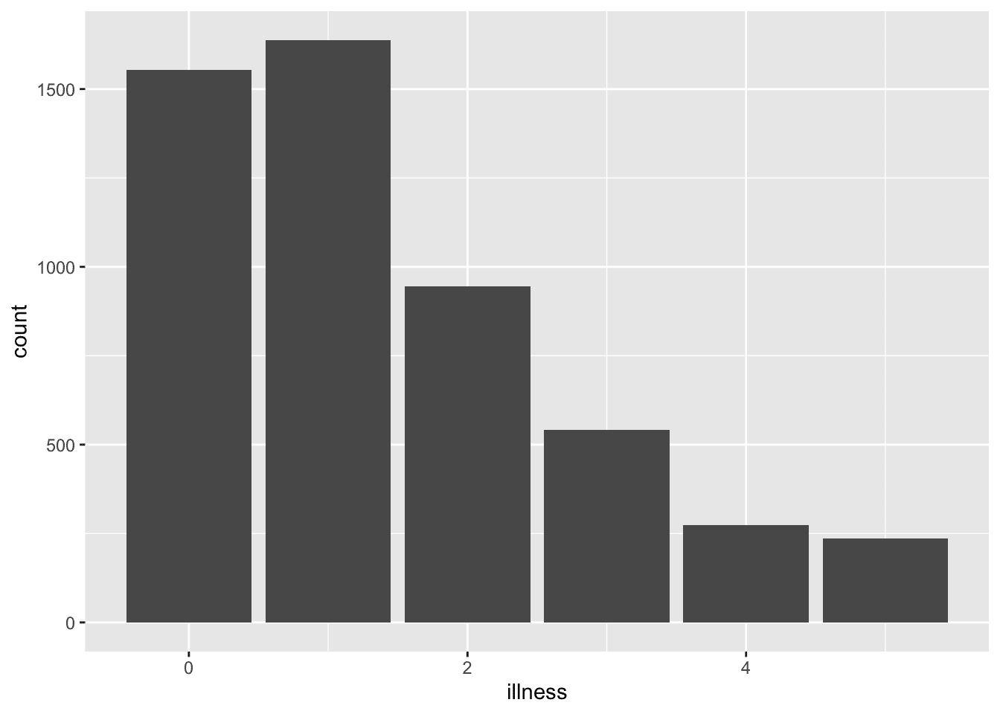

图 3.1：基于 1977-1978 年澳大利亚健康调查，过去两周内疾病数量

在代码块中，有各种可用的评估选项。我们通过在行首使用代码块特定的注释分隔符“#|”然后跟选项来包含这些选项。有用的选项包括：

+   `echo`: 这控制着代码本身是否包含在文档中。例如，`#| echo: false` 意味着代码会被运行并显示其输出，但代码本身不会被包含在文档中。

+   `include`: 这控制着代码的输出是否包含在文档中。例如，`#| include: false` 会运行代码，但不会产生任何输出，并且代码本身也不会包含在文档中。

+   `eval`: 这控制着代码是否应该包含在文档中。例如，`#| eval: false` 意味着代码不会被运行，因此不会有任何输出被包含，但代码本身会被包含在文档中。

+   `warning`: 这控制着文档中是否包含警告。例如，`#| warning: false` 意味着警告不会被包含。

+   `message`: 这控制着文档中是否包含消息。例如，`#| message: false` 意味着消息不会被包含在文档中。

例如，我们可以包含输出，但不包含代码，并抑制任何警告。

```r
```{r}

#| echo: false

#| warning: false

library(tidyverse)

library(AER)

data("DoctorVisits", package = "AER")

DoctorVisits |>

ggplot(aes(x = visits)) +

geom_histogram(stat = "count")

```r
```

在 R 代码块两侧留一个空白行，否则它可能无法正确运行。并且使用小写逻辑值，即“false”而不是“FALSE”。

```r
Most people did not visit a doctor in the past week.

```{r}

#| echo: false

#| warning: false

library(tidyverse)

library(AER)

data("DoctorVisits", package = "AER")

DoctorVisits |>

ggplot(aes(x = visits)) +

geom_histogram(stat = "count")

```r

There were some people that visited a doctor once, and then...
```

Quarto 文档本身必须加载所需的任何数据集。仅仅它们存在于环境中是不够的。这是因为 Quarto 文档在渲染时评估文档中的代码，而不一定是环境。

在编写代码时，我们可能想要在多行中进行相同的更改或更改特定事物的所有实例。我们通过使用多个光标来实现这一点。如果我们想要在多行中拖动光标，那么在 Mac 上按住“option”，在 PC 上按住“Alt”，然后拖动光标到相关行。如果我们想要选择某个事物的所有实例，那么突出显示一个实例，比如一个变量名，然后使用查找/替换（Mac 上的 Command + F 或 PC 上的 CTRL + F）并选择“所有”。这样就会在所有其他实例上启用光标。
  
### 3.2.6 方程

我们可以通过使用基于编程语言 TeX 的 LaTeX 来包含方程。我们在 LaTeX 中使用两个美元符号作为开启和关闭标签来调用数学模式。然后，其中的内容被评估为 LaTeX 标记。例如，我们可以使用以下方法生成复利公式：

```r
$$
A = P\left(1+\frac{r}{n}\right)^{nt}
$$
```

$$ A = P\left(1+\frac{r}{n}\right)^{nt} $$

LaTeX 是一种全面的标记语言，但我们将主要用它来指定感兴趣的模型。我们在这里包含了一些包含我们将从第十二章开始使用的关键方面的示例。

```r
$$
y_i|\mu_i, \sigma \sim \mbox{Normal}(\mu_i, \sigma)
$$
```

$$ y_i|\mu_i, \sigma \sim \mbox{Normal}(\mu_i, \sigma) $$

下划线用于获取下标：`y_i` 对应于 $y_i$。我们还可以通过将多个项用花括号包围来获取多个项的下标：`y_{i,c}` 对应于 $y_{i,c}$。在这种情况下，我们希望在行内使用数学模式，因此我们只使用一个美元符号作为开启和关闭标签。

希腊字母通常由一个反斜杠开头。常见的希腊字母包括：`\alpha` 对应于 $\alpha$，`\beta` 对应于 $\beta$，`\delta` 对应于 $\delta$，`\epsilon` 对应于 $\epsilon$，`\gamma` 对应于 $\gamma$，`\lambda` 对应于 $\lambda$，`\mu` 对应于 $\mu$，`\phi` 对应于 $\phi$，`\pi` 对应于 $\pi$，`\Pi` 对应于 $\Pi$，`\rho` 对应于 $\rho$，`\sigma` 对应于 $\sigma$，`\Sigma` 对应于 $\Sigma$，`\tau` 对应于 $\tau$，以及 `\theta` 对应于 $\theta$。

LaTeX 数学模式假设字母是变量，因此使它们变为斜体，但有时我们希望一个单词以正常字体出现，因为它不是变量，例如“Normal”。在这种情况下，我们用 `\mbox{}` 包围它，例如 `\mbox{Normal}` 对应于 $\mbox{Normal}$。

我们使用 `\begin{aligned}` 和 `\end{aligned}` 在多行中排列方程。要排列的项通过一个和号（&）标记。以下是我们将在第十六章中估计的模型。

```r
$$
\begin{aligned}
y_i|\pi_i & \sim \mbox{Bern}(\pi_i) \\
\mbox{logit}(\pi_i) & = \beta_0+ \alpha_{g[i]}^{\mbox{gender}} + \alpha_{a[i]}^{\mbox{age}} + \alpha_{s[i]}^{\mbox{state}} + \alpha_{e[i]}^{\mbox{edu}} \\
\beta_0 & \sim \mbox{Normal}(0, 2.5)\\
\alpha_{g}^{\mbox{gender}} & \sim \mbox{Normal}(0, 2.5)\mbox{ for }g=1, 2\\
\alpha_{a}^{\mbox{age}} & \sim \mbox{Normal}\left(0, \sigma²_{\mbox{age}}\right)\mbox{ for }a = 1, 2, \dots, A\\
\alpha_{s}^{\mbox{state}} & \sim \mbox{Normal}\left(0, \sigma²_{\mbox{state}}\right)\mbox{ for }s = 1, 2, \dots, S\\
\alpha_{e}^{\mbox{edu}} & \sim \mbox{Normal}\left(0, \sigma²_{\mbox{edu}}\right)\mbox{ for }e = 1, 2, \dots, E\\
\sigma_{\mbox{gender}} & \sim \mbox{Exponential}(1)\\
\sigma_{\mbox{state}} & \sim \mbox{Exponential}(1)\\
\sigma_{\mbox{edu}} & \sim \mbox{Exponential}(1)
\end{aligned}
$$
```

$$ \begin{aligned} y_i|\pi_i & \sim \mbox{Bern}(\pi_i) \\ \mbox{logit}(\pi_i) & = \beta_0+ \alpha_{g[i]}^{\mbox{gender}} + \alpha_{a[i]}^{\mbox{age}} + \alpha_{s[i]}^{\mbox{state}} + \alpha_{e[i]}^{\mbox{edu}} \\ \beta_0 & \sim \mbox{Normal}(0, 2.5)\\ \alpha_{g}^{\mbox{gender}} & \sim \mbox{Normal}(0, 2.5)\mbox{ for }g=1, 2\\ \alpha_{a}^{\mbox{age}} & \sim \mbox{Normal}\left(0, \sigma²_{\mbox{age}}\right)\mbox{ for }a = 1, 2, \dots, A\\ \alpha_{s}^{\mbox{state}} & \sim \mbox{Normal}\left(0, \sigma²_{\mbox{state}}\right)\mbox{ for }s = 1, 2, \dots, S\\ \alpha_{e}^{\mbox{edu}} & \sim \mbox{Normal}\left(0, \sigma²_{\mbox{edu}}\right)\mbox{ for }e = 1, 2, \dots, E\\ \sigma_{\mbox{gender}} & \sim \mbox{Exponential}(1)\\ \sigma_{\mbox{state}} & \sim \mbox{Exponential}(1)\\ \sigma_{\mbox{edu}} & \sim \mbox{Exponential}(1) \end{aligned} $$

最后，某些函数是内置到 LaTeX 中的。例如，我们可以使用`\log`适当地排版“log”。
  
### 3.2.7 跨引用

引用图表和方程式可能很有用。这使得在文本中引用它们变得更容易。为了对一个图表进行引用，我们引用创建或包含该图表的 R 代码块名称。例如，考虑以下代码。

```r
```{r}

#| 标签：fig-uniquename

#| 图像标题：过去两周的疾病数量，基于 1977-1978 年澳大利亚健康调查

#| 警告：false

data("DoctorVisits", package = "AER")

医疗就诊 |>

ggplot(aes(x = illness)) +

geom_histogram(stat = "count")

```r
```


图 3.2：过去两周的疾病数量，基于 1977–1978 年澳大利亚健康调查*  *然后 `(@fig-uniquename)` 会生成：(图 3.2) 作为 R 代码块名称的名称为 `fig-uniquename`。我们需要在代码块名称的开头添加“fig”，这样 Quarto 就能知道这是一个图像。然后我们在 R 代码块中包含一个“fig-cap:”，以指定标题。

我们可以在 Quarto 文档中的 R 代码块中添加 `#| layout-ncol: 2` 以使两个图表并排显示(图 3.3)。这里图 3.3 (a)使用最小主题，而图 3.3 (b)使用经典主题。这两个都引用了 R 代码块中的相同标签 `#| label: fig-doctorgraphsidebyside`，并在 R 代码块中添加了一个额外的选项 `#| fig-subcap: ["Number of illnesses","Number of visits to the doctor"]`，这提供了子标题。通过在文本中使用时在标签末尾添加“-1”和“-2”，实现了在文本中添加字母：`(@fig-doctorgraphsidebyside)`，`@fig-doctorgraphsidebyside-1`，和`@fig-doctorgraphsidebyside-2`分别对应(图 3.3)，图 3.3 (a)，和图 3.3 (b)。

```r
```{r}

#| 评估：true

#| 警告：false

#| 标签：fig-doctorgraphsidebyside

#| fig-cap: "两种图形变体"

#| fig-subcap: ["疾病","去医生处就诊"]

#| layout-ncol: 2

医生就诊次数 |>

ggplot(aes(x = illness)) +

geom_histogram(stat = "count") +

主题最小化()

医生就诊次数 |>

ggplot(aes(x = visits)) +

geom_histogram(stat = "count") +

主题经典()

```r
```

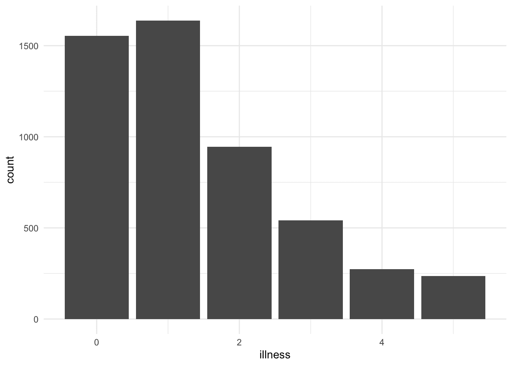

(a) 疾病

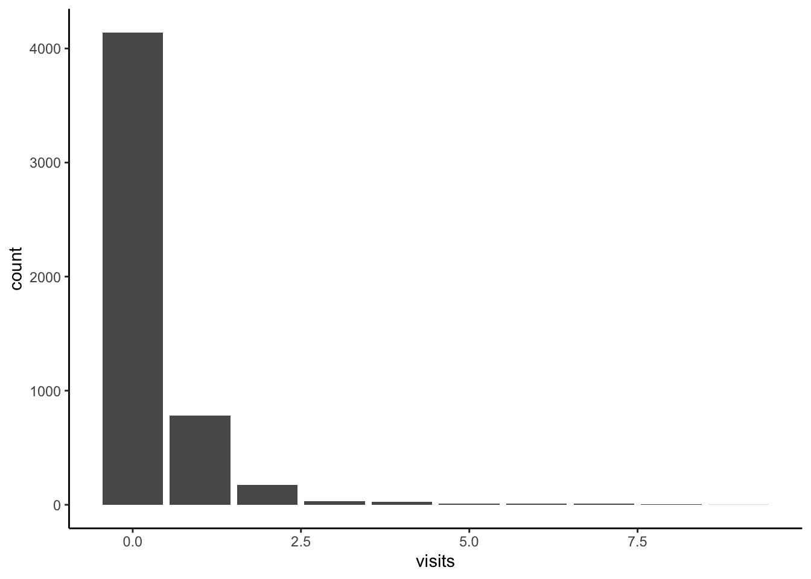

(b) 去医生处就诊

图 3.3：两种图形变体

我们可以采取类似的方法来交叉引用表格。例如，`(@tbl-docvisittable)` 将生成：(表 3.1)。在这种情况下，我们在标签的开头指定“tbl”，以便 Quarto 知道它是一个表格。并且我们使用“tbl-cap:”指定表格的标题。

```r
```{r}

#| label: tbl-docvisittable

#| tbl-cap: "医生就诊次数分布"

医生就诊次数 |>

count(visits) |>

tt() |>

style_tt(j = 2, align = "r") |>

setNames(c("就诊次数", "出现次数"))

```r
```

表 3.1：医生就诊次数分布

| 就诊次数 | 出现次数 |
| --- | --- |
| 0 | 4141 |
| 1 | 782 |
| 2 | 174 |
| 3 | 30 |
| 4 | 24 |
| 5 | 9 |
| 6 | 12 |
| 7 | 12 |
| 8 | 5 |

| 9 | 1 |*  *最后，我们还可以交叉引用方程式。为此，我们需要添加一个标签，如 `{#eq-macroidentity}`，然后进行引用。

```r
$$
Y = C + I + G + (X - M)
$$ {#eq-gdpidentity}
```

例如，我们随后使用 `@eq-gdpidentity` 来生成 方程式 3.1

$$ Y = C + I + G + (X - M) \tag{3.1}$$

使用交叉引用时，标签应相对简单。通常，尽量保持名称简单但独特，避免使用标点符号，并坚持使用字母和连字符。尽量不要使用下划线，因为它们可能会引起错误。
  
## 3.3 R 项目和文件结构

项目在软件开发中被广泛使用，其目的是将特定项目相关的所有文件（数据、分析、报告等）集中在一起并相互关联。（在软件开发中使用的“项目”与项目管理中的“项目”是不同的。）可以在 RStudio 中创建 R 项目。点击“文件” $\rightarrow$ “新建项目”，然后选择“空项目”，命名 R 项目并决定将其保存的位置。例如，一个关注孕产妇死亡率的 R 项目可能被称为“maternalmortality”。使用 R 项目可以实现“在不同计算机或用户以及不同时间跨度的可靠、礼貌的行为” (Bryan and Hester 2020)。这是因为它们从更广泛的背景中移除了该文件夹的上下文；文件存在于 R 项目的基中，而不是计算机的基中。

一旦创建了一个项目，该文件夹中就会出现一个扩展名为“ .RProj” 的新文件。一个包含 R 项目、Quarto 文档和适当文件结构的文件夹示例[在此](https://github.com/RohanAlexander/starter_folder)。可以下载： “代码” $\rightarrow$ “下载 ZIP”。

使用 R 项目的优点在于我们可以以自包含的方式引用其中的文件。这意味着当其他人想要重现我们的工作时，他们不需要更改所有文件引用和结构，因为所有内容都是相对于 “.Rproj” 文件进行引用的。例如，您可以从 `book/data/` 读取 CSV 文件，而不是从 `"~/Documents/projects/book/data/"` 读取。可能的情况是，其他人没有 `projects` 文件夹，因此前者对他们来说不起作用，而后者则可以。

为了满足对可信工作所期望的最小可重复性水平，必须使用项目。使用 `setwd()` 和特定于计算机的文件路径等函数将工作绑定到特定的计算机上，这种方式是不合适的。

设置文件夹有多种方法。在示例文件结构中链接的 Wilson 等人（2017）的变体在您开始时通常很有用。

```r
example_project/
├── .gitignore
├── LICENSE.md
├── README.md
├── example_project.Rproj
├── data
│   ├── 00-simulated_data
│   │   ├── simulated_data.csv
│   ├── 01-raw_data
│   │   ├── raw_data.csv
│   ├── 02-analysis_data
│   │   ├── analysis_data.csv
│   │   └── ...
├── model
│   ├── first_model.rds
├── other
│   ├── datasheet
│   │   └── ...
│   ├── literature
│   │   └── ...
│   ├── llm_usage
│   │   └── ...
│   ├── sketches
│   │   └── ...
├── paper
│   ├── paper.pdf
│   ├── paper.qmd
│   ├── references.bib
│   └── ...
├── scripts
│   ├── 00-simulate_data.R
│   ├── 01-test_simulated_data.R
│   ├── 02-download_data.R
│   ├── 03-clean_data.R
│   ├── 04-test_analysis_data.R
│   ├── 05-eda.R
│   ├── 06-model_data.R
│   ├── 07-replication.R
│   └── ...
└── ...
```

在这里，我们有一个包含模拟数据、未经编辑的数据（不应被覆盖，Wilson 等人 2017）和组合在一起的分析数据的 `data` 文件夹。`model` 文件夹包含保存的模型估计。`other` 文件夹包含数据表、文献、LLM 使用和草图等元素，这些元素根据情况可能很有用。`paper` 文件夹包含 Quarto 文档和一个 BibTeX 文件。最后，`scripts` 包含模拟、下载、测试和分析数据的代码。

有用的其他方面包括一个 `README.md`，它将指定项目的概述细节，以及一个 LICENSE。README 中应包含的内容示例[在这里](https://social-science-data-editors.github.io/template_README/)。此项目骨架的另一个有用的变体由 Mineault 和 The Good Research Code Handbook Community (2021) 提供。

## 3.4 版本控制

在这本书中，我们通过 Git 和 GitHub 的组合实现版本控制。这样做的原因有很多，包括：

1.  通过使代码和数据更容易共享来提高工作的可重复性。

1.  使工作共享更容易；

1.  通过鼓励系统化的方法来改进工作流程；以及

1.  这使得团队合作更容易。

Git 是一个具有迷人历史的版本控制系统（Brown 2018）。人们通常开始进行版本控制的方式是拥有一个文件的多个副本：“first_go.R”，“first_go-fixed.R”，“first_go-fixed-with-mons-edits.R”。但很快就会变得繁琐。人们通常很快就会转向日期，例如：“2022-01-01-analysis.R”，“2022-01-02-analysis.R”，“2022-01-03-analysis.R”，等等。虽然这可以记录下来，但在我们需要回溯时，由于很难记住某个更改是在哪一天进行的，因此可能会很困难。无论如何，对于一个定期进行工作的项目来说，这很快就会变得难以管理。

我们使用 Git 而不是这样，以便我们有一个文件的版本。Git 会记录该文件的更改，并在特定时间点的文件快照。我们确定 Git 何时进行快照。我们还会包括一条消息，说明这次快照与上次之间的更改。这样，文件就只有一个版本，历史记录可以更容易地搜索。

Git 的设计初衷是为软件开发团队而设计的。因此，尽管它能够正常工作，但对于非开发者来说可能会显得有些笨拙。尽管如此，Git 已经被有效地应用于数据科学领域，即使唯一的合作者可能只是未来的自己（Bryan 2018a）。

GitHub、GitLab 以及许多其他公司提供了基于 Git 的更易于使用的服务。虽然存在一些权衡，但我们在这里介绍 GitHub，因为它是最主要的平台（Eghbal 2020, 21）。Git 和 GitHub 已经集成到 Posit Cloud 中，如果你在本地安装上遇到问题，这是一个不错的选择。Git 的最初挑战之一是术语。文件夹被称为“repos”。创建快照被称为“commit”。最终你会习惯这些，但一开始感到困惑是很正常的。Bryan (2020)的指南对于设置和使用 Git 和 GitHub 特别有用。

### 3.4.1 Git

我们首先需要检查 Git 是否已安装。打开 RStudio，转到终端，输入以下内容，然后按回车。

```r
git --version
```

如果你得到了版本号，那么你就完成了（图 3.4 (a))。

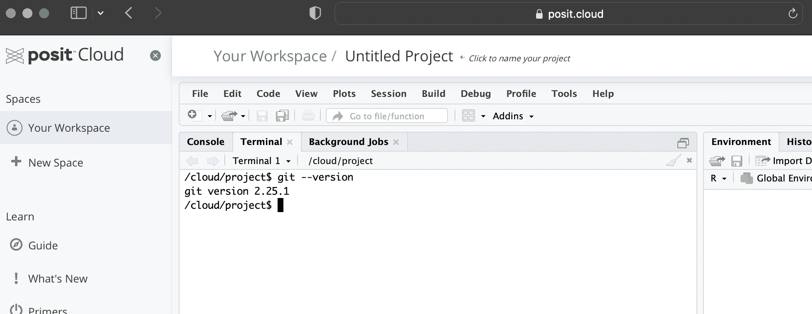

(a) 使用终端检查 RStudio 中是否已安装 Git

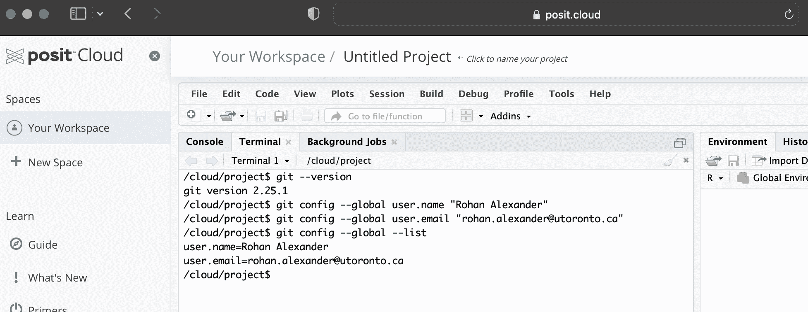

(b) 在 RStudio 中为 Git 添加用户名和电子邮件地址

图 3.4：设置 Git 所涉及步骤的概述

Git 在 Posit Cloud 中预先安装，它应该在 Mac 上预先安装，并且可能在 Windows 上预先安装。如果你没有得到版本号作为响应，那么你需要安装它。为此，你应该遵循 Bryan (2020, chap. 5)中针对您操作系统的具体说明。

安装 Git 后，我们需要告诉它用户名和电子邮件。我们需要这样做，因为 Git 在每次我们进行快照或使用 Git 的术语来说，每次我们提交时，都会添加这些信息。

再次，在终端中输入以下内容，用您的详细信息替换，并在每行后按“enter/return”。

```r
git config --global user.name "Rohan Alexander"
git config --global user.email "rohan.alexander@utoronto.ca"
git config --global --list
```

当这个设置完成正确后，你为“user.name”和“user.email”输入的值将在最后一行后返回（图 3.4 (b))。

这些细节——用户名和电子邮件地址——将是公开的。如果需要，有各种方法可以隐藏电子邮件地址，GitHub 提供了相关的说明。Bryan (2020, 第七章) 提供了关于这一步的更详细说明和故障排除指南。

### 3.4.2 GitHub

现在 Git 已经设置好了，我们需要设置 GitHub。我们在 第二章 中创建了一个 GitHub 账户，我们在这里再次使用它。在 `github.com` 登录后，我们首先需要创建一个新的文件夹，在 Git 中这被称为“repo”。在右上角寻找一个“+”，然后选择“新建仓库” (图 3.5 (a))。


(a) 开始创建新仓库的过程

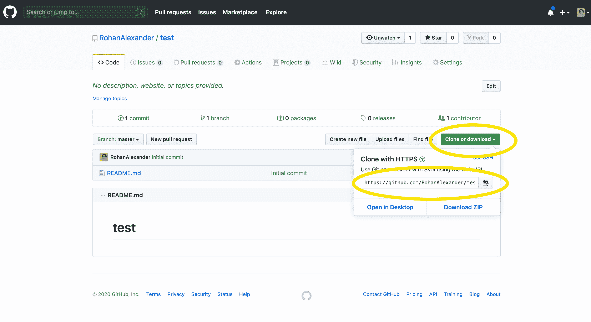

(b) 复制新仓库的 URL


(c) 将项目添加到 Posit Cloud

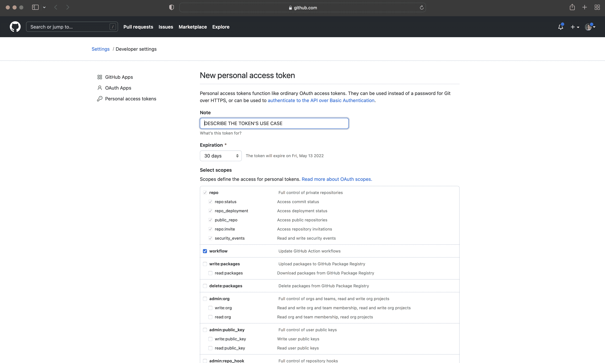

(d) 创建 PAT

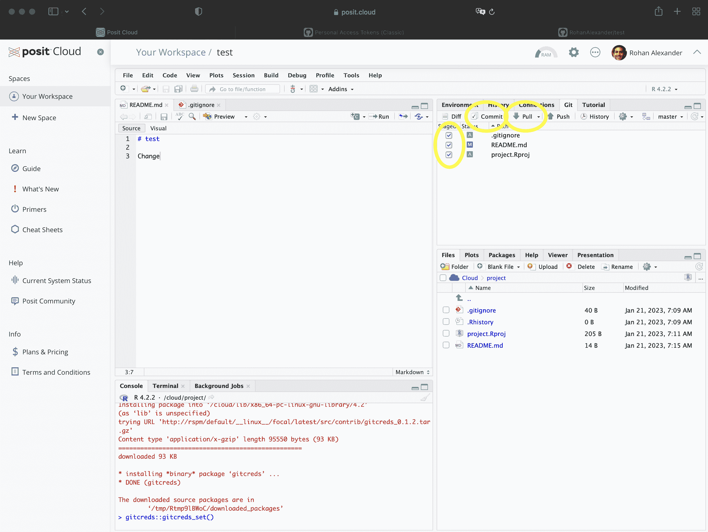

(e) 添加要提交的文件

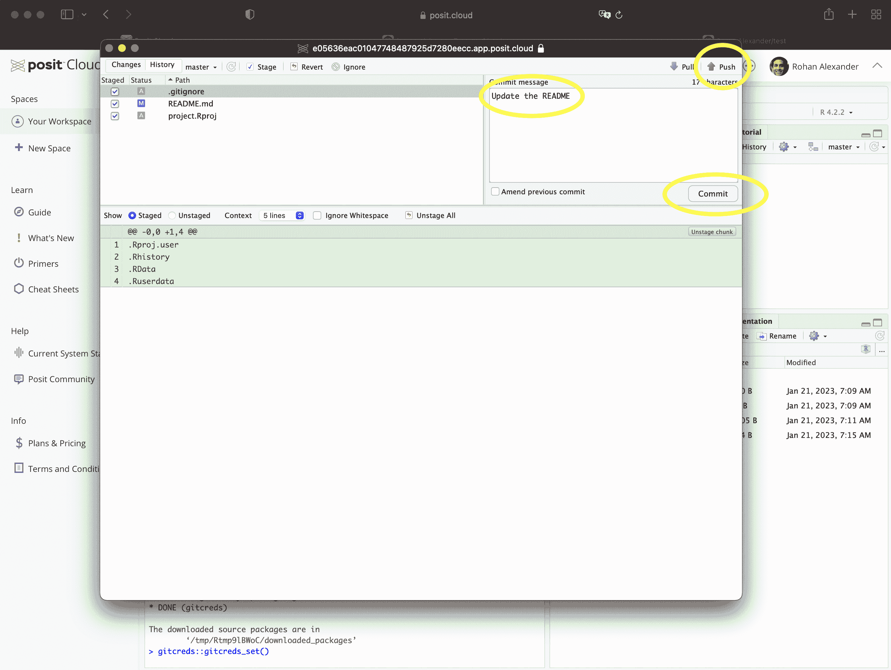

(f) 提交

图 3.5：设置 GitHub 所涉及步骤的概述

在这一点上，我们可以为仓库添加一个合理的名字。现在先将其保留为“公开”，因为它总是可以在以后删除。并勾选“使用 README 初始化此仓库”。将“添加 .gitignore”改为 R。之后，点击“创建仓库”。

这将带我们到一个相当空白的屏幕，但我们需要的细节——一个 URL——就在绿色的“克隆或下载”按钮中，我们可以通过点击剪贴板 (图 3.5 (b)) 来复制。

现在回到 RStudio，在 Posit Cloud 中，我们通过“从 Git 仓库创建新项目”来创建一个新的项目。它会要求我们输入刚刚复制的 URL (图 3.5 (c))。如果你使用的是本地计算机，那么这一步可以通过菜单完成：“文件” $\rightarrow$ “新建项目…” $\rightarrow$ “版本控制” $\rightarrow$ “Git”，然后粘贴 URL，给文件夹起一个有意义的名字，勾选“在新会话中打开”，然后点击“创建项目”。

在这一点上，已经创建了一个新的文件夹，我们可以使用它。我们将希望能够将其推送到 GitHub，为此我们需要使用个人访问令牌 (PAT) 来将 RStudio 工作空间与我们的 GitHub 账户链接起来。我们使用 `usethis` 和 `gitcreds` 来启用此功能。这些分别是自动化重复性任务的包和用于 GitHub 认证的包。要创建一个 PAT，在浏览器中登录 GitHub 后，安装并加载 `usethis`，然后在 R 会话中运行 `create_github_token()`。GitHub 将在浏览器中打开，并填写各种选项 (图 3.5 (d))。给 PAT 起一个有信息性的名字可能很有用，例如将“Note”替换为“PAT for RStudio”，然后点击“生成令牌”。

我们只有一次机会复制这个令牌，如果我们出错，则需要生成一个新的令牌。不要将 PAT 包含在任何 R 脚本或 Quarto 文档中。相反，在安装并加载`gitcreds`之后，运行`gitcreds_set()`，然后它将在控制台中提示您添加您的 PAT。

要使用 GitHub 来处理我们正在积极工作的项目，我们遵循以下步骤：

1.  首件事几乎总是使用“pull”来获取任何更改。为此，在 RStudio 中打开 Git 面板，然后点击蓝色的向下箭头。这将 GitHub 上文件夹的任何更改都拉入我们自己的文件夹版本中。

1.  然后，我们可以对我们的文件夹副本进行更改。例如，我们可以更新 README，然后像往常一样保存它。

1.  完成此操作后，我们需要添加、提交和推送。在 RStudio 的 Git 面板中，选择要添加的文件。这将它们添加到暂存区。然后点击“提交”(图 3.5 (e))。将打开一个新窗口。添加关于所做更改的说明性信息，然后在新窗口中点击“提交”(图 3.5 (f))。最后，点击“推送”以将更改发送到 GitHub。

在 Git 和 GitHub 方面，有一些常见的痛点。我们建议定期提交和推送，尤其是在您刚开始版本控制时。这增加了您在需要时可以返回的快照数量。所有提交都应包含说明性提交信息。如果您是版本控制的新手，那么对良好提交信息的期望是它包含更改的简短摘要，后跟一个空行，然后是对更改的解释，包括更改的内容以及为什么进行更改。例如，如果您的提交向论文添加了图表，则提交信息可以是：

```r
Add graphs

Graphs of unemployment and inflation added into Data section.
```

有一些证据表明整体质量与提交行为之间存在关系(Sprint 和 Conci 2019)。随着您获得更多经验，理想情况下，提交信息将充当项目的一种日志。但最重要的是要定期提交。

Git 和 GitHub 是为软件开发者设计的，而不是为数据科学家设计的。GitHub 限制它将考虑的文件大小为 100MB，甚至 50MB 也会触发警告。数据科学项目通常涉及比这更大的数据集。在 第十章 中，我们讨论了数据存档的使用，这在项目完成后特别有用，但在我们积极进行项目工作时，忽略大型数据文件可能也很有用，至少从 Git 和 GitHub 的角度来看是这样。我们通过一个“`.gitignore`”文件来实现这一点，其中列出了我们不想使用 Git 跟踪的所有文件。[示例文件夹](https://github.com/RohanAlexander/starter_folder) 包含一个“`.gitignore`”文件。运行 `usethis` 的 `git_vaccinate()` 可能会有所帮助，它将向全局的“`.gitignore`”文件添加各种文件，以防你在项目层面上忘记这样做。对于 Mac 用户来说，这会导致“`.DS_Store`”文件被忽略。

我们使用了 RStudio 中的 Git 面板，这消除了使用终端的需要，但它并没有消除需要前往 GitHub 并设置新项目的需求。在设置了 Git 和 GitHub 之后，我们可以通过 `usethis` 进一步改进我们工作流程的这个方面。

首先检查 Git 是否已通过 `usethis` 的 `git_sitrep()` 设置。这应该会打印出用户名和电子邮件的信息。如果需要，我们可以使用 `use_git_config()` 来更新这些细节。

```r
use_git_config(
 user.name = "Rohan Alexander",
 user.email = "rohan.alexander@utoronto.ca"
)
```

与其在 GitHub 上启动一个新项目然后本地添加，我们现在可以使用 `use_git()` 来启动它并提交文件。提交后，我们可以使用 `use_github()` 将其推送到 GitHub，这样在 GitHub 上也会创建相应的文件夹。

对 Git 和 GitHub 感到害怕是很正常的。许多数据科学家只知道如何使用它的一些基本知识，这很正常。尽量定期推送，以便在需要时有一个最新的快照。

### 3.4.3 Git 冲突

克里斯托弗·马洛的《浮士德博士》是 16 世纪的一部戏剧。有趣的是，它有两个版本，没有人知道马洛实际上打算哪个版本是“那个”版本。根据你具体计算的方式，马洛有大约 2,048 行(1604)，而马洛有大约 2,852 行(1616)。甚至行内也有变化(图 3.6)。由于作者已经去世很久了，人类就处于一个奇怪的情况，就是只有两个版本。如果马洛有 Git，这种情况就不会发生！

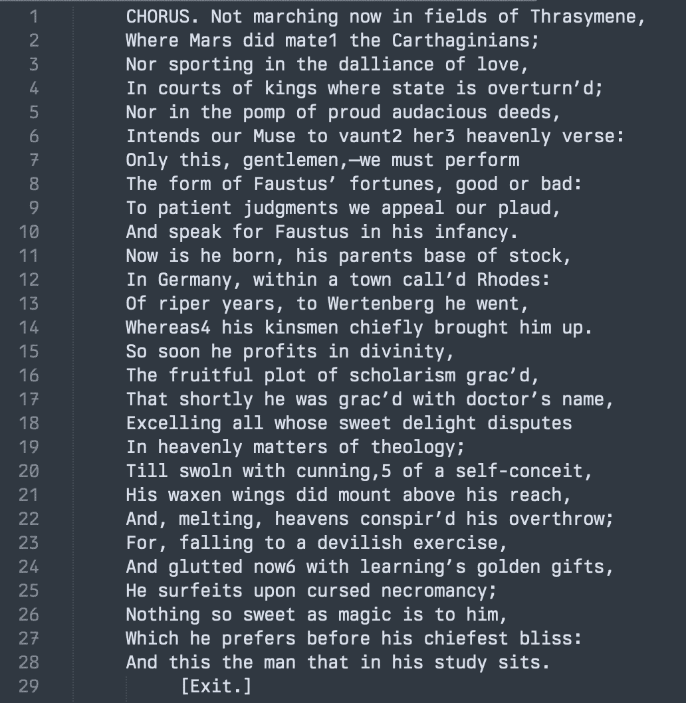

(a) 1604 版本的前几行

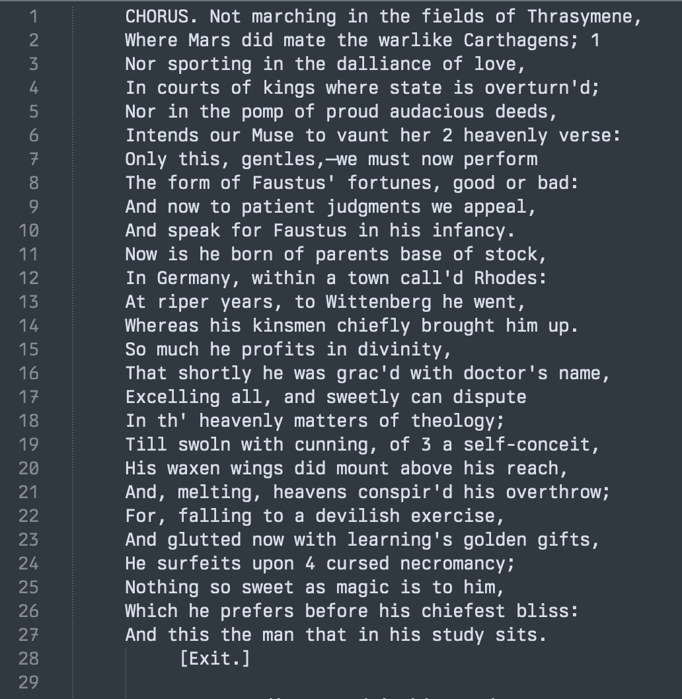

(b) 1616 版本的前几行

图 3.6：展示《浮士德博士》1604 版本和 1616 版本之间的差异

当使用 Git 和 GitHub 时，我们会不时地提交版本。但是，当两个人在同一仓库中工作，试图提交更改相同行的代码时会发生什么？Git 会建立合并冲突，然后由出现冲突的人来解决问题，即第二个提交的人。

Git 将通过在文件中显示它们，并在开头添加标识标记`<<<<<<< HEAD`，在区分冲突更改时使用`=======`，以及使用`>>>>>>> new_branch`来显示结束和哪个分支正在创建冲突，来识别存在冲突的行。

```r
<<<<<<< HEAD
Some content
=======
Some conflicted content
>>>>>>> new_branch
```

解决冲突的人的任务是选择保留哪些内容。编辑文件，保存它，然后以正常方式添加和提交。
  
## 3.5 在实践中使用 R

### 3.5.1 处理错误

> 当你在编程时，最终你的代码会出错，当我说是“最终”时，我的意思是可能一天有 10 次或 20 次。
> 
> Gelfand (2021)

每个使用 R 的人，或者任何编程语言，都会在某一点上遇到困难。这是正常的。编程很难。在某个时候，代码将无法运行或会抛出错误。这是每个人都会遇到的事情。虽然会感到沮丧，但我们为了前进，会制定策略来处理这些问题：

1.  如果你收到了错误信息，那么有时候它会有用。试着仔细阅读，看看里面是否有任何有用的信息。

1.  尝试搜索错误信息。在搜索中包含“tidyverse”或“in R”可能会有所帮助，以帮助使结果更合适。有时 Stack Overflow 的结果可能会有所帮助。

1.  通过在函数前放置“？”来查看函数的帮助文件，例如，`?pivot_wider()`。一个常见的问题是使用略微不正确的参数名称或格式，例如，意外地包含字符串而不是对象名称。

1.  查看错误发生的地方，并移除或注释掉代码，直到错误解决，然后再次慢慢添加代码。

1.  使用`class()`检查对象的类，例如，`class(data_set$data_column)`。确保它是预期的。

1.  重启 R：“会话”$\rightarrow$“重启 R 并清除输出”。然后再次加载所有内容。

1.  重启你的电脑。

1.  搜索你想要做的事情，而不是错误，确保在搜索中包含“tidyverse”或“in R”，以帮助使结果更合适。例如，“使用 ggplot 在 R 中保存图形 PDF”。有时会有相关的博客文章或 Stack Overflow 答案有所帮助。

1.  制作一个小的、自包含的、可复现的示例“reprex”，以查看问题是否可以隔离，并使其他人能够提供帮助。

1.  如果你在一个 Quarto 文档中工作，那么在代码块选项中包含标签，以便更容易找到错误可能发生的地方。

更普遍地说，虽然这并不总是可能的，但几乎总是有帮助的，去休息一下，第二天再回来。

### 3.5.2 可复现的示例

> 没有人可以给你建议或帮助——没有人。你唯一应该做的就是进入自己。
> 
> 里尔克 ([[1929] 2014](99-references.html#ref-rilke))

寻求帮助是一项技能，就像其他任何技能一样。我们通过练习变得更好。重要的是尽量不说“这不起作用”，“我试了一切”，“你的代码不起作用”，或者“这里有错误信息，我该怎么办？”。一般来说，基于这些评论无法提供帮助，因为可能的问题太多。你需要让其他人更容易帮助你。这涉及到几个步骤。

1.  提供一个小的、自包含的数据和代码示例，并详细说明出了什么问题。

1.  记录你迄今为止尝试的内容，包括你查看过的哪些 Stack Overflow 和 Posit Forum 帖子，以及为什么它们不是你想要的。

1.  明确你想要的成果。

首先创建一个最小的可重现示例——一个“reprex”。这是包含重现错误所需内容的代码，但仅限所需内容。这意味着代码可能是一个更小、更简单的版本，但仍然可以重现错误。

有时这个过程能让人解决问题。如果不行，那么它会给其他人一个战斗的机会，让他们能够帮助。几乎可以肯定的是，你遇到的问题别人以前都遇到过。更有可能的是，主要困难在于尝试以一种让其他人能够识别的方式沟通你想要做什么以及发生了什么。培养坚韧是很重要的。

为了开发可重现的示例，`reprex`特别有用。安装后我们：

1.  加载`reprex`包：`library(reprex)`。

1.  突出显示并复制出现问题的代码。

1.  在控制台中运行`reprex()`。

如果代码是自包含的，它将在查看器中预览。如果不是，它将出错，你应该重写代码使其自包含。

如果你需要数据来重现错误，那么你应该使用 R 内置的数据。R 内置了大量的数据集，可以使用`library(help = "datasets")`查看。但如果可能的话，你应该使用一个常见的选项，如`mtcars`或`faithful`。将 reprex 与第二章中介绍的 GitHub Gist 结合起来，可以增加有人能够帮助你解决问题的可能性。

### 3.5.3 态度

> (Y)无论你在哪个 IDE 中开发，或者使用什么工具让你的工作起作用，你都是一个真实、有效、*合格*的用户和程序员。
> 
> (L)让我们分解这些门，每个人都有足够的空间。
> 
> Sharla Gelfand，2020 年 3 月 10 日。

如果你编写代码，那么你就是程序员，无论你如何做，用它做什么，或者你是谁。但有一些特质，人们往往注意到伟大的程序员都有这些共同点。

+   **专注：** 常常有一个目标去“学习 R”或类似的目标可能会带来问题，因为那没有真正的终点。设定更小、更具体的目标，比如“使用 `ggplot2` 制作关于 2022 年澳大利亚选举的直方图”，往往更有效率。对于更模糊的目标，比如“我想学习 R”，问题在于更容易迷失在旁枝末节中，而且更难得到帮助。这可能会让人士气低落，导致过早放弃。

+   **好奇：** 几乎总是有用去“尝试一下”；也就是说，如果你不确定，那就试试看。一般来说，最坏的情况就是浪费了你的时间。你很少会破坏到无法修复的程度。例如，如果你想了解将向量而不是数据框传递给 `ggplot()` 会发生什么，那就试试看。

+   **实用主义：** 同时，坚持在合理的范围内，每次只做一个小改动可能是有用的。例如，假设你想运行一些回归分析，并对使用 `rstanarm` 而不是 `lm()` 感兴趣。一种实用方法是首先使用 `rstanarm` 的一个方面，然后在下次再进行另一个改动。

+   **坚韧不拔：** 再次强调，这又是一种平衡的艺术。每个项目都会出现意外的问题和挑战。一方面，尽管面临这些困难仍能坚持不懈是一种好的倾向。但另一方面，有时确实需要准备放弃某些事情，如果看起来突破无望的话。导师在这方面很有用，因为他们往往能更好地判断什么是合理的。

+   **计划：** 几乎总是有用过度计划你要做什么。例如，你可能想制作一些数据的直方图。你应该计划所需的步骤，甚至绘制出每个步骤可能如何实现。例如，第一步是获取数据。可能有哪些有用的包？数据可能在哪儿？如果数据不存在，备用计划是什么？

+   **完成胜于完美：** 我们都有各种完美主义倾向，但最初在一定程度上尝试关闭它们可能是有用的。最初只需关注编写出能工作的代码。你总是可以回来改进它的某些方面。但重要的是要真正发布。能完成任务的不美观代码比永远完不成的美观代码要好。

### 3.5.4 代码注释和风格

代码必须添加注释。注释应侧重于解释为什么编写了某些代码，以及在一定程度上，为什么没有选择常见的替代方案。实际上，在编写代码之前先写注释，解释你想做什么以及为什么，然后返回去编写代码，这可能是个好主意（Fowler 和 Beck 2018，第 59 页）。

编写代码没有一种唯一的方法，尤其是在 R 语言中。然而，有一些通用指南可以使你在独自工作时更容易操作。大多数项目都会随着时间的推移而发展，代码注释的一个目的就是让未来的你能够追溯所做的操作以及为什么做出某些决定（Bowers 和 Voors 2016）。

R 脚本中的注释可以通过包含#符号来添加。（在 Quarto 文档中的 R 代码块内，#的行为与在 R 代码块外的行为不同，它作为注释，而在 R 代码块外，它设置标题级别。）我们不需要在行的开头放置注释，它可以在中间。一般来说，你不需要注释代码的每个方面，但你应该注释那些不明显的地方。例如，如果我们读取了一些值，我们可能希望注释它们是从哪里来的。

你应该尝试注释你为什么做某事（Wickham 2021）。你试图实现什么？你必须注释来解释奇怪的事情。比如，如果你删除了一些特定的行，比如第 27 行，那么你为什么删除那一行？在那一刻可能看起来很明显，但未来的你会不记得。

你应该将代码分成几个部分。例如，设置工作空间、读取数据集、处理和清洗数据集、分析数据集，最后生成表格和图形。每个部分都应该用注释隔开，解释正在发生的事情，有时甚至可以放入单独的文件中，这取决于代码的长度。

此外，在每个文件的顶部，注明基本信息很重要，例如文件的目的、先决条件或依赖项、日期、作者和联系方式，以及最后任何红旗或待办事项。

你的 R 脚本应该有一个前言和清晰的章节划分。

```r
#### Preamble ####
# Purpose: Brief sentence about what this script does
# Author: Your name
# Date: The date it was written
# Contact: Add your email
# License: Think about how your code may be used
# Pre-requisites: 
# - Maybe you need some data or some other script to have been run?

#### Workspace setup ####
# do not keep install.packages lines; comment out if need be
# Load packages
library(tidyverse)

# Read in the unedited data. 
raw_data <- read_csv("inputs/data/unedited_data.csv")

#### Next section ####
... 
```

最后，尽量不要依赖于用户对代码进行注释和取消注释，或者任何其他手动步骤，如目录指定，以使代码工作。这将阻止使用自动代码检查和测试。

这一切都需要时间。作为一个粗略的规则，你应该预计在注释和改进代码上花费的时间至少与编写代码的时间一样多。一些注释良好的代码示例包括 Dolatsara 等人（2021）和 Burton、Cruz 和 Hahn（2021）。

### 3.5.5 测试

测试应该在代码的各个部分编写，并且你需要边做边写，而不是全部在最后完成。这会减慢你的速度。但这样做可以帮助你思考，并纠正错误，这将使你的代码更好，并提高整体的生产力。没有测试的代码应该受到怀疑。在 R 包的测试实践中还有改进的空间（Vidoni 2021），更不用说 R 代码本身了。

需要其他人，最好是自动化流程，来运行代码测试的需求，是我们强调可重复性的一个原因。这也是为什么我们强调一些小细节，比如不要在文件路径中硬编码，使用项目，以及不要在文件名中有空格。

定义一套完整和通用的测试套件是困难的，但大体上我们希望测试：

1.  边界条件，

1.  类，

1.  缺失数据，

1.  观察数和变量的数量，

1.  重复项，以及

1.  回归结果。

我们最初在模拟数据上做所有这些，然后转向真实数据。这反映了阿波罗计划中测试的演变。最初测试是基于对需求的预期，这些测试后来被更新以考虑实际的发射测量值（Simpkinson 1971, 21）。可以编写无限数量的测试，但少量高质量的测试比许多无心的测试要好。

一种测试类型是“断言”。断言被编写在代码中，用于检查某些内容是否为真，如果不符合则停止代码执行（Irving 等人 2021, 272）。例如，你可能断言一个变量应该是数字的。如果它被测试与这个断言不符，发现是字符类型，那么测试就会失败，脚本将停止运行。在数据科学中，断言测试通常用于数据清洗和准备脚本中。我们将在第九章中详细讨论这些内容。单元测试检查代码的某些完整方面（Irving 等人 2021, 274）。当我们考虑建模时，我们将在第十二章中更深入地探讨它们。

## 3.6 效率

在这本书中，我们一直，并将继续关注的是完成某件事情。不一定是用最好的或最有效的方式完成，因为很大程度上，担心这一点是浪费时间。大多数情况下，最好是把事情推到云端，让它们合理地运行，并利用这段时间来担心管道的其他方面。但最终这变得不可行。在某个时刻，这取决于上下文，效率变得重要。最终，丑陋或缓慢的代码，以及对特定做事方式的教条坚持，都会产生影响。这时，需要开放心态，采用新的方法来确保效率。很少有一个最常见的地方可以明显提高性能。相反，重要的是要培养测量、评估和思考的能力。

提高我们代码效率的最佳方法之一是将其准备得便于引入第二双眼睛。为了充分利用他们的时间，我们的代码易于阅读是很重要的。因此，我们从“代码检查”和“代码风格”开始。这本身并不会加快我们的代码速度，但会使其他人在使用它或我们再次审视它时更加高效。这使我们能够进行正式的代码审查和重构，即重新编写代码以使其更好，同时不改变其功能（它做的是同一件事，但以不同的方式）。然后，我们转向运行时间的测量，并引入并行处理，允许我们的计算机同时为多个进程运行代码。

### 3.6.1 分享代码环境

我们已经详细讨论了共享代码的必要性，并且我们已经提出了使用 GitHub 的解决方案。在第十章中，我们将讨论数据共享。但是，还有一个要求是让其他人能够运行我们的代码。在第二章中，我们讨论了 R 本身以及 R 包随着时间的推移而更新，因为新功能被开发，错误被修复，以及其他一般性的改进。在线附录 A 描述了`tidyverse`的一个优点是它可以比基础 R 更新得更快，因为它更具体。但这可能意味着即使我们分享所有使用的代码和数据，也可能由于可用的软件版本而导致错误。

解决这个问题的方法是详细说明所使用的环境。有大量方法可以做到这一点，它们可能会增加复杂性。我们只关注记录使用的 R 和 R 包的版本，并使其他人更容易安装确切的版本。本质上，我们只是在隔离我们使用的设置，因为这有助于可重复性（Perkel 2023）。在`R`中，我们可以使用`renv`来做这件事。

一旦安装并加载了`renv`，我们使用`init()`来获取我们将需要的设置基础设施。我们将创建一个文件来记录使用的包和版本。然后我们使用`snapshot()`来实际记录我们正在使用的内容。这创建了一个“锁定文件”，记录了相关信息。

如果我们想查看在 R 项目中使用了哪些包，我们可以使用`dependencies()`。对[示例文件夹](https://github.com/RohanAlexander/starter_folder)进行此操作表明以下包被使用：`rmarkdown`、`bookdown`、`knitr`、`rmarkdown`、`bookdown`、`knitr`、`palmerpenguins`、`tidyverse`、`renv`、`haven`、`readr`和`tidyverse`。

如果我们想查看确切的版本，可以打开锁文件“renv.lock”。锁文件还记录了所有已安装的其他包以及它们是从哪里下载的。然后，从外部来到这个项目的人可以使用`restore()`，这将安装我们使用的确切版本的包。

### 3.6.2 代码检查和格式化

快速是宝贵的，但它更多的是关于能够快速迭代，而不是代码必须运行得快。Backus (1981, 26)描述了即使在 1954 年，程序员的成本至少与计算机一样高，而如今额外的计算能力通常比程序员便宜得多。性能良好的代码很重要，但使用他人的时间高效也很重要。代码很少只写一次。相反，我们通常必须返回来，即使只是为了修复错误，这意味着代码必须能够被人类阅读（Matsumoto 2007, 478）。如果没有这样做，那么将会有效率成本。

代码检查和格式化是检查代码的过程，主要是为了风格问题，并重新排列代码以便更容易阅读。（代码检查的另一个方面是处理编程错误，例如忘记关闭括号，但在这里我们专注于风格问题。）通常，最好的效率提升来自于使他人（甚至只是我们自己）在休息后返回代码时更容易阅读，即使这只是为了修复错误。Jane Street，一家美国专有交易公司，非常重视确保他们的代码可读性，这是风险缓解的核心部分（Minsky 2011）。虽然我们可能没有数十亿美元的资金在代码的潜在多变的控制下，但我们所有人都可能更希望我们的代码不会产生错误。

我们使用`lintr`中的`lint()`进行代码检查。例如，考虑以下 R 代码（保存为“linting_example.R”）。

```r
SIMULATED_DATA <-
 tibble(
 division = c(1:150, 151),
 party = sample(
 x = c("Liberal"),
 size = 151,
 replace = T
 )
 )
```

```r
lint(filename = "linting_example.R")
```

结果是，“linting_example.R”文件被打开，`lint()`找到的问题在“标记”中打印出来（图 3.7）。然后，处理这些问题就取决于你了。


图 3.7：示例 R 代码的代码检查结果

实施推荐更改可以使代码更易于阅读，并与 Wickham (2021)定义的最佳实践保持一致。

```r
simulated_data <-
 tibble(
 division = c(1:150, 151),
 party = sample(
 x = c("Liberal"),
 size = 151,
 replace = TRUE
 )
 )
```

一开始，检查器识别的一些方面，如尾随空格和仅使用双引号，可能看起来很小，无关紧要。但它们会分散我们修复更大问题的注意力。此外，如果我们不能正确处理小事情，那么谁会相信我们能够正确处理大事情呢？因此，处理检查器识别的所有小方面非常重要。

除了`lintr`之外，我们还使用`styler`。这将自动调整样式问题，与 linter 不同，后者提供了一列需要查看的问题。要运行此操作，我们使用`style_file()`。

```r
style_file(path = "linting_example.R")
```

这将自动进行更改，例如空格和缩进。因此，这应该定期进行，而不仅仅是项目结束时进行一次，以便能够审查更改并确保没有引入错误。
  
### 3.6.3 代码审查

在处理了所有这些风格方面的问题后，我们可以转向代码审查。这是让另一个人审查并批评代码的过程。许多专业作家都有编辑，而在数据科学中，代码审查是我们最接近的那种。代码审查是编写代码的关键部分，Irving 等人（2021 年，465）将其描述为“找到错误最有效的方法”。当学习编码时，它特别有帮助，尽管有些令人畏惧，因为获得反馈是提高技能的绝佳方式。

在审查他人的代码时，务必尽力保持礼貌和同事间的友好。与样式有关的小问题，例如空格和分隔，应该由 linter 和 styler 处理，如果没有，那么就对此提出一般性建议。作为数据科学中的代码审查员，你大部分的时间应该花在以下方面：

1.  是否有一个信息丰富的 README 文件，以及如何改进它？

1.  文件名和变量名是否一致、信息丰富且有意义？

1.  注释是否允许你理解为什么要做某事？

1.  测试是否既合适又充分？是否有未考虑到的边缘情况或角落解决方案？同样，是否有可以移除的不必要测试？

1.  是否有可以更改为变量并解释的魔法数字？

1.  是否存在可以更改的重复代码？

1.  是否有需要解决的未解决警告？

1.  是否有任何特别大的函数或管道可以被拆分成更小的部分？

1.  项目结构是否合适？

1.  我们能否将任何代码更改为数据（Irving 等人 2021 年，462）？

例如，考虑一些寻找总理和总统名字的代码。当我们最初编写这段代码时，我们可能直接将相关名字添加到代码中。但在代码审查过程中，我们可能会建议进行更改。我们可能会建议创建一个包含相关名字的小型数据集，然后重新编写代码以查找该数据集。

代码审查确保代码至少可以被其他一个人理解。这是构建关于世界知识的关键部分。在谷歌，代码审查的主要目的不是发现缺陷，尽管可能会发生这种情况，而是确保可读性和可维护性，以及教育（Sadowski 等人 2018）。在 Jane Street 也是如此，他们使用代码审查来捕捉错误、分享机构知识、协助培训，并要求员工编写可读的代码（Minsky 2015）。

最后，代码审查不必，也不应该是阅读所有代码的耗时且繁重的过程。最佳的代码审查是快速审查单个文件，专注于对少数几行代码提出修改建议。实际上，最好是由一个小团队进行审查，而不是由一个人来完成。不要一次性审查过多的代码。最多几百行，这应该需要大约一个小时，因为研究发现，超过这个量会导致效率降低（Cohen, Teleki, and Brown 2006, 79）。

### 3.6.4 代码重构

代码重构意味着重写代码，使得新代码达到与旧代码相同的结果，但新代码做得更好。例如，Chawla（2020）讨论了支撑一个重要的英国 Covid 模型的代码最初是由流行病学家编写的，几个月后由来自皇家学会、微软和 GitHub 的团队进行澄清和清理。这很有价值，因为它增加了对模型的信心，尽管两个版本在相同的输入下产生了相同的输出。

我们通常将代码重构与别人写的代码相关联。（尽管可能实际上是我们自己编写的代码，只是时间有些久远。）当我们开始重构代码时，我们想要确保重写的代码达到与原始代码相同的结果。这意味着我们需要一套适当的测试，我们可以依赖它们。如果这些测试不存在，那么我们可能需要创建它们。

我们重写代码是为了让其他人更容易理解，这反过来又增加了对我们结论的信心。但在我们能够做到这一点之前，我们需要了解现有代码正在做什么。一种开始的方式是遍历代码并添加广泛的注释。这些注释与普通注释不同。这是我们积极的过程，试图理解每个代码块试图做什么以及如何可以改进。

代码重构是一个确保代码满足最佳实践的机会。Trisovic 等人（2022）通过检查包括 9,000 个 R 脚本在内的代码，详细列出了一些核心建议：

1.  移除`setwd()`和任何绝对路径，并确保只使用相对于“`.Rproj`”文件的相对路径。

1.  确保执行顺序清晰。我们建议最初使用文件名中的数字来实现这一点，但最终可以使用更复杂的方法，例如`targets` (Landau 2021)。

1.  确保代码可以在不同的计算机上运行。

例如，考虑以下代码：

```r
setwd("/Users/rohanalexander/Documents/telling_stories")

library(tidyverse)

d = read_csv("cars.csv")

mtcars =
 mtcars |> 
 mutate(K_P_L = mpg / 2.352)

library(datasauRus)

datasaurus_dozen
```

我们可以改变这一点，首先创建一个 R 项目，使我们能够移除`setwd()`，将所有`library()`调用放在顶部，使用“`<-`”而不是“`=`”，并保持变量名的一致性：

```r
library(tidyverse)
library(datasauRus)

cars_data <- read_csv("cars.csv")

mpg_to_kpl_conversion_factor <- 2.352

mtcars <-
 mtcars |> 
 mutate(kpl = mpg / mpg_to_kpl_conversion_factor)
```
  
## 3.7 结论

在本章中，我们考虑了很多，感到不知所措是正常的。需要时请回到 Quarto 部分。许多人被 Git 和 GitHub 搞糊涂了，只是知道足够多的知识来应付。虽然有很多关于效率的材料，但高效代码最重要的方面是使其更容易被另一个人阅读，即使那个人只是休息后回来的人。

## 3.8 练习

### 练习

1.  *(计划)* 考虑以下场景：*在某个国家，只有四个政党可能赢得议会的一个席位。在给定席位相关区域拥有多数选票的候选人将赢得该席位。议会由 175 个总席位组成。一位分析师对每个政党按席位的选票数量感兴趣。* 请绘制一个可能的数据集的样子，然后绘制一个图表来展示所有观察结果。

1.  *(模拟)* 请进一步考虑所描述的场景，并模拟这种情况。使用以下代码仔细指定一个适当的情况。然后根据模拟数据编写五个测试。

```r
library(tidyverse)

election_results <-
 tibble(
 seat = rep(1:175, each = 4),
 party = rep(x = 1:4, times = 175),
 votes = runif(n = 175 * 4, min = 0, max = 1000) |> floor()
 )
```

3.  *(获取)* 请指定一个关于您感兴趣的国家投票的实际数据来源。

1.  *(探索)* 从以下代码开始，创建一个显示每个政党赢得席位的表格。

```r
library(tidyverse)

election_results |> 
 slice_max(votes, n = 1, by = seat) |> 
 count(party) |>
 tt()
```

5.  *(分享)* 请像从您确定的来源（而不是模拟）收集数据一样，写两段话，并确保您使用模拟数据构建的表格反映了实际情况。段落中包含的详细内容不必是事实性的，但应该是合理的（即，您实际上不必获取数据或创建图表）。适当地将代码分离到 R 文件和 Quarto 文档中。提交一个包含 README 的 GitHub 仓库链接。

### 测验

1.  从 Gelman (2016)，以下哪个统计概念指的是研究人员利用数据分析中的灵活性来找到显著结果（选择一个）？

    1.  随机抽样。

    1.  P-hacking。

    1.  原假设检验。

    1.  贝叶斯推断。

1.  从 Gelman (2016)，什么是“P-hacking”（选择一个）？

    1.  一种纠正 p 值的方法。

    1.  通过操纵数据或分析，直到非显著结果变得显著。

    1.  提高计算效率的技术。

    1.  数据共享的道德方法。

1.  来自 Gelman (2016)，文件抽屉问题指的是什么（选择一个）？

    1.  只发布显著发现引入的偏差。

    1.  访问存档数据的困难。

    1.  数据编码和输入错误。

    1.  复制旧实验的挑战。

1.  来自 Gelman (2016)，哪个术语指的是只发布积极发现的趋势（选择一个）？

    1.  数据挖掘。

    1.  发表偏差。

    1.  确认偏差。

    1.  抽样误差。

1.  来自 Gelman (2016)，哪个术语描述了研究人员在数据分析中拥有的众多选择，这些选择可能导致显著结果（选择一个）？

    1.  研究者的自由度。

    1.  数据挖掘。

    1.  样本偏差。

    1.  效应量操纵。

1.  来自 Gelman (2016)，分叉路径花园指的是什么问题（选择一个）？

    1.  机器学习中决策树的复杂性。

    1.  使用相同数据可以进行的多种潜在分析。

    1.  随时间推移理论和应用工作的分支。

    1.  学术学科的分歧。

1.  来自 Gelman (2016)，研究中的“复制”是什么（选择一个）？

    1.  使用新数据重现原始发现的研究。

    1.  批评先前方法的研究。

    1.  几个研究的荟萃分析。

    1.  原始研究手稿的精确副本。

1.  来自 Gelman (2016)，什么导致社会科学中的不可重复结果（选择一个）？

    1.  样本量不足。

    1.  缺乏高级统计软件。

    1.  研究者自由度导致的选择性报告。

    1.  过度依赖定性数据。

1.  来自 Gelman (2016)，复制危机指的是什么（选择一个）？

    1.  创建新理论的困难。

    1.  相似研究的过度生产。

    1.  复制先前研究结果面临的挑战。

    1.  实验参与者短缺。

1.  来自 Gelman (2016)，什么有助于缓解复制危机（选择一个）？

    1.  保持数据机密。

    1.  只发布显著结果。

    1.  预注册研究和分析计划。

    1.  增加专有软件的使用。

1.  Gelman (2016)关注心理学中的复制危机。根据你自己的经验，选择另一个学科进行关注，也许在其他课程中，并写一下你认为该学科可能存在复制问题的程度以及原因。

1.  选择一个你熟悉的学科。哪些实践可以改善该领域的可重复性？请提供简要说明。

1.  来自 Wilson 等人 (2017)，以下哪些是重要的数据管理实践（选择所有适用的）？

    1.  保存原始数据和清洗版本。

    1.  记录数据处理步骤。

    1.  使用非专有文件格式进行数据存储。

1.  从威尔逊等人（2017）那里，为什么在项目主目录中创建 README 文件很重要（选择一个）？

    1.  用于存储原始数据文件。

    1.  解释项目的目的并提供概述。

    1.  列出项目中的所有错误和漏洞。

    1.  跟踪项目文件的所有版本。

1.  从威尔逊等人（2017）那里，使用版本控制的主要好处是什么（选择一个）？

    1.  它自动为研究人员编写代码。

    1.  它跟踪变更并帮助协作。

    1.  它取代了备份数据的需求。

    1.  它确保所有数据都加密。

1.  从威尔逊等人（2017）那里，在项目中命名文件的建议做法是什么（选择一个）？

    1.  在文件名中反映其内容或功能。

    1.  使用如 result1.csv、result2.csv 的顺序数字。

    1.  通过包含特殊字符来使文件名独特。

    1.  在文件名中使用空格和标点符号。

1.  从威尔逊等人（2017）那里，为什么应该保存未修改的原始数据副本（选择一个）？

    1.  为了保存数据存储空间。

    1.  以遵守法律法规。

    1.  确保验证和可重复性所需的未更改的源。

    1.  以保持与软件更新的兼容性。

1.  从威尔逊等人（2017）那里，使用开放文件格式的关键优势是什么（选择一个）？

    1.  它们处理速度更快。

    1.  它们无需专有软件即可访问。

    1.  它们更有效地压缩数据。

    1.  它增强了数据安全性。

1.  从威尔逊等人（2017）那里，以下哪项是组织数据文件时的建议做法（选择所有适用的）？

    1.  使用有意义的和一致的文件名。

    1.  将所有文件存储在单个文件夹中。

    1.  将文件组织到清晰的目录结构中。

    1.  在文件名中包含日期以进行版本跟踪。

1.  从威尔逊等人（2017）那里，为什么记录数据处理步骤至关重要（选择一个）？

    1.  它加快了数据分析速度。

    1.  它有助于数据加密。

    1.  它减少了存储需求。

    1.  它允许他人理解和重现分析。

1.  可重复性的好处是什么？

    1.  它允许结果被独立验证。

    1.  它加快了代码执行速度。

    1.  它使数据可视化更容易。

    1.  它减少了文档的需求。

1.  根据亚历山大（2019）的研究，如果（选择一个）研究是可重复的？

    1.  它发表在同行评审的期刊上。

    1.  提供了研究中使用的所有材料。

    1.  可以在没有作者提供材料的情况下精确重现。

    1.  如果提供了研究中使用的所有材料，就可以精确重现。

1.  什么是文献编程（选择一个）？

    1.  它将代码和文档分开到不同的文件中。

    1.  它自动修复代码中的语法错误。

    1.  它自动生成代码文档。

    1.  它将代码和自然语言集成在同一文档中。

1.  在可重复的工作流程中，git 的主要功能是什么？（选择一个）？

    1.  自动化数据清理。

    1.  并行运行代码。

    1.  将数据可视化集成到报告中。

    1.  为代码提供版本控制系统。

1.  根据 Wickham (2021)，文件“00_get_data.R”和“get data.R”将被如何分类？（选择一个）？

    1.  坏；坏。

    1.  好；坏。

    1.  坏；好。

    1.  好；好。

1.  使用 Quarto 进行可重复研究的好处是什么？（选择一个）？

    1.  它自动化统计分析。

    1.  它将代码和文本集成在一起。

    1.  它取代了版本控制的需求。

    1.  它增强了数据可视化能力。

1.  在 Quarto 中，如何表示顶级标题？（选择一个）？

    1.  ### 3.8.1 标题

    1.  **标题**

    1.  # 4 标题

    1.  +   标题

1.  以下哪个选项会在 Quarto 中产生粗体文本？（选择一个）？

    1.  `**bold**`

    1.  `##bold##`

    1.  `*bold*`

    1.  `#bold#`

1.  Quarto R 代码块中的“echo”选项做什么？（选择一个）？

    1.  抑制代码输出。

    1.  控制代码是否在文档中显示。

    1.  条件性地评估代码。

    1.  在输出中包含警告。

1.  哪个选项会在 Quarto R 代码块中隐藏警告？（选择一个）？

    1.  `echo: false`

    1.  `eval: false`

    1.  `warning: false`

    1.  `message: false`

1.  哪个选项会在 Quarto R 代码块中运行 R 代码并显示结果，但不会显示代码？（选择一个）？

    1.  `echo: false`

    1.  `include: false`

    1.  `eval: false`

    1.  `warning: false`

    1.  `message: false`

1.  为什么 R 项目很重要？（选择所有适用的）？

    1.  它们有助于可重复性。

    1.  它使共享代码更容易。

    1.  它使你的工作空间更有条理。

1.  为什么你的 R 项目名称反映你的 repo 内容很重要？（选择所有适用的）？

    1.  一致性。

    1.  专业性。

    1.  注意细节。

1.  假设已经加载了包和数据集；以下代码中的错误是什么：`DoctorVisits |> filter(visits)`（选择一个）？

    1.  `DoctorVisits`

    1.  `|>`

    1.  `filter`

    1.  `visits`

1.  什么是 reprex，为什么能够制作一个很重要？（选择所有适用的）？

    1.  一个可重复示例，使你的错误可以被重现。

    1.  一个可重复示例，帮助他人帮助你。

    1.  在构建过程中可能解决你自己的问题的可重复示例。

    1.  一个可重复示例，证明你实际上已经尝试帮助自己。

1.  根据 Gelfand (2021)，"如果你需要帮助摆脱困境，第一步是创建一个 reprex，或可重复示例。reprex 的目标是将你的问题代码打包，以便其他人可以运行它并感受到你的痛苦。然后，希望他们可以提供解决方案，让你摆脱痛苦。"（选择一个）？

    1.  打包你的问题代码。

    1.  其他人在运行它时能感受到你的痛苦。

    1.  第一步是创建一个 reprex

    1.  他们可以提供解决方案，让你摆脱痛苦。

1.  来自 Gelfand (2021)，为什么在寻求帮助时创建可重复示例很重要（选择一个）？

    1.  它减少了文档的需求。

    1.  它展示了你的编码技能。

    1.  这允许其他人复制问题并提供解决方案。

    1.  它符合软件许可。

1.  哪项实践增强了与他人协作时的代码效率（选择一个）？

    1.  使用绝对文件路径。

    1.  编写清晰的注释和文档。

    1.  最小化函数的使用。

    1.  混淆代码以保护知识产权。

1.  以下哪项是使用 Git 进行版本控制的优点（选择所有适用的）？

    1.  跟踪随时间的变化。

    1.  促进多个用户之间的协作。

    1.  自动化数据备份。

    1.  提高代码执行速度。

1.  为什么我们应该避免在 R 脚本中使用`setwd()`（选择一个）？

    1.  它可能会减慢代码执行速度。

    1.  它需要管理员权限。

    1.  它使代码更不便携且难以重复。

    1.  它在最近的 R 版本中已弃用。

1.  在可重复性的背景下，`renv`包的功能是什么（选择一个）？

    1.  并行运行代码块。

    1.  记录和共享软件环境。

    1.  自动化代码检查。

    1.  提高模拟中的代码效率。

1.  以下哪项（选择一个）不会对可重复工作流程做出贡献？

    1.  使用`setwd()`设置工作目录。

    1.  分享代码、数据和结果。

    1.  使用 Quarto 将 R 和 Python 代码集成到论文中。

    1.  使用 Git 和 GitHub 进行版本控制。

1.  来自 Wickham (2021)，以下哪个变量名符合推荐的风格（选择一个）？

    1.  总-Sales

    1.  总销售额

    1.  总销售额

    1.  总销售额

1.  `R`中的`lintr`包的主要功能是什么（选择一个）？

    1.  并行执行代码。

    1.  安装软件包依赖项。

    1.  提供代码检查以实现风格一致性。

    1.  用于可视化数据分布。

1.  代码重构是什么（选择一个）？

    1.  调试代码以修复错误。

    1.  重构代码以改进其结构而不改变其行为。

    1.  向现有代码添加新功能。

    1.  将代码从一种语言转换为另一种语言。

1.  为什么在代码中应避免使用“魔法数字”（选择一个）？

    1.  它们会减慢执行速度。

    1.  它们降低了代码的可读性和可维护性。

    1.  它们与某些软件不兼容。

    1.  它们会导致语法错误。

1.  在编写代码时使用代码检查器的最主要目的是什么（选择一个）？

    1.  为了在算法中找到逻辑错误。

    1.  执行代码更快。

    1.  强制执行编码风格指南。

    1.  将代码编译成机器语言。

1.  在可重复性的背景下，“未来的你”指的是什么（选择一个）？

    1.  自动化代码生成。

    1.  你在以后理解和使用代码的能力。

    1.  在你的代码中实现预测分析。

    1.  与未来的同事进行协作工作。

### 课堂活动

+   使用[入门文件夹](https://github.com/RohanAlexander/starter_folder)并创建一个新的仓库。在班级共享的 Google 文档中添加 GitHub 仓库的链接。

+   使用 Quarto 制作一个包含标题、作者和摘要的 PDF。¹

+   添加三个部分和一些代码，以按物种计算`palmerpenguins::penguins`的平均账单长度（代码本身隐藏）。

+   添加 R 和`palmerpenguins`的引用，然后添加按性别划分的体重图。

+   添加关于图表的段落文本和交叉引用。还要添加按年份划分的物种数量的表格。

+   [导师应该（非常缓慢地）现场编写所有这些代码，并让学生们一起编写代码。] 在您的本地计算机上设置 git。² 创建一个 GitHub 仓库，然后创建本地副本，进行一些更改，并推送。³

+   找到一个合作伙伴的 GitHub 仓库，将其分叉，进行更改，并创建一个 pull request。

+   以下代码产生错误。请遵循第 3.5.1 节中的策略来修复它。

```r
tibble(year = 1875:1972,
 level = as.numeric(datasets::LakeHuron)) |>
 ggplot(aes(x = year, y = level)) |>
 geom_point()
```

以下代码产生错误。请遵循第 3.5.1 节中的策略来修复它。

```r
tibble(year = 1871:1970,
 annual_nile_flow = as.character(datasets::Nile)) |>
 ggplot(aes(x = annual_nile_flow)) +
 geom_histogram()
```

以下代码产生错误。根据第 3.5.2 节创建一个 reprex（将示例更改为使用更常见的数据集，如`mtcars`），将其添加到 GitHub Gist，并发送给导师。

```r
tibble(year = 1875:1972,
 level = as.numeric(datasets::LakeHuron)) |>
 ggplot(aes(x = year, y = level)) |>
 geom_point()
```

以下代码产生错误。请使用 ChatGPT 或等效的 LLM 来纠正它。讨论：1) 提示，2) 纠正后的代码。

```r
penguins |> 
 ggplot(aes(x = bill_length_mm, y = bill_depth_mm, color = species)) |> 
 geom_point()
```
  
### 任务 I

本任务的目的是进行和接收同行评审。同行评审，尤其是代码评审（Sadowski 等人 2018），是作为专业人士工作的重要组成部分。

请先运行`usethis::git_vaccinate()`。然后更新您的第二章中的活动，以使用[起始文件夹](https://github.com/rohanalexander/starter_folder)。这包括将下载和清理移动到适当的脚本中，更新 README，添加标题等。通常，您应该查看在线附录 F 中的*Donaldson*论文的评分标准，并尽快尽可能多地遵守，而不要做太多额外的工作。然后与他人交换。

阅读 Google (2022)和 Feldman (2024)。然后使用 GitHub Issues 对仓库内容进行同行评审。根据 Feldman (2024)，同行评审应采用以下结构，并格式良好：

1.  摘要

    *[添加您正在审查的手稿的简要摘要。]*

1.  强有力的优点：

    *[请简要说明。两到三点。]*

1.  需要做的关键改进：

    *[这是最重要的部分。这些都是论文作者必须修复和/或解决的问题。要非常建设性和礼貌，温和但明确，尽可能提供信息以协助作者。这可能包括错误/错误、缺失信息、疏忽、误解等。如果可能，解释为什么这些是错误，并提供更正或指向可以找到正确信息的链接。]*

1.  改进建议：

    *[这是你试图帮助作者做得更好，这是很好的。你可以对不确定的事情发表评论，或陈述观点，指出错别字或轻微的代码问题，但要对这只是一个建议保持谦逊，并且非常积极和建设性。应有大约五到六个要点。]*

1.  评估：

    *[添加评分标准中的每个元素，并提供评论和评分。这不会用于评分，这只是为了向作者提供一些关于他们需要为每个元素投入多少工作以改进的想法。]*

1.  预计总体评分：

    *[X]* / *[Y]*.

1.  其他任何评论：

    *[其他任何评论。]*

### 任务 II

本任务的目的是培养对以下内容的熟悉度：

1.  Quarto，以及

1.  Git 和 GitHub。

网站是沟通的关键部分。例如，它是公开展示作品集的地方。创建网站的一种方法是通过使用 Quarto 内置的网站。在 RStudio 中设置好 GitHub 后，大约五分钟内就可以拥有一个在线网站。

通过创建一个新的项目（“文件” -> “新建项目” -> “新建目录” -> “Quarto 网站”），给它起一个名字，并选择“在新会话中打开” -> “创建项目” (图 4.1 (a)) 开始。

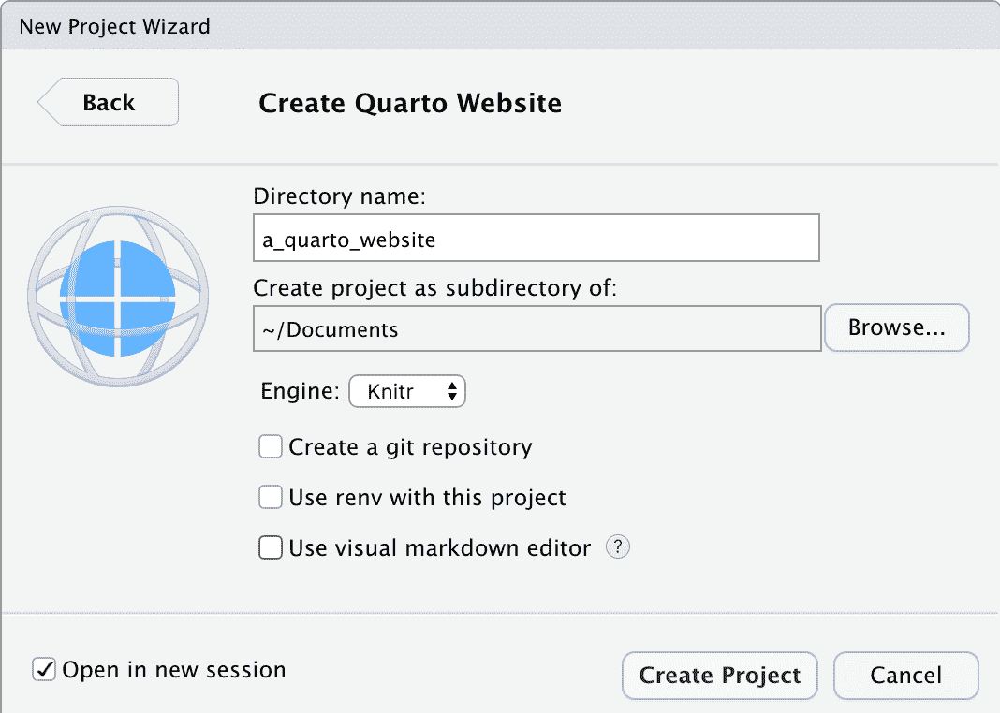

(a) 设置 Quarto 网站的示例设置


(b) 构建 Quarto 网站

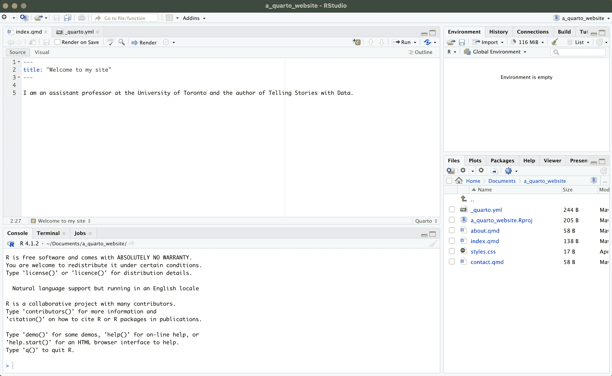

(c) 定制 Quarto 网站

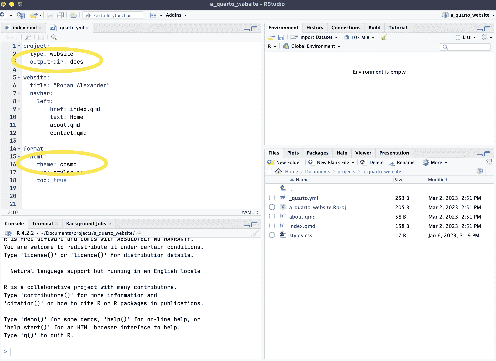

(d) 更新 Quarto yaml

图 4.1：使用 Quarto 制作网站

默认的基本网站可以通过“构建” -> “渲染网站” (图 4.1 (b)) 生成。默认情况下，它可能显示在“查看器”面板中，但也可以在新窗口中显示，通过 。再次，在这个时候，我们可能希望更改细节以反映我们自己的。特别是，我们可能希望更改“index.qmd”的标题，并添加我们自己的详细信息 (图 4.1 (c))。

包含在主菜单中的内容在“_quarto.yml”中指定。我们可以向其中添加另一个页面，例如“contact.qmd”，要创建要包含的内容，我们可能希望复制，比如“about.qmd”，然后编辑它 (图 4.1 (d))。我们还可以在“_quarto.yml”中更改的另一个方面是主题。默认主题是“cosmo”，但这里指定了许多其他选项 [在此](https://quarto.org/docs/output-formats/html-themes.html)。

在详细资料个性化并且我们对网站满意后，可以将网站推送到 GitHub，然后使用 GitHub Pages 进行托管。为了利用这一点，我们首先需要做两件事。首先，我们应该稍微修改“_quarto.yml”以指定我们应该构建到“docs”文件夹而不是“_site”文件夹（图 4.1 (d))。

```r
project:
 type: website 
 output-dir: docs
```

另一个需要了解的方面是，当我们使用这项服务时，默认情况下，GitHub 会尝试构建网站，而我们不希望这样，因此我们需要首先在控制台中运行以下命令来添加一个隐藏文件以关闭该功能：

```r
file.create(".nojekyll")
```

然后，假设 GitHub 已经设置好，我们可以使用`usethis`将新创建的项目上传到 GitHub。我们使用`use_git()`初始化 Git 仓库，然后使用`use_github()`将其推送到 GitHub。

```r
use_git()
use_github()
```

项目随后将位于 GitHub 上。我们可以使用 GitHub Pages 来托管它：“设置 -> 页面”然后根据您的设置将源更改为“main”或“master”，最后是“docs”。经过几分钟的检查后，GitHub 会通知您可以分享的地址以访问您的网站。

要更新网站，请本地工作。首先拉取，以确保 GitHub 所做的任何更改都存在于本地，然后编辑网站，重新渲染它，并以通常的方式将其推送到 GitHub。检查完成后，实时网站将更新。

请确保您的网站有一些正常的文本段落、章节标题、项目符号。一切都应该有良好的文档记录，格式美观，总体质量高。

与之相关的评分标准组件包括：“课堂论文”，“LLM 使用已记录”，“散文”，“提交”，“可重复的工作流程”。提交您网站的链接。
  
### 论文

大概在这个时候，在线附录 F 中的*Donaldson*论文是合适的。

Alexander, Monica. 2019. “人口研究中的可重复性。” [`www.monicaalexander.com/posts/2019-10-20-reproducibility/`](https://www.monicaalexander.com/posts/2019-10-20-reproducibility/).———. 2021. “克服分享代码的障碍。” *YouTube*，二月。[`youtu.be/yvM2C6aZ94k`](https://youtu.be/yvM2C6aZ94k).Arel-Bundock, Vincent. 2024. *tinytable: 在“HTML”，“LaTeX”，“Markdown”，“Word”，“PNG”，“PDF”和“Typst”格式中的简单且可配置的表格*。[`vincentarelbundock.github.io/tinytable/`](https://vincentarelbundock.github.io/tinytable/).Backus, John. 1981. “FORTRAN I，II 和 III 的历史。”在*编程语言的历史*中，由 Richard Wexelblat 编辑，25–74 页。学术出版社.Barba, Lorena. 2018. “可重复研究的术语。” [`arxiv.org/abs/1802.03311`](https://arxiv.org/abs/1802.03311).Begley, Glenn，和 Lee Ellis. 2012. “提高临床前癌症研究的标准。” *自然* 483 (7391): 531--533。[`doi.org/10.1038/483531a`](https://doi.org/10.1038/483531a).Bengtsson, Henrik. 2021. “在 R 中使用 Futures 的并行和分布式处理统一框架。” *R 期刊* 13 (2): 208–27。[`doi.org/10.32614/RJ-2021-048`](https://doi.org/10.32614/RJ-2021-048).Bowers, Jake，和 Maarten Voors. 2016. “如何改善你与未来自我的关系。” *政治科学杂志* 36 (3): 829–48。[`doi.org/10.4067/S0718-090X2016000300011`](https://doi.org/10.4067/S0718-090X2016000300011).Brown, Zack. 2018. “Git 的起源故事。” *Linux 杂志*，七月。[`www.linuxjournal.com/content/git-origin-story`](https://www.linuxjournal.com/content/git-origin-story).Bryan, Jenny. 2018a. “打扰一下，你有时间谈谈版本控制吗？” *美国统计学家* 72 (1): 20–27。[`doi.org/10.1080/00031305.2017.1399928`](https://doi.org/10.1080/00031305.2017.1399928).———. 2018b. “代码的气味和感觉。” *YouTube*，七月。[`youtu.be/7oyiPBjLAWY`](https://youtu.be/7oyiPBjLAWY).———. 2020. *Happy Git and GitHub for the useR*。[`happygitwithr.com`](https://happygitwithr.com).Bryan, Jenny，Jim Hester，David Robinson，Hadley Wickham，和 Christophe Dervieux. 2022. *reprex: 通过剪贴板准备可重复示例代码*。[`CRAN.R-project.org/package=reprex`](https://CRAN.R-project.org/package=reprex).Buckheit, Jonathan，和 David Donoho. 1995. “Wavelab 和可重复研究。”在*小波和统计学*中，55–81 页。斯普林格。[`doi.org/10.1007/978-1-4612-2544-7_5`](https://doi.org/10.1007/978-1-4612-2544-7_5).Burton, Jason，Nicole Cruz，和 Ulrike Hahn. 2021. “重新考虑在线社交网络中道德传染的证据。” *自然人类行为* 5 (12): 1629–35。[`doi.org/10.1038/s41562-021-01133-5`](https://doi.org/10.1038/s41562-021-01133-5).Chawla, Dalmeet Singh. 2020. “被批评的冠状病毒模拟在代码检查努力中获得好评。” *自然* 582: 323–24。[`doi.org/10.1038/d41586-020-01685-y`](https://doi.org/10.1038/d41586-020-01685-y).Chouldechova, Alexandra，Diana Benavides-Prado，Oleksandr Fialko，和 Rhema Vaithianathan. 2018. “儿童虐待热线筛查决策中算法辅助决策案例研究。”在*第一届公平、问责和透明度会议论文集*中，由 Sorelle Friedler 和 Christo Wilson 编辑，81:134–48。机器学习研究论文集。[`proceedings.mlr.press/v81/chouldechova18a.html`](https://proceedings.mlr.press/v81/chouldechova18a.html).Cohen, Jason，Steven Teleki，和 Eric Brown. 2006. *同行代码审查的最佳保密秘密*。Smart Bear Incorporated.Csárdi, Gábor. 2022. *gitcreds: 从“R”查询“git”凭证*。[`CRAN.R-project.org/package=gitcreds`](https://CRAN.R-project.org/package=gitcreds).Dolatsara, Hamidreza Ahady，Ying-Ju Chen，Robert Leonard，Fadel Megahed，和 Allison Jones-Farmer. 2021. “解释预测模型性能：数据准备和模型选择实验研究。” *大数据*，十月。[`doi.org/10.1089/big.2021.0067`](https://doi.org/10.1089/big.2021.0067).Eghbal, Nadia. 2020. *公开工作：开源软件的创建和维护*。加利福尼亚：Stripe 出版社.Feldman, Gilad. 2024. *RRR 评估同行评审*。[`mgto.org/rrrassessmentreviewtemplate`](https://mgto.org/rrrassessmentreviewtemplate).Fowler, Martin，和 Kent Beck. 2018. *重构：现有代码的设计改进*。第 2 版。纽约：Addison-Wesley 专业出版社.Gelfand, Sharla. 2021. “请制作 ReprEx...”。*YouTube*，二月。[`youtu.be/G5Nm-GpmrLw`](https://youtu.be/G5Nm-GpmrLw).Gelman, Andrew. 2016. “下面发生的事情是风向变了，”九月。[`statmodeling.stat.columbia.edu/2016/09/21/what-has-happened-down-here-is-the-winds-have-changed/`](https://statmodeling.stat.columbia.edu/2016/09/21/what-has-happened-down-here-is-the-winds-have-changed/).Gelman, Andrew，Greggor Mattson，和 Daniel Simpson. 2018. “同性恋雷达和去情境测量的谬误。” *社会学科学* 5 (12): 270–80。[`doi.org/10.15195/v5.a12`](https://doi.org/10.15195/v5.a12).Google. 2022. “代码审查中要寻找的内容。” Google 工程实践文档。[`google.github.io/eng-practices/review/reviewer/looking-for.html`](https://google.github.io/eng-practices/review/reviewer/looking-for.html).Heil, Benjamin，Michael Hoffman，Florian Markowetz，Su-In Lee，Casey Greene，和 Stephanie Hicks. 2021. “生命科学中机器学习的可重复性标准。” *自然方法* 18 (10): 1132–35。[`doi.org/10.1038/s41592-021-01256-7`](https://doi.org/10.1038/s41592-021-01256-7).Herndon, Thomas，Michael Ash，和 Robert Pollin. 2014. “高公共债务是否始终阻碍经济增长？对 Reinhart 和 Rogoff 的批判。” *剑桥经济学杂志* 38 (2): 257–79。[`doi.org/10.1093/cje/bet075`](https://doi.org/10.1093/cje/bet075).Hester, Jim，Florent Angly，Russ Hyde，Michael Chirico，Kun Ren，Alexander Rosenstock，和 Indrajeet Patil. 2022. *lintr: R 代码的“检查器”*。[`CRAN.R-project.org/package=lintr`](https://CRAN.R-project.org/package=lintr).Hillel, Wayne. 2017. *我们如何信任我们的科学代码？* [`www.hillelwayne.com/how-do-we-trust-science-code/`](https://www.hillelwayne.com/how-do-we-trust-science-code/).Irving, Damien，Kate Hertweck，Luke Johnston，Joel Ostblom，Charlotte Wickham，和 Greg Wilson. 2021. *使用 Python 进行研究软件工程*。Chapman; Hall/CRC.Isaacson, Walter. 2011. *史蒂夫·乔布斯*。第 1 版。西蒙与舒斯特出版社.Kleiber, Christian，和 Achim Zeileis. 2008. *使用 R 进行应用计量经济学*。纽约：Springer-Verlag。[`CRAN.R-project.org/package=AER`](https://CRAN.R-project.org/package=AER).Knuth, Donald. 1984. “文献编程。” *计算机杂志* 27 (2): 97–111。[`doi.org/10.1093/comjnl/27.2.97`](https://doi.org/10.1093/comjnl/27.2.97).Landau, William Michael. 2021. “targets R 包：一个动态的类似 Make 的面向功能的管道工具包，用于可重复性和高性能计算。” *开源软件杂志* 6 (57): 2959。[`doi.org/10.21105/joss.02959`](https://doi.org/10.21105/joss.02959).Maier, Maximilian，František Bartoš，Tom Stanley，David Shanks，Adam Harris，和 Eric-Jan Wagenmakers. 2022. “调整出版偏差后无证据表明助推有显著和一致的影响。” *美国国家科学院院刊* 119 (31): e2200300119。[`doi.org/10.1073/pnas.2200300119`](https://doi.org/10.1073/pnas.2200300119).Marlowe, Christopher. 1604. *浮士德博士的悲剧历史*。[`www.gutenberg.org/files/779/779-h/779-h.htm`](https://www.gutenberg.org/files/779/779-h/779-h.htm).———. 1616. *浮士德博士的悲剧历史*。[`www.gutenberg.org/cache/epub/811/pg811-images.html`](https://www.gutenberg.org/cache/epub/811/pg811-images.html).Matsumoto, Yukihiro. 2007. “将代码视为散文。”在*美丽的代码*中，由 Andy Oram 和 Greg Wilson 编辑，477–81 页。奥莱利出版社.Mattson, Greggor. 2017. “人工智能发现了同性恋面孔。唉。” [`greggormattson.com/2017/09/09/artificial-intelligence-discovers-gayface/amp/`](https://greggormattson.com/2017/09/09/artificial-intelligence-discovers-gayface/amp/).Merali, Zeeya. 2010. “计算科学：... 错误。” *自然* 467 (7317): 775–77。[`doi.org/10.1038/467775a`](https://doi.org/10.1038/467775a).Mineault, Patrick

1.  总是有少数学生难以在本地设置 PDF。最坏的情况是，先将所有其他内容以 HTML 格式在本地完成，然后在 Posit Cloud 中构建 PDF。↩︎

1.  如果你已经隐藏了 GitHub 邮箱，那么在本地添加邮箱地址时，请确保使用别名。↩︎

1.  总会有一些学生无法在本地使 git 工作。我发现最好的方法是，在你演示的同时，将他们与一个高级学生配对进行分类，如果有剩余的问题，则在办公时间单独处理。↩︎

