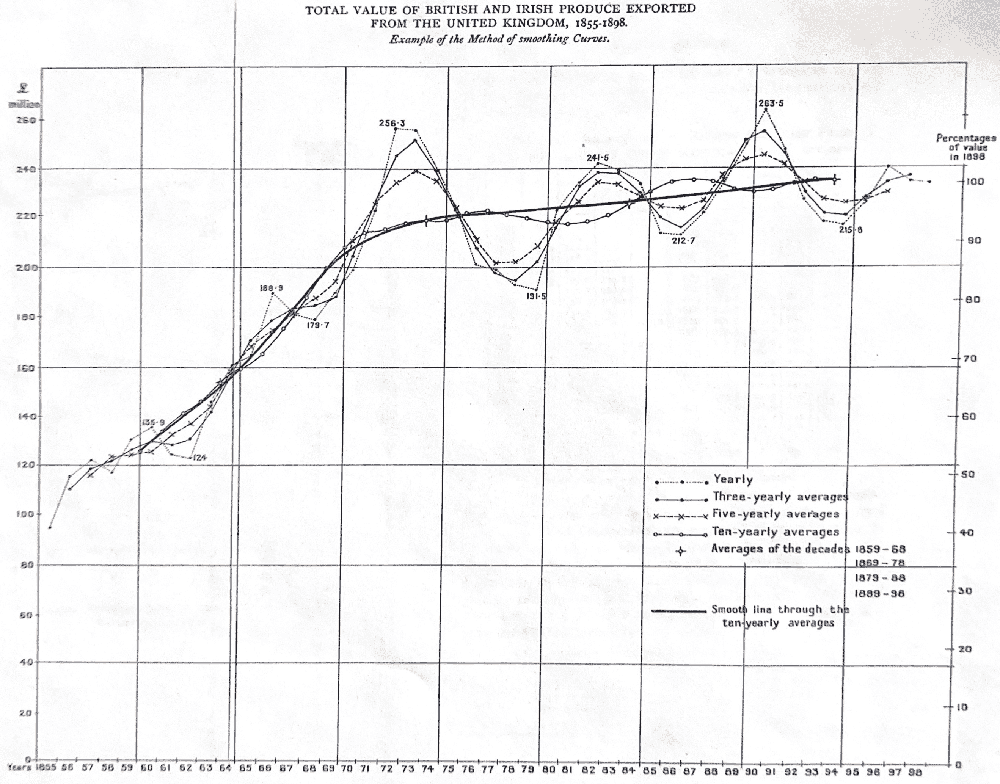
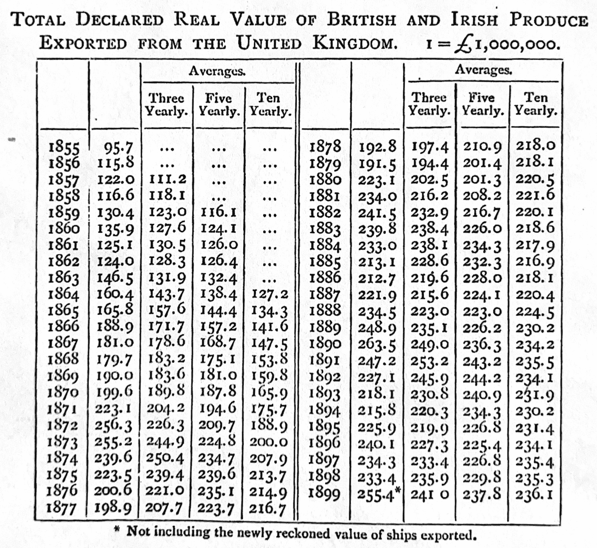

# 4  撰写研究

> 原文：[`tellingstorieswithdata.com/04-writing_research.html`](https://tellingstorieswithdata.com/04-writing_research.html)

1.  沟通

1.  4  撰写研究

《查普曼和霍尔/CRC》于 2023 年 7 月出版了这本书。您可以在[这里](https://www.routledge.com/Telling-Stories-with-Data-With-Applications-in-R/Alexander/p/book/9781032134772)购买。这个在线版本对印刷版有所更新。
先决条件**

+   阅读《设计：高等教育研究规划》(Light, Singer, and Willett 1990)

    +   重点关注第二章“你的问题是什么”，它提供了发展良好研究问题的策略。

+   阅读《写作之道》（任何版本均可）(Zinsser 1976)

    +   重点关注第一部分“原则”和第二部分“方法”，它们提供了一种特别有效的写作风格的“如何做”指南。

+   阅读《小说家科马克·麦卡锡关于如何撰写优秀科学论文的建议》(Savage and Yeh 2019)

    +   这篇论文提供了具体的建议，将提高你的写作水平。

+   阅读《出版，出版》(G. King 2006)

    +   这篇论文详细介绍了从复制到可发表学术论文的策略。

+   观看《量化编辑》(Bronner 2021)

    +   这段视频提供了基于在 FiveThirtyEight 担任量化编辑经验的定量写作策略。

+   阅读《吸烟与肺癌》(Doll and Hill 1950)

    +   这篇论文提供了一个数据部分的优秀示例。

+   阅读《如何写得好》(Graham 2020)

    +   一篇关于写读者尚未了解的真实且重要内容的博客文章。

+   阅读以下一篇优秀的定量论文：

    +   《交换经济中的资产价格》(Lucas 1978)

    +   《法国大革命辩论中的个人、机构和创新》(Barron et al. 2018)

    +   《基于生理因素的马拉松最佳表现建模》(Joyner 1991)

    +   《关于可重复的经济计量学研究》(Koenker and Zeileis 2009)

    +   《从历史和预测的核能中预防死亡和温室气体排放》(Kharecha and Hansen 2013)

    +   《像市场一样看》（Fourcade and Healy 2017)

    +   《辛普森悖论与篮球中的热手现象》(Wardrop 1995)

    +   《使用国际象棋游戏进行机器学习的一些研究》(Samuel 1959)

    +   *《评估两种临床测量方法之间一致性的统计方法》，(布兰德和阿尔特曼 1986)

    +   *《减肥手术后的手术技能和并发症发生率》，(伯克迈耶等 2013)

    +   *《卓越的平凡：关于分层和奥运游泳者的民族志报告》，(钱布利斯 1989)

    +   *《平均值的可能误差》，(学生 1908)

+   从《纽约客》中阅读以下文章之一：

    +   *《像男人一样有趣》，塔德·弗莱恩德，2011 年 4 月 4 日*

    +   *《走得更远》，大卫·雷姆尼克，2014 年 1 月 19 日*

    +   *《如何发现第一例引力波》，尼古拉·特威利，2016 年 2 月 11 日*

    +   *《快乐之足》，亚历山德拉·雅各布斯，2009 年 9 月 7 日*

    +   *《游戏的层次》，约翰·麦克菲，1969 年 5 月 31 日*

    +   *《从广岛报道》，约翰·赫西，1946 年 8 月 23 日*

    +   *《灾变论者》，伊丽莎白·科尔伯特，2009 年 6 月 22 日*

    +   *《沉默的德国人》，乔治·帕克，2014 年 11 月 24 日*

    +   *《追求美》，亚历克·威尔金森，2015 年 2 月 1 日*

+   从其他出版物中阅读以下文章之一：

    +   *《冰上奇迹》，霍利·安德森，格兰特兰德*

    +   *《生来就跑》，沃尔特·哈灵顿，《华盛顿邮报》*

    +   *《被遗弃》，贾森·法戈尼，格兰特兰德*

    +   *《费德勒作为宗教体验》，大卫·福斯特·沃尔斯特，《纽约时报杂志》*

    +   *《为什么一代人？》，扎迪·史密斯，《纽约书评》*

    +   *《一百年的锁喉技》，大卫·塞缪尔斯，格兰特兰德*

    +   *《在伟大的孤独中》，布莱恩·菲利普斯，ESPN*

    +   *《早餐前的珍珠》，吉恩·温加滕，《华盛顿邮报*>

    +   *《复活冠军》，J.R.莫林格，洛杉矶时报*

    +   *《侏罗纪公园的崇拜》，布莱恩·柯蒂斯，格兰特兰德*

    +   *《霍华德建造的房子》，扎迪·史密斯，《纽约时报》*

    +   *《克里斯·科普兰德的再教育》，弗林德·博伊德，SB Nation*

    +   *《危机之海》，布莱恩·菲利普斯，格兰特兰德*

    +   *韦伯太空望远镜将重写宇宙历史。如果它成功的话*，娜塔莉·沃尔科弗，量子杂志

关键概念和技能**

+   写作是分析数据所需的所有技能中最重要的技能之一。提高写作的唯一方法就是写作，理想情况下每天都要写。

+   当我们写作时，尽管通常好处归我们自己，但我们仍然必须为读者写作。这意味着我们有一个主要的信息想要传达，并且要考虑他们在哪里，而不是我们在哪里。

+   我们希望尽可能快地完成初稿。即使它很糟糕，有初稿和没有初稿之间的区别是巨大的。在那个阶段，我们开始重写。在这样做的时候，我们旨在最大化清晰度，通常是通过删除不必要的词语。

+   我们通常从一个感兴趣的领域开始，然后以迭代的方式发展研究问题、数据集和分析。通过这个过程，我们更好地理解我们在做什么。

软件和包**

+   `knitr` (谢 2023)

+   `tidyverse` (Wickham et al. 2019)

+   `tinytable` (Arel-Bundock 2024)

```r
library(knitr)
library(tidyverse)
library(tinytable)
```

## 4.1 引言

> 如果你想要成为一名作家，你必须首先做两件事：多读书和多写作。据我所知，没有其他方法可以绕过这两件事，没有捷径。
> 
> S. King (2000, 145)

我们主要通过写下数据来讲述故事。写作使我们能够有效地沟通。它也是一种梳理我们的信念并允许我们对我们的想法获得反馈的方法。有效的论文结构紧凑、组织良好，这使得故事流畅。适当的句子结构、拼写、词汇和语法都很重要，因为它们消除了干扰，并使故事中的每个方面都能清晰地表达出来。

本章是关于写作的。到本章结束时，你将更好地了解如何撰写简短、详细、定量的论文，这些论文能够传达你想要传达的内容，并且不会浪费读者的时间。我们写作是为了读者，而不是为了我们自己。具体来说，我们写作是为了对读者有用。这意味着清晰地传达一些新颖、真实和重要的内容 (Graham 2020)。尽管如此，写作的最大好处往往还是归功于作者，即使我们是为我们的受众写作。这是因为写作的过程是一种梳理我们的想法以及我们如何形成这些想法的方法。

本章的一些方面可能会感觉像是一个列表。可能的情况是，你最初会快速地浏览这些方面，然后根据需要返回。

## 4.2 写作

> 完成一篇写作作品的方式是三到四次，而不是一次。对我来说，最难的部分是首先把一些东西——任何东西——摆在我面前。有时在紧张的状态下，我只是像往墙上扔泥巴一样扔出文字。脱口而出，倾泻而出，喋喋不休地吐出一些——任何东西——作为初稿。
> 
> McPhee (2017, 159)

写作的过程是一个不断重写的过程。关键任务是尽可能快地完成初稿。在完整的初稿存在之前，尝试不要删除，甚至修订任何已经写下的内容，无论它看起来多么糟糕。只管写。 (这条建议是针对不太有经验的作家。随着你经验的增加，你可能会发现你的方法有所改变。)

最令人畏惧的阶段之一是空白的页面，我们通过立即添加标题来处理这个问题，例如：“引言”、“数据”、“模型”、“结果”和“讨论”。然后在页眉顶部添加所需的各种字段，如“标题”、“日期”、“作者”和“摘要”。这创建了一个通用的提纲，它将在论文中扮演* mise en place* 的角色。作为背景，* mise en place* 是专业厨房中一个准备阶段，此时原料被分类、准备并排列以便于取用。这确保了所需的一切都能在无需不必要的延迟的情况下获得。在撰写定量论文时，制定提纲扮演着同样的角色，类似于在厨房台面上放置我们将用来准备晚餐的原料（McPhee 2017）。

在确立了这一通用提纲之后，我们需要通过深入思考我们的研究问题来理解我们要探索的内容。从理论上讲，我们制定一个研究问题，回答它，然后进行所有写作；但这种情况很少真正发生（Franklin 2005）。相反，我们通常对问题及其答案的形状有一些想法，随着写作的进行，这些想法变得更加明确。这是因为正是通过写作的过程，我们才细化了我们的思考（S. King 2000, 131）。在写下关于研究问题的某些想法之后，我们可以在每个部分中开始添加项目符号，根据需要添加带有信息性副标题的子部分。然后我们回头将这些项目符号扩展成段落。在这个过程中，我们的思考受到其他研究者的网络影响，以及我们的环境和情境等其他方面的影响（Latour 1996）。

在撰写第一稿时，你应该忽略自己不够好或不可能完成的感受。只管写。你需要把文字写在纸上，即使它们很糟糕，第一稿就是完成这一点的时刻。消除干扰，专注于写作。完美主义是敌人，应该被放在一边。有时这可以通过早起写作、设定截止日期或组建写作小组来实现。创造紧迫感可能是有用的，一个选择是在写作过程中不添加适当的引用，这可能会减慢你的速度，而只是添加像“[待办：在此处引用]”这样的内容。对图表和表格也这样做。也就是说，包括像“[待办：在此处添加显示每个国家随时间变化的图表]”这样的文本描述，而不是实际的图表和表格。专注于添加内容，即使它很糟糕。当这一切都完成时，第一稿就存在了。

这第一稿将写得不好，远非优秀。但正是通过写出一个糟糕的初稿，你才能达到一个好的二稿，一个伟大的三稿，最终达到卓越(Lamott 1994, 20)。第一稿将过长，内容将不连贯，将包含无法支持的论断，以及一些不应该有的论断。如果你对你的初稿不感到尴尬，那么你就没有足够快地写出来。

大量使用“删除”键，以及“剪切”和“粘贴”，将初稿变成第二稿。打印出草案，并用红笔移动或删除单词、句子和整个段落，特别有帮助。从初稿到二稿的过程最好在一次会话中完成，以帮助故事的流畅性和一致性。这次重写的一个方面是增强我们想要讲述的故事。另一个方面是移除所有不是故事的内容(S. King 2000, 57)。

即使内容并不完全符合草案的走向，移除看似不错的工作内容也可能令人痛苦。一种减轻这种痛苦的方法是创建一个临时文档，可能命名为“debris.qmd”，将这些不需要的段落保存起来，而不是立即删除它们。另一种策略是注释掉这些段落。这样，你仍然可以查看原始文件，并注意到可能有用的方面。

在审阅每个部分所写的内容时，尝试通过特别考虑它如何支持正在发展的故事来给它带来一些意义。这个修订过程是写作的精髓(McPhee 2017, 160)。你还应该修复参考文献，并添加真实的图表和表格。作为这个重写过程的一部分，论文的核心信息往往会发展，对研究问题的答案往往会变得更加清晰。在这个时候，可以返回到引言，最后是摘要。错别字和其他问题会影响工作的可信度。因此，这些应该在二稿中修复。

到目前为止，草案已经开始变得合理。现在的工作是让它变得精彩。打印出来，再次在纸上审阅。尝试移除所有不贡献于故事的内容。在这个阶段，你可能会开始过于接近纸张。这是一个很好的机会，把它给别人看，让他们提出评论。请他们反馈故事中哪些地方薄弱。在解决这些问题后，再次审阅论文可能有所帮助，这次是出声朗读。论文永远不会“完成”，更多的时候是在某个时刻你要么用完了时间，要么对它的外观感到厌倦。

## 4.3 提出问题

定性和定量方法都有其位置。在这本书中，我们关注定量方法。尽管如此，定性研究也很重要，而且往往最有趣的工作都包含两者的某些方面。在进行定量分析时，我们面临着数据质量、测量和相关性等问题。我们通常特别感兴趣的是试图揭示因果关系。无论如何，我们都在试图了解这个世界。我们的研究问题需要考虑所有这些因素。

广义而言，冒着过度简化的风险，有两种进行研究的方法：

1.  数据优先；或者

1.  问题优先。

但这并非二元对立，而且研究通常是通过在数据和问题之间迭代，围绕一个研究谜题（Gustafsson 和 Hagström 2017）进行的。Light、Singer 和 Willet（1990, 39）将这种方法描述为$\mbox{理论}\rightarrow\mbox{数据}\rightarrow\mbox{理论}\rightarrow\mbox{数据}$等螺旋式循环。例如，问题优先的方法可以是理论驱动的或数据驱动的，数据优先的方法也是如此。另一种框架是将归纳法，或从特殊到一般的方法，与演绎法，或从一般到特殊的方法进行比较。

考虑两个例子：

1.  Mok 等人（2022）从 10 万名 Spotify 用户中分析了 80 亿个独特的收听事件，以了解用户如何探索内容。他们发现年龄和行为之间存在明显的关联，尽管年轻用户的消费更加多样化，但年轻用户探索未知内容的行为不如老年用户。虽然很明显，关于发现和探索的研究问题推动了这篇论文，但没有这个数据集是不可能的。可能存在一个迭代过程，在这个过程中考虑了潜在的研究问题和潜在的数据集，然后才找到了最终的匹配。

1.  想象一下想要探索新生儿死亡率（NMR），这在第二章中已经介绍过。一个人可能对 20 年后撒哈拉以南非洲的 NMR 可能是什么样子感兴趣。这将是一个问题优先的方法。但在这个框架内，可能会有：基于与其他数量之间的生物关系，我们期望什么这样的理论驱动方面；或者收集尽可能多的数据以进行预测的数据驱动方面。另一种纯粹的数据驱动方法是在获得 NMR 数据后，然后确定可能的情况。

### 4.3.1 数据优先

当以数据优先时，主要问题是如何确定可以用现有数据合理回答的问题。在决定这些问题时，考虑以下因素是有用的：

1.  理论：是否有合理的预期可以确定某种因果关系？例如，马克·克里斯滕森曾经开玩笑说，如果问题涉及到绘制股市图表，那么可能最好回顾一下《奥德赛》并在火上阅读公牛的内脏，因为至少这样你会在一天结束时有所收获。问题通常需要有一定的理论依据，以帮助避免虚假关系。在给定数据的情况下，发展理论的一种方式是考虑“这是什么的一个例子？”（罗森瑙 1999，7）。遵循这种方法，人们试图将具体设置推广到更一般的情况。例如，将某个特定的内战视为所有内战的一个例子。这种做法的好处是它将注意力集中在构建理论所需的一般属性上。

1.  重要性：虽然有很多琐碎的问题可以回答，但重要的是不要浪费我们或读者的时间。拥有一个重要的问题也可以在我们发现自己处于，比如说，连续第四周清理数据和调试代码的情况下，帮助我们保持动力。在工业界，这也可以使吸引有才华的员工和资金更容易。然而，需要平衡；问题需要有相当的机会被回答。攻击一个定义一代的问题可能最好分块进行。

1.  可用性：是否有合理的预期未来可以获得更多数据？这可以让我们回答相关问题，并将一篇论文转化为研究议程。

1.  迭代：这是否可以多次运行，或者它是一次性分析？如果是前者，那么就有可能开始回答具体的研究问题，然后进行迭代。但如果我们只能一次获得数据，那么我们需要考虑更广泛的问题。

有一个说法，有时归功于肖力萌，即所有统计学都是缺失数据问题。因此，矛盾的是，另一种提出以数据为先的问题的方式是考虑我们没有的数据。例如，回到之前讨论过的新生儿和孕产妇死亡率例子，一个问题是我们没有完整的死亡原因数据。如果我们有，那么我们可以计算相关死亡的数量。（卡斯特罗等人（2023）提醒我们，这种简单假设在现实中可能会变得复杂，因为有时死亡原因并不是独立于其他原因的。）在确定了某些缺失数据问题后，我们可以采取数据驱动的方法。我们查看我们拥有的数据，然后提出研究问题，这些问题涉及到我们可以使用这些数据来近似我们的假设数据集的程度。

巨人的肩膀* 小李·孟是哈佛大学的惠普尔·V·N·琼斯统计学教授。1990 年，他在哈佛大学获得统计学博士学位后，被任命为芝加哥大学的助理教授，2000 年晋升为教授。2001 年，他搬到哈佛大学，2004 年至 2012 年间担任统计学系主任。他发表了关于广泛主题的文章，包括缺失数据——孟（1994）和孟（2012）——以及数据质量——孟（2018）。2001 年，他获得了 COPSS 总统奖。*  *一些研究人员之所以数据优先，是因为他们在某些地理或历史环境的数据方面具有特定的专业知识。例如，他们可能特别了解，比如说，现在的英国，或者 19 世纪末的日本。然后他们观察其他研究人员在其他情况下提出的问题，并将他们的数据带到这个问题上。例如，常见的情况是，最初为美国提出一个问题，然后许多研究人员为英国、加拿大、澳大利亚和其他许多国家回答相同的问题。

数据优先研究有许多缺点，包括它可能特别不确定。它也可能在外部效度上挣扎，因为总会有关于选择效应的担忧。

数据驱动研究的一种变体是模型驱动研究。在这里，研究人员成为某些特定统计方法的专家，然后将该方法应用于适当的情境。

### 4.3.2 问题优先

当试图问题优先时，存在一个相反的问题，即关注数据可用性。在医学中，“FINER 框架”被用来帮助指导研究问题的开发。它建议提出以下问题：可行、有趣、新颖、道德和相关性（Hulley 等人 2007）。Farrugia 等人（2010）在 FINER 的基础上构建了 PICOT，它建议额外的考虑因素：人群、干预措施、比较组、感兴趣的结果和时间。

尝试写出问题可能会感到压力很大。一种方法是提出一个非常具体的问题。另一种方法是决定我们是否对描述性、预测性、推断性或因果分析感兴趣。这些然后导致不同类型的问题。例如：

+   描述性分析：“$x$ 看起来是什么样子？”；

+   预测性分析：“$x$ 会发生什么？”；

+   推断性：“我们如何解释 $x$？”；

+   因果关系：“$x$ 对 $y$ 有什么影响？”。

这些每一项都有其作用。自从可信度革命（Angrist 和 Pischke 2010）以来，用特定方法回答的因果问题占主导地位。这带来了一些好处，但并非没有代价。描述性分析同样，有时甚至更具有启发性，并且至关重要（Sen 1980）。提出问题的性质不如真正对回答问题感兴趣重要。

时间往往会受到限制，可能以有趣的方式，这可以指导研究问题的具体细节。如果我们对名人公告对股市的影响感兴趣，那么可以通过查看公告前后的股价来实现。但如果我们对癌症药物对长期结果的影响感兴趣呢？如果效果需要 20 年，那么我们可能需要等待一段时间，或者我们需要查看 20 年前接受过治疗的人。这样，我们就有了与今天给药相比的选择效应和不同的情况。通常唯一合理的事情是建立统计模型，但这又带来了其他问题。

### 4.4.1 反事实与偏差

在回答问题时，创建反事实通常至关重要。反事实是一个“如果-那么”陈述，其中“如果”部分是假的。以刘易斯·卡罗尔的《爱丽丝镜中奇遇记》中 Humpty Dumpty 为例：

> “你问的谜题多么简单啊！” Humpty Dumpty 咆哮道。“当然，我不这么认为！为什么，如果我曾经掉下来——这根本不可能——但如果是这样的话——”他紧闭嘴唇，表情庄重而严肃，以至于爱丽丝忍不住笑了。“如果我掉下来，”他继续说，“国王已经亲口答应我——” “要派他的所有马匹和所有士兵，”爱丽丝打断了他的话，相当不明智。
> 
> 卡罗尔 (1871)

Humpty Dumpty 对如果他掉下来会发生什么感到满意，尽管他确信这永远不会发生。正是这个比较组往往决定了问题的答案。例如，在第十五章中，我们考虑了最大摄氧量对自行车手赢得比赛机会的影响。如果我们对整个人群进行比较，那么这是一个重要变量。但如果我们只对受过良好训练的运动员进行比较，那么它就不那么重要了，因为存在选择偏差。

在决定研究问题时，有两个数据方面需要特别注意，即选择偏差和测量偏差。

选择偏差发生在结果依赖于样本中谁的情况。选择偏差的一个有害方面是我们需要了解其存在才能对此采取任何措施。但许多默认诊断工具都无法识别选择偏差。在我们在第八章中讨论的 A/B 测试中，A/A 测试是一个轻微的变体，我们在施加治疗之前创建组并比较它们（因此得名 A/A）。这种检查组是否最初相同的工作可以帮助识别选择偏差。更普遍地说，将样本的性质，如年龄组、性别和教育，与人口特征进行比较也可以有所帮助。但选择偏差和观察数据的基本问题是，我们知道我们拥有数据的人至少在一种方式上与那些我们没有数据的人不同！但我们不知道他们可能在其他哪些方面不同。

选择偏差可以渗透到我们分析的多方面。即使最初具有代表性的样本也可能随着时间的推移而变得有偏差。例如，我们在第六章中讨论的调查面板需要不时更新，因为那些从中得不到任何东西的人停止了回应。

另一个需要注意的偏差是测量偏差，它发生在结果受到数据收集方式的影响时。一个常见的例子是，如果我们要求受访者提供他们的收入，那么我们可能会在面对面调查和在线调查中得到不同的答案。

### 4.4.2 估计对象

我们通常会感兴趣使用数据来回答我们的问题，并且我们清楚具体内容是很重要的。例如，我们可能对吸烟对预期寿命的影响感兴趣。在这种情况下，存在某种真实的影响，我们永远无法知道，这种真实影响被称为“估计对象”（Little 和 Lewis 2021）。在论文的某个地方，理想情况下在引言中，定义估计对象是至关重要的（Lundberg, Johnson 和 Stewart 2021）。这是因为很容易稍微改变分析计划的一些具体方面，最终意外地估计出不同的东西（Kahan 等人 2022）。它们正开始被一些药品监管机构所要求（Kahan 等人 2024）。对于估计对象，我们寻找一个关于效果代表的清晰描述（Kahan 等人 2023）。一个“估计量”是我们使用我们拥有的数据生成“估计”估计对象的过程。Efron 和 Morris（1977）讨论了估计量和相关问题。

Bueno de Mesquita 和 Fowler（2021, 94）描述了估计与估计对象之间的关系：

$$ \mbox{估计值 = 估计值 + 偏差 + 噪声} $$

偏差指的是估计量系统地提供与估计值不同的估计的问题，而噪声指的是非系统性的差异。例如，考虑一个标准正态分布。我们可能对理解平均值感兴趣，这将是我们所估计的值。我们知道（以一种我们永远无法用真实数据做到的方式），估计值是零。让我们从这个分布中抽取十次。我们可以用来产生估计的一个估计量是：将抽取值相加然后除以抽取次数。另一个是排序抽取值并找到中间观察值。更具体地说，我们将模拟这种情况（表 4.1）。

```r
set.seed(853)

tibble(
 num_draws = c(
 rep(10, times = 10),
 rep(100, times = 100),
 rep(1000, times = 1000),
 rep(10000, times = 10000)
 ),
 draw = rnorm(
 n = length(num_draws),
 mean = 0,
 sd = 1)
 ) |> 
 summarise(
 estimator_one = sum(draw) / unique(num_draws),
 estimator_two = sort(draw)[round(unique(num_draws) / 2, 0)],
 .by = num_draws
 ) |>
 tt() |> 
 style_tt(j = 2:3, align = "r") |> 
 format_tt(digits = 2, num_mark_big = ",", num_fmt = "decimal") |> 
 setNames(c("Number of draws", "Estimator one", "Estimator two"))
```

表 4.1：比较随着抽取次数增加的两个估计量对随机抽取平均值的估计结果

| 抽取次数 | 估计量一 | 估计量二 |
| --- | --- | --- |
| 10 | -0.58 | -0.82 |
| 100 | -0.06 | -0.07 |
| 1,000 | 0.06 | 0.04 |

| 10,000 | -0.01 | -0.01 |*  *随着抽取次数的增加，噪声的影响被消除，我们的估计展示了估计量的偏差。在这个例子中，我们知道真相是什么，但在考虑真实数据时，可能更难知道该怎么做。因此，在转向生成估计之前，明确估计值是什么的重要性。

### 4.4.3 有向无环图

当我们在思考我们将用于回答问题的变量时，明确我们所说的内容会有所帮助。很容易陷入观察数据的陷阱并欺骗自己。我们应该深思熟虑，并使用我们所能使用的所有工具。一个可以帮助我们深入思考数据的框架是使用有向无环图（DAG）。DAG 是一个花哨的名字，指的是流程图，涉及在变量之间绘制箭头和线条以指示它们之间的关系。

构建它们时，我们使用 Graphviz，这是一个用于图形可视化的开源包，并内置在 Quarto 中。代码需要用“dot”块包裹而不是“R”，并且块选项用“//|”而不是“#|”设置。不需要这些的替代方案包括使用`DiagrammeR` (Iannone 2022) 和 `ggdag` (Barrett 2021)。我们提供了第一个 DAG 的整个块，但之后，只提供其他 DAG 的代码。

```r
```{dot}

//| label: fig-dot-firstdag-quarto

//| fig-cap: "我们期望 x 和 y 之间存在因果关系，其中 x 影响 y"

//| fig-width: 4

digraph D {

node [shape=plaintext, fontname = "helvetica"];

{rank=same x y};

x -> y;

}

```r
```

<svg width="384" height="480" viewBox="0.00 0.00 134.00 44.00" xlink="http://www.w3.org/1999/xlink" style="; max-width: none; max-height: none"><g id="graph0" class="graph" transform="scale(1 1) rotate(0) translate(4 40)"><title>D</title> <g id="node1" class="node"><title>x</title> <text text-anchor="middle" x="27" y="-13.8" font-family="Helvetica,sans-Serif" font-size="14.00">x</text></g> <g id="node2" class="node"><title>y</title> <text text-anchor="middle" x="99" y="-13.8" font-family="Helvetica,sans-Serif" font-size="14.00">y</text></g> <g id="edge1" class="edge"><title>x->y</title></g></g></svg>

图 4.1：我们期望 x 和 y 之间存在因果关系，其中 x 影响 y*  *在图 4.1 中，我们表示我们认为*x*导致*y*。

我们可以构建另一个 DAG，其中情况不太明确。为了使例子更容易理解，我们将转向考虑收入与幸福之间假设性的关系，并考虑可能影响这种关系的变量。在这个例子中，我们考虑收入与幸福之间的关系，包括教育(图 4.2)。

```r
digraph D {

 node  [shape=plaintext, fontname  =  "helvetica"];

 a  [label  =  "Income"];
 b  [label  =  "Happiness"];
 c  [label  =  "Education"];

 {  rank=same  a  b};

 a->b;
 c->{a, b};
}
```

<svg width="384" height="480" viewBox="0.00 0.00 170.03 116.00" xlink="http://www.w3.org/1999/xlink" style="; max-width: none; max-height: none"><g id="graph0" class="graph" transform="scale(1 1) rotate(0) translate(4 112)"><title>D</title> <g id="node1" class="node"><title>a</title> <text text-anchor="middle" x="30.96" y="-13.8" font-family="Helvetica,sans-Serif" font-size="14.00">Income</text></g> <g id="node2" class="node"><title>b</title> <text text-anchor="middle" x="120.96" y="-13.8" font-family="Helvetica,sans-Serif" font-size="14.00">Happiness</text></g> <g id="edge1" class="edge"><title>a->b</title></g> <g id="node3" class="node"><title>c</title> <text text-anchor="middle" x="75.96" y="-85.8" font-family="Helvetica,sans-Serif" font-size="14.00">Education</text></g> <g id="edge2" class="edge"><title>c->a</title></g> <g id="edge3" class="edge"><title>c->b</title></g></g></svg>

图 4.2：教育是一个混杂因素，它影响收入与幸福之间的关系*  *在图 4.2 中，我们认为收入导致幸福。但我们还认为教育导致幸福，教育也导致收入。这种关系是一种“后门路径”，如果在回归分析中未能调整教育因素，可能会高估收入与幸福之间关系的程度，甚至可能在我们分析中创造出虚假的关系。也就是说，我们可能会认为收入的变化导致幸福的变化，但实际上可能是教育同时影响了两者。在这种情况下，这个变量，即教育，被称为“混杂因素”。

Hernán 和 Robins（2023，83）讨论了一个有趣的案例，其中一位研究人员对一个人仰望天空是否会使其他人也仰望天空感兴趣。这两个人之间的反应存在明显的关系。但天空也存在噪音。不清楚第二个人是否因为第一个人的仰望而仰望，或者他们两人都因为噪音而仰望。当使用实验数据时，随机化使我们能够避免这种担忧，但在观察数据中，我们无法依赖这一点。更大的数据也并不一定能帮助我们解决这个问题。相反，我们应该仔细思考这种情况，DAGs 可以帮助我们做到这一点。

如果存在混杂因素，但我们仍然对因果关系感兴趣，那么我们需要对其进行调整。一种方法是将它们包含在回归中。但这种方法的有效性需要几个假设。特别是，Gelman 和 Hill（2007，169）警告说，如果我们包括所有混杂因素并拥有正确的模型，我们的估计将仅对应于样本中的平均因果关系效应。将第二个要求放在一边，只关注第一个，如果我们没有考虑和观察到混杂因素，那么调整它可能会很困难。而且，这是一个领域专业知识和理论可以为分析带来相当大的影响力的领域。

在图 4.3 中，我们再次考虑收入导致幸福的情况。但是，如果收入也导致孩子，而孩子也导致幸福，那么我们就会遇到一个难以理解收入对幸福影响的情况。

```r
digraph D {

 node  [shape=plaintext, fontname  =  "helvetica"];

 a  [label  =  "Income"];
 b  [label  =  "Happiness"];
 c  [label  =  "Children"];

 {  rank=same  a  b};

 a->{b, c};
 c->b;
}
```

<svg width="384" height="480" viewBox="0.00 0.00 170.03 116.00" xlink="http://www.w3.org/1999/xlink" style="; max-width: none; max-height: none"><g id="graph0" class="graph" transform="scale(1 1) rotate(0) translate(4 112)"><title>D</title> <g id="node1" class="node"><title>a</title> <text text-anchor="middle" x="30.96" y="-85.8" font-family="Helvetica,sans-Serif" font-size="14.00">Income</text></g> <g id="node2" class="node"><title>b</title> <text text-anchor="middle" x="120.96" y="-85.8" font-family="Helvetica,sans-Serif" font-size="14.00">Happiness</text></g> <g id="edge1" class="edge"><title>a->b</title></g> <g id="node3" class="node"><title>c</title> <text text-anchor="middle" x="75.96" y="-13.8" font-family="Helvetica,sans-Serif" font-size="14.00">Children</text></g> <g id="edge2" class="edge"><title>a->c</title></g> <g id="edge3" class="edge"><title>c->b</title></g></g></svg>

图 4.3：收入与幸福之间的中介因素*  *在图 4.3 中，孩子被称为“中介因素”，如果我们对收入对幸福的影响感兴趣，我们不会对其进行调整。如果我们对其进行调整，那么我们归因于收入的一些因素，将归因于孩子。

最后，在图 4.4 中，我们又遇到了另一种类似的情况，我们认为收入导致幸福。但这次，收入和幸福也会导致锻炼。例如，如果你有更多的钱，那么可能更容易锻炼，但如果你更快乐，也可能更容易锻炼。

```r
digraph D {

 node  [shape=plaintext, fontname  =  "helvetica"];

 a  [label  =  "Income"];
 b  [label  =  "Happiness"];
 c  [label  =  "Exercise"];

 {  rank=same  a  b};

 a->{b  c};
 b->c;
}
```

<svg width="384" height="480" viewBox="0.00 0.00 170.03 116.00" xlink="http://www.w3.org/1999/xlink" style="; max-width: none; max-height: none"><g id="graph0" class="graph" transform="scale(1 1) rotate(0) translate(4 112)"><title>D</title> <g id="node1" class="node"><title>a</title> <text text-anchor="middle" x="30.96" y="-85.8" font-family="Helvetica,sans-Serif" font-size="14.00">收入</text></g> <g id="node2" class="node"><title>b</title> <text text-anchor="middle" x="120.96" y="-85.8" font-family="Helvetica,sans-Serif" font-size="14.00">幸福</text></g> <g id="edge1" class="edge"><title>a->b</title></g> <g id="node3" class="node"><title>c</title> <text text-anchor="middle" x="75.96" y="-13.8" font-family="Helvetica,sans-Serif" font-size="14.00">锻炼</text></g> <g id="edge2" class="edge"><title>a->c</title></g> <g id="edge3" class="edge"><title>b->c</title></g></g></svg>

图 4.4：锻炼作为碰撞因子影响收入与幸福之间的关系*  *在这种情况下，锻炼被称为“碰撞因子”，如果我们对其条件化，那么就会产生误导性的关系。收入影响锻炼，但一个人的幸福也会影响这一点。锻炼是碰撞因子，因为感兴趣的预测变量和结果变量都会影响它。

我们将明确这一点：我们必须自己创建有向无环图（DAG），就像我们必须自己构建模型一样。没有任何东西会为我们创建它。这意味着我们需要仔细思考情况。因为在一开始看到有向无环图中的某物并采取行动是一回事，但不知道它在那里则是另一回事。McElreath（[[2015] 2020, 180](99-references.html#ref-citemcelreath)）将这些描述为“幽灵有向无环图”。有向无环图是有帮助的，但它们只是帮助我们深入思考情况的工具。

当我们在构建模型时，可能会倾向于包含尽可能多的预测变量。有向无环图（DAGs）清楚地表明我们需要更加谨慎。例如，如果一个变量是混杂因素，那么我们就会想要对其进行调整，而如果一个变量是碰撞因子，那么我们就不需要。我们永远无法知道真相，我们通过诸如理论、我们的兴趣、研究设计、数据的局限性或我们作为研究者的自身局限性等方面的信息来获得信息，仅举几例。了解局限性与报告模型一样重要。如果承认这些缺陷，数据有缺陷的模型仍然是有用的。思考一个情况的工作永远不会完成，并且依赖于他人，这就是为什么我们需要尽可能使我们的工作可重复。
  


> 我在开始写《教授》之前确实没有发表过任何东西，但在许多粗略的努力中，几乎一写成就被破坏，我克服了可能曾经有过的一切对装饰和冗余写作的喜好，转而更喜欢简单和朴素的东西。
> 
> *《教授》* (勃朗特 1857)

我们讨论以下组成部分：标题、摘要、引言、数据、结果、讨论、图表、表格、方程式和技术术语。¹ 在整篇论文中，尽量做到简洁和具体。大多数读者不会越过标题。几乎没有人会阅读摘要以上的内容。章节和副章节标题，以及图表和表格的标题应该在没有周围文本的情况下也能独立工作，因为这种快速浏览是许多人阅读论文的方式(Keshav 2007)。

### 4.5.1 标题

标题是我们第一次有机会让读者参与到我们的故事中来。理想情况下，我们能够向读者准确传达我们的发现。有效的标题至关重要，因为否则论文可能会被读者忽视。虽然标题不必“可爱”，但它确实需要有意义。这意味着它需要使故事清晰。

一个好的标题示例是“关于 2016 年英国脱欧公投”。这个标题是有用的，因为读者知道论文的内容。但它并不特别具有信息性或吸引力。一个稍微好一点的标题可能是“关于 2016 年英国脱欧公投中的投票离开结果”。这个变体增加了具体的信息。我们认为最好的标题可能是“投票离开在 2016 年英国脱欧公投中农村地区表现优于：贝叶斯层次模型的证据”。在这里，读者不仅知道论文的方法，还知道主要结论。

我们将考虑一些特别有效的标题示例。Hug 等人（2019）使用“1990 年至 2017 年新生儿死亡率的国家级、地区级和全球趋势，以及基于情景的到 2030 年的预测：一项系统分析”。在这里，很明显这篇论文是关于什么，以及使用了哪些方法。R. Alexander 和 Alexander（2021）使用“1901 年至 2018 年澳大利亚联邦议会讨论主题中选举和更换总理的影响增加”。主要发现，以及关于内容的大量信息，都清楚地体现在标题中。M. Alexander、Kiang 和 Barbieri（2018）使用“1979 年至 2015 年美国黑白鸦片死亡率趋势”；Frei 和 Welsh（2022）使用“美国税收漏洞关闭可能如何影响投资者投资组合”。可能是最好的标题之一是 Bickel、Hammel 和 O’Connell（1975）“研究生入学中的性别偏见：来自伯克利的资料：衡量偏见比通常认为的更难，有时证据与预期相反”，我们将在第十五章中回到这个话题。

标题通常是论文最后确定的部分。在完成初稿的过程中，我们通常使用一个工作标题来完成这项工作。然后我们在重写的过程中对其进行细化。标题需要反映论文的最终故事，而这通常不是我们在开始时就已知的。我们必须在让读者足够感兴趣以阅读论文，以及传达足够的内容以便有用之间找到一个平衡（Hayot 2014）。两个很好的例子是托马斯·巴宾顿·麦克 aulay 的《从詹姆斯二世的登基到英格兰的历史》和温斯顿·丘吉尔的《讲英语的人民的历史》。两者都清楚地说明了内容是什么，并且对于他们的目标受众来说，能够激发兴趣。

一种具体的方法是形式：“令人兴奋的内容：具体内容”，例如，“回归根源：考察 2016 年英国脱欧公投中 Vote Leave 的表现”。肯尼迪和盖尔曼（2021）提供了这种方法的特别好的例子，“了解你的群体和了解你的模型：使用基于模型的回归和后分层来推广观察样本之外的发现”，正如 Craiu（2019）在“雇佣赌注：寻找两栖数据科学家”中所做的那样。这种方法的紧密变体是“一个问题？以及一个方法”。例如，Cahill、Weinberger 和 Alkema（2020）在“在 FP2020 国家中，为了到 2030 年满足 75%的需求，现代避孕药使用需要增加多少？使用加速过渡方法和家庭规划估计模型进行评估”中使用了这种方法。随着你对这种变体的经验积累，你将能够知道何时可以省略答案部分但仍保持有效性，例如 Briggs（2021）在“为什么援助没有针对最贫困的人？”中就是这样做的。另一种具体的方法是“具体内容然后是广泛内容”或其逆序。例如，“乡村、精英和 2016 年英国脱欧公投中 Vote Leave 的支持”或“2016 年英国脱欧公投中 Vote Leave 的支持，乡村和精英”。这种方法由 Tolley 和 Paquet（2021）在“性别、市政党派政治和蒙特利尔第一位女市长”中使用。

有时可以包括一个副标题。当这可能时，利用它的一个很好的方法是使用它来包含你发现的主要定量结果的一些细节。获得关于该结果的正确程度和抽象程度是困难的，并且需要重写并获取他人的意见。

### 4.5.2 摘要

对于一篇十到十五页的论文，一个好的摘要应该是一个三到五句话的段落。对于更长的论文，摘要可以稍微长一些。摘要需要具体说明论文的故事。它还必须传达所做的工作及其重要性。为此，摘要通常涉及工作的背景、目标、方法和发现。

更具体地说，一个好的摘要公式是：第一句话：指定论文的一般领域并鼓励读者；第二句话：在一般水平上指定数据集和方法；第三句话：指定主要结果；第四句话关于影响。

我们在许多摘要中都看到了这种模式。例如，托利和帕凯特(2021)通过提及 400 年来第一位女市长的选举，在第一句话中吸引了读者的注意。第二句话清楚地说明了论文中要做什么。第三句话告诉读者如何做，即通过调查，第四句话添加了一些细节。第五句和最后一句使主要收获清晰。

> 2017 年，蒙特利尔选举了瓦莱丽·普拉نت，成为该市 400 年历史上的第一位女市长。利用这次选举作为案例研究，我们展示了性别是如何以及没有如何影响结果的。对蒙特利尔选民的调查显示，性别并不是投票选择中的显著因素。尽管性别对选民来说并不重要，但它确实塑造了竞选活动和政党的组织。我们认为，普拉نت的胜利部分可以归因于一种展示较少以领导者为中心的党和去性别化的竞选策略，这有助于抵消关于女性不适合政治领导职位的刻板印象。

类似地，博厄德和谢泼德(2021)在第一、第二句话中清楚地说明了更广泛的环境以及这篇论文对该环境的具体贡献。第三、第四句话清楚地说明了数据来源和主要发现。第五、第六句话添加了一些对摘要的可能读者（即学术政治科学家）感兴趣的具体性。在最后一句中，作者的观点变得明确。

> 以前对性别配额支持的研究主要集中在性别平等的态度和政府干预作为解释。我们认为，在理解旨在增加女性在政治中存在的政策支持方面，对女性的态度的作用是矛盾的——敌意和善意的性别歧视形式都在理解支持中发挥作用，尽管方式不同。利用对基于概率样本的澳大利亚受访者进行的调查的原始数据，我们的发现表明，敌意性别歧视者更有可能反对通过采用性别配额来增加女性在政治中的存在。另一方面，善意的性别歧视者比表现出低水平善意的性别歧视的受访者更有可能支持这些政策。我们认为这是因为善意的性别歧视认为女性纯洁且需要保护；没有配额的帮助，她们在政治上无法成功。最后，我们表明，虽然女性更有可能支持配额，但矛盾性别歧视在女性和男性中的支持关系是相同的。这些发现表明，公众对性别配额的支持总体水平并不一定代表对性别平等的一般接受程度更高。

另一个优秀的摘要例子是 Sides、Vavreck 和 Warshaw (2021)。在仅仅五句话中，他们就清楚地说明了他们所做的工作、如何做、发现了什么以及为什么这很重要。

> 我们对美国 2000-2018 年间电视广告对选举结果的影响进行了全面评估。我们通过包括总统、参议院、众议院、州长、州总检察长和州财政选举，并使用差异-差异和边界不连续性研究设计来帮助识别广告的因果效应，扩展了先前的研究。我们发现，电视广播竞选广告对整个选票都有影响，但在下届选举中的影响远大于总统选举。利用多个选举周期的调查和选民登记数据，我们还表明广告效果的主要机制是说服，而不是动员党派。我们的研究结果对竞选和选举研究、选民决策和信息处理研究都有影响。

最好的摘要将具有如此高的内容与词汇比率，以至于它们甚至可能显得有点简洁。例如，在 Touvron 等人 (2023) 的摘要中，没有浪费一个词，他们只用四句话就传达了大量信息。

> 我们介绍了 LLaMA，这是一个从 7B 到 65B 参数的基础语言模型集合。我们在万亿个标记上训练我们的模型，并表明仅使用公开可用的数据集就可以训练最先进的模型，无需依赖专有和不可访问的数据集。特别是，LLaMA-13B 在大多数基准测试中优于 GPT-3（175B），而 LLaMA-65B 与最佳模型 Chinchilla-70B 和 PaLM-540B 具有竞争力。我们将所有模型发布给研究社区。

Kasy 和 Teytelboym (2023) 提供了一个更统计化的摘要的优秀例子。他们清楚地说明了他们所做的工作及其重要性。

> 我们考虑一个实验设置，其中必须反复选择资源与参与者的匹配，而个别选择的匹配回报未知但可以学习。我们的设置涵盖了具有（可能复杂的）容量约束的两边和单边匹配，例如难民安置、社会住房分配和寄养照顾。我们提出了一种 Thompson 采样算法的变体来解决此类自适应组合分配问题。我们给出了该算法期望后悔的紧致、先验独立、有限样本界限。尽管分配的数量随着匹配数量的指数增长，但我们的界限不会增长。基于难民安置数据和使用贝叶斯层次模型的模拟，我们发现该算法实现了相对于现状的就业收益的一半（基于对就业概率的完美知识的最优匹配）。

最后，Briggs (2021) 以一个看似毫无疑问的论断开始。在第二句话中，他接着说这是错误的！第三句话具体说明了这个论断的范围，第四句话详细描述了他如何得出这个立场，然后提供了更多细节。最后两句讨论了更广泛的含义和重要性。

> 外援项目通常具有地方性影响，因此如果它们要减少贫困，就需要靠近穷人进行。我表明，在给定当地人口水平的情况下，世界银行（WB）的项目援助目标通常是国家的富裕地区。这种关系在时间和世界各地区都保持不变。我使用对世界银行任务团队领导（TTLs）进行的前注册联合实验来测试五个关于亲富目标的捐赠方解释。TTLs 认为，接受援助的政府最感兴趣的是在政治上定位援助和控制实施。他们还认为，援助在较穷或较偏远地区效果更好，但这些地区的实施特别困难。这些结果涉及分配政治、国际援助谈判以及国际组织中的委托代理问题。结果还表明，对世界银行激励结构的调整，使项目实施的便利性不那么重要，可能会鼓励援助流向国家的较穷地区。

《自然》杂志，一本科学期刊，提供了一个构建摘要的指南。他们推荐的结构可以产生包含六个部分的摘要，总字数约为 200 字：

1.  一句对广大受众可理解的介绍性句子。

1.  一句更详细的背景句子，与可能的读者相关。

1.  一句陈述一般问题的句子。

1.  总结并解释主要结果的句子。

1.  一句关于一般背景的描述。

1.  最后，一句话关于更广泛视角的描述。

摘要的第一句话不应该空洞。假设读者在阅读标题之后继续阅读，这句话是我们再次恳请他们继续阅读我们论文的下一个机会。然后是摘要的第二句话，以此类推。反复修改摘要，直到它如此之好，以至于如果只有这一部分被阅读，你也会感到满意；因为这种情况经常发生。

### 4.5.3 简介

简介需要自成体系，传达读者需要了解的所有内容。我们不是在写悬疑故事。相反，我们希望在简介中给出最重要的要点。对于一篇十到十五页的论文，简介可能包含两到三段主要内容。Hayot (2014, 90) 表示，简介的目标是吸引读者的兴趣，将他们定位在某个学科和背景中，然后告诉他们论文的其余部分发生了什么。它应该是完全以读者为中心的。

简介应该设定场景并为读者提供一些背景信息。例如，我们通常从更广泛的角度开始。这为论文提供了上下文。然后我们描述论文如何融入这个背景，并给出一些高级结果，特别是关注故事主要部分的一个关键结果。我们在这里提供的细节比摘要中提供的更多，但不是全部。我们还简要讨论了下一步的工作。最后，我们以一个额外的简短最后段落结束简介，强调论文的结构。

例如（以下为虚构细节）：

> 英国保守党在农村选区一直表现良好。2016 年的脱欧投票也不例外，农村地区和城市地区之间的支持存在显著差异。但即使是按照保守党对保守议题的支持标准来看，“投票离开”的支持也异常强烈，尤其是在东米德兰和英格兰东部，而“留下”的支持最强的是大伦敦。
> 
> 在本文中，我们探讨为什么 2016 年英国脱欧公投中“投票离开”的表现与农村地区如此相关。我们构建了一个模型，其中投票区域的“投票离开”支持程度由该地区的农场数量、平均互联网连接速度和平均年龄来解释。我们发现，随着一个地区平均年龄的增加，该地区支持“投票离开”的可能性会降低 14 个百分点。未来的工作可以研究拥有保守党议员的影响，这将允许更细致地理解这些影响。
> 
> 本文的其余部分结构如下：第二部分讨论数据，第三部分讨论模型，第四部分展示结果，最后第五部分讨论我们的发现和一些弱点。

引言需要自给自足，并告诉读者他们几乎需要知道的一切。读者应该只阅读引言就能对整篇论文的所有主要方面有一个准确的了解。在引言中包含图表或表格是罕见的。引言应该通过暗示论文的结构来结束。

### 4.5.4 数据

罗伯特·卡罗，林登·约翰逊的传记作者，描述了在撰写传记时传达“地方感”的重要性(Caro 2019, 141)。他将这定义为“一本书的行动发生的物理环境：要足够清楚地看到它，足够详细，以至于他在行动发生时感觉自己就像真的在场一样。”他提供了以下例子：

> 当丽贝卡走出那所小房子的前门时，眼前一片空旷——一只鸵鸟在岩石后面飞奔，嘴里可能挂着一条又长又湿的东西，或者一只兔子在灌木丛后迅速消失，她真正看到的只是白色尾巴的闪光——除此之外什么都没有。除了散布在树木间树叶的波动外，没有其他动静，除了风持续的轻声细语$\dots$ 如果丽贝卡几乎绝望地爬上房子后面的山丘，从山顶看到的将是更多的山丘，一片无尽的丘陵景观，这些山丘上没有一栋房子$\dots$ 山丘上没有任何动静，空旷的山丘，上方是空旷的天空；一只在头顶无声盘旋的鹰是一件大事。但最重要的是，这里没有人类，没有人可以交谈。
> 
> Caro (2019, 146)

我们可以多么深入地想象约翰逊的母亲，丽贝卡·贝恩斯·约翰逊的情况。在撰写我们的论文时，我们需要达到与 Caro 为希尔县提供的那种同样的地方感，对于我们的数据。我们通过尽可能明确地做到这一点。我们通常有一个关于它的整个章节，这个章节的设计是为了尽可能地向读者展示支撑我们故事的实际数据。

在撰写数据部分时，我们开始回答关于我们主张的关键问题，即，我们如何知道这一点？(McPhee 2017, 78)。Doll 和 Hill(1950)提供了一个优秀的数据部分示例。他们对控制组和治疗组之间吸烟的影响感兴趣。在清楚地描述他们的数据集后，他们使用表格来展示相关的交叉表，并使用图表来对比各组。

在数据部分，我们需要彻底讨论我们所使用的数据集中的变量。如果有其他可能被使用但未被使用的数据集，那么应该提到这一点，并说明选择的原因。如果变量被构建或组合，那么应该解释这个过程和动机。

我们希望读者能够理解支撑结果的数据看起来是什么样子。这意味着我们应该绘制我们分析中使用的数据，或者尽可能接近它们。我们还应该包括总结统计数据的表格。如果数据集是从其他来源创建的，那么包括该原始来源的示例也可能有所帮助。例如，如果数据集是从调查响应中创建的，那么应该将基础调查问题包含在附录中。

在数据部分的图形和表格方面需要一些判断。读者应该有机会了解细节，但可能有些内容更适合放在附录中。图形和表格是说服人们相信故事的关键方面。在图表中，我们可以展示数据，然后让读者自己决定。使用表格，我们可以总结数据集。至少，每个变量都应该在图表中展示并在表格中总结。如果太多，那么其中一些可能被归入附录，而在正文中展示关键关系。图形和表格应该编号，并在文本中进行交叉引用，例如，“图 1 显示了$\dots$”，“表 1 描述了$\dots$”。对于每个图表和表格，都应该有伴随的文本来描述其主要方面，并添加额外的细节。

我们在第五章中讨论了图表和表格的组成部分，包括标题和标签。但在这里，我们将讨论标题，因为它们位于文本和图表或表格之间。标题需要具有信息性和自包含性。Borkin 等人(2015)使用眼动追踪来了解可视化是如何被识别和回忆的。他们发现，标题需要使图形的中心信息清晰，并且应该有冗余。正如 Cleveland([[1985] 1994, 57](99-references.html#ref-elementsofgraphingdata))所说，“图表、标题和文本之间的相互作用是微妙的”，然而读者应该能够只阅读标题就能理解图表或表格展示了什么。两行长的标题并不一定不合适。并且图表或表格的所有方面都应该得到解释。例如，考虑图 4.5 (a)和图 4.5 (b)，两者均来自 Bowley(1901, 151)。它们是清晰的，并且自包含的。



(a) 优秀标题的图形示例



(b) 优秀标题的表格示例

图 4.5：来自 Bowley (1901)的图表和表格示例

表格和图表的选择取决于要传达多少信息。一般来说，如果需要考虑具体信息，例如汇总统计量，那么表格是一个好选择。如果我们希望读者进行比较和理解趋势，那么图表是一个好选择 (Gelman, Pasarica, and Dodhia 2002)。

### 4.5.5 模型

我们经常构建一个统计模型，用于探索数据，通常会有一个关于此的特定部分。至少你应该指定描述所使用模型的方程式，并用通俗易懂的语言和交叉引用解释其组成部分。

模型部分通常从写出、解释和证明模型开始。根据预期读者，可能需要一些背景信息。在用适当的数学符号指定模型并进行交叉引用后，应该定义并解释模型的各个组成部分。尽量定义每个符号的含义。这有助于说服读者模型选择得当，并增强论文的可信度。模型中的变量应该与数据部分中讨论的变量相对应，从而在两个部分之间建立清晰的联系。

应该讨论一下特征如何进入模型以及原因。一些例子可能包括：

+   为什么使用年龄而不是年龄组？

+   为什么州/省有层级效应？

+   为什么性别是一个分类变量？一般来说，我们试图传达这种感觉，即这是适合这种情况的模型。我们希望读者理解数据部分中讨论的方面如何在所做的建模决策中体现出来。

模型部分应以对支撑模型的假设的讨论结束。它还应简要讨论替代模型或变体。你希望优势和劣势清晰，并且读者知道为什么选择这个特定的模型。

在本节的某个时候，通常适当地指定用于运行模型的软件，并提供一些关于模型可能不适当的情境的思考证据。第二个观点通常在讨论部分中进一步阐述。还应该有模型验证和检查、模型收敛和/或诊断问题的证据。在这里，也需要平衡，其中一些内容可能更适合放在附录中。

当使用技术术语时，应该用通俗易懂的语言简要解释，以便可能不熟悉这些术语的读者理解。例如，M. Alexander (2019) 对基尼系数的解释使读者易于理解。

> 要查看婴儿名字的集中度，让我们计算每个国家、性别和年份的基尼系数。基尼系数衡量频率分布值之间的分散或不平等。它可以取 0 到 1 之间的任何值。在收入分配的情况下，基尼系数为 1 表示一个人拥有所有收入。在这种情况下，基尼系数为 1 表示所有婴儿都有相同的名字。相反，基尼系数为 0 表示名字在所有婴儿中均匀分布。

可能存在不包含统计模型的论文。在这种情况下，这个“模型”部分应该被更广泛的“方法论”部分所取代。它可能描述了进行的模拟，或者包含关于方法更一般的细节。

### 4.5.6 结果

Kharecha 和 Hansen (2013) 以及 Kiang 等人 (2021) 提供了两个优秀的结果部分示例。在结果部分，我们希望以清晰的方式传达分析的结果，而不太关注对结果的讨论。结果部分可能需要总结统计、表格和图表。每个方面都应该有交叉引用，并附有与它们相关的文本，详细说明每个图中的内容。本节应传达结果；也就是说，我们感兴趣的是结果是什么，而不是它们意味着什么。

本节通常还会包括基于建模的系数估计的图表表。应该讨论估计的各种特征，并解释模型之间的差异。可能的情况是，数据的不同子集会被单独考虑。再次强调，所有图表和表格都需要有以普通语言编写的文本伴随。一个粗略的指导原则是，文本的数量至少应该与表格和图表所占的空间相等。例如，如果使用整整一页来显示系数估计表，那么应该有关于该表的交叉引用，并附上大约整整一页的文本。

### 4.5.7 讨论

讨论部分可能是论文的最后一部分，通常会有四个或五个子部分。

讨论部分通常以一个包含对论文中做了什么简要总结的子部分开始。然后是两到三个子部分，这些子部分致力于我们从这篇论文中学到的关于世界的关键事物。这些子部分是证明或详细说明论文中讲述的故事的启示的主要机会。通常，这些子部分不会看到新引入的图表或表格，而是专注于从前面部分引入的内容。可能的情况是，一些结果会与他人的发现相关联，并尝试在这里解决差异。

在我们了解世界的这些子部分之后，我们通常会有一节子部分专注于所做事情的一些弱点。这可能涉及数据、方法、模型等方面。在模型的情况下，我们特别关注可能影响发现结果的因素。这在机器学习模型的情况下尤其困难，Smith 等人(2022)提供了考虑方面的指导。最后的子部分通常是一段或几段文字，具体说明还需要学习的内容，以及未来的工作如何进行。

通常情况下，我们预计这一部分至少要占整篇论文的 25%。这意味着在一篇八页的论文中，我们预计至少有两页的讨论内容。

### 4.5.8 简洁性、错别字和语法

简洁性很重要。这部分的理由之一是我们为读者写作，而读者有其他优先事项。但这也因为作为作者，它迫使我们考虑我们最重要的观点是什么，我们如何最好地支持它们，以及我们的论点在哪里最薄弱。让·克雷蒂安是一位前加拿大总理。在克雷蒂安(2007, 105)的著作中，他写道他曾经要求“$\dots$官员将他们的文件总结为两到三页，并将其余材料作为背景信息附上。我很快发现这只是一个问题，对于那些真正不知道他们在说什么的人来说”。

这种经历并不仅限于加拿大，也不是新的。在休斯和拉特(2016)的研究中，前英国内阁成员奥利弗·莱特温描述了“来自某些部门的大量糟糕的废话，其长度巨大、庞大、巨大”，以及他如何要求“将它们缩短到四分之一长度”。他发现这些部门能够满足这一请求，而没有失去任何重要内容。温斯顿·丘吉尔在第二次世界大战期间要求简洁，说“简洁地阐述真实观点的纪律将有助于更清晰的思考。”西拉德和爱因斯坦写给罗斯福总统的信，是曼哈顿计划催化剂，只有两页！

辛辛那提(1976)更进一步，描述“良好写作的秘密”是“将每个句子剥离到其最干净的组成部分。”每个句子都应该简化到其本质。并且，每个没有贡献的词都应该被删除。

从论文中删除不必要的词语、拼写错误和语法问题。这些错误会影响主张的可信度。如果读者不能信任你使用拼写检查器，那么他们为什么应该信任你使用逻辑回归？RStudio 内置了拼写检查器，但 Microsoft Word 和 Google Docs 也是有用的额外检查。从 Quarto 文档复制并粘贴到 Word 中，然后查找红色和绿色的线条，并在 Quarto 文档中修复它们。

我们不担心语法内容的第 n 度。相反，我们对在对话语言使用中出现的语法和句子结构感兴趣(S. King 2000, 118)。通过广泛阅读并请他人也阅读你的作品来培养舒适感。另一个有用的策略是朗读你的写作，这有助于根据它们听起来如何检测到奇怪的句子。一个经常会出现的小细节是，任何从一到十的数字都应该写成文字，而 11 及以上应该写成数字。

### 4.5.9 规则

许多作者已经为写作制定了规则。这其中包括奥威尔(1946)的规则，这些规则被《经济学人》(2013)重新构想。对写作规则的进一步重新构想，专注于用数据讲故事，可以是：

+   关注读者及其需求。其他一切都是评论。

+   建立一个结构，然后依靠它来讲述故事。

+   尽可能快地写出一个初稿。

+   大量重写那份草稿。

+   简洁直接。尽可能多地删除单词。

+   使用精确的词语。例如，股票价格上升或下降，而不是改善或恶化。

+   在可能的情况下使用简短的句子。

+   避免行话。

+   写作时，就好像你的作品将出现在报纸的头条上。

+   永远不要声称有新意或你是“第一个研究 X 的人”——总有人比你先到那里。

Fiske 和 Kuriwaki (2021) 为科学论文制定了一套规则，Pineau 等人的附录(2021)为机器学习论文提供了一个清单。但也许最后的词应该来自 Savage 和 Yeh (2019)。

> 尝试写出你论文的最佳版本：你喜欢的那个版本。你无法取悦一个匿名的读者，但你应该能够取悦自己。你的论文——你希望——是为了后世。
> 
> Savage 和 Yeh (2019, 442)

## 4.6 练习

### 练习

1.  *(计划)* 考虑以下场景：*一个孩子和他们的父母从公寓窗户观看电车。每小时，连续八小时，他们记录经过的电车数量。* 请绘制一个可能的数据集的样子，然后绘制一个你可以构建的图表来展示所有观察结果。

1.  *(模拟)* 请进一步考虑所描述的场景，并模拟该情况。然后基于模拟数据编写五个测试。

1.  *(获取)* 请指定一个关于你感兴趣的某个城市公共交通方面的实际数据来源。

1.  *(探索)* 使用模拟数据构建图表和表格。

1.  *(分享)* 请编写一些文本来伴随图表和表格，就像它们反映了实际情况一样。段落中包含的详细内容不必是事实性的，但应该是合理的（即，你实际上不需要获取数据或创建图表）。适当地将代码分成`R`文件和一个 Quarto 文档。提交一个包含 README 的 GitHub 仓库链接。

### 测验

1.  良好的研究问题有三个特征是什么（写一两个段落）？

1.  Light、Singer 和 Willet (1990)建议如何从广泛的主题到详细规划研究（选择一个）？

    1.  与专家交谈。

    1.  确定可用的数据。

    1.  明确提出一组具体的研究问题。

1.  为什么 Light、Singer 和 Willet (1990)认为研究问题如此重要（选择所有适用的选项）？

    1.  它们是做出合理规划决策的唯一基础。

    1.  他们确定了目标人群，你将从该人群中抽取样本。

    1.  他们确定了适当的聚合水平。

    1.  他们确定了结果变量。

    1.  他们确定了关键预测因素。

    1.  他们提出了测量和数据收集的挑战。

1.  从 Light、Singer 和 Willet (1990)来看，研究中的“理论和数据螺旋”的目的是什么（选择一个）？

    1.  在发展理论之前收集数据。

    1.  通过在理论和数据之间移动来迭代地完善理论和数据。

    1.  确保在理论分析之前完成数据收集。

    1.  仅关注理论框架而不考虑数据。

1.  在研究方法背景下，数据优先意味着什么（选择一个）？

    1.  在不考虑数据可用性的情况下制定研究问题。

    1.  收集专门设计来回答预定义问题的新的数据。

    1.  优先考虑理论框架而非实证证据。

    1.  从可用数据开始，然后确定可以回答的问题。

1.  数据优先方法的一个优点是什么（选择一个）？

    1.  它消除了对理论框架的需求。

    1.  它允许研究人员根据可用数据提出问题。

    1.  它保证了可以建立因果关系。

    1.  它防止研究中的任何形式的偏差。

1.  数据优先方法的一个缺点是什么（选择一个）？

    1.  关于你在“街灯下寻找”的担忧。

    1.  关于能否对理论做出贡献的担忧。

    1.  担心因果关系难以区分。

    1.  关于外部有效性的担忧。

1.  反事实是什么（包括例子、参考文献，并至少写三个段落）？

1.  反事实（有选择一项）是什么？

    1.  与主要理论相矛盾的反假设。

    1.  一个如果-那么陈述，其中如果部分是假的。

    1.  反驳论文主要论点的论据。

    1.  一种用于调整混杂变量的统计方法。

1.  “FINER”框架代表什么（有选择一项）？

    1.  灵活的、创新的、中立的、经验的、可复制的。

    1.  正式的、解释性的、新的、实验性的、稳健的。

    1.  专注的、综合的、自然的、高效的、可靠的。

    1.  可行的、有趣的、新颖的、道德的、相关的。

1.  估计量（有选择一项）是什么？

    1.  用有误差的变量进行测量的变量。

    1.  有偏估计量。

    1.  使用数据计算估计值的过程。

    1.  我们旨在估计的真实效应或感兴趣的数量。

1.  估计量（有选择一项）是什么？

    1.  基于观察数据计算给定数量估计值的规则。

    1.  研究的对象。

    1.  在特定数据集和方法的给定下得到的结果。

1.  估计量（有选择一项）是什么？

    1.  基于观察数据计算给定数量估计值的规则。

    1.  研究的对象。

    1.  在特定数据集和方法的给定下得到的结果。

1.  估计量的作用（有选择一项）是什么？

    1.  它是我们旨在估计的真实效应。

    1.  它是从数据中计算估计值的规则或方法。

    1.  这是一个在给定数据集和方法的情况下计算出的值。

    1.  它是统计模型中的误差项。

1.  估计（有选择一项）是什么？

    1.  基于观察数据计算给定数量估计值的规则。

    1.  研究的对象。

    1.  在特定数据集和方法的给定下得到的结果。

1.  选择偏差（有选择一项）是什么？

    1.  当参与者随着时间的推移退出研究时。

    1.  当结果受数据测量方式的影响时。

    1.  当样本不能代表总体时。

    1.  当实验中变量没有得到适当控制时。

1.  测量偏差（有选择一项）是什么？

    1.  当数据由于设备故障而记录不准确时。

    1.  当数据收集方法系统地高估或低估真实值时。

    1.  当测量过程影响结果时。

    1.  当样本量太小，无法得出结论时。

1.  指导无环图（DAGs）的目的是什么（有选择一项）？

    1.  从复杂的总体中创建随机样本。

    1.  对非线性数据进行统计测试。

    1.  自动生成统计模型。

    1.  可视化表示变量之间的因果关系。

1.  构建 DAG（有选择一项）的好处是什么？

    1.  它们自动在数据中识别因果关系。

    1.  它们消除了进行统计分析的需要。

    1.  它们帮助研究人员仔细思考变量之间的关系。

    1.  它们提供了因果效应的精确估计。

1.  混合因素（有选择一项）是什么？

    1.  一个同时受预测变量和结果变量影响的变量。

    1.  影响预测变量和结果变量的变量。

    1.  受预测变量影响并影响结果变量的变量。

1.  中介（有选择一项）是什么？

    1.  一个同时受预测变量和结果变量影响的变量。

    1.  一个影响预测变量和结果变量的变量。

    1.  一个受预测变量影响的变量，同时影响结果变量。

1.  什么是对撞机（选择一个）？

    1.  一个受预测变量和结果变量影响的变量。

    1.  一个影响预测变量和结果变量的变量。

    1.  一个受预测变量影响的变量，同时影响结果变量。

1.  根据 Zinsser 的第二章 (1976)，好写作的秘密是什么（选择一个）？

    1.  正确的句子结构和语法。

    1.  使用长词、副词和被动语态。

    1.  将每个句子剥离到其最干净的组成部分。

    1.  详细的规划。

1.  根据 Zinsser 的第二章 (1976)，作家必须不断询问（选择一个）？

    1.  我在为谁写？

    1.  我在试图说什么？

    1.  这可以如何重写？

    1.  这为什么很重要？

1.  写论文过程中的一项关键任务是什么（选择一个）？

    1.  在开始写作之前尽可能收集尽可能多的数据。

    1.  在第一稿中花费大量时间完美地修改每一句话。

    1.  尽快完成第一稿。

    1.  在写作之前专注于创建详细的图表和表格。

1.  为什么尽快完成第一稿很重要（选择一个）？

    1.  它确保在初稿中不犯错误。

    1.  它提供了一个完整的版本以供修订和改进。

    1.  它允许作家在写作过程中逐句完善。

    1.  它减少了整体写作时间。

1.  “杀死你的宝贝”是什么意思（选择一个）？

    1.  为了避免写关于有争议的话题。

    1.  使用严厉的批评来改进你的工作。

    1.  为了删除你喜欢的但不符合主要故事的不必要内容。

    1.  从头开始重写整个草稿。

1.  以下哪个是写作对作者的关键好处，即使重点是读者（选择一个）？

    1.  它允许作家避免重写论文。

    1.  它帮助作家弄清楚他们相信什么以及他们是如何相信的。

    1.  它减少了从同行那里需要的反馈量。

    1.  它确保作家的作品将被发表。

1.  例如，在第三章中，哪两个重复的词描述了 Zinsser (1976) 的建议（选择一个）？

    1.  重写，重写。

    1.  简化，再简化。

    1.  删除，删除。

    1.  少，再少。

1.  从论文中删除不必要的单词、错别字和语法错误的主要原因是什么（选择一个）？

    1.  为了达到字数限制。

    1.  用高级词汇给审稿人留下深刻印象。

    1.  使论文更长。

    1.  为了增强主张的可信度。

1.  以下哪个是最好的标题（选择一个）？

    1.  “从小样本估计的标准误差”

    1.  “标准误差”

    1.  “问题集 2”

1.  写标题的一个策略是什么（选择一个）？

    1.  使用技术术语来给专家读者留下深刻印象。

    1.  包括一般主题和主要发现的具体信息。

    1.  尽可能地简短，只用一到两个词。

    1.  将标题作为问题提出以吸引读者。

1.  请为 Fourcade 和 Healy (2017)写一个新的标题。

1.  在撰写摘要时以下哪项不建议（选择一个）？

    1.  添加图表或表格来说明关键点。

    1.  包括主要结果和影响。

    1.  使用精确简洁的语言。

    1.  使摘要自成体系。

1.  撰写摘要的常见结构是什么（选择一个）？

    1.  从影响开始，然后是方法，最后是背景。

    1.  第一句关于一般区域，第二句关于方法，第三句关于主要结果，第四句关于影响。

    1.  从局限性开始，然后是数据来源，然后是结果。

    1.  论文将回答的一系列问题。

1.  根据 XKCD Simple Writer (2017)，使用英语中最常用的 1000 个单词重写 Chambliss (1989)的摘要，使其保留其原始意义。

1.  根据 G. King (2006)，小标题的关键任务是什么（选择一个）？

    1.  使用缩写词将论文融入文献。

    1.  要广泛而全面，以便读者对论文的重要性留下深刻印象。

    1.  使一个随机睡着但继续翻页的读者知道他们在哪里。

1.  你希望通过数据部分实现什么（选择一个）？

    1.  向读者展示数据的复杂性以给人留下深刻印象。

    1.  通过详细描述数据来营造一种场所感。

    1.  尽可能多地包含图表和表格。

    1.  隐藏数据中的任何弱点。

1.  研究论文中的数据部分的主要目标是什么（选择一个）？

    1.  尽可能多地呈现表格和图表。

    1.  详细描述数据，以便读者理解结果的基础。

    1.  为了让读者相信分析过程的复杂性。

    1.  讨论所有可能的数据来源，即使那些未使用的数据。

1.  根据 G. King (2006)，如果我们的标准误差是 0.05，那么以下哪些系数的特定性是愚蠢的（选择所有适用的）？

    1.  2.7182818

    1.  2.718282

    1.  2.71828

    1.  2.7183

    1.  2.718

    1.  2.72

    1.  2.7

    1.  3

1.  一个好的图或表标题应实现什么（选择一个）？

    1.  尽可能简短，理想情况下一行。

    1.  自成体系并解释主要收获。

    1.  包含复杂的术语以展示专业知识。

    1.  提供最少的信息以鼓励读者阅读文本。

1.  模型部分应该包含什么（选择一个）？

    1.  总结文献中使用的其他模型。

    1.  只有最终结果，没有任何方程式。

    1.  没有数学符号的一般描述。

    1.  所有组件的方程式、解释和定义。

1.  为什么在模型部分讨论替代模型或模型变体很重要（选择一个）？

    1.  为了展示充分的考虑并证明所选模型是合理的。

    1.  为了表明其他模型是劣质的。

    1.  为了用多个选项混淆读者。

    1.  为了增加论文的长度。

1.  结果部分的目的（选择一个）？

    1.  解释结果并讨论其影响。

    1.  批评其他研究者的发现。

    1.  提出未来的研究方向。

    1.  清晰地展示分析结果，而不进行广泛的解释。

1.  在结果部分，如何整合图表和表格（选择一个）？

    1.  它们应该独立存在，没有任何伴随文本。

    1.  应将其最小化以避免杂乱。

    1.  它们应在文本中交叉引用并讨论。

    1.  应将其放在附录中，以避免打断流程。

1.  讨论部分的目的（选择一个）？

    1.  为了更详细地重复结果。

    1.  为了提供详细的方法。

    1.  为了解释结果，讨论影响，并承认弱点。

    1.  为了列出研究的所有局限性而不提供解决方案。

1.  为什么 Savage 和 Yeh（2019）建议你问自己是否可以在没有那个标点符号、那个词、那个句子、那个段落或那个部分的情况下保留你的原始信息（选择一个）？

    1.  为了减少错误的可能性。

    1.  为了达到清晰。

    1.  为了使论文简短。

1.  重写过程的关键方面有哪些（选择所有适用的）？

    1.  用红笔逐行检查以删除不必要的词语。

    1.  打印论文并阅读纸质副本。

    1.  通过剪切和粘贴来增强流畅性。

    1.  大声朗读。

    1.  与他人交换。

1.  为什么语法错误和拼写错误会影响论文的可信度（选择一个）？

    1.  它们增强了论文的随意语气。

    1.  它们使论文更短。

    1.  它们表明缺乏对细节的关注。

    1.  只要内容好，它们就是可接受的。

### 课堂活动

+   讨论你偏好的研究方法（数据优先/问题优先/其他）及其原因。

+   以实例为参考，解释什么是估计量、估计量和估计。

+   请考虑“选择偏差”，并以 M. Alexander (2019) 对基尼系数的方式，在句子中包含定义。

+   请使用 ChatGPT 或等效的 LLM 来创建一个回答“什么是选择效应？”的提示。与合作伙伴一起，通过添加上下文、引用并使其真实（如果需要）来改进回答。讨论三个方面：1）提示，2）原始答案，3）你的增强答案。

+   选择一篇写得好的定量论文：

    +   写出原始标题。你喜欢它什么，不喜欢它什么？为它写一个替代标题。

    +   写出摘要。你喜欢它什么，不喜欢它什么？

    +   请提示 ChatGPT 或等效的 LLM 创建一个替代摘要（复制提示，以便你可以讨论它）。

    +   利用所有这些内容来整理一个改进的摘要，然后讨论所有内容。

+   根据 G. King (2006)的计划，制定一个如何在本课程结束时写出一篇有意义的论文的计划。（对于博士生：详细说明你将按顺序提交的三本期刊/会议，以及为什么论文适合每个会议。）

+   *论文评审：* 请阅读 Gerring (2012)，并写一篇一页的评审。

### 任务

Caro (2019, xii)几乎每天都会写至少 1000 个单词。这个任务的目的是给你一个机会去做同样的事情。请从先决条件中指定的一篇论文中选择一篇，并完成以下任务：

+   第一天：通过自己书写每个单词，转录整个引言。

+   第二天：重写引言，使其缩短至五行（或 10%，取较小者）。

+   第三天：通过自己书写每个单词，转录摘要。

+   第四天：为论文重写一个包含四个句子的摘要。

+   第五天：使用英语中定义的[这里](https://xkcd.com/simplewriter/)前 1000 个最常用的单词，为你的新摘要编写第二个版本。

+   第六天：详细说明你喜欢的论文写作方式的三个点。

+   第七天：详细说明你不喜欢的论文写作方式的一个点。

使用 Quarto 在一周内构建一个单独的 PDF 文件。在每一天提交并推送你的工作，并附上具有信息量的提交信息。利用标题和副标题来结构化你的提交。提交一个指向你高质量仓库的链接。

Alexander, Monica. 2019\. “The Concentration and Uniqueness of Baby Names in Australia and the US,” January. [`www.monicaalexander.com/posts/2019-20-01-babynames/`](https://www.monicaalexander.com/posts/2019-20-01-babynames/).Alexander, Monica, Mathew Kiang, and Magali Barbieri. 2018\. “Trends in Black and White Opioid Mortality in the United States, 1979–2015.” *Epidemiology* 29 (5): 707–15\. [`doi.org/10.1097/EDE.0000000000000858`](https://doi.org/10.1097/EDE.0000000000000858).Alexander, Rohan, and Monica Alexander. 2021\. “The Increased Effect of Elections and Changing Prime Ministers on Topics Discussed in the Australian Federal Parliament Between 1901 and 2018.” [`doi.org/10.48550/arXiv.2111.09299`](https://doi.org/10.48550/arXiv.2111.09299).Angrist, Joshua, and Jörn-Steffen Pischke. 2010\. “The Credibility Revolution in Empirical Economics: How Better Research Design Is Taking the Con Out of Econometrics.” *Journal of Economic Perspectives* 24 (2): 3–30\. [`doi.org/10.1257/jep.24.2.3`](https://doi.org/10.1257/jep.24.2.3).Arel-Bundock, Vincent. 2024\. *tinytable: Simple and Configurable Tables in “HTML,” “LaTeX,” “Markdown,” “Word,” “PNG,” “PDF,” and “Typst” Formats*. [`vincentarelbundock.github.io/tinytable/`](https://vincentarelbundock.github.io/tinytable/).Barrett, Malcolm. 2021\. *ggdag: Analyze and Create Elegant Directed Acyclic Graphs*. [`CRAN.R-project.org/package=ggdag`](https://CRAN.R-project.org/package=ggdag).Barron, Alexander, Jenny Huang, Rebecca Spang, and Simon DeDeo. 2018\. “Individuals, Institutions, and Innovation in the Debates of the French Revolution.” *Proceedings of the National Academy of Sciences* 115 (18): 4607–12\. [`doi.org/10.1073/pnas.1717729115`](https://doi.org/10.1073/pnas.1717729115).Beauregard, Katrine, and Jill Sheppard. 2021\. “Antiwomen but Proquota: Disaggregating Sexism and Support for Gender Quota Policies.” *Political Psychology* 42 (2): 219–37\. [`doi.org/10.1111/pops.12696`](https://doi.org/10.1111/pops.12696).Bickel, Peter, Eugene Hammel, and William O’Connell. 1975\. “Sex Bias in Graduate Admissions: Data from Berkeley: Measuring Bias Is Harder Than Is Usually Assumed, and the Evidence Is Sometimes Contrary to Expectation.” *Science* 187 (4175): 398–404\. [`doi.org/10.1126/science.187.4175.398`](https://doi.org/10.1126/science.187.4175.398).Birkmeyer, John, Jonathan Finks, Amanda O’Reilly, Mary Oerline, Arthur Carlin, Andre Nunn, Justin Dimick, Mousumi Banerjee, and Nancy Birkmeyer. 2013\. “Surgical Skill and Complication Rates After Bariatric Surgery.” *New England Journal of Medicine* 369 (15): 1434–42\. [`doi.org/10.1056/nejmsa1300625`](https://doi.org/10.1056/nejmsa1300625).Bland, Martin, and Douglas Altman. 1986\. “Statistical Methods for Assessing Agreement Between Two Methods of Clinical Measurement.” *The Lancet* 327 (8476): 307–10\. [`doi.org/10.1016/S0140-6736(86)90837-8`](https://doi.org/10.1016/S0140-6736(86)90837-8).Borkin, Michelle, Zoya Bylinskii, Nam Wook Kim, Constance May Bainbridge, Chelsea Yeh, Daniel Borkin, Hanspeter Pfister, and Aude Oliva. 2015\. “Beyond Memorability: Visualization Recognition and Recall.” *IEEE Transactions on Visualization and Computer Graphics* 22 (1): 519–28\. [`doi.org/10.1109/TVCG.2015.2467732`](https://doi.org/10.1109/TVCG.2015.2467732).Bowley, Arthur Lyon. 1901\. *Elements of Statistics*. London: P. S. King.Briggs, Ryan. 2021\. “Why Does Aid Not Target the Poorest?” *International Studies Quarterly* 65 (3): 739–52\. [`doi.org/10.1093/isq/sqab035`](https://doi.org/10.1093/isq/sqab035).Bronner, Laura. 2021\. “Quantitative Editing.” *YouTube*, June. [`youtu.be/LI5m9RzJgWc`](https://youtu.be/LI5m9RzJgWc).Brontë, Charlotte. 1857\. *The Professor*. [`www.gutenberg.org/files/1028/1028-h/1028-h.htm`](https://www.gutenberg.org/files/1028/1028-h/1028-h.htm).Bueno de Mesquita, Ethan, and Anthony Fowler. 2021\. *Thinking Clearly with Data: A Guide to Quantitative Reasoning and Analysis*. New Jersey: Princeton University Press.Cahill, Niamh, Michelle Weinberger, and Leontine Alkema. 2020\. “What Increase in Modern Contraceptive Use Is Needed in FP2020 Countries to Reach 75% Demand Satisfied by 2030? An Assessment Using the Accelerated Transition Method and Family Planning Estimation Model.” *Gates Open Research* 4\. [`doi.org/10.12688/gatesopenres.13125.1`](https://doi.org/10.12688/gatesopenres.13125.1).Caro, Robert. 2019\. *Working*. 1st ed. New York: Knopf.Carroll, Lewis. 1871\. *Through the Looking-Glass*. Macmillan. [`www.gutenberg.org/files/12/12-h/12-h.htm`](https://www.gutenberg.org/files/12/12-h/12-h.htm).Castro, Marcia, Susie Gurzenda, Cassio Turra, Sun Kim, Theresa Andrasfay, and Noreen Goldman. 2023\. “Research Note: COVID-19 Is Not an Independent Cause of Death.” *Demography*, February. `doi.org/10.1215/00703370

* *

1.  有时可能需要单独的文献综述部分，另一种方法是根据需要，在整篇论文中讨论相关文献。例如，当存在与数据相关的文献时，应在本节中讨论，而与模型、结果或讨论相关的文献则应适当地在那些部分中提及。[↩︎`

