# 5  图表、表格与地图

> 原文：[`tellingstorieswithdata.com/05-graphs_tables_maps.html`](https://tellingstorieswithdata.com/05-graphs_tables_maps.html)

1.  沟通

1.  5  图表、表格与地图

*Chapman and Hall/CRC 于 2023 年 7 月出版了此书。您可在此处购买。此在线版本对印刷版内容进行了一些更新。*  ***先决条件**

+   阅读《R 数据科学》（[Wickham, Çetinkaya-Rundel, and Grolemund [2016] 2023](99-references.html#ref-r4ds)）

    +   重点关注第一章“数据可视化”，该章概述了`ggplot2`。

+   阅读《数据可视化：实用入门》（Healy 2018）

    +   重点关注第三章“制作图表”，该章以不同侧重点概述了`ggplot2`。

+   观看《图形的魅力》（Chase 2020）

    +   本视频详述了如何改进用`ggplot2`制作的图表的想法。

+   阅读《测试统计图表：什么造就了好图表？》（Vanderplas, Cook, and Hofmann 2020）

    +   本文详述了制作图表的最佳实践。

+   阅读《数据女性主义》（D’Ignazio and Klein 2020）

    +   重点关注第三章“论来自神话、想象、不可能立场的理性、科学、客观观点”，该章举例说明了为何需要在情境中考虑数据。

+   阅读《统计数据的图形表示的历史发展》（Funkhouser 1937）

    +   重点关注第二章“图形方法的起源”，该章讨论了各种图表是如何发展起来的。

+   阅读《移除图例，合而为一》（Wei 2017）

    +   逐步讲解改进图表的过程。内容都很有趣，但图表部分始于“这与折线图有什么关系？”。

+   阅读《R 地理计算》，第二章“R 中的地理数据”（Lovelace, Nowosad, and Muenchow 2019）

    +   本章概述了在`R`中进行映射。

+   阅读《精通 Shiny》，第一章“你的第一个 Shiny 应用”（Wickham 2021b）

    +   本章提供了一个独立的 Shiny 应用示例。

**关键概念与技能**

+   可视化是理解数据并向读者传达信息的一种方式。绘制数据集中的观测值非常重要。

+   我们需要熟悉各种图表类型，包括：条形图、散点图、折线图和直方图。我们甚至可以将地图视为一种图表类型，尤其是在对数据进行地理编码之后。

+   我们也应使用表格来总结数据。典型的用例包括展示数据集的一部分、汇总统计量和回归结果。

**软件与包**

+   `babynames` (Wickham 2021a)

+   Base R (R Core Team 2024)

+   `carData` (Fox, Weisberg, and Price 2022)

+   `datasauRus` (Davies, Locke, and D’Agostino McGowan 2022)

+   `ggmap` (Kahle and Wickham 2013)

+   `janitor` (Firke 2023)

+   `knitr` (Xie 2023)

+   `leaflet` (Cheng, Karambelkar, and Xie 2021)

+   `mapdeck` (Cooley 2020)

+   `maps` (Becker et al. 2022)

+   `mapproj` (McIlroy et al. 2023)

+   `modelsummary` (Arel-Bundock 2022)

+   `opendatatoronto` (Gelfand 2022)

+   `patchwork` (Pedersen 2022)

+   `shiny` (Chang et al. 2021)

+   `tidygeocoder` (Cambon and Belanger 2021)

+   `tidyverse` (Wickham et al. 2019)

+   `tinytable` (Arel-Bundock 2024)

+   `troopdata` (Flynn 2022)

+   `usethis` (Wickham, Bryan, and Barrett 2022)

+   `WDI` (Arel-Bundock 2021)

```py
library(babynames)
library(carData)
library(datasauRus)
library(ggmap)
library(janitor)
library(knitr)
library(leaflet)
library(mapdeck)
library(maps)
library(mapproj)
library(modelsummary)
library(opendatatoronto)
library(patchwork)
library(tidygeocoder)
library(tidyverse)
library(tinytable)
library(troopdata)
library(shiny)
library(usethis)
library(WDI)
```

*## 5.1 引言

在用数据讲述故事时，我们希望数据能承担大部分说服读者的工作。论文是媒介，数据是信息。为此，我们希望向读者展示那些让我们得以理解故事的原始数据。我们使用图表、表格和地图来帮助实现这一目标。

尽量展示支撑我们分析的原始观测数据。例如，如果您的数据集包含一份调查的 2,500 份回复，那么在论文的某个部分，您应该为每个感兴趣的变量提供包含这 2,500 个观测值的图表。为此，我们使用 `ggplot2` 构建图表，它是核心 `tidyverse` 的一部分，因此无需单独安装或加载。在本章中，我们将介绍多种不同的图表选项，包括条形图、散点图、折线图和直方图。

与图表旨在展示每个观测值的作用不同，表格的作用通常是展示数据集的摘录、传达各种汇总统计量或回归结果。我们将主要使用 `knitr` 构建表格。稍后，我们将使用 `modelsummary` 构建与回归输出相关的表格。

最后，我们将地图作为一种特殊的图表来介绍，用于展示特定类型的数据。我们将使用 `tidygeocoder` 获取地理编码数据后，使用 `ggmap` 构建静态地图。

## 5.2 图表

> 一个转向更明智、更富足文明的世界，也将是一个转向图表的世界。
> 
> Karsten (1923, 684)

图表是构建引人入胜的数据故事的关键环节。它们让我们能够同时看到宏观模式和微观细节 ([Cleveland [1985] 1994, 5](99-references.html#ref-elementsofgraphingdata))。图表能带来一种对数据的熟悉感，这是其他任何方法都难以企及的。每一个感兴趣的变量都应该被绘制成图。

图表最重要的目标是尽可能多地传达实际数据及其背景信息。从某种意义上说，绘图是一个信息编码过程，我们构建一个精心设计的表征来向受众传递信息。受众必须解码这个表征。我们图表的成功与否取决于在这个过程中丢失了多少信息，因此解码是一个关键环节 ([Cleveland [1985] 1994, 221](99-references.html#ref-elementsofgraphingdata))。这意味着我们必须专注于创建适合特定受众的有效图表。

为了理解绘制实际数据为何重要，在安装并加载 `datasauRus` 包后，请考虑 `datasaurus_dozen` 数据集。

```py
datasaurus_dozen
```

*```py
# A tibble: 1,846 × 3
   dataset     x     y
   <chr>   <dbl> <dbl>
 1 dino     55.4  97.2
 2 dino     51.5  96.0
 3 dino     46.2  94.5
 4 dino     42.8  91.4
 5 dino     40.8  88.3
 6 dino     38.7  84.9
 7 dino     35.6  79.9
 8 dino     33.1  77.6
 9 dino     29.0  74.5
10 dino     26.2  71.4
# ℹ 1,836 more rows
```*  *该数据集包含“x”和“y”的值，应分别绘制在 x 轴和 y 轴上。变量“dataset”中有 13 个不同的值，包括：“dino”、“star”、“away”和“bullseye”。我们聚焦于这四个数据集，并为每个生成汇总统计量 (表 5.1)。

```py
# Based on: https://juliasilge.com/blog/datasaurus-multiclass/
datasaurus_dozen |>
 filter(dataset %in% c("dino", "star", "away", "bullseye")) |>
 summarise(across(c(x, y), list(mean = mean, sd = sd)),
 .by = dataset) |>
 tt() |> 
 style_tt(j = 2:5, align = "r") |> 
 format_tt(digits = 1, num_fmt = "decimal") |> 
 setNames(c("Dataset", "x mean", "x sd", "y mean", "y sd"))
```

*表 5.1: 四个 datasauRus 数据集的均值和标准差

| 数据集 | x 均值 | x 标准差 | y 均值 | y 标准差 |
| --- | --- | --- | --- | --- |
| dino | 54.3 | 16.8 | 47.8 | 26.9 |
| away | 54.3 | 16.8 | 47.8 | 26.9 |
| star | 54.3 | 16.8 | 47.8 | 26.9 |

| bullseye | 54.3 | 16.8 | 47.8 | 26.9 |*  *请注意，汇总统计量是相似的 (表 5.1)。尽管如此，事实证明这些不同的数据集实际上是截然不同的。当我们绘制数据时，这一点变得清晰起来 (图 5.1)。

```py
datasaurus_dozen |>
 filter(dataset %in% c("dino", "star", "away", "bullseye")) |>
 ggplot(aes(x = x, y = y, colour = dataset)) +
 geom_point() +
 theme_minimal() +
 facet_wrap(vars(dataset), nrow = 2, ncol = 2) +
 labs(color = "Dataset")
```

*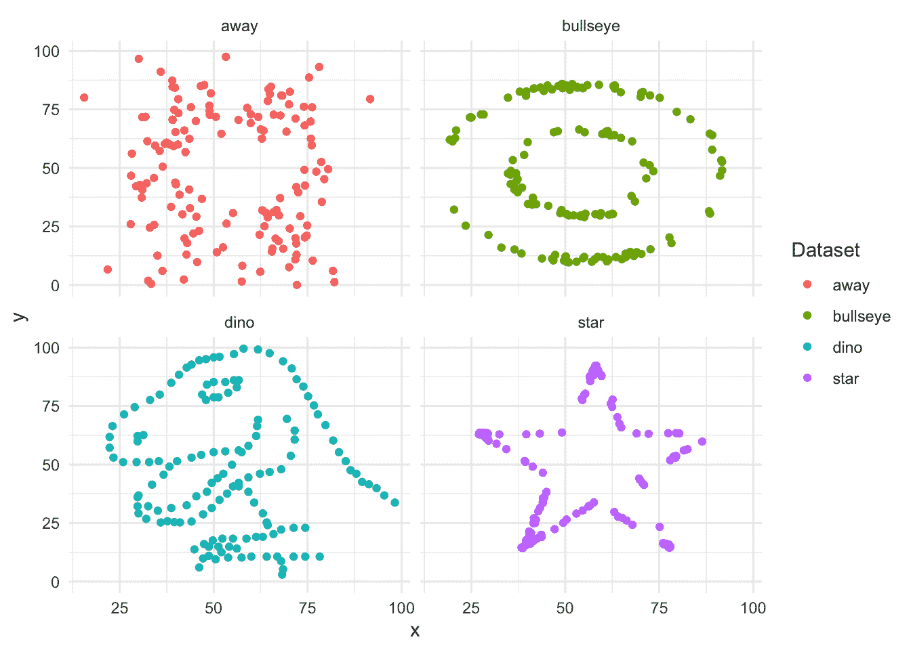

图 5.1: 四个 datasauRus 数据集的图表*  *我们从二十世纪统计学家弗兰克·安斯库姆创建的“安斯库姆四重奏”中得到了一个类似的教训——务必绘制你的数据。关键要点是，绘制实际数据非常重要，不能仅仅依赖汇总统计量。

```py
head(anscombe)
```

*```py
 x1 x2 x3 x4   y1   y2    y3   y4
1 10 10 10  8 8.04 9.14  7.46 6.58
2  8  8  8  8 6.95 8.14  6.77 5.76
3 13 13 13  8 7.58 8.74 12.74 7.71
4  9  9  9  8 8.81 8.77  7.11 8.84
5 11 11 11  8 8.33 9.26  7.81 8.47
6 14 14 14  8 9.96 8.10  8.84 7.04
```*  *安斯库姆四重奏包含四个不同数据集的十一个观测值，每个观测值都有 x 和 y 值。我们需要使用 `pivot_longer()` 函数来操作这个数据集，以使其符合 在线附录 A 中讨论的“整洁”格式。

```py
# From: https://www.njtierney.com/post/2020/06/01/tidy-anscombe/
# And the pivot_longer() vignette.

tidy_anscombe <-
 anscombe |>
 pivot_longer(
 everything(),
 names_to = c(".value", "set"),
 names_pattern = "(.)(.)"
 )
```

*我们可以先创建汇总统计量 (表 5.2)，然后绘制数据 (图 5.2)。这再次说明了绘制实际数据的重要性，而非仅仅依赖汇总统计量。

```py
tidy_anscombe |>
 summarise(
 across(c(x, y), list(mean = mean, sd = sd)),
 .by = set
 ) |>
 tt() |> 
 style_tt(j = 2:5, align = "r") |> 
 format_tt(digits = 1, num_fmt = "decimal") |> 
 setNames(c("Dataset", "x mean", "x sd", "y mean", "y sd"))
```

*表 5.2: 安斯库姆四重奏的均值和标准差

| 数据集 | x 均值 | x 标准差 | y 均值 | y 标准差 |
| --- | --- | --- | --- | --- |
| 1 | 9 | 3.3 | 7.5 | 2 |
| 2 | 9 | 3.3 | 7.5 | 2 |
| 3 | 9 | 3.3 | 7.5 | 2 |

| 4 | 9 | 3.3 | 7.5 | 2 |*  *```py
tidy_anscombe |>
 ggplot(aes(x = x, y = y, colour = set)) +
 geom_point() +
 geom_smooth(method = lm, se = FALSE) +
 theme_minimal() +
 facet_wrap(vars(set), nrow = 2, ncol = 2) +
 labs(colour = "Dataset") +
 theme(legend.position = "bottom")
```

*

图 5.2：安斯库姆四重奏的重现*  *### 5.2.1 条形图

当我们有一个想要重点关注的分类变量时，通常会使用条形图。我们在第二章中构建占用床位数量图时看到了一个例子。我们主要使用的几何对象（"geom"）是 `geom_bar()`，但有许多变体可以满足特定情况。为了说明条形图的使用，我们使用了 Fox 和 Andersen（2006）整理的 1997-2001 年英国选举面板研究数据集，并在安装和加载 `carData` 后通过 `BEPS` 包提供。

```py
beps <- 
 BEPS |> 
 as_tibble() |> 
 clean_names() |> 
 select(age, vote, gender, political_knowledge)
```

*该数据集包含受访者支持的政党，以及各种人口、经济和政治变量。特别是，我们拥有受访者的年龄。我们首先根据年龄创建年龄组，并使用 `geom_bar()` 制作一个显示各年龄组频率的条形图（图 5.3 (a)）。

```py
beps <-
 beps |>
 mutate(
 age_group =
 case_when(
 age < 35 ~ "<35",
 age < 50 ~ "35-49",
 age < 65 ~ "50-64",
 age < 80 ~ "65-79",
 age < 100 ~ "80-99"
 ),
 age_group = 
 factor(age_group, levels = c("<35", "35-49", "50-64", "65-79", "80-99"))
 )
```

*```py
beps |>
 ggplot(mapping = aes(x = age_group)) +
 geom_bar() +
 theme_minimal() +
 labs(x = "Age group", y = "Number of observations")

beps |> 
 count(age_group) |> 
 ggplot(mapping = aes(x = age_group, y = n)) +
 geom_col() +
 theme_minimal() +
 labs(x = "Age group", y = "Number of observations")
```

*

(a) 使用 `geom_bar()`


(b) 使用 `count()` 和 `geom_col()`

图 5.3：1997-2001 年英国选举面板研究中年龄组的分布

`ggplot2` 默认使用的坐标轴标签是相关变量的名称，因此添加更多细节通常很有用。我们通过 `labs()` 函数并指定变量和名称来实现这一点。在图 5.3 (a) 中，我们为 x 轴和 y 轴指定了标签。

默认情况下，`geom_bar()` 会计算每个年龄组在数据集中出现的次数。它之所以这样做，是因为 `geom_bar()` 默认的统计变换（"stat"）是"计数"，这使我们无需自己创建该统计量。但是，如果我们已经构建了一个计数（例如，使用 `beps |> count(age_group)`），那么我们可以为 y 轴指定一个变量，然后使用 `geom_col()`（图 5.3 (b)）。

我们可能还想考虑数据的不同分组以获得不同的见解。例如，我们可以使用颜色来查看受访者按年龄组支持的政党（图 5.4 (a)）。

```py
beps |>
 ggplot(mapping = aes(x = age_group, fill = vote)) +
 geom_bar() +
 labs(x = "Age group", y = "Number of observations", fill = "Vote") +
 theme(legend.position = "bottom")

beps |>
 ggplot(mapping = aes(x = age_group, fill = vote)) +
 geom_bar(position = "dodge2") +
 labs(x = "Age group", y = "Number of observations", fill = "Vote") +
 theme(legend.position = "bottom")
```

*

(a) 使用 `geom_bar()`

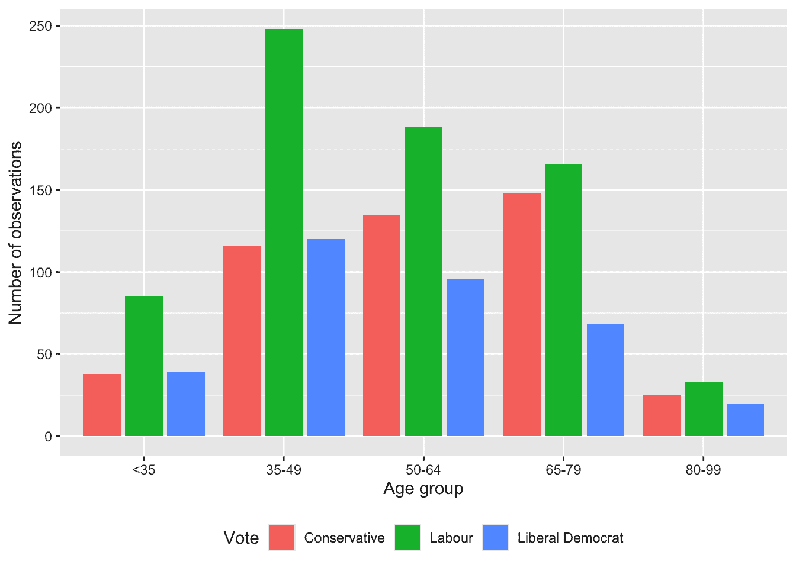

(b) 使用 `geom_bar()` 配合 dodge2 参数

图 5.4：1997-2001 年英国选举面板研究中年龄组和投票偏好的分布

默认情况下，这些不同的组是堆叠在一起的，但可以通过 `position = "dodge2"` 将它们并排放置（图 5.4 (b)）。（使用"dodge2"而不是"dodge"会在条形之间增加一点空间。）

#### 5.2.1.1 主题

此时，我们可能希望调整图表的整体外观。`ggplot2` 内置了多种主题，包括：`theme_bw()`、`theme_classic()`、`theme_dark()` 和 `theme_minimal()`。完整列表可在 `ggplot2` [速查表](https://github.com/rstudio/cheatsheets/blob/main/data-visualization.pdf) 中找到。我们可以通过将这些主题添加为图层来使用它们（图 5.5）。我们还可以从其他包中安装更多主题，包括 `ggthemes`（Arnold 2021）和 `hrbrthemes`（Rudis 2020）。我们甚至可以构建自己的主题！

```py
theme_bw <-
 beps |>
 ggplot(mapping = aes(x = age_group)) +
 geom_bar(position = "dodge") +
 theme_bw()

theme_classic <-
 beps |>
 ggplot(mapping = aes(x = age_group)) +
 geom_bar(position = "dodge") +
 theme_classic()

theme_dark <-
 beps |>
 ggplot(mapping = aes(x = age_group)) +
 geom_bar(position = "dodge") +
 theme_dark()

theme_minimal <-
 beps |>
 ggplot(mapping = aes(x = age_group)) +
 geom_bar(position = "dodge") +
 theme_minimal()

(theme_bw + theme_classic) / (theme_dark + theme_minimal)
```

*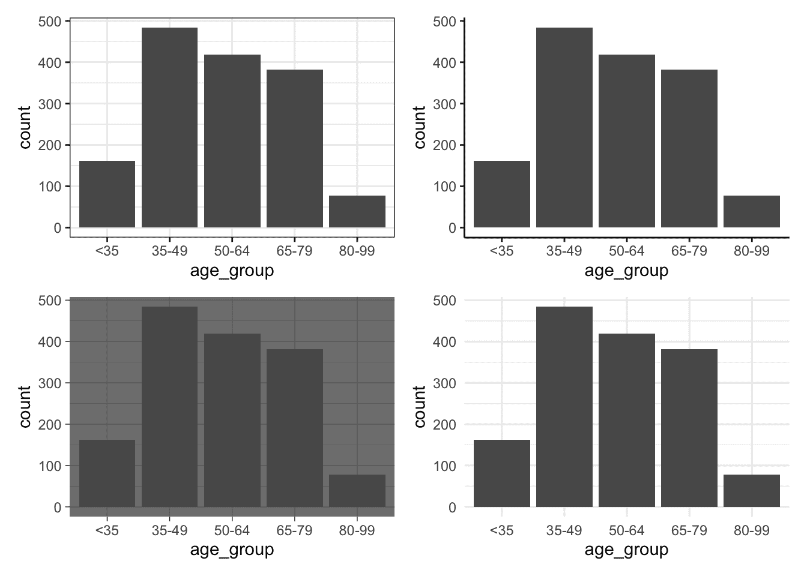

图 5.5：1997-2001 年英国选举面板研究中年龄组与投票偏好的分布，展示了不同主题及 `patchwork` 的使用*  *在 图 5.5 中，我们使用 `patchwork` 来组合多个图表。为此，在安装并加载该包后，我们将图表赋值给一个变量。然后使用“+”表示哪些图表应并排显示，“/”表示哪些图表应上下排列，并使用括号来指示优先级*  *#### 5.2.1.2 分面

我们使用分面来展示基于一个或多个变量的变化（Wilkinson 2005, 219）。当我们已经使用颜色来突出其他变量的变化时，分面尤其有用。例如，我们可能希望通过年龄和性别来解释投票情况（图 5.6）。我们使用 `guides(x = guide_axis(angle = 90))` 旋转 x 轴以避免重叠。同时，使用 `theme(legend.position = "bottom")` 更改图例的位置。

```py
beps |>
 ggplot(mapping = aes(x = age_group, fill = gender)) +
 geom_bar() +
 theme_minimal() +
 labs(
 x = "Age-group of respondent",
 y = "Number of respondents",
 fill = "Gender"
 ) +
 facet_wrap(vars(vote)) +
 guides(x = guide_axis(angle = 90)) +
 theme(legend.position = "bottom")
```

*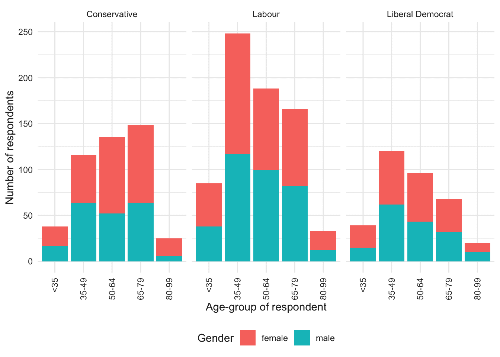

图 5.6：1997-2001 年英国选举面板研究中按性别划分的年龄组与投票偏好的分布*  *我们可以将 `facet_wrap()` 改为垂直方向包裹，而不是水平方向，使用 `dir = "v"`。或者，我们可以指定行数，例如 `nrow = 2`，或列数，例如 `ncol = 2`。

默认情况下，所有分面共享相同的 x 轴和 y 轴。我们可以通过 `scales = "free"` 允许每个分面使用不同的比例尺，或仅对 x 轴使用 `scales = "free_x"`，或仅对 y 轴使用 `scales = "free_y"`（图 5.7）。

```py
beps |>
 ggplot(mapping = aes(x = age_group, fill = gender)) +
 geom_bar() +
 theme_minimal() +
 labs(
 x = "Age-group of respondent",
 y = "Number of respondents",
 fill = "Gender"
 ) +
 facet_wrap(vars(vote), scales = "free") +
 guides(x = guide_axis(angle = 90)) +
 theme(legend.position = "bottom")
```

*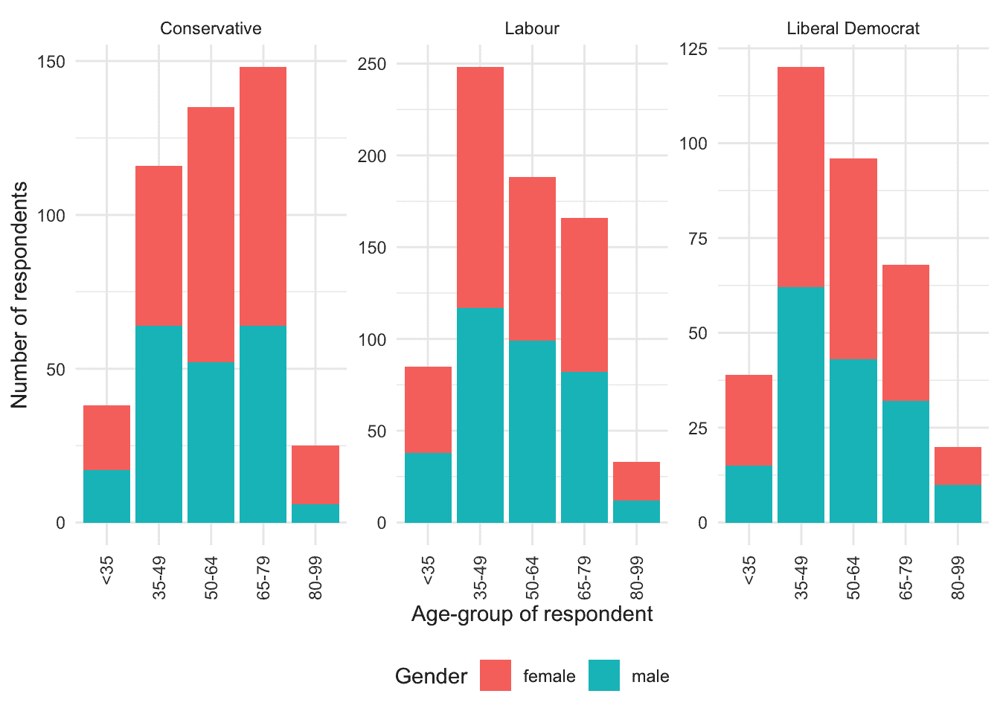

图 5.7：1997-2001 年英国选举面板研究中按性别划分的年龄组与投票偏好的分布*  *最后，我们可以使用 `labeller()` 更改分面的标签（图 5.8）。

```py
new_labels <- 
 c("0" = "No knowledge", "1" = "Low knowledge",
 "2" = "Moderate knowledge", "3" = "High knowledge")

beps |>
 ggplot(mapping = aes(x = age_group, fill = vote)) +
 geom_bar() +
 theme_minimal() +
 labs(
 x = "Age-group of respondent",
 y = "Number of respondents",
 fill = "Voted for"
 ) +
 facet_wrap(
 vars(political_knowledge),
 scales = "free",
 labeller = labeller(political_knowledge = new_labels)
 ) +
 guides(x = guide_axis(angle = 90)) +
 theme(legend.position = "bottom")
```

*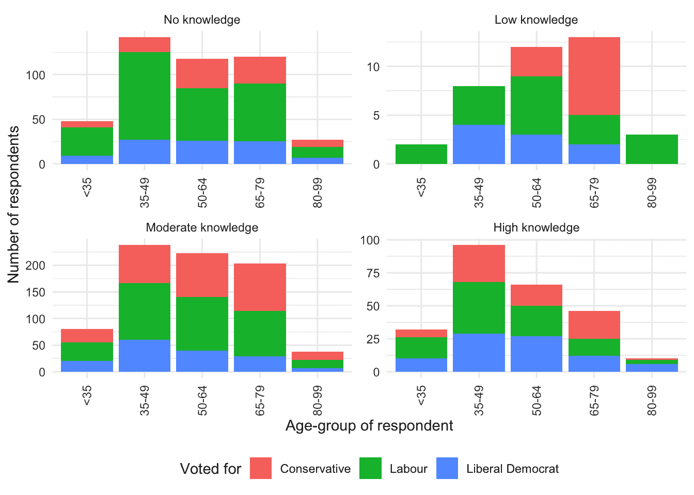

图 5.8：1997-2001 年英国选举面板研究中按政治知识水平划分的年龄组与投票偏好的分布*  *我们现在有三种组合多个图表的方法：子图、分面和 `patchwork`。它们在不同情况下各有用途：

+   子图——我们在第三章中已介绍过——适用于我们考虑不同变量的情况；

+   分面适用于我们考虑分类变量的情况；以及

+   `patchwork` 适用于我们希望将完全不同的图表组合在一起的情况。***  ***#### 5.2.1.3 颜色

现在我们来讨论图表中使用的颜色。有多种不同的方式来改变颜色。可以使用 `scale_fill_brewer()` 来指定来自 `RColorBrewer` (Neuwirth 2022) 的众多调色板。对于 `viridis` (Garnier et al. 2021)，我们可以使用 `scale_fill_viridis_d()` 来指定调色板。此外，`viridis` 特别专注于色盲友好型调色板 (图 5.9)。`RColorBrewer` 和 `viridis` 都不需要显式安装或加载，因为作为 `tidyverse` 一部分的 `ggplot2` 会为我们处理这些。

*巨人的肩膀* *"brewer" 调色板的名称指的是辛迪·布鲁尔 (Miller 2014)。她于 1991 年在密歇根州立大学获得地理学博士学位后，加入圣地亚哥州立大学担任助理教授，并于 1994 年转到宾夕法尼亚州立大学，2007 年晋升为正教授。她最著名的著作之一是《设计更好的地图：GIS 用户指南》(Brewer 2015)。2019 年，她成为自 1968 年设立以来仅有的第九位获得 O. M. Miller 制图奖章的人。*  *```py
# Panel (a)
beps |>
 ggplot(mapping = aes(x = age_group, fill = vote)) +
 geom_bar() +
 theme_minimal() +
 labs(x = "Age-group", y = "Number", fill = "Voted for") +
 theme(legend.position = "bottom") +
 scale_fill_brewer(palette = "Blues")

# Panel (b)
beps |>
 ggplot(mapping = aes(x = age_group, fill = vote)) +
 geom_bar() +
 theme_minimal() +
 labs(x = "Age-group", y = "Number", fill = "Voted for") +
 theme(legend.position = "bottom") +
 scale_fill_brewer(palette = "Set1")

# Panel (c)
beps |>
 ggplot(mapping = aes(x = age_group, fill = vote)) +
 geom_bar() +
 theme_minimal() +
 labs(x = "Age-group", y = "Number", fill = "Voted for") +
 theme(legend.position = "bottom") +
 scale_fill_viridis_d()

# Panel (d)
beps |>
 ggplot(mapping = aes(x = age_group, fill = vote)) +
 geom_bar() +
 theme_minimal() +
 labs(x = "Age-group", y = "Number", fill = "Voted for") +
 theme(legend.position = "bottom") +
 scale_fill_viridis_d(option = "magma")
```

*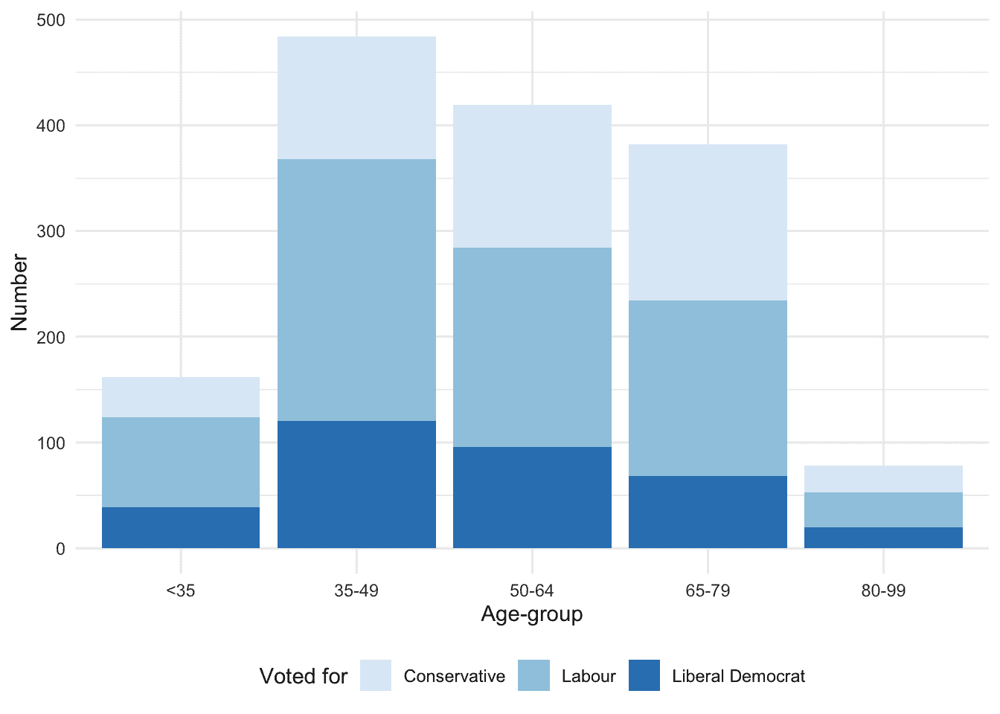

(a) Brewer 调色板 'Blues'

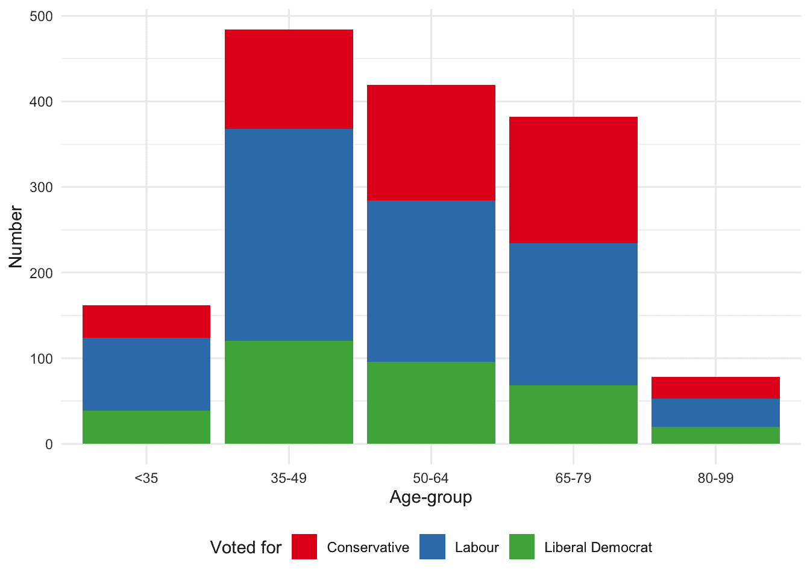

(b) Brewer 调色板 'Set1'

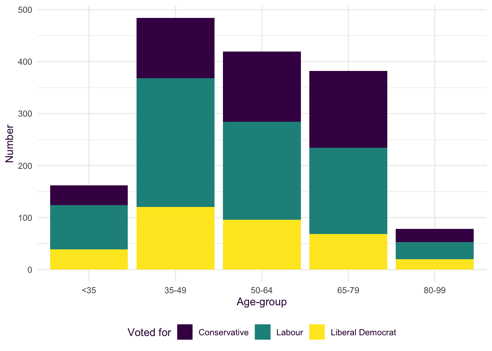

(c) Viridis 默认调色板

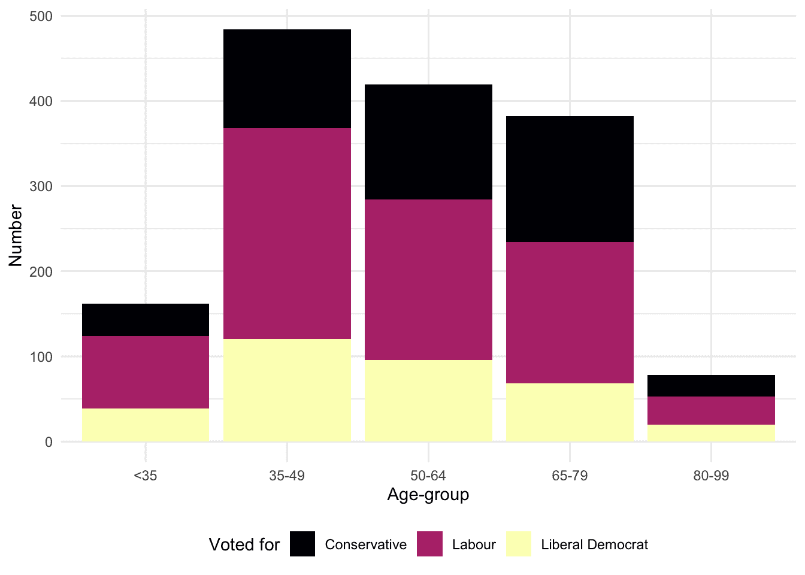

(d) Viridis 调色板 'magma'

图 5.9：1997-2001 年英国选举面板研究中年龄组与投票偏好的分布，展示了不同的颜色

除了使用预制的调色板，我们也可以构建自己的调色板。话虽如此，颜色是需要谨慎考虑的因素。它应该用于增加所传达的信息量 ([Cleveland [1985] 1994](99-references.html#ref-elementsofgraphingdata))。不应在图表中不必要地添加颜色——也就是说，颜色应发挥某种作用。通常，其作用是区分不同的组别，这意味着要使颜色彼此不同。如果颜色与变量之间存在某种关联，使用颜色也可能是合适的。例如，如果制作芒果和覆盆子价格的图表，那么分别使用黄色和红色来对应颜色，可能有助于读者解读信息 (Franconeri et al. 2021, 121)。**********  ****### 5.2.2 散点图

我们常常关注两个数值或连续变量之间的关系。散点图可用于展示这种关系。虽然散点图并非总是最佳选择，但它很少是一个糟糕的选择（Weissgerber 等人，2015）。有人认为它是最通用且最有用的图表选项（Friendly 和 Wainer，2021，第 121 页）。为了演示散点图，我们安装并加载 `WDI` 包，然后使用它从世界银行下载一些经济指标。具体来说，我们使用 `WDIsearch()` 来查找需要传递给 `WDI()` 的唯一键，以便进行下载。

*哦，你以为我们在这方面有很好的数据！* *根据经合组织（2014，第 15 页）的定义，国内生产总值（GDP）“是一个单一数字，无重复计算，汇总了特定时期内一个国家内所有企业、非营利机构、政府机构和家庭的所有产出（或生产），无论所生产的商品和服务类型如何，只要生产发生在该国的经济领土内。” 这一现代概念由二十世纪经济学家西蒙·库兹涅茨发展而来，并被广泛使用和报告。用一个明确而具体的单一数字来描述像一国经济活动这样复杂的事物，确实令人感到安心。拥有这样的汇总统计数据是有用且信息丰富的。但如同任何汇总统计一样，其优势也是其弱点。单一数字必然会丢失关于构成部分的信息，而分解后的差异可能非常重要（Moyer 和 Dunn，2020）。它突出了短期经济进展，而非长期改善。并且“估计值的定量确定性使人容易忘记它们对不完善数据的依赖，以及由此导致的总量和组成部分都可能存在的巨大误差范围”（Kuznets, Epstein, and Jenks，1941，第 xxvi 页）。经济表现的汇总衡量标准只显示了一个国家经济的一个侧面。尽管 GDP 有许多优点，但它也存在众所周知的薄弱领域。*  *```py
WDIsearch("gdp growth")
WDIsearch("inflation")
WDIsearch("population, total")
WDIsearch("Unemployment, total")
```

*```py
world_bank_data <-
 WDI(
 indicator =
 c("FP.CPI.TOTL.ZG", "NY.GDP.MKTP.KD.ZG", "SP.POP.TOTL","SL.UEM.TOTL.NE.ZS"),
 country = c("AU", "ET", "IN", "US")
 )
```

*我们可能希望将变量名更改为更有意义的名称，并且只保留我们需要的那些。

```py
world_bank_data <-
 world_bank_data |>
 rename(
 inflation = FP.CPI.TOTL.ZG,
 gdp_growth = NY.GDP.MKTP.KD.ZG,
 population = SP.POP.TOTL,
 unem_rate = SL.UEM.TOTL.NE.ZS
 ) |>
 select(country, year, inflation, gdp_growth, population, unem_rate)

head(world_bank_data)
```

*```py
# A tibble: 6 × 6
  country    year inflation gdp_growth population unem_rate
  <chr>     <dbl>     <dbl>      <dbl>      <dbl>     <dbl>
1 Australia  1960     3.73       NA      10276477        NA
2 Australia  1961     2.29        2.48   10483000        NA
3 Australia  1962    -0.319       1.29   10742000        NA
4 Australia  1963     0.641       6.22   10950000        NA
5 Australia  1964     2.87        6.98   11167000        NA
6 Australia  1965     3.41        5.98   11388000        NA
```*  *我们可以使用 `geom_point()` 来开始制作一个按国家显示 GDP 增长与通货膨胀关系的散点图（图 5.10 (a)）。

```py
# Panel (a)
world_bank_data |>
 ggplot(mapping = aes(x = gdp_growth, y = inflation, color = country)) +
 geom_point()

# Panel (b)
world_bank_data |>
 ggplot(mapping = aes(x = gdp_growth, y = inflation, color = country)) +
 geom_point() +
 theme_minimal() +
 labs(x = "GDP growth", y = "Inflation", color = "Country")
```

*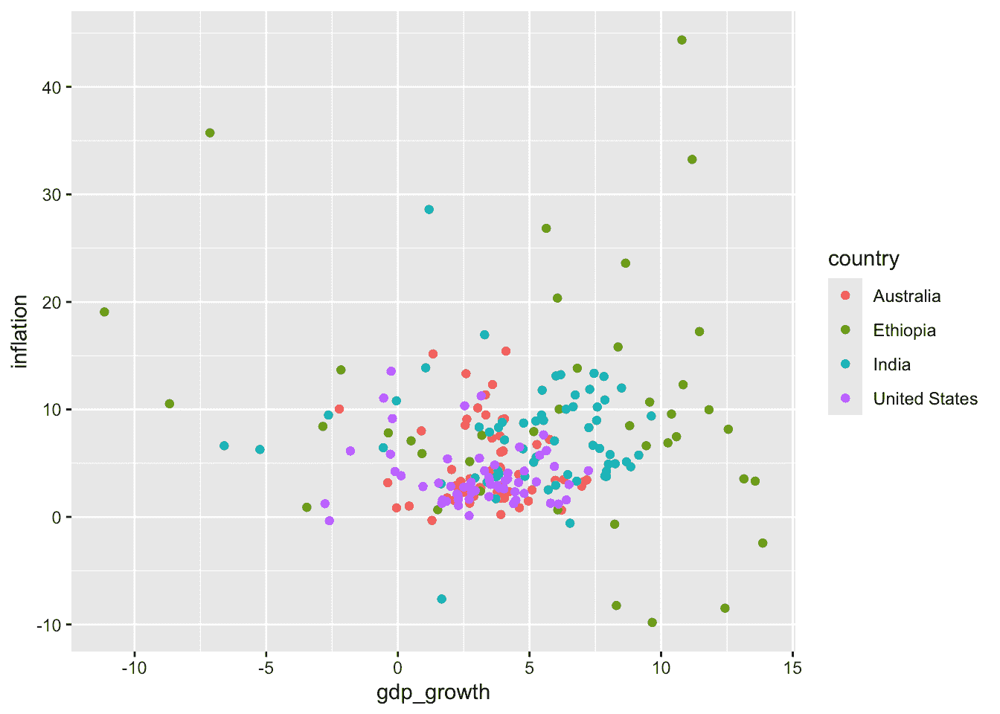

(a) 默认设置

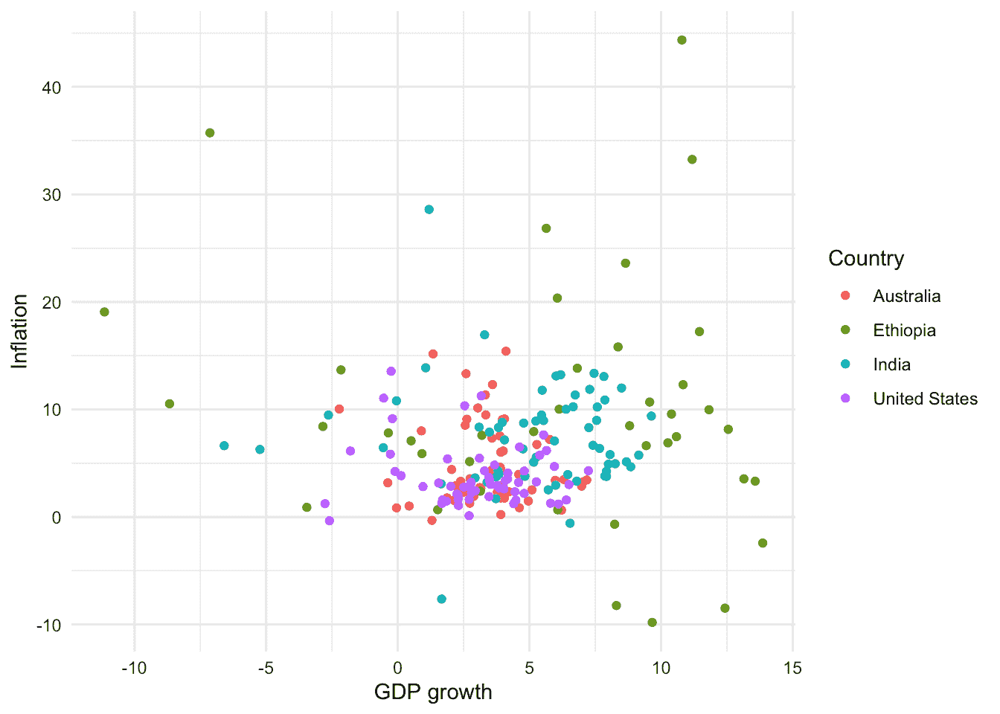

(b) 添加了主题和标签

图 5.10：澳大利亚、埃塞俄比亚、印度和美国的通货膨胀与 GDP 增长之间的关系

与条形图一样，我们可以更改主题并更新标签（图 5.10 (b)）。

对于散点图，我们使用`color`而不是像条形图那样使用`fill`，因为它们使用的是点而不是条形。这也会稍微影响我们更改调色板的方式（图 5.11）。也就是说，对于特定类型的点，例如 `shape = 21`，可以同时具有 `fill` 和 `color` 美学属性。

```py
# Panel (a)
world_bank_data |>
 ggplot(aes(x = gdp_growth, y = inflation, color = country)) +
 geom_point() +
 theme_minimal() +
 labs(x = "GDP growth", y = "Inflation", color = "Country") +
 theme(legend.position = "bottom") +
 scale_color_brewer(palette = "Blues")

# Panel (b)
world_bank_data |>
 ggplot(aes(x = gdp_growth, y = inflation, color = country)) +
 geom_point() +
 theme_minimal() +
 labs(x = "GDP growth",  y = "Inflation", color = "Country") +
 theme(legend.position = "bottom") +
 scale_color_brewer(palette = "Set1")

# Panel (c)
world_bank_data |>
 ggplot(aes(x = gdp_growth, y = inflation, color = country)) +
 geom_point() +
 theme_minimal() +
 labs(x = "GDP growth",  y = "Inflation", color = "Country") +
 theme(legend.position = "bottom") +
 scale_colour_viridis_d()

# Panel (d)
world_bank_data |>
 ggplot(aes(x = gdp_growth, y = inflation, color = country)) +
 geom_point() +
 theme_minimal() +
 labs(x = "GDP growth",  y = "Inflation", color = "Country") +
 theme(legend.position = "bottom") +
 scale_colour_viridis_d(option = "magma")
```

*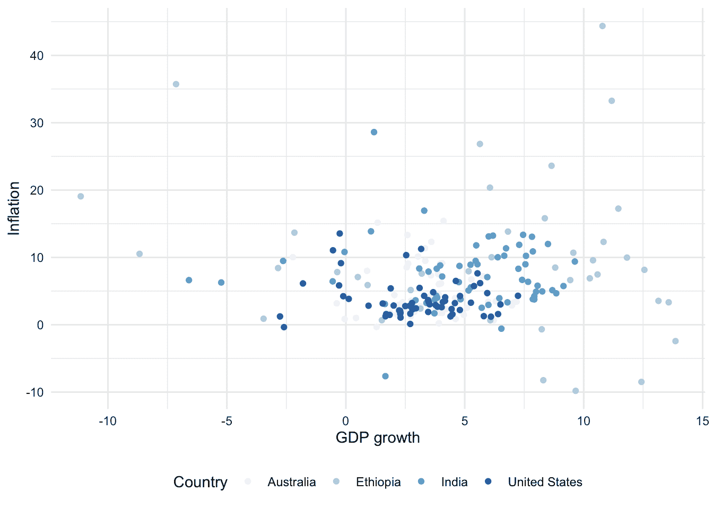

(a) Brewer 调色板 'Blues'

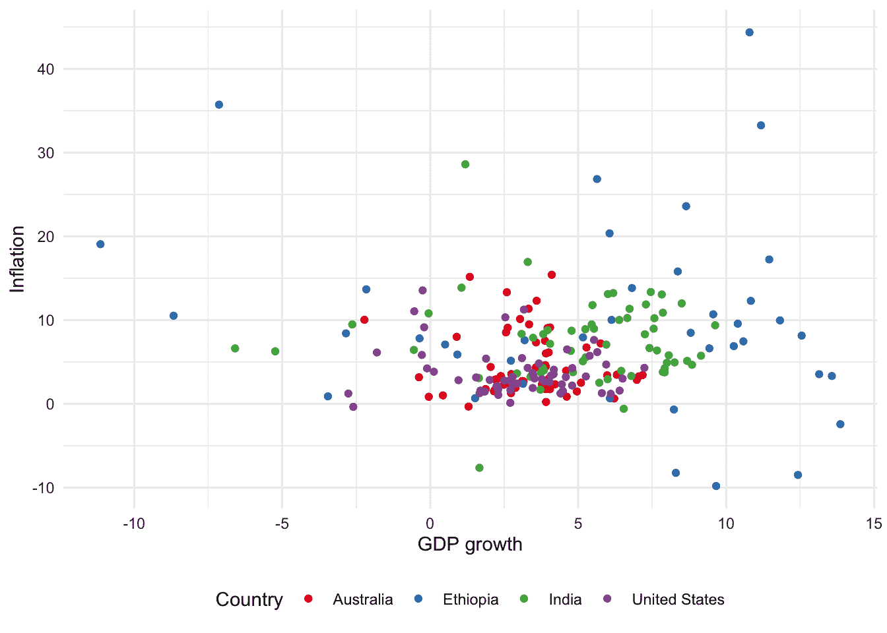

(b) Brewer 调色板 'Set1'

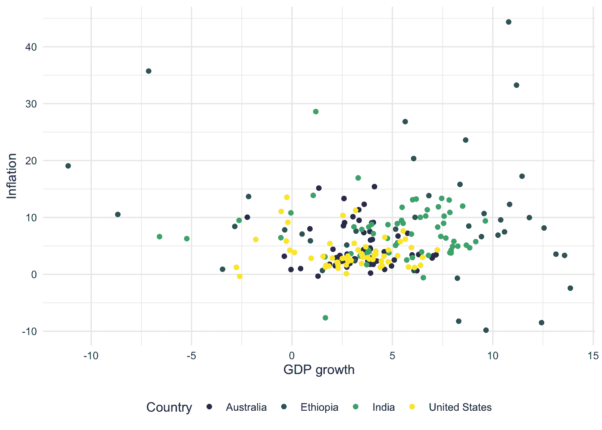

(c) Viridis 调色板默认值

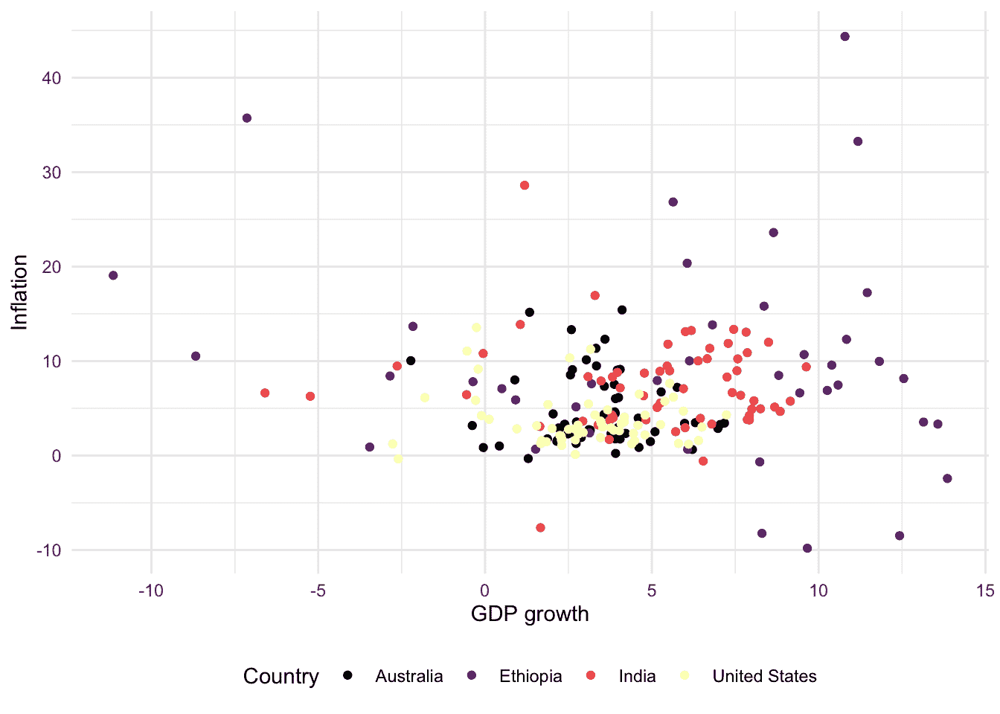

(d) Viridis 调色板 'magma'

图 5.11：澳大利亚、埃塞俄比亚、印度和美国的通货膨胀与 GDP 增长之间的关系

散点图的点有时会重叠。我们可以通过多种方式处理这种情况（图 5.12）：

1.  通过“alpha”为我们的点添加透明度（图 5.12 (a)）。“alpha”的值可以在 0（完全透明）到 1（完全不透明）之间变化。

1.  使用 `geom_jitter()` 添加少量噪声，轻微移动点的位置（图 5.12 (b)）。默认情况下，移动在两个方向上是均匀的，但我们可以通过“width”或“height”指定移动发生的方向。在这两个选项之间做出决定取决于对精度的要求程度以及点的数量：当你想突出点的相对密度而非单个点的精确值时，使用 `geom_jitter()` 通常很有用。使用 `geom_jitter()` 时，最好如第二章介绍的那样设置种子，以确保可重复性。

```py
set.seed(853)

# Panel (a)
world_bank_data |>
 ggplot(aes(x = gdp_growth, y = inflation, color = country )) +
 geom_point(alpha = 0.5) +
 theme_minimal() +
 labs(x = "GDP growth", y = "Inflation", color = "Country")

# Panel (b)
world_bank_data |>
 ggplot(aes(x = gdp_growth, y = inflation, color = country)) +
 geom_jitter(width = 1, height = 1) +
 theme_minimal() +
 labs(x = "GDP growth", y = "Inflation", color = "Country")
```

*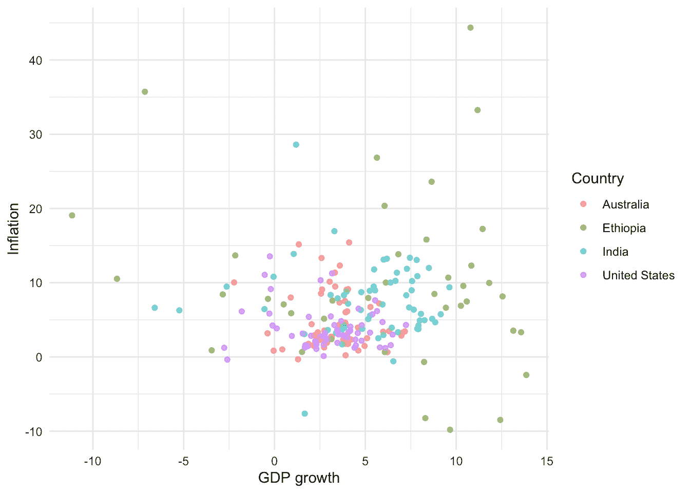

(a) 更改 alpha 设置


(b) 使用抖动

图 5.12：澳大利亚、埃塞俄比亚、印度和美国的通货膨胀与 GDP 增长之间的关系

我们经常使用散点图来说明两个连续变量之间的关系。使用 `geom_smooth()` 添加一条“汇总”线会很有用（图 5.13）。我们可以使用“method”指定关系类型，用“color”更改颜色，并用“se”添加或移除标准误。一个常用的“method”是 `lm`，它计算并绘制一条简单的线性回归线，类似于使用 `lm()` 函数。使用 `geom_smooth()` 会向图形添加一个图层，因此它会继承 `ggplot()` 的美学属性。例如，这就是为什么在图 5.13 (a) 和图 5.13 (b) 中每个国家都有一条线。我们可以通过指定特定颜色来覆盖这一点（图 5.13 (c)）。在某些情况下，可能更倾向于使用其他类型的拟合线，例如样条线。

```py
# Panel (a)
world_bank_data |>
 ggplot(aes(x = gdp_growth, y = inflation, color = country)) +
 geom_jitter() +
 geom_smooth() +
 theme_minimal() +
 labs(x = "GDP growth", y = "Inflation", color = "Country")

# Panel (b)
world_bank_data |>
 ggplot(aes(x = gdp_growth, y = inflation, color = country)) +
 geom_jitter() +
 geom_smooth(method = lm, se = FALSE) +
 theme_minimal() +
 labs(x = "GDP growth", y = "Inflation", color = "Country")

# Panel (c)
world_bank_data |>
 ggplot(aes(x = gdp_growth, y = inflation, color = country)) +
 geom_jitter() +
 geom_smooth(method = lm, color = "black", se = FALSE) +
 theme_minimal() +
 labs(x = "GDP growth", y = "Inflation", color = "Country")
```

*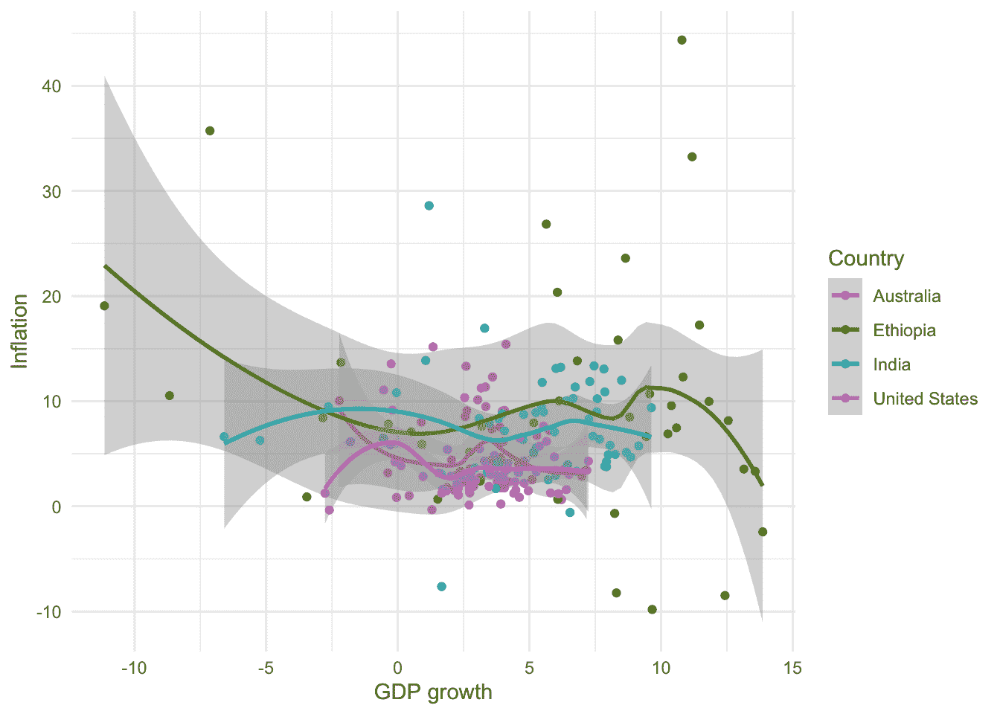

(a) 默认的最佳拟合线

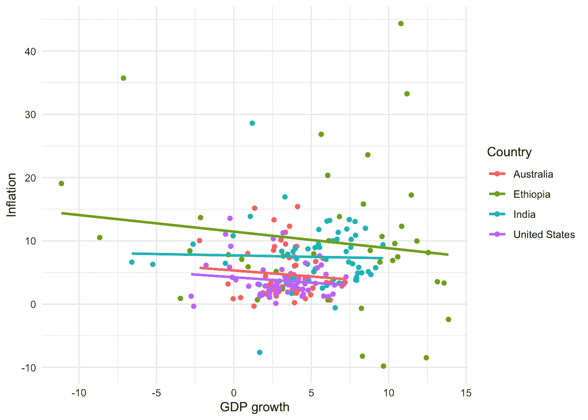

(b) 指定线性关系

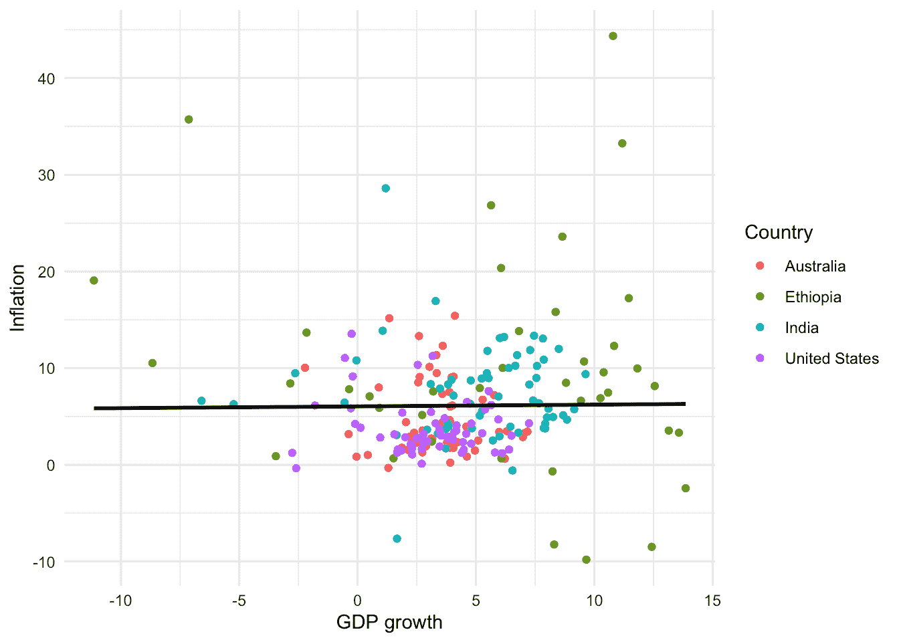

(c) 仅指定一种颜色

图 5.13：澳大利亚、埃塞俄比亚、印度和美国的通货膨胀与 GDP 增长之间的关系********  ****### 5.2.3 折线图

当我们拥有需要连接在一起的变量时，例如经济时间序列，我们可以使用折线图。我们将继续使用世界银行的数据集，并使用 `geom_line()` 来关注美国的 GDP 增长（图 5.14 (a)）。可以使用 `labs()` 中的“caption”将数据来源添加到图表中。

```py
# Panel (a)
world_bank_data |>
 filter(country == "United States") |>
 ggplot(mapping = aes(x = year, y = gdp_growth)) +
 geom_line() +
 theme_minimal() +
 labs(x = "Year", y = "GDP growth", caption = "Data source: World Bank.")

# Panel (b)
world_bank_data |>
 filter(country == "United States") |>
 ggplot(mapping = aes(x = year, y = gdp_growth)) +
 geom_step() +
 theme_minimal() +
 labs(x = "Year",y = "GDP growth", caption = "Data source: World Bank.")
```

*

(a) 使用折线图

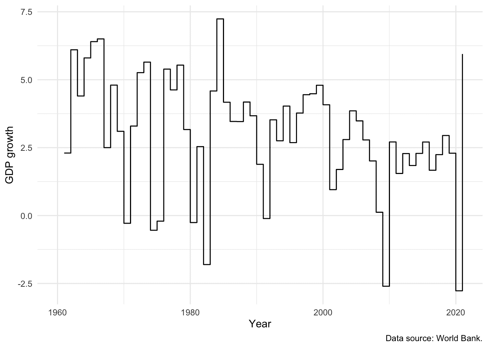

(b) 使用阶梯状折线图

图 5.14：美国 GDP 增长（1961-2020）

我们可以使用 `geom_step()`，这是 `geom_line()` 的一个轻微变体，来突出显示逐年变化（图 5.14 (b)）。

菲利普斯曲线是指随时间描绘失业率与通货膨胀之间关系的图表。数据中有时会发现一种反向关系，例如英国在 1861 年至 1957 年间（Phillips 1958）。我们有多种方法来研究我们数据中的这种关系，包括：

1.  在我们的图表中添加第二条线。例如，我们可以添加通货膨胀数据（图 5.15 (a)）。这要求我们使用 `pivot_longer()`（在在线附录 A 中讨论），以确保数据处于整洁格式。

1.  使用 `geom_path()` 按照数据集中出现的顺序连接数值。在图 5.15 (b) 中，我们展示了美国 1960 年至 2020 年间的菲利普斯曲线。图 5.15 (b) 似乎并未显示出失业率与通货膨胀之间存在任何明确的关系。

```py
world_bank_data |>
 filter(country == "United States") |>
 select(-population, -gdp_growth) |>
 pivot_longer(
 cols = c("inflation", "unem_rate"),
 names_to = "series",
 values_to = "value"
 ) |>
 ggplot(mapping = aes(x = year, y = value, color = series)) +
 geom_line() +
 theme_minimal() +
 labs(
 x = "Year", y = "Value", color = "Economic indicator",
 caption = "Data source: World Bank."
 ) +
 scale_color_brewer(palette = "Set1", labels = c("Inflation", "Unemployment")) +
 theme(legend.position = "bottom")

world_bank_data |>
 filter(country == "United States") |>
 ggplot(mapping = aes(x = unem_rate, y = inflation)) +
 geom_path() +
 theme_minimal() +
 labs(
 x = "Unemployment rate", y = "Inflation",
 caption = "Data source: World Bank."
 )
```

*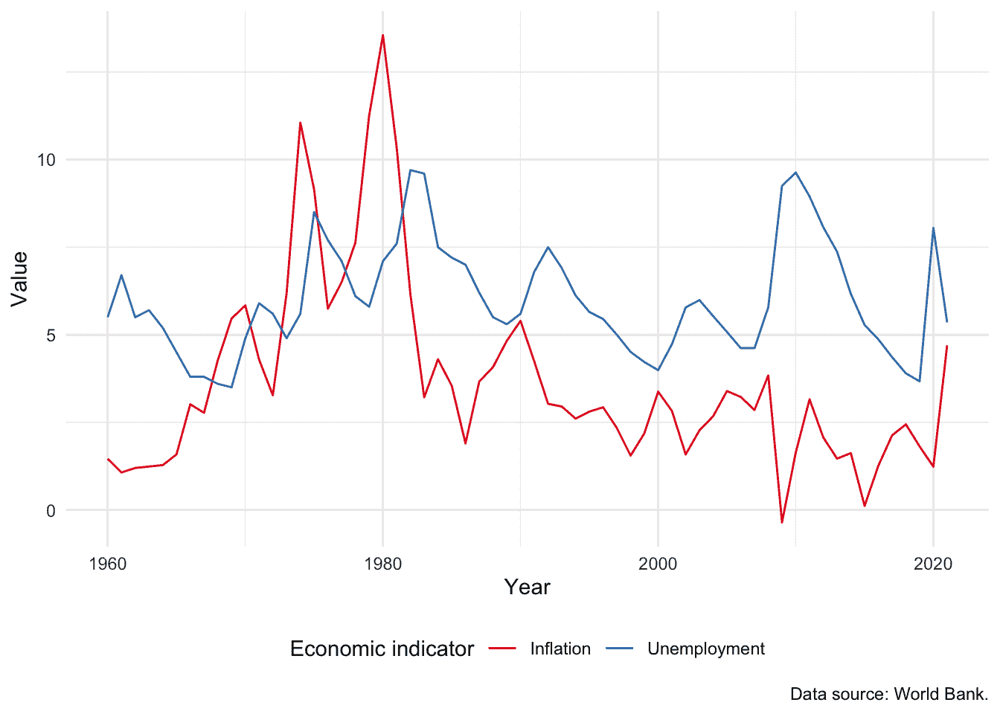

(a) 随时间比较两个时间序列

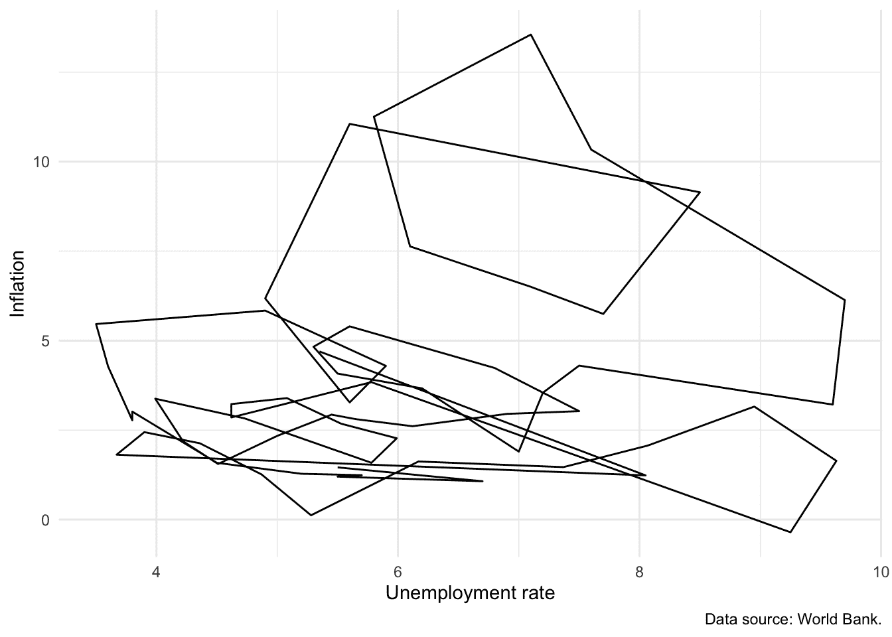

(b) 将两个时间序列相互对照绘制

图 5.15：美国失业率与通货膨胀（1960-2020）**  **### 5.2.4 直方图

直方图有助于显示连续变量分布的形状。数据值的整个范围被分割成称为“箱”的区间，直方图计算有多少观测值落入哪个箱。在图 5.16 中，我们检查了埃塞俄比亚的 GDP 分布。

```py
world_bank_data |>
 filter(country == "Ethiopia") |>
 ggplot(aes(x = gdp_growth)) +
 geom_histogram() +
 theme_minimal() +
 labs(
 x = "GDP growth",
 y = "Number of occurrences",
 caption = "Data source: World Bank."
 )
```

*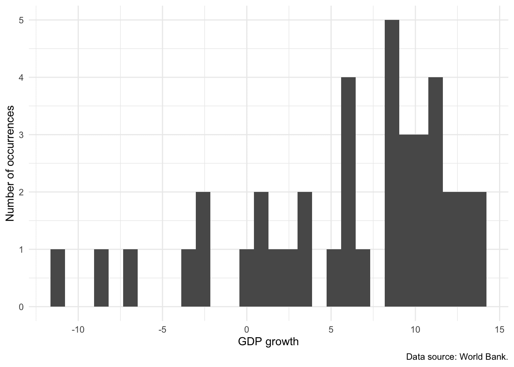

图 5.16：埃塞俄比亚 GDP 增长分布（1960-2020）*  *决定直方图形状的关键组成部分是箱的数量。这可以通过以下两种方式之一来指定（图 5.17）：

1.  指定要包含的“箱”的数量；或者

1.  指定它们的“箱宽”。

```py
# Panel (a)
world_bank_data |>
 filter(country == "Ethiopia") |>
 ggplot(aes(x = gdp_growth)) +
 geom_histogram(bins = 5) +
 theme_minimal() +
 labs(
 x = "GDP growth",
 y = "Number of occurrences"
 )

# Panel (b)
world_bank_data |>
 filter(country == "Ethiopia") |>
 ggplot(aes(x = gdp_growth)) +
 geom_histogram(bins = 20) +
 theme_minimal() +
 labs(
 x = "GDP growth",
 y = "Number of occurrences"
 )

# Panel (c)
world_bank_data |>
 filter(country == "Ethiopia") |>
 ggplot(aes(x = gdp_growth)) +
 geom_histogram(binwidth = 2) +
 theme_minimal() +
 labs(
 x = "GDP growth",
 y = "Number of occurrences"
 )

# Panel (d)
world_bank_data |>
 filter(country == "Ethiopia") |>
 ggplot(aes(x = gdp_growth)) +
 geom_histogram(binwidth = 5) +
 theme_minimal() +
 labs(
 x = "GDP growth",
 y = "Number of occurrences"
 )
```

*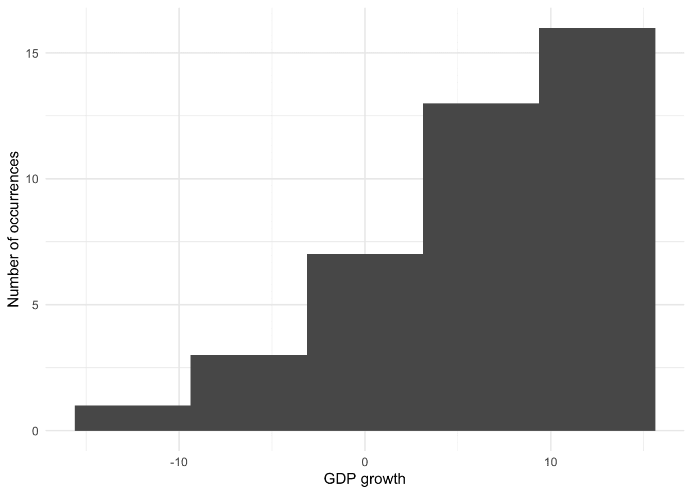

(a) 五个分组


(b) 20 个分组

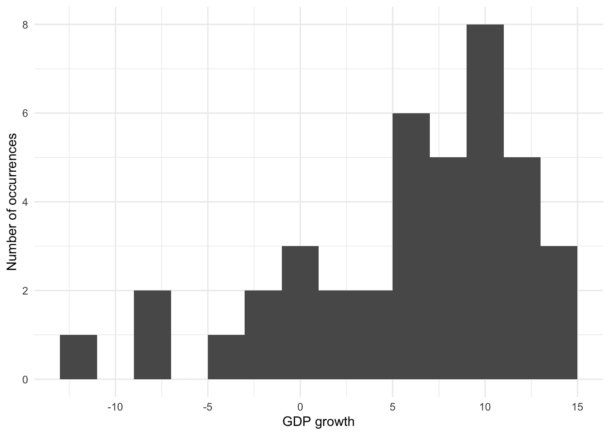

(c) 组距为二

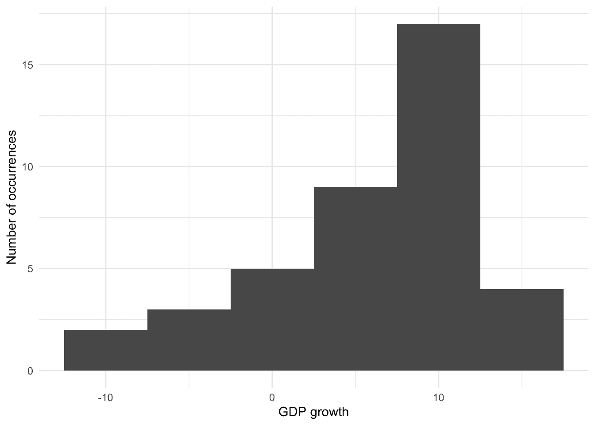

(d) 组距为五

图 5.17：埃塞俄比亚 GDP 增长分布（1960-2020 年）

直方图可被视为对数据进行局部平均，分组数量会影响这种平均的程度。当只有两个分组时，平滑程度相当高，但我们会损失大量准确性。分组过少会导致偏差增大，而分组过多则会导致方差增大（Wasserman 2005, 303）。我们关于分组数量或其宽度的决策，旨在尝试平衡偏差和方差。这将取决于包括主题和目标在内的多种考量（[Cleveland [1985] 1994, 135](99-references.html#ref-elementsofgraphingdata)）。这也是 Denby 和 Mallows（2009）认为直方图作为探索性工具特别有价值的原因之一。

最后，虽然我们可以使用“填充”来区分不同类型的观测值，但这可能会变得相当混乱。通常更好的做法是：

1.  使用 `geom_freqpoly()` 描绘分布的轮廓（图 5.18 (a)）

1.  使用 `geom_dotplot()` 构建点堆叠图（图 5.18 (b)）；或者

1.  添加透明度，尤其是在差异更为明显时（图 5.18 (c)）。

```py
# Panel (a)
world_bank_data |>
 ggplot(aes(x = gdp_growth, color = country)) +
 geom_freqpoly() +
 theme_minimal() +
 labs(
 x = "GDP growth", y = "Number of occurrences",
 color = "Country",
 caption = "Data source: World Bank."
 ) +
 scale_color_brewer(palette = "Set1")

# Panel (b)
world_bank_data |>
 ggplot(aes(x = gdp_growth, group = country, fill = country)) +
 geom_dotplot(method = "histodot") +
 theme_minimal() +
 labs(
 x = "GDP growth", y = "Number of occurrences",
 fill = "Country",
 caption = "Data source: World Bank."
 ) +
 scale_color_brewer(palette = "Set1")

# Panel (c)
world_bank_data |>
 filter(country %in% c("India", "United States")) |>
 ggplot(mapping = aes(x = gdp_growth, fill = country)) +
 geom_histogram(alpha = 0.5, position = "identity") +
 theme_minimal() +
 labs(
 x = "GDP growth", y = "Number of occurrences",
 fill = "Country",
 caption = "Data source: World Bank."
 ) +
 scale_color_brewer(palette = "Set1")
```

*

(a) 描绘分布轮廓

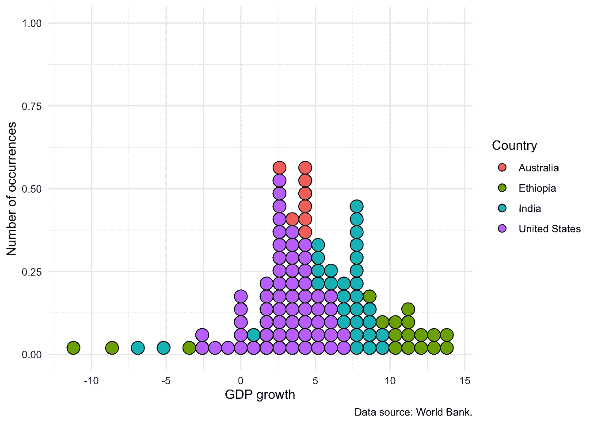

(b) 使用点状图

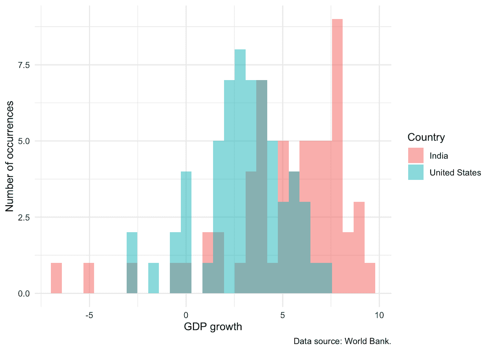

(c) 添加透明度

图 5.18：各国 GDP 增长分布（1960-2020 年）

直方图一个有趣的替代方案是经验累积分布函数（ECDF）。在它与直方图之间的选择往往取决于受众。对于不太精通的受众可能不合适，但如果受众在数量分析上比较自如，那么 ECDF 可能是一个绝佳选择，因为它比直方图进行的平滑处理更少。我们可以使用 `stat_ecdf()` 构建 ECDF。例如，图 5.19 展示了一个与 图 5.16 等价的 ECDF。

```py
world_bank_data |>
 ggplot(mapping = aes(x = gdp_growth, color = country)) +
 stat_ecdf(geom = "point") +
 theme_minimal() +
 labs(
 x = "GDP growth", y = "Proportion", color = "Country",
 caption = "Data source: World Bank."
 ) + 
 theme(legend.position = "bottom")
```

*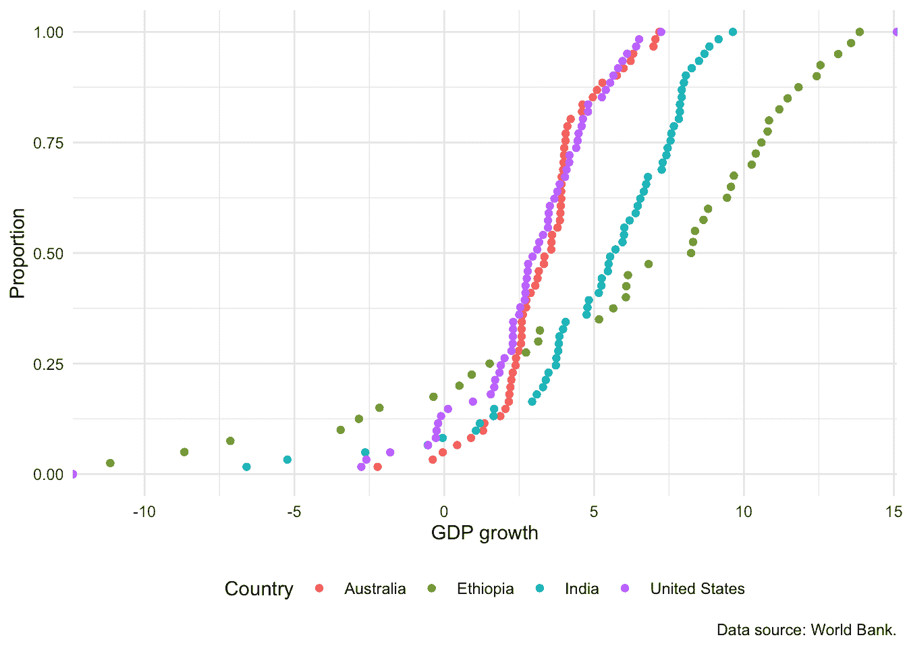

图 5.19：四国 GDP 增长分布（1960-2020 年）****  ***### 5.2.5 箱线图

箱线图通常展示五个方面：1) 中位数，2) 第 25 百分位数，以及 3) 第 75 百分位数。第四和第五个元素根据具体情况而有所不同。一种选择是最小值和最大值。另一种选择是确定第 75 和第 25 百分位数之间的差值，即四分位距（IQR）。然后，第四和第五个元素是距离第 25 和第 75 百分位数 $1.5\times\mbox{IQR}$ 范围内的极端观测值。后一种方法是 `ggplot2` 中 `geom_boxplot` 的默认设置。Spear（1952, 166）引入了一种图表的理念，该图表侧重于范围和各种汇总统计量，包括中位数和范围，而 Tukey（1977）则侧重于哪些汇总统计量并推广了它（Wickham and Stryjewski 2011）。

使用图表的一个原因是它们能帮助我们理解和接纳数据的复杂性，而不是试图隐藏或平滑掉这种复杂性（Armstrong 2022）。箱线图的一个合适用例是同时比较多变量的汇总统计量，例如 Bethlehem 等人（2022）的研究。但仅使用箱线图很少是最佳选择，因为它们隐藏了数据的分布，而不是展示它。同一个箱线图可以适用于非常不同的数据分布。为了说明这一点，请考虑从两种类型的贝塔分布中模拟的一些数据。第一种包含来自两个贝塔分布的抽取：一个是右偏的，另一个是左偏的。第二种包含来自无偏贝塔分布的抽取，注意 $\mbox{Beta}(1, 1)$ 等价于 $\mbox{Uniform}(0, 1)$。

```py
set.seed(853)

number_of_draws <- 10000

both_left_and_right_skew <-
 c(
 rbeta(number_of_draws / 2, 5, 2),
 rbeta(number_of_draws / 2, 2, 5)
 )

no_skew <-
 rbeta(number_of_draws, 1, 1)

beta_distributions <-
 tibble(
 observation = c(both_left_and_right_skew, no_skew),
 source = c(
 rep("Left and right skew", number_of_draws),
 rep("No skew", number_of_draws)
 )
 )
```

*我们可以先比较两个序列的箱线图（图 5.20 (a)）。但如果我们绘制实际数据，就能看出它们有多么不同（图 5.20 (b)）。

```py
beta_distributions |>
 ggplot(aes(x = source, y = observation)) +
 geom_boxplot() +
 theme_classic()

beta_distributions |>
 ggplot(aes(x = observation, color = source)) +
 geom_freqpoly(binwidth = 0.05) +
 theme_classic() +
 theme(legend.position = "bottom")
```

*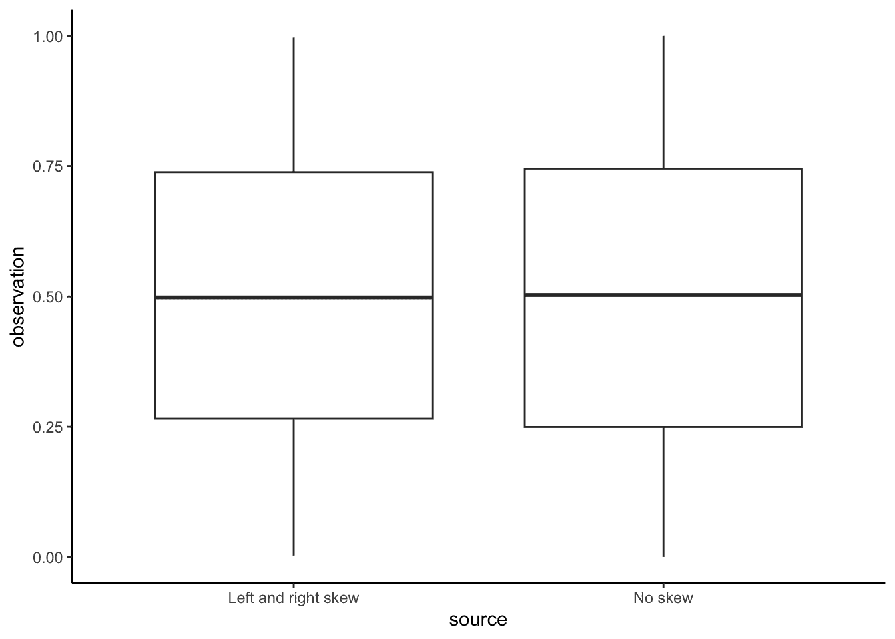

(a) 使用箱线图说明

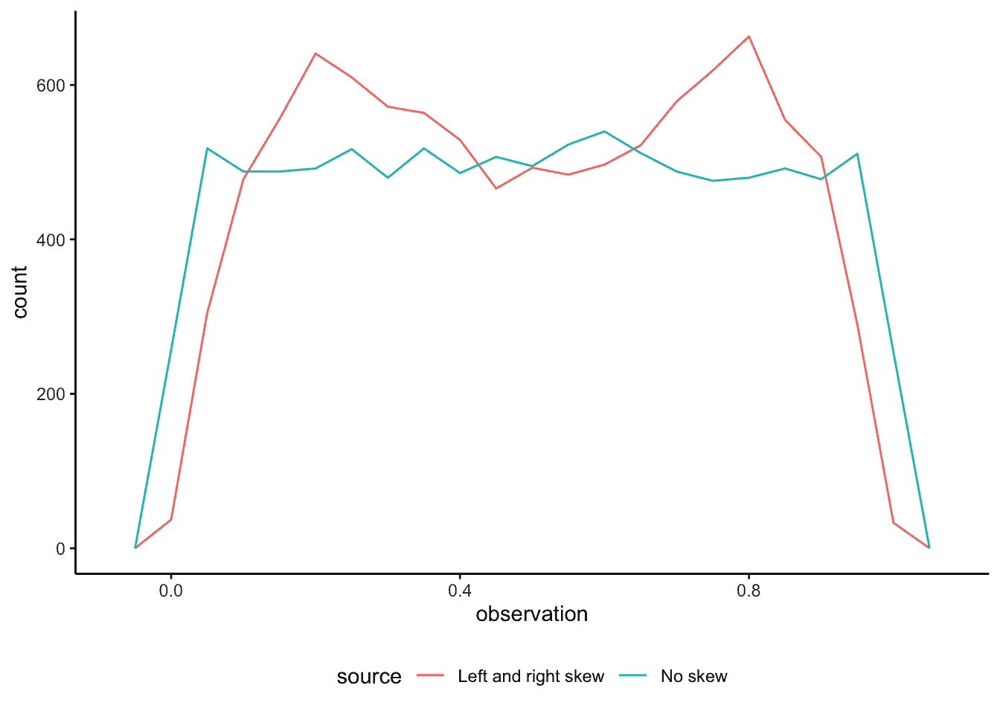

(b) 实际数据

图 5.20：从具有不同参数的贝塔分布中抽取的数据

如果要使用箱线图，一种改进方法是将实际数据作为一层叠加在箱线图之上。例如，在图 5.21 中，我们展示了四个国家的通货膨胀分布。这种方法效果很好的原因是它既展示了实际观测值，也展示了汇总统计量。

```py
world_bank_data |>
 ggplot(mapping = aes(x = country, y = inflation)) +
 geom_boxplot() +
 geom_jitter(alpha = 0.3, width = 0.15, height = 0) +
 theme_minimal() +
 labs(
 x = "Country",
 y = "Inflation",
 caption = "Data source: World Bank."
 )
```

*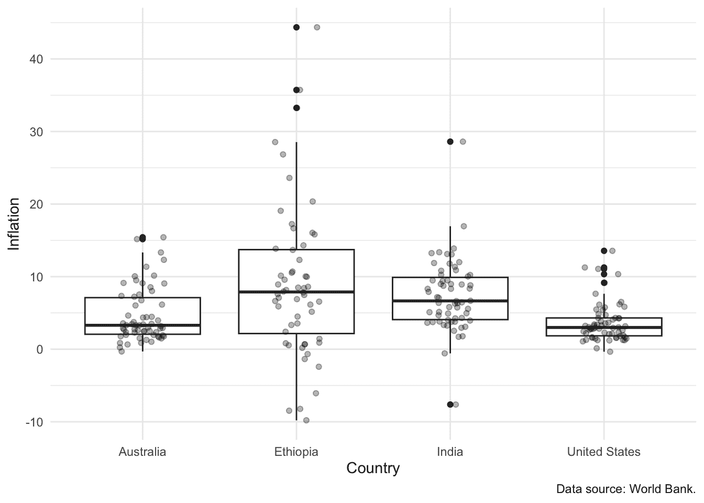

图 5.21：四个国家的通货膨胀数据分布（1960-2020 年）***  ***### 5.2.6 交互式图表

`shiny`（Chang et al. 2021）是一种使用 R 创建交互式网络应用程序的方法。它很有趣，但可能有点繁琐。这里我们将逐步介绍一种利用 `shiny` 的方法，即为我们的图表快速添加一些交互性。这听起来是件小事，但《经济学人》（2022a）提供了一个绝佳的例子来说明它为何如此强大，他们展示了其对 2022 年法国总统选举的预测是如何随时间变化的。

我们将基于 `babynames` 包中的`babynames`数据集（Wickham 2021a）创建一个交互式图表。首先，我们将构建一个静态版本（图 5.22）。

```py
top_five_names_by_year <-
 babynames |>
 arrange(desc(n)) |>
 slice_head(n = 5, by = c(year, sex))

top_five_names_by_year |>
 ggplot(aes(x = n, fill = sex)) +
 geom_histogram(position = "dodge") +
 theme_minimal() +
 scale_fill_brewer(palette = "Set1") +
 labs(
 x = "Babies with that name",
 y = "Occurrences",
 fill = "Sex"
 )
```

*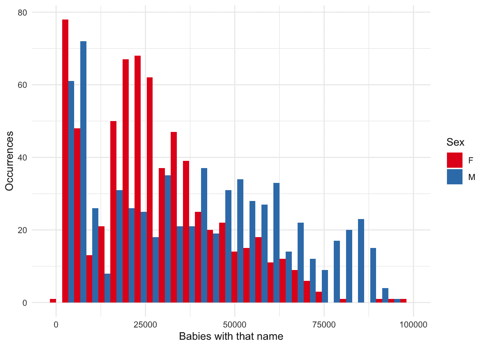

**图 5.22：受欢迎的婴儿名字** *我们可能感兴趣的一点是“分箱”参数的效果如何塑造我们所看到的内容。我们或许希望利用交互性来探索不同的数值。

首先，创建一个新的 `shiny` 应用（“文件” -> “新建文件” -> “Shiny Web 应用程序”）。为其命名，例如“not_my_first_shiny”，然后保留所有其他选项为默认设置。一个新文件“app.R”将打开，我们点击“运行应用”来查看其外观。

现在，用以下内容替换该文件“app.R”中的内容，然后再次点击“运行应用”。

```py
library(shiny)

# Define UI for application that draws a histogram
ui <- fluidPage(
 # Application title
 titlePanel("Count of names for five most popular names each year."),

 # Sidebar with a slider input for number of bins
 sidebarLayout(
 sidebarPanel(
 sliderInput(
 inputId = "number_of_bins",
 label = "Number of bins:",
 min = 1,
 max = 50,
 value = 30
 )
 ),

 # Show a plot of the generated distribution
 mainPanel(plotOutput("distPlot"))
 )
)

# Define server logic required to draw a histogram
server <- function(input, output) {
 output$distPlot <- renderPlot({
 # Draw the histogram with the specified number of bins
 top_five_names_by_year |>
 ggplot(aes(x = n, fill = sex)) +
 geom_histogram(position = "dodge", bins = input$number_of_bins) +
 theme_minimal() +
 scale_fill_brewer(palette = "Set1") +
 labs(
 x = "Babies with that name",
 y = "Occurrences",
 fill = "Sex"
 )
 })
}

# Run the application
shinyApp(ui = ui, server = server)
```

*我们刚刚构建了一个可以更改分箱数量的交互式图表。它应该看起来像 图 5.23。

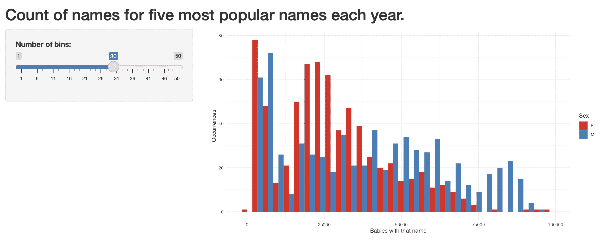

**图 5.23：用户控制分箱数量的 Shiny 应用示例** *************************  ****## 5.3 表格

表格是讲述引人入胜故事的重要组成部分。表格传达的信息可能比图表少，但其保真度更高。它们在突出显示少数特定数值时尤其有用（Andersen and Armstrong 2021）。在本书中，我们主要通过三种方式使用表格：

1.  用于展示数据集的摘录。

1.  用于传达汇总统计信息。

1.  用于展示回归结果。

### 5.3.1 显示数据集的一部分

我们使用 `tinytable` 包中的 `tt()` 函数来演示如何显示数据集的一部分。我们使用之前下载的世界银行数据集，并重点关注通货膨胀率、GDP 增长率和人口，因为失业数据并非每年每个国家都有。

```py
world_bank_data <- 
 world_bank_data |> 
 select(-unem_rate)
```

*首先，在安装并加载 `tinytable` 包后，我们可以使用默认的 `tt()` 设置显示前 10 行。

```py
world_bank_data |>
 slice(1:10) |>
 tt()
```

*| 国家 | 年份 | 通货膨胀率 | GDP 增长率 | 人口 |

| --- | --- | --- | --- | --- |
| --- | --- | --- | --- | --- |
| 澳大利亚 | 1960 | 3.7288136 | NA | 10276477 |
| 澳大利亚 | 1961 | 2.2875817 | 2.482656 | 10483000 |
| 澳大利亚 | 1962 | -0.3194888 | 1.294611 | 10742000 |
| 澳大利亚 | 1963 | 0.6410256 | 6.216107 | 10950000 |
| 澳大利亚 | 1964 | 2.8662420 | 6.980061 | 11167000 |
| 澳大利亚 | 1965 | 3.4055728 | 5.980438 | 11388000 |
| 澳大利亚 | 1966 | 3.2934132 | 2.379040 | 11,651,000 |
| 澳大利亚 | 1967 | 3.4782609 | 6.304945 | 11,799,000 |
| 澳大利亚 | 1968 | 2.5210084 | 5.094034 | 12,009,000 |

| 澳大利亚 | 1969 | 3.2786885 | 7.045584 | 12,263,000 |*  *为了能够在文本中交叉引用表格，我们需要按照第三章 第 3.2.7 节所示，为 R 代码块添加表格标题和标签。我们还可以使用 `setNames` 使列名更具信息性，并指定要显示的小数位数（表 5.3）。

```py
```{r}

#| label: tbl-gdpfirst

#| message: false

#| tbl-cap: "四国经济指标数据集"

world_bank_data |>

slice(1:10) |>

tt() |>

style_tt(j = 2:5, align = "r") |>

format_tt(digits = 1, num_fmt = "decimal") |>

setNames(c("国家", "年份", "通货膨胀率", "GDP 增长率", "人口"))

```py
```

*表 5.3: 四国经济指标数据集

| 国家 | 年份 | 通货膨胀率 | GDP 增长率 | 人口 |
| --- | --- | --- | --- | --- |
| 澳大利亚 | 1960 | 3.7 |  | 10,276,477 |
| 澳大利亚 | 1961 | 2.3 | 2.5 | 10,483,000 |
| 澳大利亚 | 1962 | -0.3 | 1.3 | 10,742,000 |
| 澳大利亚 | 1963 | 0.6 | 6.2 | 10,950,000 |
| 澳大利亚 | 1964 | 2.9 | 7 | 11,167,000 |
| 澳大利亚 | 1965 | 3.4 | 6 | 11,388,000 |
| 澳大利亚 | 1966 | 3.3 | 2.4 | 11,651,000 |
| 澳大利亚 | 1967 | 3.5 | 6.3 | 11,799,000 |
| 澳大利亚 | 1968 | 2.5 | 5.1 | 12,009,000 |

| 澳大利亚 | 1969 | 3.3 | 7 | 12,263,000 |***  ***### 5.3.2 改进格式

我们可以使用 `style_tt()` 和一个由“l”（左）、“c”（中）和“r”（右）组成的字符向量来指定列的对齐方式（表 5.4）。我们通过使用 `j` 并指定列号来指明此设置适用于哪些列。此外，我们还可以更改格式。例如，我们可以使用 `num_mark_big = ","` 为至少为 1,000 的数字指定分组。

```py
world_bank_data |>
 slice(1:10) |>
 mutate(year = as.factor(year)) |>
 tt() |> 
 style_tt(j = 1:5, align = "lccrr") |> 
 format_tt(digits = 1, num_mark_big = ",", num_fmt = "decimal") |> 
 setNames(c("Country", "Year", "Inflation", "GDP growth", "Population"))
```

*表 5.4: 澳大利亚、埃塞俄比亚、印度和美国经济指标数据集的前十行

| 国家 | 年份 | 通货膨胀率 | GDP 增长率 | 人口 |
| --- | --- | --- | --- | --- |
| 澳大利亚 | 1960 | 3.7 |  | 10,276,477 |
| 澳大利亚 | 1961 | 2.3 | 2.5 | 10,483,000 |
| 澳大利亚 | 1962 | -0.3 | 1.3 | 10,742,000 |
| 澳大利亚 | 1963 | 0.6 | 6.2 | 10,950,000 |
| 澳大利亚 | 1964 | 2.9 | 7 | 11,167,000 |
| 澳大利亚 | 1965 | 3.4 | 6 | 11,388,000 |
| 澳大利亚 | 1966 | 3.3 | 2.4 | 11,651,000 |
| 澳大利亚 | 1967 | 3.5 | 6.3 | 11,799,000 |
| 澳大利亚 | 1968 | 2.5 | 5.1 | 12,009,000 |

| 澳大利亚 | 1969 | 3.3 | 7 | 12,263,000 |*  *### 5.3.3 传达汇总统计信息

安装并加载 `modelsummary` 后，我们可以使用 `datasummary_skim()` 从数据集中创建汇总统计表。

我们可以利用此功能生成诸如表 5.5 的表格。这对于我们将在第十一章介绍的探索性数据分析可能很有用。（此处我们为节省空间移除了人口数据，且未包含每个变量的直方图。）

```py
world_bank_data |>
 select(-population) |> 
 datasummary_skim(histogram = FALSE)
```

*表 5.5：四个国家经济指标变量摘要

|  | 唯一值 | 缺失百分比 | 均值 | 标准差 | 最小值 | 中位数 | 最大值 |
| --- | --- | --- | --- | --- | --- | --- | --- |
| 年份 | 62 | 0 | 1990.5 | 17.9 | 1960.0 | 1990.5 | 2021.0 |
| inflation | 243 | 2 | 6.1 | 6.5 | -9.8 | 4.3 | 44.4 |
| gdp_growth | 224 | 10 | 4.2 | 3.7 | -11.1 | 3.9 | 13.9 |
| 国家 | 数量 | 百分比 |  |  |  |  |  |
| 澳大利亚 | 62 | 25.0 |  |  |  |  |  |
| 埃塞俄比亚 | 62 | 25.0 |  |  |  |  |  |
| 印度 | 62 | 25.0 |  |  |  |  |  |

| 美国 | 62 | 25.0 |  |  |  |  |  |*  *默认情况下，`datasummary_skim()` 会汇总数值变量，但我们也可以要求其汇总分类变量（表 5.6）。此外，我们可以像使用 `kable()` 一样添加交叉引用，即包含一个“tbl-cap”条目，然后交叉引用 R 代码块的名称。

```py
world_bank_data |>
 datasummary_skim(type = "categorical")
```

*表 5.6：四个国家分类经济指标变量摘要

| 国家 | 数量 | 百分比 |
| --- | --- | --- |
| 澳大利亚 | 62 | 25.0 |
| 埃塞俄比亚 | 62 | 25.0 |
| 印度 | 62 | 25.0 |

| 美国 | 62 | 25.0 |*  *我们可以使用 `datasummary_correlation()` 创建一个显示变量间相关性的表格（表 5.7）。

```py
world_bank_data |>
 datasummary_correlation()
```

*表 5.7：四个国家（澳大利亚、埃塞俄比亚、印度和美国）经济指标变量之间的相关性

|  | 年份 | inflation | gdp_growth | population |
| --- | --- | --- | --- | --- |
| 年份 | 1 | . | . | . |
| inflation | .03 | 1 | . | . |
| gdp_growth | .11 | .01 | 1 | . |

| population | .25 | .06 | .16 | 1 |*  *我们通常需要一个描述性统计表格，以便添加到论文中（表 5.8）。这与表 5.6 形成对比，后者可能不会包含在论文的主体部分，更多是帮助我们理解数据。我们可以使用 `notes` 添加关于数据来源的注释。

```py
datasummary_balance(
 formula = ~country,
 data = world_bank_data |> 
 filter(country %in% c("Australia", "Ethiopia")),
 dinm = FALSE,
 notes = "Data source: World Bank."
)
```

*表 5.8：通货膨胀与 GDP 数据集的描述性统计

|  | 澳大利亚 (N=62) | 埃塞俄比亚 (N=62) |
| :-: | :-: | :-: |
|  | 均值 | 标准差 | 均值 | 标准差 |
| --- | --- | --- | --- | --- |
| 数据来源：世界银行。 |
| 年份 | 1990.5 | 18.0 | 1990.5 | 18.0 |
| inflation | 4.7 | 3.8 | 9.1 | 10.6 |
| gdp_growth | 3.4 | 1.8 | 5.9 | 6.4 |

| population | 17351313.1 | 4407899.0 | 57185292.0 | 29328845.8 |****  ***### 5.3.4 展示回归结果

我们可以使用 `modelsummary` 包中的 `modelsummary()` 来报告回归结果。例如，我们可以展示几个不同模型的估计值（表 5.9）。

```py
first_model <- lm(
 formula = gdp_growth ~ inflation,
 data = world_bank_data
)

second_model <- lm(
 formula = gdp_growth ~ inflation + country,
 data = world_bank_data
)

third_model <- lm(
 formula = gdp_growth ~ inflation + country + population,
 data = world_bank_data
)

modelsummary(list(first_model, second_model, third_model))
```

*表 5.9：以通货膨胀为自变量解释 GDP

|  | (1) | (2) | (3) |
| --- | --- | --- | --- |
| (Intercept) | 4.147 | 3.676 | 3.611 |
|  | (0.343) | (0.484) | (0.482) |
| inflation | 0.006 | -0.068 | -0.065 |
|  | (0.039) | (0.040) | (0.039) |
| countryEthiopia |  | 2.896 | 2.716 |
|  |  | (0.740) | (0.740) |
| countryIndia |  | 1.916 | -0.730 |
|  |  | (0.642) | (1.465) |
| countryUnited States |  | -0.436 | -1.145 |
|  |  | (0.633) | (0.722) |
| population |  |  | 0.000 |
|  |  |  | (0.000) |
| Num.Obs. | 223 | 223 | 223 |
| R2 | 0.000 | 0.111 | 0.127 |
| R2 Adj. | -0.004 | 0.095 | 0.107 |
| AIC | 1217.7 | 1197.5 | 1195.4 |
| BIC | 1227.9 | 1217.9 | 1219.3 |
| Log.Lik. | -605.861 | -592.752 | -590.704 |
| F | 0.024 | 6.806 |  |

| RMSE | 3.66 | 3.45 | 3.42 |*  *有效数字的位数可以通过“fmt”进行调整（表 5.10）。为了帮助建立可信度，通常不应添加尽可能多的有效数字（Howes 2022）。相反，你应该仔细考虑数据生成过程并据此进行调整。

```py
modelsummary(
 list(first_model, second_model, third_model),
 fmt = 1
)
```

*表 5.10：以通货膨胀为自变量的三个 GDP 模型

|  | (1) | (2) | (3) |
| --- | --- | --- | --- |
| (Intercept) | 4.1 | 3.7 | 3.6 |
|  | (0.3) | (0.5) | (0.5) |
| inflation | 0.0 | -0.1 | -0.1 |
|  | (0.0) | (0.0) | (0.0) |
| countryEthiopia |  | 2.9 | 2.7 |
|  |  | (0.7) | (0.7) |
| countryIndia |  | 1.9 | -0.7 |
|  |  | (0.6) | (1.5) |
| countryUnited States |  | -0.4 | -1.1 |
|  |  | (0.6) | (0.7) |
| population |  |  | 0.0 |
|  |  |  | (0.0) |
| Num.Obs. | 223 | 223 | 223 |
| R2 | 0.000 | 0.111 | 0.127 |
| R2 Adj. | -0.004 | 0.095 | 0.107 |
| AIC | 1217.7 | 1197.5 | 1195.4 |
| BIC | 1227.9 | 1217.9 | 1219.3 |
| Log.Lik. | -605.861 | -592.752 | -590.704 |
| F | 0.024 | 6.806 |  |

| RMSE | 3.66 | 3.45 | 3.42 |*********  ***## 5.4 地图

在许多方面，地图可以被视为另一种类型的图表，其中 x 轴是纬度，y 轴是经度，并且有一些轮廓或背景图像。它们可能是最古老且最被理解的图表类型（Karsten 1923, 1）。我们可以用一种直接的方式生成地图。话虽如此，这并非易事；事情很快就会变得复杂起来！

第一步是获取一些数据。`ggplot2` 内置了一些地理数据，我们可以通过 `map_data()` 访问。`maps` 包中的 `world.cities` 数据集包含额外的变量。

```py
france <- map_data(map = "france")

head(france)
```

*```py
 long      lat group order region subregion
1 2.557093 51.09752     1     1   Nord      <NA>
2 2.579995 51.00298     1     2   Nord      <NA>
3 2.609101 50.98545     1     3   Nord      <NA>
4 2.630782 50.95073     1     4   Nord      <NA>
5 2.625894 50.94116     1     5   Nord      <NA>
6 2.597699 50.91967     1     6   Nord      <NA>
```

```py
french_cities <-
 world.cities |>
 filter(country.etc == "France")

head(french_cities)
```

*```py
 name country.etc    pop   lat long capital
1       Abbeville      France  26656 50.12 1.83       0
2         Acheres      France  23219 48.97 2.06       0
3            Agde      France  23477 43.33 3.46       0
4            Agen      France  34742 44.20 0.62       0
5 Aire-sur-la-Lys      France  10470 50.64 2.39       0
6 Aix-en-Provence      France 148622 43.53 5.44       0
```**  **利用这些信息，你可以创建一张显示法国主要城市的地图（图 5.24）。使用 `ggplot2` 中的 `geom_polygon()` 通过连接组内的点来绘制形状。而 `coord_map()` 则用于调整我们用二维地图表示三维世界这一事实。

```py
ggplot() +
 geom_polygon(
 data = france,
 aes(x = long, y = lat, group = group),
 fill = "white",
 colour = "grey"
 ) +
 coord_map() +
 geom_point(
 aes(x = french_cities$long, y = french_cities$lat),
 alpha = 0.3,
 color = "black"
 ) +
 theme_minimal() +
 labs(x = "Longitude", y = "Latitude")
```

*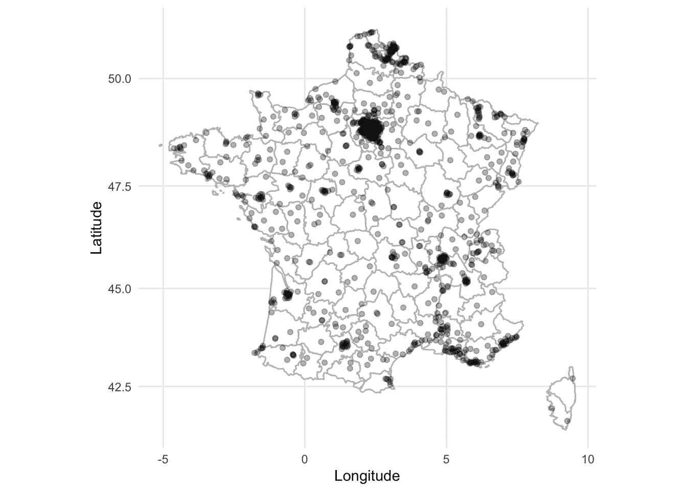

图 5.24：显示法国最大城市的地图*  *正如在 R 中常见的情况一样，创建静态地图有很多种方法。我们已经看到了如何仅使用 `ggplot2` 来构建它们，但 `ggmap` 带来了额外的功能。

地图有两个基本组成部分：

1.  一个边界或背景图像（有时称为瓦片）；以及

1.  该边界内或该瓦片上的某些兴趣点。

在 `ggmap` 中，我们使用开源选项 Stamen Maps 作为我们的瓦片。我们根据纬度和经度来绘制点。

### 5.4.1 静态地图

#### 5.4.1.1 澳大利亚投票站

在澳大利亚，人们必须前往“投票站”才能投票。由于投票站有坐标（纬度和经度），我们可以将它们绘制出来。我们可能想这样做的一个原因是观察空间投票模式。

首先我们需要获取一个瓦片。我们将使用 `ggmap` 从 Stamen Maps 获取一个瓦片，它基于 OpenStreetMap。该函数的主要参数是指定一个边界框。边界框是你感兴趣区域的边缘坐标，需要两个纬度和两个经度。

使用谷歌地图或其他地图平台来查找你需要的坐标值会很有帮助。在本例中，我们提供了坐标，使其以澳大利亚首都堪培拉为中心。

```py
bbox <- c(left = 148.95, bottom = -35.5, right = 149.3, top = -35.1)
```

*它是免费的，但我们需要注册才能获取地图。为此，请访问 https://client.stadiamaps.com/signup/ 并创建一个账户。然后创建一个新属性，接着“添加 API 密钥”。复制密钥并运行（将 PUT-KEY-HERE 替换为你的密钥）`register_stadiamaps(key = "PUT-KEY-HERE", write = TRUE)`。然后，一旦你定义了边界框，函数 `get_stadiamap()` 就会获取该区域的瓦片（图 5.25）。它所需的瓦片数量取决于缩放级别，而获取的瓦片类型则取决于地图类型。我们使用了黑白样式的“toner-lite”，但还有其他类型，包括：“terrain”、“toner”和“toner-lines”。我们将瓦片传递给 `ggmap()` 进行绘制。这需要网络连接，因为 `get_stadiamap()` 会下载瓦片。

```py
canberra_stamen_map <- get_stadiamap(bbox, zoom = 11, maptype = "stamen_toner_lite")

ggmap(canberra_stamen_map)
```

*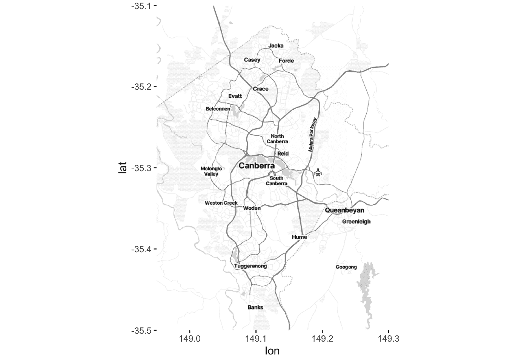

图 5.25：澳大利亚堪培拉地图*  *一旦我们有了地图，就可以使用 `ggmap()` 来绘制它。现在，我们想获取一些数据，将其绘制在我们的瓦片之上。我们将根据其“选区”来绘制投票站的位置。这些数据[可从澳大利亚选举委员会 (AEC) 获取](https://results.aec.gov.au/20499/Website/Downloads/HouseTppByPollingPlaceDownload-20499.csv)。

```py
booths <-
 read_csv(
 "https://results.aec.gov.au/24310/Website/Downloads/GeneralPollingPlacesDownload-24310.csv",
 skip = 1,
 guess_max = 10000
 )
```

*该数据集涵盖整个澳大利亚，但由于我们只绘制堪培拉周边区域，我们将过滤数据，仅保留地理位置靠近堪培拉的投票站。

```py
booths_reduced <-
 booths |>
 filter(State == "ACT") |>
 select(PollingPlaceID, DivisionNm, Latitude, Longitude) |>
 filter(!is.na(Longitude)) |> # Remove rows without geography
 filter(Longitude < 165) # Remove Norfolk Island
```

*现在我们可以像之前一样使用 `ggmap` 来绘制底图瓦片，然后在此基础上使用 `geom_point()` 来添加我们的兴趣点。

```py
ggmap(canberra_stamen_map, extent = "normal", maprange = FALSE) +
 geom_point(data = booths_reduced,
 aes(x = Longitude, y = Latitude, colour = DivisionNm),
 alpha = 0.7) +
 scale_color_brewer(name = "2019 Division", palette = "Set1") +
 coord_map(
 projection = "mercator",
 xlim = c(attr(map, "bb")$ll.lon, attr(map, "bb")$ur.lon),
 ylim = c(attr(map, "bb")$ll.lat, attr(map, "bb")$ur.lat)
 ) +
 labs(x = "Longitude",
 y = "Latitude") +
 theme_minimal() +
 theme(panel.grid.major = element_blank(),
 panel.grid.minor = element_blank())
```

*

图 5.26：澳大利亚堪培拉地图，附投票地点*  *我们可能希望保存地图，这样就不必每次都重新创建，我们可以像保存其他图形一样使用 `ggsave()` 来保存。

```py
ggsave("map.pdf", width = 20, height = 10, units = "cm")
```

*最后，我们使用 Stamen Maps 和 OpenStreetMap 的原因是它们是开源的，但我们也可以使用谷歌地图。这需要你先用谷歌注册一张信用卡并指定一个密钥，但在使用量低的情况下，这项服务应该是免费的。使用谷歌地图——通过在 `ggmap` 中使用 `get_googlemap()`——相比 `get_stadiamap()` 带来了一些优势。例如，它会尝试查找地名，而不需要指定边界框。******  ***#### 5.4.1.2 美军基地

为了查看静态地图的另一个示例，我们将在安装并加载 `troopdata` 后绘制一些美军基地。我们可以使用 `get_basedata()` 获取冷战开始以来美国海外军事基地的数据。

```py
bases <- get_basedata()

head(bases)
```

*```py
# A tibble: 6 × 9
  countryname ccode iso3c basename            lat   lon  base lilypad fundedsite
  <chr>       <dbl> <chr> <chr>             <dbl> <dbl> <dbl>   <dbl>      <dbl>
1 Afghanistan   700 AFG   Bagram AB          34.9  69.3     1       0          0
2 Afghanistan   700 AFG   Kandahar Airfield  31.5  65.8     1       0          0
3 Afghanistan   700 AFG   Mazar-e-Sharif     36.7  67.2     1       0          0
4 Afghanistan   700 AFG   Gardez             33.6  69.2     1       0          0
5 Afghanistan   700 AFG   Kabul              34.5  69.2     1       0          0
6 Afghanistan   700 AFG   Herat              34.3  62.2     1       0          0
```*  *我们将查看美军在德国、日本和澳大利亚的基地位置。`troopdata` 数据集已经包含了每个基地的经纬度，我们将以此作为关注点。第一步是为每个国家定义一个边界框。

```py
# Use: https://data.humdata.org/dataset/bounding-boxes-for-countries
bbox_germany <- c(left = 5.867, bottom = 45.967, right = 15.033, top = 55.133)

bbox_japan <- c(left = 127, bottom = 30, right = 146, top = 45)

bbox_australia <- c(left = 112.467, bottom = -45, right = 155, top = -9.133)
```

*然后我们需要使用 `ggmap` 中的 `get_stadiamap()` 来获取图块。

```py
german_stamen_map <- get_stadiamap(bbox_germany, zoom = 6, maptype = "stamen_toner_lite")

japan_stamen_map <- get_stadiamap(bbox_japan, zoom = 6, maptype = "stamen_toner_lite")

aus_stamen_map <- get_stadiamap(bbox_australia, zoom = 5, maptype = "stamen_toner_lite")
```

*最后，我们可以将所有内容整合到显示美军在德国（图 5.27 (a)）、日本（图 5.27 (b)）和澳大利亚（图 5.27 (c)）基地的地图中。

```py
ggmap(german_stamen_map) +
 geom_point(data = bases, aes(x = lon, y = lat)) +
 labs(x = "Longitude",
 y = "Latitude") +
 theme_minimal()

ggmap(japan_stamen_map) +
 geom_point(data = bases, aes(x = lon, y = lat)) +
 labs(x = "Longitude",
 y = "Latitude") +
 theme_minimal()

ggmap(aus_stamen_map) +
 geom_point(data = bases, aes(x = lon, y = lat)) +
 labs(x = "Longitude",
 y = "Latitude") +
 theme_minimal()
```

*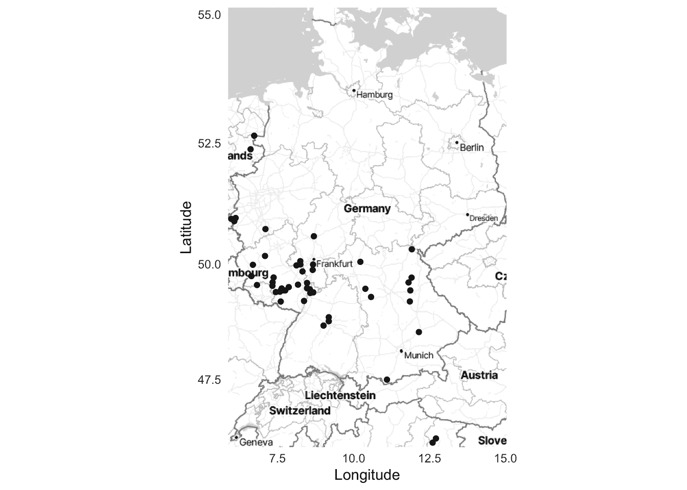

(a) 德国

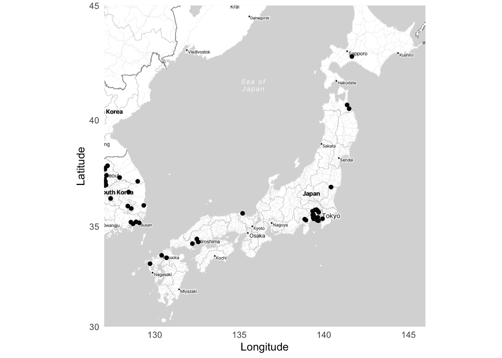

(b) 日本


(c) 澳大利亚

图 5.27：世界各地美军基地地图*******  ***### 5.4.2 地理编码

到目前为止，我们假设已经拥有地理编码数据。这意味着我们拥有每个地点的经纬度坐标。但有时我们只有地名，例如“澳大利亚悉尼”、“加拿大多伦多”、“加纳阿克拉”和“厄瓜多尔瓜亚基尔”。在绘制它们之前，我们需要获取每个案例的经纬度坐标。从名称到坐标的过程称为地理编码。

*哦，你以为我们在这方面有很好的数据！* *虽然你几乎肯定知道自己住在哪里，但要精确定义许多地方的边界却可能出奇地困难。当不同级别的政府有不同的定义时，这个问题就变得尤其棘手。Bronner (2021) 以佐治亚州亚特兰大市为例说明了这一点，那里（至少）存在三种不同的官方定义：

1.  大都市统计区；

1.  城市化区域；以及

1.  人口普查区。

使用哪个定义可能会对分析甚至可用的数据产生重大影响，尽管它们都叫“亚特兰大”。*  *在 R 中有一系列地理编码数据的选项，但 `tidygeocoder` 尤其有用。我们首先需要一个包含位置信息的数据框。

```py
place_names <-
 tibble(
 city = c("Sydney", "Toronto", "Accra", "Guayaquil"),
 country = c("Australia", "Canada", "Ghana", "Ecuador")
 )

place_names
```

*```py
# A tibble: 4 × 2
  city      country  
  <chr>     <chr>    
1 Sydney    Australia
2 Toronto   Canada   
3 Accra     Ghana    
4 Guayaquil Ecuador 
```*  *```py
place_names <-
 geo(
 city = place_names$city,
 country = place_names$country,
 method = "osm"
 )

place_names
```

*```py
# A tibble: 4 × 4
  city      country      lat    long
  <chr>     <chr>      <dbl>   <dbl>
1 Sydney    Australia -33.9  151\.   
2 Toronto   Canada     43.7  -79.4  
3 Accra     Ghana       5.56  -0.201
4 Guayaquil Ecuador    -2.19 -79.9 
```*  *现在我们可以绘制并标注这些城市（图 5.28）。

```py
world <- map_data(map = "world")

ggplot() +
 geom_polygon(
 data = world,
 aes(x = long, y = lat, group = group),
 fill = "white",
 colour = "grey"
 ) +
 geom_point(
 aes(x = place_names$long, y = place_names$lat),
 color = "black") +
 geom_text(
 aes(x = place_names$long, y = place_names$lat, label = place_names$city),
 nudge_y = -5) +
 theme_minimal() +
 labs(x = "Longitude",
 y = "Latitude")
```

*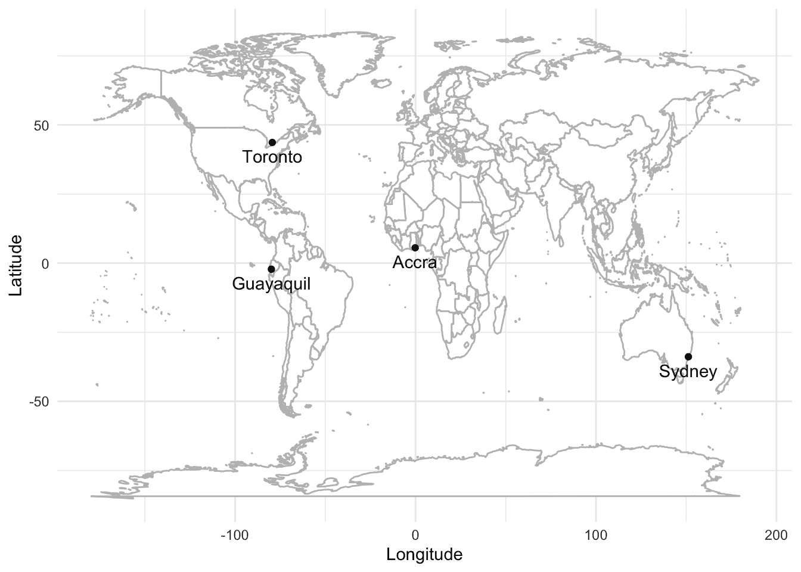

图 5.28：经过地理编码获取位置后的阿克拉、悉尼、多伦多和瓜亚基尔地图****  ****### 5.4.3 交互式地图

交互式地图的好处在于，我们可以让用户决定他们感兴趣的内容。例如，在地图的情况下，有些人可能对多伦多感兴趣，而另一些人可能对金奈甚至奥克兰感兴趣。但很难呈现一张同时聚焦所有这些地方的地图，因此交互式地图是一种让用户专注于他们想要内容的方式。

话虽如此，我们在构建地图时，应该意识到自己在做什么，更广泛地说，应该意识到为了实现我们能够构建自己的地图，大规模地进行了哪些工作。例如，关于 Google，McQuire (2019) 说道：

> Google 于 1998 年诞生，最初是一家以组织互联网海量数据而闻名的公司。但在过去的二十年里，其雄心壮志发生了关键性的转变。从物理世界中提取文字和数字等数据，如今仅仅是迈向将物理世界本身理解和组织为数据的一个垫脚石。或许，在人类身份可以被理解为一种（基因）“代码”的时代，这种转变并不令人惊讶。然而，在当前环境下，将世界理解和组织为数据，很可能使我们远远超越海德格尔所说的“持存物”——即现代技术将“自然”框定为生产性资源。在 21 世纪，人类生活本身的方方面面——从基因到身体外貌、移动性、姿态、言语和行为——正逐渐被转化为一种生产性资源，这种资源不仅可以被持续获取，还能随着时间的推移进行调节。

这是否意味着我们不应该使用或构建交互式地图？当然不是。但重要的是要意识到这是一个前沿领域，其适当使用的边界仍在确定中。事实上，地图本身的字面边界也在不断地被确定和更新。与实体印刷地图相比，向数字地图的转变意味着不同的用户可能被呈现不同的现实。例如，“……谷歌在边境争端中经常选边站队。以乌克兰和俄罗斯之间的边界表示为例。在俄罗斯，克里米亚半岛被表示为由俄罗斯控制的实线边界，而乌克兰人和其他人看到的则是虚线边界。这个具有重要战略意义的半岛被两国都声称拥有主权，并于 2014 年被俄罗斯武力夺取，这是众多控制权争夺战之一” (Bensinger 2020)。

#### 5.4.3.1 Leaflet

我们可以使用 `leaflet` (Cheng, Karambelkar, and Xie 2021) 来制作交互式地图。其核心与 `ggmap` (Kahle and Wickham 2013) 类似，但除此之外还有许多额外的方面。我们可以重做 第五章 中使用 `troopdata` (Flynn 2022) 的美军部署地图。交互式地图的优势在于，我们可以绘制所有基地，并允许用户关注他们想要的区域，相比之下，第五章 中我们只选取了几个特定国家。《经济学人》(2022b) 提供了一个很好的例子来说明为什么这可能有用，他们能够按市镇展示 2022 年法国总统选举的全国结果。

与 `ggplot2` 中的图表以 `ggplot()` 开始类似，`leaflet` 中的地图以 `leaflet()` 开始。在这里，我们可以指定数据以及其他选项，如宽度和高度。之后，我们以与在 `ggplot2` 中添加图层相同的方式添加“图层”。我们添加的第一个图层是使用 `addTiles()` 添加的瓦片。在本例中，默认使用的是 OpenStreetMap。之后，我们使用 `addMarkers()` 添加标记以显示每个基地的位置 (图 5.29)。

```py
bases <- get_basedata()

# Some of the bases include unexpected characters which we need to address
Encoding(bases$basename) <- "latin1"

leaflet(data = bases) |>
 addTiles() |> # Add default OpenStreetMap map tiles
 addMarkers(
 lng = bases$lon,
 lat = bases$lat,
 popup = bases$basename,
 label = bases$countryname
 )
```

*图 5.29：美国基地交互式地图*  *与 `ggmap` 相比，这里有两个新参数。第一个是“popup”，即用户点击标记时发生的行为。在本例中，提供的是基地名称。第二个是“label”，即用户将鼠标悬停在标记上时发生的情况。在本例中，它是国家名称。

我们可以尝试另一个例子，这次是关于建设这些基地的支出金额。我们将在这里引入一种不同类型的标记，即圆形。这将允许我们为每种类型的结果使用不同的颜色。有四种可能的结果：“超过 $100,000,000”、“超过 $10,000,000”、“超过 $1,000,000”、“$1,000,000 或更少”图 5.30。

```py
build <-
 get_builddata(startyear = 2008, endyear = 2019) |>
 filter(!is.na(lon)) |>
 mutate(
 cost = case_when(
 spend_construction > 100000 ~ "More than $100,000,000",
 spend_construction > 10000 ~ "More than $10,000,000",
 spend_construction > 1000 ~ "More than $1,000,000",
 TRUE ~ "$1,000,000 or less"
 )
 )

pal <-
 colorFactor("Dark2", domain = build$cost |> unique())

leaflet() |>
 addTiles() |> # Add default OpenStreetMap map tiles
 addCircleMarkers(
 data = build,
 lng = build$lon,
 lat = build$lat,
 color = pal(build$cost),
 popup = paste(
 "<b>Location:</b>",
 as.character(build$location),
 "<br>",
 "<b>Amount:</b>",
 as.character(build$spend_construction),
 "<br>"
 )
 ) |>
 addLegend(
 "bottomright",
 pal = pal,
 values = build$cost |> unique(),
 title = "Type",
 opacity = 1
 )
```

*图 5.30：美国基地的交互式地图，使用彩色圆圈表示支出**  **#### 5.4.3.2 Mapdeck

`mapdeck` (Cooley 2020) 基于 WebGL。这意味着网络浏览器将为我们完成大量工作。这使我们能够实现一些 `leaflet` 难以处理的任务，例如处理更大的数据集。

到目前为止，我们一直使用“stamen maps”作为底层瓦片，但 `mapdeck` 使用 [Mapbox](https://www.mapbox.com/)。这需要注册一个账户并获取一个令牌。这是免费的，并且只需操作一次。一旦我们有了那个令牌，我们就可以通过运行 `edit_r_environ()` 将其添加到我们的 R 环境中（此过程的细节在第七章中介绍），这将打开一个文本文件，我们应该在此文件中添加我们的 Mapbox 密钥令牌。

```py
MAPBOX_TOKEN <- "PUT_YOUR_MAPBOX_SECRET_HERE"
```

*然后我们保存这个“.Renviron”文件，并重启 R（“会话” -> “重启 R”）。

获得令牌后，我们可以创建之前基地支出数据的图表（图 5.31）。

```py
mapdeck(style = mapdeck_style("light")) |>
 add_scatterplot(
 data = build,
 lat = "lat",
 lon = "lon",
 layer_id = "scatter_layer",
 radius = 10,
 radius_min_pixels = 5,
 radius_max_pixels = 100,
 tooltip = "location"
 )
```

*图 5.31：使用 Mapdeck 的美国基地交互式地图**************  ****## 5.5 结束语

在本章中，我们探讨了许多传达数据的方式。我们在图表上花费了大量时间，因为它们能够以高效的方式传达大量信息。然后我们转向表格，因为它们可以具体地传达信息。最后，我们讨论了地图，它允许我们展示地理信息。最重要的任务是尽可能全面地展示观测结果。

## 5.6 练习

### 练习

1.  *（计划）* 考虑以下场景：*三位朋友——爱德华、雨果和露西——各自测量了他们 20 位朋友的身高。他们三人各自使用了略有不同的测量方法，因此产生了略有不同的误差。* 请勾画出该数据集可能的样子，然后勾画出你可以构建的用于显示所有观测值的图表。

1.  *（模拟）* 请进一步考虑所描述的场景，并模拟每个变量彼此独立的情况。请基于模拟数据包含三项测试。

1.  *（获取）* 请指定一个你感兴趣的关于人类身高的实际数据来源。

1.  *（探索）* 使用模拟数据构建图表和表格。

1.  *（沟通）* 请写一些文字来配合图表和表格，就好像它们反映了实际情况一样。段落中包含的确切细节不必是事实，但应该是合理的（即，你实际上不必获取数据或创建图形）。请将代码适当地分成 `R` 文件和一个 Quarto 文档。提交一个带有 README 的 GitHub 仓库链接。

### 测验

1.  始终绘制数据的主要原因是什么（单选）？

    1.  为了更好地理解我们的数据。

    1.  确保数据是正态的。

    1.  检查缺失值。

1.  根据 Wickham, Çetinkaya-Rundel 和 Grolemund ([[2016] 2023](99-references.html#ref-r4ds))，以下哪项最能描述整洁数据（单选）？

    1.  每个变量在其自己的列中，每个观测值在其自己的行中。

    1.  所有数据都在一行中。

    1.  每个单元格有多个值。

    1.  数据存储在一个单元格中。

1.  根据 Healy (2018)，`ggplot()` 的第一个参数要求是什么（单选）？

    1.  一个数据框。

    1.  一个几何对象函数。

    1.  一个图例。

    1.  一种美学映射。

1.  根据 Healy (2018)，在 `ggplot2` 中，`+` 运算符的作用是什么（单选）？

    1.  保存图形。

    1.  向图形添加数据。

    1.  组合图形的图层。

    1.  从图形中移除元素。

1.  根据 Wickham, Çetinkaya-Rundel 和 Grolemund ([[2016] 2023](99-references.html#ref-r4ds))，在 `ggplot2` 的上下文中，“aesthetic”（美学属性）是什么（单选）？

    1.  使用的图表类型。

    1.  坐标轴标签。

    1.  图形的颜色。

    1.  数据集中变量如何映射到视觉属性。

1.  根据 Wickham, Çetinkaya-Rundel 和 Grolemund ([[2016] 2023](99-references.html#ref-r4ds))，在 `ggplot2` 中，“geom” 是什么（单选）？

    1.  一个数据转换函数。

    1.  图形用来表示数据的几何对象。

    1.  一个图形标题。

    1.  一种统计变换。

1.  应该使用哪个几何对象来制作散点图（单选）？

    1.  `geom_dotplot()`

    1.  `geom_bar()`

    1.  `geom_smooth()`

    1.  `geom_point()`

1.  应该使用哪个来创建条形图（当你已经计算了计数时）（单选）？

    1.  `geom_line()`

    1.  `geom_bar()`

    1.  `geom_histogram()`

    1.  `geom_col()`

1.  你会使用哪个 `ggplot2` 几何对象来创建直方图（单选）？

    1.  `geom_col()`

    1.  `geom_bar()`

    1.  `geom_density()`

    1.  `geom_histogram()`

1.  假设 `tidyverse` 和 `datasauRus` 已安装并加载。以下代码的结果会是什么（单选）？

    1.  两条垂直线。

    1.  三条垂直线。

    1.  四条垂直线。

    1.  五条垂直线。

```py
datasaurus_dozen |> 
 filter(dataset == "v_lines") |> 
 ggplot(aes(x=x, y=y)) + 
 geom_point()
```

*11.  根据 Wickham, Çetinkaya-Rundel 和 Grolemund ([[2016] 2023](99-references.html#ref-r4ds))，当你在 `ggplot2` 中将一个变量映射到 `color` 美学属性时会发生什么（选择所有适用的选项）？

    1.  点根据变量获得不同的颜色。

    1.  图例会自动创建。

    1.  点的大小根据变量而变化。

1.  根据 Healy (2018)，`ggplot2` 中 `color` 和 `fill` 美学属性有什么区别（单选）？

    1.  这两个术语可以互换使用。

    1.  `color` 适用于点和线，而 `fill` 适用于面积元素。

    1.  `color` 控制字体颜色，而 `fill` 控制图形标题。

    1.  `color` 适用于背景，而 `fill` 适用于文本。

1.  使用 `geom_point()` 时，如何为点添加一些透明度（单选）？

    1.  通过将 `alpha` 设置为 0 到 1 之间的值。

    1.  通过从图形中移除 `geom_point()`。

    1.  通过在 `aes()` 中使用 `color = NULL`

1.  在 `ggplot2` 中，`labs()` 函数的作用是什么（单选）？

    1.  改变图形的背景颜色。

    1.  添加如图例和坐标轴标签等标签。

    1.  添加最佳拟合线。

    1.  修改图形布局。

1.  在下面的代码中，应向 `labs()` 添加什么以更改图例文本（单选）？

    1.  `scale = "Voted for"`

    1.  `legend = "Voted for"`

    1.  `color = "Voted for"`

    1.  `fill = "Voted for"`

```py
beps |>
 ggplot(mapping = aes(x = age, fill = vote)) +
 geom_bar() +
 theme_minimal() +
 labs(x = "Age of respondent", y = "Number of respondents")
```

*16.  根据 `scale_colour_brewer()` 的帮助文件，哪种调色板是发散的（单选）？

    1.  “GnBu”

    1.  “Set1”

    1.  “Accent”

    1.  “RdBu”

1.  哪种主题没有沿 x 轴和 y 轴的实线（单选）？

    1.  `theme_minimal()`

    1.  `theme_classic()`

    1.  `theme_bw()`

1.  应向 `geom_bar()` 添加 `position` 的哪个参数以使条形并排而非堆叠（单选）？

    1.  `position = "adjacent"`

    1.  `position = "side_by_side"`

    1.  `position = "closest"`

    1.  `position = "dodge2"`

```py
beps |> 
 ggplot(mapping = aes(x = age, fill = vote)) + 
 geom_bar()
```

*19.  根据 Vanderplas、Cook 和 Hofmann (2020)，创建图形时应考虑哪种认知原则（单选）？

    1.  邻近性。

    1.  体积估计。

    1.  相对运动。

    1.  轴向定位。

1.  根据 Vanderplas、Cook 和 Hofmann (2020)，颜色可用于（单选）？

    1.  提升图表设计美感。

    1.  编码分类和连续变量并分组图形元素。

    1.  识别量级。

1.  以下哪种情况会导致最多的分箱数（单选）？

    1.  `geom_histogram(binwidth = 2)`

    1.  `geom_histogram(binwidth = 5)`

1.  假设有一个数据集包含 100 只鸟的身高，每只鸟来自三个不同物种之一。如果我们想了解这些身高的分布情况，请用一两段文字解释应使用哪种类型的图形及其原因。

1.  如果我们假设库已加载且数据集和列存在，这段代码 `data |> ggplot(aes(x = col_one)) |> geom_point()` 能运行吗（单选）？

    1.  不能。

    1.  能。

1.  在 `ggplot2` 中，在图形中使用分面的目的是什么（单选）？

    1.  调整点的透明度。

    1.  为数据点添加标签。

    1.  用于创建按一个或多个变量的值分割的多个图形。

    1.  改变图形的配色方案。

1.  使用 `ggplot2` 创建条形图时，通常将哪种美学映射到分类变量以为条形填充不同颜色（单选）？

    1.  `fill`

    1.  `x`

    1.  `y`

    1.  `size`

1.  在 `ggplot2` 中，向 `geom_bar()` 添加 `position = "dodge"` 或 `position = "dodge2"` 会产生什么效果（单选）？

    1.  它为条形添加透明度。

    1.  它为每个组将条形并排放置。

    1.  它将条形堆叠在一起。

    1.  它将条形颜色更改为灰度。

1.  在 `ggplot2` 的语境中，`geom_point()` 和 `geom_jitter()` 的主要区别是什么（选择一个）？

    1.  `geom_jitter()` 向点添加随机噪声以减少过度绘制。

    1.  `geom_jitter()` 用于连续数据，`geom_point()` 用于分类数据。

    1.  `geom_point()` 添加透明度，`geom_jitter()` 不添加。

    1.  `geom_point()` 绘制点，`geom_jitter()` 绘制线。

1.  你会使用哪个 `ggplot2` 几何对象来为散点图添加最佳拟合线（选择一个）？

    1.  `geom_histogram()`

    1.  `geom_smooth()`

    1.  `geom_bar()`

    1.  `geom_line()`

1.  你会在 `geom_smooth()` 中使用哪个参数来指定一个不带标准误差的线性模型（选择一个）？

    1.  `fit = lm, show_se = FALSE`

    1.  `type = "linear", ci = FALSE`

    1.  `model = linear, error = FALSE`

    1.  `method = lm, se = FALSE`

1.  调整箱数或更改箱宽会影响直方图的哪个方面（选择一个）？

    1.  x 轴上的标签。

    1.  数据点的大小。

    1.  图中使用的颜色。

    1.  分布显示的平滑程度。

1.  使用箱线图的一个缺点是什么（选择一个）？

    1.  它们无法显示异常值。

    1.  它们计算时间太长。

    1.  它们隐藏了数据的底层分布。

    1.  它们颜色太花哨。

1.  你如何处理那个缺点（选择一个）？

    1.  移除箱线图的须线。

    1.  为每个类别添加颜色。

    1.  使用 `geom_jitter()` 叠加实际数据点。

    1.  增加箱体宽度。

1.  `stat_ecdf()` 计算什么（选择一个）？

    1.  累积分布函数。

    1.  带误差条的散点图。

    1.  箱线图。

    1.  直方图。

1.  我们可以使用 `modelsummary` 中的哪个函数来创建描述性统计表（选择一个）？

    1.  `datasummary_balance()`

    1.  `datasummary_skim()`

    1.  `datasummary_descriptive()`

    1.  `datasummary_crosstab()`

1.  什么是地理编码（选择一个）？

    1.  将经纬度转换为地名。

    1.  绘制地图边界。

    1.  选择地图投影。

    1.  将地名转换为经纬度。

1.  根据 Lovelace、Nowosad 和 Muenchow (2019) 的论述，请用一两段话解释在地理数据背景下，矢量数据和栅格数据之间的区别是什么？

1.  `addMarkers()` 的哪个参数用于指定点击标记后发生的行为（选择一个）？

    1.  `layerId`

    1.  `icon`

    1.  `popup`

    1.  `label`***  ***### 课堂活动

+   使用[起始文件夹](https://github.com/RohanAlexander/starter_folder)并创建一个新的代码仓库。在班级共享的 Google 文档中添加该 GitHub 仓库的链接。在 `paper.qmd` 中完成以下所有操作。

+   以下代码生成了一张散点图，显示了休伦湖在 1875 年至 1972 年间的水位（以英尺为单位）。请改进它。

```py
tibble(year = 1875:1972,
 level = as.numeric(datasets::LakeHuron)) |>
 ggplot(aes(x = year, y = level)) +
 geom_point()
```

**   以下代码生成了一张 31 棵黑樱桃树高度的条形图。请改进它。

```py
datasets::trees |> 
 as_tibble() |> 
 ggplot(aes(x = Height)) +
 geom_bar()
```

**   以下代码生成了一张折线图，显示了雏鸡体重（以克为单位）随日龄的变化。请改进它。

```py
datasets::ChickWeight |> 
 as_tibble() |> 
 ggplot(aes(x = Time, y = weight, group = Chick)) +
 geom_line()
```

**   以下代码生成一个直方图，显示 1700 年至 1988 年间的太阳黑子年数量。请改进它。

```py
tibble(year = 1700:1988,
 sunspots = as.numeric(datasets::sunspot.year) |> round(0)) |>
 ggplot(aes(x = sunspots)) +
 geom_histogram()
```

**   请遵循 Saloni Dattani 的[此代码](https://github.com/saloni-nd/misc/blob/main/Mortality%20rates%20by%20age%20-%20HMD.R)，为你感兴趣的两个国家制作图表。

+   以下代码取自 `palmerpenguins` [示例文档](https://allisonhorst.github.io/palmerpenguins/articles/examples.html)，它生成了一个漂亮的图表。请修改它以创建你能想到的最丑的图表。¹

```py
ggplot(data = penguins,
 aes(x = flipper_length_mm,
 y = body_mass_g)) +
 geom_point(aes(color = species,
 shape = species),
 size = 3,
 alpha = 0.8) +
 scale_color_manual(values = c("darkorange", "purple", "cyan4")) +
 labs(
 title = "Penguin size, Palmer Station LTER",
 subtitle = "Flipper length and body mass for Adelie, Chinstrap and Gentoo Penguins",
 x = "Flipper length (mm)",
 y = "Body mass (g)",
 color = "Penguin species",
 shape = "Penguin species"
 ) +
 theme_minimal() +
 theme(
 legend.position = c(0.2, 0.7),
 plot.title.position = "plot",
 plot.caption = element_text(hjust = 0, face = "italic"),
 plot.caption.position = "plot"
 )
```

**   以下代码提供了来自三个实验的光速估计值，每个实验有 20 次运行。请计算每个实验的平均光速，然后使用 `knitr::kable()` 创建一个带有指定列名且无有效数字的交叉引用表格。

```py
datasets::morley |> 
 tibble()
```*****  ***### 任务一

请使用 `ggplot2` 创建一个图表，并使用 `ggmap` 创建一张地图，并为两者添加说明文字。务必包含交叉引用和标题等。每项内容应占约一页篇幅。

然后，关于你创建的图表，请思考 Vanderplas、Cook 和 Hofmann (2020)。添加几段关于你为使图表更有效而考虑的不同选项。

最后，关于你创建的地图，请思考 [We All Count](https://weallcount.com) 创始人 Heather Krause 的以下引述：“地图只显示对制作者而言不隐形的人”，以及 D’Ignazio 和 Klein (2020) 的第三章，并添加几段与此相关的内容。

提交一个高质量 GitHub 仓库的链接。

### 任务二

请获取关于奥斯威辛集中营大屠杀受害者的族裔来源和数量的数据。然后使用 `shiny` 创建一个交互式图表和一个交互式表格。这些应显示按国籍/类别划分的被谋杀人数，并应允许用户指定他们感兴趣查看数据的群体。使用 shinyapps.io 的免费层发布它们。

然后，基于 Bouie (2022) 中提出的主题，用至少两页的篇幅讨论你的工作。期望是，类似于 Healy (2020)，你以你的工作为基础进行构建，并讨论使用关于如此恐怖事件的数据意味着什么。

使用起始文件夹，并提交使用其中提供的 Quarto 文档创建的 PDF。确保你的文章包含指向你的应用程序以及包含所有代码和数据的 GitHub 仓库的链接。同时，广泛引用你思考过的相关文献。

### 论文

大约在此处，在线附录 F 中的 *Mawson* 论文将是合适的。

Andersen, Robert, and David Armstrong. 2021\. *有效呈现统计结果*。伦敦：Sage 出版社。Arel-Bundock, Vincent. 2021\. *WDI：世界发展指标及其他世界银行数据*。[`CRAN.R-project.org/package=WDI`](https://CRAN.R-project.org/package=WDI)。———. 2022\. “modelsummary：R 语言中的数据与模型摘要。” *统计软件杂志* 103 (1): 1–23\. [`doi.org/10.18637/jss.v103.i01`](https://doi.org/10.18637/jss.v103.i01)。———. 2024\. *tinytable：支持“HTML”、“LaTeX”、“Markdown”、“Word”、“PNG”、“PDF”和“Typst”格式的简单可配置表格*。[`vincentarelbundock.github.io/tinytable/`](https://vincentarelbundock.github.io/tinytable/)。Armstrong, Zan. 2022\. “停止在数据聚合中丢失信号。” *The Overflow*，三月。[`stackoverflow.blog/2022/03/03/stop-aggregating-away-the-signal-in-your-data/`](https://stackoverflow.blog/2022/03/03/stop-aggregating-away-the-signal-in-your-data/)。Arnold, Jeffrey. 2021\. *ggthemes：“ggplot2”的额外主题、比例尺和几何对象*。[`CRAN.R-project.org/package=ggthemes`](https://CRAN.R-project.org/package=ggthemes)。Becker, Richard, Allan Wilks, Ray Brownrigg, Thomas Minka, and Alex Deckmyn. 2022\. *maps：绘制地理地图*。[`CRAN.R-project.org/package=maps`](https://CRAN.R-project.org/package=maps)。Bensinger, Greg. 2020\. “谷歌根据查看者重绘地图边界。” *华盛顿邮报*，二月。[`www.washingtonpost.com/technology/2020/02/14/google-maps-political-borders/`](https://www.washingtonpost.com/technology/2020/02/14/google-maps-political-borders/)。Bethlehem, R. A. I., J. Seidlitz, S. R. White, J. W. Vogel, K. M. Anderson, C. Adamson, S. Adler, et al. 2022\. “人类全生命周期的脑图谱。” *自然* 604 (7906): 525–33\. [`doi.org/10.1038/s41586-022-04554-y`](https://doi.org/10.1038/s41586-022-04554-y)。Bouie, Jamelle. 2022\. “我们仍未能看清美国奴隶制的本质。” *纽约时报*，一月。[`www.nytimes.com/2022/01/28/opinion/slavery-voyages-data-sets.html`](https://www.nytimes.com/2022/01/28/opinion/slavery-voyages-data-sets.html)。Brewer, Cynthia. 2015\. *设计更好的地图：GIS 用户指南*。第二版。Bronner, Laura. 2021\. “量化编辑。” *YouTube*，六月。[`youtu.be/LI5m9RzJgWc`](https://youtu.be/LI5m9RzJgWc)。Cambon, Jesse, and Christopher Belanger. 2021\. “tidygeocoder：轻松地理编码。” Zenodo。[`doi.org/10.5281/zenodo.3981510`](https://doi.org/10.5281/zenodo.3981510)。Chang, Winston, Joe Cheng, JJ Allaire, Carson Sievert, Barret Schloerke, Yihui Xie, Jeff Allen, Jonathan McPherson, Alan Dipert, and Barbara Borges. 2021\. *shiny：R 语言的 Web 应用框架*。[`CRAN.R-project.org/package=shiny`](https://CRAN.R-project.org/package=shiny)。Chase, William. 2020\. “图形的魅力。” *RStudio 大会*，一月。[`posit.co/resources/videos/the-glamour-of-graphics/`](https://posit.co/resources/videos/the-glamour-of-graphics/)。Cheng, Joe, Bhaskar Karambelkar, and Yihui Xie. 2021\. *leaflet：使用 JavaScript“Leaflet”库创建交互式网络地图*。[`CRAN.R-project.org/package=leaflet`](https://CRAN.R-project.org/package=leaflet)。Cleveland, William. (1985) 1994\. *数据图形化要素*。第二版。新泽西：Hobart 出版社。Cooley, David. 2020\. *mapdeck：使用“Mapbox GL JS”和“Deck.gl”的交互式地图*。[`CRAN.R-project.org/package=mapdeck`](https://CRAN.R-project.org/package=mapdeck)。D’Ignazio, Catherine, and Lauren Klein. 2020\. *数据女性主义*。马萨诸塞州：麻省理工学院出版社。[`data-feminism.mitpress.mit.edu`](https://data-feminism.mitpress.mit.edu)。Davies, Rhian, Steph Locke, and Lucy D’Agostino McGowan. 2022\. *datasauRus：Datasaurus Dozen 数据集*。[`CRAN.R-project.org/package=datasauRus`](https://CRAN.R-project.org/package=datasauRus)。Denby, Lorraine, and Colin Mallows. 2009\. “直方图的变体。” *计算与图形统计杂志* 18 (1): 21–31\. [`doi.org/10.1198/jcgs.2009.0002`](https://doi.org/10.1198/jcgs.2009.0002)。Firke, Sam. 2023\. *janitor：用于检查和清理脏数据的简单工具*。[`CRAN.R-project.org/package=janitor`](https://CRAN.R-project.org/package=janitor)。Flynn, Michael. 2022\. *troopdata：分析跨国军事部署与基地数据的工具*。[`CRAN.R-project.org/package=troopdata`](https://CRAN.R-project.org/package=troopdata)。Fox, John, and Robert Andersen. 2006\. “多项和比例优势 Logit 模型的效应展示。” *社会学方法论* 36 (1): 225–55\. [`doi.org/10.1111/j.1467-9531.2006.00180`](https://doi.org/10.1111/j.1467-9531.2006.00180)。Fox, John, Sanford Weisberg, and Brad Price. 2022\. *carData：应用回归数据集的配套数据*。[`CRAN.R-project.org/package=carData`](https://CRAN.R-project.org/package=carData)。Franconeri, Steven, Lace Padilla, Priti Shah, Jeffrey Zacks, and Jessica Hullman. 2021\. “视觉数据传播的科学：什么有效。” *公共利益中的心理科学* 22 (3): 110–61\. [`doi.org/10.1177/15291006211051956`](https://doi.org/10.1177/15291006211051956)。Friendly, Michael, and Howard Wainer. 2021\. *数据可视化与图形传播史*。第一版。马萨诸塞州：哈佛大学出版社。Funkhouser, Gray. 1937\. “统计数据图形表示的历史发展。” *Osiris* 3: 269–404\. [`doi.org/10.1086/368480`](https://doi.org/10.1086/368480)。Garnier, Simon, Noam Ross, Robert Rudis, Antônio Camargo, Marco Sciaini, and Cédric Scherer. 2021\. *viridis – R 语言的色盲友好配色方案*。[`doi.org/10.5281/zenodo.4679424`](https://doi.org/10.5281/zenodo.4679424)。Gelfand, Sharla. 2022\. *opendatatoronto：访问多伦多市开放数据门户*。[`CRAN.R-project.org/package=opendatatoronto`](https://CRAN.R-project.org/package=opendatatoronto)。Healy, Kieran. 2018\. *数据可视化*。新泽西：普林斯顿大学出版社。[`socviz.co`](https://socviz.co)。———. 2020\. “厨房柜台观测站”，五月。[`kieranhealy.org/blog/archives/2020/05/21/the-kitchen-counter-observatory/`](https://kieranhealy.org/blog/archives/2020/05/21/the-kitchen-counter-observatory/)。Howes, Adam. 2022\. “使用有效数字表示不确定性”，四月。[`athowes.github.io/posts/2022-04-24-representing-uncertainty-using-significant-figures/`](https://athowes.github.io/posts/2022-04-24-representing-uncertainty-using-significant-figures/)。Kahle, David, and Hadley Wickham. 2013\. “ggmap：使用 ggplot2 进行空间可视化。” *R 期刊* 5 (1): 144–61\. [`journal.r-project.org/archive/2013-1/kahle-wickham.pdf`](http://journal.r-project.org/archive/2013-1/kahle-wickham.pdf)。Karsten, Karl. 1923\. *图表与图形*。纽约：Prentice-Hall 出版社。Kuznets, Simon, Lillian Epstein, and Elizabeth Jenks. 1941\. *国民收入及其构成，1919-1938 年*。国家经济研究局。Lovelace, Robin, Jakub Nowosad, and Jannes Muenchow. 2019\. *R 语言地理计算*。第一版。Chapman; Hall/CRC 出版社。[`geocompr.robinlovelace.net`](https://geocompr.robinlovelace.net)。McIlroy, Doug, Ray Brownrigg, Thomas Minka, and Roger Bivand. 2023\. *mapproj：地图投影*。[`CRAN.R-project.org/package=mapproj`](https://CRAN.R-project.org/package=mapproj)。McQuire, Scott. 2019\. “一图统天下？作为数字技术对象的谷歌地图。” *传播与公共* 4 (2): 150–65\. [`doi.org/10.1177/2057047319850192`](https://doi.org/10.1177/2057047319850192)。Miller, Greg. 2014\. “正在改变地图设计的制图师。” *Wired*，十月。[`www.wired.com/2014/10/cindy-brewer-map-design/`](https://www.wired.com/2014/10/cindy-brewer-map-design/)。Moyer, Brian, and Abe Dunn. 2020\. “衡量国内生产总值（GDP）：终极数据科学项目。” *哈佛数据科学评论* 2 (1)。[`doi.org/10.1162/99608f92.414caadb`](https://doi.org/10.1162/99608f92.414caadb)。Neuwirth, Erich. 2022\. *RColorBrewer：ColorBrewer 配色方案*。[`CRAN.R-project.org/package=RColorBrewer`](https://CRAN.R-project.org/package=RColorBrewer)。OECD. 2014\. “基本宏观经济总量。” 载于《理解国民账户》，13–46 页。经合组织。[`doi.org/10.1787/9789264214637-2-en`](https://doi.org/10.1787/9789264214637-2-en)。Pedersen, Thomas Lin. 2022\. *patchwork：图形组合器*。[`CRAN.R-project.org/package=patchwork`](https://CRAN.R-project.org/package=patchwork)。Phillips, Alban. 1958\. “英国失业率与货币工资率变化率之间的关系，1861-1957 年。” *Economica* 25 (100): 283–99\. [`doi.org/10.1111/j.1468-0335.1958.tb00003.x`](https://doi.org/10.1111/j.1468-0335.1958.tb00003.x)。R Core Team. 2024\. *R：统计计算的语言与环境*。奥地利维也纳：R 统计计算基金会。[`www.R-project.org/`](https://www.R-project.org/)。Rudis, Bob. 2020\. *hrbrthemes：“ggplot2”的额外主题、主题组件和实用工具*。[`CRAN.R-project.org/package=hrbrthemes`](https://CRAN.R-project.org/package=hrbrthemes)。Spear, Mary Eleanor. 1952\. *统计制图*。[`archive.org/details/ChartingStatistics_201801/`](https://archive.org/details/ChartingStatistics_201801/)。The Economist. 2022a. “埃马纽埃尔·马克龙会赢得第二个任期吗？” 四月。[`www.economist.com/interactive/france-2022/forecast`](https://www.economist.com/interactive/france-2022/forecast)。———. 2022b. “法国总统选举：第二轮投票详情”，四月。[`www.economist.com/interactive/france-2022/results-round-two`](https://www.economist.com/interactive/france-2022/results-round-two)。Tukey, John. 1977\. *探索性数据分析*。Vanderplas, Susan, Dianne Cook, and Heike Hofmann. 2020\. “测试统计图表：什么造就了好图表？” *统计及其应用年度评论* 7: 61–88\. [`doi.org/10.1146/annurev-statistics-031219-041252`](https://doi.org/10.1146/annurev-statistics-031219-041252)。Wasserman, Larry. 2005\. *统计学全览*。Springer 出版社。Wei, Eugene. 2017\. *移除图例，成为传奇*。[`www.eugenewei.com/blog/2017/11/13/remove-the-legend`](https://www.eugenewei.com/blog/2017/11/13/remove-the-legend)。Weissgerber, Tracey, Natasa Milic, Stacey Winham, and Vesna Garovic. 2015\. “超越条形图和折线图：数据呈现新范式的时代。” *PLoS Biology* 13 (4): e1002128\. [`doi.org/10.1371/journal.pbio.1002128`](https://doi.org/10.1371/journal.pbio.1002128)。Wickham, Hadley. 2021a. *babynames：美国婴儿名字 1880-2017*。[`CRAN.R-project.org/package=babynames`](https://CRAN.R-project.org/package=babynames)。———. 2021b. *精通 Shiny*。第一版。O’Reilly Media 出版社。[`mastering-shiny.org`](https://mastering-shiny.org)。Wickham, Hadley, Mara Averick, Jenny Bryan, Winston Chang, Lucy D’Agostino McGowan, Romain François, Garrett Grolemund, et al. 2019\. “欢迎来到 Tidyverse。” *开源软件杂志* 4 (43): 1686\. [`doi.org/10.21105/joss.01686`](https://doi.org/10.21105/joss.01686)。Wickham, Hadley, Jennifer Bryan, and Malcolm Barrett. 2022\. *usethis：自动化包和项目设置*。[`CRAN.R-project.org/package=usethis`](https://CRAN.R-project.org/package=usethis)。Wickham, Hadley, Mine Çetinkaya-Rundel, and Garrett Grolemund. (2016) 2023\. *R 数据科学*。第二版。O’Reilly Media 出版社。[`r4ds.hadley.nz`](https://r4ds.hadley.nz)。Wickham, Hadley, and Lisa Stryjewski. 2011\. “箱线图 40 年”，十一月。[`vita.had.co.nz/papers/boxplots.pdf`](https://vita.had.co.nz/papers/boxplots.pdf)。Wilkinson, Leland. 2005\. *图形语法*。第二版。Springer 出版社。Xie, Yihui. 2023\. *knitr：R 语言中动态报告生成的通用包*。[`yihui.org/knitr/`](https://yihui.org/knitr/)。

1.  这个练习的想法来自莉莎·博尔顿。↩︎
