# 6  测量、普查与抽样

> 原文：[`tellingstorieswithdata.com/06-farm.html`](https://tellingstorieswithdata.com/06-farm.html)

1.  数据获取

1.  6  测量、普查与抽样

*Chapman and Hall/CRC 于 2023 年 7 月出版了本书。您可以[在此处](https://www.routledge.com/Telling-Stories-with-Data-With-Applications-in-R/Alexander/p/book/9781032134772)购买。此在线版本对印刷版内容进行了一些更新。*  ***先修要求**

+   观看《抽样与随机化导论》，(Register 2020)

    +   本视频通过有用的示例概述了抽样方法。

+   阅读《雷丁的工人阶级家庭》，(Bowley 1913)

    +   这篇历史文献讨论了 20 世纪初在英国进行的一项调查，其中包含对系统抽样特别有启发性的讨论。

+   阅读《论代表性方法的两个不同方面》，(Neyman 1934)

    +   本文概述了分层抽样。您应重点关注以下部分：I “引言”、III “代表性方法的不同方面”、V “结论”以及鲍利的讨论。

+   阅读《人口普查指南》，(Statistics Canada 2023)

    +   重点关注第十章“数据质量评估”。尽管本章由加拿大政府撰写，内容针对特定人口普查，但它描述并探讨了几乎所有调查都会涉及的相关问题。

+   阅读《他、她、他们：在调查调整中使用生理性别与社会性别》，(Kennedy et al. 2022)

    +   本文描述了在调查中考虑生理性别和社会性别时遇到的一些挑战，并提出了前进方向的建议。

**核心概念与技能**

+   在数据集形成之前，必须先进行测量，而这带来了诸多挑战和顾虑。人口普查是一种旨在某些方面做到完整的数据集。尽管并非完美，但政府在人口普查和其他官方统计上投入了大量资金，它们是极佳的基础数据源。

+   即使我们无法获得这样的数据集，我们也可以利用抽样来确保我们仍能做出合理的论断。这有两种类型——概率抽样和非概率抽样。两者都扮演着重要角色。关键术语和概念包括：目标总体、抽样框、样本、简单随机抽样、系统抽样、分层抽样和整群抽样。

**核心软件包与函数**

+   Base R (R Core Team 2024)

+   `cancensus` (von Bergmann, Shkolnik, and Jacobs 2021)

+   `canlang` (Timbers 2020)（此软件包不在 CRAN 上，请通过以下方式安装：`install.packages("devtools")` 然后 `devtools::install_github("ttimbers/canlang")`）

+   `maps` (Becker 等人 2022)

+   `tidycensus` (Walker 和 Herman 2022)

+   `tidyverse` (Wickham 等人 2019)

+   `tinytable` (Arel-Bundock 2024)

```py
library(cancensus)
library(canlang)
library(maps)
library(tidycensus)
library(tidyverse)
library(tinytable)
```

*## 6.1 引言

当我们思考我们的世界并讲述关于它的故事时，最困难的方面之一就是将世界美妙而复杂的本质简化为一个可供使用的数据集。我们需要知道这样做会牺牲什么。并且在推进过程中保持审慎和周全的思考。有些数据集如此庞大，以至于单个具体的数据点无关紧要——它可以被替换为另一个而不会产生任何影响 (Crawford 2021, 94)。但这并非总是合理的：如果你的母亲不同，你的生活会有多大差异？

我们常常关注于理解某些数据集的意义；基于它进行预测，或利用该数据集来对更广泛的现象做出论断。无论我们如何将世界转化为数据，通常我们只能获得所需数据的一个样本。统计学提供了我们用来时刻关注这些问题并理解其影响的正式方法。但它并未就更广泛的问题提供明确的指导，例如思考谁从收集的数据中获利，以及这些数据反映了谁的权力。

在本章中，我们首先讨论测量及其带来的一些问题。然后我们转向人口普查，通常我们试图通过它获取关于整个总体的数据。我们还将讨论其他政府官方统计数据以及长期进行的调查。我们将此类数据集描述为“**耕作数据**”。耕作数据集通常组织良好、文档详尽，并且收集、准备和清理这些数据集的工作大部分已为我们完成。它们通常也按照已知的发布周期进行。例如，许多国家每月发布失业和通胀数据集，每季度发布 GDP 数据，每五到十年进行一次人口普查。

接着，我们介绍围绕抽样的统计学概念，为我们将持续回顾的内容奠定基础。在过去大约一百年里，统计学家在思考样本方面发展出了相当高的复杂性，并处理了许多争议 (Brewer 2013)。在本章中，我们将探讨概率抽样和非概率抽样，并介绍一些关键术语和概念。

本章讨论的是可供我们使用的数据。数据并非中立。例如，档案管理员如今会谨慎地思考，档案不仅是事实的来源，也是特定情境（尤其是国家构建的情境）下事实生产过程的一部分（Stoler 2002）。清晰地思考谁被包含在数据集中，以及谁被系统性地排除在外，至关重要。理解、捕捉、分类和命名数据是一种构建世界的实践，并反映了权力——无论是社会的、历史的、金融的还是法律的（Crawford 2021, 121）。

例如，我们可以思考性别与社会性别在调查研究中的作用。性别基于生物属性并在出生时被指定，而社会性别则是社会建构的，兼具生物与文化层面（Lips 2020, 7）。我们可能更关注社会性别（而非生理性别）与某些结果之间的关系。但官方统计中对社会性别这一精细概念的采纳只是近期才发生。那些坚持使用与生理性别相同的二元性别变量的调查，将无法准确反映那些不认同此类划分的受访者。Kennedy 等人（2022）提供了在决定如何处理性别回答时需要考虑的多个方面，包括：伦理、准确性、实用性和灵活性。但不存在普适的最佳解决方案。确保对受访者的尊重应被视为最高优先级（Kennedy et al. 2022, 16）。

既然分类与分组会引发如此多顾虑，我们为何仍需它们？斯科特（1998）认为这很大程度上是国家为实现自身目的、试图使社会清晰可辨的产物，并将其视为现代国家的典型特征。例如，斯科特（1998）指出姓氏的使用源于国家需要清晰名录以征税、确认产权、征兵和人口普查。国家对清晰度的追求还要求统一度量标准。现代计量学——即"研究如何进行测量及数据比对"的学科（Plant and Hanisch 2020）——始于法国大革命时期各类度量衡的标准化，后随拿破仑国家建设进程进一步发展（Scott 1998, 30）。普雷沃和博（2015, 154）将这种变革本质描述为：知识从"独特、局部、特异……且常以文学形式呈现"转向普适化、标准化与数字化。尽管如此，若无可分类、可量化的尺度，数据收集将举步维艰。另一个值得关注的问题是具体化——我们常忘记这些度量标准本身即是人为构建的。

所有数据集都存在缺陷。本章我们将熟悉"培育数据"这一概念。该术语特指为数据用途而专门构建的数据集。

尽管这些培育数据集专供我们使用且通常易于获取，但深刻理解其构建过程仍至关重要。19 世纪苏格兰作家詹姆斯·穆勒虽未踏足印度，却以撰写《英属印度史》闻名。他曾宣称：

> 在印度，任何值得一看或一听的事物，皆可诉诸笔墨。一旦所有重要事物被书面记载，一位具备相应资质的人在英国的书房中一年内所能获得的印度知识，可能远超其亲赴印度用一生耳目所及之总和。
> 
> 穆勒（1817, xv）

他被视为权威且其观点颇具影响力，这或许令人诧异。然而当今，许多人会不假思索地使用通胀统计数据却从未尝试追踪具体价格，引用政治民调结果却从未亲自采访过受访者，运用 ImageNet 数据集却未曾亲手标注过任何图像。我们始终应当深入数据的肌理之中。

## 6.2 测量

测量是一个古老的话题。早在亚里士多德时代，人们就已区分了数量与质量（Tal 2020）。测量，尤其是测量结果的比较，是所有定量分析的基础。但决定测量什么以及如何测量，却充满挑战。

测量比看起来更棘手。例如，在音乐领域，爱荷华州立大学政治学教授大卫·彼得森明确指出，定义“昙花一现的歌手”是多么困难。许多我们可能立刻想到的艺人，结果都至少有一两首其他歌曲在排行榜上取得了不错的成绩（Molanphy 2012）。对所有“一届政府”的分析，是否应该包括那些未能完成完整任期的政府？那些只持续了一个月，甚至一周的政府呢？当政府转移支付中有大量实物福利时，我们该如何开始衡量其规模（Garfinkel, Rainwater, and Smeeding 2006）？尽管这是民主的根本关切，我们如何衡量一个人在民主制度中的代表程度（Achen 1978）？为什么世界卫生组织（WHO）关于妊娠相关死亡和孕产妇死亡的标准定义，只包括分娩、终止妊娠或流产后 42 天内发生的死亡，而这对估算结果有重大影响（Gazeley et al. 2022）？

哲学为测量的定义带来了更多细微差别和深度（Tal 2020），但国际法定计量组织（2007, 44）将测量定义为“通过实验获得一个或多个可合理归属于某量的量值的过程”，其中量是“数字和参照物的结合”。它意味着“量的比较，包括对实体的计数”，并且“预设了对与测量结果预期用途相称的量的描述、测量程序以及经过校准的测量系统……”。这个测量定义清楚地表明，我们关注的问题多种多样，包括仪器和单位，并且我们关注的是有效且可靠的测量。

仪器仪表指的是我们用来进行测量的工具。全面考虑仪器仪表非常重要，因为它决定了我们能够测量什么。例如，Morange（2016, 63）描述了十六世纪显微镜的发明如何促成了 1661 年马尔切洛·马尔皮吉对毛细血管的观察、1665 年罗伯特·胡克对细胞的观察，以及 1677 年安东尼·范·列文虎克对细菌的观察（Lane 2015）。再考虑时间的测量。我们再次看到仪器仪表与测量之间的相互作用。使用日晷，很难将经过的时间精确到比一小时左右更具体的程度。但是，更精确计时仪器的逐步发展最终使得某些体育项目能够将竞争对手的差距区分到千分之一秒，并通过 GPS 实现精确到米以内的导航。

*哦，你以为我们在这方面有很好的数据吗！* *掌握时间是至关重要的测量。例如，一级方程式赛车将单圈时间精确到千分之一秒。而美国游泳运动员迈克尔·菲尔普斯在北京奥运会上仅以百分之一秒的优势赢得金牌。计时使我们能够区分结果，即使事件并非同时发生。例如，回想一下钱布利斯（1989）关于游泳运动员的讨论，如果不了解每位运动员完成每个项目所需的时间，这种讨论将无法进行。时间在金融领域也至关重要，我们需要市场参与者就资产是否可供出售达成一致。但“现在几点？”这个问题可能很难回答。根据不同的来源，个人设定的时间可能不同，因此答案会因询问对象而异。自 20 世纪 70 年代以来，明确的答案是使用原子时。铯秒被定义为“铯 133 原子基态超精细能级跃迁频率的 9,192,631,770 个周期”（Levine, Tavella, and Milton 2022, 4）。但时钟同步的问题——如何让所有非原子钟与原子时以及其他时钟保持一致——仍然存在。霍珀（2022）概述了米尔斯（1991）的网络时间协议（NTP）如何实现时钟同步，以及计算机网络在发现原子时方面存在的一些困难。另一种时间度量是天文学时间，它基于地球的自转。但由于地球自转不一致以及其他问题，已进行调整以确保原子时与天文学时间匹配。这导致了正闰秒的引入，以及负闰秒的可能性，从而引发了一些问题（Levine, Tavella, and Milton 2022）。因此，在未来某个时间点，天文学时间和原子时将允许出现差异（Gibney 2022; Mitchell 2022b）。* *一种常见的测量工具是调查，我们将在第八章进一步讨论这些。另一种常用的工具是传感器。例如，气候科学家可能对温度、湿度或压力感兴趣。许多关于动物运动的分析，如莱奥斯-巴拉哈斯等人（2016）的研究，使用了加速度计。放置在卫星上的传感器可能特别关注图像，此类数据可从陆地卫星计划获取。物理学家非常关注测量，不仅受限于他们的仪器，还受限于存储容量。例如，欧洲核子研究中心的 ATLAS 探测器专注于粒子碰撞，但并非所有测量数据都能保存，因为那将导致每秒 80TB 的数据量（Colombo et al. 2016）！在我们将在第八章讨论的 A/B 测试中，广泛使用了 Cookie、信标、系统设置和行为模式。仪器使用的另一个方面是交付方式。例如，如果使用调查，那么应该邮寄还是在线进行？应该由受访者填写还是由调查员填写？

计量学提供的测量定义明确指出，第二个基本关注点是参考标准，我们称之为单位。单位的选择既与感兴趣的研究问题有关，也与可用的仪器有关。例如，在第一章的教程中，我们关注的是测量植物的生长。使用公里或英里作为单位就不太合适。如果我们使用尺子，我们或许可以测量毫米，但使用卡尺，我们或许可以考虑几十微米。

### 6.2.1 测量的特性

有效的测量是指我们所测量的量与感兴趣的估计量和研究问题相关。这关系到测量的适当性。回顾第四章，估计量是实际效应，例如吸烟对预期寿命的（不可知的）实际影响。将估计量视为实际感兴趣的内容是很有用的。这意味着我们需要确保测量的是个体的相关方面。例如，他们吸烟的数量和他们存活的年数，而不是他们对吸烟的看法。

对于某些单位，如米或秒，有明确的定义。当这些定义演变时，会得到广泛认可（Mitchell 2022a）。但对于我们可能希望测量的其他方面，定义就不那么清晰了，因此测量的有效性变得至关重要。在十四世纪的某个时期，人们曾尝试测量恩典和美德（Crosby 1997, 14）！更近一些，我们试图测量智力，甚至大学的质量。这并不是说人与人之间没有恩典、美德和智力的差异，大学也当然有优劣之分。但测量这些是困难的。

*《美国新闻与世界报道》*试图根据班级规模、拥有博士学位的教师数量以及全职教师数量等方面来量化大学质量。但此类构建的测量指标，尤其是在社会环境中，存在的一个问题是，它会改变被测量对象的动机。例如，哥伦比亚大学从 1988 年的第 18 位上升到 2022 年的第 2 位。但哥伦比亚大学数学教授迈克尔·撒迪厄斯揭示了哥伦比亚大学向*《美国新闻与世界报道》*报告的数据与其他来源可获得的数据之间存在差异，且对哥伦比亚大学有利（Hartocollis 2022）。

这类问题在心理学中尤为重要，因为许多基本概念缺乏明确的测量方法。Fried、Flake 和 Robinaugh（2022）回顾了抑郁症的测量，发现存在许多问题，包括缺乏效度和信度。这并不是说我们不应尝试测量这些概念，而是应确保测量决策的透明度。例如，Flake 和 Fried（2020）建议在构建测量方法时回答各种澄清性问题。这些问题包括质疑所关注的基本构念、导致该测量方法的决策过程、考虑了哪些替代方案、量化过程以及量表。当测量方法是为特定目的而构建，而非从其他地方采用时，这些问题尤为重要。这是因为人们担心测量方法可能会以某种方式构建，从而得出预先设定的结果。

可靠性借鉴了测量定义中“通过实验获取……的过程”这一部分。它意味着一定程度的**一致性**，并表明在特定时间对某一特定方面的多次测量应基本一致。如果两名调查员统计一条街上的商店数量，我们希望他们的统计结果相同。如果结果不同，我们希望能理解差异的原因。例如，可能一名调查员误解了指示，错误地只统计了正在营业的商店。再举一个例子，人口统计学家通常关注国家间的人口迁移，而经济学家则常关注国际贸易。问题在于，A 国从 B 国的迁入或进口数据与 B 国向 A 国的迁出或出口数据不匹配的情况时有发生。

*哦，你以为我们在这方面有可靠的数据吗？* 飞行员向乘客通报飞行高度是常有的事。但高度的概念和测量却出人意料地复杂，这凸显了测量是在更广泛的背景下进行的这一事实（Vanhoenacker 2015）。例如，如果我们关心的是飞机与地面之间有多少米的距离，那么我们应该测量地面与飞行员座位之间的距离（这对通报高度最相关），还是测量地面与机轮底部之间的距离（这对降落最相关）？如果我们飞越一座山呢？即使飞机没有下降，这种测量方式——即飞机与地面之间的米数——也会显示高度降低，从而难以垂直分隔多架飞机。我们可能关心的是与海平面的比较。但海平面会因潮汐而变化，并且在不同地点也不同。因此，一个常见的高度测量标准是飞行高度层，它由气压值决定。由于气压受天气、季节和地点的影响，同一个飞行高度层在飞行过程中，其对应的离地米数可能会有很大差异。飞机使用的高度测量方法服务于其目的，即实现相对安全的航空旅行。*  *### 6.2.2 测量误差

测量误差是我们观察到的数值与实际数值之间的差异。有时可以验证某些回答。如果可验证的回答与不可验证的回答之间的差异是一致的，那么我们就能估计整体测量误差的程度。例如，Sakshaug、Yan 和 Tourangeau（2010）研究了一项针对大学校友的调查，将受访者关于自己成绩的回答与其大学记录进行了比较。他们发现，调查的模式——由人工进行的电话访谈、由计算机进行的电话访谈或网络调查——会影响测量误差的程度。

当调查员代表受访者填写调查表时，这种误差可能尤其普遍。这在涉及种族问题时尤其令人担忧。例如，Davis（1997, 177）描述了美国黑人可能会限制他们向白人访员透露其政治和种族信仰的程度。

另一个例子是**删失数据**，即我们对实际值仅有部分了解的情况。**右删失数据**是指我们知道实际值高于某个观测值，但不知道具体高多少。例如，1986 年切尔诺贝利灾难发生后，当时唯一可用的辐射测量仪器有特定的最大量程。虽然测量到的辐射水平显示为那个（最大）值，但实际值要高得多。

右删失数据在医学研究中很常见。例如，假设进行了一项实验，并对患者进行了为期十年的随访。在十年期结束时，我们只知道患者是否至少活了十年，而不知道其确切寿命。**左删失数据**则是相反的情况。例如，考虑一个最低只能显示冰点的温度计。即使实际温度更低，温度计仍会显示为冰点。

删失数据的一个轻微变体是**缩尾处理数据**。这种情况发生在我们观察到实际值，但将其更改为一个不那么极端的值时。例如，如果我们考虑年龄，我们可能会将所有超过 100 岁的人的年龄改为 100 岁。如果我们担心数值过大会产生过于显著的影响，我们可能会这样做。

**截断数据**的情况略有不同，我们甚至不记录那些值。例如，假设我们关注儿童的年龄与身高之间的关系。我们的第一个问题可能是“你多大了？”，如果发现受访者是成年人，我们就不会继续询问身高。截断数据与**选择偏差**尤其密切相关。例如，考虑一个退课的学生——他们的意见不会在课程评估中被测量。

为了说明这些概念之间的区别，假设新生儿体重的实际分布呈正态分布，中心值约为 3.5 公斤。想象一下，体重秤存在某种缺陷，使得任何小于或等于 2.75 公斤的值都被记录为 2.75 公斤。再想象一下，有一条规则规定，预计体重超过 4.25 公斤的婴儿会被转移到另一家医院出生。这三种情况在图 6.1 中进行了说明。我们可能还对平均体重感兴趣，这突显了偏差（表 6.1）。

```py
set.seed(853)

newborn_weight <-
 tibble(
 weight = rep(
 x = rnorm(n = 1000, mean = 3.5, sd = 0.5), 
 times = 3),
 measurement = rep(
 x = c("Actual", "Censored", "Truncated"),
 each = 1000)
 )

newborn_weight <-
 newborn_weight |>
 mutate(
 weight = case_when(
 weight <= 2.75 & measurement == "Censored" ~ 2.75,
 weight >= 4.25 & measurement == "Truncated" ~ NA_real_,
 TRUE ~ weight
 )
 )

newborn_weight |>
 ggplot(aes(x = weight)) +
 geom_histogram(bins = 50) +
 facet_wrap(vars(measurement)) +
 theme_minimal()
```

*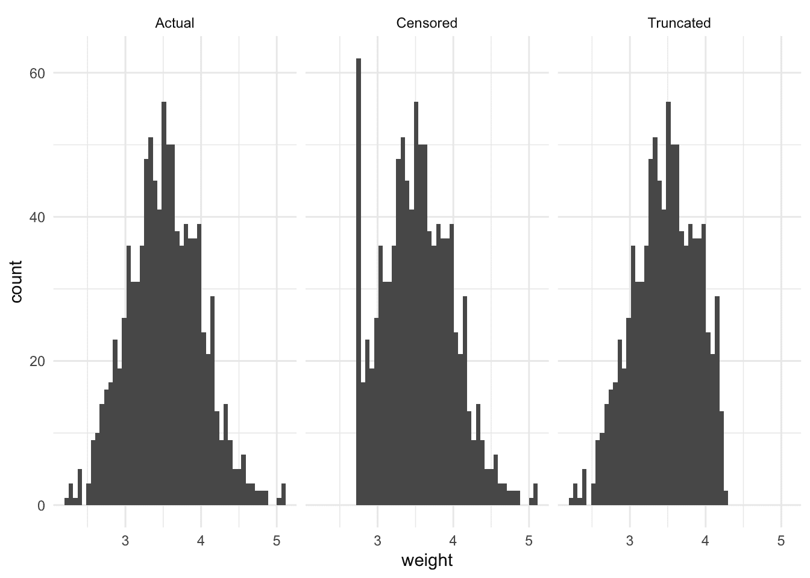

图 6.1：实际体重与删失及截断体重的比较*  *```py
newborn_weight |>
 summarise(mean = mean(weight, na.rm = TRUE),
 .by = measurement) |> 
 tt() |> 
 style_tt(j = 1:2, align = "lr") |> 
 format_tt(digits = 3, num_fmt = "decimal") |> 
 setNames(c("Measurement", "Mean"))
```

*表 6.1：比较不同情景下的平均值以识别偏差

| 测量项 | 平均值 |
| --- | --- |
| 实际值 | 3.521 |
| 删失值 | 3.53 |

| 截断值 | 3.455 |**  **### 6.2.3 缺失数据

无论我们的数据采集过程多么完善，数据缺失都不可避免。也就是说，我们明知某些观测数据未能获取。但一个变量必须被测量，或至少被思考与考量过，才能被认定为“缺失”。如果考虑不周，就可能存在我们甚至意识不到的缺失数据，因为这些变量从未被纳入考量。这是一种“**未吠之犬**”式的缺失。正因如此，思考具体情境、进行草图绘制与模拟、并与领域专家合作显得至关重要。

无应答可被视为测量误差的一种变体，即我们观测到的是空值，尽管本应存在实际数值。但它通常被单独考量。无应答的程度也各不相同：从完全拒绝参与调查，到仅遗漏一个问题。无应答是一个关键问题，尤其是在非概率样本中，因为通常有充分理由认为不回应者与回应者在系统上存在差异。这限制了调查结果仅能代表受访者本身，而难以推广到更广泛的人群。Gelman 等人（2016）甚至指出，选举前夕报告的许多民意变化并非人们改变了主意，而是**差异性无应答**所致。也就是说，个体是否参与调查取决于具体情况，而不仅仅是选择哪个调查选项。在某些情况下，使用预先通知和提醒可能有助于解决无应答问题（Koitsalu 等人，2018；Frandell 等人，2021）。

无应答偏差可能尤为普遍的一个情境是考试。国际学生评估项目（PISA）是一项比较各国 15 岁学生在各种标准化测试中表现的评估。加拿大通常排名靠前。但 Anders 等人（2020）指出，在 2015 年，加拿大仅有约一半的 15 岁学生被纳入样本，而其他一些国家的覆盖率超过 90%。通过使用可比样本，他们发现加拿大的表现并不显得特别突出。

数据缺失可能源于受访者不愿回答某个特定问题、一组相关问题或整个调查，尽管这些原因并非互斥或穷尽所有可能性（Newman 2014）。在理想情况下，数据是**完全随机缺失**（MCAR）的。这种情况很少见，但如果发生，推断结果仍应能反映更广泛的人群。更常见的情况是数据**随机缺失**（MAR）或**非随机缺失**（MNAR）。我们需要担忧的程度各不相同。例如，如果我们关注性别对政治支持度的影响，可能男性更不愿意参与调查，但这与他们支持谁无关。如果这种差异仅源于性别本身，而与政治支持无关，那么只要我们在回归中包含性别变量，或能基于性别进行事后分层，分析或许仍可继续。然而，这种独立性成立的可能性很低。更可能的情况是，如 Gelman 等人（2016）所述，参与调查的意愿与政治支持度之间存在关联。在这种更可能的情况下，我们可能面临更严重的问题。一种解决思路是考虑引入额外的解释变量。直接删除不完整的案例很诱人，但这可能进一步加剧样本偏差，且需要充分的理由和模拟验证的支持。数据插补也可考虑，但同样可能引入偏差。理想情况下，我们应重新审视并改进数据收集过程。

我们将在第十一章中再次讨论数据缺失问题。****  ****## 6.3 人口普查与其他政府数据

存在多种为用作数据集而生成的数据来源，其中尤以人口普查为典型。Whitby（2020, 30–31）描述了有文字记载的最早人口普查可追溯至中国黄河流域。征税是人口普查的动机之一，Jones（1953）则详述了公元三世纪末或四世纪初的普查记录如何促成新税制的建立。然而，诸如人口普查这类详细记录也曾被滥用。例如，Luebke 与 Milton（1994, 25）揭示了纳粹如何利用人口普查和警察登记数据集来“定位最终被列为驱逐和死亡目标的群体”。而 Bowen（2022, 17）则描述了美国人口普查局如何提供信息，间接导致了日裔美国人的拘禁。克林顿总统在 1990 年代为此事致歉。

另一种特意整合成数据集的数据来源包括官方统计数据，例如关于失业、通货膨胀和国内生产总值（GDP）等经济状况的调查。有趣的是，罗考夫（2019）描述了这些经济统计数据实际上并非由联邦政府开发，尽管政府通常最终承担了这一职责。人口普查和其他政府主导的调查背后有国家的权力和财政资源支持，这使它们能够以其他数据集无法企及的全面性进行。例如，2020 年美国人口普查估计耗资 156 亿美元（Hawes 2020）。但这同样带来了特定的视角。人口普查数据，如同所有数据一样，并非无可指摘。常见的错误包括统计不足和过度统计，以及误报（Steckel 1991）。有多种衡量标准和方法用于评估数据质量（Statistics Canada 2023）。

*哦，你以为我们在这方面有可靠的数据吗！* *人口普查至关重要，但并非无可指摘。安德森和芬伯格（1999）描述了美国人口普查的历史就是一部漏计史，甚至乔治·华盛顿在 18 世纪 90 年代就曾对此抱怨过。漏计的程度因第二次世界大战期间用于征兵的选征兵役登记系统而被估算出来。这些记录与人口普查记录进行了比对，发现用于征兵目的记录的男性比人口普查记录中多出约 50 万。这是与种族相关的，平均漏计率约为 3%，但适龄黑人男性的漏计率约为 13%（安德森和芬伯格 1999, 29）。这在 20 世纪 60 年代成为一个政治议题，而在 20 世纪 90 年代，与种族和民族相关的问题尤其受到关注。诺布尔斯（2002, 47）讨论了按种族计数首先要求种族存在，但这在生物学上可能难以确立。尽管种族对美国人口普查至关重要，但它并非“固定”和“客观”的事物，而是受到阶级、社会、法律、结构和政治方面的影响（诺布尔斯 2002, 48）。* **巨人之肩* *玛戈·安德森是威斯康星大学密尔沃基分校的历史与城市研究杰出教授。她于 1978 年在罗格斯大学获得历史学博士学位后，加入威斯康星大学密尔沃基分校，并于 1987 年晋升为教授。除了安德森和芬伯格（1999）之外，她撰写的另一部重要著作是安德森（[[1988] 2015](99-references.html#ref-anderson2015census)）。她于 1998 年被任命为美国统计协会会士。*  *另一个类似的大型且成熟的数据来源是长期进行的大型调查。这些调查定期进行，虽然通常不直接由政府执行，但通常以某种方式由政府资助。例如，我们这里常想到选举调查，如加拿大选举研究，该研究自 1965 年起与每次联邦选举相关联进行；类似地，英国选举研究自 1964 年起与每次大选相关联。

最近，政府数据开放运动势头强劲。其基本原则——政府应公开其拥有的数据——是无可辩驳的。但这一术语在实践中变得有些争议，因为政府只提供他们愿意提供的数据。我们有时甚至可能看到数据被操纵以迎合政府的叙事（Kalgin 2014; Zhang et al. 2019; Berdine, Geloso, and Powell 2018）。获取政府拥有但不一定愿意提供的数据的一种方法是提交信息自由（FOI）请求（Walby and Luscombe 2019）。例如，Cardoso（2020）利用 FOI 数据发现了加拿大监狱系统中存在系统性种族主义的证据。

虽然整理好的数据集一直很有用，但它们是在大量分析无需编程语言即可进行的时代开发的。许多 R 包被开发出来，以便更容易地将这些数据集导入 R。这里我们介绍几个特别有用的包。

### 6.3.1 加拿大

加拿大的第一次人口普查于 1666 年进行。这也是第一次现代人口普查，记录了每个人的姓名，尽管它不包括原住民（Godfrey 1918, 179）。当时统计了 3,215 名居民，普查内容包括年龄、性别、婚姻状况和职业（Statistics Canada 2023）。与加拿大联邦成立相关，1867 年要求进行十年一次的人口普查，以便为新议会分配政治代表。自那时起，定期的人口普查一直持续至今。

我们可以使用 `canlang` 包探索 2016 年人口普查中关于加拿大语言使用情况的一些数据。该软件包不在 CRAN 上，但可以通过以下方式从 GitHub 安装：`install.packages("devtools")`，然后 `devtools::install_github("ttimbers/canlang")`。

加载 `canlang` 包后，我们可以使用 `can_lang` 数据集。该数据集提供了使用 214 种语言中每一种的加拿大人数量。

```py
can_lang
```

*```py
# A tibble: 214 × 6
   category          language mother_tongue most_at_home most_at_work lang_known
   <chr>             <chr>            <dbl>        <dbl>        <dbl>      <dbl>
 1 Aboriginal langu… Aborigi…           590          235           30        665
 2 Non-Official & N… Afrikaa…         10260         4785           85      23415
 3 Non-Official & N… Afro-As…          1150          445           10       2775
 4 Non-Official & N… Akan (T…         13460         5985           25      22150
 5 Non-Official & N… Albanian         26895        13135          345      31930
 6 Aboriginal langu… Algonqu…            45           10            0        120
 7 Aboriginal langu… Algonqu…          1260          370           40       2480
 8 Non-Official & N… America…          2685         3020         1145      21930
 9 Non-Official & N… Amharic          22465        12785          200      33670
10 Non-Official & N… Arabic          419890       223535         5585     629055
# ℹ 204 more rows
```*  *我们可以快速查看作为母语使用的前十种最常见语言。

```py
can_lang |>
 slice_max(mother_tongue, n = 10) |>
 select(language, mother_tongue)
```

*```py
# A tibble: 10 × 2
   language                     mother_tongue
   <chr>                                <dbl>
 1 English                           19460850
 2 French                             7166700
 3 Mandarin                            592040
 4 Cantonese                           565270
 5 Punjabi (Panjabi)                   501680
 6 Spanish                             458850
 7 Tagalog (Pilipino, Filipino)        431385
 8 Arabic                              419890
 9 German                              384040
10 Italian                             375635
```*  *我们可以合并两个数据集：`region_lang` 和 `region_data`，以查看最大区域多伦多和最小区域贝尔维尔之间最常见的五种语言是否不同。

```py
region_lang |>
 left_join(region_data, by = "region") |>
 slice_max(c(population)) |>
 slice_max(mother_tongue, n = 5) |>
 select(region, language, mother_tongue, population) |>
 mutate(prop = mother_tongue / population)
```

*```py
# A tibble: 5 × 5
  region  language          mother_tongue population   prop
  <chr>   <chr>                     <dbl>      <dbl>  <dbl>
1 Toronto English                 3061820    5928040 0.516 
2 Toronto Cantonese                247710    5928040 0.0418
3 Toronto Mandarin                 227085    5928040 0.0383
4 Toronto Punjabi (Panjabi)        171225    5928040 0.0289
5 Toronto Italian                  151415    5928040 0.0255
```

```py
region_lang |>
 left_join(region_data, by = "region") |>
 slice_min(c(population)) |>
 slice_max(mother_tongue, n = 5) |>
 select(region, language, mother_tongue, population) |>
 mutate(prop = mother_tongue / population)
```

*```py
# A tibble: 5 × 5
  region     language mother_tongue population    prop
  <chr>      <chr>            <dbl>      <dbl>   <dbl>
1 Belleville English          93655     103472 0.905  
2 Belleville French            2675     103472 0.0259 
3 Belleville German             635     103472 0.00614
4 Belleville Dutch              600     103472 0.00580
5 Belleville Spanish            350     103472 0.00338
```**  **我们可以看到比例之间存在相当大的差异，多伦多市约略超过 50% 的人以英语为母语，而贝尔维尔市这一比例约为 90%。

总体而言，与其他国家相比，通过相关政府机构获取加拿大人口普查数据并不那么容易，尽管我们稍后将讨论的综合公共使用微观数据系列（IPUMS）提供了一些访问途径。负责人口普查和其他官方统计的政府机构加拿大统计局免费提供 2016 年普查的“个人文件”作为公共使用微观数据文件（PUMF），但仅限申请获取。虽然这个 PUMF 是 2016 年普查的 2.7%样本，但它提供的细节有限。

访问加拿大人口普查数据的另一种方法是使用 `cancensus`。它需要一个 API 密钥，可以通过创建[账户](https://censusmapper.ca/users/sign_up)然后进入“编辑个人资料”来申请。该包有一个辅助函数，可以更轻松地将 API 密钥添加到“.Renviron”文件中，我们将在第七章中更详细地解释。

安装并加载 `cancensus` 后，我们可以使用 `get_census()` 来获取普查数据。我们需要指定感兴趣的普查年份以及各种其他参数。例如，我们可以获取 2016 年普查中关于安大略省（加拿大人口最多的省份）的数据。

```py
set_api_key("ADD_YOUR_API_KEY_HERE", install = TRUE)

ontario_population <-
 get_census(
 dataset = "CA16",
 level = "Regions",
 vectors = "v_CA16_1",
 regions = list(PR = c("35"))
 )

ontario_population
```

*```py
# A tibble: 1 × 9
  GeoUID Type  `Region Name` `Area (sq km)` Population Dwellings Households
  <chr>  <fct> <fct>                  <dbl>      <dbl>     <dbl>      <dbl>
1 35     PR    Ontario              986722\.   13448494   5598391    5169174
# ℹ 2 more variables: C_UID <chr>, `v_CA16_1: Age Stats` <dbl>
```

自 1996 年以来的普查数据均可获取，`list_census_datasets()` 提供了我们需要传递给 `get_census()` 以访问这些数据的元数据。数据基于多种区域类型提供，`list_census_regions()` 提供了所需的元数据。最后，`list_census_vectors()` 提供了关于可用变量的元数据。*****  ***### 6.3.2 美国

#### 6.3.2.1 人口普查

进行人口普查的要求载于美国宪法，尽管早在 1639 年，在后来成为马萨诸塞州的地方，法律就要求登记出生和死亡 (Gutman 1958)。安装并加载 `tidycensus` 后，我们就可以开始访问美国人口普查数据。与 `cancensus` 一样，我们首先需要从[人口普查局 API](http://api.census.gov/data/key_signup.html)获取一个 API 密钥，并使用辅助函数将其存储在本地。

完成设置后，我们可以使用 `get_decennial()` 来获取感兴趣的变量数据。例如，我们可以收集 2010 年某些州整体以及按业主或租户划分的平均家庭规模数据（图 6.2）。

```py
census_api_key("ADD_YOUR_API_KEY_HERE")

us_ave_household_size_2010 <-
 get_decennial(
 geography = "state",
 variables = c("H012001", "H012002", "H012003"),
 year = 2010
 )

us_ave_household_size_2010 |>
 filter(NAME %in% c("District of Columbia", "Utah", "Massachusetts")) |>
 ggplot(aes(y = NAME, x = value, color = variable)) +
 geom_point() +
 theme_minimal() +
 labs(
 x = "Average household size", y = "State", color = "Household type"
 ) +
 scale_color_brewer(
 palette = "Set1", labels = c("Total", "Owner occupied", "Renter occupied")
 )
```

*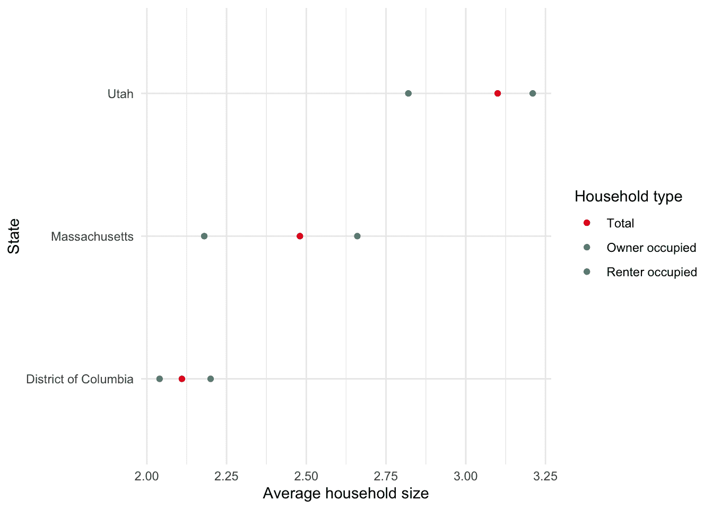

图 6.2：按家庭类型比较华盛顿特区、犹他州和马萨诸塞州的平均家庭规模

Walker (2022) 提供了关于使用 R 分析美国人口普查数据的更多细节。*  *#### 6.3.2.2 美国社区调查

美国处于令人羡慕的境地，通常有比使用人口普查更好的方法，也有比必须使用政府统计机构网站更好的途径。IPUMS 提供了对广泛数据集的访问权限，包括国际人口普查微观数据。就美国的具体情况而言，美国社区调查（ACS）是一项调查，其内容与许多人口普查中提出的问题具有可比性，但它是每年可用的，相比之下，人口普查数据在可用时可能已经相当过时。ACS 每年最终会收集到数百万条回复。尽管 ACS 的规模小于人口普查，但其优势在于数据获取更及时。我们通过 IPUMS 访问 ACS。

*巨人的肩膀* *史蒂文·拉格尔斯是明尼苏达大学的历史与人口研究特聘教授，负责 IPUMS 项目。他于 1984 年在宾夕法尼亚大学获得历史人口学博士学位后，被任命为明尼苏达大学助理教授，并于 1995 年晋升为正教授。IPUMS 的首次数据发布于 1993 年（Sobek and Ruggles 1999）。此后，该项目不断发展，现已包含来自许多国家的社会和经济数据。拉格尔斯于 2022 年获得了麦克阿瑟基金会奖学金。* *访问[IPUMS](https://ipums.org)，然后点击“IPUMS USA”，再点击“获取数据”。我们对一个样本感兴趣，所以点击“选择样本”。取消选择“每年的默认样本”，改为选择“2019 年 ACS”，然后点击“提交样本选择”（图 6.3 (a)）。

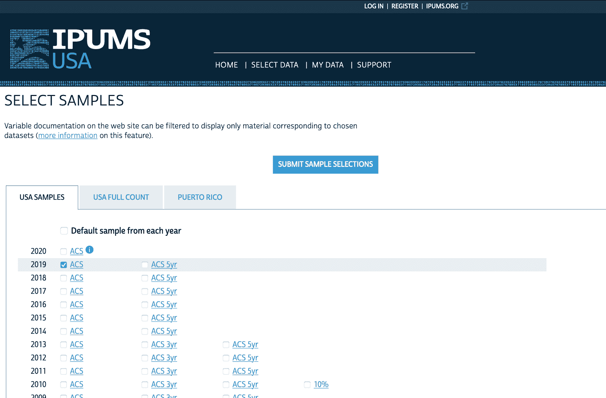

(a) 从 IPUMS USA 中选择样本并指定对 2019 年 ACS 感兴趣

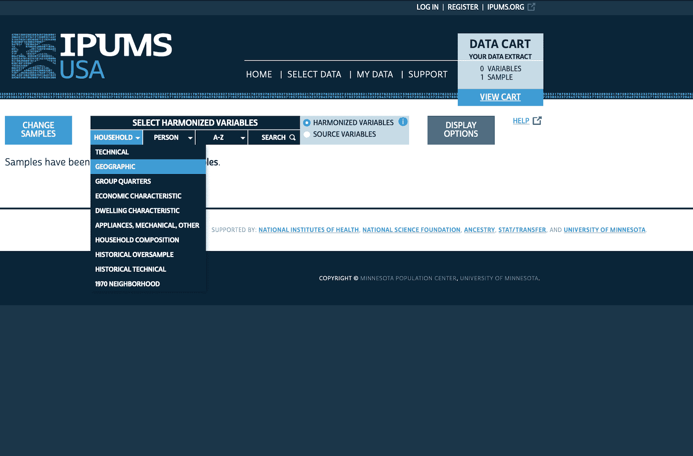

(b) 指定我们对州的数据感兴趣

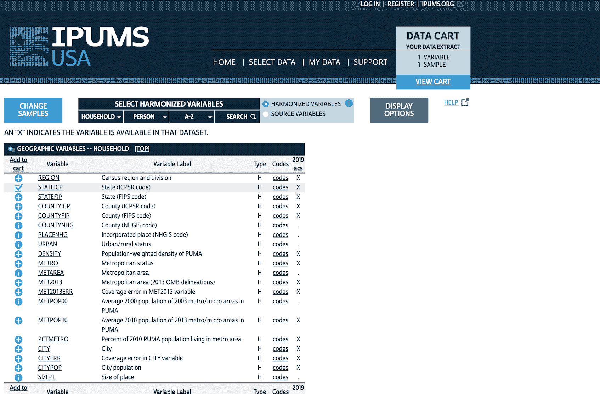

(c) 将 STATEICP 添加到购物车

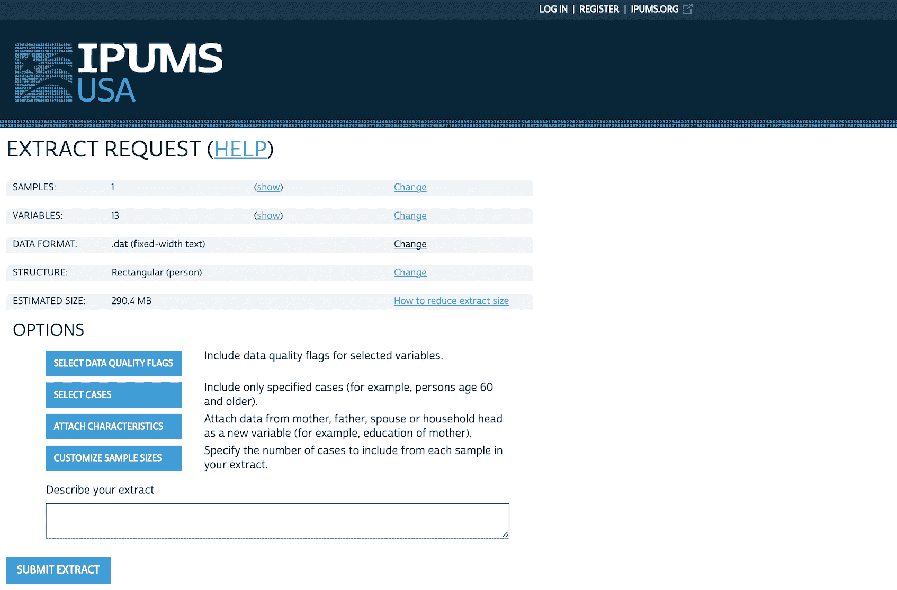

(d) 开始结账流程

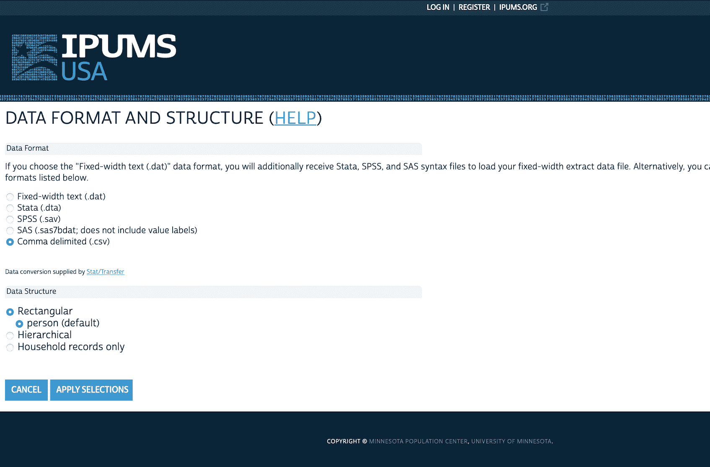

(e) 指定我们对.dta 文件感兴趣

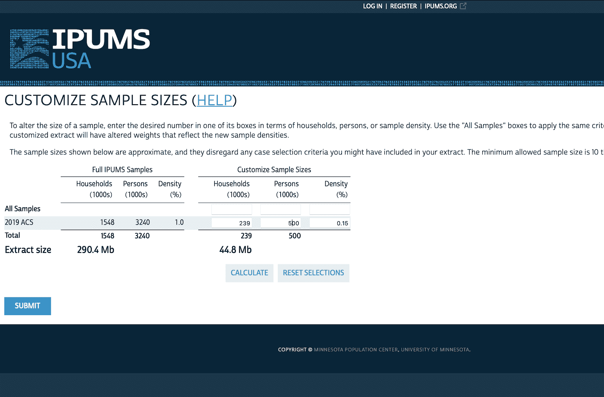

(f) 将样本量从三百万条回复减少到五十万条

图 6.3：从 IPUMS 获取数据所涉及步骤的概述

我们可能对基于州的数据感兴趣。我们将从查看“家庭”变量并选择“地理”开始（图 6.3 (b)）。我们通过点击加号将“STATEICP”添加到“购物车”，加号随后会变成勾选标记（图 6.3 (c)）。然后，我们可能对基于“个人”的数据感兴趣，例如“人口统计”变量，如“年龄”，我们应将其添加到购物车。我们还想要“性别”和“教育程度”（两者都在“个人”类别下）。

完成后，我们可以点击“查看购物车”，然后点击“创建数据提取”（图 6.3 (d)）。此时，我们可能想要更改两个方面：

1.  将“数据格式”从“.dat”更改为“.dta”（图 6.3 (e)）。

1.  自定义样本大小，因为我们可能不需要三百万个回应，可以将其更改为，例如，500,000（图 6.3 (f)）。

简要检查请求的维度。它不应超过大约 40MB。如果超过，请检查是否意外选择了不需要的变量，或者进一步减少观测值的数量。

最后，我们希望为提取的数据集包含一个描述性名称，例如“2023-05-15: 州、年龄、性别、教育程度”，它指定了我们进行提取的日期以及提取的内容。之后，我们可以点击“提交提取”。

系统将要求我们登录或创建账户，完成之后即可提交请求。IPUMS 会在提取数据准备就绪时发送电子邮件，之后我们可以下载它并以常规方式读入 R。我们假设数据集已本地保存为“usa_00015.dta”（您的数据集文件名可能略有不同）。

在使用此数据集时，引用它是至关重要的。例如，我们可以为 Ruggles 等人(2021)使用以下 BibTeX 条目。

```py
@misc{ipumsusa,
  author       = {Ruggles,  Steven and Flood,  Sarah and Foster,  Sophia and Goeken,  Ronald and Pacas,  Jose and Schouweiler,  Megan and Sobek,  Matthew},
  year         = 2021,
  title        = {IPUMS USA: Version 11.0},
  publisher    = {Minneapolis,  MN: IPUMS},
  doi          = {10.18128/d010.v11.0},
  url          = {https://usa.ipums.org},
  language     = {en},
}
```

我们将简要整理和准备这个数据集，因为我们将在第十六章中使用它。我们的代码基于 Mitrovski、Yang 和 Wankiewicz (2020)。

```py
ipums_extract <- read_dta("usa_00015.dta")

ipums_extract <- 
 ipums_extract |>
 select(stateicp, sex, age, educd) |>
 to_factor()

ipums_extract
```

*```py
# A tibble: 500,221 × 4
   stateicp sex    age   educd                                       
 * <fct>    <fct>  <fct> <fct>                                       
 1 alabama  male   77    grade 9                                     
 2 alabama  male   62    1 or more years of college credit, no degree
 3 alabama  male   25    ged or alternative credential               
 4 alabama  female 20    1 or more years of college credit, no degree
 5 alabama  male   37    1 or more years of college credit, no degree
 6 alabama  female 19    regular high school diploma                 
 7 alabama  female 67    regular high school diploma                 
 8 alabama  female 20    1 or more years of college credit, no degree
 9 alabama  male   66    grade 8                                     
10 alabama  male   58    regular high school diploma                 
# ℹ 500,211 more rows
```

```py
cleaned_ipums <-
 ipums_extract |>
 mutate(age = as.numeric(age)) |>
 filter(age >= 18) |>
 rename(gender = sex) |>
 mutate(
 age_group = case_when(
 age <= 29 ~ "18-29",
 age <= 44 ~ "30-44",
 age <= 59 ~ "45-59",
 age >= 60 ~ "60+",
 TRUE ~ "Trouble"
 ),
 education_level = case_when(
 educd %in% c(
 "nursery school, preschool", "kindergarten", "grade 1",
 "grade 2", "grade 3", "grade 4", "grade 5", "grade 6",
 "grade 7", "grade 8", "grade 9", "grade 10", "grade 11",
 "12th grade, no diploma", "regular high school diploma",
 "ged or alternative credential", "no schooling completed"
 ) ~ "High school or less",
 educd %in% c(
 "some college, but less than 1 year",
 "1 or more years of college credit, no degree"
 ) ~ "Some post sec",
 educd  %in% c("associate's degree, type not specified",
 "bachelor's degree") ~ "Post sec +",
 educd %in% c(
 "master's degree",
 "professional degree beyond a bachelor's degree",
 "doctoral degree"
 ) ~ "Grad degree",
 TRUE ~ "Trouble"
 )
 ) |>
 select(gender, age_group, education_level, stateicp) |>
 mutate(across(c(
 gender, stateicp, education_level, age_group),
 as_factor)) |>
 mutate(age_group =
 factor(age_group, levels = c("18-29", "30-44", "45-59", "60+")))

cleaned_ipums
```

*```py
# A tibble: 407,354 × 4
   gender age_group education_level     stateicp
   <fct>  <fct>     <fct>               <fct>   
 1 male   60+       High school or less alabama 
 2 male   60+       Some post sec       alabama 
 3 male   18-29     High school or less alabama 
 4 female 18-29     Some post sec       alabama 
 5 male   30-44     Some post sec       alabama 
 6 female 18-29     High school or less alabama 
 7 female 60+       High school or less alabama 
 8 female 18-29     Some post sec       alabama 
 9 male   60+       High school or less alabama 
10 male   45-59     High school or less alabama 
# ℹ 407,344 more rows
```*  *我们将在第十六章中使用这个数据集，因此我们会保存它。

```py
write_csv(x = cleaned_ipums,
 file = "cleaned_ipums.csv")
```

*我们也可以查看一些变量（图 6.4）。

```py
cleaned_ipums |>
 ggplot(mapping = aes(x = age_group, fill = gender)) +
 geom_bar(position = "dodge2") +
 theme_minimal() +
 labs(
 x = "Age-group of respondent",
 y = "Number of respondents",
 fill = "Education"
 ) +
 facet_wrap(vars(education_level)) +
 guides(x = guide_axis(angle = 90)) +
 theme(legend.position = "bottom") +
 scale_fill_brewer(palette = "Set1")
```

*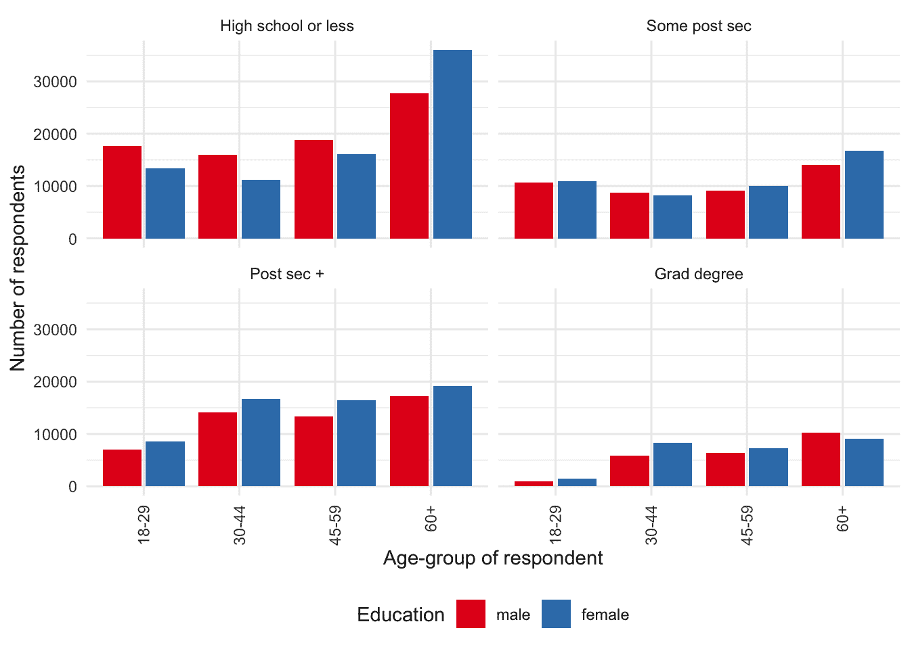

图 6.4：按年龄、性别和教育程度检查 IPUMS ACS 样本的计数*  *完整计数数据——即整个普查——可通过 IPUMS 获取，涵盖 1850 年至 1940 年间进行的美国人口普查，但 1890 年除外。1890 年的大部分普查记录在 1921 年的一场火灾中被毁。截至 1990 年的所有人口普查都有 1%的样本可用。ACS 数据从 2000 年开始提供。***********  ****## 6.4 抽样基础

统计学是数据叙事的关键，因为我们几乎不可能获得所有想要的数据。统计学家花费了大量时间和精力思考各种数据样本的特性，以及它们如何使我们能够推断更广泛人群的情况。

假设我们有一些数据。例如，某个特定的幼儿每晚都在 6:00pm 入睡。我们可能想知道这个就寝时间在所有幼儿中是否常见，或者我们的幼儿是否与众不同。如果我们只有一个幼儿，那么利用其就寝时间来谈论所有幼儿的能力将是有限的。

一种方法是与同样有幼儿的朋友交谈。然后再与朋友的朋友交谈。我们需要询问多少朋友和朋友的朋友，才能开始有信心谈论幼儿就寝时间的某些潜在真相？

Wu 和 Thompson（2020, 3）将统计学描述为“关于如何收集和分析数据，并对未知总体进行陈述和得出结论的科学”。这里的“总体”是统计学意义上的，指的是我们永远无法精确知晓的某个无限群体，但我们可以用随机变量的概率分布来描述其特征。我们将在第十二章更详细地讨论概率分布。Fisher（[[1925] 1928, 41](99-references.html#ref-fisherresearchworkers)）更进一步说道：

> [关于]一个或多个特征按频率分布的一个无限总体的概念，是所有统计工作的基础。从有限的经验中，$\dots$ 我们可以对我们抽取样本的那个无限假设总体有所了解，从而对我们结论将应用于的未来样本的可能性质有所了解。

另一种说法是，统计学涉及获取一些数据，并试图基于这些数据说出一些有意义的东西，尽管我们永远无法拥有全部数据。

三个关键术语是：

+   “目标总体”：我们希望谈论的所有项目的集合。

+   “抽样框”：一份我们可以从中获取数据的、来自目标总体的所有项目的列表。

+   “样本”：我们从抽样框中获取到数据的那些项目。

目标总体是一个大小为 $N$ 的、带有标签的项目的有限集合。例如，理论上我们可以给世界上所有的书加上标签：“书 1”、“书 2”、“书 3”、$\dots$、“书 $N$”。这里使用的术语“总体”与日常用法有所不同。例如，有时会听到处理人口普查数据的人说，他们不需要担心抽样问题，因为他们拥有全国的总人口。这是对术语的混淆，因为他们所拥有的是通过人口普查收集到的该国人口的样本。虽然人口普查的目标是获取每一个单位——如果实现了这一点，那么抽样误差问题就会小得多——但仍然存在许多其他问题。即使人口普查做得完美无缺，我们获得了目标总体中每个单位的数据，仍然存在问题，例如由于测量误差，以及它是在特定时间点的一个样本。Groves 和 Lyberg（2010）对总调查误差的演变进行了讨论。

正如我们所见，定义测量内容可能很困难，定义目标总体同样可能很困难。例如，假设我们被要求了解大学生的消费习惯。我们如何定义这个目标总体？如果某人既是学生又全职工作，那么他们是否属于这个总体？成年学生呢？他们可能有不同的责任。我们感兴趣的某些方面在一定程度上是有正式定义的，但这并非总是普遍认知。例如，一个地区被归类为城市还是农村，通常由国家的统计机构正式定义。但其他方面则不那么明确。Gelman、Hill 和 Vehtari（2020, 24）讨论了如何将某人归类为“吸烟者”的困难。如果一个 15 岁的孩子一生中吸过 100 支烟，那么我们需要以不同于从未吸烟者的方式对待他们。但如果一个 90 岁的老人一生中吸过 100 支烟，那么他们与一个从未吸烟的 90 岁老人可能不同吗？在什么年龄、吸多少支烟时，这些答案会发生变化？

假设我们想了解所有已出版书籍的书名。我们的目标总体是所有已出版的书籍。但我们几乎无法想象能获取到一本写于 19 世纪、但作者将其锁在抽屉里从未告知任何人的书籍的书名信息。一个可能的抽样框是美国国会图书馆在线目录中的所有书籍，另一个可能是谷歌数字化处理的 2500 万本书籍（Somers 2017）。我们的样本可能是通过[古登堡计划](https://www.gutenberg.org)可获取的数万本书籍，我们将在后续章节中使用这些数据。

再考虑一个例子，假设我们想谈论所有居住在德国的巴西人的态度。目标总体是所有居住在德国的巴西人。一个可能的信息来源是 Facebook，因此在这种情况下，抽样框可能是所有居住在德国且拥有 Facebook 账户的巴西人。然后，我们的样本可能是我们能收集到数据的、所有居住在德国且拥有 Facebook 账户的巴西人。目标总体和抽样框会有所不同，因为并非所有居住在德国的巴西人都有 Facebook 账户。而抽样框与样本也会不同，因为我们很可能无法收集到所有居住在德国且拥有 Facebook 账户的巴西人的数据。

### 6.4.1 都柏林与雷丁的抽样

为了更清晰，我们考虑两个例子：1798 年对爱尔兰都柏林居民人数的统计（Whitelaw 1805），以及 1912 年对英格兰雷丁工人阶级家庭的统计（Bowley 1913）。

#### 6.4.1.1 1798 年都柏林调查

1798 年，詹姆斯·怀特劳牧师对爱尔兰都柏林进行了一项人口普查。怀特劳（1805）描述了当时的人口估计差异很大。例如，当时伦敦的估计人口在 128,570 到 300,000 人之间。怀特劳期望都柏林市长能够强制每栋房子的负责人将住户名单贴在门上，然后他就可以直接使用这些名单。

相反，他发现这些名单“常常难以辨认，而且通常比实际人数少三分之一，甚至一半”。因此，他转而招募助手，他们挨家挨户进行自己的清点。由此得出的估计特别具有参考价值（图 6.5）。都柏林 1798 年的总人口估计为 182,370 人。

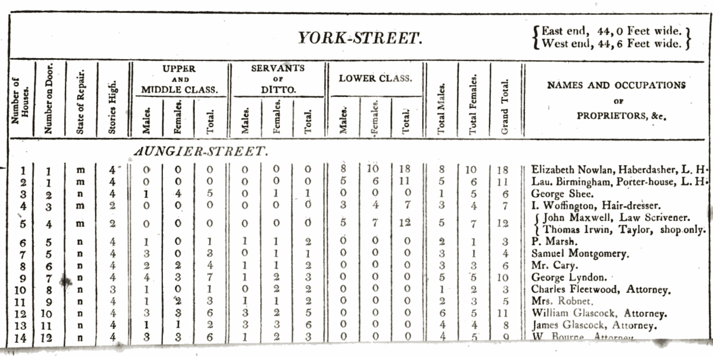

图 6.5：怀特劳于 1798 年发现的结果摘录

一个值得注意的方面是，怀特劳包含了关于阶级的信息。很难确定这是如何判定的，但它在数据收集中发挥了重要作用。怀特劳描述了“中上层阶级的房屋中总是有能够胜任[制作名单]任务的人”。但“在下层阶级中，即构成该市人口主体的群体，情况则大不相同”。很难看出怀特劳如何能在不进入上层和下层阶级房屋的情况下得知这一点。但同样难以想象怀特劳会进入上层阶级的房屋去清点他们的人数。可能需要不同的方法。

怀特劳试图构建一个都柏林居民的全样本，而没有使用太多统计工具来指导他的选择。我们现在来看第二个例子，该调查于 1912 年进行，他们开始使用我们今天仍在使用的抽样方法。

#### 6.4.1.2 1912 年雷丁工人阶级家庭调查

在怀特劳（1805）之后一百多年，鲍利（1913）对统计英格兰雷丁的工人阶级家庭数量产生了兴趣。鲍利采用以下程序选择样本（Bowley 1913, 672）：

> 当地目录中按街道字母顺序标记了每十栋建筑中的一栋，总计约 1,950 栋。其中约 300 栋被标记为商店、工厂、机构和非住宅建筑，约 300 栋被列入主要居民索引并相应标记。剩余的 1,350 栋为工人阶级住宅……决定每 20 栋中仅取一栋，舍弃中间十分之一的不完整信息。访查员被指示无论获取信息多么困难，或房屋类型如何，都不得用其他房屋替代标记的房屋。

鲍利（1913）表示他们成功收集了 622 户工人阶级家庭的信息。例如，他们能够估算每周支付的租金金额（图 6.6）。

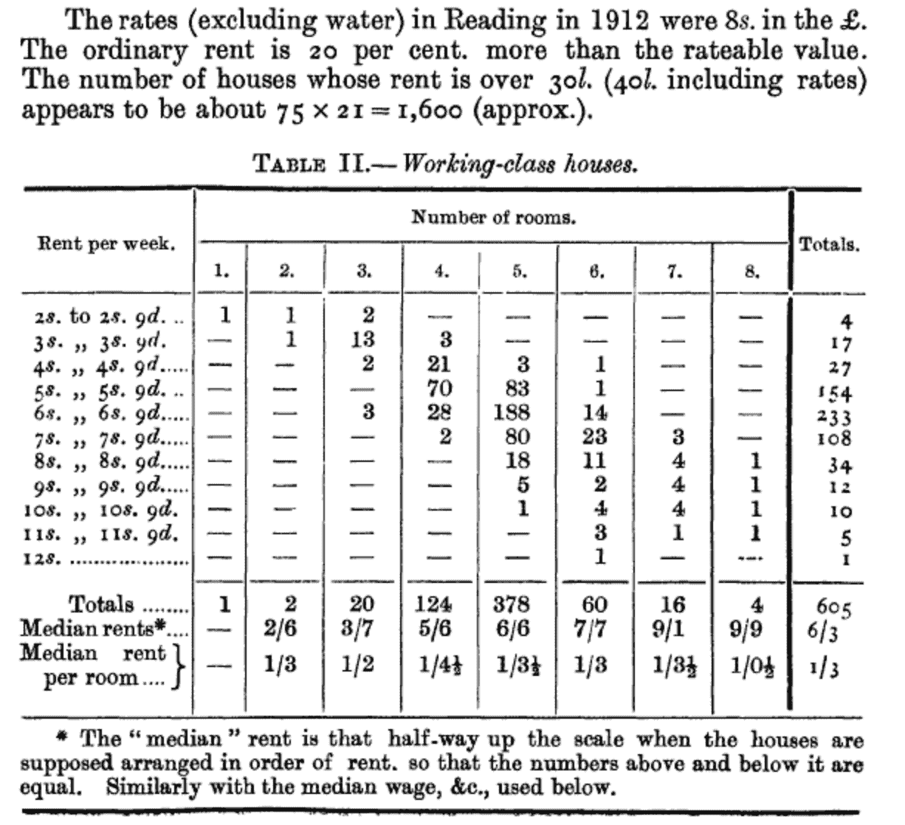

图 6.6：鲍利关于英格兰雷丁工人阶级支付租金调查结果摘录

随后，根据人口普查判断雷丁约有 18,000 户家庭，鲍利（1913）对样本应用了 21 倍的乘数，从而得出雷丁整体的估算值。确保最终估算合理的关键在于抽样是随机进行的。这正是鲍利（1913）坚持要求访查员必须前往实际选定的房屋，而不得用其他房屋替代的原因。

### 6.4.2 概率抽样

在确定目标总体和抽样框后，我们需要区分概率抽样与非概率抽样：

+   “概率抽样”：抽样框中的每个单位都有已知的被抽样机会，具体样本基于这些机会随机获得。每个单位被抽中的机会不一定相同。

+   “非概率抽样”：基于便利性、配额、判断或其他非随机过程从抽样框中抽取单位。

概率抽样与非概率抽样之间的区别往往是程度问题。例如，我们通常无法强制获取数据，因此受访者方面几乎总存在自愿成分。即使在不提供数据会受到处罚的情况下（如许多国家填写人口普查表），即使是政府也难以强制人们完整或如实填写——著名的例子是 2001 年新西兰人口普查中，超过百分之一的人口将其宗教列为“绝地武士”（Taylor 2015）。概率抽样最需要明确的关键方面是*不确定性的作用*。这使我们能够基于样本，以已知的误差量对总体进行推断。代价是概率抽样通常成本高昂且实施困难。

我们将考虑四种类型的概率抽样：

1.  简单随机抽样；

1.  系统抽样；

1.  分层抽样；以及

1.  整群。

为了使我们的讨论更加具体，采用 Lohr（[[1999] 2022, 27](99-references.html#ref-lohr)）也使用的方式，将数字 1 到 100 视为我们的目标总体可能会有所帮助。在简单随机抽样中，每个单位被包含的机会相同。在这种情况下，假设是 20%。这意味着我们预计样本中大约有 20 个单位，或者说大约是我们目标总体的五分之一。

```py
set.seed(853)

illustrative_sampling <- tibble(
 unit = 1:100,
 simple_random_sampling =
 sample(x = c("In", "Out"), 
 size = 100, 
 replace = TRUE, 
 prob = c(0.2, 0.8))
 )

illustrative_sampling |>
 count(simple_random_sampling)
```

*```py
# A tibble: 2 × 2
  simple_random_sampling     n
  <chr>                  <int>
1 In                        14
2 Out                       86
```*  *在系统抽样中，正如 Bowley（1913）所使用的那样，我们通过选择一个值进行，然后每隔五个单位抽样一次，以获得 20%的样本。首先，我们从 1 到 5 个单位中随机选择一个起点，比如 3。因此，每隔五个单位抽样意味着查看第 3 个、第 8 个、第 13 个，依此类推。

```py
set.seed(853)

starting_point <- sample(x = c(1:5), size = 1)

illustrative_sampling <-
 illustrative_sampling |>
 mutate(
 systematic_sampling =
 if_else(unit %in% seq.int(from = starting_point, to = 100, by = 5), 
 "In", 
 "Out"
 )
 )

illustrative_sampling |>
 count(systematic_sampling)
```

*```py
# A tibble: 2 × 2
  systematic_sampling     n
  <chr>               <int>
1 In                     20
2 Out                    80
```*  *当我们考虑我们的总体时，它通常会有一些分组。这可能像国家有州、省、县或统计区那样直接；大学有学院和系；人类有年龄组。分层结构是指我们可以将总体划分为互斥且共同穷尽的子总体，这些子总体称为“层”。

我们使用分层来帮助提高抽样的效率或调查的平衡性。例如，美国的人口约为 3.35 亿，其中加利福尼亚州约有 4000 万人，怀俄明州约有 50 万人。即使是 10,000 份回复的调查，预计也只有 15 份来自怀俄明州，这可能使得对怀俄明州的推断变得困难。我们可以使用分层来确保每个州，比如说，有 200 份回复。我们可以在每个州内使用随机抽样来选择将要收集数据的人。

在我们的例子中，我们将通过考虑我们的层是十位数来进行分层，也就是说，1 到 10 是一个层，11 到 20 是另一个层，依此类推。我们将在这些层内使用简单随机抽样，从每个层中选取两个单位。

```py
set.seed(853)

picked_in_strata <-
 illustrative_sampling |>
 mutate(strata = (unit - 1) %/% 10) |>
 slice_sample(n = 2, by = strata) |>
 pull(unit)

illustrative_sampling <-
 illustrative_sampling |>
 mutate(stratified_sampling = 
 if_else(unit %in% picked_in_strata, "In", "Out"))

illustrative_sampling |>
 count(stratified_sampling)
```

*```py
# A tibble: 2 × 2
  stratified_sampling     n
  <chr>               <int>
1 In                     20
2 Out                    80
```*  *最后，我们也可以利用数据集中可能存在的一些群组。与分层类似，群组也是集体穷尽且互斥的。我们之前提到的州、部门和年龄组等例子作为群组仍然有效。然而，我们对这些群体的意图是不同的。具体来说，对于整群抽样，我们并不打算从每个群组中收集数据，而对于分层抽样我们则会这样做。在分层抽样中，我们会考察每个层，并在每个层内进行简单随机抽样来选择样本。在整群抽样中，我们选择感兴趣的群组。然后，我们可以在选定的群组中对每个单位进行抽样，或者在选定的群组内使用简单随机抽样来选择单位。话虽如此，这种区别在实践中可能会变得不那么清晰，尤其是在事后。Rose 等人 (2006) 收集了 2005 年苏丹北达尔富尔的死亡率数据。他们发现整群抽样和系统抽样提供了相似的结果，并指出系统抽样对调查团队的培训要求较低。总的来说，整群抽样可能更便宜，因为它侧重于地理位置相近的地点。

在我们的例子中，我们将再次基于十位数对我们的图示进行整群。我们将使用简单随机抽样选择两个群组，并对这些群组使用全部单位。

```py
set.seed(853)

picked_clusters <-
 sample(x = c(0:9), size = 2)

illustrative_sampling <-
 illustrative_sampling |>
 mutate(
 cluster = (unit - 1) %/% 10,
 cluster_sampling = if_else(cluster %in% picked_clusters, "In", "Out")
 ) |>
 select(-cluster)

illustrative_sampling |>
 count(cluster_sampling)
```

*```py
# A tibble: 2 × 2
  cluster_sampling     n
  <chr>            <int>
1 In                  20
2 Out                 80
```*  *此时，我们可以说明我们方法之间的差异（图 6.7）。我们也可以从视觉上考虑，假设我们使用不同的方法从世界不同地区随机抽样（图 6.8）。

```py
new_labels <- c(
 simple_random_sampling = "Simple random sampling",
 systematic_sampling = "Systematic sampling",
 stratified_sampling = "Stratified sampling",
 cluster_sampling = "Cluster sampling"
)

illustrative_sampling_long <-
 illustrative_sampling |>
 pivot_longer(
 cols = names(new_labels), names_to = "sampling_method",
 values_to = "in_sample"
 ) |>
 mutate(sampling_method = 
 factor(sampling_method,levels = names(new_labels)))

illustrative_sampling_long |>
 filter(in_sample == "In") |>
 ggplot(aes(x = unit, y = in_sample)) +
 geom_point() +
 facet_wrap(vars(sampling_method), dir = "v", ncol = 1, 
 labeller = labeller(sampling_method = new_labels)
 ) +
 theme_minimal() +
 labs(x = "Unit", y = "Is included in sample") +
 theme(axis.text.y = element_blank())
```

*

图 6.7：简单随机抽样、系统抽样、分层抽样和整群抽样在数字 1 到 100 上的示例说明* *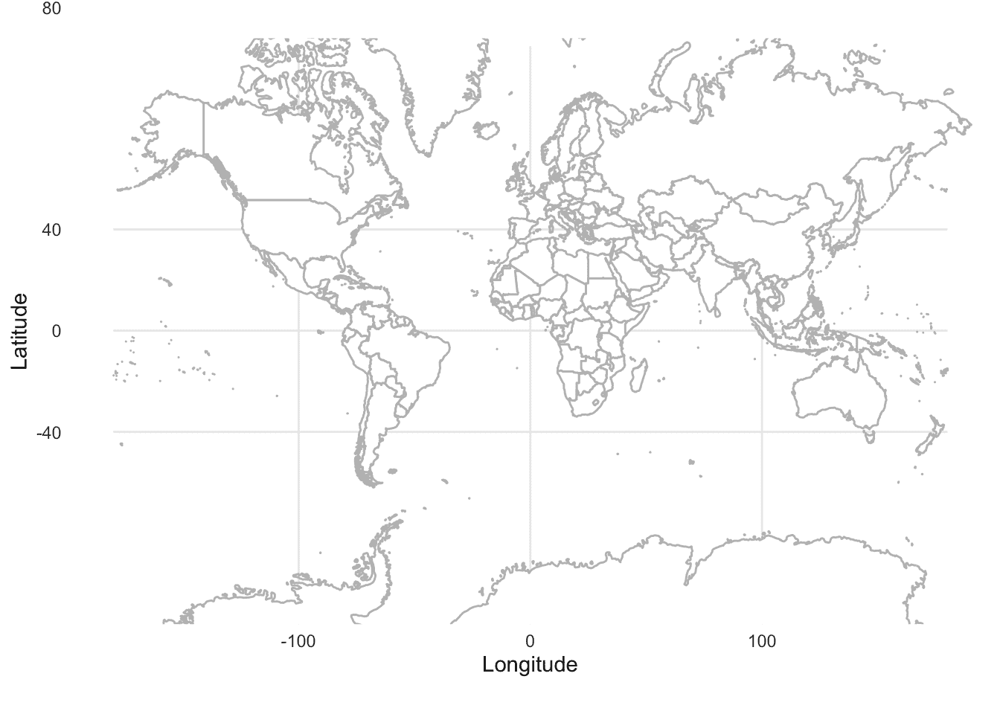

(a) 世界地图

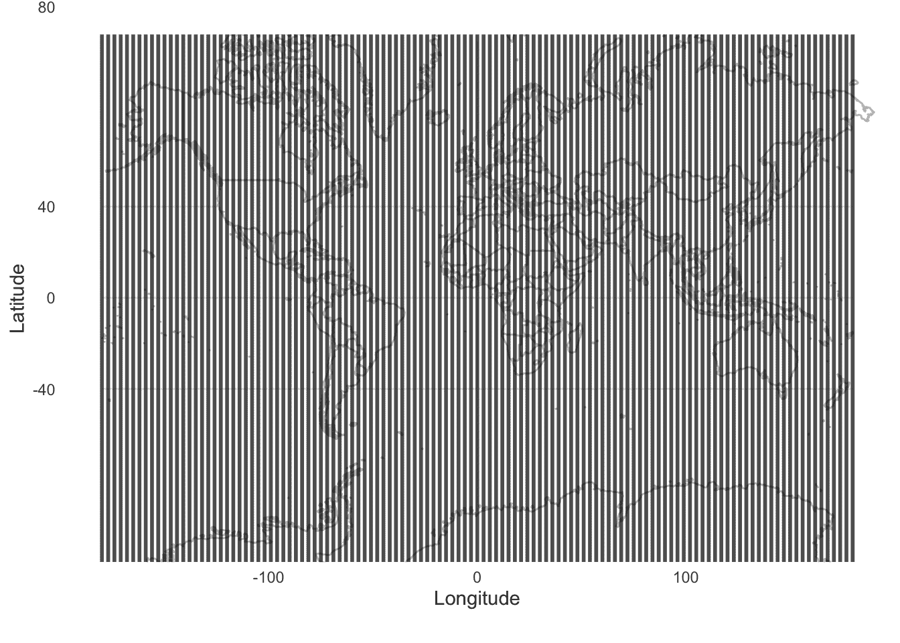

(b) 系统抽样


(c) 分层抽样

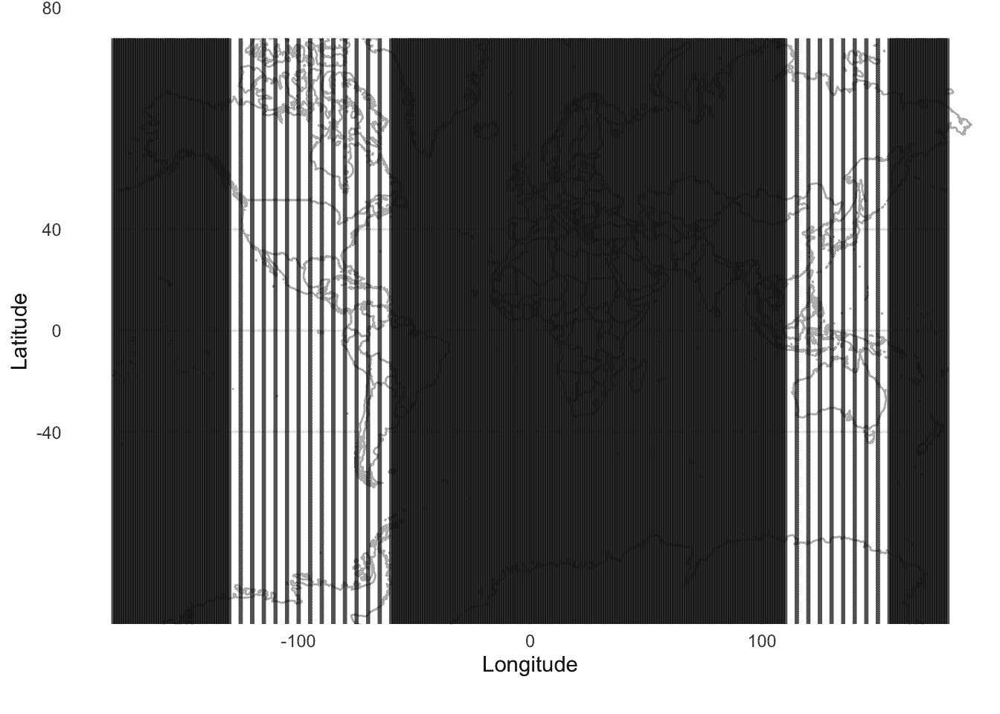

(d) 整群抽样

图 6.8：简单随机抽样、系统抽样、分层抽样和整群抽样在世界不同地区的示例说明

图 6.7 和 图 6.8 说明了不同方法之间的权衡，以及它们各自适用的不同方式。例如，我们看到在 图 6.8 中，系统抽样提供了世界的有用图景，但如果我们只对陆地感兴趣，我们仍然会得到许多信息量不大的样本。分层抽样和整群抽样使我们能够专注于感兴趣的方面，但代价是失去了更全面的图景。

理解这些方法之间差异的一个好方法是在实践中考量它们。Au (2022) 提供了一些例子。其中一个特别涉及猛禽计数，其中 Fuller 和 Mosher (1987) 比较了简单随机抽样、分层抽样、系统抽样和整群抽样，以及其他注意事项。

#### 6.4.2.1 概率样本的推断

确定样本后，我们通常希望用它来对总体做出论断。Neyman (1934, 561) 更进一步指出：“……代表性方法的问题*尤其*是统计估计的问题。我们对某个总体（记为 $\pi$）的特征感兴趣，而这个总体要么不可能，要么至少很难进行详细研究，我们试图基于样本的判断来估计这些特征。”

具体来说，我们通常会有兴趣估计总体均值和方差。我们在第四章中介绍了估计量、估计目标和估计值的概念。我们可以构建一个估计量来估计总体均值和方差。例如，如果我们使用样本量为 $n$ 的简单随机抽样，那么样本均值和方差（我们将在第十二章中再次讨论）可以被构建出来，以产生对总体均值和方差的估计：

$$ \begin{aligned} \hat{\mu} &= \frac{1}{n} \times \sum_{i = 1}^{n}x_i\\ \hat{\sigma}² &= \frac{1}{n-1} \times \sum_{i = 1}^{n}\left(x_i - \hat{\mu}\right)² \end{aligned} $$

我们可以使用目前已有的方法来模拟各种类型的调查设计。也有一些软件包可以提供帮助，包括 `DeclareDesign` (Blair 等人 2019) 和 `survey` (Lumley 2020)。

当我们有兴趣使用样本中的计数来推断目标总体的某个总计数时，可以使用按比例放大估计值。我们在 Bowley (1913) 中看到了这一点，其中样本中的家庭数量与人口普查已知的家庭数量之比为 21，这一信息被用来放大样本。

举一个例子，也许我们对从 1 到 100 的数字总和感兴趣。回到我们说明从这些数字中抽样的不同方式的例子，我们知道样本量为 20，因此需要放大五倍（表 6.2）。

表 6.2：每个样本中数字的总和，以及隐含的总体总和

| 抽样方法 | 样本总和 | 隐含的总体总和 |
| --- | --- | --- |
| 系统抽样 | 970 | 4,850 |
| 分层抽样 | 979 | 4,895 |
| 整群抽样 | 910 | 4,550 |
| 简单随机抽样 | 840 | 4,200 |

人口的实际总和是 5,050。¹ 虽然具体细节因样本而异，但我们基于按比例推算得到的人口总和估计值很有启发性。最接近的是分层抽样，紧随其后的是系统抽样。整群抽样偏差略高于 10%，而简单随机抽样偏差稍大。要接近真实总和，关键在于我们的抽样方法能尽可能多地包含较高的数值。因此，分层抽样和系统抽样都确保了我们能从较大的数值中获取结果，表现得特别好。整群抽样和简单随机抽样的表现则取决于所选的特定群组和单位。在这种情况下，分层抽样和系统抽样确保了我们估计的人口总和不会与实际人口总和相差太远。这里，我们可以思考这对构建和评估指标（如 GDP 和其他基于求和构建的指标）的影响，以及不同层因其规模大小对总和产生的影响。

这种方法历史悠久。例如，斯蒂格勒（1986, 163）描述了到 1826 年，十九世纪的天文学家阿道夫·凯特勒如何参与了计划进行人口普查的统计局工作。凯特勒认为出生和死亡情况众所周知，但移民情况却不清楚。他提出了一种基于特定地理区域计数的方法，然后可以按比例推算到全国。对该计划的批评集中在选择合适地理区域的难度上，这在我们之前关于整群抽样的例子中也曾看到。这种批评是合理的，即使在今天，大约 200 年后，我们仍应牢记这一点（斯蒂格勒 1986）：

> 他[凯特勒]敏锐地意识到，有无数因素可能影响他希望测量的量，而他缺乏信息来判断哪些因素确实重要。他……不愿意将他认为有理由相信非同质的数据归为一类……意识到无数潜在的重要因素，却不知道哪些真正重要以及它们如何产生影响，这常常会让人担心最坏的情况……他[凯特勒]无法让自己将大片区域视为同质的，[因此]他无法认为单一比率适用于大面积区域。

当我们知道总体总数时，我们可以进行这种按比例推算，但如果我们不知道这个总数，或者对该方法的精确性有所顾虑，那么我们可能会使用比率估计量。

比率估计量在 1802 年由皮埃尔-西蒙·拉普拉斯首次使用，用于估算法国总人口。该方法基于全国已知的登记出生人数与仅部分市镇已知的居民人数之间的比率。他计算了三个市镇的比率，然后根据全国出生总数进行缩放，从而得出法国人口的估计值（[Lohr [1999] 2022](99-references.html#ref-lohr)）。

某个总体参数的比率估计量是两个均值的比值。例如，假设我们知道一个幼儿在 30 天内的总睡眠时长，并且我们想知道在同一时期内父母的睡眠时长。我们可能掌握一些关于幼儿夜间睡眠时长 $x$ 及其父母夜间睡眠时长 $y$ 在 30 天内的信息。

```py
set.seed(853)

sleep <-
 tibble(
 toddler_sleep = sample(x = c(2:14), size = 30, replace = TRUE),
 difference = sample(x = c(0:3), size = 30, replace = TRUE),
 parent_sleep = toddler_sleep - difference
 ) |>
 select(toddler_sleep, parent_sleep, difference)

sleep
```

*```py
# A tibble: 30 × 3
   toddler_sleep parent_sleep difference
           <int>        <int>      <int>
 1            10            9          1
 2            11           11          0
 3            14           12          2
 4             2            0          2
 5             6            5          1
 6            14           12          2
 7             3            3          0
 8             5            3          2
 9             4            1          3
10             4            3          1
# ℹ 20 more rows
```*  *各平均值不同（表 6.3）。

表 6.3：幼儿平均睡眠时长与父母平均睡眠时长的比较

| 幼儿平均睡眠时长 | 父母平均睡眠时长 |
| --- | --- |
| 6.17 | 4.9 |

父母睡眠时长与幼儿睡眠时长的比值为：

$$\hat{B} = \frac{\bar{y}}{\bar{x}} = \frac{4.9}{6.17} \approx 0.8.$$

已知该幼儿在 30 天内睡了 185 小时，我们对父母睡眠时长的估计值为 $185 \times 0.8 = 148$。结果证明这几乎完全正确，因为实际总和是 147。在这个例子中，我们本不需要进行估计，因为可以对数据进行求和，但假设另一组父母只记录了幼儿的睡眠时长，而没有记录他们自己的睡眠时长，那么我们就可以利用这个比率来估算他们的睡眠时长。

比率估计量的一种常用变体是捕获-再捕获法，这是数据收集领域的瑰宝之一。该方法常用于生态学领域，因为我们深知无法收集所有动物的数据。研究人员会先捕获一批样本进行标记并放归，经过一段时间后再次捕获新样本。假设时间间隔足够让首批标记动物重新融入种群，但又不会因出生、死亡和迁徙等因素产生难以估量的影响，即可通过这些数据估算种群规模。关键在于第二次捕获样本中被重新捕获个体的比例，该比例可用于推算整体种群数量。有趣的是，在 1990 年代，由于对方法论的担忧，美国曾就是否采用捕获-再捕获模型调整人口普查数据引发激烈争论。Breiman（1994）与 Gleick（1990）的论述系统梳理了当时的争议焦点、人口普查的普遍性问题，以及捕获-再捕获方法的重要背景。近年来该方法更与网络爬虫技术结合，应用于调查框架构建（Hyman, Sartore, and Young 2021），我们将在第七章探讨此应用。******  ***### 6.4.3 非概率抽样

尽管承认这是一个连续谱系，但统计学大多建立在概率抽样的基础上。然而现代抽样实践中非概率抽样占据相当比重。一种常见做法是通过社交媒体等广告渠道招募受访者小组（可能提供报酬），随后根据需求向该小组发放各类调查问卷。但请思考这种方式的潜在影响：例如，哪些人群更可能响应此类广告？世界首富会参与吗？极端年轻或年长群体是否可能响应？某些情况下可以进行普查，政府通常每五到十年开展一次。但之所以通常由政府主导，是因为普查成本高昂、耗时费力，且由于需要兼顾普遍性，其准确性有时反而未达预期。

非概率样本发挥着重要作用，因为它们通常比概率样本更便宜、获取更快。Beaumont（2020）描述了支持非概率样本的多种因素，包括概率样本响应率的下降以及对实时统计数据需求的增加。此外，正如我们所讨论的，概率样本与非概率样本之间的区别有时是程度上的，而非绝对的二分法。只要清楚权衡利弊并确保透明度，非概率样本对于某些任务是合理且合适的（Baker et al. 2013）。低响应率意味着真正的概率样本很少见，因此认真应对非概率抽样的影响至关重要。

便利抽样涉及从易于接触的样本中收集数据。例如，人们经常请朋友和家人填写问卷，以便在大规模分发前进行测试。如果我们分析这样的样本，那么我们很可能正在使用便利抽样。

便利抽样的主要问题在于它是否能够代表更广泛的人群。此外，还存在棘手的伦理考量，通常缺乏匿名性可能进一步导致结果偏差。另一方面，这种方法可以低成本地快速了解情况。

配额抽样发生在我们有分层的情况下，但未在这些层内使用随机抽样来选择单位。例如，如果我们再次按州对美国进行分层，但随后并未确保怀俄明州的每个人都有机会被选中进入该层，而只是选择了杰克逊霍尔的人。这种方法有一些优势，尤其是在速度和成本方面，但由此产生的样本可能以各种方式存在偏差。这并非说它们毫无价值。例如，加拿大银行运行一项关于商品和服务支付方式的非概率调查。他们使用配额抽样和各种调整方法。这种非概率抽样的使用使他们能够有意识地关注人群中难以触及的方面（H. Chen, Felt, and Henry 2018）。

俗话说，物以类聚，人以群分。我们可以在抽样中利用这一点。尽管 Handcock 和 Gile (2011) 描述了在此之前该方法的多种用途，并且在多学科工作中界定归属通常很困难，但滚雪球抽样由 Goodman (1961) 给出了很好的定义。遵循 Goodman (1961) 的方法，进行滚雪球抽样时，我们首先从抽样框中抽取一个随机样本。要求其中每个人提名 $k$ 个同样在样本总体中但不在初始抽取名单中的其他人，这些人构成“第一阶段”。然后，同样要求第一阶段中的每个人提名 $k$ 个同样在样本总体中，但不在随机抽取名单或第一阶段名单中的其他人，这些人构成“第二阶段”。我们需要预先指定阶段数 $s$ 以及 $k$ 值。

受访者驱动抽样由 Heckathorn (1997) 提出，旨在关注隐藏人群，即那些：

1.  没有抽样框；并且

1.  被知晓属于抽样总体可能会产生负面影响。

例如，我们可以想象在一些国家，对诸如同性恋人群或有过堕胎经历的人群进行抽样会很困难。受访者驱动抽样在两个方面不同于滚雪球抽样：

1.  除了像滚雪球抽样那样，受访者会因自己的回答获得报酬外，受访者驱动抽样通常还涉及为招募他人提供报酬。

1.  受访者不被要求向调查者提供他人的信息，而是将他们招募到研究中。样本的选择不是来自抽样框，而是来自已进入样本者的社交网络 (Salganik and Heckathorn 2004)。***  ***## 6.5 练习

### 实践

1.  *(规划)* 考虑以下场景：*一年中的每一天，两个人——马克和劳伦——记录他们各自所在的两个不同州当天的降雪量。* 请草拟数据集可能的样子，然后草拟一个可以展示所有观测值的图表。

1.  *(模拟)* 请进一步考虑所描述的场景，并在每个变量相互独立的情况下模拟该情况。然后基于模拟数据编写五个测试。

1.  *(获取)* 请获取一些关于降雪量的实际数据，并添加一个脚本，将模拟测试更新为这些实际数据。

1.  *(探索)* 使用真实数据构建图表和表格。

1.  *(沟通)* 请撰写一些文字来配合图表和表格。将代码适当地分离到 `R` 文件和 Quarto 文档中。提交一个高质量 GitHub 仓库的链接。

### 测验

1.  将现实世界中的某些现象转化为数据集时面临的一个挑战是什么？（单选）

    1.  数据存储解决方案的高昂成本。

    1.  无偏数据的过度丰富。

    1.  可用数据收集工具的缺乏。

    1.  决定测量什么以及如何适当地测量。

1.  参考 Daston（2000），请讨论 GDP 和人口数量是发明出来的还是被发现的？

1.  根据计量学，以下哪项最能定义测量（单选）？

    1.  使用预测模型估计未知变量。

    1.  数据分析中统计显著性的计算。

    1.  任意给对象分配数字的行为。

    1.  通过实验获取可归因于现象、物体或物质特性的量值的过程。

1.  请用至少两段话，以你自己的语言定义测量误差，并提供一个你亲身经历的例子。

1.  参考 Gargiulo（2022），请讨论现实世界中测量的挑战。

1.  测量的有效性指的是什么（单选）？

    1.  测量结果的统计显著性。

    1.  测量准确反映其预期测量概念的程度。

    1.  数据收集的速度。

    1.  测量可被复现的精确度。

1.  Kennedy 等人（2022）如何定义伦理（单选）？

    1.  尊重个体调查受访者的观点和尊严。

    1.  生成总体及感兴趣子群体的估计值。

    1.  仅在复杂程序能发挥某些有用功能时才使用它们。

1.  以下哪项最能描述测量误差（单选）？

    1.  观测值与所测量对象的真实值之间的差异。

    1.  仅在数据非正态分布时出现的误差。

    1.  一种可以通过更好的仪器消除的误差。

    1.  为误导分析而故意篡改数据。

1.  什么是删失数据（单选）？

    1.  已损坏且无法读取的数据。

    1.  因隐私问题而被故意省略的数据。

    1.  观测值仅部分已知的数据。

    1.  从未经授权的来源收集的数据。

1.  截断数据与删失数据有何不同（单选）？

    1.  截断数据处理高估问题，删失数据处理低估问题。

    1.  在截断数据中，某些值从数据集中被省略；而在删失数据中，数值部分已知但不完整。

    1.  截断数据比删失数据的准确性更低。

1.  完全随机缺失（MCAR）是什么意思（单选）？

    1.  可以使用统计模型轻松预测的缺失数据。

    1.  缺失数据的缺失可能性与未观测数据相关。

    1.  缺失数据的缺失可能性与观测数据相关。

    1.  缺失数据的缺失是完全随机的，与任何数据（无论是观测到的还是未观测到的）都无关。

1.  为什么人口普查被认为是至关重要的数据集（单选）？

    1.  它们不经常进行，因此具有新颖信息。

    1.  它们旨在收集总体中每个单位的数据，提供为分析设计的全面数据集。

    1.  它们是提供独家见解的私人数据集。

    1.  它们完全专注于农业数据，这对经济规划至关重要。

1.  根据加拿大统计局（2023），为什么要评估人口普查数据的质量（单选）？

    1.  降低未来人口普查的成本。

    1.  限制数据传播。

    1.  改善数据隐私。

    1.  确保人口普查数据可靠并满足用户需求。

1.  根据加拿大统计局（2023），抽样误差的主要来源是什么（单选）？

    1.  个人的无回答。

    1.  使用样本而非总体。

    1.  处理过程中的数据捕获错误。

    1.  住宅的错误分类。

1.  根据加拿大统计局（2023），当人员或住宅被遗漏或重复计数时，会发生哪种误差（单选）？

    1.  无回答误差。

    1.  覆盖误差。

    1.  抽样误差。

    1.  处理误差。

1.  根据加拿大统计局（2023），哪种误差与受访者或普查员误解或误报有关（单选）？

    1.  抽样误差。

    1.  回答误差。

    1.  处理误差。

    1.  覆盖误差。

1.  根据加拿大统计局（2023），住宅分类调查（DCS）的目的是什么（单选）？

    1.  改进长问卷。

    1.  对新住宅开发项目进行分类。

    1.  收集家庭收入数据。

    1.  研究住宅的分类错误。

1.  根据加拿大统计局（2023），人口普查覆盖不足研究（CUS）旨在估计什么（单选）？

    1.  人口普查中遗漏的人数。

    1.  抽样误差的方差。

    1.  缺失数据的插补率。

    1.  长问卷的无回答率。

1.  根据加拿大统计局（2023），人口普查重复覆盖研究（COS）识别什么（单选）？

    1.  被错误分类的住宅。

    1.  个人被重复计数的情况。

    1.  被人口普查遗漏的人员。

    1.  处理过程中的无效数据条目。

1.  根据加拿大统计局（2023），人口普查的总体无回答（TNR）率是如何定义的（单选）？

    1.  人口普查数据中插补值的数量。

    1.  人口普查中错误回答的百分比。

    1.  部分回答的问卷百分比。

    1.  问卷内容未达到最低要求的住宅比例。

1.  参考 W. Chen 等人 (2019) 和 Martı́nez (2022)，你认为我们可以在多大程度上信任政府统计数据？请至少写一页，并在回答中至少比较两个政府。

1.  2021 年加拿大人口普查首先询问：“此人出生时的性别是什么？性别指的是出生时指定的性别。男/女”，然后询问：“此人的性别是什么？指的是当前性别，可能与出生时指定的性别不同，也可能与法律文件上注明的不同。男/女/或请具体说明此人的性别（留有打字或手写答案的空间）”。参考加拿大统计局 (2020)，请讨论你认为人口普查以这种方式进行在多大程度上是合适的。如果你更熟悉其他国家的情况，也欢迎讨论该国的案例。

1.  请使用 IPUMS 访问 2020 年 ACS。利用编码手册，在加利福尼亚州（STATEICP）有多少受访者的最高教育程度（EDUC）是博士学位（单选）？

    1.  2,007

    1.  732

    1.  5,765

    1.  4,684

1.  请使用 IPUMS 访问 1940 年 1% 样本。利用编码手册，在加利福尼亚州（STATEICP）有多少受访者的最高教育程度（EDUC）是大学 5 年及以上（单选）？

    1.  532

    1.  1,056

    1.  904

    1.  1,789

1.  参考 Dean (2022)，请讨论概率抽样与非概率抽样的区别。

1.  什么是目标总体（单选）？

    1.  我们希望得出结论的整个群体。

    1.  可以从中抽取样本的目标总体中所有单位的列表。

    1.  易于进行抽样的人口子集。

    1.  同意参与研究的个人名单。

1.  什么是抽样框（单选）？

    1.  用于从受访者那里收集数据的方法。

    1.  可以从中抽取样本的目标总体中所有单位的列表。

    1.  数据收集发生的时间段。

    1.  研究者希望得出结论的整个群体。

1.  概率抽样与非概率抽样之间有什么区别（单选）？

    1.  概率抽样不需要抽样框。

    1.  概率抽样总是比非概率抽样更具成本效益。

    1.  在概率抽样中，每个单位都有一个已知的被选中机会，而在非概率抽样中，选择并非基于概率。

    1.  非概率抽样方法比概率抽样方法更准确。

1.  参考 Beaumont (2020)，你认为概率调查会消失吗？为什么或为什么不（请写一到两段）？

1.  哪种抽样方法涉及选择单位，使得抽样框中的每个观察值都有相等的被选中机会（单选）？

    1.  系统抽样。

    1.  分层抽样。

    1.  简单随机抽样。

    1.  整群抽样。

1.  在哪种抽样方法中，第一个单位是随机选择的，后续单位按固定间隔选择（选择一项）？

    1.  系统抽样。

    1.  方便抽样。

    1.  分层抽样。

    1.  整群抽样。

1.  分层抽样的特点是什么（选择一项）？

    1.  将总体划分为若干子组，并从每个子组中随机抽取样本。

    1.  参与者通过其网络招募其他参与者。

    1.  随机选择整个集群，并对其中所有单位进行抽样。

    1.  通过随机选择整个群体或集群，然后对其中的所有或部分单位进行抽样。

1.  在整群抽样中，单位是如何被选择的（选择一项）？

    1.  将总体划分为若干子组，并从每个子组中随机抽取样本。

    1.  通过随机选择整个群体或集群，然后对其中的所有或部分单位进行抽样。

    1.  通过从列表中选取每第 n 个单位。

    1.  通过根据特定配额选择单位。

1.  请列举一些你可能希望使用整群抽样的原因（选择所有适用项）？

    1.  在子群体回答方面的平衡性。

    1.  行政便利性。

    1.  资金效率。

1.  请考虑整数 [1:100]。如果我只想基于一个仅包含 10 个样本的抽样方法来估计中位数，我会选择哪种方法（选择一项）？

    1.  简单随机抽样。

    1.  系统抽样。

    1.  整群抽样。

    1.  分层抽样。

1.  编写 `R` 代码，考虑数字 1 到 100，并基于一个包含 20 个数字的整群样本来估计均值。将此代码重新运行一百次，每次记录均值的估计值，然后绘制直方图。你注意到图表有什么特点？添加一段解释和讨论。

1.  根据 Bowley (1913)，雷丁市家庭研究的样本是如何选取的（选择一项）？

    1.  通过随机选择街道。

    1.  根据收入选择家庭。

    1.  通过在当地名录中每十栋建筑标记一栋。

    1.  通过采访每第五户家庭。

1.  Bowley (1913) 使用了哪种抽样方法（选择一项）？

    1.  整群抽样。

    1.  简单随机抽样。

    1.  分层抽样。

    1.  系统抽样。

1.  根据 Bowley (1913)，基于样本数据，采用了哪种方法来为整个雷丁市提供估计值（选择一项）？

    1.  使用按比例的人口普查数据。

    1.  计算收入中位数水平。

    1.  应用一个乘数。

1.  根据 Bowley (1913)，从雷丁市工人阶级家庭收集租金和收入数据的方法是什么（选择一项）？

    1.  通过采访房东。

    1.  通过查阅人口普查记录。

    1.  通过收集税务记录数据。

    1.  通过志愿者对家庭进行访谈。

1.  请讨论 Bowley (1913, 673) 的以下陈述：“对于不熟悉抽样过程的人来说，21 分之 1 的比例对于任何结论来说可能显得太小，并且无论如何只能得到一个模糊的概率。……[但是] 如果确保了随机抽样的条件（正如本研究相信的那样），样本的精确度不取决于其与总体的比例，而取决于其自身的规模。”

1.  根据 Neyman (1934)，分层抽样的主要目标是什么（选择一个）？

    1.  减少对随机化的需求。

    1.  确保总体的所有层都被代表。

    1.  增加样本选择中的偏差。

1.  Neyman (1934) 的主要关注点是什么（选择一个）？

    1.  简单随机样本的引入。

    1.  配额抽样技术的发展。

    1.  消除样本选择中的所有偏差。

    1.  分层抽样与非概率抽样之间的区别。

1.  根据 Neyman (1934)，分层抽样相对于简单随机抽样的一个优势是什么（选择一个）？

    1.  它消除了对抽样框的需求。

    1.  它需要更少的样本。

    1.  它更便宜。

    1.  它可能会提高估计的精确度。

1.  根据 Neyman (1934, sec. V)，哪种方法允许对总体的平均集体特征进行一致估计，无论总体具有何种属性（选择一个）？

    1.  随机抽样。

    1.  目的性抽样。

1.  以下哪项最能描述便利抽样（选择一个）？

    1.  确保每个子群按比例被代表的抽样方法。

    1.  基于随机数选择参与者。

    1.  选择最容易接触到的参与者。

    1.  使用算法选择样本。

1.  滚雪球抽样通常用于什么目的（选择一个）？

    1.  使用全面抽样框研究定义明确的总体。

    1.  通过现有参与者招募未来参与者来研究隐藏或难以接触的总体。

    1.  确保不同人口群体之间的平等代表性。

    1.  使用捕获-再捕获方法估计总体规模。

1.  什么是受访者驱动抽样（选择一个）？

    1.  一种使用自动化系统选择受访者的抽样技术。

    1.  一种非概率抽样形式，受访者推荐其他受访者，常用于隐藏总体，并包含招募激励。

    1.  一种随机抽样类型，受访者基于概率机制被选择。

    1.  一种依赖受访者自愿参与、无需任何招募努力的抽样方法。

1.  假设我们对加拿大的每个人进行了一项调查，询问了年龄、生理性别和社会性别。你的朋友声称无需担心不确定性，“因为我们拥有整个总体”。你的朋友是对还是错，为什么？

1.  参考孟（2018），请讨论以下主张：“当你有一百万个回复时，你无需担心随机化问题”。

1.  假设你在一家银行工作，他们已有一个数据集供你使用。在决定该数据是否对你有用时，你应该探讨哪些问题？

### 课堂活动

+   `usethis::git_vaccinate()` 有什么作用？

+   反思附录 A 中阿米亚·斯里尼瓦桑的引述，并围绕智力的测量展开讨论。

+   为什么在模拟时使用 `set.seed()` 至关重要？

+   讨论幸福的测量在多大程度上是有效的，务必在讨论中定义该术语。

+   讨论美的测量在多大程度上是可靠的，务必在讨论中定义该术语。

+   为什么 A 国从 B 国进口某种商品的计量数据，可能不等于 B 国向 A 国出口同种商品的计量数据？请详细讨论，并由此引出你对另一项测量的质疑。

+   请就表 6.4 讨论缺失数据问题。

表 6.4：各乐队成员及其出生年份

| Band | Person | Year of birth |
| --- | --- | --- |
| Beatles | Ringo Starr | 1940 |
| Beatles | John Lennon | 1940 |
| Beatles | George Harrison | NA |
| Spice Girls | Victoria Beckham | 1975 |
| Spice Girls | Mel B | 1975 |
| Spice Girls | NA | 1976 |
| NA | Mel C | 1974 |
| Girls' Generation | Taeyeon | 1989 |
| Girls' Generation | Sunny | 1989 |
| Girls' Generation | NA | NA |
| Girls' Generation | Hyoyeon | NA |
| Girls' Generation | Yuri | 1989 |
| Girls' Generation | Sooyoung | 1990 |
| Girls' Generation | Yoona | 1990 |
| Girls' Generation | NA | 1991 |

+   请结合万灵学院研究员凯瑟琳·朗德尔对“解放”一词是否源自约翰·多恩这一问题的回答，讨论抽样偏差。

> 当然，尽管如此，我认为我必须提醒一点，即《牛津英语词典》常常在经典作家中发现词语的最早使用，部分原因仅仅是他们的作品得以幸存。因此，他可能只是记录了一个当时通用的词汇，而非其发明者。
> 
> 凯瑟琳·朗德尔（Cowen 2023）

+   院长希望了解学院学生的平均统计能力。她同意提供一些资金，但不足以让你进行普查，并要求你在一周内汇报。请定义目标总体、抽样框和样本。请进一步讨论你将使用概率抽样还是非概率抽样，以及在这些方法中你打算采用哪种具体方式。讨论你所选方法的优缺点。

+   请使用概率抽样方法来确定班级的平均身高。

+   请使用大型语言模型生成对以下问题的初步回答：“假设我们对加拿大所有人进行了一项调查，询问了年龄、性别和性别认同。你的朋友声称‘因为我们拥有整个人口的数据’，所以无需担心不确定性。你的朋友是对还是错？为什么？”。然后，运用我们在课堂上学到的内容和你自己的研究来修正和扩展这个回答。特别是，你应该添加上下文、细微差别、引文以及其他方面。提交：1）你的提示词，2）初始的 LLM 回答，以及 3）你扩充后的回答。²

+   我对估算当前校园内的人数很感兴趣。请组建一个 1-3 人的小组，制定一个基于抽样的计划，该计划应能在 15 分钟内执行。务必涉及测量、计数、误差、工具以及抽样方法。与全班分享你的计划，根据反馈进行改进，然后去执行它。请告诉我你对当前校园内人数的估算。

+   “Rabois 的错误”：想象一下，对于某个感兴趣的问题，你的样本包含了整个总体。你还需要担心偏差吗？（提示：考虑拥有某一年某个国家所有人的数据集，记录他们是否去过医院以及是否死亡，这可能会让你得出关于医院对死亡影响的什么结论？）你愿意在多大程度上放弃一些观测数据以换取质量更好的数据（有力的回答应引用 Meng (2018) 和 Bradley et al. (2021)）？你想要什么样的数据（有力的回答应确立一个估计目标）？

+   *论文审阅：* 请阅读 Bradley 等人（2021）的论文，并撰写至少一页的审阅报告，结合一个你熟悉的例子。

### 任务一

本任务的目的是培养对以下方面的熟悉度：

1.  处理更大的数据集，

1.  理解比率估计量，并且

1.  抽样。

请使用 IPUMS 访问 2022 年的 ACS。利用代码簿，每个州（STATEICP）有多少受访者的最高教育程度（EDUC）是博士学位？（提示：将其作为 tibble 中的一列。）

如果加利福尼亚州（STATEICP）所有教育水平的受访者总数为 391,171 人，那么能否请你使用拉普拉斯的比率估计量方法来估算每个州的总受访者人数？即，将你为加利福尼亚州计算出的比率应用于其他州。（提示：你现在可以计算出一个州拥有博士学位受访者人数与该州受访者总人数的比率，然后将该比率应用于你数据中每个州拥有博士学位受访者人数的列。）并将其与每个州的实际受访者人数进行比较。

使用 Quarto 撰写一篇简短论文，并提交一个 GitHub 仓库链接（每组一个仓库），该仓库需满足课程的一般期望。评分标准中相关的部分包括：“引用 R/Python”、“适当引用数据”、“课程论文”、“记录 LLM 使用情况”、“标题”、“作者、日期和仓库”、“摘要”、“引言”、“数据”、“结果”、“讨论”、“行文”、“交叉引用”、“图注”、“图表和表格”、“参考文献”、“提交记录”、“草图”、“模拟”、“测试”和“可复现的工作流程”。

你的论文应至少涵盖：

+   数据获取指南（见附录）。

+   比率估计法的简要概述。

+   你的估计值与实际受访者数量。

+   对你认为存在差异的原因进行一些解释，即使用比率估计法的优缺点。

+   讨论美国社区调查（ACS）所用抽样方法的优缺点。（提示：一个有趣的尝试是，找出某个州的实际人口数，然后根据该州及其他各州的受访者数量，运用比率估计法估算各州人口，并与实际人口进行比较。）

请勿忘记引用数据（但不要将原始数据上传至 GitHub）。

注意：

+   如果解压压缩文件时遇到问题，请打开终端，导航至文件夹，然后使用命令：`gunzip usa_00004.csv.gz`（将文件名替换为你自己的文件）。

+   要关注博士学位，你需要使用 EDUCD 而非 EDUC（但你可以在下载数据后选择该变量）。

+   请勿将原始数据上传至 GitHub——数据量过大，且 IPUMS 要求用户不要这样做。

### 任务二

本任务的目的是：

1.  比较简单随机抽样与整群抽样。

1.  考虑概率抽样与非概率抽样的区别。

生物样本库包含去标识化的生物医学数据。例如，英国生物样本库（UK Biobank）收集了 50 万英国参与者的样本。其用途之一是查看受访者的全基因组测序数据，并将其与他们的各种健康状况相关联，以更好地理解遗传决定因素的程度。

请模拟英国生物样本库数据集。一个全基因组是由字母 A、T、C、G 组成的序列，长度约为 30 亿。对于每个个体，仅模拟总长度为 12 的序列，由四组三个字母组成。然后考虑四种疾病：结肠癌、囊性纤维化、帕金森病和皮肤癌。在你的模拟基因组序列中，在不同的三字母组合与个体是否患有某种疾病之间建立一些概率关联。例如，也许前三个位置是 AAA，与结肠癌发病率增加 5%相关。假设英国生物样本库使用简单随机抽样。别忘了设置随机种子。

Davies 等人（2024）主张英国生物银行应采用基于家庭的抽样方法。也就是说，他们将在家庭层面进行整群抽样。我们预期家庭成员会拥有相似（但不一定完全相同）的序列。请重新进行你的模拟，假设家庭规模为一到五人。

现在分析你的模拟结果，并比较你发现三个字母位置与各种条件之间关系的能力。结合样本随机抽样与整群抽样的差异对此进行讨论。

另一个需要注意的方面是，在家庭层面进行抽样可能对数据收集者更为便利，因为如果他们正在收集某个家庭成员的数据，那么收集该家庭另一成员的数据可能会稍微方便一些。请讨论概率抽样与非概率抽样的区别及其区分的细微差别。

使用 Quarto 撰写一篇简短的论文，并提交一个满足课程一般期望的 GitHub 仓库链接（每组一个仓库）。评分标准中相关的组成部分包括：“引用 R/Python”、“课程论文”、“记录 LLM 使用情况”、“标题”、“作者、日期和仓库”、“摘要”、“引言”、“数据”、“结果”、“讨论”、“行文”、“交叉引用”、“图表说明”、“图表和表格”、“参考文献”、“提交记录”、“草图”、“模拟”、“测试”以及“可复现的工作流程”。

Achen, Christopher. 1978\. “Measuring Representation.” *American Journal of Political Science* 22 (3): 475–510\. [`doi.org/10.2307/2110458`](https://doi.org/10.2307/2110458).Anders, Jake, Silvan Has, John Jerrim, Nikki Shure, and Laura Zieger. 2020\. “Is Canada really an education superpower? The impact of non-participation on results from PISA 2015.” *Educational Assessment, Evaluation and Accountability* 33 (1): 229–49\. [`doi.org/10.1007/s11092-020-09329-5`](https://doi.org/10.1007/s11092-020-09329-5).Anderson, Margo. (1988) 2015\. *The American Census: A Social History*. 2nd ed. Yale University Press.Anderson, Margo, and Stephen Fienberg. 1999\. *Who Counts?: The Politics of Census-Taking in Contemporary America*. Russell Sage Foundation. [`www.jstor.org/stable/10.7758/9781610440059`](http://www.jstor.org/stable/10.7758/9781610440059).Arel-Bundock, Vincent. 2024\. *tinytable: Simple and Configurable Tables in “HTML,” “LaTeX,” “Markdown,” “Word,” “PNG,” “PDF,” and “Typst” Formats*. [`vincentarelbundock.github.io/tinytable/`](https://vincentarelbundock.github.io/tinytable/).Au, Randy. 2022\. “Celebrating Everyone Counting Things,” February. [`counting.substack.com/p/celebrating-everyone-counting-things`](https://counting.substack.com/p/celebrating-everyone-counting-things).Baker, Reg, Michael Brick, Nancy Bates, Mike Battaglia, Mick Couper, Jill Dever, Krista Gile, and Roger Tourangeau. 2013\. “Summary Report of the AAPOR Task Force on Non-Probability Sampling.” *Journal of Survey Statistics and Methodology* 1 (2): 90–143\. [`doi.org/10.1093/jssam/smt008`](https://doi.org/10.1093/jssam/smt008).Beaumont, Jean-Francois. 2020\. “Are Probability Surveys Bound to Disappear for the Production of Official Statistics?” *Survey Methodology* 46 (1): 1–29.Becker, Richard, Allan Wilks, Ray Brownrigg, Thomas Minka, and Alex Deckmyn. 2022\. *maps: Draw Geographical Maps*. [`CRAN.R-project.org/package=maps`](https://CRAN.R-project.org/package=maps).Berdine, Gilbert, Vincent Geloso, and Benjamin Powell. 2018\. “Cuban Infant Mortality and Longevity: Health Care or Repression?” *Health Policy and Planning* 33 (6): 755–57\. [`doi.org/10.1093/heapol/czy033`](https://doi.org/10.1093/heapol/czy033).Blair, Graeme, Jasper Cooper, Alexander Coppock, and Macartan Humphreys. 2019\. “Declaring and Diagnosing Research Designs.” *American Political Science Review* 113 (3): 838–59\. [`doi.org/10.1017/S0003055419000194`](https://doi.org/10.1017/S0003055419000194).Bowen, Claire McKay. 2022\. *Protecting Your Privacy in a Data-Driven World*. 1st ed. Chapman; Hall/CRC. [`doi.org/10.1201/9781003122043`](https://doi.org/10.1201/9781003122043).Bowley, Arthur Lyon. 1913\. “Working-Class Households in Reading.” *Journal of the Royal Statistical Society* 76 (7): 672–701\. [`doi.org/10.2307/2339708`](https://doi.org/10.2307/2339708).Bradley, Valerie, Shiro Kuriwaki, Michael Isakov, Dino Sejdinovic, Xiao-Li Meng, and Seth Flaxman. 2021\. “Unrepresentative Big Surveys Significantly Overestimated US Vaccine Uptake.” *Nature* 600 (789

* * *

1.  我们可以使用一种归功于十八世纪数学家**卡尔·弗里德里希·高斯**的技巧来得到这个结果。他注意到，从 1 加到任意数字的和，可以通过找到中间数，然后乘以（1 加该数字）来快速求得。在这个例子中，我们有 $50 \times 101$。或者，我们也可以使用 R 语言：`sum(1:100)`。↩︎

1.  这个问题的背后想法是由**达米安·帕特里克·威廉姆斯**提出的。↩︎*************
