# 7  API、爬虫与解析

> 原文：[`tellingstorieswithdata.com/07-gather.html`](https://tellingstorieswithdata.com/07-gather.html)

1.  数据获取

1.  7  API、爬虫与解析

Chapman and Hall/CRC 于 2023 年 7 月出版了本书。您可以[在此处](https://www.routledge.com/Telling-Stories-with-Data-With-Applications-in-R/Alexander/p/book/9781032134772)购买。此在线版本对印刷版内容进行了一些更新。*  
先决条件**

+   阅读《将历史转化为数据：HPE 中的数据收集、测量与推断》，(Cirone and Spirling 2021)

    +   本文讨论了创建数据集时面临的一些挑战。

+   阅读《监狱数据收集的两种模式》，(Johnson 2021)

    +   本文比较了美国政府提供的监狱数据与被监禁人员及社区提供的数据。

+   阅读《人工智能图集》，(Crawford 2021)

    +   重点关注第三章“数据”，该章讨论了理解数据来源的重要性。

核心概念与技能**

+   有时数据是可用的，但它们不一定是为了构成一个数据集而被整合在一起的。我们必须去收集这些数据。

+   清理和准备这些来自非结构化来源的数据集可能繁琐且令人烦恼，但最终得到的结构化、整洁的数据通常特别令人兴奋且有用。

+   我们可以从多种来源收集数据。这包括直接通过 API（可能涉及半结构化数据）以及间接通过`R`包。我们也可以通过合理且符合伦理的网络爬虫来收集数据。最后，我们可能希望从 PDF 文件中收集数据。

软件与包**

+   基础`R` (R Core Team 2024)

+   `babynames` (Wickham 2021)

+   `gh` (Bryan and Wickham 2021)

+   `here` (Müller 2020)

+   `httr` (Wickham 2023)

+   `janitor` (Firke 2023)

+   `jsonlite` (Ooms 2014)

+   `lubridate` (Grolemund and Wickham 2011)

+   `pdftools` (Ooms 2022a)

+   `purrr` (Wickham and Henry 2022)

+   `rvest` (Wickham 2022)

+   `spotifyr` (Thompson et al. 2022)（此包不在 CRAN 上，请通过以下方式安装：`install.packages("devtools")`，然后 `devtools::install_github("charlie86/spotifyr")`）

+   `tesseract` (Ooms 2022b)

+   `tidyverse` (Wickham et al. 2019)

+   `tinytable` (Arel-Bundock 2024)

+   `usethis` (Wickham, Bryan, and Barrett 2022)

+   `xml2` (Wickham, Hester, and Ooms 2021)

```r
library(babynames)
library(gh)
library(here)
library(httr)
library(janitor)
library(jsonlite)
library(lubridate)
library(pdftools)
library(purrr)
library(rvest)
library(spotifyr)
library(tesseract)
library(tidyverse)
library(tinytable)
library(usethis)
library(xml2)
```

## 7.1 引言

本章我们讨论的是必须由我们自己收集的数据。这意味着尽管观测数据已经存在，但我们必须对其进行解析、提取、清理和准备，才能得到我们将要使用的数据集。与第六章讨论的“耕作数据”不同，这些观测数据通常并非为分析目的而提供。这意味着我们需要特别关注文档记录、纳入与排除决策、缺失数据以及伦理行为。

以此类数据集为例，Cummins（2022）利用 1892 年至 1992 年间英格兰的个人遗嘱认证记录创建了一个数据集。他们发现“精英”阶层约三分之一的遗产被隐藏。同样，Taflaga 和 Kerby（2019）基于澳大利亚部长电话簿构建了一个系统性的工作职责数据集。他们发现了显著的性别差异。无论是遗嘱还是电话簿，其创建初衷都不是为了被纳入数据集。但通过一种尊重数据的方式，它们能提供我们无法通过其他途径获得的洞见。我们将此称为“数据收集”——数据已然存在，但我们需要去获取它们。

项目启动时，需要就我们希望项目秉持的价值观做出决策。例如，Saulnier 等人（2022）。即使是最复杂的统计分析，也难以对收集不当的数据进行调整。这意味着在团队合作时，数据收集工作应由团队资深成员监督并至少部分参与执行。而在独立工作时，则应特别关注并谨慎对待此阶段。

本章我们将探讨多种收集数据的方法。我们从使用 API 和半结构化数据（如 JSON 和 XML）开始。使用 API 通常是数据提供方已明确其愿意提供访问的条件的情况。API 允许我们编写代码来收集数据。这很有价值，因为它高效且扩展性好。熟练掌握通过 API 收集数据，便能访问许多令人兴奋的数据集。例如，Wong（2020）利用 Facebook 政治广告 API 收集了 218,100 条特朗普 2020 年竞选广告，以更好地理解该竞选活动。

接着我们转向网络爬虫技术，当网站上有可用数据时我们可能需要使用它。由于这些数据通常并非为构建数据集而整理，因此为项目设定明确且清晰的目标值尤为重要。爬虫是数据收集的关键环节，因为许多数据源因提供方的优先级考量而未实现 API。例如，在疫情初期创建 COVID-19 仪表板时，大量使用网络爬虫技术至关重要（Eisenstein 2022）。

最后，我们探讨从 PDF 文件中收集数据。这种方法能够构建有趣的数据集，尤其适用于政府报告和古籍中包含的数据。事实上，尽管许多国家制定了信息自由法规，要求政府公开数据，但结果往往是电子表格以 PDF 格式共享，即使它们最初是 CSV 格式。

收集数据可能比使用现成数据要求更高，但它使我们能够探索数据集并回答其他方法无法解决的问题。世界上一些最激动人心的研究都运用了收集的数据，但我们必须以尊重的态度对待这项工作，这一点尤为重要。

## 7.2 API

在日常用语及我们的研究场景中，应用程序编程接口（API）指这样一种情形：他人在其计算机上设置了特定文件，使我们能够按照其说明获取这些文件。例如，当我们在 Slack 中使用 GIF 动图时，其后台的一种可能运作方式是：Slack 向 Giphy 服务器请求对应的 GIF 动图，Giphy 服务器将该动图提供给 Slack，随后 Slack 将其插入聊天界面。Slack 与 Giphy 的交互方式由 Giphy 的 API 决定。更严格地说，API 是一种运行在服务器上的应用程序，我们通过 HTTP 协议进行访问。

我们在此重点关注使用 API 收集数据。在此背景下，API 是一种专为其他计算机而非人类访问而设置的网站。例如，我们可以访问[谷歌地图](https://www.google.com/maps)，然后通过滚动、点击和拖拽将地图中心定位到澳大利亚堪培拉等地。或者，我们可以将[此链接](https://www.google.com/maps/@-35.2812958,149.1248113,16z)粘贴到浏览器中。通过粘贴链接而非手动导航，我们模拟了使用 API 的方式：提供一个 URL 并获取返回内容。本例中，结果应是一张类似图 7.1 的地图。

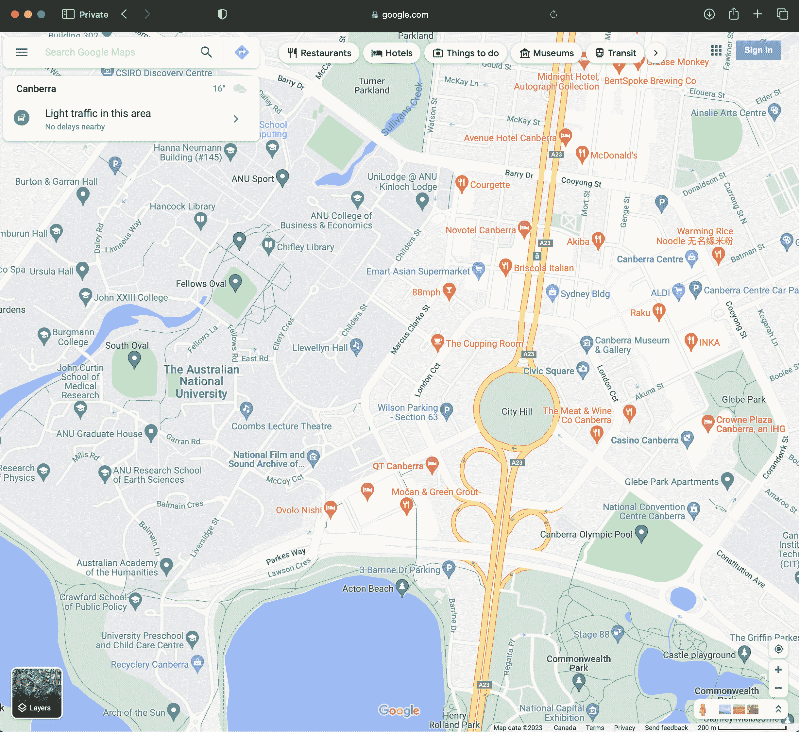

图 7.1：截至 2023 年 2 月 12 日，谷歌地图 API 响应示例

使用 API 的优势在于，数据提供者通常会明确他们愿意提供的数据以及提供这些数据的条款。这些条款可能包括速率限制（即我们可以请求数据的频率）以及我们可以对数据做什么，例如，可能不允许用于商业目的或重新发布。由于 API 是专门为我们使用而提供的，因此不太可能受到意外更改或法律问题的影响。因此，很明显，当有 API 可用时，我们应该尝试使用它而不是进行网络抓取。

现在我们将通过几个使用 API 的案例研究。在第一个案例中，我们直接使用`httr`处理一个 API。然后，我们使用`spotifyr`从 Spotify 获取数据。

### 7.2.1 arXiv、NASA 和 Dataverse

安装并加载`httr`后，我们使用`GET()`直接从 API 获取数据。这将尝试获取一些特定数据，其主要参数是“url”。这类似于图 7.1 中的 Google 地图示例，其中我们感兴趣的具体信息是一张地图。

#### 7.2.1.1 arXiv

在本案例研究中，我们将使用[arXiv 提供的 API](https://arxiv.org/help/api/)。arXiv 是一个在线存储库，用于存放经过同行评审之前的学术论文。这些论文通常被称为“预印本”。我们通过提供 URL，使用`GET()`请求 arXiv 获取关于某个预印本的一些信息。

```r
arxiv <- GET("http://export.arxiv.org/api/query?id_list=2310.01402")

status_code(arxiv)
```

我们可以使用`status_code()`来检查我们的响应。例如，200 表示成功，而 400 表示我们从服务器收到了错误。假设我们从服务器收到了某些内容，我们可以使用`content()`来显示它。在这种情况下，我们收到了 XML 格式的数据。XML 是一种标记语言，其中的条目由标签标识，这些标签可以嵌套在其他标签内。安装并加载`xml2`后，我们可以使用`read_xml()`读取 XML。XML 是一种半格式化结构，使用`html_structure()`初步查看它可能会很有用。

```r
content(arxiv) |>
 read_xml() |>
 html_structure()
```

我们可能希望基于提取此 XML 树的各种方面来创建一个数据集。例如，我们可以查看“entry”，即第八项，并特别获取“title”和“URL”，它们分别是“entry”内的第四和第九项。

```r
data_from_arxiv <-
 tibble(
 title = content(arxiv) |>
 read_xml() |>
 xml_child(search = 8) |>
 xml_child(search = 4) |>
 xml_text(),
 link = content(arxiv) |>
 read_xml() |>
 xml_child(search = 8) |>
 xml_child(search = 9) |>
 xml_attr("href")
 )
data_from_arxiv
```

#### 7.2.1.2 NASA 每日天文图

再考虑另一个例子，美国国家航空航天局（NASA）每天通过其[APOD API](https://api.nasa.gov)提供“每日天文图”。我们可以使用`GET()`获取特定日期的照片 URL，然后显示它。

```r
NASA_APOD_20190719 <-
 GET("https://api.nasa.gov/planetary/apod?api_key=DEMO_KEY&date=2019-07-19")
```

使用`content()`检查返回的数据，我们可以看到我们获得了各种字段，如日期、标题、解释和一个 URL。

```r
# APOD July 19, 2019
content(NASA_APOD_20190719)$date
```

```r
[1] "2019-07-19"
```

```r
content(NASA_APOD_20190719)$title
```

```r
[1] "Tranquility Base Panorama"
```

```r
content(NASA_APOD_20190719)$explanation
```

```r
[1] "On July 20, 1969 the Apollo 11 lunar module Eagle safely touched down on the Moon. It landed near the southwestern corner of the Moon's Mare Tranquillitatis at a landing site dubbed Tranquility Base. This panoramic view of Tranquility Base was constructed from the historic photos taken from the lunar surface. On the far left astronaut Neil Armstrong casts a long shadow with Sun is at his back and the Eagle resting about 60 meters away ( AS11-40-5961). He stands near the rim of 30 meter-diameter Little West crater seen here to the right ( AS11-40-5954). Also visible in the foreground is the top of the camera intended for taking stereo close-ups of the lunar surface."
```

```r
content(NASA_APOD_20190719)$url
```

```r
[1] "https://apod.nasa.gov/apod/image/1907/apollo11TranquilitybasePan600h.jpg"
```
  
我们可以将该 URL 提供给`knitr`的`include_graphics()`来显示它（图 7.2）。


(a) 宁静基地全景图（图片来源：尼尔·阿姆斯特朗，阿波罗 11 号，NASA）

图 7.2：从 NASA APOD API 获取的图像
  
#### 7.2.1.3 Dataverse

最后，另一种常见的半结构化 API 响应格式是 JSON。JSON 是一种人类可读的、机器可解析的数据存储方式。与我们已经习惯的行列结构的 CSV 不同，JSON 使用键值对。

```r
{
 "firstName": "Rohan",
 "lastName": "Alexander",
 "age": 36,
 "favFoods": {
 "first": "Pizza",
 "second": "Bagels",
 "third": null
 }
}
```

我们可以使用 `jsonlite` 解析 JSON。考虑一个具体例子，我们使用“Dataverse”——一个便于共享数据集的 Web 应用程序。我们可以使用 API 查询一个演示用的 Dataverse。例如，我们可能对与政治相关的数据集感兴趣。

```r
politics_datasets <-
 fromJSON("https://demo.dataverse.org/api/search?q=politics")

politics_datasets
```

```r
$status
[1] "OK"

$data
$data$q
[1] "politics"

$data$total_count
[1] 6

$data$start
[1] 0

$data$spelling_alternatives
named list()

$data$items
                                                       name      type
1                                      CAP - United Kingdom dataverse
2                                   China Archive Dataverse dataverse
3                        Isabel Causadias Domingo Dataverse dataverse
4                                            Dataset-Omer-1   dataset
5                                           CAP - Australia dataverse
6 České panelové šetření domácností 1\. vlna - hlavní soubor   dataset
                                                          url
1                 https://demo.dataverse.org/dataverse/CAP_UK
2          https://demo.dataverse.org/dataverse/china-archive
3 https://demo.dataverse.org/dataverse/icausadias_artresearch
4                         https://doi.org/10.70122/FK2/RXCK22
5          https://demo.dataverse.org/dataverse/CAP_Australia
6                         https://doi.org/10.70122/FK2/V5KAMC
                                                  image_url
1 https://demo.dataverse.org/api/access/dvCardImage/2058461
2                                                      <NA>
3                                                      <NA>
4                                                      <NA>
5 https://demo.dataverse.org/api/access/dvCardImage/2058462
6                                                      <NA>
              identifier
1                 CAP_UK
2          china-archive
3 icausadias_artresearch
4                   <NA>
5          CAP_Australia
6                   <NA>
                                                                                                                                                                                                                                                                                                                                                                                                                                                                                                                                                                                                                                                                                                                                                                                                                                                                                                                                                                                                                                                                                                                                                                                                                                                                                                                                                                                                                                                                                                                                                                                                                                                                                                                                                                                                                                                                                                                                                                                                                                                                                                                                                                                                                                                                                                                                                                                                                                                                                                                                                                                                                                                                                                                                                                                     description
1                                                                                                                                                                                                                                                                                                                                                                                                                                                                                                                                                                                                                                                                                                                                                                                                                                                                                                                                                                                                                                                                                                                                                                                                                                                                                                                                                                                                                                                                                                                                                                                                                                                                                                                                                                                                                            The UK Policy Agendas Project seeks to develop systematic measures of the policy agenda of British government and politics over time. It applies the policy content coding system of the original Policy Agendas Project in the United States, founded by Frank Baumgartner and Bryan Jones, with the aim of creating a consistent record of the issues that are attended to at different points in time, across many of the main venues of British public policy and politics – namely in parliament, the media and public opinion. The reliability of these measures of policy attention are ensured through adherence to clearly defined coding rules and standards, which give us confidence that changes in the priorities of government can be tracked consistently over time and in different arenas of politics. Location: University of Edinburgh; University of Southampton Downloadable Data Series: 12 Time Span: 1910-2015 Total Observations: 125,539
2 Introduction The China Archive is a data archive dedicated to support of scholarly, empirical research by anthropologists, economists, historians, political scientists, sociologists, and others in the fields of business, agriculture, and engineering. The goal of the Archive is to enable case research on Chinese domestic matters and China–U.S. relations, as well as to facilitate the inclusion of China in more broadly comparative studies. To that end, the Archive’s mission includes: acquiring and maintaining extant data sets and data sources on an ongoing basis, facilitating production of quantitative data from textual information when such is desirable and feasible, making all of the Archive’s data available on a user-friendly basis to scholars at and visiting Texas A&M University, and establishing web-based links to searchable electronic sources of information on China. As long-term goals, The China Archive is especially dedicated to: locating and acquiring difficult-to-obtain Chinese data such as public opinion data, making as many of the holdings as possible available online or via other computer media, and providing capability for converting textual data to numerical data suitable for quantitative analysis. In keeping with these goals, the Archive includes data sets collected by individuals and research centers/institutes as well as by government agencies. The Archive was planned by a faculty committee in 2002–2003, and is now a project of the Texas A&M University Libraries. A faculty committee continues to function as an advisory committee to the Libraries on matters related to the upkeep and expansion of The China Archive. The faculty committee is, in turn, advised by an External Advisory Panel, composed of China scholars from other academic institutions in the United States. Faculty Planning Committee Bob Harmel, Archive Planning Committee Chair; Political Science; Director, Program in the Cross-National Study of Politics Stephen Atkins, Sterling Evans Library Ben Crouch, Associate Dean, College of Liberal Arts Qi Li, Department of Economics Xinsheng Liu, Institute for Science, Technology and Public Policy, Bush School of Government and Public Service; School of Government, Peking University Rick Nader, Director, Institute for Pacific Asia Dudley Poston, Professor of Sociology and Abell Professor of Liberal Arts Raghavan (Srini) Srinivasan, Director, Spatial Sciences Laboratory, Texas Agriculture Experiment Station Di Wang, Assistant Professor of History Ben Wu, Associate Professor, Rangeland Ecology and Management Wei Zhao, Professor, Computer Science; Associate Vice President for Research Dianzhi (Dan) Sui, Department of Geography
3                                                                                                                                                                                                                                                                                                                                                                                                                                                                                                                                                                                                                                                                                                                                                                                                                                                                                                                                                                                                                                                                                                                                                                                                                                                                                                                                                                                                                                                                                                                                                                                                                                                                                                                                                                                   This Dataverse explores the diverse contexts in which artistic practice and collective identity develop, examining the intersections of cultural critique, market dynamics, and technological advancement. The datasets available in this Dataverse include a wide-ranging investigation into how artist collectives shape collective identities that transcend individual authorship, often reflecting cultural, social, and political themes. Additionally, research on the art market sheds light on the systems governing art distribution and valuation, while studies on the influence of technology in art education explore how digital tools and AI are reshaping creative processes and academic environments. This Dataverse offers resources for researchers, students, and professionals in the fields of art history, cultural studies, and social sciences, aiming to deepen understanding of the structures, markets, and technologies that inform contemporary art and its societal impact.
4                                                                                                                                                                                                                                                                                                                                                                                                                                                                                                                                                                                                                                                                                                                                                                                                                                                                                                                                                                                                                                                                                                                                                                                                                                                                                                                                                                                                                                                                                                                                                                                                                                                                                                                                                                                                                                                                                                                                                                                                                                                                                                                                                                                                                                                                                                                                 This should be bold. This should be a new line. This should be a blockquote. This should be code This should be emphasized This should be strong There should be a horizontal rule below this sentence. This should be h1 size. This should be h2 This should be h3\. This should be first item in a list This should be second item in a list This should be a paragraph break This should be subscript. This should be superscript This should be striked out
5                                                                                                                                                                                                                                         The Australian Policy Agendas Project collects and organizes data on Australian legislation, executive speeches, opposition questions, public opinion, media coverage, and High Court decisions. Some details are listed below. Data is forthcoming. Decisions of the High Court of Australia This dataset contains information on every case decided by the High Court of Australia between the years 1970 and 2015\. Cases serve as the unit of analysis. Each case was coded in terms of its policy content and several other variables controlling for the nature of the case and the nature of the court. In coding for policy content, we utilized the Comparative Agendas Project’s topics coding scheme, where each case was assigned both a major topic and a sub topic depending on its policy content. A full description of these categories and their corresponding codes may be found in the codebook. Sydney Morning Herald - Front Page Articles This dataset contains information on each article published on the Sydney Morning Herald's front page for each day from 1990 through 2015\. Front page articles serve as the unit of analysis. Each article was coded in terms of its policy content and other variables of interest controlling for location, political context, and key actors. In coding for policy content, we utilized the Comparative Agendas Project’s major topics coding scheme, where each article was assigned a major topic code. A full description of the policy content categories and their corresponding codes may be found in the major topics codebook. Dr. Keith Dowding (ANU), Dr. Aaron Martin (Melbourne), and Dr. Rhonda Evans (UT-Austin) lead the Australian Policy Agendas Project. Dr. Dowding and Dr. Martin coded legislation, executive speeches, opposition questions, public opinion, and media data, and Dr. Evans collected data on decisions of the High Court of Australia as well as additional media data. Data is forthcoming. Principal Investigator: Dr. Keith Dowding, Dr. Aaron Martin, Dr. Rhonda Evans Location: Australian National University, University of Melbourne, The University of Texas at Austin Downloadable Data Series: 1 Time Span: 1970-2015 Total Observations: 2,548 Sponsoring Institutions Dr. Dowding and Dr. Martin’s research was funded by the Australian Research Council Discovery Award DP 110102622\. Dr. Evans’ research is funded by the Edward A. Clark Center for Australian and New Zealand Studies at The University of Texas at Austin.
6                                                                                                                                                                                                                                                                                                                                                                                                                                                                                                                                                         České panelové šetření domácností (CHPS) je výběrové šetření, v němž je v letech 2015-2018 opakovaně dotazován náhodně vybraný vzorek domácností žijících na území České republiky. V první vlně sběru dat, která proběhla od července do prosince 2015, bylo dotázáno 5 159 domácností. Do konce roku 2018 budou realizovány další 3 vlny sběru dat s roční periodicitou. Pro komunikaci s veřejností je pro výzkum využíván název Proměny české společnosti http://www.promenyceskespolecnosti.cz Cílem výzkumu je zmapovat životní podmínky českých domácností z dlouhodobé perspektivy, charakterizovat proces změny v životě domácností a jednotlivců a vztáhnout proces sociální změny ke vztahům a dění v domácnostech. CHPS je mezioborový výzkum využívající přístupy sociologie, ekonomie a politologie. Zahrnuje pět hlavních tematických okruhů - rodinný život, užívání času, zdraví, vzdělání a trh práce, sociální stratifikace, bydlení, politická participace a občanská společnost. Výzkum organizuje Sociologický ústav Akademie věd ČR, v.v.i., CERGE-EI (společné pracoviště Centra pro ekonomický výzkum a doktorské studium Univerzity Karlovy a Národohospodářského ústavu Akademie věd ČR) a Fakulta sociálních studií Masarykovy univerzity. Výzkumný tým složený ze členů těchto institucí vytvořil metodický plán výzkumu a dotazové instrumenty, vybral ve veřejné soutěži realizátory terénních prací, s realizátory terénních prací spolupracuje na kontrole a čištění dat, zpracovává konečné datové soubory a zajišťuje jejich uložení v Českém sociálně vědním datovém archivu Sociologického ústavu AV ČR, v.v.i. Sběr dat realizují agentury MEDIAN, s.r.o., a STEM/MARK, a.s., které patří k nejvýznamnějším agenturám pro výzkum trhu a veřejného mínění v České republice. Jsou zakládající členové organizace SIMAR (Sdružení agentur pro výzkum trhu a veřejného mínění) a členové ESOMAR (European Society for Opinion and Marketing Research). Mimo sběr dat provedli realizátoři výběr vzorku, spolupracují na kontrole a čištění dat a poskytují konzultace k metodice výzkumu. Výzkum finančně podpořila Grantová agentura ČR z grantu GB14-36154G (Dynamika změny v české společnosti).
          published_at publicationStatuses                 affiliation
1 2023-06-06T17:18:53Z           Published Comparative Agendas Project
2 2016-12-09T20:13:22Z           Published      Texas A & M University
3 2024-10-27T21:01:11Z           Published    Universitat de Barcelona
4 2024-11-18T15:32:02Z           Published                        <NA>
5 2023-06-06T17:18:42Z           Published Comparative Agendas Project
6 2024-10-10T09:18:42Z           Published                        <NA>
                 parentDataverseName parentDataverseIdentifier
1  Comparative Agendas Project (CAP)                      <NA>
2                     Demo Dataverse                      <NA>
3                     Demo Dataverse                      demo
4                               <NA>                      <NA>
5  Comparative Agendas Project (CAP)                      <NA>
6                               <NA>                      <NA>
                global_id                                          publisher
1                    <NA>                                               <NA>
2                    <NA>                                               <NA>
3                    <NA>                                               <NA>
4 doi:10.70122/FK2/RXCK22                                     Demo Dataverse
5                    <NA>                                               <NA>
6 doi:10.70122/FK2/V5KAMC Czech Social Science Data Archive - TEST DATAVERSE
                                                                                                                                                                                                                                                                                                                                                                                                                                                                                                               citationHtml
1                                                                                                                                                                                                                                                                                                                                                                                                                                                                                                                      <NA>
2                                                                                                                                                                                                                                                                                                                                                                                                                                                                                                                      <NA>
3                                                                                                                                                                                                                                                                                                                                                                                                                                                                                                                      <NA>
4                                                                                                                                                                                                                                                                                                                                                            Fahim, Omer, 2024, "Dataset-Omer-1", <a href="https://doi.org/10.70122/FK2/RXCK22" target="_blank">https://doi.org/10.70122/FK2/RXCK22</a>, Demo Dataverse, V2
5                                                                                                                                                                                                                                                                                                                                                                                                                                                                                                                      <NA>
6 Lux, Martin; Hamplov&aacute;, Dana; Linek, Luk&aacute;&scaron;; Chaloupkov&aacute;, Kl&iacute;mov&aacute;, Jana; Sunega, Petr; Mys&iacute;kov&aacute;, Martina; Kudrn&aacute;č, Ale&scaron;; Krejč&iacute;, Jindřich; R&ouml;schov&aacute;, Michaela; Hrub&aacute; , Lucie, 2024, "Česk&eacute; panelov&eacute; &scaron;etřen&iacute; dom&aacute;cnost&iacute; 1\. vlna - hlavn&iacute; soubor", <a href="https://doi.org/10.70122/FK2/V5KAMC" target="_blank">https://doi.org/10.70122/FK2/V5KAMC</a>, Demo Dataverse, V1
  identifier_of_dataverse                                  name_of_dataverse
1                    <NA>                                               <NA>
2                    <NA>                                               <NA>
3                    <NA>                                               <NA>
4                    demo                                     Demo Dataverse
5                    <NA>                                               <NA>
6               CSDA_TEST Czech Social Science Data Archive - TEST DATAVERSE
                                                                                                                                                                                                                                                                                                citation
1                                                                                                                                                                                                                                                                                                   <NA>
2                                                                                                                                                                                                                                                                                                   <NA>
3                                                                                                                                                                                                                                                                                                   <NA>
4                                                                                                                                                                                                           Fahim, Omer, 2024, "Dataset-Omer-1", https://doi.org/10.70122/FK2/RXCK22, Demo Dataverse, V2
5                                                                                                                                                                                                                                                                                                   <NA>
6 Lux, Martin; Hamplová, Dana; Linek, Lukáš; Chaloupková, Klímová, Jana; Sunega, Petr; Mysíková, Martina; Kudrnáč, Aleš; Krejčí, Jindřich; Röschová, Michaela; Hrubá , Lucie, 2024, "České panelové šetření domácností 1\. vlna - hlavní soubor", https://doi.org/10.70122/FK2/V5KAMC, Demo Dataverse, V1
         storageIdentifier        subjects fileCount versionId versionState
1                     <NA>            NULL        NA        NA         <NA>
2                     <NA>            NULL        NA        NA         <NA>
3                     <NA>            NULL        NA        NA         <NA>
4 s3://10.70122/FK2/RXCK22 Social Sciences         0    273564     RELEASED
5                     <NA>            NULL        NA        NA         <NA>
6 s3://10.70122/FK2/V5KAMC Social Sciences         0    267076     RELEASED
  majorVersion minorVersion            createdAt            updatedAt
1           NA           NA                 <NA>                 <NA>
2           NA           NA                 <NA>                 <NA>
3           NA           NA                 <NA>                 <NA>
4            2            0 2024-11-05T18:57:22Z 2024-11-18T15:32:02Z
5           NA           NA                 <NA>                 <NA>
6            1            0 2024-10-10T09:07:57Z 2024-11-07T12:52:27Z
                                              contacts
1                                                 NULL
2                                                 NULL
3                                                 NULL
4                      Fahim, Omer, Harvard University
5                                                 NULL
6 Röschová, Michaela, Sociologický ústav AV ČR, v.v.i.
                                                                                                                                                                                                                                                                                                                                                                                                                                                                                                                                                                                                                                                                                                                                                                                                                                                                                                                                                                                                                                                                                                                                                                                                                                                                                                                                                                                                                                                                                                                                                                                                                                                                                                                                                                                                                                                                                                                                                                                                                                                                                                                                                                                                                                                                                                                                                                                                                                                                                                                                                                                                                                                                                                                                                                                                                                                                                                                                                                                                                                                                                                                                                                                                                                                                                                                                                                                                                                                                                                                                                                                                                                                                                                                                                                                                                                                                                                                                                                                                   publications
1                                                                                                                                                                                                                                                                                                                                                                                                                                                                                                                                                                                                                                                                                                                                                                                                                                                                                                                                                                                                                                                                                                                                                                                                                                                                                                                                                                                                                                                                                                                                                                                                                                                                                                                                                                                                                                                                                                                                                                                                                                                                                                                                                                                                                                                                                                                                                                                                                                                                                                                                                                                                                                                                                                                                                                                                                                                                                                                                                                                                                                                                                                                                                                                                                                                                                                                                                                                                                                                                                                                                                                                                                                                                                                                                                                                                                                                                                                                                                                                                          NULL
2                                                                                                                                                                                                                                                                                                                                                                                                                                                                                                                                                                                                                                                                                                                                                                                                                                                                                                                                                                                                                                                                                                                                                                                                                                                                                                                                                                                                                                                                                                                                                                                                                                                                                                                                                                                                                                                                                                                                                                                                                                                                                                                                                                                                                                                                                                                                                                                                                                                                                                                                                                                                                                                                                                                                                                                                                                                                                                                                                                                                                                                                                                                                                                                                                                                                                                                                                                                                                                                                                                                                                                                                                                                                                                                                                                                                                                                                                                                                                                                                          NULL
3                                                                                                                                                                                                                                                                                                                                                                                                                                                                                                                                                                                                                                                                                                                                                                                                                                                                                                                                                                                                                                                                                                                                                                                                                                                                                                                                                                                                                                                                                                                                                                                                                                                                                                                                                                                                                                                                                                                                                                                                                                                                                                                                                                                                                                                                                                                                                                                                                                                                                                                                                                                                                                                                                                                                                                                                                                                                                                                                                                                                                                                                                                                                                                                                                                                                                                                                                                                                                                                                                                                                                                                                                                                                                                                                                                                                                                                                                                                                                                                                          NULL
4                                                                                                                                                                                                                                                                                                                                                                                                                                                                                                                                                                                                                                                                                                                                                                                                                                                                                                                                                                                                                                                                                                                                                                                                                                                                                                                                                                                                                                                                                                                                                                                                                                                                                                                                                                                                                                                                                                                                                                                                                                                                                                                                                                                                                                                                                                                                                                                                                                                                                                                                                                                                                                                                                                                                                                                                                                                                                                                                                                                                                                                                                                                                                                                                                                                                                                                                                                                                                                                                                                                                                                                                                                                                                                                                              McGhee, Eric, Seth Masket, Boris Shor, Steven Rogers, and Nolan McCarty. 2014\. “A Primary Cause of Partisanship? Nomination Systems and Legislator Ideology.” <i>American Journal of Political Science</i> 58 (2): 337–51., http://dx.doi.org/10.1111/ajps.12070
5                                                                                                                                                                                                                                                                                                                                                                                                                                                                                                                                                                                                                                                                                                                                                                                                                                                                                                                                                                                                                                                                                                                                                                                                                                                                                                                                                                                                                                                                                                                                                                                                                                                                                                                                                                                                                                                                                                                                                                                                                                                                                                                                                                                                                                                                                                                                                                                                                                                                                                                                                                                                                                                                                                                                                                                                                                                                                                                                                                                                                                                                                                                                                                                                                                                                                                                                                                                                                                                                                                                                                                                                                                                                                                                                                                                                                                                                                                                                                                                                          NULL
6 Kudrnáč, A., Eger. A. M., Hjerm, M. 2023\. Scapegoating Immigrants in Times of Personal and Collective Crises: Results from a Czech Panel Study. International Migration Review 0(0)1-20, Kudrnáčová M, Kudrnáč A (2023) Better sleep, better life? testing the role of sleep on quality of life. PLoS ONE 18(3): e0282085\. https://doi.org/10.1371/journal.pone.0282085, Sládek, M., Klusáček, J., Hamplová, D., &amp; Sumová, A. 2023\. Population-representative study reveals cardiovascular and metabolic disease biomarkers associated with misaligned sleep schedules. Sleep, https://doi.org/10.1093/sleep/zsad037, Raudenská, P., D. Hamplová. 2022\. The Effect of Parents' Education and Income on Children's School Performance: the Mediating Role of the Family Environment and Children's Characteristics, and Gender Differences. Polish Sociological Review 218: 247-271, https://doi.org/10.26412/psr218.06, Kudrnáčová, M., D. Hamplová. 2022\. Social Jetlag in the Context of Work and Family. Sociológia / Slovak Sociological Review: 54(4): 295-324\. 0049-1225\. DOI: https://doi.org/10.31577/sociologia.2022.54.4.11, Kudrnáč, A., J. Klusáček. 2022\. Dočasný nárůst důvěry ve vládu a dodržování protiepidemických opatření na počátku koronavirové krize. Sociologický časopis / Czech Sociological Review 58(2):119-150, https://doi.org/10.13060/csr.2022.016., Hamplová, D., Raudenská, P. 2021\. Gender Differences in the Link between Family Scholarly Culture and Parental Educational Aspirations. Sociológia - Slovak Sociological Review 53 (5): 435-462, https://doi.org/10.31577/sociologia.2021.53.5.16, Raudenská, P., K. Bašná. 2021\. Individual’s cultural capital: intergenerational transmission, partner effect, or individual merit? Poetics, https://doi.org/10.1016/j.poetic.2021.101575, Kudrnáč, A. 2021\. A study of the effects of obesity and poor health on the relationship between distance to the polling station and the probability to vote. Party Politics 27(3):540-551, https://doi.org/10.1177/1354068819867414, Sládek, M., Kudrnáčová Röschová, M., Adámková, V., Hamplová, D., &amp; Sumová, A. 2020\. Chronotype assessment via a large scale socio-demographic survey favours yearlong Standard time over Daylight Saving Time in central Europe. Scientific reports, 10(1), 1419, https://doi.org/10.1038/s41598-020-58413-9, Nývlt, Ondřej. 2018\. Socio-demografické determinanty studijních výsledků a začátku pracovní kariéry v České republice. Demografie 60 (2):111-123, Lux, M., P. Sunega, L. Kážmér. 2018\. Intergenerational financial transfers and indirect reciprocity: determinants of the reproduction of homeownership in the postsocialist Czech Republic. Housing Studies, https://doi.org/10.1080/02673037.2018.1541441, Slepičková, Lenka, Petr Fučík. 2018\. Využívání předškolního vzdělávání v České republice: Komu chybí místa ve školkách? Sociologický časopis / Czech Sociological Review 54 (1): 35-62, https://doi.org/10.13060/00380288.2018.54.1.395, Hrubá, L. 2017\. Sociální determinanty vysokých vzdělanostních očekávání rodičů. Sociológia - Slovak Sociological Review 49 (5): 463-481, https://journals.sagepub.com/doi/10.1177/01979183231177971, https://doi.org/10.1371/journal.pone.0282085, https://doi.org/10.1093/sleep/zsad037, https://doi.org/10.26412/psr218.06, https://doi.org/10.31577/sociologia.2022.54.4.11, https://doi.org/10.13060/csr.2022.016, https://www.sav.sk/index.php?lang=sk&amp;doc=journal-list&amp;part=article_response_page&amp;journal_article_no=26724, https://www.sciencedirect.com/science/article/pii/S0304422X21000590?via%3Dihub, https://journals.sagepub.com/doi/10.1177/1354068819867414, https://doi.org/10.1038/s41598-020-58413-9, https://www.czechdemography.cz/aktuality/demografie-c-2-2018/, https://doi.org/10.1080/02673037.2018.1541441, https://doi.org/10.13060/00380288.2018.54.1.395, https://www.ceeol.com/search/article-detail?id=583362
                                                                                                                                                                     authors
1                                                                                                                                                                       NULL
2                                                                                                                                                                       NULL
3                                                                                                                                                                       NULL
4                                                                                                                                                                Fahim, Omer
5                                                                                                                                                                       NULL
6 Lux, Martin, Hamplová, Dana, Linek, Lukáš, Chaloupková, Klímová, Jana, Sunega, Petr, Mysíková, Martina, Kudrnáč, Aleš, Krejčí, Jindřich, Röschová, Michaela, Hrubá , Lucie
                                                                                                                                                                                                                                                                                                                                                                                                keywords
1                                                                                                                                                                                                                                                                                                                                                                                                   NULL
2                                                                                                                                                                                                                                                                                                                                                                                                   NULL
3                                                                                                                                                                                                                                                                                                                                                                                                   NULL
4                                                                                                                                                                                                                                                                                                                                                                                                   NULL
5                                                                                                                                                                                                                                                                                                                                                                                                   NULL
6 péče o dítě, rodiny, příjem, postoje, genderové role, volný čas - činnosti, zdraví, zdraví (osobní), kariéra, pracovní příležitosti, cíle vzdělávání, práce a zaměstnanost, pracovní podmínky, sociální nerovnost, sociální struktura, sociální mobilita, příjmy a bohatství, ekonomické podmínky, kulturní hodnoty, bydlení, volební preference, volební chování, sociální postoje, politické postoje
                                                                                                                producers
1                                                                                                                    NULL
2                                                                                                                    NULL
3                                                                                                                    NULL
4                                                                                                                    NULL
5                                                                                                                    NULL
6 Sociologický ústav, Centrum pro ekonomický výzkum a doktorské studium – Národohospodářský ústav, Fakulta sociálních věd
  geographicCoverage
1               NULL
2               NULL
3               NULL
4               NULL
5               NULL
6     Czech Republic

$data$count_in_response
[1] 6
```
我们可以使用 `View(politics_datasets)` 查看数据集，这允许我们根据兴趣展开树状结构。我们甚至可以通过悬停在项目上，然后点击带有绿色箭头的图标来获取关注不同方面所需的代码（图 7.3）。


图 7.3：悬停在 JSON 元素“items”上的示例，可以点击带有绿色箭头的图标来获取聚焦于该元素的代码

这告诉我们如何获取感兴趣的数据集。

```r
as_tibble(politics_datasets[["data"]][["items"]])
```
  
### 7.2.2 Spotify

有时会有一个围绕 API 构建的 `R` 包，允许我们以类似之前见过的方式与之交互。例如，`spotifyr` 就是 Spotify API 的一个封装包。在使用 API 时，即使它们被封装在 `R` 包中（本例中是 `spotifyr`），阅读访问条款也非常重要。

要访问 Spotify API，我们需要一个 [Spotify 开发者账户](https://developer.spotify.com/dashboard/)。这是免费的，但需要使用 Spotify 账户登录并接受开发者条款（图 7.4）。


图 7.4：Spotify 开发者账户条款协议页面

继续注册流程，在我们的案例中，我们“不知道”要构建什么，因此 Spotify 要求我们使用非商业协议，这没有问题。要使用 Spotify API，我们需要一个“客户端 ID”和一个“客户端密钥”。这些信息我们需要保密，否则任何知道这些信息的人都可以像我们一样使用我们的开发者账户。一种省事且能保密这些信息的方法是将它们保存在我们的“系统环境变量”中。这样，当我们推送到 GitHub 时，它们就不会被包含进去。为此，我们将加载并使用 `usethis` 来修改我们的系统环境变量。具体来说，有一个名为“.Renviron”的文件，我们将打开它并添加我们的“客户端 ID”和“客户端密钥”。

```r
edit_r_environ()
```

当我们运行 `edit_r_environ()` 时，会打开一个“.Renviron”文件，我们可以在此添加我们的“Spotify 客户端 ID”和“客户端密钥”。请使用相同的名称，因为 `spotifyr` 会在我们的环境中查找具有这些特定名称的密钥。这里小心使用单引号很重要，尽管我们在本书中通常使用双引号。

```r
SPOTIFY_CLIENT_ID = 'PUT_YOUR_CLIENT_ID_HERE'
SPOTIFY_CLIENT_SECRET = 'PUT_YOUR_SECRET_HERE'
```

保存“.Renviron”文件，然后重启 R：“会话” → “重启 R”。现在我们可以根据需要来使用我们的“Spotify 客户端 ID”和“客户端密钥”。那些需要这些信息作为参数的函数将无需再次显式指定即可工作。

为了尝试这一点，我们安装并加载 `spotifyr`。我们将使用 `get_artist_audio_features()` 获取并保存关于英国摇滚乐队电台司令的一些信息。其中一个必需的参数是 `authorization`，但由于该参数默认设置为查看“.Renviron”文件，我们在此无需指定它。

```r
radiohead <- get_artist_audio_features("radiohead")
saveRDS(radiohead, "radiohead.rds")
```

```r
radiohead <- readRDS("radiohead.rds")
```

基于歌曲有各种各样的信息可用。我们可能感兴趣的是看看他们的歌曲是否随着时间的推移变得更长（图 7.5）。遵循第五章的指导，这是一个很好的机会，可以同时使用箱线图来传达按专辑汇总的统计数据。

```r
radiohead <- as_tibble(radiohead)

radiohead |>
 mutate(album_release_date = ymd(album_release_date)) |>
 ggplot(aes(
 x = album_release_date,
 y = duration_ms,
 group = album_release_date
 )) +
 geom_boxplot() +
 geom_jitter(alpha = 0.5, width = 0.3, height = 0) +
 theme_minimal() +
 labs(
 x = "Album release date",
 y = "Duration of song (ms)"
 )
```

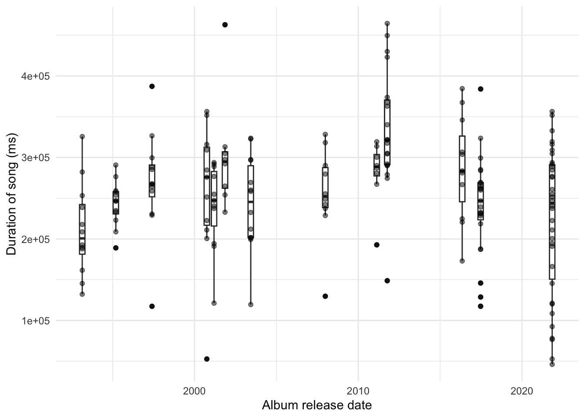

图 7.5：从 Spotify 收集的电台司令每首歌曲的长度随时间变化图*  *Spotify 为每首歌曲提供的一个有趣变量是“效价”。Spotify[文档](https://developer.spotify.com/documentation/web-api/reference/#/operations/get-audio-features)将其描述为一个介于 0 到 1 之间的度量值，表示曲目的“音乐积极性”，数值越高表示越积极。我们可能感兴趣的是比较几位艺术家（例如电台司令、美国摇滚乐队国民乐队和美国歌手泰勒·斯威夫特）的效价随时间的变化。

首先，我们需要收集数据。

```r
taylor_swift <- get_artist_audio_features("taylor swift")
the_national <- get_artist_audio_features("the national")

saveRDS(taylor_swift, "taylor_swift.rds")
saveRDS(the_national, "the_national.rds")
```

接着，我们可以将它们整合在一起并绘制图表（图 7.6）。这似乎表明，虽然泰勒·斯威夫特和电台司令的“效价”水平总体上随时间推移保持稳定，但国民乐队的效价水平有所下降。

```r
rbind(taylor_swift, the_national, radiohead) |>
 select(artist_name, album_release_date, valence) |>
 mutate(album_release_date = ymd(album_release_date)) |> 
 ggplot(aes( x = album_release_date, y = valence, color = artist_name)) +
 geom_point(alpha = 0.3) +
 geom_smooth() +
 theme_minimal() +
 facet_wrap(facets = vars(artist_name), dir = "v") +
 labs(
 x = "Album release date",
 y = "Valence",
 color = "Artist"
 ) +
 scale_color_brewer(palette = "Set1") +
 theme(legend.position = "bottom")
```

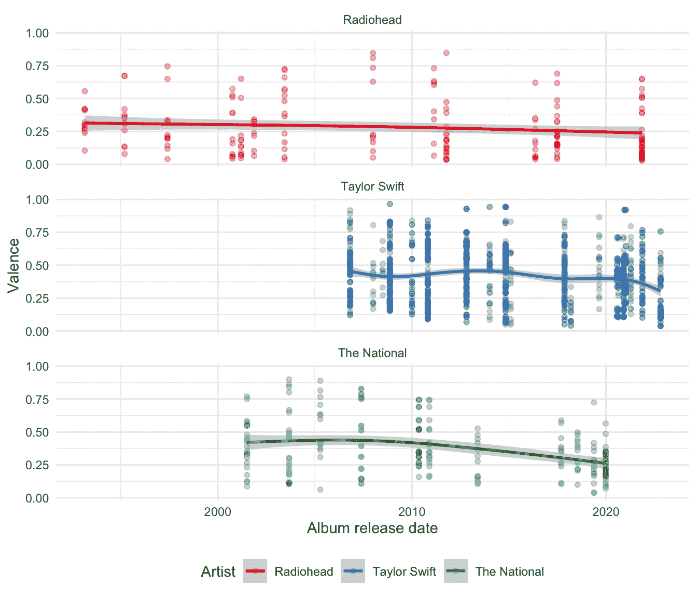

图 7.6：比较 Radiohead、Taylor Swift 和 The National 随时间变化的效价*  *我们生活在一个只需极少努力或成本就能获取所有这些信息的世界，多么令人惊叹！收集到数据后，还有很多事情可以做。例如，Pavlik (2019) 使用扩展的数据集对音乐流派进行分类，而《经济学人》(2022) 则研究了语言如何与 Spotify 上的音乐流媒体相关联。我们收集此类数据的能力使我们能够回答过去必须通过实验才能考虑的问题。例如，Salganik、Dodds 和 Watts (2006) 不得不使用实验数据来分析一首热门歌曲的社会因素，而不是我们现在可以获取的观察数据。

话虽如此，值得思考的是，效价声称要衡量的究竟是什么。Spotify 文档中关于其创建方式的信息很少。一个数字能否完全代表一首歌曲的积极程度是值得怀疑的。那么，这些艺术家未在 Spotify 上架、甚至未公开发行的歌曲呢？这是一个很好的例子，说明了测量和抽样如何渗透到用数据讲述故事的方方面面。
  
## 7.3 网络爬取

### 7.3.1 原则

网络爬取是一种从网站获取数据的方式。我们不是通过浏览器访问网站然后保存副本，而是编写代码来为我们完成这项工作。这为我们打开了大量数据，但另一方面，这些数据通常并非为此目的而提供。这意味着保持尊重尤为重要。虽然通常不违法，但网络爬取的法律细节取决于司法管辖区和我们的具体行为，因此保持谨慎也很重要。即使我们的使用不具有商业竞争性，一个特别值得关注的问题是：我们工作的可重复性需求与尊重可能禁止数据重新发布的服务条款之间的冲突 (Luscombe, Dick, and Walby 2021)。

隐私常常优先于可复现性。数据在网站上公开可用与被抓取、清理、准备成数据集然后公开发布之间也存在相当大的差异。例如，Kirkegaard 和 Bjerrekær（2016）抓取了公开可用的 OKCupid 个人资料，然后使生成的数据集易于获取（Hackett 2016）。Zimmer（2018）详细阐述了一些被忽视的重要考量，包括“最小化伤害”、“知情同意”，以及确保数据集中的个人保持“隐私和保密性”。虽然可以说 OKCupid 公开了数据，但他们是在特定背景下这样做的，而当他们的数据被抓取时，这个背景就改变了。

哦，你以为我们在这方面有很好的数据吗！* *警察暴力尤其令人担忧，因为警察与社会之间需要信任。没有良好的数据，就很难追究警察部门的责任，或者知道是否存在问题，但获取数据很困难（Thomson-DeVeaux, Bronner, and Sharma 2021）。根本问题在于，无法轻易将导致暴力的遭遇简化为数据集。两个流行的数据集依赖于网络抓取：*

1.  “警察暴力地图”；以及

1.  “致命武力数据库”。

Bor 等人（2018）使用“Mapping Police Violence”来研究警察杀害美国黑人的情况，尤其是手无寸铁的情况，并发现这对美国黑人的心理健康有显著影响。对该论文的回应，如 Nix 和 Lozada（2020），特别关注数据集的编码问题，并在重新编码后得出了不同的结论。编码差异的一个例子是一个无法回答的问题，因为它取决于上下文和使用情况，即是否将被玩具枪杀害的人编码为“武装”或“非武装”。我们可能需要一个单独的类别，但为了构建定量数据集，某些简化是必要的。*《华盛顿邮报》使用“Fatal Force Database”（The Washington Post 2023）撰写了许多文章。Jenkins 等人（2022）描述了他们的方法论和标准化的挑战。Comer 和 Ingram（2022）比较了这些数据集并发现了相似之处，但也记录了数据集之间的差异。*  *网络爬虫是宝贵的数据来源。但它们通常是某人试图实现另一个目标时产生的副产品。网络爬虫会给网站主机带来成本，因此我们应尽可能减少这种影响。例如，零售商可能有一个展示产品和价格的网站，这并非特意作为数据源创建，但我们可以通过爬取来创建数据集。以下原则可能有助于指导网络爬虫。

1.  尽量避免。尽可能使用 API。

1.  遵守网站的意愿。一些网站有一个“robots.txt”文件，其中包含了他们允许爬虫操作的信息。通常，如果存在这样的文件，可以通过在基础 URL 后添加“robots.txt”来访问。例如，https://www.google.com 的“robots.txt”文件可以在 https://www.google.com/robots.txt 访问。注意“Disallow:”下列出的文件夹，这些是网站不希望被爬取的文件夹。同时注意“Crawl-delay:”的实例，这是网站希望你每次访问之间等待的秒数。

1.  减少影响。

    1.  降低爬虫速度，例如，不要让它每秒访问网站，而是使用 `sys.sleep()` 来减慢速度。如果你只需要几百个文件，何不让它每分钟只访问网站几次，在夜间后台运行呢？

    1.  考虑运行爬虫的时机。例如，如果你正在爬取零售商网站，或许可以将脚本设置为从晚上 10 点运行到次日早晨，因为此时使用网站的客户可能较少。同样地，如果是政府网站，并且他们每月定期发布数据，那么避开那一天可能更为礼貌。

1.  只取所需。例如，如果您只需要克罗地亚十大城市的名称，则无需爬取整个维基百科。这减少了对网站的影响，并使我们更容易为自己的行为辩护。

1.  只爬取一次。这意味着您应该在操作过程中保存所有内容，以便在爬虫不可避免地出现故障时无需重新收集数据。例如，您通常会花费大量时间让爬虫在一个页面上正常工作，但通常页面结构会在某个时刻发生变化，届时需要更新爬虫。一旦获得数据，您应该将原始的、未经编辑的数据与修改后的数据分开保存。如果您需要随时间变化的数据，那么您需要返回重新爬取，但这与不必要地重复爬取页面是不同的。

1.  不要重新发布被爬取的页面（这与您从中创建的数据集形成对比）。

1.  尽可能承担责任并请求许可。至少所有脚本中应包含联系方式。根据情况，在爬取前请求许可可能是值得的。

### 7.3.2 HTML/CSS 基础

网页爬取是通过利用网页的底层结构实现的。我们利用 HTML/CSS 中的模式来获取所需的数据。要查看底层的 HTML/CSS，我们可以：

1.  打开浏览器，右键单击，并选择类似“检查”的选项；或者

1.  保存网站，然后用文本编辑器而不是浏览器打开它。

HTML/CSS 是一种基于匹配标签的标记语言。如果我们希望文本加粗，我们会使用类似这样的代码：

```r
<b>My bold text</b>
```

同样，如果我们想要一个列表，那么我们会开始和结束列表，并标明每个项目。

```r
<ul>
  <li>Learn webscraping</li>
  <li>Do data science</li>
  <li>Profit</li>
</ul>
```

在爬取时，我们将搜索这些标签。

首先，我们可以假设我们从某个网站获取了一些 HTML，并且我们想从中提取名称。我们可以看到名称是加粗的，因此我们希望专注于该特征并将其提取出来。

```r
website_extract <- "<p>Hi, I'm <b>Rohan</b> Alexander.</p>"
```

`rvest` 是 `tidyverse` 的一部分，因此无需单独安装，但它不属于核心组件，所以需要手动加载。之后，使用 `read_html()` 来读取数据。

```r
rohans_data <- read_html(website_extract)

rohans_data
```

```r
{html_document}
<html>
[1] <body><p>Hi, I'm <b>Rohan</b> Alexander.</p></body>
```
`rvest` 用于查找标签的语言是“节点”，因此我们专注于加粗节点。默认情况下，`html_elements()` 会同时返回标签。我们使用 `html_text()` 来提取文本。

```r
rohans_data |>
 html_elements("b")
```

```r
{xml_nodeset (1)}
[1] <b>Rohan</b>
```

```r
rohans_data |>
 html_elements("b") |>
 html_text()
```

```r
[1] "Rohan"
```
网络抓取是一种令人兴奋的数据来源，我们现在将通过一些示例进行说明。但与这些示例不同，信息通常并不全部集中在一个页面上。网络抓取很快会变成一门需要练习的困难艺术。例如，我们区分索引抓取和内容抓取。前者是抓取以构建包含所需内容的 URL 列表，而后者是从这些 URL 中获取内容。Luscombe、Duncan 和 Walby (2022) 提供了一个示例。如果你最终需要进行大量网络抓取，那么 `polite` (Perepolkin 2022) 可能有助于更好地优化你的工作流程。并且可以使用 GitHub Actions 来支持随时间推移进行更大、更慢的抓取。
  
### 7.3.3 书籍信息

在本案例研究中，我们将抓取[此处](https://rohansbooks.com)提供的书籍列表。然后我们将清理数据并查看作者姓氏首字母的分布。这比上面的示例稍微复杂一些，但基本工作流程是相同的：下载网站，寻找感兴趣的节点，提取信息，并进行清理。

我们使用 `rvest` 来下载网站，然后导航 HTML 以找到我们感兴趣的方面。我们使用 `tidyverse` 来清理数据集。我们首先需要访问网站，然后保存一个本地副本。

```r
books_data <- read_html("https://rohansbooks.com")

write_html(books_data, "raw_data.html")
```

我们需要导航 HTML 以获取我们想要的方面。然后尝试尽快将数据放入 tibble 中，因为这将使我们更容易使用 `dplyr` 动词和 `tidyverse` 中的其他函数。

如果你对此不熟悉，请参阅在线附录 A。

```r
books_data <- read_html("raw_data.html")
```

```r
books_data
```

```r
{html_document}
<html>
[1] <head>\n<meta http-equiv="Content-Type" content="text/html; charset=UTF-8 ...
[2] <body>\n    <h1>Books</h1>\n\n    <p>\n      This is a list of books that ...
```
为了将数据放入 tibble 中，我们首先需要使用 HTML 标签来识别我们感兴趣的数据。如果我们查看网站，就会知道需要关注列表项（图 7.7 (a)）。我们可以查看源代码，特别关注寻找列表（图 7.7 (b)）。


(a) 网站显示的书籍页面

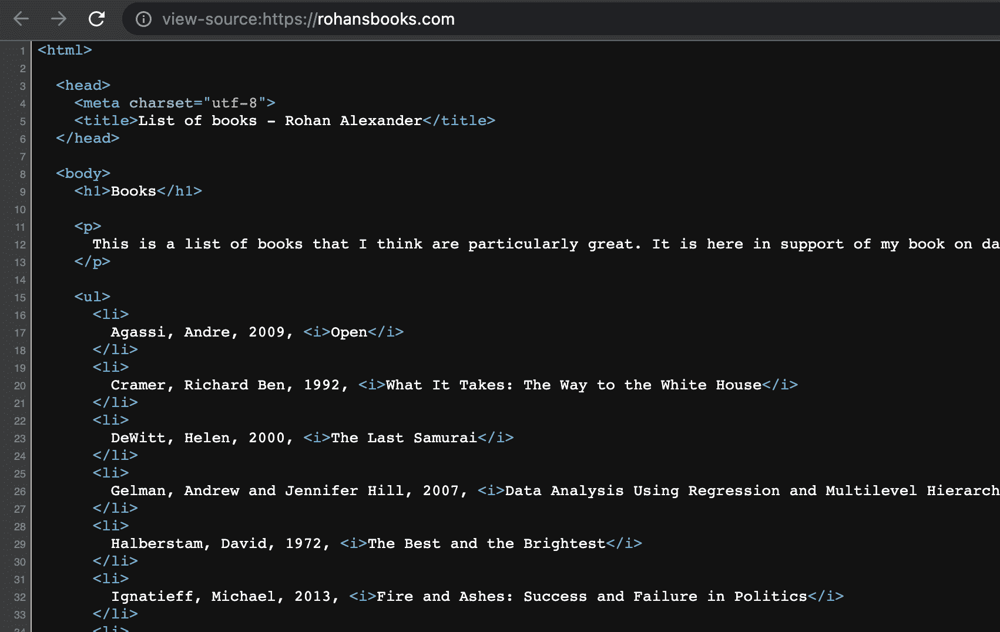

(b) 书籍网站顶部及书籍列表的 HTML

图 7.7：截至 2022 年 6 月 16 日的书籍网站截图

列表项的标签是“li”，因此我们可以用它来定位列表。

```r
text_data <-
 books_data |>
 html_elements("li") |>
 html_text()

all_books <-
 tibble(books = text_data)

head(all_books)
```

```r
# A tibble: 6 × 1
  books                                                                         
  <chr>                                                                         
1 "\n        Agassi, Andre, 2009, Open\n      "                                 
2 "\n        Cramer, Richard Ben, 1992, What It Takes: The Way to the White Hou…
3 "\n        DeWitt, Helen, 2000, The Last Samurai\n      "                     
4 "\n        Gelman, Andrew and Jennifer Hill, 2007, Data Analysis Using Regres…
5 "\n        Halberstam, David, 1972, The Best and the Brightest\n      "       
6 "\n        Ignatieff, Michael, 2013, Fire and Ashes: Success and Failure in P…
```
我们现在需要清理数据。首先，我们想使用 `separate()` 将标题和作者分开，然后清理作者和标题列。我们可以利用年份存在这一事实，并基于此进行分离。

```r
all_books <-
 all_books |>
 mutate(books = str_squish(books)) |>
 separate(books, into = c("author", "title"), sep = "\\, [[:digit:]]{4}\\, ")

head(all_books)
```

```r
# A tibble: 6 × 2
  author                           title                                        
  <chr>                            <chr>                                        
1 Agassi, Andre                    Open                                         
2 Cramer, Richard Ben              What It Takes: The Way to the White House    
3 DeWitt, Helen                    The Last Samurai                             
4 Gelman, Andrew and Jennifer Hill Data Analysis Using Regression and Multileve…
5 Halberstam, David                The Best and the Brightest                   
6 Ignatieff, Michael               Fire and Ashes: Success and Failure in Polit…
```
最后，我们可以制作一个名字首字母分布表（表 7.1）。

```r
all_books |>
 mutate(
 first_letter = str_sub(author, 1, 1)
 ) |>
 count(.by = first_letter) |>
 tt() |> 
 style_tt(j = 1:2, align = "lr") |> 
 setNames(c("First letter", "Number of times"))
```

表 7.1：书籍收藏中作者姓氏首字母的分布

| 首字母 | 出现次数 |
| --- | --- |
| A | 1 |
| C | 1 |
| D | 1 |
| G | 1 |
| H | 1 |
| I | 1 |
| L | 1 |
| M | 1 |
| P | 3 |
| R | 1 |
| V | 2 |
| W | 4 |

| Y | 1 |
  
### 7.3.4 英国首相

在本案例研究中，我们关注的是英国首相根据其出生年份计算的寿命。我们将使用 `rvest` 从维基百科抓取数据，进行清理，然后制作图表。网站时常会发生变化。这使得许多抓取工作在很大程度上是定制化的，即使我们可以借鉴早期项目的一些代码。有时感到沮丧是正常的。在开始时心中有一个最终目标会有所帮助。

为此，我们可以从生成一些模拟数据开始。理想情况下，我们希望得到一个表格，其中每一行代表一位首相，一列是他们的姓名，另外两列分别是出生年份和死亡年份。如果他们仍然在世，那么死亡年份可以为空。我们知道出生和死亡年份应该在 1700 到 1990 年之间，并且死亡年份应大于出生年份。最后，我们还知道年份应该是整数，姓名应该是字符类型。我们希望得到大致如下所示的内容：

```r
set.seed(853)

simulated_dataset <-
 tibble(
 prime_minister = babynames |>
 filter(prop > 0.01) |>
 distinct(name) |>
 unlist() |>
 sample(size = 10, replace = FALSE),
 birth_year = sample(1700:1990, size = 10, replace = TRUE),
 years_lived = sample(50:100, size = 10, replace = TRUE),
 death_year = birth_year + years_lived
 ) |>
 select(prime_minister, birth_year, death_year, years_lived) |>
 arrange(birth_year)

simulated_dataset
```

```r
# A tibble: 10 × 4
   prime_minister birth_year death_year years_lived
   <chr>               <int>      <int>       <int>
 1 Kevin                1813       1908          95
 2 Karen                1832       1896          64
 3 Robert               1839       1899          60
 4 Bertha               1846       1915          69
 5 Jennifer             1867       1943          76
 6 Arthur               1892       1984          92
 7 Donna                1907       2006          99
 8 Emma                 1957       2031          74
 9 Ryan                 1959       2053          94
10 Tyler                1990       2062          72
```
生成模拟数据集的一个优点是，如果我们分组工作，那么一个人可以使用模拟数据集开始制作图表，而另一个人则收集数据。就图表而言，我们的目标是类似于图 7.8 的内容。

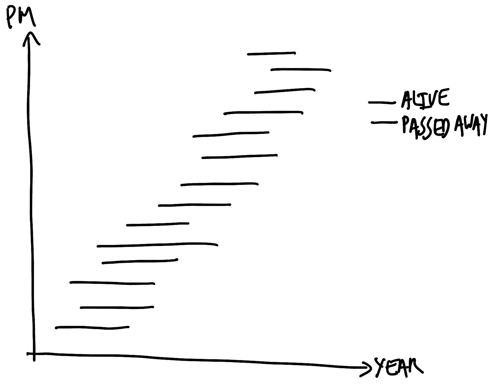

图 7.8：展示英国首相寿命的计划图表草图

我们从一个感兴趣的问题开始，即每位英国首相的寿命。因此，我们需要确定一个数据来源。虽然有很多数据源提供了每位首相的出生和死亡信息，但我们想要一个可信的来源，并且由于我们要进行抓取，我们希望它具有一定的结构。[关于英国首相的维基百科页面](https://en.wikipedia.org/wiki/List_of_prime_ministers_of_the_United_Kingdom)符合这两个标准。作为一个热门页面，其信息很可能正确，并且数据以表格形式提供。

我们加载 `rvest`，然后使用 `read_html()` 下载页面。将其本地保存为我们提供了一份副本，以便在网站发生变化时保证可复现性，并且意味着我们不必持续访问该网站。但这并非我们的数据，因此通常不应公开重新分发。

```r
raw_data <-
 read_html(
 "https://en.wikipedia.org/wiki/List_of_prime_ministers_of_the_United_Kingdom"
 )
write_html(raw_data, "pms.html")
```

与之前的案例研究一样，我们正在寻找 HTML 中的模式，以帮助我们更接近所需的数据。这是一个迭代过程，涉及反复试验。即使是简单的例子也需要时间。

一个可能有帮助的工具是[选择器小工具](https://rvest.tidyverse.org/articles/articles/selectorgadget.html)。它允许我们挑选所需的元素，然后为我们提供 `html_element()` 的输入（图 7.9）。默认情况下，选择器小工具使用 CSS 选择器。这不是指定所需信息位置的唯一方法，考虑使用替代方案（如 XPath）可能是一个有用的选择。

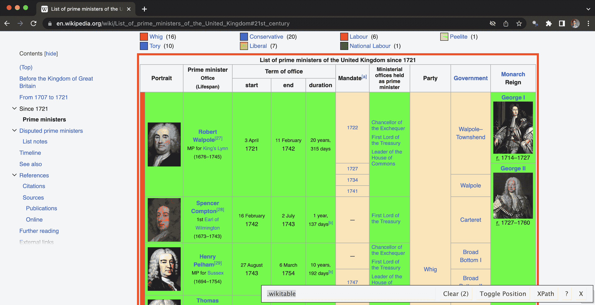

图 7.9：使用选择器小工具识别标签，截至 2023 年 2 月 12 日

```r
raw_data <- read_html("pms.html")
```

```r
parse_data_selector_gadget <-
 raw_data |>
 html_element(".wikitable") |>
 html_table()

head(parse_data_selector_gadget)
```

```r
# A tibble: 6 × 11
  Portrait Portrait   Prime ministerOffice(L…¹ `Term of office` `Term of office`
  <chr>    <chr>      <chr>                    <chr>            <chr>           
1 Portrait "Portrait" Prime ministerOffice(Li… start            end             
2 ​         ""         Robert Walpole[27]MP fo… 3 April1721      11 February1742 
3 ​         ""         Robert Walpole[27]MP fo… 3 April1721      11 February1742 
4 ​         ""         Robert Walpole[27]MP fo… 3 April1721      11 February1742 
5 ​         ""         Robert Walpole[27]MP fo… 3 April1721      11 February1742 
6 ​         ""         Spencer Compton[28]1st … 16 February1742  2 July1743      
# ℹ abbreviated name: ¹​`Prime ministerOffice(Lifespan)`
# ℹ 6 more variables: `Term of office` <chr>, `Mandate[a]` <chr>,
#   `Ministerial offices held as prime minister` <chr>, Party <chr>,
#   Government <chr>, MonarchReign <chr>
```
在这种情况下，有许多我们不需要的列，以及一些重复的行。

```r
parsed_data <-
 parse_data_selector_gadget |> 
 clean_names() |> 
 rename(raw_text = prime_minister_office_lifespan) |> 
 select(raw_text) |> 
 filter(raw_text != "Prime ministerOffice(Lifespan)") |> 
 distinct() 

head(parsed_data)
```

```r
# A tibble: 6 × 1
  raw_text                                                
  <chr>                                                   
1 Robert Walpole[27]MP for King's Lynn(1676–1745)         
2 Spencer Compton[28]1st Earl of Wilmington(1673–1743)    
3 Henry Pelham[29]MP for Sussex(1694–1754)                
4 Thomas Pelham-Holles[30]1st Duke of Newcastle(1693–1768)
5 William Cavendish[31]4th Duke of Devonshire(1720–1764)  
6 Thomas Pelham-Holles[32]1st Duke of Newcastle(1693–1768)
```
现在我们有了解析后的数据，需要对其进行清理以匹配我们的需求。我们需要一个姓名列，以及出生年份和去世年份列。我们利用姓名和日期似乎由括号区分的这一事实，使用 `separate()` 函数。`str_extract()` 中的参数是一个正则表达式。它查找连续四个数字，后跟一个破折号，再后跟另外四个连续数字。对于那些仍在世的部长，我们使用一个略有不同的正则表达式。

```r
initial_clean <-
 parsed_data |>
 separate(
 raw_text, into = c("name", "not_name"), sep = "\\[", extra = "merge",
 ) |> 
 mutate(date = str_extract(not_name, "[[:digit:]]{4}–[[:digit:]]{4}"),
 born = str_extract(not_name, "born[[:space:]][[:digit:]]{4}")
 ) |>
 select(name, date, born)

head(initial_clean)
```

```r
# A tibble: 6 × 3
  name                 date      born 
  <chr>                <chr>     <chr>
1 Robert Walpole       1676–1745 <NA> 
2 Spencer Compton      1673–1743 <NA> 
3 Henry Pelham         1694–1754 <NA> 
4 Thomas Pelham-Holles 1693–1768 <NA> 
5 William Cavendish    1720–1764 <NA> 
6 Thomas Pelham-Holles 1693–1768 <NA> 
```
最后，我们需要清理这些列。

```r
cleaned_data <-
 initial_clean |>
 separate(date, into = c("birth", "died"), 
 sep = "–") |>   # PMs who have died have their birth and death years 
 # separated by a hyphen, but we need to be careful with the hyphen as it seems 
 # to be a slightly odd type of hyphen and we need to copy/paste it.
 mutate(
 born = str_remove_all(born, "born[[:space:]]"),
 birth = if_else(!is.na(born), born, birth)
 ) |> # Alive PMs have slightly different format
 select(-born) |>
 rename(born = birth) |> 
 mutate(across(c(born, died), as.integer)) |> 
 mutate(Age_at_Death = died - born) |> 
 distinct() # Some of the PMs had two goes at it.

head(cleaned_data)
```

```r
# A tibble: 6 × 4
  name                  born  died Age_at_Death
  <chr>                <int> <int>        <int>
1 Robert Walpole        1676  1745           69
2 Spencer Compton       1673  1743           70
3 Henry Pelham          1694  1754           60
4 Thomas Pelham-Holles  1693  1768           75
5 William Cavendish     1720  1764           44
6 John Stuart           1713  1792           79
```
我们的数据集看起来与开始时我们想要的那个相似（表 7.2）。

```r
cleaned_data |>
 head() |>
 tt() |> 
 style_tt(j = 1:4, align = "lrrr") |> 
 setNames(c("Prime Minister", "Birth year", "Death year", "Age at death"))
```

表 7.2：按去世年龄排列的英国首相

| 首相 | 出生年份 | 去世年份 | 去世年龄 |
| --- | --- | --- | --- |
| 罗伯特·沃波尔 | 1676 | 1745 | 69 |
| 斯宾塞·康普顿 | 1673 | 1743 | 70 |
| 亨利·佩勒姆 | 1694 | 1754 | 60 |
| 托马斯·佩勒姆-霍利斯 | 1693 | 1768 | 75 |
| 威廉·卡文迪什 | 1720 | 1764 | 44 |

| 约翰·斯图亚特 | 1713 | 1792 | 79 |*  *此时，我们希望制作一个图表来说明每位首相的寿命（图 7.10）。如果他们仍然在世，我们希望他们的数据线延伸到图表末尾，但希望用不同的颜色来区分。

```r
cleaned_data |>
 mutate(
 still_alive = if_else(is.na(died), "Yes", "No"),
 died = if_else(is.na(died), as.integer(2023), died)
 ) |>
 mutate(name = as_factor(name)) |>
 ggplot(
 aes(x = born, xend = died, y = name, yend = name, color = still_alive)
 ) +
 geom_segment() +
 labs(
 x = "Year of birth", y = "Prime minister", color = "PM is currently alive"
 ) +
 theme_minimal() +
 scale_color_brewer(palette = "Set1") +
 theme(legend.position = "bottom")
```

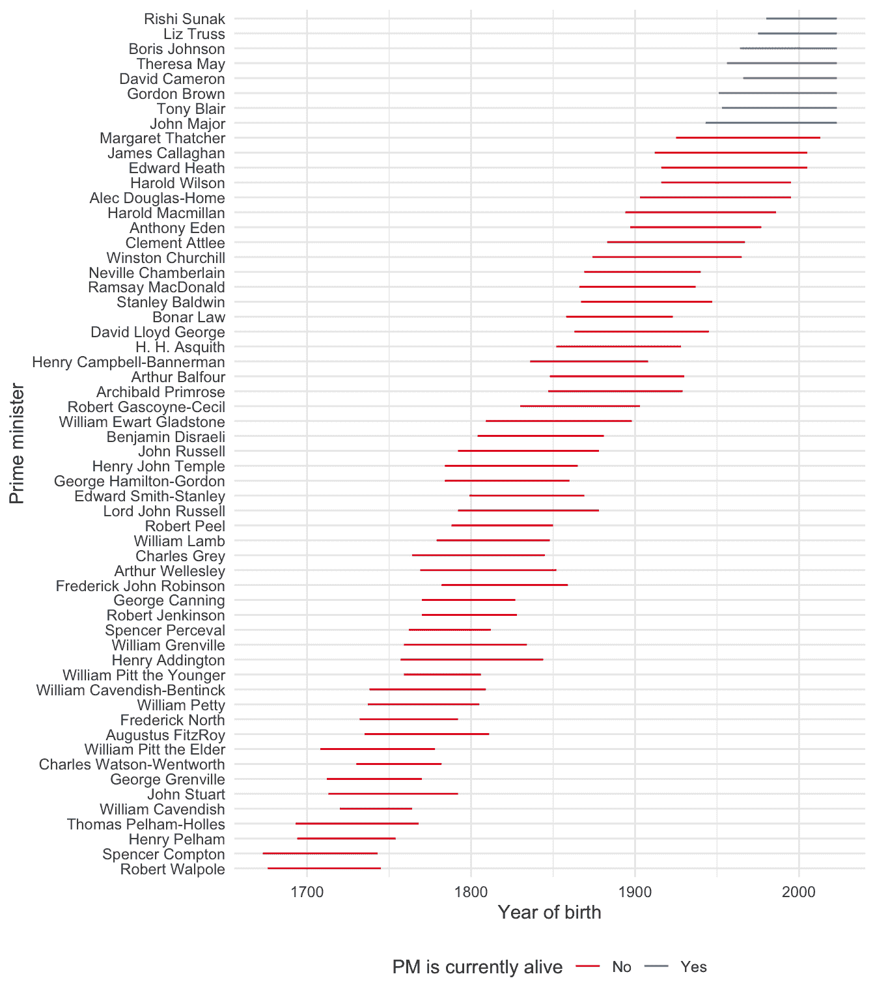

图 7.10：每位英国首相的寿命
  
### 7.3.5 迭代

将文本视为数据令人兴奋，并允许我们探索许多不同的研究问题。我们将在第十七章中借鉴这一点。许多指南假设我们已经拥有一个格式良好的文本数据集，但这在实际中很少见。在本案例研究中，我们将从几个不同的页面下载文件。虽然我们已经看到了两个网络抓取的例子，但那些都只专注于一个页面，而我们通常需要多个页面。这里我们将专注于这种迭代。我们将使用 `download.file()` 进行下载，并使用 `purrr` 将此函数应用于多个站点。您不需要安装或加载该包，因为它是核心 `tidyverse` 的一部分，所以在加载 `tidyverse` 时会自动加载它。

澳大利亚储备银行（RBA）是澳大利亚的中央银行。它负责设定现金利率，即银行间贷款所使用的利率。这一利率尤为重要，对经济中的其他利率有重大影响。每年二月、五月、八月和十一月，RBA 会发布四次货币政策声明，这些声明以 PDF 格式提供。在本例中，我们将下载 2023 年发布的两份声明。

首先，我们建立一个包含所需信息的 tibble。我们将利用 URL 结构中的共性。我们需要为每个状态指定 URL 和本地文件名。

```r
first_bit <- "https://www.rba.gov.au/publications/smp/2023/"
last_bit <- "/pdf/overview.pdf"

statements_of_interest <-
 tibble(
 address =
 c(
 paste0(first_bit, "feb", last_bit),
 paste0(first_bit, "may", last_bit)
 ),
 local_save_name = c("2023-02.pdf", "2023-05.pdf")
 )
```

```r
statements_of_interest
```

```r
# A tibble: 2 × 2
  address                                                        local_save_name
  <chr>                                                          <chr>          
1 https://www.rba.gov.au/publications/smp/2023/feb/pdf/overview… 2023-02.pdf    
2 https://www.rba.gov.au/publications/smp/2023/may/pdf/overview… 2023-05.pdf 
```
我们希望将函数 `download.files()` 应用于这两个语句。为此，我们编写一个函数来下载文件，通知我们文件已下载，等待一段适当的时间，然后继续获取下一个文件。

```r
visit_download_and_wait <-
 function(address_to_visit,
 where_to_save_it_locally) {
 download.file(url = address_to_visit,
 destfile = where_to_save_it_locally)

 print(paste("Done with", address_to_visit, "at", Sys.time()))

 Sys.sleep(sample(5:10, 1))
 }
```

现在，我们使用函数 `walk2()` 将该函数应用于我们的 URL tibble 并保存名称。

```r
walk2(
 statements_of_interest$address,
 statements_of_interest$local_save_name,
 ~ visit_download_and_wait(.x, .y)
)
```

结果是我们已经下载了这些 PDF 文件并将其保存到计算机上。除了自己编写这些函数外，另一种选择是使用 `heapsofpapers` (Alexander and Mahfouz 2021)。该工具包含多种有用的选项，用于下载文件列表，特别是 PDF、CSV 和 txt 文件。例如，Collins 和 Alexander (2022) 使用该工具获取了数千份 PDF 文件，并评估了 COVID-19 研究的可重复性程度。在下一节中，我们将在此基础上讨论如何从 PDF 中获取信息。
  
## 7.4 PDF 文件

PDF 文件由科技公司 Adobe 在 20 世纪 90 年代开发。它们对于文档非常有用，因为其设计目的是在不同的创建环境或查看环境中都能以一致的方式显示。在 iPhone 上查看的 PDF 应该与在 Android 手机或 Linux 桌面上查看的看起来相同。PDF 的一个特点是它可以包含多种对象，例如文本、照片、图表等。然而，这种多样性可能会限制 PDF 直接用作数据的能力。数据首先需要从 PDF 中提取出来。

通常可以从 PDF 中复制和粘贴数据。当 PDF 仅包含文本或常规表格时，这种情况更常见。特别是，如果 PDF 是由 Microsoft Word 或其他文档或表单创建系统等应用程序创建的，那么通常可以以这种方式提取文本数据，因为它们实际上是以文本形式存储在 PDF 中的。我们从这种情况开始。但如果文本以图像形式存储，然后作为 PDF 的一部分，那么提取就不那么容易了。这可能是通过扫描或拍摄实体文档产生的 PDF，以及一些较旧的文档准备软件的情况。我们稍后会讨论这种情况。

与 API 不同，PDF 通常是为人类而非计算机消费而制作的。PDF 的好处在于它们是静态且恒定的。数据可用性高是件好事。但代价是：

+   进行大规模数据处理并不十分有用。

+   我们不知道 PDF 是如何组合的，因此无法确定是否可以信任它。

+   我们无法通过操纵数据来获得我们感兴趣的结果。

从 PDF 中提取数据时，有两个重要方面需要牢记：

1.  以终为始。规划和勾勒我们最终想要的数据集/图表/论文，以减少时间浪费。

1.  从简单开始，然后迭代。构建复杂事物的最快方法通常是先构建一个简单版本，然后逐步添加。开始时，只需尝试让 PDF 的一页甚至一行正常工作。然后在此基础上进行迭代。

我们将通过几个示例，然后进行一个案例研究，收集美国各州的总生育率数据。

### 7.4.1 *《简·爱》*

图 7.11 是一个 PDF 文件，仅包含来自古登堡计划的夏洛蒂·勃朗特小说*《简·爱》*的第一句话（勃朗特 1847）。你可以在此处获取它。如果我们假设它被保存为“first_example.pdf”，那么在安装并加载 `pdftools` 后，就可以将这个单页 PDF 的文本导入 R。


图 7.11：《简·爱》的第一句话

```r
first_example <- pdf_text("first_example.pdf")

first_example

class(first_example)
```

```r
[1] "There was no possibility of taking a walk that day.\n"
```

```r
[1] "character"
```

我们可以看到 PDF 已正确读入，作为一个字符向量。

现在，我们将尝试一个稍微复杂一些的例子，包含*《简·爱》*的前几段（图 7.12）。现在我们还包含了章节标题。


图 7.12：《简·爱》的前几段

我们使用与之前相同的函数。

```r
second_example <- pdf_text("second_example.pdf")
class(second_example)
second_example
```

```r
[1] "character"
```

```r
[1] "CHAPTER I\nThere was no possibility of taking a walk that day. We had been wandering, indeed, in the\nleafless shrubbery an hour in the morning; but since dinner (Mrs. Reed, when there was no\ncompany, dined early) the cold winter wind had brought with it clouds so sombre, and a rain so\npenetrating, that further out-door exercise was now out of the question.\n\nI was glad of it: I never liked long walks, especially on chilly afternoons: dreadful to me was the\ncoming home in the raw twilight, with nipped fingers and toes, and a heart saddened by the\nchidings of Bessie, the nurse, and humbled by the consciousness of my physical inferiority to\nEliza, John, and Georgiana Reed.\n\nThe said Eliza, John, and Georgiana were now clustered round their mama in the drawing-room:\nshe lay reclined on a sofa by the fireside, and with her darlings about her (for the time neither\nquarrelling nor crying) looked perfectly happy. Me, she had dispensed from joining the group;\nsaying, “She regretted to be under the necessity of keeping me at a distance; but that until she\nheard from Bessie, and could discover by her own observation, that I was endeavouring in good\nearnest to acquire a more sociable and childlike disposition, a more attractive and sprightly\nmanner—something lighter, franker, more natural, as it were—she really must exclude me from\nprivileges intended only for contented, happy, little children.”\n\n“What does Bessie say I have done?” I asked.\n\n“Jane, I don’t like cavillers or questioners; besides, there is something truly forbidding in a child\ntaking up her elders in that manner. Be seated somewhere; and until you can speak pleasantly,\nremain silent.”\n\nA breakfast-room adjoined the drawing-room, I slipped in there. It contained a bookcase: I soon\npossessed myself of a volume, taking care that it should be one stored with pictures. I mounted\ninto the window-seat: gathering up my feet, I sat cross-legged, like a Turk; and, having drawn the\nred moreen curtain nearly close, I was shrined in double retirement.\n\nFolds of scarlet drapery shut in my view to the right hand; to the left were the clear panes of\nglass, protecting, but not separating me from the drear November day. At intervals, while\nturning over the leaves of my book, I studied the aspect of that winter afternoon. Afar, it offered\na pale blank of mist and cloud; near a scene of wet lawn and storm-beat shrub, with ceaseless\nrain sweeping away wildly before a long and lamentable blast.\n"
```

同样，我们有一个字符向量。每行的结尾由“\n”表示，除此之外看起来相当不错。最后，我们考虑前两页。

```r
third_example <- pdf_text("third_example.pdf")
class(third_example)
third_example
```

```r
[1] "character"
```

```r
[1] "CHAPTER I\nThere was no possibility of taking a walk that day. We had been wandering, indeed, in the\nleafless shrubbery an hour in the morning; but since dinner (Mrs. Reed, when there was no\ncompany, dined early) the cold winter wind had brought with it clouds so sombre, and a rain so\npenetrating, that further out-door exercise was now out of the question.\n\nI was glad of it: I never liked long walks, especially on chilly afternoons: dreadful to me was the\ncoming home in the raw twilight, with nipped fingers and toes, and a heart saddened by the\nchidings of Bessie, the nurse, and humbled by the consciousness of my physical inferiority to\nEliza, John, and Georgiana Reed.\n\nThe said Eliza, John, and Georgiana were now clustered round their mama in the drawing-room:\nshe lay reclined on a sofa by the fireside, and with her darlings about her (for the time neither\nquarrelling nor crying) looked perfectly happy. Me, she had dispensed from joining the group;\nsaying, “She regretted to be under the necessity of keeping me at a distance; but that until she\nheard from Bessie, and could discover by her own observation, that I was endeavouring in good\nearnest to acquire a more sociable and childlike disposition, a more attractive and sprightly\nmanner—something lighter, franker, more natural, as it were—she really must exclude me from\nprivileges intended only for contented, happy, little children.”\n\n“What does Bessie say I have done?” I asked.\n\n“Jane, I don’t like cavillers or questioners; besides, there is something truly forbidding in a child\ntaking up her elders in that manner. Be seated somewhere; and until you can speak pleasantly,\nremain silent.”\n\nA breakfast-room adjoined the drawing-room, I slipped in there. It contained a bookcase: I soon\npossessed myself of a volume, taking care that it should be one stored with pictures. I mounted\ninto the window-seat: gathering up my feet, I sat cross-legged, like a Turk; and, having drawn the\nred moreen curtain nearly close, I was shrined in double retirement.\n\nFolds of scarlet drapery shut in my view to the right hand; to the left were the clear panes of\nglass, protecting, but not separating me from the drear November day. At intervals, while\nturning over the leaves of my book, I studied the aspect of that winter afternoon. Afar, it offered\na pale blank of mist and cloud; near a scene of wet lawn and storm-beat shrub, with ceaseless\nrain sweeping away wildly before a long and lamentable blast.\n\nI returned to my book—Bewick’s History of British Birds: the letterpress thereof I cared little\nfor, generally speaking; and yet there were certain introductory pages that, child as I was, I could\nnot pass quite as a blank. They were those which treat of the haunts of sea-fowl; of “the solitary\nrocks and promontories” by them only inhabited; of the coast of Norway, studded with isles from\nits southern extremity, the Lindeness, or Naze, to the North Cape—\n\n“Where the Northern Ocean, in vast whirls,\nBoils round the naked, melancholy isles\n"
[2] "Of farthest Thule; and the Atlantic surge\nPours in among the stormy Hebrides.”\n\nNor could I pass unnoticed the suggestion of the bleak shores of Lapland, Siberia, Spitzbergen,\nNova Zembla, Iceland, Greenland, with “the vast sweep of the Arctic Zone, and those forlorn\nregions of dreary space,—that reservoir of frost and snow, where firm fields of ice, the\naccumulation of centuries of winters, glazed in Alpine heights above heights, surround the pole,\nand concentre the multiplied rigours of extreme cold.” Of these death-white realms I formed an\nidea of my own: shadowy, like all the half-comprehended notions that float dim through\nchildren’s brains, but strangely impressive. The words in these introductory pages connected\nthemselves with the succeeding vignettes, and gave significance to the rock standing up alone in\na sea of billow and spray; to the broken boat stranded on a desolate coast; to the cold and ghastly\nmoon glancing through bars of cloud at a wreck just sinking.\n\nI cannot tell what sentiment haunted the quite solitary churchyard, with its inscribed headstone;\nits gate, its two trees, its low horizon, girdled by a broken wall, and its newly-risen crescent,\nattesting the hour of eventide.\n\nThe two ships becalmed on a torpid sea, I believed to be marine phantoms.\n\nThe fiend pinning down the thief’s pack behind him, I passed over quickly: it was an object of\nterror.\n\nSo was the black horned thing seated aloof on a rock, surveying a distant crowd surrounding a\ngallows.\n\nEach picture told a story; mysterious often to my undeveloped understanding and imperfect\nfeelings, yet ever profoundly interesting: as interesting as the tales Bessie sometimes narrated on\nwinter evenings, when she chanced to be in good humour; and when, having brought her ironing-\ntable to the nursery hearth, she allowed us to sit about it, and while she got up Mrs. Reed’s lace\nfrills, and crimped her nightcap borders, fed our eager attention with passages of love and\nadventure taken from old fairy tales and other ballads; or (as at a later period I discovered) from\nthe pages of Pamela, and Henry, Earl of Moreland.\n\nWith Bewick on my knee, I was then happy: happy at least in my way. I feared nothing but\ninterruption, and that came too soon. The breakfast-room door opened.\n\n“Boh! Madam Mope!” cried the voice of John Reed; then he paused: he found the room\napparently empty.\n\n“Where the dickens is she!” he continued. “Lizzy! Georgy! (calling to his sisters) Joan is not\nhere: tell mama she is run out into the rain—bad animal!”\n\n“It is well I drew the curtain,” thought I; and I wished fervently he might not discover my hiding-\nplace: nor would John Reed have found it out himself; he was not quick either of vision or\nconception; but Eliza just put her head in at the door, and said at once—\n" 
```

请注意，第一页是字符向量的第一个元素，第二页是第二个元素。由于我们对矩形数据最为熟悉，我们将尽快将其转换为该格式。然后，我们就可以使用 `tidyverse` 中的函数来处理它。

首先，我们希望将字符向量转换为 tibble。此时，我们可能还想添加页码。

```r
jane_eyre <- tibble(
 raw_text = third_example,
 page_number = c(1:2)
)
```

然后，我们希望将行分开，使每一行成为一个观测值。我们可以通过查找“\n”来实现，记住我们需要转义反斜杠，因为它是一个特殊字符。

```r
jane_eyre <-
 separate_rows(jane_eyre, raw_text, sep = "\\n", convert = FALSE)

jane_eyre
```

```r
# A tibble: 93 × 2
   raw_text                                                          page_number
   <chr>                                                                   <int>
 1 "CHAPTER I"                                                                 1
 2 "There was no possibility of taking a walk that day. We had been…           1
 3 "leafless shrubbery an hour in the morning; but since dinner (Mr…           1
 4 "company, dined early) the cold winter wind had brought with it …           1
 5 "penetrating, that further out-door exercise was now out of the …           1
 6 ""                                                                          1
 7 "I was glad of it: I never liked long walks, especially on chill…           1
 8 "coming home in the raw twilight, with nipped fingers and toes, …           1
 9 "chidings of Bessie, the nurse, and humbled by the consciousness…           1
10 "Eliza, John, and Georgiana Reed."                                          1
# ℹ 83 more rows
```
  
### 7.4.2 美国的总生育率

美国卫生与公众服务部生命统计报告提供了各州的总和生育率信息。总和生育率是指如果女性在整个育龄期内都经历当前特定年龄的生育率，平均每位女性生育的子女数。数据以 PDF 格式提供。我们可以使用上述方法将数据提取到数据集中。

我们感兴趣的表格位于一个 PDF 文件的第 40 页，该文件可在此处[此处](https://www.cdc.gov/nchs/data/nvsr/nvsr50/nvsr50_05.pdf)或[此处](https://github.com/RohanAlexander/telling_stories/blob/main/inputs/pdfs/dhs/year_2000.pdf)获取。感兴趣的列标记为："总和生育率"（图 7.13）。

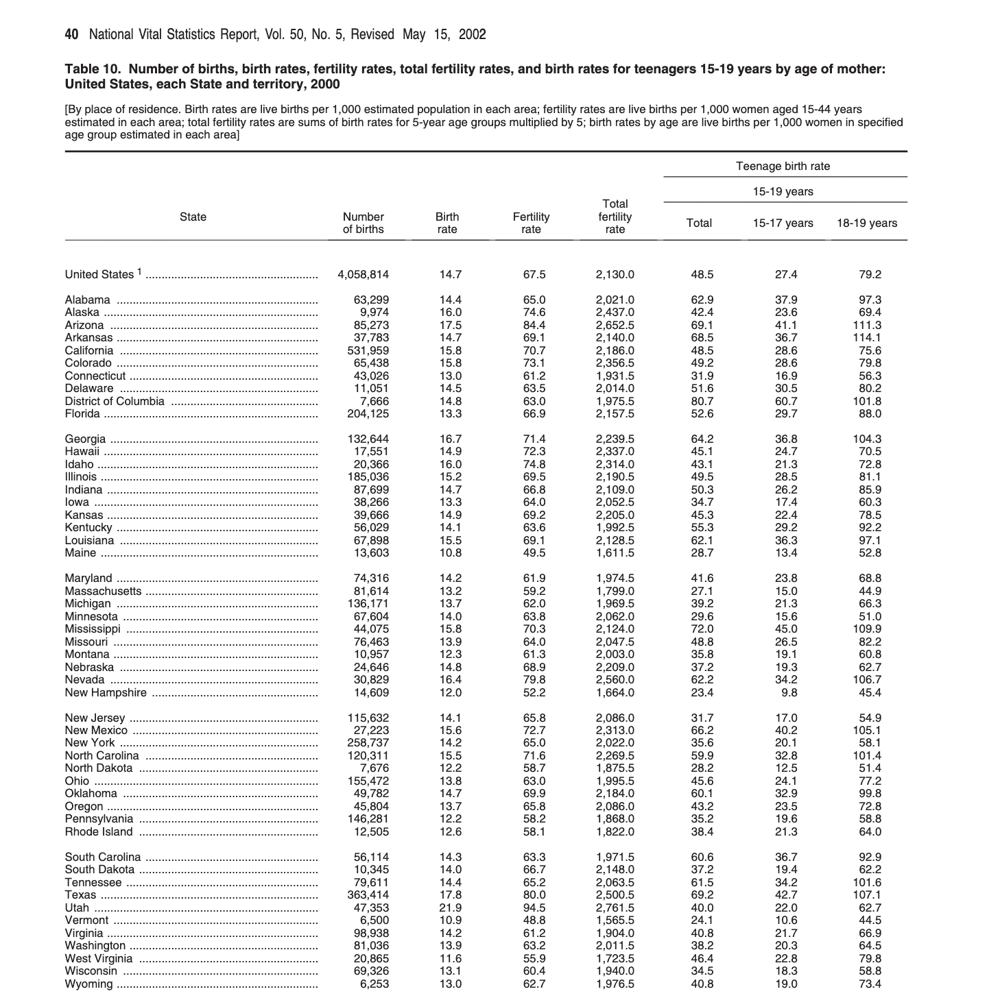

图 7.13：2000 年生命统计报告示例

从 PDF 中提取数据的第一步是勾勒出我们最终想要的结果。PDF 通常包含大量信息，因此我们应该明确需要什么。这有助于保持专注，防止范围蔓延，并且在考虑数据检查时也很有帮助。我们实际上是在纸上写下我们的设想。在本例中，我们需要一个包含州、年份和总和生育率列的表格（图 7.14）。

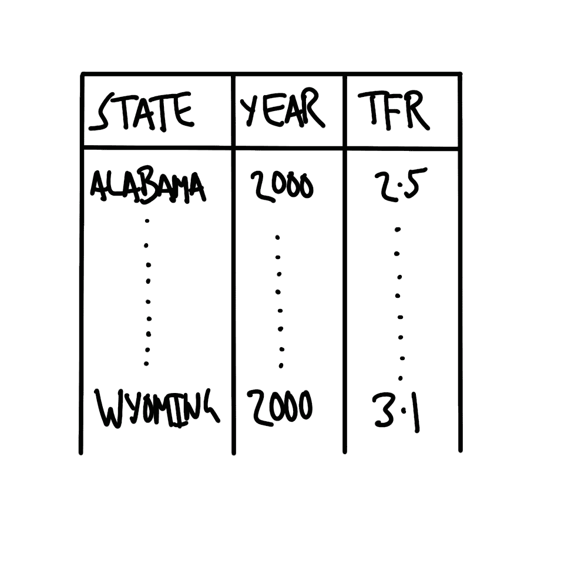

图 7.14：计划的美国各州总和生育率数据集

我们对此 PDF 文件中特定表格的特定列感兴趣。遗憾的是，接下来的步骤并无神奇之处。第一步需要在线找到 PDF 文件，确定每个文件的链接，并搜索感兴趣的页面和列名。我们已经构建了一个包含所需详细信息的 CSV 文件，可以将其读入。

```r
summary_tfr_dataset <- read_csv(
 paste0("https://raw.githubusercontent.com/RohanAlexander/",
 "telling_stories/main/inputs/tfr_tables_info.csv")
 )
```

表 7.3：总和生育率表的年份及相关数据*

| 年份 | 页码 | 表格 | 列名 | URL |
| --- | --- | --- | --- | --- |
| 2000 | 40 | 10 | 总和生育率 | https://www.cdc.gov/nchs/data/nvsr/nvsr50/nvsr50_05.pdf |

我们首先使用 `download.file()` 下载并保存 PDF 文件。

```r
download.file(
 url = summary_tfr_dataset$url[1],
 destfile = "year_2000.pdf"
)
```

然后，我们使用 `pdftools` 包中的 `pdf_text()` 函数将 PDF 作为字符向量读入。接着将其转换为 tibble，以便我们可以使用熟悉的动词对其进行操作。

```r
dhs_2000 <- pdf_text("year_2000.pdf")
```

```r
dhs_2000_tibble <- tibble(raw_data = dhs_2000)

head(dhs_2000_tibble)


```r
# A tibble: 6 × 1
  raw_data                                                                      
  <chr>                                                                         
1 "Volume 50, Number 5                                                         …
2 "2   National Vital Statistics Report, Vol. 50, No. 5, February 12, 2002\n\n\…
3 "                                                                            …
4 "4   National Vital Statistics Report, Vol. 50, No. 5, February 12, 2002\n\n\…
5 "                                                                            …
6 "6   National Vital Statistics Report, Vol. 50, No. 5, February 12, 2002\n\n …
```
提取感兴趣的页面（请记住，每个页面都是字符向量的一个元素，因此也是 tibble 中的一行）。*

```r
dhs_2000_relevant_page <-
 dhs_2000_tibble |>
 slice(summary_tfr_dataset$page[1])

head(dhs_2000_relevant_page)
```

```r
# A tibble: 1 × 1
  raw_data                                                                      
  <chr>                                                                         
1 "40 National Vital Statistics Report, Vol. 50, No. 5, Revised May 15, 20022\n…
```
我们希望拆分这些行，并使用 `tidyr` 包（核心 tidyverse 的一部分）中的 `separate_rows()` 函数。*

```r
dhs_2000_separate_rows <-
 dhs_2000_relevant_page |>
 separate_rows(raw_data, sep = "\\n", convert = FALSE)

head(dhs_2000_separate_rows)
```

```r
# A tibble: 6 × 1
  raw_data                                                                      
  <chr>                                                                         
1 "40 National Vital Statistics Report, Vol. 50, No. 5, Revised May 15, 20022"  
2 ""                                                                            
3 "Table 10\. Number of births, birth rates, fertility rates, total fertility ra…
4 "United States, each State and territory, 2000"                               
5 "[By place of residence. Birth rates are live births per 1,000 estimated popu…
6 "estimated in each area; total fertility rates are sums of birth rates for 5-…
```
我们正在寻找可以使用的模式。让我们查看内容的前十行（忽略页面顶部的标题和页码等元素）。*

```r
dhs_2000_separate_rows[13:22, ] |>
 mutate(raw_data = str_remove(raw_data, "\\.{40}"))
```

```r
# A tibble: 10 × 1
   raw_data                                                                     
   <chr>                                                                        
 1 "                                  State                                    …
 2 "                                                                           …
 3 "                                                                           …
 4 ""                                                                           
 5 ""                                                                           
 6 "United States 1 ..............          4,058,814   14.7      67.5      2,1…
 7 ""                                                                           
 8 "Alabama .......................           63,299    14.4      65.0      2,0…
 9 "Alaska ...........................         9,974    16.0      74.6      2,4…
10 "Arizona .........................         85,273    17.5      84.4      2,6…
```
现在只需一行代码。*

```r
dhs_2000_separate_rows[20, ] |>
 mutate(raw_data = str_remove(raw_data, "\\.{40}"))
```

```r
# A tibble: 1 × 1
  raw_data                                                                      
  <chr>                                                                         
1 Alabama .......................           63,299    14.4      65.0      2,021…
```
这已经非常理想了：*

1.  我们使用点号将州名与数据分隔开。

1.  各列之间有一个空格。

我们现在可以将其分成列。首先，我们希望匹配至少有两个点的情况（记住点是一个特殊字符，因此需要转义）。

```r
dhs_2000_separate_columns <-
 dhs_2000_separate_rows |>
 separate(
 col = raw_data,
 into = c("state", "data"),
 sep = "\\.{2,}",
 remove = FALSE,
 fill = "right"
 )

dhs_2000_separate_columns[18:28, ] |>
 select(state, data)
```

```r
# A tibble: 11 × 2
   state                   data                                                 
   <chr>                   <chr>                                                
 1 "United States 1 "      "          4,058,814   14.7      67.5      2,130.0  …
 2 ""                       <NA>                                                
 3 "Alabama "              "           63,299    14.4      65.0      2,021.0   …
 4 "Alaska "               "         9,974    16.0      74.6      2,437.0      …
 5 "Arizona "              "         85,273    17.5      84.4      2,652.5     …
 6 "Arkansas "             "          37,783    14.7      69.1      2,140.0    …
 7 "California "           "        531,959    15.8      70.7      2,186.0     …
 8 "Colorado "             "          65,438    15.8      73.1      2,356.5    …
 9 "Connecticut "          "           43,026    13.0      61.2      1,931.5   …
10 "Delaware "             "           11,051    14.5      63.5      2,014.0   …
11 "District of Columbia " "                7,666    14.8      63.0      1,975.…
```
然后我们基于空格分隔数据。空格数量不一致，因此我们首先使用 `stringr` 包中的 `str_squish()` 函数将多个连续空格压缩为一个。

```r
dhs_2000_separate_data <-
 dhs_2000_separate_columns |>
 mutate(data = str_squish(data)) |>
 separate(
 col = data,
 into = c(
 "number_of_births",
 "birth_rate",
 "fertility_rate",
 "TFR",
 "teen_births_all",
 "teen_births_15_17",
 "teen_births_18_19"
 ),
 sep = "\\s",
 remove = FALSE
 )

dhs_2000_separate_data[18:28, ] |>
 select(-raw_data, -data)
```

```r
# A tibble: 11 × 8
   state        number_of_births birth_rate fertility_rate TFR   teen_births_all
   <chr>        <chr>            <chr>      <chr>          <chr> <chr>          
 1 "United Sta… 4,058,814        14.7       67.5           2,13… 48.5           
 2 ""           <NA>             <NA>       <NA>           <NA>  <NA>           
 3 "Alabama "   63,299           14.4       65.0           2,02… 62.9           
 4 "Alaska "    9,974            16.0       74.6           2,43… 42.4           
 5 "Arizona "   85,273           17.5       84.4           2,65… 69.1           
 6 "Arkansas "  37,783           14.7       69.1           2,14… 68.5           
 7 "California… 531,959          15.8       70.7           2,18… 48.5           
 8 "Colorado "  65,438           15.8       73.1           2,35… 49.2           
 9 "Connecticu… 43,026           13.0       61.2           1,93… 31.9           
10 "Delaware "  11,051           14.5       63.5           2,01… 51.6           
11 "District o… 7,666            14.8       63.0           1,97… 80.7           
# ℹ 2 more variables: teen_births_15_17 <chr>, teen_births_18_19 <chr>
```
这一切看起来相当不错。剩下的唯一事情就是清理一下。

```r
dhs_2000_cleaned <-
 dhs_2000_separate_data |>
 select(state, TFR) |>
 slice(18:74) |>
 drop_na() |> 
 mutate(
 TFR = str_remove_all(TFR, ","),
 TFR = as.numeric(TFR),
 state = str_trim(state),
 state = if_else(state == "United States 1", "Total", state)
 )
```

并运行一些检查，例如确保我们包含了所有州。

```r
all(state.name %in% dhs_2000_cleaned$state)
```

```r
[1] TRUE
```
这样我们就完成了（表 7.4）。我们可以看到美国各州的总和生育率分布相当广泛（图 7.15）。犹他州最高，佛蒙特州最低。

```r
dhs_2000_cleaned |>
 slice(1:10) |>
 tt() |> 
 style_tt(j = 1:2, align = "lr") |> 
 format_tt(digits = 0, num_mark_big = ",", num_fmt = "decimal") |> 
 setNames(c("State", "TFR"))
```

表 7.4：2000-2019 年美国各州总和生育率数据集的前十行

| 州 | 总和生育率 |
| --- | --- |
| 总计 | 2,130 |
| 阿拉巴马州 | 2,021 |
| 阿拉斯加州 | 2,437 |
| 亚利桑那州 | 2,652 |
| 阿肯色州 | 2,140 |
| 加利福尼亚州 | 2,186 |
| 科罗拉多州 | 2,356 |
| 康涅狄格州 | 1,932 |
| 特拉华州 | 2,014 |

| 哥伦比亚特区 | 1,976 |*  ```r
dhs_2000_cleaned |> 
 filter(state != "Total") |> 
 ggplot(aes(x = TFR, y = fct_reorder(state, TFR))) +
 geom_point() +
 theme_classic() +
 labs(y = "State", x = "Total Fertility Rate")
```

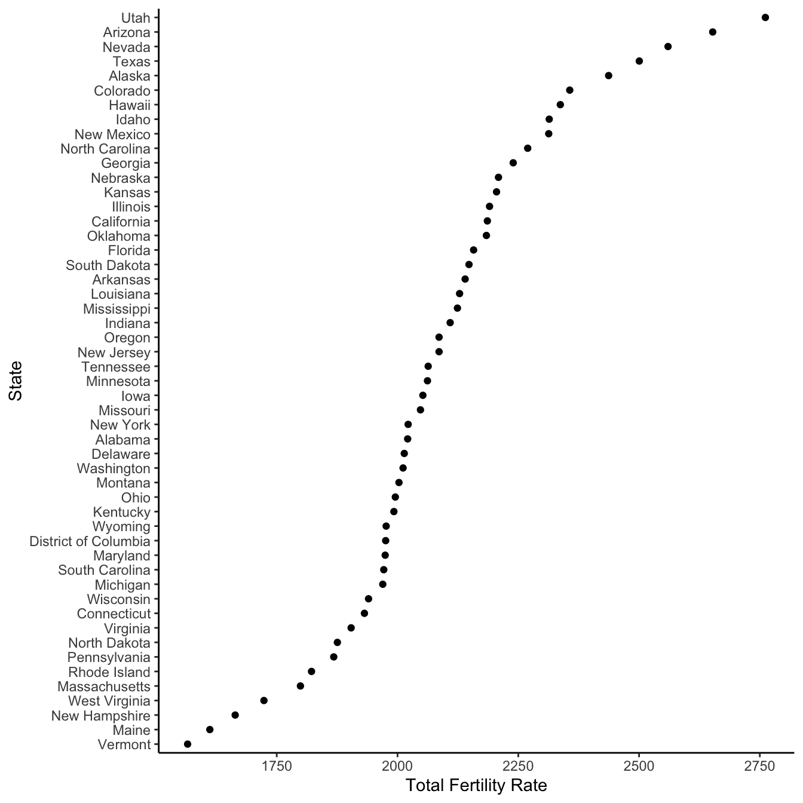

图 7.15：2000 年美国各州总和生育率分布*  *Healy (2022) 在另一个上下文中提供了使用此方法的另一个例子。
  
### 7.4.3 光学字符识别

以上所有操作都基于一个前提，即我们拥有一个已经“数字化”的 PDF 文件。但如果它是由图像组成的呢，比如扫描的结果。这类 PDF 通常包含非结构化数据，意味着数据既没有标签，也没有以规则的方式组织。光学字符识别（OCR）是一个将文本图像转换为实际文本的过程。尽管对人类读者来说，OCR 前后的 PDF 可能没有太大区别，但 PDF 会因此变得机器可读，从而允许我们使用脚本（Cheriet et al. 2007）。自 20 世纪 50 年代以来，OCR 就被用于解析字符图像，最初采用手动方法。虽然手动方法仍然是黄金标准，但由于成本效益的原因，它已基本被统计模型所取代。

在这个例子中，我们使用 `tesseract` 对文档进行 OCR。这是对 Tesseract 开源 OCR 引擎的一个 `R` 语言封装。Tesseract 最初由惠普公司在 20 世纪 80 年代开发，现在主要由谷歌开发。安装并加载 `tesseract` 后，我们可以使用 `ocr()` 函数。

让我们看一个使用《*简·爱*》第一页扫描件的例子（图 7.16）。

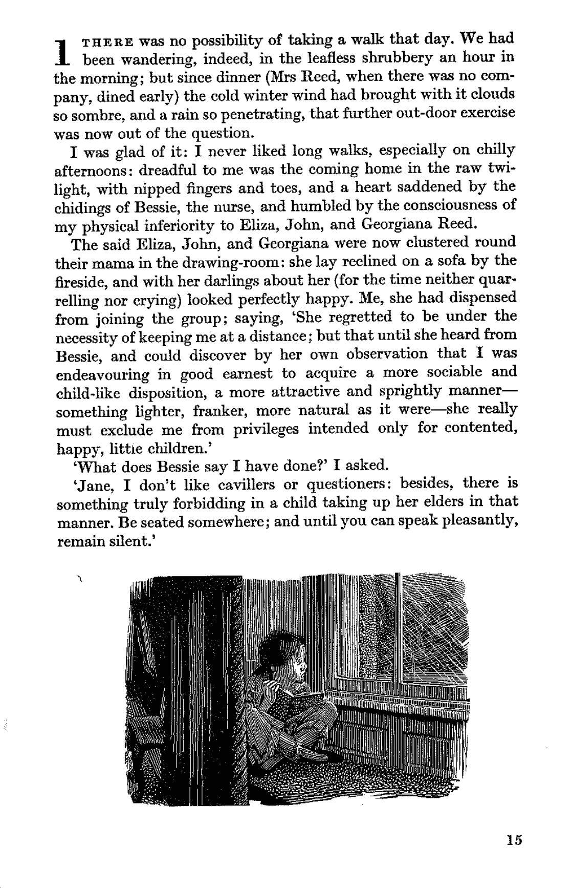

图 7.16：《简·爱》第一页扫描件

```r
text <- ocr(
 here("jane_scan.png"),
 engine = tesseract("eng")
)
cat(text)
```

```r
1 THERE was no possibility of taking a walk that day. We had
been wandering, indeed, in the leafless shrubbery an hour in
the morning; but since dinner (Mrs Reed, when there was no com-
pany, dined early) the cold winter wind had brought with it clouds
so sombre, and a rain so penetrating, that further out-door exercise

was now out of the question.

I was glad of it: I never liked long walks, especially on chilly
afternoons: dreadful to me was the coming home in the raw twi-
light, with nipped fingers and toes, and a heart saddened by the
chidings of Bessie, the nurse, and humbled by the consciousness of
my physical inferiority to Eliza, John, and Georgiana Reed.

The said Eliza, John, and Georgiana were now clustered round
their mama in the drawing-room: she lay reclined on a sofa by the
fireside, and with her darlings about her (for the time neither quar-
relling nor crying) looked perfectly happy. Me, she had dispensed
from joining the group; saying, ‘She regretted to be under the
necessity of keeping me at a distance; but that until she heard from
Bessie, and could discover by her own observation that I was
endeavouring in good earnest to acquire a more sociable and
child-like disposition, a more attractive and sprightly manner—
something lighter, franker, more natural as it were—she really
must exclude me from privileges intended only for contented,
happy, littie children.’

‘What does Bessie say I have done?’ I asked.

‘Jane, I don’t like cavillers or questioners: besides, there is
something truly forbidding in a child taking up her elders in that
manner. Be seated somewhere; and until you can speak pleasantly,
remain silent.’

. a TV

i; STA AEE LT JEUNE TIS Sis
a) | | | a) ee
i Ni 4 | | | ae ST | | a eg

ce A FEM yi | eS ee
Pe TT (SB ag ie pe
is \ ie mu) i i es SS
veal | Dy eT |
pa || i er itl |

aes : Oty ZR UIE OR HMR Sa ote ariel
SEEN ed — =
15
```

总体而言，结果不算太差。OCR 是一个有用的工具，但并不完美，生成的数据在清洗方面可能需要额外关注。例如，在图 7.16 的 OCR 结果中，我们看到了一些需要修正的不规则之处。各种选项，例如专注于特定的目标数据和增加对比度，可能会有所帮助。其他流行的 OCR 引擎包括 Amazon Textract、Google Vision API 和 ABBYY。
  
## 7.5 练习

### 练习

1.  *（规划）* 考虑以下场景：*五名本科生——Matt、Ash、Jacki、Rol 和 Mike——在 100 天里，每人每天阅读一定页数的书籍。其中两名本科生是情侣，因此他们的阅读页数呈正相关，但其他所有人的阅读量都是独立的。* 请草拟数据集可能的样子，然后草拟一张可以展示所有观测值的图表。

1.  *（模拟）* 请进一步考虑所描述的场景并模拟该情况（注意某些变量之间的关系）。然后基于模拟数据编写五个测试。

1.  *（获取）* 请获取一些与实际场景类似的真实数据，并添加一个脚本，将模拟测试更新为这些真实数据。

1.  *（探索）* 使用真实数据构建图表和表格。

1.  *（沟通）* 请撰写一些文字来配合图表和表格。将代码适当地分离到 `R` 文件和 Quarto 文档中。提交一个高质量 GitHub 仓库的链接。

### 测验

1.  在数据收集的语境中，什么是 API（单选）？

    1.  一组用于本地处理数据的标准化函数。

    1.  一种用于结构化数据的标记语言。

    1.  一种供网络浏览器渲染 HTML 内容的协议。

    1.  服务器提供的一种接口，允许他人使用代码请求数据。

1.  使用 API 收集数据时，以下哪项可用于身份验证（单选）？

    1.  在请求中提供 API 密钥或令牌。

    1.  使用浏览器中存储的 Cookie。

    1.  禁用 SSL 验证。

    1.  修改客户端机器上的 hosts 文件。

1.  考虑以下使用 `gh` 访问 GitHub API 的代码。`heapsofpapers` 的代码仓库是何时创建的（单选）？

    1.  2021-02-23

    1.  2021-03-06

    1.  2021-05-25

    1.  2021-04-27

```r
# Based on Tyler Bradley and Monica Alexander
repos <- gh("/users/RohanAlexander/repos", per_page = 100)
repo_info <- tibble(
 name = map_chr(repos, "name"),
 created = map_chr(repos, "created_at"),
 full_name = map_chr(repos, "full_name"),
)
```

4.  请参考联合国的[数据 API](https://population.un.org/dataportal/about/dataapi) 以及 Schmertmann (2022) 关于如何使用它的介绍性说明。阿根廷的位置代码是 32。修改以下代码，以确定阿根廷 1995 年 20 岁人群的单年生育率是多少（单选）？

    1.  147.679

    1.  172.988

    1.  204.124

    1.  128.665

```r
my_indicator <- 68
my_location <- 50
my_startyr <- 1996
my_endyr <- 1999

url <- paste0(
 "https://population.un.org/dataportalapi/api/v1",
 "/data/indicators/", my_indicator, "/locations/",
 my_location, "/start/", my_startyr, "/end/",
 my_endyr, "/?format=csv"
)

un_data <- read_delim(file = url, delim = "|", skip = 1)

un_data |>
 filter(AgeLabel == 25 & TimeLabel == 1996) |>
 select(Value)
```

5.  `httr` 包中 `GET()` 函数的主要参数是什么（单选）？

    1.  “网址”

    1.  “网站”

    1.  “域名”

    1.  “位置”

1.  在网络抓取中，尊重 `robots.txt` 的目的是什么（单选）？

    1.  为了确保抓取的数据准确无误。

    1.  通过遵循网站的爬取指南，以避免违反网站的服务条款。

    1.  为了加快抓取过程。

    1.  为了获取身份验证凭据。

1.  在解析代码时，我们通常利用网站的哪些特性（单选）？

    1.  HTML/CSS 标记。

    1.  Cookies。

    1.  Facebook 信标。

    1.  代码注释。

1.  抓取时应遵循哪些原则（多选）？

    1.  如果可能，避免这样做

    1.  遵循网站的指引

    1.  放慢速度

    1.  使用手术刀而非斧头。

1.  以下哪项**不是**执行网络抓取时的推荐原则（单选）？

    1.  遵守网站的服务条款。

    1.  通过减慢请求速度来减少对网站服务器的影响。

    1.  抓取所有数据，无论是否必要。

    1.  避免重新发布抓取的页面。

1.  以下哪项作为正则表达式的一部分，可以匹配句号（提示：参见“字符串”速查表）（单选）？

    1.  “.”

    1.  “\.”

    1.  “\\\.”

1.  对于人口统计数据（例如某国特定年份的出生人数），我们可能希望使用哪三项检查？

1.  以下哪些是 `purrr` 包中的函数（多选）？

    1.  `map()`

    1.  `walk()`

    1.  `run()`

    1.  `safely()`

1.  列表中项目的 HTML 标签是什么（单选）？

    1.  `li`

    1.  `body`

    1.  `b`

    1.  `em`

1.  如果我们有一个名为“names”的列，其中包含文本“rohan_alexander”，并希望基于下划线将其拆分为名和姓，应该使用哪个函数（单选）？

    1.  `spacing()`

    1.  `slice()`

    1.  `separate()`

    1.  `text_to_columns()`

1.  什么是光学字符识别（OCR）（单选）？

    1.  将手写笔记转换为打字文本的过程。

    1.  一种将文本图像转换为机器可读文本的方法。

    1.  一种从 API 解析结构化数据的技术。

    1.  一种优化代码以加快执行速度的方法。

1.  `R` 中哪个函数可用于暂停执行指定时间，有助于在网络抓取时遵守速率限制（单选）？

    1.  `sleep()`

    1.  `pause()`

    1.  `sys.sleep()`

    1.  `wait()`

1.  以下哪项是从 PDF 中提取数据时面临的挑战（单选）？

    1.  PDF 文件无法被任何编程语言直接读取。

    1.  PDF 是为保持人类阅读一致性而设计的，而非用于数据提取。

    1.  PDF 总是包含无法处理的无结构数据。

    1.  PDF 已加密，没有密码无法访问。

1.  对扫描文档执行 OCR 时，可能影响文本识别准确性的常见问题是什么（单选）？

    1.  图像的文件大小。

    1.  所使用的编程语言。

    1.  扫描图像的质量和分辨率。

    1.  文档的页数。

1.  根据 Cirone 和 Spirling (2021)，在处理历史数据时，以下哪项**不是**常见的推断威胁（单选）？

    1.  选择偏差。

    1.  确认偏差。

    1.  时间衰减。

    1.  边缘化群体的过度代表。

1.  根据 Cirone 和 Spirling (2021)，历史政治经济学（以及更广泛意义上）中的“醉汉寻物”问题是什么（单选）？

    1.  选择最容易获取的数据而不考虑代表性。

    1.  仅从精英来源搜索数据。

    1.  研究中过度依赖数字档案。

    1.  因现代偏见而误解历史文本。

1.  根据 Cirone 和 Spirling (2021)，DAGs 扮演什么角色（选择一项）？

    1.  它们提高了历史数据 OCR 的准确性。

    1.  它们从历史资料中生成机器可读文本。

    1.  它们帮助研究者可视化并处理因果关系。

    1.  它们作为元数据来组织历史档案。

1.  根据 Johnson (2021)，美国人口普查局早期监狱数据收集的重点是什么（选择一项）？

    1.  记录健康状况。

    1.  调查量刑中的种族差异。

    1.  记录社会经济背景和就业情况。

    1.  统计被监禁人数及其人口统计数据。

1.  根据 Johnson (2021)，社区来源的监狱数据与政府来源的监狱数据有何不同（选择一项）？

    1.  社区数据由政府官员收集。

    1.  社区数据强调生活经历和监狱条件。

    1.  政府数据不如社区数据可靠。

    1.  政府数据比社区数据更可靠。

1.  根据 Johnson (2021)，以下哪项是政府来源数据的局限性（选择一项）？

    1.  政府来源的数据不如学术研究可靠。

    1.  它低估了监狱人口。

    1.  它可能复制了早期数据收集中的偏见和假设。

    1.  它只关注非暴力罪犯。

1.  根据 Johnson (2021)，查看监狱数据收集时应提出什么问题（选择一项）？

    1.  “谁建立了数据基础设施以及为什么？”

    1.  “经济因素如何影响监狱管理？”

    1.  “这些数据是否被用于制定公共政策？”.

### 课堂活动

+   使用[起始文件夹](https://github.com/RohanAlexander/starter_folder)并创建一个新仓库。通过 API 获取今日的 NASA 每日天文图，然后将其添加到仓库中的 Quarto 文档里。

+   使用 Spotify API 确定碧昂斯的哪张专辑平均“可舞性”最高？

+   请制作一个图表来回答卡米拉·卡贝洛在 2016 年 12 月离开五美组合是否影响了她们录音室专辑中歌曲的效价。¹下面是一些有用的清理代码。

```r
fifth_harmony |>
 filter(album_name %in% c("Reflection", "7/27 (Deluxe)", "Fifth Harmony")) |> 
 mutate(album_release_date = ymd(album_release_date)) |>
 filter(album_release_date != "2017-10-29") # There is a essentially duplicate album
```

构建一个与图 7.10 等效的图表，但针对加拿大。

+   *论文评述：* 请阅读 Kish (1959)，并撰写至少一页的评述，结合你熟悉的一个例子。

### 任务

请重做网页抓取示例，但针对以下国家之一：[澳大利亚](https://en.wikipedia.org/wiki/List_of_prime_ministers_of_Australia)、[加拿大](https://en.wikipedia.org/wiki/List_of_prime_ministers_of_Canada)、[印度](https://en.wikipedia.org/wiki/List_of_prime_ministers_of_India)或[新西兰](https://en.wikipedia.org/wiki/List_of_prime_ministers_of_New_Zealand)。

规划、收集并清理数据，然后利用这些数据创建一个与上述类似的表格。撰写几段文字阐述你的发现。接着，用几段文字说明数据来源、你收集的内容以及具体操作过程。哪些环节花费的时间超出预期？何时开始感到有趣？下次再做类似工作时，你会采取哪些不同的做法？你的提交内容应至少两页，但很可能更多。

使用 Quarto，并包含适当的标题、作者、日期、GitHub 仓库链接以及引用。提交 PDF 格式的文件。

Alexander, Rohan, 和 A Mahfouz。2021 年。*heapsofpapers: 轻松下载大量 PDF 和 CSV 文件*。[`CRAN.R-project.org/package=heapsofpapers`](https://CRAN.R-project.org/package=heapsofpapers)。Arel-Bundock, Vincent。2024 年。*tinytable: 适用于“HTML”、“LaTeX”、“Markdown”、“Word”、“PNG”、“PDF”和“Typst”格式的简单可配置表格*。[`vincentarelbundock.github.io/tinytable/`](https://vincentarelbundock.github.io/tinytable/)。Bailey, Rosemary。2008 年。*比较实验设计*。剑桥：剑桥大学出版社。[`doi.org/10.1017/CBO9780511611483`](https://doi.org/10.1017/CBO9780511611483)。Bor, Jacob, Atheendar Venkataramani, David Williams, 和 Alexander Tsai。2018 年。“警察枪击事件及其对非裔美国人心理健康的溢出效应：一项基于人群的准实验研究。”*《柳叶刀》* 392 (10144): 302–10。[`doi.org/10.1016/s0140-6736(18)31130-9`](https://doi.org/10.1016/s0140-6736(18)31130-9)。Brontë, Charlotte。1847 年。*《简·爱》*。[`www.gutenberg.org/files/1260/1260-h/1260-h.htm`](https://www.gutenberg.org/files/1260/1260-h/1260-h.htm)。Bryan, Jenny, 和 Hadley Wickham。2021 年。*gh: GitHub API*。[`CRAN.R-project.org/package=gh`](https://CRAN.R-project.org/package=gh)。Cheriet, Mohamed, Nawwaf Kharma, Cheng-Lin Liu, 和 Ching Suen。2007 年。*字符识别系统：学生与实践者指南*。Wiley 出版社。Cirone, Alexandra, 和 Arthur Spirling。2021 年。“将历史转化为数据：HPE 中的数据收集、测量与推断。”*《历史政治经济学杂志》* 1 (1): 127–54。[`doi.org/10.1561/115.00000005`](https://doi.org/10.1561/115.00000005)。Collins, Annie, 和 Rohan Alexander。2022 年。“COVID-19 预印本的可重复性。”*《科学计量学》* 127: 4655–73。[`doi.org/10.1007/s11192-022-04418-2`](https://doi.org/10.1007/s11192-022-04418-2)。Comer, Benjamin P., 和 Jason R. Ingram。2022 年。“比较 2015-2019 年间的‘致命遭遇’、‘警察暴力地图’和《华盛顿邮报》致命警察枪击数据：一项研究笔记。”*《刑事司法评论》*，一月，073401682110710。[`doi.org/10.1177/07340168211071014`](https://doi.org/10.1177/07340168211071014)。Crawford, Kate。2021 年。*《人工智能图集》*。第一版。纽黑文：耶鲁大学出版社。Cummins, Neil。2022 年。“英格兰王朝的隐性财富，1892–2016。”*《经济史评论》* 75 (3): 667–702。[`doi.org/10.1111/ehr.13120`](https://doi.org/10.1111/ehr.13120)。Eisenstein, Michael。2022 年。“需要网络数据？这是如何获取它们的方法。”*《自然》* 607: 200–201。[`doi.org/10.1038/d41586-022-01830-9`](https://doi.org/10.1038/d41586-022-01830-9)。Firke, Sam。2023 年。*janitor: 用于检查和清理脏数据的简单工具*。[`CRAN.R-project.org/package=janitor`](https://CRAN.R-project.org/package=janitor)。Grolemund, Garrett, 和 Hadley Wickham。2011 年。“使用 lubridate 轻松处理日期和时间。”*《统计软件杂志》* 40 (3): 1–25。[`doi.org/10.18637/jss.v040.i03`](https://doi.org/10.18637/jss.v040.i03)。Hackett, Robert。2016 年。“研究人员因发布 7 万名 OkCupid 用户数据引发轩然大波。”*《财富》*，五月。[`fortune.com/2016/05/18/okcupid-data-research/`](https://fortune.com/2016/05/18/okcupid-data-research/)。Healy, Kieran。2022 年。“各有各的不幸，”七月。[`kieranhealy.org/blog/archives/2022/07/22/unhappy-in-its-own-way/`](https://kieranhealy.org/blog/archives/2022/07/22/unhappy-in-its-own-way/)。Jenkins, Jennifer, Steven Rich, Andrew Ba Tran, Paige Moody, Julie Tate, 和 Ted Mellnik。2022 年。“《华盛顿邮报》如何审查美国的警察枪击事件。”[`www.washingtonpost.com/investigations/2022/12/05/washington-post-fatal-police-shootings-methodology/`](https://www.washingtonpost.com/investigations/2022/12/05/washington-post-fatal-police-shootings-methodology/)。Johnson, Kaneesha。2021 年。“监狱数据收集的两种制度。”*《哈佛数据科学评论》* 3 (3)。[`doi.org/10.1162/99608f92.72825001`](https://doi.org/10.1162/99608f92.72825001)。Kirkegaard, Emil, 和 Julius Bjerrekær。2016 年。“OkCupid 数据集：一个非常庞大的约会网站用户公共数据集。”*《开放差异心理学》*，1–10。[`doi.org/10.26775/ODP.2016.11.03`](https://doi.org/10.26775/ODP.2016.11.03)。Kish, Leslie。1959 年。“研究设计中的一些统计问题。”*《美国社会学评论》* 24 (3): 328–38。[`doi.org/10.2307/2089381`](https://doi.org/10.2307/2089381)。Luscombe, Alex, Kevin Dick, 和 Kevin Walby。2021 年。“公共利益中的算法思维：克服社会科学中网络爬取的技术、法律和伦理障碍。”*《质量与数量》* 56 (3): 1–22。[`doi.org/10.1007/s11135-021-01164-0`](https://doi.org/10.1007/s11135-021-01164-0)。Luscombe, Alex, Jamie Duncan, 和 Kevin Walby。2022 年。“启动司法学科：犯罪学与刑事司法研究中收集和分析文本与图像数据的计算-定性方法。”*《刑事司法教育杂志》* 33 (2): 151–71。[`doi.org/10.1080/10511253.2022.2027477`](https://doi.org/10.1080/10511253.2022.2027477)。Müller, Kirill。2020 年。*here: 一种更简单的文件定位方式*。[`CRAN.R-project.org/package=here`](https://CRAN.R-project.org/package=here)。Nix, Justin, 和 M. James Lozada。2020 年。“警察枪杀手无寸铁的非裔美国人：对社区心理健康溢出效应的重新评估，”一月。[`doi.org/10.31235/osf.io/ajz2q`](https://doi.org/10.31235/osf.io/ajz2q)。Ooms, Jeroen。2014 年。“jsonlite 包：JSON 数据与 R 对象之间实用且一致的映射。”*arXiv:1403.2805 [Stat.CO]*。[`arxiv.org/abs/1403.2805`](https://arxiv.org/abs/1403.2805)。———. 2022a。*pdftools: PDF 文档的文本提取、渲染和转换*。[`CRAN.R-project.org/package=pdftools`](https://CRAN.R-project.org/package=pdftools)。———. 2022b。*tesseract: 开源 OCR 引擎*。[`CRAN.R-project.org/package=tesseract`](https://CRAN.R-project.org/package=tesseract)。Pavlik, Kaylin。2019 年。“使用 Spotify 音频特征理解与分类音乐流派。”[`www.kaylinpavlik.com/classifying-songs-genres/`](https://www.kaylinpavlik.com/classifying-songs-genres/)。Perepolkin, Dmytro。2022 年。*polite: 在网络上保持礼貌*。[`CRAN.R-project.org/package=polite`](https://CRAN.R-project.org/package=polite)。R Core Team。2024 年。*R: 用于统计计算的语言和环境*。奥地利维也纳：R 统计计算基金会。[`www.R-project.org/`](https://www.R-project.org/)。Salganik, Matthew, Peter Sheridan Dodds, 和 Duncan Watts。2006 年。“人工文化市场中不平等与不可预测性的实验研究。”*《科学》* 311 (5762): 854–56。[`doi.org/10.1126/science.1121066`](https://doi.org/10.1126/science.1121066)。Saulnier, Lucile, Siddharth Karamcheti, Hugo Laurençon, Léo Tronchon, Thomas Wang, Victor Sanh, Amanpreet Singh, 等人。2022 年。“将伦理原则置于研究生命周期的核心。”[`huggingface.co/blog/ethical-charter-multimodal`](https://huggingface.co/blog/ethical-charter-multimodal)。Schmertmann, Carl。2022 年。“联合国 API 测试，”七月。[`bonecave.schmert.net/un-api-example.html`](https://bonecave.schmert.net/un-api-example.html)。Taflaga, Marija, 和 Matthew Kerby。2019 年。“部长办公室中谁做什么工作：澳大利亚政治办公室中政治任命人员与女性的描述性代表，1979-2010。”*《政治研究》* 68 (2): 463–85。[`doi.org/10.1177/0032321719853459`](https://doi.org/10.1177/0032321719853459)。《经济学人》。2022 年。“Spotify 数据显示英语的衰落，”一月。[`www.economist.com/interactives/graphic-detail/2022/01/29/what-spotify-data-show-about-the-decline-of-english`](https://www.economist.com/interactives/graphic-detail/2022/01/29/what-spotify-data-show-about-the-decline-of-english)。《华盛顿邮报》。2023 年。“致命武力数据库。”[`github.com/washingtonpost/data-police-shootings`](https://github.com/washingtonpost/data-police-shootings)。Thompson, Charlie, Daniel Antal, Josiah Parry, Donal Phipps, 和 Tom Wolff。2022 年。*spotifyr: “Spotify” Web API 的 R 语言封装*。[`CRAN.R-project.org/package=spotifyr`](https://CRAN.R-project.org/package=spotifyr)。Thomson-DeVeaux, Amelia, Laura Bronner, 和 Damini Sharma。2021 年。“城市每年在警察不当行为上花费数百万美元。这就是为什么追究部门责任如此困难。”*《FiveThirtyEight》*，二月。[`fivethirtyeight.com/features/police-misconduct-costs-cities-millions-every-year-but-thats-where-the-accountability-ends/`](https://fivethirtyeight.com/features/police-misconduct-costs-cities-millions-every-year-but-thats-where-the-accountability-ends/)。Wickham, Hadley。2021 年。*babynames: 美国婴儿名字 1880-2017*。[`CRAN.R-project.org/package=babynames`](https://CRAN.R-project.org/package=babynames)。———. 2022 年。*rvest: 轻松抓取网页*。[`CRAN.R-project.org/package=rvest`](https://CRAN.R-project.org/package=rvest)。———. 2023 年。*httr: 处理 URL 和 HTTP 的工具*。[`CRAN.R-project.org/package=httr`](https://CRAN.R-project.org/package=httr)。Wickham, Hadley, Mara Averick, Jenny Bryan, Winston Chang, Lucy D’Agostino McGowan, Romain François, Garrett Grolemund, 等人。2019 年。“欢迎来到 Tidyverse。”*《开源软件杂志》* 4 (43): 1686。[`doi.org/10.21105/joss.01686`](https://doi.org/10.21105/joss.01686)。Wickham, Hadley, Jennifer Bryan, 和 Malcolm Barrett。2022 年。*usethis: 自动化包和项目设置*。[`CRAN.R-project.org/package=usethis`](https://CRAN.R-project.org/package=usethis)。Wickham, Hadley, 和 Lionel Henry。2022 年。*purrr: 函数式编程工具*。[`CRAN.R-project.org/package=purrr`](https://CRAN.R-project.org/package=purrr)。Wickham, Hadley, Jim Hester, 和 Jeroen Ooms。2021 年。*xml2: 解析 XML*。[`CRAN.R-project.org/package=xml2`](https://CRAN.R-project.org/package=xml2)。Wong, Julia Carrie。2020 年。“在特朗普庞大的 Facebook 竞选活动内部一年。”*《卫报》*，一月。[`www.theguardian.com/us-news/2020/jan/28/donald-trump-facebook-ad-campaign-2020-election`](https://www.theguardian.com/us-news/2020/jan/28/donald-trump-facebook-ad-campaign-2020-election)。Zimmer, Michael。2018 年。“弥合大数据研究伦理中的概念鸿沟：情境完整性的应用。”*《社交媒体+社会》* 4 (2): 1–11。[`doi.org/10.1177/2056305118768300`](https://doi.org/10.1177/2056305118768300)。

1.  提前完成的学生同样应该查看杰西卡于 2014 年 9 月离开少女时代的情况，然后尝试比较这两种情形。↩︎
