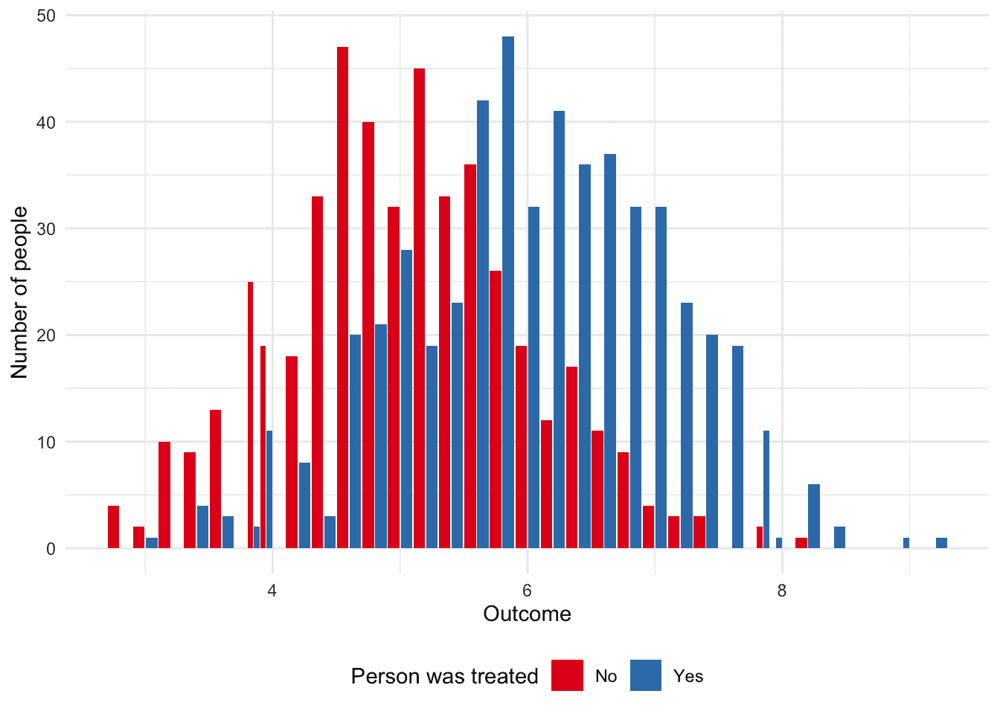
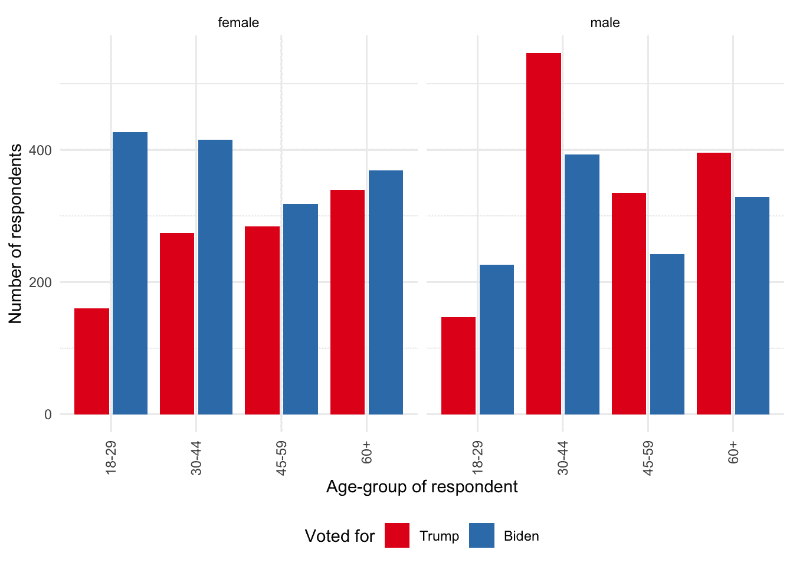
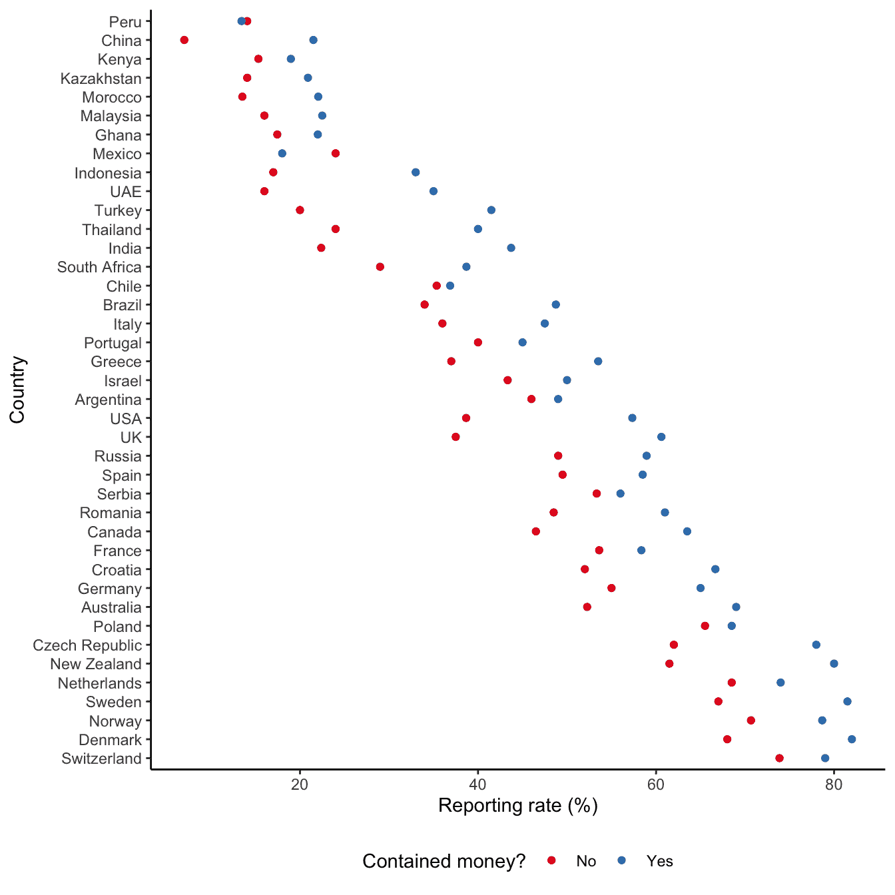
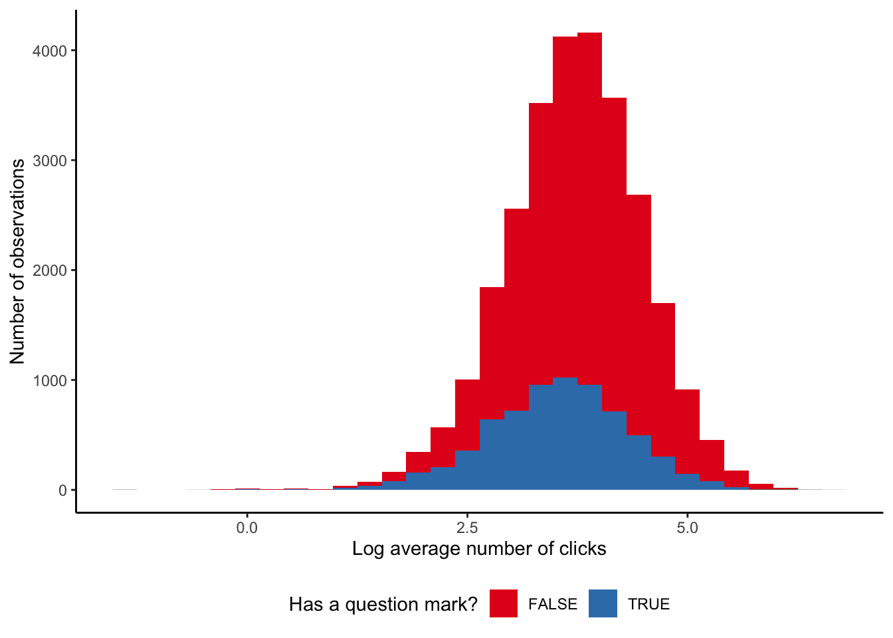

# 8  实验与调查

> 原文：[`tellingstorieswithdata.com/08-hunt.html`](https://tellingstorieswithdata.com/08-hunt.html)

1.  数据获取

1.  8  实验与调查

*Chapman and Hall/CRC 于 2023 年 7 月出版了此书。您可在此[购买](https://www.routledge.com/Telling-Stories-with-Data-With-Applications-in-R/Alexander/p/book/9781032134772)。此在线版本对印刷版内容进行了一些更新。*  ***先决条件**

+   阅读《实践中的影响评估》（Gertler et al. 2016）

    +   重点关注第三章和第四章，这两章广泛讨论了因果推断与随机化。

+   阅读《调查回应心理学》（Tourangeau, Rips, and Rasinski 2000）

    +   重点关注第二章“受访者对调查问题的理解”，该章讨论了调查问题的措辞。

+   阅读《如何开展调查》（Stantcheva 2023）

    +   本文概述了设计调查问卷时需关注的实践问题。

+   阅读《问答：皮尤研究中心如何在印度调查近 30,000 人》（Letterman 2021）

    +   讨论了一项关于宗教信仰的大型调查中出现的许多实际问题。

+   阅读《统计学与因果推断》（Holland 1986）

    +   重点关注讨论如何使用统计模型（尤其是鲁宾模型）来理解因果效应的第 1-3 部分。

+   阅读《大型科技公司正在测试你》（Fry 2020）

    +   本文讨论了 A/B 测试在科技公司中的应用。

+   观看《行业中的因果推断挑战：来自 LinkedIn 经验的视角》（Xu 2020）

    +   重点关注此视频的前半部分，该部分概述了 A/B 测试。

**核心概念与技能**

+   随机化用于建立处理组和对照组。其理念是，若非处理干预，这些组别本应相同。这使我们能够衡量处理的平均效应。但该估计的有效性面临许多威胁。

+   一旦我们有了估计值，我们想知道它们在多大程度上适用。如果它们仅适用于实验背景，则具有内部有效性。如果它们能推广到该背景之外，则具有外部有效性。

+   理解为何知情同意和确立实验需求是重要的。

+   A/B 测试及其一些细微差别。

+   设计与实施调查。

**软件与包**

+   Base R (R Core Team 2024)

+   `haven` (Wickham, Miller, and Smith 2023)

+   `labelled` (Larmarange 2023)

+   `tidyverse` (Wickham et al. 2019)

+   `tinytable` (Arel-Bundock 2024)

```py
library(haven)
library(labelled)
library(tidyverse)
library(tinytable)
```

*## 8.1 引言

本章讨论通过实验和调查获取数据。实验是一种我们可以明确控制和改变我们感兴趣因素的情境。这样做的好处是，识别和估计效应应该是清晰的。有一个接受我们感兴趣因素处理的**处理组**，和一个不接受处理的**对照组**。它们在处理前被随机分配。因此，如果它们最终结果不同，那必然是由于处理造成的。不幸的是，现实生活很少如此顺利。关于处理组和对照组有多相似的争论往往会无休止地进行下去。而且，在我们能够估计效应之前，我们需要能够测量我们感兴趣的任何东西，而这往往出人意料地困难。

作为动机，考虑一下某人在 2014 年搬到旧金山的情况——他们一搬过去，巨人队就赢得了世界大赛冠军，金州勇士队也开始了一段历史性的总冠军连胜。然后他们搬到了芝加哥，小熊队立即赢得了 100 年来的第一个世界大赛冠军。接着他们搬到了马萨诸塞州，爱国者队一次又一次地赢得了超级碗。最后，他们搬到了多伦多，猛龙队立即赢得了世界冠军。一个城市应该付钱让他们搬来吗？或者市政资金是否应该更好地用在其他地方？

一种找到答案的方法是进行实验。列出拥有主要运动队的北美城市。然后掷骰子，随机分配人们去这些城市居住一年，并测量运动队的成绩。如果有足够多的生命周期，我们就能找出答案。但这需要很长时间，因为我们无法同时既居住在一个城市又不居住在那个城市。这就是因果推断的根本问题：一个人不能同时接受处理和未接受处理。实验和随机对照试验是我们试图随机分配某种处理的情境，以便相信其他所有条件都相同（或至少可以忽略）。我们使用内曼-鲁宾潜在结果框架来形式化这种情况（Holland 1986）。

一个处理，$t$，通常是一个二元变量，即要么是 0，要么是 1。如果个体 $i$ 未被处理，即他们在对照组中，则 $t$ 为 0；如果他们被处理，则 $t$ 为 1。我们通常会对该个体有一些感兴趣的结果 $Y_i$，它可以是二元的、分类的、多项的、有序的、连续的，甚至可能是其他类型的变量。例如，它可能是投票选择，在这种情况下，我们可以测量该个体是：“保守派”还是“非保守派”；他们支持哪个政党，比如：“保守党”、“自由党”、“民主党”、“绿党”；或者可能是支持某个特定领导人的概率。

如果 $(Y_i|t=0) \neq (Y_i|t=1)$，那么一项处理的效果就是因果性的。也就是说，对于个体 $i$，在其未接受处理时的结果，不同于其接受处理时的结果。如果我们能同时在同一时间对同一个体既施加处理又进行控制，那么我们就能确定，只有处理导致了结果的任何变化。没有其他因素可以解释这种变化。但因果推断的根本问题依然存在：我们无法在同一时间对同一个体既施加处理又进行控制。因此，当我们想知道处理的效果时，需要将其与一个反事实情况进行比较。反事实情况，在第四章中介绍过，是指如果接受处理的个体未接受处理将会发生的情况。事实证明，这意味着思考因果推断的一种方式是将其视为一个缺失数据问题，其中我们缺失的正是反事实数据。

我们无法在同一个体上比较处理和控制。因此，我们转而比较两个群体的平均值——接受处理者和未接受处理者。由于无法在个体层面进行，我们寻求在群体层面估计反事实情况。做出这种权衡使我们能够继续推进，但代价是确定性。我们必须转而依赖随机化、概率和期望。

我们通常默认不存在效应，并寻找能让我们改变想法的证据。由于我们关注的是群体中发生的情况，因此我们借助期望和概率概念来表达。因此，我们将提出适用于平均情况的论断。也许穿有趣的袜子确实会让你拥有幸运日，但平均而言，在整个群体中，情况可能并非如此。值得指出的是，我们不一定只对平均效应感兴趣。我们也可以考虑中位数、方差或其他指标。尽管如此，如果我们对平均效应感兴趣，那么一种可行的方法是：

1.  将数据集分为两组——接受处理组和未接受处理组——并设定一个二元效果变量——幸运日与否；

1.  对变量求和，然后除以变量的长度；以及

1.  比较两组之间的这个值。

这是一个在第四章中介绍的估计量，它是一种组合出对感兴趣事物的猜测的方法。估计目标是感兴趣的事物，在本例中是平均效应，而估计值则是我们猜测得出的任何结果。我们可以通过模拟数据来说明这种情况。

```py
set.seed(853)

treat_control <-
 tibble(
 group = sample(x = c("Treatment", "Control"), size = 100, replace = TRUE),
 binary_effect = sample(x = c(0, 1), size = 100, replace = TRUE)
 )

treat_control
```

*```py
# A tibble: 100 × 2
   group     binary_effect
   <chr>             <dbl>
 1 Treatment             0
 2 Control               1
 3 Control               1
 4 Treatment             1
 5 Treatment             1
 6 Treatment             0
 7 Treatment             1
 8 Treatment             1
 9 Control               0
10 Control               0
# ℹ 90 more rows
```*  *```py
treat_control |>
 summarise(
 treat_result = sum(binary_effect) / length(binary_effect),
 .by = group
 )
```

*```py
# A tibble: 2 × 2
  group     treat_result
  <chr>            <dbl>
1 Treatment        0.552
2 Control          0.333
```*  *在这种情况下，我们为处理组和对照组各抽取 100 次 0 或 1，然后得出接受处理的平均效应估计值为 0.22。

更广泛地说，要讲述因果故事，我们需要将理论与对我们所关注事物的深入了解相结合（Cunningham 2021, 4）。在第七章中，我们讨论了收集我们观察到的世界数据。在本章中，我们将更主动地将世界转化为我们需要的数据。作为研究者，我们将决定测量什么以及如何测量，并需要定义我们的关注点。我们将成为数据生成过程的积极参与者。也就是说，如果我们想使用这些数据，那么作为研究者，我们必须主动出击去获取它。

本章我们将探讨实验，特别是如何构建实验组和对照组，并恰当地考量其结果。我们将介绍如何实施一项调查。通过参考塔斯基吉梅毒研究和体外膜肺氧合（ECMO）实验，我们将讨论实验伦理行为的某些方面，并分析多个案例研究。最后，我们将转向业界广泛使用的 A/B 测试，并基于 Upworthy 的数据进行案例研究。

二十世纪的统计学家罗纳德·费希尔和十九世纪的统计学家弗朗西斯·高尔顿，是本章所涵盖大部分工作的学术奠基人。在某些情况下，这是他们的直接工作；在其他情况下，则是建立在他们贡献基础上的工作。两人都信奉优生学，以及其他一些普遍应受谴责的观点。正如艺术史承认卡拉瓦乔是杀人犯，同时也考量他的作品和影响一样，统计学和数据科学更广泛地也必须正视这段历史，同时我们努力构建一个更美好的未来。**  **## 8.2 田野实验与随机对照试验

### 8.2.1 随机化

在某些情境下，相关性可能就足够了（Hill 1965），但为了能够在事物发生变化、环境略有不同时做出预测，我们应该努力理解因果关系。经济学在 21 世纪初经历了一场可信度革命（Angrist and Pischke 2010）。经济学家们意识到先前的工作不如其应有的那样可靠。人们越来越关注研究设计和实验的使用。其他社会科学，如政治学，也在大约同一时期发生了类似的变化（Druckman and Green 2021）。

关键在于反事实：如果没有干预，会发生什么。理想情况下，我们可以保持其他一切不变，随机将世界分为两组，对一组进行干预而另一组不干预。这样我们就能确信两组之间的任何差异都源于该干预。原因在于，如果我们有一个总体，并从中随机选择两组，那么这两组（只要它们都足够大）应该具有与总体相同的特征。随机对照试验和 A/B 测试试图让我们尽可能接近这一“黄金标准”。

当我们以及诸如 Athey 和 Imbens（2017b）等学者使用如此积极的措辞来指代这些方法时，并不意味着我们认为它们是完美的。只是说它们可能比大多数其他选择更好。例如，在第十五章中，我们将探讨基于观测数据的因果推断，虽然有时这是我们唯一能做的，但能够同时评估两种方法的情境清楚地表明，基于观测数据的方法通常只是次优选择（Gordon et al. 2019; Gordon, Moakler, and Zettelmeyer 2022）。随机对照试验和 A/B 测试也带来其他好处，例如有机会设计专注于特定问题并试图揭示效应发生机制的研究（Alsan and Finkelstein 2021）。但它们并非完美无缺，且对随机对照试验的接纳也并非毫无异议（Deaton 2010）。

实验实践的一个基石是**盲法**，即参与者不知道自己属于治疗组还是对照组。未能实施盲法，尤其是在主观结果的情况下，在某些学科中是整个实验被否决的理由 (Edwards 2017)。理想情况下，实验应该是**双盲**的，即连研究者也不知道分组情况。Stolberg (2006) 讨论了一个早期的随机双盲试验例子，该试验于 1835 年进行，旨在评估顺势疗法药物的效果，参与者和组织者都不知道谁在哪一组。对于随机对照试验和 A/B 测试来说，这种情况很少见。再次强调，这并不是说它们没有用——毕竟在 1847 年，Semmelweis 在没有进行盲法研究的情况下，就发现了实习医生在接生前洗手的好处 (Morange 2016, 121)。另一个主要关注点是随机对照试验中发现的结果在多大程度上能推广到该环境之外。通常很少有随机对照试验会进行很长时间，尽管这种情况可能正在改变，Bouguen 等人 (2019) 提供了一些可以进行后续评估以衡量长期效果的随机对照试验。最后，在社会科学中，对因果关系的关注并非没有代价。一些人认为，以因果关系为中心的方法将注意力集中在它能回答的问题类型上，而牺牲了其他类型的问题。

### 8.2.2 模拟示例：猫还是狗

我们希望建立除了治疗因素外其他方面都相同的治疗组和对照组。这意味着创建对照组至关重要，因为当我们这样做时，我们就建立了反事实。我们可能会担心，例如，潜在的趋势（这是前后比较的一个问题），或者选择偏差（当我们允许自我选择进入治疗组时可能发生）。这些问题中的任何一个都可能导致估计偏差。我们使用随机化在一定程度上解决这些问题。

首先，我们模拟一个人群，然后从中随机抽样。我们将设定一半人群喜欢蓝色，另一半喜欢白色。进一步地，如果某人喜欢蓝色，那么他们几乎肯定更喜欢狗；而如果他们喜欢白色，则几乎肯定更喜欢猫。模拟是本书所倡导工作流程的关键部分。这是因为通过分析模拟数据，我们知道结果应该是什么。而如果我们直接分析真实数据，则无法判断意外结果是由于我们自己的分析错误，还是实际结果。采用这种模拟方法的另一个好处是，当你在团队中工作时，可以在数据收集和清理完成之前就开始分析。模拟还将帮助收集和清理团队思考他们应对数据运行哪些测试。

```py
set.seed(853)

num_people <- 5000

population <- tibble(
 person = 1:num_people,
 favorite_color = sample(c("Blue", "White"), size = num_people, replace = TRUE),
 prefers_dogs = if_else(favorite_color == "Blue", 
 rbinom(num_people, 1, 0.9), 
 rbinom(num_people, 1, 0.1))
 )

population |>
 count(favorite_color, prefers_dogs)
```

*```py
# A tibble: 4 × 3
  favorite_color prefers_dogs     n
  <chr>                 <int> <int>
1 Blue                      0   256
2 Blue                      1  2291
3 White                     0  2239
4 White                     1   214
```*  *基于第六章介绍的术语和概念，我们现在构建一个包含约 80% 目标人群的抽样框。

```py
set.seed(853)

frame <-
 population |>
 mutate(in_frame = rbinom(n = num_people, 1, prob = 0.8)) |> 
 filter(in_frame == 1)

frame |>
 count(favorite_color, prefers_dogs)
```

*```py
# A tibble: 4 × 3
  favorite_color prefers_dogs     n
  <chr>                 <int> <int>
1 Blue                      0   201
2 Blue                      1  1822
3 White                     0  1803
4 White                     1   177
```*  *目前，我们将暂时搁置对狗或猫的偏好，仅专注于根据最喜欢的颜色创建处理组和对照组。

```py
set.seed(853)

sample <-
 frame |>
 select(-prefers_dogs) |>
 mutate(
 group = 
 sample(x = c("Treatment", "Control"), size = nrow(frame), replace = TRUE
 ))
```

*当我们查看两组的均值时，可以看到偏好蓝色或白色的比例与我们设定的非常接近（表 8.1）。

```py
sample |>
 count(group, favorite_color) |>
 mutate(prop = n / sum(n),
 .by = group) |>
 tt() |> 
 style_tt(j = 1:4, align = "llrr") |> 
 format_tt(digits = 2, num_mark_big = ",", num_fmt = "decimal") |> 
 setNames(c("Group", "Prefers", "Number", "Proportion"))
```

*表 8.1：各组偏好蓝色或白色的比例

| 组别 | 偏好 | 数量 | 比例 |
| --- | --- | --- | --- |
| 控制组 | 蓝色 | 987 | 0.5 |
| 控制组 | 白色 | 997 | 0.5 |
| 处理组 | 蓝色 | 1,036 | 0.51 |

| 处理组 | 白色 | 983 | 0.49 |*  *我们仅根据最喜欢的颜色进行了随机分组。但我们也应该发现，我们同时兼顾了对狗或猫的偏好，并且将获得一个偏好狗而非猫的人群的“代表性”份额。我们可以查看我们的数据集（表 8.2）。

```py
sample |>
 left_join(
 frame |> select(person, prefers_dogs),
 by = "person"
 ) |>
 count(group, prefers_dogs) |>
 mutate(prop = n / sum(n),
 .by = group) |>
 tt() |> 
 style_tt(j = 1:4, align = "llrr") |> 
 format_tt(digits = 2, num_mark_big = ",", num_fmt = "decimal") |> 
 setNames(c(
 "Group",
 "Prefers dogs to cats",
 "Number",
 "Proportion"
 ))
```

*表 8.2：处理组和对照组中偏好狗或猫的比例

| 组别 | 偏好狗而非猫 | 数量 | 比例 |
| --- | --- | --- | --- |
| 控制组 | 0 | 1,002 | 0.51 |
| 控制组 | 1 | 982 | 0.49 |
| 处理组 | 0 | 1,002 | 0.5 |

| 处理组 | 1 | 1,017 | 0.5 |*  *能在“不可观测变量”上获得代表性份额是令人兴奋的。（在此例中，我们为了说明问题而“观测”了它们——但我们并未据此进行选择）。我们之所以能得到这个结果，是因为变量之间存在相关性。但这一点会在我们即将讨论的几种情况下失效。该结论也假设了组别足够大。例如，如果我们考虑的是具体的犬种，而非将狗作为一个整体实体，我们可能就不会遇到这种情况。为了检验两个组是否相同，我们会根据可观测变量、理论、经验和专家意见来查看是否能识别出两组之间的差异。本例中我们查看了均值，但我们也可以查看其他方面。

传统上，这会引导我们进行方差分析（ANOVA）。ANOVA 大约在 100 年前由费希尔在研究农业统计问题时提出。（Stolley（1991）提供了关于费希尔的更多背景信息。）这并不像看起来那么意外，因为历史上农业研究与统计创新紧密相连。统计方法通常是为了回答诸如“肥料是否有效？”等农业问题而设计的，后来才被应用于临床试验（Yoshioka 1998）。将一块田地划分为“处理”和“未处理”区域相对容易，且任何效应的幅度可能很大。虽然这些统计方法适用于当时的情境，但如今在入门材料中仍经常教授这些方法，即使它们被应用于与设计初衷不同的环境中。退一步思考正在做什么以及它是否适合当前环境，几乎总是有益的。我们在此提及 ANOVA 是因为其历史重要性。在合适的场景下，它本身没有问题。但在现代用例中，它是最佳选择的情况往往较少。更好的做法可能是自行构建支撑 ANOVA 的模型，这将在第十二章中讨论。*****  ***### 8.2.3 处理与对照

如果处理组和对照组在所有方面都相同且保持这种状态（仅处理因素不同），那么我们就具备了内部效度，这意味着我们的对照组能作为反事实参照，研究结果能够说明组间差异。内部效度意味着我们对处理效应的估计仅针对处理本身，而非其他因素。这表明我们可以利用研究结果来阐述实验中发生的情况。

如果我们实施随机化的群体能够代表更广泛的人群，且实验设置与外部条件相似，那么我们就进一步具备了外部效度。这意味着我们所发现的差异不仅适用于我们自己的实验，也适用于更广泛的人群。外部效度意味着我们可以利用实验来推断实验外部可能发生的情况。正是随机化使这成为可能。在实践中，我们不会仅仅依赖单一实验，而是将其视为更广泛证据收集工作的一部分（Duflo 2020, 1955）。

*巨人的肩膀* *埃丝特·迪弗洛博士是麻省理工学院阿卜杜勒·拉蒂夫·贾米尔贫困缓解与发展经济学教授。1999 年从麻省理工学院获得经济学博士学位后，她留校担任助理教授，并于 2003 年晋升为正教授。她的一个研究领域是经济发展，她利用随机对照试验来理解如何解决贫困问题。她最重要的著作之一是《贫穷经济学》（Banerjee and Duflo 2011）。她最重要的论文之一是 Banerjee 等人（2015），该论文使用随机化方法研究了小额信贷的效果。她于 2019 年被授予纪念阿尔弗雷德·诺贝尔的瑞典中央银行经济学奖。* *但这意味着我们需要进行两次随机化。首先，随机分配到接受实验的群体中；其次，在处理组和对照组之间进行随机分配。我们如何看待这种随机化，它在多大程度上是重要的？

我们关注的是接受处理所产生的效应。处理变量可能是连续型的，例如我们设定不同的价格；也可能是离散型的，例如我们比较网站上的不同颜色。无论哪种情况，我们都需要确保处理组和对照组在其他方面是相同的。如何才能确信这一点呢？一种方法是忽略处理变量，检查所有其他变量，观察是否能基于任何其他变量检测到组间差异。例如，如果我们在一个网站上进行实验，那么各组是否在以下方面大致相似：

+   微软和苹果用户？

+   Safari、Chrome 和 Firefox 用户？

+   移动端和桌面端用户？

+   来自特定地区的用户？

此外，这些组是否能代表更广泛的人群？这些都是对我们结论有效性的威胁。例如，本章稍后将讨论的 Nationscape 调查就曾担心完成调查的 Firefox 用户数量。最终，他们排除了这部分受访者中的一个子集（Vavreck and Tausanovitch 2021, 5）。

如果操作得当，即如果处理确实是独立的，那么我们就可以估计平均处理效应（ATE）。在二元处理变量的设定中，其公式为：

$$\mbox{ATE} = \mathbb{E}[Y|t=1] - \mathbb{E}[Y|t=0].$$

即，当通过结果变量 $Y$ 的期望值衡量时，处理组 $t = 1$ 与对照组 $t = 0$ 之间的差异。平均处理效应（ATE）就变成了两个条件期望之间的差值。

为了说明这个概念，我们模拟了一些数据，这些数据显示处理组和对照组之间存在平均值为 1 的差异。

```py
set.seed(853)

ate_example <- 
 tibble(person = 1:1000,
 treated = sample(c("Yes", "No"), size = 1000, replace = TRUE)) |>
 mutate(outcome = case_when(
 treated == "No" ~ rnorm(n(), mean = 5, sd = 1),
 treated == "Yes" ~ rnorm(n(), mean = 6, sd = 1),
 ))
```

*我们可以在图 8.1 中看到两组之间的差异，我们模拟该差异为一。我们还可以计算两组之间的平均值，然后计算差值，从而大致得出我们设定的结果（表 8.3）。

```py
ate_example |>
 ggplot(aes(x = outcome, fill = treated)) +
 geom_histogram(position = "dodge2", binwidth = 0.2) +
 theme_minimal() +
 labs(x = "Outcome", 
 y = "Number of people", 
 fill = "Person was treated") +
 scale_fill_brewer(palette = "Set1") +
 theme(legend.position = "bottom")
```

*

图 8.1：显示治疗组和对照组之间差异的模拟数据*  *```py
ate_example |>
 summarise(mean = mean(outcome),
 .by = treated) |> 
 tt() |> 
 style_tt(j = 1:2, align = "lr") |> 
 format_tt(digits = 2, num_fmt = "decimal") |> 
 setNames(c(
 "Was treated?",
 "Average effect"
 ))
```

*表 8.3：治疗组和对照组之间的平均差异，模拟数据的平均差异设定为一

| 是否接受治疗？ | 平均效应 |
| --- | --- |
| 是 | 6.06 |

| 否 | 5.03 |*  *不幸的是，模拟数据与现实之间往往存在差异。例如，实验不能运行太久，否则人们可能会接受多次治疗或对治疗产生耐受性；但也不能太短，否则我们无法衡量长期结果。我们无法获得涵盖人口各个方面的“代表性”样本，但如果没有，那么治疗组和对照组可能不同。实际困难可能使我们难以对某些群体进行随访，最终导致收集的数据存在偏差。在处理真实实验数据时，需要探讨的一些问题包括：

+   参与者是如何被选入考虑框架的？

+   他们是如何被选中接受治疗的？我们希望这是随机进行的，但这一术语适用于多种情况。此外，早期的“成功”可能导致对所有人进行治疗的压力，尤其是在医疗环境中。

+   治疗效果是如何评估的？

+   随机分配在多大程度上是合乎道德和公平的？有人认为，短缺意味着随机分配是合理的，但这可能取决于收益的线性程度。定义也可能难以确立，并且应该考虑做出这些决定的人与接受治疗的人之间的权力失衡。

偏差和其他问题并非世界末日。但我们需要仔细思考它们。在第四章中介绍的选择偏差是可以调整的，但前提是它被识别出来。例如，如果一项关于大学课程难度的调查只调查了完成课程的学生，而没有调查那些中途退出的学生，结果会有什么不同？在创建数据集时，我们应始终努力使其尽可能具有代表性，但事后或许可以通过模型来调整部分偏差。例如，如果存在一个与（比如）流失率相关的变量，那么可以将其单独或作为交互项添加到模型中。同样，如果个体之间存在相关性。例如，如果存在某个我们不知道的“隐藏变量”，导致某些个体相关，那么我们可以使用更宽的标准误。这需要谨慎处理，我们将在第十五章中进一步讨论。话虽如此，如果这些问题可以预见，那么改变实验设计可能更好。例如，或许可以按该变量进行分层。****  ****### 8.2.4 费希尔的茶会

英国人在喝茶这件事上很有趣。在英国，关于如何泡制一杯完美的“茶”，存在着广泛而持久的争论，从乔治·奥威尔到约翰·列侬等各界人士都发表过看法。有些人说应该先加牛奶，另一些人则说应该后加。民调公司 YouGov 发现，大多数受访者选择后加牛奶（Smith 2018）。但人们可能会想，加奶的顺序是否真的重要。

费希尔设计了一个实验，旨在检验一个人是否能区分先加牛奶还是后加牛奶的茶。我们首先准备八杯茶：四杯先加牛奶，四杯后加牛奶。然后我们将这八杯茶的顺序随机打乱。我们告诉品茶者（我们称他为“伊恩”）实验设置：共有八杯茶，每种类型各四杯，他会以随机顺序品尝这些茶，他的任务是将它们分成两组。

这个实验的一个优点是我们可以自己动手做。在实践中需要注意以下几点：

1.  牛奶和茶的分量保持一致，

1.  各组以某种品茶者无法看到的方式标记，并且

1.  顺序是随机的。

这个实验的另一个优点是，我们可以计算出伊恩随机正确分组的概率。要判断他的分组是否可能是随机发生的，我们需要计算这种情况发生的概率。首先，我们计算从所选四杯中正确分组的数量。总共有：${8 \choose 4} = \frac{8!}{4!(8-4)!}=70$ 种可能的结果（[Fisher [1935] 1949, 14](99-references.html#ref-fisherdesignofexperiments)）。这个符号表示集合中有八个项目，我们从中选择四个，并且用于选择顺序无关紧要的情况。

我们要求伊恩对杯子进行分组，而不是逐一识别，因此他有两种方式可以完全正确。他要么正确识别出所有先加奶的杯子（70 种结果中的一种），要么正确识别出所有先加茶的杯子（70 种结果中的一种）。这意味着该事件的概率是：$\frac{2}{70}$，大约 3%。

正如费舍尔（[[1935] 1949, 15](99-references.html#ref-fisherdesignofexperiments)）所明确指出的，这现在成了一个需要主观判断的问题。我们需要考虑，在多大程度上接受分组并非偶然发生、且伊恩清楚自己在做什么的证据。我们必须决定，需要什么样的证据才能让我们信服。如果没有任何可能的证据能说服我们改变实验前的观点（例如，认为先加奶和先加茶没有区别），那么进行实验的意义何在？我们预期，如果伊恩完全答对，那么一个理性的人会接受他能够分辨出区别。

如果他几乎完全正确呢？随机情况下，一个人有 16 种方式“只错一个”。要么伊恩认为有一杯是先加奶的，而实际上是先加茶的——有 ${4 \choose 1} = 4$ 种方式可能发生这种情况；要么他认为有一杯是先加茶的，而实际上是先加奶的——同样，有 ${4 \choose 1} = 4$ 种方式可能发生这种情况。这些结果是独立的，因此概率是 $\frac{4\times 4}{70}$，大约 23%。考虑到仅仅通过随机分组茶杯就有近 23% 的概率只错一个，这个结果可能无法让我们信服伊恩能够区分先加茶和先加奶。

为了宣称某事物是可通过实验证明的，我们所寻求的是，我们已经了解了一个能够可靠得出该结果的实验的特征（[Fisher [1935] 1949, 16](99-references.html#ref-fisherdesignofexperiments)）。我们需要的是证据的分量，而不仅仅是一次实验。我们旨在彻底审视我们的数据和实验，并精确思考我们所使用的分析方法。我们不是要在星群中寻找意义，而是希望尽可能让他人能够复现我们的工作。只有这样，我们的结论才更有可能经得起时间的考验。

### 8.2.5 伦理基础

医疗环境中的证据分量可以用失去的生命来衡量。医学实验伦理规范得以发展的原因之一，就是为了防止不必要的生命损失。我们现在详述两个可能导致了不必要生命损失的案例，它们帮助奠定了伦理实践的基础。我们通过讨论塔斯基吉梅毒研究来探讨获取知情同意的必要性，并通过讨论 ECMO 实验来探讨确保实验必要性的重要性。

#### 8.2.5.1 塔斯基吉梅毒研究

根据 Brandt（1978）以及 Alsan 和 Wanamaker（2018）的研究，塔斯基吉梅毒研究是一项始于 1932 年的臭名昭著的医学试验。在这项实验中，400 名患有梅毒的非裔美国人，即使在梅毒的标准治疗方法确立并广泛普及之后，也未得到适当治疗，甚至未被告知他们患有梅毒。一个未患梅毒的对照组也被给予了无效药物。这些生活在美国南部的经济贫困的非裔美国人仅获得了微薄的补偿，且未被告知他们是实验的一部分。此外，研究方还进行了大量工作，以确保这些男性无法从任何地方获得治疗，包括致函当地医生和卫生部门。即使其中一些人应征入伍并被要求立即接受治疗，征兵委员会也遵从了将他们排除在治疗之外的请求。到 1972 年研究停止时，超过一半的参与者已去世，其中许多人的死因与梅毒有关。

塔斯基吉梅毒研究的影响不仅波及研究中的受试者，其范围更为广泛。Alsan 和 Wanamaker（2018）发现，由于医疗不信任以及与医生互动的减少，该研究导致阿拉巴马州中部地区的黑人男性在 45 岁时的预期寿命减少了多达 1.5 年。作为回应，美国制定了机构审查委员会的要求，克林顿总统于 1997 年正式道歉。Brandt（1978, 27）指出：

> 回顾来看，塔斯基吉研究更多地揭示了种族主义的病理学，而非梅毒的病理学；更多地揭示了科学探究的本质，而非疾病过程的本质……必须摒弃科学是价值中立学科的观念。显然，我们需要更加警惕地评估社会价值观和态度影响专业行为的具体方式。

Heller（[2022）提供了关于塔斯基吉梅毒研究的更多背景信息。

*巨人的肩膀* *Marcella Alsan 博士是哈佛大学公共政策教授。她拥有洛约拉大学的医学博士学位，并于 2012 年获得哈佛大学经济学博士学位。她被任命为斯坦福大学助理教授，2019 年晋升为正教授并返回哈佛大学。她的研究领域之一是健康不平等，其中一篇特别重要的论文是 Alsan 和 Wanamaker（2018），我们在上文已讨论过。她于 2021 年获得麦克阿瑟基金会奖学金。* *#### 8.2.5.2 体外膜肺氧合（ECMO）

关于体外膜肺氧合（ECMO）的评估，Ware（1989）描述了他们将 ECMO 视为新生儿持续性肺动脉高压的可能治疗方法。他们招募了 19 名患者，其中 10 名接受常规药物治疗，9 名接受 ECMO 治疗。结果发现，对照组中有 6 名患者存活，而治疗组全部存活。Ware（1989）采用了随机同意的方式，即只询问被随机选中接受 ECMO 治疗的婴儿的父母是否同意。

我们关注的是“均衡状态”，即对治疗是否比常规程序更有效存在真正不确定性的情况。在医疗环境中，即使最初存在均衡状态，如果在研究早期发现治疗有效，这种均衡也可能被破坏。Ware（1989）描述了在这首批 19 名患者的结果之后，随机化停止，仅使用 ECMO 的情况。招募人员和治疗患者的人员最初并未被告知随机化已停止。决定继续完全分配使用 ECMO，“直到观察到第 28 名幸存者或第 4 名死亡者”。在额外 20 名患者中有 19 名存活后，试验终止。该实验实际上分为两个阶段：第一阶段随机使用 ECMO，第二阶段仅使用 ECMO。

在这些情境下，一种方法是遵循 Wei 和 Durham（1978）提出的“随机化赢家通吃”规则。治疗分配仍然是随机的，但每次成功治疗后概率会发生变化，使治疗更可能发生，并且存在某种停止规则。Berry（1989）认为，远不需要更复杂的停止规则，这项 ECMO 研究本身就没有必要进行，因为临床均衡从未存在过。Berry（1989）重新审视了 Ware（1989）提及的文献，并发现了大量证据表明 ECMO 的有效性早已为人所知。Berry（1989）指出，几乎从未有过完全的共识，因此即使在大量证据面前，人们也几乎总可以（不恰当地）主张临床均衡的存在。Berry（1989）进一步批评 Ware（1989）使用随机化同意，因为如果接受传统医疗的婴儿父母知道还有其他选择，结果可能会有所不同。

塔斯基吉梅毒研究和 ECMO 实验看似与我们的现状相去甚远。虽然如今进行完全相同的这类研究可能已属违法，但这并不意味着不道德的研究不再发生。例如，我们在医疗及其他领域的机器学习应用中就能看到；尽管我们不应明确歧视，且理应获得同意，但这并不意味着我们无法在没有任何消费者认可的情况下进行隐性歧视。例如，Obermeyer 等人（2019）描述了美国许多医疗系统如何使用算法来评估患者病情的严重程度。他们指出，在相同评分下，黑人患者的实际病情更重，如果按照与白人患者相同的方式对黑人患者进行评分，他们将获得更多的医疗照护。研究发现，这种歧视的发生是因为算法基于医疗成本而非病情本身。但由于黑人与白人患者之间医疗资源的获取机会不均等，该算法无意中延续了种族偏见。********  *****## 8.3 调查

在决定了要测量什么之后，获取数值的一种常见方法是使用调查。这尤其具有挑战性，并且有一个完整的领域——调查研究——专注于此。Edelman、Vittert 和 Meng（2021）明确指出，这里没有新问题，我们今天面临的挑战与过去面临的挑战密切相关。实施调查的方式有很多种，这个决策很重要。有一段时间，唯一的选择是面对面调查，即调查员与受访者亲自进行。后来，调查开始通过电话进行，同样由调查员操作。这两种设置中的一个问题是相当大的访员效应（Elliott et al. 2022）。互联网带来了调查研究的第三个时代，其特点是参与率低（Groves 2011）。调查是获取数据的一种流行且宝贵的方式。面对面和电话调查仍在使用并发挥着重要作用，但许多调查现在都是基于互联网的。

有许多专门的调查平台，如 Survey Monkey 和 Qualtrics，它们主要基于互联网。一种特别常见的方法（因为它是免费的）是使用 Google Forms。总的来说，这些平台的重点是使用户能够构建和发送调查问卷。它们通常期望用户已经拥有某个抽样框的联系方式。

其他平台，例如第三章中提到的亚马逊土耳其机器人（Amazon Mechanical Turk）和 Prolific，专注于提供受访者。在使用这类平台时，我们应努力理解这些受访者是谁，以及他们可能与目标人群存在哪些差异（Levay, Freese, and Druckman 2016; Enns and Rothschild 2022）。

调查问卷需要在更广泛的研究背景下进行考虑，并特别关注受访者。在发布调查之前，尽量进行测试。Light、Singer 和 Willett（1990, 213）在评估高等教育研究的背景下指出，没有一次试点研究不会带来改进，而且它们几乎总是值得的。就调查而言，我们更进一步。如果你没有时间或预算来测试一项调查，那么最好重新考虑是否应该进行这项调查。

尝试测试问卷的措辞（Tourangeau, Rips, and Rasinski 2000, 23）。设计问卷时，我们需要确保问题具有对话性，并能从一个问题自然过渡到下一个，并按主题分组（Elson 2018）。但我们也应考虑给受访者带来的认知负荷，并变化问题的难度。

设计问卷时，关键任务是将受访者置于核心考量位置（[Dillman, Smyth, and Christian [1978] 2014, 94](99-references.html#ref-surveystailored)）。借鉴 Swain (1985) 的观点，所有问题都需与受访者相关且能被其回答。问题的措辞应基于受访者感到舒适的表达方式。在不同题型间做选择时，应着眼于最小化误差以及我们给受访者带来的负担。通常，如果选项数量少且清晰，则多项选择题是合适的。在这种情况下，选项通常应互斥且穷尽。如果选项不互斥，则需要在问题文本中予以说明。同样重要的是，应尽可能明确指定单位并使用标准概念。

如果存在许多潜在答案，开放式文本框可能是合适的。这将增加受访者完成问卷的时间以及分析答案所需的时间。一次只问一个问题，并尝试以中立的方式提问，避免引导出特定答案。测试问卷有助于避免模糊或双重问题，这些问题可能会使受访者感到困惑。问卷的主题也会影响问题类型的适当选择。例如，对于可能具有“威胁性”的话题，使用开放式问题可能更合适（Blair et al. 1977）。

所有问卷都需要有一个引言，说明问卷的标题、执行者、联系方式以及目的。还应包括关于现有保密保护措施的声明，以及所获得的任何伦理审查委员会的批准。

进行问卷调查时，关键在于询问正确的人。例如，Lichand 和 Wolf (2022) 研究了童工问题。童工的程度通常基于对父母的调查。当对儿童进行调查时，发现父母存在相当程度的漏报。

一个特别值得关注的方面是关于性取向和性别认同的问题。虽然这是一个不断发展的领域，但白宫（2023）提供了最佳实践建议，例如考虑数据将如何使用，并确保足够的样本量。关于询问性取向，他们推荐以下问题：

+   “以下哪一项最能代表您对自己的看法？”

    1.  “男同性恋或女同性恋”

    1.  “异性恋，即非同性恋”

    1.  “双性恋”

    1.  “我使用不同的术语 [自由填写]”

    1.  “我不知道”

关于性别，他们推荐采用多问题方法：

+   “在您原始的出生证明上，您出生时被指定的性别是什么？”

    1.  “女性”

    1.  “男性”

+   “您目前如何描述自己？（可多选）”

    1.  “女性”

    1.  “男性”

    1.  “跨性别者”

    1.  “我使用不同的术语 [自由填写]”

再次强调，这是一个不断发展的领域，最佳实践可能会发生变化。

最后，回到我们最初进行调查的原因，在进行所有这些工作时，同样重要的是要牢记我们感兴趣的测量内容。确保调查问题与估计目标相关。

### 8.3.1 民主基金选民研究小组

作为调查数据的一个例子，我们将考虑民主基金选民研究小组 Nationscape 数据集（Tausanovitch 和 Vavreck 2021）。这是在 2019 年 7 月至 2021 年 1 月期间进行的一系列大规模调查。它根据多个变量进行了加权，包括：性别、主要人口普查区域、种族、西班牙裔、家庭收入、教育程度和年龄。Holliday 等人（2021）将其描述为基于人口统计学的便利样本，这在第六章中已有介绍。在这种情况下，Holliday 等人（2021）详细说明了样本是如何由 Lucid 公司提供的，该公司运营一个基于特定人口配额为调查受访者服务的在线平台。Holliday 等人（2021）发现其结果与政府和商业调查结果相似。

要获取该数据集，请访问民主基金选民研究小组的[网站](https://www.voterstudygroup.org)，然后查找“Nationscape”并申请数据访问权限。这可能需要一两天时间。获得访问权限后，请重点关注“.dta”文件。Nationscape 在 2020 年美国大选前进行了许多调查，因此文件很多。文件名是参考日期，其中“ns20200625”指的是 2020 年 6 月 25 日。这是我们在此使用的文件，但其中许多文件是相似的。我们下载并将其保存为“ns20200625.dta”。

如在线附录 A 中所述，安装 `haven` 和 `labelled` 包后，我们可以导入“.dta”文件。我们用于导入和准备调查数据集的代码基于 Mitrovski、Yang 和 Wankiewicz（2020）的代码。

```py
raw_nationscape_data <-
 read_dta("ns20200625.dta")
```

*```py
# The Stata format separates labels so reunite those
raw_nationscape_data <-
 to_factor(raw_nationscape_data)

# Just keep relevant variables
nationscape_data <-
 raw_nationscape_data |>
 select(vote_2020, gender, education, state, age)
```

*```py
nationscape_data
```

*```py
# A tibble: 6,479 × 5
   vote_2020                gender education                         state   age
 * <fct>                    <fct>  <fct>                             <chr> <dbl>
 1 Donald Trump             Female Associate Degree                  WI       49
 2 I am not sure/don't know Female College Degree (such as B.A., B.… VA       39
 3 Donald Trump             Female College Degree (such as B.A., B.… VA       46
 4 Donald Trump             Female High school graduate              TX       75
 5 Donald Trump             Female High school graduate              WA       52
 6 I would not vote         Female Other post high school vocationa… OH       44
 7 Joe Biden                Female Completed some college, but no d… MA       21
 8 Joe Biden                Female Completed some college, but no d… TX       38
 9 Donald Trump             Female Completed some college, but no d… CA       69
10 Donald Trump             Female College Degree (such as B.A., B.… NC       59
# ℹ 6,469 more rows
```*  *此时，我们需要清理一些问题。例如，为简化起见，移除所有未投票给特朗普或拜登的人。

```py
nationscape_data <-
 nationscape_data |>
 filter(vote_2020 %in% c("Joe Biden", "Donald Trump")) |>
 mutate(vote_biden = if_else(vote_2020 == "Joe Biden", 1, 0)) |>
 select(-vote_2020)
```

*接着，我们需要创建一些感兴趣的变量。

```py
nationscape_data <-
 nationscape_data |>
 mutate(
 age_group = case_when(
 age <= 29 ~ "18-29",
 age <= 44 ~ "30-44",
 age <= 59 ~ "45-59",
 age >= 60 ~ "60+",
 TRUE ~ "Trouble"
 ),
 gender = case_when(
 gender == "Female" ~ "female",
 gender == "Male" ~ "male",
 TRUE ~ "Trouble"
 ),
 education_level = case_when(
 education %in% c(
 "3rd Grade or less",
 "Middle School - Grades 4 - 8",
 "Completed some high school",
 "High school graduate"
 ) ~ "High school or less",
 education %in% c(
 "Other post high school vocational training",
 "Completed some college, but no degree"
 ) ~ "Some post sec",
 education %in% c(
 "Associate Degree",
 "College Degree (such as B.A., B.S.)",
 "Completed some graduate, but no degree"
 ) ~ "Post sec +",
 education %in% c("Masters degree",
 "Doctorate degree") ~ "Grad degree",
 TRUE ~ "Trouble"
 )
 ) |>
 select(-education,-age)
```

*我们将在第十六章中使用这个数据集，因此需要将其保存。

```py
write_csv(x = nationscape_data,
 file = "nationscape_data.csv")
```

*我们也可以查看部分变量（图 8.2）。

```py
nationscape_data |>
 mutate(supports = if_else(vote_biden == 1, "Biden", "Trump")) |> 
 mutate(supports = factor(supports, levels = c("Trump", "Biden"))) |> 
 ggplot(mapping = aes(x = age_group, fill = supports)) +
 geom_bar(position = "dodge2") +
 theme_minimal() +
 labs(
 x = "Age-group of respondent",
 y = "Number of respondents",
 fill = "Voted for"
 ) +
 facet_wrap(vars(gender)) +
 guides(x = guide_axis(angle = 90)) +
 theme(legend.position = "bottom") +
 scale_fill_brewer(palette = "Set1")
```

*

图 8.2：查看 Nationscape 调查数据集中的部分变量*******  ***## 8.4 随机对照试验示例

### 8.4.1 俄勒冈州医疗保险实验

在美国，与许多发达国家不同，基本医疗保险并不一定对所有居民开放，即使是低收入人群。俄勒冈州医疗保险实验涉及 2008 年至 2010 年间俄勒冈州（美国西北部的一个州）的低收入成年人（Finkelstein et al. 2012）。

*巨人的肩膀* *艾米·芬克尔斯坦博士是麻省理工学院约翰与珍妮·S·麦克唐纳经济学教授。2001 年获得麻省理工学院经济学博士学位后，她曾担任哈佛大学学会初级研究员，并于 2005 年返回麻省理工学院担任助理教授，2008 年晋升为正教授。她的研究领域之一是健康经济学，她利用随机对照试验来理解保险。她是芬克尔斯坦等人（2012）研究的主要研究员之一，该研究考察了俄勒冈州医疗保险实验。她于 2012 年获得约翰·贝茨·克拉克奖章，并于 2018 年获得麦克阿瑟基金会奖学金。*  *俄勒冈州为州立医疗补助计划提供了 10,000 个名额，该计划为低收入人群提供医疗保险。通过抽签来分配这些名额，这被认为是公平的，因为预计（事实证明也确实如此）需求将超过供给。最终，有 89,824 人报名。

抽签活动持续了六个月，共选出 35,169 人（中签者的家庭成员也获得了机会），但其中仅有 30%符合资格并完成了文件手续。保险保障永久有效。这种随机分配保险的方式使研究人员能够理解医疗保险的效果。

这种随机分配之所以重要，是因为通常无法直接比较有保险和没有保险的人群，因为选择购买医疗保险的人与不购买的人在类型上存在差异。这种决策与其他变量“混杂”在一起，导致了选择偏差。

由于申请医疗保险的机会是随机分配的，研究人员得以评估获得医疗保险者的健康与收入状况，并将其与未获得者进行比较。为此，他们使用了行政数据，例如医院出院数据、匹配的信用报告，以及不常见的死亡率记录。这些数据的范围有限，因此他们还进行了一项调查。

这些具体细节并不重要，我们将在第十二章中进一步讨论，但他们估计的模型是：

$$ y_{ihj} = \beta_0 + \beta_1\mbox{Lottery} + X_{ih}\beta_2 + V_{ih}\beta_3 + \epsilon_{ihj} \tag{8.1}$$

公式 8.1 将家庭 $h$ 中个体 $i$ 的各种 $j$ 结果（例如健康状况）解释为一个指示变量（即家庭 $h$ 是否被抽签选中）的函数。其中特别值得关注的是 $\beta_1$ 系数，它代表了处理组与对照组之间平均差异的估计值。$X_{ih}$ 是一组与接受治疗概率相关的变量，它们在一定程度上调整了这种影响，例如家庭人口数。最后，$V_{ih}$ 是一组与抽签无关的变量，例如人口统计信息和既往住院记录。

与 Brook 等人（1984）的早期研究类似，Finkelstein 等人（2012）发现，处理组使用了更多的医疗服务，包括初级和预防性护理以及住院治疗，但自付医疗费用更低。更普遍地说，处理组报告了更好的身心健康状况。*  *### 8.4.2 全球公民诚信度

信任并非我们日常经常思考的事物，但它却是大多数互动（无论是经济还是个人层面）的基础。例如，许多人在完成工作后才获得报酬——他们信任雇主会履行承诺，反之亦然。如果你提前获得报酬，那么雇主就是在信任你。在一个严格天真、一次性、没有交易成本的世界里，这并不合理。如果你提前获得报酬，你就有动机在离职前的最后一个支付周期拿钱走人，通过逆向归纳，整个体系就会崩溃。但我们并非生活在这样的世界。一方面存在交易成本，另一方面，互动通常是重复进行的，最后，世界通常最终会变得相当小。

了解不同国家的诚信程度有助于解释经济发展和纳税遵从度等关注点，但诚信本身难以衡量。我们无法直接询问人们的诚信度——说谎者会隐瞒实情，从而形成柠檬市场问题（Akerlof 1970）。这是一种逆向选择情境，说谎者自知其行为，而他人无从察觉。为解决此问题，Cohn 等人（2019a）在 40 个国家的 355 个城市开展实验，通过“上交”装有当地等价 13.45 美元现金或空无一物的钱包，观察“接收者”是否尝试归还钱包。研究发现，装有现金的钱包归还概率普遍更高（Cohn et al. 2019a, 1）。

Cohn 等人（2019a）累计向银行、博物馆、酒店及警察局等机构“上交”了 17,303 个钱包。这类机构对经济的重要性已获广泛认同（Acemoglu, Johnson, and Robinson 2001），且普遍存在于多数国家。值得注意的是，这些机构通常设有接待处便于接收钱包（Cohn et al. 2019a, 1），这为实验提供了实施条件。

实验中，研究助理使用标准化话术将钱包递交给接待处员工，并需记录接收者的性别、年龄段、忙碌程度等环境特征。透明钱包内装有一把钥匙、购物清单及印有专属邮箱的名片，核心观测指标为是否有人向该邮箱发送邮件。购物清单用于暗示失主为本地居民，钥匙则作为仅对失主有用（与现金不同）的物品，用以排除利他主义干扰。实验材料均根据当地语言与货币情况进行适配。

实验的核心处理变量是钱包是否装有现金，关键结果指标为是否有人尝试归还钱包。数据显示中位响应时间为 26 分钟，若接收者发送邮件联系失主，通常会在 24 小时内完成（Cohn et al. 2019b, 10）。

利用论文中提供的数据（Cohn 2019），我们可以看到各国之间存在相当大的差异（图 8.3）。在几乎所有国家，装有金钱的钱包比没有金钱的钱包更有可能被归还。实验在 40 个国家进行，选择这些国家的依据是它们拥有足够多人口至少 10 万的城市，并且研究助理能够安全访问和提取现金。在这些国家内，城市的选择从最大的城市开始，每个国家通常有 400 个观察样本（Cohn et al. 2019b, 5）。科恩等人（2019a）进一步在波兰、英国和美国这三个国家进行了相当于 94.15 美元的实验，发现归还率进一步提高。



图 8.3：按国家划分的钱包归还比例比较，取决于钱包是否装有金钱

除了实验之外，科恩等人（2019a）还进行了调查，这使他们能够理解其发现背后的一些原因。在调查过程中，参与者被给予其中一个情景，然后被要求回答问题。使用调查也使他们能够明确受访者的具体情况。该调查涉及 2,525 名受访者（英国 829 人，波兰 809 人，美国 887 人）（Cohn et al. 2019b, 36）。参与者是通过注意力检查和基于年龄、性别和居住地的人口统计配额来选择的，他们因参与而获得了 4.00 美元的报酬（Cohn et al. 2019b, 36）。调查并未发现归还装有更多钱的钱包会期望获得更大的回报。但它确实发现，未能归还装有更多钱的钱包会让受访者感觉更像是偷了钱。*  *## 8.5 A/B 测试

过去二十年可能见证了有史以来最多的实验，其数量级可能高出几个数量级。这是因为科技公司广泛使用了 A/B 测试（Kohavi et al. 2012）。长期以来，诸如使用什么字体之类的决策都是基于最高薪人士的意见（HIPPO）（Christian 2012）。如今，许多大型科技公司都拥有用于实验的广泛基础设施。他们将其称为 A/B 测试，因为这是对两组进行比较：一组接受处理 A，另一组要么接受处理 B，要么看不到任何变化（Salganik 2018, 185）。我们还可以考虑两个以上的选项，此时我们通常使用实验“分支”的术语。

私营部门实验的激增带来了一系列伦理问题。一些私营公司没有伦理审查委员会，且私营领域的伦理关切与学术界存在差异。例如，许多 A/B 测试的设计明确旨在促使消费者更可能消费。虽然社会对于在线杂货零售商进行此类测试可能普遍无异议，但对于在线赌博网站则可能持反对态度。随着私营部门实验的广为人知，更广泛的法律法规和私营部门伦理最佳实践的发展都势在必行。

每次上网时，你可能正经历着数十、数百甚至可能数千项不同的 A/B 测试。尽管其本质只是利用传感器测量数据并进行分析的实验，但它们具有许多独特的特性，本身就值得关注。例如，Kohavi、Tang 和 Xu（2020, 3）讨论了微软搜索引擎 Bing 的案例。他们通过 A/B 测试研究如何展示广告。基于这些测试，他们最终决定延长广告标题的长度。结果发现，这使收入增长了 12%，即每年约 1 亿美元，且未造成任何显著的负面影响。

在本书中，我们使用术语 A/B 测试来指代主要通过技术栈实施的实验，这些实验主要涉及互联网相关的内容，如网站更改或类似操作，并通过传感器而非调查进行测量。尽管其本质仍是实验，但 A/B 测试涉及一系列特定的问题。Bosch 和 Revilla（2022）从统计学的角度详细阐述了其中一些问题。与典型的随机对照试验（RCT）在数月内进行一次实验的设置相比，持续进行数万次小型实验的情况存在显著差异。

随机对照试验（RCT）通常（虽非绝对）在学术界或政府机构中进行，而大量 A/B 测试则发生在工业界。这意味着如果你身处工业界并希望在公司推行 A/B 测试，文化建设和关系维护等因素可能变得至关重要。说服管理者开展实验往往很困难。实际上，有时通过*不实施*或*延迟*已确定的变更来创建对照组，反而比建立实验组更容易进行实验（Salganik 2018, 188）。有时 A/B 测试最困难的部分并非分析，而是*组织政治*。这并非 A/B 测试独有的问题，例如回顾生物学史会发现，连细菌理论这类问题都并非通过实验解决，而是取决于意识形态和社会地位（Morange 2016, 124）。

遵循 Kohavi、Tang 和 Xu（2020, 153）的观点，在进行 A/B 测试时，与所有实验一样，我们必须关注交付机制。传统实验中交付方式通常明确，例如让受试者到诊所注射药物或安慰剂。但 A/B 测试的交付方式则较模糊：应该修改网站还是应用程序？这个决策直接影响实验执行和数据收集能力（Urban、Sreenivasan 和 Kannan（2016）以 PlayStation 4 安装应用为例，概述了 Netflix 的 A/B 测试实践）。

持续更新网站相对容易且常规。这意味着如果通过 A/B 测试交付变更，微调可以轻松实施。但对于应用程序，开展 A/B 测试则更为复杂：例如发布可能需要经过应用商店审核，因此必须纳入常规发布周期。同时存在选择偏差问题：部分用户不会更新应用，且这些用户可能与定期更新者存在系统性差异。

交付决策还会影响我们从 A/B 测试中收集数据的能力。网站变更相对容易处理，因为每当用户与网站互动时我们就能获取数据。但对于应用程序而言，用户可能离线使用或受限于数据上传条件，这会增加复杂性。

我们必须提前规划！例如，应用程序变更后不太可能次日就获得结果，但网站变更却可能实现。此外，我们可能需要结合不同设备和平台环境考量结果，这或许需要运用回归分析等方法（详见第十二章）。

如第六章所述，第二个关注点是*检测手段*。当我们进行传统实验时，例如，可能会要求受访者填写调查问卷。但这在 A/B 测试中通常不会进行。相反，我们通常使用各种传感器（Kohavi, Tang, and Xu 2020, 162）。一种方法是使用 cookie，但不同类型的用户会以不同的频率清除这些 cookie。另一种方法是强制用户从服务器下载一个微小的图像，以便我们知道他们何时完成了某个操作。例如，这通常用于跟踪用户是否打开了电子邮件。但同样，不同类型的用户会以不同的频率阻止这些图像。

第三个关注点是我们对什么进行随机化（Kohavi, Tang, and Xu 2020, 166）？在传统实验中，这通常是一个人，有时是不同的人群。但在 A/B 测试中，这一点可能不那么明确。例如，我们是在页面、会话还是用户层面进行随机化？

为了思考这个问题，让我们以颜色为例。假设我们关心是否应该将主页上的标志从红色改为蓝色。如果我们在页面层面进行随机化，那么当用户访问我们网站的其他页面，然后再返回主页时，标志的颜色可能会改变。如果我们在会话层面进行随机化，那么用户本次使用网站时标志可能是蓝色，如果他们关闭网站再回来，标志可能变成红色。最后，如果我们在用户层面进行随机化，那么对于某个用户，标志可能始终是红色，而对于另一个用户，则可能始终是蓝色。

这个问题的重要性取决于一致性与重要性之间的权衡。例如，如果我们在进行产品价格的 A/B 测试，那么一致性可能是一个重要特征。但如果我们在进行背景颜色的 A/B 测试，那么一致性可能就不那么重要了。另一方面，如果我们在进行登录按钮位置的 A/B 测试，那么对于单个用户来说，频繁移动按钮可能很重要，但在不同用户之间，这可能就不那么重要了。

在 A/B 测试中，如同传统实验一样，我们关注的是处理组和对照组除了处理因素外是否相同。对于传统实验，我们通常在实验结束后基于已有数据进行分析来确认这一点。这通常是我们唯一能做的，因为同时对两组进行"处理"或"控制"会很奇怪。但在 A/B 测试中，实验的节奏允许我们随机创建处理组和对照组，然后在处理组接受处理之前，检查两组是否相同。例如，如果我们向两组展示相同的网站，我们会预期两组的结果相同。如果发现结果不同，我们就知道可能存在随机化问题（Taddy 2019, 129）。这被称为 A/A 测试，在第四章中有所提及。

我们通常进行 A/B 测试，并不是因为我们极度关心特定的结果，而是因为该结果会影响我们关心的其他指标。例如，我们关心网站是深蓝色还是浅蓝色吗？可能不。我们真正关心的可能是公司的股价。但如果关于哪种蓝色最好的 A/B 测试结果是以牺牲股价为代价的呢？

为了说明这一点，假设我们在一家食品配送应用公司工作，并且关注司机留存率。假设我们进行了一些 A/B 测试，发现当司机能更快地将食物送达顾客时，他们总是更有可能被留住。我们的假设发现是，对于司机留存而言，更快总是更好。但实现更快送达的一种方式是司机不将食物放入能保持食物温度的保温箱。类似这样的做法可能节省 30 秒，这在十分钟的配送中意义重大。不幸的是，尽管我们会根据旨在优化司机留存的 A/B 测试决定鼓励这种做法，但这样的决定很可能会使客户体验变差。如果顾客收到本该是热的食物却是冷的，他们可能会停止使用该应用，这对业务不利。Chen 等人（2022）描述了他们在 Facebook 关于通知方面发现的类似情况——尽管减少通知数量在短期内降低了用户参与度，但从长期来看，它既提高了用户满意度，也增加了应用使用率。

如果我们查看客户投诉，这种权衡可能在假设的驾驶员实验中被发现。在小团队中，A/B 测试分析师可能会接触到这些工单，但在较大的团队中，他们可能不会接触到。确保 A/B 测试不会导致错误的优化尤为重要。这通常不是我们在常规实验中需要担心的事情。另一个例子是 Aprameya（2020）描述了对语言学习应用 Duolingo 的一项功能进行的测试，该功能在普通 Duolingo 用户离线时为其提供 Duolingo Plus 的广告。该功能被发现对 Duolingo 的收入有积极影响，但对客户的学习习惯有负面影响。可以推测，足够的客户负面情绪最终会导致该功能对收入产生负面影响。与此相关的是，我们需要仔细思考我们预期结果的性质。例如，在蓝色深浅的例子中，我们不太可能发现重大的意外，因此尝试一小范围的蓝色可能就足够了。但如果我们考虑更广泛的颜色呢？

*巨人的肩膀* *苏珊·阿西博士是斯坦福大学的技术经济学教授。1995 年获得斯坦福大学经济学博士学位后，她加入麻省理工学院担任助理教授，2001 年回到斯坦福大学，并于 2004 年晋升为正教授。她的一个研究领域是应用经济学，其中一篇特别重要的论文是 Abadie 等人（2017），该论文探讨了何时需要聚类标准误。另一篇是 Athey 和 Imbens（2017a），该论文探讨了如何分析随机实验。除了学术职务，她还在微软和其他科技公司工作过，并广泛参与了相关实验的开展。她于 2007 年获得了约翰·贝茨·克拉克奖章。*  *### 8.5.1 Upworthy

A/B 测试的一大问题在于，它通常由私营公司进行，因此我们通常无法获取其数据集。但 Matias 等人（2021）提供了一个来自 Upworthy 的 A/B 测试数据集，这是一个使用 A/B 测试优化内容的媒体网站。Fitts（2014）提供了关于 Upworthy 的更多背景信息。A/B 测试数据集可在此处获取[此处](https://osf.io/jd64p/)。

我们可以查看数据集的外观，并通过查看名称和摘录来了解它。

```py
upworthy <- read_csv("https://osf.io/vy8mj/download")
```

*```py
upworthy |>
 names()
```

*```py
 [1] "...1"                 "created_at"           "updated_at"          
 [4] "clickability_test_id" "excerpt"              "headline"            
 [7] "lede"                 "slug"                 "eyecatcher_id"       
[10] "impressions"          "clicks"               "significance"        
[13] "first_place"          "winner"               "share_text"          
[16] "square"               "test_week" 
```

```py
upworthy |>
 head()
```

*```py
# A tibble: 6 × 17
   ...1 created_at          updated_at          clickability_test_id     excerpt
  <dbl> <dttm>              <dttm>              <chr>                    <chr>  
1    11 2014-11-20 11:33:26 2016-04-02 16:25:54 546dd17e26714c82cc00001c Things…
2    12 2014-11-20 15:00:01 2016-04-02 16:25:54 546e01d626714c6c4400004e Things…
3    13 2014-11-20 11:33:51 2016-04-02 16:25:54 546dd17e26714c82cc00001c Things…
4    14 2014-11-20 11:34:12 2016-04-02 16:25:54 546dd17e26714c82cc00001c Things…
5    15 2014-11-20 11:34:33 2016-04-02 16:25:54 546dd17e26714c82cc00001c Things…
6    16 2014-11-20 11:34:48 2016-04-02 16:25:54 546dd17e26714c82cc00001c Things…
# ℹ 12 more variables: headline <chr>, lede <chr>, slug <chr>,
#   eyecatcher_id <chr>, impressions <dbl>, clicks <dbl>, significance <dbl>,
#   first_place <lgl>, winner <lgl>, share_text <chr>, square <chr>,
#   test_week <dbl>
```**  **查看数据集的文档也很有用。文档描述了数据集的结构，即测试中包含广告包。广告包是标题和图片的集合，作为测试的一部分，随机展示给网站的不同访问者。一个测试可以包含多个广告包。数据集中的每一行都是一个广告包，其所属的测试由“clickability_test_id”列指定。

变量很多。我们将重点关注：

+   “created_at”；

+   “clickability_test_id”，以便我们可以创建比较组；

+   “headline”；

+   “impressions”，即看到该广告包的人数；以及

+   “clicks”，即该广告包的点击次数。

在每批测试中，我们感兴趣的是不同标题对展示次数和点击次数的影响。

```py
upworthy_restricted <-
 upworthy |>
 select(
 created_at, clickability_test_id, headline, impressions, clicks
 )
```

*```py
head(upworthy_restricted)
```

*```py
# A tibble: 6 × 5
  created_at          clickability_test_id     headline       impressions clicks
  <dttm>              <chr>                    <chr>                <dbl>  <dbl>
1 2014-11-20 11:33:26 546dd17e26714c82cc00001c Let’s See … H…        3118      8
2 2014-11-20 15:00:01 546e01d626714c6c4400004e People Sent T…        4587    130
3 2014-11-20 11:33:51 546dd17e26714c82cc00001c $3 Million Is…        3017     19
4 2014-11-20 11:34:12 546dd17e26714c82cc00001c The Fact That…        2974     26
5 2014-11-20 11:34:33 546dd17e26714c82cc00001c Reason #351 T…        3050     10
6 2014-11-20 11:34:48 546dd17e26714c82cc00001c I Was Already…        3061     20
```*  *我们将重点关注标题中包含的文本，并查看提出问题的标题是否比未提出问题的标题获得更多点击。我们希望消除不同图片的影响，因此将专注于那些使用相同图片的测试。为了识别标题是否提问，我们搜索问号。尽管我们可以使用更复杂的结构，但这足以开始。

```py
upworthy_restricted <-
 upworthy_restricted |>
 mutate(
 asks_question =
 str_detect(string = headline, pattern = "\\?")
 )

upworthy_restricted |>
 count(asks_question)
```

*```py
# A tibble: 2 × 2
  asks_question     n
  <lgl>         <int>
1 FALSE         89559
2 TRUE          15992
```*  *对于每个测试和每张图片，我们都想知道提问是否影响了点击次数。

```py
question_or_not <-
 upworthy_restricted |>
 summarise(
 ave_clicks = mean(clicks),
 .by = c(clickability_test_id, asks_question)
 ) 

question_or_not |>
 pivot_wider(names_from = asks_question,
 values_from = ave_clicks,
 names_prefix = "ave_clicks_") |>
 drop_na(ave_clicks_FALSE, ave_clicks_TRUE) |>
 mutate(difference_in_clicks = ave_clicks_TRUE - ave_clicks_FALSE) |> 
 summarise(average_differce = mean(difference_in_clicks))
```

*```py
# A tibble: 1 × 1
  average_differce
             <dbl>
1            -4.16
```*  *我们也可以考虑一个交叉表（表 8.4）。

```py
question_or_not |> 
 summarise(mean = mean(ave_clicks),
 .by = asks_question) |> 
 tt() |> 
 style_tt(j = 1:2, align = "lr") |> 
 format_tt(digits = 0, num_fmt = "decimal") |> 
 setNames(c("Asks a question?", "Mean clicks"))
```

*表 8.4：平均点击次数的差异

| 提问了吗？ | 平均点击次数 |
| --- | --- |
| 是 | 45 |

| 否 | 57 |*  *我们发现，总的来说，标题中包含问题可能会略微减少标题的点击次数，尽管即使存在影响，似乎也不太大（图 8.4）。



图 8.4：标题包含问号与否的平均点击次数比较*********  ****## 8.6 练习

### 练习

1.  *（计划）* 考虑以下场景：*一位政治候选人关注两个民调数值在竞选活动期间的变化：支持率和得票率。两者均以百分比衡量，且存在一定相关性。在候选人之间进行辩论时，往往会出现较大变化。* 请草拟一个可能的数据集，然后草拟一个可以展示所有观测值的图表。

1.  *（模拟）* 请模拟该情况，包括其中的关系，然后为模拟数据集编写测试。

1.  *（获取）* 请获取一些与场景类似的实际数据，并添加一个脚本，将模拟测试更新为这些实际数据。

1.  *（探索）* 使用真实数据构建图表和表格。

1.  *（沟通）* 使用 Quarto 撰写一篇短文，并提交一个高质量 GitHub 仓库的链接。

### 测验

1.  以下哪一项最能描述因果推断的根本问题（选择一项）？

    1.  随机化不能消除实验中的所有偏误。

    1.  调查无法准确测量个人偏好。

    1.  我们无法同时观测同一个体的处理组结果和控制组结果。

    1.  在任何实验中都不可能建立外部效度。

1.  在 Neyman-Rubin 潜在结果框架中，进行实验的主要目标是什么（单选）？

    1.  通过比较处理组和对照组来估计因果效应。

    1.  优先考虑外部效度而非内部效度。

    1.  最大化样本量以获得更强的统计效力。

    1.  确保所有参与者在某个时间点都能接受处理。

1.  根据 Gertler 等人（2016），基本影响评估公式 $\Delta = (Y_i|t=1) - (Y_i|t=0)$ 代表什么（单选）？

    1.  处理组和对照组之间的结果差异。

    1.  参与者薪资的平均变化。

    1.  外部市场力量对结果的影响。

    1.  项目的总成本。

1.  为什么随机化在实验设计中很重要（单选）？

    1.  它确保样本能代表总体。

    1.  它消除了对对照组的需求。

    1.  它保证了外部效度。

    1.  它有助于创建除处理外其他方面都相似的处理组和对照组。

1.  根据 Gertler 等人（2016），在试图测量反事实时，一个常见的问题是什么（单选）？

    1.  只有随机化试验才能提供反事实。

    1.  对照组的数据总是不准确的。

    1.  不可能同时观测同一个体的处理结果和非处理结果。

    1.  项目通常没有足够的参与者。

1.  根据 Gertler 等人（2016），选择偏误何时发生（单选）？

    1.  项目评估缺乏资金支持。

    1.  项目在全国范围内实施。

    1.  参与者未被随机分配。

    1.  数据收集不完整。

1.  什么是外部效度（单选）？

    1.  一项经过多次重复实验的发现。

    1.  一项实验的发现适用于该实验环境之内。

    1.  一项实验的发现，其代码和数据是可获取的。

    1.  一项实验的发现适用于该实验环境之外。

1.  什么是内部效度（单选）？

    1.  一项实验的发现，其代码和数据是可获取的。

    1.  一项经过多次重复实验的发现。

    1.  一项实验的发现适用于该实验环境之内。

    1.  一项实验的发现适用于该实验环境之外。

1.  根据 Gertler 等人（2016），影响评估中的内部效度指的是什么（单选）？

    1.  测量项目因果效应的准确性。

    1.  将研究发现推广到其他人群的能力。

    1.  项目管理的效率。

    1.  项目的长期可持续性。

1.  根据 Gertler 等人（2016），影响评估中的外部效度指的是什么（单选）？

    1.  项目的行政成本。

    1.  将结果推广到符合条件的人群的能力。

    1.  随机对照试验的有效性。

    1.  结果反映政策变化的程度。

1.  请为以下数据集编写代码，将人员随机分配到两个组中的一个。

```py
netflix_data <-
 tibble(
 person = c("Ian", "Ian", "Roger", "Roger",
 "Roger", "Patricia", "Patricia", "Helen"
 ),
 tv_show = c(
 "Broadchurch", "Duty-Shame", "Broadchurch", "Duty-Shame",
 "Shetland", "Broadchurch", "Shetland", "Duty-Shame"
 ),
 hours = c(6.8, 8.0, 0.8, 9.2, 3.2, 4.0, 0.2, 10.2)
 )
```

*12.  根据 Gertler 等人（2016），一个有效的对照组必须具备以下所有特征，除了哪一项（单选）？

    1.  与处理组具有相同的平均特征。

    1.  具有与处理组相同变化趋势的结果。

    1.  直接或间接受项目影响。

    1.  如果获得项目，会以类似的方式对项目作出反应。

1.  根据 Gertler 等人（2016），为什么前后比较被认为是伪造的估计（单选）？

    1.  它们涉及随机分配。

    1.  它们关注不重要的指标。

    1.  它们需要大量的数据样本。

    1.  它们假设结果不随时间变化。

1.  根据 Gertler 等人（2016），哪种情况在伦理上允许使用随机分配作为项目分配工具（单选）？

    1.  所有参与者均基于收入水平入选。

    1.  每个合格的参与者都能被项目容纳。

    1.  该计划仅服务于一个特定群体。

    1.  一个项目的合格参与者多于可用名额。

1.  塔斯基吉梅毒研究是违反哪项伦理原则的示例（单选）？

    1.  维护参与者数据的保密性。

    1.  确保实验设计中的统计功效。

    1.  获取参与者的知情同意。

    1.  向参与者提供金钱补偿。

1.  在临床试验中，equipoise 指的是什么（单选）？

    1.  样本量相等时达到的统计平衡。

    1.  所有参与者平等获得治疗的状态。

    1.  治疗效果与副作用之间的平衡。

    1.  关于治疗效果真实不确定性的伦理要求。

1.  Ware (1989, 299) 提到了随机同意，并继续指出它“在这种情境下很有吸引力，因为标准的知情同意方法会要求濒死婴儿的父母为一项侵入性外科手术提供知情同意，而该手术在某些情况下可能不会实施。那些熟悉在新生儿重症监护室中孩子经历的痛苦的人可以理解，获取知情同意的过程对父母来说既可怕又有压力。”考虑到 Ware (1989, 305) 提到的“需要向接受常规医疗疗法（CMT）的婴儿父母隐瞒研究信息”，你在多大程度上同意这一立场？

1.  设计调查问题时，以下哪项是重要的（选择一个）？

    1.  一次性提出多个问题以节省时间。

    1.  使用专业术语以显得更可信。

    1.  确保问题相关且易于受访者理解。

    1.  引导受访者给出期望的答案。

1.  在实验背景下，什么是混杂变量（选择一个）？

    1.  未遵循实验方案的参与者。

    1.  研究者有意操纵的变量。

    1.  未受控制且可能影响结果的变量。

    1.  数据收集错误导致结果无效。

1.  俄勒冈健康保险实验主要旨在评估什么的影响（选择一个）？

    1.  随机向低收入成年人提供医疗补助以研究健康结果。

    1.  引入新的私人健康保险计划。

    1.  评估健康干预措施的成本效益。

    1.  比较针对慢性疾病的不同医疗方法。

1.  在调查设计中，试点研究的目的是什么（选择一个）？

    1.  确保所有受访者理解研究假设。

    1.  在全面部署前测试和完善调查工具。

    1.  增加样本量以获得更好的统计功效。

    1.  为发表收集初步数据。

1.  在 A/B 测试的背景下，为什么可能进行 A/A 测试（选择一个）？

    1.  测试对照条件的有效性。

    1.  确保随机化正确创建了可比较的组。

    1.  比较两种完全不同的处理方法。

    1.  通过不实施新处理来节省资源。

1.  在工业环境中，A/B 测试特别涉及哪些伦理问题（选择一个）？

    1.  进行实验的高昂成本。

    1.  难以衡量长期效果。

    1.  缺乏受试用户的知情同意。

    1.  确保大数据集的统计显著性。

1.  假设你在一家大型咨询公司担任初级分析师。进一步假设你的咨询公司签订了一份合同，为某政府边境安全部门构建一个面部识别模型。请撰写至少三段文字，结合实例和参考文献，讨论你对此事的伦理思考。

1.  平均处理效应 (ATE) 指的是什么（单选）？

    1.  治疗对单个个体的影响。

    1.  在对照组中观察到的平均结果。

    1.  整个样本中治疗组和对照组之间的结果差异。

    1.  观察到的所有处理效应的总和。

1.  在实验背景下，“盲法”指的是什么（单选）？

    1.  使用复杂的统计方法分析数据。

    1.  确保参与者不知道自己接受的是治疗还是对照。

    1.  向参与者隐瞒样本量。

    1.  随机分配治疗但不记录分配情况。

1.  在分析真实实验数据之前进行模拟的一个原因是什么（单选）？

    1.  模拟比真实数据分析更准确。

    1.  模拟所需的计算能力较低。

    1.  模拟消除了实际数据收集的需要。

    1.  模拟有助于理解分析中的预期结果和潜在错误。

1.  哪项陈述最能概括选择偏差的概念（单选）？

    1.  样本准确地代表了目标人群。

    1.  除治疗变量外，所有变量均受控制。

    1.  参与者随机退出研究。

    1.  选择参与者的方法导致样本不具代表性。

1.  请重新进行 Upworthy 分析，但针对“！”而非“？”。点击量有何差异（单选）？

    1.  -8.3

    1.  -7.2

    1.  -5.6

    1.  -4.5

1.  根据 Letterman (2021)，使用了哪种抽样方法来增加纳入较小宗教群体受访者的可能性，同时不引入偏差（单选）？

    1.  滚雪球抽样。

    1.  配额抽样。

    1.  随机数字拨号。

    1.  复合规模度量。

1.  根据 Letterman (2021)，研究人员如何确保他们的调查符合伦理规范（单选）？

    1.  他们获得了印度机构研究审查委员会 (IRB) 的批准。

    1.  他们只调查了自愿参与的个人。

    1.  他们通过不收集人口统计信息来匿名化数据。

    1.  他们为参与提供了经济激励。

1.  根据 Stantcheva (2023)，什么是调查抽样中的覆盖误差（单选）？

    1.  由于受访者注意力不集中导致的误差。

    1.  目标人群与抽样框之间的差异。

    1.  对少数群体过度抽样导致的偏差。

    1.  计划样本与实际受访者之间的差异。

1.  根据 Stantcheva (2023)，什么是中庸回答偏差（单选）？

    1.  无论问题内容如何都倾向于选择中间选项的倾向。

    1.  问题顺序引入的偏差。

    1.  在量表上选择极端值的倾向。

    1.  同意调查者预期答案的倾向。

1.  根据 Stantcheva (2023)，以下哪项是在线调查中最小化社会期望偏差的方法（单选）？

    1.  提供高额金钱奖励。

    1.  提供关于回答保密性的保证。

    1.  公开受访者的身份。

    1.  保持调查问题冗长且复杂。

1.  根据 Stantcheva (2023)，响应顺序偏差指的是什么（单选）？

    1.  受访者跳过敏感问题。

    1.  受访者系统性地选择极端值。

    1.  受访者未能理解问题。

    1.  受访者根据答案的顺序选择答案。

1.  根据 Stantcheva (2023)，在管理调查时，除了哪一项，你应该做所有事情（单选）？

    1.  检查数据。

    1.  监控调查。

    1.  检验统计假设。

    1.  软启动调查。

1.  最小化问题顺序效应的一种常见方法是随机化问题的顺序。你认为这在多大程度上是有效的？

1.  根据 Stantcheva (2023)，在线调查中招募受访者的良好做法是什么（单选）？

    1.  提供尽可能高的金钱激励。

    1.  最初提供关于调查目的的最少信息。

    1.  在邀请邮件中透露调查的主题。

    1.  强调调查的长度以增加参与度。

1.  根据 Stantcheva (2023)，调查中的损耗指的是什么（单选）？

    1.  收到邀请的总人数。

    1.  收集数据的准确性。

    1.  受访者与非受访者之间的差异。

    1.  受访者在完成调查前退出的比率。*  *### 课堂活动

+   使用[起始文件夹](https://github.com/RohanAlexander/starter_folder)并创建一个新的仓库。在班级共享的 Google 文档中添加 GitHub 仓库的链接。

+   考虑费希尔的品茶实验。首先，假设你手头有几个分别进行的品茶实验结果。绘制数据表格和可能根据结果制作的图表。然后模拟这些实验。接着，在一个小组内进行实验（这会比你想象的要困难）。将你小组的结果加入全班的结果中，然后制作图表。

+   按照第三章的步骤，快速构建一个个人网站并使用 GitHub Pages 部署。

+   构建另一个网站，但这次添加 Google Analytics。使用 Netlify 部署。更改网站的某个方面，添加不同的跟踪器，并将其推送到一个新分支。然后使用 Netlify 进行 A/B 测试。

+   *论文评审：* 参考 Hammond 等人 (2022)，请讨论实验设计、知情同意和均衡性。请至少撰写两页。

### 任务

请参考《调查统计与方法学杂志》的[关于无应答率与无应答调整的特别虚拟专刊](https://academic.oup.com/jssam/pages/special-virtual-issue-on-nonresponse-rates-and-nonresponse-adjustments)。请聚焦于该社论的某个方面，并参考相关文献，用至少两页的篇幅进行讨论。使用 Quarto，并包含适当的标题、作者、日期、GitHub 仓库链接以及引用。提交 PDF 文件。

### 论文

大约在此处，在线附录 F 中的 *豪拉* 论文将是合适的。

Abadie, Alberto, Susan Athey, Guido Imbens, 和 Jeffrey Wooldridge。2017。“何时应为聚类调整标准误？”工作论文 24003。工作论文系列。国家经济研究局。[`doi.org/10.3386/w24003`](https://doi.org/10.3386/w24003)。Acemoglu, Daron, Simon Johnson, 和 James Robinson。2001。“比较发展的殖民起源：一项实证研究。”*美国经济评论* 91 (5): 1369–1401。[`doi.org/10.1257/aer.91.5.1369`](https://doi.org/10.1257/aer.91.5.1369)。Akerlof, George。1970。“‘柠檬’市场：质量不确定性与市场机制。”*经济学季刊* 84 (3): 488–500。[`doi.org/10.2307/1879431`](https://doi.org/10.2307/1879431)。Alsan, Marcella, 和 Amy Finkelstein。2021。“超越因果关系：随机对照试验对改善医疗保健服务的额外益处。”*米尔班克季刊* 99 (4): 864–81。[`doi.org/10.1111/1468-0009.12521`](https://doi.org/10.1111/1468-0009.12521)。Alsan, Marcella, 和 Marianne Wanamaker。2018。“塔斯基吉与黑人男性的健康。”*经济学季刊* 133 (1): 407–55。[`doi.org/10.1093/qje/qjx029`](https://doi.org/10.1093/qje/qjx029)。Angrist, Joshua, 和 Jörn-Steffen Pischke。2010。“实证经济学的可信度革命：更好的研究设计如何剔除计量经济学中的欺骗。”*经济展望杂志* 24 (2): 3–30。[`doi.org/10.1257/jep.24.2.3`](https://doi.org/10.1257/jep.24.2.3)。Aprameya, Lavanya。2020。“一次实验，一次改进：提升多邻国。”*多邻国博客*，一月。[`blog.duolingo.com/improving-duolingo-one-experiment-at-a-time/`](https://blog.duolingo.com/improving-duolingo-one-experiment-at-a-time/)。Arel-Bundock, Vincent。2024。*tinytable：适用于“HTML”、“LaTeX”、“Markdown”、“Word”、“PNG”、“PDF”和“Typst”格式的简单可配置表格*。[`vincentarelbundock.github.io/tinytable/`](https://vincentarelbundock.github.io/tinytable/)。Athey, Susan, 和 Guido Imbens。2017a。“随机实验的计量经济学。”载于*实地实验手册*，73–140。Elsevier。[`doi.org/10.1016/bs.hefe.2016.10.003`](https://doi.org/10.1016/bs.hefe.2016.10.003)。———. 2017b。“应用计量经济学的现状：因果关系与政策评估。”*经济展望杂志* 31 (2): 3–32。[`doi.org/10.1257/jep.31.2.3`](https://doi.org/10.1257/jep.31.2.3)。Banerjee, Abhijit, 和 Esther Duflo。2011。*贫穷经济学：对全球贫困斗争方式的激进反思*。纽约：PublicAffairs。Banerjee, Abhijit, Esther Duflo, Rachel Glennerster, 和 Cynthia Kinnan。2015。“小额信贷的奇迹？来自一项随机评估的证据。”*美国经济杂志：应用经济学* 7 (1): 22–53。[`doi.org/10.1257/app.20130533`](https://doi.org/10.1257/app.20130533)。Berry, Donald。1989。“评论：伦理与 ECMO。”*统计科学* 4 (4): 306–10。[`www.jstor.org/stable/2245830`](https://www.jstor.org/stable/2245830)。Blair, Ed, Seymour Sudman, Norman M Bradburn, 和 Carol Stocking。1977。“如何询问饮酒和性问题：测量消费者行为中的回答效应。”*市场营销研究杂志* 14 (3): 316–21。[`doi.org/10.2307/3150769`](https://doi.org/10.2307/3150769)。Bosch, Oriol, 和 Melanie Revilla。2022。“当调查科学遇上网络追踪：提出计量数据的误差框架。”*皇家统计学会杂志：A 辑（社会统计学）*，十一月，1–29。[`doi.org/10.1111/rssa.12956`](https://doi.org/10.1111/rssa.12956)。Bouguen, Adrien, Yue Huang, Michael Kremer, 和 Edward Miguel。2019。“使用随机对照试验估计发展经济学的长期影响。”*经济学年度评论* 11 (1): 523–61。[`doi.org/10.1146/annurev-economics-080218-030333`](https://doi.org/10.1146/annurev-economics-080218-030333)。Brandt, Allan。1978。“种族主义与研究：塔斯基吉梅毒研究案例。”*黑斯廷斯中心报告*，21–29。[`doi.org/10.2307/3561468`](https://doi.org/10.2307/3561468)。Brook, Robert, John Ware, William Rogers, Emmett Keeler, Allyson Ross Davies, Cathy Sherbourne, George Goldberg, Kathleen Lohr, Patricia Camp, 和 Joseph Newhouse。1984。“共同保险对成人健康的影响：兰德健康保险实验的结果。”[`www.rand.org/pubs/reports/R3055.html`](https://www.rand.org/pubs/reports/R3055.html)。Chen, Weijun, Yan Qi, Yuwen Zhang, Christina Brown, Akos Lada, 和 Harivardan Jayaraman。2022。“通知：为何少即是多，”十二月。[`medium.com/@AnalyticsAtMeta/notifications-why-less-is-more-how-facebook-has-been-increasing-both-user-satisfaction-and-app-9463f7325e7d`](https://medium.com/@AnalyticsAtMeta/notifications-why-less-is-more-how-facebook-has-been-increasing-both-user-satisfaction-and-app-9463f7325e7d)。Christian, Brian。2012。“A/B 测试：改变商业规则的技术内幕。”*连线*，四月。[`www.wired.com/2012/04/ff-abtesting/`](https://www.wired.com/2012/04/ff-abtesting/)。Cohn, Alain。2019。“全球公民诚信的数据与代码。”哈佛数据仓库。[`doi.org/10.7910/dvn/ykbodn`](https://doi.org/10.7910/dvn/ykbodn)。Cohn, Alain, Michel André Maréchal, David Tannenbaum, 和 Christian Lukas Zünd。2019a。“全球公民诚信。”*科学* 365 (6448): 70–73。[`doi.org/10.1126/science.aau8712`](https://doi.org/10.1126/science.aau8712)。———. 2019b。“全球公民诚信的补充材料。”*科学* 365 (6448): 70–73。Cunningham, Scott。2021。*因果推断：混音带*。第一版。纽黑文：耶鲁大学出版社。[`mixtape.scunning.com`](https://mixtape.scunning.com)。Deaton, Angus。2010。“工具、随机化与学习发展。”*经济文献杂志* 48 (2): 424–55。[`doi.org/10.1257/jel.48.2.424`](https://doi.org/10.1257/jel.48.2.424)。Dillman, Don, Jolene Smyth, 和 Leah Christian。(1978) 2014。*互联网、电话、邮件和混合模式调查：定制设计方法*。第四版。Wiley。Druckman, James, 和 Donald Green。2021。“实验政治科学的新时代。”载于*实验政治科学的进展*，1–16。剑桥：剑桥大学出版社。[`doi.org/10.1017/9781108777919.002`](https://doi.org/10.1017/9781108777919.002)。Duflo, Esther。2020。“实地实验与政策实践。”*美国经济评论* 110 (7): 1952–73。[`doi.org/10.1257/aer.110.7.1952`](https://doi.org/10.1257/aer.110.7.1952)。Edelman, Murray, Liberty Vittert, 和 Xiao-Li Meng。2021。“采访默里·埃德尔曼谈出口民调的历史。”*哈佛数据科学评论* 3 (1)。[`doi.org/10.1162/99608f92.3a25cd24`](https://doi.org/10.1162/99608f92.3a25cd24)。Edwards, Jonathan。2017。“PACE 团队的回应显示出对科学原则的漠视。”*健康心理学杂志* 22 (9): 1155–58。[`doi.org/10.1177/1359105317700886`](https://doi.org/10.1177/1359105317700886)。Elliott, Michael, Brady West, Xinyu Zhang, 和 Stephanie Coffey。2022。“锚定法：在无交叉样本分配情况下估计访员效应。”*调查方法学* 48 (1): 25–48。[`www.statcan.gc.ca/pub/12-001-x/2022001/article/00005-eng.htm`](http://www.statcan.gc.ca/pub/12-001-x/2022001/article/00005-eng.htm)。Elson, Malte。2018。“问题措辞与项目表述。”[`doi.org/10.31234/osf.io/e4ktc`](https://doi.org/10.31234/osf.io/e4ktc)。Enns, Peter, 和 Jake Rothschild。2022。“你知道你的调查数据从何而来吗？”五月。[`medium.com/3streams/surveys-3ec95995dde2`](https://medium.com/3streams/surveys-3ec95995dde2)。Finkelstein, Amy, Sarah Taubman, Bill Wright, Mira Bernstein, Jonathan Gruber, Joseph Newhouse, Heidi Allen, Katherine Baicker, 和 Oregon Health Study Group。2012。“俄勒冈健康保险实验：第一年的证据。”*经济学季刊* 127 (3): 1057–1106。[`doi.org/10.1093/qje/qjs020`](https://doi.org/10.1093/qje/qjs020)。Fisher, Ronald。(1935) 1949。*实验设计*。第五版。伦敦：Oliver; Boyd。Fitts, Alexis Sobel。2014。“内容之王：Upworthy 如何旨在改变网络，并可能最终改变世界。”*哥伦比亚新闻评论* 53: 34–38。[`archives.cjr.org/feature/the%5Fking%5Fof%5Fcontent.php`](https://archives.cjr.org/feature/the%5Fking%5Fof%5Fcontent.php)。Fry, Hannah。2020。“大型科技公司正在测试你。”*纽约客*，二月，61–65。[`www.newyorker.com/magazine/2020/03/02/big-tech-is-testing-you`](https://www.newyorker.com/magazine/2020/03/02/big-tech-is-testing-you)。Gertler, Paul, Sebastian Martinez, Patrick Premand, Laura Rawlings, 和 Christel Vermeersch。2016。*实践中的影响评估*。第二版。世界银行。[`doi.org/10.1596/978-1-4648-0779-4`](https://doi.org/10.1596/978-1-4648-0779-4)。Gordon, Brett, Robert Moakler, 和 Florian Zettelmeyer。2022。“足够接近吗？非实验性广告测量方法的大规模探索。”*营销科学*，十一月。[`doi.org/10.1287/mksc.2022.1413`](https://doi.org/10.1287/mksc.2022.1413)。Gordon, Brett, Florian Zettelmeyer, Neha Bhargava, 和 Dan Chapsky。2019。“广告测量方法的比较：来自 Facebook 大型实地实验的证据。”*营销科学* 38 (2): 193–225。[`doi.org/10.1287/mksc.2018.1135`](https://doi.org/10.1287/mksc.2018.1135)。Groves, Robert。2011。“调查研究的三个时代。”*舆论季刊* 75 (5): 861–71。[`doi.org/10.1093/poq/nfr057`](https://doi.org/10.1093/poq/nfr057)。Hammond, Jennifer, Heidi Leister-Tebbe, Annie Gardner, Paula Abreu, Weihang Bao, Wayne Wisemandle, MaryLynn Baniecki, 等。2022。“口服尼马曲韦用于高风险非住院成人 COVID-19 患者。”*新英格兰医学杂志* 386 (15): 1397–1408。[`doi.org/10.1056/nejmoa2118542`](https://doi.org/10.1056/nejmoa2118542)。Heller, Jean。2022。“美联社揭露塔斯基吉梅毒研究：50 周年纪念。”*美联社*，七月。[`apnews.com/article/tuskegee-study-ap-story-investigation-syphilis-53403657e77d76f52df6c2e2892788c9`](https://apnews.com/article/tuskegee-study-ap-story-investigation-syphilis-53403657e77d76f52df6c2e2892788c9)。Hill, Austin Bradford。1965。“环境与疾病：关联还是因果关系？”*皇家医学会会刊* 58 (5): 295–300。Holland, Paul。1986。“统计学与因果推断。”*美国统计协会杂志* 81 (396): 945–60。[`doi.org/10.2307/2289064`](https://doi.org/10.2307/2289064)。Holliday, Derek, Tyler Reny, Alex Rossell Hayes, Aaron Rudkin, Chris Tausanovitch, 和 Lynn Vavreck。2021。“民主基金+加州大学洛杉矶分校国家版图项目方法论与代表性评估。”Kohavi, Ron, Alex Deng, Brian Frasca, Roger Longbotham, Toby Walker, 和 Ya Xu。2012。“可信的在线受控实验。”载于*第 18 届 ACM SIGKDD 知识发现与数据挖掘国际会议论文集 - KDD 12*，第一版。ACM Press。[`doi.org/10.1145/2339530.2339653`](https://doi.org/10.1145/2339530.2339653)。Kohavi, Ron, Diane Tang, 和 Ya Xu。2020。*可信的在线受控实验：A/B 测试实用指南*。剑桥大学出版社。Larmarange, Joseph。2023。*labelled：操作带标签的数据*。[`CRAN.R-project.org/package=labelled`](https://CRAN.R-project.org/package=labelled)。Letterman, Clark。2021。“问答：皮尤研究中心如何在印度调查近 30,000 人，”七月。[`medium.com/pew-research-center-decoded/q-a-how-pew-research-center-surveyed-nearly-30-000-people-in-india-7c778f6d650e`](https://medium.com/pew-research-center-decoded/q-a-how-pew-research-center-surveyed-nearly-30-000-people-in-india-7c778f6d650e)。Levay, Kevin, Jeremy Freese, 和 James Druckman。2016。“Mechanical Turk 样本的人口统计与政治构成。”*SAGE 开放* 6 (1): 1–17。[`doi.org/10.1177/2158244016636433`](https://doi.org/10.1177/2158244016636433)。Lichand, Guilherme, 和 Sharon Wolf。2022。“衡量童工：应该询问谁，以及为何重要，”三月。[`doi.org/10.21203/rs.3.rs-1474562/v1`](https://doi.org/10.21203/rs.3.rs-1474562/v1)。Light, Richard, Judith Singer, 和 John Willett。1990。*精心设计：高等教育研究规划*。第一版。剑桥：哈佛大学出版社。Matias, Nathan, Kevin Munger, Marianne Aubin Le Quere, 和 Charles Ebersole。2021。“Upworthy 研究档案，美国媒体 32,487 项实验的时间序列。”*科学数据* 8 (1): 1–8。[`doi.org/10.1038/s41597-021-00934-7`](https://doi.org/10.1038/s41597-021-00934-7)。Mitrovski, Alen, Xiaoyan Yang, 和 Matthew Wankiewicz。2020。“乔·拜登预计赢得 2020 年美国大选普选票。”[`github.com/matthewwankiewicz/US_election_forecast`](https://github.com/matthewwankiewicz/US_election_forecast)。Morange, Michel。2016。*生物学史*。新泽西：普林斯顿大学出版社。Obermeyer, Ziad, Brian Powers, Christine Vogeli, 和 Sendhil Mullainathan。2019。“剖析用于管理人群健康的算法中的种族偏见。”*科学* 366 (6464): 447–53。[`doi.org/10.1126/science.aax2342`](https://doi.org/10.1126/science.aax2342)。R Core Team。2024。*R：用于统计计算的语言和环境*。奥地利维也纳
