# 9  清洁、准备和测试

> 原文：[`tellingstorieswithdata.com/09-clean_and_prepare.html`](https://tellingstorieswithdata.com/09-clean_and_prepare.html)

1.  准备

1.  9 清洁、准备和测试

先决条件**

+   阅读《数据女性主义》，(D’Ignazio 和 Klein 2020)

    +   专注于第五章“独角兽、清洁工、忍者、巫师和摇滚明星”，该章节讨论了考虑关于同一过程的不同数据来源的重要性。

+   阅读 *R for Data Science* ([Wickham, Çetinkaya-Rundel, and Grolemund [2016] 2023](99-references.html#ref-r4ds))

    +   专注于第六章“数据整理”，该章节概述了整洁数据及其获取的一些策略。

+   阅读《使用 R 进行数据清洗的入门》，(De Jonge 和 van der Loo 2013)

    +   专注于第二章“从原始数据到技术正确数据”，该章节提供了关于将数据读入 R 以及各种类别的详细信息。

+   阅读*《华盛顿邮报选举工程团队必须了解的选举数据》*(刘、布罗纳和鲍尔斯 2022)

    +   详细说明关于现实世界数据集的几个实际问题。

+   阅读文章《将列名视为合约》（Riederer 2020)

    +   介绍限制变量命名词汇量的好处。

+   阅读 *结合统计、物理和历史证据以改善历史海面温度记录* (Chan 2021)

    +   详细说明了从不同船只在不同时间进行的观测中创建温度数据集的难度。

关键概念和技能**

+   清洗和准备数据集是一项困难的工作，涉及做出许多决策。规划一个终点并模拟我们希望最终得到的数据集是清洗和准备数据的关键要素。

+   它可以帮助以迭代的方式工作，从数据集的小样本开始。编写代码来修复某些方面，然后迭代并推广到额外的部分。

+   在此过程中，我们还应该开发一系列测试和检查，以确保数据集能够通过。这应该集中在我们期望数据集具备的关键特征上。

+   我们应该特别关注变量的类别，确保变量名称清晰，并且考虑到所有这些因素，每个变量的唯一值都符合预期。

软件和包**

+   基础 R (R 核心团队 2024)

+   `清洁工` (Firke 2023)

+   `lubridate` (Grolemund 和 Wickham 2011)

+   `modelsummary` (Arel-Bundock 2022)

+   `opendatatoronto` (Gelfand 2022)

+   `pdftools` (Ooms 2022)

+   `pointblank` (Iannone 和 Vargas 2022)

+   `readxl` (Wickham 和 Bryan 2023)

+   `scales` (Wickham 和 Seidel 2022)

+   `stringi` (Gagolewski 2022)

+   `testthat` (Wickham 2011)

+   `tidyverse` (Wickham 等人 2019)

+   `tinytable` (Arel-Bundock 2024)

+   `validate` (验证)

```r
library(janitor)
library(lubridate)
library(modelsummary)
library(opendatatoronto)
library(pdftools)
library(pointblank)
library(readxl)
library(scales)
library(stringi)
library(testthat)
library(tidyverse)
library(tinytable)
library(validate)
```

## 9.1 简介

> “嗯，林登，你可能是对的，他们可能和你说的那样聪明，”雷伯恩说，“但如果其中之一曾经竞选过警长，我会感觉好得多。”
> 
> 山姆·雷伯恩对林登·约翰逊对约翰·肯尼迪即将上任的内阁的热情反应，正如在《最优秀与最聪明的人》一书中引用的那样（Halberstam 1972, 41）。

在本章中，我们介绍了更多正式的数据清洗和准备方法。这些方法主要围绕以下方面：

1.  有效性；

1.  内部一致性；

1.  外部一致性。

你的模型不在乎你是否验证了你的数据，但你应该这么做。有效性意味着数据集中的值没有明显错误。例如，除少数例外，货币中不应含有字母，姓名中不应含有数字，速度不应超过光速。内部一致性意味着数据集不会自相矛盾。例如，这可能意味着构成列的总和等于总列。外部一致性意味着数据集通常不会与外部来源矛盾，并且在出现矛盾时是有意为之的。例如，如果我们的数据集声称是关于城市人口的话，那么我们就会期望它们与来自相关维基百科普查的大致相同。

SpaceX，美国火箭公司，使用 10 或 50 赫兹（分别相当于 0.1 和 0.02 秒）的周期来控制他们的火箭。在每个周期中，传感器（如温度和压力）的输入被读取、处理，并用于做出决策，例如是否调整某些设置（马丁和波珀 2021）。我们建议在数据清理和准备过程中采用类似的迭代方法，进行小幅度调整。与其试图一开始就做到完美，不如开始行动，并通过一系列小而持续的改进过程进行迭代。

在很大程度上，数据清洗和准备的作用非常重要，只有那些清洗过数据集的人才能真正理解它。然而，数据清洗的悖论在于，通常进行清洗和准备的人是对结果数据集最缺乏信任的人。在每一个数据科学工作流程的某个阶段，那些进行建模的人应该进行一些数据清洗。尽管很少有人愿意这样做(Sambasivan 等人 2021)，但它的影响力可以与建模相媲美。清洗和准备数据意味着要做出许多决定，其中一些可能对我们的结果产生重要影响。例如，Northcutt、Athalye 和 Mueller (2021) 发现一些流行数据集的测试集中，平均有大约三百分之一的标签是错误的。Banes 等人 (2022) 重新审视了苏门答腊猩猩 *(Pongo abelii)* 的参考基因组，并发现十个样本中有九个存在问题。而杜、Huddart 和 Jiang (2022) 发现一家公司的会计数据在原始版本和标准化版本之间存在显著差异，尤其是在复杂的财务情况下。就像 Sam Rayburn 希望肯尼迪内阁尽管他们聪明，但能有一些实际经验一样，数据科学家需要沉浸在他们数据集的混乱现实中。

可重复性危机，在心理学领域早期就被识别出来（开放科学合作组织 2015），但后来扩展到物理和社会科学的许多其他学科，揭示了诸如 p 值“黑客攻击”、研究者的自由度、文件抽屉问题以及甚至数据和结果伪造等问题（Gelman 和 Loken 2013）。现在正在采取措施来解决这些问题。但相对而言，对应用统计学中的数据收集、清理和准备方面的关注相对较少，尽管有证据表明在这些步骤中做出的决策极大地影响了统计结果（Huntington-Klein 等人 2021）。在本章中，我们关注这些问题。

尽管支撑数据科学的统计实践本身在应用于模拟数据集时是正确且稳健的，但数据科学通常并不是在遵循常见拟合模型假设的数据上进行进行的。例如，数据科学家对“混乱、未经筛选、可能不干净的数据——受到异方差性、复杂依赖性和缺失模式的影响——这些数据直到最近在更传统的统计学家之间的礼貌对话中还被避免”(Craiu 2019)感兴趣。大数据并没有解决这个问题，甚至可能加剧了这个问题。例如，基于大量低质量数据的人口推断，如果不调整数据问题，只会导致更加自信的错误结论(Meng 2018)。在许多应用统计学研究中发现的问题并不一定与研究者质量或他们的偏见(Silberzahn et al. 2018)相关。相反，它们是数据科学进行背景下的结果。本章提供了一种方法和工具，以明确思考这项工作。

吉尔曼和维塔里(2021)在讨论过去 50 年最重要的统计思想时表示，每个思想都为数据分析带来了新的思考方式。这些思想将那些“曾被认为更多是品味或哲学问题”的方法引入了统计学领域。本章对数据清洗和准备的关注是类似的，因为它们代表了通常被错误地认为是品味而非核心统计关注点的方面的规范化，或者说将它们纳入了统计学领域。

我们倡导的数据清洗和准备工作流程是：

1.  保存原始、未编辑的数据。

1.  通过绘制和模拟来以终为始。

1.  编写测试和文档。

1.  在小样本上执行计划。

1.  迭代计划。

1.  概括执行。

1.  更新测试和文档。

我们需要各种技能才能有效，但这正是数据科学的核心。所需的方法是坚定与明智的结合。在数据清洗方面，完美往往是足够好的敌人。具体来说，最好是先完成 90%的数据清洗和准备，然后开始探索这些数据，在决定是否值得花费精力去清洗和准备剩余的 10%之前。因为那剩余的部分可能需要大量的时间和精力。

所有数据，无论它们是从农业、采集还是狩猎中获得的，都会存在问题。我们需要能够处理各种问题的方法，更重要的是，理解它们可能对我们建模产生的影响（Van den Broeck 等人 2005）。清理数据就是分析数据。这是因为这个过程迫使我们做出选择，关于我们在结果中重视什么（Au 2020）。

## 9.2 工作流程

### 9.2.1 保存原始未编辑的数据

第一步是将原始的、未经编辑的数据保存到一个单独的本地文件夹中。原始的、未经编辑的数据为可重复性奠定了基础 (Wilson 等人 2017)。如果我们从第三方，例如政府网站，获取数据，那么我们就无法控制他们是否会继续托管这些数据，更新它们，或者更改数据可用的地址。保存本地副本也可以减少我们对他们服务器的负担。

在本地保存了原始、未经编辑的数据后，我们必须保留其原始状态的一个副本，并且不得对其进行修改。当我们开始清理和准备数据时，我们反而将这些更改应用到数据集的副本上。保留原始、未经编辑的数据集，并使用脚本创建我们感兴趣分析的数据集，确保我们的整个工作流程是可重复的。可能的情况是，我们今天决定做出的更改，在了解更多关于数据集的信息后，可能不是我们明天会做出的更改。我们需要确保在需要返回时，我们拥有原始、未经编辑状态的数据（Borer 等人 2009）。

我们可能并不总是被允许分享原始的、未经编辑的数据，但我们可以几乎总是创造出类似的东西。例如，如果我们使用的是受限使用的计算机，那么我们可能最好的做法就是创建一个模拟原始、未经编辑数据的版本，该版本传达了主要特征，并在 README 文件中包含详细的访问说明。

### 9.2.2 计划

规划终点迫使我们从结果出发思考，并且出于多种原因非常重要。正如在第七章中介绍的“抓取数据”一样，它帮助我们主动应对范围蔓延的问题。但与数据清洗相比，它还迫使我们真正思考我们希望最终数据集看起来像什么。

第一步是绘制我们感兴趣的数据库草图。草图的关键特征将包括诸如列名、它们的类别以及可能值的范围等方面。例如，我们可能对美国的州人口感兴趣。我们的草图可能看起来像图 9.1。

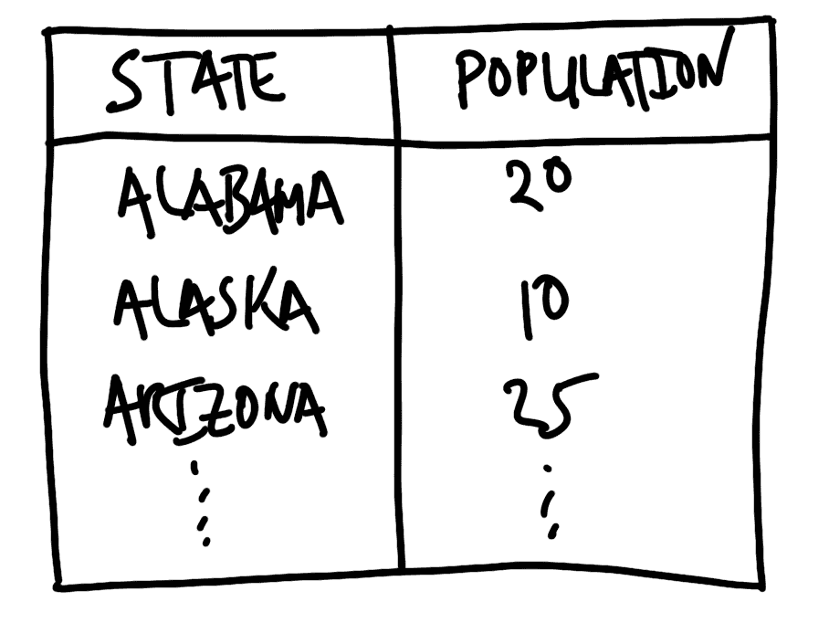

图 9.1：美国各州及其人口规划数据集

在这种情况下，草图迫使我们决定我们想要使用全名而不是缩写来表示州名，并且人口数量要以百万为单位进行衡量。绘制这个端点的过程迫使我们提前做出决定，并清楚地了解我们期望的终点。

我们随后使用代码来模拟数据。同样，这个过程迫使我们思考在数据集中合理的值看起来是什么样子，因为我们必须决定使用哪些函数。我们需要仔细思考每个变量的唯一值。例如，如果变量意味着是“性别”，那么可能期望的唯一值如“男性”、“女性”、“其他”和“未知”，但像“1,000”这样的数字可能是不正确的。这也迫使我们明确名称，因为我们必须将这些函数的输出分配给变量。例如，我们可以模拟美国各州的人口数据。

```r
set.seed(853)

simulated_population <-
 tibble(
 state = state.name,
 population = runif(n = 50, min = 0, max = 50) |>
 round(digits = 2)
 )

simulated_population
```

```r
# A tibble: 50 × 2
   state       population
   <chr>            <dbl>
 1 Alabama          18.0 
 2 Alaska            6.01
 3 Arizona          24.2 
 4 Arkansas         15.8 
 5 California        1.87
 6 Colorado         20.2 
 7 Connecticut       6.54
 8 Delaware         12.1 
 9 Florida           7.9 
10 Georgia           9.44
# ℹ 40 more rows
```
我们的目的是在数据清洗和准备过程中，将我们的原始、未编辑的数据尽可能接近该计划。理想情况下，我们会制定计划，使得我们数据集的期望终点是“整洁数据”。这在在线附录 A 中有所介绍，但简要来说，这意味着([Wickham, Çetinkaya-Rundel, and Grolemund [2016] 2023](99-references.html#ref-r4ds); Wickham 2014, 4)：

1.  每个变量都在自己的列中；

1.  每个观察都在其自己的行中；并且

1.  每个值都在自己的单元格中。

在这个阶段开始思考有效性和内部一致性。这些数据应该具备哪些特征？在模拟数据集的过程中将这些特征记录下来，因为我们将在编写测试时参考它们。

### 9.2.3 从小开始

经过周密规划后，我们可以转向处理原始、未经编辑的数据。通常，我们希望尽可能快地将原始、未经编辑的数据转换成一个矩形数据集。这使我们能够使用来自`tidyverse`的熟悉函数。例如，让我们假设我们从一个`.txt`文件开始。

第一步是寻找数据集中的规律性。我们希望最终得到表格数据，这意味着我们需要某种类型的分隔符来区分不同的列。理想情况下，这可能是一些特征，如逗号、分号、制表符、双空格或换行符。在以下情况下，我们可以利用逗号。

```r
Alabama, 5
Alaska, 0.7
Arizona, 7
Arkansas, 3
California, 40
```

在更具挑战性的情况下，我们可能可以利用数据集的一些规律性特征。有时各种文本会重复出现，如下例所示。

```r
State is Alabama and population is 5 million.
State is Alaska and population is 0.7 million.
State is Arizona and population is 7 million.
State is Arkansas and population is 3 million.
State is California and population is 40 million.
```

在这种情况下，尽管我们没有传统的分隔符，但我们可以利用“状态是”，“人口是”，以及“百万”的规律来获取所需信息。一个更复杂的情况是当我们没有行断的情况下。这个最终案例就是这种情况的说明。

```r
Alabama 5 Alaska 0.7 Arizona 7 Arkansas 3 California 40
```

接近这个问题的方法之一是利用我们正在寻找的不同类别和值。例如，我们知道我们正在寻找的是美国各州，因此只有 50 个可能的选择（暂时将哥伦比亚特区排除在外），我们可以将这些作为分隔符。我们还可以利用人口是一个数字的事实，并基于一个数字后的空格进行分隔。

我们现在将这个最终案例转换为整洁数据。

```r
unedited_data <-
 c("Alabama 5 Alaska 0.7 Arizona 7 Arkansas 3 California 40")

tidy_data <-
 tibble(raw = unedited_data) |>
 separate(
 col = raw,
 into = letters[1:5],
 sep = "(?<=[[:digit:]]) " # A bracket preceded by numbers
 ) |>
 pivot_longer(
 cols = letters[1:5],
 names_to = "drop_me",
 values_to = "separate_me"
 ) |>
 separate(
 col = separate_me,
 into = c("state", "population"),
 sep = " (?=[[:digit:]])" # A space followed by a number
 ) |>
 select(-drop_me)

tidy_data
```

```r
# A tibble: 5 × 2
  state      population
  <chr>      <chr>     
1 Alabama    5         
2 Alaska     0.7       
3 Arizona    7         
4 Arkansas   3         
5 California 40 
```
### 9.2.4 编写测试和文档

虽然我们建立了一个矩形数据集，尽管有些杂乱，但我们应该开始查看我们拥有的类别。在这个阶段，我们不一定想固定类别，因为这可能会导致数据丢失。但我们查看类别以了解其内容，将其与我们的模拟数据集进行比较，并注意不同的列以了解需要做出哪些更改。关于`class()`的背景信息可在在线附录 A 中找到。

在更改班级之前以及继续探讨更定制化的问题之前，我们应该处理一些常见问题，包括：

+   逗号和其他标点符号，例如货币符号（$，€，£等），在应该为数字的变量中。

+   日期格式不一致，例如在一个变量中同时出现“December”、“Dec”和“12”。

+   不可预料的字符编码，尤其是在 Unicode 中，可能会导致显示不一致。¹

通常，我们希望立即修复任何明显的问题。例如，我们应该删除用于将货币中的数字分组使用的逗号。然而，情况往往会让人感到不知所措。我们需要做的是查看每个变量的唯一值，然后对我们将要修复的内容进行分类。我们根据可能产生最大影响的因素来做出分类决策。这通常意味着创建观察值的计数，按降序排列，然后按此顺序处理。

当通过成员资格测试——我们最初基于模拟和经验来建立这些测试——然后我们可以更改类别，并再次运行所有测试。我们从单元测试的软件开发方法中借鉴了这个想法。测试至关重要，因为它们使我们能够了解软件（或在这种情况下数据）是否适合我们的目的（Irving 等人 2021）。在数据科学中，测试不是我们只写一次然后忘记的静态事物。相反，它们应根据需要更新和演变。

哦，你以为我们对这方面的数据很好吗!* *现实简化的情况在体育记录中尤为明显，因为体育记录必然需要选择记录什么。体育记录适合某些目的，但不适合其他目的。例如，国际象棋是在一个交替着黑白方格的 8 x 8 棋盘上进行的。方格由一个独特的字母（A-G）和数字（1-8）的组合来表示。大多数棋子都有一个独特的缩写，例如骑士是 N，主教是 B。每个游戏都是通过每个玩家使用这种“代数记法”独立记录的。这些记录使我们能够重现游戏的走法。2021 年国际象棋世界锦标赛由马格努斯·卡尔森和伊恩·内波姆尼亚奇进行。这场比赛之所以特别引人注目，有多种原因——包括这是最长的世界锦标赛游戏——但其中之一是卡尔森和内波姆尼亚奇都犯了一些不寻常的错误。例如，在第 33 步，卡尔森没有利用一个机会；在第 36 步，一个不同的走法本可以为内波姆尼亚奇提供一个有希望的残局(Doggers 2021)。这些错误可能的原因之一是，在游戏的那个阶段，两位选手剩余的时间非常少——他们必须非常快速地决定他们的走法。但在游戏记录表提供的表示中，并没有这种感觉，因为它没有记录剩余时间。记录适合作为“正确”地表示游戏中发生的事情；但不一定是为什么发生。让我们通过一组字符串的例子来运行一个示例，其中一些字符串略有错误。这种类型的输出是[第七章中介绍的 OCR 的典型输出，它通常已经完成了大部分工作，但还不够。*

```r
messy_string <- paste(
 c("Patricia, Ptricia, PatricIa, Patric1a, PatricIa"),
 c("PatrIcia, Patricia, Patricia, Patricia , 8atricia"),
 sep = ", "
)
```

与之前一样，我们首先将数据集整理成矩形格式。

```r
messy_dataset <-
 tibble(names = messy_string) |>
 separate_rows(names, sep = ", ")

messy_dataset
```

```r
# A tibble: 10 × 1
   names      
   <chr>      
 1 "Patricia" 
 2 "Ptricia"  
 3 "PatricIa" 
 4 "Patric1a" 
 5 "PatricIa" 
 6 "PatrIcia" 
 7 "Patricia" 
 8 "Patricia" 
 9 "Patricia "
10 "8atricia" 
```
我们现在需要决定我们将要修复哪些错误。为了帮助我们决定哪些是最重要的，我们创建了一个计数。

```r
messy_dataset |>
 count(names, sort = TRUE)
```

```r
# A tibble: 7 × 2
  names           n
  <chr>       <int>
1 "Patricia"      3
2 "PatricIa"      2
3 "8atricia"      1
4 "PatrIcia"      1
5 "Patric1a"      1
6 "Patricia "     1
7 "Ptricia"       1
```
最常见的独特观察结果是正确的。下一个——“PatricIa”——看起来像是“i”被错误地大写了。对于“PatrIcia”也是如此。我们可以使用`str_to_title()`函数来修复大小写问题，该函数将字符串中每个单词的首字母转换为大写，其余部分转换为小写，然后重新进行计数。

弦论背景信息可在在线附录 A 中找到。

```r
messy_dataset_fix_I_8 <-
 messy_dataset |>
 mutate(
 names = str_to_title(names)
 )

messy_dataset_fix_I_8 |>
 count(names, sort = TRUE)
```

```r
# A tibble: 5 × 2
  names           n
  <chr>       <int>
1 "Patricia"      6
2 "8atricia"      1
3 "Patric1a"      1
4 "Patricia "     1
5 "Ptricia"       1
```
这已经比之前的 30%正确率要好多了，现在有 60%的值是正确的。还有两个明显的错误——“8tricia”和“Ptricia”——第一个错误在于用“8”代替了“P”，而第二个错误则缺少了一个“a”。我们可以使用`str_replace_all()`来修复这些问题。

```r
messy_dataset_fix_a_n <-
 messy_dataset_fix_I_8 |>
 mutate(
 names = str_replace_all(names, "8atricia", "Patricia"),
 names = str_replace_all(names, "Ptricia", "Patricia")
 )

messy_dataset_fix_a_n |>
 count(names, sort = TRUE)
```

```r
# A tibble: 3 × 2
  names           n
  <chr>       <int>
1 "Patricia"      8
2 "Patric1a"      1
3 "Patricia "     1
```
我们以不太多的努力实现了 80%的成果。最后两个问题更为微妙。第一个问题发生是因为“i”被错误地编码为“1”。在某些字体中这会显示出来，但在其他字体中则更难看到。这是一个常见问题，尤其是在 OCR 中，需要引起注意。第二个问题是因为尾随空格。尾随和首部空格又是另一个常见问题，我们可以通过`str_trim()`来解决。在我们修复这两个剩余问题之后，所有条目都得到了纠正。*

```r
cleaned_data <-
 messy_dataset_fix_a_n |>
 mutate(
 names = str_replace_all(names, "Patric1a", "Patricia"),
 names = str_trim(names, side = c("right"))
 )

cleaned_data |>
 count(names, sort = TRUE)
```

```r
# A tibble: 1 × 2
  names        n
  <chr>    <int>
1 Patricia    10
```
在这个例子中，我们已经在脑海中进行了测试。我们知道我们希望得到“Patricia”。但我们可以开始记录这个测试。一种方法是查看数据集中是否存在除了“Patricia”之外的其他值。*

```r
check_me <-
 cleaned_data |>
 filter(names != "Patricia")

if (nrow(check_me) > 0) {
 print("Still have values that are not Patricia!")
}
```

我们可以通过使用`stopifnot()`函数在条件不满足时停止代码执行，使事情显得更加严格。要使用这个函数，我们需要定义一个期望满足的条件。我们可以在代码的任何地方实现这种检查。例如，如果我们期望数据集中有特定数量的观测值，或者某个变量具有各种属性，例如是一个整数或因子。*

```r
stopifnot(nrow(check_me) == 0)
```

我们可以使用 `stopifnot()` 来确保我们的脚本在运行时按预期工作。

为我们的数据集编写测试的另一种方法是使用 `testthat`。尽管它是为测试软件包而开发的，但我们仍然可以利用其功能来测试我们的数据集。例如，我们可以使用 `expect_length()` 来检查数据集的长度，以及使用 `expect_equal()` 来检查内容。

```r
# Is the dataset of length one?
expect_length(check_me, 1) 
# Are the observations characters?
expect_equal(class(cleaned_data$names), "character") 
# Is every unique observation "Patricia"?
expect_equal(unique(cleaned_data$names), "Patricia") 
```

如果测试通过则不会发生任何事，但如果测试失败则脚本将停止。

我们测试什么？这是一个难题，我们将在下一节详细描述一系列更具体的测试。但总体来说，我们测试的是我们所拥有的，与我们所期望的进行对比。20 世纪 60 年代参与阿波罗计划软件开发的工程师最初认为编写测试是“忙碌的工作”(Mindell 2008, 170)。但最终他们意识到，除非软件伴随着一套全面的测试，否则 NASA 不会相信软件能够用来将人类送上月球。数据科学也是如此。

从有效性测试开始。这些测试通常检查变量的类别、它们的唯一值以及观测数的数量。例如，如果我们使用的是最近的数据集，那么年份的列可以测试以确保所有元素都有四位数字并以“2”开头。Baumgartner (2021) 将其描述为对模式的测试。

之后，转向内部一致性的检查。例如，如果有不同数值响应的变量，那么检查这些变量的总和是否等于总变量，或者如果不等于，那么这种差异是有解释的。最后，转向外部一致性的测试。在这里，我们希望使用外部信息来指导我们的测试。例如，如果我们有一个德国新生儿死亡率（NMR）的变量（这一概念在第二章中介绍），那么我们可以查看世界卫生组织（WHO）的估计，并确保我们的 NMR 变量是一致的。经验丰富的分析师会在脑海中完成这些操作。问题是，这不能扩展，可能不一致，并且过度依赖声誉。我们将在第十二章的建模背景下回到这个问题。

我们在整个代码中编写测试，而不是仅在最后。特别是，在中间步骤使用`stopifnot()`语句可以确保数据集正在以我们期望的方式进行清理。例如，当合并两个数据集时，我们可以检查：

1.  数据集中的变量名称是唯一的，除了用作键的列/之外。

1.  每种类型的观测数量正在被适当地传递。

1.  数据集的维度没有出现意外变化。
  
### 9.2.5 迭代、归纳和更新

我们现在可以迭代这个计划。在这个最近的案例中，我们开始时有十个条目。我们没有理由不能增加到 100 个甚至 1,000 个。我们可能需要将清理程序和测试进行一般化。但最终，我们会开始将数据集整理成某种秩序。
  
## 9.3 检查和测试

罗伯特·卡罗，林登·约翰逊的传记作者，在第四章中介绍，花费多年时间追踪与美利坚合众国第 36 任总统相关联的每一个人。卡罗和他的妻子伊娜甚至搬到德克萨斯州的希尔乡村居住了三年，以便更好地了解约翰逊的出身。当卡罗听说约翰逊作为参议员将从他在华盛顿特区居住的地方参选参议院时，他自己多次跑那条路线，试图理解约翰逊为何要这么做。卡罗最终是在太阳升起时跑那条路线，就像约翰逊所做的那样，才理解了这一切；结果证明，太阳以特别鼓舞人心的方式照射着参议院圆顶(Caro 2019, 156)。这项背景工作使他能够揭露其他人不知道的方面。例如，约翰逊几乎肯定是在第一次选举中窃取了胜利(Caro 2019, 116)。我们需要像这样深入理解我们的数据。我们希望比喻性地翻阅每一页。

负空间的观念在设计领域中已经得到了很好的确立。它指的是围绕主题的部分。有时负空间会被用作一种效果。例如，美国物流公司 FedEx 的标志在 E 和 X 之间就利用了负空间，形成了一个箭头。以类似的方式，我们希望对所拥有的数据和未拥有的数据保持警觉（Hodgetts 2022）。我们担心那些我们没有的数据可能具有某种意义，甚至可能到足以改变我们结论的程度。当我们清理数据时，我们正在寻找异常值。我们对数据集中不应该存在的值感兴趣，但也对应该存在于数据集中但实际不存在的值感兴趣。我们有三种工具用来识别这些情况：图表、计数和测试。

我们也使用这些工具来确保我们不会将正确的观察结果改为错误的。尤其是在我们的清理和准备需要许多步骤时，可能会出现某个阶段的修复在后续被撤销的情况。我们使用图表、计数，尤其是测试，来防止这种情况发生。这些工具的重要性随着数据集大小的增加而呈指数级增长。小型和中型数据集更易于手动检查和其他依赖分析师的方面，而大型数据集尤其需要更有效的策略(Hand 2018)。

### 9.3.1 图

图表在数据清洗时是一个无价之宝，因为它们展示了数据集中的每个观测值，可能还与其他观测值相关。它们有助于识别哪些值不属于正常范围。例如，如果一个值预期是数值型的，但实际是字符型，那么它将无法绘制，并会显示警告。图表对于数值数据尤其有用，但对于文本和分类数据也同样有用。让我们假设我们有一个情况，我们对于一个青年调查中的人的年龄感兴趣。我们有以下数据：

```r
youth_survey_data <-
 tibble(ages = c(
 15.9, 14.9, 16.6, 15.8, 16.7, 17.9, 12.6, 11.5, 16.2, 19.5, 150
 ))
```

```r
youth_survey_data |>
 ggplot(aes(x = ages)) +
 geom_histogram(binwidth = 1) +
 theme_minimal() +
 labs(
 x = "Age of respondent",
 y = "Number of respondents"
 )

youth_survey_data_fixed |>
 ggplot(aes(x = ages)) +
 geom_histogram(binwidth = 1) +
 theme_minimal() +
 labs(
 x = "Age of respondent",
 y = "Number of respondents"
 )
```

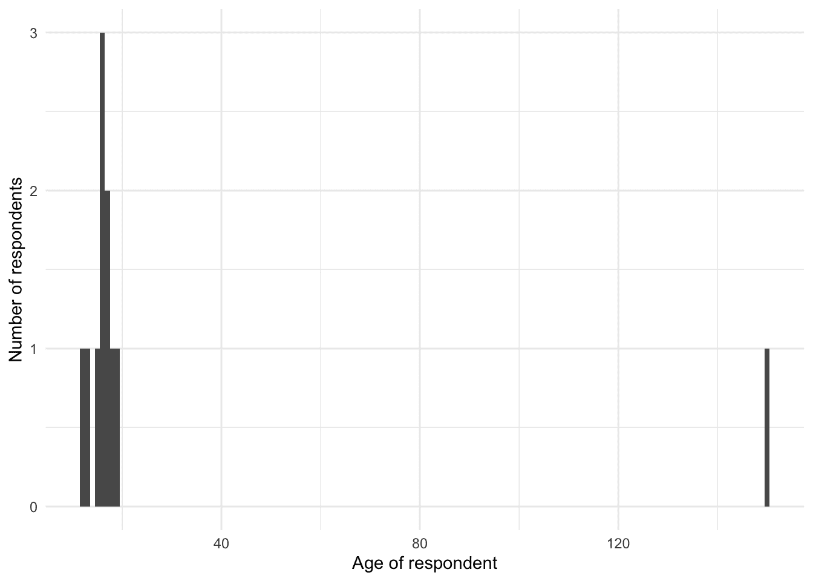*

(a) 清洁前

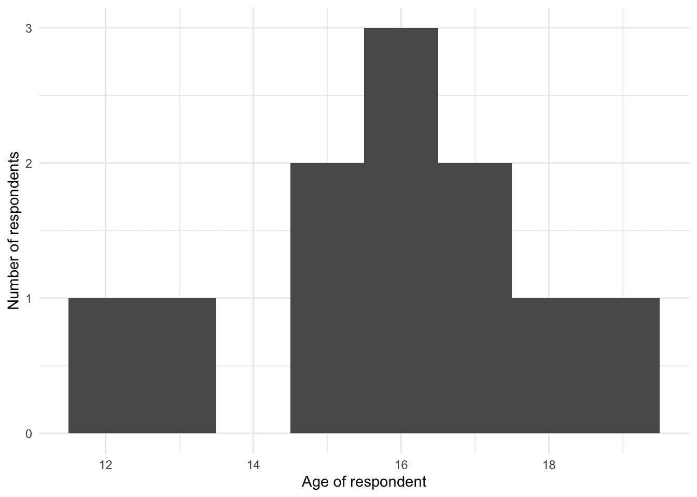

(b) 清洁后

图 9.2：模拟青年调查数据集中的年龄识别出一个数据问题

图 9.2 (a) 显示了一个意外的值 150。最可能的解释是数据输入错误，遗漏了小数点，应该是 15.0。我们可以修复这个问题，记录下来，然后重新绘制图表，这将显示一切看起来更加有效 (图 9.2 (b))。

### 9.3.2 计数

我们希望专注于获取大部分数据的准确性，因此我们对唯一值的计数感兴趣。希望大部分数据都集中在最常见的计数中。但反过来查看特别不常见的数据也可能很有用。我们处理这些数据的程度取决于我们的需求。最终，每次我们修正一个数据点，我们只能获得非常少的额外观察结果，甚至可能只有一条。计数在处理文本或分类数据时特别有用，但在处理数值数据时也可能有所帮助。

让我们来看一个文本数据的例子，每个都代表“澳大利亚”。

```r
australian_names_data <-
 tibble(
 country = c(
 "Australie", "Austrelia", "Australie", "Australie", "Aeustralia",
 "Austraia", "Australia", "Australia", "Australia", "Australia"
 )
 )

australian_names_data |>
 count(country, sort = TRUE)
```

```r
# A tibble: 5 × 2
  country        n
  <chr>      <int>
1 Australia      4
2 Australie      3
3 Aeustralia     1
4 Austraia       1
5 Austrelia      1
```
使用这个计数可以确定我们应该在哪里花费时间：将“Australie”改为“Australia”几乎可以使可用数据量翻倍。

简单地转向数值数据，Preece (1981) 建议绘制每个变量观测值的最后一位数字的计数图。例如，如果该变量的观测值为“41.2”，“80.3”，“20.7”，“1.2”，“46.5”，“96.2”，“32.7”，“44.3”，“5.1”，和“49.0”。那么我们注意到 0、1 和 5 各出现一次，3 和 7 各出现两次，而 2 出现了三次。我们可能会预期这些最后一位数字应该有一个均匀的分布。但出人意料的是，这往往不是情况，而且它差异的方式可能是有启发性的。例如，可能数据被四舍五入，或者由不同的收集者记录。

例如，在本章的后面部分，我们将收集、清洗和准备一些来自 2019 年肯尼亚人口普查的数据。我们预先使用这个数据集，并查看年龄最后一位数的计数。也就是说，比如说，从 35 岁我们取“5”，从 74 岁我们取“4”。表 9.1 显示了由于一些受访者回答关于年龄的问题时选择了最接近的 5 或 10 的值，因此发生的预期年龄尾数堆积。如果我们有一个没有这种模式的年龄变量，那么我们可能会预期它是由不同类型的问题构建的。

表 9.1：内罗毕单一年龄人口年龄末尾数字中 0 和 5 数字的过剩情况，数据来源于 2019 年肯尼亚人口普查

| 年龄的最后一位数字 | 出现次数 |
| --- | --- |
| 0 | 347,233 |
| 1 | 278,930 |
| 2 | 308,933 |
| 3 | 285,745 |
| 4 | 270,355 |
| 5 | 303,817 |
| 6 | 246,582 |
| 7 | 242,688 |
| 8 | 207,739 |

| 9 | 216,355 |

### 9.3.3 测试

正如我们在第三章中所述，如果你编写代码，那么你就是一名程序员，但仅仅是为了娱乐而编码的人和编写运行詹姆斯·韦伯望远镜代码的人之间是有区别的。遵循温伯格(1971, 122)的观点，我们可以根据后续用户的存在来区分业余爱好者和专业人士。当你刚开始编码时，你通常编写的是只有你自己会使用的代码。例如，你可能为课程论文编写一些代码。在你得到成绩后，在大多数情况下，代码将不再被运行。相比之下，专业人士编写代码是为了，并且经常与，其他人一起。

如今，许多学术研究都依赖于代码。如果这项研究要为持久的知识做出贡献，那么支撑它的代码就需要为他人编写，并且在使用者转向其他项目之后，代码仍需为他人良好地工作。专业人士会对确保代码能为他人所考虑的任务给予适当的关注。其中很大一部分是测试。

火箭推进实验室 (2009, 14) 声称，事后的分析“通常每写一百行代码就能发现至少一个缺陷”。没有理由相信没有测试的代码是没有缺陷的，只是它们尚未被发现。因此，我们应该尽可能地在代码中包含测试。有一些基础设施用于测试数据科学代码。例如，在 Python 中有 Radcliffe 的测试驱动数据分析库 (2023)，但还需要更多。

有些事情非常重要，以至于我们要求清洗后的数据集必须包含它们。这些是我们应该检查的条件。它们通常来自经验、专业知识或规划和模拟阶段。例如，年龄变量中不应有负数，并且年龄超过 110 岁的情况很少。对于这些情况，我们可以具体要求满足条件。另一个例子是在进行跨国分析时，一个我们知道应该包含在我们数据集中的国家名称列表将是有用的。我们的测试将是确保以下情况存在：

1.  那个列表中没有但在我们的数据集中存在的值，或者反过来；以及

1.  我们预期应该包含在我们的数据集中但实际并未出现的国家。

为了有一个具体的例子，让我们考虑如果我们正在对肯尼亚最大的五个县进行分析。通过查询，我们发现这些是：“内罗毕”、“基安布”、“纳库鲁”、“卡卡梅加”和“布隆迪马”。我们可以创建那个变量。

```r
correct_kenya_counties <-
 c(
 "Nairobi", "Kiambu", "Nakuru", "Kakamega", "Bungoma"
 )
```

然后假设我们有一个包含错误的以下数据集。

```r
top_five_kenya <-
 tibble(county = c(
 "Nairobi",  "Nairob1", "Nakuru", "Kakamega", "Nakuru",
 "Kiambu", "Kiambru", "Kabamega", "Bun8oma", "Bungoma"
 ))

top_five_kenya |>
 count(county, sort = TRUE)
```

```r
# A tibble: 9 × 2
  county       n
  <chr>    <int>
1 Nakuru       2
2 Bun8oma      1
3 Bungoma      1
4 Kabamega     1
5 Kakamega     1
6 Kiambru      1
7 Kiambu       1
8 Nairob1      1
9 Nairobi      1
```
根据计数，我们知道我们必须修复其中的一些。有两个名字中有数字。

```r
top_five_kenya_fixed_1_8 <-
 top_five_kenya |>
 mutate(
 county = str_replace_all(county, "Nairob1", "Nairobi"),
 county = str_replace_all(county, "Bun8oma", "Bungoma")
 )

top_five_kenya_fixed_1_8 |>
 count(county, sort = TRUE)
```

```r
# A tibble: 7 × 2
  county       n
  <chr>    <int>
1 Bungoma      2
2 Nairobi      2
3 Nakuru       2
4 Kabamega     1
5 Kakamega     1
6 Kiambru      1
7 Kiambu       1
```
在这个阶段，我们可以将此与我们所知的正确变量进行比较。我们进行双向检查，即检查正确变量中是否有不在我们的数据集中，以及数据集中是否有不在我们的正确变量中的内容。我们使用检查条件来决定我们是否完成。

```r
if (all(top_five_kenya_fixed_1_8$county |>
 unique() %in% correct_kenya_counties)) {
 "The cleaned counties match the expected countries"
} else {
 "Not all of the counties have been cleaned completely"
}
```

```r
[1] "Not all of the counties have been cleaned completely"
```

```r
if (all(correct_kenya_counties %in% top_five_kenya_fixed_1_8$county |>
 unique())) {
 "The expected countries are in the cleaned counties"
} else {
 "Not all the expected countries are in the cleaned counties"
}
```

```r
[1] "The expected countries are in the cleaned counties"
```
很明显，我们仍然需要进行清理，因为并非所有县都符合我们的预期。

#### 9.3.3.1 需要测试的方面

我们将讨论针对类和日期的显式测试，鉴于它们的重要性非同寻常，以及它们出错是多么常见。但需要明确考虑测试的其他方面包括：

+   货币价值的变量应根据具体情况测试其合理的范围。在某些情况下，负值可能不可行。有时可以确定一个上限。货币变量应该是数字。它们不应包含逗号或其他分隔符。它们不应包含货币符号或分号等符号。

+   人口值的变量很可能不应为负数。城市的人口数量很可能在 100,000 到 50,000,000 之间。它们再次应该是数字的，并且只包含数字，没有符号。

+   名称应该是字符变量。它们很可能不包含数字。它们可能包含一些有限的符号集，这将是上下文特定的。

+   观察数的数量意外改变的情况令人惊讶地容易发生。虽然故意这样做是可以接受的，但当它意外发生时，可能会造成重大问题。在任何数据清洗过程的开始阶段，观察数应该与数据模拟进行测试，并根据需要更新这一预期。在整个数据清洗过程中都应进行测试，但尤其是在任何连接操作之前和之后。

更普遍地，与专家合作，利用先验知识为感兴趣的变量制定一些合理的特征，然后实施这些特征。例如，考虑 Baker (2023) 如何通过大致比较美国有多少机构接受联邦财政援助来快速识别关于用户数量的声明中的错误。

我们可以使用`validate`来设置一系列测试。例如，这里我们将模拟一些存在明显问题的数据。

```r
set.seed(853)

dataset_with_issues <-
 tibble(
 age = c(
 runif(n = 9, min = 0, max = 100) |> round(),
 1000
 ),
 gender = c(
 sample(
 x = c("female", "male", "other", "prefer not to disclose"),
 size = 9,
 replace = TRUE,
 prob = c(0.4, 0.4, 0.1, 0.1)
 ),
 "tasmania"
 ),
 income = rexp(n = 10, rate = 0.10) |> round() |> as.character()
 )

dataset_with_issues
```

```r
# A tibble: 10 × 3
     age gender                 income
   <dbl> <chr>                  <chr> 
 1    36 female                 20    
 2    12 prefer not to disclose 16    
 3    48 male                   0     
 4    32 female                 2     
 5     4 female                 1     
 6    40 female                 13    
 7    13 female                 13    
 8    24 female                 7     
 9    16 male                   3     
10  1000 tasmania               2 
```
在这种情况下，存在一个不可能的年龄，性别变量中有一个不应该存在的观测值，最后，收入是一个字符变量而不是数值变量。我们使用`validator()`来建立我们期望数据满足的规则，并使用`confront()`来确定它是否满足这些规则。

```r
rules <- validator(
 is.numeric(age),
 is.character(gender),
 is.numeric(income),
 age < 120,
 gender %in% c("female", "male", "other", "prefer not to disclose")
)

out <-
 confront(dataset_with_issues, rules)

summary(out)
```

```r
 name items passes fails nNA error warning
1   V1     1      1     0   0 FALSE   FALSE
2   V2     1      1     0   0 FALSE   FALSE
3   V3     1      0     1   0 FALSE   FALSE
4   V4    10      9     1   0 FALSE   FALSE
5   V5    10      9     1   0 FALSE   FALSE
                                                           expression
1                                                     is.numeric(age)
2                                                is.character(gender)
3                                                  is.numeric(income)
4                                                           age < 120
5 gender %vin% c("female", "male", "other", "prefer not to disclose")
```
在这种情况下，我们可以看到我们确立的最后三条规则存在问题。更普遍地，van der Loo (2022) 提供了许多可以使用的示例测试。*

如第六章所述，性别是我们需要特别小心对待的问题。我们通常只有少数既不是“男性”也不是“女性”的回答。正确处理这种情况的方式取决于上下文。但如果除了“男性”或“女性”之外的其他回答因为数量太少而被从数据集中移除并忽略，那么尊重受访者可能意味着包括一个简短的讨论，说明他们与数据集中其他部分相似或不同之处。然后可以在附录中包含图表和更广泛的讨论。

#### 9.3.3.2 类

有时人们会说美国人沉迷于金钱，而英国人沉迷于阶级。在数据清洗和准备的情况下，我们需要表现得像英国人。阶级至关重要，值得特别注意。我们在在线附录 A 中介绍了阶级，在这里我们关注“数值”、“字符”和“因子”。对变量类别的明确检查是必不可少的。错误地将变量分配到错误的类别可能会对后续分析产生重大影响。重要的是：

+   检查某个值是否应该是数字或因子；并且

+   检查值是否为数字而非字符。

要理解为什么明确一个值是数字还是因素很重要，考虑以下情况：

```r
simulated_class_data <-
 tibble(
 response = c(1, 1, 0, 1, 0, 1, 1, 0, 0),
 group = c(1, 2, 1, 1, 2, 3, 1, 2, 3)
 ) |>
 mutate(
 group_as_integer = as.integer(group),
 group_as_factor = as.factor(group),
 )
```

我们使用逻辑回归，这在第十二章中进行了更详细的介绍，首先将“group”作为一个整数包含在内，然后将其作为一个因子包含。表 9.2 展示了不同结果之间的差异，并突出了正确选择用于回归的变量类别的重要性。在前者中，当 group 是一个整数时，我们要求观察的不同级别之间保持一致的关系，而在后者中，当它是一个因子时，我们允许更多的自由度。

```r
models <- list(
 "Group as integer" = glm(
 response ~ group_as_integer,
 data = simulated_class_data,
 family = "binomial"
 ),
 "Group as factor" = glm(
 response ~ group_as_factor,
 data = simulated_class_data,
 family = "binomial"
 )
)
modelsummary(models)
```

表 9.2：检验班级对回归结果的影响*

|  | 将组作为整数 | 将组作为因子 |
| --- | --- | --- |
| (拦截) | 1.417 | 1.099 |
|  | (1.755) | (1.155) |
| 整数分组 | -0.666 |  |
|  | (0.894) |  |
| group_as_factor2 |  | -1.792 |
|  |  | (1.683) |
| group_as_factor3 |  | -1.099 |
|  |  | (1.826) |
| 观测数量 | 9 | 9 |
| AIC | 15.8 | 17.1 |
| BIC | 16.2 | 17.7 |
| 对数似然 | -5.891 | -5.545 |
| F | 0.554 | 0.579 |

| RMSE | 0.48 | 0.46 |*  *班级非常重要，微妙，并且可能对分析产生如此有害的影响，以至于使用一系列检查类别的测试套件进行分析更容易让人相信。在建模之前建立这个套件尤其有价值，但将其作为数据清洗和准备的一部分设置起来也是值得的。Jane Street，一家美国自营交易公司，使用特定编程语言 OCaml 的原因之一是，其类型系统使其在类别方面更加可靠（Somers 2015）。当代码很重要时，类别是一个至关重要的关注点。

在计算机科学领域，关于类型效应和影响的许多开放性问题尚未解决，但已有一些研究工作。例如，高、伯德和巴勒（2017）发现，使用静态类型系统可以捕捉到生产环境中 JavaScript 系统大约 15%的错误。已经开发了一些语言，如 TypeScript，其中主要区别在于，在这种情况下与 JavaScript 相比，它们是强类型。图尔科特等人（2020）探讨了在 R 语言中添加类型系统的某些考虑因素。他们开发了一个原型，在某种程度上解决了技术问题，但承认由于需要用户改变等多种原因，大规模实施将具有挑战性。

到目前为止，在这本书的这一部分，当我们使用 `read_csv()` 和其他导入数据的函数时，我们允许函数猜测变量的类型。从现在开始，我们将更加谨慎，并使用“col_types”自行指定它。例如，而不是：

```r
raw_igme_data <-
 read_csv(
 file = "https://childmortality.org/wp-content/uploads/2021/09/UNIGME-2021.csv",
 show_col_types = FALSE
 )
```

我们推荐使用：

```r
raw_igme_data <-
 read_csv(
 file = "https://childmortality.org/wp-content/uploads/2021/09/UNIGME-2021.csv",
 col_select = c(`Geographic area`, TIME_PERIOD, OBS_VALUE),
 col_types = cols(
 `Geographic area` = col_character(),
 TIME_PERIOD = col_character(),
 OBS_VALUE = col_double(),
 )
 )
```

这是一个典型的迭代过程，最初是读取数据集，快速了解其内容，然后只指定必要的列和类别，正确地读取它。虽然这会让我们多做一些额外的工作，但清楚类别是很重要的。
  
#### 9.3.3.3 日期

判断一个人是否处理过日期的一个标志是，当你告诉他们你将要处理日期时他们的反应。如果他们分享了一个恐怖故事，那么他们很可能之前处理过日期！

日期的详细检查非常重要。理想情况下，我们希望日期采用以下格式：YYYY-MM-DD。关于在更广泛的世界中哪种日期格式是合适的，存在不同的观点。合理的人可能会对 2022 年 7 月 1 日或 7 月 1 日，2022 年哪个更好持有不同意见，但 YYYY-MM-DD 是国际标准，我们应在可能的情况下在我们的日期变量中使用该格式。

一些可能有用的测试包括：

+   如果一列是星期几，那么测试该列仅包含周一、周二、$\dots$、周日。进一步，测试这七天是否都存在。同样地，对于月份。

+   测试每个月的天数是否合适，例如，检查九月是否有 30 天等。

+   检查数据集中日期是否按顺序排列。这不一定必须如此，但通常当顺序不对时，会有值得探索的问题。

+   检查年份是否完整且适合分析期

在第二章中，我们使用`opendatatoronto`介绍了 2021 年多伦多庇护所使用的数据集。在这里，我们考察同一数据集，但针对 2017 年，以说明一些与日期相关的问题。我们首先需要下载这些数据。²

```r
toronto_shelters_2017 <-
 search_packages("Daily Shelter Occupancy") |>
 list_package_resources() |>
 filter(name == "Daily shelter occupancy 2017.csv") |>
 group_split(name) |>
 map_dfr(get_resource, .id = "file")

write_csv(
 x = toronto_shelters_2017,
 file = "toronto_shelters_2017.csv"
)
```

我们需要使名称更容易输入，并且只保留相关列。

```r
toronto_shelters_2017 <-
 toronto_shelters_2017 |>
 clean_names() |>
 select(occupancy_date, sector, occupancy, capacity)
```

这个数据集的主要问题将是日期。我们会发现日期大多以年-月-日格式出现，但某些观测值可能是年-日-月格式。我们使用`lubridate`中的`ymd()`函数按此顺序解析日期。*

```r
toronto_shelters_2017 <-
 toronto_shelters_2017 |>
 mutate(
 # remove times
 occupancy_date =
 str_remove(
 occupancy_date,
 "T[:digit:]{2}:[:digit:]{2}:[:digit:]{2}"
 )) |>
 mutate(generated_date = ymd(occupancy_date, quiet = TRUE))

toronto_shelters_2017
```

```r
# A tibble: 38,700 × 5
   occupancy_date sector   occupancy capacity generated_date
   <chr>          <chr>        <dbl>    <dbl> <date>        
 1 2017-01-01     Co-ed           16       16 2017-01-01    
 2 2017-01-01     Men             13       17 2017-01-01    
 3 2017-01-01     Men             63       63 2017-01-01    
 4 2017-01-01     Families        66       70 2017-01-01    
 5 2017-01-01     Men             58       60 2017-01-01    
 6 2017-01-01     Families       168      160 2017-01-01    
 7 2017-01-01     Families       119      150 2017-01-01    
 8 2017-01-01     Men             23       28 2017-01-01    
 9 2017-01-01     Families         8        0 2017-01-01    
10 2017-01-01     Co-ed           14       40 2017-01-01    
# ℹ 38,690 more rows
```
该分布图展示了所谓日成分的分布情况，从中可以明显看出存在一些担忧（图 9.3 (a)）。特别是，我们担心这些天的分布并非大致均匀。

```r
toronto_shelters_2017 |>
 separate(
 generated_date,
 into = c("one", "two", "three"),
 sep = "-",
 remove = FALSE
 ) |>
 count(three) |>
 ggplot(aes(x = three, y = n)) +
 geom_point() +
 theme_minimal() +
 labs(x = "Third component of occupancy date",
 y = "Number")

toronto_shelters_2017 |>
 mutate(row_number = c(seq_len(nrow(toronto_shelters_2017)))) |>
 ggplot(aes(x = row_number, y = generated_date), alpha = 0.1) +
 geom_point(alpha = 0.3) +
 theme_minimal() +
 labs(
 x = "Row number",
 y = "Date"
 )
```

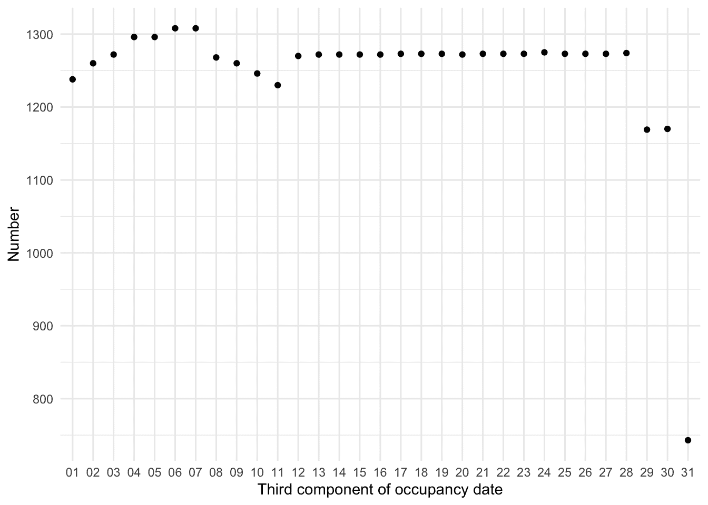*

(a) 按占用日期的第三分量计数

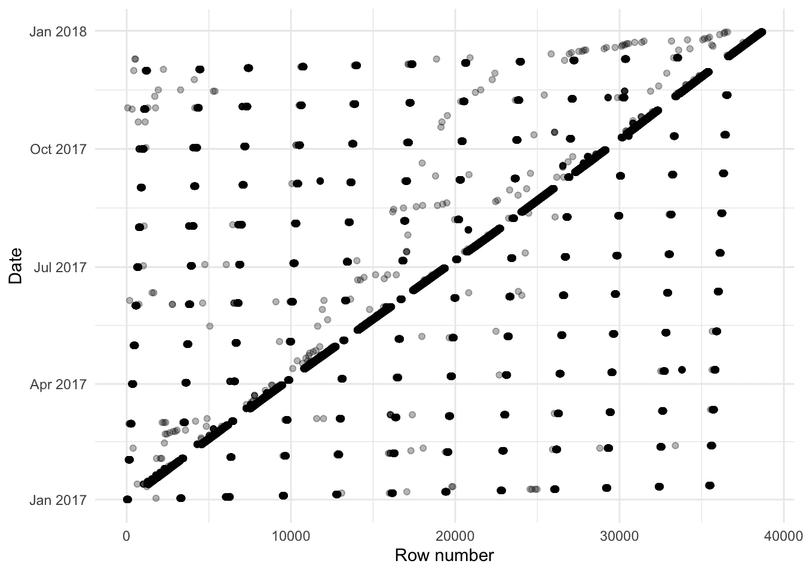

(b) 比较行号与日期

图 9.3：更详细地检查日期

如前所述，在清理数据集时，一个特别有用的图表是观察在数据集中出现的顺序。例如，我们通常会期望在日期方面有一个大致的顺序。为了检验这一点，我们可以按数据集中出现的顺序绘制日期变量（图 9.3 (b)）。

虽然这只是个快速绘制的图表，但它说明了这个观点——有很多数据是有序的，但并非全部。如果它们是有序的，那么我们预期它们会沿着对角线排列。数据最初似乎存在某种系统性，但数据并不有序，这很奇怪。我们可以总结数据以获取按日占用的计数。

```r
# Idea from Lisa Lendway
toronto_shelters_by_day <-
 toronto_shelters_2017 |>
 drop_na(occupancy, capacity) |>
 summarise(
 occupancy = sum(occupancy),
 capacity = sum(capacity),
 usage = occupancy / capacity,
 .by = generated_date
 )
```

我们对多伦多每天可用的庇护所位置感兴趣 (图 9.4)。

```r
toronto_shelters_by_day |>
 ggplot(aes(x = day(generated_date), y = occupancy)) +
 geom_point(alpha = 0.3) +
 scale_y_continuous(limits = c(0, NA)) +
 labs(
 color = "Type",
 x = "Day",
 y = "Occupancy (number)"
 ) +
 facet_wrap(
 vars(month(generated_date, label = TRUE)),
 scales = "free_x"
 ) +
 theme_minimal() +
 scale_color_brewer(palette = "Set1")
```

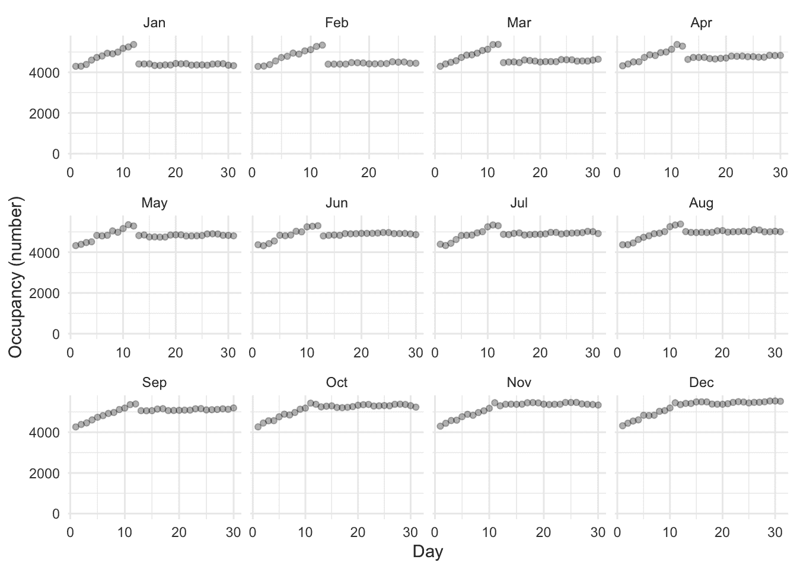*

图 9.4：多伦多收容所每日占用情况*  *很明显，似乎这个月的前 12 天存在问题。我们注意到，当我们查看数据时，它似乎有些不按顺序，这有点奇怪。从图 9.3（b）来看，似乎有一些系统性问题影响了多个观察结果。总的来说，似乎可能是日期变量中的前 12 天顺序错误，即我们认为它是年-月-日，但实际上是年-日-月。但也有一些例外。作为初步尝试，我们可以将每个月的前 12 天颠倒过来，看看是否有所帮助。这将会相当直接，但希望这能让我们有所进展。

```r
# Code by Monica Alexander
padded_1_to_12 <- sprintf("%02d", 1:12)

list_of_dates_to_flip <-
 paste(2017, padded_1_to_12, 
 rep(padded_1_to_12, each = 12), sep = "-")

toronto_shelters_2017_flip <-
 toronto_shelters_2017 |>
 mutate(
 year = year(generated_date),
 month = month(generated_date),
 day = day(generated_date),
 generated_date = as.character(generated_date),
 changed_date = if_else(
 generated_date %in% list_of_dates_to_flip,
 paste(year, day, month, sep = "-"),
 paste(year, month, day, sep = "-"),
 ),
 changed_date = ymd(changed_date)
 ) |>
 select(-year, -month, -day)
```

现在让我们来看一下 (图 9.5).

```r
toronto_shelters_2017_flip |>
 mutate(counter = seq_len(nrow(toronto_shelters_2017_flip))) |>
 ggplot(aes(x = counter, y = changed_date)) +
 geom_point(alpha = 0.3) +
 labs(x = "Row in the dataset",
 y = "Date of that row") +
 theme_minimal()

toronto_shelters_2017_flip |>
 drop_na(occupancy, capacity) |>
 summarise(occupancy = sum(occupancy),
 .by = changed_date) |>
 ggplot(aes(x = day(changed_date), y = occupancy)) +
 geom_point(alpha = 0.3) +
 scale_y_continuous(limits = c(0, NA)) +
 labs(color = "Type",
 x = "Changed day",
 y = "Occupancy (number)") +
 facet_wrap(vars(month(changed_date, label = TRUE)),
 scales = "free_x") +
 theme_minimal()
```

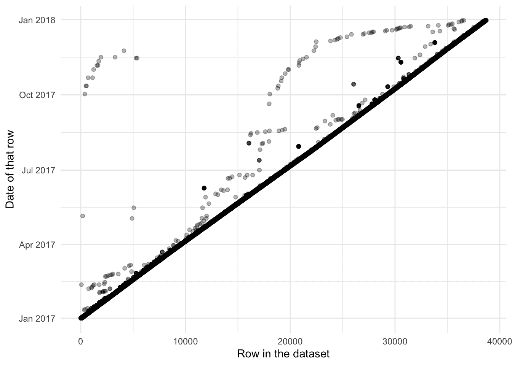*

(a) 调整后每行的日期顺序

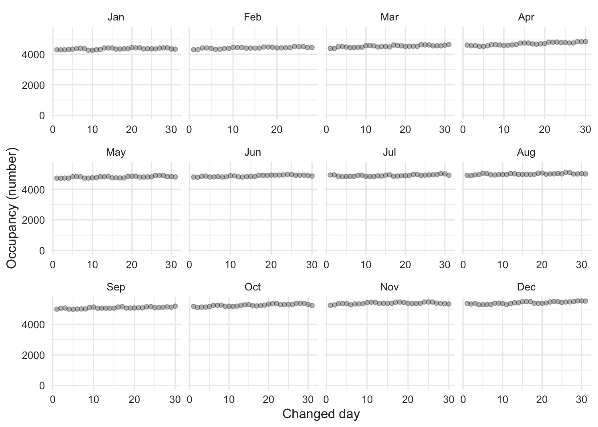

(b) 调整后的多伦多庇护所每日容纳量

图 9.5：调整后的日期，多伦多收容所的入住率

它并没有解决所有问题。例如，请注意现在对角线以下没有条目(图 9.5 (a))。但我们可以看出，它几乎完全处理了系统差异(图 9.5 (b))。这就是我们将结束这个示例的地方。
  
## 9.4 模拟示例：运行时间

为了提供一个具体的例子，我们将在第十二章中再次提及，考虑某人跑五公里（略超过三英里）所需的时间，与跑马拉松所需的时间相比（图 12.2 (a))。

在这里，我们考虑“模拟”和“获取”，重点关注测试。在模拟中，我们指定了一个 8.4 的关系，因为这是五公里跑和马拉松 42.2 公里距离（略超过 26 英里）的大致比例。

```r
set.seed(853)

num_observations <- 200
expected_relationship <- 8.4
fast_time <- 15
good_time <- 30

sim_run_data <-
 tibble(
 five_km_time =
 runif(n = num_observations, min = fast_time, max = good_time),
 noise = rnorm(n = num_observations, mean = 0, sd = 20),
 marathon_time = five_km_time * expected_relationship + noise
 ) |>
 mutate(
 five_km_time = round(x = five_km_time, digits = 1),
 marathon_time = round(x = marathon_time, digits = 1)
 ) |>
 select(-noise)

sim_run_data
```

```r
# A tibble: 200 × 2
   five_km_time marathon_time
          <dbl>         <dbl>
 1         20.4          164.
 2         16.8          158 
 3         22.3          196.
 4         19.7          160.
 5         15.6          121.
 6         21.1          178.
 7         17            157.
 8         18.6          169.
 9         17.4          150.
10         17.8          126.
# ℹ 190 more rows
```
我们可以使用我们的模拟来实施各种测试，我们希望实际数据能够满足这些测试。例如，我们希望 5 公里和马拉松跑步时间的类别是数值型的。并且我们希望有 200 个观测值。

```r
stopifnot(
 class(sim_run_data$marathon_time) == "numeric",
 class(sim_run_data$five_km_time) == "numeric",
 nrow(sim_run_data) == 200
)
```

我们知道，对于五公里跑步时间，任何少于 15 分钟或超过 30 分钟的价值都可能是需要跟进的事情。

```r
stopifnot(
 min(sim_run_data$five_km_time) >= 15,
 max(sim_run_data$five_km_time) <= 30
)
```

基于此最大值和模拟的 8.4 倍关系，如果我们发现任何马拉松时间显著超过$30\times8.4=252$分钟，即在考虑到一点漂移，比如 300 分钟之后，我们会感到惊讶。（为了明确，跑马拉松用时超过这个时间并没有什么不妥，但根据我们的模拟参数来看，这种情况不太可能）。而且，如果截至 2023 年开始的世界纪录马拉松时间，121 分钟，能比一分钟或两分钟更快，比如说，比 118 分钟更快，我们也会感到惊讶。（结果将表明，我们的模拟数据并不满足这一条件，导致了一个不切实际的 88 分钟马拉松时间，这表明需要改进模拟。）

```r
stopifnot(
 min(sim_run_data$marathon_time) >= 118,
 max(sim_run_data$marathon_time) <= 300
)
```

然后我们可以将这些测试应用于实际数据。关于五公里跑和马拉松跑时间之间关系的实际调查数据，可以从 Vickers 和 Vertosick（2016）处获得）。下载这些数据后，Vickers 和 Vertosick（2016）将其作为“附加文件”提供，我们可以专注于感兴趣的变量，并且只关注那些既有五公里跑时间又有马拉松跑时间的个体。

```r
vickers_data <- 
 read_excel("13102_2016_52_MOESM2_ESM.xlsx") |> 
 select(k5_ti, mf_ti) |> 
 drop_na()

vickers_data
```

```r
# A tibble: 430 × 2
   k5_ti mf_ti
   <dbl> <dbl>
 1  1075 10295
 2  1292 12292
 3  1222 13452
 4   893  9515
 5  1050 10875
 6  1603 16580
 7  1457 15440
 8  1256 13113
 9  1572 17190
10  2575 22139
# ℹ 420 more rows
```

我们首先注意到的是，我们的数据是以秒为单位的，而我们都期待它们是以分钟为单位的。这没问题。我们的模拟和测试可以更新，或者我们可以调整我们的数据。即使数据最终略有不同，这是不可避免的，我们的模拟和测试仍然保持着它们的价值。

在这种情况下，我们将除以六十并四舍五入，以便将我们的数据转换为分钟。

```r
vickers_data <- 
 vickers_data |> 
 mutate(five_km_time = round(k5_ti / 60, 1),
 marathon_time = round(mf_ti / 60, 1)
 ) |> 
 select(five_km_time, marathon_time)

vickers_data
```

```r
# A tibble: 430 × 2
   five_km_time marathon_time
          <dbl>         <dbl>
 1         17.9          172.
 2         21.5          205.
 3         20.4          224.
 4         14.9          159.
 5         17.5          181.
 6         26.7          276.
 7         24.3          257.
 8         20.9          219.
 9         26.2          286.
10         42.9          369 
# ℹ 420 more rows


```r
stopifnot(
 class(vickers_data$marathon_time) == "numeric",
 class(vickers_data$five_km_time) == "numeric",
 min(vickers_data$five_km_time) >= 15,
 max(vickers_data$five_km_time) <= 30,
 min(vickers_data$marathon_time) >= 118,
 max(vickers_data$marathon_time) <= 300
)
```

在这种情况下，我们为模拟数据编写的测试表明，我们有五公里的跑步时间，其速度超过 15 分钟且超过 30 分钟。它们还确定了马拉松时间超过 300 分钟。如果我们实际上使用这些数据进行分析，那么我们的下一步将是绘制数据图表，注意检查我们测试中确定的每一个这些点，然后调整测试或数据集。
  
## 9.5 名称

> 我们开发的一种改进型扫描软件在带有补充 Excel 基因列表的 30.9%（3,436/11,117）篇文章中识别出了基因名称错误；这个比例显著高于之前的估计。这是因为基因名称不仅被转换成了日期和浮点数，还被转换成了内部日期格式（五位数字）。
> 
> Abeysooriya 等人(2021)

名字很重要。这本书的大部分内容是在今天被称为加拿大的土地上写成的，但长期以来被称为海龟岛。同样，在澳大利亚的中心有一个大岩石。长期以来，它被称为乌卢鲁，后来被称为艾尔斯岩。今天，它有一个结合两者的双重名字。在美国南部的部分地区，包括围绕南卡罗来纳州州议会的标志，美国内战被称为北方侵略战争。在这些例子中，使用的名字不仅传达了关于用户的信息，还传达了关于情况的信息。甚至英国王室也认识到名字的力量。1917 年，他们从萨克斯-科堡-哥达家族改名为温莎家族。人们觉得，鉴于第一次世界大战，前者太德国化了。名字在日常生活中很重要。在我们的代码中也是如此。

当编码时，名称至关重要，值得特别注意，因为 (Hermans 2021)：

1.  它们帮助文档化我们的代码，因为它们包含在代码中；

1.  他们构成了任何剧本的大部分；

1.  他们经常被其他人提到；并且

1.  它们帮助读者理解代码中正在发生的事情。

除了尊重数据本身的性质，名称还需要满足两个额外的考虑因素：

1.  它们需要是机器可读的，并且

1.  它们需要是可读的。

### 9.5.1 可机器读取

确保名称机器可读可以是一个更容易达到的标准。这通常意味着避免使用空格和特殊字符。空格可以用下划线替换。例如，我们更喜欢“my_data”而不是“my data”。避免使用空格可以启用自动补全，这使我们更有效率。同时，它也有助于可重复性，因为不同的操作系统对空格的处理方式不同。

通常，应该删除特殊字符，因为它们在不同计算机和语言之间可能不一致。这种情况尤其适用于斜杠、反斜杠、星号以及单引号和双引号。尽量在名称中避免使用这些字符。

名称还应在数据集内部保持唯一，在数据集集合中也应保持唯一，除非该特定变量被故意用作连接不同数据集的关键。这通常意味着域对于有效的名称至关重要，当作为团队的一部分工作时，这一切都会变得更加困难 (Hermans 2017)。名称不仅需要唯一，而且在可能产生混淆的情况下，还需要显著不同。例如，多年来，PHP 语言中既有 `mysql_escape_string` 和 `mysql_real_escape_string` (Somers 2015)。很容易看出，程序员在意图使用另一个函数时可能会不小心写错其中一个。

一个特别有用的函数，用于获取更接近机器可读名称的是来自`janitor`的`clean_names()`。这个函数处理了上述提到的问题以及一些其他问题。

```r
some_bad_names <-
 tibble(
 "Second Name has spaces" = c(1),
 "weird#symbol" = c(1),
 "InCoNsIsTaNtCaPs" = c(1)
 )

bad_names_made_better <-
 some_bad_names |>
 clean_names()

some_bad_names
```

```r
# A tibble: 1 × 3
  `Second Name has spaces` `weird#symbol` InCoNsIsTaNtCaPs
                     <dbl>          <dbl>            <dbl>
1                        1              1                1
```

```r
bad_names_made_better
```

```r
# A tibble: 1 × 3
  second_name_has_spaces weird_number_symbol in_co_ns_is_ta_nt_ca_ps
                   <dbl>               <dbl>                   <dbl>
1                      1                   1                       1
```
### 9.5.2 可读性

> 程序必须为人们阅读而编写，而只是偶然地为了机器执行
> 
> Abelson 和 Sussman (1996)

就像我们在第四章中强调的那样，我们写论文是为了读者，这里我们再次强调，我们写代码也是为了读者。可读性强的名字需要额外的层次和广泛的考虑。遵循洛克希德·马丁公司(2005, 25)的建议，我们应该避免使用仅通过字母“O”代替数字“0”或字母“D”来区分的名字。同样，“S”与“5”也是如此。

我们应该考虑其他文化以及它们可能对我们使用的某些名称的解释。我们还需要考虑数据集后续使用者可能具有的不同经验水平。这既包括数据科学方面的经验，也包括与类似数据集相关的经验。例如，一个名为“flag”的变量通常用于表示该变量包含需要跟进或以某种方式小心处理的数据。经验丰富的分析师会知道这一点，但初学者可能不知道。尽可能使用有意义的名称（林、阿里和威尔逊 2021）。研究发现，较短的名称可能需要更长的时间来理解（霍夫迈斯特、西格蒙德和霍尔特 2017），因此尽可能避免使用不常见的缩写通常是很有用的。

布赖恩(2015)建议，特别是文件名，应考虑文件管理器将施加的默认排序。这可能意味着在文件名前添加前缀，如“00-”、“01-”等（这可能会根据文件数量进行左填充）。关键在于使用 ISO 8601 日期格式。这在前文已介绍，意味着 2022 年 12 月 2 日将写作“2022-12-02”。使用此类文件名的目的是为其他人提供关于文件顺序的信息。

R 语言的一个有趣特性是，在某些情况下可以进行名称的部分匹配。例如：

```r
partial_matching_example <-
 data.frame(
 my_first_name = c(1, 2),
 another_name = c("wow", "great")
 )

partial_matching_example$my_first_name
```

```r
[1] 1 2
```

```r
partial_matching_example$my
```

```r
[1] 1 2
```
这种行为在`tidyverse`中是不可能的（例如，如果在上面的代码中将`data.frame`替换为`tibble`）。部分匹配应很少使用。它使得在休息后理解代码变得更加困难，并且对于其他人来说，要全新地接触它也更加困难。

变量名应该有一个一致的格式。例如，强制执行命名模式 `verb_noun`，如 `read_csv()`，然后有一个函数是 `noun_verb`，可能 `csv_read()`，这将是不一致的。这种不一致性会带来显著的成本，因为它使得记住函数的名称变得更加困难。

R、Python 以及许多其他常用于数据科学的语言都是动态类型，与静态类型相反。这意味着可以在不声明变量的情况下独立定义类。数据科学研究的有趣领域之一是部分转向静态类型，并理解这可能意味着什么。例如，Python 在 2014 年[启用](https://peps.python.org/pep-0484/)了类型提示（Boykis 2019）。虽然这不是必需的，但这在某种程度上使得类型更加明确。

Riederer (2020) 建议使用变量名作为契约。我们通过为它们建立一个受控词汇表来实现这一点。这样，我们就可以定义一组可以在名称中使用的单词。在 Riederer (2020) 的受控词汇表中，一个变量可以以其类别的缩写开头，然后是与其相关的一些特定内容，最后是各种细节。

例如，我们可以考虑“年龄”和“性别”这样的列名。遵循 Riederer（2020）的做法，我们可能将这些列名改为更能反映类别和其他信息的名称。这个问题尚未解决，也没有最佳实践。例如，有人反对这种做法，认为它会影响可读性。

```r
some_names <-
 tibble(
 age = as.integer(c(1, 3, 35, 36)),
 sex = factor(c("male", "male", "female", "male"))
 )

riederer_names <-
 some_names |>
 rename(
 integer_age_respondent = age,
 factor_sex_respondent = sex
 )

some_names
```

```r
# A tibble: 4 × 2
    age sex   
  <int> <fct> 
1     1 male  
2     3 male  
3    35 female
4    36 male 
```

```r
riederer_names
```

```r
# A tibble: 4 × 2
  integer_age_respondent factor_sex_respondent
                   <int> <fct>                
1                      1 male                 
2                      3 male                 
3                     35 female               
4                     36 male 
```
甚至只是在项目中进行一点更明确和一致的命名通常在我们稍后回顾项目时能带来实质性的好处。玫瑰换个名字还会香吗？当然会。但我们称之为玫瑰——或者更好的是 *Rosa rubiginosa*——因为这样有助于他人了解我们在谈论什么，与“红色东西”、“五瓣香花”、“花”或“r_1”相比。这更清晰，有助于他人高效理解。
  
## 9.6 1996 坦桑尼亚 DHS

我们现在将讨论两个例子中的第一个。人口与健康调查（DHS）在我们可能没有其他数据集的地区收集数据时发挥着重要作用。在这里，我们将清洗并准备一个关于 1996 年坦桑尼亚家庭人口的 DHS 表格。作为提醒，本书中我们倡导的工作流程是：

$$ 计划\rightarrow 模拟\rightarrow 获取\rightarrow 探索\rightarrow 分享 $$

我们对年龄组、性别以及城市/农村的分布情况感兴趣。一个快速草图可能看起来像图 9.6。

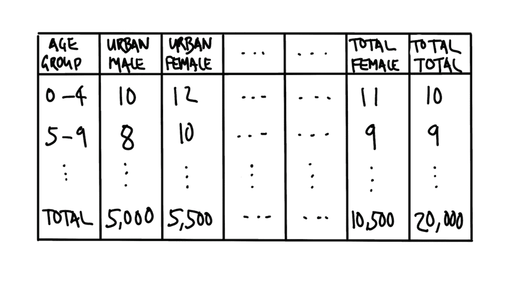

图 9.6：我们可能感兴趣的数据库的快速草图

我们可以随后模拟一个数据集。

```r
set.seed(853)

age_group <- tibble(starter = 0:19) |>
 mutate(lower = starter * 5, upper = starter * 5 + 4) |>
 unite(string_sequence, lower, upper, sep = "-") |>
 pull(string_sequence)

mean_value <- 10

simulated_tanzania_dataset <-
 tibble(
 age_group = age_group,
 urban_male = round(rnorm(length(age_group), mean_value)),
 urban_female = round(rnorm(length(age_group), mean_value)),
 rural_male = round(rnorm(length(age_group), mean_value)),
 rural_female = round(rnorm(length(age_group), mean_value)),
 total_male = round(rnorm(length(age_group), mean_value)),
 total_female = round(rnorm(length(age_group), mean_value))
 ) |>
 mutate(
 urban_total = urban_male + urban_female,
 rural_total = rural_male + rural_female,
 total_total = total_male + total_female
 )

simulated_tanzania_dataset
```

```r
# A tibble: 20 × 10
   age_group urban_male urban_female rural_male rural_female total_male
   <chr>          <dbl>        <dbl>      <dbl>        <dbl>      <dbl>
 1 0-4               10           10          9            9         11
 2 5-9               10            9          9           10          9
 3 10-14              8           11         11           11         10
 4 15-19              9           11         10            9         10
 5 20-24              9            8         11           10          9
 6 25-29             12            9         10           10         10
 7 30-34              9            8         10           10          8
 8 35-39             10           11          8           10         10
 9 40-44              9            9          9           10         11
10 45-49              9           10         11           10         11
11 50-54             12           10          9           13         10
12 55-59              9           11         10            9          9
13 60-64             10            9         11           11         10
14 65-69             10           10         10           10         11
15 70-74             10           10         12            9          8
16 75-79             10            8         10            9         10
17 80-84             10            9          9           10          9
18 85-89             10            9         10           11         11
19 90-94             11           11         11           10         11
20 95-99             10           10         10           11         11
# ℹ 4 more variables: total_female <dbl>, urban_total <dbl>, rural_total <dbl>,
#   total_total <dbl>
```
基于这次模拟，我们感兴趣的是测试以下内容：

1.  是否只有数字。

1.  城乡总和是否与总列匹配。

1.  是否年龄组的总和与总数相符。

我们首先开始下载数据。³

```r
download.file(
 url = "https://dhsprogram.com/pubs/pdf/FR83/FR83.pdf",
 destfile = "1996_Tanzania_DHS.pdf",
 mode = "wb"
)
```

当我们有一个 PDF 文件并希望将其内容读入 R 时，`pdftools`中的`pdf_text()`函数很有用，如第七章中所述。它对许多近期生成的 PDF 文件效果良好，因为这些文件的内容是文本，它可以提取。但如果 PDF 是一个图像，那么`pdf_text()`将不起作用。相反，PDF 首先需要通过 OCR 处理，这也在第七章中介绍过。*

```r
tanzania_dhs <-
 pdf_text(
 pdf = "1996_Tanzania_DHS.pdf"
 )
```

在这种情况下，我们关注的是表 2.1，它位于 PDF 的第 33 页(图 9.7))。

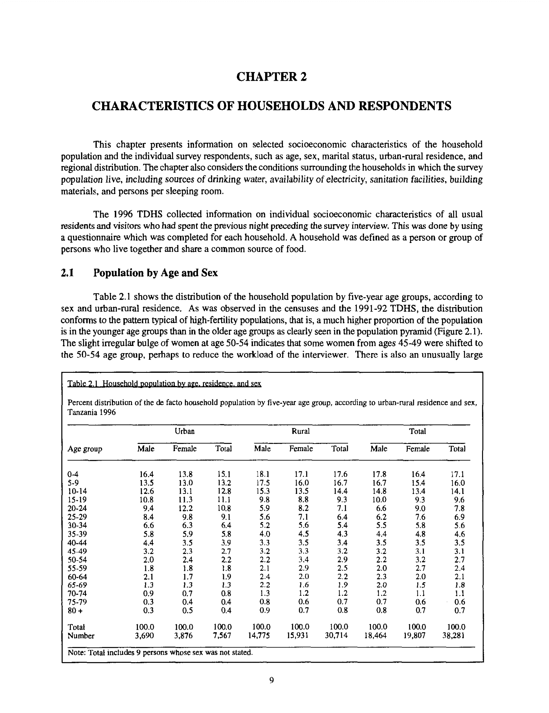

图 9.7：1996 年坦桑尼亚 DHS 调查中感兴趣的页面

我们使用 `stri_split_lines()` 函数从 `stringi` 库中，来专注于那一特定页面。

```r
# From Bob Rudis: https://stackoverflow.com/a/47793617
tanzania_dhs_page_33 <- stri_split_lines(tanzania_dhs[[33]])[[1]]
```

我们首先希望移除所有文字内容，专注于表格。然后我们希望将其转换为 tibble 格式，以便我们可以使用我们熟悉的`tidyverse`方法。

```r
tanzania_dhs_page_33_only_data <- tanzania_dhs_page_33[31:55]

tanzania_dhs_raw <- tibble(all = tanzania_dhs_page_33_only_data)

tanzania_dhs_raw
```

```r
# A tibble: 25 × 1
   all                                                                          
   <chr>                                                                        
 1 "                                  Urban                              Rural …
 2 ""                                                                           
 3 " Age group             Male      Female       Total          Male   Female …
 4 ""                                                                           
 5 ""                                                                           
 6 " 0-4                   16.4        13.8        15.1          18.1     17.1 …
 7 " 5-9                   13.5        13.0        13.2          17.5     16,0 …
 8 " 10-14                 12.6        13.1        12.8          15.3     13.5 …
 9 " 15-19                 10.8        11.3        11.1           9.8      8.8 …
10 " 20-~                   9.4        12.2        10,8           5.9      8.2 …
# ℹ 15 more rows
```
所有列都已经被合并成了一列，因此我们需要将它们分开。我们将根据空格的存在来操作，这意味着我们首先需要将“Age group”改为“Age-group”，因为我们不希望它们被分开。*

```r
# Separate columns
tanzania_dhs_separated <-
 tanzania_dhs_raw |>
 mutate(all = str_squish(all)) |>
 mutate(all = str_replace(all, "Age group", "Age-group")) |>
 separate(
 col = all,
 into = c(
 "age_group", 
 "male_urban", "female_urban", "total_urban",
 "male_rural", "female_rural", "total_rural",
 "male_total", "female_total", "total_total"
 ),
 sep = " ",
 remove = TRUE,
 fill = "right",
 extra = "drop"
 )

tanzania_dhs_separated
```

```r
# A tibble: 25 × 10
   age_group   male_urban female_urban total_urban male_rural female_rural
   <chr>       <chr>      <chr>        <chr>       <chr>      <chr>       
 1 "Urban"     Rural      Total        <NA>        <NA>       <NA>        
 2 ""          <NA>       <NA>         <NA>        <NA>       <NA>        
 3 "Age-group" Male       Female       Total       Male       Female      
 4 ""          <NA>       <NA>         <NA>        <NA>       <NA>        
 5 ""          <NA>       <NA>         <NA>        <NA>       <NA>        
 6 "0-4"       16.4       13.8         15.1        18.1       17.1        
 7 "5-9"       13.5       13.0         13.2        17.5       16,0        
 8 "10-14"     12.6       13.1         12.8        15.3       13.5        
 9 "15-19"     10.8       11.3         11.1        9.8        8.8         
10 "20-~"      9.4        12.2         10,8        5.9        8.2         
# ℹ 15 more rows
# ℹ 4 more variables: total_rural <chr>, male_total <chr>, female_total <chr>,
#   total_total <chr>
```
我们现在需要清理行和列。一种有助于确定需要移除内容的“负空间”方法是，看看如果我们暂时移除所有已知想要保留的内容后剩下什么。剩下的任何内容都将成为移除的候选对象。在这种情况下，我们知道我们希望列中包含数字，因此我们从所有列中移除数字，以查看这可能会阻碍我们从字符串转换为数字的障碍。

```r
tanzania_dhs_separated |>
 mutate(across(everything(), ~ str_remove_all(., "[:digit:]"))) |>
 distinct()
```

```r
# A tibble: 15 × 10
   age_group   male_urban female_urban total_urban male_rural female_rural
   <chr>       <chr>      <chr>        <chr>       <chr>      <chr>       
 1 "Urban"     Rural      Total        <NA>        <NA>       <NA>        
 2 ""          <NA>       <NA>         <NA>        <NA>       <NA>        
 3 "Age-group" Male       Female       Total       Male       Female      
 4 "-"         .          .            .           .          .           
 5 "-"         .          .            .           .          ,           
 6 "-"         .          .            .           .          .           
 7 "-~"        .          .            ,           .          .           
 8 "-"         .          .            ,           ,          ,           
 9 "-"         ,          .            .           .          .           
10 "-"         .          .            .           .          .           
11 "-"         ,          .            .           ;          .           
12 "-"         .          .            .           ,          .           
13 "+"         .          .            .           .          .           
14 "Total"     .          .            .           .          .           
15 "Number"    ,          ,            ,           .          ,           
# ℹ 4 more variables: total_rural <chr>, male_total <chr>, female_total <chr>,
#   total_total <chr>
```
在这种情况下，我们可以看到一些逗号和分号被错误地认为是小数点。此外，一些波浪线和空白行需要被移除。之后，我们就可以应用正确的类别了。

```r
tanzania_dhs_cleaned <-
 tanzania_dhs_separated |>
 slice(6:22, 24, 25) |>
 mutate(across(everything(), ~ str_replace_all(., "[,;]", "."))) |>
 mutate(
 age_group = str_replace(age_group, "20-~", "20-24"),
 age_group = str_replace(age_group, "40-~", "40-44"),
 male_rural = str_replace(male_rural, "14.775", "14775")
 ) |>
 mutate(across(starts_with(c(
 "male", "female", "total"
 )),
 as.numeric))

tanzania_dhs_cleaned
```

```r
# A tibble: 19 × 10
   age_group male_urban female_urban total_urban male_rural female_rural
   <chr>          <dbl>        <dbl>       <dbl>      <dbl>        <dbl>
 1 0-4            16.4         13.8        15.1        18.1         17.1
 2 5-9            13.5         13          13.2        17.5         16  
 3 10-14          12.6         13.1        12.8        15.3         13.5
 4 15-19          10.8         11.3        11.1         9.8          8.8
 5 20-24           9.4         12.2        10.8         5.9          8.2
 6 25-29           8.4          9.8         9.1         5.6          7.1
 7 30-34           6.6          6.3         6.4         5.2          5.6
 8 35-39           5.8          5.9         5.8         4            4.5
 9 40-44           4.4          3.5         3.9         3.3          3.5
10 45-49           3.2          2.3         2.7         3.2          3.3
11 50-54           2            2.4         2.2         2.2          3.4
12 55-59           1.8          1.8         1.8         2.1          2.9
13 60-64           2.1          1.7         1.9         2.4          2  
14 65-69           1.3          1.3         1.3         2.2          1.6
15 70-74           0.9          0.7         0.8         1.3          1.2
16 75-79           0.3          0.4         0.4         0.8          0.6
17 80+             0.3          0.5         0.4         0.9          0.7
18 Total         100          100         100         100          100  
19 Number          3.69         3.88        7.57    14775           15.9
# ℹ 4 more variables: total_rural <dbl>, male_total <dbl>, female_total <dbl>,
#   total_total <dbl>
```
最后，我们可能希望检查构成部分的总和是否等于总数。

```r
tanzania_dhs_cleaned |>
 filter(!age_group %in% c("Total", "Number")) |>
 summarise(sum = sum(total_total))
```

```r
# A tibble: 1 × 1
    sum
  <dbl>
1  99.7
```
在这种情况下，我们可以看到它偏离了几个百分点。
  
## 9.7 2019 肯尼亚人口普查

作为最后的例子，让我们考虑一个更广泛的情况，并从 2019 年肯尼亚人口普查中收集、清理和准备一些数据。我们将专注于创建一个按性别划分的单年计数数据集，针对内罗毕。

2019 年肯尼亚人口普查按年龄、性别和行政单位分布的数据可以在此处下载[这里](https://www.knbs.or.ke/?wpdmpro=2019-kenya-population-and-housing-census-volume-iii-distribution-of-population-by-age-sex-and-administrative-units)。虽然这种格式作为 PDF 文件便于查找特定结果，但如果我们要建模数据，它就不是很实用了。为了能够做到这一点，我们需要将这个 PDF 文件转换成一个整洁的数据集，以便进行分析。

### 9.7.1 收集和清理

我们首先需要下载并阅读 2019 年肯尼亚人口普查的 PDF 文件。⁴

```r
census_url <-
 paste0(
 "https://www.knbs.or.ke/download/2019-kenya-population-and-",
 "housing-census-volume-iii-distribution-of-population-by-age-",
 "sex-and-administrative-units/?wpdmdl=5729&refresh=",
 "620561f1ce3ad1644519921"
 )

download.file(
 url = census_url,
 destfile = "2019_Kenya_census.pdf",
 mode = "wb"
)
```

我们可以再次在这里使用来自 `pdftools` 的 `pdf_text()` 函数。

```r
kenya_census <-
 pdf_text(
 pdf = "2019_Kenya_census.pdf"
 )
```

在这个例子中，我们将关注关于内罗毕的 PDF 页面(图 9.8)。

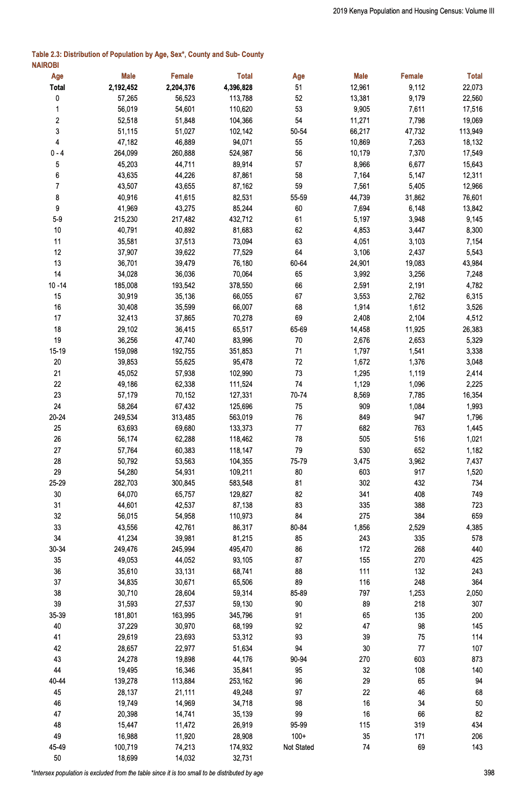

图 9.8：2019 年肯尼亚人口普查关于内罗毕的页面

#### 9.7.1.1 创建矩形

首个挑战是将数据集转换成我们更容易操作的形式。我们将提取页面中的相关部分。在这种情况下，关于内罗毕的数据位于第 410 页。

```r
# Focus on the page of interest
just_nairobi <- stri_split_lines(kenya_census[[410]])[[1]]

# Remove blank lines
just_nairobi <- just_nairobi[just_nairobi != ""]

# Remove titles, headings and other content at the top of the page
just_nairobi <- just_nairobi[5:length(just_nairobi)]

# Remove page numbers and other content at the bottom of the page
just_nairobi <- just_nairobi[1:62]

# Convert into a tibble
demography_data <- tibble(all = just_nairobi)
```

在这一步，数据已经处于 tibble 格式。这使得我们可以使用我们熟悉的`dplyr`动词。特别是，我们想要分离列。*

```r
demography_data <-
 demography_data |>
 mutate(all = str_squish(all)) |>
 mutate(all = str_replace(all, "10 -14", "10-14")) |>
 mutate(all = str_replace(all, "Not Stated", "NotStated")) |>
 # Deal with the two column set-up
 separate(
 col = all,
 into = c(
 "age", "male", "female", "total",
 "age_2", "male_2", "female_2", "total_2"
 ),
 sep = " ",
 remove = TRUE,
 fill = "right",
 extra = "drop"
 )
```

他们此刻并排在一起。我们需要改为添加到底部。

```r
demography_data_long <-
 rbind(
 demography_data |> select(age, male, female, total),
 demography_data |>
 select(age_2, male_2, female_2, total_2) |>
 rename(
 age = age_2,
 male = male_2,
 female = female_2,
 total = total_2
 )
 )
```

```r
# There is one row of NAs, so remove it
demography_data_long <-
 demography_data_long |>
 remove_empty(which = c("rows"))

demography_data_long
```

```r
# A tibble: 123 × 4
   age   male      female    total    
   <chr> <chr>     <chr>     <chr>    
 1 Total 2,192,452 2,204,376 4,396,828
 2 0     57,265    56,523    113,788  
 3 1     56,019    54,601    110,620  
 4 2     52,518    51,848    104,366  
 5 3     51,115    51,027    102,142  
 6 4     47,182    46,889    94,071   
 7 0-4   264,099   260,888   524,987  
 8 5     45,203    44,711    89,914   
 9 6     43,635    44,226    87,861   
10 7     43,507    43,655    87,162   
# ℹ 113 more rows
```
将其整理成矩形格式后，我们现在需要清理数据集以使其变得有用。
  
#### 9.7.1.2 有效性

要获得有效性需要多个步骤。第一步是将数字转换为实际的数字，而不是字符。在我们转换类型之前，我们需要移除任何非数字的内容，否则该单元格将被转换为 NA。我们首先识别任何非数字的值，以便我们可以移除它们，而`distinct()`函数特别有用。

```r
demography_data_long |>
 select(male, female, total) |>
 mutate(across(everything(), ~ str_remove_all(., "[:digit:]"))) |>
 distinct()
```

```r
# A tibble: 5 × 3
  male  female total
  <chr> <chr>  <chr>
1 ",,"  ",,"   ",," 
2 ","   ","    ","  
3 ""    ","    ","  
4 ""    ""     ","  
5 ""    ""     "" 
```
我们需要删除逗号。虽然在这里我们可以使用`janitor`，但至少首先看看发生了什么是有价值的，因为有时会有一些奇怪的东西，`janitor`（以及其他包）不会以我们想要的方式处理。尽管如此，一旦确定了所有需要删除的内容，我们就可以进行实际的删除操作，并将我们的数字字符列转换为整数。

```r
demography_data_long <-
 demography_data_long |>
 mutate(across(c(male, female, total), ~ str_remove_all(., ","))) |>
 mutate(across(c(male, female, total), ~ as.integer(.)))

demography_data_long
```

```r
# A tibble: 123 × 4
   age      male  female   total
   <chr>   <int>   <int>   <int>
 1 Total 2192452 2204376 4396828
 2 0       57265   56523  113788
 3 1       56019   54601  110620
 4 2       52518   51848  104366
 5 3       51115   51027  102142
 6 4       47182   46889   94071
 7 0-4    264099  260888  524987
 8 5       45203   44711   89914
 9 6       43635   44226   87861
10 7       43507   43655   87162
# ℹ 113 more rows
```
#### 9.7.1.3 内部一致性

人口普查已经为我们做了一些将年龄组组合起来的工作，但我们希望让它变得容易，只需关注按单一年龄的计数。因此，我们将添加一个标志来表示年龄的类型：一个年龄组，例如“0 至 5 岁”，或者一个单一年龄，例如“1 岁”。

```r
demography_data_long <-
 demography_data_long |>
 mutate(
 age_type = if_else(str_detect(age, "-"), 
 "age-group", 
 "single-year"),
 age_type = if_else(str_detect(age, "Total"), 
 "age-group", 
 age_type)
 )
```

目前，年龄是一个字符变量。我们在这里有一个决定要做。我们不想让它成为一个字符变量（因为它无法正确绘图），但我们也不希望它是数字的，因为其中包含了`total`和`100+`。目前，我们将其转换为因子，至少这样它能够被很好地绘制。*

```r
demography_data_long <-
 demography_data_long |>
 mutate(
 age = as_factor(age)
 )
```
  
### 9.7.2 检查和测试

收集并清理完数据后，我们希望运行一些检查。鉴于数据的格式，我们可以检查“总数”是否是“男性”和“女性”的总和，这两个是唯一可用的性别类别。

```r
demography_data_long |>
 mutate(
 check_sum = male + female,
 totals_match = if_else(total == check_sum, 1, 0)
 ) |>
 filter(totals_match == 0)
```

```r
# A tibble: 0 × 7
# ℹ 7 variables: age <fct>, male <int>, female <int>, total <int>,
#   age_type <chr>, check_sum <int>, totals_match <dbl>
```
最后，我们想要检查单年龄段的计数总和是否等于年龄段的总和。

```r
demography_data_long |>
 mutate(age_groups = if_else(age_type == "age-group", 
 age, 
 NA_character_)) |>
 fill(age_groups, .direction = "up") |>
 mutate(
 group_sum = sum(total),
 group_sum = group_sum / 2,
 difference = total - group_sum,
 .by = c(age_groups)
 ) |>
 filter(age_type == "age-group" & age_groups != "Total") |> 
 head()
```

```r
# A tibble: 6 × 8
  age     male female  total age_type  age_groups group_sum difference
  <fct>  <int>  <int>  <int> <chr>     <chr>          <dbl>      <dbl>
1 0-4   264099 260888 524987 age-group 0-4           524987          0
2 5-9   215230 217482 432712 age-group 5-9           432712          0
3 10-14 185008 193542 378550 age-group 10-14         378550          0
4 15-19 159098 192755 351853 age-group 15-19         351853          0
5 20-24 249534 313485 563019 age-group 20-24         563019          0
6 25-29 282703 300845 583548 age-group 25-29         583548          0
```
### 9.7.3 整理

现在我们有理由相信一切看起来都很顺利，我们可以将其转换为整洁的格式。这将使工作变得更加容易。

```r
demography_data_tidy <-
 demography_data_long |>
 rename_with(~paste0(., "_total"), male:total) |>
 pivot_longer(cols = contains("_total"), 
 names_to = "type", 
 values_to = "number") |>
 separate(
 col = type,
 into = c("gender", "part_of_area"),
 sep = "_"
 ) |>
 select(age, age_type, gender, number)
```

清洗这个数据集的原始目的是制作一个由亚历山大和阿尔克玛(2022)使用的表格。我们将回到这个数据集，但为了把这些内容都整合在一起，我们可能想要制作一个按性别划分的单年计数图，以展示内罗毕的情况(图 9.9))。

```r
demography_data_tidy |>
 filter(age_type == "single-year") |>
 select(age, gender, number) |>
 filter(gender != "total") |>
 ggplot(aes(x = age, y = number, fill = gender)) +
 geom_col(aes(x = age, y = number, fill = gender), 
 position = "dodge") +
 scale_y_continuous(labels = comma) +
 scale_x_discrete(breaks = c(seq(from = 0, to = 99, by = 5), "100+")) +
 theme_classic() +
 scale_fill_brewer(palette = "Set1") +
 labs(
 y = "Number",
 x = "Age",
 fill = "Gender",
 caption = "Data source: 2019 Kenya Census"
 ) +
 theme(legend.position = "bottom") +
 coord_flip()
```

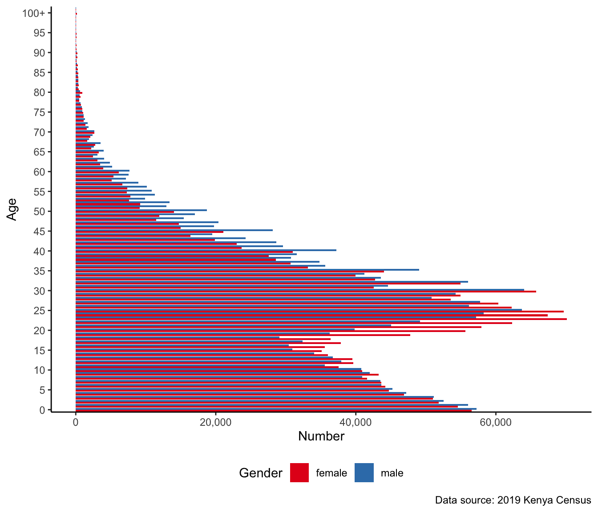*

图 9.9：2019 年内罗毕年龄和性别的分布，基于肯尼亚人口普查*  *从图 9.9 中可以清晰地看到多种特征，包括年龄集中、男女性出生比例的微小差异以及 15 至 25 岁之间的显著差异。

最后，我们可能希望使用更具信息量的名称。例如，在之前提到的肯尼亚数据示例中，我们有以下列名：“area”（面积）、“age”（年龄）、“gender”（性别）和“number”（数量）。如果我们把列名当作合约，那么它们可以是：“chr_area”（染色体面积）、“fctr_group_age”（因素分组年龄）、“chr_group_gender”（染色体分组性别）和“int_group_count”（整数分组计数）。

```r
column_names_as_contracts <-
 demography_data_tidy |>
 filter(age_type == "single-year") |>
 select(age, gender, number) |>
 rename(
 "fctr_group_age" = "age",
 "chr_group_gender" = "gender",
 "int_group_count" = "number"
 )
```

我们可以使用 `pointblank` 来为我们设置测试。

```r
agent <-
 create_agent(tbl = column_names_as_contracts) |>
 col_is_character(columns = vars(chr_group_gender)) |>
 col_is_factor(columns = vars(fctr_group_age)) |>
 col_is_integer(columns = vars(int_group_count)) |>
 col_vals_in_set(
 columns = chr_group_gender,
 set = c("male", "female", "total")
 ) |>
 interrogate()

agent
```

| 点对点验证 |

| --- |
| --- |
| [2024-11-21&#124;09:51:24]tibble 列名 _as_contracts |
| --- |
|  |  | 步骤 | 列 | 值 | 表格 | 评估 | 单位 | 通过 | 失败 | W | S | N | 扩展 |
| --- | --- | --- | --- | --- | --- | --- | --- | --- | --- | --- | --- | --- | --- |
|   | 1 | <svg width="30px" height="30px" viewBox="0 0 67 67" version="1.1" xlink="http://www.w3.org/1999/xlink"><title>col_is_character</title></svg>` col_is_character()` |

`▮``chr_group_gender`

| — |  | ✓ | `1` | `1` `1` | `0` `0` | — | — | — | — |
| --- | --- | --- | --- | --- | --- | --- | --- | --- | --- |
|   | 2 | <svg width="30px" height="30px" viewBox="0 0 67 67" version="1.1" xlink="http://www.w3.org/1999/xlink"><title>col_is_factor</title></svg>` col_is_factor()` |

`▮``fctr_group_age`

| — |  | ✓ | `1` | `1` `1` | `0` `0` | — | — | — | — |
| --- | --- | --- | --- | --- | --- | --- | --- | --- | --- |
|   | 3 | <svg width="30px" height="30px" viewBox="0 0 67 67" version="1.1" xlink="http://www.w3.org/1999/xlink"><title>col_is_integer</title></svg>` col_is_integer()` |

`▮``int_group_count`

| — |  | ✓ | `1` | `1` `1` | `0` `0` | — | — | — | — |
| --- | --- | --- | --- | --- | --- | --- | --- | --- | --- |
|   | 4 | <svg width="30px" height="30px" viewBox="0 0 67 67" version="1.1" xlink="http://www.w3.org/1999/xlink"><title>col_vals_in_set</title></svg>` col_vals_in_set()` |

`▮``chr_group_gender`

|

`男性, 女性, 总计`

|  | ✓ | `306` | `306` `1` | `0` `0` | — | — | — | — |
| --- | --- | --- | --- | --- | --- | --- | --- | --- |

| 2024-11-21 09:51:24 EST < 1 s 2024-11-21 09:51:24 EST |
  
## 9.8 练习

### 练习

1.  *(计划)* 考虑以下场景：*你管理着一家拥有两名员工的商店，并且对他们的效率建模感兴趣。商店上午 9 点开门，下午 5 点关门。员工的效率与每小时接待的客户数量呈轻度相关，并以此定义。请明确你假设的是负相关还是正相关。* 请绘制出该数据集可能的样子，然后绘制一个图表来展示所有观察结果。

1.  *(模拟)* 请进一步考虑所描述的场景并模拟该情况。请基于模拟数据包括五个测试。提交一个包含您代码的 GitHub Gist 链接。

1.  *(获取)* 请描述这样一个数据集的可能来源。

1.  *(探索)* 请使用 `ggplot2` 根据第 1 步中使用的模拟数据绘制你草图中的图形。提交一个包含你代码的 GitHub Gist 链接。

1.  *(沟通)* 请写两段关于你所做的事情的描述。

### 测验

1.  如果我们有一个名为“some_words”的字符变量，在名为`sayings`的数据集中有一个观察值`"You know what"`，那么以下哪个选项可以将它拆分成其构成单词（选择一个）？

    1.  `将(data = sayings, col = some_words, into = c("one", "two", "three"), sep = " ")`

    1.  `split(data = sayings, col = some_words, into = c("one", "two", "three"), sep = " ")`

    1.  `divide(data = sayings, col = some_words, into = c("one", "two", "three"), sep = " ")`

    1.  `part(data = sayings, col = some_words, into = c("one", "two", "three"), sep = " ")`

    1.  `unattach(data = sayings, col = some_words, into = c("one", "two", "three"), sep = " ")`

1.  以下是否是整洁数据的示例？

```r
tibble(
 name = c("Ian", "Patricia", "Ville", "Karen"),
 age_group = c("18-29", "30-44", "45-60", "60+"),
)
```

```r
a.  Yes
b. No
```

1.  哪个函数可以将“lemons”转换为“lemonade”？

    1.  `str_replace(string = "lemons", pattern = "lemons", replacement = "lemonade")`

    1.  `chr_replace(string = "lemons", pattern = "lemons", replacement = "lemonade")`

    1.  `str_change(string = "lemons", pattern = "lemons", replacement = "lemonade")`

    1.  `chr_change(string = "lemons", pattern = "lemons", replacement = "lemonade")`

1.  当处理年龄时，变量有哪些理想的类别（选择所有适用的选项）？

    1.  整数

    1.  矩阵

    1.  数字

1.  请考虑以下德国城市：“柏林”、“汉堡”、“慕尼黑”、“科隆”、“法兰克福”和“罗斯托克”。使用 `testthat` 定义三个测试，假设我们有一个包含变量“german_cities”的数据集，该数据集声称只包含这些城市。提交一个 GitHub Gist 链接。

1.  数据科学中日期的哪种格式是最可接受的？

    1.  YYYY-DD-MM

    1.  YYYY-MM-DD

    1.  DD-MM-YYYY

    1.  MM-MM-YYYY

1.  以下哪一项可能不属于其中？ `c(15.9, 14.9, 16.6, 15.8, 16.7, 17.9, I2.6, 11.5, 16.2, 19.5, 15.0)`

1.  关于洛克希德·马丁的“AV Rule 48”(2005, 25)，以下哪些不允许标识符不同（选择所有适用的选项）？

    1.  只有混合案例

    1.  下划线字符的存在/不存在

    1.  字母“O”与数字“0”或字母“D”的互换

    1.  字母“I”与数字“1”或字母“l”的互换

1.  关于普雷斯的著作(1981)，请讨论两种最终数字可以提供信息的方式。针对每种方式，至少写一段话并包含例子。

### 课堂活动

+   选择一个你非常熟悉的主题，然后：

    +   在 R 脚本中可重复地模拟一个理想化的数据集。

    +   在不同的 R 脚本中为它编写五个测试。

    +   将创建数据集（不是测试）的代码（通过 GitHub Gist）交给其他人。让他们使用代码故意在数据集中创建三个不同的数据问题，然后将它发回给你（一些想法包括：不一致的日期格式，添加缺失值，添加负值，改变小数点位置）

    +   你的测试能否识别出问题？

+   在模拟的帮助下讨论以下观点：“本议院认为弦比因子更好”。⁵

+   我获取了一些关于收入的数据。为什么如果有很多受访者的收入为“999999”，我会感到担忧呢？

+   创建一个新的 R 项目，并使用 R 脚本下载和加载原始的“阿德利企鹅数据”（帕尔默站南极 LTER 和 Gorman, Kristen 2020)，（以下包含一些⁶代码以帮助完成此操作），然后：

    +   使用 `rename()` 来改进名称。

    +   将文件夹添加到 GitHub 仓库中。

    +   与另一位学生交换仓库。

    +   创建一个 GitHub 问题，包含两个关于如何改进名称的要点。

    +   讨论你的名字与`palmerpenguins::penguins`的比较

```r
raw_penguin_data <-
 read_csv(file = "https://portal.edirepository.org/nis/dataviewer?packageid=knb-lter-pal.219.5&entityid=002f3893385f710df69eeebe893144ff",
 show_col_types = FALSE)
```

生成一个整洁版本的 Anscombe 四重奏，可以使用 `anscombe` 命令获取。

+   美国综合社会调查（US General Social Survey）中的“不知道”代码是如何编码的？

+   讨论编码缺失数据每个选项的优缺点：

```r
tibble(
 income_1 = c(88515, 103608, -99, 87644, 118279, 107342, 97300, 97226, 73367, 101528),
 income_2 = c(88515, 103608, 102582, 87644, 118279, 107342, "missing", 97226, 73367, 101528),
 income_3 = c(999999, 103608, 102582, 87644, 118279, 107342, 97300, 97226, 73367, 101528),
 income_4 = c(88515, 103608, 102582, 87644, 0, 107342, 97300, 97226, 73367, 101528),
 income_5 = c(88515, 103608, 102582, 87644, 118279, 107342, 97300, 97226, 73367, NA_integer_)
)
```

你认为在数据集中缺失数据应该如何编码？

+   使用一个新的 R 项目，针对你感兴趣的城市：⁷

    +   编写可复现的代码从[这里](http://justicetechlab.org/shotspotter-data/)下载 ShotSpotter 数据集并进行数据清洗。

    +   将你的代码添加到 GitHub。

    +   与班上其他人交换你的代码库。他们需要提交一个使用你的数据集来生成图表的拉取请求。

+   获取 ImageNet 数据集并打开十张随机图像。应用你自己的标签。你的标签与实际标签在多大程度上达成一致？这对在此数据集上训练的模型的结果有何影响？

+   想象一下你对理解代际财富感兴趣，其中一个方面是将今天人们的教育成果与一百年前的人们以及不同国家的人们联系起来。请确保数据集的一致性，并记录你做出这些选择的原因。

```r
tibble(
 period = c(1901, 1901, 1901, 2023, 2023, 2023),
 country = c(
 "Prussia",
 "Austro-Hungarian Empire",
 "Kingdom of Hungary",
 "Canada",
 "Australia",
 "UK"
 ),
 highest_education = c(
 "Gymnasium",
 "Higher Polytechnic School",
 "Matura",
 "High school",
 "Undergraduate Honours",
 "A-levels"
 )
)
```

从 `datasets::UCBAdmissions` 中整理数据**

+   使用 `datasets::LifeCycleSavings`:

    +   首先使用 `pivot_longer()` 使其变长。

    +   使用 `ggplot` 制作图表。

    +   然后使用 `pivot_wider()` 将其转换回宽格式。

    +   使用 `tinytable::tt()` 为澳大利亚、加拿大、新西兰以及你选择的某个国家制作一个表格。

+   修复以下问题：

```r
tibble(
 date = c("20-02-2023",
 "20 February 2023",
 "02-20-2023",
 "2023-20-02",
 "February 20, 2023")
 )
```

修复以下问题：

```r
tibble(
 date = c("01-02-2023",
 "02-01-2023",
 "2023-01-02")
 )
```

假设你住在加拿大多伦多。以下日期有什么问题？⁸ `2023-03-12 02:01:00`。

+   按照第十六章中的示例，从[美国综合社会调查](https://gss.norc.org/Get-The-Data)读取一个“.dta”文件，添加标签，并绘制某个变量的图表。缺失数据会发生什么？
  


关于乔丹(2019)、D’Ignazio 和 Klein(2020, 第六章)、Au(2020)以及其他相关研究，你认为我们应该让数据自己说话到什么程度？请至少写两页。

使用 Quarto，并包含一个合适的标题、作者、日期、指向 GitHub 仓库的链接以及引用来生成草稿。之后，请与另一位学生配对并交换你们的书面作品。根据他们的反馈进行更新，并确保在你们的论文中按名字提及他们。提交 PDF 文件。

1.  作为背景，由于计算机基于由 0 和 1 组成的字符串，因此需要字符编码才能考虑字母表等符号。特别令人烦恼的数据清理问题之一是不同的字符编码。在处理外语和特殊字符时尤其常见。通常，我们使用一种称为 UTF-8 的编码。可以使用`Encoding()`函数找到字符向量的编码。↩︎

1.  如果这种方法不起作用，那么多伦多市政府可能已经移动了数据集。相反，请使用：`earlier_toronto_shelters <- read_csv("https://www.tellingstorieswithdata.com/inputs/data/earlier_toronto_shelters.csv")`。↩︎

1.  或者使用：[`www.tellingstorieswithdata.com/inputs/pdfs/1996_Tanzania_DHS.pdf`](https://www.tellingstorieswithdata.com/inputs/pdfs/1996_Tanzania_DHS.pdf)↩︎

1.  如果肯尼亚政府的链接失效，请将他们的 URL 替换为：https://www.tellingstorieswithdata.com/inputs/pdfs/2019_Kenya_census.pdf.↩︎

1.  这个练习的基本想法来自迈克尔·多尼利。↩︎

1.  这段代码来自克里斯蒂娜·魏。↩︎

1.  这个练习的想法来自 Taylor John Wright。↩︎

1.  这个练习的想法来自德里克·比顿。↩︎

