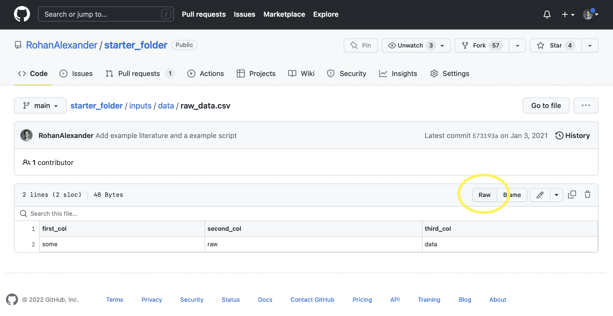

# 10  存储和共享

> 原文：[`tellingstorieswithdata.com/10-store_and_share.html`](https://tellingstorieswithdata.com/10-store_and_share.html)

1.  准备

1.  10  存储和共享

**先决条件**

+   阅读 *通过研究数据管理促进开放科学* (Borghi 和 Van Gulick 2022)

    +   描述了数据管理状态，以及进行更可重复研究的某些策略。

+   阅读 *大规模教育研究中的数据管理* (Lewis 2024)

    +   重点关注第二章“研究数据管理”，该章节概述了数据管理的关注点、工作流程和术语。

+   阅读 *透明和可重复的社会科学研究* (Christensen, Freese, 和 Miguel 2019)

    +   重点关注第十章“数据共享”，该章节指定了共享数据的方式。

+   阅读 *数据集的数据表* (Gebru 等人 2021)

    +   介绍了数据表的概念。

+   阅读 *数据及其（不）内容：机器学习研究中的数据集开发和使用调查* (Paullada 等人 2021)

    +   详细说明了机器学习中数据的状态。

**关键概念和技能**

+   FAIR 原则为我们考虑数据共享和存储提供了基础。这些原则规定数据应该是可查找的、可访问的、可互操作的和可重用的。

+   最重要的一步是第一步，那就是将数据从我们的本地计算机上移除，并使其对他人可访问。之后，我们建立文档和数据表，以便他人更容易理解和使用它。最后，我们理想情况下是在不涉及我们的情况下启用访问。

+   在尽可能广泛地共享我们的数据集的同时，我们应该尊重那些包含在其中的信息所有者。这意味着，例如，通过选择性披露、哈希、数据模拟和差分隐私，在合理的范围内保护个人识别信息，并考虑成本和收益。

+   最后，随着我们的数据量增大，当它们较小时可行的方案开始崩溃。我们需要考虑效率，并探索其他方法、格式和语言。

**软件和包**

+   Base R (R 核心团队 2024)

+   `arrow` (Richardson 等人 2023)

+   `devtools` (Wickham 等人 2022)

+   `diffpriv` (Rubinstein 和 Alda 2017)

+   `fs` (Hester, Wickham, 和 Csárdi 2021)

+   `janitor` (Firke 2023)

+   `openssl` (Ooms 2022)

+   `tictoc` (Izrailev 2022)

+   `tidyverse` (Wickham 等人 2019)

+   `tinytable` (Arel-Bundock 2024)

```py
library(arrow)
library(devtools)
library(diffpriv)
library(fs)
library(janitor)
library(openssl)
library(tictoc)
library(tidyverse)
library(tinytable)
```

*## 10.1 引言

在我们整理好数据集后，我们必须适当地存储它，并使自己和他人都能轻松检索。没有完全达成一致的方法，但有最佳标准，这是一个不断发展的研究领域(Lewis 2024)。Wicherts、Bakker 和 Molenaar(2011)发现，不愿意分享数据与证据较弱、潜在错误更多的研究论文相关。虽然我们可能对此特别关心——整个职业和学科都基于数据的存储和检索——但在一定程度上，基础要求并不苛刻。如果我们能将数据集从自己的电脑上移除，那么我们就已经走得很远了。进一步确认其他人可以在不涉及我们的情况下检索和使用它，这将使我们比大多数人更进一步。仅仅为我们自己的数据、模型和代码实现这一点，就达到了 Heil 等人(2021)所提出的“青铜”标准。

FAIR 原则在正式思考数据共享和管理时非常有用。这要求数据集必须满足(Wilkinson et al. 2016)：

1.  可查找。数据集有一个唯一不变的标识符，并且数据集具有高质量的定义和解释。

1.  可访问。可以使用标准化的方法来检索数据，这些方法是公开和免费的，可能需要认证，并且即使数据集被删除，其元数据仍然持续存在。

1.  可互操作。数据集及其元数据使用广泛适用的语言和词汇。

1.  可重用。对数据集有详细的描述，并且使用条件和来源都得到了明确说明。

数据科学兴起的一个原因是人类是其核心。而且，我们感兴趣的数据通常直接与人类相关。这意味着在为了促进可重复性而共享数据集和维护隐私之间可能存在紧张关系。医学在长时间里发展了应对这一问题的方法。因此，我们看到了美国在 2016 年推出的更广泛的通用数据保护条例(GDPR)，以及 2018 年推出的加利福尼亚消费者隐私法案(CCPA)等。

在数据科学中，我们的关注点往往集中在个人识别信息上。我们有各种方法来保护特别私人的信息，例如电子邮件和家庭地址。例如，我们可以对这些变量进行哈希处理。有时我们可能会模拟数据并分发这些数据而不是共享实际的数据集。最近，基于差分隐私的方法正在被实施，例如用于美国人口普查。数据隐私的基本问题是，隐私的增加会降低数据集的有用性。权衡意味着适当的决策是微妙的，并取决于成本和收益，我们应该特别关注对人口少数群体的差异化影响。

就算一个数据集是 FAIR 的，它也不一定是世界无偏见的代表。进一步说，它也不一定在日常用语中所说的公平，即公正和诚实（Lima 等人 2022）。FAIR 反映了一个数据集是否适当可用，而不是它是否适当。

最后，在本章中，我们考虑效率。随着数据集和代码库的增大，处理它们变得更加困难，尤其是如果我们希望它们被共享时。我们开始关注效率，不是为了效率本身，而是为了能够讲述那些否则无法讲述的故事。这可能意味着超越 CSV 文件到具有其他属性的格式，甚至使用数据库，如 Postgres，尽管如此，我们仍然承认 CSV 的简单性，作为基于文本的格式，它便于人类检查，可以是一个有用的特性。

## 10.2 计划

信息存储和检索与图书馆（在传统意义上指书籍的集合）特别相关。这些图书馆自古代以来就存在，并且有成熟的协议来决定存储哪些信息以及丢弃哪些信息，以及信息检索。图书馆的一个定义特征是有意为之的收藏和组织。使用编目系统确保了相似主题的书籍彼此靠近，并且通常也有计划确保藏书保持最新。这使得信息存储和检索既适当又高效。

数据科学在存储和检索方面高度依赖互联网。20 世纪的工程师范内瓦·布什在 1945 年定义了一个“记忆扩展器”，作为一种存储书籍、记录和通信的设备，以补充记忆（布什 1945）。其关键在于索引，即项目的链接。我们可以在四十年后的蒂姆·伯纳斯-李关于超文本的提案中看到这一概念的回响（伯纳斯-李 1989）。这导致了万维网的诞生，并定义了资源标识的方式。然后，它们通过超文本传输协议（HTTP）在互联网上传输。

在最基本的意义上，互联网是关于存储和检索数据。它基于使计算机上的各种文件对他人可用。当我们考虑我们数据集的存储和检索时，我们特别需要考虑它们应该存储多长时间以及为谁存储(Michener 2015)。例如，如果我们希望某些数据集在十年内可用且广泛可用，那么将其存储在开放和持久格式的存储中就变得非常重要(Hart et al. 2016)。但如果我们只是将数据集作为中间步骤的一部分使用，并且我们有原始的、未编辑的数据以及创建它的脚本，那么可能不需要过于担心这些考虑。物理存储媒体的演变也有类似复杂的问题。例如，现在使用蜡筒、磁带和专有光学磁盘等媒体制作的数据集和录音，其使用便利性各不相同。

存储原始、未编辑的数据非常重要，有许多案例表明未编辑的数据揭示了或暗示了欺诈(Simonsohn 2013)。共享数据也增强了我们工作的可信度，因为它允许他人验证它，并且当他人用它来回答不同的问题时，可以导致新知识的产生(Christensen, Freese, and Miguel 2019)。Christensen 等人(2019)建议共享数据的科研可能被引用得更多，尽管 Tierney 和 Ram(2021)警告说，广泛的数据共享可能需要文化变革。

我们应该努力接受审查，并尽可能使接受批评变得容易。即使在这是困难的选择并导致不适的情况下，我们也应该这样做，因为这是唯一能够为持久知识库做出贡献的方式。例如，Piller (2022) 详细介绍了关于阿尔茨海默病研究中的潜在伪造。在这种情况下，研究人员在试图理解结果是否合法时面临的一个问题是无法访问未发表的照片。

数据来源特别重要。这指的是记录“数据来自哪里以及它是如何到达数据库的”过程（Buneman, Khanna, and Wang-Chiew 2001, 316）。记录并保存原始的、未经编辑的数据集，使用脚本对其进行操作以创建分析所需的数据集，以及分享所有这些——正如本书所建议的——有助于实现这一点。在某些领域，只有少数数据库被许多不同的团队使用是很常见的，例如，在遗传学中，英国生物银行，以及在生命科学中，一个名为 ORCESTRA 的基于云的平台（Mammoliti 等人 2021）已经建立起来以帮助。

## 10.3 分享

### 10.3.1 GitHub

对于我们开始存储数据集来说，GitHub 是最容易的地方，因为 GitHub 已经集成到我们的工作流程中。例如，如果我们将数据集推送到公共仓库，那么我们的数据集就会变得可用。这一好处在于，如果我们适当地设置了我们的工作区，那么我们很可能存储了原始的、未经编辑的数据以及整洁的数据，以及将一种数据转换为另一种数据所需的脚本。我们几乎已经达到了 Heil 等人所说的“青铜”标准（2021），而无需做任何改变。

作为我们如何存储一些数据的例子，我们可以从[“starter_folder”](https://github.com/RohanAlexander/starter_folder)访问“raw_data.csv”。我们在 GitHub 中导航到该文件（“inputs” $\rightarrow$ “data” $\rightarrow$ “raw_data.csv”），然后点击“Raw”（图 10.1）。



图 10.1：获取从 GitHub 仓库读取 CSV 文件所需的链接

我们可以将该 URL 作为`read_csv()`函数的参数添加。

```py
data_location <-
 paste0(
 "https://raw.githubusercontent.com/RohanAlexander/",
 "starter_folder/main/data/01-raw_data/raw_data.csv"
 )

starter_data <-
 read_csv(file = data_location,
 col_types = cols(
 first_col = col_character(),
 second_col = col_character(),
 third_col = col_character()
 )
 )

starter_data
```

*```py
# A tibble: 1 × 3
  first_col second_col third_col
  <chr>     <chr>      <chr>    
1 some      raw        data 
```*  *虽然我们可以通过这种方式轻松地存储和检索数据集，但它缺乏解释、正式的字典以及与 FAIR 原则更接近的方面，如许可证。另一个实际问题是，GitHub 上的最大文件大小为 100MB，尽管如果需要可以使用 Git Large File Storage (LFS)。最后一个问题是，对于一些人来说，GitHub 由微软拥有，这是一家盈利的美国科技公司。*  *### 10.3.2 R 包数据

到目前为止，我们主要使用 R 包的代码，尽管我们看到了一些专注于共享数据的包，例如，在第五章中提到的`troopdata`和`babynames`。我们可以为我们的数据集构建一个 R 包，然后将其添加到 GitHub，最终可能添加到 CRAN。这将使其存储和检索变得容易，因为我们可以通过加载包来获取数据集。与基于 CSV 的方法相比，这也意味着数据集会带来其文档。

这将是我们要构建的第一个 R 包，因此我们将跳过许多步骤。关键是尝试让某些东西工作。在附录 G 中，我们回到 R 包并使用它们来部署模型。这给了我们另一个机会来进一步发展对它们的经验。

要开始，创建一个新的包：“文件” $\rightarrow$ “新建项目” $\rightarrow$ “新建目录” $\rightarrow$ “R 包”。给包起一个名字，例如“favcolordata”，并选择“在新会话中打开”。创建一个名为“data”的新文件夹。我们将模拟一个包含人们和他们最喜欢的颜色的数据集，并将其包含在我们的 R 包中。

```py
set.seed(853)

color_data <-
 tibble(
 name =
 c(
 "Edward", "Helen", "Hugo", "Ian", "Monica",
 "Myles", "Patricia", "Roger", "Rohan", "Ruth"
 ),
 fav_color =
 sample(
 x = colors(),
 size = 10,
 replace = TRUE
 )
 )
```

*到目前为止，我们主要使用 CSV 文件作为我们的数据集。为了将我们的数据包含在这个 R 包中，我们使用`save()`将数据集保存为不同的格式，“.rda”。

```py
save(color_data, file = "data/color_data.rda")
```

*然后我们在“R”文件夹中创建一个名为“data.R”的 R 文件。这个文件将只包含使用`roxygen2`注释的文档。这些注释以`#'`开头，并且我们紧密遵循`troopdata`的文档说明。

```py
#' Favorite color of various people data
#'
#' @description \code{favcolordata} returns a dataframe
#' of the favorite color of various people.
#'
#' @return Returns a dataframe of the favorite color
#' of various people.
#'
#' @docType data
#'
#' @usage data(color_data)
#'
#' @format A dataframe of individual-level observations
#' with the following variables:
#'
#' \describe{
#' \item{\code{name}}{A character vector of individual names.}
#' \item{\code{fav_color}}{A character vector of colors.}
#' }
#'
#' @keywords datasets
#'
#' @source \url{tellingstorieswithdata.com/10-store_and_share.html}
#'
"color_data"
```

**最后，添加一个 README 文件，为第一次来这个项目的用户提供一个总结。具有优秀 README 文件的包示例包括[`ggplot2`](https://github.com/tidyverse/ggplot2#readme)、[`pointblank`](https://github.com/rich-iannone/pointblank#readme)、[`modelsummary`](https://github.com/vincentarelbundock/modelsummary#readme)和[`janitor`](https://github.com/sfirke/janitor#readme)。

现在，我们可以转到“构建”选项卡并点击“安装并重启”。之后，包“favcolordata”将被加载，数据可以通过“color_data”在本地访问。如果我们把这个包推送到 GitHub，那么任何人都可以使用`devtools`安装这个包并使用我们的数据集。实际上，以下应该可以工作。

```py
install_github("RohanAlexander/favcolordata")

library(favcolordata)

color_data
```

*这已经解决了我们之前面临的一些问题。例如，我们已经包括了一个 README 和一个类似的数据字典，这些是通过我们添加的描述来实现的。但是，如果我们试图将这个包上传到 CRAN，我们可能会遇到一些问题。例如，包的最大大小是 5MB，我们很快就会遇到这个问题。我们还很大程度上强迫用户使用 R。虽然这样做有一些好处，但我们可能希望更加语言无关（Tierney 和 Ram 2020），特别是如果我们关心 FAIR 原则的话。

Wickham (2022, chap. 8)提供了更多关于在 R 包中包含数据的信息。

虽然如果数据集通过 GitHub 或 R 包提供，它可能会被引用，但如果数据集被存放在某个地方，这种情况发生的可能性就更大了。这有几个原因，但其中之一是它看起来更正式。另一个原因是它与 DOI 相关。[Zenodo](https://zenodo.org) 和 [开放科学框架](https://osf.io) (OSF) 是两个常用的存储库。例如，Carleton (2021) 使用 Zenodo 来分享 Carleton, Campbell 和 Collard (2021) 以及 Geuenich 等人 (2021b) 支持的数据集，Geuenich 等人 (2021a) 使用 Zenodo 来分享支撑他们的数据集，Katz 和 Alexander (2023a) 使用 Zenodo 来分享支撑 Katz 和 Alexander (2023b) 的数据集。类似地，Arel-Bundock 等人 (2022) 使用 OSF 来分享代码和数据。

另一个选择是使用数据仓库，例如 [哈佛数据仓库](https://dataverse.harvard.edu) 或 [澳大利亚数据档案](https://ada.edu.au)。这是期刊出版的一个常见要求。这个选择的优点之一是我们可以使用 `数据仓库` 来检索作为可重复工作流程一部分的数据集。我们在 第十三章 中有一个这样的例子。

通常，这些选项是免费的，并提供一个可用于引用的 DOI。使用这些数据存储库是将数据集持续托管的责任（在这种情况下是好事）转移出去，并防止数据集丢失的一种方式。它还建立了一个单一的真实点，这应该有助于减少错误 (Byrd 等人 2020)。最后，它使数据集的访问与原始研究人员无关，并导致持久元数据。话虽如此，这些选项的可行性取决于其背后的机构。例如，Zenodo 由 CERN 运营，许多数据仓库由大学运营。这些机构，就像我们所有人一样，受到社会和政治力量的影响。

数据集的文档长期以来一直由数据字典组成。这可能是一个简单的变量列表，几句话的描述，以及理想情况下一个来源。[美国社区调查（ACS）的数据字典](https://www2.census.gov/programs-surveys/acs/tech_docs/pums/data_dict/PUMS_Data_Dictionary_2016-2020.pdf)，在第六章（06-farm.html）中介绍，特别全面。OSF 提供了[如何制作数据字典的说明](https://help.osf.io/article/217-how-to-make-a-data-dictionary)。根据本书倡导的工作流程，在模拟步骤中实际开始整理数据字典可能是值得的，即在收集数据之前。虽然它需要更新，但这将是深入思考数据状况的另一个机会。

数据表（Gebru 等人 2021）是文档中越来越常见的补充。如果我们把数据字典看作是数据集的成分列表，那么我们可以把数据表看作是数据集的基本营养标签。创建它们的过程使我们能够更仔细地思考我们将要喂给模型什么。更重要的是，它们使其他人更好地理解我们喂给模型什么。一个重要的任务是回头整理广泛使用的数据集的数据表。例如，研究人员回头为“BookCorpus”编写了数据表，这是计算机科学中最受欢迎的数据集之一，他们发现大约 30%的数据是重复的（Bandy 和 Vincent 2021）。

*巨人的肩膀* *Timnit Gebru 是分布式人工智能研究院（DAIR）的创始人。在斯坦福大学获得计算机科学博士学位后，Gebru 加入了微软，然后是谷歌。除了 Bandy 和 Vincent (2021)，他们介绍了数据表，另一篇值得注意的论文是 Bender 等人(2021)，讨论了语言模型过大的危险。她在公平性和问责制方面做出了许多其他重大贡献，特别是 Buolamwini 和 Gebru (2018)，他们证明了面部分析算法中的种族偏见。* 数据表不像告诉我们各种食物有多不健康那样，而是告诉我们如下信息：

+   谁整理了数据集？

+   谁支付了创建数据集的费用？

+   数据集的完整性如何？（当然，这是无法回答的，但详细说明其不完整的方式是有价值的。）

+   对于特定的观测值，哪些变量是存在的，哪些是不存在的？

有时候，为了创建数据表需要做大量的工作。在这种情况下，我们可能希望单独发布和分享它，例如，Biderman、Bicheno 和 Gao（2022）和 Bandy 和 Vincent（2021）。但通常情况下，数据表可能位于论文的附录中，例如张等人（2022），或者包含在数据集相邻的文件中。

当为数据集创建数据表时，尤其是当我们没有自己组合的数据集时，某些问题的答案可能是简单的“未知”，但我们应该尽我们所能来最小化这种情况。Gebru 等人创建的数据表模板（2021）并不是最终的解决方案。我们可以在其基础上进行改进，并在某些情况下添加更多细节。例如，Miceli、Posada 和 Yang（2022）主张增加关于权力关系的问题。

作为背景，Christensen、Freese 和 Miguel（2019, 180）将变量定义为“机密”的，如果研究人员知道每个观察结果与谁相关联，但数据集的公共版本移除了这种关联。如果即使是研究人员也不知道，则变量是“匿名”的。

个人识别信息（PII）是指那些使我们能够将数据集中的观察结果与实际个人关联起来的信息。这在关注人数据的领域中是一个重大的问题。电子邮件地址通常是 PII，姓名和地址也是如此。虽然某些变量可能对许多受访者来说不是 PII，但对于某些受访者来说可能是 PII。例如，考虑一个代表人口年龄分布的调查。年龄超过 100 岁的受访者可能不会很多，因此变量年龄可能成为 PII。同样的情况也适用于收入、财富以及许多其他变量。对此的一种应对方法是数据被屏蔽，这在第六章中已有讨论。例如，我们可能记录年龄在 0 到 90 岁之间，然后把超过这个年龄的人归入“90+”这一组。另一种方法是构建年龄组：“18-29”，“30-44”，等等。请注意，在这两种解决方案中，我们都不得不在隐私和实用性之间做出权衡。更令人担忧的是，一个变量可能本身不是 PII，但与另一个变量结合时却可能是 PII。

我们的主要关注点应该是确保我们的数据集的隐私符合一个合理人的期望。这需要权衡成本和收益。在国家安全的背景下，人们已经对文件的过度分类（Lin 2014）表示了相当大的关注。由于这种原因导致的信息流通减少可能会导致未实现的利益。为了避免在数据科学中出现这种情况，需要由一个合理人权衡成本和收益来决定是否需要保护数据集。认为除非数据完全匿名化，否则不应发布数据的观点虽然容易，但却是错误的。数据隐私的基本问题意味着这样的数据将具有有限的效用。这种可能由预防原则激发的方法过于保守，可能会造成相当大的未实现利益的损失。

随机响应法（Greenberg 等人 1969）是一种在不增加太多开销的情况下实现匿名的好方法。每个受访者在回答问题之前都会掷硬币，但不会向研究人员展示硬币掷出的结果。受访者被指示如果硬币正面朝上，就诚实地回答问题，但如果硬币反面朝上，则始终给出一些特定（但仍合理）的答案。然后可以对其他选项的结果进行重新加权，以便进行估计，而研究人员永远不知道任何特定受访者的真实情况。这种方法特别与第六章中讨论的滚雪球抽样一起使用。随机响应法的一个问题是，由此产生的数据集只能用来回答特定的问题。这需要仔细规划，并且数据集将具有较低的一般价值。

Zook 等人（2017）建议首先考虑是否真的需要收集数据。例如，如果电话号码不是绝对必需的，那么可能最好不要要求提供它，以免在数据传播前担心保护它。GDPR 和 HIPAA 是分别在欧洲和美国管理数据的两个法律结构。由于这些地区的影响，它们对那些地区之外也有显著的影响。GDPR 关注数据一般，而 HIPAA 则专注于医疗保健。GDPR 适用于所有个人数据，其定义为：

> $\dots$任何与已识别或可识别的自然人（“数据主体”）相关的信息；一个可识别的自然人是指可以通过直接或间接的方式，特别是通过参考如姓名、识别号码、位置数据、在线标识符或该自然人的物理、生理、遗传、心理、经济、文化或社会身份的特定因素来识别的人；
> 
> 欧洲联盟理事会 (2016)，第 4 条，“定义”

HIPAA 指的是美国医疗记录的隐私，并规定了患者应有权访问其医疗记录，并且只有患者才能授权访问其医疗记录 (Annas 2003)。HIPAA 仅适用于某些实体。这意味着它设定了一个标准，但覆盖范围不一致。例如，一个人关于其健康状况的社交媒体帖子通常不受其影响，也不会涉及一个人的位置和活跃程度，尽管基于这些信息我们可能能够了解一些关于其健康状况的信息 (Cohen and Mello 2018)。此类数据价值巨大 (Ross 2022)。

在保护个人身份信息（PII）的同时共享一些数据的方法有很多，我们将在下面进行介绍。我们最初关注的是当数据集本身被考虑时我们能做什么，这是主要关注点。但有时几个变量的组合，这些变量本身不是 PII，却可能是 PII。例如，年龄本身可能不是 PII，但年龄与城市、教育和其他几个变量的组合可能是。一个担忧是，通过组合数据集可能会发生重新识别，这是差分隐私的一个潜在作用。

### 10.5.1 哈希

密码学哈希是一种单向变换，即相同的输入总是提供相同的输出，但给定输出，合理地获取输入是不可能的。例如，一个将输入翻倍的功能对于相同的输入总是给出相同的输出，但它也很容易逆转，所以不适合作为哈希使用。相比之下，取模运算（对于非负数是除法后的余数，可以在 R 中使用 `%%` 实现）很难逆转。

Knuth (1998, 514) 提供了“哈希”一词的有趣词源。他首先将“哈希”定义为与切碎或弄乱相关，然后解释说哈希涉及打乱输入并使用这部分信息来定义输出。冲突是指不同的输入映射到相同的输出，一个好的哈希算法的一个特征是减少了冲突。正如所提到的，一个简单的方法是依赖于取模运算符。例如，如果我们对整数 1 到 10 的十个不同分组感兴趣，那么取模运算可以实现这一点。一个更好的方法是将分组数量设为一个更大的数字，因为这会减少具有相同哈希结果的数量。

例如，考虑一些我们希望保持私密的信息，如受访者的姓名和年龄。

```py
some_private_information <-
 tibble(
 names = c("Rohan", "Monica"),
 ages = c(36, 35)
 )

some_private_information
```

*```py
# A tibble: 2 × 2
  names   ages
  <chr>  <dbl>
1 Rohan     36
2 Monica    35
```*  *对于名字的一个选择是使用一个只取每个名字的第一个字母的函数。对于年龄的一个选择是将它们转换为罗马数字。

```py
some_private_information |>
 mutate(
 names = substring(names, 1, 1),
 ages = as.roman(ages)
 )
```

*```py
# A tibble: 2 × 2
  names ages   
  <chr> <roman>
1 R     XXXVI  
2 M     XXXV 
```*  *对于第一个变量，名字，这种方法是好的，因为名字不能被反推出来，但问题是随着数据集的增长，很可能会出现很多“冲突”——即不同的输入，比如“Rohan”和“Robert”，都得到相同的输出，在这种情况下是“R”。对于第二个变量，年龄的方法，情况正好相反。在这种情况下，永远不会出现任何冲突——“36”将是唯一映射到“XXXVI”的输入。然而，对于任何知道罗马数字的人来说，反推实际数据是很容易的。

我们不必自己编写哈希函数，可以使用加密哈希函数，如来自`openssl`的`md5()`。

```py
some_private_information |>
 mutate(
 md5_names = md5(names),
 md5_ages = md5(ages |> as.character())
 )
```

*```py
# A tibble: 2 × 4
  names   ages md5_names                        md5_ages                        
  <chr>  <dbl> <hash>                           <hash>                          
1 Rohan     36 02df8936eee3d4d2568857ed530671b2 19ca14e7ea6328a42e0eb13d585e4c22
2 Monica    35 09084cc0cda34fd80bfa3cc0ae8fe3dc 1c383cd30b7c298ab50293adfecb7b18
```*  *我们可以分享这些转换后的变量之一，并且可以放心，对于其他人来说，仅使用这些信息来恢复我们受访者的名字将是困难的。这并不是说这是不可能的。对于密钥的了解，即用于加密数据的字符串的术语，将允许某人反推这个。如果我们犯了错误，比如不小心将原始数据集推送到 GitHub，那么它们可以被恢复。而且，政府和一些私营公司很可能会反推出这里使用的加密哈希。

一个存在的问题是任何人都可以利用哈希的关键特性来反推出输入。特别是，相同的输入总是得到相同的输出。因此，他们可以测试各种输入选项。例如，他们可以自己尝试对“Rohan”进行哈希处理，然后注意到哈希值与我们在数据集中发布的哈希值相同，知道数据与该个人相关。我们可以尝试保持我们的哈希方法保密，但这很难，因为广泛使用的只有少数几种。一种方法是在输入中添加一个我们保密的盐。这稍微改变了输入。例如，我们可以将盐“_is_a_person”添加到我们所有的名字中，然后对它们进行哈希处理，尽管一个大的随机数可能是一个更好的选择。只要盐不被共享，那么大多数人就很难以这种方式反推出我们的方法。

```py
some_private_information |>
 mutate(names = paste0(names, "_is_a_person")) |>
 mutate(
 md5_of_salt = md5(names)
 )
```

*```py
# A tibble: 2 × 3
  names               ages md5_of_salt                     
  <chr>              <dbl> <hash>                          
1 Rohan_is_a_person     36 3ab064d7f746fde604122d072fd4fa97
2 Monica_is_a_person    35 50bb9dfffa926c855b830845ac61b659
```****  ***### 10.5.2 模拟

处理无法共享支撑分析的实际数据的问题的一个常见方法是用数据模拟。我们在本书的整个工作流程的开始阶段使用了数据模拟，以帮助我们更深入地思考我们的数据集。我们可以在结束时再次使用数据模拟，以确保其他人无法访问实际的数据集。

该方法是理解数据集的关键特征和适当的分布。例如，如果我们的数据是某个人口的年龄，那么我们可能想使用泊松分布并尝试不同的速率参数。在模拟了一个数据集之后，我们使用这个模拟数据集进行分析，并确保结果与使用真实数据时大致相似。然后我们可以发布模拟数据集以及我们的代码。

对于更复杂的情况，Koenecke 和 Varian (2020) 建议使用合成数据仓库 (Patki, Wedge, 和 Veeramachaneni 2016)，然后使用生成对抗网络（GANs），例如 Athey 等人 (2021) 实现的。

### 10.5.3 差分隐私

差分隐私是一种数学上的隐私定义 (Dwork 和 Roth 2013, 6)。它不仅仅是一个算法，而是一个许多算法都满足的定义。此外，还有许多隐私定义，其中差分隐私只是其中之一。它主要解决的问题是有许多数据集可用。这意味着总有可能某些组合被用来识别受访者，即使从这些个别数据集中移除了个人识别信息（PII）。例如，Netflix 奖的经验表明，将可用数据集与 IMBD 的数据相结合可以改善预测，这表明这种情况为什么会如此普遍。而不是需要预测各种数据集如何组合以重新识别个人并调整变量以消除这种可能性，使用差分隐私方法创建的数据集可以提供保证，即隐私将得到维护。

*巨人的肩膀* *Cynthia Dwork 是哈佛大学计算机科学系的 Gordon McKay 教授。在康奈尔大学获得计算机科学博士学位后，她成为了麻省理工学院的博士后研究员，然后在 IBM、Compaq 和微软研究工作，在那里她是杰出科学家。她于 2017 年加入哈佛大学。她的主要贡献之一是差分隐私(Dwork 等人 2006)，这已经成为广泛使用的技术。*  *为了说明定义，考虑一个只包含一个人的响应和 PII 的数据集。该数据集的发布，按原样，可以完美地识别他们。在另一端，考虑一个不包含特定个人的数据集。通常情况下，该数据集的发布永远不会与他们联系起来，因为他们不在其中。¹ 差分隐私，因此，是关于特定个人在数据集中包含或排除的问题。如果一个算法在数据集中包含或排除任何特定个人对某些输出概率的影响至多只有一些给定的因子，则该算法是差分隐私的(Oberski 和 Kreuter 2020)。数据隐私的基本问题是，我们无法拥有既完全匿名又保持有用的数据(Dwork 和 Roth 2013, 6)。相反，我们必须在效用和隐私之间进行权衡。

一个数据集根据一个人结果包含或排除时变化的大小，对不同的隐私级别具有不同的隐私性。这是关键参数，因为在决定我们愿意放弃多少个人信息的同时，我们也在决定要添加多少随机噪声，这将影响我们的输出。这个级别的选择是一个微妙的选择，应该涉及对不希望泄露的成本与额外研究收益的比较。对于将在差分隐私下发布的公共数据，决策的原因应该是公开的，因为正在施加的成本。确实，Tang 等人(2017)认为，即使在像苹果这样的使用差分隐私的私营公司的情况下，用户也应该有选择隐私损失级别的权利。

考虑一种情况，教授想要发布某个特定作业的平均分。教授希望确保即使有了这个信息，也没有学生能够计算出其他学生的分数。例如，考虑一个有以下分数的小班。

```py
set.seed(853)

grades <- 
 tibble(ps_1 = sample(x = (1:100), size = 10, replace = TRUE))

mean(grades$ps_1)
```

*```py
[1] 50.5
```*  *教授可以宣布确切的平均分，例如，“第一次作业的平均分是 50.5”。理论上，除了一个学生外，其他所有学生都可以让其他人知道他们的分数。这样，这个小组就可以确定那个不同意公开分数的学生分数了。

一种非统计方法教授可以添加“大致”这个词。例如，教授可以说“第一个问题集的平均值大致是 50.5”。学生们可以尝试同样的策略，但他们永远不会确定。教授可以通过向平均值添加噪声来实施一种更统计的方法。

```py
mean(grades$ps_1) + runif(n = 1, min = -2, max = 2)
```

*```py
[1] 48.91519
```* *教授可以宣布这个修改后的平均值。这将使学生的计划更难。关于那种方法的一个要注意的事情是它不会与持续的提问一起工作。例如，最终学生们能够回溯出教授添加的噪声分布。一个影响是教授需要限制他们关于问题集平均值的查询数量。

差分隐私方法是这个方法的复杂版本。我们可以使用`diffpriv`来实现它。这导致了一个我们可以公告的平均值（表 10.1）。

```py
# Code based on the diffpriv example
target <- function(X) mean(X)

mech <- DPMechLaplace(target = target)

distr <- function(n) rnorm(n)

mech <- sensitivitySampler(mech, oracle = distr, n = 5, gamma = 0.1)

r <- releaseResponse(mech, 
 privacyParams = DPParamsEps(epsilon = 1), 
 X = grades$ps_1)
```

*表 10.1：比较实际平均值与差分隐私平均值*

| 实际平均值 | 可公告的平均值 |
| --- | --- |
| 50.5 | 52.5 |

差分隐私的实施是一个成本和收益问题（Hotz 等人 2022；Kenny 等人 2023）。更强的隐私保护从根本上意味着更少的信息（Bowen 2022, 39），并且这会不同地影响社会的各个方面。例如，Suriyakumar 等人（2021）发现，在医疗保健的背景下，差分隐私学习可能导致模型受到大型人口群体的不成比例的影响。美国人口普查最近实施了一种差分隐私的变体。它可能对重新划区有重大影响（Kenny 等人 2021），并导致一些公开可用的数据在社会科学中无法使用（Ruggles 等人 2019）。******* ****

在大多数情况下，完成比完美更重要，不必要的优化是资源的浪费。然而，在某个时刻，我们需要适应新的数据处理方式，尤其是当我们的数据集开始变得更大时。在这里，我们讨论通过多个文件迭代，然后转向使用 Apache Arrow 和 parquet。另一个自然的步骤是使用 SQL，这在在线附录 C 中有介绍。

### 10.6.1 迭代

有几种方法可以使我们的数据更高效，尤其是当数据变得更大时。首先，也是最明显的方法，是将较大的数据集分成更小的部分。例如，如果我们有一个一年的数据集，那么我们可以将其分成月份，甚至天数。为了实现这一点，我们需要一种快速读取许多不同文件的方法。

需要读取多个文件并将它们合并成一个 tibble 的任务出奇地常见。例如，可能一年的数据被保存为每个月份的单独 CSV 文件。我们可以使用`purrr`和`fs`来完成这项工作。为了说明这种情况，我们将使用`rexp()`模拟指数分布的数据。这样的数据可能反映了社交媒体平台上的评论，其中绝大多数评论是由少数用户发表的。我们将使用`fs`中的`dir_create()`来创建一个文件夹，模拟月度数据并保存它。然后我们将展示如何读取它。

```py
dir_create(path = "user_data")

set.seed(853)

simulate_and_save_data <- function(month) {
 num_obs <- 1000
 file_name <- paste0("user_data/", month, ".csv")
 user_comments <-
 tibble(
 user = c(1:num_obs),
 month = rep(x = month, times = num_obs),
 comments = rexp(n = num_obs, rate = 0.3) |> round()
 )
 write_csv(
 x = user_comments,
 file = file_name
 )
}

walk(month.name |> tolower(), simulate_and_save_data)
```

*在创建我们的数据集，每个月份都保存到不同的 CSV 文件后，我们现在可以读取它了。有各种方法可以做到这一点。第一步是我们需要获取目录中所有 CSV 文件的一个列表。在这里我们使用“glob”参数来指定我们只对“.csv”文件感兴趣，并且这可以改变为我们感兴趣的任何文件。

```py
files_of_interest <-
 dir_ls(path = "user_data/", glob = "*.csv")

files_of_interest
```

*```py
 [1] "april.csv"     "august.csv"    "december.csv"  "february.csv" 
 [5] "january.csv"   "july.csv"      "june.csv"      "march.csv"    
 [9] "may.csv"       "november.csv"  "october.csv"   "september.csv"
```

我们可以将这个列表传递给 `read_csv()`，然后它会读取它们并合并。

```py
year_of_data <-
 read_csv(
 files_of_interest,
 col_types = cols(
 user = col_double(),
 month = col_character(),
 comments = col_double(),
 )
 )

year_of_data
```

*```py
# A tibble: 12,000 × 3
    user month comments
   <dbl> <chr>    <dbl>
 1     1 april        0
 2     2 april        2
 3     3 april        2
 4     4 april        5
 5     5 april        1
 6     6 april        3
 7     7 april        2
 8     8 april        1
 9     9 april        4
10    10 april        3
# ℹ 11,990 more rows
```

它会打印出四月的头十天，因为按字母顺序，四月是一年中的第一个月份，所以这是第一个被读取的 CSV 文件。

当我们有 CSV 文件时，这工作得很好，但我们可能并不总是有 CSV 文件，因此需要另一种方法，并且可以使用 `map_dfr()` 来实现这一点。这种方法的一个优点是，我们可以使用“.id”将文件名与观测值一起包含。在这里我们指定我们希望该列被称为“file”，但它可以是任何名称。

```py
year_of_data_using_purrr <-
 files_of_interest |>
 map_dfr(read_csv, .id = "file")
```

*```py
# A tibble: 12,000 × 4
   file       user month comments
   <chr>     <dbl> <chr>    <dbl>
 1 april.csv     1 april        0
 2 april.csv     2 april        2
 3 april.csv     3 april        2
 4 april.csv     4 april        5
 5 april.csv     5 april        1
 6 april.csv     6 april        3
 7 april.csv     7 april        2
 8 april.csv     8 april        1
 9 april.csv     9 april        4
10 april.csv    10 april        3
# ℹ 11,990 more rows
```****  ***### 10.6.2 Apache Arrow

在数据科学中，CSV 通常被不加思考地使用。虽然 CSV 很好，因为它们的开销很小，可以手动检查，但这也意味着它们非常简单。这可能导致问题，例如类信息没有被保留，文件大小可能变得很大，导致存储和性能问题。有各种替代方案，包括 Apache Arrow，它将数据存储在列中而不是行中，就像 CSV 一样。我们专注于 Apache Arrow 的“ .parquet”格式。与 CSV 一样，parquet 是一个开放标准。R 包`arrow`使我们能够使用这种格式。使用 parquet 的优势在于，我们几乎不需要做出任何改变，同时带来显著的好处。

*巨人的肩膀* *Wes McKinney 拥有麻省理工学院理论数学的学士学位。从 2008 年开始，在 AQR Capital Management 工作期间，他开发了 Python 包 pandas，该包已成为数据科学的基础。他后来写了《Python for Data Analysis》([McKinney [2011] 2022](99-references.html#ref-pythonfordataanalysis))。2016 年，他与 Hadley Wickham 一起设计了 Feather，该工具于 2016 年发布。他现在在 Voltron Data 公司担任 CTO，该公司专注于 Apache Arrow 项目。*  *特别是，我们关注使用 Parquet 进行数据存储的好处，例如当我们想要保存我们清理和准备的分析数据集的副本时。与其他方面相比，Parquet 相对于 CSV 带来了两个具体的优势：**

+   文件大小通常更小；

+   类别信息被保留，因为 Parquet 附加了一个模式，这使得处理日期和因子等数据变得相当容易。

在加载了`arrow`之后，我们可以以类似 CSV 文件的方式使用 Parquet 文件。在我们的代码中，任何使用`write_csv()`和`read_csv()`的地方，我们都可以选择性地或附加地使用`write_parquet()`和`read_parquet()`，分别。使用 Parquet 的决定需要考虑成本和收益，并且这是一个活跃的开发领域。

```py
num_draws <- 1000000

# Homage: https://www.rand.org/pubs/monograph_reports/MR1418.html
a_million_random_digits <-
 tibble(
 numbers = runif(n = num_draws),
 letters = sample(x = letters, size = num_draws, replace = TRUE),
 states = sample(x = state.name, size = num_draws, replace = TRUE),
 )

write_csv(x = a_million_random_digits,
 file = "a_million_random_digits.csv")

write_parquet(x = a_million_random_digits,
 sink = "a_million_random_digits.parquet")

file_size("a_million_random_digits.csv")
```

*```py
29.3M
```

```py
file_size("a_million_random_digits.parquet")
```

*```py
8.17M
```**  **我们可以使用`write_parquet()`来写入 Parquet 文件，并使用`read_parquet()`来读取 Parquet 文件。当我们比较以每种格式保存的相同数据集的大小，尤其是当数据集变得更大时，我们会发现文件大小的显著减少（表 10.2）。使用 Parquet 的速度优势在处理大型数据集时最为明显。它将不切实际的数据集转变为可用的数据集。**

表 10.2：随着文件大小的增加，比较 CSV 和 Parquet 的文件大小、读取和写入时间

| 数量 | CSV 大小 | CSV 写入时间（秒） | CSV 读取时间（秒） | Parquet 大小 | Parquet 写入时间（秒） | Parquet 读取时间（秒） |
| --- | --- | --- | --- | --- | --- | --- |
| 1e+02 | 3,102.72 | 0.01 | 0.26 | 2,713.6 | 0.01 | 0 |
| 1e+03 | 30,720 | 0.02 | 0.27 | 11,366.4 | 0.01 | 0 |
| 1e+04 | 307,415.04 | 0.02 | 0.3 | 101,969.92 | 0.01 | 0.01 |
| 1e+05 | 3,072,327.68 | 0.03 | 0.28 | 1,040,885.76 | 0.04 | 0.01 |
| 1e+06 | 30,712,791.04 | 0.15 | 0.58 | 8,566,865.92 | 0.22 | 0.05 |
| 1e+07 | 307,117,424.64 | 1 | 2.95 | 82,952,847.36 | 1.76 | 0.42 |
| 1e+08 | 3,070,901,616.64 | 7.65 | 32.89 | 827,137,720.32 | 16.12 | 4.85 |

Crane, Hazlitt, 和 Arrow (2023) 提供了关于特定任务的更多信息，Navarro (2022) 提供了实施的有用示例，Navarro, Keane, 和 Hazlitt (2022) 提供了一套广泛的材料。关于是否应该仅使用 parquet 文件来存储数据集，没有达成共识。但不可否认的是，仅凭类的持久性就为包括它们提供了一个强有力的理由，除了 CSV 之外。

在本书的剩余部分，我们将更多地使用 parquet 格式。******  ****## 10.7 练习

### 练习

1.  *(计划)* 考虑以下场景：*你在一家大型新闻媒体公司工作，专注于订阅者管理。在一年中，大多数订阅者永远不会在新闻文章下发表评论，但少数人却会发表大量评论。*请描绘出这个数据集可能的样子，然后描绘出一个可以展示所有观察结果的图表。

1.  *(模拟)* 请进一步考虑所描述的场景，并模拟这种情况。仔细选择一个合适的分布。请包括基于模拟数据的五个测试。提交一个包含你代码的 GitHub Gist 链接。

1.  *(获取)* 请描述一个可能的数据集来源。

1.  *(探索)* 请使用 `ggplot2` 构建你绘制的图表。提交一个包含你代码的 GitHub Gist 链接。

1.  *(沟通)* 请写两段关于你所做的事情的描述。

### 测验

1.  根据 Wilkinson 等人 (2016)，请在一个你熟悉的数据集的背景下讨论 FAIR 原则（首先用一个段落总结数据集，然后针对每个原则写一个段落）。

1.  请创建一个模拟数据集的 R 包，推送到 GitHub，并提交安装包的代码（例如，`devtools::install_github("RohanAlexander/favcolordata")`）。

1.  根据 Gebru 等人 (2021)，数据表应该记录数据集的（请选择所有适用的）：

    1.  组成。

    1.  推荐用途。

    1.  动机。

    1.  收集过程。

1.  使用例子和参考文献讨论一个人的名字是否是 PII（请至少写三个段落）？

1.  使用 `md5()`，"Monica" 的哈希值是多少（选择一个）？

    1.  243f63354f4c1cc25d50f6269b844369

    1.  02df8936eee3d4d2568857ed530671b2

    1.  09084cc0cda34fd80bfa3cc0ae8fe3dc

    1.  1b3840b0b70d91c17e70014c8537dbba

1.  请将 `palmerpenguins` 中的 `penguins` 数据保存为 CSV 文件和 Parquet 文件。它们有多大？

    1.  12.5K; 6.04K

    1.  14.9K; 6.04K

    1.  14.9K; 5.02K

    1.  12.5K; 5.02K

### 课堂活动

+   使用 [starter folder](https://github.com/RohanAlexander/starter_folder) 创建一个新的仓库。在班级共享的 Google 文档中添加 GitHub 仓库的链接。

+   将以下代码添加到模拟 R 脚本中，然后进行代码审查。你对这些建议有什么看法？

```py
set.seed(853)
tibble(
 age_days=runif(n=10,min=0,max=36500),
 age_years=age_days%/%365
)
```

**   模拟一个包含一千万个观测值和至少五个变量的数据集，其中一个必须是日期。以 CSV 和 parquet 格式保存。文件大小差异是多少？

+   在您模拟的数据集的背景下讨论数据表。

+   **   假设您正在使用 `left_join()` 连接两个数据集。在连接数据集时，很容易不小心重复或删除行。请添加一些可能让您放心的测试。

```py
set.seed(853)

# CONSIDER A CHANGE HERE

main_data <-
 tibble(
 participant_id = stringi::stri_rand_strings(n = 100, length = 5),
 education_value = sample(
 x = 1:5,
 size = 100,
 replace = TRUE
 )
 )

# CONSIDER A CHANGE HERE

education_labels <-
 tibble(
 education_value = 1:5,
 education_label = c(
 "Some high school",
 "High school",
 "Some post secondary",
 "Post secondary degree",
 "Graduate degree"
 )
 )

# CONSIDER A CHANGE HERE

joined_data <-
 main_data |>
 left_join(education_labels, by = join_by(education_value))

# CONSIDER A CHANGE HERE
```

**   修改以下代码以展示为什么通常不应该使用“T”而不是“TRUE”（提示：将“T”赋值为“FALSE”）？

```py
set.seed(853)
# MAKE CHANGE HERE
sample(x = 1:5, size = 5, replace = T)
```

*```py
[1] 1 2 5 1 5
```*  **   与指导老师一起，从 Lewis (2024) 的书中选择一章，并创建一个五页的总结，总结本章的关键要点。向全班展示。

+   **   与指导老师一起，提交一个修复正在进行的书籍某个小方面的拉取请求。² 选项包括：³ Lewis (2024) 或 Wickham, Çetinkaya-Rundel, 和 Grolemund ([[2016] 2023](99-references.html#ref-r4ds))。

+   **   假设您在一个小班上课，并有一些评估结果（表 10.3）。使用代码，但更改种子以生成您自己的数据集。

    +   对姓名进行散列，但不加盐，然后与另一组交换。他们能否推断出这些姓名？

    +   继续使用您生成的结果，请编写代码来模拟数据集。您需要决定哪些特征是重要的，哪些不是。注意这个问题的两个有趣方面，然后与全班分享。

    +   继续使用您生成的结果，请：1）计算班级平均分，2）移除一名学生的标记，3）将平均分和偏移量数据集提供给另一组。他们能否推断出未分享的学生分数？

    +   最后，请进行同样的练习，但创建一个差分隐私平均数。现在他们能推断出什么？

```py
library(babynames)

set.seed(853)

class_marks <-
 tibble(
 student = sample(
 x = babynames |> filter(prop > 0.01) |>
 select(name) |> unique() |> unlist(),
 size = 10,
 replace = FALSE
 ),
 mark = rnorm(n = 10, mean = 50, sd = 10) |> round(0)
 )

class_marks |>
 tt() |> 
 style_tt(j = 1:2, align = "lr") |> 
 setNames(c("Student", "Mark"))
```

*表 10.3：模拟学生及其在特定课程论文中的分数（满分 100 分）

| 学生 | 分数 |
| --- | --- |
| Bertha | 37 |
| Tyler | 32 |
| Kevin | 48 |
| Ryan | 39 |
| Robert | 34 |
| Jennifer | 52 |
| Donna | 48 |
| Karen | 43 |
| Emma | 61 |

| Arthur | 55 |

请确定一个您认为有趣且重要的数据集，该数据集没有数据表（Gebru 等人 2021）。提醒一下，数据表伴随数据集，并记录“动机、组成、收集过程、推荐用途”等方面的内容。请为这个数据集准备一个数据表。您可以使用[入门文件夹](https://github.com/RohanAlexander/starter_folder)中的模板。

使用 Quarto，并包含一个合适的标题、作者、日期、指向 GitHub 仓库的链接以及引用来生成草稿。之后，请与另一位学生配对并交换你们的书面作品。根据他们的反馈进行更新，并确保在你们的论文中按名字提及他们。提交一个 PDF 文件。

### 论文

大概在这个时候，在线附录 F 中的 *Dysart* 论文是合适的。

Annas, George. 2003\. “HIPAA Regulations: A New Era of Medical-Record Privacy?” *New England Journal of Medicine* 348 (15): 1486–90\. [`doi.org/10.1056/NEJMlim035027`](https://doi.org/10.1056/NEJMlim035027).Arel-Bundock, Vincent. 2024\. *tinytable: Simple and Configurable Tables in “HTML,” “LaTeX,” “Markdown,” “Word,” “PNG,” “PDF,” and “Typst” Formats*. [`vincentarelbundock.github.io/tinytable/`](https://vincentarelbundock.github.io/tinytable/).Arel-Bundock, Vincent, Ryan Briggs, Hristos Doucouliagos, Marco Mendoza Aviña, and T. D. Stanley. 2022\. “Quantitative Political Science Research Is Greatly Underpowered.” [`osf.io/bzj9y/`](https://osf.io/bzj9y/).Athey, Susan, Guido Imbens, Jonas Metzger, and Evan Munro. 2021\. “Using Wasserstein Generative Adversarial Networks for the Design of Monte Carlo Simulations.” *Journal of Econometrics*. [`doi.org/10.1016/j.jeconom.2020.09.013`](https://doi.org/10.1016/j.jeconom.2020.09.013).Bandy, John, and Nicholas Vincent. 2021\. “Addressing ‘Documentation Debt’ in Machine Learning: A Retrospective Datasheet for BookCorpus.” In *Proceedings of the Neural Information Processing Systems Track on Datasets and Benchmarks*, edited by J. Vanschoren and S. Yeung. Vol. 1\. [`datasets-benchmarks-proceedings.neurips.cc/paper_files/paper/2021/file/54229abfcfa5649e7003b83dd4755294-Paper-round1.pdf`](https://datasets-benchmarks-proceedings.neurips.cc/paper_files/paper/2021/file/54229abfcfa5649e7003b83dd4755294-Paper-round1.pdf).Bender, Emily, Timnit Gebru, Angelina McMillan-Major, and Shmargaret Shmitchell. 2021\. “On the Dangers of Stochastic Parrots: Can Language Models Be Too Big?” In *Proceedings of the 2021 ACM Conference on Fairness, Accountability, and Transparency*. ACM. [`doi.org/10.1145/3442188.3445922`](https://doi.org/10.1145/3442188.3445922).Berners-Lee, Timothy. 1989\. “Information Management: A Proposal.” [`www.w3.org/History/1989/proposal.html`](https://www.w3.org/History/1989/proposal.html).Biderman, Stella, Kieran Bicheno, and Leo Gao. 2022\. “Datasheet for the Pile.” [`arxiv.org/abs/2201.07311`](https://arxiv.org/abs/2201.07311).Borghi, John, and Ana Van Gulick. 2022\. “Promoting Open Science Through Research Data Management.” *Harvard Data Science Review* 4 (3). [`doi.org/10.1162/99608f92.9497f68e`](https://doi.org/10.1162/99608f92.9497f68e).Bowen, Claire McKay. 2022\. *Protecting Your Privacy in a Data-Driven World*. 1st ed. Chapman; Hall/CRC. [`doi.org/10.1201/9781003122043`](https://doi.org/10.1201/9781003122043).Buneman, Peter, Sanjeev Khanna, and Tan Wang-Chiew. 2001\. “Why and Where: A Characterization of Data Provenance.” In *Database Theory ICDT 2001*, 316–30\. Springer. [`doi.org/10.1007/3-540-44503-x_20`](https://doi.org/10.1007/3-540-44503-x_20).Buolamwini, Joy, and Timnit Gebru. 2018\. “Gender Shades: Intersectional Accuracy Disparities in Commercial Gender Classification.” In *Conference on Fairness, Accountability and Transparency*, 77–91.Bush, Vannevar. 1945\. “As We May Think.” *The Atlantic Monthly*, July. [`www.theatlantic.com/magazine/archive/1945/07/as-we-may-think/303881/`](https://www.theatlantic.com/magazine/archive/1945/07/as-we-may-think/303881/).Byrd, James Brian, Anna Greene, Deepashree Venkatesh Prasad, Xiaoqian Jiang, and Casey Greene. 2020\. “Responsible, Practical Genomic Data Sharing That Accelerates Research.” *Nature Reviews Genetics* 21 (10): 615–29\. [`doi.org/10.1038/s41576-020-0257-5`](https://doi.org/10.1038/s41576-020-0257-5).Carleton, Chris. 2021\. “wccarleton/conflict-europe: Acce.” Zenodo. [`doi.org/10.5281/zenodo.4550688`](https://doi.org/10.5281/zenodo.4550688).Carleton, Chris, Dave Campbell, and Mark Collard. 2021\. “A Reassessment of the Impact of Temperature Change on European Conflict During the Second Millennium CE Using a Bespoke Bayesian Time-Series Model.” *Climatic Change* 165 (1): 1–16\. [`doi.org/10.1007/s10584-021-03022-2`](https://doi.org/10.1007/s10584-021-03022-2).Christensen, Garret, Allan Dafoe, Edward Miguel, Don Moore, and Andrew Rose. 2019\. “A Study of the Impact of Data Sharing on Article Citations Using Journal Policies as a Natural Experiment.” *PLOS ONE* 14 (12): e0225883\. [`doi.org/10.1371/journal.pone.0225883`](https://doi.org/10.1371/journal.pone.0225883).Christensen, Garret, Jeremy Freese, and Edward Miguel. 2019\. *Transparent and Reproducible Social Science Research*. California: University of California Press.Cohen, Glenn, and Michelle Mello. 2018\. “HIPAA and Protecting Health Information in the 21st Century.” *JAMA* 320 (3): 231\. [`doi.org/10.1001/jama.2018.5630`](https://doi.org/10.1001/jama.2018.5630).Council of European Union. 2016\. “General Data Protection Regulation 2016/679.” [`eur-lex.europa.eu/eli/reg/2016/679/oj`](https://eur-lex.europa.eu/eli/reg/2016/679/oj).Crane, Nicola, Stephanie Hazlitt, and Apache Arrow. 2023\. *Apache Arrow R Cookbook*. [`arrow.apache.org/cookbook/r/`](https://arrow.apache.org/cookbook/r/).Dwork, Cynthia, Frank McSherry, Kobbi Nissim, and Adam Smith. 2006\. “Calibrating Noise to Sensitivity in Private Data Analysis.” In *Theory of Cryptography Conference*, 265–84\. Springer. [`doi.org/10.1007/11681878_14`](https://doi.org/10.1007/11681878_14).Dwork, Cynthia, and Aaron Roth. 2013\. “The Algorithmic Foundations of Differential Privacy.” *Foundations and Trends in Theoretical Computer Science* 9 (3-4): 211–407\. [`doi.org/10.1561/0400000042`](https://doi.org/10.1561/0400000042).Firke, Sam. 2023\. *janitor: Simple Tools for Examining and Cleaning Dirty Data*. [`CRAN.R-project.org/package=janitor`](https://CRAN.R-project.org/package=janitor).Gebru, Timnit, Jamie Morgenstern, Briana Vecchione, Jennifer Wortman Vaughan, Hanna Wallach, Hal Daumé III, and Kate Crawford. 2021\. “Datasheets for Datasets.” *Communications of the ACM* 64 (12): 86–92\. [`doi.org/10.1145/3458723`](https://doi.org/10.1145/3458723).Geuenich, Michael, Jinyu Hou, Sunyun Lee, Shanza Ayub, Hartland Jackson, and Kieran Campbell. 2021a. “Automated Assignment of Cell Identity from Single-Cell Multiplexed Imaging and Proteomic Data.”

1.  一个有趣的对比是执法机构最近使用 DNA 数据库来寻找嫌疑人的情况。嫌疑人本人可能不在数据库中，但 DNA 的性质意味着一些相关个体仍然可以被识别。↩︎

1.  严格监督学生，尤其是在他们提交之前检查拉取请求，以确保它们是合理的；我们不希望惹恼人们。一个不错的选择可能是修复几个错别字或类似问题。↩︎

1.  这些内容每年都需要更新。↩︎****************
