# 11 探索性数据分析

> 原文：[`tellingstorieswithdata.com/11-eda.html`](https://tellingstorieswithdata.com/11-eda.html)

1.  准备

1.  11 探索性数据分析

**先决条件**

+   阅读 *《数据分析的未来》* (Tukey 1962)

    +   20 世纪的统计学家 John Tukey 对统计学做出了许多贡献。从这篇论文中关注第一部分“一般性考虑”，这是关于我们应该如何从数据中学习的一些前瞻性观点。

+   阅读 *《数据清洗的最佳实践》* (Osborne 2012)

    +   专注于第六章“处理缺失或不完整数据”，这是对这一问题的章节长处理。

+   阅读 *《数据科学中的 R 语言》* ([Wickham, Çetinkaya-Rundel, and Grolemund [2016] 2023](99-references.html#ref-r4ds))

    +   专注于第十一章“探索性数据分析”，其中提供了一个自包含的 EDA 工作示例。

+   观看 *《Whole game》* (Wickham 2018)

    +   提供一个自包含的 EDA 工作示例的视频。一个很好的方面是，你可以看到专家犯错误，然后纠正它们。

**关键概念和技能**

+   探索性数据分析是通过查看数据、构建图表、表格和模型来与新的数据集达成共识的过程。我们希望理解三个方面：

    1.  每个变量本身；

    1.  在其他相关变量的背景下考虑每个个体；并且

    1.  那些不存在的数据。

+   在 EDA 过程中，我们希望了解数据集的问题和特征以及这可能如何影响分析决策。我们特别关注缺失值和异常值。

**软件和包**

+   基础 R (R Core Team 2024)

+   `arrow` (Richardson et al. 2023)

+   `janitor` (Firke 2023)

+   `lubridate` (Grolemund and Wickham 2011)

+   `mice` (van Buuren and Groothuis-Oudshoorn 2011)

+   `modelsummary` (Arel-Bundock 2022)

+   `naniar` (Tierney et al. 2021)

+   `opendatatoronto` (Gelfand 2022)

+   `tidyverse` (Wickham et al. 2019)

+   `tinytable` (Arel-Bundock 2024)

```py
library(arrow)
library(janitor)
library(lubridate)
library(mice)
library(modelsummary)
library(naniar)
library(opendatatoronto)
library(tidyverse)
library(tinytable)
```

*## 11.1 简介

> 数据分析的未来可能涉及重大进步，克服真实困难，并为所有科学技术领域提供优质服务。会吗？这取决于我们，取决于我们是否愿意选择崎岖的真实问题之路，而不是平坦的不切实际的假设之路、任意的标准之路和缺乏实际关联的抽象结果之路。谁愿意接受挑战？
> 
> Tukey (1962, 64).

探索性数据分析永远不会结束。它是探索和熟悉我们数据的一个积极过程。就像一个农民把手放在泥土里一样，我们需要了解我们数据的每一个轮廓和方面。我们需要知道它如何变化，它展示了什么，隐藏了什么，以及它的限制。探索性数据分析（EDA）是执行这一过程的非结构化过程。

EDA 是一个达到目的的手段。虽然它将告知整个论文，特别是数据部分，但它通常不会出现在最终的论文中。进行的方式是制作一个单独的 Quarto 文档。边走边添加代码和简短的笔记。不要删除以前的代码，只需添加即可。到那时，我们将创建一个有用的笔记本，捕捉你对数据集的探索。这是一个将指导后续分析和建模的文档。

探索性数据分析（EDA）借鉴了多种技能，在执行 EDA 时有很多选项（Staniak and Biecek 2019）。每个工具都应该被考虑。查看数据并滚动浏览它。制作表格、绘图、汇总统计，甚至一些模型。关键是迭代，快速移动而不是完美，并全面理解数据。有趣的是，全面理解我们所拥有的数据往往有助于我们理解我们缺少什么。

我们感兴趣的过程如下：

+   理解单个变量的分布和属性。

+   理解变量之间的关系。

+   理解那里没有的东西。

没有一个正确的过程或一系列步骤是必须执行并完成 EDA 的。相反，相关的步骤和工具取决于数据和感兴趣的问题。因此，在本章中，我们将通过包括美国各州人口、多伦多的地铁延误和伦敦的 Airbnb 列表在内的各种 EDA 示例来说明 EDA 的方法。我们还基于第六章并回到缺失数据。

## 11.2 1975 年美国人口和收入数据

作为第一个例子，我们考虑 1975 年的美国各州人口。这个数据集包含在 R 的`state.x77`中。以下是数据集的概览：

```py
us_populations <-
 state.x77 |>
 as_tibble() |>
 clean_names() |>
 mutate(state = rownames(state.x77)) |>
 select(state, population, income)

us_populations
```

*```py
# A tibble: 50 × 3
   state       population income
   <chr>            <dbl>  <dbl>
 1 Alabama           3615   3624
 2 Alaska             365   6315
 3 Arizona           2212   4530
 4 Arkansas          2110   3378
 5 California       21198   5114
 6 Colorado          2541   4884
 7 Connecticut       3100   5348
 8 Delaware           579   4809
 9 Florida           8277   4815
10 Georgia           4931   4091
# ℹ 40 more rows
```* 我们希望快速了解数据。第一步是使用`head()`和`tail()`查看数据的顶部和底部，然后进行随机选择，最后使用`glimpse()`关注变量及其类别。随机选择是一个重要方面，当你使用`head()`时，也应该快速考虑随机选择。

```py
us_populations |>
 head()
```

*```py
# A tibble: 6 × 3
  state      population income
  <chr>           <dbl>  <dbl>
1 Alabama          3615   3624
2 Alaska            365   6315
3 Arizona          2212   4530
4 Arkansas         2110   3378
5 California      21198   5114
6 Colorado         2541   4884
```

```py
us_populations |>
 tail()
```

*```py
# A tibble: 6 × 3
  state         population income
  <chr>              <dbl>  <dbl>
1 Vermont              472   3907
2 Virginia            4981   4701
3 Washington          3559   4864
4 West Virginia       1799   3617
5 Wisconsin           4589   4468
6 Wyoming              376   4566
```

```py
us_populations |>
 slice_sample(n = 6)
```

*```py
# A tibble: 6 × 3
  state      population income
  <chr>           <dbl>  <dbl>
1 Michigan         9111   4751
2 Missouri         4767   4254
3 Louisiana        3806   3545
4 Colorado         2541   4884
5 Virginia         4981   4701
6 Washington       3559   4864
```

```py
us_populations |>
 glimpse()
```

*```py
Rows: 50
Columns: 3
$ state      <chr> "Alabama", "Alaska", "Arizona", "Arkansas", "California", "…
$ population <dbl> 3615, 365, 2212, 2110, 21198, 2541, 3100, 579, 8277, 4931, …
$ income     <dbl> 3624, 6315, 4530, 3378, 5114, 4884, 5348, 4809, 4815, 4091,…
```****  ***我们接下来感兴趣的是理解关键汇总统计量，例如使用基础 R 的`summary()`函数和数值变量的最小值、中位数和最大值，以及观测值的数量。

```py
us_populations |>
 summary()
```

*```py
 state             population        income    
 Length:50          Min.   :  365   Min.   :3098  
 Class :character   1st Qu.: 1080   1st Qu.:3993  
 Mode  :character   Median : 2838   Median :4519  
                    Mean   : 4246   Mean   :4436  
                    3rd Qu.: 4968   3rd Qu.:4814  
                    Max.   :21198   Max.   :6315 
```*  *最后，特别重要的是要理解这些关键汇总统计量在极限情况下的行为。特别是，一种方法是通过随机删除一些观测值并比较它们的变化。例如，我们可以随机创建五个数据集，这些数据集在删除的观测值方面有所不同。然后我们可以比较汇总统计量。如果其中任何一个特别不同，那么我们就会想查看被删除的观测值，因为它们可能包含具有高影响力的观测值。

```py
sample_means <- tibble(seed = c(), mean = c(), states_ignored = c())

for (i in c(1:5)) {
 set.seed(i)
 dont_get <- c(sample(x = state.name, size = 5))
 sample_means <-
 sample_means |>
 rbind(tibble(
 seed = i,
 mean =
 us_populations |>
 filter(!state %in% dont_get) |>
 summarise(mean = mean(population)) |>
 pull(),
 states_ignored = str_c(dont_get, collapse = ", ")
 ))
}

sample_means |>
 tt() |> 
 style_tt(j = 1:3, align = "lrr") |> 
 format_tt(digits = 0, num_mark_big = ",", num_fmt = "decimal") |> 
 setNames(c("Seed", "Mean", "Ignored states"))
```

*表 11.1：比较随机删除不同州时的平均人口

| 种子 | 均值 | 忽略的州 |
| --- | --- | --- |
| 1 | 4,469 | 阿肯色州，罗德岛州，阿拉巴马州，北达科他州，明尼苏达州 |
| 2 | 4,027 | 马萨诸塞州，爱荷华州，科罗拉多州，西弗吉尼亚州，纽约州 |
| 3 | 4,086 | 加利福尼亚州，爱达荷州，罗德岛州，俄克拉荷马州，南卡罗来纳州 |
| 4 | 4,391 | 夏威夷，亚利桑那，康涅狄格，犹他，新泽西 |

| 5 | 4,340 | 阿拉斯加，德克萨斯，爱荷华，夏威夷，南达科他州 |*  *在考虑美国各州人口的情况下，我们知道像加利福尼亚和纽约这样的大州会对我们估计的均值产生不成比例的影响。表 11.1 支持这一点，因为我们可以看到，当我们使用种子 2 和 3 时，均值较低。******  ***## 11.3 缺失数据

在本书中，我们讨论了缺失数据很多，尤其是在第六章。在这里，我们再次回到这个话题，因为理解缺失数据往往是探索性数据分析（EDA）的一个重要焦点。当我们发现缺失数据——而且总是存在某种形式的缺失数据——我们希望确定我们正在处理哪种类型的缺失。关注已知的缺失观测值，即那些在数据集中我们可以看到缺失的观测值，根据 Gelman, Hill, 和 Vehtari (2020, 323)，我们考虑三种主要的缺失数据类别：

1.  完全随机缺失（Missing Completely At Random）；

1.  随机缺失（Missing at Random）；以及

1.  缺失非随机（Missing Not At Random）。

当数据完全随机缺失（MCAR）时，观测值从数据集中缺失是独立于任何其他变量的——无论这些变量是否在数据集中。正如在第六章 06-farm.html 中讨论的那样，当数据 MCAR 时，对汇总统计量和推理的担忧较少，但数据很少是 MCAR。即使它们是，也难以令人信服。尽管如此，我们可以模拟一个例子。例如，我们可以删除三个随机选择州的人口数据。

```py
set.seed(853)

remove_random_states <-
 sample(x = state.name, size = 3, replace = FALSE)

us_states_MCAR <-
 us_populations |>
 mutate(
 population =
 if_else(state %in% remove_random_states, NA_real_, population)
 )

summary(us_states_MCAR)
```

*```py
 state             population        income    
 Length:50          Min.   :  365   Min.   :3098  
 Class :character   1st Qu.: 1174   1st Qu.:3993  
 Mode  :character   Median : 2861   Median :4519  
                    Mean   : 4308   Mean   :4436  
                    3rd Qu.: 4956   3rd Qu.:4814  
                    Max.   :21198   Max.   :6315  
                    NA's   :3 
```*  *当观测值随机缺失（MAR）时，它们从数据集中缺失的方式与数据集中的其他变量相关。例如，我们可能对理解收入和性别对政治参与的影响感兴趣，因此我们收集了这三个变量的信息。但也许由于某种原因，男性不太可能对关于收入的问题做出回应。

在美国州数据集的情况下，我们可以通过使三个人口最多的美国州没有收入观察值来模拟一个 MNAR 数据集。

```py
highest_income_states <-
 us_populations |>
 slice_max(income, n = 3) |>
 pull(state)

us_states_MAR <-
 us_populations |>
 mutate(population =
 if_else(state %in% highest_income_states, NA_real_, population)
 )

summary(us_states_MAR)
```

*```py
 state             population        income    
 Length:50          Min.   :  376   Min.   :3098  
 Class :character   1st Qu.: 1101   1st Qu.:3993  
 Mode  :character   Median : 2816   Median :4519  
                    Mean   : 4356   Mean   :4436  
                    3rd Qu.: 5147   3rd Qu.:4814  
                    Max.   :21198   Max.   :6315  
                    NA's   :3 
```*  *最后，当观察值缺失不是随机（MNAR）时，它们从数据集中缺失的方式与未观察到的变量或缺失变量本身有关。例如，可能收入较高的受访者或受过更高教育（我们没有收集的变量）的受访者不太可能填写他们的收入。

在美国州数据集的情况下，我们可以通过使三个人口最多的美国州没有人口观察值来模拟一个 MNAR 数据集。

```py
highest_population_states <-
 us_populations |>
 slice_max(population, n = 3) |>
 pull(state)

us_states_MNAR <-
 us_populations |>
 mutate(population =
 if_else(state %in% highest_population_states,
 NA_real_,
 population))

us_states_MNAR
```

*```py
# A tibble: 50 × 3
   state       population income
   <chr>            <dbl>  <dbl>
 1 Alabama           3615   3624
 2 Alaska             365   6315
 3 Arizona           2212   4530
 4 Arkansas          2110   3378
 5 California          NA   5114
 6 Colorado          2541   4884
 7 Connecticut       3100   5348
 8 Delaware           579   4809
 9 Florida           8277   4815
10 Georgia           4931   4091
# ℹ 40 more rows
```*  *最佳方法将根据具体情况定制，但通常我们希望通过模拟来更好地理解我们选择的影响。从数据方面来看，我们可以选择删除缺失的观察值或输入一个值。（模型方面也有选项，但这些超出了本书的范围。）这些方法有其适用之处，但需要谦逊地使用并良好沟通。使用模拟是至关重要的。

我们可以回到我们的美国州数据集，生成一些缺失数据，并考虑一些处理缺失数据的常见方法，比较每个州和总体美国平均人口所隐含的值。我们考虑以下选项：

1.  删除缺失数据的观察值。

1.  对无缺失数据的观察值的均值进行插补。

1.  使用多重插补。

要删除缺失数据的观察值，我们可以使用`mean()`函数。默认情况下，它将排除计算中包含缺失值的观察值。要插补均值，我们构建一个第二数据集，其中删除了缺失数据的观察值。然后我们计算人口列的均值，并将其插补到原始数据集中的缺失值。多重插补涉及创建许多潜在的数据库集，进行推断，然后可能通过平均（Gelman and Hill 2007, 542）将它们结合起来。我们可以使用`mice()`函数从`mice`包中实现多重插补。

```py
multiple_imputation <-
 mice(
 us_states_MCAR,
 print = FALSE
 )

mice_estimates <-
 complete(multiple_imputation) |>
 as_tibble()
```

*表 11.2：比较三个美国州和总体平均人口的重置值

| 观察 | 缺失值下降 | 输入均值 | 多重插补 | 实际 |
| --- | --- | --- | --- | --- |
| 佛罗里达 |  | 4,308 | 11,197 | 8,277 |
| 蒙大拿 |  | 4,308 | 4,589 | 746 |
| 新罕布什尔 |  | 4,308 | 813 | 812 |
| 总计 | 4,308 | 4,308 | 4,382 | 4,246 |

“999”： “不确定，不知道”

任何东西都无法弥补缺失的数据 (Manski 2022)。在哪些情况下，基于多重插补来估计均值或预测是有意义的并不常见，而验证这些情况的能力则更为罕见。具体应该怎么做取决于分析的具体情况和目的。模拟移除我们所拥有的观测数据，然后实施各种选项，可以帮助我们更好地理解我们所面临的权衡。无论做出什么选择——而且很少有一个明确的解决方案——都尽量记录和传达所做的工作，并探讨不同选择对后续估计的影响。我们建议通过模拟不同的场景来移除我们拥有的部分数据，并评估这些方法之间的差异。

最后，虽然更通俗，但同样重要的是，有时缺失数据被编码在变量中，具有特定的值。例如，虽然 R 有“NA”选项，但有时数值数据会被输入为“-99”或作为非常大的整数，如“9999999”，如果它是缺失的。在第八章中引入的 Nationscape 调查数据集中，存在三种已知的缺失数据类型：

+   **11.4 TTC 地铁延误**

+   作为 EDA 的第二个、更复杂的例子，我们使用第二章中介绍的`opendatatoronto`和`tidyverse`来获取和探索有关多伦多地铁系统的数据。我们想要了解发生的延误情况。

+   表 11.2 清楚地表明，这些方法都不应该被天真地应用。例如，佛罗里达的人口应该是 8,277。对所有州进行均值插补会导致估计值为 4,308，而多重插补的结果为 11,197，前者太低，后者太高。如果插补是答案，可能更好的是寻找不同的问题。值得注意的是，它是为了特定的情境开发的，即限制私人信息的公开披露 (Horton and Lipsitz 2001)。

总是值得明确寻找那些看起来不属于的数据值，并对其进行调查。图表和表格在这方面特别有用。

首先，我们下载了 2021 年多伦多交通委员会（TTC）地铁延误的数据。这些数据以 Excel 文件的形式提供，每个月份都有一个单独的工作表。我们感兴趣的是 2021 年的数据，所以我们过滤出仅包含该年的数据，然后使用`opendatatoronto`中的`get_resource()`下载它，并使用`bind_rows()`将月份合并在一起。

“888”： “在本轮调查中询问过，但没有询问过此受访者”

```py
all_2021_ttc_data <-
 list_package_resources("996cfe8d-fb35-40ce-b569-698d51fc683b") |>
 filter(name == "ttc-subway-delay-data-2021") |>
 get_resource() |>
 bind_rows() |>
 clean_names()

write_csv(all_2021_ttc_data, "all_2021_ttc_data.csv")

all_2021_ttc_data
```

*```py
# A tibble: 16,370 × 10
   date                time   day    station code  min_delay min_gap bound line 
   <dttm>              <time> <chr>  <chr>   <chr>     <dbl>   <dbl> <chr> <chr>
 1 2021-01-01 00:00:00 00:33  Friday BLOOR … MUPAA         0       0 N     YU   
 2 2021-01-01 00:00:00 00:39  Friday SHERBO… EUCO          5       9 E     BD   
 3 2021-01-01 00:00:00 01:07  Friday KENNED… EUCD          5       9 E     BD   
 4 2021-01-01 00:00:00 01:41  Friday ST CLA… MUIS          0       0 <NA>  YU   
 5 2021-01-01 00:00:00 02:04  Friday SHEPPA… MUIS          0       0 <NA>  YU   
 6 2021-01-01 00:00:00 02:35  Friday KENNED… MUIS          0       0 <NA>  BD   
 7 2021-01-01 00:00:00 02:39  Friday VAUGHA… MUIS          0       0 <NA>  YU   
 8 2021-01-01 00:00:00 06:00  Friday TORONT… MUO           0       0 <NA>  YU   
 9 2021-01-01 00:00:00 06:00  Friday TORONT… MUO           0       0 <NA>  SHP  
10 2021-01-01 00:00:00 06:00  Friday TORONT… MRO           0       0 <NA>  SRT  
# ℹ 16,360 more rows
# ℹ 1 more variable: vehicle <dbl>
```

数据集有多种列，我们可以通过下载代码簿来了解更多关于每一列的信息。每个延迟的原因都被编码，因此我们也可以下载解释。一个有趣的变量是“min_delay”，它给出了延迟的分钟数。

```py
# Data codebook
delay_codebook <-
 list_package_resources(
 "996cfe8d-fb35-40ce-b569-698d51fc683b"
 ) |>
 filter(name == "ttc-subway-delay-data-readme") |>
 get_resource() |>
 clean_names()

write_csv(delay_codebook, "delay_codebook.csv")

# Explanation for delay codes
delay_codes <-
 list_package_resources(
 "996cfe8d-fb35-40ce-b569-698d51fc683b"
 ) |>
 filter(name == "ttc-subway-delay-codes") |>
 get_resource() |>
 clean_names()

write_csv(delay_codes, "delay_codes.csv")
```

*在进行 EDA 时探索数据集没有一种唯一的方法，但我们通常特别感兴趣的是：

+   变量应该是什么样子？例如，它们的类别是什么，它们的值是什么，这些值的分布是什么样的？

+   令人惊讶的方面有哪些，无论是我们未预料到的数据，如异常值，还是我们可能预期但未拥有的数据，如缺失数据。

+   为我们的分析制定一个目标。例如，在这种情况下，这可能意味着理解与延迟相关的因素，如车站和一天中的时间。虽然我们不会在这里正式回答这些问题，但我们可能会探索答案可能的样子。

在我们进行过程中记录所有方面并注意任何令人惊讶的事情是很重要的。我们希望创建一个记录，记录我们在进行过程中所采取的步骤和假设，因为这些在我们建模时将非常重要。在自然科学中，这种类型的研究笔记甚至可以成为法律文件（Ryan 2015）。

### 11.4.1 单个变量的分布和属性

我们应该检查变量是否如其所说是的。如果不是，我们需要找出该怎么做。例如，我们应该改变它们，或者甚至可能删除它们？同样重要的是要确保变量的类别与我们预期的一致。例如，应该是因子的变量是因子，应该是字符的变量是字符。我们不会意外地将因子作为数字，或者相反。一种方法是使用`unique()`，另一种方法是使用`table()`。没有关于哪些变量应该是特定类别的普遍答案，因为答案取决于上下文。

```py
unique(all_2021_ttc_data$day)
```

*```py
[1] "Friday"    "Saturday"  "Sunday"    "Monday"    "Tuesday"   "Wednesday"
[7] "Thursday" 
```

```py
unique(all_2021_ttc_data$line)
```

*```py
 [1] "YU"                     "BD"                     "SHP"                   
 [4] "SRT"                    "YU/BD"                  NA                      
 [7] "YONGE/UNIVERSITY/BLOOR" "YU / BD"                "YUS"                   
[10] "999"                    "SHEP"                   "36 FINCH WEST"         
[13] "YUS & BD"               "YU & BD LINES"          "35 JANE"               
[16] "52"                     "41 KEELE"               "YUS/BD" 
```

```py
table(all_2021_ttc_data$day)
```

*```py
 Friday    Monday  Saturday    Sunday  Thursday   Tuesday Wednesday 
     2600      2434      2073      1942      2425      2481      2415 
```

```py
table(all_2021_ttc_data$line)
```

*```py
 35 JANE          36 FINCH WEST               41 KEELE 
                     1                      1                      1 
                    52                    999                     BD 
                     1                      1                   5734 
                  SHEP                    SHP                    SRT 
                     1                    657                    656 
YONGE/UNIVERSITY/BLOOR                     YU                YU / BD 
                     1                   8880                     17 
         YU & BD LINES                  YU/BD                    YUS 
                     1                    346                     18 
              YUS & BD                 YUS/BD 
                     1                      1 
```****  ***在地铁线路方面，我们可能存在一些问题。其中一些有明确的解决方案，但并非所有。一个选择是删除它们，但我们需要考虑这些错误是否可能与某些感兴趣的事物相关。如果是这样，我们可能会丢失重要信息。通常没有唯一正确的答案，因为这通常取决于我们使用数据的目的。我们会记录这个问题，然后在我们继续进行 EDA 时决定下一步做什么。现在，我们将删除所有不是基于代码簿我们知道是正确的线路。

```py
delay_codebook |>
 filter(field_name == "Line")
```

*```py
# A tibble: 1 × 3
  field_name description                               example
  <chr>      <chr>                                     <chr>  
1 Line       TTC subway line i.e. YU, BD, SHP, and SRT YU 
```

```py
all_2021_ttc_data_filtered_lines <-
 all_2021_ttc_data |>
 filter(line %in% c("YU", "BD", "SHP", "SRT"))
```*  **整个职业生涯都在理解缺失数据，缺失值的存在与否可能会困扰分析。为了开始，我们可以查看已知的未知数，即每个变量的 NA。例如，我们可以按变量创建计数。**

在这个例子中，我们在“bound”中有许多缺失值，在“line”中有两个。对于这些已知的未知数，如第六章中讨论的，我们感兴趣的是它们是否是随机缺失的。我们理想上想展示数据偶然丢失了。但这不太可能，所以我们通常试图了解数据缺失的系统特征。

有时数据会偶然重复。如果我们没有注意到这一点，那么我们的分析就会出错，而我们无法始终如一地预期。有各种方法可以查找重复的行，但`janitor`中的`get_dupes()`特别有用。

```py
get_dupes(all_2021_ttc_data_filtered_lines)
```

*```py
# A tibble: 36 × 11
   date                time   day    station code  min_delay min_gap bound line 
   <dttm>              <time> <chr>  <chr>   <chr>     <dbl>   <dbl> <chr> <chr>
 1 2021-09-13 00:00:00 06:00  Monday TORONT… MRO           0       0 <NA>  SRT  
 2 2021-09-13 00:00:00 06:00  Monday TORONT… MRO           0       0 <NA>  SRT  
 3 2021-09-13 00:00:00 06:00  Monday TORONT… MRO           0       0 <NA>  SRT  
 4 2021-09-13 00:00:00 06:00  Monday TORONT… MUO           0       0 <NA>  SHP  
 5 2021-09-13 00:00:00 06:00  Monday TORONT… MUO           0       0 <NA>  SHP  
 6 2021-09-13 00:00:00 06:00  Monday TORONT… MUO           0       0 <NA>  SHP  
 7 2021-03-31 00:00:00 05:45  Wedne… DUNDAS… MUNCA         0       0 <NA>  BD   
 8 2021-03-31 00:00:00 05:45  Wedne… DUNDAS… MUNCA         0       0 <NA>  BD   
 9 2021-06-08 00:00:00 14:40  Tuesd… VAUGHA… MUNOA         3       6 S     YU   
10 2021-06-08 00:00:00 14:40  Tuesd… VAUGHA… MUNOA         3       6 S     YU   
# ℹ 26 more rows
# ℹ 2 more variables: vehicle <dbl>, dupe_count <int>
```*  *这个数据集有很多重复项。我们感兴趣的是是否有什么系统性的问题。记住，在 EDA 过程中，我们试图快速了解数据集，一种前进的方法是将这个问题标记为以后回来探索的问题，并暂时使用`distinct()`删除重复项。

```py
all_2021_ttc_data_no_dupes <-
 all_2021_ttc_data_filtered_lines |>
 distinct()
```

*站点名称有很多错误。

```py
all_2021_ttc_data_no_dupes |>
 count(station) |>
 filter(str_detect(station, "WEST"))
```

*```py
# A tibble: 17 × 2
   station                    n
   <chr>                  <int>
 1 DUNDAS WEST STATION      198
 2 EGLINTON WEST STATION    142
 3 FINCH WEST STATION       126
 4 FINCH WEST TO LAWRENCE     3
 5 FINCH WEST TO WILSON       1
 6 LAWRENCE WEST CENTRE       1
 7 LAWRENCE WEST STATION    127
 8 LAWRENCE WEST TO EGLIN     1
 9 SHEPPARD WEST - WILSON     1
10 SHEPPARD WEST STATION    210
11 SHEPPARD WEST TO LAWRE     3
12 SHEPPARD WEST TO ST CL     2
13 SHEPPARD WEST TO WILSO     7
14 ST CLAIR WEST STATION    205
15 ST CLAIR WEST TO ST AN     1
16 ST. CLAIR WEST TO KING     1
17 ST.CLAIR WEST TO ST.A      1
```*  *我们可以尝试通过只取第一个词或前几个词来快速为混乱的数据带来一点秩序，通过检查名字是否以“ST”开头来处理像“ST. CLAIR”和“ST. PATRICK”这样的名字，以及通过检查名字是否包含“WEST”来区分像“DUNDAS”和“DUNDAS WEST”这样的站点。再次强调，我们只是试图对数据有一个大致的了解，并不一定在这里做出决定。我们使用`stringr`中的`word()`函数从站点名称中提取特定的词。

```py
all_2021_ttc_data_no_dupes <-
 all_2021_ttc_data_no_dupes |>
 mutate(
 station_clean =
 case_when(
 str_starts(station, "ST") &
 str_detect(station, "WEST") ~ word(station, 1, 3),
 str_starts(station, "ST") ~ word(station, 1, 2),
 str_detect(station, "WEST") ~ word(station, 1, 2),
 TRUE ~ word(station, 1)
 )
 )

all_2021_ttc_data_no_dupes
```

*```py
# A tibble: 15,908 × 11
   date                time   day    station code  min_delay min_gap bound line 
   <dttm>              <time> <chr>  <chr>   <chr>     <dbl>   <dbl> <chr> <chr>
 1 2021-01-01 00:00:00 00:33  Friday BLOOR … MUPAA         0       0 N     YU   
 2 2021-01-01 00:00:00 00:39  Friday SHERBO… EUCO          5       9 E     BD   
 3 2021-01-01 00:00:00 01:07  Friday KENNED… EUCD          5       9 E     BD   
 4 2021-01-01 00:00:00 01:41  Friday ST CLA… MUIS          0       0 <NA>  YU   
 5 2021-01-01 00:00:00 02:04  Friday SHEPPA… MUIS          0       0 <NA>  YU   
 6 2021-01-01 00:00:00 02:35  Friday KENNED… MUIS          0       0 <NA>  BD   
 7 2021-01-01 00:00:00 02:39  Friday VAUGHA… MUIS          0       0 <NA>  YU   
 8 2021-01-01 00:00:00 06:00  Friday TORONT… MUO           0       0 <NA>  YU   
 9 2021-01-01 00:00:00 06:00  Friday TORONT… MUO           0       0 <NA>  SHP  
10 2021-01-01 00:00:00 06:00  Friday TORONT… MRO           0       0 <NA>  SRT  
# ℹ 15,898 more rows
# ℹ 2 more variables: vehicle <dbl>, station_clean <chr>
```*  *我们需要看到数据在其原始状态下才能理解它，我们经常使用条形图、散点图、折线图和直方图来做到这一点。在 EDA 过程中，我们并不那么关心图表是否看起来很漂亮，而是试图尽快对数据有一个感觉。我们可以从查看“min_delay”的分布开始，这是我们感兴趣的一个结果。

```py
all_2021_ttc_data_no_dupes |>
 ggplot(aes(x = min_delay)) +
 geom_histogram(bins = 30)

all_2021_ttc_data_no_dupes |>
 ggplot(aes(x = min_delay)) +
 geom_histogram(bins = 30) +
 scale_x_log10()
```

*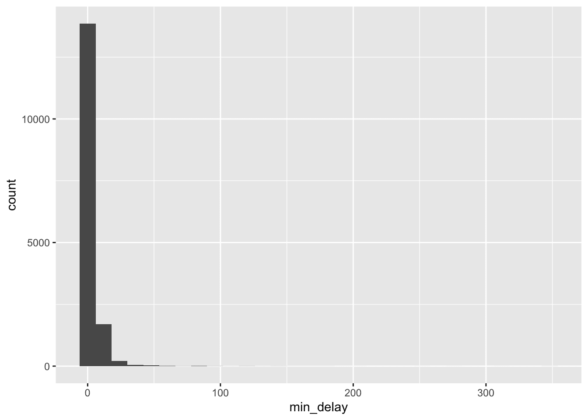

(a) 延迟分布

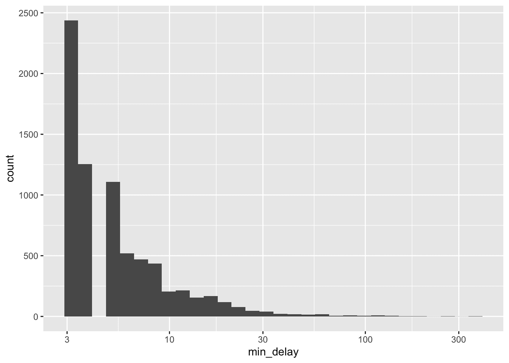

(b) 对数刻度

图 11.1：延迟分布，以分钟为单位

图 11.1 (a)中的大部分空白图表表明存在异常值。有各种方法试图理解可能发生的情况，但一种快速的方法是使用对数，记住我们预计零值会消失(图 11.1 (b))。

这初步的探索表明，有一些较大的延迟，我们可能想进一步探索。我们将把这个数据集与“delay_codes”连接起来，以了解发生了什么。

```py
fix_organization_of_codes <-
 rbind(
 delay_codes |>
 select(sub_rmenu_code, code_description_3) |>
 mutate(type = "sub") |>
 rename(
 code = sub_rmenu_code,
 code_desc = code_description_3
 ),
 delay_codes |>
 select(srt_rmenu_code, code_description_7) |>
 mutate(type = "srt") |>
 rename(
 code = srt_rmenu_code,
 code_desc = code_description_7
 )
 )

all_2021_ttc_data_no_dupes_with_explanation <-
 all_2021_ttc_data_no_dupes |>
 mutate(type = if_else(line == "SRT", "srt", "sub")) |>
 left_join(
 fix_organization_of_codes,
 by = c("type", "code")
 )

all_2021_ttc_data_no_dupes_with_explanation |>
 select(station_clean, code, min_delay, code_desc) |>
 arrange(-min_delay)
```

*```py
# A tibble: 15,908 × 4
   station_clean code  min_delay code_desc                                  
   <chr>         <chr>     <dbl> <chr>                                      
 1 MUSEUM        PUTTP       348 Traction Power Rail Related                
 2 EGLINTON      PUSTC       343 Signals - Track Circuit Problems           
 3 WOODBINE      MUO         312 Miscellaneous Other                        
 4 MCCOWAN       PRSL        275 Loop Related Failures                      
 5 SHEPPARD WEST PUTWZ       255 Work Zone Problems - Track                 
 6 ISLINGTON     MUPR1       207 Priority One - Train in Contact With Person
 7 SHEPPARD WEST MUPR1       191 Priority One - Train in Contact With Person
 8 ROYAL         SUAP        182 Assault / Patron Involved                  
 9 ROYAL         MUPR1       180 Priority One - Train in Contact With Person
10 SHEPPARD      MUPR1       171 Priority One - Train in Contact With Person
# ℹ 15,898 more rows
```*  *从这些数据中我们可以看到，348 分钟的延误是由于“牵引电力铁路相关”，343 分钟的延误是由于“信号 - 轨道电路问题”，等等。

我们还在寻找的是数据的各种分组，特别是当子组可能只有少量观察值时。这是因为我们的分析可能特别受它们的影响。一种快速的方法是按一个感兴趣的变量分组数据，例如，“线路”，使用颜色。

```py
all_2021_ttc_data_no_dupes_with_explanation |>
 ggplot() +
 geom_histogram(
 aes(
 x = min_delay,
 y = ..density..,
 fill = line
 ),
 position = "dodge",
 bins = 10
 ) +
 scale_x_log10()

all_2021_ttc_data_no_dupes_with_explanation |>
 ggplot() +
 geom_histogram(
 aes(x = min_delay, fill = line),
 position = "dodge",
 bins = 10
 ) +
 scale_x_log10()
```

*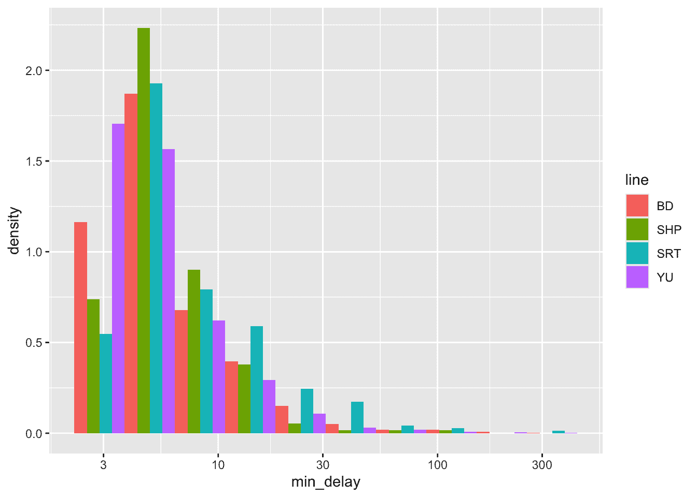

(a) 密度

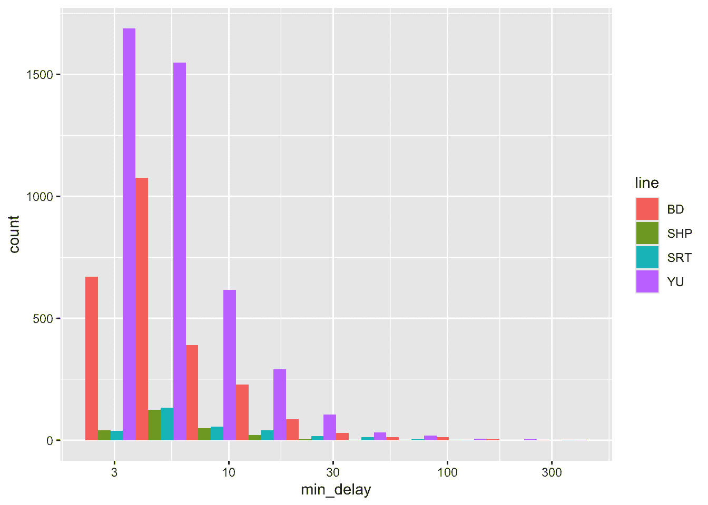

(b) 频率

图 11.2：延误分布（分钟）

图 11.2 (a)使用密度，以便我们可以更比较地查看分布，但我们也应该注意频率的差异（图 11.2 (b)）。在这种情况下，我们看到“SHP”和“SRT”的计数要小得多。

要按另一个变量分组，我们可以添加面元（图 11.3）。

```py
all_2021_ttc_data_no_dupes_with_explanation |>
 ggplot() +
 geom_histogram(
 aes(x = min_delay, fill = line),
 position = "dodge",
 bins = 10
 ) +
 scale_x_log10() +
 facet_wrap(vars(day)) +
 theme(legend.position = "bottom")
```

*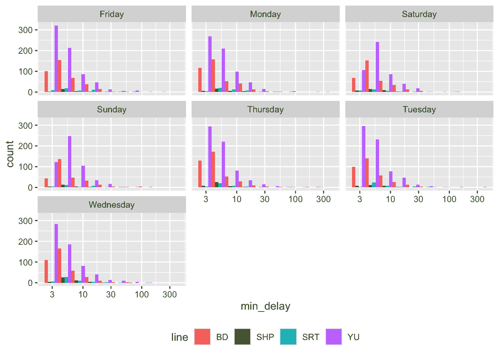

图 11.3：按日分布的延误频率（分钟）*  *我们还可以按平均延误和线路绘制排名前五的车站（图 11.4）。这引发了一个我们需要跟进的问题，那就是“YU”中的“ZONE”是什么意思？

```py
all_2021_ttc_data_no_dupes_with_explanation |>
 summarise(mean_delay = mean(min_delay), n_obs = n(),
 .by = c(line, station_clean)) |>
 filter(n_obs > 1) |>
 arrange(line, -mean_delay) |>
 slice(1:5, .by = line) |>
 ggplot(aes(station_clean, mean_delay)) +
 geom_col() +
 coord_flip() +
 facet_wrap(vars(line), scales = "free_y")
```

*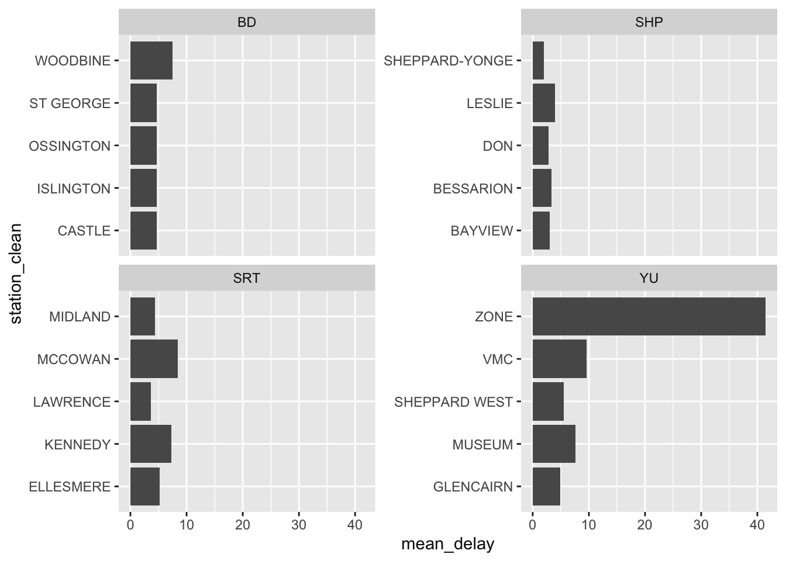

图 11.4：按平均延误和线路排名前五的车站*  *如第九章中所述，日期往往很难处理，因为它们很容易出现问题。因此，在 EDA 期间考虑它们尤为重要。让我们按周创建一个图表，看看一年中是否存在季节性。当使用日期时，`lubridate`特别有用。例如，我们可以使用`week()`构造周来查看延误的平均值，按周计算那些延误的情况（图 11.5）。

```py
all_2021_ttc_data_no_dupes_with_explanation |>
 filter(min_delay > 0) |>
 mutate(week = week(date)) |>
 summarise(mean_delay = mean(min_delay),
 .by = c(week, line)) |>
 ggplot(aes(week, mean_delay, color = line)) +
 geom_point() +
 geom_smooth() +
 facet_wrap(vars(line), scales = "free_y")
```

*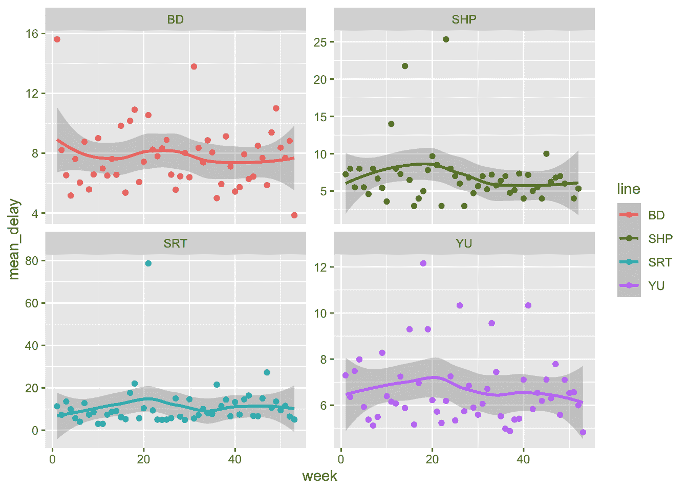

图 11.5：按周计算的 Toronto 地铁的平均延误时间（分钟）*  *现在让我们看看超过十分钟的延误比例（图 11.6）。

```py
all_2021_ttc_data_no_dupes_with_explanation |>
 mutate(week = week(date)) |>
 summarise(prop_delay = sum(min_delay > 10) / n(),
 .by = c(week, line)) |>
 ggplot(aes(week, prop_delay, color = line)) +
 geom_point() +
 geom_smooth() +
 facet_wrap(vars(line), scales = "free_y")
```

*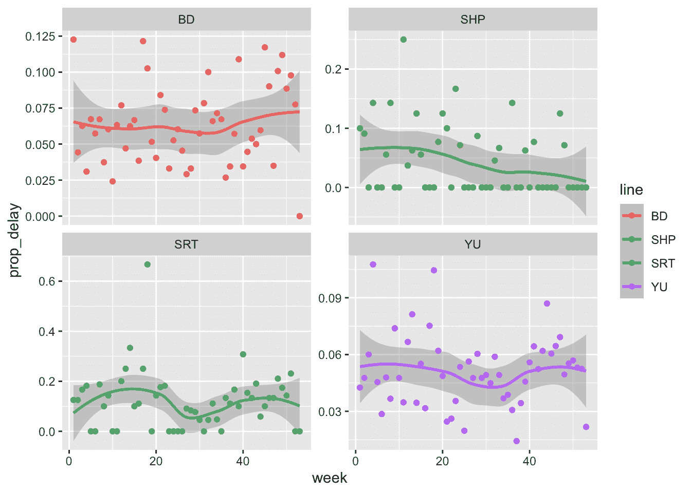

图 11.6：按周计算的 Toronto 地铁的超过十分钟的延误时间*  *这些图表、表格和分析可能不会出现在最终的论文中。相反，它们使我们能够熟悉数据。我们注意到每个图表的突出方面，以及警告和任何需要返回的启示或方面。****************  ***### 11.4.2 变量之间的关系

我们还感兴趣于查看两个变量之间的关系。我们将大量使用图表来完成这项工作。在 第五章 中讨论了不同情况下适当的图表类型。散点图对于连续变量特别有用，并且是建模的良好先导。例如，我们可能对延误和间隔之间的关系感兴趣，间隔是列车之间的分钟数 (图 11.7)。

```py
all_2021_ttc_data_no_dupes_with_explanation |>
 ggplot(aes(x = min_delay, y = min_gap, alpha = 0.1)) +
 geom_point() +
 scale_x_log10() +
 scale_y_log10()
```

*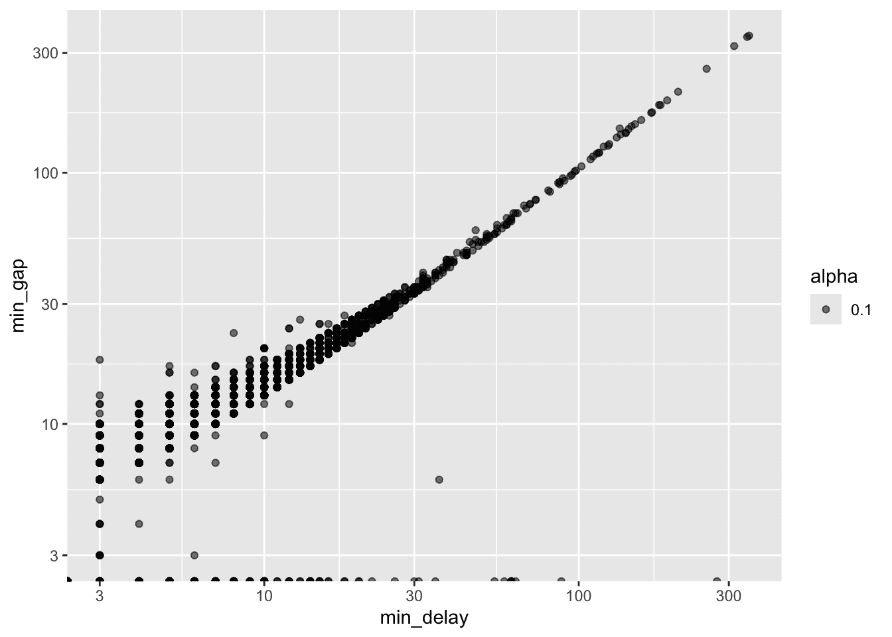

图 11.7：2021 年多伦多地铁延误和间隔之间的关系*  *类别变量之间的关系需要更多的工作，但例如，我们也可以查看每个站点的延误前五名原因。我们可能对它们是否不同以及任何差异如何建模感兴趣 (图 11.8))。

```py
all_2021_ttc_data_no_dupes_with_explanation |>
 summarise(mean_delay = mean(min_delay),
 .by = c(line, code_desc)) |>
 arrange(-mean_delay) |>
 slice(1:5) |>
 ggplot(aes(x = code_desc, y = mean_delay)) +
 geom_col() +
 facet_wrap(vars(line), scales = "free_y", nrow = 4) +
 coord_flip()
```

*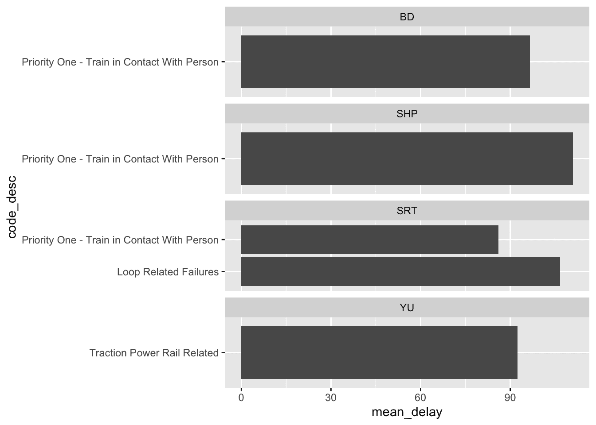

图 11.8：2021 年多伦多地铁的类别变量之间的关系*******  ***## 11.5 伦敦，英格兰的 Airbnb 列表

在本案例研究中，我们研究截至 2023 年 3 月 14 日的伦敦，英格兰的 Airbnb 列表。数据集来自 [Inside Airbnb](http://insideairbnb.com) (Cox 2021)，我们将从他们的网站读取它，然后保存本地副本。我们可以给 `read_csv()` 提供数据集的链接，它会下载它。这有助于可重复性，因为来源是明确的。但是，由于该链接可能会随时更改，长期的可重复性以及希望最小化对 Inside Airbnb 服务器的冲击，建议我们还应保存数据的本地副本，然后使用它。

要获取我们需要的数据集，请访问 Inside Airbnb $\rightarrow$ “数据” $\rightarrow$ “获取数据”，然后滚动到伦敦。我们感兴趣的是“列表数据集”，然后我们右键点击获取所需的 URL (图 11.9)。Inside Airbnb 会更新他们提供的数据，因此可用的特定数据集会随时间变化。

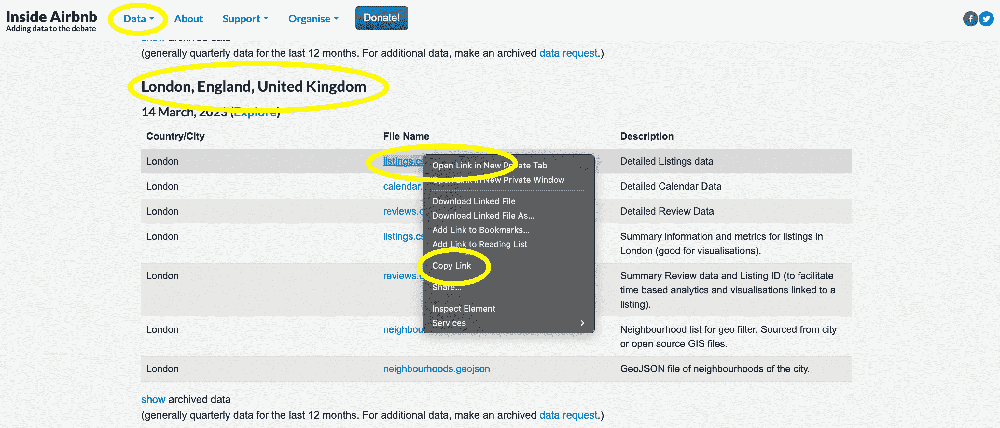

图 11.9：从 Inside Airbnb 获取 Airbnb 数据

由于原始数据集不属于我们，在没有首先获得书面许可的情况下，我们不应将其公开。例如，我们可能想将其添加到我们的输入文件夹中，但使用 第三章 中介绍的“gitignore”条目，以确保我们不将其推送到 GitHub。`read_csv()` 中的“guess_max”选项帮助我们避免必须指定列类型。通常，`read_csv()` 会根据前几行来最佳猜测列类型。但有时这些前几行可能会误导，因此“guess_max”强制它查看更多的行，以尝试弄清楚发生了什么。将我们从 Inside Airbnb 复制的 URL 粘贴到 URL 部分。一旦下载，保存本地副本。

```py
url <-
 paste0(
 "http://data.insideairbnb.com/united-kingdom/england/",
 "london/2023-03-14/data/listings.csv.gz"
 )

airbnb_data <-
 read_csv(
 file = url,
 guess_max = 20000
 )

write_csv(airbnb_data, "airbnb_data.csv")

airbnb_data
```

*在运行我们的脚本来探索数据时，我们应该参考这个本地数据副本，而不是每次都向 Inside Airbnb 服务器请求数据。甚至可能值得取消注释对他们的服务器调用，以确保我们不会意外地对其服务造成压力。

再次，将此文件名——“airbnb_data.csv”——添加到“.gitignore”文件中，以便它不会被推送到 GitHub。数据集的大小将造成一些我们希望避免的复杂问题。

虽然我们需要存档这个 CSV 文件，因为那是原始的、未经编辑的数据，但超过 100MB 的大小让它变得有些难以处理。为了探索目的，我们将创建一个包含选定变量的 parquet 文件（我们以迭代的方式做这件事，使用`names(airbnb_data)`来确定变量名）。

```py
airbnb_data_selected <-
 airbnb_data |>
 select(
 host_id,
 host_response_time,
 host_is_superhost,
 host_total_listings_count,
 neighbourhood_cleansed,
 bathrooms,
 bedrooms,
 price,
 number_of_reviews,
 review_scores_rating,
 review_scores_accuracy,
 review_scores_value
 )

write_parquet(
 x = airbnb_data_selected, 
 sink = 
 "2023-03-14-london-airbnblistings-select_variables.parquet"
 )

rm(airbnb_data)
```

*### 11.5.1 单个变量的分布和属性

首先，我们可能对价格感兴趣。目前它是一个字符类型，因此我们需要将其转换为数值类型。这是一个常见问题，我们需要小心，不要让它全部转换为 NAs。如果我们强制将价格变量转换为数值类型，那么它将变为 NA，因为有很多字符不清楚其数值等价物，例如“$”。我们需要先删除这些字符。

```py
airbnb_data_selected$price |>
 head()
```

*```py
[1] "$100.00" "$65.00"  "$132.00" "$100.00" "$120.00" "$43.00" 
```

```py
airbnb_data_selected$price |>
 str_split("") |>
 unlist() |>
 unique()
```

*```py
 [1] "$" "1" "0" "." "6" "5" "3" "2" "4" "9" "8" "7" ","
```

```py
airbnb_data_selected |>
 select(price) |>
 filter(str_detect(price, ","))
```

*```py
# A tibble: 1,629 × 1
   price    
   <chr>    
 1 $3,070.00
 2 $1,570.00
 3 $1,480.00
 4 $1,000.00
 5 $1,100.00
 6 $1,433.00
 7 $1,800.00
 8 $1,000.00
 9 $1,000.00
10 $1,000.00
# ℹ 1,619 more rows
```

```py
airbnb_data_selected <-
 airbnb_data_selected |>
 mutate(
 price = str_remove_all(price, "[\\$,]"),
 price = as.integer(price)
 )
```***  ***现在我们可以查看价格分布（图 11.10 (a)）。存在异常值，所以我们可能还想考虑对数刻度（图 11.10 (b)）。

```py
airbnb_data_selected |>
 ggplot(aes(x = price)) +
 geom_histogram(binwidth = 10) +
 theme_classic() +
 labs(
 x = "Price per night",
 y = "Number of properties"
 )

airbnb_data_selected |>
 filter(price > 1000) |>
 ggplot(aes(x = price)) +
 geom_histogram(binwidth = 10) +
 theme_classic() +
 labs(
 x = "Price per night",
 y = "Number of properties"
 ) +
 scale_y_log10()
```

*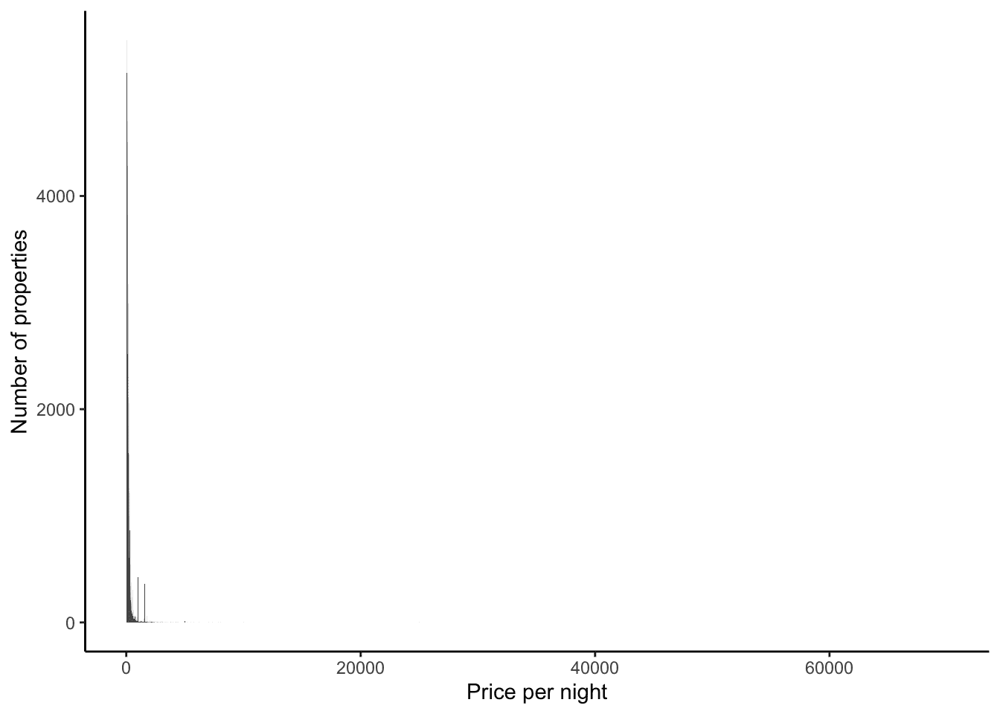

(a) 价格分布

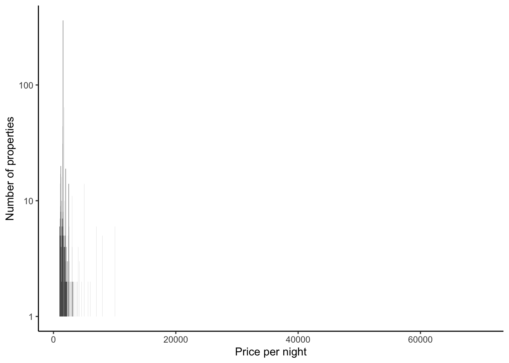

(b) 对于超过$1,000 的价格使用对数刻度

图 11.10：2023 年 3 月伦敦 Airbnb 租赁的价格分布

转到图 11.11，如果我们关注低于$1,000 的价格，那么我们会看到大多数物业的每晚价格低于$250（图 11.11 (a)）。就像我们在第九章中看到年龄的聚集一样，这里看起来价格也存在一些聚集。这可能是发生在以零或九结尾的数字周围。让我们出于好奇，放大$90 到$210 之间的价格，但将区间划分得更小（图 11.11 (b)）。

```py
airbnb_data_selected |>
 filter(price < 1000) |>
 ggplot(aes(x = price)) +
 geom_histogram(binwidth = 10) +
 theme_classic() +
 labs(
 x = "Price per night",
 y = "Number of properties"
 )

airbnb_data_selected |>
 filter(price > 90) |>
 filter(price < 210) |>
 ggplot(aes(x = price)) +
 geom_histogram(binwidth = 1) +
 theme_classic() +
 labs(
 x = "Price per night",
 y = "Number of properties"
 )
```

*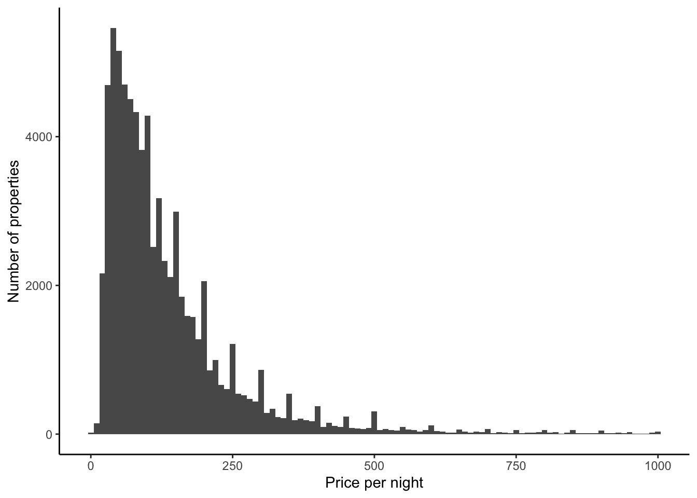

(a) 价格低于$1,000 表明存在一些聚集


(b) 价格在$90 到$210 之间更清楚地说明了聚集

图 11.11：2023 年 3 月伦敦 Airbnb 房源的价格分布

现在，我们将只删除所有超过$999 的价格。

```py
airbnb_data_less_1000 <-
 airbnb_data_selected |>
 filter(price < 1000)
```

*超级房东是经验丰富的 Airbnb 房东，我们可能想了解更多关于他们的信息。例如，房东要么是超级房东，要么不是，所以我们不期望有任何 NA。但我们可以看到有 NA。可能是因为房东删除了列表或类似的事情，但这是我们需要进一步调查的事情。

```py
airbnb_data_less_1000 |>
 filter(is.na(host_is_superhost))
```

*```py
# A tibble: 13 × 12
     host_id host_response_time host_is_superhost host_total_listings_count
       <dbl> <chr>              <lgl>                                 <dbl>
 1 317054510 within an hour     NA                                        5
 2 316090383 within an hour     NA                                        6
 3 315016947 within an hour     NA                                        2
 4 374424554 within an hour     NA                                        2
 5  97896300 N/A                NA                                       10
 6 316083765 within an hour     NA                                        7
 7 310628674 N/A                NA                                        5
 8 179762278 N/A                NA                                       10
 9 315037299 N/A                NA                                        1
10 316090018 within an hour     NA                                        6
11 375515965 within an hour     NA                                        2
12 341372520 N/A                NA                                        7
13 180634347 within an hour     NA                                        5
# ℹ 8 more variables: neighbourhood_cleansed <chr>, bathrooms <lgl>,
#   bedrooms <dbl>, price <int>, number_of_reviews <dbl>,
#   review_scores_rating <dbl>, review_scores_accuracy <dbl>,
#   review_scores_value <dbl>
```*  *我们还将从这个数据中创建一个二元变量。目前它是真/假，这对于建模来说是可行的，但在一些情况下，如果我们有一个 0/1 的变量会更容易。目前，我们将移除任何关于他们是否是超级房东的 NA。

```py
airbnb_data_no_superhost_nas <-
 airbnb_data_less_1000 |>
 filter(!is.na(host_is_superhost)) |>
 mutate(
 host_is_superhost_binary =
 as.numeric(host_is_superhost)
 )
```

*在 Airbnb 上，客人可以对包括清洁度、准确性、价值等多个方面的一个到五星级进行评分。但当我们查看数据集中的评价时，很明显它实际上是一个二元的，几乎全部情况是评分是五星或不是 (图 11.12)。

```py
airbnb_data_no_superhost_nas |>
 ggplot(aes(x = review_scores_rating)) +
 geom_bar() +
 theme_classic() +
 labs(
 x = "Review scores rating",
 y = "Number of properties"
 )
```

*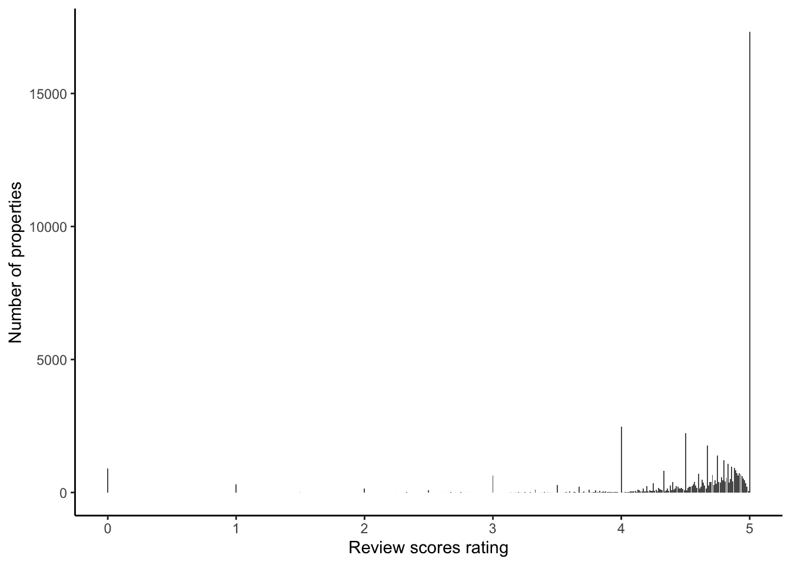

图 11.12：2023 年 3 月伦敦 Airbnb 租赁的评分分布*  *我们希望处理“review_scores_rating”中的缺失值，但这更为复杂，因为有很多缺失值。可能是因为这些房源没有任何评价。

```py
airbnb_data_no_superhost_nas |>
 filter(is.na(review_scores_rating)) |>
 nrow()
```

*```py
[1] 17681
```

```py
airbnb_data_no_superhost_nas |>
 filter(is.na(review_scores_rating)) |>
 select(number_of_reviews) |>
 table()
```

*```py
number_of_reviews
    0 
17681 
```**  **这些房源还没有评价评分，因为它们没有足够的评价。在总数中占很大比例，接近五分之一，所以我们可能想更详细地查看这一点。我们感兴趣的是看看这些房源是否有什么系统性的问题。例如，如果 NA 是由，比如说，最低评价数量的要求驱动的，那么我们预计它们都会缺失。

一种方法就是只关注那些没有缺失值的主要评价评分 (图 11.13)。

```py
airbnb_data_no_superhost_nas |>
 filter(!is.na(review_scores_rating)) |>
 ggplot(aes(x = review_scores_rating)) +
 geom_histogram(binwidth = 1) +
 theme_classic() +
 labs(
 x = "Average review score",
 y = "Number of properties"
 )
```

*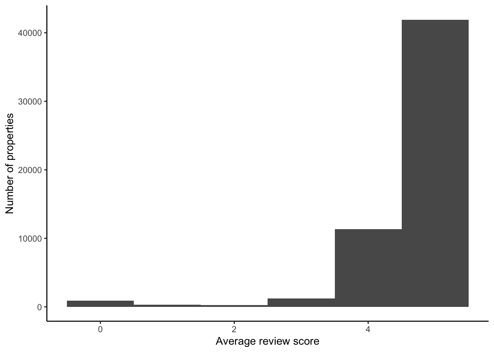

图 11.13：2023 年 3 月伦敦 Airbnb 租赁的评分分布*  *目前，我们将移除任何主要评分中有 NA 的人，尽管这将移除大约 20% 的观测值。如果我们最终使用这个数据集进行实际分析，那么我们将在附录或类似的地方证明这个决定的合理性。

```py
airbnb_data_has_reviews <-
 airbnb_data_no_superhost_nas |>
 filter(!is.na(review_scores_rating))
```

*另一个重要因素是房东对询问的响应速度。Airbnb 允许房东最多在 24 小时内回复，但鼓励在 1 小时内回复。

```py
airbnb_data_has_reviews |>
 count(host_response_time)
```

*```py
# A tibble: 5 × 2
  host_response_time     n
  <chr>              <int>
1 N/A                19479
2 a few days or more   712
3 within a day        4512
4 within a few hours  6894
5 within an hour     24321
```*  *不清楚房东如何会有 NA 的响应时间。可能这与其他变量有关。有趣的是，看起来在“host_response_time”变量中的“NA”并没有被编码为正确的 NA，而是被当作另一个类别处理。我们将重新编码它们为实际的 NA，并将变量改为因子类型。

```py
airbnb_data_has_reviews <-
 airbnb_data_has_reviews |>
 mutate(
 host_response_time = if_else(
 host_response_time == "N/A",
 NA_character_,
 host_response_time
 ),
 host_response_time = factor(host_response_time)
 )
```

*存在 NA 的问题，因为它们有很多。例如，我们可能想看看它们与评论分数之间是否存在关系（图 11.14）。有很多评论总分是 100。

```py
airbnb_data_has_reviews |>
 filter(is.na(host_response_time)) |>
 ggplot(aes(x = review_scores_rating)) +
 geom_histogram(binwidth = 1) +
 theme_classic() +
 labs(
 x = "Average review score",
 y = "Number of properties"
 )
```

*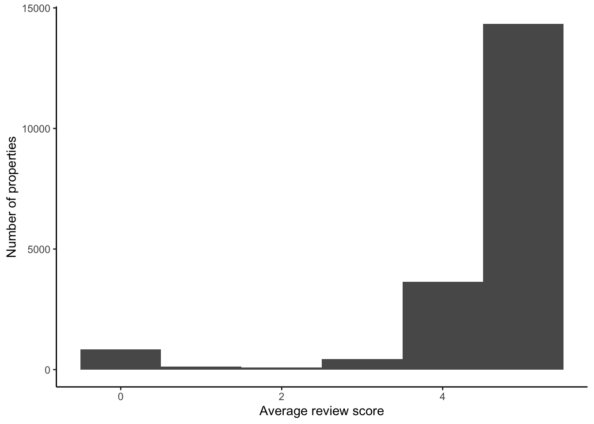

图 11.14：2023 年 3 月伦敦 Airbnb 租赁中，回应时间缺失的物业评论分数分布*  *通常，缺失值会被`ggplot2`丢弃。我们可以使用`naniar`中的`geom_miss_point()`将它们包含在图表中（图 11.15）。

```py
airbnb_data_has_reviews |>
 ggplot(aes(
 x = host_response_time,
 y = review_scores_accuracy
 )) +
 geom_miss_point() +
 labs(
 x = "Host response time",
 y = "Review score accuracy",
 color = "Is missing?"
 ) +
 theme(axis.text.x = element_text(angle = 90, vjust = 0.5, hjust=1))
```

*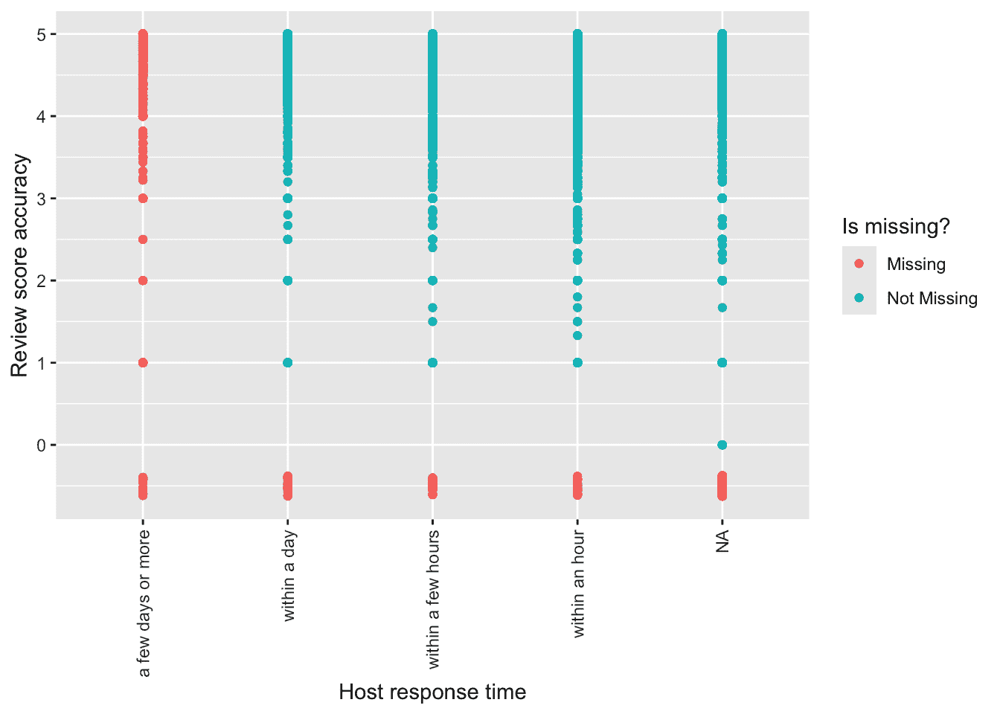

图 11.15：伦敦 Airbnb 数据中，根据房东回应时间缺失值的分布*  *目前，我们将移除任何回应时间中有 NA 的人。这又将再次移除大约 20%的观测值。

```py
airbnb_data_selected <-
 airbnb_data_has_reviews |>
 filter(!is.na(host_response_time))
```

*我们可能对房东在 Airbnb 上拥有的物业数量感兴趣（图 11.16）。

```py
airbnb_data_selected |>
 ggplot(aes(x = host_total_listings_count)) +
 geom_histogram() +
 scale_x_log10() +
 labs(
 x = "Total number of listings, by host",
 y = "Number of hosts"
 )
```

*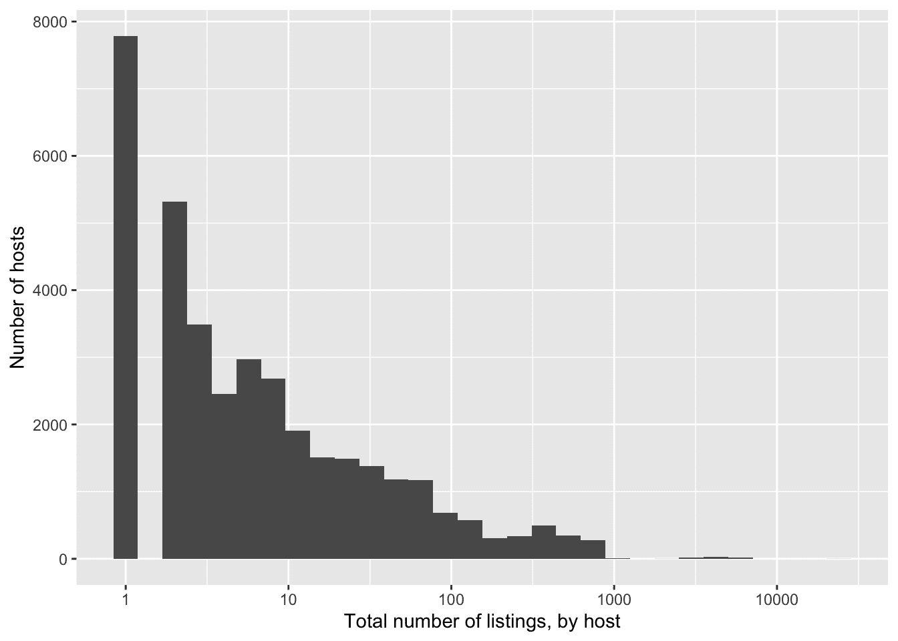

图 11.16：2023 年 3 月伦敦 Airbnb 租赁中，房东在 Airbnb 上拥有的物业数量分布*  *根据图 11.16，我们可以看到有很多人拥有大约 2-500 个物业，通常有一个长尾。拥有那么多列表的数量是出乎意料的，值得跟进。而且还有一大堆 NA 值，我们需要处理。

```py
airbnb_data_selected |>
 filter(host_total_listings_count >= 500) |>
 head()
```

*```py
# A tibble: 6 × 13
    host_id host_response_time host_is_superhost host_total_listings_count
      <dbl> <fct>              <lgl>                                 <dbl>
1 439074505 within an hour     FALSE                                  3627
2 156158778 within an hour     FALSE                                   558
3 156158778 within an hour     FALSE                                   558
4 156158778 within an hour     FALSE                                   558
5 156158778 within an hour     FALSE                                   558
6 156158778 within an hour     FALSE                                   558
# ℹ 9 more variables: neighbourhood_cleansed <chr>, bathrooms <lgl>,
#   bedrooms <dbl>, price <int>, number_of_reviews <dbl>,
#   review_scores_rating <dbl>, review_scores_accuracy <dbl>,
#   review_scores_value <dbl>, host_is_superhost_binary <dbl>
```*  *拥有超过十个列表的人并没有什么明显异常之处，但与此同时，这仍然不是很清楚。目前，我们将继续前进，仅关注那些只有一个属性的人以简化问题。

```py
airbnb_data_selected <-
 airbnb_data_selected |>
 add_count(host_id) |>
 filter(n == 1) |>
 select(-n)
```********************  ***### 11.5.2 变量之间的关系

我们可能想绘制一些图表，看看变量之间是否存在任何明显的关系。一些想到的方面是查看价格并与评论、超级房东、物业数量和社区进行比较。

我们可以查看价格与评论之间的关系，以及他们是否是超级房东，对于拥有多个评论的物业（图 11.17）。

```py
airbnb_data_selected |>
 filter(number_of_reviews > 1) |>
 ggplot(aes(x = price, y = review_scores_rating, 
 color = host_is_superhost)) +
 geom_point(size = 1, alpha = 0.1) +
 theme_classic() +
 labs(
 x = "Price per night",
 y = "Average review score",
 color = "Superhost"
 ) +
 scale_color_brewer(palette = "Set1")
```

*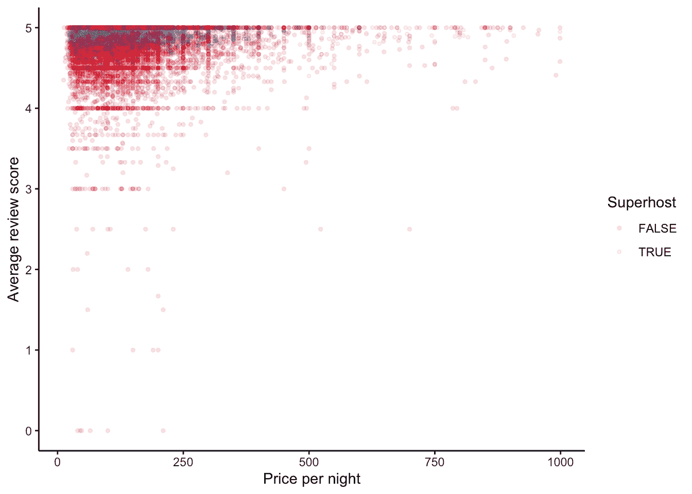

图 11.17：2023 年 3 月伦敦 Airbnb 租赁价格与评论之间的关系，以及房东是否为超级房东*  *可能使某人成为超级房东的一个方面是他们回应询问的速度。可以想象，成为超级房东可能涉及快速对询问说“是”或“否”。让我们看看数据。首先，我们想根据他们的回应时间查看超级房东的可能值。

```py
airbnb_data_selected |>
 count(host_is_superhost) |>
 mutate(
 proportion = n / sum(n),
 proportion = round(proportion, digits = 2)
 )
```

*```py
# A tibble: 2 × 3
  host_is_superhost     n proportion
  <lgl>             <int>      <dbl>
1 FALSE             10480       0.74
2 TRUE               3672       0.26
```*  *幸运的是，看起来当我们删除了评价行时，我们也删除了任何关于他们是否是超级房东的 NA 值，但如果我们回头看看，我们可能需要再次检查。我们可以使用 `janitor` 的 `tabyl()` 函数构建一个表格，查看房东的响应时间是否是超级房东。很明显，如果一个房东在一小时内没有响应，那么他们不太可能是超级房东。

```py
airbnb_data_selected |>
 tabyl(host_response_time, host_is_superhost) |>
 adorn_percentages("col") |>
 adorn_pct_formatting(digits = 0) |>
 adorn_ns() |>
 adorn_title()
```

*```py
 host_is_superhost            
 host_response_time             FALSE        TRUE
 a few days or more        5%   (489)  0%     (8)
       within a day       22% (2,322) 11%   (399)
 within a few hours       23% (2,440) 25%   (928)
     within an hour       50% (5,229) 64% (2,337)
```*  *最后，我们可以看看社区。数据提供者已经尝试为我们清理了社区变量，所以现在我们将使用这个变量。尽管如果我们最终使用这个变量进行实际分析，我们希望检查它是如何构建的。

```py
airbnb_data_selected |>
 tabyl(neighbourhood_cleansed) |>
 adorn_pct_formatting() |>
 arrange(-n) |>
 filter(n > 100) |>
 adorn_totals("row") |>
 head()
```

*```py
 neighbourhood_cleansed    n percent
                Hackney 1172    8.3%
            Westminster  965    6.8%
          Tower Hamlets  956    6.8%
              Southwark  939    6.6%
                Lambeth  914    6.5%
             Wandsworth  824    5.8%
```*  *我们将快速在我们的数据集上运行一个模型。我们将在第十二章中更详细地介绍建模，但我们可以使用模型在 EDA 期间帮助更好地了解数据集中多个变量之间可能存在的关系。例如，我们可能想看看我们是否可以预测某人是否是超级房东，以及解释这一点的因素。由于结果是二元的，这是一个使用逻辑回归的好机会。我们预计超级房东状态将与更快的响应和更好的评价相关。具体来说，我们估计的模型是：

$$概率（是超级房东）= \mbox{logit}^{-1}\left( \beta_0 + \beta_1 \mbox{响应时间} + \beta_2 \mbox{评价} + \epsilon\right)$$

我们使用 `glm` 估计模型。

```py
logistic_reg_superhost_response_review <-
 glm(
 host_is_superhost ~
 host_response_time +
 review_scores_rating,
 data = airbnb_data_selected,
 family = binomial
 )
```

*在安装和加载 `modelsummary` 之后，我们可以使用 `modelsummary()` 快速查看结果（表 11.3）。

```py
modelsummary(logistic_reg_superhost_response_review)
```

*表 11.3：根据响应时间解释房东是否是超级房东

|  | (1) |
| --- | --- |
| (Intercept) | -16.369 |
|  | (0.673) |
| host_response_timewithin a day | 2.230 |
|  | (0.361) |
| host_response_timewithin a few hours | 3.035 |
|  | (0.359) |
| host_response_timewithin an hour | 3.279 |
|  | (0.358) |
| review_scores_rating | 2.545 |
|  | (0.116) |
| Num.Obs. | 14152 |
| AIC | 14948.4 |
| BIC | 14986.2 |
| Log.Lik. | -7469.197 |
| F | 197.407 |

| RMSE | 0.42 |*  *我们发现每个级别都与成为超级房东的概率呈正相关。然而，在我们的数据集中，响应时间在一小时内的房东与超级房东有关。

我们将保存这个分析数据集。

```py
write_parquet(
 x = airbnb_data_selected, 
 sink = "2023-05-05-london-airbnblistings-analysis_dataset.parquet"
 )
```***********  ***## 11.6 结论

在本章中，我们考虑了探索性数据分析（EDA），这是了解数据集的积极过程。我们关注了缺失数据、变量的分布以及变量之间的关系。为此，我们广泛使用了图表和表格。

EDA 的方法将根据上下文而变化，以及数据集中遇到的问题和特征。它还将取决于你的技能，例如，考虑回归模型和降维方法是常见的。

## 11.7 练习

### 练习

1.  *(计划)* 考虑以下场景：*我们有一些来自一个社交媒体公司的关于年龄的数据，该公司平台上约有 80%的美国人口。* 请绘制该数据集可能的样子，然后绘制一个图形来展示所有观测值。

1.  *(模拟)* 请进一步考虑所描述的场景，并模拟这种情况。由于大小问题，请使用 parquet。请包括基于模拟数据的十个测试。提交一个包含你代码的 GitHub Gist 链接。

1.  *(获取)* 请描述此类数据集的可能来源。

1.  *(探索)* 请使用`ggplot2`构建你绘制的图形。提交一个包含你代码的 GitHub Gist 链接。

1.  *(沟通)* 请写一页关于你所做的工作，并注意讨论基于样本所做的估计的一些威胁。

### 小测验

1.  用几段文字总结 Tukey（1962）的观点，并将其与数据科学联系起来。

1.  用你自己的话来描述探索性数据分析（请至少写三段，并包括引用和例子）？

1.  假设你有一个名为“my_data”的数据集，它有两个列：“first_col”和“second_col”。请编写一些 R 代码来生成一个图形（图形类型不重要）。提交一个包含你代码的 GitHub Gist 链接。

1.  考虑一个包含 500 个观测值和三个变量的数据集，因此有 1500 个单元格。如果 100 行至少有一列的单元格缺失，那么你会：a) 从数据集中删除整个行，b) 尝试在数据上进行分析，或者 c) 采用其他程序？如果数据集有 10,000 行，但缺失行数相同，会怎样？请至少用三个段落，通过例子和引用进行讨论。

1.  请讨论三种识别异常值的方法，每种方法至少写一段文字。

1.  分类别变量和连续变量之间的区别是什么？

1.  因子和整数变量之间的区别是什么？

1.  我们如何思考谁系统地被排除在数据集之外？

1.  使用`opendatatoronto`下载 2014 年的市长竞选捐款数据。（注意：从`get_resource()`获取的 2014 文件包含许多工作表，所以只需保留与市长选举相关的工作表）。

    1.  清理数据格式（修复解析问题并使用`janitor`标准化列名）。

    1.  总结数据集中的变量。是否存在缺失值，如果有，我们应该担心它们吗？每个变量是否都处于正确的格式？如果不是，创建新的变量（s）以正确的格式。

    1.  可视化探索捐款值的分布。哪些捐款是显著的异常值？它们是否具有相似的特征（s）？可能有用的是，在不包括这些异常值的情况下绘制捐款的分布，以更好地了解大部分数据。

    1.  列出每个类别的顶级候选人：1）总捐款；2）平均捐款；3）捐款次数。

    1.  重复该过程，但不包括候选人的贡献。

    1.  有多少贡献者向多个候选人捐款？

1.  列出三个在`ggplot()`中产生带有条形的图形的`geom`。

1.  考虑一个包含 10,000 个观测值和 27 个变量的数据集。对于每个观测值，至少有一个缺失变量。请在一两段文字中讨论，你会采取哪些步骤来理解发生了什么。

1.  已知的缺失数据是那些在你的数据集中留下空缺的数据。但从未收集到的数据呢？请参考 McClelland (2019) 和 Luscombe 及 McClelland (2020)。研究他们如何收集数据集以及整合这些数据需要什么。数据集中有什么？为什么？有什么缺失？为什么？这可能会如何影响结果？类似的偏差可能会进入你使用或阅读过的其他数据集中吗？

### 课堂活动

+   修复以下文件名。

```py
example_project/
├── .gitignore
├── Example project.Rproj
├── scripts
│   ├── simulate data.R
│   ├── DownloadData.R
│   ├── data-cleaning.R
│   ├── test(new)data.R
```

+   考虑在第五章中介绍的 Anscombe 的四重奏。我们将随机删除某些观测值。请假设你得到了带有缺失数据的这个数据集。从第六章和第十一章中选择处理缺失数据的方法之一，然后编写代码来实现你的选择。比较：

    +   与实际观测值的结果；

    +   与实际摘要统计量的摘要统计量；

    +   在一个图表上构建显示缺失数据和实际数据的图表。

```py
set.seed(853)

tidy_anscombe <-
 anscombe |>
 pivot_longer(everything(),
 names_to = c(".value", "set"),
 names_pattern = "(.)(.)")

tidy_anscombe_MCAR <-
 tidy_anscombe |>
 mutate(row_number = row_number()) |>
 mutate(
 x = if_else(row_number %in% sample(
 x = 1:nrow(tidy_anscombe), size = 10
 ), NA_real_, x),
 y = if_else(row_number %in% sample(
 x = 1:nrow(tidy_anscombe), size = 10
 ), NA_real_, y)
 ) |>
 select(-row_number)

tidy_anscombe_MCAR
```

*```py
# A tibble: 44 × 3
   set       x     y
   <chr> <dbl> <dbl>
 1 1        10  8.04
 2 2        10  9.14
 3 3        NA NA   
 4 4         8 NA   
 5 1         8  6.95
 6 2         8  8.14
 7 3         8  6.77
 8 4         8  5.76
 9 1        NA  7.58
10 2        13  8.74
# ℹ 34 more rows
```

```py
# ADD CODE HERE
```*  ***   重新做这个练习，但使用以下数据集。在这种情况下，主要区别是什么？

```py
tidy_anscombe_MNAR <-
 tidy_anscombe |>
 arrange(desc(x)) |>
 mutate(
 ordered_x_rows = 1:nrow(tidy_anscombe),
 x = if_else(ordered_x_rows %in% 1:10, NA_real_, x)
 ) |>
 select(-ordered_x_rows) |>
 arrange(desc(y)) |>
 mutate(
 ordered_y_rows = 1:nrow(tidy_anscombe),
 y = if_else(ordered_y_rows %in% 1:10, NA_real_, y)
 ) |>
 arrange(set) |>
 select(-ordered_y_rows)

tidy_anscombe_MNAR
```

*```py
# A tibble: 44 × 3
   set       x     y
   <chr> <dbl> <dbl>
 1 1        NA NA   
 2 1        NA NA   
 3 1         9 NA   
 4 1        11  8.33
 5 1        10  8.04
 6 1        NA  7.58
 7 1         6  7.24
 8 1         8  6.95
 9 1         5  5.68
10 1         7  4.82
# ℹ 34 more rows
```

```py
# ADD CODE HERE
```*  ***   使用结对编程（确保每 5 分钟切换一次），创建一个新的 R 项目，然后从 Bombieri 等人(2023)的数据集中读取以下数据集，并通过在 Quarto 文档中添加代码和注释来探索它。

```py
download.file(url = "https://doi.org/10.1371/journal.pbio.3001946.s005",
 destfile = "data.xlsx")

data <-
 read_xlsx(path = "data.xlsx",
 col_types = "text") |>
 clean_names() |>
 mutate(date = convert_to_date(date))
```

**   通过与其他学生配对，扮演与主题专家合作的数据科学家。你的合作伙伴可以选择一个主题和一个问题，这应该是他们非常了解而你不太了解的（如果他们是国际学生，可能是关于他们的国家）。你需要与他们合作制定分析计划，模拟一些数据，并创建一个他们可以使用的图表。*****  ***### 任务

选择以下选项之一。使用 Quarto，包括适当的标题、作者、日期、GitHub 仓库链接和引用。提交 PDF。

**选项 1：**

重复为美国各州和人口进行的缺失数据练习，但针对来自`palmerpenguins`的`penguins()`数据集中的“bill_length_mm”变量。比较估计值与实际值。

至少写两页关于你所做和发现的内容。

在此之后，请与另一位学生配对并交换你们的书面作品。根据他们的反馈进行更新，并确保在你们的论文中通过姓名对他们表示感谢。

**选项 2：**

对巴黎进行 Airbnb EDA 分析。

**选项 3：**

请至少写两页关于以下主题的内容：“什么是缺失数据，你应该如何处理它？”

在此之后，请与另一位学生配对并交换你们的书面作品。根据他们的反馈进行更新，并确保在你们的论文中通过姓名对他们表示感谢。

Arel-Bundock, Vincent. 2022\. “modelsummary: Data and Model Summaries in R.” *Journal of Statistical Software* 103 (1): 1–23\. [`doi.org/10.18637/jss.v103.i01`](https://doi.org/10.18637/jss.v103.i01).———. 2024\. *tinytable: Simple and Configurable Tables in “HTML,” “LaTeX,” “Markdown,” “Word,” “PNG,” “PDF,” and “Typst” Formats*. [`vincentarelbundock.github.io/tinytable/`](https://vincentarelbundock.github.io/tinytable/).Bombieri, Giulia, Vincenzo Penteriani, Kamran Almasieh, Hüseyin Ambarlı, Mohammad Reza Ashrafzadeh, Chandan Surabhi Das, Nishith Dharaiya, et al. 2023\. “A Worldwide Perspective on Large Carnivore Attacks on Humans.” *PLOS Biology* 21 (1): e3001946\. [`doi.org/10.1371/journal.pbio.3001946`](https://doi.org/10.1371/journal.pbio.3001946).Cox, Murray. 2021\. “Inside Airbnb—Toronto Data.” [`insideairbnb.com/get-the-data.html`](http://insideairbnb.com/get-the-data.html).Firke, Sam. 2023\. *janitor: Simple Tools for Examining and Cleaning Dirty Data*. [`CRAN.R-project.org/package=janitor`](https://CRAN.R-project.org/package=janitor).Gelfand, Sharla. 2022\. *opendatatoronto: Access the City of Toronto Open Data Portal*. [`CRAN.R-project.org/package=opendatatoronto`](https://CRAN.R-project.org/package=opendatatoronto).Gelman, Andrew, and Jennifer Hill. 2007\. *Data Analysis Using Regression and Multilevel/Hierarchical Models*. 1st ed. Cambridge University Press.Gelman, Andrew, Jennifer Hill, and Aki Vehtari. 2020\. *Regression and Other Stories*. Cambridge University Press. [`avehtari.github.io/ROS-Examples/`](https://avehtari.github.io/ROS-Examples/).Grolemund, Garrett, and Hadley Wickham. 2011\. “Dates and Times Made Easy with lubridate.” *Journal of Statistical Software* 40 (3): 1–25\. [`doi.org/10.18637/jss.v040.i03`](https://doi.org/10.18637/jss.v040.i03).Horton, Nicholas, and Stuart Lipsitz. 2001\. “Multiple Imputation in Practice.” *The American Statistician* 55 (3): 244–54\. [`doi.org/10.1198/000313001317098266`](https://doi.org/10.1198/000313001317098266).Luscombe, Alex, and Alexander McClelland. 2020\. “Policing the Pandemic: Tracking the Policing of Covid-19 Across Canada,” April. [`doi.org/10.31235/osf.io/9pn27`](https://doi.org/10.31235/osf.io/9pn27).Manski, Charles. 2022\. “Inference with Imputed Data: The Allure of Making Stuff Up.” arXiv. [`doi.org/10.48550/arXiv.2205.07388`](https://doi.org/10.48550/arXiv.2205.07388).McClelland, Alexander. 2019\. “‘Lock This Whore up’: Legal Violence and Flows of Information Precipitating Personal Violence Against People Criminalised for HIV-Related Crimes in Canada.” *European Journal of Risk Regulation* 10 (1): 132–47\. [`doi.org/10.1017/err.2019.20`](https://doi.org/10.1017/err.2019.20).Osborne, Jason. 2012\. *Best Practices in Data Cleaning: A Complete Guide to Everything You Need to Do Before and After Collecting Your Data*. SAGE Publications.R Core Team. 2024\. *R: A Language and Environment for Statistical Computing*. Vienna, Austria: R Foundation for Statistical Computing. [`www.R-project.org/`](https://www.R-project.org/).Richardson, Neal, Ian Cook, Nic Crane, Dewey Dunnington, Romain François, Jonathan Keane, Dragoș Moldovan-Grünfeld, Jeroen Ooms, and Apache Arrow. 2023\. *arrow: Integration to Apache Arrow*. [`CRAN.R-project.org/package=arrow`](https://CRAN.R-project.org/package=arrow).Ryan, Philip. 2015\. “Keeping a Lab Notebook.” *YouTube*, May. [`youtu.be/-MAIuaOL64I`](https://youtu.be/-MAIuaOL64I).Staniak, Mateusz, and Przemysław Biecek. 2019\. “The Landscape of R Packages for Automated Exploratory Data Analysis.” *The R Journal* 11 (2): 347–69\. [`doi.org/10.32614/RJ-2019-033`](https://doi.org/10.32614/RJ-2019-033).Tierney, Nicholas, Di Cook, Miles McBain, and Colin Fay. 2021\. *naniar: Data Structures, Summaries, and Visualisations for Missing Data*. [`CRAN.R-project.org/package=naniar`](https://CRAN.R-project.org/package=naniar).Tukey, John. 1962\. “The Future of Data Analysis.” *The Annals of Mathematical Statistics* 33 (1): 1–67\. [`doi.org/10.1214/aoms/1177704711`](https://doi.org/10.1214/aoms/1177704711).van Buuren, Stef, and Karin Groothuis-Oudshoorn. 2011\. “mice: Multivariate Imputation by Chained Equations in R.” *Journal of Statistical Software* 45 (3): 1–67\. [`doi.org/10.18637/jss.v045.i03`](https://doi.org/10.18637/jss.v045.i03).Wickham, Hadley. 2018\. “Whole Game.” *YouTube*, January. [`youtu.be/go5Au01Jrvs`](https://youtu.be/go5Au01Jrvs).Wickham, Hadley, Mara Averick, Jenny Bryan, Winston Chang, Lucy D’Agostino McGowan, Romain François, Garrett Grolemund, et al. 2019\. “Welcome to the Tidyverse.” *Journal of Open Source Software* 4 (43): 1686\. [`doi.org/10.21105/joss.01686`](https://doi.org/10.21105/joss.01686).Wickham, Hadley, Mine Çetinkaya-Rundel, and Garrett Grolemund. (2016) 2023\. *R for Data Science*. 2nd ed. O’Reilly Media. [`r4ds.hadley.nz`](https://r4ds.hadley.nz).
