# 12  线性模型

> 原文：[`tellingstorieswithdata.com/12-ijalm.html`](https://tellingstorieswithdata.com/12-ijalm.html)

1.  建模

1.  12  线性模型

先决条件**

+   阅读 *回归及其他故事* (Gelman, Hill, and Vehtari 2020)

    +   重点关注第六章“回归建模背景”，第七章“单变量线性回归”和第十章“多变量线性回归”，这些章节提供了线性模型的详细指南。

+   阅读 *统计学习导论及其在 R 中的应用* ([James et al. [2013] 2021](99-references.html#ref-islr))

    +   重点关注第三章“线性回归”，它从不同角度对线性模型进行了补充说明。

+   阅读 *为什么大多数发表的研究结果都是错误的* (Ioannidis 2005)

    +   详细说明可能削弱从统计模型中得出的结论的方面。

关键概念和技能**

+   线性模型是统计推断的关键组成部分，使我们能够快速探索广泛的数据。

+   简单和多重线性回归模型分别将连续结果变量视为一个或多个预测变量的函数。

+   线性模型往往侧重于推断或预测。

软件和包**

+   基础 R (R Core Team 2024)

+   `beepr` (Bååth 2018)

+   `broom` (Robinson, Hayes, and Couch 2022)

+   `broom.mixed` (Bolker and Robinson 2022)

+   `modelsummary` (Arel-Bundock 2022)

+   `purrr` (Wickham and Henry 2022)

+   `rstanarm` (Goodrich et al. 2023)

+   `testthat` (Wickham 2011)

+   `tictoc` (Izrailev 2022)

+   `tidyverse` (Wickham et al. 2019)

+   `tinytable` (Arel-Bundock 2024)

```r
library(beepr)
library(broom)
library(broom.mixed)
library(modelsummary)
library(purrr)
library(rstanarm)
library(testthat)
library(tictoc)
library(tidyverse)
library(tinytable)
```

## 12.1 简介

线性模型已经以各种形式被使用了很长时间。Stigler (1986, 16) 描述了最小二乘法，这是一种拟合简单线性回归的方法，它与 18 世纪天文学的基础性问题有关，例如确定月亮的运动和调和木星和土星的非周期性运动。当时最小二乘法的基本问题是那些来自统计学背景的人对于结合不同观察结果的犹豫。天文学家很早就开始适应这样做，可能是因为他们通常自己收集观察数据，并且知道数据收集的条件是相似的，尽管观察的值是不同的。例如，Stigler (1986, 28) 将 18 世纪的数学家 Leonhard Euler 描述为认为误差随着它们的聚合而增加，相比之下，18 世纪的天文学家 Tobias Mayer 则认为误差会相互抵消。社会科学家适应线性模型需要更长的时间，可能是因为他们犹豫将他们担心不相似的数据分组在一起。在某种意义上，天文学家有优势，因为他们可以将他们的预测与实际发生的情况进行比较，而这对社会科学家来说更困难(Stigler 1986, 163)。

当我们构建模型时，我们并不是在发现“真相”。模型本身并不是，也不可能是一个现实的真正代表。我们使用模型来帮助我们探索和理解我们的数据。没有一种最佳模型，只有那些能帮助我们了解我们所拥有的数据，从而，希望地，了解数据生成世界的有用模型。当我们使用模型时，我们试图理解世界，但我们对这种视角有所限制。我们不应该只是将数据扔进模型，希望它能将其整理出来。它不会。

> 回归确实是一个先知，但是一个残酷的先知。它用谜语说话，并乐于惩罚我们提出糟糕的问题。
> 
> McElreath ([[2015] 2020, 162](99-references.html#ref-citemcelreath))

我们使用模型来理解世界。我们对其进行试探、推动和测试。我们构建它们，并为其美丽而欢欣，然后寻求理解它们的局限性，最终摧毁它们。这个过程本身才是重要的，这个过程使我们能够更好地理解世界；虽然结果可能与之巧合，但结果本身并不是最重要的。当我们构建模型时，我们需要同时考虑到模型的世界以及我们想要讨论的更广泛的世界。我们拥有的数据集往往在某些方面不能代表现实世界的人口。在这样数据上训练的模型并非毫无价值，但它们也并非无可挑剔。模型在多大程度上教会了我们关于我们所拥有的数据？我们所拥有的数据在多大程度上反映了我们想要得出结论的世界？我们需要将这些疑问放在心中。

今天许多常用的统计方法都是为了应对诸如天文学和农业等情境而开发的。在第八章中介绍的罗纳德·费希尔，在他担任农业研究机构工作时发表了费希尔（[[1925] 1928](99-references.html#ref-fisherresearchworkers)）。但 20 世纪和 21 世纪许多后续的应用可能具有不同的特性。统计的有效性依赖于假设，因此虽然所教授的内容是正确的，但我们的情况可能不符合起始标准。统计学通常被教授为通过某种理想化的过程进行，其中出现一个假设，然后对其进行测试，与类似出现的数据进行比较，要么得到证实，要么不得到证实。但在实践中并非如此。我们会对激励做出反应。我们会尝试、猜测和测试，然后跟随我们的直觉，在需要时进行回溯。所有这些都很好。但这并不是一个完全符合传统零假设的世界，我们将在后面讨论。这意味着诸如 p 值和功效等概念失去了一些意义。虽然我们需要理解这些基础，但我们还需要足够成熟，知道何时需要偏离它们。

统计检查在建模中得到了广泛应用，并且有大量的工具可供使用。但代码和数据的自动化测试也同样重要。例如，Knutson 等人（2022）建立了一个多种国家超额死亡率的模型，以估计大流行的总死亡人数。在最初发布模型后，该模型已经过广泛的手动检查，以解决统计问题和合理性，一些结果被重新审视，发现德国和瑞典的估计过于敏感。作者迅速解决了这个问题，但除了通常的手动统计检查外，对系数期望值的自动化测试将有助于我们对他人的模型有更多的信心。

在本章中，我们首先从简单的线性回归开始，然后转向多元线性回归，区别在于我们允许的解释变量数量。对于每种方法，我们都有两种方法：基础 R，特别是`lm()`和`glm()`函数，当我们需要快速在 EDA 中使用模型时很有用；以及`rstanarm`，当我们对推理感兴趣时使用。一般来说，一个模型要么是针对推理优化，要么是针对预测。预测是机器学习的显著特征之一。由于历史原因，这通常由 Python 主导，尽管`tidymodels`（Kuhn 和 Wickham 2020）是在 R 中开发的。由于还需要介绍 Python，我们将在第十四章（13-prediction.html）中介绍各种专注于预测的方法。无论我们使用哪种方法，重要的是要记住我们只是在做一些类似复杂平均的事情，我们的结果总是反映了数据集的偏差和特殊性。

最后，关于术语和符号的说明。由于历史和上下文特定的原因，在文献中使用了各种术语来描述相同的概念。我们遵循 Gelman, Hill, 和 Vehtari (2020）的术语“结果”和“预测”，我们遵循 James 等人（[[2013] 2021](99-references.html#ref-islr)）的频率主义符号，以及 McElreath（[[2015] 2020](99-references.html#ref-citemcelreath)）的贝叶斯模型规范。

## 12.2 简单线性回归

当我们对某些连续结果变量（例如$y$）和某些预测变量（例如$x$）之间的关系感兴趣时，我们可以使用简单线性回归。这是基于正态分布，也称为“高斯”分布，但并不是这些变量本身是正态分布的。正态分布由两个参数决定，即均值$\mu$和标准差$\sigma$（Pitman 1993, 94）：

$$y = \frac{1}{\sqrt{2\pi\sigma}}e^{-\frac{1}{2}z²},$$ 其中 $z = (x - \mu)/\sigma$ 是 $x$ 和均值之间的差异，按标准差进行缩放。Altman 和 Bland (1995）提供了正态分布的概述。

如附录 A（20-r_essentials.html）中所述，我们使用`rnorm()`来模拟正态分布的数据。

```r
set.seed(853)

normal_example <-
 tibble(draws = rnorm(n = 20, mean = 0, sd = 1))

normal_example |> pull(draws)
```

```r
 [1] -0.35980342 -0.04064753 -1.78216227 -1.12242282 -1.00278400  1.77670433
 [7] -1.38825825 -0.49749494 -0.55798959 -0.82438245  1.66877818 -0.68196486
[13]  0.06519751 -0.25985911  0.32900796 -0.43696568 -0.32288891  0.11455483
[19]  0.84239206  0.34248268
```
在这里，我们指定从具有真实均值$\mu$为零和真实标准差$\sigma$为一的正态分布中抽取 20 个样本。当我们处理真实数据时，我们将不知道这些真实值，我们希望使用我们的数据来估计它们。我们可以使用以下估计量创建均值的估计值$\hat{\mu}$和标准差的估计值$\hat{\sigma}$：

$$ \begin{aligned} \hat{\mu} &= \frac{1}{n} \times \sum_{i = 1}^{n}x_i\\ \hat{\sigma} &= \sqrt{\frac{1}{n-1} \times \sum_{i = 1}^{n}\left(x_i - \hat{\mu}\right)²} \end{aligned} $$

如果$\hat{\sigma}$是标准差的估计值，那么均值估计$\hat{\mu}$的标准误（SE）是：

$$\mbox{SE}(\hat{\mu}) = \frac{\hat{\sigma}}{\sqrt{n}}.$$

标准误是对均值估计与实际均值之间差异的评论，而标准差是对数据分布广泛程度的评论。¹

我们可以使用我们的模拟数据来实现这些，以查看我们的估计有多接近。

```r
estimated_mean <-
 sum(normal_example$draws) / nrow(normal_example)

normal_example <-
 normal_example |>
 mutate(diff_square = (draws - estimated_mean) ^ 2)

estimated_standard_deviation <-
 sqrt(sum(normal_example$diff_square) / (nrow(normal_example) - 1))

estimated_standard_error <-
 estimated_standard_deviation / sqrt(nrow(normal_example))

tibble(mean = estimated_mean,
 sd = estimated_standard_deviation,
 se = estimated_standard_error) |> 
 tt() |> 
 style_tt(j = 1:3, align = "lrr") |> 
 format_tt(digits = 2, num_mark_big = ",", num_fmt = "decimal") |> 
 setNames(c(
 "Estimated mean",
 "Estimated standard deviation",
 "Estimated standard error"
 ))
```

表 12.1：基于模拟数据的均值和标准差估计

| 估计的均值 | 估计的标准差 | 估计的标准误 |
| --- | --- | --- |

| -0.21 | 0.91 | 0.2 |*  *我们不应该过于担心我们的估计值与“真实”的均值为 0 和标准差为 1 相比略有偏差(表 12.1)。我们只考虑了 20 个观测值。通常需要更多的抽样次数才能得到预期的形状，我们的估计参数才会接近实际参数，但这几乎肯定会发生(图 12.1)。Wasserman (2005, 76)认为我们对此的确定性，这是由于大数定律，是概率学的伟大成就，尽管 Wood (2015, 15)可能更平实地描述它为“几乎”是“显而易见”的陈述！

```r
set.seed(853)

normal_takes_shapes <-
 map_dfr(c(2, 5, 10, 50, 100, 500, 1000, 10000, 100000),
 ~ tibble(
 number_draws = rep(paste(.x, "draws"), .x),
 draws = rnorm(.x, mean = 0, sd = 1)
 ))

normal_takes_shapes |>
 mutate(number_draws = as_factor(number_draws)) |>
 ggplot(aes(x = draws)) +
 geom_density() +
 theme_minimal() +
 facet_wrap(vars(number_draws),
 scales = "free_y") +
 labs(x = "Draw",
 y = "Density")
```

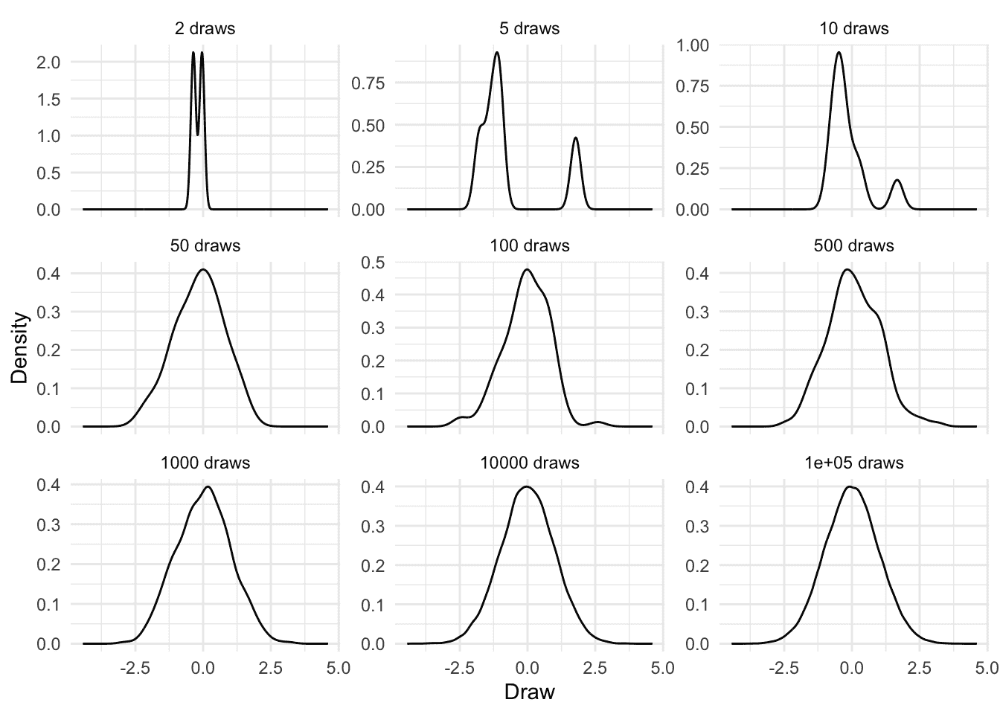

图 12.1：随着抽样次数的增加，正态分布呈现出其熟悉的形状*  *当我们使用简单线性回归时，我们假设我们的关系由变量和参数来表征。如果我们有两个变量，$Y$和$X$，那么我们可以将这些变量之间的线性关系表征为：

$$ Y = \beta_0 + \beta_1 X + \epsilon. \tag{12.1}$$

在这里，有两个参数，也称为系数：截距，$\beta_0$，和斜率，$\beta_1$。在方程 12.1 中，我们说的是当$X$为 0 时，$Y$的期望值是$\beta_0$，并且每当$X$增加一个单位，$Y$的期望值将增加$\beta_1$个单位。然后我们可以将这种关系应用到我们拥有的数据中来估计这些参数。$\epsilon$是噪声，它解释了偏离这种关系的偏差。我们通常假设这种噪声是正态分布的，这就是导致$Y \sim N(\beta, \sigma²)$的原因。

### 12.2.1 模拟示例：运行时间

为了使这个例子具体化，我们回顾了第九章中的一个例子，关于某人跑五公里所需的时间与跑马拉松所需的时间的比较(图 12.2 (a))。我们指定了 8.4 的关系，因为这大约是五公里跑和马拉松 42.2 公里距离的比率。为了帮助读者，我们再次在此处包含模拟代码。注意，是噪声服从正态分布，而不是变量。我们不需要变量本身服从正态分布，才能使用线性回归。

```r
set.seed(853)

num_observations <- 200
expected_relationship <- 8.4
fast_time <- 15
good_time <- 30

sim_run_data <-
 tibble(
 five_km_time =
 runif(n = num_observations, min = fast_time, max = good_time),
 noise = rnorm(n = num_observations, mean = 0, sd = 20),
 marathon_time = five_km_time * expected_relationship + noise
 ) |>
 mutate(
 five_km_time = round(x = five_km_time, digits = 1),
 marathon_time = round(x = marathon_time, digits = 1)
 ) |>
 select(-noise)
```

```r
base_plot <- 
 sim_run_data |>
 ggplot(aes(x = five_km_time, y = marathon_time)) +
 geom_point(alpha = 0.5) +
 labs(
 x = "Five-kilometer time (minutes)",
 y = "Marathon time (minutes)"
 ) +
 theme_classic()

# Panel (a)
base_plot

# Panel (b)
base_plot +
 geom_smooth(
 method = "lm",
 se = FALSE,
 color = "black",
 linetype = "dashed",
 formula = "y ~ x"
 )

# Panel (c)
base_plot +
 geom_smooth(
 method = "lm",
 se = TRUE,
 color = "black",
 linetype = "dashed",
 formula = "y ~ x"
 )
```

*

(a) 模拟数据的分布

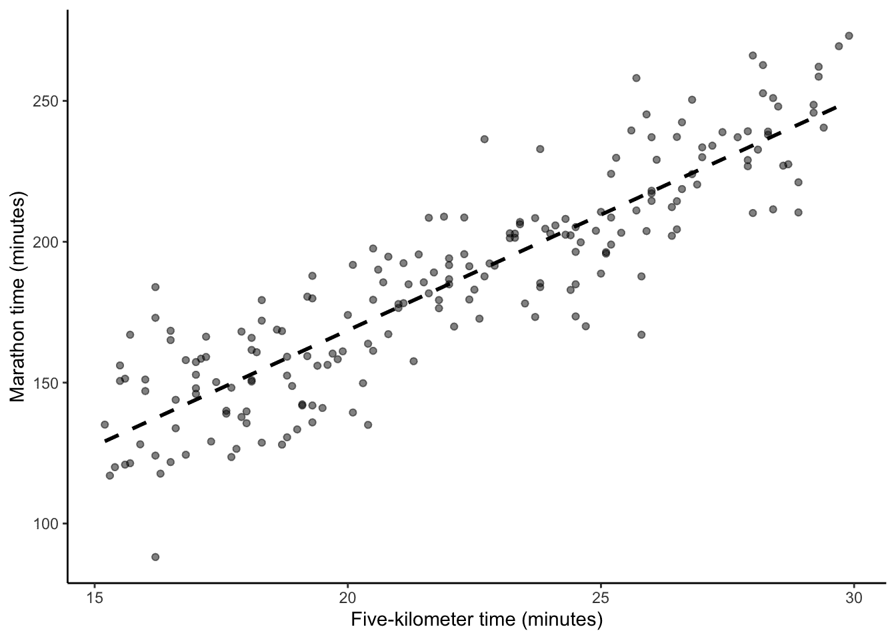

(b) 用一条最佳拟合直线说明隐含的关系

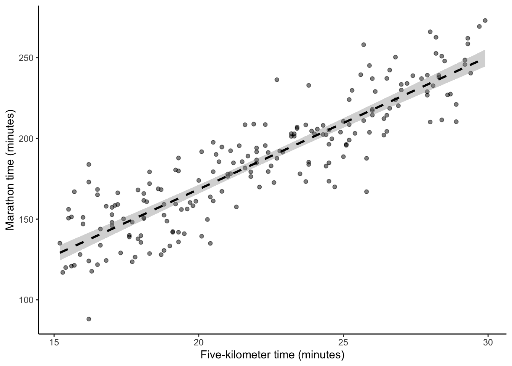

(c) 包含标准误差

图 12.2：五公里跑时间和马拉松时间之间关系的模拟数据

在这个模拟例子中，我们知道 $\beta_0$ 和 $\beta_1$ 的真实值，分别是零和 8.4。但我们的挑战是看看我们是否只能使用数据，以及简单的线性回归，来恢复它们。也就是说，我们能否使用 $x$，即五公里跑的时间，来产生 $y$，即马拉松时间的估计值，我们用 $\hat{y}$ 表示（按照惯例，帽子用于表示这些是，或将是，估计值）([James 等人 [2013] 2021, 61](99-references.html#ref-islr))：

$$\hat{y} = \hat{\beta}_0 + \hat{\beta}_1 x.$$

这涉及到估计 $\beta_0$ 和 $\beta_1$ 的值。但我们应该如何估计这些系数呢？即使我们施加线性关系，也有很多选择，因为可以画出很多直线。但其中一些直线会比其他直线更好地拟合数据。

我们可以定义一条线比另一条线“更好”，如果它尽可能接近每个已知的 $x$ 和 $y$ 组合。我们有很多关于如何定义“尽可能接近”的候选方法，但其中一种是通过最小化残差平方和。为此，我们根据 $x$ 的某些猜测值来产生 $\hat{y}$ 的估计，然后计算出对于每个观察值 $i$，我们有多大的错误([James 等人 [2013] 2021, 62](99-references.html#ref-islr))：

$$e_i = y_i - \hat{y}_i.$$

要计算残差平方和（RSS），我们需要对所有点上的误差进行求和（取平方以考虑负差异）([James 等人 [2013] 2021, 62](99-references.html#ref-islr))：

$$\mbox{RSS} = e²_1+ e²_2 +\dots + e²_n.$$

这导致了一条最佳拟合直线(图 12.2 (b))，但值得反思所有假设和决策，这些假设和决策使我们到达了这一点。

我们使用简单线性回归的基础是相信 $X$ 和 $Y$ 之间存在某种“真实”的关系。并且这是 $X$ 的线性函数。我们不知道，也不可能知道 $X$ 和 $Y$ 之间的“真实”关系。我们所能做的就是用我们的样本来估计它。但由于我们的理解依赖于这个样本，对于每一个可能的样本，我们会得到一个略有不同的关系，这由系数来衡量。

$\epsilon$ 是我们误差的度量——在数据集的小型、封闭世界中，模型不知道什么？但它并没有告诉我们模型是否适合数据集之外（通过类比，想想第八章中引入的实验的内效性和外效性概念）。这需要我们的判断和经验。

我们可以使用来自基础 R 的 `lm()` 函数进行简单线性回归。我们首先指定结果变量，然后是 `~`，接着是预测变量。结果变量是我们感兴趣的变量，而预测变量是我们考虑该变量的基础。最后，我们指定数据集。

在我们运行回归之前，我们可能想要快速检查变量的类别和观测数，以确保它符合我们的预期，尽管我们可能在工作流程的早期已经做过这样的事情。运行之后，我们可能检查我们的估计是否合理。例如，（假设我们自己在模拟中没有强加这个条件）根据我们对五公里跑和马拉松距离的了解，我们预计 $\beta_1$ 应该在六到十之间。

```r
# Check the class and number of observations are as expected
stopifnot(
 class(sim_run_data$marathon_time) == "numeric",
 class(sim_run_data$five_km_time) == "numeric",
 nrow(sim_run_data) == 200
)

sim_run_data_first_model <-
 lm(
 marathon_time ~ five_km_time,
 data = sim_run_data
 )

stopifnot(between(
 sim_run_data_first_model$coefficients[2],
 6,
 10
))
```

为了快速查看回归结果，我们可以使用 `summary()`。

```r
summary(sim_run_data_first_model)
```

```r
 Call:
lm(formula = marathon_time ~ five_km_time, data = sim_run_data)

Residuals:
    Min      1Q  Median      3Q     Max 
-49.289 -11.948   0.153  11.396  46.511 

Coefficients:
             Estimate Std. Error t value Pr(>|t|)    
(Intercept)    4.4692     6.7517   0.662    0.509    
five_km_time   8.2049     0.3005  27.305   <2e-16 

---
Signif. codes:  0 '
' 0.001 '**' 0.01 '*' 0.05 '.' 0.1 ' ' 1

Residual standard error: 17.42 on 198 degrees of freedom
Multiple R-squared:  0.7902,    Adjusted R-squared:  0.7891 
F-statistic: 745.5 on 1 and 198 DF,  p-value: < 2.2e-16
```
但我们也可以使用来自 `modelsummary` 的 `modelsummary()` 函数(表 12.2)。这种方法的优点是我们可以得到一个格式良好的表格。我们最初关注“仅五公里”这一列的结果。

```r
modelsummary(
 list(
 "Five km only" = sim_run_data_first_model,
 "Five km only, centered" = sim_run_data_centered_model
 ),
 fmt = 2
)
```

表 12.2：根据五公里跑时间解释马拉松时间

|  | 仅五公里 | 五公里，中心化 |
| --- | --- | --- |
| (Intercept) | 4.47 | 185.73 |
|  | (6.75) | (1.23) |
| five_km_time | 8.20 |  |
|  | (0.30) |  |
| centered_time |  | 8.20 |
|  |  | (0.30) |
| Num.Obs. | 200 | 200 |
| R2 | 0.790 | 0.790 |
| R2 Adj. | 0.789 | 0.789 |
| AIC | 1714.7 | 1714.7 |
| BIC | 1724.6 | 1724.6 |
| Log.Lik. | -854.341 | -854.341 |
| F | 745.549 | 745.549 |

| RMSE | 17.34 | 17.34 |*   *表 12.2 的上半部分提供了我们的估计系数和括号中的标准误差。下半部分提供了一些有用的诊断信息，我们在这本书中不会过多地讨论。在“仅五公里”列中的截距是与假设的五公里时间为零分钟的马拉松时间相关。希望这个例子说明了始终仔细解释截距系数的必要性。有时甚至可以忽略它。例如，在这种情况下，我们知道截距应该是零，但它被设置为大约四，因为这是所有观察值都在 15 到 30 分钟的五公里时间范围内的最佳拟合。*

当我们使用中心化的五公里时间进行回归分析时，截距变得更加可解释，这是我们在表 12.2 的“仅五公里，中心化”列中进行的。也就是说，对于每个五公里时间，我们减去平均五公里时间。在这种情况下，截距被解释为跑五公里平均时间的跑步者的预期马拉松时间。请注意，斜率估计没有改变，只是截距发生了变化。

```r
sim_run_data <-
 sim_run_data |>
 mutate(centered_time = five_km_time - mean(sim_run_data$five_km_time))

sim_run_data_centered_model <-
 lm(
 marathon_time ~ centered_time,
 data = sim_run_data
 )
```

根据 Gelman、Hill 和 Vehtari（2020，第 84 页）的建议，我们建议将系数视为比较，而不是效应。并且使用明确表明这些是比较的语言，平均而言，基于一个数据集。例如，我们可能会考虑五公里跑步时间系数显示了不同个体之间的差异。当比较我们数据集中五公里跑步时间相差一分钟的个体的马拉松时间时，我们发现他们的马拉松时间平均相差大约八分钟。考虑到马拉松大约是五公里跑步长度的那么多倍，这是有道理的。

我们可以使用`broom`包中的`augment()`函数将拟合值和残差添加到我们的原始数据集中。这允许我们绘制残差图（图 12.3）。

```r
sim_run_data <-
 augment(
 sim_run_data_first_model,
 data = sim_run_data
 )
```

```r
# Plot a)
ggplot(sim_run_data, aes(x = .resid)) +
 geom_histogram(binwidth = 1) +
 theme_classic() +
 labs(y = "Number of occurrences", x = "Residuals")

# Plot b)
ggplot(sim_run_data, aes(x = five_km_time, y = .resid)) +
 geom_point() +
 geom_hline(yintercept = 0, linetype = "dotted", color = "grey") +
 theme_classic() +
 labs(y = "Residuals", x = "Five-kilometer time (minutes)")

# Plot c)
ggplot(sim_run_data, aes(x = marathon_time, y = .resid)) +
 geom_point() +
 geom_hline(yintercept = 0, linetype = "dotted", color = "grey") +
 theme_classic() +
 labs(y = "Residuals", x = "Marathon time (minutes)")

# Plot d)
ggplot(sim_run_data, aes(x = marathon_time, y = .fitted)) +
 geom_point() +
 geom_abline(intercept = 0, slope = 1, linetype = "dashed") +
 theme_classic() +
 labs(y = "Estimated marathon time", x = "Actual marathon time")


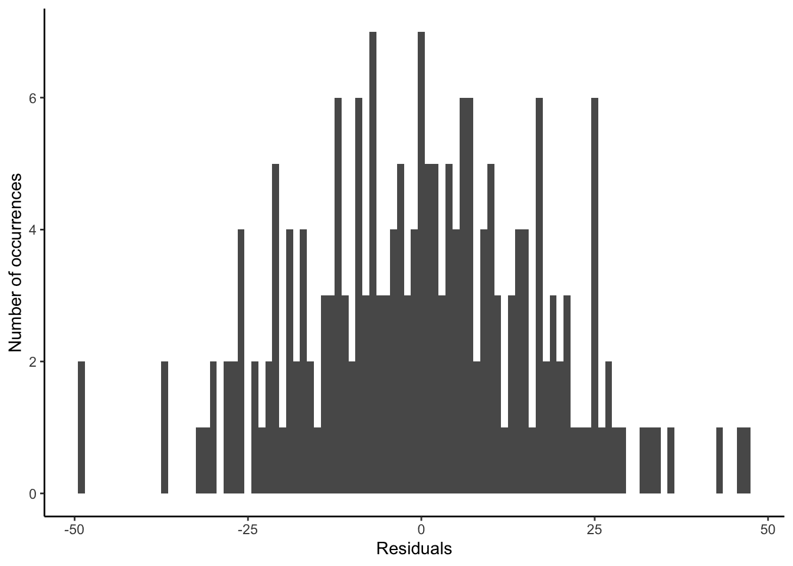*

(a) 残差的分布

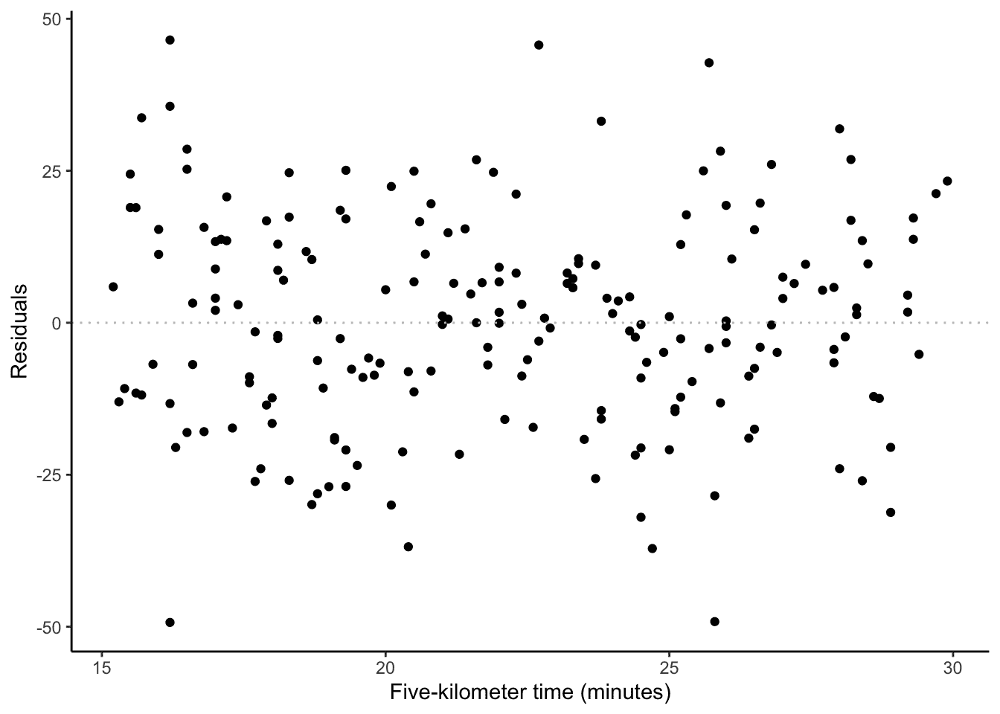*

(b) 按五公里时间计算的残差

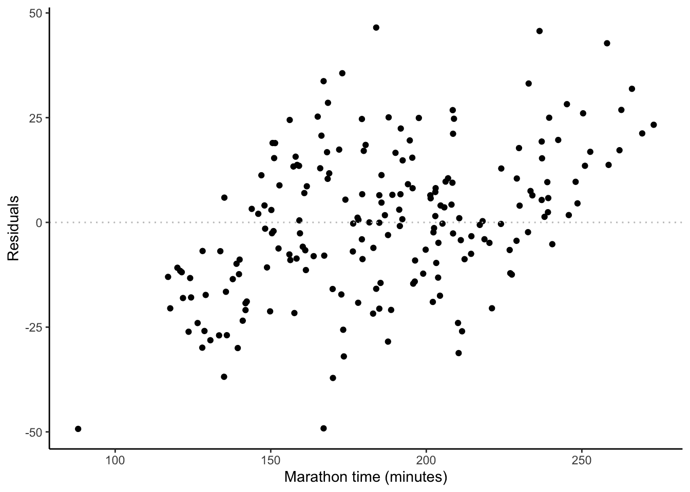*

(c) 按马拉松时间计算的残差

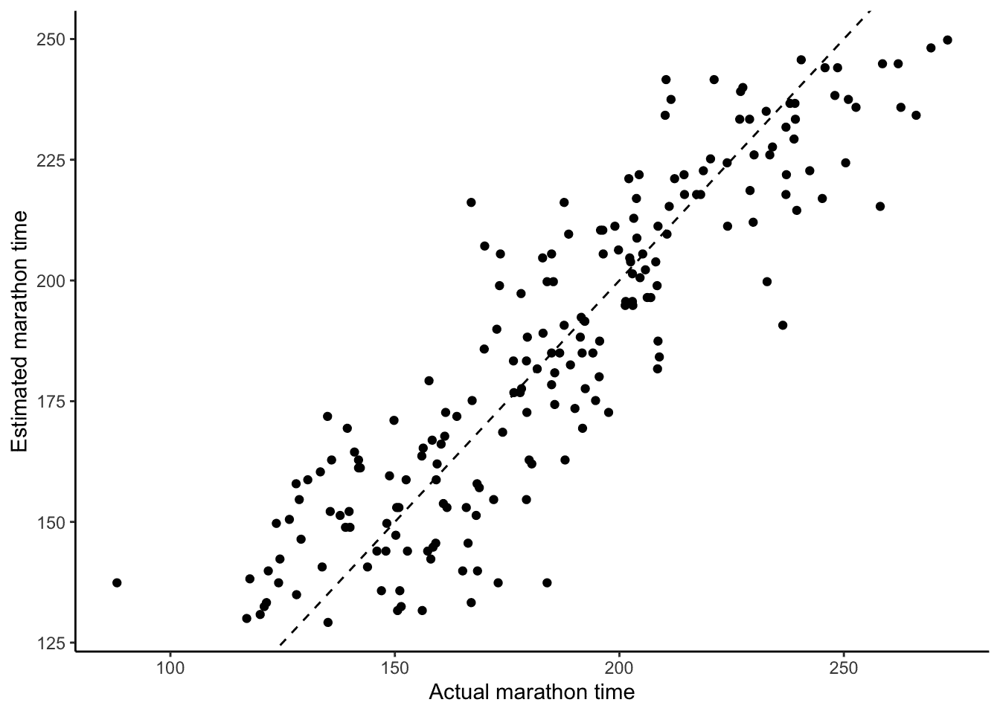*

(d) 比较估计时间与实际时间

图 12.3：基于模拟数据对某人跑五公里和马拉松所需时间的简单线性回归的残差

我们想要尝试表达“真实”的关系，因此我们需要尝试捕捉我们认为我们的理解依赖于我们必须要分析的样本的程度。这就是标准误差发挥作用的地方。它基于许多假设，指导我们如何思考基于我们拥有的数据对参数估计的看法（图 12.2 (c)）。这部分内容部分地被以下事实所捕捉，即标准误差是样本大小$n$的函数，并且随着样本大小的增加，标准误差会减小。

总结系数的不确定性范围的最常见方法是将其标准误差转换为置信区间。这些区间通常被误解为关于系数给定实现的概率陈述（即$\hat\beta$）。实际上，置信区间是一个统计量，其性质只能在“期望”下（这相当于重复实验多次）才能理解。95%置信区间是一个范围，其中“大约有 95%的机会”该范围包含总体参数，这通常是未知的（[James 等人[2013] 2021, 66](99-references.html#ref-islr)）。

当系数遵循正态分布时，95%置信区间的上下限将大约是$\hat{\beta_1} \pm 2 \times \mbox{SE}\left(\hat{\beta_1}\right)$。例如，在马拉松时间示例中，下限是$8.2 - 2 \times 0.3 = 7.6$，上限是$8.2 + 2 \times 0.3 = 8.8$，而真实值（在这个案例中我们只知道，因为我们模拟了它）是 8.4。

我们可以使用这个机制来测试主张。例如，我们可以主张$X$和$Y$之间没有关系，即$\beta_1 = 0$，作为对$X$和$Y$之间存在某种关系的另一种主张，即$\beta_1 \neq 0$。这就是前面提到的零假设检验方法。在第八章中，我们需要决定需要多少证据才能让我们相信我们的茶品鉴师能够区分牛奶和茶哪个先加。同样，在这里，我们需要决定$\beta_1$的估计值，我们称之为$\hat{\beta}_1$，是否足够远离零，以至于我们可以舒适地声称$\beta_1 \neq 0$。如果我们对我们的$\beta_1$的估计非常有信心，那么它不需要太远，但如果我们没有，那么它就必须是显著的。例如，如果置信区间包含零，那么我们就缺乏证据来表明$\beta_1 \neq 0$。$\hat{\beta}_1$的标准误差在这里做了大量的工作，它考虑了各种因素，其中只有一部分它实际上可以解释，正如我们选择需要多少证据才能让我们信服一样。

我们使用这个标准误差和$\hat{\beta}_1$来得到“检验统计量”或 t 统计量：

$$t = \frac{\hat{\beta}_1}{\mbox{SE}(\hat{\beta}_1)}.$$

然后，我们将我们的 t 统计量与 Student 的 t 分布(1908)进行比较，以计算得到这个绝对 t 统计量或更大统计量的概率，如果假设$\beta_1 = 0$成立的话。这个概率就是 p 值。较小的 p 值意味着观察到的“至少与测试统计量一样极端的观察结果”的概率较小 (Gelman, Hill, and Vehtari 2020, 57)。在这里，我们使用 Student 的 t 分布(1908)而不是正态分布，因为 t 分布的尾部比标准正态分布略大。

> 词语！仅仅是词语！多么可怕！多么清晰、生动和残酷！人们无法逃避它们。然而，它们中又有着多么微妙的魔力！它们似乎能够赋予无形之物以形态，并且拥有自己独特的音乐，如同小提琴或鲁特琴般甜美。仅仅是词语！还有什么比词语更真实吗？
> 
> *《道林·格雷的画像》* (Wilde 1891).

在本书中，我们将不会过多地使用 p 值，因为它们是一个具体而微妙的概念。它们难以理解且容易被滥用。尽管它们对“科学推断”只有“一点帮助”，但许多学科却错误地过分依赖它们 (Nelder 1999, 257)。一个问题在于，它们包含了工作流程中的每一个假设，包括所有用于收集和清理数据的内容。虽然如果所有假设都正确，p 值确实有影响，但当考虑到完整的数据科学工作流程时，通常会有大量的假设。而且，p 值并不能指导我们是否满足了这些假设 (Greenland et al. 2016, 339)。

p 值可能会因为零假设是错误的而拒绝零假设，但也可能是某些数据收集或准备不当。只有当所有其他假设都正确时，我们才能确信 p 值反映了我们感兴趣测试的假设。使用 p 值本身并没有错，但重要的是要以复杂和深思熟虑的方式使用它们。Cox (2018)讨论了这需要什么。

在一个容易看到对 p 值不适当关注的例子中是功效分析。在统计意义上，功效指的是拒绝一个错误假设的概率。由于功效与假设检验相关，它也与样本量相关。人们常常担心研究“功效不足”，意味着样本量不够大，但很少担心，比如说，数据被不适当地清理了，尽管我们仅凭 p 值无法区分这些情况。正如 Meng (2018) 和 Bradley 等人 (2021) 所证明的，对功效的关注可能会使我们忽视确保我们的数据高质量的职责。

巨人的肩膀* *Nancy Reid 博士是多伦多大学统计科学系的大学教授。1979 年，她在斯坦福大学获得统计学博士学位后，在伦敦帝国理工学院担任博士后研究员。1980 年，她在不列颠哥伦比亚大学被任命为助理教授，然后于 1986 年搬到多伦多大学，在那里她于 1988 年被提升为全职教授，并在 1997 年至 2002 年期间担任系主任 (Staicu 2017)。她的研究专注于在小样本情况下获得准确的推断，并开发具有难以处理的似然函数的复杂模型的推断程序。Cox 和 Reid (1987) 研究了重新参数化模型如何简化推断，Varin、Reid 和 Firth (2011) 概述了近似难以处理的似然函数的方法，Reid (2003) 概述了小样本情况下的推断程序。Reid 博士获得了 1992 年的 COPSS 总统奖、2016 年的皇家统计学会银质 Guy 奖章和 2022 年的金质 Guy 奖章，以及 2022 年的 COPSS 杰出成就奖和讲座奖。
  
## 12.3 多元线性回归

到目前为止，我们只考虑了一个解释变量。但通常我们会考虑不止一个。一种方法是为每个解释变量运行单独的回归分析。但与为每个变量单独进行线性回归相比，增加更多的解释变量允许在调整其他解释变量的同时评估结果变量与感兴趣预测变量之间的关联。结果可能会有很大不同，尤其是当解释变量之间相互关联时。

我们还可能希望考虑非连续的解释变量。例如：怀孕与否；白天或夜晚。当只有两种选择时，我们可以使用二元变量，这被视为 0 或 1。如果我们有一列只有两个值的字符值，例如：`c("Myles", "Ruth", "Ruth", "Myles", "Myles", "Ruth")`，那么在通常的回归设置中将它用作解释变量意味着它被视为二元变量。如果有超过两个级别，那么我们可以使用二元变量的组合，其中一些基线结果被整合到截距中。

### 12.3.1 模拟示例：有雨和湿度的跑步时间

作为例子，我们将是否下雨添加到我们模拟的马拉松和五公里跑步时间之间的关系中。然后我们指定，如果下雨，个体会比没有下雨时慢十分钟。

```r
slow_in_rain <- 10

sim_run_data <-
 sim_run_data |>
 mutate(was_raining = sample(
 c("Yes", "No"),
 size = num_observations,
 replace = TRUE,
 prob = c(0.2, 0.8)
 )) |>
 mutate(
 marathon_time = if_else(
 was_raining == "Yes",
 marathon_time + slow_in_rain,
 marathon_time
 )
 ) |>
 select(five_km_time, marathon_time, was_raining)
```

我们可以使用`+`向`lm()`函数添加额外的解释变量。同样，我们将包括一系列针对类别和观测数目的快速测试，并添加一个关于缺失值的测试。我们可能不知道雨的系数应该是多少，但如果我们预期它不会使它们更快，那么我们也可以添加一个测试，使用广泛的非负值区间。

```r
stopifnot(
 class(sim_run_data$marathon_time) == "numeric",
 class(sim_run_data$five_km_time) == "numeric",
 class(sim_run_data$was_raining) == "character",
 all(complete.cases(sim_run_data)),
 nrow(sim_run_data) == 200
)

sim_run_data_rain_model <-
 lm(
 marathon_time ~ five_km_time + was_raining,
 data = sim_run_data
 )

stopifnot(
 between(sim_run_data_rain_model$coefficients[3], 0, 20)
 )

summary(sim_run_data_rain_model)
```

```r
 Call:
lm(formula = marathon_time ~ five_km_time + was_raining, data = sim_run_data)

Residuals:
    Min      1Q  Median      3Q     Max 
-50.760 -11.942   0.471  11.719  46.916 

Coefficients:
               Estimate Std. Error t value Pr(>|t|)    
(Intercept)      3.8791     6.8385   0.567 0.571189    
five_km_time     8.2164     0.3016  27.239  < 2e-16 

was_rainingYes  11.8753     3.2189   3.689 0.000291 

---
Signif. codes:  0 '
' 0.001 '**' 0.01 '*' 0.05 '.' 0.1 ' ' 1

Residual standard error: 17.45 on 197 degrees of freedom
Multiple R-squared:  0.791, Adjusted R-squared:  0.7889 
F-statistic: 372.8 on 2 and 197 DF,  p-value: < 2.2e-16


结果，在表 12.3 的第二列显示，当我们比较数据集中下雨跑步和没有下雨的人时，下雨的人往往跑得慢。这与我们查看数据图（图 12.4 (a)）时预期的相符。

我们在这里包括了两种类型的测试。在`lm()`之前运行的检查输入，以及在`lm()`之后运行的检查输出。我们可能会注意到一些输入检查与之前相同。避免多次重写测试的一种方法是将`testthat`安装并加载到名为“class_tests.R”的 R 文件中，创建一系列针对类别的测试，然后使用`test_file()`调用。

例如，我们可以将以下内容保存为“test_class.R”，在一个专门的测试文件夹中。

```r
test_that("Check class", {
 expect_type(sim_run_data$marathon_time, "double")
 expect_type(sim_run_data$five_km_time, "double")
 expect_type(sim_run_data$was_raining, "character")
})
```

我们可以将以下内容保存为“test_observations.R”。

```r
test_that("Check number of observations is correct", {
 expect_equal(nrow(sim_run_data), 200)
})

test_that("Check complete", {
 expect_true(all(complete.cases(sim_run_data)))
})
```

最后，我们可以将以下内容保存为“test_coefficient_estimates.R”。

```r
test_that("Check coefficients", {
 expect_gt(sim_run_data_rain_model$coefficients[3], 0)
 expect_lt(sim_run_data_rain_model$coefficients[3], 20)
})
```

然后我们可以更改回归代码，使其调用这些测试文件，而不是全部写出来。

```r
test_file("tests/test_observations.R")
test_file("tests/test_class.R")

sim_run_data_rain_model <-
 lm(
 marathon_time ~ five_km_time + was_raining,
 data = sim_run_data
 )

test_file("tests/test_coefficient_estimates.R")
```

在检查系数时，我们必须清楚我们想要寻找什么。当我们模拟数据时，我们为数据可能看起来像什么放置合理的猜测，并且我们测试的也是类似的合理猜测。失败的测试不一定是返回并更改事物的理由，而是一个提醒，要查看两者中发生的事情，并在必要时可能更新测试。

除了想要包含额外的解释变量外，我们还可能认为它们彼此相关。例如，如果那天也是潮湿的，那么下雨可能真的很重要。我们对湿度和温度感兴趣，但还想知道这两个变量如何相互作用(图 12.4 (b))。我们可以通过在指定模型时使用`*`而不是`+`来实现这一点。当我们以这种方式交互变量时，我们几乎总是需要包括单个变量，而`lm()`会默认这样做。结果包含在表 12.3 的第三列中。

```r
slow_in_humidity <- 15

sim_run_data <- sim_run_data |>
 mutate(
 humidity = sample(c("High", "Low"), size = num_observations, 
 replace = TRUE, prob = c(0.2, 0.8)),
 marathon_time = 
 marathon_time + if_else(humidity == "High", slow_in_humidity, 0),
 weather_conditions = case_when(
 was_raining == "No" & humidity == "Low" ~ "No rain, not humid",
 was_raining == "Yes" & humidity == "Low" ~ "Rain, not humid",
 was_raining == "No" & humidity == "High" ~ "No rain, humid",
 was_raining == "Yes" & humidity == "High" ~ "Rain, humid"
 )
 )
```

```r
base <-
 sim_run_data |>
 ggplot(aes(x = five_km_time, y = marathon_time)) +
 labs(
 x = "Five-kilometer time (minutes)",
 y = "Marathon time (minutes)"
 ) +
 theme_classic() +
 scale_color_brewer(palette = "Set1") +
 theme(legend.position = "bottom")

base +
 geom_point(aes(color = was_raining)) +
 geom_smooth(
 aes(color = was_raining),
 method = "lm",
 alpha = 0.3,
 linetype = "dashed",
 formula = "y ~ x"
 ) +
 labs(color = "Was raining")

base +
 geom_point(aes(color = weather_conditions)) +
 geom_smooth(
 aes(color = weather_conditions),
 method = "lm",
 alpha = 0.3,
 linetype = "dashed",
 formula = "y ~ x"
 ) +
 labs(color = "Conditions")
```

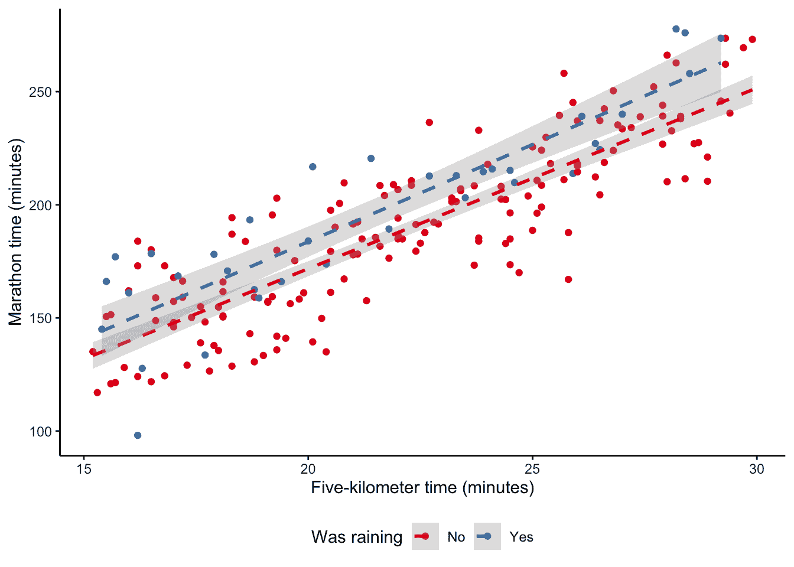

(a) 只有是否下雨

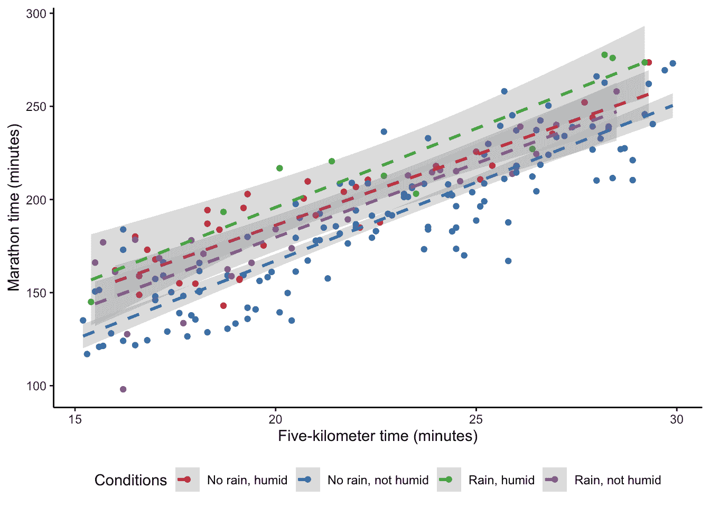

(b) 是否下雨和湿度水平

图 12.4：基于天气的模拟数据对某人跑五公里和马拉松所需时间的简单线性回归*  ```r
sim_run_data_rain_and_humidity_model <-
 lm(
 marathon_time ~ five_km_time + was_raining * humidity,
 data = sim_run_data
 )

modelsummary(
 list(
 "Five km only" = sim_run_data_first_model,
 "Add rain" = sim_run_data_rain_model,
 "Add humidity" = sim_run_data_rain_and_humidity_model
 ),
 fmt = 2
)
```

表 12.3：根据五公里跑时间和天气特征解释马拉松成绩

|  | 五公里跑 | 添加降雨 | 添加湿度 |
| --- | --- | --- | --- |
| (Intercept) | 4.47 | 3.88 | 20.68 |
|  | (6.75) | (6.84) | (7.12) |
| five_km_time | 8.20 | 8.22 | 8.24 |
|  | (0.30) | (0.30) | (0.31) |
| was_rainingYes |  | 11.88 | 11.00 |
|  |  | (3.22) | (6.36) |
| humidityLow |  |  | -18.01 |
|  |  |  | (3.45) |
| was_rainingYes × humidityLow |  |  | 0.92 |
|  |  |  | (7.47) |
| Num.Obs. | 200 | 200 | 200 |
| R2 | 0.790 | 0.791 | 0.795 |
| R2 Adj. | 0.789 | 0.789 | 0.791 |
| AIC | 1714.7 | 1716.3 | 1719.4 |
| BIC | 1724.6 | 1729.5 | 1739.2 |
| Log.Lik. | -854.341 | -854.169 | -853.721 |
| F | 745.549 | 372.836 | 189.489 |

| RMSE | 17.34 | 17.32 | 17.28 |*  *线性回归估计的有效性存在各种威胁，需要考虑的方面，尤其是当使用不熟悉的数据库时。当我们使用它时，我们需要解决这些问题，通常图表和相关文本足以减轻大多数问题。需要关注的方面包括：

1.  解释变量的线性。我们关心预测变量是否以线性方式进入。我们可以通过使用变量的图来说服自己，我们的解释变量在我们的目的上通常有足够的线性。 

1.  错误的同方差性。我们担心误差在整个样本中不是系统地变大或变小。如果发生这种情况，我们称之为异方差性。同样，错误图，如图 12.3 (b)，被用来让我们相信这一点。

1.  错误的独立性。我们担心误差之间不是相互独立的。例如，如果我们对与天气相关的测量感兴趣，比如平均每日温度，那么我们可能会发现一个模式，因为某一天的温度很可能与另一天的温度相似。我们可以通过查看残差与观测值相比，例如图 12.3(c)，或者估计值与实际结果相比，例如图 12.3(d)，来确信我们已经满足了这一条件。

1.  异常值和其他高影响观测。最后，我们可能会担心我们的结果是由少数观测驱动的。例如，回想一下第五章和安斯康姆的四重奏，我们会注意到线性回归估计会受到包含一个或两个特定点的影响。通过考虑我们的分析在各个子集上的情况，我们可以对此感到满意。例如，随机移除一些观测，就像我们在第十一章中对美国各州所做的那样。

这些方面是统计问题，与模型是否有效相关。对有效性构成的最重要威胁，因此必须详细解决的问题，是模型是否直接与感兴趣的研究问题相关。

巨人的肩膀* *丹妮拉·维滕博士是华盛顿大学数学统计学的多萝西·吉尔福德捐赠教授和统计学与生物统计学教授。2010 年从斯坦福大学获得统计学博士学位后，她作为助理教授加入了华盛顿大学。2018 年晋升为正教授。她研究的一个活跃领域是双重抽样，专注于样本分割的影响(高、比恩和维滕 2022)。她是影响深远的*统计学习导论*([詹姆斯等人 [2013] 2021](99-references.html#ref-islr))的作者。维滕于 2020 年被任命为美国统计协会会员，并在 2022 年获得了 COPSS 总统奖。
  
## 12.4 构建模型

Breiman (2001) 描述了统计建模的两种文化：一种侧重于推断，另一种侧重于预测。一般来说，在 Breiman (2001) 发表的大约同一时期，各个学科倾向于关注推断或预测。例如，Jordan (2004) 描述了统计学和计算机科学曾经是分开的，但每个领域的目标正变得越来越接近。数据科学的兴起，尤其是机器学习的出现，意味着现在需要适应两者(Neufeld and Witten 2021)。这两种文化正在被拉近，预测和推断之间有重叠和互动。但它们各自的发展意味着仍然存在相当大的文化差异。作为这一点的微小例子，术语“机器学习”在计算机科学中较为常见，而术语“统计学习”在统计学中较为常见，尽管它们通常指的是相同的机制。

在本书中，我们将专注于使用概率编程语言 Stan 在贝叶斯框架中拟合模型，并通过 `rstanarm` 与其接口。推断和预测有不同的文化、生态系统和优先级。你应该努力在这两方面都感到舒适。这些不同文化的一种表现方式是语言选择。本书的主要语言是 R，为了保持一致性，我们在这里关注它。但有一个广泛的文化，特别是但不仅限于预测，它使用 Python。我们建议最初只关注一种语言和方法，但在熟悉了这种初始语言后，变得多语言是非常重要的。我们在在线附录 14 中介绍了基于 Python 的预测。

我们将再次不深入细节，但在贝叶斯框架下运行回归与支撑 `lm()` 的频率主义方法类似。从回归的角度来看，主要的不同之处在于模型中涉及的参数（即 $\beta_0$, $\beta_1$ 等）被视为随机变量，因此它们自身具有相关的概率分布。相比之下，频率主义范式假设这些系数的任何随机性都来自对误差项 $\epsilon$ 分布的参数假设。

在我们以贝叶斯框架运行回归之前，我们需要为这些参数中的每一个决定一个起始概率分布，我们称之为“先验”。虽然先验的存在增加了一些额外的复杂性，但它有几个优点，我们将在下面更详细地讨论先验的问题。这也是本书所倡导的工作流程的另一个原因：模拟阶段直接导致先验。我们再次指定我们感兴趣的模型，但这次我们包括了先验。

$$ \begin{aligned} y_i|\mu_i, \sigma &\sim \mbox{Normal}(\mu_i, \sigma) \\ \mu_i &= \beta_0 +\beta_1x_i\\ \beta_0 &\sim \mbox{Normal}(0, 2.5) \\ \beta_1 &\sim \mbox{Normal}(0, 2.5) \\ \sigma &\sim \mbox{Exponential}(1) \\ \end{aligned} $$

我们将数据中的信息与先验结合起来，以获得参数的后验分布。然后，基于后验分布的分析进行推断。

与我们迄今为止所采用的方法相比，贝叶斯方法的一个不同之处在于，贝叶斯模型通常需要更长的时间来运行。正因为如此，将模型在单独的 R 脚本中运行并使用`saveRDS()`保存它可能是有用的。通过合理的 Quarto 块选项“eval”和“echo”（见第三章），模型可以通过`readRDS()`而不是每次编译论文时都运行来被读入 Quarto 文档。这样，对于给定的模型，模型延迟只会被施加一次。在模型的末尾添加`beepr`中的`beep()`，当模型完成后可以得到音频通知。

```r
sim_run_data_first_model_rstanarm <-
 stan_glm(
 formula = marathon_time ~ five_km_time + was_raining,
 data = sim_run_data,
 family = gaussian(),
 prior = normal(location = 0, scale = 2.5),
 prior_intercept = normal(location = 0, scale = 2.5),
 prior_aux = exponential(rate = 1),
 seed = 853
 )

beep()

saveRDS(
 sim_run_data_first_model_rstanarm,
 file = "sim_run_data_first_model_rstanarm.rds"
)
```

```r
sim_run_data_first_model_rstanarm <-
 readRDS(file = "sim_run_data_first_model_rstanarm.rds")
```

我们使用`stan_glm()`的“gaussian()”族来指定多元线性回归，模型公式与基础 R 和`rstanarm`的写法相同。我们明确添加了默认先验，尽管严格来说这不是必需的，但我们认为这是一种良好的实践。

表 12.4 的第一列中的估计结果并不完全符合我们的预期。例如，马拉松时间的增加速度估计为每分钟增加五公里时间大约三分钟，考虑到五公里跑与马拉松距离的比例，这似乎有点低。

### 12.4.1 选择先验

选择先验的问题是一个具有挑战性的问题，也是广泛研究的话题。为了本书的目的，使用`rstanarm`的默认值是可以的。但即使它们只是默认值，先验也应该在模型中明确指定并包含在函数中。这是为了使其他人清楚已经做了什么。我们可以使用`default_prior_intercept()`和`default_prior_coef()`在`rstanarm`中找到默认先验，然后明确地将它们包含在模型中。

发现难以确定先验是很正常的。通过修改他人的`rstanarm`代码开始是完全可以接受的。如果他们没有指定先验，那么我们可以使用辅助函数`prior_summary()`来找出使用了哪些先验。

```r
prior_summary(sim_run_data_first_model_rstanarm)
```

```r
Priors for model 'sim_run_data_first_model_rstanarm' 
------
Intercept (after predictors centered)
 ~ normal(location = 0, scale = 2.5)

Coefficients
 ~ normal(location = [0,0], scale = [2.5,2.5])

Auxiliary (sigma)
 ~ exponential(rate = 1)
------
See help('prior_summary.stanreg') for more details
```
我们在涉及任何数据之前，对先验信息所暗示的内容感兴趣。我们通过实施先验预测检查来完成这项工作。这意味着从先验分布中进行模拟，以查看模型对解释变量和结果变量之间可能的大小和方向关系的暗示。这个过程与我们迄今为止所做的一切模拟没有区别。

```r
draws <- 1000

priors <-
 tibble(
 sigma = rep(rexp(n = draws, rate = 1), times = 16),
 beta_0 = rep(rnorm(n = draws, mean = 0, sd = 2.5), times = 16),
 beta_1 = rep(rnorm(n = draws, mean = 0, sd = 2.5), times = 16),
 five_km_time = rep(15:30, each = draws),
 mu = beta_0 + beta_1 * five_km_time
 ) |>
 rowwise() |>
 mutate(
 marathon_time = rnorm(n = 1, mean = mu, sd = sigma)
 )
```

```r
priors |>
 ggplot(aes(x = marathon_time)) +
 geom_histogram(binwidth = 10) +
 theme_classic()

priors |>
 ggplot(aes(x = five_km_time, y = marathon_time)) +
 geom_point(alpha = 0.1) +
 theme_classic()
```

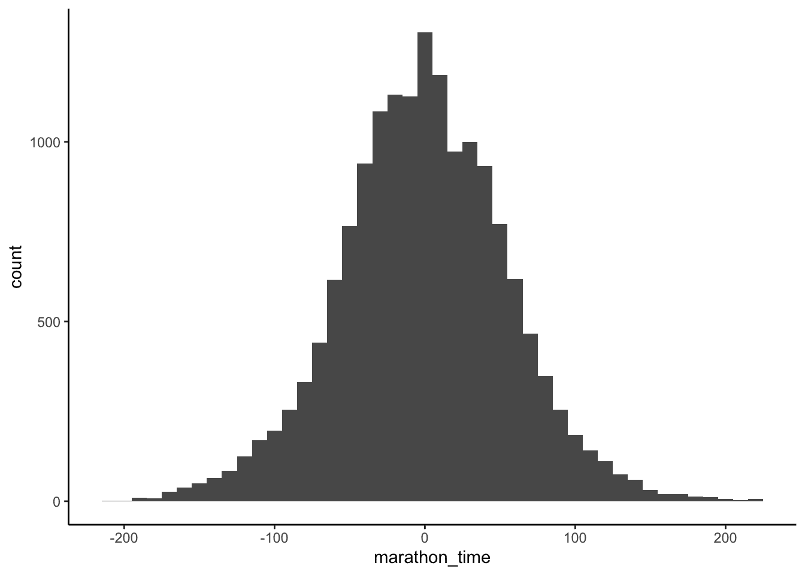

(a) 推断出的马拉松时间分布

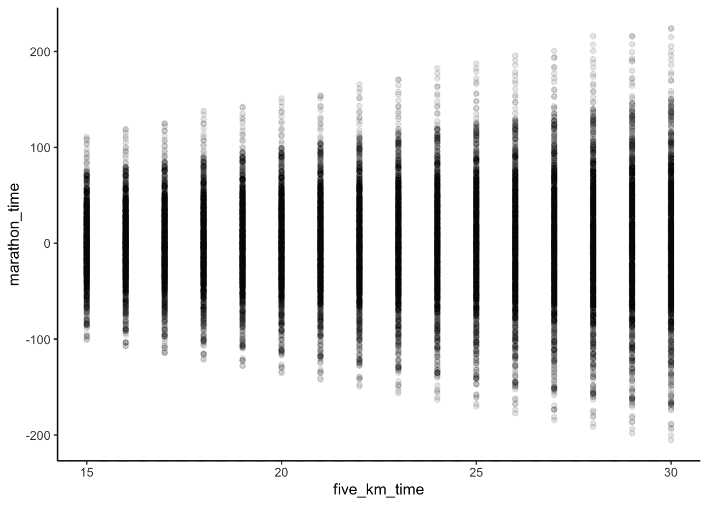

(b) 5 公里和马拉松时间的关系

图 12.5：使用先验信息的一些含义

图 12.5 表明我们的模型构建得不好。不仅存在世界纪录的马拉松时间，还存在负的马拉松时间！一个问题是我们对$\beta_1$的先验没有包含我们所知道的所有信息。我们知道马拉松大约是五公里跑的八倍长，因此我们可以将$\beta_1$的先验集中在这一点上。我们重新指定的模型是：

$$ \begin{aligned} y_i|\mu_i, \sigma &\sim \mbox{Normal}(\mu_i, \sigma) \\ \mu_i &= \beta_0 +\beta_1x_i\\ \beta_0 &\sim \mbox{Normal}(0, 2.5) \\ \beta_1 &\sim \mbox{Normal}(8, 2.5) \\ \sigma &\sim \mbox{Exponential}(1) \\ \end{aligned} $$ 我们可以从先验预测检查中看到，这似乎更加合理（图 12.6）。

```r
draws <- 1000

updated_priors <-
 tibble(
 sigma = rep(rexp(n = draws, rate = 1), times = 16),
 beta_0 = rep(rnorm(n = draws, mean = 0, sd = 2.5), times = 16),
 beta_1 = rep(rnorm(n = draws, mean = 8, sd = 2.5), times = 16),
 five_km_time = rep(15:30, each = draws),
 mu = beta_0 + beta_1 * five_km_time
 ) |>
 rowwise() |>
 mutate(
 marathon_time = rnorm(n = 1, mean = mu, sd = sigma)
 )
```

```r
updated_priors |>
 ggplot(aes(x = marathon_time)) +
 geom_histogram(binwidth = 10) +
 theme_classic()

updated_priors |>
 ggplot(aes(x = five_km_time, y = marathon_time)) +
 geom_point(alpha = 0.1) +
 theme_classic()
```

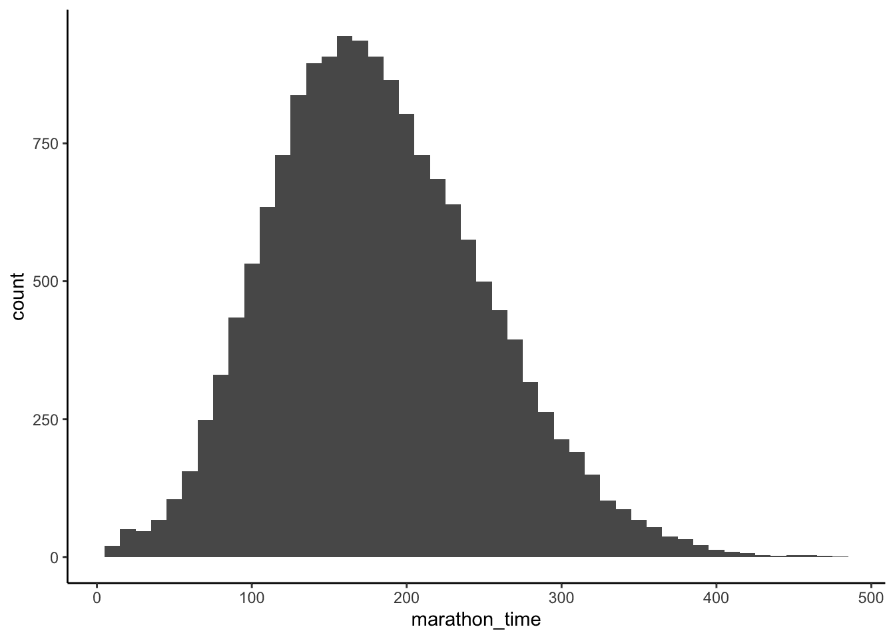

(a) 推断出的马拉松时间分布

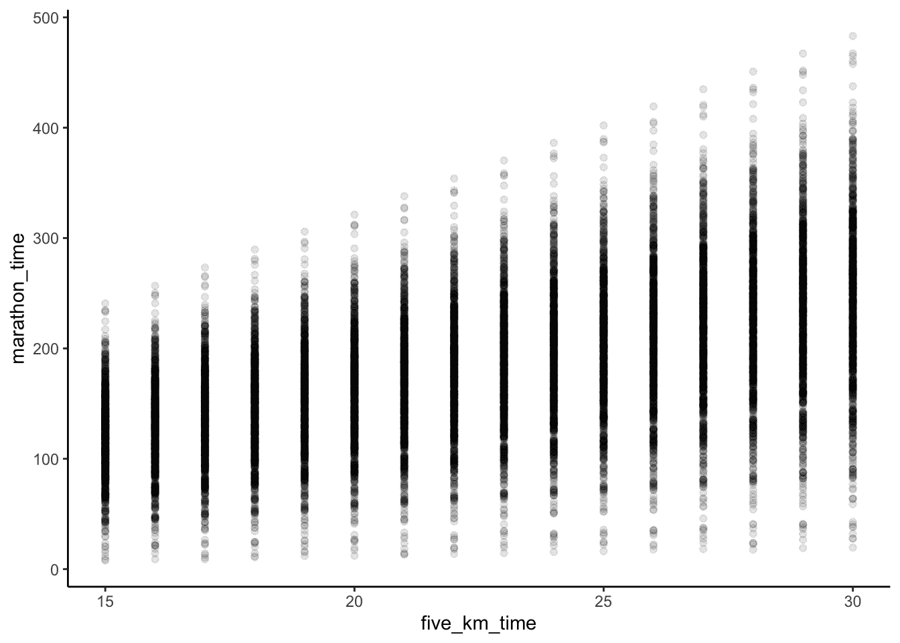

(b) 5 公里和马拉松时间的关系

图 12.6：更新后的先验

如果我们不确定该怎么做，那么`rstanarm`可以帮助我们通过根据数据缩放来改进指定的先验。指定你认为合理的先验，即使这只是默认值，也要将其包含在函数中，但也要包含“autoscale = TRUE”，然后`rstanarm`将调整缩放。当我们用这些更新的先验和允许自动缩放重新运行我们的模型时，我们得到了更好的结果，这些结果在表 12.4 的第二列中。然后你可以将它们添加到写出的模型中。

```r
sim_run_data_second_model_rstanarm <-
 stan_glm(
 formula = marathon_time ~ five_km_time + was_raining,
 data = sim_run_data,
 family = gaussian(),
 prior = normal(location = 8, scale = 2.5, autoscale = TRUE),
 prior_intercept = normal(0, 2.5, autoscale = TRUE),
 prior_aux = exponential(rate = 1, autoscale = TRUE),
 seed = 853
 )

saveRDS(
 sim_run_data_second_model_rstanarm,
 file = "sim_run_data_second_model_rstanarm.rds"
)
```

```r
modelsummary(
 list(
 "Non-scaled priors" = sim_run_data_first_model_rstanarm,
 "Auto-scaling priors" = sim_run_data_second_model_rstanarm
 ),
 fmt = 2
)
```

表 12.4：基于五公里跑时间的马拉松时间预测和解释模型

|  | 未缩放先验 | 自动缩放先验 |
| --- | --- | --- |
| (Intercept) | -67.50 | 8.66 |
| five_km_time | 3.47 | 7.90 |
| was_rainingYes | 0.12 | 9.23 |
| Num.Obs. | 100 | 100 |
| R2 | 0.015 | 0.797 |
| R2 Adj. | -1.000 | 0.790 |
| Log.Lik. | -678.336 | -425.193 |
| ELPD | -679.5 | -429.0 |
| ELPD s.e. | 3.3 | 8.9 |
| LOOIC | 1359.0 | 858.0 |
| LOOIC s.e. | 6.6 | 17.8 |
| WAIC | 1359.0 | 857.9 |

| RMSE | 175.52 | 16.85 |*  *由于我们使用了“autoscale = TRUE”选项，查看如何使用`rstanarm`的`prior_summary()`更新先验可能是有帮助的。

```r
prior_summary(sim_run_data_second_model_rstanarm)
```

```r
Priors for model 'sim_run_data_second_model_rstanarm' 
------
Intercept (after predictors centered)
  Specified prior:
    ~ normal(location = 0, scale = 2.5)
  Adjusted prior:
    ~ normal(location = 0, scale = 95)

Coefficients
  Specified prior:
    ~ normal(location = [8,8], scale = [2.5,2.5])
  Adjusted prior:
    ~ normal(location = [8,8], scale = [ 22.64,245.52])

Auxiliary (sigma)
  Specified prior:
    ~ exponential(rate = 1)
  Adjusted prior:
    ~ exponential(rate = 0.026)
------
See help('prior_summary.stanreg') for more details
```
  
### 12.4.2 后验分布

建立了贝叶斯模型后，我们可能想看看它意味着什么（图 12.7）。一种方法是考虑后验分布。

使用后验分布的一种方法是考虑模型是否很好地拟合了数据。想法是，如果模型很好地拟合了数据，那么后验分布应该能够用来模拟与实际数据类似的数据（Gelman 等人 2020）。我们可以使用`rstanarm`的`pp_check()`实现后验预测检验（图 12.7 (a)）。这比较了实际结果变量与后验分布的模拟。我们可以使用`posterior_vs_prior()`比较后验分布与先验分布，以查看在考虑数据后估计值的变化程度（图 12.7 (b)）。方便的是，`pp_check()`和`posterior_vs_prior()`返回`ggplot2`对象，因此我们可以像处理图形一样修改它们的样式。这些检查和讨论通常只会在论文的主要内容中简要提及，详细内容和图形则添加到专门的附录中。

```r
pp_check(sim_run_data_second_model_rstanarm) +
 theme_classic() +
 theme(legend.position = "bottom")

posterior_vs_prior(sim_run_data_second_model_rstanarm) +
 theme_minimal() +
 scale_color_brewer(palette = "Set1") +
 theme(legend.position = "bottom") +
 coord_flip()
```

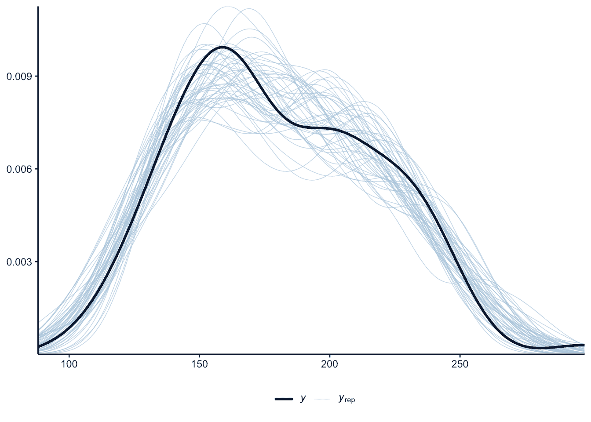

(a) 后验预测检验

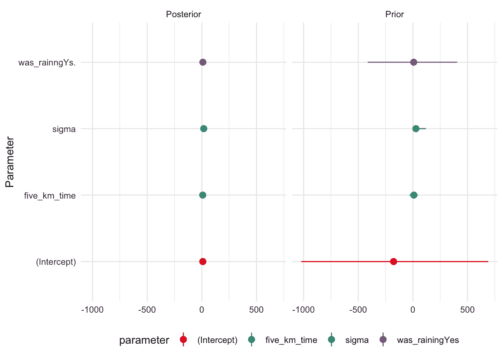

(b) 比较后验分布与先验分布

图 12.7：检查模型如何拟合数据，以及数据如何影响模型

对于这样一个简单的模型，预测方法和推断方法之间的差异很小。但随着模型或数据复杂性的增加，这些差异可能变得很重要。

我们已经讨论了置信区间，而贝叶斯等价于置信区间的称为“可信区间”，它反映了两个点之间有一定概率质量，在这种情况下为 95%。贝叶斯估计为每个系数提供一个分布。这意味着我们可以使用无限多个点来生成这个区间。整个分布应通过图形展示出来（图 12.8）。这可能是通过交叉引用的附录来实现的。

```r
plot(
 sim_run_data_second_model_rstanarm,
 "areas"
)
```

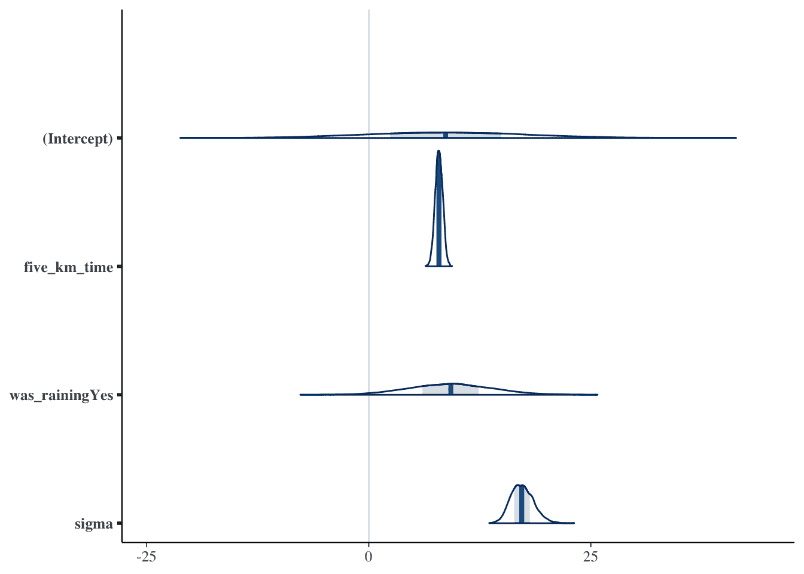

图 12.8：可信区间

### 12.4.3 诊断

我们想要检查的最后一个方面是一个实际问题。`rstanarm`使用一种称为马尔可夫链蒙特卡洛（MCMC）的采样算法来从感兴趣的后续分布中获取样本。我们需要快速检查是否存在算法遇到问题的迹象。我们考虑跟踪图，例如图 12.9 (a)，以及 Rhat 图，例如图 12.9 (b)。这些通常会在交叉引用的附录中。

```r
plot(sim_run_data_second_model_rstanarm, "trace")

plot(sim_run_data_second_model_rstanarm, "rhat")
```


(a) 跟踪图

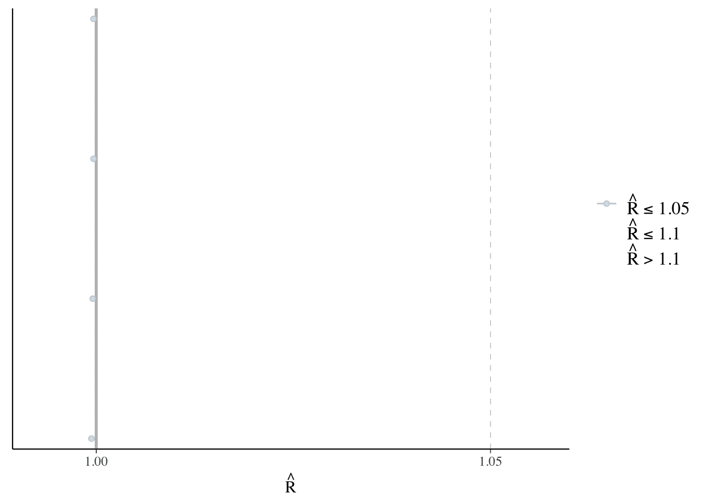

(b) Rhat 图

图 12.9：检查 MCMC 算法的收敛性

在跟踪图中，我们寻找看起来在水平方向上弹跳但重叠良好的线条。图 12.9 (a)中的跟踪图没有显示出任何异常。同样，在 Rhat 图中，我们寻找所有值都接近 1，理想情况下不超过 1.1。再次，图 12.9 (b)是一个没有显示出任何问题的例子。如果这些诊断结果不是这样，那么通过删除或修改预测变量简化模型，改变先验，然后重新运行。

### 12.4.4 并行处理

有时代码运行缓慢是因为计算机需要多次执行相同的事情。我们可能可以利用这一点，并使这些工作能够同时通过并行处理来完成。这在估计贝叶斯模型时尤其如此。

在安装和加载`tictoc`之后，我们可以使用`tic()`和`toc()`来计时代码的各个方面。这对于并行处理很有用，但更普遍地，这有助于我们找出最大的延迟在哪里。

```r
tic("First bit of code")
print("Fast code")
```

```r
[1] "Fast code"
```

```r
toc()
```

```r
First bit of code: 0 sec elapsed
```

```r
tic("Second bit of code")
Sys.sleep(3)
print("Slow code")
```

```r
[1] "Slow code"
```

```r
toc()
```

```r
Second bit of code: 3.008 sec elapsed
```
  
因此我们知道代码中存在某种减慢速度的因素。（在这个人工案例中，是`Sys.sleep()`导致延迟了三秒钟。）

我们可以使用`parallel`，它是基础 R 的一部分，以并行运行函数。我们还可以使用`future`，它带来了额外的功能。在安装和加载`future`之后，我们使用`plan()`来指定我们想要顺序运行（“顺序”）还是并行运行（“多会话”）。然后我们将要应用的内容包裹在`future()`中。

为了看到这个动作的实际效果，我们将创建一个数据集，然后在行级别上实现一个函数。

```r
simulated_data <-
 tibble(
 random_draws = runif(n = 1000000, min = 0, max = 1000) |> round(),
 more_random_draws = runif(n = 1000000, min = 0, max = 1000) |> round()
 )

plan(sequential)

tic()
simulated_data <-
 simulated_data |>
 rowwise() |>
 mutate(which_is_smaller =
 min(c(random_draws,
 more_random_draws)))
toc()

plan(multisession)

tic()
simulated_data <-
 future(simulated_data |>
 rowwise() |>
 mutate(which_is_smaller =
 min(c(
 random_draws,
 more_random_draws
 ))))
toc()
```

顺序方法大约需要 5 秒钟，而多会话方法大约需要 0.3 秒钟。

在估计贝叶斯模型的情况下，许多包如`rstanarm`通过`cores`内置了并行处理的支持。
  
## 12.5 结论

在本章中，我们考虑了线性模型。我们为分析奠定了基础，并描述了一些基本方法。我们还简要地浏览了一些内容。本章和下一章应一起考虑。这些为你提供了足够的起点，但要做得更多，请参阅第十八章中推荐建模书籍。 

## 12.6 练习

### 练习

1.  *(计划)* 考虑以下情景：*一个人对伦敦所有建筑的高度感兴趣。他们在城市里四处走动，计算每座建筑的楼层数，并记录建设年份。* 请绘制出这个数据集可能的样子，然后绘制一个图表来展示所有观测值。

1.  *(模拟)* 进一步考虑所描述的情景，并模拟该情景，包括与楼层数计数相关的三个预测变量。请至少包含基于模拟数据的十个测试。提交一个包含你代码的 GitHub Gist 链接。

1.  *(获取)* 请描述一个可能的此类数据集来源。

1.  *(探索)* 请使用`ggplot2`构建你绘制的图表。然后使用`rstanarm`构建一个以楼层数为结果变量，建设年份为预测变量的模型。提交一个包含你代码的 GitHub Gist 链接。

1.  *(沟通)* 请写两段关于你所做的事情的描述。

### 小测验

1.  请模拟一个有两个预测变量，“种族”和“性别”，以及一个结果变量“投票偏好”，它们与它们不完全相关的情景。提交一个包含你代码的 GitHub Gist 链接。

1.  请写出一个结果变量 Y 与预测变量 X 之间的线性关系。截距项是什么？斜率项是什么？在这些项上添加一个帽子会表示什么？

1.  以下哪些是线性模型的例子（选择所有适用的）？

    1.  `lm(y ~ x_1 + x_2 + x_3, data = my_data)`

    1.  `lm(y ~ x_1 + x_2² + x_3, data = my_data)`

    1.  `lm(y ~ x_1 * x_2 + x_3, data = my_data)`

    1.  `lm(y ~ x_1 + x_1² + x_2 + x_3, data = my_data)`

1.  最小二乘准则是什么？同样，什么是 RSS，我们在运行最小二乘回归时试图做什么？

1.  偏差（在统计背景下）是什么？

1.  考虑五个变量：地球、火、风、水和心。请模拟一个情景，其中心依赖于其他四个变量，而这四个变量是相互独立的。然后请编写 R 代码，以拟合一个线性回归模型来解释心作为其他变量的函数。提交一个包含你代码的 GitHub Gist 链接。

1.  根据 Greenland 等人（2016）的研究，p 值测试（选择一个）：

    1.  关于数据生成方式的所有假设（整个模型），而不仅仅是它打算测试的目标假设（例如，零假设）。

    1.  目标假设是否为真。

    1.  一种二分法，其中结果可以宣布为“统计上显著”。

1.  根据 Greenland 等人(2016)的说法，p 值可能很小，因为（选择所有适用的）：

    1.  目标假设是错误的。

    1.  研究方案被违反了。

    1.  它因其体积小而被选中进行展示。

1.  请仅使用术语本身（即“p-value”）和根据[XKCD Simple Writer](https://xkcd.com/simplewriter/)列出的英语中最常见的 1000 个单词来解释什么是 p 值。（请写一到两段。）

1.  在统计背景下，什么是功效？

1.  查看获得[COPSS 总统奖](https://en.wikipedia.org/wiki/COPSS_Presidents%27_Award)或[金质盖伊奖章](https://en.wikipedia.org/wiki/Guy_Medal)的人的名单，并以本书“巨人的肩膀”条目风格为他们写一篇简短传记。

1.  使用例子和引用，讨论本章开头引用的 McElreath 的话([[2015] 2020, 162](99-references.html#ref-citemcelreath))。至少写三个段落。

### 课堂活动

+   使用[起始文件夹](https://github.com/RohanAlexander/starter_folder)并创建一个新的仓库。

    +   我们对使用`palmerpenguins`理解阿德利企鹅的翅膀长度和深度之间的关系感兴趣。开始时进行草图和模拟。

    +   然后在数据部分添加三个图表：每个变量的一个，以及两个变量之间关系的第三个。

    +   然后在模型部分，写出模型。使用`rstanarm`在 R 脚本中估计两个变量之间的线性模型。

    +   将该模型读入结果部分，并使用`modelsummary`创建一个摘要表。

```r
palmerpenguins::penguins |> 
 filter(species == "Adelie") |> 
 ggplot(aes(x = bill_length_mm, y = bill_depth_mm)) +
 geom_point()
```

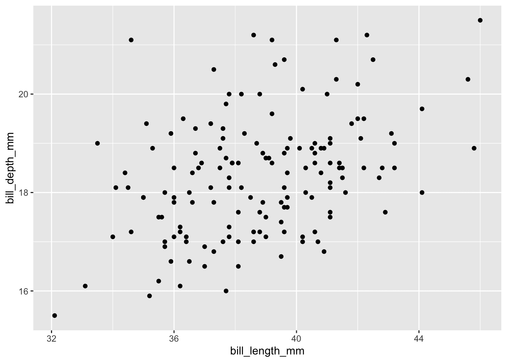*  **   （这个问题基于 Gelman 和 Vehtari(2024, 32)。）请按照[这里](https://youtu.be/_Dof_Ks-f9U)的说明制作一张纸飞机。测量：

    1.  翼的宽度；

    1.  翼的长度；

    1.  翼尖的高度；

    1.  在一个安全的空间里，驾驶你的飞机并测量它在空中停留的时间。

将你的数据与全班其他同学的数据合并到一个类似于表 12.5 的表格中。然后使用线性回归来探索因变量和自变量之间的关系。基于结果，如果你再次做这个练习，你会如何改变你的飞机设计？

表 12.5：关于纸飞机特征与其在空中停留时间之间关系的数据

| 翼展（mm） | 翼长（mm） | 翼尖高度（mm） | 飞行时间（秒） |
| --- | --- | --- | --- |
| ... | ... | ... | ... |

+   想象一下，我们在一个线性回归模型中添加 FIPS 代码作为解释变量，试图解释美国各县的通货膨胀情况。请讨论这可能的效应，以及这是否是一个好主意。你可能需要模拟这种情况来帮助你更清晰地思考。

+   想象一下，我们在一个试图解释每个英国城市和镇流感流行情况的回归模型中添加了经纬度作为解释变量。请讨论这可能的效应，以及这是否是一个好主意。你可能需要模拟这种情况来帮助你更清晰地思考。

+   在莎士比亚的*《朱利叶斯·凯撒》*中，角色凯西乌斯著名地说：

> 亲爱的布鲁图斯，错误不在于我们的星星，
> 
> 但在于我们自己，我们是下属。

请讨论 p 值，回归表中显著性星号（*significance stars*）的常见但可能具有误导性的使用，以及 Ioannidis (2005) 的观点，并参考以下引言。 - 想象一下，方差估计结果为负数。请讨论。

### 任务

假设真实数据生成过程是一个均值为 1，标准差为 1 的正态分布。我们使用某种工具获得了一个包含 1,000 个观测值的样本。模拟以下情况：

1.  我们不知道，仪器中有一个错误，这意味着它最多只能存储 900 个观测值，并在那个点开始覆盖，所以最后的 100 个观测值实际上是前 100 个的重复。

1.  我们雇佣了一名研究助理来清理和准备数据集。在这个过程中，我们不知道，他们意外地将一半的负数抽取改为正数。

1.  他们还意外地改变了介于 1 和 1.1 之间的任何值的十进制点，例如，1 变成 0.1，而 1.1 将变成 0.11。

1.  你最终得到了清理后的数据集，并且你对了解真实数据生成过程的均值是否大于 0 感兴趣。

至少写两页关于你所做的工作以及你所发现的内容。同时讨论这些问题产生的影响，以及你可以采取哪些步骤来确保实际分析有机会识别这些问题。

使用 Quarto，并包含适当的标题、作者、日期、GitHub 仓库链接以及引用来制作草稿。在此之后，请与另一位学生配对并交换你的书面作品。根据他们的反馈进行更新，并在你的论文中提及他们的名字。提交 PDF。

1.  在 20 个样本大小的例子中，我们严格来说应该使用有限样本调整，但由于这不是本书的重点，我们将继续使用通用方法。↩︎

