# 13  广义线性模型

> 原文：[`tellingstorieswithdata.com/13-ijaglm.html`](https://tellingstorieswithdata.com/13-ijaglm.html)

1.  建模

1.  13  广义线性模型

Chapman and Hall/CRC 于 2023 年 7 月出版了这本书。您可以在[这里](https://www.routledge.com/Telling-Stories-with-Data-With-Applications-in-R/Alexander/p/book/9781032134772)购买。*

这个在线版本对印刷版进行了一些更新。与印刷版相匹配的在线版本可在[这里](https://rohanalexander.github.io/telling_stories-published/)找到。
先决条件**

+   阅读 *Regression and Other Stories*, (Gelman, Hill, and Vehtari 2020)

    +   重点关注第十三章“逻辑回归”和第十五章“其他广义线性模型”，它们提供了对广义线性模型的详细指南。

+   阅读 *An Introduction to Statistical Learning with Applications in R*, ([James et al. [2013] 2021](99-references.html#ref-islr))

    +   重点关注第四章“分类”，这是从不同角度对广义线性模型的补充处理。

+   阅读 *We Gave Four Good Pollsters the Same Raw Data. They Had Four Different Results*, (Cohn 2016)

    +   详细描述了在相同数据集的情况下，不同的建模选择会导致不同的预测结果。

关键概念和技能**

+   线性回归可以推广到其他类型的输出变量。

+   当我们有一个二元结果变量时，可以使用逻辑回归。

+   当我们有一个整数计数结果变量时，可以使用泊松回归。一个变体——负二项回归——通常也被考虑，因为其假设条件不那么苛刻。

+   多层次建模是一种可以让我们更好地利用数据的方法。

软件和包**

+   基础 R (R Core Team 2024)

+   `boot` (Canty and Ripley 2021; Davison and Hinkley 1997)

+   `broom.mixed` (Bolker and Robinson 2022)

+   `collapse` (Krantz 2023)

+   `dataverse` (Kuriwaki, Beasley, and Leeper 2023)

+   `gutenbergr` (Johnston and Robinson 2022)

+   `janitor` (Firke 2023)

+   `marginaleffects` (Arel-Bundock 2023)

+   `modelsummary` (Arel-Bundock 2022)

+   `rstanarm` (Goodrich et al. 2023)

+   `tidybayes` (Kay 2022)

+   `tidyverse` (Wickham et al. 2019)

+   `tinytable` (Arel-Bundock 2024)

```r
library(boot)
library(broom.mixed)
library(collapse)
library(dataverse)
library(gutenbergr)
library(janitor)
library(marginaleffects)
library(modelsummary)
library(rstanarm)
library(tidybayes)
library(tidyverse)
library(tinytable)
```

## 13.1 简介

在第十二章中介绍的线性模型在过去一个世纪中已经发生了显著的变化。第八章中提到的弗朗西斯·高尔顿及其同时代人，在 19 世纪末和 20 世纪初认真使用了线性回归。二元结果很快引起了人们的兴趣，并需要特殊处理，导致逻辑回归及其类似方法在 20 世纪中叶得到发展和广泛应用（Cramer 2003）。广义线性模型（GLMs）扩展了允许的输出类型。我们仍然将输出建模为线性函数，但我们的约束较少。输出可以是指数族中的任何东西，常见的选择包括逻辑分布和泊松分布。为了完成一个完整的故事，但转向超出本书范围的方法，GLMs 的进一步推广是广义加性模型（GAMs），其中我们扩展了解释侧的结构。我们仍然将输出变量解释为各种片段的加性函数，但这些片段可以是函数。这个框架是在 20 世纪 90 年代由 Hastie 和 Tibshirani 提出的（1990）。

在广义线性模型方面，本章我们考虑了逻辑回归、泊松回归和负二项回归。但我们还探索了一种与线性模型和广义线性模型都相关的变体：多层次模型。这就是当我们利用数据集中存在的某种分组时的情况。

## 13.2 逻辑回归

线性回归是更好地理解我们数据的有用方法。但它假设一个连续的因变量，可以在实数线上取任何数值。我们希望有一种方法可以在不满足这个条件时使用相同的机制。我们转向逻辑回归和泊松回归来处理二元和计数因变量，它们仍然是线性模型，因为预测变量以线性方式进入。

逻辑回归及其密切的变体在各种环境中都很有用，从选举（Wang et al. 2015）到赛马（Chellel 2018；Bolton and Chapman 1986）。当因变量是二元结果，如 0 或 1，或“是”或“否”时，我们使用逻辑回归。尽管二元因变量的存在可能听起来有限制，但在许多情况下，结果要么自然地落入这种情况，要么可以调整到这种情况。例如，赢或输，可用或不可用，支持或不支持。

这个基础的模型是伯努利分布。结果“1”发生的概率是 $p$，而结果“0”的概率是 $1-p$。我们可以使用 `rbinom()` 函数进行一次试验（“size = 1”）来模拟伯努利分布的数据。

```r
set.seed(853)

bernoulli_example <-
 tibble(draws = rbinom(n = 20, size = 1, prob = 0.1))

bernoulli_example |> pull(draws)
```

```r
 [1] 0 0 0 0 0 0 0 0 0 0 1 0 0 0 0 0 0 0 0 0
```
使用逻辑回归的一个原因是我们将建模一个概率，因此它将在 0 和 1 之间有界。使用线性回归，我们可能会得到这个范围之外的值。逻辑回归的基础是 logit 函数：

$$ \mbox{logit}(x) = \log\left(\frac{x}{1-x}\right). $$ 这会将 0 到 1 之间的值转换到实数线上。例如，`logit(0.1) = -2.2`，`logit(0.5) = 0`，和 `logit(0.9) = 2.2` (图 13.1)。我们称这个为“连接函数”。它将广义线性模型中感兴趣的分布与线性模型中使用的机制联系起来。

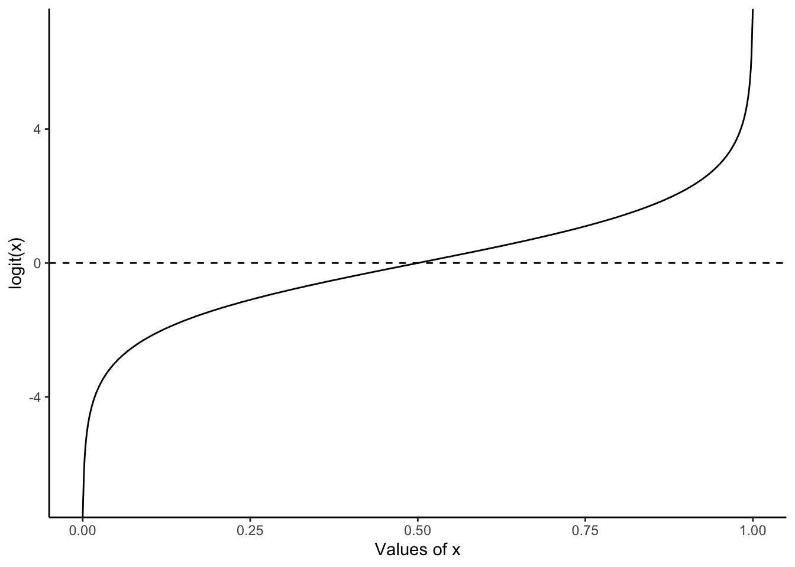

图 13.1：0 到 1 之间值的 logit 函数示例

### 13.2.1 模拟示例：白天或夜晚

为了说明逻辑回归，我们将模拟基于道路上的汽车数量是否为工作日或周末的数据。我们将假设在工作日道路上更繁忙。

```r
set.seed(853)

week_or_weekday <-
 tibble(
 num_cars = sample.int(n = 100, size = 1000, replace = TRUE),
 noise = rnorm(n = 1000, mean = 0, sd = 10),
 is_weekday = if_else(num_cars + noise > 50, 1, 0)
 ) |>
 select(-noise)

week_or_weekday
```

```r
# A tibble: 1,000 × 2
   num_cars is_weekday
      <int>      <dbl>
 1        9          0
 2       64          1
 3       90          1
 4       93          1
 5       17          0
 6       29          0
 7       84          1
 8       83          1
 9        3          0
10       33          1
# ℹ 990 more rows
```
我们可以使用基础 R 中的 `glm()` 函数进行快速估计。在这种情况下，我们将尝试根据我们看到的汽车数量来判断是工作日还是周末。我们感兴趣的是估计 方程 13.1：

$$ \mbox{Pr}(y_i=1) = \mbox{logit}^{-1}\left(\beta_0+\beta_1 x_i\right) \tag{13.1}$$

其中 $y_i$ 表示是否为工作日，而 $x_i$ 表示道路上的汽车数量。

```r
week_or_weekday_model <-
 glm(
 is_weekday ~ num_cars,
 data = week_or_weekday,
 family = "binomial"
 )

summary(week_or_weekday_model)
```

```r
 Call:
glm(formula = is_weekday ~ num_cars, family = "binomial", data = week_or_weekday)

Coefficients:
            Estimate Std. Error z value Pr(>|z|)    
(Intercept) -9.48943    0.74492  -12.74   <2e-16 

num_cars     0.18980    0.01464   12.96   <2e-16 

---
Signif. codes:  0 '
' 0.001 '**' 0.01 '*' 0.05 '.' 0.1 ' ' 1

(Dispersion parameter for binomial family taken to be 1)

    Null deviance: 1386.26  on 999  degrees of freedom
Residual deviance:  337.91  on 998  degrees of freedom
AIC: 341.91

Number of Fisher Scoring iterations: 7
```
汽车数量的估计系数为 0.19。逻辑回归中的系数解释比线性回归更复杂，因为它们与二元结果的 log-odds 变化相关。例如，0.19 的估计是观察到道路上多一辆车时，工作日 log-odds 的平均变化。系数是正的，这意味着增加。由于它是非线性的，如果我们想要指定特定的变化，那么这将在不同的观测基线水平上有所不同。也就是说，当基线 log-odds 为 0 时，0.19 log-odds 的增加比基线 log-odds 为 2 时的影响更大。

我们可以将我们的估计转换为给定汽车数量的工作日概率。我们可以使用 `marginaleffects` 的 `predictions()` 函数为每个观测值添加隐含的工作日概率。

```r
week_or_weekday_predictions <-
 predictions(week_or_weekday_model) |>
 as_tibble()

week_or_weekday_predictions
```

```r
# A tibble: 1,000 × 8
   rowid estimate  p.value s.value  conf.low conf.high is_weekday num_cars
   <int>    <dbl>    <dbl>   <dbl>     <dbl>     <dbl>      <dbl>    <int>
 1     1 0.000417 1.40e-36   119\.  0.000125   0.00139           0        9
 2     2 0.934    9.33e-27    86.5 0.898      0.959             1       64
 3     3 0.999    1.97e-36   119\.  0.998      1.00              1       90
 4     4 1.00     1.10e-36   119\.  0.999      1.00              1       93
 5     5 0.00190  1.22e-35   116\.  0.000711   0.00508           0       17
 6     6 0.0182   3.34e-32   105\.  0.00950    0.0348            0       29
 7     7 0.998    1.00e-35   116\.  0.996      0.999             1       84
 8     8 0.998    1.42e-35   116\.  0.995      0.999             1       83
 9     9 0.000134 5.22e-37   121\.  0.0000338  0.000529          0        3
10    10 0.0382   1.08e-29    96.2 0.0222     0.0649            1       33
# ℹ 990 more rows
```
然后我们可以绘制模型对每个观测值是工作日的概率图（图 13.2）。这是一个考虑几种不同展示拟合方式的好机会。虽然使用散点图（图 13.2 (a)）是常见的，但这也是一个使用经验累积分布函数（ECDF）（图 13.2 (b)）的机会。

```r
# Panel (a)
week_or_weekday_predictions |>
 mutate(is_weekday = factor(is_weekday)) |>
 ggplot(aes(x = num_cars, y = estimate, color = is_weekday)) +
 geom_jitter(width = 0.01, height = 0.01, alpha = 0.3) +
 labs(
 x = "Number of cars that were seen",
 y = "Estimated probability it is a weekday",
 color = "Was actually weekday"
 ) +
 theme_classic() +
 scale_color_brewer(palette = "Set1") +
 theme(legend.position = "bottom")

# Panel (b)
week_or_weekday_predictions |>
 mutate(is_weekday = factor(is_weekday)) |>
 ggplot(aes(x = num_cars, y = estimate, color = is_weekday)) +
 stat_ecdf(geom = "point", alpha = 0.75) +
 labs(
 x = "Number of cars that were seen",
 y = "Estimated probability it is a weekday",
 color = "Actually weekday"
 ) +
 theme_classic() +
 scale_color_brewer(palette = "Set1") +
 theme(legend.position = "bottom")
```

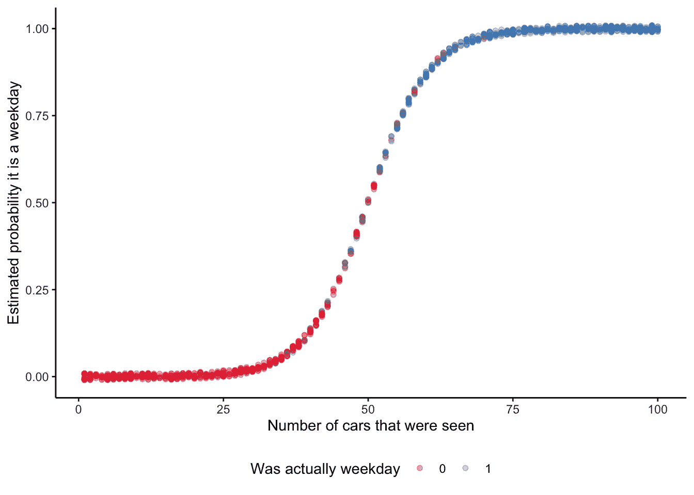

(a) 使用散点图展示拟合情况

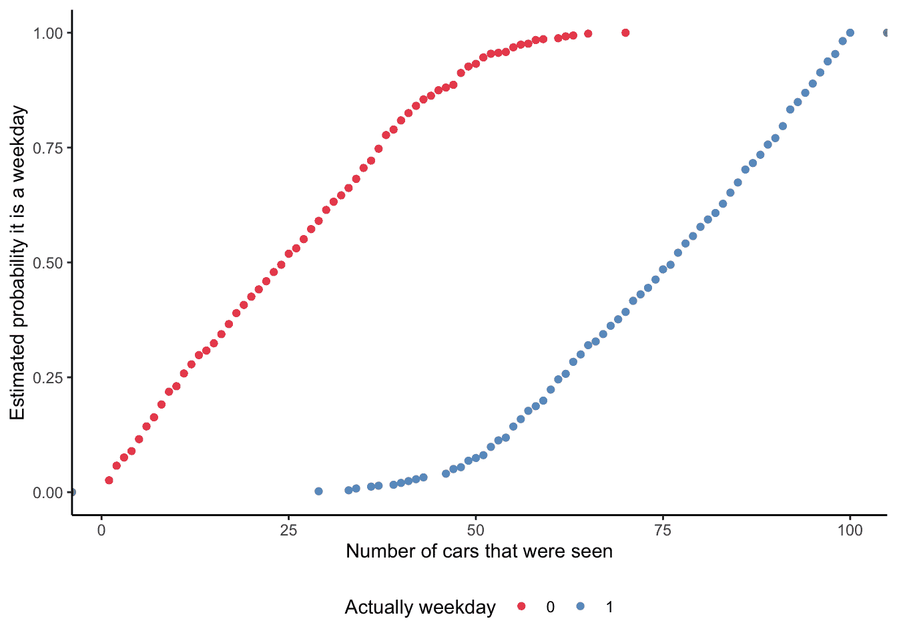

(b) 使用经验累积分布函数(ECDF)展示拟合情况

图 13.2：基于周围车辆数量的模拟数据得到的逻辑回归概率结果

每个观察的边际效应是有趣的，因为它提供了这种概率如何变化的感觉。它使我们能够说，在平均值处（在这种情况下，如果我们看到 50 辆车），如果再看到一辆车，成为工作日的概率将增加近五个百分比（表 13.1）。

```r
slopes(week_or_weekday_model, newdata = "median") |>
 select(term, estimate, std.error) |>
 tt() |> 
 style_tt(j = 1:3, align = "lrr") |> 
 format_tt(digits = 3, num_mark_big = ",", num_fmt = "decimal") |> 
 setNames(c("Term", "Estimate", "Standard error"))
```

表 13.1：另一辆车对成为工作日概率的边际效应，在平均值处

| 项 | 估计值 | 标准误差 |
| --- | --- | --- |

| num_cars | 0.047 | 0.004 |*  *为了更彻底地研究这种情况，我们可能想要使用 `rstanarm` 构建一个贝叶斯模型。正如在第十二章(12-ijalm.html)中所述，我们将为我们的模型指定先验，但这些将只是 `rstanarm` 默认使用的先验：

$$ \begin{aligned} y_i|\pi_i & \sim \mbox{Bern}(\pi_i) \\ \mbox{logit}(\pi_i) & = \beta_0+\beta_1 x_i \\ \beta_0 & \sim \mbox{Normal}(0, 2.5)\\ \beta_1 & \sim \mbox{Normal}(0, 2.5) \end{aligned} $$ 其中 $y_i$ 是是否为工作日（实际上是 0 或 1），$x_i$ 是道路上的车辆数量，而 $\pi_i$ 是观察 $i$ 为工作日的概率。

```r
week_or_weekday_rstanarm <-
 stan_glm(
 is_weekday ~ num_cars,
 data = week_or_weekday,
 family = binomial(link = "logit"),
 prior = normal(location = 0, scale = 2.5, autoscale = TRUE),
 prior_intercept = normal(location = 0, scale = 2.5, autoscale = TRUE),
 seed = 853
 )

saveRDS(
 week_or_weekday_rstanarm,
 file = "week_or_weekday_rstanarm.rds"
)
```

我们贝叶斯模型的结果与我们使用基础(表 13.2)构建的快速模型相似。

```r
modelsummary(
 list(
 "Day or night" = week_or_weekday_rstanarm
 )
)
```

表 13.2：根据道路上的车辆数量解释白天或夜晚

|  | 白天或夜晚 |
| --- | --- | --- |
| (截距) | -9.464 |
| number_of_cars | 0.186 |
| Num.Obs. | 1000 |
| R2 | 0.779 |
| Log.Lik. | -177.899 |
| ELPD | -179.8 |
| ELPD s.e. | 13.9 |
| LOOIC | 359.6 |
| LOOIC s.e. | 27.9 |
| WAIC | 359.6 |

| RMSE | 0.24 |*  *表 13.2 清楚地表明，在这种情况下，每种方法都很相似。它们在看到额外一辆车对成为工作日概率的影响方向上达成一致。甚至估计的影响程度也相似。
  
### 13.2.2 美国的政治支持

逻辑回归常用于政治民意调查领域。在许多情况下，投票意味着需要一种偏好排序，因此问题被简化，无论是否适当，都归结为“支持”或“不支持”。

作为提醒，本书中我们倡导的工作流程是：

$$\mbox{计划} \rightarrow \mbox{模拟} \rightarrow \mbox{获取} \rightarrow \mbox{探索} \rightarrow \mbox{分享}$$

虽然这里的重点是使用模型探索数据，但我们仍需要做其他方面的工作。我们首先从规划开始。在这种情况下，我们感兴趣的是美国政治支持。特别是，我们感兴趣的是是否可以根据受访者最高教育水平和性别预测他们可能会为谁投票。这意味着我们对一个包含个人投票对象及其一些特征（如性别和教育）的变量数据集感兴趣。此类数据集的快速草图是图 13.3 (a)。我们希望我们的模型对这些点进行平均。快速草图是图 13.3 (b)。

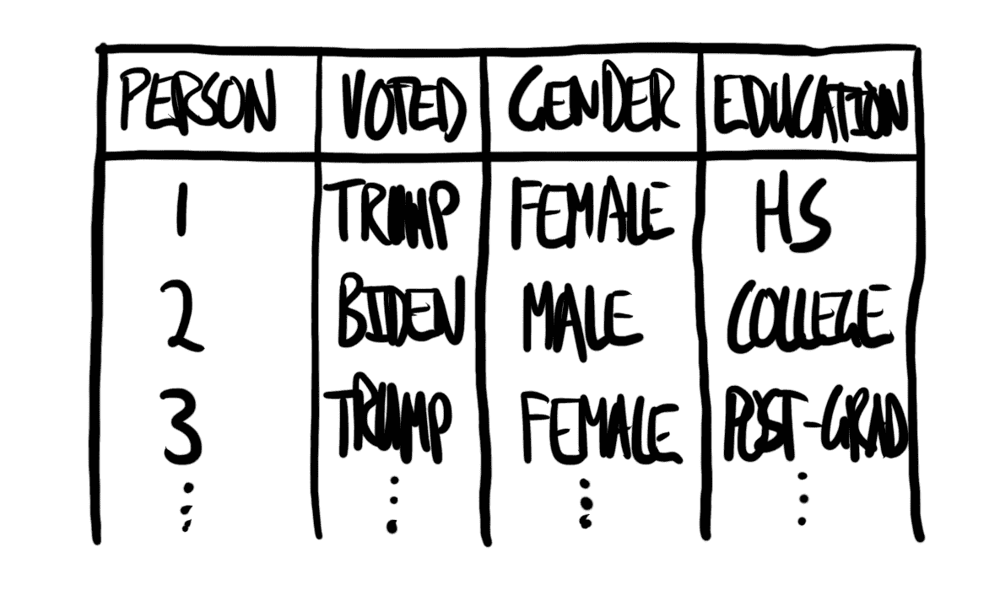

(a) 用于检验美国政治支持的快速数据集草图

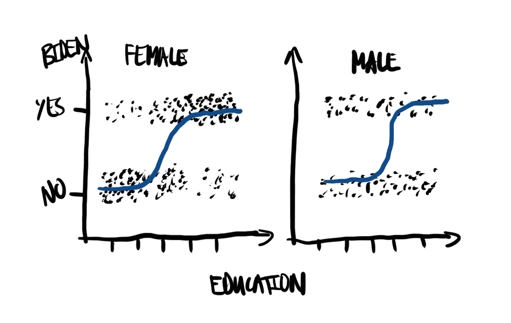

(b) 在最终确定数据或分析之前，我们期望的分析的快速草图

图 13.3：预期数据集和分析的草图，即使它们稍后会被更新，也能澄清我们的思路

我们将模拟一个数据集，其中一个人支持拜登的概率取决于他们的性别和教育水平。

```r
set.seed(853)

num_obs <- 1000

us_political_preferences <- tibble(
 education = sample(0:4, size = num_obs, replace = TRUE),
 gender = sample(0:1, size = num_obs, replace = TRUE),
 support_prob = ((education + gender) / 5),
) |>
 mutate(
 supports_biden = if_else(runif(n = num_obs) < support_prob, "yes", "no"),
 education = case_when(
 education == 0 ~ "< High school",
 education == 1 ~ "High school",
 education == 2 ~ "Some college",
 education == 3 ~ "College",
 education == 4 ~ "Post-grad"
 ),
 gender = if_else(gender == 0, "Male", "Female")
 ) |>
 select(-support_prob, supports_biden, gender, education)
```

对于实际数据，我们可以使用 2020 年合作选举研究（CES）(Schaffner, Ansolabehere, and Luks 2021)。这是一项长期年度的美国政治意见调查。2020 年，有 61,000 名受访者完成了选举后的调查。Ansolabehere, Schaffner, 和 Luks (2021, 13)中详细说明的抽样方法依赖于匹配，这是一种平衡抽样关注和成本的公认方法。

安装并加载`dataverse`后，我们可以使用`get_dataframe_by_name()`访问 CES。这种方法在第七章和第十章中介绍。我们保存对我们感兴趣的数据，然后引用该保存的数据集。

```r
ces2020 <-
 get_dataframe_by_name(
 filename = "CES20_Common_OUTPUT_vv.csv",
 dataset = "10.7910/DVN/E9N6PH",
 server = "dataverse.harvard.edu",
 .f = read_csv
 ) |>
 select(votereg, CC20_410, gender, educ)

write_csv(ces2020, "ces2020.csv")
```

```r
ces2020 <-
 read_csv(
 "ces2020.csv",
 col_types =
 cols(
 "votereg" = col_integer(),
 "CC20_410" = col_integer(),
 "gender" = col_integer(),
 "educ" = col_integer()
 )
 )

ces2020
```

```r
# A tibble: 61,000 × 4
   votereg CC20_410 gender  educ
     <int>    <int>  <int> <int>
 1       1        2      1     4
 2       2       NA      2     6
 3       1        1      2     5
 4       1        1      2     5
 5       1        4      1     5
 6       1        2      1     3
 7       2       NA      1     3
 8       1        2      2     3
 9       1        2      2     2
10       1        1      2     5
# ℹ 60,990 more rows
```

当我们查看实际数据时，我们发现了一些在草图中没有预料到的担忧。我们使用代码簿进行更彻底的调查。我们只想调查那些注册投票的受访者，并且我们只对那些为拜登或特朗普投票的人感兴趣。我们看到，当变量“CC20_410”为 1 时，这意味着受访者支持拜登，而当它为 2 时，这意味着特朗普。我们可以过滤出这些受访者，并添加更多有信息的标签。CES 中可用的性别是“女性”和“男性”，当变量“gender”为 1 时，这意味着“男性”，而当它为 2 时，这意味着“女性”。最后，代码簿告诉我们，“educ”是一个从 1 到 6 的变量，代表教育水平的递增。

```r
ces2020 <-
 ces2020 |>
 filter(votereg == 1,
 CC20_410 %in% c(1, 2)) |>
 mutate(
 voted_for = if_else(CC20_410 == 1, "Biden", "Trump"),
 voted_for = as_factor(voted_for),
 gender = if_else(gender == 1, "Male", "Female"),
 education = case_when(
 educ == 1 ~ "No HS",
 educ == 2 ~ "High school graduate",
 educ == 3 ~ "Some college",
 educ == 4 ~ "2-year",
 educ == 5 ~ "4-year",
 educ == 6 ~ "Post-grad"
 ),
 education = factor(
 education,
 levels = c(
 "No HS",
 "High school graduate",
 "Some college",
 "2-year",
 "4-year",
 "Post-grad"
 )
 )
 ) |>
 select(voted_for, gender, education)
```

最终，我们剩下 43,554 名受访者(图 13.4)。

```r
ces2020 |>
 ggplot(aes(x = education, fill = voted_for)) +
 stat_count(position = "dodge") +
 facet_wrap(facets = vars(gender)) +
 theme_minimal() +
 labs(
 x = "Highest education",
 y = "Number of respondents",
 fill = "Voted for"
 ) +
 coord_flip() +
 scale_fill_brewer(palette = "Set1") +
 theme(legend.position = "bottom")
```

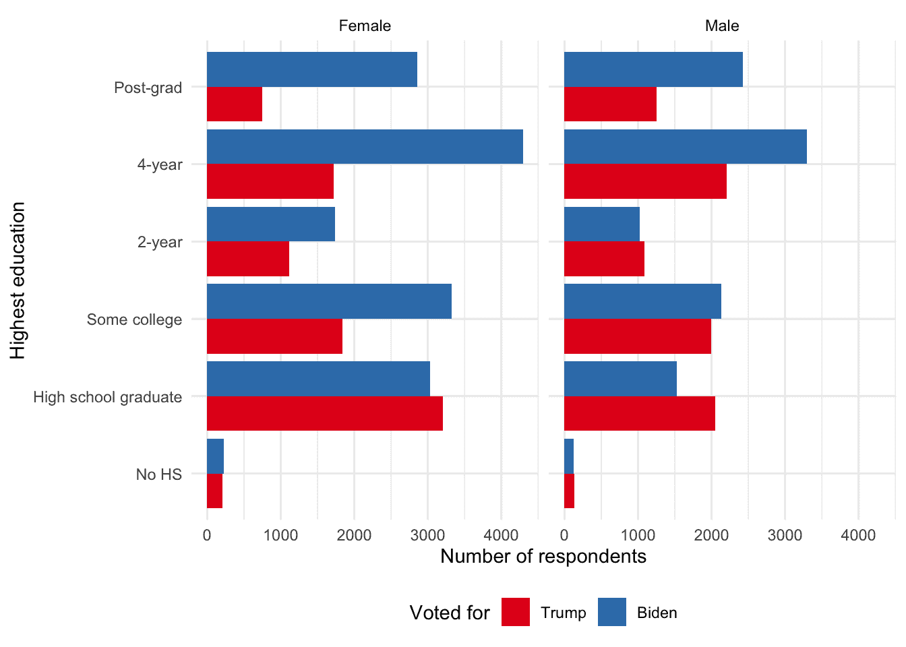

图 13.4：按性别和最高教育程度划分的总统偏好分布*  *我们感兴趣的模型是：

$$ \begin{aligned} y_i|\pi_i & \sim \mbox{Bern}(\pi_i) \\ \mbox{logit}(\pi_i) & = \beta_0+\beta_1 \times \mbox{gender}_i + \beta_2 \times \mbox{education}_i \\ \beta_0 & \sim \mbox{Normal}(0, 2.5)\\ \beta_1 & \sim \mbox{Normal}(0, 2.5)\\ \beta_2 & \sim \mbox{Normal}(0, 2.5) \end{aligned} $$

其中 $y_i$ 是受访者的政治偏好，如果拜登得票则为 1，如果特朗普得票则为 0，$\mbox{gender}_i$ 是受访者的性别，$\mbox{education}_i$ 是受访者的教育程度。我们可以使用 `stan_glm()` 来估计参数。请注意，这个模型是一个普遍接受的简写。在实际操作中，`rstanarm` 将分类变量转换为一系列指标变量，并估计多个系数。为了节省运行时间，我们将随机抽取 1,000 个观测值并在此基础上拟合模型，而不是使用完整的数据集。

```r
set.seed(853)

ces2020_reduced <- 
 ces2020 |> 
 slice_sample(n = 1000)

political_preferences <-
 stan_glm(
 voted_for ~ gender + education,
 data = ces2020_reduced,
 family = binomial(link = "logit"),
 prior = normal(location = 0, scale = 2.5, autoscale = TRUE),
 prior_intercept = 
 normal(location = 0, scale = 2.5, autoscale = TRUE),
 seed = 853
 )

saveRDS(
 political_preferences,
 file = "political_preferences.rds"
)
```

```r
political_preferences <-
 readRDS(file = "political_preferences.rds")
```

我们的模型结果很有趣。它们表明男性不太可能投票给拜登，并且教育程度有相当大的影响(表 13.3)。

```r
modelsummary(
 list(
 "Support Biden" = political_preferences
 ),
 statistic = "mad"
 )
```

表 13.3：根据性别和教育程度，受访者是否可能投票给拜登

|  | 支持拜登 |
| --- | --- |
| (Intercept) | -0.745 |
|  | (0.517) |
| genderMale | -0.477 |
|  | (0.136) |
| educationHigh school graduate | 0.617 |
|  | (0.534) |
| educationSome college | 1.494 |
|  | (0.541) |
| education2-year | 0.954 |
|  | (0.538) |
| education4-year | 1.801 |
|  | (0.532) |
| educationPost-grad | 1.652 |
|  | (0.541) |
| Num.Obs. | 1000 |
| R2 | 0.064 |
| Log.Lik. | -646.335 |
| ELPD | -653.5 |
| ELPD s.e. | 9.4 |
| LOOIC | 1307.0 |
| LOOIC s.e. | 18.8 |
| WAIC | 1307.0 |

| RMSE | 0.48 |*  *绘制这些预测变量的可信区间可能很有用(图 13.5)。特别是，这可能在附录中特别有用。

```r
modelplot(political_preferences, conf_level = 0.9) +
 labs(x = "90 per cent credibility interval")
```

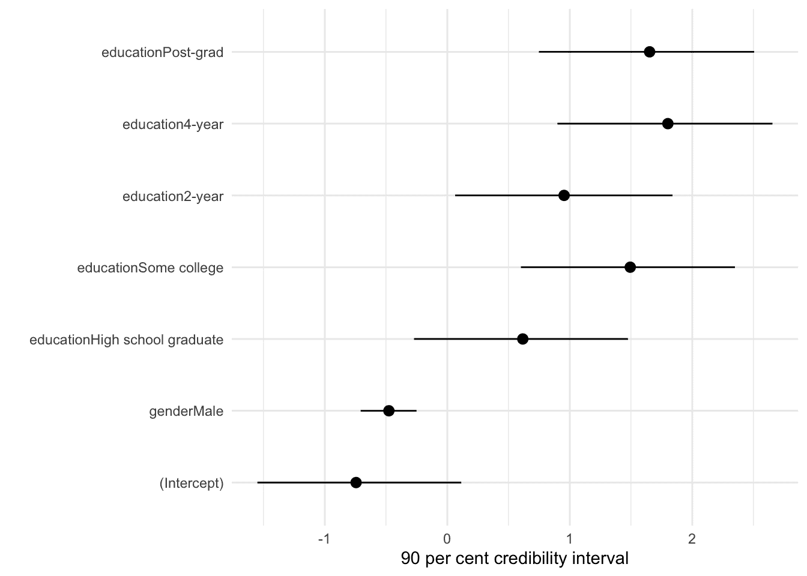

图 13.5：支持拜登预测变量的可信区间
  
## 13.3 泊松回归

当我们拥有计数数据时，我们最初应该考虑利用泊松分布。泊松回归的一个应用是建模体育结果。例如，Burch (2023) 建立了冰球结果的泊松模型，遵循 Baio 和 Blangiardo (2010) 建立的足球结果泊松模型。

泊松分布由一个参数$\lambda$控制。它将概率分布在非负整数上，因此控制分布的形状。因此，泊松分布有一个有趣的特征，即均值也是方差。随着均值的增加，方差也增加。泊松概率质量函数是（Pitman 1993, 121）：

$$P_{\lambda}(k) = e^{-\lambda}\lambda^k/k!\mbox{, for }k=0,1,2,\dots$$ 我们可以使用`rpois()`从泊松分布中模拟$n=20$个抽取值，其中$\lambda$等于三。

```r
rpois(n = 20, lambda = 3)
```

```r
 [1] 3 1 5 6 2 0 2 4 6 2 1 0 3 3 2 2 2 2 2 6
```
我们还可以观察当改变$\lambda$的值时，分布会发生什么变化（图 13.6）。

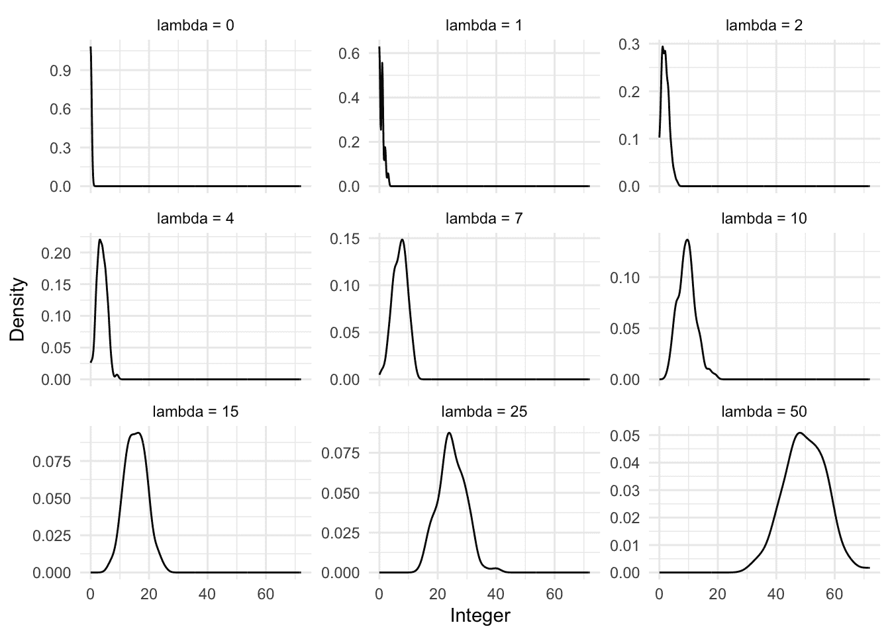

图 13.6：泊松分布由均值控制，均值的值与方差相同

### 13.3.1 模拟示例：按部门划分的 A 等成绩数量

为了说明这种情况，我们可以模拟关于每个大学课程授予的 A 等成绩数量的数据。在这个模拟示例中，我们考虑了三个部门，每个部门都有许多课程。每个课程将授予不同数量的 A 等成绩。

```r
set.seed(853)

class_size <- 26

count_of_A <-
 tibble(
 # From Chris DuBois: https://stackoverflow.com/a/1439843
 department = 
 c(rep.int("1", 26), rep.int("2", 26), rep.int("3", 26)),
 course = c(
 paste0("DEP_1_", letters),
 paste0("DEP_2_", letters),
 paste0("DEP_3_", letters)
 ),
 number_of_As = c(
 rpois(n = class_size, lambda = 5),
 rpois(n = class_size, lambda = 10),
 rpois(n = class_size, lambda = 20)
 )
 )
```

```r
count_of_A |>
 ggplot(aes(x = number_of_As)) +
 geom_histogram(aes(fill = department), position = "dodge") +
 labs(
 x = "Number of As awarded",
 y = "Number of classes",
 fill = "Department"
 ) +
 theme_classic() +
 scale_fill_brewer(palette = "Set1") +
 theme(legend.position = "bottom")
```

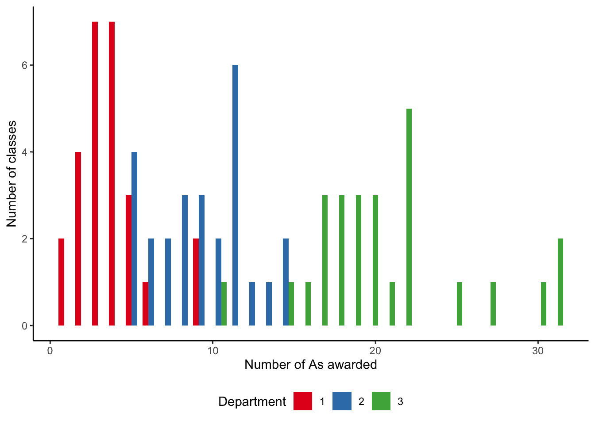

图 13.7：模拟三个部门中不同班级的 A 等成绩数量*  *我们的模拟数据集包含了课程授予的 A 等成绩数量，这些课程在部门内结构化（图 13.7）。在第十六章中，我们将利用这种部门结构，但现在我们只是忽略它，专注于部门间的差异。

我们感兴趣要估计的模型是：

$$ \begin{aligned} y_i|\lambda_i &\sim \mbox{Poisson}(\lambda_i)\\ \log(\lambda_i) & = \beta_0 + \beta_1 \times \mbox{department}_i \end{aligned} $$ 其中$y_i$是授予的 A 等成绩数量，我们感兴趣的是它如何因部门而异。

我们可以使用 R 的基础函数`glm()`来快速了解数据。这个函数相当通用，我们通过设置“family”参数来指定泊松回归。估计值包含在表 13.4 的第一列中。

```r
grades_base <-
 glm(
 number_of_As ~ department,
 data = count_of_A,
 family = "poisson"
 )

summary(grades_base)
```

```r
 Call:
glm(formula = number_of_As ~ department, family = "poisson", 
    data = count_of_A)

Coefficients:
            Estimate Std. Error z value Pr(>|z|)    
(Intercept)   1.3269     0.1010  13.135  < 2e-16 

department2   0.8831     0.1201   7.353 1.94e-13 

department3   1.7029     0.1098  15.505  < 2e-16 

---
Signif. codes:  0 '
' 0.001 '**' 0.01 '*' 0.05 '.' 0.1 ' ' 1

(Dispersion parameter for poisson family taken to be 1)

    Null deviance: 426.201  on 77  degrees of freedom
Residual deviance:  75.574  on 75  degrees of freedom
AIC: 392.55

Number of Fisher Scoring iterations: 4
```
与逻辑回归类似，泊松回归系数的解释可能很困难。对于“department2”系数的解释是，它是部门间预期差异的对数。我们预计 $e^{0.883} \approx 2.4$ 和 $e^{1.703} \approx 5.5$，与部门 1 相比，部门 2 和部门 3 分别有这么多 A 等成绩（表 13.4）。

我们可以构建一个贝叶斯模型，并用`rstanarm`对其进行估计（表 13.4）。

$$ \begin{aligned} y_i|\lambda_i &\sim \mbox{Poisson}(\lambda_i)\\ \log(\lambda_i) & = \beta_0 + \beta_1 \times\mbox{department}_i\\ \beta_0 & \sim \mbox{Normal}(0, 2.5)\\ \beta_1 & \sim \mbox{Normal}(0, 2.5) \end{aligned} $$ 其中 $y_i$ 是授予 A 的数量。

```r
grades_rstanarm <-
 stan_glm(
 number_of_As ~ department,
 data = count_of_A,
 family = poisson(link = "log"),
 prior = normal(location = 0, scale = 2.5, autoscale = TRUE),
 prior_intercept = normal(location = 0, scale = 2.5, autoscale = TRUE),
 seed = 853
 )

saveRDS(
 grades_rstanarm,
 file = "grades_rstanarm.rds"
)
```

结果见表 13.4*。

```r
modelsummary(
 list(
 "Number of As" = grades_rstanarm
 )
)
```

表 13.4：检查不同部门授予 A 的数量

|  | 数量 A |
| --- | --- |
| (Intercept) | 1.321 |
| department2 | 0.884 |
| department3 | 1.706 |
| Num.Obs. | 78 |
| Log.Lik. | -193.355 |
| ELPD | -196.2 |
| ELPD s.e. | 7.7 |
| LOOIC | 392.4 |
| LOOIC s.e. | 15.4 |
| WAIC | 392.4 |

与逻辑回归一样，我们可以使用`marginaleffects`中的`slopes()`来帮助解释这些结果。考虑我们如何期望从一个部门到另一个部门 A 的数量如何变化可能是有用的。表 13.5 表明，在我们的数据集中，2 号部门的班级通常比 1 号部门多五个 A，而 3 号部门的班级通常比 1 号部门多 17 个 A。

```r
slopes(grades_rstanarm) |>
 select(contrast, estimate, conf.low, conf.high) |>
 unique() |> 
 tt() |> 
 style_tt(j = 1:4, align = "lrrr") |> 
 format_tt(digits = 2, num_mark_big = ",", num_fmt = "decimal") |> 
 setNames(c("Compare department", "Estimate", "2.5%", "97.5%"))
```

表 13.5：每个部门授予 A 的数量估计差异

| 比较部门 | 估计 | 2.5% | 97.5% |
| --- | --- | --- | --- |
| 2 - 1 | 5.32 | 4.01 | 6.7 |

| 3 - 1 | 16.92 | 15.1 | 18.84 |
  
### 13.3.2 《简·爱》中使用的字母

在较早的年代，埃奇沃斯(1885)对维吉尔的作品《埃涅阿斯纪》中的跖骨进行了计数（Stigler (1978, 301)提供了有用的背景信息，数据集可通过`Dactyl`从`HistData`获取（Friendly 2021)). 受此启发，我们可以使用`gutenbergr`获取夏洛特·勃朗特的《简·爱》的文本。 (回想一下，在第七章中，我们将《简·爱》的 PDF 转换为数据集。) 然后，我们可以考虑每章的前十行，计算单词数，并计算“E”或“e”出现的次数。我们想看看随着单词数量的增加，e/Es 的数量是否会增加。如果不增加，这可能表明 e/Es 的分布不一致，这可能对语言学家来说很有趣。

按照本书倡导的工作流程，我们首先绘制我们的数据集和模型草图。数据集可能的样子快速草图见图 13.12 (a)，我们模型的快速草图见图 13.12 (b)。

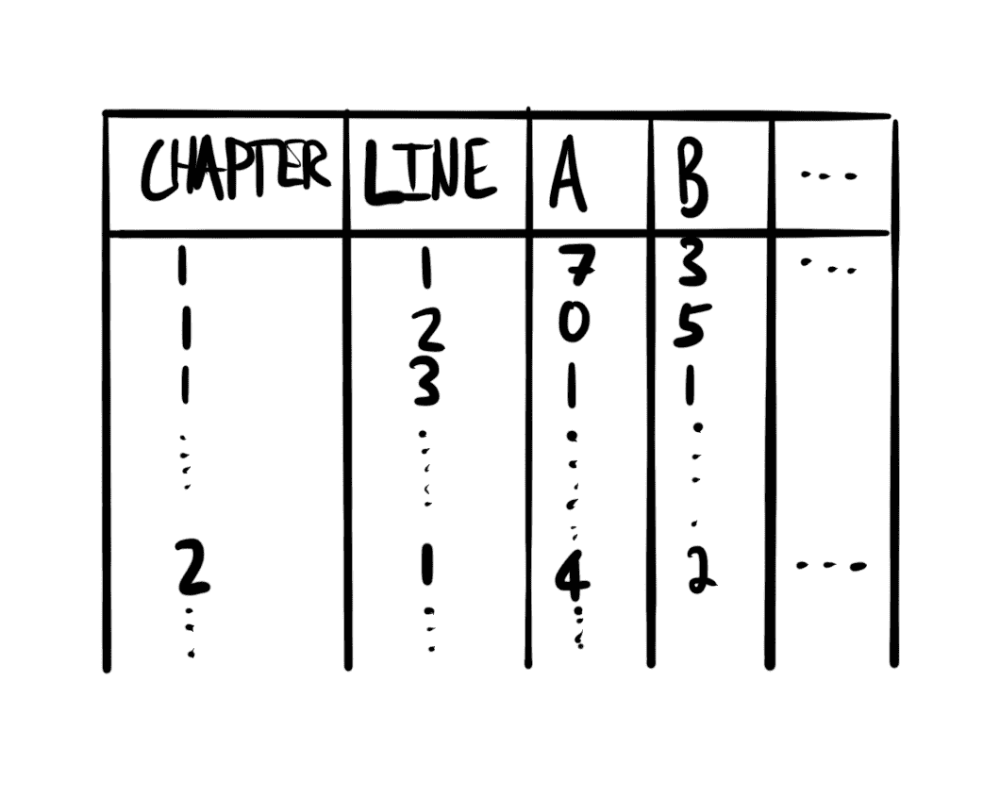

(a) 《简·爱》中按行和章节计划的计数

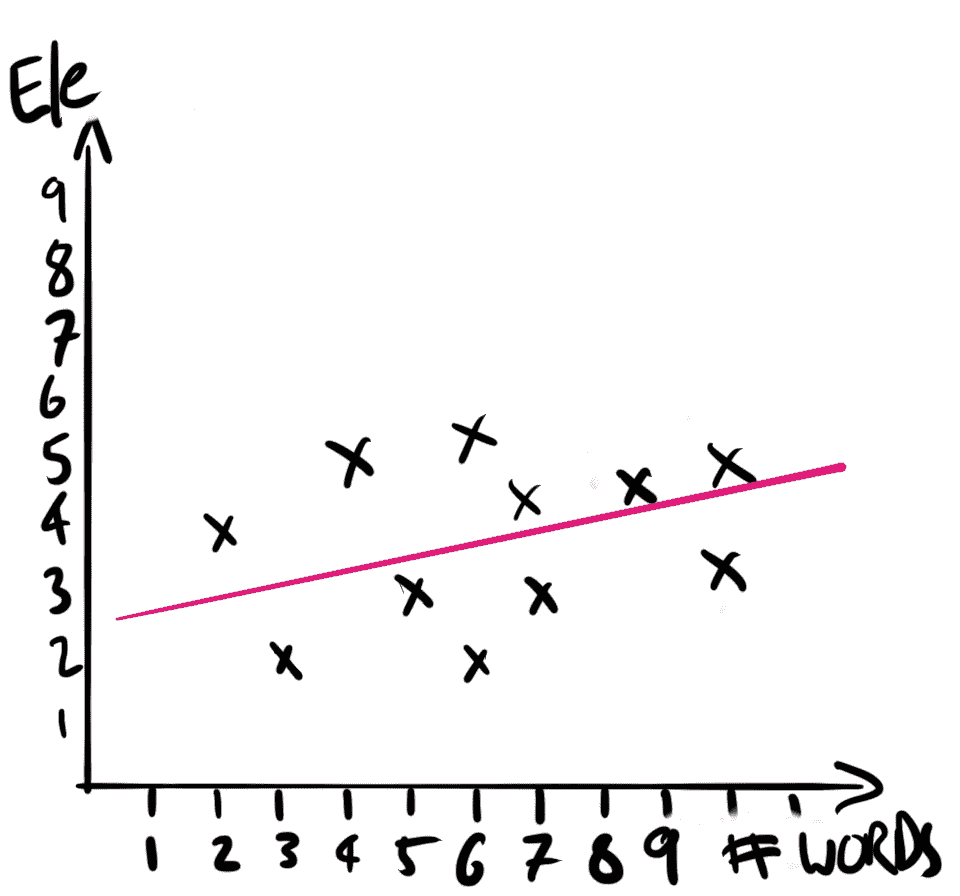

(b) e/Es 的计数与行中单词数之间的预期关系

图 13.8：预期数据集和分析草图迫使我们考虑我们感兴趣的内容

我们模拟了一个遵循泊松分布的 e/Es 数量的数据集(图 13.9)。

```r
count_of_e_simulation <-
 tibble(
 chapter = c(rep(1, 10), rep(2, 10), rep(3, 10)),
 line = rep(1:10, 3),
 number_words_in_line = runif(min = 0, max = 15, n = 30) |> round(0),
 number_e = rpois(n = 30, lambda = 10)
 )

count_of_e_simulation |>
 ggplot(aes(y = number_e, x = number_words_in_line)) +
 geom_point() +
 labs(
 x = "Number of words in line",
 y = "Number of e/Es in the first ten lines"
 ) +
 theme_classic() +
 scale_fill_brewer(palette = "Set1")
```

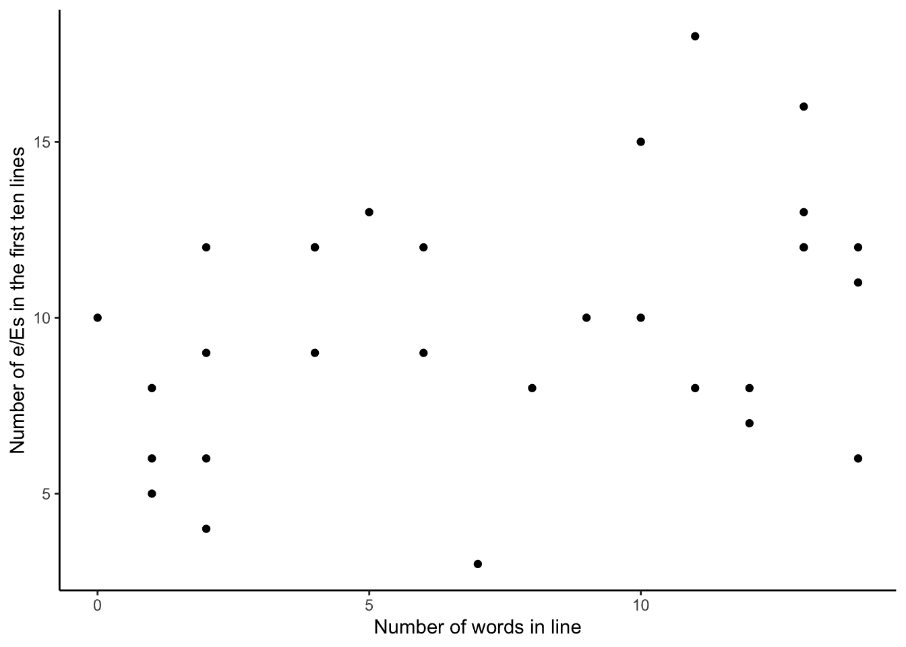

图 13.9：模拟的 e/Es 计数*  *我们现在可以收集和准备我们的数据。我们使用 `gutenberg_download()` 从 `gutenbergr` 下载书籍的文本。

```r
gutenberg_id_of_janeeyre <- 1260

jane_eyre <-
 gutenberg_download(
 gutenberg_id = gutenberg_id_of_janeeyre,
 mirror = "https://gutenberg.pglaf.org/"
 )

jane_eyre

write_csv(jane_eyre, "jane_eyre.csv")
```

我们将下载它，然后使用我们的本地副本以避免过度占用 Project Gutenberg 服务器。

```r
jane_eyre <- read_csv(
 "jane_eyre.csv",
 col_types = cols(
 gutenberg_id = col_integer(),
 text = col_character()
 )
)

jane_eyre
```

```r
# A tibble: 21,001 × 2
   gutenberg_id text                           
          <int> <chr>                          
 1         1260 JANE EYRE                      
 2         1260 AN AUTOBIOGRAPHY               
 3         1260 <NA>                           
 4         1260 by Charlotte Brontë            
 5         1260 <NA>                           
 6         1260 _ILLUSTRATED BY F. H. TOWNSEND_
 7         1260 <NA>                           
 8         1260 London                         
 9         1260 SERVICE & PATON                
10         1260 5 HENRIETTA STREET             
# ℹ 20,991 more rows
```

我们只对有内容的行感兴趣，因此我们移除了那些仅用于间隔的空行。然后我们可以创建每章前十行中 e/Es 数量的计数。例如，我们可以查看前几行，看到第一行有五个 e/Es，第二行有八个。

```r
jane_eyre_reduced <-
 jane_eyre |>
 filter(!is.na(text)) |> # Remove empty lines
 mutate(chapter = if_else(str_detect(text, "CHAPTER") == TRUE,
 text,
 NA_character_)) |> # Find start of chapter
 fill(chapter, .direction = "down") |> 
 mutate(chapter_line = row_number(), 
 .by = chapter) |> # Add line number to each chapter
 filter(!is.na(chapter), 
 chapter_line %in% c(2:11)) |> # Remove "CHAPTER I" etc
 select(text, chapter) |>
 mutate(
 chapter = str_remove(chapter, "CHAPTER "),
 chapter = str_remove(chapter, "—CONCLUSION"),
 chapter = as.integer(as.roman(chapter))
 ) |> # Change chapters to integers
 mutate(count_e = str_count(text, "e|E"),
 word_count = str_count(text, "\\w+")
 # From: https://stackoverflow.com/a/38058033
 ) 
```

```r
jane_eyre_reduced |>
 select(chapter, word_count, count_e, text) |>
 head()
```

```r
# A tibble: 6 × 4
  chapter word_count count_e text                                               
    <int>      <int>   <int> <chr>                                              
1       1         13       5 There was no possibility of taking a walk that day…
2       1         11       8 wandering, indeed, in the leafless shrubbery an ho…
3       1         12       9 but since dinner (Mrs. Reed, when there was no com…
4       1         14       3 the cold winter wind had brought with it clouds so…
5       1         11       7 so penetrating, that further outdoor exercise was …
6       1          1       1 question. 
```
我们可以通过绘制所有数据(图 13.10)来验证 e/Es 数量的平均值和方差大致相似。平均值，用粉色表示，为 6.7，方差，用蓝色表示，为 6.2。虽然它们并不完全相同，但它们是相似的。我们在图 13.10 (b)中包含了对角线，以帮助思考数据。如果数据在 $y=x$ 线上，那么平均每词会有一个 e/E。考虑到那条线以下的点群，我们预计平均每词少于一个。

```r
mean_e <- mean(jane_eyre_reduced$count_e)
variance_e <- var(jane_eyre_reduced$count_e)

jane_eyre_reduced |>
 ggplot(aes(x = count_e)) +
 geom_histogram() +
 geom_vline(xintercept = mean_e, 
 linetype = "dashed", 
 color = "#C64191") +
 geom_vline(xintercept = variance_e, 
 linetype = "dashed", 
 color = "#0ABAB5") +
 theme_minimal() +
 labs(
 y = "Count",
 x = "Number of e's per line for first ten lines"
 )

jane_eyre_reduced |>
 ggplot(aes(x = word_count, y = count_e)) +
 geom_jitter(alpha = 0.5) +
 geom_abline(slope = 1, intercept = 0, linetype = "dashed") +
 theme_minimal() +
 labs(
 x = "Number of words in the line",
 y = "Number of e/Es in the line"
 )
```

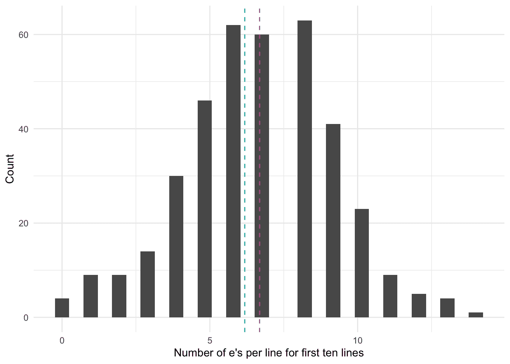

(a) e/Es 数量的分布

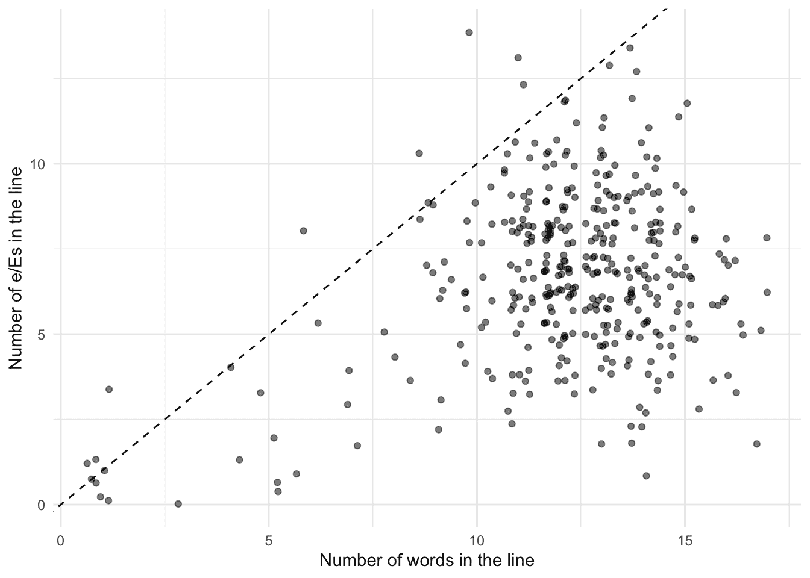

(b) 行中 e/Es 数量与行中单词数量的比较

图 13.10：简·爱各章节前十行中 e/Es 字母的数量

我们可以考虑以下模型：

$$ \begin{aligned} y_i|\lambda_i &\sim \mbox{Poisson}(\lambda_i)\\ \log(\lambda_i) & = \beta_0 + \beta_1 \times \mbox{Number of words}_i\\ \beta_0 & \sim \mbox{Normal}(0, 2.5)\\ \beta_1 & \sim \mbox{Normal}(0, 2.5) \end{aligned} $$ 其中 $y_i$ 是行中的 e/Es 数量，解释变量是该行中的单词数量。我们可以使用 `stan_glm()` 来估计模型。

```r
jane_e_counts <-
 stan_glm(
 count_e ~ word_count,
 data = jane_eyre_reduced,
 family = poisson(link = "log"),
 prior = normal(location = 0, scale = 2.5, autoscale = TRUE),
 prior_intercept = normal(location = 0, scale = 2.5, autoscale = TRUE),
 seed = 853
 )

saveRDS(
 jane_e_counts,
 file = "jane_e_counts.rds"
)
```

虽然我们通常会对估计表感兴趣，正如我们现在已经看到的那样，而不是再次创建一个估计表，我们引入了来自 `marginaleffects` 的 `plot_cap()`。我们可以使用它来显示模型预测的每行 e/Es 数量，基于该行的单词数量。图 13.11 清楚地表明我们期望存在正相关关系。

```r
plot_predictions(jane_e_counts, condition = "word_count") +
 labs(x = "Number of words",
 y = "Average number of e/Es in the first 10 lines") +
 theme_classic()
```

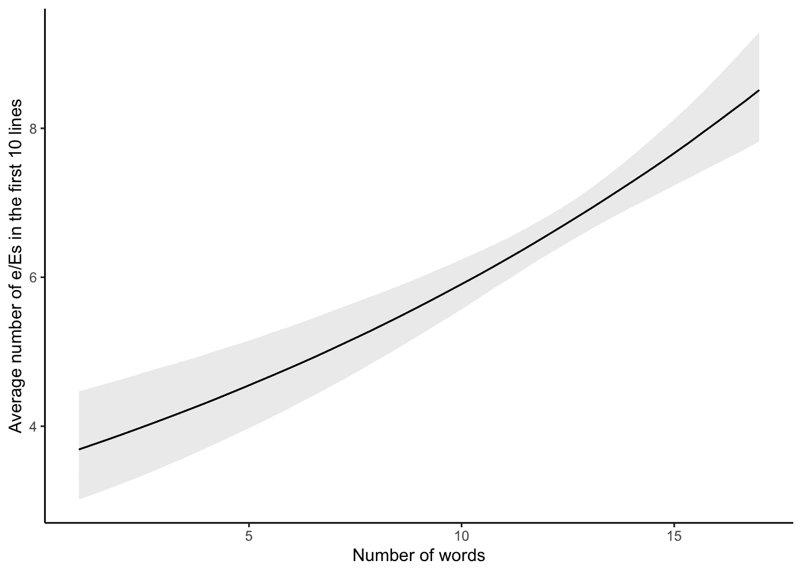

图 13.11：根据每行单词数量预测的每行 e/Es 的数量
  
## 13.4 负二项式回归

Poisson 回归的一个限制是假设均值和方差相同。我们可以通过使用一个近似的变体，即负二项式回归，来放宽这个假设，允许过度分散。

Poisson 和负二项式模型相辅相成。我们通常都会拟合这两种模型，然后进行比较。例如：

+   Maher (1982) 在英格兰足球联赛的结果背景下考虑了这两种情况，并讨论了在某些情况下一种可能比另一种更合适的情况。

+   Smith (2002) 考虑了 2000 年美国总统选举，特别是 Poisson 分析中的过度分散问题。

+   Osgood (2000) 在犯罪数据的案例中比较了它们。

### 13.4.1 加拿大艾伯塔省的死亡率

考虑到有些许病态，每年每个人要么死亡，要么没有。从地理区域的视角来看，我们可以收集每年死亡人数及其死因的数据。加拿大艾伯塔省已将自 2001 年以来每年前 30 位死因的死亡人数数据[公布](https://open.alberta.ca/opendata/leading-causes-of-death)。

如往常一样，我们首先绘制我们的数据集和模型草图。数据集可能的快速草图是图 13.12 (a)，我们模型的快速草图是图 13.12 (b)

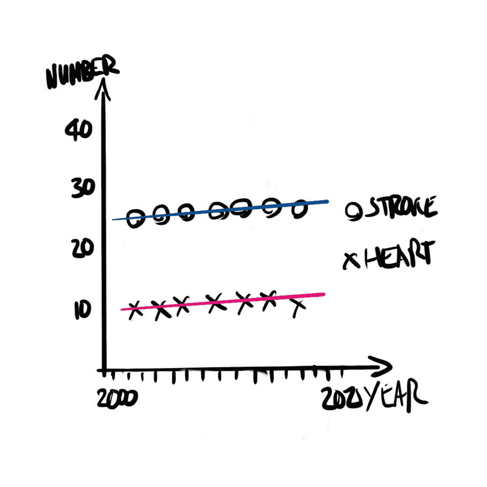

(a) 用于检查艾伯塔省死亡原因的潜在数据集的快速草图

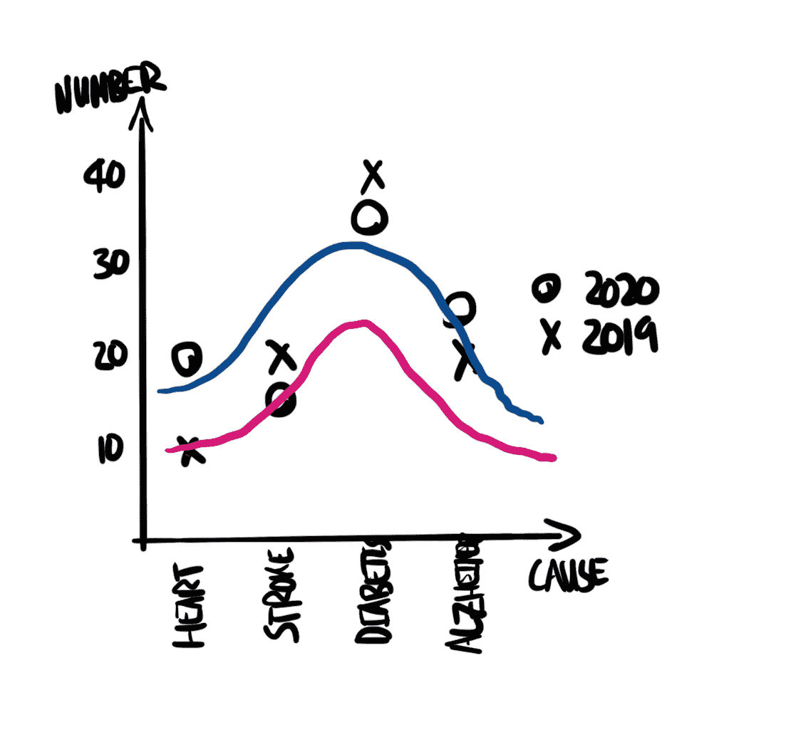

(b) 在最终确定数据或分析之前，对艾伯塔省死亡原因分析的快速概述

图 13.12：艾伯塔省死亡原因预期数据集和分析的草图

我们将模拟一个死亡原因遵循负二项式分布的数据集。

```r
alberta_death_simulation <-
 tibble(
 cause = rep(x = c("Heart", "Stroke", "Diabetes"), times = 10),
 year = rep(x = 2016:2018, times = 10),
 deaths = rnbinom(n = 30, size = 20, prob = 0.1)
 )

alberta_death_simulation
```

```r
# A tibble: 30 × 3
   cause     year deaths
   <chr>    <int>  <int>
 1 Heart     2016    241
 2 Stroke    2017    197
 3 Diabetes  2018    139
 4 Heart     2016    136
 5 Stroke    2017    135
 6 Diabetes  2018    130
 7 Heart     2016    194
 8 Stroke    2017    211
 9 Diabetes  2018    190
10 Heart     2016    142
# ℹ 20 more rows
```
我们可以查看这些死亡人数的分布，按年份和死因(图 13.13)。我们截断了完整的死因，因为有些死因相当长。由于某些死因并非每年都出现在前 30 位，因此并非所有死因都有相同的发生次数。

```r
alberta_cod <-
 read_csv(
 "https://open.alberta.ca/dataset/03339dc5-fb51-4552-97c7-853688fc428d/resource/3e241965-fee3-400e-9652-07cfbf0c0bda/download/deaths-leading-causes.csv",
 skip = 2,
 col_types = cols(
 `Calendar Year` = col_integer(),
 Cause = col_character(),
 Ranking = col_integer(),
 `Total Deaths` = col_integer()
 )
 ) |>
 clean_names() |>
 add_count(cause) |>
 mutate(cause = str_trunc(cause, 30))
```

如果我们观察 2021 年的前十位死因，我们会注意到一些有趣的现象(表 13.6)。例如，我们预计最常见的死因会在我们 21 年的数据中都有出现。但我们会发现最常见的死因，“其他未定义和未知死亡原因”，只在三年中出现。“COVID-19，已识别病毒”，在另外两年中也有出现，因为在 2020 年之前加拿大没有已知的 COVID 死亡病例。

```r
alberta_cod |>
 filter(
 calendar_year == 2021,
 ranking <= 10
 ) |>
 mutate(total_deaths = format(total_deaths, big.mark = ",")) |>
 tt() |> 
 style_tt(j = 1:5, align = "lrrrr") |> 
 format_tt(digits = 0, num_mark_big = ",", num_fmt = "decimal") |> 
 setNames(c("Year", "Cause", "Ranking", "Deaths", "Years"))
```

表 13.6：2021 年艾伯塔省前十位死因

| 年份 | 原因 | 排名 | 死亡人数 | 年份 |
| --- | --- | --- | --- | --- |
| 2,021 | 其他未定义和未知... | 1 | 3,362 | 3 |
| 2,021 | 有机性痴呆 | 2 | 2,135 | 21 |
| 2,021 | 已识别的 COVID-19 病毒 | 3 | 1,950 | 2 |
| 2,021 | 所有其他形式的慢性... | 4 | 1,939 | 21 |
| 2,021 | 恶性肿瘤... | 5 | 1,552 | 21 |
| 2,021 | 急性心肌梗死 | 6 | 1,075 | 21 |
| 2,021 | 其他慢性阻塞性肺... | 7 | 1,028 | 21 |
| 2,021 | 糖尿病 | 8 | 728 | 21 |
| 2,021 | 梗死，未指定他... | 9 | 612 | 21 |

| 2,021 | 由...引起的意外中毒 | 10 | 604 | 9 |*  *为了简化，我们只关注每年都存在的 2021 年最常见的五种死亡原因。

```r
alberta_cod_top_five <-
 alberta_cod |>
 filter(
 calendar_year == 2021,
 n == 21
 ) |>
 slice_max(order_by = desc(ranking), n = 5) |>
 pull(cause)

alberta_cod <-
 alberta_cod |>
 filter(cause %in% alberta_cod_top_five)
```

```r
alberta_cod |>
 ggplot(aes(x = calendar_year, y = total_deaths, color = cause)) +
 geom_line() +
 theme_minimal() +
 scale_color_brewer(palette = "Set1") +
 labs(x = "Year", y = "Annual number of deaths in Alberta") +
 facet_wrap(vars(cause), dir = "v", ncol = 1) +
 theme(legend.position = "none")
```

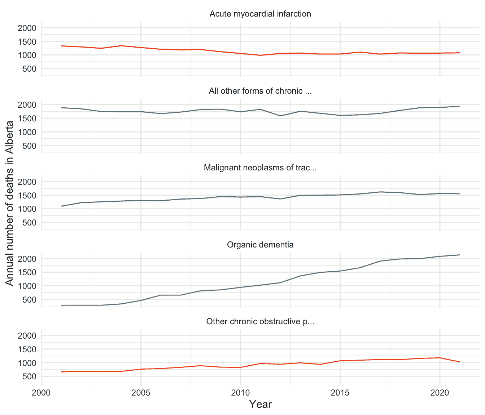

图 13.13：自 2001 年以来，加拿大阿尔伯塔省前五大死亡原因的年度死亡人数*  *我们注意到，平均值 1,273 与方差 182,378(表 13.7)不同。

表 13.7：加拿大阿尔伯塔省按原因汇总的年度死亡人数统计

|  | 最小值 | 平均值 | 最大值 | 标准差 | 方差 | N |
| --- | --- | --- | --- | --- | --- | --- |
| total_deaths | 280 | 1273 | 2135 | 427 | 182378 | 105 |

使用`stan_glm()`时，我们可以通过在“family”中指定负二项式分布来实现负二项式回归。在这种情况下，我们运行了泊松和负二项式两种模型。

```r
cause_of_death_alberta_poisson <-
 stan_glm(
 total_deaths ~ cause,
 data = alberta_cod,
 family = poisson(link = "log"),
 seed = 853
 )

cause_of_death_alberta_neg_binomial <-
 stan_glm(
 total_deaths ~ cause,
 data = alberta_cod,
 family = neg_binomial_2(link = "log"),
 seed = 853
 )
```

我们可以比较我们的不同模型(表 13.8)。

表 13.8：2001-2020 年阿尔伯塔省最常见的死亡原因建模

```r
coef_short_names <- 
 c("causeAll other forms of chronic ischemic heart disease"
 = "causeAll other forms of...",
 "causeMalignant neoplasms of trachea, bronchus and lung"
 = "causeMalignant neoplas...",
 "causeOrganic dementia"
 = "causeOrganic dementia",
 "causeOther chronic obstructive pulmonary disease"
 = "causeOther chronic obst..."
 )

modelsummary(
 list(
 "Poisson" = cause_of_death_alberta_poisson,
 "Negative binomial" = cause_of_death_alberta_neg_binomial
 ),
 coef_map = coef_short_names
)
```

估计值相似。我们可以使用在第 12.4 节中介绍的后续预测检验来表明，对于这种情况，负二项式方法是一个更好的选择(图 13.14)。

```r
pp_check(cause_of_death_alberta_poisson) +
 theme(legend.position = "bottom")

pp_check(cause_of_death_alberta_neg_binomial) +
 theme(legend.position = "bottom")
```

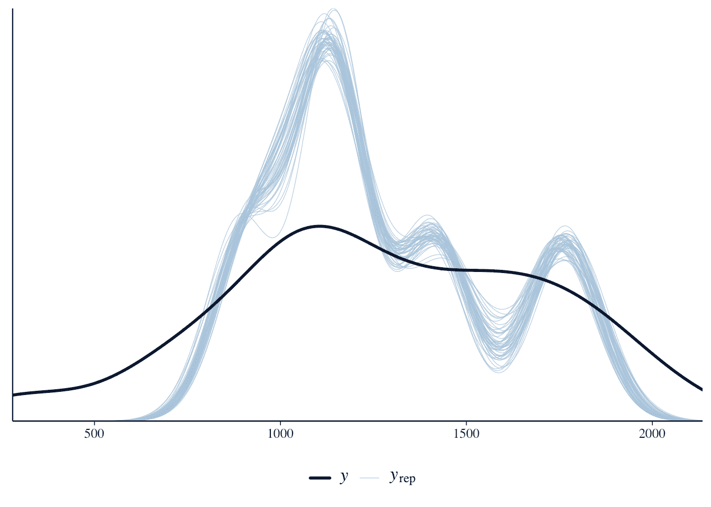

(a) 泊松模型

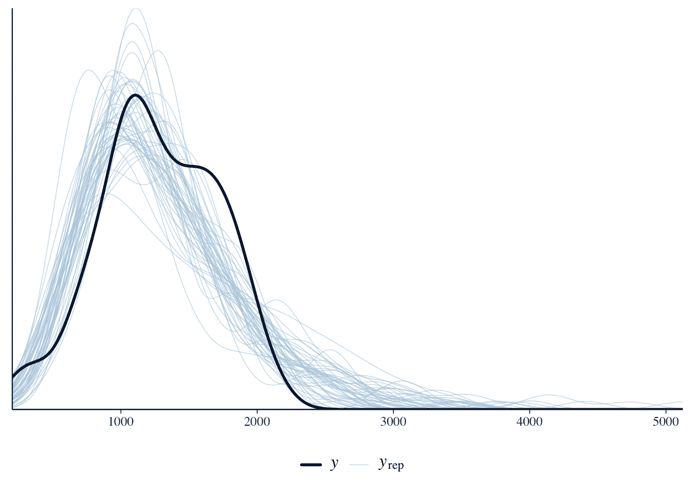

(b) 负二项式模型

图 13.14：比较泊松和负二项式模型的后验预测检验

最后，我们可以使用留一法交叉验证（LOO CV）来比较模型。这是交叉验证的一种变体，其中每个折叠的大小为 1。也就是说，如果有一个包含 100 个观测值的数据库，这种 LOO 就相当于 100 次交叉验证。我们可以在`rstanarm`中使用`loo()`为每个模型实现这一点，然后使用`loo_compare()`进行比较，其中数值越高越好。¹

我们在在线附录 14 中提供了关于交叉验证的更多信息。

```r
poisson <- loo(cause_of_death_alberta_poisson, cores = 2)
neg_binomial <- loo(cause_of_death_alberta_neg_binomial, cores = 2)

loo_compare(poisson, neg_binomial)
```

```r
 elpd_diff se_diff
cause_of_death_alberta_neg_binomial     0.0       0.0
cause_of_death_alberta_poisson      -4536.7    1089.5
```
在这种情况下，我们发现负二项式模型比泊松模型更适合，因为 ELPD 更大。
  
## 13.5 多层建模

多层模型有多种名称，包括“分层”和“随机效应”。虽然不同学科之间有时在含义上存在细微差别，但通常它们指的是相同或至少相似的概念。多层模型的基本洞察是，我们的观察结果往往并不是完全相互独立的，而是可以分组的。在建模时考虑到这种分组，可以为我们提供一些有用的信息。例如，专业运动员的收益因他们参加的是男子还是女子比赛而有所不同。如果我们对尝试根据运动员的比赛结果预测特定运动员的收益感兴趣，那么知道该个人参加的是哪种类型的比赛将使模型能够做出更好的预测。

巨人的肩膀* *菲奥娜·斯蒂尔博士是伦敦政治经济学院（LSE）的统计学教授。1996 年从南安普顿大学获得统计学博士学位后，她被任命为 LSE 的讲师，之后前往伦敦大学和布里斯托尔大学，2008 年被任命为全职教授。2013 年她回到了 LSE。她研究的一个领域是多层模型及其在人口统计学、教育、家庭心理学和健康中的应用。例如，Steele (2007) 研究纵向数据的多层模型，而 Steele, Vignoles, 和 Jenkins (2007) 使用多层模型来研究学校资源与学生成绩之间的关系。她在 2008 年获得了皇家统计学会的铜质盖伊奖章。* *我们区分三种设置：

1.  完全混合，即我们将每个观察结果视为来自同一组，这是我们迄今为止所做的方法。

1.  不混合，即我们单独处理每个组，这可能发生在我们为每个组运行单独回归的情况下。

1.  部分混合，即我们允许组别成员有一些影响。

例如，假设我们感兴趣的是世界上每个国家 GDP 与通货膨胀之间的关系。完全混合将使我们把所有国家放入一个组；不混合将使我们为每个大陆运行单独的回归。现在我们将说明部分混合方法。

通常有两种方法可以做到这一点：

1.  允许截距变化，或

1.  允许斜率变化。

在这本书中，我们只考虑第一种，但你应该转向 Gelman, Hill, 和 Vehtari (2020)，McElreath ([[2015] 2020](99-references.html#ref-citemcelreath))，以及 Johnson, Ott, 和 Dogucu (2022)。

### 13.5.1 模拟示例：政治支持

让我们考虑一个情况，其中某个特定政治党派的投票支持概率取决于个人的性别以及他们居住的州。

$$ \begin{aligned} y_i|\pi_i & \sim \mbox{Bern}(\pi_i) \\ \mbox{logit}(\pi_i) & = \beta_0 + \alpha_{g[i]}^{\mbox{gender}} + \alpha_{s[i]}^{\mbox{state}} \\ \beta_0 & \sim \mbox{Normal}(0, 2.5)\\ \alpha_{g}^{\mbox{gender}} & \sim \mbox{Normal}(0, 2.5)\mbox{ for }g=1, 2\\ \alpha_{s}^{\mbox{state}} & \sim \mbox{Normal}\left(0, \sigma_{\mbox{state}}²\right)\mbox{ for }s=1, 2, \dots, S\\ \sigma_{\mbox{state}} & \sim \mbox{Exponential}(1) \end{aligned} $$

其中 $\pi_i = \mbox{Pr}(y_i=1)$，存在两个性别组，因为这是我们将在第十六章中使用的调查中将要获得的信息，而 $S$ 是州的总数。我们在`stan_glmer()`函数中使用“（1 | state）”将此包含在`rstanarm`中（Goodrich 等人 2023）。这个术语表示我们正在查看按州划分的组效应，这意味着拟合模型的截距可以按州变化。

```r
set.seed(853)

political_support <-
 tibble(
 state = sample(1:50, size = 1000, replace = TRUE),
 gender = sample(c(1, 2), size = 1000, replace = TRUE),
 noise = rnorm(n = 1000, mean = 0, sd = 10) |> round(),
 supports = if_else(state + gender + noise > 50, 1, 0)
 )

political_support
```

```r
# A tibble: 1,000 × 4
   state gender noise supports
   <int>  <dbl> <dbl>    <dbl>
 1     9      1    11        0
 2    26      1     3        0
 3    29      2     7        0
 4    17      2    13        0
 5    37      2    11        0
 6    29      2     9        0
 7    50      2     3        1
 8    20      2     3        0
 9    19      1    -1        0
10     3      2     7        0
# ℹ 990 more rows


```r
voter_preferences <-
 stan_glmer(
 supports ~ gender + (1 | state),
 data = political_support,
 family = binomial(link = "logit"),
 prior = normal(location = 0, scale = 2.5, autoscale = TRUE),
 prior_intercept = normal(location = 0, scale = 2.5, autoscale = TRUE),
 seed = 853
 )

saveRDS(
 voter_preferences,
 file = "voter_preferences.rds"
)
```

```r
voter_preferences
```

```r
stan_glmer
 family:       binomial [logit]
 formula:      supports ~ gender + (1 | state)
 observations: 1000
------
            Median MAD_SD
(Intercept) -4.4    0.7  
gender       0.4    0.3  

Error terms:
 Groups Name        Std.Dev.
 state  (Intercept) 2.5     
Num. levels: state 50 

------
For help interpreting the printed output see ?print.stanreg
For info on the priors used see ?prior_summary.stanreg
```
在遇到新的建模情况时，特别是当推理是主要关注点时，值得尝试寻找使用多级模型的机会。通常有一些分组可以利用，为模型提供更多信息。

当我们转向多级建模时，某些`rstanarm`模型可能会出现关于“发散转换”的警告。为了使模型适用于本书，如果只有少数几个警告，并且系数的 Rhat 值都接近于 1（可以通过`any(summary(change_this_to_the_model_name)[, "Rhat"] > 1.1)`来检查这一点），那么只需忽略它。如果有超过少数几个警告，并且/或者任何 Rhat 值没有接近于 1，那么将“adapt_delta = 0.99”作为`stan_glmer()`的参数，并重新运行模型（记住这将需要更长的时间）。如果这不能解决问题，那么通过删除变量简化模型。我们将在第十六章中看到一个例子，当我们将 MRP 应用于 2020 年美国大选时，“adapt_delta”策略解决了问题。
  
### 13.5.2 奥斯汀、勃朗特、狄更斯和莎士比亚

作为多级建模的一个例子，我们考虑来自古腾堡计划（Project Gutenberg）的四位作者（简·奥斯汀、夏洛蒂·勃朗特、查尔斯·狄更斯和威廉·莎士比亚）的书籍长度数据。我们预计奥斯汀、勃朗特和狄更斯在写作书籍时，其书籍长度将比莎士比亚（他写作戏剧）更长。但我们对三位书籍作者之间应该期望的差异并不清楚。

```r
authors <- c("Austen, Jane", "Dickens, Charles", 
 "Shakespeare, William", "Brontë, Charlotte")

# The document values for duplicates and letters that we do not want
dont_get_shakespeare <-
 c(2270, 4774, 5137, 9077, 10606, 12578, 22791, 23041, 23042, 23043, 
 23044, 23045, 23046, 28334, 45128, 47518, 47715, 47960, 49007, 
 49008, 49297, 50095, 50559)
dont_get_bronte <- c(31100, 42078)
dont_get_dickens <-
 c(25852, 25853, 25854, 30368, 32241, 35536, 37121, 40723, 42232, 43111, 
 43207, 46675, 47529, 47530, 47531, 47534, 47535, 49927, 50334)

books <-
 gutenberg_works(
 author %in% authors,
 !gutenberg_id %in% 
 c(dont_get_shakespeare, dont_get_bronte, dont_get_dickens)
 ) |>
 gutenberg_download(
 meta_fields = c("title", "author"),
 mirror = "https://gutenberg.pglaf.org/"
 )

write_csv(books, "books-austen_bronte_dickens_shakespeare.csv")
```

```r
books <- read_csv(
 "books-austen_bronte_dickens_shakespeare.csv",
 col_types = cols(
 gutenberg_id = col_integer(),
 text = col_character(),
 title = col_character(),
 author = col_character()
 )
)
```

```r
lines_by_author_work <-
 books |>
 summarise(number_of_lines = n(),
 .by = c(author, title))

lines_by_author_work
```

```r
# A tibble: 125 × 3
   author            title                       number_of_lines
   <chr>             <chr>                                 <int>
 1 Austen, Jane      Emma                                  16488
 2 Austen, Jane      Lady Susan                             2525
 3 Austen, Jane      Love and Freindship [sic]              3401
 4 Austen, Jane      Mansfield Park                        15670
 5 Austen, Jane      Northanger Abbey                       7991
 6 Austen, Jane      Persuasion                             8353
 7 Austen, Jane      Pride and Prejudice                   14199
 8 Austen, Jane      Sense and Sensibility                 12673
 9 Brontë, Charlotte Jane Eyre: An Autobiography           21001
10 Brontë, Charlotte Shirley                               25520
# ℹ 115 more rows
```

```r
author_lines_rstanarm <-
 stan_glm(
 number_of_lines ~ author,
 data = lines_by_author_work,
 family = neg_binomial_2(link = "log"),
 prior = normal(location = 0, scale = 3, autoscale = TRUE),
 prior_intercept = normal(location = 0, scale = 3, autoscale = TRUE),
 seed = 853
 )

saveRDS(
 author_lines_rstanarm,
 file = "author_lines_rstanarm.rds"
)

author_lines_rstanarm_multilevel <-
 stan_glmer(
 number_of_lines ~ (1 | author),
 data = lines_by_author_work,
 family = neg_binomial_2(link = "log"),
 prior = normal(location = 0, scale = 3, autoscale = TRUE),
 prior_intercept = normal(location = 0, scale = 3, autoscale = TRUE),
 seed = 853
 )

saveRDS(
 author_lines_rstanarm_multilevel,
 file = "author_lines_rstanarm_multilevel.rds"
)
```

表 13.9：根据行数解释奥斯汀、勃朗特、狄更斯或莎士比亚是否写作书籍

```r
modelsummary(
 list(
 "Neg binomial" = author_lines_rstanarm,
 "Multilevel neg binomial" = author_lines_rstanarm_multilevel
 )
)
```

表 13.9 对于多层次模型来说有点空，我们经常使用图表来避免用数字压倒读者（我们将在第十六章中看到这样的例子）。例如，图 13.15 展示了使用`tidybayes`中的`spread_draws()`函数对四位作者抽样分布的展示。

```r
author_lines_rstanarm_multilevel |>
 spread_draws(`(Intercept)`, b[, group]) |>
 mutate(condition_mean = `(Intercept)` + b) |>
 ggplot(aes(y = group, x = condition_mean)) +
 stat_halfeye() +
 theme_minimal()
```

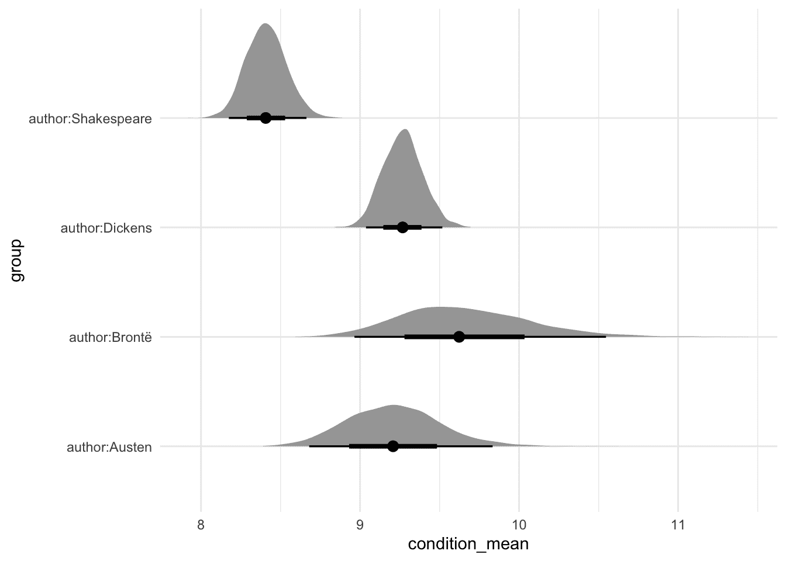

图 13.15：检查四位作者中每位作者的抽样分布*  *在这种情况下，我们通常预期勃朗特会写出三部书中最长的一部。正如预期的那样，莎士比亚通常写的作品行数最少。
  
## 13.6 结论

在本章中，我们讨论了广义线性模型并介绍了多层次建模。我们建立在第十二章中建立的基础之上，并为贝叶斯模型构建提供了一些基本要素。正如第十二章中提到的，这已经足够开始学习了。希望你能对学习更多内容感到兴奋，并且你应该从第十八章中推荐的建模书籍开始。

在第十二章和第十三章中，我们介绍了多种贝叶斯模型的处理方法。但我们并没有为每个模型都做到面面俱到。

要确定“足够”是什么很难，因为它具有情境特异性，但以下清单，从第十二章和第十三章中介绍的概念中提取，在开始时对于大多数目的来说应该是足够的。在论文的模型部分，用方程式写出模型，并包含几段文字解释这些方程式。然后说明模型选择的原因，并简要描述你考虑过的任何替代方案。最后，用一句话解释模型是如何拟合的，在这种情况下，很可能是使用`rstanarm`，并且诊断结果可以在交叉引用的附录中找到。在那个附录中，你应该包括：先验预测检查、迹图、Rhat 图、后验分布和后验预测检查。

在结果部分，你应该包括使用`modelsummary`构建的估计值表，并对其进行讨论，可能需要借助`marginaleffects`。如果使用多层次模型，包括结果图可能也很有用，可以使用`tidybayes`。模型本身应该在单独的 R 脚本中运行。它应该先进行类别和观测数的测试，然后进行系数的测试。这些测试应该基于模拟。你应该使用`saveRDS()`在 R 脚本中保存模型。在 Quarto 文档中，你应该使用`readRDS()`读取该模型。

## 13.7 练习

### 练习

1.  *(计划)* 考虑以下场景：*一个人对澳大利亚悉尼因癌症死亡的人数感兴趣。他们收集了过去 20 年五家最大医院的数据。* 请绘制出这个数据集可能的样子，然后绘制一个图表来展示所有观察结果。

1.  *(模拟)* 请进一步考虑所描述的场景，并模拟这种情况——结果（死亡人数，按原因分类）和几个预测变量。请至少包括基于模拟数据的十个测试。

1.  *(获取)* 请描述一个此类数据集的可能来源。

1.  *(探索)* 请使用`ggplot2`构建你绘制的图表。然后使用`rstanarm`构建模型。

1.  *(沟通)* 请写两段关于你所做的事情。

### 测验

1.  我们应该在什么时候考虑逻辑回归（选择一个）？

    1.  连续结果变量。

    1.  二元结果变量。

    1.  计算结果变量。

1.  我们对研究 2020 年美国总统选举中投票意愿如何随着个人收入的变化感兴趣。我们建立了一个逻辑回归模型来研究这种关系。在这个研究中，一个可能的结果变量会是（选择一个）？

    1.  被调查者是否是美国公民（是/否）

    1.  被调查者的个人收入（高/低）

    1.  被调查者是否将投票给拜登（是/否）

    1.  被调查者在 2016 年投票给了谁（特朗普/克林顿）

1.  我们对研究 2020 年美国总统选举中投票意愿如何随着个人收入的变化感兴趣。我们建立了一个逻辑回归模型来研究这种关系。在这个研究中，一些可能的自变量可以是（选择所有适用的）？

    1.  被调查者的种族（白人/非白人）

    1.  被调查者的婚姻状况（已婚/未婚）

    1.  被调查者是否将投票给拜登（是/否）

1.  泊松分布的均值等于其？

    1.  中位数。

    1.  标准差。

    1.  方差。

1.  请重新做一下关于美国选举的`rstanarm`示例，但包括额外的变量。你选择了哪个变量，模型的表现是如何提高的？

1.  请绘制当 $\lambda = 75$ 时泊松分布密度的图表。

1.  根据 Gelman, Hill, 和 Vehtari (2020)，泊松回归中的偏移量是什么？

1.  重新做一下关于“简·爱”的例子，但针对“A/a”。

1.  20 世纪的英国统计学家乔治·博克斯，著名地说，“因为所有模型都是错误的，科学家必须警惕什么是重要的错误。当老虎在国外时，关心老鼠是不恰当的。” ([Box 1976, 792)。请通过例子和引用进行讨论。

### 课堂活动

+   讨论你将如何构建一个贝叶斯回归模型来研究某人是否喜欢足球或曲棍球与他们的年龄、性别和地点之间的关联。请列出：

    +   我们感兴趣的结果和似然

    +   我们感兴趣的结果的回归模型

    +   在模型中估计任何参数的先验。

+   像在第十二章中一样，我们再次对理解法案长度与深度之间的关系感兴趣，这次是针对所有三个物种。首先为每个物种估计单独的模型。然后估计一个针对所有三个物种的模型。最后，估计一个部分池化的模型。

+   使用[入门文件夹](https://github.com/RohanAlexander/starter_folder)并创建一个新的仓库。在班级共享的 Google 文档中添加 GitHub 仓库链接。

    +   我们感兴趣的是根据教育程度、年龄组和性别以及州来解释对民主党或共和党的支持。请绘制并模拟这种情况。

    +   请获取 Cohn (2016)的数据基础，可在[此处](https://github.com/TheUpshot/2016-upshot-siena-polls/)找到。保存未编辑的数据，并构建一个分析数据集（下面有一些代码可以帮助你开始）。将每个变量的图表以及它们之间的关系图添加到数据部分。

    +   请构建一个解释“vt_pres_2”作为“性别”、“教育”和“年龄”函数的模型，以及另一个考虑“州”的模型。在模型部分撰写这两个模型，并将结果添加到结果部分（同样，下面有一些代码可以帮助你开始）。

```r
vote_data <-
 read_csv(
 "https://raw.githubusercontent.com/TheUpshot/2016-upshot-siena-polls/master/upshot-siena-polls.csv"
 )

cleaned_vote_data <-
 vote_data |>
 select(vt_pres_2, gender, educ, age, state) |>
 rename(vote = vt_pres_2) |>
 mutate(
 gender = factor(gender),
 educ = factor(educ),
 state = factor(state),
 age = as.integer(age)
 ) |>
 mutate(
 vote =
 case_when(
 vote == "Donald Trump, the Republican" ~ "0",
 vote == "Hillary Clinton, the Democrat" ~ "1",
 TRUE ~ vote
 )
 ) |>
 filter(vote %in% c("0", "1")) |>
 mutate(vote = as.integer(vote))
```

```r
vote_model <-
 stan_glm(
 formula = vote ~ age + educ,
 data = cleaned_vote_data,
 family = gaussian(),
 prior = normal(location = 0, scale = 2.5),
 prior_intercept = normal(location = 0, scale = 2.5),
 prior_aux = exponential(rate = 1),
 seed = 853
 )
```
### 任务

请考虑 Maher (1982)、Smith (2002)或 Cohn (2016)。构建他们模型的简化版本。

获取一些最近的相关数据，估计模型，并讨论你在逻辑回归、泊松回归和负二项回归之间的选择。

使用 Quarto，并包括适当的标题、作者、日期、GitHub 仓库链接、章节和引用，并确保详细指定模型。

### 论文

大约在这个时候，在线附录 F 中的*Spadina*论文是合适的。

Ansolabehere, Stephen, Brian Schaffner, and Sam Luks. 2021. “Guide to the 2020 Cooperative Election Study.” [`doi.org/10.7910/DVN/E9N6PH`](https://doi.org/10.7910/DVN/E9N6PH). Arel-Bundock, Vincent. 2022. “modelsummary: Data and Model Summaries in R.” *Journal of Statistical Software* 103 (1): 1–23. [`doi.org/10.18637/jss.v103.i01`](https://doi.org/10.18637/jss.v103.i01).———. 2023. *marginaleffects: Predictions, Comparisons, Slopes, Marginal Means, and Hypothesis Tests*. [`vincentarelbundock.github.io/marginaleffects/`](https://vincentarelbundock.github.io/marginaleffects/).———. 2024. *tinytable: Simple and Configurable Tables in “HTML,” “LaTeX,” “Markdown,” “Word,” “PNG,” “PDF,” and “Typst” Formats*. [`vincentarelbundock.github.io/tinytable/`](https://vincentarelbundock.github.io/tinytable/). Baio, Gianluca, and Marta Blangiardo. 2010. “Bayesian Hierarchical Model for the Prediction of Football Results.” *Journal of Applied Statistics* 37 (2): 253–64. [`doi.org/10.1080/02664760802684177`](https://doi.org/10.1080/02664760802684177). Bolker, Ben, and David Robinson. 2022. *broom.mixed: Tidying Methods for Mixed Models*. [`CRAN.R-project.org/package=broom.mixed`](https://CRAN.R-project.org/package=broom.mixed). Bolton, Ruth, and Randall Chapman. 1986. “Searching for Positive Returns at the Track.” *Management Science* 32 (August): 1040–60. [`doi.org/10.1287/mnsc.32.8.1040`](https://doi.org/10.1287/mnsc.32.8.1040). Box, George E. P. 1976. “Science and Statistics.” *Journal of the American Statistical Association* 71 (356): 791–99. [`doi.org/10.1080/01621459.1976.10480949`](https://doi.org/10.1080/01621459.1976.10480949). Burch, Tyler James. 2023. “2023 NHL Playoff Predictions,” April. [`tylerjamesburch.com/blog/misc/nhl-predictions`](https://tylerjamesburch.com/blog/misc/nhl-predictions). Canty, Angelo, and B. D. Ripley. 2021. *boot: Bootstrap R (S-Plus) Functions*. Chellel, Kit. 2018. “The Gambler Who Cracked the Horse-Racing Code.” *Bloomberg Businessweek*, May. [`www.bloomberg.com/news/features/2018-05-03/the-gambler-who-cracked-the-horse-racing-code`](https://www.bloomberg.com/news/features/2018-05-03/the-gambler-who-cracked-the-horse-racing-code). Cohn, Nate. 2016. “We Gave Four Good Pollsters the Same Raw Data. They Had Four Different Results.” *The New York Times*, September. [`www.nytimes.com/interactive/2016/09/20/upshot/the-error-the-polling-world-rarely-talks-about.html`](https://www.nytimes.com/interactive/2016/09/20/upshot/the-error-the-polling-world-rarely-talks-about.html). Cramer, Jan Salomon. 2003. “The Origins of Logistic Regression.” *SSRN Electronic Journal*. [`doi.org/10.2139/ssrn.360300`](https://doi.org/10.2139/ssrn.360300). Davison, A. C., and D. V. Hinkley. 1997. *Bootstrap Methods and Their Applications*. Cambridge: Cambridge University Press. [`statwww.epfl.ch/davison/BMA/`](http://statwww.epfl.ch/davison/BMA/). Edgeworth, Francis Ysidro. 1885. “Methods of Statistics.” *Journal of the Statistical Society of London*, 181–217. Firke, Sam. 2023. *janitor: Simple Tools for Examining and Cleaning Dirty Data*. [`CRAN.R-project.org/package=janitor`](https://CRAN.R-project.org/package=janitor). Friendly, Michael. 2021. *HistData: Data Sets from the History of Statistics and Data Visualization*. [`CRAN.R-project.org/package=HistData`](https://CRAN.R-project.org/package=HistData). Gelman, Andrew, Jennifer Hill, and Aki Vehtari. 2020. *Regression and Other Stories*. Cambridge University Press. [`avehtari.github.io/ROS-Examples/`](https://avehtari.github.io/ROS-Examples/). Goodrich, Ben, Jonah Gabry, Imad Ali, and Sam Brilleman. 2023. “rstanarm: Bayesian applied regression modeling via Stan.” [`mc-stan.org/rstanarm`](https://mc-stan.org/rstanarm). Hastie, Trevor, and Robert Tibshirani. 1990. *Generalized Additive Models*. 1st ed. Boca Raton: Chapman; Hall/CRC. James, Gareth, Daniela Witten, Trevor Hastie, and Robert Tibshirani. (2013) 2021. *An Introduction to Statistical Learning with Applications in R*. 2nd ed. Springer. [`www.statlearning.com`](https://www.statlearning.com). Johnson, Alicia, Miles Ott, and Mine Dogucu. 2022. *Bayes Rules! An Introduction to Bayesian Modeling with R*. 1st ed. Chapman; Hall/CRC. [`www.bayesrulesbook.com`](https://www.bayesrulesbook.com). Johnston, Myfanwy, and David Robinson. 2022. *gutenbergr: Download and Process Public Domain Works from Project Gutenberg*. [`CRAN.R-project.org/package=gutenbergr`](https://CRAN.R-project.org/package=gutenbergr). Kay, Matthew. 2022. *tidybayes: Tidy Data and Geoms for Bayesian Models*. [`doi.org/10.5281/zenodo.1308151`](https://doi.org/10.5281/zenodo.1308151). Krantz, Sebastian. 2023. *collapse: Advanced and Fast Data Transformation*. [`CRAN.R-project.org/package=collapse`](https://CRAN.R-project.org/package=collapse). Kuriwaki, Shiro, Will Beasley, and Thomas Leeper. 2023. *dataverse: R Client for Dataverse 4+ Repositories*. Maher, Michael. 1982. “Modelling Association Football Scores.” *Statistica Neerlandica* 36 (3): 109–18. [`doi.org/10.1111/j.1467-9574.1982.tb00782.x`](https://doi.org/10.1111/j.1467-9574.1982.tb00782.x). McElreath, Richard. (2015) 2020. *Statistical Rethinking: A Bayesian Course with Examples in R and Stan*. 2nd ed. Chapman; Hall/CRC. Nelder, John, and Robert Wedderburn. 1972. “Generalized Linear Models.” *Journal of the Royal Statistical Society: Series A (General)* 135 (3): 370–84. [`doi.org/10.2307/2344614`](https://doi.org/10.2307/2344614). Osgood, D. Wayne. 2000. “Poisson-Based Regression Analysis of Aggregate Crime Rates.” *Journal of Quantitative Criminology* 16 (1): 21–43. [`doi.org/10.1023/a:1007521427059`](https://doi.org/10.1023/a:1007521427059). Pitman, Jim. 1993. *Probability*. 1st ed. New York: Springer. [`doi.org/10.1007/978-1-4612-4374-8`](https://doi.org/10.1007/978-1-4612-4374-8). R Core Team. 2024. *R: A Language and Environment for Statistical Computing*. Vienna, Austria: R Foundation for Statistical Computing. [`www.R-project.org/`](https://www.R-project.org/). Schaffner, Brian, Stephen Ansolabehere, and Sam Luks. 2021. “Cooperative Election Study Common Content, 2020.” Harvard Dataverse. [`doi.org/10.7910/DVN/E9N6PH`](https://doi.org/10.7910/DVN/E9N6PH). Smith, Richard. 2002. “A Statistical Assessment of Buchanan’s Vote in Palm Beach County.” *Statistical Science* 17 (4): 441–57. [`doi.org/10.1214/ss/1049993203`](https://doi.org/10.1214/ss/1049993203). Steele, Fiona. 2007. “Multilevel Models for Longitudinal Data.” *Journal of the Royal Statistical Society Series A: Statistics in Society* 171 (1): 5–19. [`doi.org/10.1111/j.1467-985x.2007.00509.x`](https://doi.org/10.1111/j.1467-985x.2007.00509.x). Steele, Fiona, Anna Vignoles, and Andrew Jenkins. 2007. “The Effect of School Resources on Pupil Attainment: A Multilevel Simultaneous Equation Modelling Approach.” *Journal of the Royal Statistical Society Series A: Statistics in Society* 170 (3): 801–24. [`doi.org/10.1111/j.1467-985x.2007.00476.x`](https://doi.org/10.1111/j.1467-985x.2007.00476.x). Stigler, Stephen. 1978. “Francis Ysidro Edgeworth, Statistician.” *Journal of the Royal Statistical Society. Series A (General)* 141 (3): 287–322. [`doi.org/10.2307/2344804`](https://doi.org/10.2307/2344804). Wang, Wei, David Rothschild, Sharad Goel, and Andrew Gelman. 2015. “Forecasting Elections with Non-Representative Polls.” *International Journal of Forecasting* 31 (3): 980–91. [`doi.org/10.1016/j.ijforecast.2014.06.001`](https://doi.org/10.1016/j.ijforecast.2014.06.001). Wickham, Hadley, Mara Averick, Jenny Bryan, Winston Chang, Lucy D’Agostino McGowan, Romain François, Garrett Grolemund, et al. 2019. “Welcome to the Tidyverse.” *Journal of Open Source Software* 4 (43): 1686. [`doi.org/10.21105/joss.01686`](https://doi.org/10.21105/joss.01686).

1.  作为背景介绍，LOO-CV 并不是通过 `loo()` 函数实现的，因为这会过于计算密集。相反，采用了一种近似方法，该方法提供了预期的对数点预测密度（ELPD）。`rstanarm` 的示例文档提供了更多详细信息。↩︎

