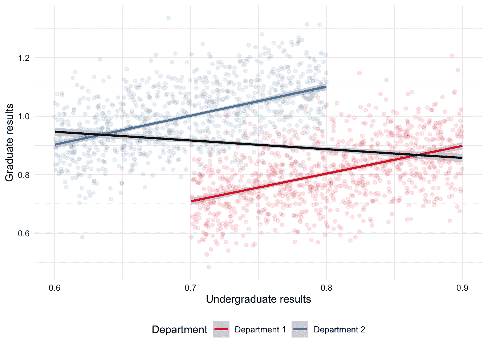
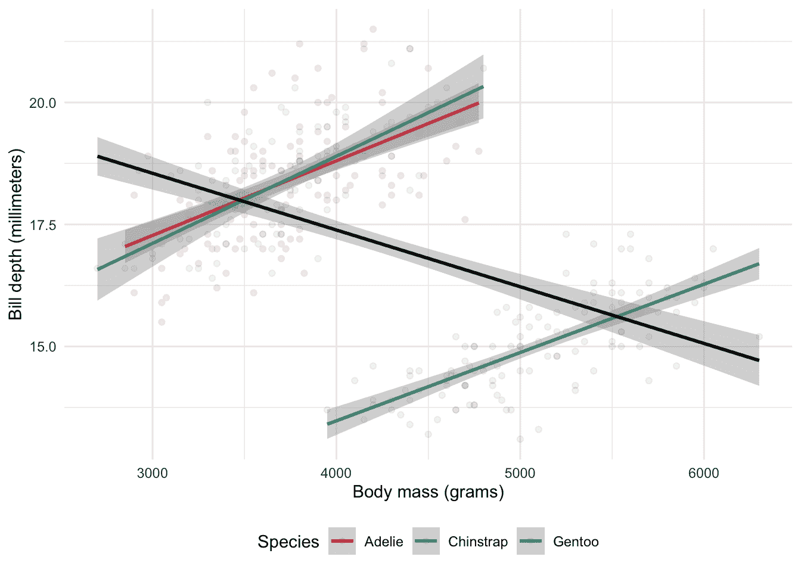
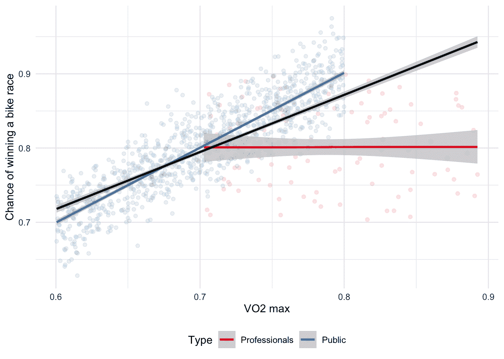
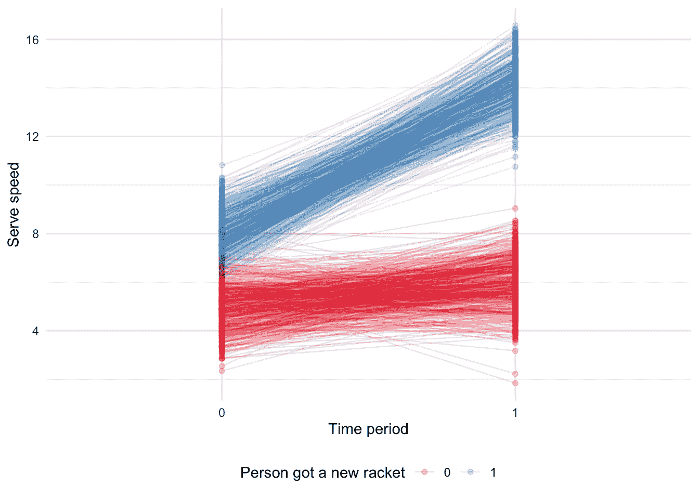
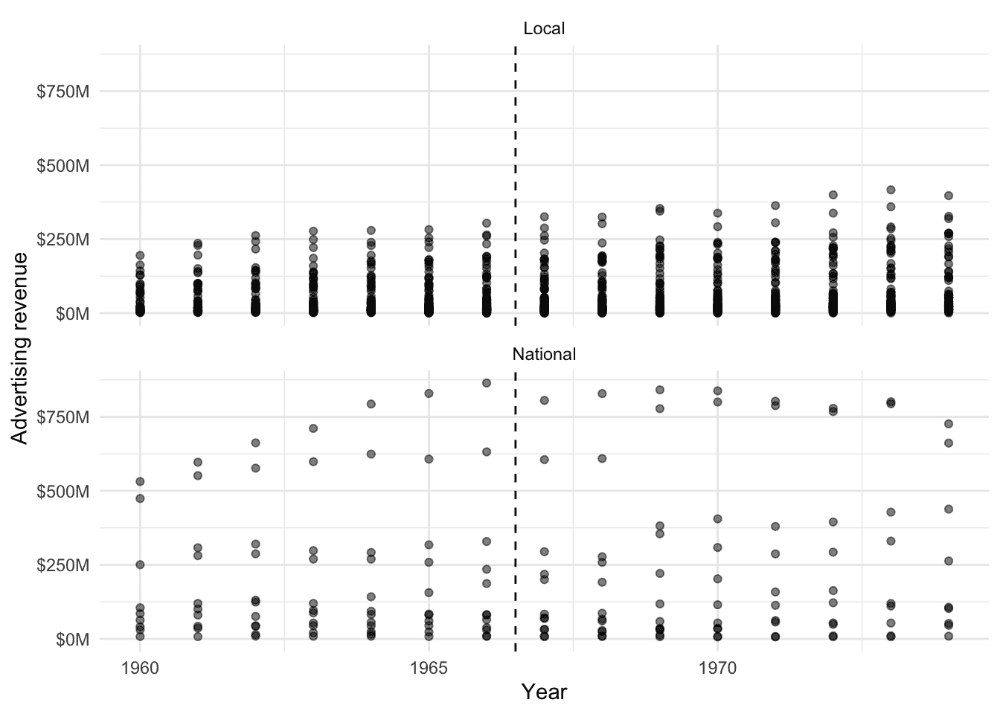
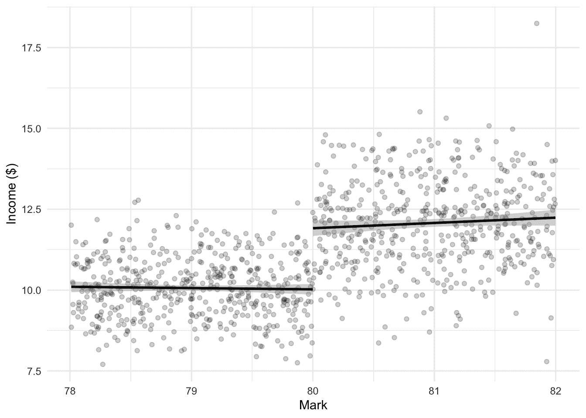
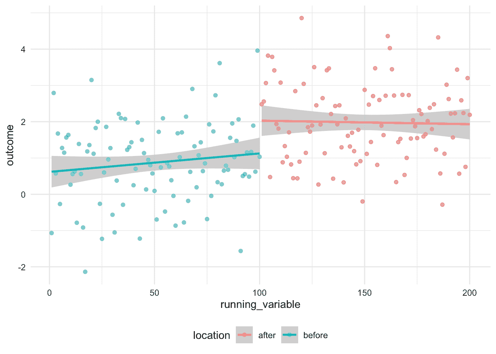
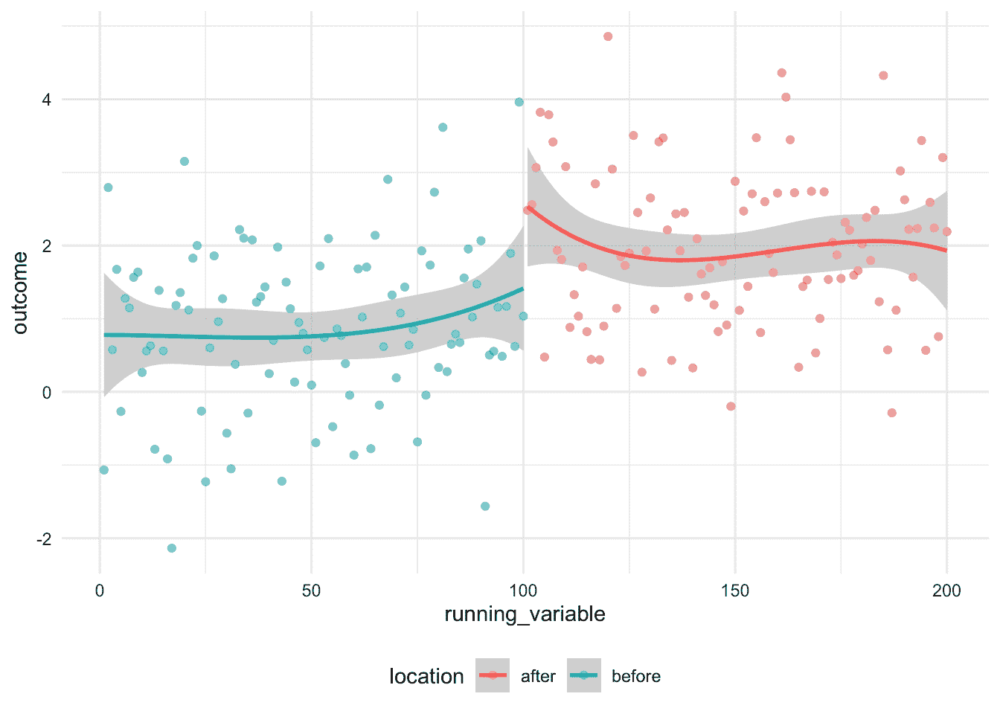
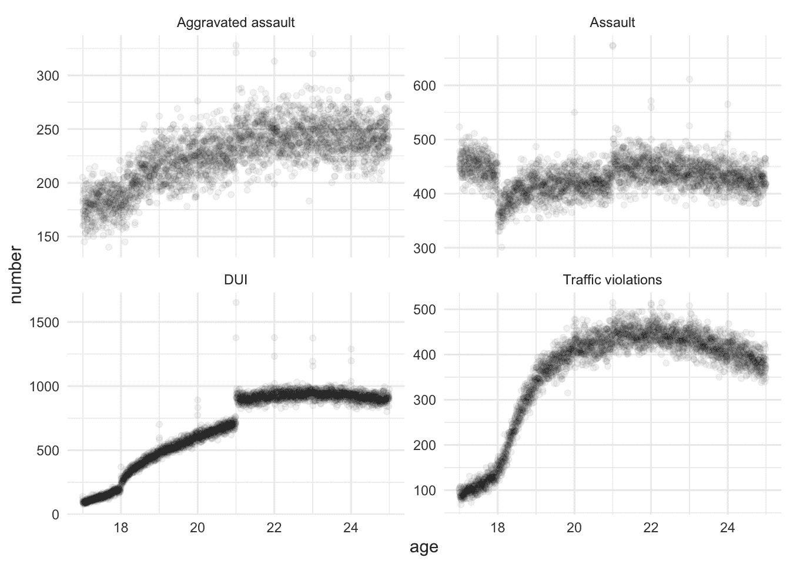
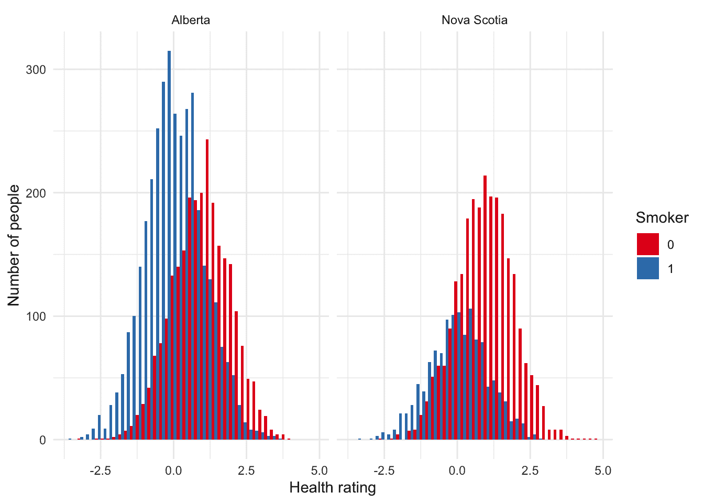

# 15  从观察数据中推断因果关系

> 原文：[`tellingstorieswithdata.com/14-causality_from_obs.html`](https://tellingstorieswithdata.com/14-causality_from_obs.html)

1.  应用

1.  15  从观察数据中推断因果关系

先决条件**

+   阅读关于数据分析师的因果设计模式的 *Causal design patterns for data analysts*，(Riederer 2021)

    +   这篇博客文章概述了从观察数据中做出因果推断的不同方法。

+   阅读关于在全民大规模疫苗接种环境中使用 *BNT162b2 mRNA Covid-19 Vaccine* 的研究，(Dagan et al. 2021)

    +   这篇论文比较了从观察数据中得出的因果结论与随机试验中的结论。

+   阅读关于研究设计和因果关系的入门书籍 *The Effect: An Introduction to Research Design and Causality*，(Huntington-Klein 2021)

    +   重点关注第十八章“双重差分”，第十九章“工具变量”和第二十章“回归不连续性”，这些章节提供了从观察数据中做出因果推断的三个关键方法的概述。

+   阅读关于将回归不连续性设计视为观察研究的 *Understanding regression discontinuity designs as observational studies*，(Sekhon and Titiunik 2017)

    +   讨论了使用回归不连续性的一些担忧。

关键概念和技能**

+   进行实验并不总是可能的，但我们可以使用各种方法，从而在一定程度上探讨因果关系。

+   我们需要小心常见的悖论，包括辛普森悖论和伯克森悖论，并意识到匹配的潜在优势和陷阱。

+   当我们拥有两个时期内处理组和未处理组的数据时，我们可以使用双重差分。当一组要么被处理要么未被处理，但除了处理之外两组非常相似时，回归不连续性是有用的。工具变量是一种通过另一个变量间接估计因果关系的途径。

+   通常，这些方法需要我们谦逊地使用，并关注弱点及假设，包括我们可以测试的和那些我们不能测试的。

软件和包**

+   Base R (R Core Team 2024)

+   `broom` (Robinson, Hayes, and Couch 2022)

+   `broom.mixed` (Bolker and Robinson 2022)

+   `estimatr` (Blair et al. 2021)

+   `haven` (Wickham, Miller, and Smith 2023)

+   `MatchIt` (Ho et al. 2011)

+   `modelsummary` (Arel-Bundock 2022)

+   `palmerpenguins` (Horst, Presmanes Hill, and Gorman 2020)

+   `rdrobust` (Calonico et al. 2021)

+   `rstanarm` (Goodrich et al. 2023)

+   `scales` (Wickham and Seidel 2022)

+   `tidyverse` (Wickham et al. 2019)

+   `tinytable` (Arel-Bundock 2024)

```r
library(broom)
library(broom.mixed)
library(estimatr)
library(haven)
library(MatchIt)
library(modelsummary)
library(palmerpenguins)
library(rdrobust)
library(rstanarm)
library(scales)
library(tidyverse)
library(tinytable)
```

## 15.1 简介

当我们能够进行实验来探讨因果关系时，生活是伟大的。但有些情况下，我们无法进行实验，然而我们仍然希望能够做出因果推断。外部实验的数据具有实验所不具备的价值。在本章中，我们讨论了允许我们使用观察数据来探讨因果关系的情境和方法。我们使用相对简单的方法，以复杂的方式，从统计学中汲取，同时也借鉴了包括经济学、政治学以及流行病学在内的多种社会科学。

例如，Dagan 等人（2021）使用观察数据来证实辉瑞-生物科技疫苗的有效性。他们讨论了使用观察数据时可能存在的一个问题是混杂，即我们担心存在某些变量同时影响预测变量和结果变量，并可能导致虚假的关系。Dagan 等人（2021）通过首先列出潜在的混杂因素，如年龄、性别、地理位置和医疗使用情况，然后通过匹配接种疫苗和未接种疫苗的人进行一对一调整来解决这个问题。实验数据指导了观察数据的使用，而后者更大的规模使得可以专注于特定的年龄组和疾病程度。

本章是关于以复杂方式使用观察数据的。我们如何在无法进行 A/B 测试或随机对照试验的情况下仍然感到舒适地做出因果陈述。实际上，在什么情况下我们可能更愿意不进行这些测试，或者除了它们之外还进行基于观察的方法。我们涵盖了三种主要方法：双重差分法、回归间断法和工具变量法。

## 15.2 两种常见的悖论

有两种情况，数据可能会欺骗我们，它们如此普遍，以至于我们将明确地讨论它们。这些是：

1.  辛普森悖论，

1.  伯克森悖论。

### 15.2.1 辛普森悖论

当我们估计数据子集的一些关系时，但当我们考虑整个数据集时却出现不同的关系时，就发生了 Simpson 悖论(Simpson 1951)。它是生态谬误的一个特例，即当我们试图根据他们的群体对个体做出断言时。例如，当单独考虑每个部门时，两个部门之间本科成绩和研究生表现之间可能存在正相关关系。但如果本科成绩在一个部门中普遍高于另一个部门，而研究生表现则相反，我们可能会发现本科成绩和研究生表现之间存在负相关关系。我们可以通过模拟一些数据来更清楚地展示这一点(图 15.1))。

```r
set.seed(853)

number_in_each <- 1000

department_one <-
 tibble(
 undergrad = runif(n = number_in_each, min = 0.7, max = 0.9),
 noise = rnorm(n = number_in_each, 0, sd = 0.1),
 grad = undergrad + noise,
 type = "Department 1"
 )

department_two <-
 tibble(
 undergrad = runif(n = number_in_each, min = 0.6, max = 0.8),
 noise = rnorm(n = number_in_each, 0, sd = 0.1),
 grad = undergrad + noise + 0.3,
 type = "Department 2"
 )

both_departments <- rbind(department_one, department_two)

both_departments
```

```r
# A tibble: 2,000 × 4
   undergrad   noise  grad type        
       <dbl>   <dbl> <dbl> <chr>       
 1     0.772 -0.0566 0.715 Department 1
 2     0.724 -0.0312 0.693 Department 1
 3     0.797  0.0770 0.874 Department 1
 4     0.763 -0.0664 0.697 Department 1
 5     0.707  0.0717 0.779 Department 1
 6     0.781 -0.0165 0.764 Department 1
 7     0.726 -0.104  0.623 Department 1
 8     0.749  0.0527 0.801 Department 1
 9     0.732 -0.0471 0.684 Department 1
10     0.738  0.0552 0.793 Department 1
# ℹ 1,990 more rows


```r
both_departments |>
 ggplot(aes(x = undergrad, y = grad)) +
 geom_point(aes(color = type), alpha = 0.1) +
 geom_smooth(aes(color = type), method = "lm", formula = "y ~ x") +
 geom_smooth(method = "lm", formula = "y ~ x", color = "black") +
 labs(
 x = "Undergraduate results",
 y = "Graduate results",
 color = "Department"
 ) +
 theme_minimal() +
 scale_color_brewer(palette = "Set1") +
 theme(legend.position = "bottom")
```



图 15.1：展示模拟数据的 Simpson 悖论*  *Simpson 悖论通常使用加州大学伯克利分校的真实世界数据来展示，这些数据是关于研究生录取的(Bickel, Hammel, and O’Connell 1975)。这篇论文在第四章中被提及，拥有史上最伟大的副标题之一。Hernán, Clayton, 和 Keiding (2011) 创建了 DAGs，进一步阐明了悖论的关系和原因。

最近，正如其文档中提到的，“penguins”数据集来自`palmerpenguins`，它提供了一个 Simpson 悖论的例子，使用真实世界数据展示了不同企鹅物种之间身体质量和喙深度的关系(图 15.2)。整体呈现的负趋势是因为 Gentoo 企鹅通常比 Adelie 和 Chinstrap 企鹅重，但喙较短。

```r
penguins |>
 ggplot(aes(x = body_mass_g, y = bill_depth_mm)) +
 geom_point(aes(color = species), alpha = 0.1) +
 geom_smooth(aes(color = species), method = "lm", formula = "y ~ x") +
 geom_smooth(
 method = "lm",
 formula = "y ~ x",
 color = "black"
 ) +
 labs(
 x = "Body mass (grams)",
 y = "Bill depth (millimeters)",
 color = "Species"
 ) +
 theme_minimal() +
 scale_color_brewer(palette = "Set1") +
 theme(legend.position = "bottom")
```



图 15.2：展示企鹅喙深度数据集与身体质量关系的 Simpson 悖论
  
### 15.2.2 Berkson 悖论

当我们基于我们所拥有的数据集估计某种关系时，伯克森悖论就会发生，因为数据集的选取方式使得这种关系在更一般的数据集中有所不同 (Berkson 1946). 例如，如果我们有一个职业自行车手的数据库，我们可能会发现他们的最大摄氧量（VO2 max）和赢得自行车比赛的机会之间没有关系 (Coyle et al. 1988; Podlogar, Leo, and Spragg 2022). 但如果我们有一个普通人群的数据库，我们可能会发现这两个变量之间存在关系。专业数据库的选取方式使得这种关系消失了；一个人如果不能有足够的最大摄氧量，就不能成为职业自行车手，但在职业自行车手中，每个人都有足够的最大摄氧量。再次，我们可以模拟一些数据来更清楚地展示这一点 (图 15.3)。

```r
set.seed(853)

num_pros <- 100
num_public <- 1000

professionals <- tibble(
 VO2 = runif(num_pros, 0.7, 0.9),
 chance_of_winning = runif(num_pros, 0.7, 0.9),
 type = "Professionals"
)

general_public <- tibble(
 VO2 = runif(num_public, 0.6, 0.8),
 chance_of_winning = VO2 + rnorm(num_public, 0, 0.03) + 0.1,
 type = "Public"
)

professionals_and_public <- bind_rows(professionals, general_public)
```

```r
professionals_and_public |>
 ggplot(aes(x = VO2, y = chance_of_winning)) +
 geom_point(aes(color = type), alpha = 0.1) +
 geom_smooth(aes(color = type), method = "lm", formula = "y ~ x") +
 geom_smooth(method = "lm", formula = "y ~ x", color = "black") +
 labs(
 x = "VO2 max",
 y = "Chance of winning a bike race",
 color = "Type"
 ) +
 theme_minimal() +
 scale_color_brewer(palette = "Set1") +
 theme(legend.position = "bottom")


*

图 15.3：模拟数据的示意图，展示了伯克森悖论
  
## 15.3 差分-差分法

能够进行实验的理想情况很少可能实现。我们能否合理地期望 Netflix 会允许我们改变价格？即使他们曾经这样做过，他们是否还会让我们再次这样做，一次又一次？此外，我们很少能够明确地创建处理组和对照组。最后，实验可能既昂贵又不道德。因此，我们需要尽力而为。而不是通过随机化，我们的反事实通过随机化来到我们面前，因此我们知道这两者除了处理之外是相同的，我们试图识别那些除了处理之外相似但不同的群体，因此任何差异都可以归因于处理。

在观察性数据中，有时在我们进行干预之前，我们的两组之间存在差异。只要这些干预前的差异满足基本假设，即这些差异是一致的，并且我们预计在没有干预的情况下这种一致性会持续存在——“平行趋势”假设——那么我们可以将任何差分中的差异视为干预的效果。差分-差分分析的一个方面是，我们可以使用相对简单的方法来进行，例如 Tang (2015)。使用二元变量的线性回归就足以开始并做好令人信服的工作。

想要知道新网球拍对发球速度的影响。一种测试方法可以是测量没有网球拍时罗杰·费德勒的发球速度和有网球拍的业余爱好者维尔（让我们称他们为维尔）的发球速度之间的差异。是的，我们会找到一个差异，但我们能知道有多少可以归因于网球拍吗？另一种方法是考虑维尔没有新网球拍时的发球速度和维尔有新网球拍时的发球速度之间的差异。但如果是发球速度随着时间的推移自然变快呢？相反，我们将两种方法结合起来，看看差异的差异。

我们首先测量费德勒的发球速度，并将其与维尔的发球速度进行比较，两者都没有使用新球拍。然后我们再次测量费德勒的发球速度，并测量维尔使用新球拍的发球速度。这种差异的差异将是新球拍效应的估计。我们必须问几个关键问题，以确定这种分析是否适当：

1.  是否还有其他可能只影响维尔，而不影响费德勒的因素，这些因素可能会影响维尔的发球速度？

1.  费德勒和维尔是否具有相同的发球速度改进轨迹？这是“平行趋势”假设，它在许多双重差分分析讨论中占主导地位。

1.  最后，费德勒和维尔的发球速度的方差是否相同？

尽管有这些要求，但双重差分法是一种强大的方法，因为我们不需要在治疗之前治疗组和对照组是相同的。我们只需要有一个很好的想法，了解它们是如何不同的。

### 15.3.1 模拟示例：网球发球速度

为了更具体地说明情况，我们模拟数据。我们将模拟一个初始时不同人的发球速度之间有一个差异的情况，然后在使用新网球拍后，差异变为六个。我们可以用图表来展示这种情况（图 15.4）。

```r
set.seed(853)

simulated_diff_in_diff <-
 tibble(
 person = rep(c(1:1000), times = 2),
 time = c(rep(0, times = 1000), rep(1, times = 1000)),
 treat_group = rep(sample(x = 0:1, size = 1000, replace = TRUE ), times = 2)
 ) |>
 mutate(
 treat_group = as.factor(treat_group),
 time = as.factor(time)
 )

simulated_diff_in_diff <-
 simulated_diff_in_diff |>
 rowwise() |>
 mutate(
 serve_speed = case_when(
 time == 0 & treat_group == 0 ~ rnorm(n = 1, mean = 5, sd = 1),
 time == 1 & treat_group == 0 ~ rnorm(n = 1, mean = 6, sd = 1),
 time == 0 & treat_group == 1 ~ rnorm(n = 1, mean = 8, sd = 1),
 time == 1 & treat_group == 1 ~ rnorm(n = 1, mean = 14, sd = 1)
 )
 )

simulated_diff_in_diff
```

```r
# A tibble: 2,000 × 4
# Rowwise: 
   person time  treat_group serve_speed
    <int> <fct> <fct>             <dbl>
 1      1 0     0                  4.43
 2      2 0     1                  6.96
 3      3 0     1                  7.77
 4      4 0     0                  5.31
 5      5 0     0                  4.09
 6      6 0     0                  4.85
 7      7 0     0                  6.43
 8      8 0     0                  5.77
 9      9 0     1                  6.13
10     10 0     1                  7.32
# ℹ 1,990 more rows


```r
simulated_diff_in_diff |>
 ggplot(aes(x = time, y = serve_speed, color = treat_group)) +
 geom_point(alpha = 0.2) +
 geom_line(aes(group = person), alpha = 0.1) +
 theme_minimal() +
 labs(x = "Time period", y = "Serve speed", color = "Person got a new racket") +
 scale_color_brewer(palette = "Set1") +
 theme(legend.position = "bottom")
```



图 15.4：展示在使用新网球拍前后差异的模拟数据图* *我们可以通过查看差异的平均差异来手动获得我们的估计。当我们这样做时，我们发现我们估计新网球拍的效果为 5.06，这与我们模拟的相似。

```r
ave_diff <-
 simulated_diff_in_diff |>
 pivot_wider(
 names_from = time,
 values_from = serve_speed,
 names_prefix = "time_"
 ) |>
 mutate(difference = time_1 - time_0) |>
 # Average difference between old and new racket serve speed within groups
 summarise(average_difference = mean(difference),
 .by = treat_group)

# Difference between the average differences of each group
ave_diff$average_difference[2] - ave_diff$average_difference[1]
```

```r
[1] 5.058414


我们可以使用线性回归得到相同的结果。我们感兴趣的模型是：

$$Y_{i,t} = \beta_0 + \beta_1\times\mbox{Treatment}_i + \beta_2\times\mbox{Time}_t + \beta_3\times(\mbox{Treatment} \times\mbox{Time})_{i,t} + \epsilon_{i,t}$$

虽然我们应该包括单独的方面，但我们感兴趣的是交互作用的估计。在这种情况下，它是 $\beta_3$。我们发现我们的估计效应是 5.06 (表 15.1)。

```r
diff_in_diff_example_regression <-
 stan_glm(
 formula = serve_speed ~ treat_group * time,
 data = simulated_diff_in_diff,
 family = gaussian(),
 prior = normal(location = 0, scale = 2.5, autoscale = TRUE),
 prior_intercept = normal(0, 2.5, autoscale = TRUE),
 prior_aux = exponential(rate = 1, autoscale = TRUE),
 seed = 853
 )

saveRDS(
 diff_in_diff_example_regression,
 file = "diff_in_diff_example_regression.rds"
)
```

```r
diff_in_diff_example_regression <-
 readRDS(file = "diff_in_diff_example_regression.rds")
```

```r
modelsummary(
 diff_in_diff_example_regression
)
```

表 15.1：获得新网球拍前后模拟数据的差异说明

|  | (1) |
| --- | --- |
| (Intercept) | 4.971 |
| treatment_group1 | 3.035 |
| time1 | 1.006 |
| treatment_group1 × time1 | 5.057 |
| Num.Obs. | 2000 |
| R2 | 0.927 |
| R2 Adj. | 0.927 |
| Log.Lik. | -2802.166 |
| ELPD | -2806.3 |
| ELPD s.e. | 32.1 |
| LOOIC | 5612.5 |
| LOOIC s.e. | 64.2 |
| WAIC | 5612.5 |

| RMSE | 0.98 |
  
### 15.3.2 假设

如果我们想使用双重差分法，那么我们需要满足假设。之前提到了三个假设，但在这里我们将重点放在“平行趋势”假设上。平行趋势假设困扰着与双重差分分析相关的所有事情，因为我们永远无法证明它；我们只能被说服，并试图说服他人。

要了解为什么我们永远无法证明这一点，可以考虑一个例子，我们想知道新体育场对职业运动队胜负的影响。为此，我们考虑了两支职业篮球队：金州勇士队和多伦多猛龙队。勇士队在 2019-20 赛季开始时更换了体育场，而猛龙队没有，因此我们将考虑四个时间段：2016-17 赛季、2017-18 赛季、2018-19 赛季，最后我们将比较他们搬迁后的表现，即 2019-20 赛季。猛龙队在这里充当我们的对照。这意味着我们假设在没有新体育场的情况下，勇士队和猛龙队之间的关系将继续以一致的方式变化。但因果推断的基本问题意味着我们永远无法确定这一点。我们必须提供足够的证据来消除读者可能有的任何疑虑。

在使用双重差分法时，存在四个主要的有效性威胁，我们需要解决所有这些问题 (Cunningham 2021, 272–77)：

1.  非平行趋势。处理组和对照组可能基于差异。因此，可能很难有说服力的论证平行趋势。在这种情况下，也许可以尝试在模型中考虑另一个因素，以调整其中的一些差异。这可能需要三重差分方法。例如，在先前的例子中，我们可能可以添加旧金山 49 人队，一支橄榄球队，因为它们与勇士队位于相同的广泛地理区域内。或者也许重新思考分析，看看我们是否可以创建不同的对照组。添加额外的早期时间段可能会有所帮助，但也可能引入更多问题，我们在第三点中提到了这些问题。

1.  组成差异。当处理重复横截面时，这是一个需要关注的问题。如果这些横截面的组成发生变化怎么办？例如，如果我们正在开发一个快速增长的 APP，并想观察某些变化的影响。在我们的初始横截面上，我们可能主要是年轻人，但在随后的横截面上，由于 APP 使用人群的年龄结构变化，可能会有更多老年人。因此，我们的结果可能只是年龄效应，而不是我们感兴趣的变化的影响。

1.  与可靠性相比的长期影响。正如我们在第八章中讨论的，我们在分析中运行的时间长度存在权衡。随着分析时间的延长，其他因素影响结果的机会更多。同时，也有更大的可能性，那些未接受处理的人会接受处理。但另一方面，很难有说服力地论证短期结果会持续到长期。

1.  函数形式依赖。当结果相似时，这不是一个问题，但如果结果不同，函数形式可能对结果的一些方面负责。

### 15.3.3 1960 年至 1974 年法国报纸价格

在本案例研究中，我们介绍了 Angelucci 和 Cagé（2019）。他们感兴趣的是了解电视引入对法国报纸的影响。我们将复制其主要发现之一。

报纸的商业模式受到了互联网的挑战，许多地方报纸已经关闭。这个问题并不新鲜。当电视被引入时，也存在类似的担忧。Angelucci 和 Cagé（2019）利用 1967 年宣布的法国电视广告的引入来检验减少广告收入对报纸的影响。他们创建了一个包含 1960 年至 1974 年法国报纸的数据集，然后使用双重差分法来检验广告收入减少对报纸内容和价格的影响。他们关注的变化是电视广告的引入，他们认为这比地方报纸对全国报纸的影响更大。他们发现这一变化导致报纸上的新闻内容减少，报纸价格降低。关注这一变化，并使用双重差分法进行分析，是很重要的，因为它使我们能够区分几个相互竞争的影响。例如，报纸是否因为无法再为广告收取高价而变得多余，或者是因为消费者更愿意从电视上获取新闻？

我们可以通过注册后免费获取支撑 Angelucci 和 Cagé (2019) 的数据集。数据集为 Stata 数据格式，“.dta”，我们可以使用`haven`中的`read_dta()`读取。我们感兴趣的是“Angelucci_Cage_AEJMicro_dataset.dta”文件，它位于“dta”文件夹中。

```r
newspapers <- read_dta("Angelucci_Cage_AEJMicro_dataset.dta")
```

数据集中有 1,196 个观测值和 52 个变量。Angelucci 和 Cagé (2019) 关注 1960-1974 这一时期，大约有 100 家报纸。该时期初期有 14 家全国性报纸，末期有 12 家。关键时期是 1967 年，当时法国政府宣布将允许在电视上做广告。Angelucci 和 Cagé (2019) 认为，全国性报纸受到了这一变化的影响，而地方报纸则没有。全国性报纸是处理组，地方报纸是对照组。

我们只关注标题差异差异的结果，并构建汇总统计量。

```r
newspapers <-
 newspapers |>
 select(
 year, id_news, after_national, local, national, ra_cst, ps_cst, qtotal
 ) |> 
 mutate(ra_cst_div_qtotal = ra_cst / qtotal, 
 across(c(id_news, after_national, local, national), as.factor),
 year = as.integer(year))

newspapers
```

```r
# A tibble: 1,196 × 9
    year id_news after_national local national    ra_cst ps_cst  qtotal
   <int> <fct>   <fct>          <fct> <fct>        <dbl>  <dbl>   <dbl>
 1  1960 1       0              1     0         52890272   2.29  94478.
 2  1961 1       0              1     0         56601060   2.20  96289.
 3  1962 1       0              1     0         64840752   2.13  97313.
 4  1963 1       0              1     0         70582944   2.43 101068.
 5  1964 1       0              1     0         74977888   2.35 102103.
 6  1965 1       0              1     0         74438248   2.29 105169.
 7  1966 1       0              1     0         81383000   2.31 126235.
 8  1967 1       0              1     0         80263152   2.88 128667.
 9  1968 1       0              1     0         87165704   3.45 131824.
10  1969 1       0              1     0        102596384   3.28 132417.
# ℹ 1,186 more rows
# ℹ 1 more variable: ra_cst_div_qtotal <dbl>
```
我们关注从 1967 年开始发生的情况，特别是广告收入，以及这与全国性报纸相比是否有所不同（图 15.5）。我们使用`scales`调整 y 轴。

```r
newspapers |>
 mutate(type = if_else(local == 1, "Local", "National")) |>
 ggplot(aes(x = year, y = ra_cst)) +
 geom_point(alpha = 0.5) +
 scale_y_continuous(
 labels = dollar_format(
 prefix = "$",
 suffix = "M",
 scale = 0.000001)) +
 labs(x = "Year", y = "Advertising revenue") +
 facet_wrap(vars(type), nrow = 2) +
 theme_minimal() +
 geom_vline(xintercept = 1966.5, linetype = "dashed")
```



图 15.5：法国报纸收入（1960-1974），按地方或全国性分类*  *我们感兴趣要估计的模型是：

$$\mbox{ln}(y_{n,t}) = \beta_0 + \beta_1\times(\mbox{National binary}\times\mbox{1967 onward binary}) + \lambda_n + \gamma_t + \epsilon$$

我们特别关注的是$\beta_1$系数。我们使用`stan_glm()`估计模型。

```r
ad_revenue <-
 stan_glm(
 formula = log(ra_cst) ~ after_national + id_news + year,
 data = newspapers,
 family = gaussian(),
 prior = normal(location = 0, scale = 2.5, autoscale = TRUE),
 prior_intercept = normal(0, 2.5, autoscale = TRUE),
 prior_aux = exponential(rate = 1, autoscale = TRUE),
 seed = 853
 )

saveRDS(
 ad_revenue,
 file = "ad_revenue.rds"
)

ad_revenue_div_circulation <-
 stan_glm(
 formula = log(ra_cst_div_qtotal) ~ after_national + id_news + year,
 data = newspapers,
 family = gaussian(),
 prior = normal(location = 0, scale = 2.5, autoscale = TRUE),
 prior_intercept = normal(0, 2.5, autoscale = TRUE),
 prior_aux = exponential(rate = 1, autoscale = TRUE),
 seed = 853
 )

saveRDS(
 ad_revenue_div_circulation,
 file = "ad_revenue_div_circulation.rds"
)

# Consumer side
subscription_price <-
 stan_glm(
 formula = log(ps_cst) ~ after_national + id_news + year,
 data = newspapers,
 family = gaussian(),
 prior = normal(location = 0, scale = 2.5, autoscale = TRUE),
 prior_intercept = normal(0, 2.5, autoscale = TRUE),
 prior_aux = exponential(rate = 1, autoscale = TRUE),
 seed = 853
 )

saveRDS(
 subscription_price,
 file = "subscription_price.rds"
)
```

```r
ad_revenue <-
 readRDS(file = "ad_revenue.rds")

ad_revenue_div_circulation <-
 readRDS(file = "ad_revenue_div_circulation")

subscription_price <-
 readRDS(file = "subscription_price.rds")
```

在表 15.2 中查看广告方面的变量，如收入和价格，我们发现系数始终为负。

```r
selected_variables <- c("year" = "Year", "after_national1" = "After change")

modelsummary(
 models = list(
 "Ad revenue" = ad_revenue,
 "Ad revenue over circulation" = ad_revenue_div_circulation,
 "Subscription price" = subscription_price
 ),
 fmt = 2,
 coef_map = selected_variables
)
```

表 15.2：电视广告法变更对法国报纸收入（1960-1974）的影响

|  | 广告收入 | 广告收入占发行量比例 | 订阅价格 |
| --- | --- | --- | --- |
| 年份 | 0.05 | 0.04 | 0.05 |
| 变化后 | -0.23 | -0.15 | -0.04 |
| 观测数 | 1052 | 1048 | 1044 |
| R2 | 0.984 | 0.896 | 0.868 |
| R2 Adj. | 0.983 | 0.886 | 0.852 |
| Log.Lik. | 336.539 | 441.471 | 875.559 |
| ELPD | 257.4 | 362.3 | 793.5 |
| ELPD s.e. | 34.4 | 45.6 | 24.3 |
| LOOIC | -514.8 | -724.6 | -1586.9 |
| LOOIC s.e. | 68.9 | 91.2 | 48.6 |
| WAIC | -515.9 | -725.5 | -1588.9 |

| RMSE | 0.17 | 0.16 | 0.10 |*  *我们可以复制 Angelucci 和 Cagé（2019）的主要结果，并发现许多情况下，从 1967 年开始似乎存在差异。Angelucci 和 Cagé（2019, 353–58）还包含了一个关于差异法模型所需的解释、外部效度和稳健性的讨论的优秀示例。
  
## 15.4 倾向得分匹配

差分法是一种强大的分析框架。但确定适当的处理组和对照组可能很困难。亚历山大和沃德（2018）比较了移民兄弟，其中一位兄弟的大部分教育在一个不同的国家完成，而另一位兄弟的大部分教育在美国完成。考虑到可用的数据，这种匹配提供了一个合理的处理组和对照组。但其他匹配可能会产生不同的结果，例如朋友或堂兄弟姐妹。

我们只能根据可观察变量进行匹配。例如，年龄组或教育。在两个不同时间，我们比较一个城市的 18 岁青少年的吸烟率与另一个城市的 18 岁青少年的吸烟率。这将是一个粗略的匹配，因为我们知道即使在通常观察到的变量（如性别和教育）方面，18 岁的青少年之间也存在许多差异。处理这种差异的一种方法是为子组创建：高中毕业的 18 岁男性等。但这样样本量会迅速减少。我们还面临如何处理连续变量的问题。而且，18 岁的青少年真的和 19 岁的青少年有很大不同吗？为什么不能也与他们进行比较？

一种进行的方法是考虑最近邻方法，但这种方法对不确定性的关注可能有限。由于我们最终得到一个高维图，因此也可能存在许多变量的问题。这导致了倾向得分匹配。在这里，我们解释倾向得分匹配的过程以及一些常见的关于它的担忧。

倾向得分匹配涉及为每个观测值分配一些概率——“倾向得分”。我们根据观测值对预测变量的值（没有治疗的情况）来构建这个概率。这个概率是我们对观测值被治疗的概率的最佳猜测，无论它实际上是否被治疗。例如，如果 18 岁的男性接受了治疗，而 19 岁的男性没有接受治疗，那么由于 18 岁和 19 岁的男性在总体上没有太大的差异，我们分配的概率将是相似的。然后我们比较具有相似倾向得分的观测值的结局。

### 15.4.1 模拟示例：免费送货

倾向得分匹配的一个优点是它允许我们一次性考虑许多预测变量，并且可以使用逻辑回归来构建。更具体地说，我们可以模拟一些数据。我们将假装我们为一家大型在线零售商工作。我们将对一些个人提供免费送货，看看这会对他们的平均购买产生什么影响。

```r
set.seed(853)

sample_size <- 10000

purchase_data <-
 tibble(
 unique_person_id = 1:sample_size,
 age = sample(x = 18:100, size = sample_size, replace = TRUE),
 gender = sample(
 x = c("Female", "Male", "Other/decline"),
 size = sample_size,
 replace = TRUE,
 prob = c(0.49, 0.47, 0.02)
 ),
 income = rnorm(n = sample_size, mean = 60000, sd = 15000) |> round(0)
 ) 

purchase_data
```

```r
# A tibble: 10,000 × 4
   unique_person_id   age gender income
              <int> <int> <chr>   <dbl>
 1                1    26 Male    68637
 2                2    81 Female  71486
 3                3    34 Male    75652
 4                4    46 Male    68068
 5                5   100 Female  73206
 6                6    20 Male    41872
 7                7    50 Female  75957
 8                8    36 Female  56566
 9                9    72 Male    54621
10               10    52 Female  40722
# ℹ 9,990 more rows
```
然后我们需要添加一些获得免费送货的概率。我们将说这取决于我们的预测变量，并且年轻、高收入、男性个体使这种处理更有可能。我们之所以知道这一点，是因为我们模拟了这种情况。如果我们使用实际数据，我们就不会知道这一点。

```r
purchase_data <- 
 purchase_data |>
 mutate(
 # change characteristics to bounded numbers
 age_num = rank(1 / age, ties.method = "random") %/% 3000,
 # force it between 0 and 3
 gender_num = case_when(
 gender == "Male" ~ 3,
 gender == "Female" ~ 2,
 gender == "Other/decline" ~ 1
 ),
 income_num = rank(income, ties.method = "random") %/% 3000
 ) |>
 mutate(
 sum_num = age_num + gender_num + income_num,
 softmax_prob = exp(sum_num) / exp(max(sum_num) + 0.5),
 free_shipping = rbinom(n = sample_size, size = 1, prob = softmax_prob)) |>
 select(-(age_num:softmax_prob))
```

最后，我们需要有一个衡量一个人平均花费的指标。我们将假设这会随着收入的增加而增加。我们希望有免费送货的人的平均花费略高于没有免费送货的人。

```r
purchase_data <-
 purchase_data |>
 mutate(
 noise = rnorm(n = nrow(purchase_data), mean = 5, sd = 2),
 spend = income / 1000 + noise,
 spend = if_else(free_shipping == 1, spend + 10, spend),
 spend = as.integer(spend)
 ) |>
 select(-noise) |>
 mutate(across(c(gender, free_shipping), as.factor))

purchase_data
```

```r
# A tibble: 10,000 × 6
   unique_person_id   age gender income free_shipping spend
              <int> <int> <fct>   <dbl> <fct>         <int>
 1                1    26 Male    68637 0                72
 2                2    81 Female  71486 0                73
 3                3    34 Male    75652 0                80
 4                4    46 Male    68068 0                75
 5                5   100 Female  73206 0                78
 6                6    20 Male    41872 0                45
 7                7    50 Female  75957 0                78
 8                8    36 Female  56566 0                62
 9                9    72 Male    54621 0                55
10               10    52 Female  40722 0                47
# ℹ 9,990 more rows
```
直观地我们可以看到，免费送货和没有免费送货的人之间的平均花费存在差异（表 15.3）。但基本问题是，如果这些人没有免费送货，他们的花费会是多少。 表 15.3 显示了平均比较，但并不是每个人都有相同的机会获得免费送货。因此，我们质疑使用平均比较的有效性。相反，我们使用倾向得分匹配来“链接”每个实际获得免费送货的观测值与基于可观察变量的、未获得免费送货的最相似观测值。

```r
purchase_data |>
 summarise(average_spend = round(mean(spend), 2), .by = free_shipping) |>
 mutate(free_shipping = if_else(free_shipping == 0, "No", "Yes")) |>
 tt() |> 
 style_tt(j = 1:2, align = "lr") |> 
 setNames(c("Received free shipping?", "Average spend"))
```

表 15.3：是否免费送货的平均花费差异

| 是否收到免费送货？ | 平均花费 |
| --- | --- |
| 否 | 64.44 |

| 是 | 86.71 |*  *我们使用`matchit()`函数从`MatchIt`包中实现逻辑回归并创建匹配组。然后我们使用`match.data()`函数来获取包含所有 254 个实际使用免费送货处理的人以及根据倾向得分被认为与他们相似（尽可能相似）的未处理人的数据。结果是包含 508 个观测值的数据库。

```r
matched_groups <- 
 matchit(
 free_shipping ~ age + gender + income,
 data = purchase_data,
 method = "nearest",
 distance = "glm"
)

matched_groups
```

```r
A `matchit` object
 - method: 1:1 nearest neighbor matching without replacement
 - distance: Propensity score             - estimated with logistic regression
 - number of obs.: 10000 (original), 508 (matched)
 - target estimand: ATT
 - covariates: age, gender, income
```

```r
matched_dataset <- match.data(matched_groups)

matched_dataset
```

```r
# A tibble: 508 × 9
   unique_person_id   age gender     income free_shipping spend distance weights
              <int> <int> <fct>       <dbl> <fct>         <int>    <dbl>   <dbl>
 1               23    28 Female      65685 1                79  0.0334        1
 2               24    67 Male        71150 0                76  0.0220        1
 3               32    22 Female      86071 0                92  0.131         1
 4               48    66 Female     100105 0               108  0.0473        1
 5               59    25 Male        55548 1                68  0.0541        1
 6               82    66 Male        70721 0                75  0.0224        1
 7               83    58 Male        83443 0                88  0.0651        1
 8               87    46 Male        59073 1                73  0.0271        1
 9              119    89 Other/dec…  72284 0                74  0.00301       1
10              125    51 Female      81164 1                96  0.0303        1
# ℹ 498 more rows
# ℹ 1 more variable: subclass <fct>
```
最后，我们可以使用线性回归（表 15.4）来估计处理对平均花费的影响。我们特别关注与处理变量相关的系数，在这种情况下是免费送货。

```r
propensity_score_regression <- lm(
 spend ~ age + gender + income + free_shipping,
 data = matched_dataset
)

modelsummary(propensity_score_regression)
```

表 15.4：使用模拟数据处理的平均花费效果

|  | (1) |
| --- | --- |
| (截距) | 3.862 |
|  | (0.506) |
| 年龄 | 0.007 |
|  | (0.005) |
| 性别-男性 | 0.013 |
|  | (0.202) |
| 性别-其他/拒绝 | -0.509 |
|  | (0.847) |
| 收入 | 0.001 |
|  | (0.000) |
| free_shipping1 | 10.073 |
|  | (0.180) |
| 观测数 | 508 |
| R2 | 0.983 |
| R2 Adj. | 0.983 |
| AIC | 2167.6 |
| BIC | 2197.2 |
| 对数似然 | -1076.811 |
| F | 5911.747 |

| RMSE | 2.02 |*  *在表 15.4，该表仅基于匹配样本，我们发现效果与我们模拟的一致。也就是说，收到免费运输和未收到免费运输的人的平均花费相差十元。这与表 15.3 形成对比，该表基于整个样本。

我们介绍倾向得分匹配，因为它被广泛使用。但这也存在权衡。当使用时需要透明度（Greifer 2021）。这些担忧包括（King 和 Nielsen 2019）：

1.  不可观测变量。倾向得分匹配无法匹配不可观测变量。这在课堂环境中可能没问题，但在更现实的环境中可能会引起问题。很难理解为什么看似如此相似的个人会接受不同的治疗，除非有某些不可观测的因素导致了这种差异。由于倾向得分匹配无法解释这些因素，因此很难知道哪些特征实际上被结合在一起。

1.  模型。倾向得分匹配的结果往往特定于所使用的模型。由于在模型选择上具有相当大的灵活性，这使得研究人员能够挑选出适合的匹配。此外，由于两个回归步骤（匹配和分析）是分别进行的，因此不存在不确定性的传播。

不可观测变量的基本问题永远无法证明其无关紧要，因为这需要不可观测的数据。那些想要使用倾向得分匹配和其他匹配方法的人需要能够有说服力地论证这是合适的。McKenzie (2021)提出了一些可能的情况，例如，当存在容量限制时。正如本书的常见主题，这些情况将需要关注数据及其产生的情境的深入理解。
  


回归断点设计（RDD）由 Thistlethwaite 和 Campbell 于 1960 年提出，是一种在存在连续变量且有截止点决定治疗时获取因果关系的流行方法。一个学生得了 79 分和一个学生得了 80 分之间有区别吗？可能不大，但一个可能会得到 A-，而另一个可能会得到 B+。在成绩单上看到这一点可能会影响谁得到工作，进而影响收入。在这种情况下，百分比是一个“强制变量”或“强制函数”，A-的截止点是一个“阈值”。由于治疗是由强制变量决定的，我们需要控制这个变量。这些看似随机的截止点随处可见。因此，已经有很多研究使用了 RDD。

在提到 RDD 时，有时会使用略有不同的术语。例如，Cunningham (2021) 将强制函数称为运行变量。使用的确切术语并不重要，只要我们保持一致即可。

### 15.5.1 模拟示例：收入和成绩

为了更具体地说明情况，我们模拟数据。我们将考虑收入和成绩之间的关系，并模拟如果学生至少获得 80 分，则会有所变化（图 15.6）。

```r
set.seed(853)

num_observations <- 1000

rdd_example_data <- tibble(
 person = c(1:num_observations),
 mark = runif(num_observations, min = 78, max = 82),
 income = rnorm(num_observations, 10, 1)
)

## Make income more likely to be higher if mark at least 80
rdd_example_data <-
 rdd_example_data |>
 mutate(
 noise = rnorm(n = num_observations, mean = 2, sd = 1),
 income = if_else(mark >= 80, income + noise, income)
 )

rdd_example_data
```

```r
# A tibble: 1,000 × 4
   person  mark income noise
    <int> <dbl>  <dbl> <dbl>
 1      1  79.4   9.43 1.87 
 2      2  78.5   9.69 2.26 
 3      3  79.9  10.8  1.14 
 4      4  79.3   9.34 2.50 
 5      5  78.1  10.7  2.21 
 6      6  79.6   9.83 2.47 
 7      7  78.5   8.96 4.22 
 8      8  79.0  10.5  3.11 
 9      9  78.6   9.53 0.671
10     10  78.8  10.6  2.46 
# ℹ 990 more rows


```r
rdd_example_data |>
 ggplot(aes(
 x = mark,
 y = income
 )) +
 geom_point(alpha = 0.2) +
 geom_smooth(
 data = rdd_example_data |> filter(mark < 80),
 method = "lm",
 color = "black",
 formula = "y ~ x"
 ) +
 geom_smooth(
 data = rdd_example_data |> filter(mark >= 80),
 method = "lm",
 color = "black",
 formula = "y ~ x"
 ) +
 theme_minimal() +
 labs(
 x = "Mark",
 y = "Income ($)"
 )
```



图 15.6：模拟数据示意图，显示获得 80 分而非 79 分对收入的影响。*我们可以使用二元变量和线性回归来估计获得超过 80 分的成绩对收入的影响。我们预计系数约为 2，这正是我们模拟的，也是我们发现的（表 15.5）。

```r
rdd_example_data <-
 rdd_example_data |>
 mutate(mark_80_and_over = if_else(mark < 80, 0, 1))

rdd_example <-
 stan_glm(
 formula = income ~ mark + mark_80_and_over,
 data = rdd_example_data,
 family = gaussian(),
 prior = normal(location = 0, scale = 2.5, autoscale = TRUE),
 prior_intercept = normal(0, 2.5, autoscale = TRUE),
 prior_aux = exponential(rate = 1, autoscale = TRUE),
 seed = 853
 )

saveRDS(
 rdd_example,
 file = "rdd_example.rds"
)
```

```r
rdd_example <-
 readRDS(file = "rdd_example.rds")
```

```r
modelsummary(
 models = rdd_example,
 fmt = 2
)
```

表 15.5：使用模拟数据的回归不连续性示例

|  | （1） |
| --- | --- |
| （截距） | 5.22 |
| mark | 0.06 |
| mark_80_and_over | 1.89 |
| Num.Obs. | 1000 |
| R2 | 0.417 |
| R2 Adj. | 0.415 |
| Log.Lik. | -1591.847 |
| ELPD | -1595.1 |
| ELPD s.e. | 25.4 |
| LOOIC | 3190.3 |
| LOOIC s.e. | 50.9 |
| WAIC | 3190.3 |

| RMSE | 1.19 |*   此估计存在各种注意事项，我们将在后面讨论，但 RDD 的基本原理就在这里。给定适当的设置和模型，RDD 可以与随机试验相媲美（Bloom, Bell, and Reiman 2020）。

我们也可以使用`rdrobust`实现 RDD。这种方法的优点是许多常见扩展都很容易获得。

```r
rdrobust(
 y = rdd_example_data$income,
 x = rdd_example_data$mark,
 c = 80,
 h = 2,
 all = TRUE
) |>
 summary()
```

```r
Sharp RD estimates using local polynomial regression.

Number of Obs.                 1000
BW type                      Manual
Kernel                   Triangular
VCE method                       NN

Number of Obs.                  497          503
Eff. Number of Obs.             497          503
Order est. (p)                    1            1
Order bias  (q)                   2            2
BW est. (h)                   2.000        2.000
BW bias (b)                   2.000        2.000
rho (h/b)                     1.000        1.000
Unique Obs.                     497          503

=============================================================================
        Method     Coef. Std. Err.         z     P>|z|      [ 95% C.I. ]       
=============================================================================
  Conventional     1.913     0.161    11.876     0.000     [1.597 , 2.229]     
Bias-Corrected     1.966     0.161    12.207     0.000     [1.650 , 2.282]     
        Robust     1.966     0.232     8.461     0.000     [1.511 , 2.422]     
=============================================================================
```
  
### 15.5.2 假设

RDD 的关键假设是（Cunningham 2021, 163）：

1.  截止点是具体的、固定的，并且众所周知。

1.  强制函数是连续的。

第一个假设主要关于无法操纵截止点，并确保截止点具有意义。第二个假设使我们能够确信，除了恰好落在阈值两侧之外，阈值两侧的人是相似的。

当我们在第八章中讨论随机对照试验和 A/B 测试时，治疗的随机分配意味着对照组和治疗组的除治疗外是相同的。然后我们转向差异分析，我们假设治疗组和对照组之间存在共同趋势。我们允许组之间存在差异，但我们能够“差异消除”它们之间的差异。最后，我们考虑了匹配，我们说即使对照组和治疗组看起来不同，我们能够在某种程度上将接受治疗的人与所有方面都相似但未接受治疗的人进行匹配。

在回归不连续性中，我们考虑一个略有不同的设置。两组在强制变量方面完全不同。它们位于阈值的两边。完全没有重叠。但我们知道阈值，并相信两边的人基本上是匹配的。让我们考虑 2019 年 NBA 东部联盟半决赛——多伦多和费城：

+   第 1 场：猛龙队以 108-95 获胜；

+   第 2 场：76 人队以 94-89 获胜；

+   第 3 场：76 人队以 116-95 获胜；

+   第 4 场：猛龙队以 101-96 获胜；

+   第 5 场：猛龙队以 125-89 获胜；

+   第 6 场：76 人队以 112-101 获胜；最终，

+   第 7 场：猛龙队以 92-90 获胜，因为一个球在篮筐上弹了四次后进了。

真的有那么多团队之间的差异吗？

连续性假设很重要，但我们不能测试这一点，因为它基于反事实。相反，我们需要说服人们相信这一点。做到这一点的方法包括：

+   使用测试/训练设置。

+   尝试不同的规格。我们特别关注如果结果仅仅通过线性或二次函数并没有广泛持续。

+   考虑数据的不同子集。

+   考虑不同的窗口，这是我们用来描述我们检查的截止点两边的距离的术语。

+   明确不确定区间，尤其是在图表中。

+   讨论并缓解关于遗漏变量可能性的担忧。

阈值也很重要。例如，是否存在实际的转变，或者是否存在非线性关系？

RDD 有许多弱点，包括：

+   外部效度可能很难。例如，当我们考虑 A-/B+的例子时，很难看到这些可以推广到 B-/C+的学生。

+   重要的响应是那些接近截止点的。这意味着即使我们有很多 A 和 B 学生，他们也没有太大的帮助。因此，我们需要大量的数据，或者我们可能会对我们的主张支持能力有所担忧 (Green 等人 2009)。

+   作为研究人员，我们有很大的自由度来实施不同的选项。这意味着开放科学的最佳实践变得至关重要。

到目前为止，我们考虑的是“尖锐”的 RDD。也就是说，阈值是严格的。但在现实中，边界通常不那么严格。在尖锐的 RDD 设置中，如果我们知道强制函数的值，那么我们就知道结果。例如，如果一个学生得了 80 分，那么我们知道他们得了 A-，但如果他们得了 79 分，那么我们知道他们得了 B+。但模糊 RDD 的结果只知道有一定的概率。

我们希望尽可能“明显”的效果，但如果阈值已知，那么它们将会被操纵。例如，有大量证据表明人们会跑特定时间的马拉松，我们知道人们会追求特定的成绩。同样，从另一方面来看，教授给出 A 的分数比需要解释 B 的分数要容易得多。一种看待这个问题的方式是考虑阈值两边的样本是如何“平衡”的。我们可以使用适当的区间来绘制直方图来完成这项工作。例如，回想一下我们在第九章中发现的清洗后的肯尼亚人口普查数据中的年龄分布。

RDD 的另一个关键因素是选择模型时决策可能产生的影响。例如，图 15.7 展示了线性 (图 15.7 (a)) 和多项式 (图 15.7 (b)) 之间的差异。

```r
some_data <-
 tibble(
 outcome = rnorm(n = 100, mean = 1, sd = 1),
 running_variable = c(1:100),
 location = "before"
 )

some_more_data <-
 tibble(
 outcome = rnorm(n = 100, mean = 2, sd = 1),
 running_variable = c(101:200),
 location = "after"
 )

both <-
 rbind(some_data, some_more_data)

both |>
 ggplot(aes(x = running_variable, y = outcome, color = location)) +
 geom_point(alpha = 0.5) +
 geom_smooth(formula = y ~ x, method = "lm") +
 theme_minimal() +
 theme(legend.position = "bottom")

both |>
 ggplot(aes(x = running_variable, y = outcome, color = location)) +
 geom_point(alpha = 0.5) +
 geom_smooth(formula = y ~ poly(x, 3), method = "lm") +
 theme_minimal() +
 theme(legend.position = "bottom")
```



(a) 线性



(b) 多项式

图 15.7：比较使用不同函数考虑相同情况的结果

结果是，我们对结果差异的估计取决于模型的选择。我们在 RDD (Gelman 2019) 中经常看到这个问题发生，并且特别建议不要使用高阶多项式，而应选择线性、二次或其他平滑函数 (Gelman and Imbens 2019)。

RDD 是一种流行的方法，但元分析表明，标准误差通常被不适当地低估，这可能导致虚假的结果 (Stommes, Aronow, and Sävje 2023)。如果你使用 RDD，那么讨论比软件包报告的更广泛的标准误差的可能性，以及这将对你的结论产生什么影响是至关重要的。

### 15.5.3 加利福尼亚的酒精和犯罪

在回归断点设计中有很多应用机会。例如，我们经常在选举中看到它的应用，其中一位候选人仅以微弱优势获胜。Caughey 和 Sekhon(2011)研究了 1942 年至 2008 年间的美国众议院选举，并表明裸胜者和裸败者之间存在相当大的差异。他们强调，回归断点的一个优点是假设可以被检验。另一种常见应用是在存在某种任意截止点的情况下。例如，在美国的大部分地区，法定饮酒年龄是 21 岁。Carpenter 和 Dobkin(2015)通过比较加利福尼亚州 21 岁左右的被捕者和其他记录来考虑酒精对犯罪的可能影响。他们发现，略大于 21 岁的人被捕的可能性略高于略小于 21 岁的人。我们将在加利福尼亚州的犯罪背景下重新审视 Carpenter 和 Dobkin(2015)的研究。

我们可以从[这里](https://dataverse.harvard.edu/dataset.xhtml?persistentId=doi:10.7910/DVN/27070)获取他们的复制数据(Carpenter and Dobkin 2014)。Carpenter 和 Dobkin(2015)考虑了许多变量，并构建了一个比率，然后在一个半月内平均这个比率，但为了简化，我们只考虑几个变量的数值：攻击、严重攻击、酒驾和交通违规(图 15.8)。

```r
carpenter_dobkin <-
 read_dta(
 "P01 Age Profile of Arrest Rates 1979-2006.dta"
 )
```

```r
carpenter_dobkin_prepared <-
 carpenter_dobkin |>
 mutate(age = 21 + days_to_21 / 365) |>
 select(age, assault, aggravated_assault, dui, traffic_violations) |>
 pivot_longer(
 cols = c(assault, aggravated_assault, dui, traffic_violations),
 names_to = "arrested_for",
 values_to = "number"
 )

carpenter_dobkin_prepared |>
 mutate(
 arrested_for =
 case_when(
 arrested_for == "assault" ~ "Assault",
 arrested_for == "aggravated_assault" ~ "Aggravated assault",
 arrested_for == "dui" ~ "DUI",
 arrested_for == "traffic_violations" ~ "Traffic violations"
 )
 ) |>
 ggplot(aes(x = age, y = number)) +
 geom_point(alpha = 0.05) +
 facet_wrap(facets = vars(arrested_for), scales = "free_y") +
 theme_minimal()
```



图 15.8：比较因特定原因在 21 岁前后被捕的人数*  ```r
carpenter_dobkin_aggravated_assault_only <-
 carpenter_dobkin_prepared |>
 filter(
 arrested_for == "aggravated_assault",
 abs(age - 21) < 2
 ) |>
 mutate(is_21_or_more = if_else(age < 21, 0, 1))
```

```r
rdd_carpenter_dobkin <-
 stan_glm(
 formula = number ~ age + is_21_or_more,
 data = carpenter_dobkin_aggravated_assault_only,
 family = gaussian(),
 prior = normal(location = 0, scale = 2.5, autoscale = TRUE),
 prior_intercept = normal(0, 2.5, autoscale = TRUE),
 prior_aux = exponential(rate = 1, autoscale = TRUE),
 seed = 853
 )

saveRDS(
 rdd_example,
 file = "rdd_example.rds"
)
```

```r
rdd_carpenter_dobkin <-
 readRDS(file = "rdd_carpenter_dobkin.rds")
```

```r
modelsummary(
 models = rdd_carpenter_dobkin,
 fmt = 2
)
```

表 15.6：检验加利福尼亚州酒精对犯罪的影响

|  | (1) |
| --- | --- |
| (截距) | 145.54 |
| age | 3.87 |
| is_21_or_more | 13.24 |
| Num.Obs. | 1459 |
| R2 | 0.299 |
| R2 Adj. | 0.297 |
| Log.Lik. | -6153.757 |
| ELPD | -6157.3 |
| ELPD s.e. | 32.9 |
| LOOIC | 12314.6 |
| LOOIC s.e. | 65.7 |
| WAIC | 12314.6 |

| RMSE | 16.42 |*  *如果使用`rdrobust`，结果也相似。

```r
rdrobust(
 y = carpenter_dobkin_aggravated_assault_only$number,
 x = carpenter_dobkin_aggravated_assault_only$age,
 c = 21,
 h = 2,
 all = TRUE
) |>
 summary()
```

```r
Sharp RD estimates using local polynomial regression.

Number of Obs.                 1459
BW type                      Manual
Kernel                   Triangular
VCE method                       NN

Number of Obs.                  729          730
Eff. Number of Obs.             729          730
Order est. (p)                    1            1
Order bias  (q)                   2            2
BW est. (h)                   2.000        2.000
BW bias (b)                   2.000        2.000
rho (h/b)                     1.000        1.000
Unique Obs.                     729          730

=============================================================================
        Method     Coef. Std. Err.         z     P>|z|      [ 95% C.I. ]       
=============================================================================
  Conventional    14.126     1.918     7.364     0.000    [10.366 , 17.886]    
Bias-Corrected    16.708     1.918     8.709     0.000    [12.948 , 20.468]    
        Robust    16.708     2.879     5.804     0.000    [11.066 , 22.350]    
=============================================================================
```
  
## 15.6 工具变量

工具变量(IV)是一种在存在某种类型的治疗和控制时很有用的方法，但我们与其他变量有大量相关性，并且我们可能没有测量我们感兴趣的实际变量的变量。仅调整可观察变量不足以创建一个好的估计。相反，我们找到一个变量——同名的工具变量——它是：

1.  与处理变量相关联，但

1.  与结果不相关。

这解决了我们的问题，因为工具变量产生影响的唯一方式是通过处理变量，因此我们可以适当地调整对处理变量影响的理解。权衡的是，工具变量必须满足一系列不同的假设，而且坦白说，它们在事前是难以识别的。尽管如此，当我们能够使用它们时，它们是讨论因果关系的强大工具。

经典的工具变量例子是吸烟。如今我们知道吸烟会导致癌症。但由于吸烟与许多其他变量相关，例如教育，可能实际上是教育导致了癌症。随机对照试验可能是可行的，但它们在速度和伦理方面可能很麻烦，因此我们转而寻找一些与吸烟相关，但本身并不与肺癌相关的变量。在这种情况下，我们关注香烟的税率和其他政策反应。由于香烟的税率与吸烟的数量相关，但与肺癌不相关（除了通过影响吸烟），我们可以通过它们来评估吸烟对肺癌的影响。

要实施工具变量，我们首先对香烟吸烟进行回归，以获得工具变量的系数，然后（在另一个回归中）对肺癌进行回归，再次获得工具变量的系数。我们的估计值是这些系数的比率，这被描述为“Wald 估计”(Gelman and Hill 2007, 219)。

有时在随机分配治疗的情况下使用工具变量，例如第八章中介绍的俄勒冈健康保险实验。回想一下问题在于使用彩票选择分配给申请健康保险的个人，但没有强制他们这样做。我们的方法将是考虑被选中与接受健康保险之间的关系，以及各种健康结果与接受保险之间的关系。我们的工具变量估计值，即比率，将仅估计那些因为被选中而接受健康保险的人。

沿用 Gelman 和 Hill（2007, 216）的语言，当我们使用工具变量时，我们做出各种假设，包括：

+   工具变量的不可观测性。

+   工具变量与处理变量之间的相关性。

+   单调性。

+   排除限制。

作为补充，工具变量的历史非常有趣，Stock 和 Trebbi (2003)，通过 Cunningham (2021)，提供了一个简要概述。该方法首次发表在 Wright (1928)的作品中。这是一本关于关税对动物和植物油影响的书。为什么在关于动物和植物油关税的书里工具变量可能很重要呢？基本问题是关税的影响取决于供需双方。但我们只知道价格和数量，所以我们不知道是什么在驱动这种影响。我们可以使用工具变量来锁定因果关系。有趣的是，工具变量的讨论仅在该书的“附录 B”中。将一个主要的统计突破归入附录似乎很奇怪。此外，该书的作者 Philip G. Wright 有一个儿子 Sewall Wright，他在统计学和“附录 B”中使用的特定方法方面有相当大的专业知识。因此，“附录 B”的神秘之处在于：是 Philip 还是 Sewall 写的？Cunningham (2021)，Stock 和 Trebbi (2003)，以及 Angrist 和 Krueger (2001)都进行了更详细的探讨，但总体上认为 Philip 可能是作品的作者。

### 15.6.1 模拟示例：健康状况、吸烟和税率

让我们生成一些数据。我们将探索与健康状况、吸烟和税率的标准示例相关的模拟。我们试图通过吸烟量来解释一个人的健康状况，通过吸烟的税率。我们将根据省份生成不同的税率。加拿大的省份现在香烟税率相似，但这相对较新。让我们假设阿尔伯塔省的税率较低，而新斯科舍省的税率较高。

我们正在模拟数据以供说明，因此我们需要施加我们想要的答案。当你实际使用工具变量时，你将反转这个过程。

```r
set.seed(853)

num_observations <- 10000

iv_example_data <- tibble(
 person = c(1:num_observations),
 smoker = 
 sample(x = c(0:1), size = num_observations, replace = TRUE)
 )
```

现在我们需要将某人吸烟的数量与他们的健康状况联系起来。我们将健康状况建模为从正态分布中抽取的值，其平均值的高低取决于该人是否吸烟。

```r
iv_example_data <-
 iv_example_data |>
 mutate(health = if_else(
 smoker == 0,
 rnorm(n = n(), mean = 1, sd = 1),
 rnorm(n = n(), mean = 0, sd = 1)
 ))
```

现在我们需要建立香烟和省份之间的关系（因为在这个示例中，省份有不同的税率）。

```r
iv_example_data <- iv_example_data |>
 mutate(
 province = case_when(
 smoker == 0 ~ sample(
 c("Nova Scotia", "Alberta"),
 size = n(),
 replace = TRUE,
 prob = c(1/2, 1/2)
 ),
 smoker == 1 ~ sample(
 c("Nova Scotia", "Alberta"),
 size = n(),
 replace = TRUE,
 prob = c(1/4, 3/4)
 )
 ),
 tax = case_when(province == "Alberta" ~ 0.3, 
 province == "Nova Scotia" ~ 0.5,
 TRUE ~ 9999999
 )
 )

iv_example_data
```

```r
# A tibble: 10,000 × 5
   person smoker  health province      tax
    <int>  <int>   <dbl> <chr>       <dbl>
 1      1      0  1.11   Alberta       0.3
 2      2      1 -0.0831 Alberta       0.3
 3      3      1 -0.0363 Alberta       0.3
 4      4      0  2.48   Alberta       0.3
 5      5      0  0.617  Nova Scotia   0.5
 6      6      0  0.748  Alberta       0.3
 7      7      0  0.499  Alberta       0.3
 8      8      0  1.05   Nova Scotia   0.5
 9      9      1  0.113  Alberta       0.3
10     10      1 -0.0105 Alberta       0.3
# ℹ 9,990 more rows
```
现在我们可以查看我们的数据了。

```r
iv_example_data |>
 mutate(smoker = as_factor(smoker)) |>
 ggplot(aes(x = health, fill = smoker)) +
 geom_histogram(position = "dodge", binwidth = 0.2) +
 theme_minimal() +
 labs(
 x = "Health rating",
 y = "Number of people",
 fill = "Smoker"
 ) +
 scale_fill_brewer(palette = "Set1") +
 facet_wrap(vars(province))
```

*  *最后，我们可以使用税率作为工具变量来估计吸烟对健康的影响。

```r
health_on_tax <- lm(health ~ tax, data = iv_example_data)
smoker_on_tax <- lm(smoker ~ tax, data = iv_example_data)

tibble(
 coefficient = c("health ~ tax", "smoker ~ tax", "ratio"),
 value = c(
 coef(health_on_tax)["tax"],
 coef(smoker_on_tax)["tax"],
 coef(health_on_tax)["tax"] / coef(smoker_on_tax)["tax"]
 )
)
```

```r
# A tibble: 3 × 2
  coefficient   value
  <chr>         <dbl>
1 health ~ tax  1.24 
2 smoker ~ tax -1.27 
3 ratio        -0.980
```
通过理解税率对吸烟和健康的影响，我们发现如果你吸烟，那么你的健康状况可能比不吸烟时要差。

我们可以使用 `estimatr` 中的 `iv_robust()` 来估计工具变量 (表 15.7)。这样做的一个好理由是，它可以帮助保持一切井然有序，并调整标准误差。

```r
iv_robust(health ~ smoker | tax, data = iv_example_data) |>
 modelsummary()
```

表 15.7：使用模拟数据进行的工具变量示例

|  | (1) |
| --- | --- |
| (截距) | 0.977 |
|  | (0.041) |
| 吸烟者 | -0.980 |
|  | (0.081) |
| Num.Obs. | 10000 |
| R2 | 0.201 |
| R2 Adj. | 0.201 |
| AIC | 28342.1 |
| BIC | 28363.7 |

| RMSE | 1.00 |
  
### 15.6.2 假设

工具变量的设置在 图 15.9 中描述，该图显示了教育作为收入和幸福感之间的混杂因素。税收返还可能只会影响收入，而不会影响教育，因此可以用作工具变量。

```r
digraph D {

 node  [shape=plaintext, fontname  =  "helvetica"];
 a  [label  =  "Income"]
 b  [label  =  "Happiness"]
 c  [label  =  "Education"]
 d  [label  =  "Tax rebate"]
 {  rank=same  a  b};

 a->b
 c->a
 c->b
 d->a
}
```

<svg width="384" height="480" viewBox="0.00 0.00 189.54 116.00" xlink="http://www.w3.org/1999/xlink" style="; max-width: none; max-height: none"><g id="graph0" class="graph" transform="scale(1 1) rotate(0) translate(4 112)"><title>D</title> <g id="node1" class="node"><title>a</title> <text text-anchor="middle" x="50.46" y="-13.8" font-family="Helvetica,sans-Serif" font-size="14.00">收入</text></g> <g id="node2" class="node"><title>b</title> <text text-anchor="middle" x="140.46" y="-13.8" font-family="Helvetica,sans-Serif" font-size="14.00">幸福感</text></g> <g id="edge1" class="edge"><title>a->b</title></g> <g id="node3" class="node"><title>c</title> <text text-anchor="middle" x="140.46" y="-85.8" font-family="Helvetica,sans-Serif" font-size="14.00">教育</text></g> <g id="edge2" class="edge"><title>c->a</title></g> <g id="edge3" class="edge"><title>c->b</title></g> <g id="node4" class="node"><title>d</title> <text text-anchor="middle" x="41.46" y="-85.8" font-family="Helvetica,sans-Serif" font-size="14.00">税收返还</text></g> <g id="edge4" class="edge"><title>d->a</title></g></g></svg>

图 15.9：教育作为收入与幸福感之间关系的混杂因素，税收返还作为工具变量*  *如前所述，在使用工具变量时，会做出各种假设。其中最重要的两个是：

1.  排除限制。这个假设是工具变量只通过感兴趣的预测变量影响结果变量。

1.  相关性。实际上，工具变量和预测变量之间必须存在某种关系。

通常在这两者之间会有权衡。有很多变量满足其中一个条件，正是因为它们不满足另一个条件。Cunningham (2021, 211) 描述了检验良好工具的一个标准是，在向人们解释之前，他们可能会感到困惑，但事后看来却显得显而易见。

相关性可以通过回归和其他相关性测试来检验。排除限制无法检验。我们需要提供证据和有说服力的论据。困难之处在于，工具变量需要看起来不相关，因为这正是排除限制的含义 (Cunningham 2021, 225)。

工具变量是一种有用的方法，因为即使没有明确的随机化，也可以获得因果估计。寻找工具变量曾经是一点点的白鲸，尤其是在学术界。但自从 A/B 测试之后，工具变量方法的使用有所增加 (Taddy 2019, 162)。

很长时间以来，标准工具变量一直是降雨量，或者更普遍地说，是天气。然而，问题是如果工具变量与其他潜在未观察到的变量相关，那么它们可能与感兴趣的变量相关。这与上面关于倾向得分匹配的批评类似。Mellon (2024) 发现大量变量在工具变量论文中与天气相关联。似乎在这些变量中，某些效应被错误估计的可能性相当高。

在考虑工具变量方法时，你应该在这两个假设上花费相当多的时间。Mellon (2024) 表明我们特别担心这个特定的税收减免只会影响收入，而不会影响其他变量，而这个变量本身可能与我们的变量感兴趣。基于工具变量的方法为研究人员提供了广泛的自由度，而 Brodeur、Cook 和 Heyes (2020) 发现它们与 p-hacking 和选择报告相比，与 RCT 和 RDD 更为相关。正如多重插补和倾向得分匹配一样，我们建议在使用 IV 时要谨慎，并且永远不要天真地使用。事实上，Betz、Cook 和 Hollenbach (2018) 进一步表示，空间工具变量很少是有效的。

### Practice

1.  *(Plan)* 考虑以下场景：*两个孩子都会在救护车经过时看，但只有年长的孩子会在电车经过时看，只有年幼的孩子会在自行车经过时看。* 请绘制出这个数据集可能的样子，然后绘制一个图表来展示所有观察结果。

1.  *(Simulate)* 请进一步考虑所描述的场景，并模拟这种情况。请至少包括基于模拟数据的十个测试。

1.  *(Acquire)* 请描述一个可能的此类数据集来源。

1.  *(Explore)* 请使用 `ggplot2` 构建您所绘制的图表。然后使用 `rstanarm` 构建模型。

1.  *(Communicate)* 请写两段关于你所做的工作的描述。

### Quiz

1.  使用双重差分法时的关键假设是什么？

1.  请阅读 Varner 和 Sankin (2020) 的文章，并讨论：i) 两个统计方面；ii) 两个伦理方面。

1.  请访问与 Varner 和 Sankin (2020) 相关的 GitHub [页面](https://github.com/the-markup/investigation-allstates-algorithm)。请列出两点优点，以及另两点可以改进的地方。

1.  回归不连续设计的根本特征是什么？以及回归不连续设计能够被使用所需满足的条件是什么？

1.  回归不连续设计估计的有效性受到哪些威胁？

1.  根据 Meng (2021)，“数据科学可以通过$\dots$” (请选择所有适用的)：

    1.  从公平、高质量的数据收集中谨慎建立证据

    1.  处理和分析

    1.  真诚地解释和传达研究结果

    1.  大样本量

1.  根据 Riederer (2021)，如果我们有“由一个明确的截止点分割的相互独立的处理组和未处理组”，那么在组之间的交界处测量局部处理效果应使用哪种方法？（请选择一个）？

    1.  回归不连续

    1.  匹配

    1.  双重差分

    1.  事件研究法

1.  根据 Riederer (2021)，因果推断需要哪些条件？（请选择所有适用的）？

    1.  数据管理

    1.  领域知识

    1.  概率推理

1.  考虑一位居住在多伦多的澳大利亚 30-39 岁男性，他有两个孩子并拥有博士学位。你认为他们最接近以下哪一种，为什么（请解释一至两段话）？

    1.  一位居住在多伦多的澳大利亚 30-39 岁男性，有一个孩子，拥有学士学位

    1.  一位居住在多伦多的加拿大 30-39 岁男性，有一个孩子并拥有博士学位

    1.  一位居住在渥太华的澳大利亚 30-39 岁男性，有一个孩子并拥有博士学位

    1.  一位居住在多伦多的加拿大 18-29 岁男性，有一个孩子并拥有博士学位

1.  什么是倾向得分匹配？如果你正在匹配人群，那么你希望匹配哪些特征？收集和存储此类信息会引发你哪些伦理问题？（请为每个问题写至少一段话。）

1.  绘制一个 DAG 图，展示 Bronner (2020) 描述的碰撞偏差。

1.  Kahneman, Sibony 和 Sunstein (2021) 说“$\dots$虽然相关性不意味着因果关系，但因果关系意味着相关性。在有因果关系的场合，我们应该找到相关性”。参考 Cunningham (2021, 第一章)，他们是对的还是错的，为什么？

### 课堂活动

+   “看爸爸，我在刮胡子。”一个三岁的孩子站在他父亲旁边。父亲刮胡子，然后没有胡子了。这个三岁的孩子“刮胡子”，然后也没有胡子了。使用有向无环图（DAG）说明这种情况以及可能遗漏的内容。

+   考虑以下情况：“医院里有两位外科医生。一位被认为很棒，因此平均来说，分级通常会把困难病例送到他们那里，因此许多他们的病人死亡。另一位外科医生被认为很好，因此平均来说，分级通常会把中等病例送到他们那里，因此他们的病人死亡的平均数。”模拟这种情况，包括只有病人姓名、外科医生姓名和病人结果。运行回归。你得出什么结论？然后绘制一个 DAG，指定在回归中遗漏的数据。将这些变量添加到模拟中并重新运行回归。你的结论有何不同？

+   选择辛普森悖论或伯克森悖论，然后请想一个例子，并讨论调整该悖论的分析方法。

### 任务

你对人们友谊群体的特征以及这些特征如何与个人层面的结果（尤其是经济指标）相关感兴趣。

你可以访问社交媒体网站的个人层面数据，该网站包含有关网站上的社会互动（帖子评论、标签等）的信息，以及广泛的个人层面特征。

1.  虽然社交媒体网站非常受欢迎，但你对其中感兴趣的人口中并非每个人都有账户，而且并非每个有账户的人都在网站上活跃。鉴于你对经济指标感兴趣，使用这些数据来对更广泛的总体进行推断可能会出现哪些可能的问题？

1.  数据中不包含个人层面的收入信息。但对于大约 20%的样本，你有关于个人“人口普查区”的信息。作为背景，一个人口普查区包含不超过 3,000 个人。每个人口普查区的中位数收入是已知的。因此，你决定如下估计个人层面的收入：

    1.  将每个人口普查区的中位数收入对一系列个人层面特征（如年龄、教育、婚姻状况、性别等）进行回归分析。

    1.  使用这些估计值来预测没有位置信息的个人的收入。简要讨论这种方法的优势和劣势，特别是它如何影响对友谊群体收入特征的研究。确保你提到了生态学谬误。

1.  可以理解的是，社交媒体网站不会允许个人层面数据的无限制分发。你可能会采取哪些方法来增强你工作的可重复性？

这至少需要两页。

Alexander, Rohan, and Zachary Ward. 2018\. “Age at Arrival and Assimilation During the Age of Mass Migration.” *The Journal of Economic History* 78 (3): 904–37\. [`doi.org/10.1017/S0022050718000335`](https://doi.org/10.1017/S0022050718000335).Angelucci, Charles, and Julia Cagé. 2019\. “Newspapers in Times of Low Advertising Revenues.” *American Economic Journal: Microeconomics* 11 (3): 319–64\. [`doi.org/10.1257/mic.20170306`](https://doi.org/10.1257/mic.20170306).Angrist, Joshua, and Alan Krueger. 2001\. “Instrumental Variables and the Search for Identification: From Supply and Demand to Natural Experiments.” *Journal of Economic Perspectives* 15 (4): 69–85\. [`doi.org/10.1257/jep.15.4.69`](https://doi.org/10.1257/jep.15.4.69).Arel-Bundock, Vincent. 2022\. “modelsummary: Data and Model Summaries in R.” *Journal of Statistical Software* 103 (1): 1–23\. [`doi.org/10.18637/jss.v103.i01`](https://doi.org/10.18637/jss.v103.i01).———. 2024\. *tinytable: Simple and Configurable Tables in “HTML,” “LaTeX,” “Markdown,” “Word,” “PNG,” “PDF,” and “Typst” Formats*. [`vincentarelbundock.github.io/tinytable/`](https://vincentarelbundock.github.io/tinytable/).Berkson, Joseph. 1946\. “Limitations of the Application of Fourfold Table Analysis to Hospital Data.” *Biometrics Bulletin* 2 (3): 47–53\. [`doi.org/10.2307/3002000`](https://doi.org/10.2307/3002000).Betz, Timm, Scott Cook, and Florian Hollenbach. 2018\. “On the Use and Abuse of Spatial Instruments.” *Political Analysis* 26 (4): 474–79\. [`doi.org/10.1017/pan.2018.10`](https://doi.org/10.1017/pan.2018.10).Bickel, Peter, Eugene Hammel, and William O’Connell. 1975\. “Sex Bias in Graduate Admissions: Data from Berkeley: Measuring Bias Is Harder Than Is Usually Assumed, and the Evidence Is Sometimes Contrary to Expectation.” *Science* 187 (4175): 398–404\. [`doi.org/10.1126/science.187.4175.398`](https://doi.org/10.1126/science.187.4175.398).Blair, Graeme, Jasper Cooper, Alexander Coppock, Macartan Humphreys, and Luke Sonnet. 2021\. *estimatr: Fast Estimators for Design-Based Inference*. [`CRAN.R-project.org/package=estimatr`](https://CRAN.R-project.org/package=estimatr).Bloom, Howard, Andrew Bell, and Kayla Reiman. 2020\. “Using Data from Randomized Trials to Assess the Likely Generalizability of Educational Treatment-Effect Estimates from Regression Discontinuity Designs.” *Journal of Research on Educational Effectiveness* 13 (3): 488–517\. [`doi.org/10.1080/19345747.2019.1634169`](https://doi.org/10.1080/19345747.2019.1634169).Bolker, Ben, and David Robinson. 2022\. *broom.mixed: Tidying Methods for Mixed Models*. [`CRAN.R-project.org/package=broom.mixed`](https://CRAN.R-project.org/package=broom.mixed).Brodeur, Abel, Nikolai Cook, and Anthony Heyes. 2020\. “Methods Matter: p-Hacking and Publication Bias in Causal Analysis in Economics.” *American Economic Review* 110 (11): 3634–60\. [`doi.org/10.1257/aer.20190687`](https://doi.org/10.1257/aer.20190687).Bronner, Laura. 2020\. “Why Statistics Don’t Capture the Full Extent of the Systemic Bias in Policing.” *FiveThirtyEight*, June. [`fivethirtyeight.com/features/why-statistics-dont-capture-the-full-extent-of-the-systemic-bias-in-policing/`](https://fivethirtyeight.com/features/why-statistics-dont-capture-the-full-extent-of-the-systemic-bias-in-policing/).Calonico, Sebastian, Matias Cattaneo, Max Farrell, and Rocio Titiunik. 2021\. *rdrobust: Robust Data-Driven Statistical Inference in Regression-Discontinuity Designs*. [`CRAN.R-project.org/package=rdrobust`](https://CRAN.R-project.org/package=rdrobust).Carpenter, Christopher, and Carlos Dobkin. 2014\. “Replication data for: The Minimum Legal Drinking Age and Crime.” [`doi.org/10.7910/DVN/27070`](https://doi.org/10.7910/DVN/27070).———. 2015\. “The Minimum Legal Drinking Age and Crime.” *The Review of Economics and Statistics* 97 (2): 521–24\. [`doi.org/10.1162/REST_a_00489`](https://doi.org/10.1162/REST_a_00489).Caughey, Devin, and Jasjeet Sekhon. 2011\. “Elections and the Regression Discontinuity Design: Lessons from Close U.S. House Races, 1942–2008.” *Political Analysis* 19 (4): 385–408\. [`doi.org/10.1093/pan/mpr032`](https://doi.org/10.1093/pan/mpr032).Coyle, Edward, Andrew Coggan, Mari Hopper, and Thomas Walters. 1988\. “Determinants of Endurance in Well-Trained Cyclists.” *Journal of Applied Physiology* 64 (6): 2622–30\. [`doi.org/10.1152/jappl.1988.64.6.2622`](https://doi.org/10.1152/jappl.1988.64.6.2622).Cunningham, Scott. 2021\. *Causal Inference: The Mixtape*. 1st ed. New Haven: Yale Press. [`mixtape.scunning.com`](https://mixtape.scunning.com).Dagan, Noa, Noam Barda, Eldad Kepten, Oren Miron, Shay Perchik, Mark Katz, Miguel Hernán, Marc Lipsitch, Ben Reis, and Ran Balicer. 2021\. “BNT162b2 mRNA Covid-19 Vaccine in a Nationwide Mass Vaccination Setting.” *New England Journal of Medicine* 384 (15): 1412–23\. [`doi.org/10.1056/NEJMoa2101765`](https://doi.org/10.1056/NEJMoa2101765).Gelman, Andrew. 2019\. “Another Regression Discontinuity Disaster and What Can We Learn from It,” June. [`statmodeling.stat.columbia.edu/2019/06/25/another-regression-discontinuity-disaster-and-what-can-we-learn-from-it/`](https://statmodeling.stat.columbia.edu/2019/06/25/another-regression-discontinuity-disaster-and-what-can-we-learn-from-it/).Gelman, Andrew, and Jennifer Hill. 2007\. *Data Analysis Using Regression and Multilevel/Hierarchical Models*. 1st ed. Cambridge University Press.Gelman, Andrew, and Guido Imbens. 2019\. “Why High-Order Polynomials Should Not Be Used in Regression Discontinuity Designs.” *Journal of Business & Economic Statistics* 37 (3): 447–56\. [`doi.org/10.1080/07350015.2017.1366909`](https://doi.org/10.1080/07350015.2017.1366909).Goodrich, Ben, Jonah Gabry, Imad Ali, and Sam Brilleman. 2023\. “rstanarm: Bayesian applied regression modeling via Stan.” [`mc-stan.org/rstanarm`](https://mc-stan.org/rstanarm).Green, Donald, Terence Leong, Holger Kern, Alan Gerber, and Christopher Larimer. 2009\. “Testing the Accuracy of Regression Discontinuity Analysis Using Experimental Benchmarks.” *Political Analysis* 17 (4): 400–417\. [`doi.org/10.1093/pan/mpp018`](https://doi.org/10.1093/pan/mpp018).Greifer, Noah. 2021\. “Why Do We Do Matching for Causal Inference Vs Regressing on Confounders?” *Cross Validated*, September. [`stats.stackexchange.com/q/544958`](https://stats.stackexchange.com/q/544958).Hernán, Miguel, David Clayton, and Niels Keiding. 2011\. “The Simpson’s Paradox Unraveled.” *International Journal of Epidemiology* 40 (3): 780–85\. [`doi.org/10.1093/ije/dyr041`](https://doi.org/10.1093/ije/dyr041).Ho, Daniel, Kosuke Imai, Gary King, and Elizabeth Stuart. 2011\. “MatchIt: Nonparametric Preprocessing for Parametric Causal Inference.” *Journal of Statistical Software* 42 (8): 1–28\. [`doi.org/10.18637/jss.v042.i08`](https://doi.org/10.18637/jss.v042.i08).Horst, Allison Marie, Alison Presmanes Hill, and Kristen Gorman. 2020\. *palmerpenguins: Palmer Archipelago (Antarctica) penguin data*. [`doi.org/10.5281/zenodo.3960218`](https://doi.org/10.5281/zenodo.3960218).Huntington-Klein, Nick. 2021\. *The Effect: An Introduction to Research Design and Causality*. 1st ed. Chapman & Hall. [`theeffectbook.net`](https://theeffectbook.net).Kahneman, Daniel, Olivier Sibony, and Cass Sunstein. 2021\. *Noise: A Flaw in Human Judgment*. William Collins.King, Gary, and Richard Nielsen. 2019\. “Why Propensity Scores Should Not Be Used for Matching.” *Political Analysis* 27 (4): 435–54\. [`doi.org/10.1017/pan.2019.11`](https://doi.org/10.1017/pan.2019.11).McKenzie, David. 2021\. “What Do You Need To Do To Make A Matching Estimator Convincing? Rhetorical vs Statistical Checks.” *World Bank Blogs—Development Impact*, February. [`blogs.worldbank.org/impactevaluations/what-do-you-need-do-make-matching-estimator-convincing-rhetorical-vs-statistical`](https://blogs.worldbank.org/impactevaluations/what-do-you-need-do-make-matching-estimator-convincing-rhetorical-vs-statistical).Mellon, Jonathan. 2024\. “Rain, Rain, Go Away: 194 Potential Exclusion‐restriction Violations for Studies Using Weather as an Instrumental Variable.” *American Journal of Political Science*, 1–18\. [`doi.org/10.1111/ajps.12894`](https://doi.org/10.1111/ajps.12894).Meng, Xiao-Li. 2021\. “What Are the Values of Data, Data Science, or Data Scientists?” *Harvard Data Science Review* 3 (1). [`doi.org/10.1162/99608f92.ee717cf7`](https://doi.org/10.1162/99608f92.ee717cf7).Podlogar, Tim, Peter Leo, and James Spragg. 2022\. “Using VO2max as a marker of training status in athletes—Can we do better?” *Journal of Applied Physiology* 133 (6): 144–47\. [`doi.org/10.1152/japplphysiol.00723.2021`](https://doi.org/10.1152/japplphysiol.00723.2021).R Core Team. 2024\. *R: A Language and Environment for Statistical Computing*. Vienna, Austria: R Foundation for Statistical Computing. [`www.R-project.org/`](https://www.R-project.org/).Riederer, Emily. 2021\. “Causal Design Patterns for Data Analysts,” January. [`emilyriederer.netlify.app/post/causal-design-patterns/`](https://emilyriederer.netlify.app/post/causal-design-patterns/).Robinson, David, Alex Hayes, and Simon Couch. 2022\. *broom: Convert Statistical Objects into Tidy Tibbles*. [`CRAN.R-project.org/package=broom`](https://CRAN.R-project.org/package=broom).Sekhon, Jasjeet, and Rocío Titiunik. 2017\. “Understanding Regression Discontinuity Designs as Observational Studies.” *Observational Studies* 3 (2): 174–82\. [`doi.org/10.1353/obs.2017.0005`](https://doi.org/10.1353/obs.2017.0005).Simpson, Edward. 1951\. “The Interpretation of Interaction in Contingency Tables.” *Journal of the Royal Statistical Society: Series B (Methodological)* 13 (2): 238–41\. [`doi.org/10.1111/j.2517-6161.1951.tb00088.x`](https://doi.org/10.1111/j.2517-6161.1951.tb00088.x).Stock, James, and Francesco Trebbi. 2003\. “Retrospectives: Who Invented Instrumental Variable Regression?” *Journal of Economic Perspectives* 17 (3): 177–94\. [`doi.org/10.1257/089533003769204416`](https://doi.org/10.1257/089533003769204416).Stommes, Drew, P. M. Aronow, and Fredrik Sävje. 2023\. “On the Reliability of Published Findings Using the Regression Discontinuity Design in Political Science.” *Research & Politics* 10 (2). https://doi.org/[`doi.org/10.1177/2053168023116645`](https://doi.org/10.1177/2053168023116645).Taddy, Matt. 2019\. *Business Data Science*. 1st ed. McGraw Hill.Tang, John. 2015\. “Pollution havens and the trade in toxic chemicals: Evidence from U.S. trade flows.” *Ecological Economics* 112 (April): 150–60\. [`doi.org/10.1016/j.ecolecon.2015.02.022`](https://doi.org/10.1016/j.ecolecon.2015.02.022).Thistlethwaite, Donald, and Donald Campbell. 1960\. “Regression-Discontinuity Analysis: An Alternative to the Ex Post Facto Experiment.” *Journal of Educational Psychology* 51 (6): 309–17\. [`doi.org/10.1037/h0044319`](https://doi.org/10.1037/h0044319).Varner, Maddy, and Aaron Sankin. 2020\. “Suckers List: How Allstate’s Secret Auto Insurance Algorithm Squeezes Big Spenders.” *The Markup*, February. [`themarkup.org/allstates-algorithm/2020/02/25/car-insurance-suckers-list`](https://themarkup.org/allstates-algorithm/2020/02/25/car-insurance-suckers-list).Wickham, Hadley, Mara Averick, Jenny Bryan, Winston Chang, Lucy D’Agostino McGowan, Romain François, Garrett Grolemund, et al. 2019\. “Welcome to the Tidyverse.” *Journal of Open Source Software* 4 (43): 1686\. [`doi.org/10.21105/joss.01686`](https://doi.org/10.21105/joss.01686).Wickham, Hadley, Evan Miller, and Danny Smith. 2023\. *haven: Import and Export “SPSS” “Stata” and “SAS” Files*. [`CRAN.R-project.org/package=haven`](https://CRAN.R-project.org/package=haven).Wickham, Hadley, and Dana Seidel. 2022\. *scales: Scale Functions for Visualization*. [`CRAN.R-project.org/package=scales`](https://CRAN.R-project.org/package=scales).Wright, Philip. 1928
