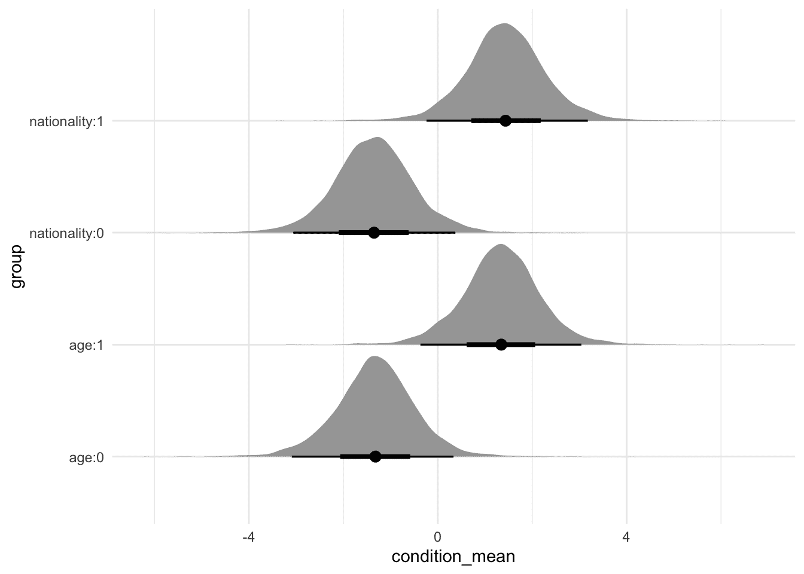
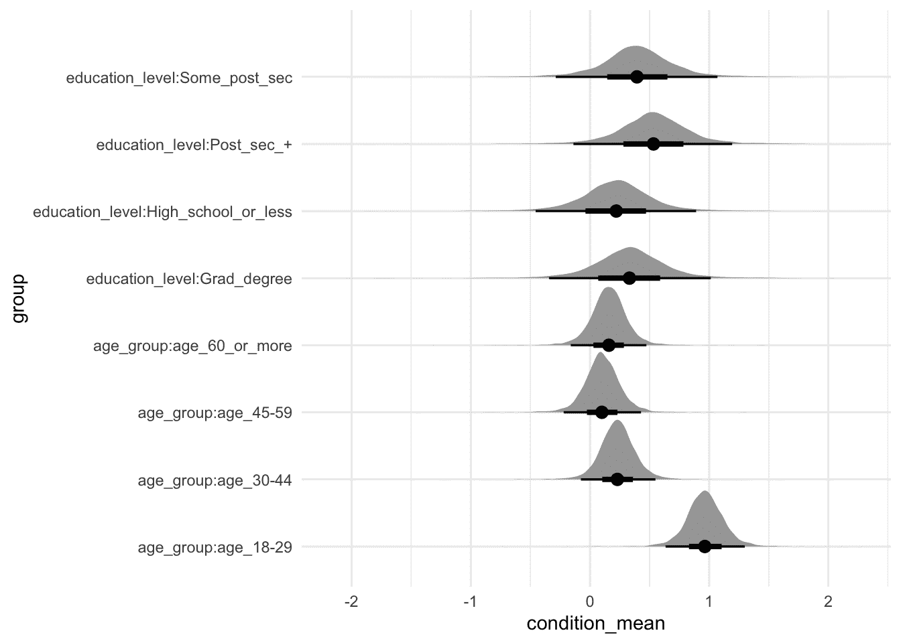
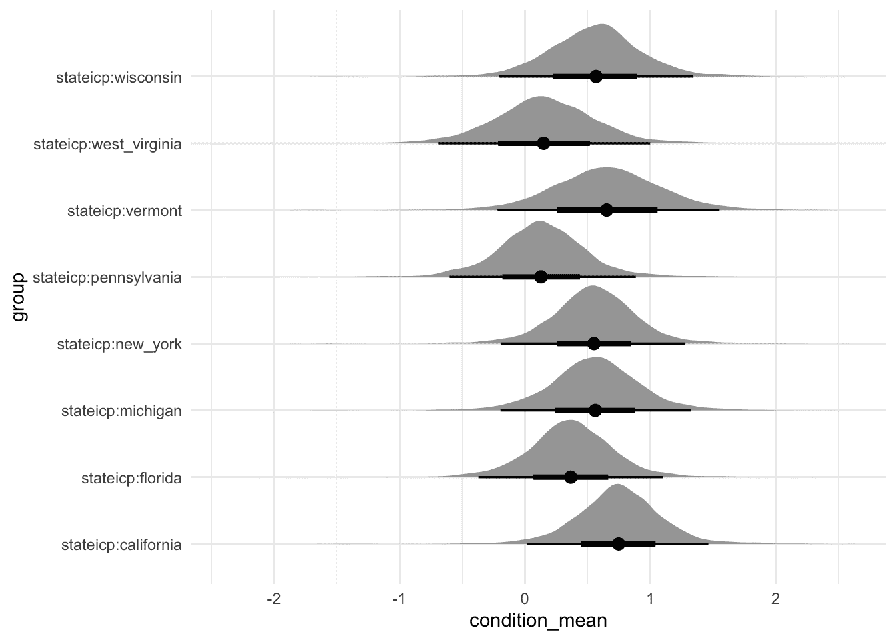
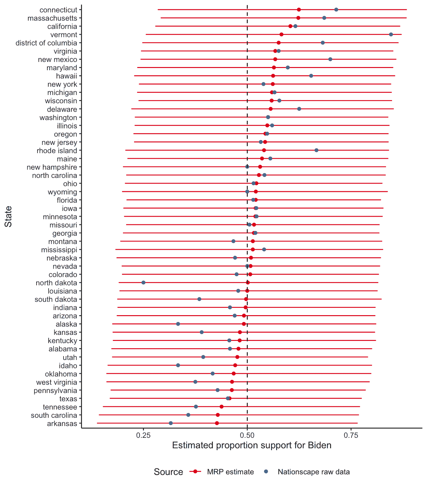

# 16 多层次回归与后分层

> 原文：[`tellingstorieswithdata.com/15-mrp.html`](https://tellingstorieswithdata.com/15-mrp.html)

1.  应用

1.  16 多层次回归与后分层

先决条件**

+   阅读文章*使用非代表性民意调查预测选举*（Wang et al. 2015）

    +   讨论了在 XBox 平台抽取的有偏样本上使用 MRP。

+   阅读文章*使用非代表性调查分析婚姻后的名字变化*（Alexander 2019)

    +   在调查中实现 MRP 并提供详细的代码和数据。

+   阅读文章*米斯特 P 帮助我们理解疫苗犹豫不决*（Green 2020)

    +   另一个带有可用代码和数据的 MRP（物料需求计划）工作示例。

+   观看*选举结果统计模型*（Gelman 2020）

    +   讨论为选举构建模型。

+   收听*第 248 集：民主党是否不合理？（David Shor）*（Galef 2020)

    +   重点关注前半部分，讨论了在政治中使用数据，以及具有广泛适用性的经验教训。

关键概念和技能**

+   多层次回归与后分层（MRP）从一个样本开始，通常是大型民意调查，并使用它来训练模型。然后，将训练好的模型应用于后分层数据集，通常是人口普查或其他更大的样本。

+   我们使用模型是因为我们感兴趣的是回答我们数据本身无法回答的问题。例如，我们可能想知道每个政治选区的状况，但要对每个选区进行适当的民意调查会花费太多成本。如果我们有完美的数据，我们就不需要模型。

+   模型使我们能够回答一些问题，但代价是我们以不确定性的方式回答它们。在 MRP 设置中，我们的模型从我们知道很多信息的区域借用信息，并在我们知道很少信息的区域使用这些信息。这种做法是否适当是我们总想了解更多的一个方面。MRP 的主要困难之一是获取所需的数据库。

+   MRP 的基本假设是预测变量（如性别、年龄组、地区等）与结果（例如，“你将投票给谁？”）之间的关系在样本和后分层数据集之间是稳定的。在考虑 MRP 估计时，一个关键问题是：“这个假设在多大程度上成立？”

+   像往常一样，透明度至关重要，并且几乎没有理由不能将数据准备和建模代码与模型结果一起公开，即使调查数据不能公开也是如此。这使独立专家能够进行审查，并增强了 MRP 估计的可信度。

软件和包**

+   Base R (R Core Team 2024)

+   `arrow` (Richardson et al. 2023)

+   `broom.mixed` (Bolker 和 Robinson 2022)

+   `gutenbergr` (Johnston 和 Robinson 2022)

+   `haven` (Wickham、Miller 和 Smith 2023)

+   `labelled` (Larmarange 2023)

+   `modelsummary` (Arel-Bundock 2022)

+   `rstanarm` (Goodrich 等人 2023)

+   `tidybayes` (Kay 2022)

+   `tidyverse` (Wickham 等人 2019)

+   `tinytable` (Arel-Bundock 2024)

```r
library(arrow)
library(broom.mixed)
library(gutenbergr)
library(haven)
library(labelled)
library(modelsummary)
library(rstanarm)
library(tidybayes)
library(tidyverse)
library(tinytable)
```

## 16.1 简介

> [2016 年总统选举](https://example.org) 是美国政治历史上最大的分析失败。
> 
> 大卫·肖尔，2020 年 8 月 13 日

多层次回归与后分层（MRP）是一种调整非代表性调查以分析意见和其他回应的流行方法。它使用回归模型将个体层面的调查回应与各种特征联系起来，然后重建样本以更好地匹配人口。这样，MRP 不仅可以更好地理解回应，还可以使我们分析那些可能无法使用的数据。然而，开始使用 MRP 可能是一个挑战，因为术语可能不熟悉，数据要求可能很繁重。

考虑一个有偏见的调查。例如，也许我们在一个学术会议上进行了一项关于计算机偏好的调查，因此拥有研究生学位的人可能被过度代表了。尽管如此，我们仍然对对更广泛的人口做出断言感兴趣。让我们说，我们发现 37.5%的受访者更喜欢 Mac。一种前进的方式是忽略偏见并得出结论：“37.5%的人更喜欢 Mac”。另一种方式是利用我们所知道的信息进行调整。例如，假设 50%的研究生学位受访者更喜欢 Mac，而没有研究生学位的人中，25%更喜欢 Mac。然后，如果我们知道更广泛的人口中有多少比例的人拥有研究生学位，比如说 10%，那么我们可以进行重新加权，或后分层，以创建一个估计：$0.5 \times 0.1 + 0.25 \times 0.9 = 0.275$。我们的估计将是 27.5%的人更喜欢 Mac。多比例重置（MRP）是第三种方法，它使用模型来帮助进行重新加权。在这里，我们可以使用逻辑回归来估计调查中计算机偏好与最高教育成就之间的关系。然后我们将这种关系应用于一个在教育方面代表我们人口的数据集。这种方法的优点之一是我们能更好地考虑不确定性。在现实世界的例子中，克林顿、拉皮恩斯基和特鲁斯勒（2022）发现，在 2020 年美国总统选举中，民主党和共和党之间的电话响应率存在显著差异，并且当纠正后，这减少了平均民意调查误差。

MRP 在处理调查数据时是一个方便的方法。汉雷蒂（2020）描述了我们如何使用 MRP，因为其他方法要么表现不佳，要么成本高昂。本质上，MRP 基于调查训练一个模型，然后将该训练模型应用于另一个数据集。有两个主要、相关的优点：

1.  它可以让我们以一种将不确定性置于首位且不受小样本限制的方式“重新加权”。处理小样本的另一种方法是收集更多数据或将其丢弃。

1.  它可以让我们使用广泛的调查来针对子集进行讨论，同时保持某些方面的代表性。例如，假设我们收集了一个代表全国年龄、性别和教育水平的样本。如果我们对州/省特定的估计感兴趣，那么在细分层面上代表性没有保证。

从实际角度出发，收集非概率样本往往成本较低，因此能够使用这类数据是有益的。尽管如此，MRP 并非万能药，统计学的定律仍然适用。我们估计的不确定性将大于使用概率样本的情况，并且它们仍然会受到所有常见的偏差的影响。这既是学术界也是工业界的一个令人兴奋的研究领域。

我们需要的 MRP 工作流程是直接的，但每个步骤中必须做出的细节和决策可能会变得令人难以承受。需要记住的是，我们正在尝试使用统计模型在两个数据集之间建立关系，因此我们需要在变量和层级方面建立两个数据集之间的相似性。步骤如下：

1.  收集和准备调查数据集，同时考虑与后分层数据集保持一致所需的内容；

1.  收集和准备后分层数据集时，要考虑与调查数据集保持一致所需的内容；

1.  使用调查和后分层数据集中都有的预测因子和层级，对调查中的感兴趣变量进行建模；

1.  将模型应用于后分层数据。

一个著名的 MRP 例子是 Wang 等人（2015）。他们使用了 Xbox 游戏平台的数据来预测 2012 年美国总统选举。Wang 等人（2015）能够在 2012 年美国总统选举（奥巴马与罗姆尼之间）的 45 天前通过 Xbox 游戏平台实施一项自愿投票调查。每天有三到五个问题，包括投票意向：“如果选举今天举行，你会为谁投票？”。受访者每天最多只能回答一次。首次受访者被要求提供关于自己的信息，包括性别、种族、年龄、教育、州、政党 ID、政治意识形态以及他们在 2008 年总统选举中的投票对象。

巨人的肩膀* *安德鲁·杰尔曼博士是哥伦比亚大学的统计学和政治科学希金斯教授。1990 年从哈佛大学获得统计学博士学位后，他被任命为加州大学伯克利分校的助理教授，并于 1996 年搬到哥伦比亚大学，在那里他在 2000 年晋升为全职教授。他的研究集中在统计学、社会科学及其交叉领域。例如，王等人（2015）表明，有偏见的调查仍然有价值。他是用于贝叶斯建模的广泛使用的概率编程语言 Stan 的主要研究员。他还撰写了许多书籍，其中*使用回归和多级/层次模型进行数据分析* (Gelman and Hill 2007)和*贝叶斯数据分析* ([Gelman et al. [1995] 2014](99-references.html#ref-bda))对一代研究者产生了特别深远的影响。他在 1998 年被任命为美国统计协会的会员，并在 2003 年获得了 COPSS 总统奖。* 总共进行了 750,148 次访谈，其中 345,858 位受访者是独一无二的，超过 30,000 位受访者完成了五次或更多的调查。正如预期的那样，年轻男性主导了 Xbox 用户群体：18 至 29 岁的年轻人占 Xbox 数据集的 65%，而在出口民调中占 19%；男性占 Xbox 样本的 93%，但在选民中只占 47%。

细节并不重要，但本质上它们模拟了在诸如州、教育、性别等信息的情况下，受访者投票给奥巴马的可能性。拥有一个经过训练的模型，该模型考虑了这些各种预测因素对候选人支持的影响，他们现在进行后分层，其中每个“单元格级估计”都根据每个单元格中选民的比例进行加权，并汇总到适当的水平（即州或全国）。

他们需要交叉表格化的人口数据，该数据统计了每个变量组合中的人数。一般来说，人口普查会起作用，或者在美国可用的其他大型调查之一，例如我们在第六章中介绍的 ACS。困难在于变量需要以交叉表格化的方式可用。因此，他们使用出口民调，尽管这些在其他国家并不像在美国那样广泛可用。

他们通过后分层到每个州的特性来制作特定州的估计。他们类似地检查人口统计差异。最后，他们将他们的估计转换为选举人团估计。

通常来说，多阶段回归抽样（MRP）是实现特定目标的好方法，但它并非没有权衡。如果我们有一个高质量的调查，那么这可能是一种与其分解方面进行交流的方式。或者如果我们关注不确定性，那么这是一种思考该问题的好方法。如果我们有一个有偏见的调查，那么这是一个很好的起点，但它并非万能药。从各种方法中都有很多令人兴奋的工作要做。例如，从更统计的角度来看，我们需要思考调查设计和建模方法如何相互作用，以及我们低估不确定性的程度。思考小样本和分层后数据集中的不确定性也有趣。在思考适当的模型使用方面，以及如何评估“适当”的含义方面，有很多工作要做，例如，基于 Si (2020)。更普遍地说，我们对在哪些条件下我们将拥有 MRP 准确所需的稳定偏好和关系知之甚少。需要大量的工作来理解这与调查设计中的不确定性如何相关，例如，基于 Lauderdale 等人 (2020) 或 Ghitza 和 Gelman (2020)。

在本章中，我们首先模拟一个假设我们知道人口特征的情况。然后我们考虑 2020 年美国总统选举。

## 16.2 模拟示例：咖啡还是茶？

### 16.2.1 构建人口和有偏样本

为了开始，我们将回顾第八章中的茶品鉴实验，并模拟一个关于某人是否喜欢咖啡或茶的人口。然后我们将采取有利于茶的偏样本，并使用 MRP 来恢复这些人口层面的偏好。我们将有两个解释变量。年龄组将是“年轻”或“年老”，国籍将是“美国”或“英国”。模拟将增加个体偏好茶的几率，如果他们是英国人或/或年老。我们的人口中的所有事物都将大致平衡（即每个变量之间各占一半）。但我们的调查将偏向于年老和英国人。为了清楚起见，在这个例子中我们将“知道”人口的“真实”特征，但这并不是我们在使用真实数据时发生的事情——这只是帮助你理解 MRP 中发生的事情。

```r
set.seed(853)

pop_size <- 1000000

sim_population <-
 tibble(
 age = rbinom(n = pop_size, size = 1, prob = 0.5),
 nationality = rbinom(n = pop_size, size = 1, prob = 0.5),
 probability = (age + nationality + 0.1) / 2.2, # prevent certainty
 prefers_tea = rbinom(n = pop_size, 1, prob = probability)
 ) 

sim_population
```

```r
# A tibble: 1,000,000 × 4
     age nationality probability prefers_tea
   <int>       <int>       <dbl>       <int>
 1     0           1      0.5              0
 2     0           0      0.0455           0
 3     0           1      0.5              1
 4     0           0      0.0455           0
 5     0           0      0.0455           0
 6     0           0      0.0455           0
 7     0           1      0.5              0
 8     0           0      0.0455           0
 9     0           1      0.5              1
10     0           0      0.0455           0
# ℹ 999,990 more rows
```
我们可以看到，按组别划分的计数相当相似 (表 16.1)。

```r
sim_population |>
 count(age, nationality, prefers_tea) |> 
 tt() |> 
 style_tt(j = 1:4, align = "lllr") |> 
 format_tt(digits = 0, num_mark_big = ",", num_fmt = "decimal") |> 
 setNames( c("Age", "Nationality", "Prefers tea", "Number"))
```

表 16.1：按年龄和国籍划分的茶偏好

| 年龄 | 国籍 | 喜欢茶 | 数量 |
| --- | --- | --- | --- |
| 0 | 0 | 0 | 238,568 |
| 0 | 0 | 1 | 11,319 |
| 0 | 1 | 0 | 125,371 |
| 0 | 1 | 1 | 124,730 |
| 1 | 0 | 0 | 125,438 |
| 1 | 0 | 1 | 124,723 |
| 1 | 1 | 0 | 11,421 |

| 1 | 1 | 1 | 238,430 |*  *平均而言，50%的人口喜欢茶，但这种偏好取决于人口子群体。

现在我们假设我们有一些有偏样本的调查。我们将允许它对年龄较大的受访者和对英语受访者进行过采样。我们感兴趣的是查看我们偏样本中有多少比例的人更喜欢茶而不是咖啡，并且预期，通过构造，它将倾向于茶。

```r
set.seed(853)

tea_sample <- 
 sim_population |> 
 slice_sample(n = 1000, weight_by = probability)
```

```r
tea_sample |>
 count(age, nationality, prefers_tea) |> 
 tt() |> 
 style_tt(j = 1:4, align = "lllr") |> 
 format_tt(digits = 0, num_mark_big = ",", num_fmt = "decimal") |> 
 setNames(c("Age", "Nationality", "Prefers tea", "Number"))
```

表 16.2：按年龄和国籍划分的茶偏好有偏样本，对喜欢茶的人进行过采样

| 年龄 | 国籍 | 喜欢茶 | 数量 |
| --- | --- | --- | --- |
| 0 | 0 | 0 | 18 |
| 0 | 0 | 1 | 3 |
| 0 | 1 | 0 | 119 |
| 0 | 1 | 1 | 128 |
| 1 | 0 | 0 | 133 |
| 1 | 0 | 1 | 126 |
| 1 | 1 | 0 | 25 |

| 1 | 1 | 1 | 448 |*  *很明显，我们的样本的平均茶偏好与总体人口不同(表 16.2).
  
### 16.2.2 建模样本

我们现在基于有偏样本训练一个模型。我们根据年龄和国籍解释茶偏好。没有规定你必须使用多层次模型，但许多情况下，这样做不太可能做得更差。为了清楚起见，这意味着尽管我们有个人层面的数据，但我们仍将利用个人的某些分组。

$$ \begin{aligned} y_i|\pi_i & \sim \mbox{Bern}(\pi_i) \\ \mbox{logit}(\pi_i) & = \beta_0 + \alpha_{a[i]}^{\mbox{age}} + \alpha_{n[i]}^{\mbox{nat}} \\ \alpha_0 & \sim \mbox{Normal}(0, 2.5)\\ \alpha_{a}^{\mbox{age}} & \sim \mbox{Normal}\left(0, \sigma²_{\mbox{age}}\right)\mbox{ for }a = 1, 2, \dots, A\\ \alpha_{n}^{\mbox{nat}} & \sim \mbox{Normal}\left(0, \sigma²_{\mbox{nat}}\right)\mbox{ for }n = 1, 2, \dots, N\\ \sigma_{\mbox{age}} & \sim \mbox{Exponential}(1)\\ \sigma_{\mbox{nat}} & \sim \mbox{Exponential}(1) \end{aligned} $$

其中 $y_i$ 是受访者的茶偏好，$\pi_i = \mbox{Pr}(y_i=1)$，而 $\alpha^{\mbox{age}}$ 和 $\alpha^{\mbox{nat}}$ 分别是年龄和国籍的影响。$a[i]$ 和 $n[i]$ 分别指受访者所属的年龄组和国籍。$A$ 和 $N$ 分别是年龄组和国籍的总数。我们将使用 `stan_glm()` 来估计模型。

```r
tea_preference_model <-
 stan_glmer(
 prefers_tea ~ (1 | age) + (1 | nationality),
 data = tea_sample,
 family = binomial(link = "logit"),
 prior = normal(location = 0, scale = 0.5, autoscale = TRUE),
 prior_intercept = normal(location = 0, scale = 0.5, autoscale = TRUE),
 seed = 853
 )

saveRDS(
 tea_preference_model,
 file = "tea_preference_model.rds"
)
```

```r
tea_preference_model <-
 readRDS(file = "tea_preference_model.rds")
```

```r
modelsummary(
 list(
 "Tea preferences" = tea_preference_model
 )
)
```

表 16.3：基于过采样茶偏好的样本训练的模型

|  | 茶偏好 |
| --- | --- |
| (Intercept) | 0.001 |
| Sigma[age × (Intercept),(Intercept)] | 2.171 |
| Sigma[nationality × (Intercept),(Intercept)] | 2.337 |
| Num.Obs. | 1000 |
| R2 | 0.261 |
| R2 Marg. | 0.000 |
| ICC | 0.7 |
| Log.Lik. | -457.970 |
| ELPD | -461.0 |
| ELPD s.e. | 16.2 |
| LOOIC | 921.9 |
| LOOIC s.e. | 32.4 |
| WAIC | 921.9 |

| RMSE | 0.39 |*  *图 16.1 显示了不同组别抽样的分布。

```r
tea_preference_model |>
 spread_draws(`(Intercept)`, b[, group]) |>
 mutate(condition_mean = `(Intercept)` + b) |>
 ggplot(aes(y = group, x = condition_mean)) +
 stat_halfeye() +
 theme_minimal()
```



图 16.1：检查每个组的抽取分布
  
### 16.2.3 后分层数据集

现在，我们将使用后分层数据集来获取每个单元格中人数的估计值。我们通常使用更大的数据集，这可能更接近人口。在美国，一个流行的选择是美国社区调查（ACS），我们在第六章（06-farm.html）中介绍了它，而在其他国家，我们通常使用人口普查。

在这个模拟例子中，我们可以使用人口作为我们的后分层数据集。问题是，在有一百万个观察值时，它是不便操作的，所以我们从中抽取了 1 万个样本。我们还删除了茶偏好变量，因为我们假装我们不知道这一点。

```r
set.seed(853)

tea_poststrat_dataset <- 
 sim_population |> 
 slice_sample(n = 10000) |> 
 select(-prefers_tea)

tea_poststrat_dataset
```

```r
# A tibble: 10,000 × 3
     age nationality probability
   <int>       <int>       <dbl>
 1     0           1      0.5   
 2     0           1      0.5   
 3     0           1      0.5   
 4     0           1      0.5   
 5     1           0      0.5   
 6     1           0      0.5   
 7     0           0      0.0455
 8     1           0      0.5   
 9     1           0      0.5   
10     1           0      0.5   
# ℹ 9,990 more rows
```
这是一个理想化的例子，我们假设后分层数据集中的个体级数据。在那个世界里，我们可以将我们的模型应用于每个个体。

```r
predicted_tea_preference <-
 tea_preference_model |>
 add_epred_draws(newdata = tea_poststrat_dataset,
 value = "preference") |>
 ungroup() |>
 summarise(
 average_preference = mean(preference),
 lower = quantile(preference, 0.025),
 upper = quantile(preference, 0.975),
 .by = c(age, nationality, .row)
 )

predicted_tea_preference |>
 count(age, nationality, average_preference)
```

```r
# A tibble: 4 × 4
    age nationality average_preference     n
  <int>       <int>              <dbl> <int>
1     0           0             0.0657  2416
2     0           1             0.528   2505
3     1           0             0.496   2544
4     1           1             0.941   2535
```
表 16.4 比较了 MRP 估计值和有偏样本的原始估计值。在这种情况下，因为我们知道真实值，我们也可以将其与已知真实值进行比较，但这不是我们通常能做的事情。

```r
comparison <- tibble(
 Type = c("Truth", "Biased sample", "MRP estimate"),
 Estimate = c(
 mean(sim_population$prefers_tea),
 mean(tea_sample$prefers_tea),
 mean(predicted_tea_preference$average_preference)
 )
)

comparison |> 
 tt() |> 
 style_tt(j = 1:2, align = "lr") |> 
 format_tt(digits = 2, num_mark_big = ",", num_fmt = "decimal")
```

表 16.4：MRP 估计值与真实值和有偏样本的比较

| 类型 | 估计值 |
| --- | --- |
| 真实值 | 0.5 |
| 有偏样本 | 0.7 |

| MRP 估计值 | 0.51 |*  *在这种情况下，MRP 方法很好地处理了有偏样本，并得出了一种反映真实情况的茶偏好估计值。
  
## 16.3 预测 2020 年美国选举

美国的总统选举有许多独特的特点，但我们在这里将要构建的模型将可以推广到各种环境。我们将使用第八章中介绍的民主基金选民研究小组的调查数据。他们在美国大选前进行了民意调查，并在注册后公开了这些数据。我们将使用第六章中介绍的 IPUMS 来访问 2019 年美国社区调查（ACS）作为后分层数据集。我们将使用州、年龄组、性别和教育作为解释变量。

### 16.3.1 调查数据

我们将使用民主基金选民研究小组的 Nationscape 调查数据集。MRP 的一个棘手方面是确保调查数据集和后分层数据集之间的一致性。在这种情况下，在读取我们在第八章（08-hunt.html）中清理的数据集后，我们需要做一些工作来使变量保持一致。

```r
nationscape_data <- 
 read_csv(file = "nationscape_data.csv")
```

```r
nationscape_data
```

```r
# A tibble: 5,200 × 5
   gender state vote_biden age_group education_level    
 * <chr>  <chr>      <dbl> <chr>     <chr>              
 1 female WI             0 45-59     Post sec +         
 2 female VA             0 45-59     Post sec +         
 3 female TX             0 60+       High school or less
 4 female WA             0 45-59     High school or less
 5 female MA             1 18-29     Some post sec      
 6 female TX             1 30-44     Some post sec      
 7 female CA             0 60+       Some post sec      
 8 female NC             0 45-59     Post sec +         
 9 female MD             0 60+       Post sec +         
10 female FL             1 45-59     Some post sec      
# ℹ 5,190 more rows


```r
# Format state names to match IPUMS
states_names_and_abbrevs <-
 tibble(stateicp = state.name, state = state.abb)

nationscape_data <-
 nationscape_data |>
 left_join(states_names_and_abbrevs, by = "state")

rm(states_names_and_abbrevs)

# Make lowercase to match IPUMS data
nationscape_data <-
 nationscape_data |>
 mutate(stateicp = tolower(stateicp))

# Replace NAs with DC
nationscape_data$stateicp <-
 replace_na(nationscape_data$stateicp, "district of columbia")

# Tidy the class
nationscape_data <-
 nationscape_data |>
 mutate(across(c(gender, stateicp, education_level, age_group), 
 as_factor))
```

最后，我们将准备好的数据集保存为 parquet 文件。

```r
write_parquet(x = nationscape_data,
 sink = "nationscape_data_cleaned.parquet")
```
  
### 16.3.2 后分层数据

我们有很多选项可以用来进行后分层的数据集，并且有许多考虑因素。我们追求的是高质量（无论如何定义）且可能更大的数据集。从严格的数据角度来看，最佳选择可能类似于第十二章中使用的合作选举研究（CES），但它在选举后才会公开发布，这限制了用它来预测选举的合理性。Wang 等人 (2015) 使用了出口民调数据，但同样，这些数据也只有在选举后才能获得。

我们将使用我们在第六章中收集的 2019 年美国社区调查（ACS）数据集。

```r
poststrat_data
```

```r
# A tibble: 407,354 × 4
   gender age_group education_level     stateicp
 * <fct>  <fct>     <fct>               <fct>   
 1 male   60+       High school or less alabama 
 2 male   60+       Some post sec       alabama 
 3 male   18-29     High school or less alabama 
 4 female 18-29     Some post sec       alabama 
 5 male   30-44     Some post sec       alabama 
 6 female 18-29     High school or less alabama 
 7 female 60+       High school or less alabama 
 8 female 18-29     Some post sec       alabama 
 9 male   60+       High school or less alabama 
10 male   45-59     High school or less alabama 
# ℹ 407,344 more rows
```
该数据集处于个人层面。我们将为每个子单元创建计数，然后按州计算比例。

```r
poststrat_data_cells <-
 poststrat_data |>
 count(stateicp, gender, age_group, education_level)
```

最后，我们为这些单元格添加比例。

```r
poststrat_data_cells <-
 poststrat_data_cells |>
 mutate(prop = n / sum(n),
 .by = stateicp)

poststrat_data_cells
```

```r
# A tibble: 1,627 × 6
   stateicp    gender age_group education_level         n    prop
   <fct>       <fct>  <fct>     <fct>               <int>   <dbl>
 1 connecticut male   18-29     High school or less   194 0.0419 
 2 connecticut male   18-29     Some post sec         128 0.0276 
 3 connecticut male   18-29     Post sec +             72 0.0156 
 4 connecticut male   18-29     Grad degree            14 0.00302
 5 connecticut male   30-44     High school or less   132 0.0285 
 6 connecticut male   30-44     Some post sec          93 0.0201 
 7 connecticut male   30-44     Post sec +            147 0.0317 
 8 connecticut male   30-44     Grad degree            88 0.0190 
 9 connecticut male   45-59     High school or less   187 0.0404 
10 connecticut male   45-59     Some post sec          88 0.0190 
# ℹ 1,617 more rows
```
  
### 16.3.3 模型化样本

我们将使用逻辑回归来估计一个模型，其中拜登和特朗普的支持率的二元变量由性别、年龄组、教育和州来解释。

$$ \begin{aligned} y_i|\pi_i & \sim \mbox{Bern}(\pi_i) \\ \mbox{logit}(\pi_i) & = \beta_0+ \alpha_{g[i]}^{\mbox{gender}} + \alpha_{a[i]}^{\mbox{age}} + \alpha_{s[i]}^{\mbox{state}} + \alpha_{e[i]}^{\mbox{edu}} \\ \beta_0 & \sim \mbox{Normal}(0, 2.5)\\ \alpha_{g}^{\mbox{gender}} & \sim \mbox{Normal}(0, 2.5)\mbox{ for }g=1, 2\\ \alpha_{a}^{\mbox{age}} & \sim \mbox{Normal}\left(0, \sigma²_{\mbox{age}}\right)\mbox{ for }a = 1, 2, \dots, A\\ \alpha_{s}^{\mbox{state}} & \sim \mbox{Normal}\left(0, \sigma²_{\mbox{state}}\right)\mbox{ for }s = 1, 2, \dots, S\\ \alpha_{e}^{\mbox{edu}} & \sim \mbox{Normal}\left(0, \sigma²_{\mbox{edu}}\right)\mbox{ for }e = 1, 2, \dots, E\\ \sigma_{\mbox{gender}} & \sim \mbox{Exponential}(1)\\ \sigma_{\mbox{state}} & \sim \mbox{Exponential}(1)\\ \sigma_{\mbox{edu}} & \sim \mbox{Exponential}(1) \end{aligned} $$

其中 $y_i$ 表示受访者是否支持拜登，$\pi_i = \mbox{Pr}(y = 1)$。然后 $\alpha^{\mbox{gender}}$、$\alpha^{\mbox{age}}$、$\alpha^{\mbox{state}}$ 和 $\alpha^{\mbox{edu}}$ 分别代表性别、年龄、州和教育的影响。$g[i]$、$a[i]$、$s[i]$ 和 $e[i]$ 分别指受访者所属的性别、年龄组、州和教育水平。$A$、$S$ 和 $E$ 分别代表年龄组、州和教育水平的总数。

在读取我们之前清理的数据后，根据 Kennedy 和 Gabry (2020) 的方法，我们使用 `rstanarm` 中的 `stan_glmer()` 来估计模型。

```r
nationscape_data <- 
 read_parquet(file = "nationscape_data_cleaned.parquet")
```

```r
us_election_model <-
 stan_glmer(
 vote_biden ~ gender + (1|age_group) + (1|stateicp) + (1|education_level),
 data = nationscape_data,
 family = binomial(link = "logit"),
 prior = normal(location = 0, scale = 2.5, autoscale = TRUE),
 prior_intercept = normal(location = 0, scale = 2.5, autoscale = TRUE),
 cores = 4,
 adapt_delta = 0.99,
 seed = 853
 )
```

```r
saveRDS(
 us_election_model,
 file = "us_election_model_mrp.rds"
)
```

该模型运行大约需要 15 分钟，因此您应该在运行后使用 `saveRDS()` 保存它。您可以使用 `readRDS()` 加载它。

```r
us_election_model <-
 readRDS(file = "us_election_model_mrp.rds")
```

我们可能对查看系数估计值（表 16.5）感兴趣。

```r
modelsummary(
 us_election_model
)
```

表 16.5：估计 2020 年美国总统选举中拜登与特朗普之间的选择模型

|  | (1) |
| --- | --- |
| (Intercept) | 0.373 |
| gendermale | -0.542 |
| Sigma[stateicp × (Intercept),(Intercept)] | 0.081 |
| Sigma[education_level × (Intercept),(Intercept)] | 0.036 |
| Sigma[age_group × (Intercept),(Intercept)] | 0.241 |
| Num.Obs. | 5200 |
| R2 | 0.056 |
| R2 Marg. | 0.017 |
| ICC | 0.2 |
| Log.Lik. | -3434.075 |
| ELPD | -3468.0 |
| ELPD s.e. | 16.2 |
| LOOIC | 6936.1 |
| LOOIC s.e. | 32.4 |
| WAIC | 6936.0 |

| RMSE | 0.48 |*图 16.2 展示了不同年龄段和教育程度的抽样分布。为了节省空间，我们分别绘制了一些选定的州的数据(图 16.3)。

```r
us_election_model |>
 spread_draws(`(Intercept)`, b[, group]) |>
 mutate(condition_mean = `(Intercept)` + b) |>
 separate(col = group, 
 into = c("type", "instance"), 
 sep = ":", remove = FALSE) |> 
 filter(type != "stateicp") |> 
 ggplot(aes(y = group, x = condition_mean)) +
 stat_halfeye() +
 theme_minimal()
```



图 16.2：检查每个组别的抽样分布*  ```r
us_election_model |>
 spread_draws(`(Intercept)`, b[, group]) |>
 mutate(condition_mean = `(Intercept)` + b) |>
 separate(col = group, into = c("type", "instance"), sep = ":", remove = FALSE) |> 
 filter(type == "stateicp") |> 
 filter(instance %in% 
 c("california", "florida", "michigan", "new_york", "pennsylvania", 
 "vermont", "west_virginia", "wisconsin")
 ) |> 
 ggplot(aes(y = group, x = condition_mean)) +
 stat_halfeye() +
 theme_minimal()
```



图 16.3：检查选定州的抽样分布
  
### 16.3.4 后分层

我们现在根据之前计算的人口比例进行后分层，并为每个州计算可信区间。

```r
biden_support_by_state <-
 us_election_model |>
 add_epred_draws(newdata = poststrat_data_cells) |>
 rename(support_biden_predict = .epred) |>
 mutate(support_biden_predict_prop = support_biden_predict * prop) |>
 ungroup() |> 
 summarise(support_biden_predict = sum(support_biden_predict_prop),
 .by = c(stateicp, .draw)) |>
 summarise(
 mean = mean(support_biden_predict),
 lower = quantile(support_biden_predict, 0.025),
 upper = quantile(support_biden_predict, 0.975),
 .by = stateicp
 )

head(biden_support_by_state)
```

```r
# A tibble: 6 × 4
  stateicp       mean lower upper
  <fct>         <dbl> <dbl> <dbl>
1 connecticut   0.624 0.284 0.884
2 maine         0.535 0.211 0.840
3 massachusetts 0.623 0.292 0.884
4 new hampshire 0.531 0.201 0.834
5 rhode island  0.540 0.206 0.841
6 vermont       0.582 0.256 0.872
```
我们可以通过图形查看我们的估计值(图 16.4)。

```r
biden_support_by_state |>
 ggplot(aes(y = mean, x = fct_reorder(stateicp, mean), 
 color = "MRP estimate")) +
 geom_point() +
 geom_errorbar(aes(ymin = lower, ymax = upper), width = 0) +
 geom_point(
 data = nationscape_data |>
 summarise(n = n(),
 .by = c(stateicp, vote_biden)) |>
 mutate(prop = n / sum(n),
 .by = stateicp) |>
 filter(vote_biden == 1),
 aes(y = prop, x = stateicp, color = "Nationscape raw data")
 ) +
 geom_hline(yintercept = 0.5, linetype = "dashed") +
 labs(
 x = "State",
 y = "Estimated proportion support for Biden",
 color = "Source"
 ) +
 theme_classic() +
 scale_color_brewer(palette = "Set1") +
 coord_flip() +
 theme(legend.position = "bottom")
```



图 16.4：比较 MRP 估计值与 Nationscape 原始数据*  *Nationscape 数据集是一个高质量的调查数据集。但它被加权到主要人口普查区域——西部、中西部、东北部和南部——而不是州，这可能是我们观察到 MRP 估计值与原始数据之间差异的一个原因。
  
## 16.4 练习

### 练习

1.  *(计划)* 考虑以下场景：*对一个政治党的支持是二元（是/否），并且与年龄段、性别、收入群体和最高教育程度相关。*请描绘出这个数据集可能的样子，然后绘制一个图表来展示所有观察结果。

1.  *(模拟)* 请进一步考虑所描述的场景，并模拟这种情况。请至少包含基于模拟数据的十个测试。

1.  *(获取)* 请描述一个可能的此类数据集来源。

1.  *(探索)* 请使用`ggplot2`构建你绘制的图表。使用`rstanarm`估计模型。

1.  *(沟通)* 请写两段关于你所做的工作的描述。

### 测验

1.  请解释 MRP 是什么，以及其优缺点，确保解释你使用的任何技术术语（至少写三段）。

1.  你喜欢 Wang 等人(2015)的哪些三个方面？你不喜欢哪些三个方面？在多大程度上可以重现该论文？

1.  关于 Wang 等人(2015)，MRP（选择一个）的弱点是什么？

    1.  详细数据需求。

    1.  允许使用有偏数据。

    1.  开展费用昂贵。

1.  关于 Wang 等人（2015），Xbox 样本有哪些令人担忧的地方（选择一个）？

    1.  非代表性。

    1.  样本量小。

    1.  同一受访者提供的多个回答。

1.  我们对研究即将到来的美国总统选举中投票意愿如何随着个人收入的变化感兴趣。我们建立了一个逻辑回归模型来研究这种关系。在这项研究中，哪些可能是可能的预测因子（选择所有适用的）？

    1.  受访者是否注册了投票（是/否）。

    1.  受访者是否会为民主党候选人投票（是/否）。

    1.  受访者的种族（白人/非白人）。

    1.  受访者的婚姻状况（已婚/未婚）。

1.  请思考 Cohn（2016）。为什么这种类型的练习没有进行得更多？你认为为什么即使使用相同的数据，不同的群体，即使在相同的背景和定量复杂度水平上，也可能有如此不同的估计？

1.  我们基于调查数据训练了一个模型，然后使用 ACS 数据集进行后分层。在这样做的时候，我们可能需要考虑哪些实际因素？

1.  考虑这样一种情况，你有一个包含以下年龄段的调查数据集：18-29 岁；30-44 岁；45-60 岁；以及 60 岁以上。还有一个经过后分层的数据集，包含以下年龄段：18-34 岁；35-49 岁；50-64 岁；以及 65 岁以上。请描述你将如何将这些数据集结合起来。

### 课堂活动

+   *论文评审:* 请阅读并评审 Wang 等人（2015）的论文。

### 任务

类似于 Ghitza 和 Gelman（2020）的做法，假设你能够访问一家私营公司提供的美国选民文件记录。你使用 2020 年美国合作选举研究数据训练了一个模型，并基于该选民文件对模型进行个体层面的后分层。

1.  按照 Gebru 等人（2021）的做法，为选民文件数据集准备一份数据表？作为提醒，数据表伴随数据集，并记录了“动机、组成、收集过程、推荐用途”等方面的内容。

1.  按照 Mitchell 等人（2019）的做法为你的模型创建一个模型卡片？作为提醒，模型卡片是故意简洁的、一页或两页的文档，报告了如下方面：模型细节；预期用途；指标；训练数据；伦理考量；以及警告和建议（Mitchell 等人 2019 年）。

1.  讨论你模型中使用的特征周围的三个伦理方面？[请为每个点写一段或两段文字。]

1.  详细说明你将在数据集、模型和预测方面实施的测试？

### 试卷

大约在这个时候，在线附录 F 中的*Spofforth*论文是合适的。

Alexander, Monica. 2019\. “使用非代表性调查分析婚后姓名变更，”八月. [`www.monicaalexander.com/posts/2019-08-07-mrp/`](https://www.monicaalexander.com/posts/2019-08-07-mrp/). Arel-Bundock, Vincent. 2022\. “modelsummary: R 中的数据和模型摘要。” *《统计软件杂志》* 103 (1): 1–23\. [`doi.org/10.18637/jss.v103.i01`](https://doi.org/10.18637/jss.v103.i01).———. 2024\. *tinytable: 在“HTML”、“LaTeX”、“Markdown”、“Word”、“PNG”、“PDF”和“Typst”格式中的简单和可配置表格*. [`vincentarelbundock.github.io/tinytable/`](https://vincentarelbundock.github.io/tinytable/). Bolker, Ben, and David Robinson. 2022\. *broom.mixed: 混合模型的整理方法*. [`CRAN.R-project.org/package=broom.mixed`](https://CRAN.R-project.org/package=broom.mixed). Clinton, Joshua, John Lapinski, and Marc Trussler. 2022\. “犹豫的共和党人，热切的民主党人？” *《公众舆论季刊》* 86 (2): 247–69\. [`doi.org/10.1093/poq/nfac011`](https://doi.org/10.1093/poq/nfac011). Cohn, Nate. 2016\. “我们给了四位优秀的民意调查员相同的原始数据。他们得到了四种不同的结果。” *《纽约时报》*，九月. [`www.nytimes.com/interactive/2016/09/20/upshot/the-error-the-polling-world-rarely-talks-about.html`](https://www.nytimes.com/interactive/2016/09/20/upshot/the-error-the-polling-world-rarely-talks-about.html). Galef, Julia. 2020\. “第 248 集：民主党人是否在做出非理性决策？（大卫·肖尔）。” *《理性说话》*，十二月. [`rationallyspeakingpodcast.org/248-are-democrats-being-irrational-david-shor/`](http://rationallyspeakingpodcast.org/248-are-democrats-being-irrational-david-shor/). Gebru, Timnit, Jamie Morgenstern, Briana Vecchione, Jennifer Wortman Vaughan, Hanna Wallach, Hal Daumé III, and Kate Crawford. 2021\. “数据集的数据表。” *《ACM 通讯》* 64 (12): 86–92\. [`doi.org/10.1145/3458723`](https://doi.org/10.1145/3458723). Gelman, Andrew. 2020\. “选举结果的统计模型。” *YouTube*，八月. [`youtu.be/7gjDnrbLQ4k`](https://youtu.be/7gjDnrbLQ4k). Gelman, Andrew, John Carlin, Hal Stern, David Dunson, Aki Vehtari, and Donald Rubin. (1995) 2014\. *贝叶斯数据分析* 第 3 版. Chapman; Hall/CRC. Gelman, Andrew, and Jennifer Hill. 2007\. *使用回归和多级/分层模型进行数据分析* 第 1 版. Cambridge University Press. Ghitza, Yair, and Andrew Gelman. 2020\. “选民登记数据库和 MRP：向公共舆论研究中大规模数据库的应用。” *《政治分析》* 28 (4): 507–31\. [`doi.org/10.1017/pan.2020.3`](https://doi.org/10.1017/pan.2020.3). Goodrich, Ben, Jonah Gabry, Imad Ali, and Sam Brilleman. 2023\. “rstanarm: 通过 Stan 进行贝叶斯应用回归建模。” [`mc-stan.org/rstanarm`](https://mc-stan.org/rstanarm). Green, Eric. 2020\. “Nivi Research：Mister P 帮助我们理解疫苗犹豫，”十二月. [`research.nivi.io/posts/2020-12-08-mister-p-helps-us-understand-vaccine-hesitancy/`](https://research.nivi.io/posts/2020-12-08-mister-p-helps-us-understand-vaccine-hesitancy/). Hanretty, Chris. 2020\. “多级回归和分层估计选区意见的介绍。” *《政治研究评论》* 18 (4): 630–45\. [`doi.org/10.1177/1478929919864773`](https://doi.org/10.1177/1478929919864773). Johnston, Myfanwy, and David Robinson. 2022\. *gutenbergr: 从 Project Gutenberg 下载和处理公共领域作品*. [`CRAN.R-project.org/package=gutenbergr`](https://CRAN.R-project.org/package=gutenbergr). Kay, Matthew. 2022\. *tidybayes: 贝叶斯模型的整洁数据和几何形状*. [`doi.org/10.5281/zenodo.1308151`](https://doi.org/10.5281/zenodo.1308151). Kennedy, Lauren, and Jonah Gabry. 2020\. “使用 rstanarm 进行 MRP，”七月. [`mc-stan.org/rstanarm/articles/mrp.html`](https://mc-stan.org/rstanarm/articles/mrp.html). Larmarange, Joseph. 2023\. *labelled: 标签数据的操作*. [`CRAN.R-project.org/package=labelled`](https://CRAN.R-project.org/package=labelled). Lauderdale, Benjamin, Delia Bailey, Jack Blumenau, and Douglas Rivers. 2020\. “基于模型的美国和英国全国及地方选举预选民意调查。” *《国际预测杂志》* 36 (2): 399–413\. [`doi.org/10.1016/j.ijforecast.2019.05.012`](https://doi.org/10.1016/j.ijforecast.2019.05.012). Mitchell, Margaret, Simone Wu, Andrew Zaldivar, Parker Barnes, Lucy Vasserman, Ben Hutchinson, Elena Spitzer, Inioluwa Deborah Raji, and Timnit Gebru. 2019\. “模型报告卡。” *《公平、问责和透明度会议论文集》*，一月. [`doi.org/10.1145/3287560.3287596`](https://doi.org/10.1145/3287560.3287596). R Core Team. 2024\. *R：统计计算的语言和环境*。奥地利维也纳：R 基金会计算统计. [`www.R-project.org/`](https://www.R-project.org/). Richardson, Neal, Ian Cook, Nic Crane, Dewey Dunnington, Romain François, Jonathan Keane, Dragoș Moldovan-Grünfeld, Jeroen Ooms, and Apache Arrow. 2023\. *arrow：Apache Arrow 的集成*. [`CRAN.R-project.org/package=arrow`](https://CRAN.R-project.org/package=arrow). Si, Yajuan. 2020\. “在多级回归和分层中使用辅助变量的应用。” [`arxiv.org/abs/2011.00360`](https://arxiv.org/abs/2011.00360). Wang, Wei, David Rothschild, Sharad Goel, and Andrew Gelman. 2015\. “使用非代表性民意调查预测选举。” *《国际预测杂志》* 31 (3): 980–91\. [`doi.org/10.1016/j.ijforecast.2014.06.001`](https://doi.org/10.1016/j.ijforecast.2014.06.001). Wickham, Hadley, Mara Averick, Jenny Bryan, Winston Chang, Lucy D’Agostino McGowan, Romain François, Garrett Grolemund, et al. 2019\. “欢迎来到 Tidyverse。” *《开源软件杂志》* 4 (43): 1686\. [`doi.org/10.21105/joss.01686`](https://doi.org/10.21105/joss.01686). Wickham, Hadley, Evan Miller, and Danny Smith. 2023\. *haven：导入和导出“SPSS”、“Stata”和“SAS”文件*. [`CRAN.R-project.org/package=haven`](https://CRAN.R-project.org/package=haven).
