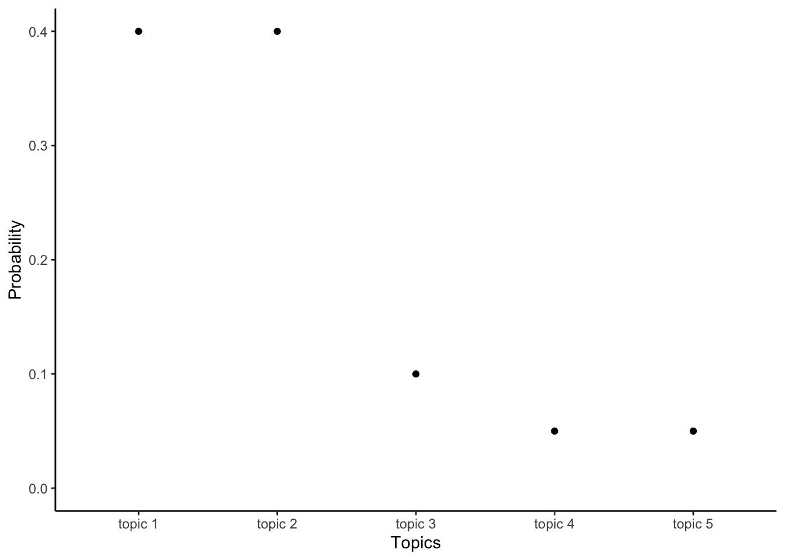
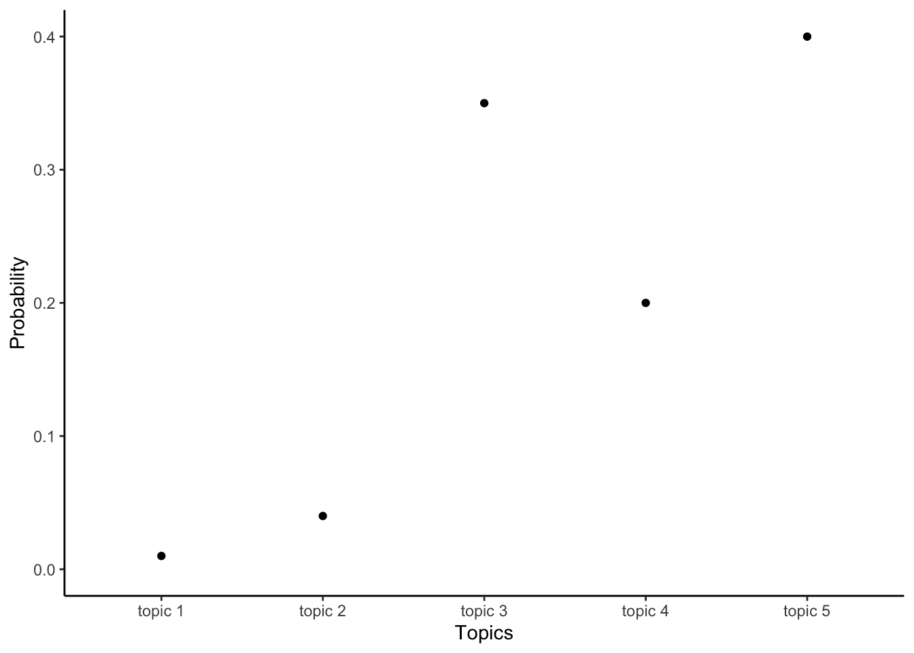
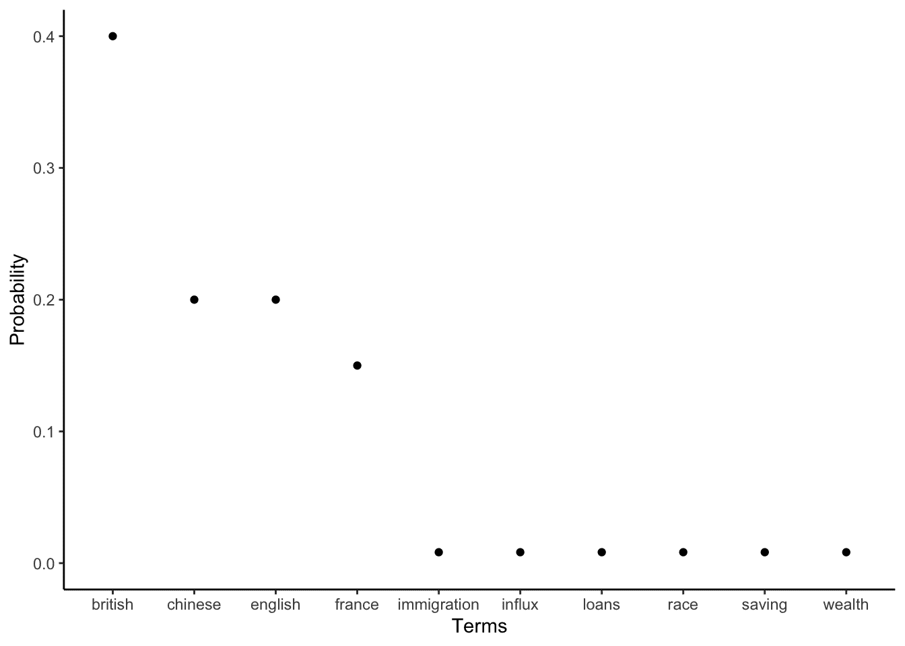
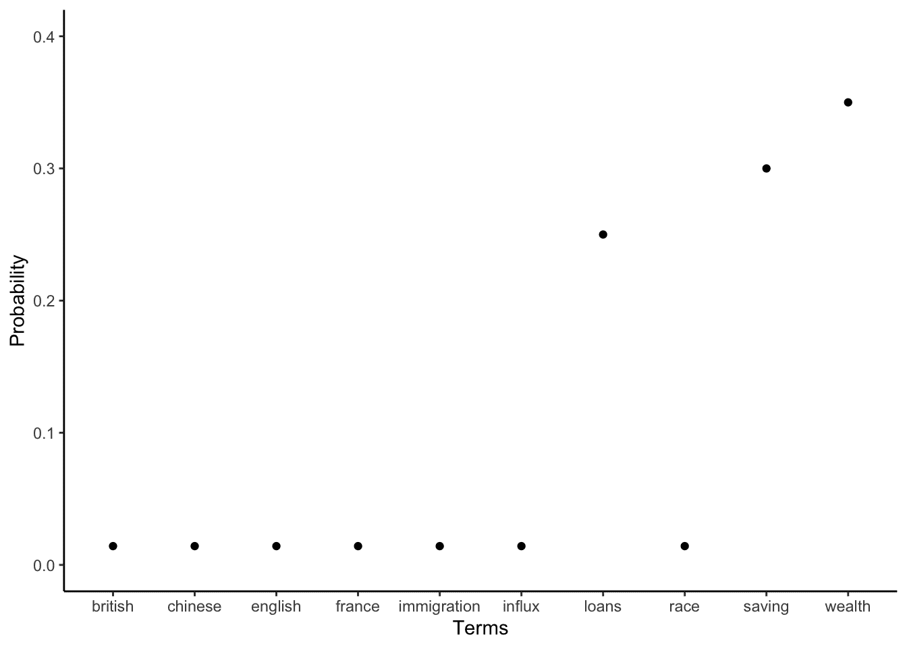

# 17  文本作为数据

> 原文：[`tellingstorieswithdata.com/16-text.html`](https://tellingstorieswithdata.com/16-text.html)

1.  应用

1.  17  文本作为数据

先决条件**

+   阅读 *文本作为数据：概述*，(Benoit 2020)

    +   本章概述了使用文本作为数据的方法。

+   阅读 *R 中的文本分析监督学习*，(Hvitfeldt and Silge 2021)

    +   重点关注第六章“回归”和第七章“分类”，这两章使用文本作为数据实现了线性模型和广义线性模型。

+   阅读 *《裸真相：6,816 种肤色产品的名称如何揭示美容偏见》*，(Amaka and Thomas 2021)

    +   对化妆品产品的文本分析。

关键概念和技能**

+   理解文本作为我们可以分析的数据源，这使我们能够考虑许多有趣的问题。

+   文本清洗和准备特别关键，因为可能存在大量不同的结果。在这个阶段需要做出许多决策，这些决策对后续分析有重要影响。

+   考虑文本数据集的一种方式是查看哪些单词可以区分特定的文档。

+   另一种考虑方式是确定文档中包含哪些主题。

软件和包**

+   Base R (R Core Team 2024)

+   `astrologer` (Gelfand 2022) (这个包不在 CRAN 上，所以请使用以下命令安装：`devtools::install_github("sharlagelfand/astrologer")`)

+   `beepr` (Bååth 2018)

+   `fs` (Hester, Wickham, and Csárdi 2021)

+   `gutenbergr` (Johnston and Robinson 2022)

+   `quanteda` (Benoit et al. 2018)

+   `stm` (Roberts, Stewart, and Tingley 2019)

+   `tidytext` (Silge and Robinson 2016)

+   `tidyverse` (Wickham et al. 2019)

+   `tinytable` (Arel-Bundock 2024)

```r
library(astrologer)
library(beepr)
library(fs)
library(gutenbergr)
library(quanteda)
library(stm)
library(tidytext)
library(tidyverse)
library(tinytable)
```

## 17.1 引言

文本无处不在。在许多情况下，文本是我们最早接触到的数据类型。计算能力的提升、新方法的开发以及文本的巨大可用性，意味着人们对使用文本作为数据产生了极大的兴趣。使用文本作为数据提供了独特的分析机会。例如：

+   非洲国家国有报纸的文本分析可以识别政府的操纵(Hassan 2022)。

+   英国日报的文本可以用来生成更好的 GDP 和通货膨胀预测（Kalamara 等人 2022），同样，*《纽约时报》*可以用来创建一个与美经活动相关的不确定性指数（Alexopoulos 和 Cohen 2015）；

+   电子健康记录（EHR）中笔记的分析可以提高疾病预测的效率（Gronsbell 等人 2019）；以及

+   美国国会记录的分析表明，女性立法者被男性打断的频率有多高（Miller 和 Sutherland 2022）。

早期对文本分析的方法往往将单词转换成数字，脱离了上下文。然后可以使用传统的分析方法进行分析，例如逻辑回归的变体。最近的方法试图利用文本中固有的结构，这可以带来额外的意义。这种差异可能就像一个能够将相似颜色分组的孩子，与一个知道物体是什么的孩子相比；尽管鳄鱼和树木都是绿色的，你可以利用这个知识做些事情，但知道鳄鱼可能会吃你，而树可能不会，是有用的。

文本可以被看作是我们在这本书中使用的所有数据集的一个庞大且相似的版本。主要区别在于，我们通常从宽数据开始，其中每个变量都是一个单词，或者更普遍地说，是一个标记。通常每个条目都是一个计数。然后我们通常会将其转换成相当长的数据，一个变量是单词，另一个是计数。将文本视为数据自然需要从其上下文中抽象出来。但不应完全分离，因为这可能会延续历史不平等。例如，Koenecke 等人（2020）发现，与白人说话者相比，自动语音识别系统对黑人说话者的表现要差得多，Davidson、Bhattacharya 和 Weber（2019）发现，使用黑人美式英语的推文，这是一个具体定义的技术术语，其被归类为仇恨言论的比率高于使用标准美式英语的类似推文，而标准美式英语也是一个技术术语。

文本数据的一个令人兴奋的方面是，它通常不是为了我们的分析目的而生成的。权衡是，我们通常必须做更多的工作，才能将其转换成我们可以处理的形式。在数据清洗和准备阶段有很多决定需要做出。

文本数据集的较大规模意味着在分析它们时模拟和从小处开始尤为重要。使用文本作为数据之所以令人兴奋，是因为我们有大量和多样的文本可用。但总的来说，处理文本数据集是混乱的。通常需要进行大量的清洗和准备。通常，文本数据集很大。因此，建立可重复的工作流程并清楚地传达你的发现变得至关重要。尽管如此，这仍然是一个令人兴奋的领域。

巨人的肩膀* *肯尼斯·贝诺特教授是伦敦政治经济学院（LSE）计算社会科学教授和数据科学学院院长。1998 年，他在哈佛大学获得政府学博士学位，导师是加里·金和肯尼斯·谢普斯勒，之后他在都柏林的三一学院任职。2007 年，他被晋升为教授。2020 年，他搬到了 LSE。他是使用定量方法分析文本数据，特别是政治文本和社交媒体的专家。他的一些重要论文包括 Laver, Benoit, and Garry (2003)，该论文从政治文本中提取政策立场，并帮助政治科学中的“文本作为数据”子领域开始。他还广泛参与了其他估计政策立场的方法，如 Benoit and Laver (2006)，它提供了几十个国家的原始专家调查立场，以及 Benoit and Laver (2007)，其中他比较了专家调查与手动编码的政党政策立场分析。一个核心贡献是名为`quanteda`的 R 包系列，用于“文本数据的定量分析”(Benoit et al. 2018)，这使得分析文本数据变得容易。*  *在这一章中，我们首先考虑准备文本数据集。然后我们考虑词频-逆文档频率（TF-IDF）和主题模型。

## 17.2 文本清洗和准备

文本建模是一个令人兴奋的研究领域。但，更普遍地说，清洗和准备方面通常至少与建模一样困难。我们将介绍一些基本知识，并提供一个可以在此基础上构建的基础。

第一步是获取一些数据。我们在第七章中讨论了数据收集，并顺便提到了许多来源，包括：

+   使用提供评论文本的*Inside Airbnb*。

+   Project Gutenberg，它提供了版权已过期的书籍的文本。

+   从维基百科或其他网站上抓取数据。

我们需要的用于文本清洗和准备的“工作马”包是`stringr`，它是`tidyverse`的一部分，以及`quanteda`。

为了说明目的，我们构建了一个来自三本书的第一句或两句话的语料库：托妮·莫里森的《宠儿》，海伦·德维特的《最后的武士》，以及夏洛蒂·勃朗特的《简·爱》。

```r
last_samurai <-"My father's father was a Methodist minister."

beloved <- "124 was spiteful. Full of Baby's venom."

jane_eyre <- "There was no possibility of taking a walk that day."

bookshelf <-
 tibble(
 book = c("Last Samurai", "Beloved", "Jane Eyre"),
 first_sentence = c(last_samurai, beloved, jane_eyre)
 )

bookshelf
```

```r
# A tibble: 3 × 2
  book         first_sentence                                     
  <chr>        <chr>                                              
1 Last Samurai My father's father was a Methodist minister.       
2 Beloved      124 was spiteful. Full of Baby's venom.            
3 Jane Eyre    There was no possibility of taking a walk that day.
```
我们通常希望构建一个文档特征矩阵，其中每个观测值包含文档，每个列包含单词，每个组合包含计数，以及相关的元数据。例如，如果我们的语料库是 Airbnb 评论的文本，那么每个文档可能是一篇评论，典型的特征可能包括：“The”，“Airbnb”，“was”，“great”。注意，这里的句子已经被分割成不同的单词。我们通常谈论“tokens”来泛指单词，因为我们对可能感兴趣的各种方面，但单词通常被广泛使用。

```r
books_corpus <-
 corpus(bookshelf, 
 docid_field = "book", 
 text_field = "first_sentence")

books_corpus
```

```r
Corpus consisting of 3 documents.
Last Samurai :
"My father's father was a Methodist minister."

Beloved :
"124 was spiteful. Full of Baby's venom."

Jane Eyre :
"There was no possibility of taking a walk that day."
```
我们使用语料库中的标记来构建一个文档特征矩阵（DFM），这通过`quanteda`中的`dfm()`函数实现(Benoit et al. 2018)。

```r
books_dfm <-
 books_corpus |>
 tokens() |>
 dfm()

books_dfm
```

```r
Document-feature matrix of: 3 documents, 21 features (57.14% sparse) and 0 docvars.
              features
docs           my father's father was a methodist minister . 124 spiteful
  Last Samurai  1        1      1   1 1         1        1 1   0        0
  Beloved       0        0      0   1 0         0        0 2   1        1
  Jane Eyre     0        0      0   1 1         0        0 1   0        0
[ reached max_nfeat ... 11 more features ]
```
我们现在考虑在这个过程中需要做出的许多决定。没有绝对的对或错。相反，我们根据我们将要使用的数据集来做出这些决定。

### 17.2.1 停用词

停用词是一些像“the”、“and”和“a”这样的词。长期以来，人们认为停用词传达的意义不大，并且对内存受限的计算存在担忧。准备文本数据集的一个常见步骤就是移除停用词。我们现在知道，停用词可以包含大量的意义(Schofield, Magnusson, and Mimno 2017)。是否移除它们是一个需要根据具体情况来决定的微妙决定。

我们可以使用`quanteda`中的`stopwords()`函数获取停用词列表。

```r
stopwords(source = "snowball")[1:10]
```

```r
 [1] "i"         "me"        "my"        "myself"    "we"        "our"      
 [7] "ours"      "ourselves" "you"       "your" 
```
然后我们可以查找该列表中所有单词的实例，并使用`str_replace_all()`函数粗略地移除它们。

```r
stop_word_list <-
 paste(stopwords(source = "snowball"), collapse = " | ")

bookshelf |>
 mutate(no_stops = str_replace_all(
 string = first_sentence,
 pattern = stop_word_list,
 replacement = " ")
 ) |>
 select(no_stops, first_sentence)
```

```r
# A tibble: 3 × 2
  no_stops                                 first_sentence                       
  <chr>                                    <chr>                                
1 My father's father a Methodist minister. My father's father was a Methodist m…
2 124 spiteful. Full Baby's venom.         124 was spiteful. Full of Baby's ven…
3 There no possibility taking walk day.    There was no possibility of taking a…
```
其他人已经编制了许多不同的停用词列表。例如，`stopwords()`可以使用包括“snowball”、“stopwords-iso”、“smart”、“marimo”、“ancient”和“nltk”在内的列表。更普遍地说，如果我们决定使用停用词，那么我们通常需要根据项目特定的单词来扩充这些列表。我们可以通过在语料库中创建单个单词的计数，然后按最常见排序，并将这些单词添加到停用词列表中来实现这一点。

```r
stop_word_list_updated <-
 paste(
 "Methodist |",
 "spiteful |",
 "possibility |",
 stop_word_list,
 collapse = " | "
 )

bookshelf |>
 mutate(no_stops = str_replace_all(
 string = first_sentence,
 pattern = stop_word_list_updated,
 replacement = " ")
 ) |>
 select(no_stops)
```

```r
# A tibble: 3 × 1
  no_stops                        
  <chr>                           
1 My father's father a  minister. 
2 124 spiteful. Full Baby's venom.
3 There no of taking walk day. 
```
我们可以通过`quanteda`中的`dfm_remove()`函数将停用词的移除整合到我们的 DFM 构建过程中。

```r
books_dfm |>
 dfm_remove(stopwords(source = "snowball"))
```

```r
Document-feature matrix of: 3 documents, 14 features (61.90% sparse) and 0 docvars.
              features
docs           father's father methodist minister . 124 spiteful full baby's
  Last Samurai        1      1         1        1 1   0        0    0      0
  Beloved             0      0         0        0 2   1        1    1      1
  Jane Eyre           0      0         0        0 1   0        0    0      0
              features
docs           venom
  Last Samurai     0
  Beloved          1
  Jane Eyre        0
[ reached max_nfeat ... 4 more features ]


当我们移除停用词时，我们人为地调整了我们的数据集。有时这样做可能有很好的理由。但绝不能不加思考地这样做。例如，在第六章 06-farm.html 和第十章 10-store_and_share.html 中，我们讨论了有时数据集可能需要被审查、截断或以其他类似方式处理，以保护受访者的隐私。可能是因为在开发这些方法时计算能力有限，所以将停用词的移除作为自然语言处理中的默认步骤整合进去。无论如何，Jurafsky 和 Martin([[2000] 2023, 62](99-references.html#ref-jurafskymartin))得出结论，移除停用词并不会提高文本分类的性能。相关地，Schofield、Magnusson 和 Mimno(2017)发现，移除除了最频繁的词之外的其他任何词都不会提高主题模型的推理能力。如果需要移除停用词，他们建议在构建主题之后进行这一操作。
  
### 17.2.2 大小写、数字和标点符号

有时候，我们只关心单词，而不是大小写或标点符号。例如，如果文本语料库特别混乱，或者某些单词的存在具有信息性。我们权衡信息损失的好处，以简化事物。我们可以使用`str_to_lower()`将文本转换为小写，并使用`str_replace_all()`通过“[:punct:]”移除标点符号，以及通过“[:digit:]”移除数字。

```r
bookshelf |>
 mutate(lower_sentence = str_to_lower(string = first_sentence)) |>
 select(lower_sentence)
```

```r
# A tibble: 3 × 1
  lower_sentence                                     
  <chr>                                              
1 my father's father was a methodist minister.       
2 124 was spiteful. full of baby's venom.            
3 there was no possibility of taking a walk that day.


```r
bookshelf |>
 mutate(no_punctuation_numbers = str_replace_all(
 string = first_sentence,
 pattern = "[:punct:]|[:digit:]",
 replacement = " "
 )) |>
 select(no_punctuation_numbers)
```

```r
# A tibble: 3 × 1
  no_punctuation_numbers                               
  <chr>                                                
1 "My father s father was a Methodist minister "       
2 "    was spiteful  Full of Baby s venom "            
3 "There was no possibility of taking a walk that day "


作为一个插曲，我们可以使用`str_replace_all()`中的“[:graph:]”来移除字母、数字和标点符号。虽然这在教科书示例中很少需要，但在真实数据集中特别有用，因为它们通常只有少数意外的符号需要我们识别并移除。我们用它来移除我们习惯上的所有内容，只留下我们不习惯的内容。

更普遍地，我们可以使用`quanteda()`中的`tokens()`函数的参数来进行这项操作。

```r
books_corpus |>
 tokens(remove_numbers = TRUE, remove_punct = TRUE)
```

```r
Tokens consisting of 3 documents.
Last Samurai :
[1] "My"        "father's"  "father"    "was"       "a"         "Methodist"
[7] "minister" 

Beloved :
[1] "was"      "spiteful" "Full"     "of"       "Baby's"   "venom"   

Jane Eyre :
 [1] "There"       "was"         "no"          "possibility" "of"         
 [6] "taking"      "a"           "walk"        "that"        "day" 
```
  
### 17.2.3 错别字和罕见词

然后，我们需要决定如何处理错别字和其他小问题。每个现实世界的文本都存在错别字。有时这些错别字应该被明确地纠正。但如果它们是以系统性的方式出现的，例如，某个作者总是犯同样的错误，那么如果我们对按作者分组感兴趣，它们可能具有价值。OCR 的使用也会引入一些常见问题，正如在第七章 07-gather.html 中看到的。例如，“the”通常被错误地识别为“thc”。

我们可以用与修正停用词相同的方式修正拼写错误，即使用修正列表。对于不常见的单词，我们可以在创建文档特征矩阵时将其纳入，使用 `dfm_trim()`。例如，我们可以使用“min_termfreq = 2”来删除任何至少不出现两次的单词，或者使用“min_docfreq = 0.05”来删除任何至少不在五分之五的文档中的单词，“max_docfreq = 0.90”来删除在任何至少百分之九十的文档中出现的单词。

```r
books_corpus |>
 tokens(remove_numbers = TRUE, remove_punct = TRUE) |>
 dfm(tolower = TRUE) |>
 dfm_trim(min_termfreq = 2)
```

```r
Document-feature matrix of: 3 documents, 3 features (22.22% sparse) and 0 docvars.
              features
docs           was a of
  Last Samurai   1 1  0
  Beloved        1 0  1
  Jane Eyre      1 1  1
```
### 17.2.4 元组

元组是有序元素列表。在文本的上下文中，它是一系列单词。如果元组包含两个单词，那么我们称之为“二元组”，三个单词是“三元组”，等等。在文本清理和准备过程中，这些问题会出现，因为我们通常根据空格来分隔术语。这会导致不适当的分隔。

在处理地名时，这是一个明显的问题。例如，考虑“British Columbia”、“New Hampshire”、“United Kingdom”和“Port Hedland”。一种前进的方式是创建一个此类地点的列表，然后使用 `str_replace_all()` 添加下划线，例如，“British_Columbia”、“New_Hampshire”、“United_Kingdom”和“Port_Hedland”。另一种选择是使用 `quanteda` 的 `tokens_compound()`。

```r
some_places <- c("British Columbia", 
 "New Hampshire", 
 "United Kingdom", 
 "Port Hedland")
a_sentence <-
c("Vancouver is in British Columbia and New Hampshire is not")

tokens(a_sentence) |>
 tokens_compound(pattern = phrase(some_places))
```

```r
Tokens consisting of 1 document.
text1 :
[1] "Vancouver"        "is"               "in"               "British_Columbia"
[5] "and"              "New_Hampshire"    "is"               "not" 
```
在这种情况下，我们知道元组是什么。但可能我们不确定语料库中常见的元组是什么。我们可以使用 `tokens_ngrams()` 来识别它们。我们可以要求，例如，从《简·爱》的摘录中获取所有二元组。我们在第十三章中展示了如何从 Project Gutenberg 下载这本书的文本第十三章，因此这里我们加载我们之前保存的本地版本。

```r
jane_eyre <- read_csv(
 "jane_eyre.csv",
 col_types = cols(
 gutenberg_id = col_integer(),
 text = col_character()
 )
)

jane_eyre
```

```r
# A tibble: 21,001 × 2
   gutenberg_id text                           
          <int> <chr>                          
 1         1260 JANE EYRE                      
 2         1260 AN AUTOBIOGRAPHY               
 3         1260 <NA>                           
 4         1260 by Charlotte Brontë            
 5         1260 <NA>                           
 6         1260 _ILLUSTRATED BY F. H. TOWNSEND_
 7         1260 <NA>                           
 8         1260 London                         
 9         1260 SERVICE & PATON                
10         1260 5 HENRIETTA STREET             
# ℹ 20,991 more rows
```

由于有很多空白行，我们将删除它们。

```r
jane_eyre <- 
 jane_eyre |> 
 filter(!is.na(text))
```

```r
jane_eyre_text <- tibble(
 book = "Jane Eyre",
 text = paste(jane_eyre$text, collapse = " ") |>
 str_replace_all(pattern = "[:punct:]",
 replacement = " ") |>
 str_replace_all(pattern = stop_word_list,
 replacement = " ")
)

jane_eyre_corpus <-
 corpus(jane_eyre_text, docid_field = "book", text_field = "text")
ngrams <- tokens_ngrams(tokens(jane_eyre_corpus), n = 2)
ngram_counts <-
 tibble(ngrams = unlist(ngrams)) |>
 count(ngrams, sort = TRUE)

head(ngram_counts)
```

```r
# A tibble: 6 × 2
  ngrams           n
  <chr>        <int>
1 I_not          344
2 Mr_Rochester   332
3 I_thought      136
4 St_John        132
5 don_t          126
6 I_saw          122
```
在识别了一些常见的二元组后，我们可以将它们添加到待更改的列表中。这个例子包括像“Mr Rochester”和“St John”这样的名字，它们在分析时需要保持在一起。
  
### 17.2.5 词干提取和词形还原

词干提取和词形还原是减少文本数据集维度的另一种常见方法。词干提取意味着移除单词的最后一部分，期望这会产生更通用的单词。例如，“Canadians”、“Canadian”和“Canada”都词干提取为“Canad”。词形还原与此类似，但更为复杂。它意味着改变单词，不仅是在拼写上，而且在它们的规范形式上(Grimmer, Roberts, and Stewart 2022, 54)。例如，“Canadians”、“Canadian”、“Canucks”和“Canuck”都可能被更改为“Canada”。

我们可以使用 `dfm_wordstem()` 来实现这一点。我们注意到，例如，“minister” 已经被更改为 “minist”。

```r
char_wordstem(c("Canadians", "Canadian", "Canada"))
```

```r
[1] "Canadian" "Canadian" "Canada" 
```

```r
books_corpus |>
 tokens(remove_numbers = TRUE, remove_punct = TRUE) |>
 dfm(tolower = TRUE) |>
 dfm_wordstem()
```

```r
Document-feature matrix of: 3 documents, 18 features (59.26% sparse) and 0 docvars.
              features
docs           my father was a methodist minist spite full of babi
  Last Samurai  1      2   1 1         1      1     0    0  0    0
  Beloved       0      0   1 0         0      0     1    1  1    1
  Jane Eyre     0      0   1 1         0      0     0    0  1    0
[ reached max_nfeat ... 8 more features ]
```
虽然这是使用文本作为数据的一个常见步骤，但 Schofield 等人(2017)发现，在后续讨论的主题建模的背景下，词干提取的影响很小，几乎没有必要进行这一步骤。

### 17.2.6 重复

由于文本数据集的规模，重复是文本数据集的一个主要问题。例如，Bandy 和 Vincent(2021)表明，在 BookCorpus 数据集中，大约 30%的数据是不适当重复的，Schofield，Thompson 和 Mimno(2017)表明这是一个主要问题，可能会严重影响结果。然而，这可能是一个微妙且难以诊断的问题。例如，在第十三章中，当我们考虑在泊松回归背景下各种作者的页数计数时，我们很容易不小心将每个莎士比亚条目重复计算两次，因为不仅每个剧本都有条目，而且还有许多包含所有剧本的选集。仔细考虑我们的数据集确定了这个问题，但在大规模上这将很困难。
  
## 17.3 词频-逆文档频率 (TF-IDF)

### 17.3.1 区分运势

安装并加载`astrologer`，这是一个用于探索真实数据集的占星术数据集。

然后，我们可以访问“horoscopes”数据集。

```r
horoscopes
```

```r
# A tibble: 1,272 × 4
   startdate  zodiacsign  horoscope                                        url  
   <date>     <fct>       <chr>                                            <chr>
 1 2015-01-05 Aries       Considering the fact that this past week (espec… http…
 2 2015-01-05 Taurus      It's time Taurus. You aren't one to be rushed a… http…
 3 2015-01-05 Gemini      Soon it will be time to review what you know, t… http…
 4 2015-01-05 Cancer      Feeling  feelings and being full of flavorful s… http…
 5 2015-01-05 Leo         Look, listen, watch, meditate and engage in pra… http…
 6 2015-01-05 Virgo       Last week's astrology is still reverberating th… http…
 7 2015-01-05 Libra       Get out your markers and your glue sticks. Get … http…
 8 2015-01-05 Scorpio     Time to pay extra attention to the needs of you… http…
 9 2015-01-05 Sagittarius Everything right now is about how you say it, h… http…
10 2015-01-05 Capricorn   The full moon on January 4th/5th was a healthy … http…
# ℹ 1,262 more rows
```
有四个变量：“startdate”，“zodiacsign”，“horoscope”和“url”（注意，URL 已过时，因为网站已经更新，例如，第一个链接指向[这里](https://chaninicholas.com/horoscopes-week-january-5th/))。我们感兴趣的是用于区分每个星座运势的词汇。

```r
horoscopes |>
 count(zodiacsign)
```

```r
# A tibble: 12 × 2
   zodiacsign      n
   <fct>       <int>
 1 Aries         106
 2 Taurus        106
 3 Gemini        106
 4 Cancer        106
 5 Leo           106
 6 Virgo         106
 7 Libra         106
 8 Scorpio       106
 9 Sagittarius   106
10 Capricorn     106
11 Aquarius      106
12 Pisces        106
```
每个星座有 106 个运势。在这个例子中，我们首先按单词进行分词，然后仅基于星座创建计数，而不是日期。我们使用`tidytext`，因为它在 Hvitfeldt 和 Silge(2021)的书中被广泛使用。

```r
horoscopes_by_word <-
 horoscopes |>
 select(-startdate,-url) |>
 unnest_tokens(output = word,
 input = horoscope,
 token = "words")

horoscopes_counts_by_word <-
 horoscopes_by_word |>
 count(zodiacsign, word, sort = TRUE)

horoscopes_counts_by_word
```

```r
# A tibble: 41,850 × 3
   zodiacsign  word      n
   <fct>       <chr> <int>
 1 Cancer      to     1440
 2 Sagittarius to     1377
 3 Aquarius    to     1357
 4 Aries       to     1335
 5 Pisces      to     1313
 6 Leo         to     1302
 7 Libra       to     1270
 8 Sagittarius you    1264
 9 Virgo       to     1262
10 Scorpio     to     1260
# ℹ 41,840 more rows
```
我们可以看到，对于不同的星座，最受欢迎的词汇似乎很相似。在这个阶段，我们可以用各种方式使用这些数据。

我们可能想知道哪些词汇能表征每个群体——也就是说，哪些词汇在每个群体中是常用且仅在该群体中使用的。我们可以通过首先查看一个词的词频（TF），即每个星座运势中一个词被使用的次数来实现。问题是，有很多词在无论什么语境下都常用。因此，我们可能还想查看逆文档频率（IDF），其中我们对在许多星座运势中出现的词进行“惩罚”。在许多星座运势中出现的词会有比仅在某个星座运势中出现的词更低的 IDF。因此，词频-逆文档频率（tf-idf）是这两个值的乘积。

我们可以使用`tidytext`中的`bind_tf_idf()`来创建这个值。它将为这些度量中的每一个创建新的变量。

```r
horoscopes_counts_by_word_tf_idf <-
 horoscopes_counts_by_word |>
 bind_tf_idf(
 term = word,
 document = zodiacsign,
 n = n
 ) |>
 arrange(-tf_idf)

horoscopes_counts_by_word_tf_idf
```

```r
# A tibble: 41,850 × 6
   zodiacsign  word            n       tf   idf   tf_idf
   <fct>       <chr>       <int>    <dbl> <dbl>    <dbl>
 1 Capricorn   goat            6 0.000236  2.48 0.000585
 2 Pisces      pisces         14 0.000531  1.10 0.000584
 3 Sagittarius sagittarius    10 0.000357  1.39 0.000495
 4 Cancer      cancer         10 0.000348  1.39 0.000483
 5 Gemini      gemini          7 0.000263  1.79 0.000472
 6 Taurus      bulls           5 0.000188  2.48 0.000467
 7 Aries       warns           5 0.000186  2.48 0.000463
 8 Cancer      organize        7 0.000244  1.79 0.000437
 9 Cancer      overwork        5 0.000174  2.48 0.000433
10 Taurus      let's          10 0.000376  1.10 0.000413
# ℹ 41,840 more rows
```
在表 17.1 中，我们查看区分每个星座占星术的单词。首先要注意的是，其中一些有它们自己的星座。一方面，有理由去除它们，但另一方面，它们并非对所有星座都发生的事实可能有助于了解每个星座占星术的性质。

```r
horoscopes_counts_by_word_tf_idf |>
 slice(1:5,
 .by = zodiacsign) |>
 select(zodiacsign, word) |>
 summarise(all = paste0(word, collapse = "; "),
 .by = zodiacsign) |>
 tt() |> 
 style_tt(j = 1:2, align = "lr") |> 
 setNames(c("Zodiac sign", "Most common words unique to that sign"))
```

表 17.1：占星术中独特的星座特有的最常见单词

| 星座 | 该星座特有的最常见单词 |
| --- | --- |
| 摩羯座 | goat; capricorn; capricorns; signify; neighborhood |
| 双鱼座 | pisces; wasted; missteps; node; shoes |
| 射手座 | sagittarius; rolodex; distorted; coat; reinvest |
| 癌症 | cancer; organize; overwork; procrastinate; scuttle |
| 双子座 | gemini; mood; output; admit; faces |
| 金牛座 | bulls; let's; painfully; virgin; taurus |
| 白羊座 | warns; vesta; aries; fearful; chase |
| 处女座 | digesting; trace; liberate; someone's; final |
| 天秤座 | proof; inevitably; recognizable; reference; disguise |
| 天蝎座 | skate; advocate; knots; bottle; meditating |
| 水瓶座 | saves; consult; yearnings; sexy; athene |

| 利奥 | trines; blessed; regrets; leo; agree |
  
## 17.4 主题模型

当我们有许多陈述并且想要根据使用相似单词的句子创建组时，主题模型很有用。我们将这些相似单词的组视为定义主题。获取每个陈述主题的一致估计的一种方法是用主题模型。虽然有许多变体，但一种方法是用 Blei、Ng 和 Jordan 的潜在狄利克雷分配（LDA）方法（2003），如`stm`实现。为了清晰起见，在本章的上下文中，LDA 指的是潜在狄利克雷分配，而不是线性判别分析，尽管这也是与 LDA 缩写相关的一个常见主题。

LDA 方法背后的关键假设是，对于每个陈述，即文档，是由一个决定在文档中想要讨论哪些主题的人编写的，然后选择与这些主题适当的单词、术语。可以将主题视为术语的集合，文档视为主题的集合。主题不是事前指定的；它们是方法的结果。术语不一定属于特定的主题，文档可能涉及多个主题。这比其他方法（如严格的词数统计方法）提供了更多的灵活性。目标是让文档中的单词自行分组以定义主题。

LDA 模型认为每个陈述都是一个过程的结果，在这个过程中，一个人首先选择他们想要讨论的主题。在选择主题之后，这个人然后选择适合每个主题的适当词语。更普遍地，LDA 主题模型通过考虑每个文档是由某些主题的概率分布生成的。例如，如果有五个主题和两个文档，那么第一个文档可能主要由前几个主题组成；另一个文档可能主要关于最后几个主题（图 17.1）。



(a) 文档 1 的分布



(b) 文档 2 的分布

图 17.1：主题的概率分布

同样，每个主题也可以被认为是一个词语的概率分布。为了选择每个文档中使用的词语，说话者从每个主题中按适当比例选择词语。例如，如果有十个词语，那么一个主题可以通过给予与移民相关的词语更多权重来定义；另一个主题可能更重视与经济相关的词语（图 17.2）。



(a) 主题 1 的分布



(b) 主题 2 的分布

图 17.2：词语的概率分布

作为背景，Dirichlet 分布是 beta 分布的一种变体，通常用作分类和多项式变量的先验分布。如果只有两个类别，那么 Dirichlet 分布和 beta 分布是相同的。在特殊的对称 Dirichlet 分布情况下，$\eta=1$，它等同于均匀分布。如果$\eta<1$，那么分布是稀疏的，集中在较少的值上，并且随着$\eta$的减小，这个数值会减少。在这个用法中，超参数是先验分布的参数。

文档创建之后，它们就是我们可以分析的所有内容。每个文档中的词语使用情况被观察到，但主题是隐藏的，或称为“潜在的”。我们不知道每个文档的主题，也不知道词语是如何定义主题的。也就是说，我们不知道图 17.1 或图 17.2 的概率分布。从某种意义上说，我们正在尝试逆转文档生成过程——我们有词语，我们希望发现主题。

如果我们观察每个文档中的词语，那么我们可以获得主题的估计值（Steyvers 和 Griffiths 2006）。LDA 过程的输出是概率分布。正是这些分布定义了主题。每个词语将给出属于特定主题的概率，每个文档也将给出关于特定主题的概率。

在给定文档语料库的情况下实施 LDA 的初始实际步骤通常是删除停用词。尽管如前所述，这并非必要，而且可能最好在创建组之后完成。我们通常还会删除标点符号和大写字母。然后我们使用`quanteda`中的`dfm()`构建我们的文档-特征矩阵。

数据集准备就绪后，可以使用`stm`来实现 LDA 并近似后验。这个过程试图在给定所有其他文档中所有其他术语的主题的情况下，为特定文档中的特定术语找到一个主题。广义上，它首先将每个文档中的每个术语分配给一个由 Dirichlet 先验指定的随机主题。然后，它选择特定文档中的特定术语，并根据所有其他文档中所有其他术语的主题条件分布将其分配给一个新的主题（Grün 和 Hornik 2011, 6）。一旦这个估计完成，就可以从单词到主题和主题到文档的分布中得出估计。

条件分布根据一个术语之前被分配给该主题的频率以及该主题在该文档中的普遍性来分配主题（Steyvers 和 Griffiths 2006）。主题的初始随机分配意味着早期通过文档语料库的遍历结果较差，但给定足够的时间，算法会收敛到一个适当的估计。

主题数量$k$的选择会影响结果，并且必须事先指定。如果有充分的理由选择特定的数字，则可以使用它。否则，选择适当数量的方法之一是使用测试集和训练集过程。本质上，这意味着在多种可能的$k$值上运行该过程，然后选择一个表现良好的适当值。

LDA 方法的一个弱点是它考虑了一个“词袋”模型，其中那些词的顺序并不重要（Blei 2012）。可以将模型扩展以减少词袋假设的影响，并添加条件性到词序。此外，可以使用 Dirichlet 分布的替代品来扩展模型，以允许相关性。

### 17.4.1 加拿大议会上讨论了什么？

沿用英国的做法，加拿大议会的发言记录被称为“Hansard”。它不是完全逐字记录，但非常接近。它可以从[LiPaD](https://www.lipad.ca)以 CSV 格式获得，该格式由 Beelen 等人构建（2017）。

我们对 2018 年加拿大议会的讨论内容感兴趣。为了开始，我们可以从[这里](https://www.lipad.ca/data/)下载整个语料库，然后丢弃除 2018 年之外的所有年份。如果数据集在一个名为“2018”的文件夹中，我们可以使用 `read_csv()` 来读取和合并所有的 CSV 文件。

```r
files_of_interest <-
 dir_ls(path = "2018/", glob = "*.csv", recurse = 2)

hansard_canada_2018 <-
 read_csv(
 files_of_interest,
 col_types = cols(
 basepk = col_integer(),
 speechdate = col_date(),
 speechtext = col_character(),
 speakerparty = col_character(),
 speakerriding = col_character(),
 speakername = col_character()
 ),
 col_select = 
 c(basepk, speechdate, speechtext, speakername, speakerparty, 
 speakerriding)) |>
 filter(!is.na(speakername))

hansard_canada_2018
```

```r
# A tibble: 33,105 × 6
    basepk speechdate speechtext          speakername speakerparty speakerriding
     <int> <date>     <chr>               <chr>       <chr>        <chr>        
 1 4732776 2018-01-29 "Mr. Speaker, I wo… Julie Dabr… Liberal      Toronto—Danf…
 2 4732777 2018-01-29 "Mr. Speaker, I wa… Matthew Du… New Democra… Beloeil—Cham…
 3 4732778 2018-01-29 "Mr. Speaker, I am… Stephanie … Conservative Calgary Midn…
 4 4732779 2018-01-29 "Resuming debate.\… Anthony Ro… Liberal      Nipissing—Ti…
 5 4732780 2018-01-29 "Mr. Speaker, we a… Alain Rayes Conservative Richmond—Art…
 6 4732781 2018-01-29 "The question is o… Anthony Ro… Liberal      Nipissing—Ti…
 7 4732782 2018-01-29 "Agreed.\n No."     Some hon. … <NA>         <NA>         
 8 4732783 2018-01-29 "All those in favo… Anthony Ro… Liberal      Nipissing—Ti…
 9 4732784 2018-01-29 "Yea."              Some hon. … <NA>         <NA>         
10 4732785 2018-01-29 "All those opposed… Anthony Ro… Liberal      Nipissing—Ti…
# ℹ 33,095 more rows
```

在最后使用 `filter()` 是必要的，因为有时“directions”和类似的非语音方面会被包含在汉萨德（Hansard）中。例如，如果我们不包括那个 `filter()`，那么第一行将是“The House resumed from November 9, 2017, consideration of the motion.” 然后，我们可以构建一个语料库。

```r
hansard_canada_2018_corpus <-
 corpus(hansard_canada_2018, 
 docid_field = "basepk", 
 text_field = "speechtext")
```

```r
Warning: NA is replaced by empty string
```

```r
hansard_canada_2018_corpus
```

```r
Corpus consisting of 33,105 documents and 4 docvars.
4732776 :
"Mr. Speaker, I would like to wish everyone in this place a h..."

4732777 :
"Mr. Speaker, I want to thank my colleague from Richmond—Arth..."

4732778 :
"Mr. Speaker, I am here today to discuss a motion that asks t..."

4732779 :
"Resuming debate. There being no further debate, the hon. mem..."

4732780 :
"Mr. Speaker, we are nearing the end of the discussion and de..."

4732781 :
"The question is on the motion. Is the pleasure of the House ..."

[ reached max_ndoc ... 33,099 more documents ]
```
我们使用语料库中的标记来构建一个文档-特征矩阵。为了使我们的计算工作稍微容易一些，我们移除了至少没有出现两次的任何单词，以及至少没有出现在至少两个文档中的任何单词。

```r
hansard_dfm <-
 hansard_canada_2018_corpus |>
 tokens(
 remove_punct = TRUE,
 remove_symbols = TRUE
 ) |>
 dfm() |>
 dfm_trim(min_termfreq = 2, min_docfreq = 2) |>
 dfm_remove(stopwords(source = "snowball"))

hansard_dfm
```

```r
Document-feature matrix of: 33,105 documents, 29,432 features (99.77% sparse) and 4 docvars.
         features
docs      mr speaker like wish everyone place happy new year great
  4732776  1       1    2    1        1     4     2   3    5     1
  4732777  1       1    5    0        1     1     0   0    0     1
  4732778  1       1    2    0        0     1     0   0    4     1
  4732779  0       0    0    0        0     0     0   0    0     0
  4732780  1       1    4    0        1     1     0   0    2     0
  4732781  0       0    0    0        0     0     0   0    0     0
[ reached max_ndoc ... 33,099 more documents, reached max_nfeat ... 29,422 more features ]
```
在这个时候，我们可以使用 `stm` 中的 `stm()` 来实现 LDA 模型。我们需要指定一个文档-特征矩阵和主题的数量。主题模型本质上只是摘要。与文档成为单词的集合不同，它们成为具有与每个主题相关概率的主题的集合。但是，因为它只是提供了一组在相似时间使用的单词，而不是实际的下层含义，所以我们需要指定我们感兴趣的主题数量。这个决定将产生重大影响，我们应该考虑几个不同的数字。

```r
hansard_topics <- stm(documents = hansard_dfm, K = 10)

beepr::beep()

write_rds(
 hansard_topics,
 file = "hansard_topics.rda"
)
```

这将需要一些时间，可能 15-30 分钟，所以当模型完成时使用 `write_rds()` 保存模型是有用的，并且使用 `beep` 来获取完成的提醒。然后我们可以使用 `read_rds()` 读取结果。

```r
hansard_topics <- read_rds(
 file = "hansard_topics.rda"
)
```

我们可以使用 `labelTopics()` 来查看每个主题中的单词。

```r
labelTopics(hansard_topics)
```

```r
Topic 1 Top Words:
     Highest Prob: indigenous, government, communities, bill, first, development, nations 
     FREX: fisheries, fish, oceans, marine, habitat, coastal, plastic 
     Lift: 10-knot, 13-storey, 167.4, 1885, 2,560, 200-mile, 2016-19 
     Score: indigenous, fisheries, oceans, fish, marine, environmental, peoples 
Topic 2 Top Words:
     Highest Prob: community, people, canada, mr, housing, speaker, many 
     FREX: latin, celebrate, filipino, sikh, anniversary, cancer, celebrating 
     Lift: #myfeminism, 1897, 1904, 1915, 1925, 1941, 1943 
     Score: latin, housing, filipino, sikh, celebrate, heritage, enverga 
Topic 3 Top Words:
     Highest Prob: bill, justice, system, criminal, victims, court, violence 
     FREX: justice, criminal, crime, firearms, offences, c-75, gun 
     Lift: 1608, 2,465, 202, 273, 273.1, 3.01, 302-page 
     Score: criminal, justice, c-75, firearms, offences, correctional, crime 
Topic 4 Top Words:
     Highest Prob: carbon, energy, pipeline, climate, government, oil, canada 
     FREX: carbon, emissions, pipelines, greenhouse, pricing, fuel, fossil 
     Lift: emitters, ipcc, pricing, -30, 0822, 1.3-billion, 1.62 
     Score: carbon, pipeline, oil, energy, emissions, climate, pollution 
Topic 5 Top Words:
     Highest Prob: canada, government, canadians, workers, canadian, new, tax 
     FREX: tariffs, steel, postal, cptpp, cra, nafta, aluminum 
     Lift: ip, wages, 0.6, 0.9, 1,090, 1.26-billion, 1.84 
     Score: tax, workers, economy, cptpp, tariffs, postal, growth 
Topic 6 Top Words:
     Highest Prob: member, speaker, mr, minister, house, hon, question 
     FREX: ethics, yea, resuming, hon, briefing, fundraisers, secretary 
     Lift: khan, norman, 1,525, 100-plus, 13.1, 1316, 13198 
     Score: hon, member, prime, question, ethics, nay, minister 
Topic 7 Top Words:
     Highest Prob: government, minister, liberals, liberal, prime, canadians, veterans 
     FREX: deficit, deficits, phoenix, veterans, promises, promised, davie 
     Lift: 0.23, 12.50, 14-billion, 148.6, 20-billion, 2045, 2051 
     Score: liberals, veterans, prime, tax, liberal, budget, deficit 
Topic 8 Top Words:
     Highest Prob: canada, motion, government, rights, mr, house, speaker 
     FREX: petition, refugees, pursuant, asylum, refugee, iran, israel 
     Lift: cfia, pre-clearance, terror, c-350, consular, crossers, deferred 
     Score: iran, immigration, pursuant, asylum, refugees, petition, petitioners 
Topic 9 Top Words:
     Highest Prob: bill, committee, act, legislation, canadians, canada, information 
     FREX: amendment, harassment, organ, cannabis, tobacco, c-59, c-65 
     Lift: 240.1, a36, anti-tobacco, appropriations, beadonor.ca, calibrated, carvin 
     Score: bill, amendments, elections, harassment, organ, amendment, c-76 
Topic 10 Top Words:
     Highest Prob: people, one, can, want, us, get, going 
     FREX: things, think, lot, something, see, really, look 
     Lift: 22-year-old, 980,000, backtracking, balloting, carolina, disenfranchise, enfranchisement 
     Score: people, going, forward, legislation, things, voter, think 
```
  
## 17.5 练习

### 练习

1.  *(Plan)* 考虑以下场景：*你运营一个新闻网站，并试图了解是否允许匿名评论。你决定进行 A/B 测试，其中我们保持一切不变，但只允许网站的一个版本允许匿名评论。你唯一需要决定的是从测试中获得文本数据。* 请绘制出这个数据集可能的样子，然后绘制一个图表来展示所有的观察结果。

1.  *(Simulate)* 请进一步考虑所描述的场景，并模拟这种情况。请至少包含基于模拟数据的十个测试。

1.  *(Acquire)* 请描述这种数据集的一个可能来源。

1.  *(Explore)* 请使用 `ggplot2` 构建你草图中的图形。使用 `rstanarm` 构建模型。

1.  *(Communicate)* 请写两段关于你所做的工作的描述。

### 测验

1.  `str_replace_all()` 的哪个参数可以移除标点符号？

    1.  “[:punct:]”

    1.  “[:digit:]”

    1.  “[:alpha:]”

    1.  “[:lower:]”

1.  将 `stopwords(source = "snowball")[1:10]` 修改为找到“nltk”列表中的第九个停用词。

    1.  “her”

    1.  “my”

    1.  “you”

    1.  “i”

1.  quanteda() 中哪个函数可以标记语料库？

    1.  `tokenizer()`

    1.  `token()`

    1.  `tokenize()`

    1.  `tokens()`

1.  如果我们只想包括至少出现两次的术语，应该使用 `dfm_trim()` 的哪个参数？ = 2)

    1.  “min_wordfreq”

    1.  “min_termfreq”

    1.  “min_term_occur”

    1.  “min_ occurrence”

1.  你最喜欢的三元组示例是什么？

1.  在巨蟹座占星术中，第二个最常见的单词是什么？

    1.  到

    1.  你的

    1.  the

    1.  你

1.  在双鱼座占星术中，第六个最常见的单词是什么，这个单词只属于双鱼座？

    1.  鞋子

    1.  祈祷

    1.  鱼类

    1.  pisces

1.  重新运行加拿大主题模型，但只包括五个主题。观察每个主题中的单词，你会如何描述每个主题的内容？

### 课堂活动

+   孩子们是先学会“狗”、“猫”还是“鸟”？使用 Wordbank 数据库。

### 任务

请遵循 Hvitfeldt 和 Silge 在《R 中的文本分析监督机器学习》第五章 2.2 节“通过自己找到它们来理解词嵌入”中的代码（2021），该章节内容可在[这里](https://smltar.com/embeddings.html)免费获取，以实现从 [LiPaD](https://www.lipad.ca) 一年的数据中创建自己的词嵌入。

Alexopoulos, Michelle, and Jon Cohen. 2015\. “The power of print: Uncertainty shocks, markets, and the economy.” *International Review of Economics & Finance* 40 (November): 8–28\. [`doi.org/10.1016/j.iref.2015.02.002`](https://doi.org/10.1016/j.iref.2015.02.002).Amaka, Ofunne, and Amber Thomas. 2021\. “The Naked Truth: How the Names of 6,816 Complexion Products Can Reveal Bias in Beauty.” *The Pudding*, March. [`pudding.cool/2021/03/foundation-names/`](https://pudding.cool/2021/03/foundation-names/).Arel-Bundock, Vincent. 2024\. *tinytable: Simple and Configurable Tables in “HTML,” “LaTeX,” “Markdown,” “Word,” “PNG,” “PDF,” and “Typst” Formats*. [`vincentarelbundock.github.io/tinytable/`](https://vincentarelbundock.github.io/tinytable/).Bååth, Rasmus. 2018\. *beepr: Easily Play Notification Sounds on any Platform*. [`CRAN.R-project.org/package=beepr`](https://CRAN.R-project.org/package=beepr).Bandy, John, and Nicholas Vincent. 2021\. “Addressing ‘Documentation Debt’ in Machine Learning: A Retrospective Datasheet for BookCorpus.” In *Proceedings of the Neural Information Processing Systems Track on Datasets and Benchmarks*, edited by J. Vanschoren and S. Yeung. Vol. 1\. [`datasets-benchmarks-proceedings.neurips.cc/paper_files/paper/2021/file/54229abfcfa5649e7003b83dd4755294-Paper-round1.pdf`](https://datasets-benchmarks-proceedings.neurips.cc/paper_files/paper/2021/file/54229abfcfa5649e7003b83dd4755294-Paper-round1.pdf).Beelen, Kaspar, Timothy Alberdingk Thim, Christopher Cochrane, Kees Halvemaan, Graeme Hirst, Michael Kimmins, Sander Lijbrink, et al. 2017\. “Digitization of the Canadian Parliamentary Debates.” *Canadian Journal of Political Science* 50 (3): 849–64.Benoit, Kenneth. 2020\. “Text as Data: An Overview.” In *The SAGE Handbook of Research Methods in Political Science and International Relations*, edited by Luigi Curini and Robert Franzese, 461–97\. London: SAGE Publishing. [`doi.org/10.4135/9781526486387.n29`](https://doi.org/10.4135/9781526486387.n29).Benoit, Kenneth, and Michael Laver. 2006\. *Party Policy in Modern Democracies*. Routledge.———. 2007\. “Estimating Party Policy Positions: Comparing Expert Surveys and Hand-Coded Content Analysis.” *Electoral Studies* 26 (1): 90–107\. [`doi.org/10.1016/j.electstud.2006.04.008`](https://doi.org/10.1016/j.electstud.2006.04.008).Benoit, Kenneth, Kohei Watanabe, Haiyan Wang, Paul Nulty, Adam Obeng, Stefan Müller, and Akitaka Matsuo. 2018\. “quanteda: An R package for the quantitative analysis of textual data.” *Journal of Open Source Software* 3 (30): 774\. [`doi.org/10.21105/joss.00774`](https://doi.org/10.21105/joss.00774).Blei, David. 2012\. “Probabilistic Topic Models.” *Communications of the ACM* 55 (4): 77–84\. [`doi.org/10.1145/2133806.2133826`](https://doi.org/10.1145/2133806.2133826).Blei, David, Andrew Ng, and Michael Jordan. 2003\. “Latent Dirichlet Allocation.” *Journal of Machine Learning Research* 3 (Jan): 993–1022\. [`www.jmlr.org/papers/volume3/blei03a/blei03a.pdf`](https://www.jmlr.org/papers/volume3/blei03a/blei03a.pdf).Davidson, Thomas, Debasmita Bhattacharya, and Ingmar Weber. 2019\. “Racial Bias in Hate Speech and Abusive Language Detection Datasets.” In *Proceedings of the Third Workshop on Abusive Language Online*, 25–35.Gelfand, Sharla. 2022\. *Astrologer: Chani Nicholas Weekly Horoscopes (2013-2017)*. [`github.com/sharlagelfand/astrologer`](http://github.com/sharlagelfand/astrologer).Grimmer, Justin, Margaret Roberts, and Brandon Stewart. 2022\. *Text As Data: A New Framework for Machine Learning and the Social Sciences*. New Jersey: Princeton University Press.Gronsbell, Jessica, Jessica Minnier, Sheng Yu, Katherine Liao, and Tianxi Cai. 2019\. “Automated Feature Selection of Predictors in Electronic Medical Records Data.” *Biometrics* 75 (1): 268–77\. [`doi.org/10.1111/biom.12987`](https://doi.org/10.1111/biom.12987).Grün, Bettina, and Kurt Hornik. 2011\. “topicmodels: An R Package for Fitting Topic Models.” *Journal of Statistical Software* 40 (13): 1–30\. [`doi.org/10.18637/jss.v040.i13`](https://doi.org/10.18637/jss.v040.i13).Hassan, Mai. 2022\. “New Insights on Africa’s Autocratic Past.” *African Affairs* 121 (483): 321–33\. [`doi.org/10.1093/afraf/adac002`](https://doi.org/10.1093/afraf/adac002).Hester, Jim, Hadley Wickham, and Gábor Csárdi. 2021\. *fs: Cross-Platform File System Operations Based on “libuv”*. [`CRAN.R-project.org/package=fs`](https://CRAN.R-project.org/package=fs).Hvitfeldt, Emil, and Julia Silge. 2021\. *Supervised Machine Learning for Text Analysis in R*. 1st ed. Chapman; Hall/CRC. [`doi.org/10.1201/9781003093459`](https://doi.org/10.1201/9781003093459).Johnston, Myfanwy, and David Robinson. 2022\. *gutenbergr: Download and Process Public Domain Works from Project Gutenberg*. [`CRAN.R-project.org/package=gutenbergr`](https://CRAN.R-project.org/package=gutenbergr).Jurafsky, Dan, and James Martin. (2000) 2023\. *Speech and Language Processing*. 3rd ed. [`web.stanford.edu/~jurafsky/slp3/`](https://web.stanford.edu/~jurafsky/slp3/).Kalamara, Eleni, Arthur Turrell, Chris Redl, George Kapetanios, and Sujit Kapadia. 2022\. “Making text count: Economic forecasting using newspaper text.” *Journal of Applied Econometrics* 37 (5): 896–919\. [`doi.org/10.1002/jae.2907`](https://doi.org/10.1002/jae.2907).Koenecke, Allison, Andrew Nam, Emily Lake, Joe Nudell, Minnie Quartey, Zion Mengesha, Connor Toups, John Rickford, Dan Jurafsky, and Sharad Goel. 2020\. “Racial Disparities in Automated Speech Recognition.” *Proceedings of the National Academy of Sciences* 117 (14): 7684–89\. [`doi.org/10.1073/pnas.1915768117`](https://doi.org/10.1073/pnas.1915768117).Laver, Michael, Kenneth Benoit, and John Garry. 2003\. “Extracting Policy Positions from Political Texts Using Words as Data.” *American Political Science Review* 97 (2): 311–31\. [`doi.org/10.1017/S0003055403000698`](https://doi.org/10.1017/S0003055403000698).Miller, Michael, and Joseph Sutherland. 2022\. “The Effect of Gender on Interruptions at Congressional Hearings.” *American Political Science Review*, 1–19\. [`doi.org/10.1017/S0003055422000260`](https://doi.org/10.1017/S0003055422000260).R Core Team. 2024\. *R: A Language and Environment for Statistical Computing*. Vienna, Austria: R Foundation for Statistical Computing. [`www.R-project.org/`](https://www.R-project.org/).Roberts, Margaret, Brandon Stewart, and Dustin Tingley. 2019\. “stm: An R Package for Structural Topic Models.” *Journal of Statistical Software* 91 (2): 1–40\. [`doi.org/10.18637/jss.v091.i02`](https://doi.org/10.18637/jss.v091.i02).Schofield, Alexandra, Måns Magnusson, and David Mimno. 2017\. “Pulling Out the Stops: Rethinking Stopword Removal for Topic Models.” In *Proceedings of the 15th Conference of the European Chapter of the Association for Computational Linguistics: Volume 2, Short Papers*, 432–36\. Valencia, Spain: Association for Computational Linguistics. [`aclanthology.org/E17-2069`](https://aclanthology.org/E17-2069).Schofield, Alexandra, Måns Magnusson, Laure Thompson, and David Mimno. 2017\. “Understanding Text Pre-Processing for Latent Dirichlet Allocation.” In *ACL Workshop for Women in NLP (WiNLP)*. [`www.cs.cornell.edu/~xanda/winlp2017.pdf`](https://www.cs.cornell.edu/~xanda/winlp2017.pdf).Schofield, Alexandra, Laure Thompson, and David Mimno. 2017\. “Quantifying the Effects of Text Duplication on Semantic Models.” In *Proceedings of the 2017 Conference on Empirical Methods in Natural Language Processing*, 2737–47\. Copenhagen, Denmark: Association for Computational Linguistics. [`doi.org/10.18653/v1/D17-1290`](https://doi.org/10.18653/v1/D17-1290).Silge, Julia, and David Robinson. 2016\. “tidytext: Text Mining and Analysis Using Tidy Data Principles in R.” *The Journal of Open Source Software* 1 (3). [`doi.org/10.21105/joss.00037`](https://doi.org/10.21105/joss.00037).Steyvers, Mark, and Tom Griffiths. 2006\. “Probabilistic Topic Models.” In *Latent Semantic Analysis: A Road to Meaning*, edited by T. Landauer, D McNamara, S. Dennis, and W. Kintsch. [`cocosci.princeton.edu/tom/papers/SteyversGriffiths.pdf`](https://cocosci.princeton.edu/tom/papers/SteyversGriffiths.pdf).Wickham, Hadley, Mara Averick, Jenny Bryan, Winston Chang, Lucy D’Agostino McGowan, Romain François, Garrett Grolemund, et al. 2019\. “Welcome to the Tidyverse.” *Journal of Open Source Software* 4 (43): 1686\. [`doi.org/10.21105/joss.01686`](https://doi.org/10.21105/joss.01686).
