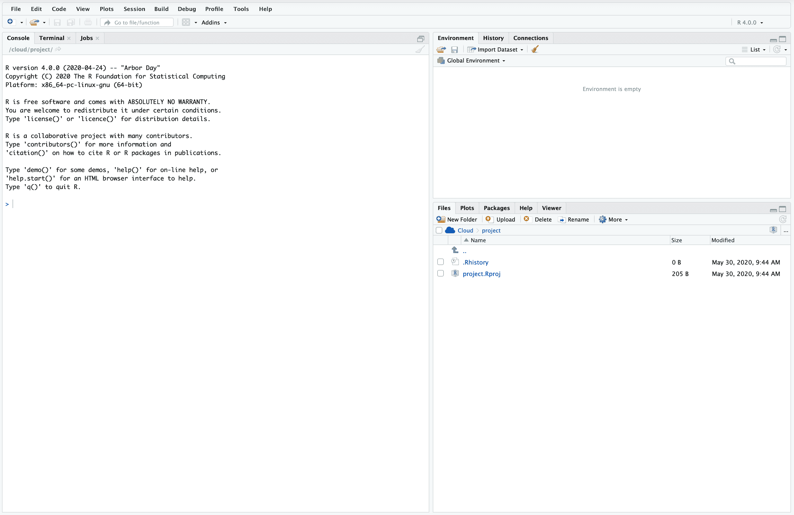
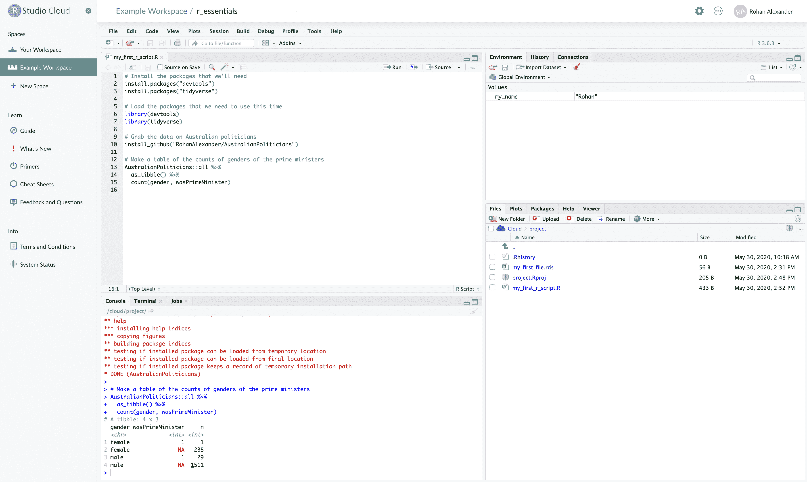
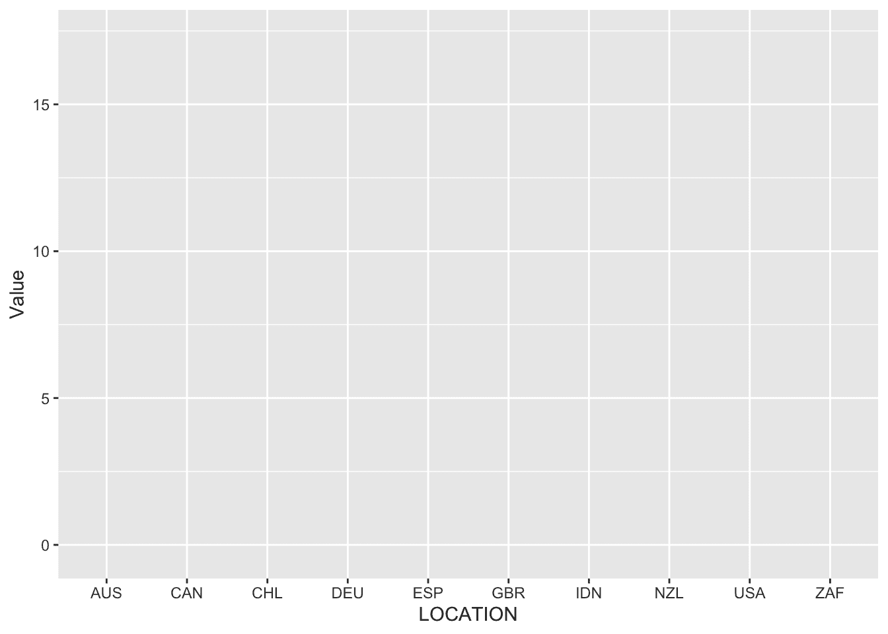
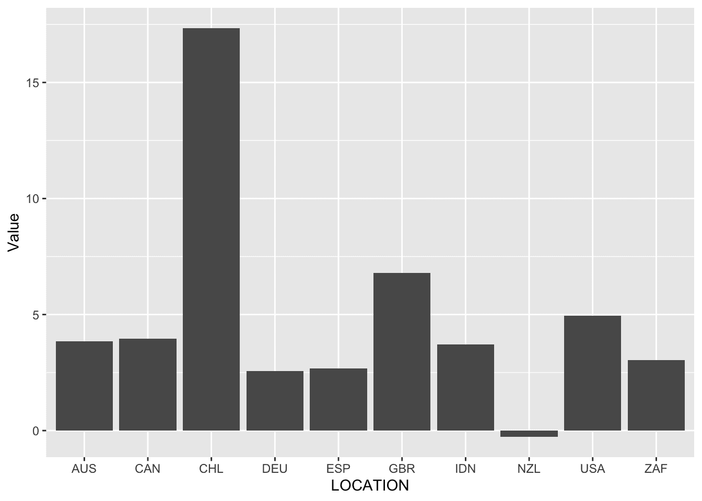
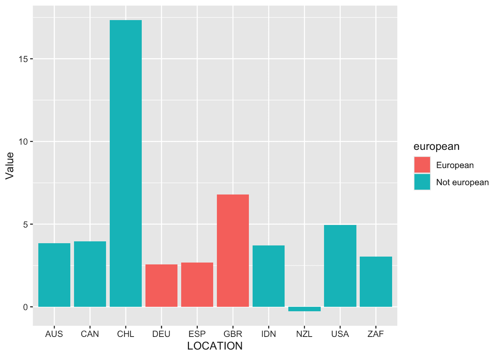
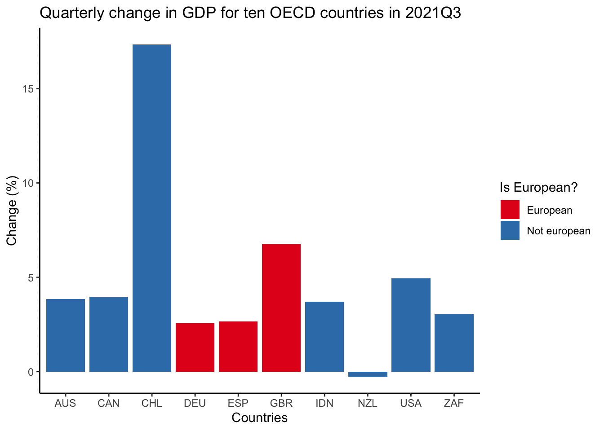
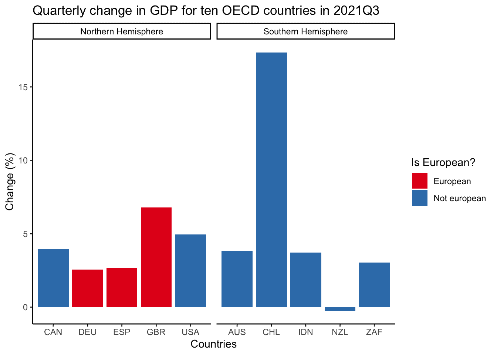
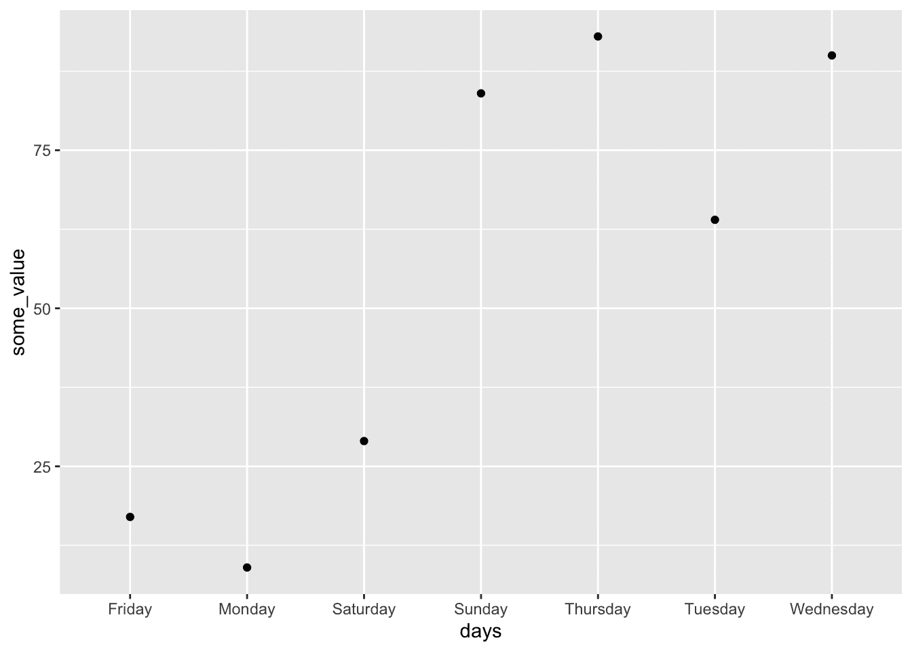
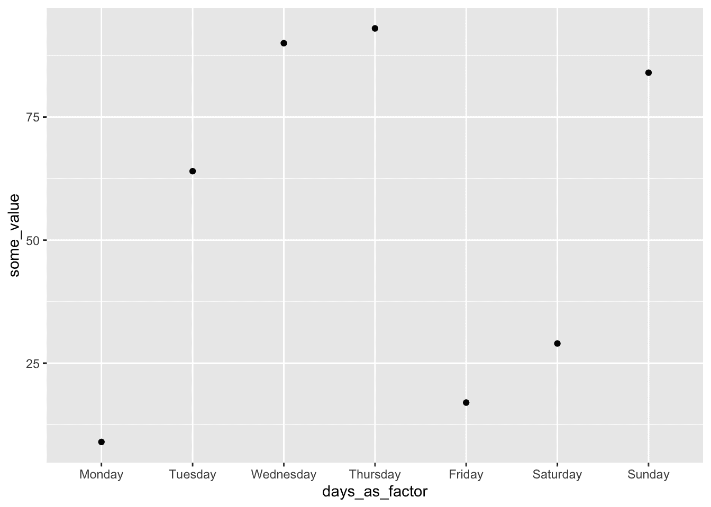

# 在线附录 A — R 基础知识

> 原文：[`tellingstorieswithdata.com/20-r_essentials.html`](https://tellingstorieswithdata.com/20-r_essentials.html)

1.  附录

1.  R 基础知识

先决条件**

+   阅读 *R for Data Science*，第四章“数据转换”，([Wickham, Çetinkaya-Rundel, and Grolemund [2016] 2023](99-references.html#ref-r4ds))

    +   介绍了使用 `dplyr` 操作数据集的概述。

+   阅读 *Data Feminism*，第六章“数字并不代表一切”，(D’Ignazio and Klein 2020)

    +   讨论了考虑数据在其生成的大背景中的必要性。

+   阅读 *R Generation* (Thieme 2018)

    +   提供了关于 `R` 的背景信息。

关键概念和技能**

+   理解 `R` 和 RStudio 的基础方面能够逐步改进工作流程。例如，能够使用关键的 `dplyr` 动词和用 `ggplot2` 绘图使得操作和理解数据集变得更加容易。

+   但是 `tidyverse` 中包含的功能非常多，包括导入数据、数据集操作、字符串操作和因子。你不必一开始就全部了解，但你应该知道你还没有全部了解。

+   除了 `tidyverse`，还重要的是要知道许多语言共有的基础方面存在，并且可以添加到数据科学工作流程中。例如，类、函数和数据模拟都扮演着重要的角色。

软件和包**

+   基础 `R`

+   核心 tidyverse (Wickham et al. 2019)

    +   `dplyr` (Wickham et al. 2022)

    +   `forcats` (Wickham 2023)

    +   `ggplot2` (Wickham 2016)

    +   `readr` (Wickham, Hester, and Bryan 2022)

    +   `stringr` (Wickham 2022)

    +   `tibble` (Müller and Wickham 2022)

    +   `tidyr` (Wickham, Vaughan, and Girlich 2023)

+   外部 `tidyverse` (Wickham et al. 2019)（这些需要单独加载，例如 `library("haven")`）

    +   `haven` (Wickham, Miller, and Smith 2023)

    +   `lubridate` (Grolemund and Wickham 2011)

+   `janitor` (Firke 2023)

## A.1 简介

在本章中，我们关注使用统计编程语言 `R` (R Core Team 2024) 来用数据讲故事所需的基础技能。其中一些内容一开始可能难以理解，但这些是我们经常会使用到的技能和方法。您应该首先快速浏览本章，注意您不理解的部分。然后，在继续阅读本书的其余部分时，不时地回到本章。这样，您将看到各种部分是如何融入上下文的。

`R` 是一种用于统计编程的开源语言。您可以从 [综合 R 存档网络](https://cran.r-project.org) (CRAN) 免费下载 `R`。RStudio 是 `R` 的集成开发环境 (IDE)，它使得语言更容易使用，并且可以从 Posit [这里](https://www.rstudio.com/products/rstudio/) 免费下载。

过去十年左右的时间里，`tidyverse` 的使用越来越广泛。这被描述为“一个有偏见的 `R` 包集合，专为数据科学设计。所有包都共享一个基本的设计理念、语法和数据结构” (Wickham 2020)。有三个区别需要明确：原始的 `R` 语言，通常称为“基础”；建立在基础之上的 `tidyverse`，它是一个连贯的包集合，以及其他包。

实际上，我们在 `tidyverse` 中能做的几乎所有事情，我们都可以在基础中做到。但是，由于 `tidyverse` 是专门为数据科学构建的，它通常更容易使用，尤其是在学习时。此外，我们可以在 `tidyverse` 中做的几乎所有事情，我们也可以用其他包来做。但是，由于 `tidyverse` 是一个连贯的包集合，它通常更容易使用，再次，尤其是在学习时。最终，在某些情况下，为了某些基础、其他包或语言的特性，权衡 `tidyverse` 的便利性和连贯性是有意义的。确实，我们在第十章 介绍 SQL 作为在处理数据时获得相当效率提升的一个来源。例如，`tidyverse` 可能会较慢，因此如果需要导入数千个 CSV 文件，那么切换到 `read_csv()` 可能是有意义的。适当使用基础和非 `tidyverse` 包，甚至其他语言，而不是盲目坚持特定的解决方案，是智力成熟的标志。

我们使用统计编程语言 `R` 的核心是数据，而我们使用的大多数数据都将以人为核心。有时，以这种方式处理以人为中心的数据可能会产生麻木效应，导致过度概括，并可能产生问题性的工作。智力成熟的另一个标志是它产生相反的效果，增加了我们对决策过程及其后果的认识。

> 在实践中，我发现，量化数据并非将你从意义的问题中隔离开来，反而迫使你面对这些问题。数字吸引你进入。使用这类数据的工作是一场永无止境的谦卑练习，不断迫使你思考你能看到什么，不能看到什么，并且始终邀请你理解这些度量真正捕捉到的是什么——它们的意义，以及对于谁而言。
> 
> Healy (2020)

## A.2 R, RStudio, and Posit Cloud

`R` 和 RStudio 是互补的，但它们不是同一件事。Müller、Schieferdecker 和 Schratz (2019) 通过类比解释了它们之间的关系，其中 `R` 类似于发动机，而 RStudio 类似于汽车——我们可以在很多不同的场合使用发动机，它们并不局限于在汽车中使用，但组合起来特别有用。

### A.2.1 R

[`R`](https://www.r-project.org/) 是一种开源且免费的编程语言，专注于通用统计学。这里的“免费”并不是指零价格，而是指创造者给予用户在很大程度上可以随意使用它的自由（尽管它也确实有一个零价格）。这与为通用目的设计的开源编程语言，如 `Python`，或专注于概率的开源编程语言，如 `Stan`，形成对比。它由 Ross Ihaka 和 Robert Gentleman 在 20 世纪 90 年代在奥克兰大学创建，其起源可以追溯到 20 世纪 70 年代在贝尔实验室开发的 `S` 语言。它由 R 核心团队维护，对“基础”代码的更改是有序的，并且会考虑到不同的优先级。

许多人在此基础上构建稳定的基础，以扩展 `R` 的功能，使其更好地、更快地满足他们的需求。他们通过创建包来实现这一点。通常情况下，尽管并非总是如此，一个包通常是一组 `R` 代码，主要是函数，这使得我们能够更容易地完成我们想要做的事情。这些包由如 CRAN 和 Bioconductor 这样的存储库管理。

如果你想使用一个包，那么你首先需要在你的电脑上安装它，然后在你想要使用它的时候加载它。莫纳什大学商业分析学教授 Dr. Di Cook 将此描述为类似于灯泡。如果你想在家里有光，首先你需要安装一个灯泡，然后你需要打开开关。安装一个包，比如 `install.packages("tidyverse")`，就像将灯泡安装到插座中——你只需要为每个灯泡做一次。但然后每次你想有光的时候，你都需要打开灯泡的开关，在 `R` 包的情况下，这意味着调用你的库，比如 `library(tidyverse)`。

站在巨人的肩膀上* *迪·库克博士是莫纳什大学的杰出统计学教授。1993 年，她在罗格斯大学获得统计学博士学位，专注于统计图形，之后被任命为爱荷华州立大学的助理教授，2005 年晋升为正教授，2015 年搬到了莫纳什大学。她研究的一个领域是数据可视化，特别是交互式和动态图形。Buja、Cook 和 Swayne (1996) 提出了一个交互式数据可视化和相关软件 XGobi 的分类法，这是 Cook 和 Swayne (2007) 的焦点。Cook 等人 (1995) 开发并探索了用于探索性数据分析的动态图形工具的使用，Buja 等人 (2009) 开发了一个评估视觉统计方法的框架，其中图表和人类认知分别代表检验统计量和统计检验。她是美国统计协会的会员。*  *要在计算机上安装包（我们将在每台计算机上只做一次）我们使用`install.packages()`。

```r
install.packages("tidyverse")
```

然后当我们想要使用包时，我们使用`library()`。

```r
library(tidyverse)
```

下载后，我们可以直接打开`R`并使用它。它主要是为了通过命令行进行交互设计的。虽然这样是可行的，但拥有一个比命令行提供更丰富的环境可能更有用。特别是，安装一个集成开发环境（IDE）可能很有用，这是一个将经常使用的各种组件组合在一起的应用程序。`R`的一个常见 IDE 是 RStudio，尽管也使用其他 IDE，如 Visual Studio。


RStudio 与`R`不同，它们是不同的实体。RStudio 建立在`R`之上，使其更容易使用。这就像人们可以从命令行使用互联网一样，但大多数人使用浏览器，如 Chrome、Firefox 或 Safari。

RStudio 是免费的，因为我们不需要为其付费。它也是免费的，意味着我们可以获取代码，修改它，并分发该代码。但 RStudio 的制作者 Posit 是一家公司，尽管它是一家 B 公司，因此当前情况可能会改变。可以从 Posit [这里](https://www.rstudio.com/products/rstudio/)下载。

当我们打开 RStudio 时，它看起来像图 A.1。



图 A.1：首次打开 RStudio

左侧面板是一个控制台，你可以在其中逐行输入和执行`R`代码。尝试使用 2+2，点击提示符“>”旁边，输入“2+2”，然后按“return/enter”键。

```r
2 + 2
```

```r
[1] 4
```
右上角的窗格包含有关环境的信息。例如，当我们创建变量时，将出现它们的名称和一些属性列表。在提示符旁边输入以下代码，将 Rohan 替换为你的名字，然后再次按回车键。

```r
my_name <- "Rohan"
```

如第二章所述，`<-`，或“赋值运算符”，将`"Rohan"`分配给一个名为“my_name”的对象。你应该注意环境面板中出现了新的变量名及其值。

右下角的窗格是文件管理器。目前它应该只有两个文件：一个 `R` 历史文件和一个 `R` 项目文件。我们将在稍后了解这些文件是什么，但现在我们将创建并保存一个文件。

运行以下代码，现在不必过于担心细节。你应该在你的文件列表中看到一个新文件“`.rds`”。

```r
saveRDS(object = my_name, file = "my_first_file.rds")
```

### A.2.3 正云

虽然你可以也应该将 RStudio 下载到自己的电脑上，但最初我们建议使用[正云](https://posit.cloud)。这是由 Posit 提供的 RStudio 的在线版本。我们将使用这个版本，这样你就可以在一个一致的环境中专注于熟悉 `R` 和 RStudio，而不用担心你有什么样的电脑或安装权限等问题。

正云的免费版本是免费的，即没有财务成本。代价是它不够强大，有时运行速度也较慢，但对于入门目的来说已经足够了。
  
## A.3 入门

我们现在将开始逐步查看一些代码。请自己积极地将这些内容全部写出来。

虽然在控制台中逐行工作是可以的，但编写一个可以运行的整个脚本会更方便。我们将通过创建一个 `R` 脚本（“文件” $\rightarrow$ “新建文件” $\rightarrow$ “R 脚本”）来实现这一点。控制台面板将位于左下角，而 `R` 脚本将打开在左上角。我们将编写一些代码来获取所有澳大利亚联邦政治家，然后构建一个关于总理性别的简短表格。其中一些代码在这个阶段可能没有意义，但只需全部输入以养成习惯，然后运行。要运行整个脚本，我们可以点击“运行”，或者我们可以突出显示某些行，然后点击“运行”来仅运行这些行。

```r
# Install the packages that we need
install.packages("tidyverse")
install.packages("AustralianPoliticians")
```

```r
# Load the packages that we need to use this time
library(tidyverse)
library(AustralianPoliticians)

# Make a table of the counts of genders of the prime ministers
get_auspol("all") |> # Imports data from GitHub
 as_tibble() |>
 filter(wasPrimeMinister == 1) |>
 count(gender)
```

```r
# A tibble: 2 × 2
  gender     n
  <chr>  <int>
1 female     1
2 male      29
```
我们可以看到，截至 2021 年底，有一位女性担任过总理（朱莉娅·吉拉德），而其他 29 位总理都是男性。

编程时一个关键的运算符是“管道”：`|>`。我们读作“然后”。这将从一行代码的输出用作下一行代码的第一个输入。这使得代码更容易阅读。作为背景，多年来`R`用户使用`%>%`作为管道，它来自`magrittr` (Bache and Wickham 2022)，也是`tidyverse`的一部分。基础`R`在 2021 年添加了我们在这本书中使用的管道`|>`，因此如果你查看旧代码，你可能会看到早期管道的使用。大部分情况下，它们是可以互换的。

管道（pipe）的概念是我们取一个数据集，然后对它进行一些操作。我们在前面的例子中使用了这种方法。以下是一个例子，我们将通过管道将数据集传递给`head()`来查看数据集的前六行。请注意，在这个例子中，`head()`没有明确地接受任何参数。它知道要显示哪些数据，因为管道隐式地告诉它。

```r
get_auspol("all") |> # Imports data from GitHub
 head()
```

```r
# A tibble: 6 × 20
  uniqueID   surname allOtherNames          firstName commonName displayName    
  <chr>      <chr>   <chr>                  <chr>     <chr>      <chr>          
1 Abbott1859 Abbott  Richard Hartley Smith  Richard   <NA>       Abbott, Richard
2 Abbott1869 Abbott  Percy Phipps           Percy     <NA>       Abbott, Percy  
3 Abbott1877 Abbott  Macartney              Macartney Mac        Abbott, Mac    
4 Abbott1886 Abbott  Charles Lydiard Aubrey Charles   Aubrey     Abbott, Aubrey 
5 Abbott1891 Abbott  Joseph Palmer          Joseph    <NA>       Abbott, Joseph 
6 Abbott1957 Abbott  Anthony John           Anthony   Tony       Abbott, Tony   
# ℹ 14 more variables: earlierOrLaterNames <chr>, title <chr>, gender <chr>,
#   birthDate <date>, birthYear <dbl>, birthPlace <chr>, deathDate <date>,
#   member <dbl>, senator <dbl>, wasPrimeMinister <dbl>, wikidataID <chr>,
#   wikipedia <chr>, adb <chr>, comments <chr>


我们可以将这个`R`脚本保存为“my_first_r_script.R”（“文件”$\rightarrow$“另存为”）。在这个时候，我们的工作空间应该看起来像图 A.2。



图 A.2：运行`R`脚本后

有一个需要注意的事项是，每个 Posit Cloud 工作空间本质上是一台新的计算机。正因为如此，我们需要为每个工作空间安装我们想要使用的任何包。例如，在我们能够使用`tidyverse`之前，我们需要使用`install.packages("tidyverse")`来安装它。这与使用自己的计算机形成对比。

关于 Posit Cloud 的一些最后说明：

1.  在澳大利亚政治家的例子中，我们使用`R`包从 GitHub 网站获取数据，但我们可以通过多种方式将数据从本地计算机导入工作空间。一种方式是使用“文件”面板中的“上传”按钮。另一种方式是使用`readr` (Wickham, Hester, and Bryan 2022)，它是`tidyverse`的一部分 (Wickham et al. 2019)。

1.  Posit Cloud 允许一定程度上的协作。例如，你可以将你创建的工作空间访问权限授予其他人，甚至你们可以同时在同一工作空间中。这可能会很有用，用于协作。

1.  Posit Cloud 存在多种弱点，尤其是 RAM 限制。此外，像任何网络应用一样，有时事情会出错或崩溃。
  


我们将要使用的关键包之一是`tidyverse` (Wickham et al. 2019)。实际上，`tidyverse`是一个包的集合，这意味着当我们安装`tidyverse`时，我们实际上安装了一整套不同的包。在`tidyverse`中，用于操作数据的核心包是`dplyr` (Wickham et al. 2022)。

有五个`dplyr`函数经常使用，我们现在将逐一介绍。这些通常被称为`dplyr`动词。

1.  `select()`

1.  `filter()`

1.  `arrange()`

1.  `mutate()`

1.  `summarise()`或等价的`summarize()`

我们还将介绍`.by`和`count()`，因为它们密切相关。

由于我们已安装了`tidyverse`，我们只需加载它。

```r
library(tidyverse)
```

我们将再次使用来自`AustralianPoliticians`包（Alexander 和 Hodgetts 2021）的关于澳大利亚政治家的数据。

```r
library(AustralianPoliticians)

australian_politicians <-
 get_auspol("all")

head(australian_politicians)
```

```r
# A tibble: 6 × 20
  uniqueID   surname allOtherNames          firstName commonName displayName    
  <chr>      <chr>   <chr>                  <chr>     <chr>      <chr>          
1 Abbott1859 Abbott  Richard Hartley Smith  Richard   <NA>       Abbott, Richard
2 Abbott1869 Abbott  Percy Phipps           Percy     <NA>       Abbott, Percy  
3 Abbott1877 Abbott  Macartney              Macartney Mac        Abbott, Mac    
4 Abbott1886 Abbott  Charles Lydiard Aubrey Charles   Aubrey     Abbott, Aubrey 
5 Abbott1891 Abbott  Joseph Palmer          Joseph    <NA>       Abbott, Joseph 
6 Abbott1957 Abbott  Anthony John           Anthony   Tony       Abbott, Tony   
# ℹ 14 more variables: earlierOrLaterNames <chr>, title <chr>, gender <chr>,
#   birthDate <date>, birthYear <dbl>, birthPlace <chr>, deathDate <date>,
#   member <dbl>, senator <dbl>, wasPrimeMinister <dbl>, wikidataID <chr>,
#   wikipedia <chr>, adb <chr>, comments <chr>
```
### A.4.1 `select()`

我们使用`select()`来选择数据集的特定列。例如，我们可能想选择“firstName”列。

```r
australian_politicians |>
 select(firstName)
```

```r
# A tibble: 1,783 × 1
   firstName
   <chr>    
 1 Richard  
 2 Percy    
 3 Macartney
 4 Charles  
 5 Joseph   
 6 Anthony  
 7 John     
 8 Eric     
 9 Judith   
10 Dick     
# ℹ 1,773 more rows
```
在 R 中，有许多做事的方式。有时这些是做同样事情的不同方式，有时是做几乎同样事情的不同方式。例如，另一种选择数据集特定列的方法是使用“提取”运算符`$`。这是来自基础，而不是来自`tidyverse`的`select()`。

```r
australian_politicians$firstName |>
 head()
```

```r
[1] "Richard"   "Percy"     "Macartney" "Charles"   "Joseph"    "Anthony" 
```
这两个看起来很相似——都选择“firstName”列，但它们返回的对象类型不同，`select()`返回一个 tibble，而`$`返回一个向量。为了完整性，如果我们结合`select()`和`pull()`，我们将得到与使用提取运算符相同的输出类型，即向量。

```r
australian_politicians |>
 select(firstName) |>
 pull() |>
 head()
```

```r
[1] "Richard"   "Percy"     "Macartney" "Charles"   "Joseph"    "Anthony" 
```
我们也可以使用`select()`来删除列，通过取列名的否定。

```r
australian_politicians |>
 select(-firstName)
```

```r
# A tibble: 1,783 × 19
   uniqueID   surname allOtherNames   commonName displayName earlierOrLaterNames
   <chr>      <chr>   <chr>           <chr>      <chr>       <chr>              
 1 Abbott1859 Abbott  Richard Hartle… <NA>       Abbott, Ri… <NA>               
 2 Abbott1869 Abbott  Percy Phipps    <NA>       Abbott, Pe… <NA>               
 3 Abbott1877 Abbott  Macartney       Mac        Abbott, Mac <NA>               
 4 Abbott1886 Abbott  Charles Lydiar… Aubrey     Abbott, Au… <NA>               
 5 Abbott1891 Abbott  Joseph Palmer   <NA>       Abbott, Jo… <NA>               
 6 Abbott1957 Abbott  Anthony John    Tony       Abbott, To… <NA>               
 7 Abel1939   Abel    John Arthur     <NA>       Abel, John  <NA>               
 8 Abetz1958  Abetz   Eric            <NA>       Abetz, Eric <NA>               
 9 Adams1943  Adams   Judith Anne     <NA>       Adams, Jud… nee Bird           
10 Adams1951  Adams   Dick Godfrey H… <NA>       Adams, Dick <NA>               
# ℹ 1,773 more rows
# ℹ 13 more variables: title <chr>, gender <chr>, birthDate <date>,
#   birthYear <dbl>, birthPlace <chr>, deathDate <date>, member <dbl>,
#   senator <dbl>, wasPrimeMinister <dbl>, wikidataID <chr>, wikipedia <chr>,
#   adb <chr>, comments <chr>
```
最后，我们可以根据条件进行`select()`。例如，我们可以选择以“birth”开头的所有列。

```r
australian_politicians |>
 select(starts_with("birth"))
```

```r
# A tibble: 1,783 × 3
   birthDate  birthYear birthPlace  
   <date>         <dbl> <chr>       
 1 NA              1859 Bendigo     
 2 1869-05-14        NA Hobart      
 3 1877-07-03        NA Murrurundi  
 4 1886-01-04        NA St Leonards 
 5 1891-10-18        NA North Sydney
 6 1957-11-04        NA London      
 7 1939-06-25        NA Sydney      
 8 1958-01-25        NA Stuttgart   
 9 1943-04-11        NA Picton      
10 1951-04-29        NA Launceston  
# ℹ 1,773 more rows
```
有许多类似的“选择辅助器”，包括`starts_with()`、`ends_with()`和`contains()`。关于这些的更多信息可以在`select()`的帮助页面中找到，可以通过运行`?select()`来访问。

在这一点上，我们将使用`select()`来减少数据集的宽度。

```r
australian_politicians <-
 australian_politicians |>
 select(
 uniqueID,
 surname,
 firstName,
 gender,
 birthDate,
 birthYear,
 deathDate,
 member,
 senator,
 wasPrimeMinister
 )

australian_politicians
```

```r
# A tibble: 1,783 × 10
   uniqueID   surname firstName gender birthDate  birthYear deathDate  member
   <chr>      <chr>   <chr>     <chr>  <date>         <dbl> <date>      <dbl>
 1 Abbott1859 Abbott  Richard   male   NA              1859 1940-02-28      0
 2 Abbott1869 Abbott  Percy     male   1869-05-14        NA 1940-09-09      1
 3 Abbott1877 Abbott  Macartney male   1877-07-03        NA 1960-12-30      0
 4 Abbott1886 Abbott  Charles   male   1886-01-04        NA 1975-04-30      1
 5 Abbott1891 Abbott  Joseph    male   1891-10-18        NA 1965-05-07      1
 6 Abbott1957 Abbott  Anthony   male   1957-11-04        NA NA              1
 7 Abel1939   Abel    John      male   1939-06-25        NA NA              1
 8 Abetz1958  Abetz   Eric      male   1958-01-25        NA NA              0
 9 Adams1943  Adams   Judith    female 1943-04-11        NA 2012-03-31      0
10 Adams1951  Adams   Dick      male   1951-04-29        NA NA              1
# ℹ 1,773 more rows
# ℹ 2 more variables: senator <dbl>, wasPrimeMinister <dbl>
```
对于初学者来说，有时会让人困惑的一件事是输出不会“保存”，除非你将其分配给一个对象。例如，这里的前几行是`australian_politicians <- australian_politicians |>`然后使用`select()`，与`australian_politicians |>`相比。这确保了`select()`带来的更改应用于对象，因此修改后的版本将在代码的任何后续点使用。
  
### A.4.2 `filter()`

我们使用`filter()`来选择数据集的特定行。例如，我们可能只对成为总理的政治家感兴趣。

```r
australian_politicians |>
 filter(wasPrimeMinister == 1)
```

```r
# A tibble: 30 × 10
   uniqueID    surname firstName gender birthDate  birthYear deathDate  member
   <chr>       <chr>   <chr>     <chr>  <date>         <dbl> <date>      <dbl>
 1 Abbott1957  Abbott  Anthony   male   1957-11-04        NA NA              1
 2 Barton1849  Barton  Edmund    male   1849-01-18        NA 1920-01-07      1
 3 Bruce1883   Bruce   Stanley   male   1883-04-15        NA 1967-08-25      1
 4 Chifley1885 Chifley Joseph    male   1885-09-22        NA 1951-06-13      1
 5 Cook1860    Cook    Joseph    male   1860-12-07        NA 1947-07-30      1
 6 Curtin1885  Curtin  John      male   1885-01-08        NA 1945-07-05      1
 7 Deakin1856  Deakin  Alfred    male   1856-08-03        NA 1919-10-07      1
 8 Fadden1894  Fadden  Arthur    male   1894-04-13        NA 1973-04-21      1
 9 Fisher1862  Fisher  Andrew    male   1862-08-29        NA 1928-10-22      1
10 Forde1890   Forde   Francis   male   1890-07-18        NA 1983-01-28      1
# ℹ 20 more rows
# ℹ 2 more variables: senator <dbl>, wasPrimeMinister <dbl>
```
我们也可以给`filter()`两个条件。例如，我们可以使用“与”运算符`&`来查看成为总理且名为 Joseph 的政治家。

```r
australian_politicians |>
 filter(wasPrimeMinister == 1 & firstName == "Joseph")
```

```r
# A tibble: 3 × 10
  uniqueID    surname firstName gender birthDate  birthYear deathDate  member
  <chr>       <chr>   <chr>     <chr>  <date>         <dbl> <date>      <dbl>
1 Chifley1885 Chifley Joseph    male   1885-09-22        NA 1951-06-13      1
2 Cook1860    Cook    Joseph    male   1860-12-07        NA 1947-07-30      1
3 Lyons1879   Lyons   Joseph    male   1879-09-15        NA 1939-04-07      1
# ℹ 2 more variables: senator <dbl>, wasPrimeMinister <dbl>
```
如果我们用逗号代替和号，我们会得到相同的结果。

```r
australian_politicians |>
 filter(wasPrimeMinister == 1, firstName == "Joseph")
```

```r
# A tibble: 3 × 10
  uniqueID    surname firstName gender birthDate  birthYear deathDate  member
  <chr>       <chr>   <chr>     <chr>  <date>         <dbl> <date>      <dbl>
1 Chifley1885 Chifley Joseph    male   1885-09-22        NA 1951-06-13      1
2 Cook1860    Cook    Joseph    male   1860-12-07        NA 1947-07-30      1
3 Lyons1879   Lyons   Joseph    male   1879-09-15        NA 1939-04-07      1
# ℹ 2 more variables: senator <dbl>, wasPrimeMinister <dbl>
```
同样，我们可以使用“或”运算符`|`来查找名为 Myles 或 Ruth 的政治家。

```r
australian_politicians |>
 filter(firstName == "Myles" | firstName == "Ruth")
```

```r
# A tibble: 3 × 10
  uniqueID     surname  firstName gender birthDate  birthYear deathDate  member
  <chr>        <chr>    <chr>     <chr>  <date>         <dbl> <date>      <dbl>
1 Coleman1931  Coleman  Ruth      female 1931-09-27        NA 2008-03-27      0
2 Ferricks1875 Ferricks Myles     male   1875-11-12        NA 1932-08-20      0
3 Webber1965   Webber   Ruth      female 1965-03-24        NA NA              0
# ℹ 2 more variables: senator <dbl>, wasPrimeMinister <dbl>
```
我们也可以将结果传递。例如，我们可以从 `filter()` 传递到 `select()`。

```r
australian_politicians |>
 filter(firstName == "Ruth" | firstName == "Myles") |>
 select(firstName, surname)
```

```r
# A tibble: 3 × 2
  firstName surname 
  <chr>     <chr>   
1 Ruth      Coleman 
2 Myles     Ferricks
3 Ruth      Webber 
```
如果我们知道感兴趣的特定行号，我们可以使用 `filter()` 只筛选那一行。例如，假设第 853 行是感兴趣的。

```r
australian_politicians |>
 filter(row_number() == 853)
```

```r
# A tibble: 1 × 10
  uniqueID     surname  firstName gender birthDate  birthYear deathDate member
  <chr>        <chr>    <chr>     <chr>  <date>         <dbl> <date>     <dbl>
1 Jakobsen1947 Jakobsen Carolyn   female 1947-09-11        NA NA             1
# ℹ 2 more variables: senator <dbl>, wasPrimeMinister <dbl>
```
为此还有一个专门的功能，即 `slice()`。

```r
australian_politicians |>
 slice(853)
```

```r
# A tibble: 1 × 10
  uniqueID     surname  firstName gender birthDate  birthYear deathDate member
  <chr>        <chr>    <chr>     <chr>  <date>         <dbl> <date>     <dbl>
1 Jakobsen1947 Jakobsen Carolyn   female 1947-09-11        NA NA             1
# ℹ 2 more variables: senator <dbl>, wasPrimeMinister <dbl>
```
虽然这看起来可能有些神秘，但如果我们要使用否定来删除特定行或重复特定行，它就特别有用。例如，我们可以删除第一行。

```r
australian_politicians |>
 slice(-1)
```

```r
# A tibble: 1,782 × 10
   uniqueID    surname firstName gender birthDate  birthYear deathDate  member
   <chr>       <chr>   <chr>     <chr>  <date>         <dbl> <date>      <dbl>
 1 Abbott1869  Abbott  Percy     male   1869-05-14        NA 1940-09-09      1
 2 Abbott1877  Abbott  Macartney male   1877-07-03        NA 1960-12-30      0
 3 Abbott1886  Abbott  Charles   male   1886-01-04        NA 1975-04-30      1
 4 Abbott1891  Abbott  Joseph    male   1891-10-18        NA 1965-05-07      1
 5 Abbott1957  Abbott  Anthony   male   1957-11-04        NA NA              1
 6 Abel1939    Abel    John      male   1939-06-25        NA NA              1
 7 Abetz1958   Abetz   Eric      male   1958-01-25        NA NA              0
 8 Adams1943   Adams   Judith    female 1943-04-11        NA 2012-03-31      0
 9 Adams1951   Adams   Dick      male   1951-04-29        NA NA              1
10 Adamson1857 Adamson John      male   1857-02-18        NA 1922-05-02      0
# ℹ 1,772 more rows
# ℹ 2 more variables: senator <dbl>, wasPrimeMinister <dbl>
```
我们也可以只保留前三行，例如。

```r
australian_politicians |>
 slice(1:3)
```

```r
# A tibble: 3 × 10
  uniqueID   surname firstName gender birthDate  birthYear deathDate  member
  <chr>      <chr>   <chr>     <chr>  <date>         <dbl> <date>      <dbl>
1 Abbott1859 Abbott  Richard   male   NA              1859 1940-02-28      0
2 Abbott1869 Abbott  Percy     male   1869-05-14        NA 1940-09-09      1
3 Abbott1877 Abbott  Macartney male   1877-07-03        NA 1960-12-30      0
# ℹ 2 more variables: senator <dbl>, wasPrimeMinister <dbl>
```
最后，我们可以复制前两行，这利用了 `n()` 提供的当前组大小。

```r
australian_politicians |>
 slice(1:2, 1:n())
```

```r
# A tibble: 1,785 × 10
   uniqueID   surname firstName gender birthDate  birthYear deathDate  member
   <chr>      <chr>   <chr>     <chr>  <date>         <dbl> <date>      <dbl>
 1 Abbott1859 Abbott  Richard   male   NA              1859 1940-02-28      0
 2 Abbott1869 Abbott  Percy     male   1869-05-14        NA 1940-09-09      1
 3 Abbott1859 Abbott  Richard   male   NA              1859 1940-02-28      0
 4 Abbott1869 Abbott  Percy     male   1869-05-14        NA 1940-09-09      1
 5 Abbott1877 Abbott  Macartney male   1877-07-03        NA 1960-12-30      0
 6 Abbott1886 Abbott  Charles   male   1886-01-04        NA 1975-04-30      1
 7 Abbott1891 Abbott  Joseph    male   1891-10-18        NA 1965-05-07      1
 8 Abbott1957 Abbott  Anthony   male   1957-11-04        NA NA              1
 9 Abel1939   Abel    John      male   1939-06-25        NA NA              1
10 Abetz1958  Abetz   Eric      male   1958-01-25        NA NA              0
# ℹ 1,775 more rows
# ℹ 2 more variables: senator <dbl>, wasPrimeMinister <dbl>
```
  
### A.4.3 `arrange()`

我们使用 `arrange()` 来根据特定列的值更改数据集的顺序。例如，我们可以根据政治家的生日对政治家进行排序。

```r
australian_politicians |>
 arrange(birthYear)
```

```r
# A tibble: 1,783 × 10
   uniqueID    surname firstName gender birthDate birthYear deathDate  member
   <chr>       <chr>   <chr>     <chr>  <date>        <dbl> <date>      <dbl>
 1 Edwards1842 Edwards Richard   male   NA             1842 1915-10-29      1
 2 Sawers1844  Sawers  William   male   NA             1844 1916-05-19      1
 3 Barker1846  Barker  Stephen   male   NA             1846 1924-06-21      0
 4 Corser1852  Corser  Edward    male   NA             1852 1928-07-31      1
 5 Lee1856     Lee     Henry     male   NA             1856 1927-08-12      1
 6 Grant1857   Grant   John      male   NA             1857 1928-05-19      0
 7 Abbott1859  Abbott  Richard   male   NA             1859 1940-02-28      0
 8 Palmer1859  Palmer  Albert    male   NA             1859 1919-08-14      1
 9 Riley1859   Riley   Edward    male   NA             1859 1943-07-21      1
10 Kennedy1860 Kennedy Thomas    male   NA             1860 1929-02-16      1
# ℹ 1,773 more rows
# ℹ 2 more variables: senator <dbl>, wasPrimeMinister <dbl>
```
我们可以使用 `desc()` 修改 `arrange()`，以从升序变为降序。

```r
australian_politicians |>
 arrange(desc(birthYear))
```

```r
# A tibble: 1,783 × 10
   uniqueID      surname firstName gender birthDate  birthYear deathDate  member
   <chr>         <chr>   <chr>     <chr>  <date>         <dbl> <date>      <dbl>
 1 McBain1982    McBain  Kristy    female 1982-09-29      1982 NA              1
 2 Cox1977       Cox     Dorinda   female NA              1977 NA              0
 3 Thorpe1973    Thorpe  Lidia     female 1973-08-18      1973 NA              0
 4 McLachlan1966 McLach… Andrew    male   1966-01-14      1966 NA              0
 5 Wortley1959   Wortley Dana      female NA              1959 NA              0
 6 Baker1903     Baker   Francis   male   NA              1903 1939-03-28      1
 7 Clay1900      Clay    Lionel    male   NA              1900 1965-04-16      1
 8 Breen1898     Breen   John      male   NA              1898 1966-02-05      1
 9 Clasby1891    Clasby  John      male   NA              1891 1932-01-15      1
10 Gander1888    Gander  Joseph    male   NA              1888 1954-11-22      1
# ℹ 1,773 more rows
# ℹ 2 more variables: senator <dbl>, wasPrimeMinister <dbl>
```
这也可以通过减号实现。

```r
australian_politicians |>
 arrange(-birthYear)
```

```r
# A tibble: 1,783 × 10
   uniqueID      surname firstName gender birthDate  birthYear deathDate  member
   <chr>         <chr>   <chr>     <chr>  <date>         <dbl> <date>      <dbl>
 1 McBain1982    McBain  Kristy    female 1982-09-29      1982 NA              1
 2 Cox1977       Cox     Dorinda   female NA              1977 NA              0
 3 Thorpe1973    Thorpe  Lidia     female 1973-08-18      1973 NA              0
 4 McLachlan1966 McLach… Andrew    male   1966-01-14      1966 NA              0
 5 Wortley1959   Wortley Dana      female NA              1959 NA              0
 6 Baker1903     Baker   Francis   male   NA              1903 1939-03-28      1
 7 Clay1900      Clay    Lionel    male   NA              1900 1965-04-16      1
 8 Breen1898     Breen   John      male   NA              1898 1966-02-05      1
 9 Clasby1891    Clasby  John      male   NA              1891 1932-01-15      1
10 Gander1888    Gander  Joseph    male   NA              1888 1954-11-22      1
# ℹ 1,773 more rows
# ℹ 2 more variables: senator <dbl>, wasPrimeMinister <dbl>
```
我们还可以根据多个列进行排序。例如，如果两个政治家有相同的名字，我们还可以根据他们的生日进行排序。

```r
australian_politicians |>
 arrange(firstName, birthYear)
```

```r
# A tibble: 1,783 × 10
   uniqueID      surname firstName gender birthDate  birthYear deathDate  member
   <chr>         <chr>   <chr>     <chr>  <date>         <dbl> <date>      <dbl>
 1 Blain1894     Blain   Adair     male   1894-11-21        NA 1983-04-28      1
 2 Armstrong1909 Armstr… Adam      male   1909-07-01        NA 1982-02-22      1
 3 Bandt1972     Bandt   Adam      male   1972-03-11        NA NA              1
 4 Dein1889      Dein    Adam      male   1889-03-04        NA 1969-05-09      1
 5 Ridgeway1962  Ridgew… Aden      male   1962-09-18        NA NA              0
 6 Bennett1933   Bennett Adrian    male   1933-01-21        NA 2006-05-09      1
 7 Gibson1935    Gibson  Adrian    male   1935-11-03        NA 2015-04-30      1
 8 Wynne1850     Wynne   Agar      male   1850-01-15        NA 1934-05-12      1
 9 Robertson1882 Robert… Agnes     female 1882-07-31        NA 1968-01-29      0
10 Bird1906      Bird    Alan      male   1906-09-28        NA 1962-07-21      1
# ℹ 1,773 more rows
# ℹ 2 more variables: senator <dbl>, wasPrimeMinister <dbl>
```
我们也可以通过在两个 `arrange()` 实例之间传递来实现相同的结果。

```r
australian_politicians |>
 arrange(birthYear) |>
 arrange(firstName)
```

```r
# A tibble: 1,783 × 10
   uniqueID      surname firstName gender birthDate  birthYear deathDate  member
   <chr>         <chr>   <chr>     <chr>  <date>         <dbl> <date>      <dbl>
 1 Blain1894     Blain   Adair     male   1894-11-21        NA 1983-04-28      1
 2 Armstrong1909 Armstr… Adam      male   1909-07-01        NA 1982-02-22      1
 3 Bandt1972     Bandt   Adam      male   1972-03-11        NA NA              1
 4 Dein1889      Dein    Adam      male   1889-03-04        NA 1969-05-09      1
 5 Ridgeway1962  Ridgew… Aden      male   1962-09-18        NA NA              0
 6 Bennett1933   Bennett Adrian    male   1933-01-21        NA 2006-05-09      1
 7 Gibson1935    Gibson  Adrian    male   1935-11-03        NA 2015-04-30      1
 8 Wynne1850     Wynne   Agar      male   1850-01-15        NA 1934-05-12      1
 9 Robertson1882 Robert… Agnes     female 1882-07-31        NA 1968-01-29      0
10 Bird1906      Bird    Alan      male   1906-09-28        NA 1962-07-21      1
# ℹ 1,773 more rows
# ℹ 2 more variables: senator <dbl>, wasPrimeMinister <dbl>
```
当我们使用 `arrange()` 时，我们应该清楚优先级。例如，先改为生日然后是名字将给出不同的排序。

```r
australian_politicians |>
 arrange(birthYear, firstName)
```

```r
# A tibble: 1,783 × 10
   uniqueID    surname firstName gender birthDate birthYear deathDate  member
   <chr>       <chr>   <chr>     <chr>  <date>        <dbl> <date>      <dbl>
 1 Edwards1842 Edwards Richard   male   NA             1842 1915-10-29      1
 2 Sawers1844  Sawers  William   male   NA             1844 1916-05-19      1
 3 Barker1846  Barker  Stephen   male   NA             1846 1924-06-21      0
 4 Corser1852  Corser  Edward    male   NA             1852 1928-07-31      1
 5 Lee1856     Lee     Henry     male   NA             1856 1927-08-12      1
 6 Grant1857   Grant   John      male   NA             1857 1928-05-19      0
 7 Palmer1859  Palmer  Albert    male   NA             1859 1919-08-14      1
 8 Riley1859   Riley   Edward    male   NA             1859 1943-07-21      1
 9 Abbott1859  Abbott  Richard   male   NA             1859 1940-02-28      0
10 Kennedy1860 Kennedy Thomas    male   NA             1860 1929-02-16      1
# ℹ 1,773 more rows
# ℹ 2 more variables: senator <dbl>, wasPrimeMinister <dbl>
```
通过多种列进行排序的一个好方法是使用 `across()`。它使我们能够使用与 `select()` 相关提到的“选择辅助工具”例如 `starts_with()`。

```r
australian_politicians |>
 arrange(across(c(firstName, birthYear)))
```

```r
# A tibble: 1,783 × 10
   uniqueID      surname firstName gender birthDate  birthYear deathDate  member
   <chr>         <chr>   <chr>     <chr>  <date>         <dbl> <date>      <dbl>
 1 Blain1894     Blain   Adair     male   1894-11-21        NA 1983-04-28      1
 2 Armstrong1909 Armstr… Adam      male   1909-07-01        NA 1982-02-22      1
 3 Bandt1972     Bandt   Adam      male   1972-03-11        NA NA              1
 4 Dein1889      Dein    Adam      male   1889-03-04        NA 1969-05-09      1
 5 Ridgeway1962  Ridgew… Aden      male   1962-09-18        NA NA              0
 6 Bennett1933   Bennett Adrian    male   1933-01-21        NA 2006-05-09      1
 7 Gibson1935    Gibson  Adrian    male   1935-11-03        NA 2015-04-30      1
 8 Wynne1850     Wynne   Agar      male   1850-01-15        NA 1934-05-12      1
 9 Robertson1882 Robert… Agnes     female 1882-07-31        NA 1968-01-29      0
10 Bird1906      Bird    Alan      male   1906-09-28        NA 1962-07-21      1
# ℹ 1,773 more rows
# ℹ 2 more variables: senator <dbl>, wasPrimeMinister <dbl>
```

```r
australian_politicians |>
 arrange(across(starts_with("birth")))
```

```r
# A tibble: 1,783 × 10
   uniqueID     surname  firstName gender birthDate  birthYear deathDate  member
   <chr>        <chr>    <chr>     <chr>  <date>         <dbl> <date>      <dbl>
 1 Braddon1829  Braddon  Edward    male   1829-06-11        NA 1904-02-02      1
 2 Ferguson1830 Ferguson John      male   1830-03-15        NA 1906-03-30      0
 3 Zeal1830     Zeal     William   male   1830-12-05        NA 1912-03-11      0
 4 Fraser1832   Fraser   Simon     male   1832-08-21        NA 1919-07-30      0
 5 Groom1833    Groom    William   male   1833-03-09        NA 1901-08-08      1
 6 Sargood1834  Sargood  Frederick male   1834-05-30        NA 1903-01-02      0
 7 Fysh1835     Fysh     Philip    male   1835-03-01        NA 1919-12-20      1
 8 Playford1837 Playford Thomas    male   1837-11-26        NA 1915-04-19      0
 9 Solomon1839  Solomon  Elias     male   1839-09-02        NA 1909-05-23      1
10 McLean1840   McLean   Allan     male   1840-02-03        NA 1911-07-13      1
# ℹ 1,773 more rows
# ℹ 2 more variables: senator <dbl>, wasPrimeMinister <dbl>
```
  
### A.4.4 `mutate()`

我们使用 `mutate()` 来创建新列。例如，也许我们想要创建一个新列，如果一个人既是成员又是参议员则为 1，否则为 0。也就是说，我们的新列将表示在上下两院都服务的政治家。

```r
australian_politicians <-
 australian_politicians |>
 mutate(was_both = if_else(member == 1 & senator == 1, 1, 0))

australian_politicians |>
 select(member, senator, was_both)
```

```r
# A tibble: 1,783 × 3
   member senator was_both
    <dbl>   <dbl>    <dbl>
 1      0       1        0
 2      1       1        1
 3      0       1        0
 4      1       0        0
 5      1       0        0
 6      1       0        0
 7      1       0        0
 8      0       1        0
 9      0       1        0
10      1       0        0
# ℹ 1,773 more rows
```
我们可以使用 `mutate()` 结合数学运算，如加法和减法。例如，我们可以计算出政治家在 2022 年（或本应）的年龄。

```r
library(lubridate)

australian_politicians <-
 australian_politicians |>
 mutate(age = 2022 - year(birthDate))

australian_politicians |>
 select(uniqueID, age)
```

```r
# A tibble: 1,783 × 2
   uniqueID     age
   <chr>      <dbl>
 1 Abbott1859    NA
 2 Abbott1869   153
 3 Abbott1877   145
 4 Abbott1886   136
 5 Abbott1891   131
 6 Abbott1957    65
 7 Abel1939      83
 8 Abetz1958     64
 9 Adams1943     79
10 Adams1951     71
# ℹ 1,773 more rows
```
在构建新列时，有许多特别有用的函数。这些包括计算自然对数的 `log()`，将值上移一行 `lead()`，将值下移一行 `lag()`，以及创建列的累积和 `cumsum()`。

```r
australian_politicians |>
 select(uniqueID, age) |>
 mutate(log_age = log(age))
```

```r
# A tibble: 1,783 × 3
   uniqueID     age log_age
   <chr>      <dbl>   <dbl>
 1 Abbott1859    NA   NA   
 2 Abbott1869   153    5.03
 3 Abbott1877   145    4.98
 4 Abbott1886   136    4.91
 5 Abbott1891   131    4.88
 6 Abbott1957    65    4.17
 7 Abel1939      83    4.42
 8 Abetz1958     64    4.16
 9 Adams1943     79    4.37
10 Adams1951     71    4.26
# ℹ 1,773 more rows
```

```r
australian_politicians |>
 select(uniqueID, age) |>
 mutate(lead_age = lead(age))
```

```r
# A tibble: 1,783 × 3
   uniqueID     age lead_age
   <chr>      <dbl>    <dbl>
 1 Abbott1859    NA      153
 2 Abbott1869   153      145
 3 Abbott1877   145      136
 4 Abbott1886   136      131
 5 Abbott1891   131       65
 6 Abbott1957    65       83
 7 Abel1939      83       64
 8 Abetz1958     64       79
 9 Adams1943     79       71
10 Adams1951     71      165
# ℹ 1,773 more rows
```

```r
australian_politicians |>
 select(uniqueID, age) |>
 mutate(lag_age = lag(age))
```

```r
# A tibble: 1,783 × 3
   uniqueID     age lag_age
   <chr>      <dbl>   <dbl>
 1 Abbott1859    NA      NA
 2 Abbott1869   153      NA
 3 Abbott1877   145     153
 4 Abbott1886   136     145
 5 Abbott1891   131     136
 6 Abbott1957    65     131
 7 Abel1939      83      65
 8 Abetz1958     64      83
 9 Adams1943     79      64
10 Adams1951     71      79
# ℹ 1,773 more rows
```

```r
australian_politicians |>
 select(uniqueID, age) |>
 drop_na(age) |>
 mutate(cumulative_age = cumsum(age))
```

```r
# A tibble: 1,718 × 3
   uniqueID      age cumulative_age
   <chr>       <dbl>          <dbl>
 1 Abbott1869    153            153
 2 Abbott1877    145            298
 3 Abbott1886    136            434
 4 Abbott1891    131            565
 5 Abbott1957     65            630
 6 Abel1939       83            713
 7 Abetz1958      64            777
 8 Adams1943      79            856
 9 Adams1951      71            927
10 Adamson1857   165           1092
# ℹ 1,708 more rows
```
  
正如我们在前面的例子中所做的那样，我们也可以将 `mutate()` 与 `across()` 结合使用。这包括潜在的选择辅助工具的使用。例如，我们可以同时计算名字的首字母和最后一个字母的字符数。

```r
australian_politicians |>
 mutate(across(c(firstName, surname), str_count)) |>
 select(uniqueID, firstName, surname)
```

```r
# A tibble: 1,783 × 3
   uniqueID   firstName surname
   <chr>          <int>   <int>
 1 Abbott1859         7       6
 2 Abbott1869         5       6
 3 Abbott1877         9       6
 4 Abbott1886         7       6
 5 Abbott1891         6       6
 6 Abbott1957         7       6
 7 Abel1939           4       4
 8 Abetz1958          4       5
 9 Adams1943          6       5
10 Adams1951          4       5
# ℹ 1,773 more rows
```
最后，当我们需要基于两个以上的条件语句创建新列时，我们使用 `case_when()`（与第一个 `mutate()` 示例中的 `if_else()` 相比）。例如，我们可能有一些年份，并希望将它们分组到十年中。

```r
library(lubridate)

australian_politicians |>
 mutate(
 year_of_birth = year(birthDate),
 decade_of_birth =
 case_when(
 year_of_birth <= 1929 ~ "pre-1930",
 year_of_birth <= 1939 ~ "1930s",
 year_of_birth <= 1949 ~ "1940s",
 year_of_birth <= 1959 ~ "1950s",
 year_of_birth <= 1969 ~ "1960s",
 year_of_birth <= 1979 ~ "1970s",
 year_of_birth <= 1989 ~ "1980s",
 year_of_birth <= 1999 ~ "1990s",
 TRUE ~ "Unknown or error"
 )
 ) |>
 select(uniqueID, year_of_birth, decade_of_birth)
```

```r
# A tibble: 1,783 × 3
   uniqueID   year_of_birth decade_of_birth 
   <chr>              <dbl> <chr>           
 1 Abbott1859            NA Unknown or error
 2 Abbott1869          1869 pre-1930        
 3 Abbott1877          1877 pre-1930        
 4 Abbott1886          1886 pre-1930        
 5 Abbott1891          1891 pre-1930        
 6 Abbott1957          1957 1950s           
 7 Abel1939            1939 1930s           
 8 Abetz1958           1958 1950s           
 9 Adams1943           1943 1940s           
10 Adams1951           1951 1950s           
# ℹ 1,773 more rows
```
我们可以通过一系列嵌套的 `if_else()` 语句来完成这项工作，但 `case_when()` 更清晰。情况按顺序评估，一旦有匹配项，`case_when()` 就不会继续评估剩余的情况。在代码可能到达那里的情况下，有一个通用的捕获项可能是有用的，它会指示我们可能希望了解的潜在问题。
  
### A.4.5 `summarise()`

我们使用 `summarise()` 当我们想要创建新的、简化的汇总变量。例如，我们可能想知道某些列的最小值、平均值和最大值。

```r
australian_politicians |>
 summarise(
 youngest = min(age, na.rm = TRUE),
 oldest = max(age, na.rm = TRUE),
 average = mean(age, na.rm = TRUE)
 )
```

```r
# A tibble: 1 × 3
  youngest oldest average
     <dbl>  <dbl>   <dbl>
1       28    193    101.
```
顺便说一下，`summarise()` 和 `summarize()` 是等效的，我们可以使用任一。在这本书中，我们使用 `summarise()`。

```r
australian_politicians |>
 summarize(
 youngest = min(age, na.rm = TRUE),
 oldest = max(age, na.rm = TRUE),
 average = mean(age, na.rm = TRUE)
 )
```

```r
# A tibble: 1 × 3
  youngest oldest average
     <dbl>  <dbl>   <dbl>
1       28    193    101.
```
默认情况下，`summarise()` 将为整个数据集提供一行输出。例如，在早期示例中，我们找到了所有政治家的最年轻、最年长和平均年龄。然而，我们可以在数据集中使用 `.by` 函数创建更多分组。我们可以在分组的基础上使用许多函数，但 `summarise()` 函数与 `.by` 结合特别强大。例如，我们可以按性别分组，然后获取基于年龄的汇总统计。

```r
australian_politicians |>
 summarise(
 youngest = min(age, na.rm = TRUE),
 oldest = max(age, na.rm = TRUE),
 average = mean(age, na.rm = TRUE),
 .by = gender
 )
```

```r
# A tibble: 2 × 4
  gender youngest oldest average
  <chr>     <dbl>  <dbl>   <dbl>
1 male         28    193   106\. 
2 female       32    140    66.0
```
同样，我们可以查看按性别划分的最年轻、最年长和平均死亡年龄。

```r
australian_politicians |>
 mutate(days_lived = deathDate - birthDate) |>
 drop_na(days_lived) |>
 summarise(
 min_days = min(days_lived),
 mean_days = mean(days_lived) |> round(),
 max_days = max(days_lived),
 .by = gender
 )
```

```r
# A tibble: 2 × 4
  gender min_days   mean_days  max_days  
  <chr>  <drtn>     <drtn>     <drtn>    
1 male   12380 days 27376 days 36416 days
2 female 14856 days 28857 days 35560 days
```
因此，我们了解到女性议员平均寿命略长于男性议员。

我们可以在多个分组的基础上使用 `.by`。例如，我们可以查看按性别和他们在众议院或参议院中的天数来计算平均生活天数。

```r
australian_politicians |>
 mutate(days_lived = deathDate - birthDate) |>
 drop_na(days_lived) |>
 summarise(
 min_days = min(days_lived),
 mean_days = mean(days_lived) |> round(),
 max_days = max(days_lived),
 .by = c(gender, member)
 )
```

```r
# A tibble: 4 × 5
  gender member min_days   mean_days  max_days  
  <chr>   <dbl> <drtn>     <drtn>     <drtn>    
1 male        1 12380 days 27496 days 36328 days
2 male        0 13619 days 27133 days 36416 days
3 female      0 21746 days 29517 days 35560 days
4 female      1 14856 days 27538 days 33442 days
```
我们可以使用 `count()` 来按组创建计数。例如，按性别划分的政治家数量。

```r
australian_politicians |>
 count(gender)
```

```r
# A tibble: 2 × 2
  gender     n
  <chr>  <int>
1 female   240
2 male    1543
```
除了 `count()`，我们还可以计算比例。

```r
australian_politicians |>
 count(gender) |>
 mutate(proportion = n / (sum(n)))
```

```r
# A tibble: 2 × 3
  gender     n proportion
  <chr>  <int>      <dbl>
1 female   240      0.135
2 male    1543      0.865
```
使用 `count()` 实质上与在 `summarise()` 中使用 `.by` 和 `n()` 相同，并且我们以这种方式获得相同的结果。

```r
australian_politicians |>
 summarise(n = n(),
 .by = gender)
```

```r
# A tibble: 2 × 2
  gender     n
  <chr>  <int>
1 male    1543
2 female   240
```
还有一个类似的有帮助的函数，其作用类似于 `mutate()`，称为 `add_count()`。区别在于数字将添加到新列中。

```r
australian_politicians |>
 add_count(gender) |>
 select(uniqueID, gender, n)
```

```r
# A tibble: 1,783 × 3
   uniqueID   gender     n
   <chr>      <chr>  <int>
 1 Abbott1859 male    1543
 2 Abbott1869 male    1543
 3 Abbott1877 male    1543
 4 Abbott1886 male    1543
 5 Abbott1891 male    1543
 6 Abbott1957 male    1543
 7 Abel1939   male    1543
 8 Abetz1958  male    1543
 9 Adams1943  female   240
10 Adams1951  male    1543
# ℹ 1,773 more rows
```
  
## A.5 Base R

虽然 `tidyverse` 是相对较近才建立起来以帮助数据科学，但 `R` 在此之前就已经存在了。`R` 中内置了许多功能，特别是围绕编程和统计学家核心需求的功能。

尤其是以下内容：

1.  `class()`。

1.  数据模拟。

1.  `function()`，`for()` 和 `apply()`。

没有必要安装或加载任何额外的包，因为这个功能是随 `R` 一起提供的。

### A.5.1 `class()`

在日常使用中，“a, b, c, …”是字母，“1, 2, 3,…”是数字。我们使用字母和数字的方式不同；例如，我们不会对字母进行加法或减法操作。同样，`R`需要有一种方式来区分不同类别的内容，并定义每个类别具有的属性，“它的行为方式以及它与其他类型对象的关联” (Wickham 2019)。

类别有一个层次结构。例如，我们是“人类”，而“人类”本身是“动物”。所有“人类”都是“动物”，但并非所有“动物”都是“人类”。同样，所有整数都是数字，但并非所有数字都是整数。我们可以使用 `class()` 在`R`中找出对象的类别。

```r
a_number <- 8
class(a_number)
```

```r
[1] "numeric"
```

```r
a_letter <- "a"
class(a_letter)
```

```r
[1] "character"
```
我们在这里讨论的类别是“数值”，“字符”，“因子”，“日期”和“数据框”。

首先要知道的是，就像青蛙可以变成王子一样，我们有时可以在 R 中改变一个对象的类别。这被称为“类型转换”。例如，我们可以从一个“数值”开始，使用 `as.character()` 将其转换为“字符”，然后使用 `as.factor()` 转换为“因子”。但如果我们尝试使用 `as.Date()` 将其转换为“日期”，我们会得到一个错误，因为并非所有数字都具有成为日期所需的属性。

```r
a_number <- 8
a_number
```

```r
[1] 8
```

```r
class(a_number)
```

```r
[1] "numeric"
```

```r
a_number <- as.character(a_number)
a_number
```

```r
[1] "8"
```

```r
class(a_number)
```

```r
[1] "character"
```

```r
a_number <- as.factor(a_number)
a_number
```

```r
[1] 8
Levels: 8
```

```r
class(a_number)
```

```r
[1] "factor"
```
  
与“数值”和“字符”类别相比，“因子”类别可能不太熟悉。因子用于只能取特定值的分类数据（Wickham 2019）。例如，典型使用“因子”变量的情况是二元变量，如“白天”或“夜晚”。它也常用于年龄组，如“18-29”，“30-44”，“45-60”，“60+”（与年龄相对，年龄通常是一个“数值”）；有时也用于教育水平：“低于高中”，“高中”，“大学”，“本科学位”，“研究生学位”。我们可以使用 `levels()` 查找“因子”的允许级别。

```r
age_groups <- factor(
 c("18-29", "30-44", "45-60", "60+")
)
age_groups
```

```r
[1] 18-29 30-44 45-60 60+  
Levels: 18-29 30-44 45-60 60+
```

```r
class(age_groups)
```

```r
[1] "factor"
```

```r
levels(age_groups)
```

```r
[1] "18-29" "30-44" "45-60" "60+" 
```
  
日期是一个特别棘手的类别，很快就会变得复杂。尽管如此，在基础层面上，我们可以使用 `as.Date()` 将看起来像“日期”的字符转换为实际的“日期”。这使得我们能够执行加法和减法操作，而如果我们使用的是“字符”，则无法做到这一点。

```r
looks_like_a_date_but_is_not <- "2022-01-01"
looks_like_a_date_but_is_not
```

```r
[1] "2022-01-01"
```

```r
class(looks_like_a_date_but_is_not)
```

```r
[1] "character"
```

```r
is_a_date <- as.Date(looks_like_a_date_but_is_not)
is_a_date
```

```r
[1] "2022-01-01"
```

```r
class(is_a_date)
```

```r
[1] "Date"
```

```r
is_a_date + 3
```

```r
[1] "2022-01-04"
```
  
我们在这里讨论的最后一个类别是“数据框”。它看起来像电子表格，通常用于存储我们将要分析的数据。正式来说，“数据框是一个长度相等的向量列表” (Wickham 2019)。它将具有列名和行名，我们可以使用 `colnames()` 和 `rownames()` 来查看，尽管通常行名只是数字。

为了说明这一点，我们使用了来自 `AER` 的“ResumeNames”数据集（Kleiber 和 Zeileis 2008）。这个包可以像安装 CRAN 上的任何其他包一样安装。这个数据集包含了关于简历内容的横截面数据，特别是简历上使用的名字，以及关于 4,870 份虚构简历是否收到回电的相关信息。数据集由 Bertrand 和 Mullainathan (2004) 创建，他们向波士顿和芝加哥的招聘广告发送了虚构的简历，这些广告在简历是否被分配了“非常非洲裔美国人听起来名字”或“非常白人听起来名字”上有所不同。他们发现存在相当大的歧视，其中“白人名字在面试回电中比其他名字多 50%”。Hangartner、Kopp 和 Siegenthaler (2021) 使用在线瑞士平台进行了推广，发现移民和少数民族群体在招聘者那里得到的联系较少，当职业由男性主导时，女性也是如此，反之亦然。

```r
install.packages("AER")
```

```r
library(AER)
data("ResumeNames", package = "AER")
```

```r
ResumeNames |>
 head()
```

```r
 name gender ethnicity quality call    city jobs experience honors
1 Allison female      cauc     low   no chicago    2          6     no
2 Kristen female      cauc    high   no chicago    3          6     no
3 Lakisha female      afam     low   no chicago    1          6     no
4 Latonya female      afam    high   no chicago    4          6     no
5  Carrie female      cauc    high   no chicago    3         22     no
6     Jay   male      cauc     low   no chicago    2          6    yes
  volunteer military holes school email computer special college minimum equal
1        no       no   yes     no    no      yes      no     yes       5   yes
2       yes      yes    no    yes   yes      yes      no      no       5   yes
3        no       no    no    yes    no      yes      no     yes       5   yes
4       yes       no   yes     no   yes      yes     yes      no       5   yes
5        no       no    no    yes   yes      yes      no      no    some   yes
6        no       no    no     no    no       no     yes     yes    none   yes
      wanted requirements reqexp reqcomm reqeduc reqcomp reqorg
1 supervisor          yes    yes      no      no     yes     no
2 supervisor          yes    yes      no      no     yes     no
3 supervisor          yes    yes      no      no     yes     no
4 supervisor          yes    yes      no      no     yes     no
5  secretary          yes    yes      no      no     yes    yes
6      other           no     no      no      no      no     no
                          industry
1                    manufacturing
2                    manufacturing
3                    manufacturing
4                    manufacturing
5 health/education/social services
6                            trade
```

```r
class(ResumeNames)
```

```r
[1] "data.frame"
```

```r
colnames(ResumeNames)
```

```r
 [1] "name"         "gender"       "ethnicity"    "quality"      "call"        
 [6] "city"         "jobs"         "experience"   "honors"       "volunteer"   
[11] "military"     "holes"        "school"       "email"        "computer"    
[16] "special"      "college"      "minimum"      "equal"        "wanted"      
[21] "requirements" "reqexp"       "reqcomm"      "reqeduc"      "reqcomp"     
[26] "reqorg"       "industry" 
```
  
我们可以通过指定列名来检查构成数据框的向量的类别，即列。

```r
class(ResumeNames$name)
```

```r
[1] "factor"
```

```r
class(ResumeNames$jobs)
```

```r
[1] "integer"
```
有时能够一次性更改许多列的类别是有帮助的。我们可以通过使用 `mutate()` 和 `across()` 来实现这一点。

```r
class(ResumeNames$name)
```

```r
[1] "factor"
```

```r
class(ResumeNames$gender)
```

```r
[1] "factor"
```

```r
class(ResumeNames$ethnicity)
```

```r
[1] "factor"
```

```r
ResumeNames <- ResumeNames |>
 mutate(across(c(name, gender, ethnicity), as.character)) |>
 head()

class(ResumeNames$name)
```

```r
[1] "character"
```

```r
class(ResumeNames$gender)
```

```r
[1] "character"
```

```r
class(ResumeNames$ethnicity)
```

```r
[1] "character"
```
  
代码无法运行有许多原因，但类的问题总是需要首先检查的事项之一。常见的问题是我们认为应该是“字符”或“数值”的变量实际上却是“因子”。还有我们认为应该是“数值”的变量实际上却是“字符”。

最后，值得注意的是，向量的类别就是其内容的类别。在 Python 和其他语言中，与向量类似的数据结构是“列表”。“列表”是一个独立的类别，而“列表”中的对象有自己的类别（例如，`["a", 1]` 是一个“列表”类别的对象，其条目为“字符串”和“整数”类别）。如果你从其他语言转到 `R`，可能会觉得向量不是它自己的类别，这可能会让你感到反直觉。
  
### A.5.2 模拟数据

模拟数据是讲述可信故事的关键技能。为了模拟数据，我们需要能够从统计分布和其他集合中随机抽取。`R` 提供了各种函数来简化这一过程，包括：正态分布，`rnorm()`；均匀分布，`runif()`；泊松分布，`rpois()`；二项分布，`rbinom()`；以及其他许多分布。要从项目集合中随机抽样，我们可以使用 `sample()`。

在处理随机性时，可重复性的需求使得随机性可重复变得重要，这在某种程度上是一种悖论。也就是说，另一个人需要能够抽取我们抽取的随机数。我们通过使用 `set.seed()` 为我们的随机抽取设置一个种子来实现这一点。

我们可以从标准正态分布中获取观察值，并将这些值放入数据框中。

```r
set.seed(853)

number_of_observations <- 5

simulated_data <-
 data.frame(
 person = c(1:number_of_observations),
 std_normal_observations = rnorm(
 n = number_of_observations,
 mean = 0,
 sd = 1
 )
 )

simulated_data
```

```r
 person std_normal_observations
1      1             -0.35980342
2      2             -0.04064753
3      3             -1.78216227
4      4             -1.12242282
5      5             -1.00278400
```
然后我们可以添加来自均匀分布、泊松分布和二项分布的抽取，使用 `cbind()` 将原始数据集和新数据集的列合并在一起。

```r
simulated_data <-
 simulated_data |>
 cbind() |>
 data.frame(
 uniform_observations =
 runif(n = number_of_observations, min = 0, max = 10),
 poisson_observations =
 rpois(n = number_of_observations, lambda = 100),
 binomial_observations =
 rbinom(n = number_of_observations, size = 2, prob = 0.5)
 )

simulated_data
```

```r
 person std_normal_observations uniform_observations poisson_observations
1      1             -0.35980342            9.6219155                   81
2      2             -0.04064753            7.2269016                   91
3      3             -1.78216227            0.8252921                   84
4      4             -1.12242282            1.0379810                  100
5      5             -1.00278400            3.0942004                   97
  binomial_observations
1                     2
2                     1
3                     1
4                     1
5                     1
```
最后，我们将使用 `sample()` 为每个观察值添加一个喜欢的颜色。

```r
simulated_data <-
 data.frame(
 favorite_color = sample(
 x = c("blue", "white"),
 size = number_of_observations,
 replace = TRUE
 )
 ) |>
 cbind(simulated_data)

simulated_data
```

```r
 favorite_color person std_normal_observations uniform_observations
1           blue      1             -0.35980342            9.6219155
2           blue      2             -0.04064753            7.2269016
3           blue      3             -1.78216227            0.8252921
4          white      4             -1.12242282            1.0379810
5           blue      5             -1.00278400            3.0942004
  poisson_observations binomial_observations
1                   81                     2
2                   91                     1
3                   84                     1
4                  100                     1
5                   97                     1
```
我们将“replace”选项设置为“TRUE”，因为我们只在这两个选项之间进行选择，但每次选择时我们都希望有选择任何一个的可能性。根据模拟的不同，我们可能需要考虑“replace”是否应该是“TRUE”或“FALSE”。在 `sample()` 函数中，另一个有用的可选参数是调整每个项目被抽取的概率。默认情况下，所有选项的可能性是相等的，但如果我们想指定特定的概率，可以使用“prob”。像往常一样，我们可以在帮助文件中找到更多信息，例如 `?sample`。
  
### A.5.3 `function()`、`for()` 和 `apply()`

`R` “是一种函数式编程语言” (Wickham 2019)。这意味着我们在基础层面编写、使用和组合函数，这些函数是执行特定任务的代码集合。

`R` 中有很多其他人为我们编写的函数，我们可以使用。几乎任何我们可能需要完成的常见统计或数据科学任务，很可能已经有其他人编写了函数并为我们提供，无论是作为基础 `R` 安装的一部分还是作为包的一部分。但有时我们仍需要编写自己的函数，特别是对于更具体的任务。我们使用 `function()` 定义一个函数，然后为其分配一个名称。我们可能需要为函数包含一些输入和输出。输入指定在圆括号之间。函数要完成的特定任务放在花括号之间。

```r
print_names <- function(some_names) {
 print(some_names)
}

print_names(c("rohan", "monica"))
```

```r
[1] "rohan"  "monica"
```
我们可以为输入指定默认值，以防使用函数的人没有提供它们。

```r
print_names <- function(some_names = c("edward", "hugo")) {
 print(some_names)
}

print_names()
```

```r
[1] "edward" "hugo" 
```
一个常见的场景是我们想要多次应用一个函数。像许多编程语言一样，我们可以使用 `for()` 循环来实现这一点。在 `R` 中，`for()` 循环的外观与 `function()` 类似，即我们在圆括号中定义迭代的内容，在花括号中定义要应用的函数。

因为 `R` 是一种专注于统计学的编程语言，所以我们通常对数组或矩阵感兴趣。我们使用 `apply()` 函数将一个函数应用于行（“MARGIN = 1”）或列（“MARGIN = 2”）。

```r
simulated_data
```

```r
 favorite_color person std_normal_observations uniform_observations
1           blue      1             -0.35980342            9.6219155
2           blue      2             -0.04064753            7.2269016
3           blue      3             -1.78216227            0.8252921
4          white      4             -1.12242282            1.0379810
5           blue      5             -1.00278400            3.0942004
  poisson_observations binomial_observations
1                   81                     2
2                   91                     1
3                   84                     1
4                  100                     1
5                   97                     1
```

```r
apply(X = simulated_data, MARGIN = 2, FUN = unique)
```

```r
$favorite_color
[1] "blue"  "white"

$person
[1] "1" "2" "3" "4" "5"

$std_normal_observations
[1] "-0.35980342" "-0.04064753" "-1.78216227" "-1.12242282" "-1.00278400"

$uniform_observations
[1] "9.6219155" "7.2269016" "0.8252921" "1.0379810" "3.0942004"

$poisson_observations
[1] " 81" " 91" " 84" "100" " 97"

$binomial_observations
[1] "2" "1"
```
  
## A.6 使用 `ggplot2` 绘制图表

如果在 `tidyverse` 中，用于数据操作的键包是 `dplyr` (Wickham et al. 2022)，那么在 `tidyverse` 中，用于创建图形的键包是 `ggplot2` (Wickham 2016)。我们将在第五章中详细介绍图形，但在这里我们快速浏览一些基本内容。`ggplot2` 通过定义层来工作，这些层基于“图形语法”（因此，称为“gg”），而不是使用管道操作符（`|>`），`ggplot2` 使用添加操作符 `+`。作为 `tidyverse` 包集合的一部分，如果已经加载了 `tidyverse`，则不需要显式安装或加载 `ggplot2`。

要使用 `ggplot2` 构建图形，需要指定三个关键方面：

1.  数据；

1.  美学/映射; 和

1.  类型。

要开始，我们将获取来自经济合作与发展组织（OECD）国家的一些 GDP 数据(OECD 2022)。

```r
library(tidyverse)

oecd_gdp <-
 read_csv("https://stats.oecd.org/sdmx-json/data/DP_LIVE/.QGDP.../OECD?contentType=csv&detail=code&separator=comma&csv-lang=en")

write_csv(oecd_gdp, "inputs/data/oecd_gdp.csv")
```

```r
# A tibble: 6 × 8
  LOCATION INDICATOR SUBJECT MEASURE  FREQUENCY TIME  Value `Flag Codes`
  <chr>    <chr>     <chr>   <chr>    <chr>     <chr> <dbl> <chr>       
1 OECD     QGDP      TOT     PC_CHGPP A         1962   5.70 <NA>        
2 OECD     QGDP      TOT     PC_CHGPP A         1963   5.20 <NA>        
3 OECD     QGDP      TOT     PC_CHGPP A         1964   6.38 <NA>        
4 OECD     QGDP      TOT     PC_CHGPP A         1965   5.35 <NA>        
5 OECD     QGDP      TOT     PC_CHGPP A         1966   5.75 <NA>        
6 OECD     QGDP      TOT     PC_CHGPP A         1967   3.96 <NA> 
```

我们首先感兴趣的是制作 2021 年第三季度十个国家（澳大利亚、加拿大、智利、印度尼西亚、德国、大不列颠、新西兰、南非、西班牙和美国）的 GDP 变化条形图。

```r
oecd_gdp_2021_q3 <-
 oecd_gdp |>
 filter(
 TIME == "2021-Q3",
 SUBJECT == "TOT",
 LOCATION %in% c(
 "AUS",
 "CAN",
 "CHL",
 "DEU",
 "GBR",
 "IDN",
 "ESP",
 "NZL",
 "USA",
 "ZAF"
 ),
 MEASURE == "PC_CHGPY"
 ) |>
 mutate(
 european = if_else(
 LOCATION %in% c("DEU", "GBR", "ESP"),
 "European",
 "Not european"
 ),
 hemisphere = if_else(
 LOCATION %in% c("CAN", "DEU", "GBR", "ESP", "USA"),
 "Northern Hemisphere",
 "Southern Hemisphere"
 ),
 )
```

我们从 `ggplot()` 开始并指定映射/美学，在这种情况下意味着指定 x 轴和 y 轴。`ggplot()` 的第一个参数是我们想要可视化的数据，因此我们可以在这个阶段像往常一样使用管道操作符。

```r
oecd_gdp_2021_q3 |>
 ggplot(mapping = aes(x = LOCATION, y = Value))
```

*  *现在我们需要指定我们感兴趣的图形类型。在这种情况下，我们想要一个条形图，我们可以通过添加 `geom_bar()` 使用 `+` 来实现。

```r
oecd_gdp_2021_q3 |>
 ggplot(mapping = aes(x = LOCATION, y = Value)) +
 geom_bar(stat = "identity")
```

*  *我们可以通过添加另一个美学属性，“填充”，来根据国家是否为欧洲国家来着色条形图。

```r
oecd_gdp_2021_q3 |>
 ggplot(mapping = aes(x = LOCATION, y = Value, fill = european)) +
 geom_bar(stat = "identity")
```

*  *最后，我们可以通过添加标签、`labs()`；更改颜色、`scale_fill_brewer()`；以及背景、`theme_classic()` 来使其看起来更美观。

```r
oecd_gdp_2021_q3 |>
 ggplot(mapping = aes(x = LOCATION, y = Value, fill = european)) +
 geom_bar(stat = "identity") +
 labs(
 title = "Quarterly change in GDP for ten OECD countries in 2021Q3",
 x = "Countries",
 y = "Change (%)",
 fill = "Is European?"
 ) +
 theme_classic() +
 scale_fill_brewer(palette = "Set1")
```

*  *面元使我们能够创建关注数据特定方面的子图。它们非常有价值，因为它们允许我们在不制作 3D 图形的情况下向图形添加另一个变量。我们使用 `facet_wrap()` 添加面元并指定我们想要面元的变量。在这种情况下，我们按半球面元。

```r
oecd_gdp_2021_q3 |>
 ggplot(mapping = aes(x = LOCATION, y = Value, fill = european)) +
 geom_bar(stat = "identity") +
 labs(
 title = "Quarterly change in GDP for ten OECD countries in 2021Q3",
 x = "Countries",
 y = "Change (%)",
 fill = "Is European?"
 ) +
 theme_classic() +
 scale_fill_brewer(palette = "Set1") +
 facet_wrap(
 ~hemisphere,
 scales = "free_x"
 )
```


  
## A.7 探索 `tidyverse`

我们已经关注了 `tidyverse` 的两个方面：`dplyr` 和 `ggplot2`。然而，`tidyverse` 包含了各种不同的包和函数。现在我们将探讨四个常见的方面：

+   导入数据和使用`tibble()`;

+   数据集的连接和转置；

+   字符串操作和 `stringr`；

+   因子变量和 `forcats`。

然而，首要任务是处理命名法，特别是要具体说明“tidyverse”中的“tidy”是什么意思。这个名字指的是整洁数据，其好处在于尽管数据混乱的方式有很多种，但整洁数据满足三个规则。这意味着数据集的结构在具体细节上是一致的，使得应用期望特定类型输入的函数变得更加容易。整洁数据指的是数据集，其中([Wickham, Çetinkaya-Rundel, 和 Grolemund [2016] 2023](99-references.html#ref-r4ds); Wickham 2014, 4)：

+   每个变量都在自己的列中。

+   每个观测值都在自己的行中。

+   每个值都在自己的单元格中。

表 A.1 不是整洁的，因为年龄和头发共享一个列。表 A.2 是其整洁的对应版本。

表 A.1：不整洁数据的示例

| 人物 | 变量 | 值 |
| --- | --- | --- |
| Rohan | 年龄 | 35 |
| Rohan | 头发 | 黑色 |
| Monica | 年龄 | 35 |
| Monica | 头发 | 金发 |
| Edward | 年龄 | 3 |
| Edward | 头发 | 棕色 |
| Hugo | 年龄 | 1 |
| Hugo | 头发 | 金发 |

表 A.2：整洁数据的示例

| 人物 | 年龄 | 头发 |
| --- | --- | --- |
| Rohan | 35 | 黑色 |
| Monica | 35 | 金发 |
| Edward | 3 | 棕色 |
| Hugo | 1 | 金发 |

### A.7.1 导入数据和`tibble()`

将数据导入`R`以便使用有多种方法。对于 CSV 文件，有来自`readr`的`read_csv()`函数(Wickham, Hester, 和 Bryan 2022)，而对于 Stata 文件，有来自`haven`的`read_dta()`函数(Wickham, Miller, 和 Smith 2023)。

CSV 是一种常见的格式，具有许多优点，包括它们通常不会修改数据。每列由逗号分隔，每行是一个记录。我们可以向`read_csv()`提供一个 URL 或本地文件来读取。可以向`read_csv()`传递各种不同的选项，包括指定数据集是否有列名、列的类型以及要跳过的行数。如果我们没有指定列的类型，那么`read_csv()`将通过查看数据集来猜测。

我们使用`read_dta()`来读取.dta 文件，这些文件通常由统计程序 Stata 生成。这意味着它们在社会学、政治学和经济学等领域很常见。这种格式将数据与其标签分开，因此我们通常使用`labelled`包中的`to_factor()`函数将它们重新组合(Larmarange 2023)。`haven`是`tidyverse`的一部分，但默认情况下不会自动加载，与`ggplot2`等包不同，因此我们需要运行`library(haven)`。

通常，数据集以“data.frame”的形式进入 `R`。虽然这很有用，但数据集的另一个有用的类是`tibble`。这些可以使用 `tibble` 包中的 `tibble()` 函数创建，`tibble` 是 `tidyverse` 的一部分。tibble 是一个数据框，通过一些特定的更改使其更容易处理，包括默认不将字符串转换为因子，显示列的类，以及打印得很好。

如果需要，我们可以手动创建一个 tibble，例如，当我们模拟数据时。但通常我们直接将数据导入为 tibble，例如，当我们使用 `read_csv()` 时。

```r
people_as_dataframe <-
 data.frame(
 names = c("rohan", "monica"),
 website = c("rohanalexander.com", "monicaalexander.com"),
 fav_color = c("blue", "white")
 )
class(people_as_dataframe)
```

```r
[1] "data.frame"
```

```r
people_as_dataframe
```

```r
 names             website fav_color
1  rohan  rohanalexander.com      blue
2 monica monicaalexander.com     white
```

```r
people_as_tibble <-
 tibble(
 names = c("rohan", "monica"),
 website = c("rohanalexander.com", "monicaalexander.com"),
 fav_color = c("blue", "white")
 )
people_as_tibble
```

```r
# A tibble: 2 × 3
  names  website             fav_color
  <chr>  <chr>               <chr>    
1 rohan  rohanalexander.com  blue     
2 monica monicaalexander.com white 
```

```r
class(people_as_tibble)
```

```r
[1] "tbl_df"     "tbl"        "data.frame"
```
  
### A.7.2 使用连接和旋转进行数据集操作

常见的数据集操作有两个：连接和旋转。

我们经常遇到有两个或更多数据集的情况，并且我们对将它们结合起来感兴趣。我们可以以各种方式将数据集连接起来。一种常见的方式是使用 `dplyr` 中的 `left_join()` (Wickham 等人 2022)。这最有用的情况是我们使用一个主要数据集，并且还有一个包含一些我们想要添加的有用变量的数据集。关键方面是我们有一个或多个列可以用来连接两个数据集。在这里，我们将创建两个 tibble，然后基于名称将它们连接起来。

```r
main_dataset <-
 tibble(
 names = c("rohan", "monica", "edward", "hugo"),
 status = c("adult", "adult", "child", "infant")
 )
main_dataset
```

```r
# A tibble: 4 × 2
  names  status
  <chr>  <chr> 
1 rohan  adult 
2 monica adult 
3 edward child 
4 hugo   infant
```

```r
supplementary_dataset <-
 tibble(
 names = c("rohan", "monica", "edward", "hugo"),
 favorite_food = c("pasta", "salmon", "pizza", "milk")
 )
supplementary_dataset
```

```r
# A tibble: 4 × 2
  names  favorite_food
  <chr>  <chr>        
1 rohan  pasta        
2 monica salmon       
3 edward pizza        
4 hugo   milk 
```

```r
main_dataset <-
 main_dataset |>
 left_join(supplementary_dataset, by = "names")

main_dataset
```

```r
# A tibble: 4 × 3
  names  status favorite_food
  <chr>  <chr>  <chr>        
1 rohan  adult  pasta        
2 monica adult  salmon       
3 edward child  pizza        
4 hugo   infant milk 
```
  
有多种其他选项可以用于连接数据集，包括 `inner_join()`、`right_join()` 和 `full_join()`。

另一个常见的数据集操作任务是旋转它们。数据集通常是长格式或宽格式。长数据意味着每个变量都在一行上，因此可能存在重复，而宽数据中每个变量都是一列，因此通常重复很少（Wickham 2009）。例如，“anscombe”是宽格式，而“anscombe_long”是长格式。

```r
anscombe
```

```r
 x1 x2 x3 x4    y1   y2    y3    y4
1  10 10 10  8  8.04 9.14  7.46  6.58
2   8  8  8  8  6.95 8.14  6.77  5.76
3  13 13 13  8  7.58 8.74 12.74  7.71
4   9  9  9  8  8.81 8.77  7.11  8.84
5  11 11 11  8  8.33 9.26  7.81  8.47
6  14 14 14  8  9.96 8.10  8.84  7.04
7   6  6  6  8  7.24 6.13  6.08  5.25
8   4  4  4 19  4.26 3.10  5.39 12.50
9  12 12 12  8 10.84 9.13  8.15  5.56
10  7  7  7  8  4.82 7.26  6.42  7.91
11  5  5  5  8  5.68 4.74  5.73  6.89


```r
anscombe_long
```

```r
# A tibble: 44 × 3
   set       x     y
   <chr> <dbl> <dbl>
 1 1        10  8.04
 2 2        10  9.14
 3 3        10  7.46
 4 4         8  6.58
 5 1         8  6.95
 6 2         8  8.14
 7 3         8  6.77
 8 4         8  5.76
 9 1        13  7.58
10 2        13  8.74
# ℹ 34 more rows
```
在 `tidyverse` 中，尤其是对于 `ggplot2`，我们需要长数据。要从一种格式转换为另一种格式，我们使用 `tidyr` 中的 `pivot_longer()` 和 `pivot_wider()` (Wickham、Vaughan 和 Girlich 2023)。

我们将创建一些关于“mark”或“lauren”在三年中每年是否赢得跑步比赛的长宽数据。

```r
pivot_example_data <-
 tibble(
 year = c(2019, 2020, 2021),
 mark = c("first", "second", "first"),
 lauren = c("second", "first", "second")
 )

pivot_example_data
```

```r
# A tibble: 3 × 3
   year mark   lauren
  <dbl> <chr>  <chr> 
1  2019 first  second
2  2020 second first 
3  2021 first  second
```
这个数据集目前是宽格式。要将它转换为长格式，我们需要一个指定人员的列，以及一个指定结果的列。我们使用 `pivot_longer()` 来实现这一点。

```r
data_pivoted_longer <-
 pivot_example_data |>
 pivot_longer(
 cols = c("mark", "lauren"),
 names_to = "person",
 values_to = "position"
 )

head(data_pivoted_longer)
```

```r
# A tibble: 6 × 3
   year person position
  <dbl> <chr>  <chr>   
1  2019 mark   first   
2  2019 lauren second  
3  2020 mark   second  
4  2020 lauren first   
5  2021 mark   first   
6  2021 lauren second 
```
有时，我们需要从长数据转换为宽数据。我们使用 `pivot_wider()` 来完成这个操作。

```r
data_pivoted_wider <-
 data_pivoted_longer |>
 pivot_wider(
 names_from = "person",
 values_from = "position"
 )

head(data_pivoted_wider)
```

```r
# A tibble: 3 × 3
   year mark   lauren
  <dbl> <chr>  <chr> 
1  2019 first  second
2  2020 second first 
3  2021 first  second
```
  
### A.7.3 字符串操作和 `stringr`

在 `R` 中，我们通常使用双引号创建字符串，尽管使用单引号也可以。例如 `c("a", "b")` 包含两个字符串 "a" 和 "b"，它们包含在一个字符向量中。在 `R` 中操作字符串有多种方法，我们重点关注 `stringr` ([Wickham 2022](https://wiki.example.org/99-references.html#ref-citestringr))。当我们加载 `tidyverse` 时，它会自动加载。

如果我们想查找字符串是否包含某些内容，则可以使用 `str_detect()`。如果我们想删除或更改某些特定内容，则可以使用 `str_remove()` 或 `str_replace()`。

```r
dataset_of_strings <-
 tibble(
 names = c(
 "rohan alexander",
 "monica alexander",
 "edward alexander",
 "hugo alexander"
 )
 )

dataset_of_strings |>
 mutate(
 is_rohan = str_detect(names, "rohan"),
 make_howlett = str_replace(names, "alexander", "howlett"),
 remove_rohan = str_remove(names, "rohan")
 )
```

```r
# A tibble: 4 × 4
  names            is_rohan make_howlett   remove_rohan      
  <chr>            <lgl>    <chr>          <chr>             
1 rohan alexander  TRUE     rohan howlett  " alexander"      
2 monica alexander FALSE    monica howlett "monica alexander"
3 edward alexander FALSE    edward howlett "edward alexander"
4 hugo alexander   FALSE    hugo howlett   "hugo alexander" 
```
还有许多其他函数在数据清洗中特别有用。例如，我们可以使用 `str_length()` 来找出字符串的长度，以及 `str_c()` 来合并字符串。

```r
dataset_of_strings |>
 mutate(
 length_is = str_length(string = names),
 name_and_length = str_c(names, length_is, sep = " - ")
 )
```

```r
# A tibble: 4 × 3
  names            length_is name_and_length      
  <chr>                <int> <chr>                
1 rohan alexander         15 rohan alexander - 15 
2 monica alexander        16 monica alexander - 16
3 edward alexander        16 edward alexander - 16
4 hugo alexander          14 hugo alexander - 14 
```
最后，`tidyr` 中的 `separate()`，尽管不是 `stringr` 的一部分，但在字符串操作中是必不可少的。它可以将一个字符列转换为多个列。

```r
dataset_of_strings |>
 separate(
 col = names,
 into = c("first", "last"),
 sep = " ",
 remove = FALSE
 )
```

```r
# A tibble: 4 × 3
  names            first  last     
  <chr>            <chr>  <chr>    
1 rohan alexander  rohan  alexander
2 monica alexander monica alexander
3 edward alexander edward alexander
4 hugo alexander   hugo   alexander
```
  
### A.7.4 因子变量和 `forcats`

因子是一组字符串，代表类别。有时会有固有的顺序。例如，一周中的日子有顺序——星期一、星期二、星期三……——这不是按字母顺序排列的。但并不要求一定是这样，例如怀孕状态：怀孕或未怀孕。因子在基础 R 中占有一席之地。它们可能很有用，因为它们确保只允许适当的字符串。例如，如果 "days_of_the_week" 是一个因子变量，那么 "January" 就不被允许。但它们可能会增加很多复杂性，因此在 `tidyverse` 中的角色不太突出。尽管如此，在某些情况下利用因子是有用的。例如，当绘制一周的日子时，我们可能希望它们按照常规顺序排列，而不是如果它们作为字符变量时按字母顺序排列的顺序。虽然因子是基础 R 内置的，但一个在处理因子时特别有用的 `tidyverse` 包是 `forcats` ([Wickham 2023](https://wiki.example.org/99-references.html#ref-citeforcats))。

有时我们有一个字符向量，我们可能希望它以特定的方式排序。默认情况下，字符向量是按字母顺序排序的，但我们可能不希望这样。例如，如果一周的日子按字母顺序排序，那么在图表上看起来会很奇怪：星期五、星期一、星期六、星期日、星期四、星期二和星期三！

改变排序方式的方法是将变量从字符类型转换为因子类型。我们可以使用 `forcats` 中的 `fct_relevel()` 来指定排序顺序。[Wickham 2023](https://wiki.example.org/99-references.html#ref-citeforcats))。

```r
set.seed(853)

days_data <-
 tibble(
 days =
 c(
 "Monday",
 "Tuesday",
 "Wednesday",
 "Thursday",
 "Friday",
 "Saturday",
 "Sunday"
 ),
 some_value = c(sample.int(100, 7))
 )

days_data <-
 days_data |>
 mutate(
 days_as_factor = factor(days),
 days_as_factor = fct_relevel(
 days,
 "Monday",
 "Tuesday",
 "Wednesday",
 "Thursday",
 "Friday",
 "Saturday",
 "Sunday"
 )
 )
```

我们可以通过首先用原始字符向量作为 x 轴绘制图表，然后绘制另一个以因子向量作为 x 轴的图表来比较结果。

```r
days_data |>
 ggplot(aes(x = days, y = some_value)) +
 geom_point()

days_data |>
 ggplot(aes(x = days_as_factor, y = some_value)) +
 geom_point()
```




  
## A.8 练习

### 练习

1.  *(计划)* 考虑以下场景：*一个人对国王或王后谁活得更久感兴趣，并且为每位君主收集了他们寿命的数据。* 请绘制这个数据集可能的样子，然后绘制一个图表来展示所有观察结果。

1.  *(模拟)* 请进一步考虑上述场景，假设有 1,000 位君主，并决定以下哪些可以用来模拟这种情况（选择所有适用的）？

    1.  `runif(n = 1000, min = 1, max = 110) |> floor()`

    1.  `rpois(n = 1000, lambda = 65)`

    1.  `rnorm(n = 1000) |> floor()`

    1.  `sample(x = sunspot.month, size = 1000, replace = TRUE) |> floor()`

1.  *(获取)* 请确定一个关于君主寿命的实际数据来源的可能来源。

1.  *(探索)* 假设`tidyverse`已加载，数据集“monarchs”有“years”列。以下哪个选项只会显示寿命超过 35 年的君主（选择一个）？

    1.  `monarchs |> arrange(years > 35)`

    1.  `monarchs |> select(years > 35)`

    1.  `monarchs |> filter(years > 35)`

    1.  `monarchs |> mutate(years > 35)`

1.  *(沟通)* 请写出两个段落，就像你已经从该来源收集了数据并构建了一个图表。段落中包含的详细内容不必是事实性的（即，你实际上不必获取数据或创建图表）。

### 测验

1.  `R`是什么（选择一个）？

    1.  一个开源统计编程语言

    1.  由 Guido van Rossum 创建的编程语言

    1.  一个闭源统计编程语言

    1.  一个集成开发环境（IDE）

1.  R 的三个优点是什么？三个缺点是什么？

1.  RStudio 是什么？

    1.  一个集成开发环境（IDE）。

    1.  一个闭源付费程序。

    1.  由 Guido van Rossum 创建的编程语言

    1.  一个统计编程语言。

1.  `2 + 2`的输出类型是什么（选择一个）？

    1.  字符

    1.  因子

    1.  数值

    1.  日期

1.  假设我们运行了：`my_name <- "rohan"`。运行`print(my_name)`的结果会是什么（选择一个）？

    1.  “edward”

    1.  “monica”

    1.  “hugo”

    1.  “rohan”

1.  假设我们有一个包含两列的数据集：“name”和“age”。我们应该使用哪个动词来选择“name”（选择一个）？

    1.  `select()`

    1.  `mutate()`

    1.  `filter()`

    1.  `rename()`

1.  假设我们已加载`AustralianPoliticians`和`tidyverse`，然后运行以下代码：`australian_politicians <- get_auspol("all")`。我们如何选择所有以“Name”结尾的列（选择一个）？

    1.  `australian_politicians |> select(contains("Name"))`

    1.  `australian_politicians |> select(starts_with("Name"))`

    1.  `australian_politicians |> select(matches("Name"))`

    1.  `australian_politicians |> select(ends_with("Name"))`

1.  在什么情况下，就列名而言，使用`contains()`可能会给出与使用`ends_with()`不同的答案？

1.  以下哪个不是`tidyverse`动词（选择一个）？

    1.  `select()`

    1.  `filter()`

    1.  `arrange()`

    1.  `mutate()`

    1.  `visualize()`

1.  哪个函数会创建一个新列（选择一个）？

    1.  `select()`

    1.  `filter()`

    1.  `arrange()`

    1.  `mutate()`

    1.  `visualize()`

1.  哪个函数会专注于特定的行（选择一个）？

    1.  `select()`

    1.  `filter()`

    1.  `arrange()`

    1.  `mutate()`

    1.  `summarise()`

1.  哪两种组合可以提供按性别划分的数据集的平均值（选择两个）？

    1.  `summarise()`

    1.  `filter()`

    1.  `arrange()`

    1.  `mutate()`

    1.  `.by`

1.  假设有一个名为“age”的变量是整数。以下哪行代码会创建一个表示其指数的列（选择一个）？

    1.  `generate(exp_age = exp(age))`

    1.  `change(exp_age = exp(age))`

    1.  `make(exp_age = exp(age))`

    1.  `mutate(exp_age = exp(age))`

1.  假设有一个名为“age”的列。以下哪行代码可以创建一个包含五行以上值的列？

    1.  `mutate(five_before = lag(age))`

    1.  `mutate(five_before = lead(age))`

    1.  `mutate(five_before = lag(age, n = 5))`

    1.  `mutate(five_before = lead(age, n = 5))`

1.  `class("edward")`的输出会是什么（选择一个）？

    1.  “数值”

    1.  “字符”

    1.  “数据框”

    1.  “向量”

1.  哪个函数能让我们从三个选项“blue, white, red”中随机抽取一次，其中“blue”和“white”的概率为 10%，其余为“red”？

    1.  `sample(c("blue", "white", "red"), prob = c(0.1, 0.1, 0.8))`

    1.  `sample(c("blue", "white", "red"), size = 1)`

    1.  `sample(c("blue", "white", "red"), size = 1, prob = c(0.8, 0.1, 0.1))`

    1.  `sample(c("blue", "white", "red"), size = 1, prob = c(0.1, 0.1, 0.8))`

1.  哪段代码模拟了从均值为 27、标准差为 3 的正态分布中抽取 10,000 次（选择一个）？

    1.  `rnorm(10000, mean = 27, sd = 3)`

    1.  `rnorm(27, mean = 10000, sd = 3)`

    1.  `rnorm(3, mean = 10000, sd = 27)`

    1.  `rnorm(27, mean = 3, sd = 1000)`

1.  图形语法的三要素是什么（选择所有）？

    1.  数据

    1.  美学

    1.  类型

    1.  `geom_histogram()`

### 活动

> 我认为当我们发现自己被数据所吸引——非常、非常薄弱的数据——似乎可以证明历史上许多社会中一直占据重要地位的观点时，我们应该保持怀疑态度。
> 
> 阿米亚·斯里尼瓦桑 (Cowen 2021)

思考来自阿米亚·斯里尼瓦桑（Amia Srinivasan），牛津大学阿什莫尔学院社会和政治理论切奇利教授，以及迪格纳齐奥和克莱因（D’Ignazio and Klein）2020 的引言，特别是第六章。

请创建一个具有有意义名称的 GitHub 仓库，并使用适当的结构，然后使用可重复的 Quarto 文件创建至少两页的 PDF 文件（不包括参考文献），讨论这些引言与您熟悉的数据集之间的关系。提交 PDF 文件的链接，例如：https://github.com/RohanAlexander/starter_folder/blob/main/outputs/paper/paper.pdf，以及 PDF 文件本身。

Alexander, Rohan, and Paul Hodgetts. 2021\. *澳大利亚政治家：提供有关澳大利亚政治家的数据集*. [`CRAN.R-project.org/package=AustralianPoliticians`](https://CRAN.R-project.org/package=AustralianPoliticians). Bache, Stefan Milton, and Hadley Wickham. 2022\. *magrittr：R 的向前管道操作符*. [`CRAN.R-project.org/package=magrittr`](https://CRAN.R-project.org/package=magrittr). Bertrand, Marianne, and Sendhil Mullainathan. 2004\. “Are Emily and Greg More Employable Than Lakisha and Jamal? A Field Experiment on Labor Market Discrimination.” *美国经济评论* 94 (4): 991–1013\. [`doi.org/10.1257/0002828042002561`](https://doi.org/10.1257/0002828042002561). Buja, Andreas, Dianne Cook, Heike Hofmann, Michael Lawrence, Eun-Kyung Lee, Deborah F. Swayne, and Hadley Wickham. 2009\. “Statistical Inference for Exploratory Data Analysis and Model Diagnostics.” *皇家学会哲学学报 A：数学、物理和工程科学* 367 (1906): 4361–83\. [`doi.org/10.1098/rsta.2009.0120`](https://doi.org/10.1098/rsta.2009.0120). Buja, Andreas, Dianne Cook, and Deborah Swayne. 1996\. “Interactive High-Dimensional Data Visualization.” *计算与图形统计杂志* 5 (1): 78–99\. [`doi.org/10.2307/1390754`](https://doi.org/10.2307/1390754). Cook, Dianne, Andreas Buja, Javier Cabrera, and Catherine Hurley. 1995\. “Grand Tour and Projection Pursuit.” *计算与图形统计杂志* 4 (3): 155–72\. [`doi.org/10.1080/10618600.1995.10474674`](https://doi.org/10.1080/10618600.1995.10474674). Cook, Dianne, and Deborah Swayne. 2007\. *交互式和动态图形数据分析：使用 R 和 GGobi*. 第 1 版. Springer. Cowen, Tyler. 2021\. “Episode 132: Amia Srinivasan on Utopian Feminism.” *与 Tyler 的对话*，九月. [`conversationswithtyler.com/episodes/amia-srinivasan/`](https://conversationswithtyler.com/episodes/amia-srinivasan/). D’Ignazio, Catherine, and Lauren Klein. 2020\. *数据女性主义*. 马萨诸塞州：麻省理工学院出版社. [`data-feminism.mitpress.mit.edu`](https://data-feminism.mitpress.mit.edu). Firke, Sam. 2023\. *janitor：用于检查和清理脏数据的简单工具*. [`CRAN.R-project.org/package=janitor`](https://CRAN.R-project.org/package=janitor). Grolemund, Garrett, and Hadley Wickham. 2011\. “Dates and Times Made Easy with lubridate.” *统计软件杂志* 40 (3): 1–25\. [`doi.org/10.18637/jss.v040.i03`](https://doi.org/10.18637/jss.v040.i03). Hangartner, Dominik, Daniel Kopp, and Michael Siegenthaler. 2021\. “Monitoring Hiring Discrimination Through Online Recruitment Platforms.” *自然* 589 (7843): 572–76\. [`doi.org/10.1038/s41586-020-03136-0`](https://doi.org/10.1038/s41586-020-03136-0). Healy, Kieran. 2020\. “The Kitchen Counter Observatory,” 五月. [`kieranhealy.org/blog/archives/2020/05/21/the-kitchen-counter-observatory/`](https://kieranhealy.org/blog/archives/2020/05/21/the-kitchen-counter-observatory/). Kleiber, Christian, and Achim Zeileis. 2008\. *使用 R 进行应用计量经济学*. 纽约：Springer-Verlag. [`CRAN.R-project.org/package=AER`](https://CRAN.R-project.org/package=AER). Larmarange, Joseph. 2023\. *labelled：操作标记数据*. [`CRAN.R-project.org/package=labelled`](https://CRAN.R-project.org/package=labelled). Müller, Kirill, Tobias Schieferdecker, and Patrick Schratz. 2019\. *使用 Tidyverse 进行可视化、转换和报告*. [`krlmlr.github.io/vistransrep/`](https://krlmlr.github.io/vistransrep/). Müller, Kirill, and Hadley Wickham. 2022\. *tibble：简单数据框*. [`CRAN.R-project.org/package=tibble`](https://CRAN.R-project.org/package=tibble). OECD. 2022\. *季度 GDP*. [`data.oecd.org/gdp/quarterly-gdp.htm`](https://data.oecd.org/gdp/quarterly-gdp.htm). R Core Team. 2024\. *R：统计计算的语言和环境*. 奥地利维也纳：R 统计计算基金会. [`www.R-project.org/`](https://www.R-project.org/). Thieme, Nick. 2018\. “R Generation.” *显著性* 15 (4): 14–19\. [`doi.org/10.1111/j.1740-9713.2018.01169.x`](https://doi.org/10.1111/j.1740-9713.2018.01169.x). Wickham, Hadley. 2009\. “Manipulating Data.” In *ggplot2*, 157–75\. Springer New York. [`doi.org/10.1007/978-0-387-98141-3_9`](https://doi.org/10.1007/978-0-387-98141-3_9). ——. 2014\. “Tidy Data.” *统计软件杂志* 59 (1): 1–23\. [`doi.org/10.18637/jss.v059.i10`](https://doi.org/10.18637/jss.v059.i10). ——. 2016\. *ggplot2：数据分析中的优雅图形*. Springer-Verlag New York. [`ggplot2.tidyverse.org`](https://ggplot2.tidyverse.org). ——. 2019\. *高级 R*. 第 2 版. Chapman; Hall/CRC. [`adv-r.hadley.nz`](https://adv-r.hadley.nz). ——. 2020\. *Tidyverse*. [`www.tidyverse.org/`](https://www.tidyverse.org/). ——. 2022\. *stringr：常见字符串操作的简单、一致的包装器*. [`CRAN.R-project.org/package=stringr`](https://CRAN.R-project.org/package=stringr). ——. 2023\. *forcats：处理分类变量（因子）的工具*. [`CRAN.R-project.org/package=forcats`](https://CRAN.R-project.org/package=forcats). Wickham, Hadley, Mara Averick, Jenny Bryan, Winston Chang, Lucy D’Agostino McGowan, Romain François, Garrett Grolemund, et al. 2019\. “Welcome to the Tidyverse.” *开源软件杂志* 4 (43): 1686\. [`doi.org/10.21105/joss.01686`](https://doi.org/10.21105/joss.01686). Wickham, Hadley, Mine Çetinkaya-Rundel, and Garrett Grolemund. (2016) 2023\. *R 数据科学*. 第 2 版. O’Reilly Media. [`r4ds.hadley.nz`](https://r4ds.hadley.nz). Wickham, Hadley, Romain François, Lionel Henry, and Kirill Müller. 2022\. *dplyr：数据操作语法*. [`CRAN.R-project.org/package=dplyr`](https://CRAN.R-project.org/package=dplyr). Wickham, Hadley, Jim Hester, and Jenny Bryan. 2022\. *readr：读取矩形文本数据*. [`CRAN.R-project.org/package=readr`](https://CRAN.R-project.org/package=readr). Wickham, Hadley, Evan Miller, and Danny Smith. 2023\. *haven：导入和导出“SPSS”、“Stata”和“SAS”文件*. [`CRAN.R-project.org/package=haven`](https://CRAN.R-project.org/package=haven). Wickham, Hadley, Davis Vaughan, and Maximilian Girlich. 2023\. *tidyr：整理混乱的数据*. [`CRAN.R-project.org/package=tidyr`](https://CRAN.R-project.org/package=tidyr).
