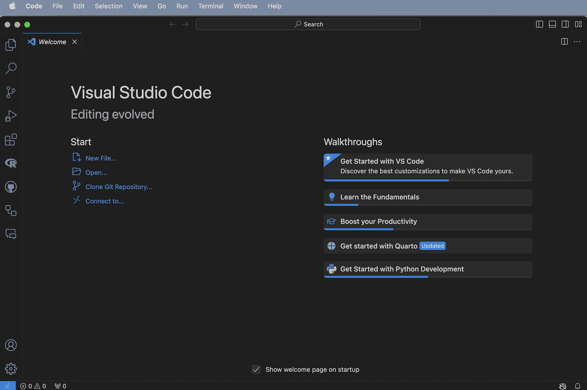
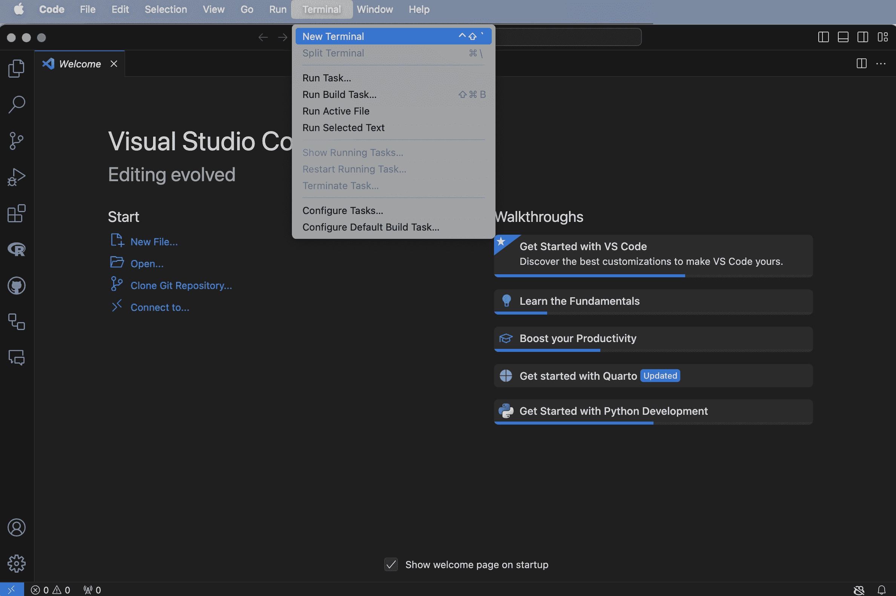
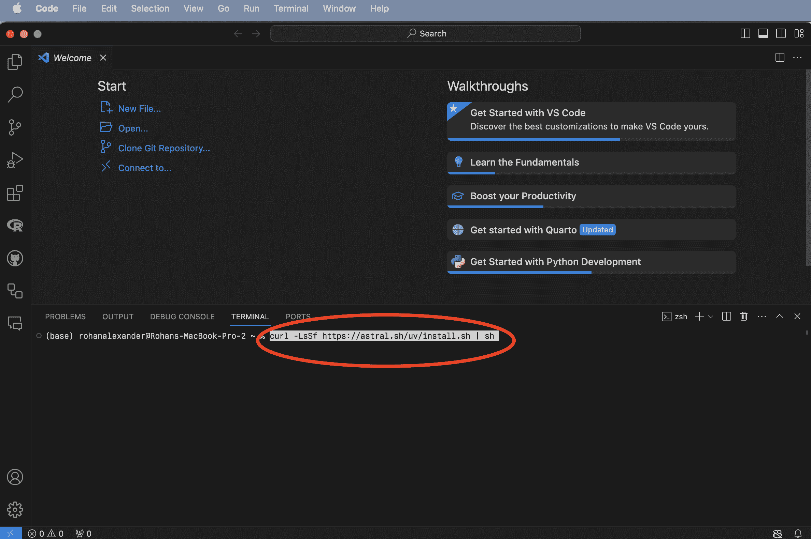
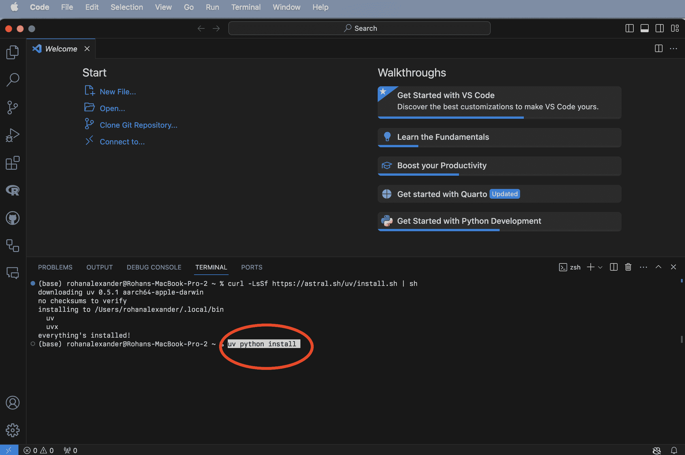
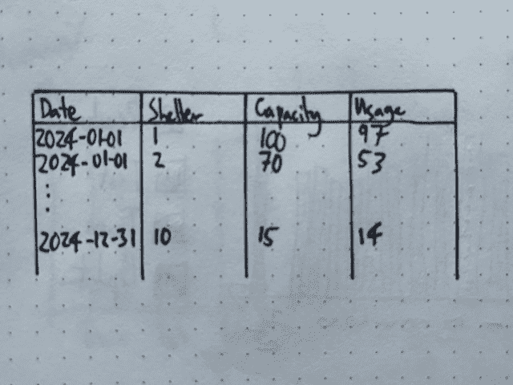
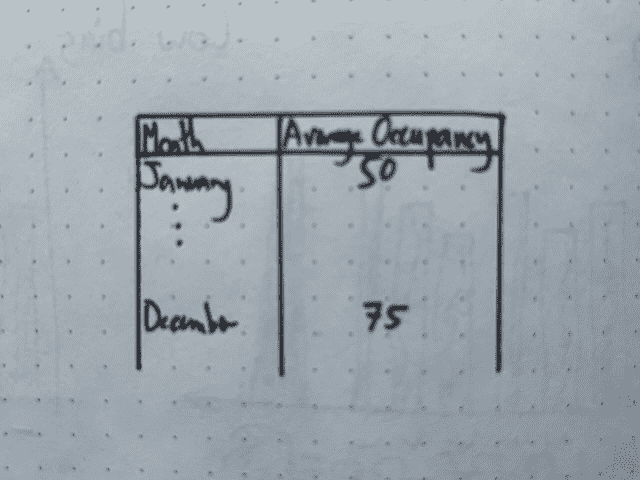

# 在线附录 B — Python 精要

> 原文：[`tellingstorieswithdata.com/21-python_essentials.html`](https://tellingstorieswithdata.com/21-python_essentials.html)

1.  附录

1.  B Python 精要

**先决条件**

**关键概念和技能**

**软件和包**

+   `Python` (Python 软件基金会 2024)

+   `datetime>=5.5`

+   `uv`

+   `polars`

## B.1 简介

`Python` 是由吉多·范罗苏姆（Guido van Rossum）创建的一种通用编程语言。`Python` 版本 0.9.0 于 1991 年 2 月发布，当前版本 3.13 于 2024 年 10 月发布。它是以 *蒙提·派森飞行马戏团* 命名的。

`Python` 是机器学习中的流行语言，但它最初是为更通用的软件应用而设计的，并且更常用于此类应用。这意味着当我们使用 Python 进行数据科学时，我们将特别依赖包。本书中 `Python` 的使用主要关注数据科学，而不是它所开发的更通用的其他用途。

了解 `R` 将使您能够快速掌握 `Python` 进行数据科学。主要的数据科学包都需要解决相同的基本问题。

## B.2 Python、VS Code 和 uv

我们可以在 RStudio 中使用 `Python`，但另一个选择是使用社区更广泛使用的 VS Code。您可以从 [这里](https://code.visualstudio.com) 免费下载 VS Code 并安装它。如果您遇到困难，那么就像我们从 Posit Cloud 开始，然后转移到我们的本地机器一样，您最初可以使用 Google Colab [这里](https://colab.google)。

打开 VS Code (图 B.1 (a))，然后打开一个新的终端：终端 -> 新终端 (图 B.1 (b))。然后我们可以通过在终端中输入 `curl -LsSf https://astral.sh/uv/install.sh | sh` 并按“回车/Enter”来安装 `uv`，这是一个 Python 包管理器 (图 B.1 (c))。最后，要安装 Python，我们可以在该终端中输入 `uv python install` 并按“回车/Enter”来安装 (图 B.1 (d))。



(a) 打开 VS Code



(b) 在 VS Code 中打开终端



(c) 安装 uv



(d) 安装 Python

图 B.1：打开 VS Code 和新终端，然后安装 uv 和 Python

## B.3 入门

### B.3.1 项目设置

我们将通过一个示例开始，该示例从 Open Data Toronto 下载一些数据。首先，我们需要创建一个项目，这将使所有代码都包含在项目中。

打开 VS Code 并打开一个新的终端：“终端”->“新建终端”。然后使用 Unix shell 命令导航到你想要创建文件夹的位置。例如，使用`ls`列出当前目录下的所有文件夹，然后使用`cd`移动到其中一个文件夹，然后是文件夹的名称。如果你需要退回到上一级，则使用`..`。

一旦你确定好创建新文件夹的位置，我们就可以在终端中使用`uv init`来完成这个操作，之后按“return/enter”键（然后`cd`命令将移动到新的文件夹“shelter_usage”）。

```py
uv init shelter_usage
cd shelter_usage
```

*默认情况下，示例文件夹中会有一个脚本。我们希望使用`uv run`来运行该脚本，这将为我们创建一个项目环境。

```py
uv run hello.py
```

*项目环境是特定于该项目的。我们将使用`numpy`包来模拟数据。我们需要使用`uv add`将此包添加到我们的环境中。

```py
uv add numpy
```

*我们可以修改`hello.py`以使用`numpy`从正态分布中进行模拟。

```py
import numpy as np

def main():
 np.random.seed(853)

 mu, sigma = 0, 1
 sample_sizes = [10, 100, 1000, 10000]
 differences = []

 for size in sample_sizes:
 sample = np.random.normal(mu, sigma, size)
 sample_mean = np.mean(sample)
 diff = abs(mu - sample_mean)
 differences.append(diff)
 print(f"Sample size: {size}")
 print(f"  Difference between sample and population mean: {round(diff, 3)}")

if __name__ == "__main__":
 main()
```

*在修改并保存`hello.py`之后，我们可以用`uv run`以与之前相同的方式运行它。

在这一点上，我们应该关闭 VS Code。我们想要重新打开它以确保我们的项目环境按需工作。在 VS Code 中，项目是一个自包含的文件夹。你可以通过“文件”->“打开文件夹...”来打开一个文件夹，然后选择相关的文件夹，在这种情况下是“shelter_usage”。然后你应该能够重新运行`uv run hello.py`，并且它应该可以工作。

我们首先在第二章中使用了这个数据集，但为了提醒，对于每一天，对于每一个避难所，都有使用避难所的人数。因此，我们想要模拟的数据集类似于图 B.2(a)，并且我们希望创建一个表格，展示每个月的平均占用床位数，类似于图 B.2(b)。



(a) 数据集的快速草图



(b) 每月占用床数的快速表格草图

图 B.2：与多伦多避难所使用相关的数据集和表格草图

### B.3.3 模拟

我们希望更彻底地模拟我们感兴趣的数据集。我们将使用`polars`提供一个 dataframe 来存储我们的模拟结果，因此我们应该使用`uv add`将其添加到我们的环境中。

```py
uv add polars
```

*创建一个名为`00-simulate_data.py`的新 Python 文件。

```py
#### Preamble ####
# Purpose: Simulates a dataset of daily shelter usage
# Author: Rohan Alexander
# Date: 12 November 2024
# Contact: rohan.alexander@utoronto.ca
# License: MIT
# Pre-requisites:
# - Add `polars`: uv add polars
# - Add `numpy`: uv add numpy
# - Add `datetime`: uv add datetime

#### Workspace setup ####
import polars as pl
import numpy as np
from datetime import date

rng = np.random.default_rng(seed=853)

#### Simulate data ####
# Simulate 10 shelters and some set capacity
shelters_df = pl.DataFrame(
 {
 "Shelters": [f"Shelter {i}" for i in range(1, 11)],
 "Capacity": rng.integers(low=10, high=100, size=10),
 }
)

# Create data frame of dates
dates = pl.date_range(
 start=date(2024, 1, 1), end=date(2024, 12, 31), interval="1d", eager=True
).alias("Dates")

# Convert dates into a data frame
dates_df = pl.DataFrame(dates)

# Combine dates and shelters
data = dates_df.join(shelters_df, how="cross")

# Add usage as a Poisson draw
poisson_draw = rng.poisson(lam=data["Capacity"])
usage = np.minimum(poisson_draw, data["Capacity"])

data = data.with_columns([pl.Series("Usage", usage)])

data.write_parquet("simulated_data.parquet")
```

*我们希望基于这个模拟数据编写测试，然后将这些测试应用到我们的真实数据上。我们使用`pydantic`来完成这个任务，因此我们应该使用`uv add`将其添加到我们的环境中。

```py
uv add pydantic
```

*创建一个名为`00-test_simulated_data.py`的新 Python 文件。第一步是定义一个名为`ShelterData`的子类，它来自`pydantic`的`BaseModel`。

```py
from pydantic import BaseModel, Field, ValidationError, field_validator
from datetime import date

# Define the Pydantic model
class ShelterData(BaseModel):
 Dates: date  # Validates date format (e.g., 'YYYY-MM-DD')
 Shelters: str  # Must be a string
 Capacity: int = Field(..., ge=0)  # Must be a non-negative integer
 Usage: int = Field(..., ge=0)  # Must be non-negative

 # Add a field validator for usage to ensure it does not exceed capacity
 @field_validator("Usage")
 def check_usage_not_exceed_capacity(cls, usage, info):
 capacity = info.data.get("Capacity")
 if capacity is not None and usage > capacity:
 raise ValueError(f"Usage ({usage}) exceeds capacity ({capacity}).")
 return usage
```

*我们感兴趣的是测试日期是否有效，庇护所的类型是否正确，以及容量和利用率都是非负整数。还有一个额外的细节是，利用率不应超过容量。为了编写这样的测试，我们使用`field_validator`。

然后，我们可以导入我们的模拟数据集并进行测试。

```py
import polars as pl

df = pl.read_parquet("simulated_data.parquet")

# Convert Polars DataFrame to a list of dictionaries for validation
data_dicts = df.to_dicts()

# Validate the dataset in batches
validated_data = []
errors = []

# Batch validation
for i, row in enumerate(data_dicts):
 try:
 validated_row = ShelterData(**row)  # Validate each row
 validated_data.append(validated_row)
 except ValidationError as e:
 errors.append((i, e))

# Convert validated data back to a Polars DataFrame
validated_df = pl.DataFrame([row.dict() for row in validated_data])

# Display results
print("Validated Rows:")
print(validated_df)

if errors:
 print("\nErrors:")
 for i, error in errors:
 print(f"Row {i}: {error}")
```

*为了了解如果出现错误会发生什么，我们可以考虑一个包含两个错误的小数据集：一个格式错误的日期和一个利用率超过容量的情况。

```py
import polars as pl
from pydantic import BaseModel, Field, ValidationError, field_validator
from datetime import date

# Define the Pydantic model
class ShelterData(BaseModel):
 Dates: date  # Validates date format (e.g., 'YYYY-MM-DD')
 Shelters: str  # Must be a string
 Capacity: int = Field(..., ge=0)  # Must be a non-negative integer
 Usage: int = Field(..., ge=0)  # Must be non-negative

 # Add a field validator for Usage to ensure it does not exceed Capacity
 @field_validator("Usage")
 def check_usage_not_exceed_capacity(cls, usage, info):
 capacity = info.data.get("Capacity")
 if capacity is not None and usage > capacity:
 raise ValueError(f"Usage ({usage}) cannot exceed Capacity ({capacity}).")
 return usage

# Define the dataset
df = [
 {"Dates": "2024-01-01", "Shelters": "Shelter 1", "Capacity": 23, "Usage": 22},
 {"Dates": "rohan", "Shelters": "Shelter 2", "Capacity": 62, "Usage": 62},
 {"Dates": "2024-01-01", "Shelters": "Shelter 3", "Capacity": 93, "Usage": 88},
 # Add invalid row for testing
 {"Dates": "2024-01-01", "Shelters": "Shelter 4", "Capacity": 50, "Usage": 55},
]

# Validate the dataset in batches
validated_data = []
errors = []

# Batch validation
for i, row in enumerate(df):
 try:
 validated_row = ShelterData(**row)  # Validate each row
 validated_data.append(validated_row)
 except ValidationError as e:
 errors.append((i, e))

# Convert validated data back to a Polars DataFrame
validated_df = pl.DataFrame([row.dict() for row in validated_data])

# Display results
print("Validated Rows:")
print(validated_df)

if errors:
 print("\nErrors:")
 for i, error in errors:
 print(f"Row {i}: {error}")
```

*我们得到以下信息：

```py
Errors:
Row 1: 1 validation error for ShelterData
Dates
  Input should be a valid date or datetime, input is too short [type=date_from_datetime_parsing, input_value='rohan', input_type=str]
    For further information visit https://errors.pydantic.dev/2.9/v/date_from_datetime_parsing
Row 3: 1 validation error for ShelterData
Usage
  Value error, Usage (55) cannot exceed Capacity (50). [type=value_error, input_value=55, input_type=int]
    For further information visit https://errors.pydantic.dev/2.9/v/value_error
```******  ***### B.3.4 获取

使用之前相同的来源：https://open.toronto.ca/dataset/daily-shelter-overnight-service-occupancy-capacity/

```py
import polars as pl

# URL of the CSV file
url = "https://ckan0.cf.opendata.inter.prod-toronto.ca/dataset/21c83b32-d5a8-4106-a54f-010dbe49f6f2/resource/ffd20867-6e3c-4074-8427-d63810edf231/download/Daily%20shelter%20overnight%20occupancy.csv"

# Read the CSV file into a Polars DataFrame
df = pl.read_csv(url)

# Save the raw data
df.write_parquet("shelter_usage.parquet")
```

*我们可能只对少数几列和有数据的行感兴趣。

```py
import polars as pl

df = pl.read_parquet("shelter_usage.parquet")

# Select specific columns
selected_columns = ["OCCUPANCY_DATE", "SHELTER_ID", "OCCUPIED_BEDS", "CAPACITY_ACTUAL_BED"]

selected_df = df.select(selected_columns)

# Filter to only rows that have data
filtered_df = selected_df.filter(df["OCCUPIED_BEDS"].is_not_null())

print(filtered_df.head())

renamed_df = filtered_df.rename({"OCCUPANCY_DATE": "date",
 "SHELTER_ID": "Shelters",
 "CAPACITY_ACTUAL_BED": "Capacity",
 "OCCUPIED_BEDS": "Usage"
 })

print(renamed_df.head())

renamed_df.write_parquet("cleaned_shelter_usage.parquet")
```

*我们可能还想将测试应用到实际数据集上

```py
import polars as pl
from pydantic import BaseModel, Field, ValidationError, field_validator
from datetime import date

# Define the Pydantic model
class ShelterData(BaseModel):
 Dates: date  # Validates date format (e.g., 'YYYY-MM-DD')
 Shelters: str  # Must be a string
 Capacity: int = Field(..., ge=0)  # Must be a non-negative integer
 Usage: int = Field(..., ge=0)  # Must be non-negative

 # Add a field validator for Usage to ensure it does not exceed Capacity
 @field_validator("Usage")
 def check_usage_not_exceed_capacity(cls, usage, info):
 capacity = info.data.get("Capacity")
 if capacity is not None and usage > capacity:
 raise ValueError(f"Usage ({usage}) cannot exceed Capacity ({capacity}).")
 return usage

df = pl.read_parquet("cleaned_shelter_usage.parquet")

# Convert Polars DataFrame to a list of dictionaries for validation
data_dicts = df.to_dicts()

# Validate the dataset in batches
validated_data = []
errors = []

# Batch validation
for i, row in enumerate(data_dicts):
 try:
 validated_row = ShelterData(**row)  # Validate each row
 validated_data.append(validated_row)
 except ValidationError as e:
 errors.append((i, e))

# Convert validated data back to a Polars DataFrame
validated_df = pl.DataFrame([row.dict() for row in validated_data])

# Display results
print("Validated Rows:")
print(validated_df)

if errors:
 print("\nErrors:")
 for i, error in errors:
 print(f"Row {i}: {error}")
```**  ***### B.3.5 探索

操作数据

```py
import polars as pl

df = pl.read_parquet("cleaned_shelter_usage.parquet")

# Convert the date column to datetime and rename it for clarity
df = df.with_columns(pl.col("date").str.strptime(pl.Date, "%Y-%m-%d").alias("date"))

# Group by "Dates" and calculate total "Capacity" and "Usage"
aggregated_df = (
 df.group_by("date")
 .agg([
 pl.col("Capacity").sum().alias("Total_Capacity"),
 pl.col("Usage").sum().alias("Total_Usage")
 ])
 .sort("date")  # Sort the results by date
)

# Display the aggregated DataFrame
print(aggregated_df)
```

*制作图表

```py
import polars as pl
import seaborn as sns
import matplotlib.pyplot as plt
import pandas as pd
import matplotlib.dates as mdates

# Read the Polars DataFrame from a Parquet file
df = pl.read_parquet("analysis_data.parquet")

# Ensure the 'date' column is of datetime type in Polars
df = df.with_columns([
 pl.col('date').cast(pl.Date)
])

# Select the relevant columns and reshape the DataFrame
df_melted = df.select(["date", "Total_Capacity", "Total_Usage"]).melt(
 id_vars="date",
 variable_name="Metric",
 value_name="Value"
)

# Convert Polars DataFrame to a Pandas DataFrame for Seaborn
df_melted_pd = df_melted.to_pandas()

# Ensure 'date' column is datetime in Pandas
df_melted_pd['date'] = pd.to_datetime(df_melted_pd['date'])

# Set the plotting style
sns.set_theme(style="whitegrid")

# Create the plot
plt.figure(figsize=(12, 6))
sns.lineplot(
 data=df_melted_pd,
 x="date",
 y="Value",
 hue="Metric",
 linewidth=2.5
)

# Format the x-axis to show dates nicely
plt.gca().xaxis.set_major_locator(mdates.AutoDateLocator())
plt.gca().xaxis.set_major_formatter(mdates.DateFormatter('%Y-%m-%d'))

# Rotate x-axis labels for better readability
plt.xticks(rotation=45)

# Add labels and title
plt.xlabel("Date")
plt.ylabel("Values")
plt.title("Total Capacity and Usage Over Time")

# Adjust layout to prevent clipping of tick-labels
plt.tight_layout()

# Display the plot
plt.show()
```*  **### B.3.6 分享

一个很好的方面是，我们可以在 Quarto 文档中使用 Python。为此，我们需要通过安装来自[这里](https://marketplace.visualstudio.com/items?itemName=quarto.quarto)的 Quarto 扩展将其添加到 VS Code 中。您可以通过在终端中运行`quarto preview`来渲染文档。

VS Code 由微软构建，微软也拥有 GitHub。因此，我们可以通过转到“账户”并登录来将我们的账户添加到 VS Code 中。***********  ***## B.4 Python

循环

列推导式

## B.5 制作图表

matplotlib

seaborn

## B.6 探索 polars

### B.6.1 导入数据

### B.6.2 使用连接和转置操作数据集

### B.6.3 字符串操作

### B.6.4 因子变量

## B.7 练习

### 练习

### 测验

### 任务

Free Replit “100 Days of Code” Python [课程](https://replit.com/learn/100-days-of-python)。

Python 软件基金会。2024\. *Python 语言参考，版本 3.13.0*。[`docs.python.org/3/index.html`](https://docs.python.org/3/index.html)。***
