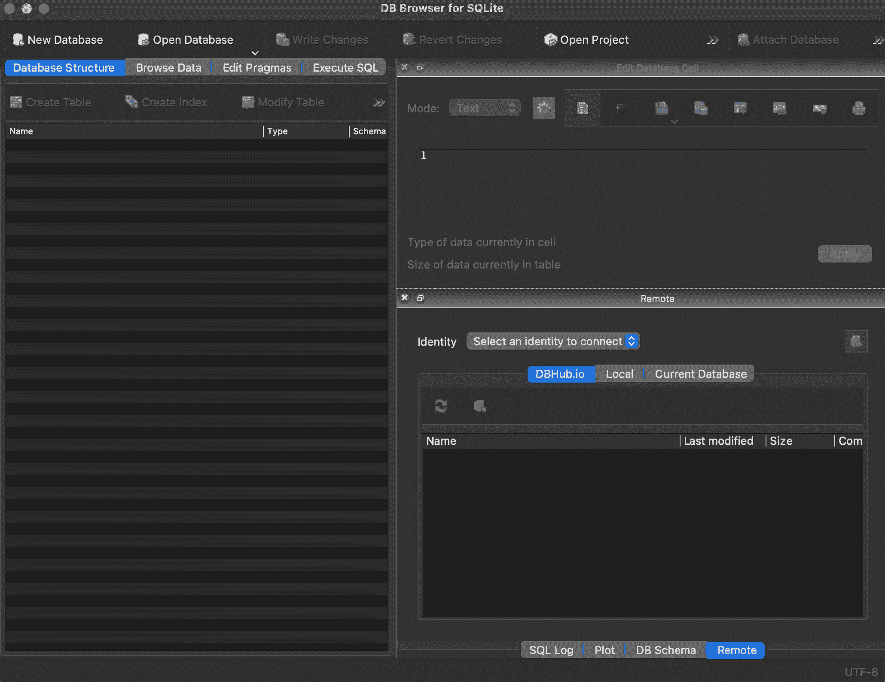

# 在线附录 C — SQL 基础

> 原文：[`tellingstorieswithdata.com/22-sql_essentials.html`](https://tellingstorieswithdata.com/22-sql_essentials.html)

1.  附录

1.  C SQL 基础

先决条件**

+   阅读 *SQL 的早期历史*，(Chamberlin 2012)

    +   对 SQL 发展历程的一个有趣概述。

关键概念和技能**

+   虽然我们可以使用各种 R 包，或者在 RStudio 中编写 SQL，但行业对 SQL 的需求使得独立于 R 学习 SQL 变得值得，至少最初是这样。

+   SQLite 是 SQL 的一种风味，我们可以使用 DB Browser for SQLite 作为 SQL 的 IDE。

关键包和函数**

+   `BETWEEN`

+   `DESC`

+   `DISTINCT`

+   `FROM`

+   `GROUP BY`

+   `LEFT JOIN`

+   `LIKE`

+   `LIMIT`

+   `OR`

+   `ORDER BY`

+   `SELECT`

+   `UPDATE`

+   `WHERE`

## C.1 简介

结构化查询语言（SQL）（“see-quell”或“S.Q.L.”）与关系数据库一起使用。关系数据库至少包含一个表，而表只是按行和列组织的一些数据。如果数据库中有多个表，那么应该有一些列将它们链接起来。一个例子是附录 A 中使用的`AustralianPoliticians`数据集。使用 SQL 感觉有点像 HTML/CSS，因为它在标记和编程之间处于半中间位置。一个有趣的特点是，按照惯例，命令以大写字母书写。另一个特点是行间距没有任何意义：包括或不包括，但总是以分号结束 SQL 命令；

SQL 是在 20 世纪 70 年代在 IBM 开发的。SQL 是与数据交互的一种特别流行的方法。SQL 有许多“风味”，包括封闭和开放选项。在这里，我们介绍 SQLite，它是开源的，并且预安装在 Mac 上。Windows 用户可以从[这里](https://www.sqlite.org/download.html)安装它。

高级 SQL 用户可以仅凭 SQL 完成很多事情，但即使只是对 SQL 有实际了解，也能增加我们可以访问的数据集数量。对 SQL 的实际了解对我们的效率特别有用，因为大量数据集存储在 SQL 服务器上，能够自行从这些服务器中获取数据是非常方便的。

我们可以在 RStudio 中使用 SQL，特别是利用`DBI`（R 数据库特殊兴趣小组（R-SIG-DB），Wickham 和 Müller 2022）。尽管考虑到对 SQL 技能的需求，独立于对 R 技能的需求，从职业角度来看，拥有独立于 RStudio 的 SQL 实际知识可能更好。我们可以将许多 SQL 命令视为本书中使用的`dplyr`动词的直接变体。实际上，如果我们想留在 R 中，那么`dbplyr`（Wickham，Girlich 和 Ruiz 2022）将明确允许我们使用`dplyr`函数，并将它们自动转换为 SQL。在`tidyverse`中使用`mutate()`，`filter()`和`left_join()`意味着许多核心 SQL 命令将变得熟悉。这意味着主要困难将是掌握操作顺序，因为 SQL 可能非常严格。

## C.2 开始学习

要开始学习 SQL，请下载[DB Browser for SQLite](https://sqlitebrowser.org)（DB4S），它是免费且开源的，并打开它（图 C.1）。



图 C.1：打开 SQLite 数据库浏览器

在[这里](https://github.com/RohanAlexander/telling_stories/blob/main/inputs/AustralianPoliticians.db)下载“AustralianPoliticians.db”，然后使用“打开数据库”打开它，并导航到您下载数据库的位置。

我们现在将介绍三个关键的 SQL 命令：`SELECT`，`FROM`和`WHERE`。`SELECT`允许我们指定数据表中的特定列，我们可以将`SELECT`视为与`select()`类似。就像我们需要使用`select()`指定数据集并使用管道操作符那样，我们使用`FROM`来指定数据集。例如，我们可以打开“执行 SQL”，然后输入以下内容，并点击“执行”。

```r
SELECT
 surname 
FROM
 politicians;
```

结果是我们可以获取姓氏列。我们可以通过逗号分隔来选择多个列，或者使用星号选择所有列，尽管这不是最佳实践，因为如果数据集在我们不知情的情况下发生变化，那么我们的结果也会不同。

```r
SELECT
 uniqueID,
 surname 
FROM
 politicians;
```

```r
SELECT
 *
FROM
 politicians;
```

最后，如果有重复的行，我们可以使用`DISTINCT`来查看唯一的行，这与`distinct()`类似。

```r
SELECT
 DISTINCT surname 
FROM
 politicians;
```

到目前为止，我们已经使用了`SELECT`和`FROM`。常用的第三个命令是`WHERE`，这将允许我们关注特定的行，类似于`filter()`。

```r
SELECT
 uniqueID,
 surname,
 firstName 
FROM
 politicians 
WHERE
 firstName = "Myles";
```

所有常用的逻辑运算符在`WHERE`子句中都是可行的，例如“=”，“!=”，“>”，“<”，“>=”和“<=”。我们可以使用`AND`和`OR`来组合条件。

```r
SELECT
 uniqueID,
 surname,
 firstName 
FROM
 politicians 
WHERE
 firstName = "Myles" 
 OR firstName = "Ruth";
```

如果我们有一个返回大量结果集的查询，那么我们可以使用`LIMIT`来限制它们的数量。

```r
SELECT
 uniqueID,
 surname,
 firstName 
FROM
 politicians 
WHERE
 firstName = "Robert"       LIMIT 5;
```

我们还可以使用`ORDER`来指定结果集的顺序。

```r
SELECT
 uniqueID,
 surname,
 firstName 
FROM
 politicians 
WHERE
 firstName = "Robert" 
ORDER BY
 surname DESC;
```

查看符合特定标准的行：

```r
SELECT
 uniqueID,
 surname,
 firstName 
FROM
 politicians 
WHERE
 firstName LIKE "Ma__";
```

上方的“_”是一个通配符，可以匹配任何字符。这提供了包括“Mary”和“Mark”在内的结果。`LIKE` 不区分大小写：“Ma__”和“ma__”都返回相同的结果。

使用“NULL”或“NOT NULL”可以关注缺失数据。

```r
SELECT
 uniqueID,
 surname,
 firstName,
 comment
FROM
 politicians 
WHERE
 comment     IS NULL;
```

对数字、日期和文本字段应用了排序，这意味着我们可以在所有这些字段上使用 `BETWEEN`，而不仅仅是数字。例如，我们可以查找所有以 X 和 Z 之间的字母开头的姓氏（不包括 Z）。

```r
SELECT
 uniqueID,
 surname,
 firstName
FROM
 politicians 
WHERE
 surname     BETWEEN "X" AND "Z";
```

使用 `WHERE` 与数值变量结合意味着 `BETWEEN` 是包含的，与字母示例不同，后者不是。

```r
SELECT
 uniqueID,
 surname,
 firstName,
 birthYear
FROM
 politicians 
WHERE
 birthYear     BETWEEN 1980 AND 1990;
```

除了提供与我们请求匹配的数据集观察结果外，我们还可以修改数据集。例如，我们可以使用 `UPDATE` 和 `SET` 修改一个值。

```r
UPDATE
 politicians 
SET
 displayName = "John Gilbert Alexander"
WHERE
 uniqueID = "Alexander1951";
```

我们可以使用 `CASE` 和 `ELSE` 集成 if-else 逻辑。例如，我们可以添加一个名为“wasTreasurer”的列，对于“Josh Frydenberg”的情况，该列值为“是”，对于“Kevin Rudd”的情况，该列值为“否”，对于所有其他情况，该列值为“不确定”。

```r
SELECT
 uniqueID,
 surname,
 firstName,
 birthYear,
 CASE 
 WHEN uniqueID = "Frydenberg1971" THEN "Yes" 
 WHEN surname = "Rudd" THEN "No" 
 ELSE "Unsure" 
 END AS "wasTreasurer" 
FROM
 politicians;
```

我们可以使用 `COUNT`、`SUM`、`MAX`、`MIN`、`AVG` 和 `ROUND` 等命令创建汇总统计，代替 `summarize()`。`COUNT` 通过传递列名来计算某些列不为空的行数，`MIN` 等类似地工作。

```r
SELECT
 COUNT(uniqueID) 
FROM
 politicians;
```

```r
SELECT
 MIN(birthYear) 
FROM
 politicians;
```

我们可以使用 `GROUP BY` 根据数据集中的不同组获取结果，这与 R 中的 `group_by` 类似。

```r
SELECT
 COUNT(uniqueID) 
FROM
 politicians 
GROUP BY
 gender;
```

最后，我们可以使用 `LEFT JOIN` 将两个表组合起来。我们需要小心地使用点符号指定匹配的列。

```r
SELECT
 politicians.uniqueID,
 politicians.firstName,
 politicians.surname,
 party.partySimplifiedName 
FROM
 politicians 
LEFT JOIN
 party 
 ON politicians.uniqueID = party.uniqueID;
```

由于 SQL 不是我们的重点，我们只提供了关于一些基本命令的简要概述。从职业角度来看，你应该对 SQL 感到舒适。它已经深深融入数据科学中，没有它“很难走得太远” (Robinson and Nolis 2020, 8)，并且“几乎任何”数据科学面试都会包括关于 SQL 的问题 (Robinson and Nolis 2020, 110)。
  
## C.3 练习

### 练习

请提交一个截图，显示你在免费的 w3school [SQL 测验](https://www.w3schools.com/quiztest/quiztest.asp?qtest=SQL)中至少获得了 70 分。你可能想浏览他们的 [教程](https://www.w3schools.com/sql/default.asp)，但本章的 SQL 内容（结合你的 `dplyr` 经验）足以获得 70 分。请包括截图中的时间和日期，即拍摄整个屏幕的截图，而不仅仅是浏览器窗口。

### 测验

1.  SQL 主要用于什么？

    1.  设计网页样式

    1.  管理和查询关系型数据库

    1.  创建机器学习模型

    1.  设计图形用户界面

1.  在 SQL 中，哪个命令用于从表中检索特定列？

    1.  JOIN

    1.  WHERE

    1.  SELECT

    1.  FROM

1.  SQL 中用于指定查询数据的表的子句是哪个？

    1.  WHERE

    1.  FROM

    1.  GROUP BY

    1.  SELECT

1.  SQL 命令 WHERE 的作用是什么？

    1.  将两个表连接在一起

    1.  对数据进行排序

    1.  将具有相同数据的记录分组

    1.  根据指定的条件过滤记录

1.  你如何选择名为 employees 的表中的所有列？

    1.  SELECT # FROM employees;

    1.  SELECT * FROM employees;

    1.  SELECT all FROM employees;

    1.  SELECT 列 FROM employees;

1.  哪个 SQL 关键字用于消除结果集中的重复行？

    1.  UNIQUE

    1.  DISTINCT

    1.  REMOVE

    1.  DELETE

1.  SQL 查询中的 LIMIT 子句的目的是什么？

    1.  为列设置最大值

    1.  限制返回的行数

    1.  限制显示的列数

    1.  强制访问控制

1.  哪个 SQL 子句用于对查询的结果集进行排序？

    1.  SORT

    1.  ORDER BY

    1.  SORT BY

    1.  ORDER

1.  在 SQL 中，当与 LIKE 操作符一起使用时，通配符字符 _ 代表什么？

    1.  任意数字

    1.  一个空格字符

    1.  任意单个字符

    1.  零个或多个字符

1.  你会如何选择以‘Ma’开头并跟任意两个字符的记录？

    1.  WHERE firstName LIKE 'Ma*';

    1.  WHERE firstName LIKE 'Ma__';

    1.  WHERE firstName LIKE 'Ma??';

    1.  WHERE firstName LIKE 'Ma%';

1.  哪个 SQL 语句用于更新数据库表中的数据？

    1.  SET

    1.  CHANGE

    1.  UPDATE

    1.  MODIFY

1.  你如何在 SQL 查询中检查 NULL 值？

    1.  WHERE 列 LIKE NULL

    1.  WHERE 列等于 NULL

    1.  WHERE 列 = NULL

    1.  WHERE 列 IS NULL

1.  SQL 中的 BETWEEN 操作符做什么？

    1.  选择给定范围内的值

    1.  对结果集进行排序

    1.  检查一个值是否为空

    1.  结合多个条件

1.  哪个 SQL 关键字用于将具有相同属性的行分组，以便可以对每个组应用聚合函数？

    1.  GROUP BY

    1.  HAVING

    1.  DISTINCT

    1.  ORDER BY

1.  SQL 中的 LEFT JOIN 的目的是什么？

    1.  将两个表的所有行合并

    1.  从右侧表返回所有记录，并从左侧表返回匹配的记录

    1.  从左侧表返回所有记录，并从右侧表返回匹配的记录

    1.  返回两个表中具有匹配值的行

1.  为什么在 SQL 查询中使用 SELECT * 不是最佳实践？

    1.  比指定列要慢

    1.  并非所有 SQL 语法都支持

    1.  它不会返回任何数据

    1.  如果数据库模式发生变化，可能会导致意外结果

### 任务

从[这里](https://jacobfilipp.com/hammer/)获取 SQL 数据集。

使用 SQL（而不是 R 或 Python）使用这些观察数据做出一些发现。请用 Quarto 写一篇简短的论文（你可以使用 R/Python 来制作图表，但不能用于数据准备/处理，这应该在 SQL 的单独脚本中完成）。在讨论中，请分别有一个子节关于：1) 相关性 vs. 因果；2) 缺失数据；3) 偏差来源。

提交一个符合一般预期的 GitHub 仓库链接（每组一个仓库）。

与评审标准相关的组成部分包括：“R/Python 被引用”，“数据被引用”，“课程论文”，“LLM 使用有记录”，“标题”，“作者、日期和仓库”，“摘要”，“引言”，“数据”，“测量”，“结果”，“讨论”，“散文”，“交叉引用”，“图注”，“图表/表格等”，“引用”，“提交”，“草图”，“模拟”，“测试”和“可重复的工作流程”。

Chamberlin, Donald. 2012\. “SQL 的早期历史.” *IEEE 计算机历史年鉴* 34 (4): 78–82\. [`doi.org/10.1109/mahc.2012.61`](https://doi.org/10.1109/mahc.2012.61).R 特殊兴趣小组数据库 (R-SIG-DB), Hadley Wickham, 和 Kirill Müller. 2022\. *DBI: R 数据库接口*. [`CRAN.R-project.org/package=DBI`](https://CRAN.R-project.org/package=DBI).Robinson, Emily, 和 Jacqueline Nolis. 2020\. *建立数据科学职业*. Shelter Island: Manning Publications. [`livebook.manning.com/book/build-a-career-in-data-science`](https://livebook.manning.com/book/build-a-career-in-data-science).Wickham, Hadley, Maximilian Girlich, 和 Edgar Ruiz. 2022\. *dbplyr: 数据库的“dplyr”后端*. [`CRAN.R-project.org/package/dbplyr`](https://CRAN.R-project.org/package/dbplyr).

