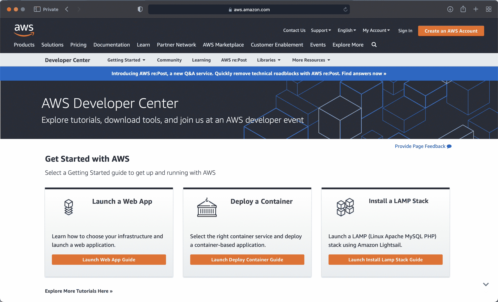
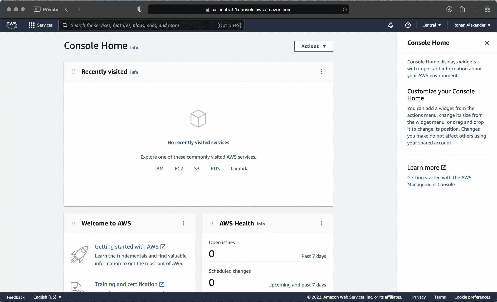
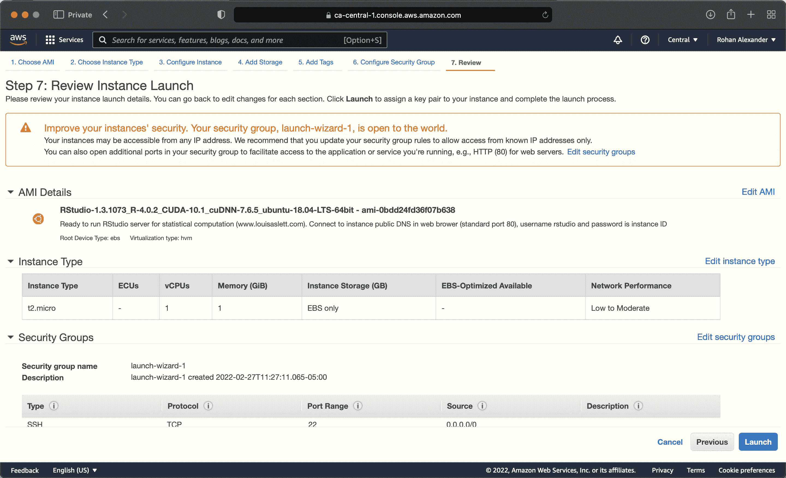
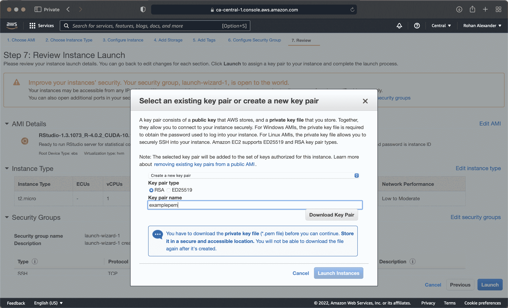

# 在线附录 G — 生产

> 原文：[`tellingstorieswithdata.com/26-deploy.html`](https://tellingstorieswithdata.com/26-deploy.html)

1.  附录

1.  G 生产

**先决条件**

+   阅读文章 *科学风暴云* (Gentemann 等人 2021)

    +   描述了能够使用云进行计算的重要性。

+   阅读文章 *机器学习走向实时* (Huyen 2020)

    +   讨论即时进行预测的需求。

+   观看 *使用 Plumber API 民主化 R* (Blair 2019)

    +   使用 `plumber` 创建 API 的概述。

+   阅读文章 *将机器学习投入运营：一项访谈研究* (Shankar 等人 2022)。

    +   提供了对机器学习工程师的访谈结果。

**关键概念和技能**

+   将模型投入生产 - 即在现实世界环境中使用 - 需要额外的技能集，包括熟悉云提供商和创建 API 的能力。

**软件和包**

+   `analogsea` (Chamberlain 等人 2022)

+   `plumber` (Schloerke 和 Allen 2022)

+   `plumberDeploy` (Allen 2021)

+   `remotes` (Csárdi 等人 2021)

+   `ssh` (Ooms 2022)

+   `tidymodels` (Kuhn 和 Wickham 2020)

+   `tidyverse` (Wickham 等人 2019)

```py
library(analogsea)
library(plumber)
library(plumberDeploy)
library(remotes)
library(ssh)
library(tidymodels)
library(tidyverse)
```

*## G.1 简介

在开发数据集并使用我们确信可以使用的模型进行探索之后，我们可能希望使这一功能能够在我们自己的计算机之外更广泛地使用。有各种方法可以实现这一点，包括：

+   使用云；

+   创建 R 包；

+   制作 `shiny` 应用程序；以及

+   使用 `plumber` 创建 API。

这里的基本思想是我们需要了解，并允许他人信任整个工作流程。这正是我们到目前为止的方法。之后，我们可能希望更广泛地使用我们的模型。比如说，我们已经能够从网站上抓取一些数据，对混乱进行整理，制作一些图表，适当地建模，并将这一切写下来。在大多数学术环境中，这已经足够了。但在许多工业环境中，我们希望使用模型来完成某些事情。例如，建立一个网站，允许模型根据几个输入生成保险报价。

在本章中，我们首先将计算从本地计算机转移到云端。然后我们描述了使用 R 包和 Shiny 来共享模型的方法。这很好，但在某些设置中，其他用户可能希望以我们未关注的方式与我们模型互动。允许这样做的一种方式是让我们的结果可供其他计算机访问，为此我们将需要创建一个 API。因此，我们介绍了`plumber`（Schloerke 和 Allen 2022），这是一种创建 API 的方法。

## G.2 亚马逊网络服务

据说，云端只是别人电脑的另一个名字。虽然这在各种程度上是正确的，但对我们来说已经足够了。学习使用别人的电脑可以有很多好处，包括：

+   可扩展性：购买一台新电脑可能相当昂贵，尤其是如果我们只是偶尔需要它来运行某些东西，但通过使用云端，我们只需租用几个小时或几天。这允许我们分摊成本，并在做出购买决定之前确定我们实际需要什么。它还允许我们在需求突然大幅增加时轻松地增加或减少计算规模。

+   可移植性：如果我们能将我们的分析工作流程从本地计算机转移到云端，那么这表明我们在可重复性和可移植性方面可能做得很好。至少，代码可以在本地和云端运行，这在可重复性方面是一个很大的进步。

+   设置后无需担心：如果我们正在做需要很长时间的事情，那么不必担心自己的电脑需要整夜运行是非常好的。此外，在许多云选项中，开源统计软件，如 R 和 Python，要么已经可用，要么相对容易设置。

话虽如此，也有缺点，包括：

+   成本：虽然大多数云选项都很便宜，但它们很少是免费的。为了提供一个成本的概念，使用具有良好功能的 AWS 实例几天可能需要几美元。也很容易忘记某些事情，并产生意外的大额账单，尤其是在最初。

+   公开性：很容易犯错，不小心把所有东西都公开。

+   时间：在云端设置和适应需要时间。

当我们使用云端时，我们通常是在一个“虚拟机”（VM）上运行代码。这是一个属于更大计算机集合的分配，它被设计成具有特定功能的计算机。例如，我们可能指定我们的虚拟机有 8GB RAM、128GB 存储和 4 个 CPU。那么这个虚拟机就会像一台具有这些规格的计算机一样运行。使用云选项的成本会根据虚拟机的规格而增加。

在某种意义上，我们最初是通过在第二章中推荐使用 Posit Cloud 来选择云选项的，然后我们才转向附录 A 中的本地计算机。那个云选项是专门为初学者设计的。现在，我们将介绍一个更通用的云选项：亚马逊网络服务（AWS）。通常，特定的企业会使用特定的云选项，例如谷歌、AWS 或 Azure，但熟悉其中一个将使使用其他选项更容易。

亚马逊网络服务是亚马逊的云服务。要开始，我们需要在[这里](https://aws.amazon.com/developer/)创建一个 AWS 开发者账户（图 G.1(a)）。



(a) AWS 开发者网站



(b) AWS 开发者控制台



(c) 启动 AWS 实例



(d) 建立密钥对

图 G.1：设置亚马逊 AWS 的概述

在我们创建账户后，我们需要选择一个计算机所在的位置。之后，我们想要“启动虚拟机”使用 EC2（图 G.1(b)）。

第一步是选择一个亚马逊机器镜像（AMI）。这提供了你将使用的计算机的详细信息。例如，一台本地计算机可能是一台运行 Monterey 的 MacBook。Louis Aslett 提供了已经设置好 RStudio 和其他许多功能的 AMI，[这里](http://www.louisaslett.com/RStudio_AMI/)。我们可以搜索我们注册区域的 AMI，或者点击 Aslett 网站上的相关链接。例如，要使用加拿大中央地区的 AMI 设置，我们搜索“ami-0bdd24fd36f07b638”。使用这些 AMI 的好处是它们专门为 RStudio 设置，但缺点是它们有点过时，因为它们是在 2020 年 8 月编译的。

在下一步中，我们可以选择计算机的强大程度。免费层是一个基本的计算机，但当我们需要时，我们可以选择更好的。在这个时候，我们几乎可以立即启动实例（图 G.1(c)）。如果我们更认真地使用 AWS，那么我们可以回过头来选择不同的选项，特别是在账户的安全性方面。AWS 依赖于密钥对。因此，我们需要创建一个隐私增强邮件（PEM）并将其保存在本地（图 G.1(d)）。然后我们可以启动实例。

几分钟后，实例将启动。我们可以通过将“公共 DNS”粘贴到浏览器中来使用它。用户名是“rstudio”，密码是实例 ID。

我们应该有 RStudio 正在运行，这很令人兴奋。首先要做的事情可能是使用实例中的说明更改默认密码。

我们不需要安装，比如说，`tidyverse`，我们只需调用库并继续即可。这是因为这个 AMI 已经预装了许多包。我们可以通过 `installed.packages()` 查看已安装的包列表。例如，`rstan` 已经安装，如果我们需要，我们可以设置一个带有 GPU 的实例。

能够启动 AWS 实例也许和能够停止它（以免产生费用）一样重要。免费层很有用，但我们确实需要将其关闭。要停止实例，在 AWS 实例页面中选择它，然后选择“操作 -> 实例状态 -> 终止”。

## G.3 Plumber 和模型 API

`plumber` 包背后的基本思想是（Schloerke 和 Allen 2022）（[99-references.html#ref-plumber]），我们可以训练一个模型并通过一个 API 提供它，当我们需要预测时可以调用它。回想一下在第七章中，我们非正式地将 API 定义为数据收集的上下文中的网站，它是为另一台计算机访问而设置的，而不是为人类。在这里，我们将其扩展到使数据包括模型。

为了让事情运转起来，让我们创建一个函数，无论输出如何都返回“Hello Toronto”。打开一个新的 R 文件，添加以下内容，然后将其保存为“plumber.R”（如果您还没有这样做，可能需要安装 `plumber` 包）。

```py
#* @get /print_toronto
print_toronto <- function() {
 result <- "Hello Toronto"
 return(result)
}
```

*保存之后，在编辑器的右上角，您应该会看到一个“运行 API”按钮。点击它，您的 API 应该会加载。它将是一个“Swagger”应用程序，它为我们提供了 API 的图形用户界面。展开 GET 方法，然后点击“尝试”和“执行”。在响应体中，您应该得到“Hello Toronto”。

为了更紧密地反映这是一个为计算机设计的 API，您可以将“请求 URL”复制/粘贴到浏览器中，它应该返回“Hello Toronto”。

#### G.3.0.1 本地模型

现在，我们将更新 API，使其能够根据一些输入提供模型输出。这遵循 Buhr (2017)。

在这个阶段，我们应该开始一个新的 R 项目。为了开始，让我们模拟一些数据，然后在上面训练一个模型。在这种情况下，我们感兴趣的是预测一个婴儿在夜间可能睡多久，前提是我们知道他们在下午小憩时睡了多少时间。

```py
set.seed(853)

number_of_observations <- 1000

baby_sleep <-
 tibble(
 afternoon_nap_length = rnorm(number_of_observations, 120, 5) |> abs(),
 noise = rnorm(number_of_observations, 0, 120),
 night_sleep_length = afternoon_nap_length * 4 + noise,
 )

baby_sleep |>
 ggplot(aes(x = afternoon_nap_length, y = night_sleep_length)) +
 geom_point(alpha = 0.5) +
 labs(
 x = "Baby's afternoon nap length (minutes)",
 y = "Baby's overnight sleep length (minutes)"
 ) +
 theme_classic()
```

**  *现在让我们使用 `tidymodels` 快速构建一个模型。

```py
set.seed(853)

baby_sleep_split <- initial_split(baby_sleep, prop = 0.80)
baby_sleep_train <- training(baby_sleep_split)
baby_sleep_test <- testing(baby_sleep_split)

model <-
 linear_reg() |>
 set_engine(engine = "lm") |>
 fit(
 night_sleep_length ~ afternoon_nap_length,
 data = baby_sleep_train
 )

write_rds(x = model, file = "baby_sleep.rds")
```

*在这个阶段，我们已经有一个模型。与您可能习惯的不同之处在于，我们将模型保存为“ .rds”文件。我们将读取该文件。

现在我们有了我们的模型，我们希望将其放入一个文件中，我们将使用 API 来访问它，再次命名为“plumber.R”。我们还希望有一个设置 API 的文件，命名为“server.R”。创建一个名为“server.R”的 R 脚本，并添加以下内容：

```py
library(plumber)

serve_model <- plumb("plumber.R")
serve_model$run(port = 8000)
```

*然后在“plumber.R”中添加以下内容：

```py
library(plumber)
library(tidyverse)

model <- readRDS("baby_sleep.rds")

version_number <- "0.0.1"

variables <-
 list(
 afternoon_nap_length = "A value in minutes, likely between 0 and 240.",
 night_sleep_length = "A forecast, in minutes, likely between 0 and 1000."
 )

#* @param afternoon_nap_length
#* @get /survival
predict_sleep <- function(afternoon_nap_length = 0) {
 afternoon_nap_length <- as.integer(afternoon_nap_length)

 payload <- data.frame(afternoon_nap_length = afternoon_nap_length)

 prediction <- predict(model, payload)

 result <- list(
 input = list(payload),
 response = list("estimated_night_sleep" = prediction),
 status = 200,
 model_version = version_number
 )

 return(result)
}
```

*同样，在我们保存“plumber.R”文件后，我们应该有一个“运行 API”的选项。点击它，你可以在本地以与之前相同的方式尝试 API。在这种情况下，点击“尝试一下”，然后输入分钟数的午睡长度。响应体将包含基于我们设置的数据和模型的预测。****  ***#### G.3.0.2 云模型

到目前为止，我们在自己的机器上已经有一个 API 在运行，但我们真正想要做的是让 API 在任何电脑上都能访问。为此，我们将使用[DigitalOcean](https://www.digitalocean.com)。这是一个收费服务，但当你创建账户时，会附带 200 美元的信用额度，这足以开始使用。

这个设置过程将花费一些时间，但我们只需要做一次。两个将在这里提供帮助的额外包是`plumberDeploy` (Allen 2021)和`analogsea` (Chamberlain et al. 2022)（需要从 GitHub 安装：`install_github("sckott/analogsea")`）。

现在我们需要将本地电脑与 DigitalOcean 账户连接起来。

```py
account()
```

*现在我们需要验证连接，这通过 SSH 公钥来完成。

```py
key_create()
```

*你需要在我们的电脑上有一个“.pub”文件。然后复制该文件中的公钥部分，并将其添加到账户安全设置中的 SSH 密钥部分。当我们在本地电脑上有了这个密钥，我们就可以使用`ssh`来检查。

```py
ssh_key_info()
```

*同样，这需要一段时间来验证。DigitalOcean 将我们启动的每一台电脑称为“droplet”。如果我们启动三台电脑，那么我们将启动三个 droplets。我们可以检查正在运行的 droplets。

```py
droplets()
```

*如果一切设置正确，这将打印出与账户关联的所有 droplets 的信息（目前可能没有）。我们首先必须创建一个 droplet。

```py
id <- do_provision(example = FALSE)
```

*然后我们会要求输入 SSH 密码短语，然后它会设置一堆东西。之后，我们将在我们的 droplet 上安装很多东西。

```py
install_r_package(
 droplet = id,
 c(
 "plumber",
 "remotes",
 "here"
 )
)

debian_apt_get_install(
 id,
 "libssl-dev",
 "libsodium-dev",
 "libcurl4-openssl-dev"
)

debian_apt_get_install(
 id,
 "libxml2-dev"
)

install_r_package(
 id,
 c(
 "config",
 "httr",
 "urltools",
 "plumber"
 )
)

install_r_package(id, c("xml2"))
install_r_package(id, c("tidyverse"))
install_r_package(id, c("tidymodels"))
```

*一旦最终设置完成（大约需要 30 分钟），我们就可以部署我们的 API。

```py
do_deploy_api(
 droplet = id,
 path = "example",
 localPath = getwd(),
 port = 8000,
 docs = TRUE,
 overwrite = TRUE
)
```**********  ***## G.4 练习

### 规模

1.  *(计划)*

1.  *(模拟)*

1.  *(获取)*

1.  *(探索)*

1.  *(沟通)*

### 问题

### 指南
