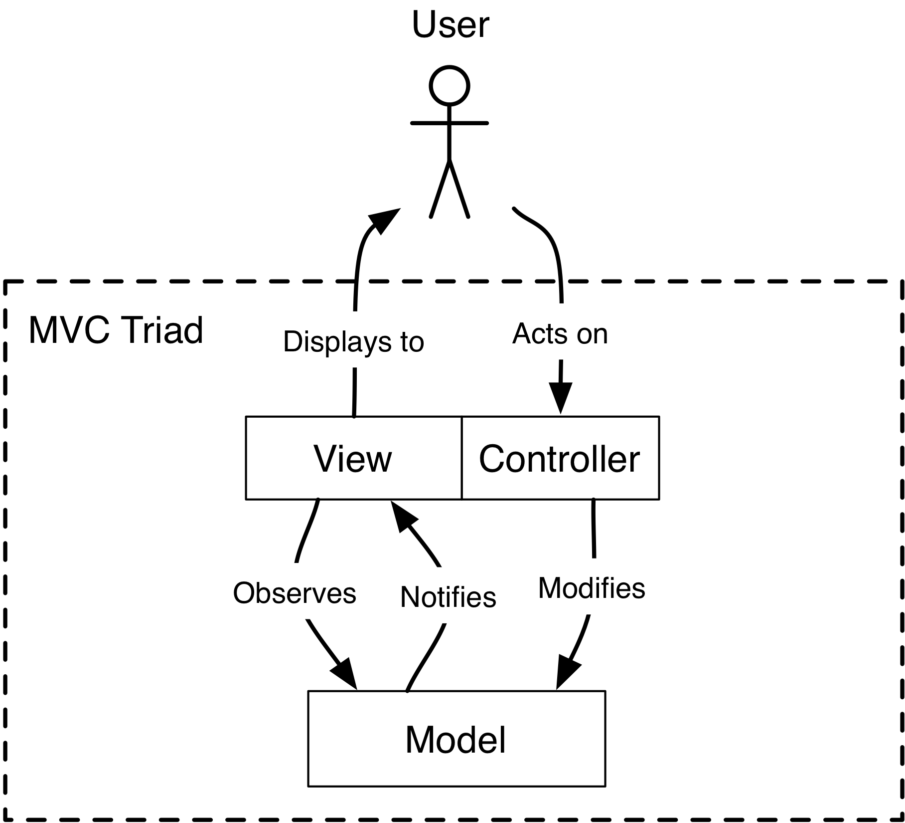
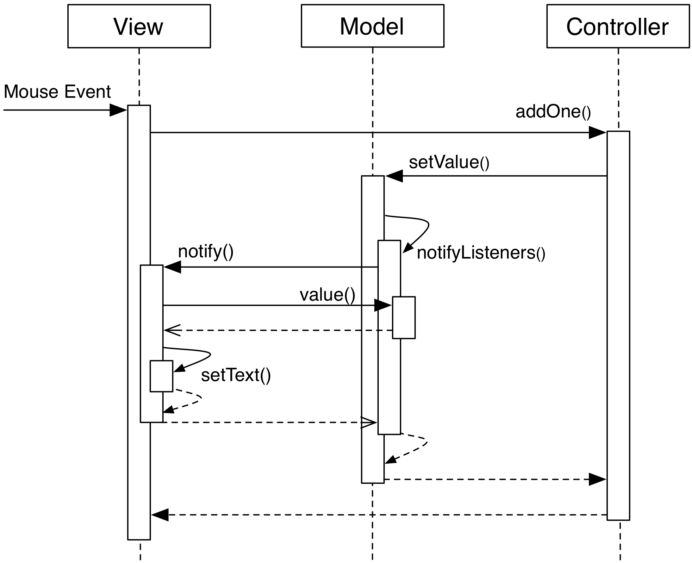
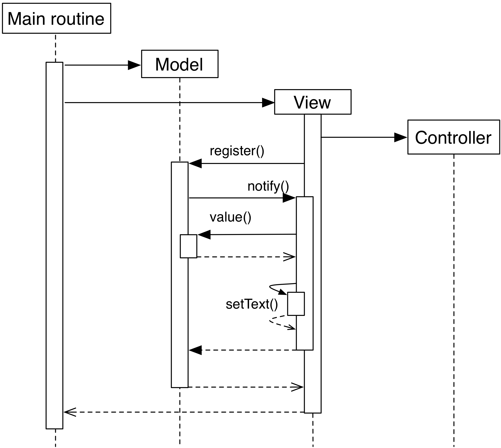

# 从智能 UI 到传统 MVC

# MVC 基础：从智能 UI 到传统 MVC

[](GLOSSARY.html)GUI 编程的目标是提供交互式和更新的应用程序当前状态的视觉表示。典型的要求集是同时以各种形式（即数字表和 XY 图）图形化表示这种状态，在不可预测的鼠标/键盘事件序列中修改此状态，并保持状态及其视觉表示始终同步和更新。同时，应用程序状态必须遵守业务逻辑约束，并在这些约束内保持。在代码级别，这些要求通常被翻译成通过各种复杂程度的通信网络相互作用的对象。我们如何满足这些要求，同时提供一个灵活的设计，使对象通信简单、易懂并尽可能有序？

MVC 模型-视图-控制器 解决了上述需求。它通过巧妙地将能力和角色在代码中进行细分，同时引入约束条件，使得潜在混乱的沟通得以良好组织和简化。MVC 非常灵活和适应性强，正如我们将看到的那样，使用其中的一种风格将是偏好或选择的开发框架的约束/最佳实践问题。

GUI 图形用户界面编程 是一个复杂的任务。需要多个不同层次的理解和处理：UI 设计和可用性考虑，用于异步评估的多线程和多进程，事件通知的一致性和平衡，GUI 对意外请求和样式更改的适应性。有大量的对话框、按钮、列表，都具有不同的性能、展示和可见性需求。在某种意义上，GUI 应用程序发展出了复杂系统的特征性新属性，其中多个实体相互作用。严格控制这个系统是维持混乱不至的唯一途径。

在[](GLOSSARY.html)这个[](GLOSSARY.html)章节中，我们将从最琐碎的 GUI 应用程序的实现开始，其中包含了可视和非可视逻辑：一个负责一切的单一类。这种方法被称为智能 UI，将成为我们逐步重构为 MVC 的三个基本组件：模型、视图和控制器的基础。我们将把结果称为“传统 MVC”设计。

# 智能 UI

# 智能 UI：一个负责多个职责的单一类

我们以最琐碎和简单的设计——智能 UI，也称为自主视图，开始探索通向 MVC 的道路。

* * *

**重要**

MVC 文献中一个令人困惑的特征是使用不同的名称来表达相同的概念。反之，同样常见的是使用相同的名称来表达完全不同的概念。我们通过提出最常见的名称，报告“也称为”名称，并在适当时强调差异来接受这一点。

* * *

智能 UI 方法使用单一类来处理我们期望从 GUI 程序中得到的所有职责：

+   接收用户驱动的事件，例如鼠标点击和键盘输入

+   拥有应用程序逻辑，将用户驱动的事件转换为应用程序状态的更改

+   保存相关的应用程序状态

+   执行其状态的可视渲染

作为智能 UI 的一个示例实现，考虑一个点击计数器应用程序，它显示一个带有数字的按钮。每次点击按钮时，数字都会增加。


代码如下：

```
import sys
from PyQt4 import QtCore, QtGui

class Counter(QtGui.QPushButton):
    def __init__(self, *args, **kwargs):
        super(Counter, self).__init__(*args, **kwargs)
        self._value = 0
        self._update()

    def mouseReleaseEvent(self, event):
        super(Counter, self).mouseReleaseEvent(event)
        self._value += 1
        self._update()

    def _update(self):
        self.setText(unicode(self._value))

app = QtGui.QApplication(sys.argv)
counter = Counter()
counter.show()
app.exec_() 
```

应用程序的主要且唯一的可视组件`Counter`派生自一个单一的 GUI 类，即 Qt `QPushButton`。特别观察`Counter`如何

1.  将当前点击计数值存储在成员变量`self._value`中。

1.  处理修改`self._value`的逻辑。每次点击按钮时，Qt 会自动调用`mouseReleaseEvent`。在这个方法中，点击计数器会递增。

1.  通过调用`setText`，将按钮的外观与当前的`self._value`同步。

这种极简设计看起来吸引人，因为它简单而紧凑。对于琐碎应用来说，这是一个很好的起点，也是最有可能被 GUI 编程新手实现的一个，但对于更大型的应用来说，它的扩展性不佳，其中状态、用户事件和图形布局更加复杂且交织在一起，并且需要在开发压力下经常变化。具体来说，注意以下问题：

+   从外部访问和修改当前状态是繁琐的，被包含在全面的视觉对象中：想要修改当前计数器的外部对象需要确保表示的值是同步的，例如，强制调用`_update()`，或者让`Counter`对象提供一个`setValue()`方法。

+   其他视觉对象很难报告相同的信息，也许具有两种不同的视觉方面（*例如*作为计数器和进度条）。

+   由此产生的类很难测试。唯一的压力方式是通过其公共接口和功能来实际探测它，这对于我们稍后将要检查的原因是不切实际的。

+   处理可视方面（即处理和布局小部件，更新按钮上的标签），交互方面（处理用户发起的鼠标点击执行增量操作），以及业务方面（增加计数器）的逻辑具有不同的性质，最好保持分开。这将有助于测试性，简化代码理解和交互。

# 文档视图

# 文档视图：将状态与 GUI 分离

为了解决智能 UI 的缺点，我们利用 GUI 应用程序表达的视觉渲染、交互和业务逻辑的内在分工。在智能 UI 中，这三个角色恰好分配给同一个类，但我们可以重新组织我们的代码，使业务逻辑部分保持分开。结果设计是文档视图或模型代理的两类系统。

**Document** 类 [](GLOSSARY.html) 负责处理业务逻辑。它与图形渲染无关，也与 GUI 事件无关。它仅存储与应用程序相关的状态，并提供接口以获取此状态或根据应用程序规则更改它。此外，它提供一种机制来通知感兴趣的对象发生的变化。

**View** 类 [](GLOSSARY.html) 负责处理用户事件，视觉呈现自身，对文档执行操作，并在文档状态发生变化时保持其视觉方面与文档状态同步。

文档-视图设计实现了状态与其图形表示的分离，使它们可以独立变化。文档已经成为一个完全非 GUI 实体，可以独立行动和测试。任何注册的视图始终通过通知系统保持与文档内容的最新状态，并对文档信息的图形呈现和用户交互处理负有全部责任。

此设计消除了对智能 UI 表达的一些担忧。测试状态和业务逻辑变得更容易：可以通过调用其方法对文档对象进行程序化修改或访问。这个对象现在是独立的，可以根据需要与不同的视图一起工作和操作。在保持视图（或视图）通知文档更改方面引入了额外的复杂性。 

## 实现示例

我们可以通过渐进的重构将这个设计应用到我们的点击计数器应用中。第一步是将数据分离出来，由`self._value`变量表示，放入 Document 类中。为了让我们的系统继续工作，视觉部分 View 现在必须知道对这些数据的更改。因此，Document 不仅将保存`self._value`，还将提供一个接口来查询和修改这些数据，以及一种策略来在发生更改时通知其他对象。这在以下实现代码中表达出来。

```
class CounterDocument(object): 
   def __init__(self): 
       self._value = 0 
       self._listeners = set() 
```

除了值之外，`self._listeners`成员变量保存了对对更改感兴趣的视图的引用。我们使用 Python 集合而不是列表，以防止同一对象被意外注册两次。感兴趣的对象可以通过以下方法注册和取消注册。

```
class CounterDocument(object): 
  # ...
  def register(self, listener): 
      self._listeners.add(listener) 
      listener.notify() 

  def unregister(self, listener): 
      self._listeners.remove(listener) 
```

然后我们为`self._value`提供一个 getter 方法。

```
class CounterDocument(object): 
   # ...
   def value(self): 
       return self._value 
```

我们还提供一个 setter 来直接设置特定的值。特别注意方法在值改变时如何通知已注册的监听器。这是通过调用监听器的`notify`方法来实现的，正如你在`self._notifyListeners`中所看到的。

```
 class CounterDocument(object): 
   # ...
   def setValue(self, value): 
       if value != self._value: 
           self._value = value 
           self._notifyListeners() 

   def _notifyListeners(self): 
       for l in self._listeners: 
           l.notify() 
```

因此，`notify`方法是已注册监听器必须提供的接口，以便接收有关文档对象状态变化的通知。我们的视图需要实现这个方法。

最后，我们还提供一个根据预期逻辑递增值的方法。

```
class CounterDocument(object): 
   # ...
   def incrementValue(self): 
       self._value += 1
       self._notifyListeners() 
```

视图类将负责渲染`CounterDocument`实例中包含的信息。这个实例在初始化时传递，经过一些程序后，视图将自己注册以接收通知。

```
class CounterView(QtGui.QPushButton):
   def __init__(self, document):
       super(CounterView, self).__init__()
       self._document = document
       self._document.register(self) 
```

当这种情况发生时，文档将视图添加为监听器。立即向新添加的监听器发送通知，以便它可以更新自身。然后调用视图上的`notify`方法，该方法将从文档中查询当前值，并更新按钮上的文本。

```
class CounterView(QtGui.QPushButton):
   # ...
   def notify(self):
       self.setText(unicode(self._document.value())) 
```

注意这种方法如何通过其接口（调用`CounterDocument.value`）查询文档。因此，视图必须详细了解其关联模型的接口，并处理其呈现的语义级别。通过这种知识，视图从模型中提取数据，并将“模型语言”转换为“视图语言”以呈现数据到其组成的视觉小部件中。

处理用户点击事件的操作在`mouseReleaseEvent`中执行，就像在 Smart-UI 中一样。然而，这次的操作将涉及文档，再次通过其接口。

```
 class CounterView(QtGui.QPushButton):
       # ...
       def mouseReleaseEvent(self, event):
           super(CounterView, self).mouseReleaseEvent(event)
           self._document.incrementValue() 
```

`setValue` 调用将发出更改通知，通过 `notify` 更新按钮文本。

我们现在可以为相同信息提供不同的表示模式，或者通过不同的来源进行修改，无论是视觉还是非视觉。例如，我们可以添加一个进度条。

```
class ProgressBarView(QtGui.QProgressBar):
   def __init__(self, document):
       super(ProgressBarView, self).__init__()
       self._document = document
       self._document.register(self)
       self.setRange(0,100)

   def notify(self):
       self.setValue(self._document.value()) 
```

并在初始化时在同一文档实例上注册它。

```
app = QtGui.QApplication(sys.argv)

document = CounterDocument()
counter = CounterView(document)
progress = ProgressBarView(document)

counter.show()
progress.show()

app.exec_() 
```

当按钮被点击时，其标签和进度条将保持更新，显示当前数值。

^(1) Python 属性可用于相同的目标。然而，在 PyQt 中，Python 属性更难连接到信号/槽机制。

^(2) 当视图在文档中注册时，正如我们在这里所做的，它应该仅在初始化完成时进行，这样通知就可以在完全初始化的对象上调用。一个替代策略是延迟此设置，并通过`View.setDocument`方法执行它。

* * *

**强类型语言中的通知系统**

在强类型语言中，通知系统的一个可能的实现使用具有一个抽象方法`notify()`的接口类`ListenerInterface`。例如，在 C++中我们可以编写以下代码。

```
class ListenerIface 
{
public:
    virtual void notify() = 0;
}; 
```

具体的监听器将实现这个接口

```
 class View : public ListenerIface
{
public:
    void notify();
}; 
```

模型将接受和处理指向侦听器接口的指针，因此不需要对特定视图或控制器进行依赖。

```
 class Model 
{
public:
    void register(ListenerIface *listener) {
        listeners.push_back(listener);
    }

private:
    void notifyListeners() {
        std::vector<ListenerIface *>::iterator it;
        for (it = listeners.begin(); it != listeners.end(); ++it) {
                (*it)->notify();
    }

    std::vector<ListenerIface *> listeners;
}; 
```

在 Java 中可以使用类似的方法。

* * *

# 传统 MVC

# 传统 MVC

使用 GLOSSARY.html 文档-视图 GLOSSARY.html 设计，我们成功地从初始的 Smart-UIGLOSSARY.html 设计中提取了状态。下一个目标是提取将主要事件（在本例中，按钮上的鼠标单击）转换为修改状态的逻辑执行的代码。这次重构的最终结果将是一个**传统的 MVC**设计^(1)。

在传统的 MVC 中，文档称为**Model**，其角色和结构不变：它存储状态并传递更改通知。视图部分分为两个类，**Controller**和**View**。一旦实例化并连接，模型、视图和控制器形成所谓的**MVC 三元组**。



控制器的角色是将视图传递的主要事件转换为模型上的操作。根据应用程序的具体情况，控制器可能需要或不需要引用视图，但它肯定需要模型来应用更改

```
class Controller(object):
   def __init__(self, model, view):
       self._model = model
       self._view = view 
```

`addOne`方法执行将主要事件转换为模型操作的特定任务，将当前值增加一。显然，控制器通过模型接口执行此操作。此操作将触发模型通知给其监听器

```
class Controller(object):
    # ...
    def addOne(self):
        self._model.setValue(self._model.value()+1) 
```

在[](GLOSSARY.html)初始化时，[](GLOSSARY.html)视图[](GLOSSARY.html)实例化其关联的[](GLOSSARY.html)控制器，将自身和[](GLOSSARY.html)模型作为参数传递。与以往一样，[](GLOSSARY.html)视图通过`register`方法在[](GLOSSARY.html)模型上注册自己

```
class View(QtGui.QPushButton):
    def __init__(self, model):
        super(View, self).__init__()
        self._model = model
        self._controller = Controller(self._model, self)
        self._model.register(self) 
```

现在视图依赖于控制器来修改模型：只有与 GUI 相关的处理由视图完成。从 GUI 事件转换为应用程序业务逻辑被委托给控制器在`mouseReleaseEvent`中。

```
class View(QtGui.QPushButton):
    # ...
    def mouseReleaseEvent(self, event):
        super(View, self).mouseReleaseEvent(event)  
        self._controller.addOne()  

    def notify(self):
        self.setText(unicode(self._model.value())) 
```

点击视图按钮将导致调用`Controller.addOne`，进而触发调用`notify`来更新文本标签。活动图显示了上述调用的流程。注意模型-视图同步不涉及控制器。



要初始化 MVC 三元组，客户端代码需要创建模型和视图，并让它们相互感知，通过将模型传递给视图。

```
app = QtGui.QApplication(sys.argv)

model = Model()
view = View(model)
view.show()

app.exec_() 
```

活动图显示了上述设置代码。



这个方案假设控制器由视图初始化。这通常是可取的，因为视图和控制器是如此依赖和相互定制，以至于从外部传递控制器是没有益处的。

FIXME 视图和控制器之间的直接连接是必要的：1）视图在创建时使用自身的实例初始化控制器；2）当前活动的控制器可以通过遍历视图层次结构找到。

FIXME: 严格来说，控制器不需要知道视图：控制器接收事件（来自用户）并修改模型，模型与视图同步。实际上，用户与视图对象交互，相关的控制器处理该操作。

^(1) 更有知识的读者可能会意识到，这个 MVC 模型并不是最初实现时原始的 MVC。我们将在后面的章节详细讨论它们之间的差异。这里呈现的是对原始 MVC 的现代重新诠释，也是在谈论“MVC”时最有可能被理解的。为了澄清这个过载的命名法，我选择将上世纪 70 年代的原始设计称为“Reenskaug MVC”，而这里呈现的现代重新诠释称为“传统 MVC”。

# 深入分析 MVC 角色

# 传统 MVC 角色和组件的深入分析

在之前的章节中，我们从智能 UI 逐步进行了重构，到文档视图，最终到传统 MVC。这种重构是由对额外灵活性、关注点分离和不同角色澄清的需求驱动的。MVC 在其核心上是一种数据同步的练习：相同的数据必须存在于 GUI、模型中，最终还必须存在于模型可能使用的任何数据源中，例如文件或 SQL 数据库。MVC 的角色帮助我们为这种同步芭蕾舞提供了通信流量所需的结构。

总结每个传统 MVC 角色的范围：

+   **模型**：保存应用程序的状态和核心功能（领域逻辑）。

+   **视图**：将模型视觉呈现给用户（表示逻辑）。

+   **控制器**：调解用户在 GUI 上的操作，以驱动对模型的修改（应用逻辑）。

除了最微不足道的应用之外，多个类可以在相同的角色中活跃，并被称为属于特定的**层**（即模型层、视图层和控制器层）。这些层的对象被组合成 MVC 三元组，产生最终应用程序的行为和外观。这种设计享有技术优势：

+   在[](GLOSSARY.html)数据存储、数据处理、数据可视化和[](GLOSSARY.html)用户交互之间的**清晰分离**，开启了在更改其实现方面的灵活性的可能性（例如，图形界面的布局）。

+   对象之间的[](GLOSSARY.html)通信被故意限制，并且以其三元互动模式为特征，减少了复杂性和副作用。

+   需要以不同方式可视化相同数据或从不同来源修改数据的应用程序（例如，数据表和图）可以在保持信息集中和同步的同时进行。

+   分离[GLOSSARY.html]关注[GLOSSARY.html]导致[GLOSSARY.html]更容易的[GLOSSARY.html]可测试性[GLOSSARY.html]，从而[GLOSSARY.html]更高的可靠性：每个[GLOSSARY.html]组件[GLOSSARY.html]可以独立[GLOSSARY.html]测试，而不受[GLOSSARY.html]其他组件的影响，它们的依赖关系被[GLOSSARY.html]可预测行为的[GLOSSARY.html]模拟对象替代。

+   框架[GLOSSARY.html]和 GUI[GLOSSARY.html]工具包[GLOSSARY.html]已经提供了 MVC[GLOSSARY.html]解决方案作为设计的一部分：你只需“填充空白”就能获得一个可工作的应用程序。

另外，MVC[GLOSSARY.html]加速了开发，提高了可读性和意图[GLOSSARY.html]的沟通：

+   拥有不同技能的不同团队可以并行工作于应用的不同部分：前端开发人员和 GUI 设计师可以处理视觉方面，而后端开发人员和存储扩展专家可以处理底层数据表示。

+   通过在主角类上定义清晰的接口，代码通过 API 和它们在 MVC 设计中的角色自我记录。

+   MVC 提供了一个共同的词汇，用于讨论设计中的角色和责任。

一个大型应用由许多不同的三元组组成，每个理想情况下都应该与其他三元组解耦，除了在模型层级。

视图[GLOSSARY.html]使用[GLOSSARY.html]控制器[GLOSSARY.html]作为[GLOSSARY.html]其[GLOSSARY.html]对[GLOSSARY.html]用户[GLOSSARY.html]事件[GLOSSARY.html]的[GLOSSARY.html]处理[GLOSSARY.html]策略[GLOSSARY.html]。虽然[GLOSSARY.html]从[GLOSSARY.html]技术[GLOSSARY.html]上[GLOSSARY.html]来说[GLOSSARY.html]，视图[GLOSSARY.html]可以[GLOSSARY.html]根据[GLOSSARY.html]策略[GLOSSARY.html]模式[GLOSSARY.html]更改[GLOSSARY.html]控制器[GLOSSARY.html]，但[GLOSSARY.html]实际上[GLOSSARY.html]从未[GLOSSARY.html]发生[GLOSSARY.html]。视图[GLOSSARY.html]和[GLOSSARY.html]控制器[GLOSSARY.html]紧密[GLOSSARY.html]相连[GLOSSARY.html]，并[GLOSSARY.html]始终[GLOSSARY.html]保持[GLOSSARY.html]这种[GLOSSARY.html]状态[GLOSSARY.html]，直到[GLOSSARY.html]整个[GLOSSARY.html]三元组[GLOSSARY.html]的[GLOSSARY.html]生命周期[GLOSSARY.html]结束。最终[GLOSSARY.html]，控制器[GLOSSARY.html]被[GLOSSARY.html]执行[GLOSSARY.html]以[GLOSSARY.html]修改[GLOSSARY.html]其[GLOSSARY.html]行为[GLOSSARY.html]，但[GLOSSARY.html]从未[GLOSSARY.html]完全[GLOSSARY.html]替换[GLOSSARY.html]为[GLOSSARY.html]另一个[GLOSSARY.html]控制器[GLOSSARY.html]。

# 模型

# 模型

承担[GLOSSARY.html]模型[GLOSSARY.html]角色[GLOSSARY.html]的[GLOSSARY.html]实体[GLOSSARY.html]负责[GLOSSARY.html]保存[GLOSSARY.html]应用程序[GLOSSARY.html]的[GLOSSARY.html]运行[GLOSSARY.html]状态[GLOSSARY.html]和[GLOSSARY.html]业务[GLOSSARY.html]功能[GLOSSARY.html]，无论[GLOSSARY.html]是[GLOSSARY.html]作为[GLOSSARY.html]整体[GLOSSARY.html]还是[GLOSSARY.html]与[GLOSSARY.html]特定[GLOSSARY.html]MVC[GLOSSARY.html]三元组[GLOSSARY.html]相关[GLOSSARY.html]的[GLOSSARY.html]部分[GLOSSARY.html]，作为[GLOSSARY.html]数据（存储[GLOSSARY.html]值）或[GLOSSARY.html]活动（计算[GLOSSARY.html]相关[GLOSSARY.html]数据[GLOSSARY.html]的[GLOSSARY.html]例程）。他们[GLOSSARY.html]定义[GLOSSARY.html]应用程序[GLOSSARY.html]域[GLOSSARY.html]的[GLOSSARY.html]主角[GLOSSARY.html]，他们[GLOSSARY.html]的[GLOSSARY.html]操作[GLOSSARY.html]和[GLOSSARY.html]合作[GLOSSARY.html]机制。模型对象[GLOSSARY.html]可以[GLOSSARY.html]表示，例如，

+   与数据库、文件系统、低级驱动程序、硬件机器的接口

+   访问计算后端。

+   用于远程服务的代理

+   一个代表商业实体的展示，比如特定区域的天气预报，电话簿中的人员详情，音乐 CD 中的曲目信息，学生的成绩

+   在某些设计中，GUI 的图形状态，如选定的项目，或绘图的 X 轴刻度。

+   一个正在运行的进程。

当实现时，一个模型可以从类似字典的键/值对转变为具有明确定义接口的复杂对象网络。无论实现方式如何，传统 MVC 中的模型必须提供以下三项服务：

**查询**：询问它们当前的状态，可以通过高级领域对象（面向对象方法）或通过提供访问数据的 IO 层例程（面向数据方法）来表示。在面向对象方法中，模型对象通常代表应用程序领域的可识别部分，并通过明确定义的面向对象接口访问数据。模型还可以执行计算，通常是从其代表的主要数据派生或关联的信息。在面向数据方法中，例程“使用领域语言”并具有高级语义来访问数据，通常是从数据存储（例如磁盘）中获取。

**修改**：以便修改当前状态。模型接口提供了一组修改其状态的方法或例程。模型对其处理的数据执行一致性检查，强制执行基本的完整性：例如，如果调用了一个传递字符串而不是浮点数的方法 setCurrentTemperature，则可以引发异常或忽略传递的数据，或者调用了一个具有负值的方法 setLength。

**通知**：通知感兴趣的各方状态发生了变化。模型允许感兴趣的对象注册自己以进行通知。当发生变化时，这些对象将被通知此事实，并可以相应地行动，通常是通过与模型的新内容同步化自己。

模型[GLOSSARY.html]对象[GLOSSARY.html]应该通过一个清晰且自我记录的接口提供核心应用功能，展示程序状态可以做什么。为了运行，它们只能依赖于其他模型[GLOSSARY.html]对象[GLOSSARY.html]或应用程序中不涉及呈现的其他组件，比如 IO 层。模型[GLOSSARY.html]对象[GLOSSARY.html]之间的关系是**强依赖**。

另一方面，模型[GLOSSARY.html]不应包含也不应依赖于任何图形实体，也不应包含用于呈现的格式/视觉逻辑（例如，使负值以红色表示的逻辑，或者以美国日期格式与 ISO 日期格式表示日期的逻辑）。模型[GLOSSARY.html]对象[GLOSSARY.html]应完全不知道用户交互是如何由它们所在的应用程序处理的，并且应通过通知通用接口对其监听者具有**弱依赖**。

对于[](GLOSSARY.html)数据[](GLOSSARY.html)修改，所有[](GLOSSARY.html)模型[](GLOSSARY.html)所做的就是处理传入的请求，以方法调用的形式。通常这些请求由控制器执行，但模型也可以由其他子系统的请求（例如网络层）、另一个模型组件或者因为它正在监视后端（例如数据库或文件系统）而发生变化。唯一不允许向模型发出更改请求的实体是视图。

模型应该强制执行数据的完整性，但不一定强制执行有效性：数据可能是正确的（例如，整数用于最小/最大值），但整体上对计算无效（例如，如果最小值大于最大值）。虽然应该强制执行完整性，但存储无效数据可能是可以接受的：根据应用程序的不同，无效数据可能会在模型中被标记为无效，由检测无效性的代码部分处理，以便视图可以表示它（例如，使用红色字体）；一个无效状态可能需要作为达到最终一组更改结束时的有效状态的一个步骤石来实现，这些更改是由用户通过用户界面完成的。

在上述指南和限制下，得到的实现是健壮的、灵活的和可测试的：视图和控制器是随着应用程序的演变而变化最多的组件，而对于这些变化不可知的模型更容易编码和维护。模型可以独立于应用程序的其余部分进行测试，并且它自身对脚本开放，允许用户通过编程方式改变模型，而不是通过 GUI。

并非所有模型对象都相同。我们通常可以区分三种模型层的子分类：

```
- Service Model (Domain Model): the actual part of the Model that describes the
  business rules and objects.
- Data access: responsible for serialization and deserialization of the
  Service Model objects and persistence.
- Value Objects: data objects with particular characteristics so that
  their equivalence depends on their value, rather than their identity. 
```

通过**保持**应用程序功能完全支持模型的方法允许脚本化。模型可以通过使用脚本进行编程修改，该脚本替换了用户交互。

# 视图

# 视图

我们将视图介绍为我们应用程序的组件，其作用是与用户交互，接受其输入并显示模型的内容，并以**只读**方式操作它。作为应用程序的面向，也是最有可能发生变化和适应的部分，通常在非编程因素的压力下，如视觉设计和可用性需求。

视图监听模型通知，并通过从模型获取和呈现新状态来做出响应。这导致对模型的强依赖：视图必须访问模型数据，这需要对模型接口和存在的完全依赖。

视图[](GLOSSARY.html)负责处理“纯 GUI”智能，比如处理调整大小、重绘、数据显示和视觉格式化等行为。它们还负责处理主要事件，如鼠标点击和键盘按键，但不应对模型执行任何修改操作作为这些事件的结果。相反，它们应该将这个任务委托给控制器。它们也不应执行任何属于模型的操作，也不应存储模型数据，除非为了缓存以提高渲染性能。缓存的数据永远不是权威的，也不应推回模型，或者分发给其他对象。

一个视图通常由**小部件**组成，这些可重复使用的视觉构建块由小部件工具包库提供。小部件的示例包括按钮、复选框和菜单。复杂的界面是从一组小部件中组装而成的，这些小部件在对话框、窗口和其他视觉容器中按层次结构包含。当我们想要从前一节中给出的基本 MVC 转向真实世界的 MVC 时，这种固有的层次嵌套必须被考虑在内。层次结构是双向的，意味着容器保存对包含的小部件的引用，反之亦然。小部件的状态通常是通过客户端代码通过方法调用修改的，没有接收来自模型的通知的智能。视图为小部件或小部件组添加了模型观察能力和渲染逻辑，可以通过继承或组合实现。

视图 响应模型通知并重绘自身。然而，这并不是视图可能需要向模型询问数据并重绘自身的唯一原因。视图可能需要在显示事件后这样做。

MVC [](GLOSSARY.html) 不仅仅局限于 GUI 表示，视图不一定是图形对象。事实上，任何能以某种形式向用户报告信息的东西都可以被分类为视图。例如，音乐符号模型可以被两个视图观察：一个在屏幕上显示音乐符号，另一个在扬声器上播放它。

视图 也可以在没有模型的情况下工作，但当然它不能显示任何东西。它可以接受另一个模型。在这种情况下，它将从先前的模型注销，并注册到新的模型上。

# 控制器

# 控制器

MVC 的最后一个组件，控制器，有着繁重的任务，通过收集、验证和处理用户事件来修改应用程序的状态。它在**读写**模式下操作模型。

控制器与视图之间存在强烈的一对一相互依赖关系，可以描述为视图的“业务逻辑”。当视图接收到主要事件时，它将执行转发到适当的控制器方法，其中适当的逻辑修改应用程序的状态。通常，更改应用于模型，但根据问题的不同，控制器也可以直接修改视图，特别是当它改变纯粹与视图相关且不在模型中表示的视觉状态时。这些情况的示例包括启用/禁用某些小部件，缩放/放大绘图区域，重新排序菜单条目等。

一个[](GLOSSARY.html)控制器[](GLOSSARY.html)通常承载对其[](GLOSSARY.html)视图和修改的模型的引用，并且在很大程度上依赖于它们的接口和呈现语义，至少在某种程度上。它可能对不是由相关视图观察到的模型进行操作。像视图一样，[](GLOSSARY.html)控制器[](GLOSSARY.html)可以成为模型通知的监听器，当模型状态影响控制器如何解释用户事件时。

[](GLOSSARY.html)控制器[](GLOSSARY.html)可以[](GLOSSARY.html)对[](GLOSSARY.html)模型进行操作，或者直接对视图进行操作，如果需要改变视觉表示而不涉及数据的变化。

指定[](GLOSSARY.html)它*不是* View == 只读[](GLOSSARY.html)小部件[](GLOSSARY.html)与[](GLOSSARY.html)控制器 == 读写[](GLOSSARY.html)小部件。

# 强制淘汰传统的 MVC

# 强制淘汰传统的 MVC

[传统 MVC 设计](https://wiki.example.org/glossary.html)在前一节中介绍，是对上世纪 70 年代由 Reenskaug 描述的 MVC 的现代重新诠释。原始设计是在不同的约束条件下开发的，无法利用我们今天享受的现代解决方案。

例如，Reenskaug 的控制器处理低级事件，将视图定位在屏幕上，并跟踪哪个视图具有焦点，哪个控制器在应用程序中负责处理事件。

现代[](GLOSSARY.html)环境，与最初开发 Reenskaug MVC 的环境相比，已经改进了许多样板任务：现代 Views 由 GUI 工具包或操作系统框架提供的小部件组成。这些小部件既充当 Views 又充当最初定义的 Controllers，因为它们可以显示和定位自己，管理焦点，接收低级事件并将其转换为更高级别的行为：现代 LineEdit 小部件处理键盘输入以在屏幕上写文本而无需任何额外支持。应用级事件循环处理事件并将其分派给适当的接收者。

这种现代化的结果是减少了控制器的责任，并且其角色随着时代的变化而适应。对旧模式的新解释出现了，早期引入的传统 MVC 就是这种适应的一个例子。控制器现在处理来自视图的高级事件，而不是原始的低级事件，并最终可以承担模型的改变者的角色。

另一方面，来自更复杂和沟通性更强的 GUI、底层工具包和新架构（即 Web）的新需求使得传统 MVC 有时过于僵化，有时过于有限，有时又为手头的具体任务过度设计。

在下一章中，我们将研究 MVC 的基本构建块的各种变体，为常见的 GUI 开发需求提供开发策略。

FIXME: 现成的[GLOSSARY.html](https://wiki.example.org/glossary)小部件集。重新实现小部件以定义事件的方法是令人讨厌的。类的增多。控制器负责决定何时将控制权交给其他控制器。活动控制器是处理事件的控制器。现代小部件自行处理损坏控制（例如由于隐藏/显示而导致）。视图只剩下根据修改后的模型更新的任务。工具包负责保持视觉正确。

将小部件解释为与模型无关的 UI 元素。
