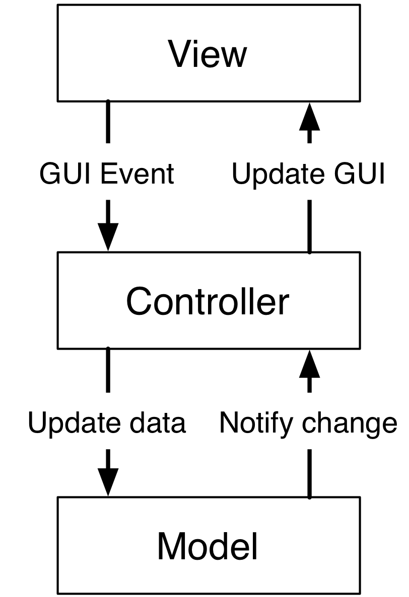

# MVC 变体

# MVC 变体

传统 MVC 作为讨论的出发点是很优秀的，但绝不必被认为是唯一正确的 MVC 实现方式。事实上，我们看到了在现代 UI 开发背景下，传统 MVC 已经过时。围绕基本 MVC 概念和术语构建了新的模式，但增加了额外的技巧、扩展和替代设计选择，以满足现代需求，例如以下内容：

+   模态对话框必须允许更改值，但在按下“取消”按钮时应将其恢复。

+   无模式对话框允许在另一个窗口中可见更改的同时更改值，但如果按下“恢复”则必须恢复。

+   防止输入无效值，例如在应该只接受数字的行编辑中输入字符串将不接受来自非数字按键的任何按键。

+   或者，允许[](GLOSSARY.html)无效[](GLOSSARY.html)的[](GLOSSARY.html)条目，但[](GLOSSARY.html)禁用[](GLOSSARY.html)“确定”按钮，并[](GLOSSARY.html)将不正确的值标记为红色。

+   等等...

正如你所看到的，一个由数百个菜单、文本输入区和按钮组成的应用程序的复杂性以及它们之间所有可能的逻辑依赖关系可能会大大增加。意外的交互和奇怪的通信模式以错误或应用程序冻结的形式出现。通过强制执行结构来保持这种通信网络良好组织和限制是至关重要的。

另外，你可能不得不与你的工具包作斗争，因为它更倾向于 MVC 的特定实现。

设计旨在管理复杂性。本书中提供的 MVC 细节是指导方针，但需要考虑手头的实际问题。需要一定的灵活性。严格遵守通常会产生好处，并且在开发团队内具有更好的沟通一致性，但可能无法扩展到特定情况。在那种情况下，重新考虑设计，或放宽一些约束，但要保持逻辑封装和对象交互简单和直接。

在本章中，我们将研究 MVC 中能够处理更复杂用例场景的替代设计，受到需求、架构需求或自我文档化目的的限制。

# 模型的变体

# 模型的变体

+   合成模型：从多个模型中汇总数据，提供对视图的单一访问点。

+   模型管道：拦截、修改和过滤模型和视图之间的数据流。

+   应用模型：保存视觉状态以补充业务逻辑状态。

+   并排应用程序模型: 持有与当前模型互补的信息。

+   UI 检索模型: 模型通过用户界面元素从用户那里检索信息。

+   模型控制器: 将模型和控制器逻辑聚合在一个单一对象中。

+   本地模型: 保留原始模型状态，以便可以撤销更改。

+   值模型: 将复杂的模型接口简化为简单、通用的接口。

+   代理模型: 充当代理，隐藏访问后端资源的复杂性。

+   集合模型: 持有相同类型的模型对象和聚合模型对象。

+   视图感知模型: 一个了解其视图接口的模型，超出简单的通知传递。

+   缓存模型: 在本地缓存中保存数据以减轻访问速度慢的问题。

+   数据/元数据模型: 将访问慢且庞大的数据与快速、简洁和描述性的数据分开。

+   记录模型: 记录更改以供以后使用。

+   事务设置: 一次设置多个属性，并延迟通知。

# 组合模型

# 合成模型

### 动机

一个[GLOSSARY.html]合成[GLOSSARY.html]模型聚合来自多个模型对象的数据，使视图具有单一且统一的数据访问点。存在两种不同的[GLOSSARY.html]合成[GLOSSARY.html]模型子类型，每种都处理不同的用例：

+   一个**联合[GLOSSARY.html]合成[GLOSSARY.html]模型**执行来自不同来源的同质数据的并集。例如，一个[GLOSSARY.html]联合[GLOSSARY.html]模型可以呈现来自多个文件的数据，每个文件由一个子模型处理。

+   一个**联合[GLOSSARY.html]合成[GLOSSARY.html]模型**从异构模型中提取和组合相关信息，并为结果提供方便的接口。例如，一个`CustomerHistory`模型可以组合`Customers`和`Orders`模型，将组合信息返回给视图。

### 设计

[GLOSSARY.html]合成[GLOSSARY.html]模型既充当监听器又充当通知者。它持有对其子模型的引用，并将自己注册为它们的监听器。它的生命周期可以是临时的，并且与其子模型的生命周期不一致。


个别子模型的通知由合成模型接收并重新发出以通知视图。反之，视图对合成模型发出的数据请求被路由到适当的子模型。


由于其本质，合成模型被期望成为特定视图的唯一终点，至少对于数据检索而言。另一方面，控制器可以：

+   在合成模型上发出更改请求，然后合成模型将根据某些标准将更改请求转发给适当的子模型。因此，合成模型实际上充当代理控制器。

+   在任何子模型上直接发出更改请求。然后子模型将发出通知，该通知由合成模型转发给视图。

值得指出的是，没有什么阻止其他视图（或控制器）直接与任何子模型互动。

上述设计考虑在联合和连接合成模型之间是共同的。它们之间最重要的区别在于它们的接口。联合模型通常具有与其子模型相同的接口，视图可以透明地显示其中任何一个。另一方面，连接模型可能为派生数据提供不同的接口，视图设计为仅针对这个接口。

### 实际示例

一个地址簿应用程序的联合合成模型的实际示例在这里呈现。`AddressBook`类聚合了一个子模型列表，每个子模型从不同的文件源提取数据：

```
csv1_model = AddressBookCSV("file1.csv")
xml_model = AddressBookXML("file.xml")
csv2_model = AddressBookCSV("file2.csv")

address_book = AddressBook([csv1_model, xml_model, csv2_model]) 
```

`AddressBookCSV`的一个天真实现在这里展示，以说明其接口。共同的基类`Model`通过实现`register`、`unregister`、`notify_listeners`和监听器集合提供通知服务

```
class AddressBookCSV(Model):
    def __init__(self, filename):
        super(AddressBookCSV, self).__init__()
        self._filename = filename

    def num_entries(self):
        try:
            return len(open(self._filename, "r").readlines())
        except:
            return 0

    def get_entry(self, entry_number):
        try:
            with open(self._filename, "r") as f:
                line = f.readlines()[entry_number]
                name, phone = line.split(',')
                return { 'name' : name.strip(), 'phone' : phone.strip()}
        except:
            raise IndexError("Invalid entry %d" % entry_number)

    def append_entry(self, name, phone):
        with open(self._filename, "a") as f:
            f.write('{},{}\n'.format(name, phone))

        self.notify_listeners() 
```

`AddressBook`类[](GLOSSARY.html)是一个联合组合模型，实现了相同接口的 SubModels

```
class AddressBook(Model):
    def __init__(self, sub_models):
        super(AddressBook, self).__init__()

        self._sub_models = sub_models

        for m in self._sub_models:
            m.register(self)

    def num_entries(self):
        return sum([m.num_entries() for m in self._sub_models])

    def get_entry(self, entry_number):

        accumulated = itertools.accumulate(
            [m.num_entries() for m in self._sub_models])

        source_idx = [x <= entry_number for x in accumulated].index(False)

        return self._sub_models[source_idx].get_entry(
                               entry_number - accumulated[source_idx])

    def append_entry(self, name, phone):
        self._sub_models[-1].append_entry(name, phone)

    def notify(self):
        self.notify_listeners() 
```

该类在初始化时接受任意数量的 SubModels，并在每个 SubModel 上注册为监听器。它实现了相同的接口，从 SubModels 检索数据：条目数是 SubModel 条目的总和，`get_entry`方法从适当的 SubModel 返回条目。`append_entry`用于向模型添加新条目。在这种情况下，新条目被添加到最后一个 SubModel。注意通知的发出由 SubModel 处理。然后，Compositing Model 将来自 SubModel 的通知转发给其监听器。

# 模型管道

# 模型管道

### 动机

**模型管道**是类似于 UNIX 管道概念的变体：它拦截并操纵从模型流向视图的数据。就像在 UNIX 管道中一样，具有不同操纵逻辑的模型管道可以链接在一起以执行数据的顺序更改。模型管道的典型应用是用于过滤和排序。

### 设计

模型管道封装了数据转换逻辑在一个专用的、可重用的类中。可以创建不同的管道类，每个具有特定的功能。


为了与视图兼容，模型管道实现了与子模型相同的接口，最终扩展它以提供对可能包含的额外状态的访问。例如，过滤模型管道将承载关于当前过滤字符串的数据。对模型管道进行操作的控制器将对这种状态进行操作。

管道模型是子模型的监听器，并转发其事件。此外，当其内部状态以修改生成的数据的方式发生变化时，它会执行通知。


而对子模型数据的操作是直接在子模型本身上执行的。

### 实际示例：Qt QSortFilterProxyModel

Qt 提供了带有排序和过滤功能的管道模型：`QSortFilterProxyModel`。 值得注意的是，Qt 将此模型称为“代理模型”，但在本书的上下文中，代理模型指的是不同的模型设计。

以下代码设置了`MyModel`（我们对`QAbstractItemModel`的实现）和树视图之间的管道模型连接。树视图观察管道模型，而管道模型又将`MyModel`用作数据源。

```
tree_view = QTreeView()
model = MyModel()
pipe_model = QSortFilterProxyModel()
pipe_model.setSourceModel(model)
tree_view.setModel(pipe_model) 
```

模型管道提供了一个适当的接口来配置过滤器，例如`setFilterRegExp`，以及映射例程`mapToSource()`和`mapFromSource()`来在模型中的项的索引和视图中的该项的索引之间进行转换。

注意`tree_view.setModel()`如何接受`QAbstractItemModel`，这由`MyModel`和`QSortFilterProxyModel`都实现。如前所述，这种设计允许视图接受任一模型，并且保持对管道存在的无知。

# 应用程序模型

# 应用程序模型（MMVC）

### 动机

在传统 MVC 中，我们指出 Model 对象不应包含 GUI 状态。在实践中，一些应用程序需要保留和管理仅与可视化相关的状态。传统 MVC 无法容纳它，但我们可以用专门的组合模型来满足这种需求：**应用程序模型**，也称为**演示模型**。其子模型，称为**域模型**，将对此类状态保持不知情。

一个应用模型比领域模型更接近视图，因此能够考虑到它所针对的视图的特定需求：在可滚动的区域中，只有整体模型的一部分可见，它可以保存关于当前可见部分的领域模型的信息，并抑制那些不可见数据的变化通知，以防止无用的刷新。它还可以用于从多个领域模型中提取信息，生成对其视图相关的内容。例如，我们的领域模型可以由代表公司员工、公司部门等对象组成，形成一个相当复杂的网络。如果视图想要显示员工列表，而不管部门如何，也许还带有一个复选框用于选择它们进行进一步处理，那么将数据呈现给视图的应用模型作为列表是很方便的，它可以从领域模型对象（非图形信息）中收集详情，同时跟踪并展示复选框的状态（图形信息）。作为一个缺点，它的可重用性要低得多：只有当多个视图对视觉状态表示达成一致时（例如，当超过转速限制时，我们希望转速表和滑块都变红），多个视图才能与同一个应用模型进行交互。

一些应用模型的实现将其责任推得比纯粹的 GUI 状态更远：它实际上是应用程序的模型，负责直接在应用程序本身上修改应用程序状态。例如，它可能启用/禁用菜单，显示或隐藏小部件，验证事件。大部分的视觉逻辑将由这个模型对象负责，而不是控制器。这种解释对 Dolphin 模型视图 Presenter 有深远的影响，稍后将对其进行详细讨论。

FIXME：应用程序模型代表 GUI 状态，但没有 GUI。它包含启用/禁用复选框等逻辑，例如。FIXME：应用程序模型可以包含选择。

错误：有些逻辑可能无法从视图中提取并放入演示模型，特别是如果这种逻辑深深扎根于视觉状态的图形特征中。例如，依赖于屏幕分辨率或鼠标在窗口内的视觉定位的选项。

### 设计

### 实际例子

为了提供一个实际的例子。想象一下有一个表示引擎的领域模型。

```
class Engine(BaseModel):
   def __init__(self): 
       super(Engine, self).__init__()  
       self._rpm = 0 

   def setRpm(self, rpm):
       if rpm != self._rpm:
           self._rpm = rpm
           self._notifyListeners()

   def rpm(self):
       return self._rpm 
```

初始[](GLOSSARY.html)规格要求通过两个视图来控制每分钟（rpm）的革命值：一个滑块和一个刻度盘。两个视图/控制器对观察和操作一个单一模型。


假设这个简单应用程序增加了一个额外的要求：刻度盘应该在 8000 rpm 以上的潜在损坏 rpm 值上涂成红色，否则为绿色。


我们可以违反传统的 MVC 并向模型添加视觉信息，特别是颜色。

```
class Engine(BaseModel):
  # <proper adaptations to init method>

  def dialColor(self):
     if self._rpm > 8000:
        return Qt.red
     else:
        return Qt.green 
```

使用[](GLOSSARY.html)这个[](GLOSSARY.html)设置，当[](GLOSSARY.html)Dial[](GLOSSARY.html)接收到[](GLOSSARY.html)变化通知时，它可以查询 rpm 的值来调整自身的位置，并为自己适当地着色。然而，Slider 对此信息不感兴趣，现在 Engine 对象携带一个 Qt 对象，增加了对 GUI 的依赖。这降低了在非 GUI 应用程序中重用 Model 的可能性。潜在的问题是 Engine 正在偏离业务性质，现在必须处理视觉性质，这是它不应该关心的事情。此外，如果无法修改 Model 对象，则此方法是不可行的。

另一个解决方案是让 Dial View 在收到通知时决定颜色，就像这样

```
class Dial(View):
   def notify(self):
       self.setValue(self._model.rpm())
       palette = QtGui.Qpalette()

       color = Qt.green
       if self._model.rpm() > 8000:
           color = Qt.red

       palette.setColor(QtGui.Qpalette.Button, color)
       self.setPalette(palette) 
```

一次又一次，这个解决方案是不切实际的，并且有一个补充的原因：视图必须知道什么是一个危险的 rpm 数量，这是一个与业务相关的问题，应该在模型中。这个解决方案可能在某些有限的情况下是可以接受的，当连接值和其视觉表示的逻辑简单时，并且视图被设计成对显示给用户的内容的含义不可知。例如，显示负值为红色的标签可能用于显示银行账户余额。负余额的真正含义，账户透支了，被忽略了。一个更好的解决方案是让 BankAccount 模型对象提供这个逻辑，比如 isOverdrawn()，并且标签颜色应该尊重这个语义，而不是由数字值暗示的语义。

给定上述观点，很明显引擎对象是唯一能知道转速值过高的实体。它必须提供这一信息，将其视觉表示策略留给视图。一个更好的设计提供了一个查询方法`isOverRpmLimit`

```
class Engine(BaseModel):
   <...>
   def isOverRpmLimit(self):
       return self._rpm > 8000 
```

视图现在可以查询模型获取信息并适当地呈现它。

```
class Dial(View):
   def notify(self):
       <...>
       color = Qt.red if self._model.isOverRpmLimit() else Qt.green

       palette.setColor(QtGui.QPalette.Button, color)
       self.setPalette(palette) 
```

这个解决方案尊重业务对象的语义级别，并允许将关于过高转速值的知识保留在适当的位置。这是一个简单状态的可接受解决方案。

有了这个实现，我们现在可以将逻辑和状态从 Dial View 中提取到应用模型 DialEngine 中。结果设计被称为 Model-Model-View-Controller


`DialEngine`将处理有关`Dial`颜色的状态，同时将`rpm`值委托给域模型。视图和控制器将与应用程序模型交互并监听其通知。我们的应用程序模型将按以下方式实现。在初始化程序中，我们在域模型上注册通知，并初始化颜色

```
class DialEngine(BaseModel):
 def __init__(self, engine):
   super(DialEngine, self).__init__()
   self._dial_color = Qt.green
   self._engine = engine
   self._engine.register(self) 
```

`color`的访问器方法只是返回当前值

```
class DialEngine(BaseModel):
    # ...
    def dialColor(self):
        return self._dial_color 
```

两个`rpm`值的访问器简单地委托给域模型

```
class DialEngine(BaseModel):
    # ...
    def setRpm(self, rpm):
        self._engine.setRpm(rpm)

    def rpm(self):
        return self._engine.rpm() 
```

当`DialController`通过上述访问器方法向应用程序模型发出更改请求时，此请求将被转发并将生成更改通知。滑块和应用程序模型将在其通知方法上接收此通知。滑块将更改其位置，应用程序模型将更改其颜色并重新发出更改通知

```
class DialEngine(BaseModel):
    # ...
    def notify(self):
        if self._engine.isOverRpmLimit():  
          self._dial_color = Qt.red
        else: 
          self._dial_color = Qt.green

        self._notifyListeners() 
```

DialView 将处理此通知，查询应用模型（rpm 值和颜色），并重新绘制自身。请注意，在`DialEngine.setRpm`中更改`self._dial_color`，如

```
class DialEngine(BaseModel):
    # ...
    def setRpm(self, rpm):
        self._engine.setRpm(rpm)

        if self._engine.isOverRpmLimit():  
            self._dial_color = Qt.red
        else: 
            self._dial_color = Qt.green 
```

而不是使用之前提供的`notify`解决方案，会引入以下问题： 

+   由于领域模型的外部更改（在我们的情况下，由滑块引起），表盘颜色不会改变。

+   不能保证发出`self._engine.setRpm()`会触发来自领域模型的通知，因为值可能相同。另一方面，应用模型可能会潜在地更改（尽管在这个例子中可能不会），并且应该触发通知给监听者。通过在 DialEngine.setRpm 中添加 self._notifyListeners 调用来解决这个问题将导致在领域模型发出通知时产生两个通知。

FIXME [](GLOSSARY.html)实际上，应用程序模型是一个 UI 模型。FIXME [](GLOSSARY.html)VisualWorks。FIXME [](GLOSSARY.html)应用程序模型可能需要直接与视图或控制器交流，而不是通过通知。

# 并排应用程序模型

# 并排应用程序模型 - 选择模型

### 动机

一个[](GLOSSARY.html)替代[](GLOSSARY.html)之前描述的应用程序模型的方法是将 View 状态保留在一个单独的 Model 中，该 Model 不包装领域模型，而是作为额外的 Model 来补充它。View 依赖于并监听这两个模型。当处理选择时，通常会遇到这种设置：领域模型可能包含一个项目列表，而 View 将此列表显示为可选择的实体。更改选择不会修改领域模型，而是会对选择模型进行操作，通过包含或移除项目来影响选择模型。

当一个视图依赖于两个模型时，通常不会出现问题，前提是这两个模型表示独立的数据。在选择模型的情况下，情况并非如此，必须特别小心处理适当的同步和事件处理。当领域模型发生变化时，这些变化可能会影响选择模型的有效性。因此，必须从领域模型到选择模型进行模型之间的通信，以保持这种有效性。

将[](GLOSSARY.html)考虑为[](GLOSSARY.html)以下[](GLOSSARY.html)场景的[](GLOSSARY.html)示例：一个[](GLOSSARY.html)领域[](GLOSSARY.html)模型[](GLOSSARY.html)包含[](GLOSSARY.html)三个[](GLOSSARY.html)项目[](GLOSSARY.html)A、B 和[](GLOSSARY.html)C。[](GLOSSARY.html)选择[](GLOSSARY.html)模型[](GLOSSARY.html)可能包含[](GLOSSARY.html)第二个[](GLOSSARY.html)元素的[](GLOSSARY.html)序数[](GLOSSARY.html)选择，即 B。如果[](GLOSSARY.html)然而[](GLOSSARY.html)插入[](GLOSSARY.html)一个[](GLOSSARY.html)新的[](GLOSSARY.html)元素[](GLOSSARY.html)A2 在[](GLOSSARY.html)A 和[](GLOSSARY.html)B 之间，[](GLOSSARY.html)选择[](GLOSSARY.html)必须[](GLOSSARY.html)更新为[](GLOSSARY.html)指向[](GLOSSARY.html)第三个[](GLOSSARY.html)元素。如果[](GLOSSARY.html)选择[](GLOSSARY.html)是[](GLOSSARY.html)基于[](GLOSSARY.html)项目的[](GLOSSARY.html)唯一[](GLOSSARY.html)标识符，而不是[](GLOSSARY.html)数字[](GLOSSARY.html)位置，[](GLOSSARY.html)同步[](GLOSSARY.html)将[](GLOSSARY.html)不需要。然而，如果[](GLOSSARY.html)项目[](GLOSSARY.html)B 被[](GLOSSARY.html)移除，一个[](GLOSSARY.html)类似的[](GLOSSARY.html)问题将[](GLOSSARY.html)发生。[](GLOSSARY.html)选择[](GLOSSARY.html)现在[](GLOSSARY.html)将[](GLOSSARY.html)指向[](GLOSSARY.html)一个[](GLOSSARY.html)不存在的[](GLOSSARY.html)项目，并且必须[](GLOSSARY.html)被[](GLOSSARY.html)移除。这些[](GLOSSARY.html)场景[](GLOSSARY.html)需要[](GLOSSARY.html)深入的[](GLOSSARY.html)讨论，这将[](GLOSSARY.html)稍后在[](GLOSSARY.html)本[](GLOSSARY.html)部分中[](GLOSSARY.html)呈现。

选择[](GLOSSARY.html)模型[](GLOSSARY.html)也可以被其他[](GLOSSARY.html)视图或[](GLOSSARY.html)控制器观察或修改，为复杂的选择场景提供了相当数量的灵活性。例如，与菜单操作相关联的控制器可能希望选择所有名称与正则表达式匹配的元素。

[图片]

显然，应用程序模型会继续在域模型上注册自己。

```
class DialViewModel(BaseModel):
  def __init__(self, engine):
  super(DialViewModel, self).__init__()
     self._dial_color = Qt.green
     self._engine = engine
     self._engine.register(self)

  def color(self):
     return self._dial_color

  def notify(self):
     if self._engine.isOverRpmLimit():
        self._dial_color = Qt.red
     else:
        self._dial_color = Qt.green
     self._notifyListeners() 
```

该[](GLOSSARY.html)拨号[](GLOSSARY.html)现在[](GLOSSARY.html)注册到[](GLOSSARY.html)两个[](GLOSSARY.html)模型，并且[](GLOSSARY.html)监听[](GLOSSARY.html)来自[](GLOSSARY.html)两者的通知。

```
class Dial(QtGui.QDial):
  # <....>
  def setModels(self, model, view_model):
     if self._model:
        self._model.unregister(self)
     if self._view_model:
        self._view_model.unregister(self)

     self._model = model
     self._view_model = view_model

     self._controller.setModel(model)
     self._model.register(self)
     self._view_model.register(self)

  def notify(self):
     self.setValue(self._model.rpm())  
     palette = QtGui.QPalette() 
     palette.setColor(QtGui.Qpalette.Button,self._view_model.color())
     self.setPalette(palette) 
```

注意[](GLOSSARY.html) Dial [](GLOSSARY.html)无法区分两个模型中的哪一个在传递消息，以及特别是它可能会被通知两次的情况：一次是由于领域模型的变化，另一次是由于应用程序模型的变化，而应用程序模型的变化本身是由于先前的领域模型变化而触发的。如果通知方法耗时，则可能需要特别注意。另一个应用程序模型使用的情况是具有变化比例的绘图。视图的状态（其比例和定位）是“独立模型”的一部分，仅与视图相关。持有绘图数据的领域模型不应参与缩放因子或绘图限制。

一个[GLOSSARY.html]并排[GLOSSARY.html]解决方案[GLOSSARY.html]经常被用来实现[GLOSSARY.html]选择，这是一个常见的 GUI 范例，用于操作数据子集。所选数据通常具有不同的视觉方面，比如高亮显示或复选框。这些信息随后被用来驱动对指定子集的操作。选择因此具有一个持有既视觉又业务相关状态的二元性质。一个微不足道的策略是直接在领域模型上包含选择状态，例如作为与项目关联的标志。根据应用程序的不同，这可能是或不是一个合适的解决方案：如果两个视图观察相同的模型，并且在一个视图中选择了一个项目，您可能希望或不希望另一个视图获取这些选择信息。例如，一个允许用户从列表中选择元素，但同时也有一个标签显示“已选择 3 个项目”的 GUI 将与领域模型上的选择一起工作。如果选择不能在视图之间共享，或者我们希望将选择保持为一个独立的关注点，一个明智的策略是将其作为一个独立的并排选择模型托管。

一个 GLOSSARY.html)选择模型的问题是它必须对领域模型的变化保持宽容。如果从领域模型中移除所选实体，则必须清除该实体的选择状态。这一点很重要，因为如果选择模型然后用于执行集体操作（例如，更改所有选定项的颜色），则将尝试对领域模型中不再存在的项目执行操作。添加操作也不免问题：选择模型可能必须调整大小以匹配领域模型，以便在查询新条目的选择状态时不会越界。修改可能会重新排序和使领域模型中的索引无效，使选择过时。最后，当领域模型和选择模型之间实现同步时，视图将被通知两次：一次是由于领域模型的更改，再次是由于选择模型的更改。

反选，复杂选择，全选，全不选。如果模型中添加、移除或修改数据，则选择模型必须相应地做出响应。例如，

XXX：指出保持通知中的两种状态分离的重要性，并且处理这两个通知不应该重叠。否则，您将会对相同代码进行双重执行，这可能会耗费时间。还要注意处理第二个通知时必须考虑到两个通知可能处于无效顺序的可能性，这可能会在视图中引入意外的内容匹配（例如，模型通知视图然后选择 vs. 模型通知选择然后视图）。

选择模型既充当视图（用于其他可选择模型）又充当模型（用于视图）。

当 [ 选择 [](GLOSSARY.html) 从 [](GLOSSARY.html) 其 [](GLOSSARY.html) 模型 [](GLOSSARY.html) 接收 [](GLOSSARY.html) 更改 [](GLOSSARY.html) 的 [](GLOSSARY.html) 通知 [](GLOSSARY.html) 时，它 [](GLOSSARY.html) 需要 [](GLOSSARY.html) 检查 [](GLOSSARY.html) 是否 [](GLOSSARY.html) 仍然 [](GLOSSARY.html) 与 [](GLOSSARY.html) 其 [](GLOSSARY.html) 一致 [](GLOSSARY.html)。如果 [](GLOSSARY.html) 不是，它 [](GLOSSARY.html) 需要 [](GLOSSARY.html) 通过 [](GLOSSARY.html) 使其 [](GLOSSARY.html) 状态 [](GLOSSARY.html) 无效来 [](GLOSSARY.html) 恢复 [](GLOSSARY.html)。

需要 [](GLOSSARY.html) 模型 [](GLOSSARY.html) 与 [](GLOSSARY.html) 模型 [](GLOSSARY.html) 之间的 [](GLOSSARY.html) 通信 [](GLOSSARY.html) 以 [](GLOSSARY.html) 保持 [](GLOSSARY.html) 一致性，这变得 [](GLOSSARY.html) 难以 [](GLOSSARY.html) 维护。

指出 [](GLOSSARY.html) 什么 [](GLOSSARY.html) 数量 [](GLOSSARY.html) 的 [](GLOSSARY.html) rpm [](GLOSSARY.html) 是 [](GLOSSARY.html) 太 [](GLOSSARY.html) 高 [](GLOSSARY.html) 的 [](GLOSSARY.html) 是 [](GLOSSARY.html) 领域 [](GLOSSARY.html) 逻辑，以及 [](GLOSSARY.html) 什么 [](GLOSSARY.html) 颜色 [](GLOSSARY.html) 它 [](GLOSSARY.html) 应该 [](GLOSSARY.html) 是 [](GLOSSARY.html) 是 [](GLOSSARY.html) 视图 [](GLOSSARY.html) 逻辑。

# UI 检索模型

# UI 检索模型

### 动机

关于 [](GLOSSARY.html) 我们 [](GLOSSARY.html) 在 [](GLOSSARY.html) 整本书 [](GLOSSARY.html) 中 [](GLOSSARY.html) 强调 [](GLOSSARY.html) 的 [](GLOSSARY.html) 模型 [](GLOSSARY.html) 的 [](GLOSSARY.html) 一个 [](GLOSSARY.html) 重要 [](GLOSSARY.html) 约束 [](GLOSSARY.html) 是 [](GLOSSARY.html) 它 [](GLOSSARY.html) 绝不 [](GLOSSARY.html) 参与 [](GLOSSARY.html) 与 [](GLOSSARY.html) GUI 相关的 [](GLOSSARY.html) 业务。**UI [](GLOSSARY.html) 检索模型** 打破了 [](GLOSSARY.html) 这个 [](GLOSSARY.html) 规则。

在模型的任务之一是从数据源（如文件、内存或数据库）检索信息。在某些情况下，模型可能必须检索只有与用户直接会话才能提供的信息。我们可以打破规则，让模型创建一个 UI 对话框，询问用户这些信息。换句话说，模型将用户视为一个数据库，其 API 包括使用图形小部件。

### 设计

UI 检索模型的交互图设计如图所示


设计的核心是短暂存在的`UserUI`对象。在其最基本形式中，此对象是模态对话框，提示用户并等待输入。对话框的模态性质确保了操作的同步处理。

一旦对话框关闭，值将被收集并返回给请求的客户端。根据检索到的信息的性质，对于模型来说，将其缓存而不是再次提示用户可能会有所用处。

### 实际例子

此模式的一个微不足道的例子将是一个代表用户会话的模型对象，初始设置为`None`的密码字段。当程序启动会话时，它将向模型层请求凭据。询问用户名将返回正确的字符串，但询问密码可能会返回 None，如果尚未设置密码。然后，模型被授权从用户检索此信息，通过 GUI 对话框，也许首先尝试一些非交互式策略，如检查配置文件中的信息。

```
class Model(object):
    def get_password(self):
        if self._password is None:
            password, ok = QtGui.QInputDialog.getText(
                None, 
                "Please input your password", 
                "Password:", 
                QtGui.QLineEdit.Password)                                                

            if ok:
                self._password = password

        return self._password    

    def clear_password(self):
        self._password = None 
```

当用户在对话框上操作时，Model 存储密码并将其返回给 Presenter 层，然后继续进行身份验证逻辑，如果结果是字符串。如果密码被发现不正确，Controller 将要求 Model`clear_password()`，然后用户将再次被提示。

# ModelController

# ModelController

### 动机

在某些实现中，Model 状态可能很小，并且只与特定的 View 相关，这使得 Model 和 Controller 类之间的分割过多。合并这些类会导致一个**ModelController**，它可以被视为一个"具有 GUI 智能的 Model"，或者是一个"具有状态的 Controller"。

与传统的 MVC 解决方案相比，ModelController 具有以下缺点：

+   如开头段落所述，它使得处理多个视图变得复杂。

+   如果需要解释纯粹的 UI 事件，它可能会对 UI 层带来依赖性。这会使得它在 UI 应用程序之外的重用变得复杂。

+   由于上述原因，它通常不够灵活，不够可重用，并且更加复杂，以进行测试。

第一个要点的动机是双重的：首先，控制器部分必须区分是哪个视图发送了事件。其次，不同的视图可能具有不同的视觉实现，因此会生成不同类型的事件。ModelController 接口必须适应所有视图的命名和行为，导致接口臃肿和复杂。

ModelController 方法并不一定是错误的，但倾向于变得脆弱，并且承担过多的责任。因此，它仅限于简单的情况。

### 设计

[](GLOSSARY.html)ModelController[](GLOSSARY.html)承载逻辑，以响应 UI 事件操纵其内部状态，应用一致性和业务逻辑，同时处理来自 View 的事件：

+   [](GLOSSARY.html)View[](GLOSSARY.html)将 UI 事件分派给[](GLOSSARY.html)ModelController。

+   [](GLOSSARY.html)ModelController[](GLOSSARY.html)改变其状态并通知 View 变化。

+   [](GLOSSARY.html)View[](GLOSSARY.html)从[](GLOSSARY.html)ModelController 请求新的状态，并更新自身。


### 实际例子

简单地说，一个[](GLOSSARY.html)ModelController[](GLOSSARY.html)类保存状态，而不是将其委托给一个[](GLOSSARY.html)Model[](GLOSSARY.html)对象。

```
class ModelController(Model):
    def __init__(self):
        self._value = 0

    def button_pressed(self):
        self._value += 1
        self.notify_listeners() 
```

这个[](GLOSSARY.html)模式[](GLOSSARY.html)可以在[](GLOSSARY.html)Enthought [](GLOSSARY.html)Traits 中观察到。

```
from traits.api import *
from traitsui.api import *

class ModelController(HasStrictTraits):
    value = Int(0)
    increment_btn = Button()

    traits_view = View(
        Item("value"),
        UItem("increment_btn", label="Increment"),
        )

    def _increment_btn_fired(self):
        self.value += 1

mc = ModelController()
mc.configure_traits() 
```

上述代码，感谢 Traits/TraitsUI 框架，生成一个包含可编辑文本字段（显示值为零）和一个 PushButton 的窗口。每次按下按钮时，都会调用`_increment_btn_fired`处理程序。根据类和框架的设计，该类是一个 ModelController，因为它既保存 Model 状态（`value`）又承担 Controller 职责（`_increment_btn_fired`）。虽然看不见，但验证逻辑也在 ModelController 中由 Traits 框架执行，拒绝不符合整数格式的文本字段中的值。

# 值模型

# 值模型

### 动机

一个值模型是一个适配器类，从被适配者（SubModel）中提取单个值。提取的值通过统一且简单的接口暴露：一个 getter `ValueModel.value()`，一个 setter `ValueModel.set_value()`，以及通知。

使用值模型的视图和控制器可以非常简单和通用，只要它们能够处理值模型的接口。它们可以忽略适应的子模型的性质，将处理细节的责任留给值模型。

### 设计

值模型类充当适配器


一个[](GLOSSARY.html)简单的[](GLOSSARY.html)值模型[](GLOSSARY.html)的实现可能是：

```
class ValueModel(Model):
    def __init__(self, sub_model):
        self._sub_model = sub_model

    def set_value(self, value):
        # do potentially complex logic on self._sub_model
        # to appropriately manipulate the passed value
        # This method triggers a self.value_changed notification.

    def value(self):
        # do potentially complex logic on self._sub_model
        # to extract a single value 
```

许多不同的[](GLOSSARY.html)值模型[](GLOSSARY.html)类可以被实现，每一个都适应不同的子模型，或者在子模型的不同部分操作。视图和控制器通过极简的接口与值模型交互，因此对使用的值模型不可知。

### 实际示例

通过两个值模型：`NameValueModel` 和 `SurnameValueModel`，一个[](GLOSSARY.html)可以[](GLOSSARY.html)适应一个`Customer`对象。

```
class NameValueModel(Model):
    def __init__(self, customer):
        self._customer = customer

    def set_value(self, value):
        self._customer.name = value
        self.notify_observers()

    def value(self):
        return self._customer.name

class SurnameValueModel(Model):
    def __init__(self, customer):
        self._customer = customer

    def set_value(self, value):
        self._customer.surname = value
        self.notify_observers()

    def value(self):
        return self._customer.surname 
```

每个[](GLOSSARY.html)这两个[](GLOSSARY.html)ValueModels[](GLOSSARY.html)可以使用现成的`StringWidget`视图，与实际的`Customer`模型的性质无关，并通过 Value Model 接口检索/修改数据。

# 代理模型

# 代理模型

* * *

**注意**：在 Qt MVC 的上下文中，代理模型是一种模型管道设计。Django 也定义了代理模型的概念，但与此处表达的概念无关：将代理设计模式应用于模型对象。

* * *

### 动机

我们希望访问外部资源，比如由 HTTP 服务器或数据库提供的资源。代理模型封装了访问远程服务所需的逻辑，具体包括：

+   发出请求到远程服务

+   处理错误条件

+   将接收到的数据转换为对客户端代码有用的表示形式。

另外，代理模型可以：

+   在短时间内限制过多的请求次数

+   缓存[](GLOSSARY.html)获取的[](GLOSSARY.html)结果，并[](GLOSSARY.html)管理[](GLOSSARY.html)缓存[](GLOSSARY.html)过期

+   观察远程服务的变化，例如通过在辅助线程上进行轮询。

### 设计

代理模型的设计通常取决于其所代表的服务。接口设计遵循远程服务的抽象。当客户端代码请求数据时，模型向服务提供者发出相应的请求。客户端代码通常不知道代理模型暴露的后端的确切性质。


当模型实现对特定数据库表的 SQL 访问时，生成的代理模型通常称为**表数据网关**。该模型的实例表示整个后端数据库表，而不是特定行，其方法提供对 CRUD 操作的访问。

### 实际例子：Django 模型

一个简单的 Django 模型提供了代理模型的示例。

```
from django.db import models

class Person(models.Model):
    first_name = models.CharField(max_length=30)
    last_name = models.CharField(max_length=30) 
```

对于上面给定的类定义，Django 的内部会创建一个 SQL 表，其列由类属性（`first_name`和`last_name`）定义。`Person`类的实例表示为表行。

`Person`类可以实例化，存储在数据库中，修改或用于检索已经存在的实例。

```
person = Person(first_name="A.", last_name="Einstein")
person.save()

person.first_name = "Albert"
person.save()

another_person = Person.objects.get(last_name="Galilei") 
```

在底层，Django 模型实现将操作转换为 SQL 语句。

### 实际示例：Thrift 服务

Thrift 提供了另一个代理模型的示例，它是一个跨语言的远程过程调用框架。接口定义语言指定了远程服务的接口

```
service Calculator {
   i32 add(1:i32 num1, 2:i32 num2),
} 
```

将其编译为 Python 以生成以下代码

```
class Client(Iface):
  def __init__(self, iprot, oprot=None):
    self._iprot = self._oprot = iprot
    if oprot is not None:
      self._oprot = oprot
    self._seqid = 0

  def add(self, num1, num2):
    """
    Parameters:
     - num1
     - num2
    """
    self.send_add(num1, num2)
    return self.recv_add()

  def send_add(self, num1, num2):
    self._oprot.writeMessageBegin('add', TMessageType.CALL, self._seqid)
    args = add_args()
    args.num1 = num1
    args.num2 = num2
    args.write(self._oprot)
    self._oprot.writeMessageEnd()
    self._oprot.trans.flush()

  def recv_add(self):
    iprot = self._iprot
    (fname, mtype, rseqid) = iprot.readMessageBegin()
    if mtype == TMessageType.EXCEPTION:
      x = TApplicationException()
      x.read(iprot)
      iprot.readMessageEnd()
      raise x
    result = add_result()
    result.read(iprot)
    iprot.readMessageEnd()
    if result.success is not None:
      return result.success
    raise TApplicationException(TApplicationException.MISSING_RESULT, 
                                "add failed: unknown result") 
```

上述代理处理了网络交换的复杂性，为客户端代码提供了简单的接口

```
result = client.add(3, 4) 
```

### 参考

+   Martin Fowler，“企业应用架构模式”。Addison-Wesley，2003 年。

+   Django - [`www.djangoproject.com/`](https://www.djangoproject.com/)

+   Apache Thrift - [`thrift.apache.org/`](https://thrift.apache.org/)

# 集合模型

# 集合模型

### 动机

集合模型是子模型的一个开放式容器。它在概念上类似于合成模型，但相似之处仅在表面上。合成模型：

+   可能定制为特定数量的子模型。

+   可能持有不同类型的子模型，处理和平滑它们的差异。

+   目的是统一来自其子模型的数据，以便它们的差异和分离对视图隐藏。

另一方面，集合模型：

+   是一个开放的、潜在为空的子模型列表。

+   包含的子模型是相同类型的。

+   集合及其子模型具有独立的性质，集合的目标不是隐藏子模型的内在分离，而是将它们视为一组。

集合模型的一个微不足道的例子是包含`Song`对象的`Album`。

### 设计

集合模型 被设计为 当 添加、 删除 或 移动 子模型时 通知 其 侦听器。 在 某些 情况下， 集合 模型 还可以 通知 侦听器 任何 其 子模型 发生了 更改。


更 复杂 的 实现 可能想要提供 事件 和 界面 用于 批量 添加、批量删除，或者 批量移动 子模型。 合格 的 消息 可以 通知 侦听器 发生了什么 类型的 更改，以及 哪些 子模型 受到 影响。

### 实际 例子

Backbone.js 缓存模型 集合 实现了 集合 模型。下面的 代码 代表了上面描述的 API 的 示例。

```
var album = new Backbone.Collection;

album.on("add", 
         function(song) {
            alert("Song added callback executed.");
         }
);

album.add([
  {name: "Mozart collection"},
]); 
```

### 参考资料

+   Backbone.js - [`backbonejs.org/`](http://backbonejs.org/)

# 缓存模型

# 缓存模型

### 动机

当 作为 数据 源的 代理 时， 模型 可能 想要 缓存 信息，这些数据源可能 是 缓慢、不可靠的，或者 有 访问 限制 或 成本。 典型 的 例子 包括 网络 服务、数据库、磁盘访问，或者 当信息是 通过 长时间运行的计算 获取时。

通常使用 缓存 会带来以下 优势：

+   在第一次访问后给出更快的响应，提高应用程序的感知性能

+   中和数据源潜在的临时故障，提高可感知的可靠性

+   当访问远程资源时，防止对资源的重复和频繁请求。在这种情况下未实现缓存通常会导致远程资源的管理员做出安全响应（例如限流或拒绝访问）。

然而，缓存带来一系列责任：

+   增加应用程序的内存占用以存储缓存数据

+   模型可能向其客户返回过时的信息

+   在多用户 Web 应用程序中，缓存数据可能包含关键的安全信息，因此不得泄霩给意外的接收者。

### 设计

典型的缓存模型设计涉及以下步骤从源中检索数据：

1.  视图[](GLOSSARY.html)试图从模型中检索一些信息。

1.  模型首先尝试从缓存中获取这些信息。

1.  如果未找到所需的信息，模型将向数据源查询，获取结果，将其添加到缓存中，并将其返回给视图。

1.  从模型中额外尝试检索相同信息将从缓存中提取数据。


当在`get`请求期间传递参数时，缓存必须对这些参数进行索引，以确保检索到预期的信息。例如，如果一个模型类`UserRepository`有一个方法`get_user_data(user_id)`，这个方法必须使用参数`user_id`从缓存中执行预期的检索。

要在模型上执行`set`操作，有两种策略是可能的。第一种是在慢数据源上应用变更操作，然后要么进行类似的更新，要么使缓存数据无效。这种策略有以下注意事项：

+   如果预计`set`操作以非平凡方式更改数据源，可能无法使用相同的业务逻辑对缓存数据进行明智的更改。相反，应该删除缓存数据，以促进在下一次`get`操作时进行新的检索。

+   [](GLOSSARY.html)操作需要往返到缓慢的数据源，这会对 UI 级别产生影响（必须报告失败，正在进行的操作需要呈现合理的进度条，感知性能可能会受到影响），同时也会对应用程序设计级别产生影响（如果需要重复的`set`操作，每次都执行往返到数据源是浪费的并且影响性能）。

第二种可能的策略是更新缓存数据并延迟数据源更新，可能将多个更改捆绑成一个请求。使用这种解决方案，缓存在提交到数据源之前不能驱逐已更改的信息。对于在客户端之间共享的资源，或者在应用程序崩溃或网络故障的情况下，可能存在进一步的问题，其中更改的内容只提交了部分或根本没有提交。

模型的客户端可能需要意识到缓存的存在，如果他们想要保证最新的数据，或者需要强制刷新对远程服务的更改。

### 缓存策略

选择适当的缓存策略是一个复杂的主题，远超出本书的范围。需要考虑几个因素，如数据访问模式、设计的特定要求和应用行为，以及数据一致性。

要展示许多可能性中的一些，最琐碎的策略是简单地执行结果的记忆化。使用记忆化的模型有效地使用一个永不过期的缓存。缓存的大小可以通过丢弃最近最少使用（LRU）数据来控制。

LRU [](GLOSSARY.html)约束了缓存的大小，并保留了最近使用的数据，但没有提供可预测的过期策略，这对某些应用可能是必需的。例如，从网站检索信息的新闻滚动应用可能希望使缓存数据失效并执行新的检索，希望在固定的绝对超时（例如 15 分钟）后获得更新的信息。其他应用程序可能更喜欢滑动过期策略：只有在一定时间内未访问的情况下才会使缓存数据过期（例如 5 分钟，但如果再次请求，则倒计时重置为零），或者当在模型对象上发出显式方法调用时。更智能的策略可能使用小的有效载荷请求询问远程服务是否有新的或更改的数据可用，并根据情况采取行动，通过检索新数据或返回缓存的信息。

常用的额外 [](GLOSSARY.html) 优化包括预取式 [](GLOSSARY.html) 缓存和优先级 [](GLOSSARY.html) 缓存。预取式 [](GLOSSARY.html) 缓存存储可能很快访问的模型 [](GLOSSARY.html) 数据，即使未直接请求。例如，在从社交网络网站检索有关给定用户的信息时，智能缓存引擎可以决定检索其最近的图片并填充图片模型对象的缓存；优先级缓存允许考虑不同的逐出优先级级别，先删除低优先级的数据，然后删除高优先级的数据。

# 数据/元数据模型

# 数据/元数据模型

### 动机

数据/元数据 [](GLOSSARY.html) 模型将信息分为两个类别：

+   *数据*：慢、沉重的 [](GLOSSARY.html) 信息，表示内容

+   *元数据*：快速、轻量级的 [](GLOSSARY.html) 信息，描述内容

这个[GLOSSARY.html]区别通常是由对模型对象的需求驱动的，以提供对浏览所需信息的精简访问，以及对处理所需信息的资源消耗访问。

### 设计

[GLOSSARY.html]模型类[GLOSSARY.html]实现了对数据和元数据的 getter 方法。

+   数据方法可能会惰性地检索信息，可能会分批次进行。如果信息的大小过大，则可能无法进行缓存。

+   元数据方法可能会惰性地检索，也可能不会，尤其是在由网络支持时可能会使用缓存。

文档中的清晰度对于传达检索的相关成本至关重要。

### 实例

图像处理程序可能有一个`Movie`模型对象来表示磁盘上的图像文件。

```
class Movie(Model):
    def __init__(self, filename):
        self._filename = filename
        self._thumbnail = _extract_thumbnail(filename)
        self._length = _extract_length(filename)
        self._name = _extract_name(filename)

    # Metadata
    def thumbnail(self):
        return self._thumbnail

    # <similar getters for the remaining metadata>

    # Data
    def contents(self):
        # <...> 
```

`thumbnail`、`length`和`name`等属性代表对电影浏览器有用的精简信息。这些信息在对象实例化时从文件中提取并保存在内存中。

另一方面，`contents()`方法直接从[](GLOSSARY.html)磁盘[](GLOSSARY.html)检索[](GLOSSARY.html)电影[](GLOSSARY.html)数据，并使其可用于[](GLOSSARY.html)额外的[](GLOSSARY.html)处理（例如解码和显示）。

# 记录模型

# 记录模型

### 动机

一个[](GLOSSARY.html)记录[](GLOSSARY.html)模型[](GLOSSARY.html)维护[](GLOSSARY.html)其[](GLOSSARY.html)状态发生的更改的日志。这些[](GLOSSARY.html)信息[](GLOSSARY.html)可以[](GLOSSARY.html)被[](GLOSSARY.html)外部[](GLOSSARY.html)客户端[](GLOSSARY.html)代码使用，例如，仅在[](GLOSSARY.html)可视化[](GLOSSARY.html)信息[](GLOSSARY.html)发生变化时执行刷新，或执行撤销。

这[](GLOSSARY.html)种[](GLOSSARY.html)技术[](GLOSSARY.html)带来[](GLOSSARY.html)了[](GLOSSARY.html)忘记[](GLOSSARY.html)清除[](GLOSSARY.html)日志的风险，导致[](GLOSSARY.html)内存[](GLOSSARY.html)耗尽。

### 实际例子

以下[](GLOSSARY.html)示例[](GLOSSARY.html)展示了一个[](GLOSSARY.html)记录[](GLOSSARY.html)其[](GLOSSARY.html)属性变化的[](GLOSSARY.html)模型类

```
class Customer(Model):
    def __init__(self):
        self._changes = { 
            "name": [],
            "surname": [],
            "address": []
        }
        self._name = None
        self._surname = None
        self._address = None

    def set_name(self, name):
        old_name = self._name
        self._name = name
        self._changes["name"].append((old_name, name))
        self.notify_listeners()

    # <similar code for set_surname/set_address

    def changes(self, property_name):
        return self._changes[property_name]

    def clear_changes():
        for changes in self._changes.values():
            del changes[:] 
```

[](GLOSSARY.html)设置器[](GLOSSARY.html)记录[](GLOSSARY.html)self._changes 字典中的更改。执行[](GLOSSARY.html)以下[](GLOSSARY.html)操作

```
c = Customer()
c.set_name("Rob")
c.set_name("Robert") 
```

将[](GLOSSARY.html)生成[](GLOSSARY.html)一个`self._changes["name"]`列表，其中包含两个元素：第一个过渡`(None, "Rob")`，第二个过渡`("Rob", "Robert")`。

### 变体：记录更改的顺序

上述给出的解决方案不记录例如，姓氏是在名字之前还是之后更改的情况。另一种实现可以通过例如使用列表而不是字典来存储此信息，例如使用`self._changes`。

```
class Customer(Model):
    def __init__(self):
        self._changes = []
        # <...>

    def set_name(self, name):
        # <...>
        self._changes.append(("name", old_name, name))
        # <...>

    def changes(self):
        return self._changes 
```

### 变体：仅对最后一次变化感兴趣

日志长度可以被限制，可能只到单个更改，通过简单地用最新的更改信息替换先前的更改信息。这种方法还消除了忘记清除日志的责任。

```
class Customer(Model):
    de f __init__(self):
        self._last_change = None
        # <...>

    def set_name(self, name):
        # <...>
        self._last_change = ("name", old_name, name)
        # <...>

    def last_change(self):
        return self._last_change 
```

# 交易设置

# 交易设置

### 动机

您的模型[](GLOSSARY.html)具有多个可设置的属性，每个属性都由视图独立监听。业务逻辑要求设置两个或更多属性以达到期望的最终模型状态。每次设置操作都会触发通知，如下所示：

1.  在模型上设置[](GLOSSARY.html)属性 A[](GLOSSARY.html)

1.  视图[](GLOSSARY.html)被通知[](GLOSSARY.html)变化

1.  在模型上设置属性 B[](GLOSSARY.html)

1.  视图[](GLOSSARY.html)被通知[](GLOSSARY.html)变化

在[GLOSSARY.html]步骤[GLOSSARY.html]2 期间，监听器[GLOSSARY.html]将被[GLOSSARY.html]通知[GLOSSARY.html]变化[GLOSSARY.html]并[GLOSSARY.html]与[GLOSSARY.html]模型[GLOSSARY.html]同步[GLOSSARY.html]，其中[GLOSSARY.html]只有[GLOSSARY.html]一个[GLOSSARY.html]属性[GLOSSARY.html]已经[GLOSSARY.html]被[GLOSSARY.html]更改。根据[GLOSSARY.html]您的[GLOSSARY.html]模型[GLOSSARY.html]和[GLOSSARY.html]视图的[GLOSSARY.html]具体[GLOSSARY.html]细节，这种[GLOSSARY.html]状态[GLOSSARY.html]可能[GLOSSARY.html]是[GLOSSARY.html]不一致的[GLOSSARY.html]或[GLOSSARY.html]不可[GLOSSARY.html]由[GLOSSARY.html]视图[GLOSSARY.html]表示的[GLOSSARY.html]。然而，设置[GLOSSARY.html]和[GLOSSARY.html]通知[GLOSSARY.html]单个[GLOSSARY.html]属性[GLOSSARY.html]可能[GLOSSARY.html]仍然[GLOSSARY.html]需要[GLOSSARY.html]特定[GLOSSARY.html]用例[GLOSSARY.html]。

所需[GLOSSARY.html]目标[GLOSSARY.html]是[GLOSSARY.html]仅在[GLOSSARY.html]所有[GLOSSARY.html]设置[GLOSSARY.html]操作[GLOSSARY.html]完成后[GLOSSARY.html]触发[GLOSSARY.html]通知[GLOSSARY.html]，如下所示：

1.  设置[GLOSSARY.html]A[GLOSSARY.html]属性[GLOSSARY.html]而不[GLOSSARY.html]通知

1.  设置[GLOSSARY.html]B[GLOSSARY.html]属性[GLOSSARY.html]而不[GLOSSARY.html]通知

1.  视图[GLOSSARY.html]被[GLOSSARY.html]通知[GLOSSARY.html]变化

### 设计

事务性[GLOSSARY.html]设置[GLOSSARY.html]是[GLOSSARY.html]实现[GLOSSARY.html]动机[GLOSSARY.html]中[GLOSSARY.html]概述的[GLOSSARY.html]结果[GLOSSARY.html]的[GLOSSARY.html]最[GLOSSARY.html]琐碎的[GLOSSARY.html]策略[GLOSSARY.html]，其他[GLOSSARY.html]策略[GLOSSARY.html]包括[GLOSSARY.html]使用[GLOSSARY.html]懒惰[GLOSSARY.html]模型[GLOSSARY.html]或[GLOSSARY.html]累加器，稍后[GLOSSARY.html]检查。

事务性设置实现了一个接受两个属性的设置器函数。这个设置器函数修改了对象的状态，然后发出变更通知。

### 实际例子

代表与远程主机的网络连接的模型可能希望提供功能来同时更改主机、端口或两者。如果有任何监听器负责启动网络连接，则只有当模型包含正确的主机信息时才应传递通知。

```
class Connection(Model):
    def set_host(self, host):
        self._host = host
        self.notify_listeners()

    def set_port(self, port):
        self._port = port
        self.notify_listeners()

    def set_host_and_port(self, host, port):
        self._host = host
        self._port = port
        self.notify_listeners() 
```

没有 `set_host_and_port()` 方法，从 `http://one.example.com:80` 重新连接到 `http://two.example.com:8080` 将会触发一个不良连接到 `http://one.example.com:8080`（当调用 `set_port(8080)` 时）或到 `http://two.example.com:80/`（当调用 `set_host("two.example.com")` 时）。

由于显而易见的原因，`set_host_and_port()` 方法不能重用独立的设置器，因此必须重新实现设置逻辑。如果这个逻辑很复杂，将其提取到一个单独的“静默设置器”方法中可能是一个很好的做法。

### 变体 1：合格通知

如果模型执行合格通知，则在没有事务设置的情况下的行为将是

1.  在模型上设置 A[](GLOSSARY.html)属性

1.  视图[](GLOSSARY.html)被通知 A[](GLOSSARY.html)更改

1.  在模型上设置 B[](GLOSSARY.html)属性

1.  视图[](GLOSSARY.html)被通知 B[](GLOSSARY.html)更改

事务性[](GLOSSARY.html)设置[](GLOSSARY.html)将[](GLOSSARY.html)提供[](GLOSSARY.html)执行[](GLOSSARY.html)以下[](GLOSSARY.html)顺序的方法：

1.  在模型上设置 A[](GLOSSARY.html)属性

1.  在模型上设置 B[](GLOSSARY.html)属性

1.  视图[](GLOSSARY.html)被通知 A[](GLOSSARY.html)更改

1.  视图[](GLOSSARY.html)被通知 B[](GLOSSARY.html)更改

或者如果资格协议允许一次传递有关多个更改的信息

1.  在模型上设置 A[](GLOSSARY.html)属性

1.  在模型上设置 B[](GLOSSARY.html)属性

1.  视图[](GLOSSARY.html)被通知 A+B[](GLOSSARY.html)更改

### 变体 2：设置/添加多个项目

事务设置也可用于一次添加多个元素，通常用于模拟作为列表的模型行为。模型可能希望实现一个接口，用于添加一个或多个元素。实现通常充当一种语法糖，生成一个带有一个项目的列表。

```
class BookCollection(Model):
    def add_book(self, book):
        self.add_books([book])

    def add_books(books):
        self._books.extend(books)
        self.notify_listeners() 
```

# 通知策略的变种

# 通知策略的变种

+   合格通知：以增强语义传递通知，通知监听者有关发生了什么变化。

+   带订阅的合格通知模型：视图订阅特定事件，仅在其发生时收到通知。

+   被动模型：没有通知功能的模型。

+   惰性模型：在明确请求时传递其通知的模型。

+   累加器：监听子模型并将多个通知压缩成单个通知。

+   前/后通知：在更改之前或之后传递通知。

+   否决者：询问监听者批准或拒绝发生变化。

+   信号：将通知隔离到一个单独的对象中。

# 合格通知

# 合格通知

### 动机

模型通知的最基本形式是不合格的：视图只是被告知模型状态发生了变化。作为响应，视图检索新的模型状态并相应地重新绘制自己。这种方法简单但粗糙。考虑以下情景：

+   特定视图仅对模型的子集感兴趣。模型会发生变化，但与视图相关的数据不会改变。即使显示的数据实际上没有改变，视图也会被迫重新绘制。

+   视图具有额外的状态，由完全重绘销毁。例如，表示目录中文件的 TreeView 保留了打开/关闭子分支的状态。如果添加了新文件并且强制重新扫描和重绘视图，则打开/关闭状态将被丢弃。了解变化的性质将有助于处理这种情况。

+   视图从完整模型的内容执行重绘需要很长时间，但如果它只知道变化，它可以更快地运行。

一个合格通知通过增强通知系统，使用更精细的协议携带有关模型中发生的变化的信息，解决了上述情况。

### 设计

通过向视图的`notify()`方法传递参数来实现合格通知。当模型发生更改并在订阅的视图上调用此方法时，它会传递有关

+   改变的主题（*例如*，哪个模型属性已更改）

+   改变的性质（*例如*，先前和新值）

以下示例实现轻松满足上述设计

```
class View():
    def notify(self, name, old_value, new_value):
        # ... 
```

不幸的是，这种解决方案不能一次通知多个属性的更改。此外，它不支持多个模型通知相同的视图，因为视图无法区分哪个模型正在报告更改。

一个更灵活的方法由以下实现给出

```
class View():
    def notify(self, change_info):
        # ... 
```

其中`change_info`是[](GLOSSARY.html)描述改变的增强细节的[](GLOSSARY.html)字典或[](GLOSSARY.html)其他[](GLOSSARY.html)数据[](GLOSSARY.html)对象。模型[](GLOSSARY.html)负责创建[](GLOSSARY.html)和填充这个[](GLOSSARY.html)数据[](GLOSSARY.html)对象，以便对[](GLOSSARY.html)接收的视图有意义。作为设计的副作用，视图不再需要查询模型的状态。相反，它通过改变信息保持同步。

大多数现代 MVC 框架以一种形式或另一种形式（例如绑定属性或信号）提供有资格的通知。不合格的报告是不常见的，但作为一种策略并非完全可忽视，特别是对于模型中没有可利用的细粒度，或者视图无法利用细粒度通知的情况。

# 有资格的通知模型与订阅

# 有资格的通知与订阅

### 动机

在这种变体的合格通知中，监听器指定其感兴趣的更改，并且只有发生相关更改时才会发出通知。因此，这两种解决方案在执行不必要通知的过滤实体方面存在差异：在合格通知中，过滤是在通知传递后由监听器执行的，而在具有订阅的合格通知中，过滤是由模型执行的，遵守监听器的注册指令。

### 设计

对于具有订阅的合格通知，模型必须支持：

+   一个适合`register()`方法的签名，允许指定监听器感兴趣的修改类型。

+   在内部注册表中保留传递的信息，这些信息将在通知期间使用。

当模型内容发生变化时，必须查询其内部注册表以验证是否有监听器对此信息感兴趣。如果是这种情况，模型则通知监听器。

### 实例：Apple KVO（键值观察器）

Apple KVO（键值观察器）是一种具有订阅的合格通知形式。模型支持`addObserver`方法，其签名允许指定

监听器感兴趣的属性及变化类型。例如，监听器使用以下调用注册对模型属性`my_property`的更改

```
[model addObserver:destination
       forKeyPath:@"my_property"
       options:NSKeyValueChangeNewKey
       context:nil]; 
```

当`my_property`值发生变化时，监听器的方法`observeValueForKeyPath:ofObject:change:context:`将在监听器上调用。其他模型属性的更改将不会传递。

### 参考资料

+   [键值观察编程指南](https://developer.apple.com/library/mac/documentation/Cocoa/Conceptual/KeyValueObserving/KeyValueObserving.html)

+   [KVO 有害论](http://khanlou.com/2013/12/kvo-considered-harmful/)

# 被动模型

# 被动模型

### 动机

传统的 MVC 使用所谓的**主动模型**：当模型发生变化时，其监听器会被通知变化。它的对应物是**被动模型**，它不提供通知服务。相反，这个任务由控制器执行。

被动模型在基于 Web 的 MVC 中有其卓越的领域，其中 HTTP 协议的基本性质阻止模型通知视图。它也适用于所有那些无法产生通知的情况，因为数据源无法提供此服务，比如大多数数据库或纯文本文件。

### 设计

交互图显示了被动模型的行为


具体来说，事件序列是：

1.  控制器修改模型

1.  控制器通知视图更新自身

1.  现在视图查询模型内容，就像在主动情况下一样。

[](GLOSSARY.html)Passive Model 的主要短板是，如果多个 Controllers 可以修改 Model，Views 会出现不同步。Controllers 之间的协作可以防止这种不同步，但在实际应用中，Active Model 很快就会成为更好的解决方案。如果需要，Passive Model 可以通过继承或使用满足 Passive Model 原始接口的包装类迅速变为 Active。这个包装类将接收来自 Controllers 的更改请求，将其委托给 Passive Model，最后通知监听者。

尽管有缺点，Passive Model 具有以下重要优点：

+   任何对象（例如键值字典、列表、单个值、先前开发的业务对象）都可以在不修改的情况下用作 Model。

+   它[](GLOSSARY.html)允许更好地控制视图的刷新。控制器可以对模型发出多个更改，而不会触发每个更改的视图刷新。

+   正如在动机部分所评论的，基于 Web 的 MVC 由于模型与呈现视图的固有分离而无法使用 Active Model 策略。

### 实际示例：Django MVC

Django Web 框架是我们选择展示被动模型的简单案例。请注意，这个例子并不意味着被认为是正统的 Django 风格，并且已经被剥离到最低限度以阐明这个主题。

在 Django 中，模型被指定为一个带有适当描述符的 Python 类。

```
class Article(models.Model):
    title = models.CharField(max_length=200)
    text = models.CharField() 
```

此模型由数据库支持，该数据库存储实际状态。它无法在数据库内容更改时提供通知，因此是一种被动模型。在此处呈现的 Web MVC 的微不足道的情况中，不需要通知，因为视图的刷新是由显式浏览器请求触发的。控制器处理此请求，检索模型，执行任何必要的操作，并使用更新的数据呈现视图。

```
def modify_article(request, article_id):
    article = get_object_or_404(Article, pk=article_id)

    # These changes do not trigger any notification. The model is passive.
    article.title = request.POST["title"]
    article.text = request.POST["text"]

    # Persist the replaced data.
    article.save()

    template = Template("<html><body>"
                        "<h1>{{ article.title }}</h1>"
                        "<p>{{ article.text }}</p>"
                        "</body></html>")
    context = { "article" : article }
    html_doc = template.render(context)

    return HttpResponse(html_doc) 
```

### 参考资料

+   [MSDN 文档：模型-视图-控制器。被动模型](https://msdn.microsoft.com/en-us/library/ff649643.aspx)

# 懒惰模型

# 懒惰模型

### 动机

**懒惰模型**是**主动**和**被动模型**之间的中间解决方案，保留了通知记录的中心性，但委托了通知触发。这是一种保留对通知流程的完全控制的良好策略，就像**被动模型**中一样，但同时保持监听器列表集中，以便无论哪个**控制器**执行它们，它们都可以被通知。

使用得到的设计，**控制器**可以在**模型**对象上执行多个更改，并在完成时触发通知。

### 设计

像一个**主动解决方案**一样，监听器在**模型**上注册并等待通知；与之不同的是，修改**模型**的方法不会调用`Model.notify_listeners()`。相反，**控制器**发出调用。


### 实际示例

一个使用**懒惰模型**通知策略的**控制器**代码的微不足道的示例将表现如下

```
class Controller():
    def perform_operation(self):
        model = self.model

        # None of these setters trigger notification.
        model.set_name("Enrico")
        model.set_surname("Fermi")
        model.set_nationality("Italian")

        # Views are notified of the changes here.
        model.notify_listeners() 
```

# 预/后通知

# 预/后通知

### 动机

模型希望通知其听众不仅在数据被更改时，而且在更改之前通知他们。这种需求背后的常见原因是支持否决，但可能存在其他动机。

### 设计

要实现前/后通知，模型只需发出两种不同的通知，一个在更改模型状态之前，一个在之后。


这些通知必须经过资格认证，否则感兴趣的听众将无法区分接收通知的前后性质。例如，一个模型可以发出`about_to_change`，应用更改，最后发出`changed`。旧值和新值通常也作为通知的一部分传递。

### 实际例子

尽管其他方法可以用来处理这个特定的用例，但是预先通知可以在视图不协作处理指向不存在条目的选择时保持选择模型同步是有用的。

我们的示例包含一个包含项目列表的模型，以及一个保存关于模型中哪些项目被选择的选择模型的信息。如果视图无法处理模型中不存在的项目的选择，那么以下情景将会破坏视图：

1.  当前选择了模型的一个条目。这意味着这个条目在选择模型中存在。

1.  控制器向模型发出请求以删除该项。请注意控制器可能不知道选择模型的存在，因此无法取消选择该项以防止此情况发生。

1.  模型移除该项，并通知视图其更改。

1.  视图[](GLOSSARY.html)首先渲染[](GLOSSARY.html)模型，然后渲染选择，但是所选项目不再存在于模型中。视图无法处理这种情况并发出异常。

使用预通知可以解决视图实现细节的问题：

1.  控制器向模型发出请求以删除该项。

1.  模型发出“即将删除项目”的预通知。

1.  选择模型监听并接收模型的预通知。

1.  选择模型通过从其内部状态中移除该项来做出反应。

1.  Selection Model 的更改触发了对 View 的通知，由视觉上取消选择该项来处理。Model 尚未更改，因此 View 正在检索有效数据。

1.  最后，Model 移除该项，并后通知 View 重新渲染自身，减少一个项。

通过[GLOSSARY.html]预通知，View[GLOSSARY.html]在整个操作过程中检索一致的数据。没有预通知的存在，我们将不得不依赖于后续通知的顺序来首先通知 Selection Model，然后是 View。一般来说，依赖于同一通知通道上不同监听器的顺序并不是一个好的做法，因为顺序可能不被通知框架保证。

# 信号

# 信号

### 动机

从传统的 MVC 方法中继承的一个问题是，模型需要保存其监听器的集合以进行通知。这引入了模型和监听器接口之间的松散依赖，所有视图都必须实现该接口。

本[](GLOSSARY.html)部分[](GLOSSARY.html)中[](GLOSSARY.html)提出的[](GLOSSARY.html)设计[](GLOSSARY.html)解耦了[](GLOSSARY.html)模型[](GLOSSARY.html)和[](GLOSSARY.html)视图之间的依赖关系，将[](GLOSSARY.html)通知系统[](GLOSSARY.html)提取为一个独立的对象，即[](GLOSSARY.html)信号，充当[](GLOSSARY.html)两者之间的中继。尽管[](GLOSSARY.html)并不[](GLOSSARY.html)立即显而易见，但[](GLOSSARY.html)这种[](GLOSSARY.html)方法的好处是[](GLOSSARY.html)重要的：

+   不同的[](GLOSSARY.html)信号[](GLOSSARY.html)可以[](GLOSSARY.html)表示不同的[](GLOSSARY.html)变化，提供了[](GLOSSARY.html)合格的[](GLOSSARY.html)通知的灵活性。

+   [](GLOSSARY.html)信号可以被设计为调用特定的视图方法，而不是通用的`notify()`，传递特定的参数。

### 设计

Signal 类保存了模型先前保存的通知基础设施：监听器列表和监听器注册和注销的方法。通过 `Signal.emit()` 方法触发对监听器的通知。


模型通过公开类型为 Signal 的成员变量来定义其信号能力。这些成员变量被赋予适当的名称，以传达每个报告事件的性质。监听器订阅他们感兴趣的信号。

当发生适当类型的变化时，模型通过在 Signal 对象上调用 `emit()` 来触发通知，该对象将进一步通知每个单独的监听器。

### 变化：通知的额外灵活性

基本实现仅通知监听器。通过允许向 `emit()` 方法传递参数来增加灵活性，允许进一步限定发出的信号。

[](GLOSSARY.html)信号的功能可以进行配置。例如，一个[](GLOSSARY.html)信号类可以实现三种通知策略：

+   open：通知在触发后立即执行。

+   closed：通知被静音。

+   hold：通知不会传递，但会保存以供稍后使用（即类似于累加器的行为）。

### 实际例子

符合上述设计的[](GLOSSARY.html)信号实现可以在[](GLOSSARY.html)Boost.Signal2 中找到。在以下示例中，我们演示了将任意方法`print_sum`注册到[](GLOSSARY.html)信号对象并在发射信号时执行的过程。`emit`功能通过`operator()`实现。请注意参数如何传递给连接的函数。

```
void print_sum(float x, float y) {
    std::cout << "The sum is " << x + y << std::endl;
}

void main() {
    boost::signals2::signal<void (float, float)> sig;

    sig.connect(&print_sum);

    // emit
    sig(5., 3.);
} 
```

另一个[](GLOSSARY.html)信号设计[](GLOSSARY.html)的例子是[](GLOSSARY.html)Qt 信号/槽[](GLOSSARY.html)机制，尽管[](GLOSSARY.html)内部不使用[](GLOSSARY.html)文字信号[](GLOSSARY.html)对象，而且[](GLOSSARY.html)机制需要来自一个[](GLOSSARY.html)特殊预处理器的支持。

```
class Model : public QObject
{
    Q_OBJECT

public:
    Model() { value = 0; }
    int value() const { return value; }

public slots:
    void setValue(int new_value) {
        if (new_value != value) {
            value = new_value;
            emit valueChanged(new_value);
        }
    }

signals:
    void valueChanged(int new_value);

private:
    int value;
}; 
```

特殊信号 `valueChanged()` 每次设置新值时都会被发出。接收对象可以订阅该信号并保证同步。

```
Model *model1 = new Model()
Model *model2 = new Model()
QObject::connect(model1, SIGNAL(valueChanged(int)), model2, SLOT(setValue(int)))
model1->setValue(42) 
```

在上述代码中，当 model1 的 `valueChanged` 信号被发出时，将调用 `model2->setValue`。这将使两个对象同步，保持相同的值。

### 实际示例变种：通知视图

Qt 信号的一个重要特点是它们不仅存在于模型（Models）上，而且还存在于小部件（Widgets）和视图（Views）上。例如，按钮在点击时会发出 `clicked()` 信号。因此，信号可以被用作通用的通知机制，适用于任何需要解耦的上下文。

# 视图的变种

# 视图的变种

+   可插拔视图：客户端代码在初始化时注入数据提取逻辑到视图中。

+   被动视图：视图的状态完全由控制器（Controller）协调。

+   小部件级别与容器级别的视图

+   可视代理：模型（Model）充当自己视图（View）的工厂，选择合适的视图。

    ```
     representation for its data. 
    ```

+   数据对话框：从用户那里接受信息的“点火[](GLOSSARY.html)和[](GLOSSARY.html)忘记”对话框。

+   可见性允许通知

+   同步视图状态

# 可插拔视图

# 可插拔视图

* * *

注意：在 Web 框架 Flask 的上下文中，可插拔视图指的是一个不同的概念。

* * *

### 动机

对于一些应用程序，不同的视图可能对 UI 部分有相同的实现，但对模型中的数据提取有不同的实现。为了防止重复，已经分析了两种策略：

1.  在一个基础视图类中实现通用的 UI 逻辑，并让子类重新实现数据提取逻辑。

1.  使用值模型，将提取逻辑放在模型适配器对象上，将模型复杂的接口转换为简单的 getter/setter 对。结果视图对模型的性质和提取逻辑的复杂性是不可知的。

在本节中，我们介绍**可插拔视图**设计。定义一个适配器函数，并在初始化时注入视图。模型通过这个函数处理以获取要显示的数据。

### 设计

视图接受包含数据提取逻辑的函数对象。这个函数接收模型对象并返回视图所需的相关数据。

```
def extractor(model):
    return str(model.get_value())

view = View(model, extractor) 
```

视图[](GLOSSARY.html)监听[](GLOSSARY.html)模型的变化通知。当发生变化时，视图调用函数对象，传递模型并获取相关信息作为返回值。

```
class View:
    # <...>
    def notify(self):
        value = self.extractor(self.model)
        self.set_value(value) 
```

此解决方案的变体允许多个函数提取模型的不同部分，或在构建后交换函数对象的可能性。更复杂的提取器可以返回“UI 装饰”信息，例如返回值和文本颜色一起返回。

# 被动视图

# 被动视图

### 动机

从复杂视图中产生的一个主要问题是自动化测试。视觉组件需要用户交互，这取决于以编程方式创建事件并执行事件循环以分派它们。这两个要求可能会带来挑战。

被 passvie 视图（也称为谦卑对话框或谦卑视图）通过将所有视图逻辑从视图移动到控制器中，从而使测试变得更容易。这导致视图在逻辑上谦卑，并且不知道模型的存在。事实上，视图没有订阅模型的更改，并且不从中提取数据。相反，将数据推送到视图是控制器的责任，视图由现成的小部件组装而成。

### 设计

在被动视图设计中，所有逻辑都放在控制器或模型中。特别是，控制器负责

+   视觉逻辑（例如更改小部件的颜色）

+   视觉语义（解释按钮点击的含义）

+   数据验证（检查来自视图的数据是否正确，可能需要从模型获得支持）

+   通过视图的访问器方法**同步**视图的内容。

下面的交互图显示了控制器在同步中的**中心作用**，以及视图和模型之间**缺乏交互**。


这可以解释为：

1.  当视图接收到用户事件时，它们会被转发到控制器，就像在传统的 MVC 中一样

1.  控制器**作用于**模型

1.  无论是立即（如果是被动模型，在图中），还是响应模型通知（如果是主动模型），控制器都会更新视图小部件显示的数据，将它们与新的模型内容**同步**。

视图不包含任何逻辑，可以完全替换为实现相同接口的模拟对象。在测试控制器时，将调用模拟视图的方法，并且可以通过测试检查它们的调用。模拟视图还可以设置为向控制器呈现特定数据，模拟用户输入。

# 小部件级别 vs. 容器级别视图

# 小部件级别 vs 容器级别 MVC

### 动机

在我们之前的探索中，我们定义了视图，但没有详细说明它们的实现范围。给定一个包含十几个小部件的窗口，可以有两种视图对象的实现：

+   视图是整个窗口，通过复杂的专用控制器形成单个 MVC 三元组，或者

+   每个小部件被视为一个视图。每个小部件都有多个独立的三元组，每个小部件一个。

这两种方法都是可能的，它们分别被称为**容器级**和**小部件级[GLOSSARY.html]MVC**。

每个解决方案都有优势和劣势，结果是采用了两种方法的混合：小部件级别具有可重用性的强大优势。视图是现成的 UI 小部件，控制器是针对特定小部件定制的通用类。小部件和模型属性之间的连接变得直接，尽管容易产生样板代码来建立连接。通过一些额外的支持，可以消除样板代码，导致所谓的数据绑定设计。因此，小部件级别的 MVC 是最常用的构建模块，因为它具有强大的现成性质。

另一方面，容器级别的方法在需要专门处理多个模型及其数据交叉验证的专业控制器以及作为复杂子视图容器的视图时非常有用。

### 设计

一个小部件级设计需要为工具包中的每个小部件指定一个特定的控制器。每个控制器的角色是处理小部件和模型特定属性之间的通信和数据转换，反之亦然。特别是，控制器必须将更改推送到小部件上，而小部件则充当被动视图。


考虑到[](GLOSSARY.html)模型[](GLOSSARY.html)属性[](GLOSSARY.html)可能具有不同的[](GLOSSARY.html)类型，可能需要一种[](GLOSSARY.html)正确处理类型的策略[](GLOSSARY.html)。这[](GLOSSARY.html)会[](GLOSSARY.html)产生[](GLOSSARY.html)一组潜在的[](GLOSSARY.html)大型[](GLOSSARY.html)控制器[](GLOSSARY.html)以处理[](GLOSSARY.html)所有[](GLOSSARY.html)可能的[](GLOSSARY.html)组合[](GLOSSARY.html)的小部件/模型[](GLOSSARY.html)类型（例如，`ListEditStrController`，`ListEditIntController`，以及[](GLOSSARY.html)等）。一种[](GLOSSARY.html)替代的方法是[](GLOSSARY.html)只有针对每个小部件的[](GLOSSARY.html)控制器（`ListEditController`）[](GLOSSARY.html)接受[](GLOSSARY.html)一种类型[](GLOSSARY.html)转换策略[](GLOSSARY.html)作为[](GLOSSARY.html)转换[](GLOSSARY.html)函数。然后对[](GLOSSARY.html)模型[](GLOSSARY.html)属性进行[](GLOSSARY.html)内省[](GLOSSARY.html)以确定其[](GLOSSARY.html)类型，然后[](GLOSSARY.html)从[](GLOSSARY.html)视图[](GLOSSARY.html)表示（例如字符串）[](GLOSSARY.html)到[](GLOSSARY.html)实际模型的[](GLOSSARY.html)类型（例如，整数）[](GLOSSARY.html)的适当[](GLOSSARY.html)转换[](GLOSSARY.html)策略进行查找。

模型和小部件之间的同步通常是双向的：如果模型发生变化，小部件将更新（模型到小部件），如果用户更新了小部件，模型将发生变化（小部件到模型）。然而，有些情况下单向通信更可取：“模型到小部件”只是在小部件是只读时才是合理的选择。“小部件到模型”只有在类型强制转换引入模型的反弹时才会被使用。这个特定的问题将在稍后更详细地探讨（参见强制转换反弹）。

### 实际示例

使用一个实际示例来支持解释更好地解释：一个窗口包含一个 LineEdit 小部件用于编写消息和一个“发送”按钮用于发送消息。最终的设计将有两个小部件（LineEdit 和 Button，每个都是一个视图），两个专门的控制器（LineEditController 和 ButtonController）和一个单一的模型。

: 一个通用的 LineEdit 可以连接到一个模型字符串变量通过一个 LineEditStringController，或者连接到一个浮点变量通过一个 LineEditFloatController。控制器将负责验证和转换数据类型（例如，从 LineEdit 提供的字符串到浮点数）

但是它引入了以下缺点：

+   在某些情况下，控制器可能过于琐碎，特别是对于复杂的模型（例如，必须处理多个实例）或复杂的视图（例如，控制器需要同时分析不同的小部件）。

# 可视代理

# 可视代理

### 动机

可视代理是由 Allen Holub 在 1999 年首次提出的一种方法。它与先前的方法大不相同，但肯定包含有趣的想法。Holub 提出以下观点：

+   很少有同一个模型同时以两种不同的方式表示

+   模型[GLOSSARY.html]表示不是关于模型[GLOSSARY.html]对象本身，而是关于该对象的一些特定属性。这些属性可以用一个定义良好的 UI[GLOSSARY.html]小部件呈现，无论它们将出现在视图中的哪个位置。例如，`Person.name`总是被表示为一个字符串，并且它的视图展示是一个可编辑的文本框小部件在整个应用程序中。

+   所有[GLOSSARY.html]模型[GLOSSARY.html]设计[GLOSSARY.html]通常[GLOSSARY.html]假设[GLOSSARY.html]对模型[GLOSSARY.html]状态[GLOSSARY.html]修改采用获取/设置[GLOSSARY.html]方法。从严格的面向对象的解释来看，getter/setters 是一个*错误的做法*，应该避免使用，因为它们只是伪装的私有状态访问。

+   在 MVC 中实现模型和视图之间的基本分离在应用程序级别上并不容易实现，这在 MVC 中并不很好地扩展。

+   面向对象的系统应该专注于对象相互发出行为请求，而数据保持不变。而以往的设计则侧重于视图到模型的数据传输，反之亦然。

在这些考虑之外，提出的替代方案是让模型根据其持有的数据自行创建视图。例如，包含字符串、日期和整数范围的模型将返回包含 LineEdit、Calendar 和 Spinbox 的视图，这些控件受到适当范围的限制。

尽管这种方法在巧妙性上很吸引人，但并非没有缺点。传统上由视图层处理的责任现在直接或间接地由模型处理：

+   模型层对 GUI 工具包有依赖。这可能对可测试性、重用性以及模型层的需求产生深远影响。

+   如果视觉代理包含静态部分（例如“名称”标签后面跟着的行编辑器用于输入名称），则模型对象必须处理其他语言中的“名称”字符串的本地化。

+   视觉组件之间的逻辑依赖关系（例如，当该值为 1 时，启用该复选框）也必须移至模型层。

请注意，这种方法与 UI 检索模型不同。后者将用户视为数据源，并为特定检索生成短暂的 UI。另一方面，视觉代理是所有模型对象的基础，以提供它们自己的视图，这由它们的数据隐含描述。

视觉代理也不应与视图感知模型混淆，因为它们处理不同的问题：视觉代理处理视图的创建。视图感知模型处理模型-视图同步。

### 设计

模型[](GLOSSARY.html)对象[](GLOSSARY.html)充当其自己属性的 UI 工厂


结果消息流程简化：所有数据同步发生在可视代理和其后端属性之间。客户端代码不关心这个事务。它只是协调可视代理对象的创建和展示给用户。

# 实际示例

以下实际示例代表了设计的样板实现，用于清晰展示目的。提供了两种方法来生成可视代理：`visual_proxy_attribute`返回 Person 模型类的特定属性的代理；`visual_proxy`则返回模型属性的完整 UI 表示。

为了简化演示，这个示例只在一个方向上执行同步，从视图到模型。模型中的更改不会更新视图。

```
class Person(object):
    def __init__(self, name="", surname="", age=0):
        self._name = name
        self._surname = surname
        self._age = age

    def visual_proxy(self, read_only=False):
        view = QWidget()
        layout = QGridLayout()
        for row, attr in enumerate(["name", "surname", "age"]):
            layout.addWidget(QLabel(attr), row, 0)
            layout.addWidget(self.visual_proxy_attribute(attr, read_only), row, 1)
        view.setLayout(layout)
        return view

    def visual_proxy_attribute(self, attribute, read_only=False):
        method = getattr(self, "_create_{}_view".format(attribute))
        return method(read_only)

    def _update_name(self, name):
        self._name = name

    def _update_surname(self, surname):
        self._surname = surname

    def _update_age(self, age):
        self._age = age

    def _create_name_view(self, read_only):
        if read_only:
            widget = QLabel(self._name)
        else:
            widget = QLineEdit()
            widget.setText(self._name)
            widget.textChanged.connect(self._update_name)

        return widget

    def _create_surname_view(self, read_only):
        if read_only:
            widget = QLabel(self._surname)
        else:
            widget = QLineEdit()
            widget.setText(self._surname)
            widget.textChanged.connect(self._update_surname)

        return widget

    def _create_age_view(self, read_only):
        if read_only:
            widget = QLabel(str(self._age))
        else:
            widget = QSpinBox()
            widget.setValue(self._age)
            widget.valueChanged.connect(self._update_age)

        return widget

    def __str__(self):
        return "Name: {}\nSurname: {}\nAge: {}".format(self._name, self._surname, self._age) 
```

客户端[](GLOSSARY.html)代码[](GLOSSARY.html)现在可以通过发出以下请求来请求可视代理：

```
person = Person(name="John", surname="Smith", age=18)
view = person.visual_proxy()
view.show() 
```

### 实际示例：Enthought traits

Enthought Traits/TraitsUI 提供了更简化的可视代理设计方法。通过安装自动绑定模型属性和 UI 小部件之间的自动绑定，并自动选择数据类型和其 UI 表示之间的适当映射，消除了样板代码。

通过强制类型的 Python 描述符定义的[](GLOSSARY.html)模型[](GLOSSARY.html)。

```
class Person(HasTraits):
   name = Str
   surname = Str
   age = Range(0, 100) 
```

并通过调用`edit_traits()`获得可视代理。

```
person = Person()
ui = person.edit_traits() 
```

导致包含两个 LineEdit 和一个 Slider 的窗口。

# 数据对话框

# 数据对话框

### 动机

数据对话框是一种简化和实用的设计，通过模态对话框从用户那里检索信息。通常用于检索偏好信息。

要使用数据对话框，必须遵守以下约束：

+   它必须是模态的（即，当可见时，阻止与应用程序的其余部分的交互）。

+   它只允许接受（`确定`按钮）和拒绝（`取消`按钮）操作，而不是应用。

+   在可见时，它不需要与应用程序状态同步。

数据对话框与本地模型不同。本地模型是一个真实的模型，通过通知连接到视图，但如果更改被还原，它只是被简单地复制以保留其初始状态。另一方面，数据对话框只是一个带有 API 的视图，用于从其小部件中填充或检索信息，以一种简单的表示形式。

### 设计

数据对话框对象被实例化，并通过适当的方法调用`set_content`来填充其小部件。数据以一种简单的表示形式（例如一个正确键入的字典）作为此方法的参数传递。


然后将对话框显示给用户。如动机中所解释的，`show`操作必须阻塞并产生一个模态对话框。用户可以与之交互并修改呈现的值。可以执行基本的验证并报告结果。

最终，用户将发出“确定”或“取消”的命令。如果是“确定”，则从对话框中收集新数据，通过`get_content`方法返回相同的简单表示。然后客户端代码将适当地处理这些信息。如果用户发出“取消”命令，则收集的信息将被简单地丢弃。

测试[](GLOSSARY.html)数据对话框[](GLOSSARY.html)本身的可测试性[](GLOSSARY.html)可能会很复杂，因为它的同步特性。但是客户端代码可以用一个模拟对象替代数据对话框，保持相同的接口，从而更容易测试应用程序的这部分功能。

### 实际示例

以下示例使用 Qt 将展示概述数据对话框的主要概念。为了清晰起见，已忽略了惯用的 Python 和 Qt。

`DataDialog`类实现了一个带有文本字段、确定和取消按钮的对话框。

```
class DataDialog(QDialog):
    def __init__(self, parent=None, flags=0):
        super(DataDialog, self).__init__(parent, flags)
        self._line_edits = {}
        self._data_fields = ["name", "surname", "age"]

        layout = QGridLayout()
        for row, field in enumerate(self._data_fields):
            layout.addWidget(QLabel(field), row, 0)

            line_edit = QLineEdit()
            layout.addWidget(line_edit, row, 1)

            self._line_edits[field] = line_edit

        ok = QPushButton("Ok")
        cancel = QPushButton("Cancel")
        self.connect(ok, SIGNAL("clicked()"), self.accept)
        self.connect(cancel, SIGNAL("clicked()"), self.reject)
        layout.addWidget(cancel, len(self._data_fields), 0)
        layout.addWidget(ok, len(self._data_fields), 1)

        self.setLayout(layout) 
```

设计的核心在于`set_content/get_content`对：`set_content`接受一个包含适当数据的字典用于对话框字段，并用其内容填充小部件。`get_content`从小部件中检索数据并将其作为字典返回给客户端代码。

```
class DataDialog(QDialog):
    # <...>
    def set_content(self, data):
        for field in self._data_fields:
            line_edit = self._line_edits[field]
            if field in data:
                line_edit.setText(data[field])

    def get_content(self):
        data = {}
        for field in self._data_fields:
            line_edit = self._line_edits[field]
            data[field] = line_edit.text()

        return data 
```

客户端代码通过设置和检索数据与对话框进行交互：

```
data = {"name": "Albert",
        "surname": "Einstein",
        }

data_dialog = DataDialog()
data_dialog.set_content(data)

if data_dialog.exec_() == QDialog.Accepted:
    print("Dialog Accepted. Content:")
    print(data_dialog.get_content())
else:
    print("Dialog Canceled.") 
```

# 可见性允许通知

# 可见性允许通知

### 动机

对于用户而言隐藏的视图通常不需要对模型的通知做出反应：根据视图的性质和所使用的 UI 工具包的优化，这可能导致从轻微到严重的性能下降。根据可见性状态，可以通过完全忽略通知来节省机器周期。

一种可能的方法来优化这个过程是在视图隐藏时取消订阅来自模型的通知，并在显示时重新订阅。这种选择需要一些簿记，通常不如另一种选择吸引人：简单地在视图隐藏时中断通知的进一步处理。当视图再次可见时，必须与模型同步，但只有在实际发生变化时才需要。如果不这样做，将无缘无故地减慢视图的返回速度。

### 设计


当通知传递给视图时，视图会检查自身的可见性。如果不可见，它会简单地设置一个`needs_update`标志。

当视图再次变为可见，并且假设视图即使在隐藏时也保留其视觉状态时，会检查`needs_update`标志。如果标志被设置，视图会重新与 Model 内容进行同步，否则，它只会呈现旧的视觉外观。

### 实际例子

实现这个功能是微不足道的：

```
 def notify(self):
        if not self.isVisible():
            self.needs_update = True
            return

        self.refresh_from_model()

    def showEvent(event):
        if self.needs_update:
            self.refresh_from_model()
            self.needs_update = False

        super().showEvent(event) 
```

我们在`refresh_from_model`中重新与 Model 进行同步。这个方法在`showEvent()`中被调用，这是 Qt 处理小部件显示事件的方法。我们通过显式检查`needs_update`标志来保存额外的一次与 Model 的同步。

由 Model 调用的`notify()`方法首先检查可见性，并且如果窗口不可见，则设置`needs_update`标志，避免了一次`refresh_from_model`调用。

# 同步视图状态

## 同步视图状态

在一些情况下，我们有以下场景。视图保留的状态比模型更多。如果模型发生变化，视图只需获取新的模型数据并重新填充自身，视图将丢失其状态。这可能会让人感到恼火。

一个示例是由一个显示文件树的视图提供的，模型提供文件系统数据。视图以打开/关闭的树分支或沿滚动区域的位置的形式保存状态。

如果添加了一个新文件，模型将报告发生了变化，触发视图操作。简单粗暴地清除和更新内容的方法将导致用户体验不佳：视图将删除所有内容，然后重新插入模型中的新数据。这不仅仅是出于性能原因（尽管良好的缓存可能会解决这个问题），还因为视图状态将被丢弃。打开的树枝将被重置，滚动条也将被重置。此外，视图删除所有条目并重新填充自身时可能会出现一些闪烁。

# 控制器的变种

# 控制器的变种

+   监督控制器

+   事件过滤器：在到达视图之前检查并可能处理 UI 事件。

+   中介控制器：连接小部件和属性。

+   协调控制器：管理应用程序的生命周期的控制器，而不是特定的视图。

+   动作：封装命令的具有可视化表示的控制器。

+   动作过滤器：在控制器动作执行之前或之后执行行为。

# 监督控制器

# 监督控制器

### 动机

工具包和 UI 框架可以提供声明性生成视图的功能，并在模型中的数据与视图中相应小部件之间提供直接绑定。（参见三元组：数据绑定的变种）。这种声明性方法简化了开发，但表达能力有限。

监督控制器补充了声明式视图/模型连接，以处理超出数据绑定设置能力范围的复杂逻辑。

### 设计

整体设计有两个通道用于修改视图：

+   第一个通道通过声明性数据绑定将模型连接到视图。当模型中的特定属性发生变化时，声明的关联视图的小部件将更新为新值。

+   第二通道负责那些不能轻易通过声明性机制处理的修改。例如，监督型控制器接收来自模型的属性更改通知，并在视图上采取行动，改变小部件的背景颜色，例如报告不正确的值。

控制器通道通过在视图上采取行动来增强数据绑定通道。相同的机制处理相反的通信路线（视图到模型）：直接数据绑定处理将简单数据从视图的小部件传输到关联模型的属性，但更复杂的事件，或需要复杂模型转换的事件，或无法映射到模型属性的事件（例如，按钮按下）由监督型控制器处理。

### 参考资料

+   [Martin Fowler - 监督型 Presenter](http://martinfowler.com/eaaDev/SupervisingPresenter.html)

# 事件过滤器

# 事件过滤器

### 动机

一个事件过滤器是一个特殊的控制器，封装了 UI 事件流的重定向：它拦截 UI 事件在它们被传递给特定视图之前。一旦拦截，事件由事件过滤器解释和处理，它可以执行特定操作或完全抑制事件，使其永远不会到达视图。

### 设计

事件过滤器可以设计为具有特定接口的对象，也可以设计为接受事件的函数对象。它们通常设计为在运行时通过视图上的适当接口可插拔。

在被[](GLOSSARY.html)视图处理之前，UI[](GLOSSARY.html)事件被分发到[](GLOSSARY.html)视图注册的[](GLOSSARY.html)事件[](GLOSSARY.html)过滤器，如果存在的话。[](GLOSSARY.html)事件[](GLOSSARY.html)过滤器可以自由地通过对[](GLOSSARY.html)模型、视图或控制器对象的操作来响应事件，这些对象可能被[](GLOSSARY.html)视图知道或不知道。一旦[](GLOSSARY.html)事件[](GLOSSARY.html)过滤器完成了它的执行，它会向[](GLOSSARY.html)视图通信，告诉它是否应该像通常一样处理[](GLOSSARY.html)事件或不处理。在后一种情况下，[](GLOSSARY.html)视图会表现得好像[](GLOSSARY.html)事件从未发生过。


从[](GLOSSARY.html)交互[](GLOSSARY.html)图中：

1.  事件[](GLOSSARY.html)通过[](GLOSSARY.html)视图的`handle_event(event)`接口被路由到[](GLOSSARY.html)过滤器中。

1.  [](GLOSSARY.html)事件[](GLOSSARY.html)过滤器现在可以识别特定的[](GLOSSARY.html)事件，并对其连接的模型执行操作。

1.  如果事件过滤器处理了事件，则视图通过事件类上的标志或`handle_event()`方法的布尔返回值之一通知。在上述情况下，采用了后一种策略。`True`返回值意味着事件已由过滤器处理，并且不应由视图进一步处理。

1.  如果`EventFilter.handle_event()`返回`False`，则视图会像往常一样处理事件。请注意，事件过滤器可能选择处理事件并仍然返回`False`，允许视图像往常一样运行。

作为其设计和目的的一个结果，事件过滤器必须依赖于用户界面，并且必须知道如何处理用户界面事件接口。

### 实际示例

Qt 工具包提供了一个清晰的事件过滤器示例。要定义一个`EventFilter`类，只需将`QObject`用作基类，实现方法`QObject.eventFilter()`即可。这个方法将负责处理事件。然后通过`installEventFilter()`将`EventFilter`的实例安装到目标对象上。Qt 的实现非常灵活，允许任何对象持有事件过滤器，不仅限于 UI 组件。

以下程序说明了这个概念

```
import sys
from PySide import QtGui, QtCore
app = QtGui.QApplication(sys.argv)

class EventFilter(QtCore.QObject):
    def eventFilter(self, receiver, event):
        print(type(receiver), type(event))
        return False

event_filter = EventFilter()
button = QtGui.QPushButton("hello")
button.installEventFilter(event_filter)
button.show()

app.exec_() 
```

示例创建一个`QPushButton`小部件，并在其上安装一个`EventFilter`实例。UI 事件（鼠标移动和点击，键盘按键，显示/隐藏，调整大小，重绘等）首先被分派到`EventFilter.eventFilter()`，然后再传递给`QPushButton`，仅当`eventFilter`方法返回`False`时才会传递给`QPushButton`。

# 调解控制器

# 调解控制器

### 动机

将一个特定的小部件与一个特定的属性连接起来。非常可重用。数据绑定的非声明形式。可以进行验证。

FIXME：我们应该在笔记或粗略与精细视图中的某处已经有它。

### 实际示例

NSController 和 Cocoa 绑定。

### 参考资料

+   [在 OSX 中的中介控制器](https://developer.apple.com/library/mac/documentation/General/Conceptual/DevPedia-CocoaCore/ControllerObject.html#//apple_ref/doc/uid/TP40008195-CH11-SW1)

# 协调控制器

# 协调控制器

### 动机

负责监督应用程序、其生命周期、其他控制器、建立连接等的整体控制器。

# 操作

# 操作

### 动机

用户界面通常需要从不同的访问点（菜单栏、上下文菜单、工具栏和键盘快捷键）中提供特定操作。处理这种用例的有效设计选择是定义一个**操作**，一个可插拔的实体，封装了命令行为和与视觉/UI 相关的信息，如图标、工具提示、键盘快捷键、启用状态等。

### 设计

操作在设计特性上是独特的，结合了命令、控制器和模型的设计特征。

像[](GLOSSARY.html)一个[](GLOSSARY.html)命令，一个[](GLOSSARY.html)操作通常提供一个抽象方法`triggered()`来重新实现所需的行为。不需要子类化的替代策略允许注册一个回调，当触发操作时执行。与命令不同，操作在执行 UI 操作时更加自由，比如显示对话框，而命令通常仅对模型进行操作。

操作[](GLOSSARY.html)也同时是控制器和视觉模型：不同的视图接受相同的操作，并以不同的方式在视觉上表示它。例如，菜单栏可能将其表示为图标，后跟标题，工具栏可能仅显示图标和工具提示，整个应用程序可能在视觉上不表示它，但在调用其键盘快捷键加速器时激活它。有关操作的视觉方面的信息包含在操作本身中，为这些信息提供了类似模型的角色。

视图[](GLOSSARY.html)支持[](GLOSSARY.html)操作[](GLOSSARY.html)通常是一种视觉容器（例如菜单栏、工具栏），并提供一个界面来添加和删除它们。

### 实际示例

Qt 支持使用 QAction 类的常规操作示例。 QAction 公开了一个`triggered`信号，当操作被激活时发出。然后可以将此信号连接到任何槽回调，其中实际的控制器行为发生。

```
menubar = self.menuBar()
toolbar = self.addToolBar('Toolbar')
file_menu = menubar.addMenu('&File')

quit_action = QAction(QtGui.QIcon('quit.png'), '&Quit', self)        
quit_action.setShortcut('Ctrl+Q')
quit_action.triggered.connect(qApp.quit)

file_menu.addAction(quit_action)
toolbar.addAction(quit_action) 
```

在这个例子中，我们为退出应用程序创建了一个操作，然后将其添加到文件菜单条目和工具栏中。单击任一条目，或使用 Ctrl+Q 加速器，将调用 qApp.quit()并退出应用程序。

# 三元组的变体

# 三元组的变体

+   模型视图适配器

+   Model GUI Mediator

+   应用程序控制器

+   推送 vs. 拉取

+   Reenskaug MVC

+   Dolphin MVP: 将应用程序模型合理化为更积极的角色。

+   Presenter First

+   Taligent MVP: 定义了一组广泛的主角来定义通用应用程序的最常见需求。

+   Presenter 适配器视图

+   模型视图视图模型

+   视图控制器视图

+   命令

+   可视化编辑器

+   命令通知

+   Qt MVC

+   监督型 Presenter

+   演示模型

+   数据绑定

# 模型视图适配器

# Model-View-Adapter（MVA，调解 MVC，模型-中介者-视图）

### 动机

Model-View-Adapter 链接 是三者模式的一种变体，其中模型和视图之间的所有通信必须通过控制器流动，而不是像传统的 MVC 三者模式中直接交互。控制器成为通信中心，接受来自模型对象的变更通知和来自视图的 UI 事件。

这种方法可能看起来过于严格，但具有一些优势：通信网络被人为限制，使得评估和调试更容易。所有操作都发生在控制器中，视图可以从现成的小部件中创建，而无需任何特定于模型的变化。

# 设计

MVA 链接 是中介者模式的一种实现。控制器通常被称为适配器或中介者。模型和视图不持有彼此的引用，它们不交换数据，也不直接交互。



MVA 中的通信模式可以用以下交互图表示


可以描述为

1.  视图[](GLOSSARY.html)接收 UI 事件。它在控制器上调用适当的方法。

1.  控制器[](GLOSSARY.html)在模型上设置值。

1.  模型通知其监听器发生的变化，其中包括控制器本身。正如已经指出的，在 MVC 方法中，此通知将发送到视图。

1.  通知的控制器从模型中获取信息并更新视图。

有了控制器[](GLOSSARY.html)完全控制两个剩余方之间的对话，可以对“在途”数据执行智能技巧：例如，控制器[](GLOSSARY.html)可以负责格式化、翻译或对模型中的数据进行排序。

### 实际示例 1：通过对视图进行子类化

在苹果 OSX Cocoa 框架中很常见。

我们在两个步骤中检查了 MVA 实现的引擎示例。在第一步中，我们将保持对 Views 的子类化，以呈现一般概念。在第二步中，我们将消除对 Views 进行子类化的需要。

Model 未更改：它存储每分钟旋转信息并通知有关更改。

```
class Engine(BaseModel):
   def __init__(self):
       super(Engine, self).__init__()
       self._rpm = 0

   def setRpm(self, rpm):
       if rpm < 0:
           raise ValueError("Invalid rpm value")

       if rpm != self._rpm:
           self._rpm = rpm
           self._notifyListeners()

   def rpm(self):
       return self._rpm 
```

两个 View 类，`Dial` 和 `Slider`，现在不知道 Model。相反，它们了解 Controller，并通过 `setRpmValue()` 方法接受其内容的更改。此方法的语义级别可以由品味决定。它应该谈论“领域语言”（即 Rpm）还是不应该（即该方法只应该命名为 setValue）。无论如何，Views 对发出的值（Slider 需要适当地缩放其值）的行为不同。可以在 Controller 中处理此差异，但这将在下一步中考虑。

当用户与 `Dial` 交互时，`Controller` 的 `changeRpm()` 方法会直接被调用，此时通过 Qt 信号/槽机制进行。

```
class Dial(QtGui.QDial):
   def __init__(self, *args, **kwargs):
       super(Dial, self).__init__(*args, **kwargs)
       self._controller = None
       self.setRange(0, 10000)

   def setRpmValue(self, rpm_value):
       self.setValue(rpm_value)

   def setController(self, controller):
       self._controller = controller
       self.connect(self, QtCore.SIGNAL("valueChanged(int)"),
                          self._controller.changeRpm) 
```

对于 `Slider`，接口是相同的，但内部实现不同。同样，`setRpmValue` 允许 `Controller` 改变 `View` 的内容。然而，在这种情况下，将对数据进行适当的转换以处理 `Slider` 行为的特定情况，其范围从 0 到 10。类似地，当用户与 `Slider` 交互时，方法 `_valueChanged` 将被调用，然后将调用 `Controller` 的 `changeRpm()` 方法，参数经过转换。

```
class Slider(QtGui.QSlider):
   def __init__(self, *args, **kwargs):
       super(Slider, self).__init__(*args, **kwargs)
       self._controller = None
       self.connect(self, QtCore.SIGNAL("valueChanged(int)"),
                          self._valueChanged)
       self.setRange(0,10)

   def setRpmValue(self, rpm_value):
       self.setValue(rpm_value/1000)

   def setController(self, controller):
       self._controller = controller

   def _valueChanged(self, value):
       if self._controller:
           self._controller.changeRpm(value*1000) 
```

`Controller` 类负责处理 `Model` 和两个 `Views`。它会在 `Model` 上注册通知，并从 `Views` 接收关于其 `changeRpm()` 方法的通知，在那里它修改 `Model` 的内容。当 `Model` 通知发生变化时，它会将新值推送给 `Views`。

```
class Controller(object):
   def __init__(self):
       self._views = []
       self._model = None

   def setModel(self, model):
       self._model = model
       model.register(self)

   def addView(self, view):
       view.setController(self)
       self._views.append(view)

   def changeRpm(self, rpm):
       if self._model:
           self._model.setRpm(rpm)

   def notify(self):
       for view in self._views:
           view.setRpmValue(self._model.rpm()) 
```

### 实际示例 2：使用通用 Views

在前面的示例中，移除 Views 对 Model 的依赖并不允许我们使用通用 Views。在这个示例中，我们将值转换逻辑从 Views 移动到 Controller，从而消除了对 Views 子类化的需要，这是 MVA 的一个重要优势。

```
class Controller(object):
   def __init__(self, model, slider, dial):
       self._slider = slider
       self._dial = dial
       self.connect(self._slider, QtCore.SIGNAL("valueChanged(int)"),
                          self._sliderChanged)
       self.connect(self._dial, QtCore.SIGNAL("valueChanged(int)"),
                          self._dialChanged)
       self._model = model
       model.register(self)

   def changeRpm(self, rpm):
       if self._model:
           self._model.setRpm(rpm)

   def notify(self):
       for view in self._views:
           view.setRpmValue(self._model.rpm()) 
```

### 实际示例 3：转发 Model 事件

如果 Model 发出合格的事件，Controller 可以简单地将它们转发给 View。

# Model GUI 中介器

# Model-GUI-Mediator

一个问题是 Model-View-Adapter 假设 Views 是派生类，每个实现特定行为。

在前面的示例中，每个 View 在显示数据之前执行特定的转换：Dial 将其保持不变，而 Slider 将其除以 1000。

在[](GLOSSARY.html) Model-GUI-Mediator 中，[](GLOSSARY.html)的愿望是不要对工具包的小部件进行子类化，因为这通常会导致 View 类的增多。相反，小部件应该按原样使用，直接从工具包中获取。明显的结果是与数据转换相关的逻辑必须放在其他地方进行可视化。控制器似乎是一个明显的选择，然而保持与 MVA 中相同的设计将会很麻烦：单个控制器必须区分视图，并向每个视图提交适当转换的数据。更好的解决方案是有不同的控制器，每个视图一个，进行相关的转换。因此，代码将如下所示：视图作为现成的组件意味着它对控制器一无所知。所有信号设置都由各个控制器完成。此外，现成的类不实现观察者模式。

```
class DialController(object):
   def __init__(self):
       self._view = None
       self._model = None

   def setModel(self, model):
       self._model = model
       self._model.register(self)

   def setView(self, view):
       self._view = view
       self._view.setRange(0,10000)
       self._view.connect(self._view, 
                          QtCore.SIGNAL("valueChanged(int)"),
                          self.changeRpm)

   def changeRpm(self, rpm):
       if self._model:
           self._model.setRpm(rpm)

   def notify(self):
       if self._view:
           self._view.setValue(self._model.rpm()) 
```

对于 [](GLOSSARY.html) 滑块 [](GLOSSARY.html) 将会 [](GLOSSARY.html) 是

```
class SliderController(object):
   def __init__(self):
       self._view = None
       self._model = None

   def setModel(self, model):
       self._model = model
       self._model.register(self)

   def setView(self, view):
       self._view = view
       self._view.setRange(0,10)
       self._view.connect(self._view, 
                          QtCore.SIGNAL("valueChanged(int)"),
                          self.changeRpm)

   def changeRpm(self, rpm):
       if self._model:
           self._model.setRpm(rpm*1000)

   def notify(self):
       self._view.setValue(self._model.rpm()/1000) 
```

现在 [](GLOSSARY.html) 设置 [](GLOSSARY.html) 可以 [](GLOSSARY.html) 简单地 [](GLOSSARY.html) 使用 [](GLOSSARY.html) 现成的 [](GLOSSARY.html) QDial [](GLOSSARY.html) 和 [](GLOSSARY.html) QSlider [](GLOSSARY.html) 实例

```
dial = QtGui.QDial(container)
dial_controller = DialController()
dial_controller.setView(dial)
dial_controller.setModel(engine)

slider = QtGui.QSlider(container)
slider_controller = SliderController()
slider_controller.setView(slider)
slider_controller.setModel(engine) 
```

[](GLOSSARY.html) 模型-GUI-中介者 [](GLOSSARY.html) 方法 [](GLOSSARY.html) 基本上 [](GLOSSARY.html) 使 [](GLOSSARY.html) 控制器 [](GLOSSARY.html) 适应 [](GLOSSARY.html) 现成的 [](GLOSSARY.html) 小部件 [](GLOSSARY.html) 以便 [](GLOSSARY.html) 意识到 [](GLOSSARY.html) 模型。这 [](GLOSSARY.html) 不需要 [](GLOSSARY.html) 子类化。在 [](GLOSSARY.html) 某种意义上，模型-GUI-中介者 [](GLOSSARY.html) 类似于 [](GLOSSARY.html) 文档-视图，但 [](GLOSSARY.html) 它 [](GLOSSARY.html) 以 [](GLOSSARY.html) 不同的方式 [](GLOSSARY.html) 重新组织了能力，并 [](GLOSSARY.html) 将 [](GLOSSARY.html) 视图 [](GLOSSARY.html) 分为 [](GLOSSARY.html) 现成的功能 [](GLOSSARY.html) 和 [](GLOSSARY.html) 应用上下文功能。

# 应用控制器

# 应用控制器

# 推送 vs. 拉取

## 推送 vs. 拉取

在 [](GLOSSARY.html) MVC [](GLOSSARY.html) 领域内 [](GLOSSARY.html) 定义 “推-vs-拉” 可能会 [](GLOSSARY.html) 导致 [](GLOSSARY.html) 混淆，因为 [](GLOSSARY.html) 它 [](GLOSSARY.html) 是 [](GLOSSARY.html) 一个 [](GLOSSARY.html) 过载的 [](GLOSSARY.html) 术语。我们 [](GLOSSARY.html) 将 [](GLOSSARY.html) 在这里 [](GLOSSARY.html) 讨论 [](GLOSSARY.html) 关于 [](GLOSSARY.html) 我们 [](GLOSSARY.html) 将 [](GLOSSARY.html) 讨论 [](GLOSSARY.html) MVC [](GLOSSARY.html) 的 “推-拉” 模型 [](GLOSSARY.html) 也 [](GLOSSARY.html) 在 [](GLOSSARY.html) web [](GLOSSARY.html) 框架的 [](GLOSSARY.html) 上下文中。

这被称为“拉取”模型。视图被告知其过时的状态，并从模型中拉取信息。另一种选择是“推送”模型，其中模型通知视图并将其新状态传递给视图。

推送模型：视图向模型注册并接收更改通知。拉取模型：视图从模型中获取新状态。

注意：不清楚。在 GUI MVC 和 Web MVC 之间可能存在混淆。

# Reenskaug MVC

# Reenskaug MVC

### 动机

Trygve Reenskaug 在 1979 年首次制定了 MVC。他的原始方法与现代形式的 MVC 不同，基本上已经过时。这里介绍它是为了解释 MVC 的历史制定和动机。

### 设计

最佳展示 Reenskaug MVC 的方式是将其与传统 MVC 设计进行比较。就像在传统 MVC 中一样，Reenskaug MVC 具有：

+   表示有关我们数据的知识的模型。

+   视图通过调用其方法来直观地表示模型并获取信息。

+   控制器负责处理 UI 事件，但出于不同的原因。

在控制器、视图和一个传统 MVC 中缺少的专门对象编辑器之间存在关键差异：

+   Reenskaug 控制器 处理 UI 可视布局和 UI 主要事件，将这些事件转换为对视图的操作。在传统 MVC 中，这是由视图完成的。

+   Reenskaug 视图通过调用模型方法直接修改模型。它在编辑器的帮助下这样做。在传统 MVC 中，这是由控制器完成的。

这种设计是当时技术环境的结果：视图小部件只是屏幕上简单的渲染，没有功能来接收和处理来自输入设备的事件。这项任务被分配给控制器。在任何给定时间，只有一个控制器被视为活动的，并且会从事件循环中接收 UI 事件。控制器按层次结构组织，并且必须根据 UI 事件和用户/界面交互的期望来协商其活动状态。如果控制器发现自己无权处理特定事件，则会委托给层次结构中的上级控制器。

通过[GLOSSARY.html](https://wiki.example.org/GLOSSARY.html)执行布局/事件处理职责的控制器，模型修改的责任通过另一个参与者，即编辑器，处理，具有跨功能需求和依赖关系。

编辑器是按需创建的：控制器向视图请求一个编辑器，然后呈现给用户。来自控制器的 UI 事件被路由到编辑器，编辑器将这些事件转换为对视图 API 的方法调用。最后，视图修改模型。

### Reenskaug 控制器

随着[GLOSSARY.html](https://wiki.example.org/glossary)更智能的视图的引入，能够处理事件，

第三个区别是编辑器作为“视图扩展助手”的存在，控制器使用它来执行任务。这种设计的原因是控制器必须有一个视图上下文实体呈现给用户。例如，GUI 标签可能需要一个文本编辑字段作为编辑器，如果文本是“自由形式”的，但如果标签只能包含离散值，则可能需要一个组合框。只有视图部分才能知道适当的编辑器。

转换为 [](GLOSSARY.html) View 上的操作。 [](GLOSSARY.html) View 不应该 知道 主要事件。

自从 [](GLOSSARY.html) 那时，部件 [](GLOSSARY.html) 获得了 处理 [](GLOSSARY.html) 事件的能力 换句话说，最初 [](GLOSSARY.html) 分配给 [](GLOSSARY.html) Reenskaug 的控制器 的大部分任务 现在 被 底层的 GUI 框架 处理了。

# Dolphin MVP

# Dolphin Model-View-Presenter


[](GLOSSARY.html) Dolphin [](GLOSSARY.html) Model-View-Presenter (MVP) 模式 [](GLOSSARY.html) 是 [](GLOSSARY.html) 应用模型的一个 [](GLOSSARY.html) 演进。尽管 [](GLOSSARY.html) 它 [](GLOSSARY.html) 源自 [](GLOSSARY.html) Taligent/IBM 的同名战略，我们 [](GLOSSARY.html) 首先 [](GLOSSARY.html) 将 [](GLOSSARY.html) 从 [](GLOSSARY.html) 已经 [](GLOSSARY.html) 介绍的概念中更容易描述的角度来 [](GLOSSARY.html) 研究 [](GLOSSARY.html) Dolphin 。 Dolphin [](GLOSSARY.html) 策略也是 [](GLOSSARY.html) 最经常 [](GLOSSARY.html) 被称为 "Model [](GLOSSARY.html) View [](GLOSSARY.html) Presenter" 的一种，没有 [](GLOSSARY.html) 额外的解释。 [](GLOSSARY.html) 另外，Fowler [](GLOSSARY.html) 将 [](GLOSSARY.html) Presenter [](GLOSSARY.html) 更恰当地标识为 "Supervising [](GLOSSARY.html) Controller"。

正如我们在应用模型部分介绍的那样，这个模型的主要目的是保存视觉状态，充当领域模型和视图/控制器对之间的中间层。应用模型在设计方面在各个方面都是一个模型：它执行通知，对其监听者一无所知，被视图直接访问并由控制器修改。然而，由于视觉状态的严格特性，如果应用模型能够处理视觉逻辑并直接引用视图，就会很方便，就像控制器所做的那样，同时仍然保持和处理视图状态。

让我们来分析控制器：使用现代 GUI 工具包的小部件处理低级事件（例如物理键盘按键），控制器只负责根据更高级事件（例如文本标签内容修改）修改模型。这些事件然后由控制器逻辑转换为实际模型更改，其中一些可能会对视觉状态产生影响，这些状态存储在应用程序模型中。如果假设这种状态（例如字段变为红色）在视图之间共享，那么拥有包含这种视觉状态的应用程序模型似乎是一个好主意。再次强调，这种状态几乎从不共享，大多数情况下与特定视图相关联。

总结一下，[](GLOSSARY.html) 控制器使用的迂回机制来处理纯粹的视觉状态，如果我们定义一个新的角色，**Presenter**，将[](GLOSSARY.html) 应用程序模型和[](GLOSSARY.html) 控制器合并为一个单一实体，将会大大简化。

像[](GLOSSARY.html) 应用程序[](GLOSSARY.html) 模型一样，[](GLOSSARY.html) Presenter：

+   保持视觉状态，并使其与领域模型的变化同步

+   将业务规则（例如，发动机转速过高）转换为视觉表示（例如，标签变为红色）

+   最终处理了[](GLOSSARY.html) 选择的状态，并将操作应用于由此选择指定的[](GLOSSARY.html) 模型的子集。

而且像[](GLOSSARY.html) 控制器一样，[](GLOSSARY.html) Presenter：

+   与[](GLOSSARY.html) 视图[](GLOSSARY.html) 紧密耦合

+   直接引用视图，并可以对其进行操作以改变其视觉方面。

+   处理由视图转发的事件，通过适当的逻辑将其转换为操作。

+   修改不包含视觉状态的领域模型

+   处理[](GLOSSARY.html)根据其包含的 View 状态的逻辑

领域模型是严格的领域模型，不变，仍由 View 访问以进行数据提取，并由 Presenter 进行数据修改。View 是小部件的聚合，直接从领域模型获取数据，而不必依赖应用模型作为转发器。现在 View 行为是混合的主动/被动，直接从领域模型获取领域数据，但由 Presenter（被动）应用视觉方面的影响直接作用于小部件。可能存在一种完全被动的 View 变体，被称为**Presenter First**。

如果用户更改小部件的内容，主持人会被通知，它从小部件中获取值，并对模型进行操作。视图监听模型，相应地更新自身，以及主持人本身，现在设置颜色。

视图[](GLOSSARY.html)可以在内部操纵自己的逻辑和外观，如果不需要修改模型。

每个视图都有一个特定的主持人。两者之间有严格的关系。

每个三元组都是独立的，不知道其他的。一般来说，如果三元组必须协调彼此，它们可以依赖于"应用模型"。当请求给定三元组的应用模型执行更改时，它会向应用协调器发出意图信号。这个协调器最终可以决定创建一个新的三元组，如果需要的话。

FIXME: 添加[](GLOSSARY.html)图片 FIXME: 重新表述一般情况

FIXME: 写一些关于数据传输对象作为数据在模型和展示器之间传输的实体的内容。可以在模型和展示器之间添加一个服务层，负责将数据从模型打包成展示器后使用的 DTO 来设置视图的内容。

FIXME: [应用模型方法](https://wiki.example.org/glossary.html)假设存在多个在同一应用模型上起作用的视图/控制器，但实际上很少有应用模型足够通用，适用于多个视图或控制器，正是因为其状态被设计来满足特定视图的视觉需求。

FIXME: 添加[](GLOSSARY.html)控制器正在与视图交流的事实，视图被视为生成事件的通用对象。这使得视图的易替换性变得容易，不仅可以使用模拟对象，还可以使用不同的渲染器。只要它生成相同的事件并响应相同的接口。这可能看起来微不足道，但如果接口的差异很大，这种可替换性就无法实现。

FIXME: 在 Presenter 中功能的划分必须考虑到如果功能使 Presenter 变得过于庞大并充当数据瓶颈。有时，如果逻辑复杂且视图本质上复杂，让这种逻辑存在于视图中并拥有一个简单的 Presenter 是值得的。

FIXME: 在一个大型应用程序中，一个 Presenter 通常只处理一个视图，但如果它们密切相关，它可以处理多个视图。

FIXME: 通信[](GLOSSARY.html)选择。1）查看[](GLOSSARY.html)保存对[](GLOSSARY.html)Presenter 的引用。View[](GLOSSARY.html)直接调用[](GLOSSARY.html)Presenter 的方法，而不是发送事件。或 2）View[](GLOSSARY.html)发出事件。Presenter[](GLOSSARY.html)监听

Presenter[](GLOSSARY.html)保存对 View 的引用。直接调用其方法。

在[](GLOSSARY.html)原始[](GLOSSARY.html)MVC 中，控制器主要负责处理用户事件。在 MVP 中，Presenter 负责处理 Model 的更改。

由监督控制器、被动视图组成。

将展示逻辑从 Model（如应用程序模型中）移动到 Presenter。

MVC 与 MVP：

+   MVC 中的控制器 [](GLOSSARY.html)：主要目标是处理用户事件。 模型 [](GLOSSARY.html) 修改是其结果。 使用 [](GLOSSARY.html) 智能小部件，用户 [](GLOSSARY.html) 事件由小部件处理，然后转发给 [](GLOSSARY.html) 控制器。 MVP：展示者 [](GLOSSARY.html) 的主要目标是更新模型，并保持视觉状态（如应用程序 [](GLOSSARY.html) 模型中）处理由视图传递的 [](GLOSSARY.html) 事件是其结果。

展示者 [](GLOSSARY.html) 可以由客户端代码实例化，也可以直接由视图实例化。 如果 [](GLOSSARY.html) 是这种情况，视图必须了解模型，以便它可以实例化展示者并将模型和自身都传递给它。

有关 [](GLOSSARY.html) 在某一方面或另一方面的可调用性（例如，事件 [](GLOSSARY.html) 对 方法 [](GLOSSARY.html) 的调用）

编写[](GLOSSARY.html)以说明视图与控制器之间有两种交互方式：通过直接调用进行强耦合，或通过在更高语义级别上引发事件进行松散耦合。如何进行转发取决于您允许视图和 Presenter 之间耦合程度。如果视图必须直接调用 Presenter 的方法，显然它必须了解其接口，因此必须持有对其的引用并了解其接口。另一种选择是视图对谁在监听毫不知情，只是广播事件（命令）以报告按钮按下。Presenter 观察这些事件，并在触发时采取适当的行动。正如您所看到的，差异微妙，显然无关紧要，但根据耦合程度和视图与控制器（Presenter）的自包含性，它可能会很有用。

# Presenter First

# Presenter First

**Presenter [](GLOSSARY.html)首先**不仅仅是一种设计，它是一种为编写 Dolphin MVP 的纪律。正如前一节的结束语中简要提到的那样，可以部署一种 Dolphin MVP 变体，其中 View 是完全被动的。

Presenter [](GLOSSARY.html)对模型和新模型进行调用，并从它们中的任何一个接收事件。

Presenter [](GLOSSARY.html)首先利用这种选择，将焦点放在以 Presenter [](GLOSSARY.html)为起点开发特定三元组的过程中。这个想法是，通过根据客户的需求创建 Presenter，逐步发现 View 和 Model 的所需接口，通过针对模拟进行编码，最后实现发现的接口。

[](GLOSSARY.html)演示者的首要目标是编写演示者以满足客户需求，并首先针对其进行编码。虽然模型提供功能和数据导向访问，演示者描述用户理解或指定的操作。演示者没有状态。它依赖于视图和模型来保存状态，在这两者上执行操作。原则上，演示者应该监听来自模型或视图的事件，这意味着它不应该需要公共方法。所有事件和演示者方法之间的连接由演示者自己设置。

[](GLOSSARY.html)演示者应该经受严格测试。作为谦卑的视图，视图可以不经过测试。

# Taligent MVP

# Taligent/IBM Model-View-Presenter (MVP)

直到现在，我们看到了几种应对现代需求的策略，比如撤销/重做、选择和与视图相关的状态。IBM 的子公司 Taligent 将这些策略正式化为所谓的 Taligent Model-View-Presenter 架构。同样命名但不同的策略是 Dolphin Model-View-Presenter，稍后将介绍。起初，MVP 看起来复杂，但实际上只是在前几节已经介绍过的内容上迈出了一小步。


目标是将责任划分为简单、可测试的实体，同时将所有逻辑从最难测试的部分（即视图）中移开。

Taligent MVP 将实体组织起来，使它们可以分为三类：一个面向数据的类，一个面向 GUI 的类，以及 Presenter。面向数据的类由以下部分组成：

+   一个**模型**，其角色纯粹是业务。

+   一个**选择**，保存有关用户操作影响的模型子集的信息

+   一组**命令**，封装了根据选择在模型上执行的操作，并支持撤销/重做语义。

GUI 导向的类实际上是由

+   视图，表示模型的内容，并直接访问模型。

+   交互器，将界面事件（[GLOSSARY.html](https://example.org/glossary.html)）映射为低级（鼠标点击，键盘按键）或高级（菜单项选择，点击并拖动选择）命令以在模型上执行。

最后，Presenter 类仅包含 Presenter，它是一个总体指导对象，指导上述对象的交互。通常，每个视图都有一个 Presenter。

拥有这种结构的优势在于通过选择/命令区分来区分给定操作的应用范围与操作本身。这简化了代码，并解决了通知问题，使得只有在对选择的所有成员执行完整操作时才发送通知。

请注意，MVP 选择不是选择模型。它描述了模型中选定的项目，对其应用命令，但这种选择的视觉表示由视图负责。Presenter 负责从视图获取该表示，将其转换为 MVP 选择，并使用它执行命令。这导致无法在 Presenter 之间共享视觉选择。

修复过多的混乱和术语"class"、"object"、"entity"的过载。

主持人[](GLOSSARY.html)作为[](GLOSSARY.html)流程的[](GLOSSARY.html)协调者。每个视图对应一个主持人。

修复：小部件包括视图和控制器角色。主持人在模型修改中扮演着积极的角色。主持人基本上是一个应用程序模型。

分解了旧的 MVC 角色并重新分配。看起来像 MVC，但其对象聚合了不同的责任。

# 主持人 适配器 视图

# 主持人-适配器-视图

有时，在视图的视觉方面的管理中，将主持人的一些代码提取出来并将其隔离到一个单独的适配器对象中是值得的。这个适配器对象封装了一些视觉表示的逻辑。主持人，而不是直接与视图交谈，与将这个请求转换为视图上的适当渲染的适配器交谈。

例如，如果我们想在值过高时将标签标记为红色，主持人可以使用一个适配器，其中设置某些东西为红色的逻辑是根据值来的。主持人在适配器上设置值，适配器反过来在视图上设置值并相应地更改标签的颜色。

适配器不需要了解业务规则。适配器可以查询模型，询问给定值是否在某个范围之上或之下，并相应地选择颜色。

再次强调，适配器很容易测试。

此外，可以提取“适配器模型”，并让主持人将数据推送到适配器模型中。然后适配器获取这些数据，并将它们推送到视图的特定部分。

# 模型 视图 视图模型

## 模型-视图-视图模型（模型-视图-绑定器）

MVVM 是演示模型的一种专业化。它在 Windows 世界中相当流行，特别是在 WPF 和 Silverlight 中。

MVVM 模型-视图-视图模型 有一个传统的模型，一个活跃的视图（通常声明为 XAML 描述），它在内部处理自己的事件，并且同时作用于模型和视图模型。视图和视图模型的内容通过绑定直接简单的关系绑定在一起。视图上的复选框可以绑定到视图模型中的布尔字段。换句话说，视图模型是“视图的模型”，用于表示视图对数据的看法。实际上，模型可能包含对值的不同表示（例如，在模型的视觉中，该复选框可以表示两个模型对象之间的引用的存在）。视图模型负责将其状态（布尔值）映射到设置引用，并反之。

与展示模型/应用模型类似，但是视图模型没有明确的对视图的引用，也没有明确的代码来指导视图。相反，它使用数据绑定，将同步任务从开发人员身上卸载。

# 视图控制器视图

# 视图-控制器-视图

视图-控制器-视图基本上是一个模型-控制器-视图，其中一个视图扮演特定交互的模型角色。当一个视图必须与另一个视图交互以编排其行为时，就会发生这种情况。一个简单的实际例子是用于搜索功能的对话框，以及为此功能提供方法的编辑器。这两个视图必须相互交互，以便当用户点击对话框的“搜索”按钮时，编辑器被指示执行搜索。

# 命令

# 命令

图形界面通常提供撤销/重做功能。这通常可以很容易地通过命令模式实现。控制器不直接在模型上执行操作，而是从可能的命令列表中实例化一个命令对象。命令对象将通过向模型传递引用来实例化。该对象通常会有两个方法 execute()和 undo()。控制器将实例化命令，并将其提交给跟踪对象。跟踪对象将在命令上调用 execute()，并立即将其推入堆栈。跟踪将有两个堆栈，一个用于撤销，另一个用于重做。当用户选择撤销时，跟踪器将被要求从撤销堆栈中弹出一个命令，调用其 redo()方法，并将命令推入重做堆栈。重做可以通过撤销实际过程或存储旧状态并恢复来实现。这里的备忘录模式对于在修改之前保存模型状态很有用，但当然在内存占用方面可能要求较高。

使用命令模式来修改模型。模型可以是命令的工厂。命令可以通知监听器而不是模型。另一种资格形式：模型在执行后将命令转发给视图。视图可以分析命令以做出相应的响应。

一个命令类通常具有 execute()和 undo()方法。它是一个函数对象。

execute 执行给定的动作。undo 将状态恢复到之前的状态。撤销可以通过算法回滚或者仅恢复在执行时保存的备忘录来完成。

参数在实例化时定义。execute 接受无参数，但可能返回状态（成功，失败）。这个状态将被需要来决定对执行的命令该做什么（添加到撤销队列还是不添加）。

两个栈：撤销队列和重做队列。

execute()将操作推入撤销队列。

在 [](GLOSSARY.html) 撤销: 从 [](GLOSSARY.html) 撤销命令 `pop` [](GLOSSARY.html) 到 [](GLOSSARY.html) redo 的命令.undo() 压入 [](GLOSSARY.html) 到 [](GLOSSARY.html) redo

在 [](GLOSSARY.html) 重新执行 `pop` [](GLOSSARY.html) 命令的时候，从 [](GLOSSARY.html) 重新执行命令的命令 `pop` [](GLOSSARY.html) 到 [](GLOSSARY.html) redo 的命令执行() 压入 [](GLOSSARY.html) 到 [](GLOSSARY.html) undo

命令 [](GLOSSARY.html) 与 [](GLOSSARY.html) 模型 [](GLOSSARY.html) 的关联: 模型 [](GLOSSARY.html) 定义 [](GLOSSARY.html) 并 [](GLOSSARY.html) 提供 [](GLOSSARY.html) 命令的创建。 命令 [](GLOSSARY.html) 还可以充当通知代理（例如同步 [](GLOSSARY.html) 视图）而不是 [](GLOSSARY.html) 模型，并且 [](GLOSSARY.html) 还可以充当变更对象。

FIXME [](GLOSSARY.html) 命令 [](GLOSSARY.html) 是 [](GLOSSARY.html) 一种 [](GLOSSARY.html) 通用的 [](GLOSSARY.html) 设计 [](GLOSSARY.html) 模式，我们将 [](GLOSSARY.html) 在这里 [](GLOSSARY.html) 在 [](GLOSSARY.html) MVC [](GLOSSARY.html) 需要的 [](GLOSSARY.html) 上下文中 [](GLOSSARY.html) 展示 [](GLOSSARY.html) 它。

# 可视化编辑器

# 可视化编辑器

可视化 [](GLOSSARY.html) 编辑器，或者 [](GLOSSARY.html) Qt [](GLOSSARY.html) 代理，是 [](GLOSSARY.html) 用于创建 [](GLOSSARY.html) 适当的可编辑 [](GLOSSARY.html) 实体的编辑器的工厂 [](GLOSSARY.html) 类。.

# 命令通知

# 命令通知

通知 [](GLOSSARY.html) 由 [](GLOSSARY.html) 修改 [](GLOSSARY.html) 实体（命令）执行，类似于 [](GLOSSARY.html) 被动 [](GLOSSARY.html) 模型，其中 [](GLOSSARY.html) 修改 [](GLOSSARY.html) 实体 [](GLOSSARY.html) 是 [](GLOSSARY.html) 简单的 [](GLOSSARY.html) 控制器。

# Qt MVC

## 诺基亚 Qt

Qt 提供 视图 和 关联 模型，它们 可以 是 表格 或 分层 的 自然模式。 框架 还 提供了 视图 的 派生 类，称为小部件。 小部件 将 视图 和 模型 结合在 一个 单独 的 类 中，允许 将 数据 直接 存储 到 视图 中。 这 种 方法 会 丧失 灵活性 和 数据 内容 的 方便重复 使用，但 对 一些 特定 情况 可能 是 方便 的（例如，如果 您 想 直接 在 小部件 上 控制 添加 和 删除）。 Qt 有 委托，它们 与 视图 相关联。 委托 负责 处理 控制器 任务，并 控制 这些 视图 的 渲染 和 编辑。 委托 通过 paint() 方法 将 数据 渲染 到 视图 中，并 使用 createEditor() 创建 数据 的 编辑器。 默认 委托 安装 在 每个 视图 上。 模型 包含 根据 角色 分类 的 数据。 一些 角色 是 纯粹 的 数据 导向，而 其他 角色（FontRole）是 视图级 信息。 因此，模型 负责 通过 角色 机制 影响 视图 的 视觉外观。 当然，这 种 机制 也 可以 由 专门 的 委托 实现，该 委托 将 数据 语义 转换 为 视觉 语义。

FIXME: 例如，QListView 是 QListWidget 的 MV 对应物。在 Qt 中没有控制器，也不需要。实际上，Qt 是一个模型委托编辑器设计，除了委托被称为视图，编辑器被称为委托。这就是生活。

MVC 模型：通过槽进行修改。通过信号进行通知。

在修改模型数据之前发出信号，以跟踪更改。但是要小心，如果调用代码在另一个线程中。

Qt 模型类似于值模型，但提供了视觉和业务数据。数据结构灵活，可以容纳表格和树状数据在同一模型结构中。

专门的模型提供对特定数据的访问（例如 SQL 表，文件系统目录）。只要满足抽象模型接口，视图对数据提供者毫不知情。

```
directory = QDirModel()
table = QTreeView()
tree.setModel(directory)
tree.setRootIndex(directory.index("/") 
```

模型索引在模型上创建，充当工厂。随着新元素的添加或移除，索引可能会发生变化。持久索引可用于引用特定条目，而不受对模型的修改影响。

模型定义了行、列和父级。视图不一定使用所有自由度。例如，表格可能不需要父级，或者列表视图可能不需要列，但树视图需要它们全部。

视图[](GLOSSARY.html)仅请求它需要显示的数据。这可以节省大量时间，并允许模型执行缓存策略或预取。

Qt 还提供排序/过滤（管道）。

模型[](GLOSSARY.html)是一个演示模型。

复杂的应用程序模型需要根据需要适应 Qt 模型。在某种意义上，Qt 模型是对数据表示（视觉和业务）的适配器，被 Qt 提供的视图所赞赏。对于更复杂的视图或模型，Qt 机制会崩溃，因为它是针对非常特定的数据组织和可视化机制而定稿的。

提供以下的模型

QStringListModel：存储字符串列表 QStandardItemModel：存储任意层次的项目 QFileSystemModel：封装本地文件系统 QSqlQueryModel：封装 SQL 结果集 QSqlTableModel：封装 SQL 表 QSqlRelationalTableModel：封装带外键的 SQL 表 QSortFilterProxyModel：对另一个模型进行排序和/或过滤

QAbstractItemModel

和[GLOSSARY.html](https://wiki.example.org/glossary)以下的视图

QColumnView、QHeaderView、QListView、QTableView 和 QTreeView。QAbstractItemView

Qt MVC 是简单的，旨在特定数据表示和可视化。它不是 MVC 的通用框架。

代理：

编辑器的工厂。createEditor()方法可以重新实现为返回一个特定的小部件，可以编辑模型中的给定单元格。它还具有数据传输的网关例程 model->editor 和 editor->model：setEditorData 和 setModelData。它们在编辑开始时和结束时被调用。它还为元素提供了渲染逻辑：方法 paint()

# 监督演示者

# 监督演示者

监督[](GLOSSARY.html)演示者[](GLOSSARY.html)是[](GLOSSARY.html)智能[](GLOSSARY.html)UI[](GLOSSARY.html)的一个简单[](GLOSSARY.html)分区，分为逻辑和状态类。所有状态都保留在视图中，所有逻辑都保留在监督演示者中。演示者观察视图以获取 GUI 事件的通知，并通过直接调用更新视图。视图对演示者一无所知，因此充当被动视图。测试变得简化，因为视图可以被模拟替换。

在视图中剩余的[](GLOSSARY.html)状态是视觉状态。监督者提取的只是视觉逻辑。

FIXME 将此模式整合到其他模式中，因为这显然是重复的，可以作为被动视图或 MVP 的一部分呈现。

FIXME: 与被动视图的区别在于，在被动视图中，视图完全受控于主持人，主持人驱动所有变化。在监督者主持人中，视图可以观察主持人提供的视觉状态并相应地做出反应。这是一个程度的问题。

# 展示模型

# 展示模型

视图的非视觉表示。它包含视图的逻辑和状态。视图观察展示模型，并在报告事件时相应地更新。模型不知道视图。

在概念上与应用程序模型非常相似。实际上，它是一样的，只是形式化了。

FIXME: 在其他地方整合[](GLOSSARY.html)？

# 数据绑定

# 数据绑定

### 动机

我们想要减少模型[](GLOSSARY.html)和视图之间的双向通信，以同步变化的样板代码[](GLOSSARY.html)。

模型是视图小部件的一对一表示。模型内容的更改立即传播到小部件，反之亦然，小部件中的更改立即传播到模型。

代码是声明式的。

验证是可能的，但只针对单个值。模型可以通知视图值不正确并引发异常。例如，视图通过将单元格标为红色来解释此异常。

同步[](GLOSSARY.html)也可以是单向的。方向性[](GLOSSARY.html)很重要，如果我们想要消除强制问题。

数据绑定[](GLOSSARY.html)基本上通过一种微不足道的、我们看不见的现成控制器将特定的小部件[](GLOSSARY.html)与特定的模型属性[](GLOSSARY.html)连接起来。

-   在数据来回传输时，有可能**定义**如何转换数据。Backbone.js 的 stickit onSet/onGet

-   这种三元关系变成了视图和模型之间的一对一连接，控制器则是**隐形**且**通用**的。

### -   实际示例

-   Cocoa 绑定，TraitsUI
