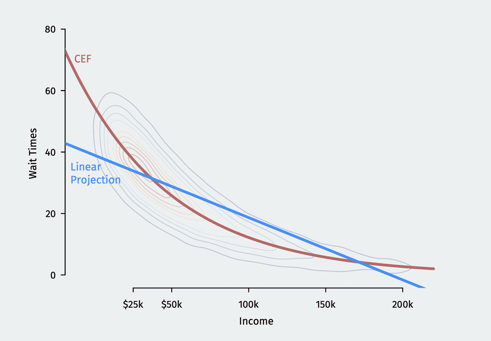

# 统计推断和回归的用户指南

> [`mattblackwell.github.io/gov2002-book/index.html`](https://mattblackwell.github.io/gov2002-book/index.html)

作者

[Matthew Blackwell](https://www.mattblackwell.org/) **

*

# 前言

这本书，像它之前的许多书籍一样，将尝试教你统计学。统计学领域描述了我们是怎样使用定量数据来了解世界的。在社会科学中，越来越多的实证研究使用统计方法来为或反对概念性论点提供证据。虽然在不理解统计学直观水平的情况下进行定量研究是可能的，但这并不是一个好主意。定量研究涉及一系列关于要使用的模型、要包含的变量、要设置的调整参数、要做的假设等的选择。如果没有对统计学的深入理解，你可能会发现这些选择令人困惑和混乱，你可能会简单地（并且可能是错误地）屈服于你统计软件的默认设置。

本书的目标是为你提供基础，以便在有知识和自信的情况下为你的特定应用做出方法论选择。本书的材料旨在为政治学第一年的博士生使用，但它可能对更广泛的读者群体也具有兴趣。

我们将关注两个关键目标：

1.  **理解评估估计量的基本方法** 使用定量数据时，我们通常想要对世界的某些未知特征进行统计推断。我们使用估计量（这些只是总结我们数据的方式）来估计这些特征。本书将在足够通用的水平上介绍这项任务的基础，以便适用于你可能在社会科学的实证研究中遇到的几乎所有估计量。我们还将涵盖诸如偏差、抽样方差、一致性和渐近正态性等主要概念，这些概念在如此广泛的（频率主义）推断中如此普遍，对它们的深入理解将带来巨大的时间投资回报。一旦你理解了这些核心思想，你将拥有一种语言来分析未来几十年中出现的任何新奇的估计量。

1.  **将这些想法应用于回归模型的估计**本书将把这些想法应用于一个特定的社会科学工作马：回归。许多方法要么使用普通最小二乘法等回归估计量，要么以某种方式扩展它们。理解这些估计量是如何工作的对于进行研究、阅读和审查当代学术成果，以及坦白地说，在研讨会和研讨会上成为一个好同事和有价值的人至关重要。回归和回归估计量还为讨论参数模型作为近似而不是作为给定规格真实性的刚性假设提供了一个切入点。

当已有如此多的统计和回归书籍时，为何还要写一本？虽然在这个层面上，统计学和经济学的某些文本确实存在，但它们往往侧重于与社会科学其他领域不太相关的应用和模型。本书试图纠正这一点。本书还力求引入相当高水平的数学复杂性，这将挑战并推动你在这个材料上建立更坚实的基础。

## 路线图

本书分为两个主要部分。第一部分介绍了统计推断的基础。

我们从 1 基于设计的推断开始，通过展示从基于设计的视角来演示估计和推断的基本概念，其中我们从固定的、有限的总体中抽样，所有不确定性都来自样本中谁被包括和谁未被包括的随机性。这种推断框架在统计文献中有着深厚的根源，并为在简单设置中估计和不确定性如何工作提供了大量的直观理解。我们将讨论如何使用基于设计的推断来估计当分析师知道确切的抽样设计时从样本中估计总体特征。不幸的是，研究人员往往缺乏关于他们的数据是如何产生的这种知识，这限制了这种方法的有用性。

2 基于模型的推断介绍了一种更灵活的估计方法：基于模型的推断。采用这种方法，研究人员假设一个关于数据如何产生的概率模型。本书专注于提出“独立同分布”数据的模型。章节描述了在这些模型下估计和推断是如何进行的，并介绍了一类基于插值原理的广泛估计量。

这两个章节侧重于不同估计技术的有限样本性质，但如果我们考虑它在更大和更大的样本上的行为，我们可以说更多关于估计量的事情。3 极限分析介绍了这种类型的极限分析方法。它涵盖了极限理论的核心理念，如大数定律、中心极限定理和 delta 方法，但也说明了为什么这些结果对统计推断很重要。特别是，这一章展示了这些结果如何使创建渐近有效的置信区间成为可能。

4 假设检验通过介绍假设检验的统计推断来结束书的第一部分。本章展示了如何构建假设检验，并提供了对其所有方面的直觉。我们还涵盖了用于规划研究的功效分析和置信区间与假设检验之间的关系。

书的第二部分专注于定量社会科学中一个非常重要的估计量：平方最小二乘估计量。

5 线性回归首先描述了当我们讨论“线性模型”时，我们到底在针对什么感兴趣的量。特别是，我们讨论了即使两个变量之间的关系是非线性的，也存在一个最佳线性预测器。这为线性回归估计作为非线性函数的线性近似提供了一个连贯的基础。本章还展示了如何解释这些线性回归模型中的系数。

6 平方最小二乘法的力学介绍了平方最小二乘估计量的更多机械性质：估计量是如何构建的，其几何解释，以及观测值如何可能影响其返回的估计。本章以矩阵形式介绍了平方最小二乘估计量，并提供了理解这种紧凑记法的关键直觉。

最后，7 平方最小二乘法的统计学描述了平方最小二乘估计量的统计性质。本章展示了建模假设如何影响我们可以获得的性质类型。最弱的建模假设允许我们推导出平方最小二乘的出人意料的强大渐近性质，我们在大多数情况下都依赖于这些性质。然后，本章展示了更强的假设，如线性性和误差的正态分布，可以提供更强大的结果，但它们是以潜在的模型误设为代价的。

## 致谢

我处理这部分材料的大部分方法来自 Adam Glynn，我在研究生期间是他的助教。感谢多年来帮助我完善本书材料的 Gov 2000 和 Gov 2002 的学生们。还要特别感谢那些提供宝贵反馈的人，包括 Zeki Akyol、Noah Dasanaike、Maya Sen 和 Jarell Cheong Tze Wen。

## 版权页

您可以在[`github.com/mattblackwell/gov2002-book`](https://github.com/mattblackwell/gov2002-book)找到这本书的源代码。任何错别字或错误都可以在[`github.com/mattblackwell/gov2002-book/issues`](https://github.com/mattblackwell/gov2002-book/issues)处报告。感谢阅读。

这是一本 Quarto 书籍。要了解更多关于 Quarto 书籍的信息，请访问[`quarto.org/docs/books`](https://quarto.org/docs/books)。

$\,$ $\,$*
