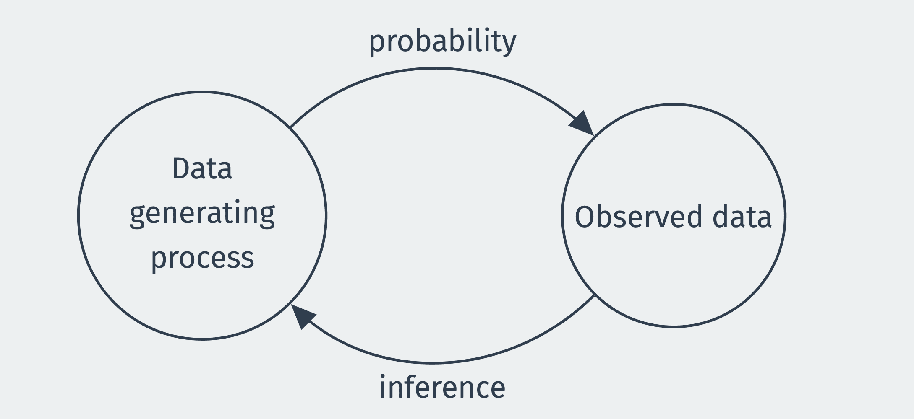
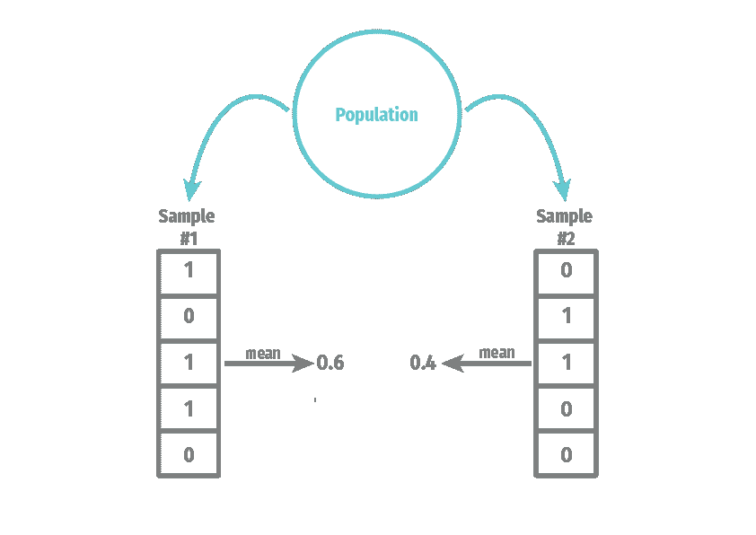
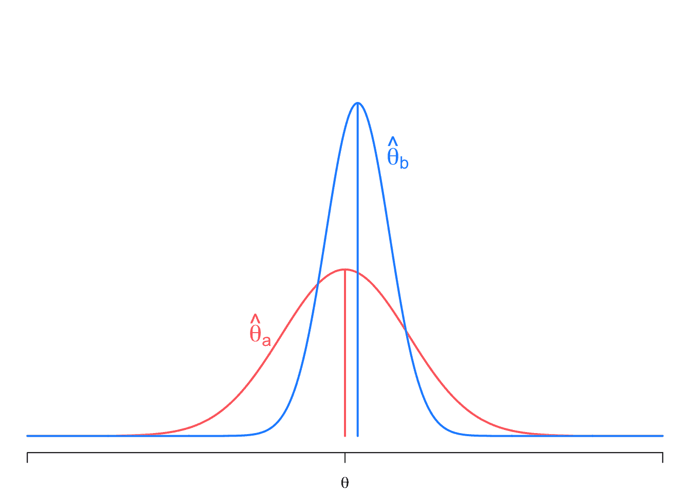

# 2 模型推断

> 原文：[`mattblackwell.github.io/gov2002-book/estimation.html`](https://mattblackwell.github.io/gov2002-book/estimation.html)

1.  统计推断

1.  2 模型推断

## 2.1 简介

假设你被分配去估计支持增加合法移民限额的人口比例。你有一些关于个别受访者对政策支持的样本数据，但你不知道这些数据是如何被抽样的。你应该如何使用你所知道的信息（数据）来对不知道的信息（人口比例）做出最佳猜测？

我们在前一章讨论的设计方法是一个连贯且内部一致的框架，用于估计数量和量化不确定性，但这种清晰的概念性清晰来源于对抽样设计的精确知识。回到我们的移民例子，一个合理的方法是使用支持政策的样本比例作为对人口比例的最佳猜测。正如我们在上一章所看到的，一个简单的随机样本可以证明这种方法是合理的。

但当缺乏关于抽样设计的完整信息时，我们如何进行估计和推断？如果由于非响应或测量误差导致结果随机，我们如何进行推断？如果我们想对抽样框架中未涵盖的总体进行推断怎么办？在这些情况下，推断需要额外的信息，这些信息可以通过**统计模型**来整合。基于模型的统计推断方法将数据 $X_1,\ldots, X_n$ 视为一组遵循某些概率分布的随机变量。实际样本中的测量值 $x_1, \ldots, x_n$ 是这些随机变量的实现。$X_1,\ldots, X_n$ 的概率分布是数据的模型，所有推断都基于它。模型可以是非常具体的——例如，研究人员可能假设数据是正态分布的——或者可以是非常一般的——例如，数据的分布具有有限的均值和方差。

本章（以及大多数入门统计学）的重点将放在假设单位是**独立同分布**的统计模型上，或者更简洁地说，**iid**。这个假设意味着每个单位都为我们提供了关于相同数据生成过程的新的信息。由于这个假设通常是由来自总体的概率样本所激发的，一些作者也将之称为**随机抽样**假设。“样本”指的是我们的数据是某个更大**总体**的子集。“随机”修饰语意味着这个子集是通过一个不确定的过程选择的，这个过程没有偏袒某一种类型的人而不是另一种类型的人。

为什么即使许多数据集至少部分是非随机的或代表整个总体而不是子集，我们还要关注 iid/随机样本？考虑一下著名的醉汉在波士顿市中心寻找丢失的两美元纸币的故事：¹

> “我在大西洋大道上丢失了两美元，”男人说。
> 
> “那是什么？”困惑的警官问道。“你在大西洋大道上丢失了两美元？那么你为什么在这里的科普利广场四处寻找？”
> 
> “因为，”男人一边转身继续用手和膝盖在地上寻找，一边说，“这里的光线更好。”

就像那个可怜的醉汉一样，我们专注于搜索一个区域（随机样本），因为那里有更多的光线，或者更准确地说，数学更容易。与这个寓言故事不同，我们的搜索将帮助我们更好地理解非随机样本的黑暗面，因为随机抽样的核心思想和直觉是理论扩展到更奇特环境的基础。

本章有两个目标。首先，我们将介绍整个基于模型的估计和估计量框架。我们将讨论比较估计量性质的不同方法。这些性质中的大多数将与基于设计的框架相似，但性质将相对于模型而不是抽样设计。 (定量研究的核心问题在很大程度上保持不变，但我们用我们数据的概率模型来代替指定抽样设计。) 第二，我们将为可以写成样本均值的通用类估计量建立关键性质。这些结果本身就有用，因为这些估计量无处不在，但推导也提供了我们如何建立此类结果的例子。对这些证明的熟悉有助于我们理解在我们职业生涯中不可避免地会看到的关于新估计量的论点。

## 2.2 概率与推断：大局观

概率是数学对不确定事件的研究，也是数学估计研究的基础。在概率论中，我们假设我们知道世界的真相（瓮中有多少蓝球和红球）并计算可能事件的概率（从瓮中抽取十个球时得到超过五个红球）。估计则是反向操作。有人给你五个球，其中两个是红球，三个是蓝球，你的任务是猜测这些球是从哪个瓮中取出的。在估计中，我们使用我们的观察数据来对数据生成过程做出**推断**。



估计量是将我们的数据转换为对某些未知量的最佳猜测的规则，例如，量杯中球的比例，或者，使用我们介绍中的例子，支持增加合法移民限额的公众比例。例如，一个估计量可以是这样一个规则：从量杯中抽取的红球比例是对你如果查看量杯内部会发现的红球比例的好猜测。

我们更倾向于使用**好的**估计量而不是**坏的**估计量。但什么使得一个估计量变得好或坏呢？在我们的红球例子中，总是返回值 3 的估计量可能是不好的。然而，对我们来说，正式定义并探索估计量的性质，这将使我们能够比较它们并选择好的而不是坏的，将会很有帮助。我们从这样一个例子开始，这个例子突出了两个看起来可能相似的估计量。

**示例 2.1（随机对照试验）** 假设我们正在进行关于框架效应的随机实验。所有受访者都收到关于当前移民水平的实际情况。治疗组的受访者（$D_i = 1$）收到关于移民积极效益的额外信息，而对照组的受访者（$D_i = 0$）则没有收到额外的框架信息。结果是二元结果，即受访者是否支持增加合法移民限额（$Y_i = 1$)或不是（$Y_i = 0$)。观察到的数据包括$n$对随机变量，结果和治疗分配：$\{(Y_1, D_1), \ldots, (Y_n, D_n)\}$。

定义每个组中的两个样本均值/比例如下：$$ \Ybar_1 = \frac{1}{n_1} \sum_{i: D_i = 1} Y_i, \qquad\qquad \Ybar_0 = \frac{1}{n_0} \sum_{i: D_i = 0} Y_i, $$ 其中 $n_1 = \sum_{i=1}^n D_i$ 是治疗单位的数量，$n_0 = n - n_1$ 是控制单位的数量。

在此类研究中，一个标准的处理效应估计量是均值差异，$\Ybar_1 - \Ybar_0$。但这只是许多可能估计量中的一种。我们还可以通过分别按党派身份计算这个均值差异来估计效果，然后通过这些群体的大小对这些特定党派的效应进行平均。这种估计量通常称为**后分层**估计量。乍一看，我们更倾向于哪种估计量并不清楚。

我们现在转向我们用来激发基于设计推理的相同关键问题，但将这些调整以考虑基于模型的推理。

## 2.3 问题 1：总体

依赖于模型的主要优点和缺点是它们是抽象和理论的，这意味着模型与其所帮助解释的总体之间的联系不如基于设计的框架直接。尽管如此，我们需要清楚地阐述我们的研究总体——也就是说，我们想要了解谁或什么——因为这对于评估将可持续的建模假设类型至关重要。

在基于设计的设置中，通常有一个清晰且明确的总体，例如“所有注册选民”或“所有波士顿居民”。在其他情况下，总体可能更加抽象。例如，大量的多领域文献研究了少数群体的大小如何影响当地多数群体的观点。在这个领域的研究人员可能对超越特定地理区域或少数/多数群体做出主张感兴趣，而不是隐含或显性地考虑一个“超总体”，他们的模型可能解释这些情况。虽然这种做法在理论上是正确的，但在实践中这些想法往往被忽视，并且特定模型的“范围条件”没有明确阐述。最好的定量工作将清楚地说明它试图了解哪些单位或过程，以便读者可以评估建模假设与该任务拟合得有多好。

## 2.4 问题 2：统计模型

让我们从构建一个裸骨概率模型开始，这个模型描述了我们的数据是如何形成的。例如，假设我们有一个包含 1000 名调查受访者年龄、政党归属和政策观点的一系列数字的数据集。但我们知道，如果另一个受访者被选为第 58 行，或者如果原始受访者因为恰好在前一天看到了一条移民新闻而在移民问题上给出了不同的观点，那么我们的数据第 58 行可能会产生一组不同的数字。为了精确地推理这种不确定性，我们在看到数据之前将 $X_i$ 写作代表某个变量第 $i$ 行值的随机变量。这个随机变量的分布将告诉我们我们应该期望看到哪些类型的数据。

为什么要在已知数据本身值的情况下，还要用随机变量来表示数据呢？为什么假装我们没有看到数据呢？从频率派的角度（即本书的视角）研究估计，关注的是在**重复样本**中估计量的性质。在政策调查的例子中，这就像反复抽取 1000 人的样本，每次样本中可能包含不同的受访者。随机变量 $X_i$ 代表我们对任何这些样本中受访者 $i$ 的年龄等值的不确定性，而集合 $\{X_{1}, \ldots, X_{n}\}$ 代表我们对所有 $n$ 个受访者的年龄列的不确定性。在最一般的情况下，基于模型的方法认为这些 $n$ 个随机变量遵循某种联合分布，$F_{X_{1},\ldots,X_{n}}$，$$ \{X_{1}, \ldots, X_{n}\} \sim F_{X_{1},\ldots,X_{n}} $$ 联合分布 $F$ 在这里代表数据的概率模型。我们迄今为止对此没有做出任何假设，因此它可以是 $n$ 个随机变量上的任何联合概率分布。请注意，这种一般性在实际操作中很难处理，因为实际上只有一个从这个联合分布中抽取的样本（数据中的 $n$ 个测量值）。建模的核心问题是关于研究者对这种联合分布施加什么限制，以便使其更容易学习。

我们关注一个相对简单的设置，其中我们假设数据 $\{X_1, \ldots, X_n\}$ 是从具有累积分布函数（cdf） $F$ 的分布中**独立同分布**（iid）抽取的。它们是独立的，因为关于任何随机变量子集的信息不会对其他随机变量子集的信息提供任何信息，或者说，更正式地，$$ F_{X_{1},\ldots,X_{n}}(x_{1}, \ldots, x_{n}) = F_{X_{1}}(x_{1})\cdots F_{X_{n}}(x_{n}) = \prod_{i=1}^n F(x_i) $$ 其中 $F_{X_{1},\ldots,X_{n}}(x_{1}, \ldots, x_{n})$ 是随机变量的联合累积分布函数，$F_{X_{j}}(x_{j})$ 是第 $j$ 个随机变量的边缘累积分布函数。它们在“同分布”的意义上是一致的，即每个随机变量 $X_i$ 都有相同的边缘分布，$F$。

注意，我们故意对此累积分布函数（cdf）含糊其辞——它仅仅代表数据的未知分布，也称为**数据生成过程**（DGP）。有时 $F$ 也被称为**总体分布**或仅仅是**总体**，这源于将数据视为来自某个更大总体的随机样本。[^model] 作为简写，我们经常说，如果 $\{X_1, \ldots, X_n\}$ 是从总体 $F$ 中抽取的随机样本，并且 $\{X_1, \ldots, X_n\}$ 是具有分布 $F$ 的独立同分布（iid）的，那么我们说这个随机变量的集合 $\{X_1, \ldots, X_n\}$ 是从总体 $F$ 中抽取的**随机样本**。**样本大小** $n$ 是样本中的单位数量。

*注意* *你可能会想知道我们为什么用累积分布函数（cdf）$F$来引用$X_i$的分布。数学统计学倾向于这样做，以避免分别处理离散和连续随机变量。每个随机变量——无论是离散的还是连续的——都有一个累积分布函数，累积分布函数包含了关于随机变量分布的所有信息。*  *以下两个比喻有助于建立将数据视为从$F$中抽取的 iid 样本的直觉：

1.  **随机抽样**。假设我们有一个大小为$N$的总体，这个总体的大小远大于我们的样本大小$n$，并且我们从这个总体中以放回方式抽取一个大小为$n$的随机样本。随机样本中的数据分布将是来自我们抽样变量的总体分布的 iid 抽取。例如，假设美国公民中民主党标识者的总体比例是 0.33。如果我们随机抽取$n = 100$名美国公民，每个数据点$X_i$将以成功概率（即民主党标识者）为 0.33 的伯努利分布。

注意，上一章探讨了简单随机抽样*不放回*的情况，这是一种更常见的抽样类型——因为通常人们只会被选入一次调查，他们不会回到潜在调查对象的池中。不放回抽样会在单位之间产生依赖性，这将违反 iid 假设。然而，如果总体大小$N$相对于样本大小$n$非常大，这种依赖性将非常小，iid 假设将相对无害。

1.  **土拨鼠日**。随机抽样并不总是作为独立同分布（iid）数据的合理依据，尤其是当单位根本不是样本，而是国家、州或次国家单位时。在这些情况下，总体可以与样本相同——例如，使用所有 50 个州来得出关于州政策有效性的结论。在这种情况下，我们必须求助于一个思想实验，其中 $F$ 代表数据生成过程中的基本不确定性。这里的比喻是，如果我们能够多次重演历史，比如 1993 年美国喜剧电影《土拨鼠日》中比尔·默瑞扮演的主角被神奇地强迫一次又一次地重温 2 月 2 日。在这个虚构的情况下，由于世界的本质随机性，数据和结果会略有变化。在电影中，例如，默瑞的角色每天开始时都以完全相同的方式开始，但他开始改变自己的行为，每天结束时结果以微妙的方式改变。因此，iid 假设是，我们数据中的每个单位都有产生这些数据的相同数据生成过程（DGP）或是在“土拨鼠日”情景下的相同结果分布。从 DGP 中所有这些无限可能的抽取集合有时被称为**超总体**。

注意，还有其他情况下，独立同分布（iid）假设不适用，我们将在后面的章节中讨论。但过去 50 年来统计学的大部分创新和增长都集中在如何在独立同分布不成立的情况下进行统计推断。这些解决方案通常针对特定类型的独立同分布违规（例如，空间、时间序列、网络、聚类）。然而，作为一个经验法则，如果独立同分布假设可能不成立，任何不确定性声明都可能过于自信。例如，我们将在后面的章节中介绍的置信区间可能太小。

最后，我们将数据作为标量随机变量引入，但我们的数据通常具有多个变量。在这种情况下，我们很容易将 $X_i$ 修改为随机向量（即随机变量的向量），然后 $F$ 成为该随机向量的联合分布。上述讨论中的实质性内容没有发生变化。

**警告** **调查抽样是从人口中获得样本的最流行方式之一，但现代抽样实践很少产生“干净”的 $n$ 个独立同分布（iid）响应集。这有几个原因：

+   现代随机抽样技术通常不会以相同的概率选择每个单位。我们可能会对某些我们希望有更精确估计的群体进行**过度抽样**，导致这些群体在样本中出现的可能性更高。

+   调查的回应率一直在急剧下降，通常可能低于 10%。这种对观察样本的非随机选择可能会导致问题。

+   互联网调查的成本低于其他形式的调查，但获取人口电子邮件地址列表（或其他数字联系方式）以进行随机抽样基本上是不可能的。大型调查公司反而会招募具有已知人口统计信息的庞大群体，从而可以以与人口人口统计信息相匹配的方式进行随机抽样。由于初始的自愿参与小组并非从人口中随机抽样，因此此程序不会产生真正的“随机样本”，但在某些假设下，我们可以将其视为如此。

如上一章所述，有方法可以处理所有这些问题（主要通过使用调查权重），但重要的是要意识到，将现代调查“视为”简单随机样本可能会导致性能不佳和错误的推断。**  **## 2.5 问题 3：感兴趣的量

在基于模型的推理中，我们的目标是了解数据生成过程。每个数据点 $X_i$ 代表从分布中抽取的一个样本，由累积分布函数 $F$ 捕获，我们希望了解更多关于这个分布的信息。我们可能对估计累积分布函数的一般水平或分布的一些特征，如均值或条件期望函数感兴趣。我们把这些数值特征称为**感兴趣量**。（同样，在上一章中我们讨论的设计推理框架中，感兴趣量是有限总体的数值摘要。）

以下是一些常用的感兴趣量的例子：

**示例 2.2（总体均值）** 我们可能对总体成员在某个问题上的位置感兴趣。假设我们想知道支持增加合法移民的美国公民的比例。对于公民 $i$，将支持表示为 $Y_i = 1$。那么，我们的感兴趣量就是这个随机变量的均值，$\mu = \E[Y_i] = \P(Y_{i} = 1)$。这等同于随机从总体中抽取一个人，他支持增加合法移民的概率。

**示例 2.3（总体方差）** 我们也可能对总体的变化感兴趣。例如，感觉温度计得分是评估调查受访者对特定个人或群体感受的一种常见方式。这些要求每个受访者就他们对某个群体在 0（冷）到 100（热）的量表上的温暖程度发表看法，我们将这个量表表示为 $Y_i$。我们可能对总体中关于某个群体的观点的极化程度感兴趣，极化的一个度量可能是 $Y_i$ 分布围绕均值的方差或扩散。在这种情况下，$\sigma² = \V[Y_i] = \E[(Y_i - \E[Y_i])²]$ 将是我们的感兴趣量。

**示例 2.4（RCT 继续讨论）** 示例 2.1 讨论了二元处理实验的典型估计量。该实验的目标是了解两个条件概率（或期望）之间的差异：1) 处理组中支持增加合法移民的平均支持度，$\mu_1 = \E[Y_i \mid D_i = 1]$，和 2) 控制组中的相同平均支持度，$\mu_0 = \E[Y_i \mid D_i = 0]$。这个差异，$\mu_1 - \mu_0$，是这两个条件分布未知特征的函数。

这些都是数据（可能是联合）分布 $F$ 的函数。在这些情况中，我们不一定对整个分布感兴趣，只是对其摘要感兴趣（中心趋势，扩散）。当然，也有我们感兴趣的是整个分布的情况。为了一般性地讨论估计，我们将让 $\theta$ 代表某个通用的感兴趣量。**点估计**描述了如何获得关于 $\theta$ 的单个“最佳猜测”。

*注意* *有些人将感兴趣的数量称为**参数**或**估计对象**（即估计的目标).*  *## 2.6 问题 4：估计量

心中有一个目标，我们可以用我们的数据来估计它。为此，我们首先需要一个规则或算法或函数，它以数据为输入，并返回对感兴趣数量的最佳猜测。最受欢迎且最有用的算法之一是将所有数据点相加，然后除以点的数量：$$ \frac{X_1 + X_2 + \cdots + X_n}{n}. $$ 这就是备受赞誉的样本均值，它提供了一种如何产生数据单数总结的规则。更进一步，更严格地将其定义为数据的函数：$$ \textsf{mean}(X_1, X_2, \ldots, X_n) = \frac{X_1 + X_2 + \cdots + X_n}{n}. $$ 我们可以使用这个模型为任意感兴趣数量的任意估计量提供一个定义。

**定义 2.1** 对于某个参数 $\theta$，一个**估计量** $\widehat{\theta}_n = \theta(X_1, \ldots, X_n)$ 是一个关于 $\theta$ 的猜测的数据函数。

*注意* *广泛使用（尽管不是普遍使用）“帽子”符号来定义估计量和其估计对象。例如，$\widehat{\theta}$（或“theta hat”）表示这个估计量是针对参数 $\theta$ 的.*  ***示例 2.5（对总体均值的估计量）*** 假设我们的目标是估计 $F$ 的总体均值，我们将它表示为 $\mu = \E[X_i]$。我们可以选择几个估计量，它们具有不同的特性。$$ \widehat{\theta}_{n,1} = \frac{1}{n} \sum_{i=1}^n X_i, \quad \widehat{\theta}_{n,2} = X_1, \quad \widehat{\theta}_{n,3} = \text{max}(X_1,\ldots,X_n), \quad \widehat{\theta}_{n,4} = 3 $$ 第一个就是样本均值，它是总体均值的一个直观且自然的估计量。第二个只使用了第一个观测值。虽然这似乎很愚蠢，但这是一个有效的统计量，因为它是一个数据函数！第三个取样本中的最大值，第四个无论数据如何总是返回三个。这些也是有效的统计量。

当我们将数据 $\{X_{1}, \ldots, X_{n}\}$ 视为一组随机变量时，那么它们的任何函数也是随机变量。因此，我们可以将 $\widehat{\theta}_n$ 视为一个随机变量，它具有由样本随机性引起的分布。抽取两个不同的样本将导致两个不同的估计值。例如，这里我们展示了从二元变量的总体分布中抽取的 $n =5$ 个样本：



我们可以看到，变量的均值取决于样本中最终出现的具体值。我们将 $\widehat{\theta}_n$ 在重复样本中的分布称为其**抽样分布**。估计量的抽样分布将是估计量所有正式统计性质的基础。

*没有免费的午餐* *建立对**假设-精度权衡**的直觉是至关重要的。研究人员如果做出更强和可能更脆弱的假设，通常可以得到更精确的估计。相反，当弱化假设时，他们几乎总是得到更不准确的估计。*  *### 2.7.2 插值估计量

第二大类估计量是**半参数**的，因为我们指定了 DGP 的一些有限维参数，但将分布的其余部分留作未指定。例如，我们可能定义一个总体均值，$\mu = \E[X_i]$和一个总体方差，$\sigma² = \V[X_i]$，但将分布的形状限制为不受限制。这确保了我们的估计量将不太依赖于正确指定我们对其知之甚少的分布。

在这个环境中构建估计量的主要方法是使用**插值估计量**，即用样本均值替换任何总体均值的估计量。显然，在估计总体均值$\mu$的情况下，我们将使用**样本均值**作为估计：$$ \Xbar_n = \frac{1}{n} \sum_{i=1}^n X_i \quad \text{estimates} \quad \E[X_i] = \int_{\mathcal{X}} x f(x)dx $$ 用简单的话说，我们是用我们的数据点上的离散均匀分布来替换总体均值中的未知总体分布$f(x)$，每个单位分配$1/n$的概率。为什么这样做呢？这是因为，如果我们有一个随机样本，我们对$X_i$的总体分布的最佳猜测就是观察到的样本分布。如果这种直觉失败，你可以坚持一个类似的原则：随机变量的样本均值是总体均值的自然估计量。

那么，估计更复杂的东西，比如数据的函数的期望值，$\theta = \E[r(X_i)]$呢？关键是看到$r(X_i)$也是一个随机变量。让这个随机变量为$Y_i = r(X_i)$。现在我们可以看到$\theta$只是这个随机变量的总体期望。使用插值估计量给我们：$$ \widehat{\theta} = \frac{1}{n} \sum_{i=1}^n Y_i = \frac{1}{n} \sum_{i=1}^n r(X_i). $$

这些事实使我们能够描述一个更一般的插值估计量。为了估计一个感兴趣的量，该量是总体均值的函数，我们可以通过用样本均值替换任何总体均值来生成一个插值估计量。形式上，让$\alpha = g\left(\E[r(X_i)]\right)$是一个参数，它被定义为数据（可能为向量值）的总体均值的函数。然后我们可以通过将样本均值插入总体均值来估计这个参数，得到**插值估计量**，$$ \widehat{\alpha} = g\left( \frac{1}{n} \sum_{i=1}^n r(X_i) \right) \quad \text{estimates} \quad \alpha = g\left(\E[r(X_i)]\right) $$ 这种使用样本均值的插值估计方法非常通用，将使我们能够在各种环境中推导出估计量。

**示例 2.6（估计总体方差）** 随机变量的总体方差是 $\sigma² = \E[(X_i - \E[X_i])²]$。为了推导这个量的插值估计量，我们将内层的 $\E[X_i]$ 替换为 $\Xbar_n$，并将外层期望替换为另一个样本均值：$$ \widehat{\sigma}² = \frac{1}{n} \sum_{i=1}^n (X_i - \Xbar_n)². $$ 这个插值估计量与标准样本方差不同，它除以 $n - 1$ 而不是 $n$。这个小的差异在中等到大样本中并不重要。

**示例 2.7（估计总体协方差）** 假设我们有两个变量，$(X_i, Y_i)$。这里一个自然的感兴趣量是这两个变量之间的总体协方差，$$ \sigma_{xy} = \text{Cov}[X_i,Y_i] = \E[(X_i - \E[X_i])(Y_i-\E[Y_i])], $$ 它的插值估计量为，$$ \widehat{\sigma}_{xy} = \frac{1}{n} \sum_{i=1}^n (X_i - \Xbar_n)(Y_i - \Ybar_n). $$

*符号警告* *鉴于总体均值与样本均值之间的关系，你可能会看到 $\E_n[\cdot]$ 运算符被用作样本平均的简称：$$ \E_n[r(X_i)] \equiv \frac{1}{n} \sum_{i=1}^n r(X_i). $$* *最后，插值估计不仅限于用样本均值替换总体均值。我们还可以推导出样本版本的这些量（如中位数）的总体分位数估计量。这些方法在用经验累积分布函数，$$ \widehat{F}_n(x) = \frac{\sum_{i=1}^n \mathbb{I}(X_i \leq x)}{n}, $$ 替换未知总体累积分布函数 $F$ 时统一起来，其中 $\mathbb{I}(A)$ 是一个 *指示函数*，当事件 $A$ 发生时取值为 1，否则为 0。对于这些想法的更完整和技术的处理，请参阅 Wasserman (2004) 第七章。**  **## 2.8 三种分布：总体、经验性和抽样

一旦我们开始涉足估计，就有几个分布需要跟踪，事情可能会很快变得混乱。三个特定的分布都是相关的，并且容易混淆，但保持它们之间的区别是至关重要的。

**总体分布** 是随机变量 $X_i$ 的分布，我们将其标记为 $F$，是我们推理的目标。**经验分布** 是我们样本中随机变量的实际实现值的分布，$X_1, \ldots, X_n$（即我们最终在数据框中观察到的值）。因为这是一个从总体分布中随机抽取的样本，可以充当 $F$ 的估计量，所以我们有时称这个为 $\widehat{F}_n$。

独立于这两者的是 **估计量的抽样分布**，它是 $\widehat{\theta}_n$ 的概率分布。这代表了我们看到数据之前估计的不确定性。记住，我们的估计量本身是一个随机变量，因为它是一个随机变量的函数：数据本身。也就是说，我们定义估计量为 $\widehat{\theta}_n = \theta(X_1, \ldots, X_n)$。

**示例 2.8（Likert 反应）** 假设 $X_i$ 是对问题“你有多同意以下陈述：移民对美国是净正面的？”的回答，其中 $X_i = 0$ 表示“强烈不同意”，$X_i = 1$ 表示“不同意”，$X_i = 2$ 表示“既不同意也不反对”，$X_i = 3$ 表示“同意”，$X_i = 4$ 表示“强烈同意”。

种群分布描述了随机选择一个具有这些值中每一个的人的概率，$\P(X_i = x)$。经验分布将是我们的观察数据中每个值的比例。而样本均值 $\Xbar_n$ 的抽样分布将是通过对种群中重复样本的样本均值重新计算得到的分布。

假设 $X_i$ 的种群分布遵循一个有五次试验的二项分布，每次试验成功的概率为 $p = 0.4$。我们可以生成一个包含 $n = 10$ 个样本的样本，从而得到一个使用 `rbinom()` 生成的经验分布：

```r
my_samp <- rbinom(n = 10, size = 4, prob = 0.4)
my_samp
```

*```r
 [1] 1 2 1 3 3 0 2 3 2 1
```

```r
table(my_samp)
```

*```r
my_samp
0 1 2 3 
1 3 3 3 
```*  **我们通过取这个样本的平均值从 $\Xbar_n$ 的抽样分布中抽取一个样本：

```r
mean(my_samp)
```

*```r
[1] 1.8
```*  *如果我们有一个不同的样本，那么我们会得到一个不同的经验分布，从而得到样本均值的不同的估计：

```r
my_samp2 <- rbinom(n = 10, size = 4, prob = 0.4)
mean(my_samp2) 
```

*```r
[1] 1.6
```*  *抽样分布是这些样本均值在重复抽样中的分布。****  ***## 2.9 估计量的有限样本性质

正如我们在估计量介绍中讨论的那样，它们的有用性取决于它们帮助我们了解感兴趣的数量有多好。如果我们得到一个估计值 $\widehat{\theta} = 1.6$，我们希望知道这是“接近”于真实参数 $\theta$ 的。抽样分布是回答这些问题的关键。直观上，我们希望 $\widehat{\theta}_n$ 的抽样分布尽可能紧密地围绕真实 $\theta$ 聚集。然而，这里我们遇到了一个问题：抽样分布依赖于种群分布，因为它涉及从该分布中重复抽取数据并通过函数 $\theta()$ 过滤。由于 $F$ 是未知的，这意味着抽样分布通常也是未知的。

尽管我们无法精确确定整个抽样分布，但我们可以使用假设来推导抽样分布的特定属性，这些属性在比较估计量时非常有用。请注意，这里的属性将与

### 2.9.1 偏差

样本分布的第一个性质是它的中心趋势。特别是，我们定义估计量 $\widehat{\theta}$ 对于参数 $\theta$ 的**偏差**（或**估计偏差**）为 $$ \text{bias}[\widehat{\theta}] = \E[\widehat{\theta}] - \theta, $$ 这是估计量的均值（在重复样本中）与真实参数之间的差异。在其他条件相同的情况下，我们希望估计偏差尽可能小。显然，可能的最小偏差是 0，我们定义一个**无偏估计量**为具有 $\text{bias}[\widehat{\theta}] = 0$ 或等价地，$\E[\widehat{\theta}] = \theta$ 的估计量。

然而，在其他条件并不总是相同的情况下，无偏性不是一个我们应该过分依赖的性质。许多有偏估计量具有其他吸引人的性质，许多流行的现代估计量是有偏的。

**示例 2.9（样本均值的无偏性）** 当数据是独立同分布的（iid）且 $\E|X| < \infty$ 时，样本均值对于总体均值是无偏的。特别是，我们应用期望规则：$$\begin{aligned} \E\left[ \Xbar_n \right] &= \E\left[\frac{1}{n} \sum_{i=1}^n X_i\right] & (\text{样本均值 } \Xbar_n \text{ 的定义}) \\ &= \frac{1}{n} \sum_{i=1}^n \E[X_i] & (\E \text{ 的线性性})\\ &= \frac{1}{n} \sum_{i=1}^n \mu & (X_i \text{ 同分布})\\ &= \mu. \end{aligned}$$ 注意，我们只使用了独立同分布（iid）中的“同分布”部分。独立性不是必需的。

**警告** *无偏性等性质可能只适用于 DGPs 的一个子集。例如，我们刚刚表明样本均值是无偏的，但仅当总体均值是有限的时。存在一些概率分布，如柯西分布，其值不是有限的，且期望值发散。因此，我们在这里处理的是一类受限制的 DGPs，排除了这样的分布。这有时通过定义一个分布类 $\mathcal{F}$ 来形式化；如果对于所有 $F \in \mathcal{F}$ 都是无偏的，那么无偏性可能在该类中成立。*  **## 2.10 问题 5：不确定性**

样本分布的分散程度也很重要。我们定义**抽样方差**为估计量的抽样分布的方差，$\V[\widehat{\theta}]$，它衡量估计量在其均值周围的分散程度。对于一个无偏估计量，较低的抽样方差意味着 $\widehat{\theta}$ 的分布更集中在参数的真实值周围。

**示例 2.10（样本均值的抽样方差）** 我们可以证明，对于所有 $\V[X_i]$ 是有限的 $F$（更精确地说，$\E[X_i²] < \infty$）的独立同分布数据的样本均值的抽样方差

$$\begin{aligned} \V\left[ \Xbar_n \right] &= \V\left[ \frac{1}{n} \sum_{i=1}^n X_i \right] & (\text{定义 } \Xbar_n) \\ &= \frac{1}{n²} \V\left[ \sum_{i=1}^n X_i \right] & (\text{方差的性质 } \V) \\ &= \frac{1}{n²} \sum_{i=1}^n \V[X_i] & (\text{独立性}) \\ &= \frac{1}{n²} \sum_{i=1}^n \sigma² & (X_i \text{ 同分布}) \\ &= \frac{\sigma²}{n} \end{aligned}$$

正如我们之前讨论的，任何分布的替代度量标准是标准差，它与原始随机变量的尺度相同。$\widehat{\theta}$的抽样分布的标准差被称为$\widehat{\theta}$的**标准误差**：$\se(\widehat{\theta}) = \sqrt{\V[\widehat{\theta}]}$。

根据上述推导，在独立同分布（iid）抽样下，样本均值的标准误差是$\sigma / \sqrt{n}$。

### 2.10.1 均方误差

偏差和抽样方差衡量了“良好”估计量的两个属性，因为它们捕捉了我们希望估计量尽可能接近真实值的事实。估计量质量的一个总结度量是**均方误差**或**MSE**，它是

$$ \text{MSE} = \E[(\widehat{\theta}_n-\theta)²]. $$ 我们理想情况下希望这个值尽可能小！

均方误差（MSE）也与偏差和抽样方差（如果它是有限的）相关，通过以下分解结果：$$ \text{MSE} = \text{bias}[\widehat{\theta}_n]² + \V[\widehat{\theta}_n] \tag{2.1}$$ 这种分解意味着，对于无偏估计量，MSE 就是抽样方差。它还突出了为什么我们可能会接受一些偏差，以换取方差显著降低并使总体 MSE 降低。



两个抽样分布

此图显示了两个估计量的抽样分布：（1）$\widehat{\theta}_a$，它是无偏的（以真实值$\theta$为中心），但抽样方差很高；（2）$\widehat{\theta}_b$，它略有偏差但抽样方差低得多。尽管$\widehat{\theta}_b$有偏差，但抽取接近真实值的值的概率高于$\widehat{\theta}_a$。MSE 有助于捕捉这种偏差和方差之间的平衡，实际上，在这种情况下，$MSE[\widehat{\theta}_b] < MSE[\widehat{\theta}_a]$。

## 2.11 总结

在本章中，我们介绍了**基于模型的推断**，其中我们为数据生成过程设定一个概率模型。这些模型可以是**参数化的**，即我们指定数据的概率分布直到某些参数。它们也可以是**半参数化的**，其中我们只指定分布的某些特征，如有限均值和方差。本章主要关注后者，其中我们假设观测数据是从具有有限均值和方差的总体分布中独立同分布抽取的。

**估计量**是数据的一个函数，其目的是对总体中某个感兴趣的数量进行猜测。因为它是一个随机变量（数据）的函数，所以估计量也是随机变量，并且具有在从总体中重复抽取时的分布，这种分布称为**抽样分布**。如果这个分布以感兴趣的数量真实值为中心，我们称这个估计量为**无偏**。抽样分布的方差，称为**抽样方差**，告诉我们应该期望估计量在从总体中抽取时的变化程度。均方误差是估计量准确性的总体度量，它结合了偏差和抽样方差的概念。

在本章中，我们展示了样本均值对于总体均值是无偏的，并且样本均值的抽样方差是总体方差与样本大小的比率。我们还看到，**插值估计量**是将估计量作为样本均值函数构建的一种强大方法。尽管如此，本章的重点是有限样本性质（即，无论样本大小如何都为真的性质）。在下一章中，我们将使用大样本近似推导出更强大的结果。

* * *

1.  1924 年 5 月 24 日，波士顿先驱报，惠丁专栏：塔玛尼已经意识到现在不是政治老板的时间，引文页面 2，第 1 栏，马萨诸塞州波士顿。（GenealogyBank)↩︎***********
