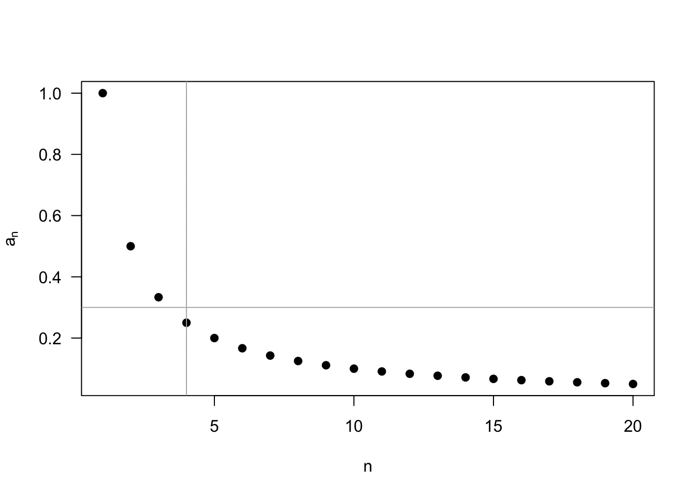
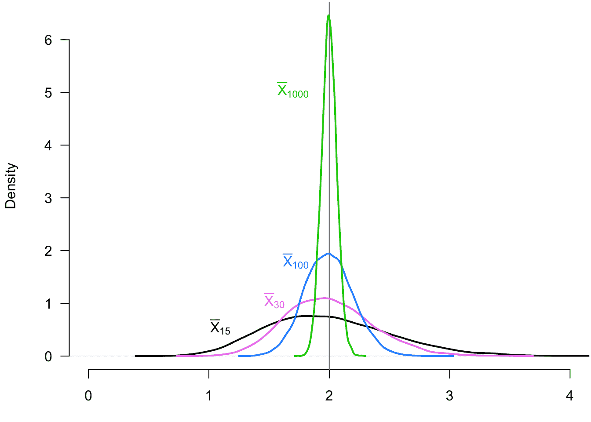
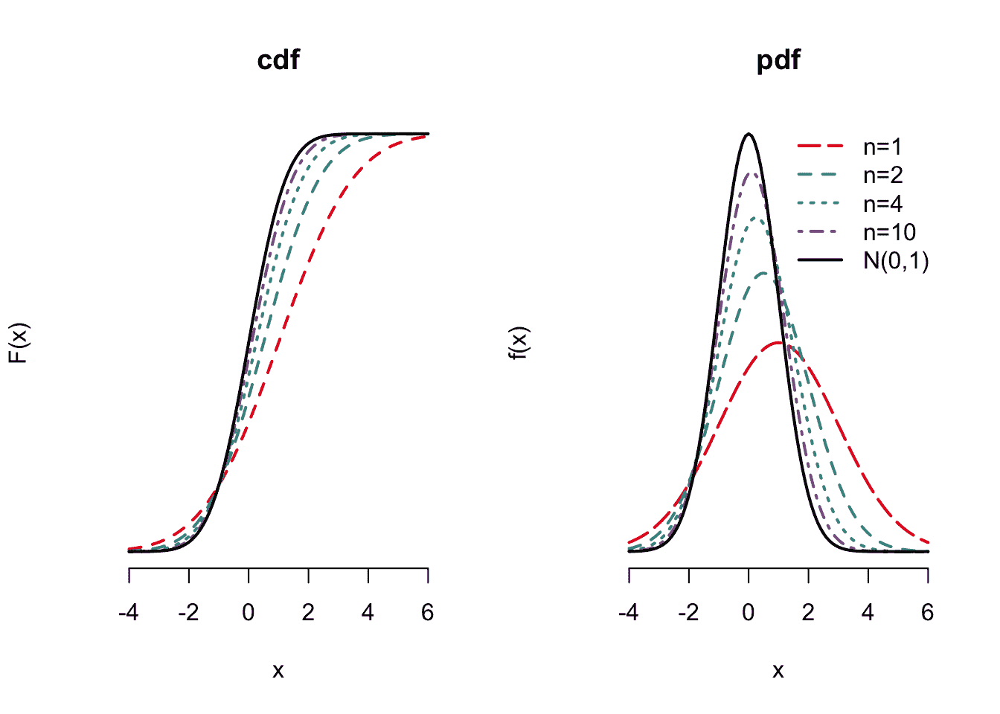
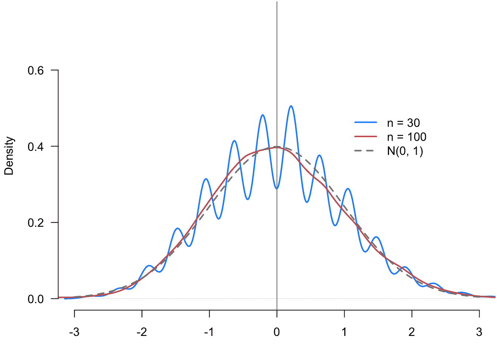
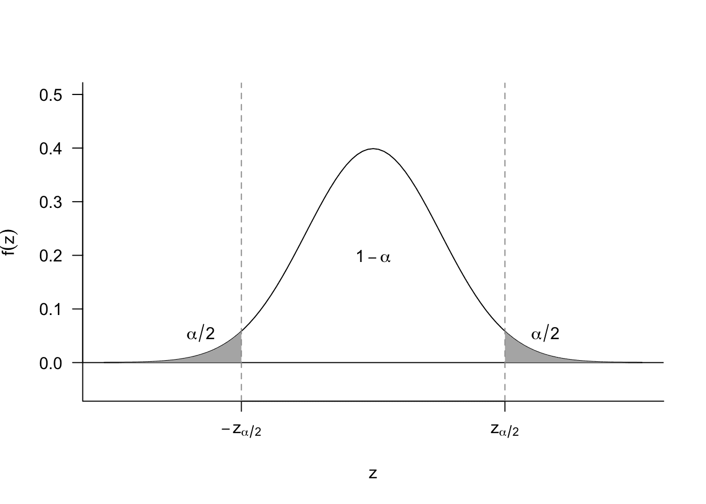
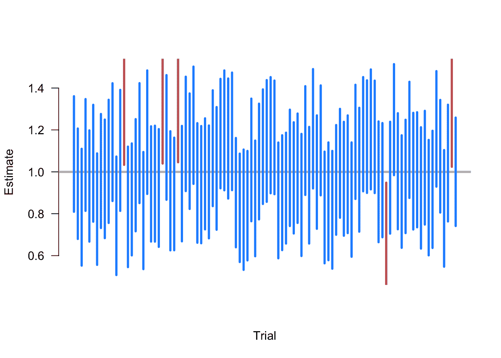
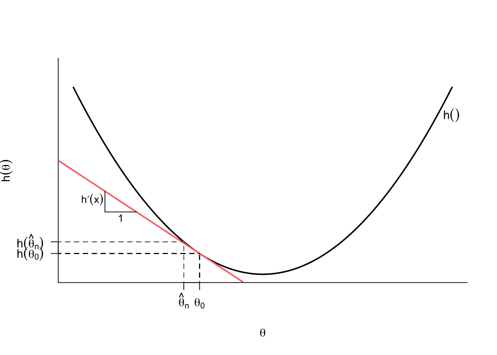

# 3 渐近性

> 原文：[`mattblackwell.github.io/gov2002-book/asymptotics.html`](https://mattblackwell.github.io/gov2002-book/asymptotics.html)

1.  统计推断

1.  3 渐近性

## 3.1 简介

假设我们仍然对估计公民中支持增加法律移民比例的比例感兴趣。根据上一章的内容，一个不错的策略是使用随机抽取公民样本中移民支持者的样本比例。你会有充分的理由对这个估计量感到自信，因为它具有无偏性和有限的样本方差等特性。我们称之为“有限样本”特性，因为它们在任何样本量下都成立——对于 $n = 10$ 的随机样本和 $n = 1,000,000$ 的随机样本都是同样适用的。

然而，有限样本结果的价值有限，因为它们只能告诉我们 $\Xbar_n$ 的抽样分布的中心和分布。假设我们发现 $\Xbar_n = 0.47$ 或 47% 的受访者在一个单独的调查中支持增加移民。我们可能想知道，真正的总体比例——与样本比例不同——达到 50% 或更高的可能性有多大。这类问题对于决策者至关重要，为了回答这个问题，我们需要知道 $\Xbar_n$ 的（近似）分布，除了它的均值和方差。如果我们愿意对基础数据做出某些，有时是强烈的假设（例如，如果总体是正态分布的，那么样本均值也将是正态分布的），我们通常可以推导出估计量的确切分布。尽管如此，这种方法是脆弱的：如果我们的参数假设是错误的，我们就会回到起点。

在本章中，我们采取了一种不同的方法，即探讨当样本量变得非常大时，估计量的抽样分布会发生什么变化，我们称之为**渐近理论**。虽然渐近性通常会简化推导，但一个基本观点是，我们使用渐近性所做的一切都将是一个近似。没有人拥有无限的数据，但我们希望随着样本量的增大，这些近似将更接近于真相。

渐近结果对于现代统计方法至关重要，因为许多量化估计不确定性的方法都依赖于渐近近似。我们将依赖本章推导出的渐近结果来估计标准误差、构建置信区间以及进行假设检验，而无需假设一个完全参数化模型。

## 3.2 确定性序列的收敛

一个有用的起点是回顾微积分中确定性序列收敛的基本概念：

**定义 3.1** 一个序列 $\{a_n: n = 1, 2, \ldots\}$ 有极限 $a$，写作 $a_n \rightarrow a$ 当 $n\rightarrow \infty$ 或 $\lim_{n\rightarrow \infty} a_n = a$ 如果对于所有 $\epsilon > 0$，存在某个 $n_{\epsilon} < \infty$，使得对于所有 $n \geq n_{\epsilon}$，$ |a_n - a| \leq \epsilon $。

我们说 $a_n$ **收敛**到 $a$ 如果 $\lim_{n\rightarrow\infty} a_n = a$。基本上，一个序列收敛到一个数，如果序列越来越接近那个数，随着序列的进行。

**示例 3.1** 在统计学中，经常出现的一个重要序列是 $1/n$ 当 $n\to\infty$。这个序列收敛到 0 可能看起来很清楚，但使用收敛的正式定义来证明这一点是有帮助的。

让我们取一个特定的值 $\epsilon = 0.3$。现在我们需要找到一个整数 $n_{\epsilon}$，使得对于所有 $n \geq n_{\epsilon}$，$ |1/n - 0| = 1/n \leq \epsilon $。显然，如果 $\epsilon = 0.3$，那么 $n_{\epsilon} = 4$ 就会满足这个条件，因为 $1/4 \leq 0.3$。



更一般地，对于任何 $\epsilon$，如果 $n \geq 1/\epsilon$，则 $1/n \leq \epsilon$。因此，设置 $n_{\epsilon} = 1/\epsilon$ 确保了定义对所有 $\epsilon$ 的值都成立，并且 $\lim_{n\to\infty} 1/n = 0$。

我们将主要不使用这样的正式定义来建立极限，而是依赖于极限的性质。例如，收敛和极限遵循基本的算术运算。假设我们有两个序列，它们的极限分别是 $\lim_{n\to\infty} a_n = a$ 和 $\lim_{n\to\infty} b_n = b$。那么极限的性质意味着：

+   $\lim_{n\to\infty} (a_n + b_n) = a + b$

+   $\lim_{n\to\infty} a_nb_n = ab$

+   $\lim_{n\to\infty} ca_n = c\cdot a$

+   $\lim_{n\to\infty} (a_n/b_n) = a/b$ 如果 $b \neq 0$

+   $\lim_{n\to\infty} a_n^{k} = a^{k}$

这些规则加上 示例 3.1 中的结果，使我们能够证明其他有用的结论，例如 $$ \lim_{n\to\infty} \frac{2}{n} = 2 \cdot 0 = 0 \quad \lim_{n\to\infty} \frac{1}{n^{2}} = 0. $$

我们能否将类似的收敛定义应用于随机变量序列（如估计量）？可能可以。一些例子说明了为什么这可能会很困难。¹ 假设我们有一个序列 $a_n = a$ 对于所有 $n$ 都成立（即一个常数序列）。那么显然 $\lim_{n\rightarrow\infty} a_n = a$。现在假设我们有一个随机变量序列 $X_1, X_2, \ldots$，它们都是具有标准正态分布 $N(0,1)$ 的独立随机变量。从确定性情况的类比来看，说 $X_n$ 收敛到 $X \sim N(0, 1)$ 可能很有吸引力，但请注意，因为它们都是不同的随机变量，$\P(X_n = X) = 0$。因此，我们必须小心地说一个变量如何收敛到另一个变量。

另一个例子突出了随机变量序列收敛到单个值时存在的微妙问题。假设我们有一个随机变量序列 $X_1, X_2, \ldots$，其中 $X_n \sim N(0, 1/n)$。显然，当 $n$ 的值很大时，$X_n$ 的分布将集中在 0 附近，所以认为 $X_n$ 收敛到 0 是诱人的。但请注意，由于连续随机变量的性质，$\P(X_n = 0) = 0$。

## 3.3 概率收敛和一致性

一系列随机变量可以以几种不同的方式收敛。第一种收敛类型涉及收敛到单个值的序列。²

**定义 3.2** 如果对于每个 $\varepsilon > 0$，随机变量序列 $X_1, X_2, \ldots$ 被称为**以概率收敛**到值 $b$，则 $$ \P(|X_n - b| > \varepsilon) \rightarrow 0, $$ 随着 $n\rightarrow \infty$。我们写成 $X_n \inprob b$。

在这个定义中发生了什么？偶数 $|X_n - b| > \varepsilon$ 表示 $X_n$ 的一个取值与 $b$ 的距离超过 $\varepsilon$（在上方或下方）。因此，概率收敛表示当 $n$ 趋向于 $\infty$ 时，距离极限值的概率趋向于零。对于确定性序列，我们说 $a_n$ 随着 $n$ 的增大而越来越接近 $a$。对于概率收敛，随机变量序列收敛到 $b$ 当且仅当随机变量远离 $b$ 的概率随着 $n$ 的增大而越来越小。

**示例 3.2** 让我们通过构造一个随机变量序列来阐述概率收敛的定义，$$ X_n \sim N(0, 1/n). $$

我们可以直观地看出，这个序列将以零为中心，方差逐渐减小。下面，我们将看到这足以建立 $X_n$ 以概率收敛到 0，但我们也可以用其定义来展示这一点。要做到这一点，我们需要证明 $$ \P(|X_n| > \varepsilon) \to 0. $$

设 $\Phi(\cdot)$ 为标准正态分布的累积分布函数。对于任何 $n$，$X_n$ 的累积分布函数为 $\P(X_{n} < x) = \Phi(\sqrt{n}x)$。因此，$$ \begin{aligned} \P(|X_n| > \varepsilon) &= \P(X_n < -\varepsilon) + \P(X_n > \varepsilon) \\ &= \Phi(-\sqrt{n}\varepsilon) + (1 - \Phi(\sqrt{n}\varepsilon)) \to 0. \end{aligned} $$ 最后的极限是由于 $\sqrt{n}\varepsilon \to \infty$，因此，根据累积分布函数的性质，$\Phi(-\sqrt{n}\varepsilon) \to 0$ 和 $\Phi(\sqrt{n}\varepsilon) \to 1$。显然，这对于任何 $\varepsilon$ 都成立，所以 $X_n \inprob 0$。

*注意符号* *有时当 $Z_n \inprob b$ 时，概率收敛可以写成 $\text{plim}(Z_n) = b$，其中 $\text{plim}$ 表示“概率极限”。* 概率收敛对于评估估计量至关重要。虽然我们说过无偏性不是估计量性质的终极目标，但以下性质是良好估计量的基本和本质属性。

**定义 3.3** 如果 $\widehat{\theta}_n \inprob \theta$，则估计量是**一致的**。

估计量的一致性意味着随着样本量的增大，估计量的抽样分布“收敛”到真实值。如果一个估计量以概率收敛到任何其他值，则该估计量是不一致的。随着样本量的增大，不一致估计量接近真实值的概率将趋近于 0。一般来说，一致性是估计量一个非常理想化的属性。

*注意* *估计量可能不一致，但仍然以概率收敛到一个可理解的量。例如，我们将在后面的章节中讨论，如果条件期望是线性的，则由普通最小二乘法（OLS）估计的回归系数对于条件期望是一致的。然而，如果该函数是非线性的，那么 OLS 将对该函数的最佳线性近似一致。虽然这不是理想的，但这确实意味着这个估计量至少对于可解释的量是一致的。* *我们还可以定义随机向量序列 $\X_1, \X_2, \ldots$ 的概率收敛，其中 $\X_i = (X_{i1}, \ldots, X_{ik})$ 是长度为 $k$ 的随机向量。如果向量中的每个随机变量都收敛到 $\mb{b} = (b_1, \ldots, b_k)$ 对应的元素，或者 $X_{nj} \inprob b_j$ 对所有 $j = 1, \ldots, k$ 成立，则该序列以概率收敛到向量 $\mb{b}$。**  **## 3.4 有用的不等式

初看起来，建立估计量的一致性将很困难。在不了解分布的形状或家族的情况下，我们如何知道分布是否会收敛到特定的值？结果，随机变量的均值和方差之间存在某些关系，以及对于所有具有有限方差的分布（至少）都成立的某些概率陈述。这些关系是建立不依赖于特定分布的结果的关键。

**定理 3.1（马尔可夫不等式）** 对于任何随机变量 $X$ 和任何 $\delta >0$，$$ \P(|X| \geq \delta) \leq \frac{\E[|X|]}{\delta}. $$

*证明*。注意，我们可以让 $Y = |X|/\delta$ 并将陈述重写为 $\P(Y \geq 1) \leq \E[Y]$（由于期望的性质，$\E[|X|]/\delta = \E[|X|/\delta]$），这正是我们将要证明的。但也要注意 $$ \mathbb{I}(Y \geq 1) \leq Y. $$ 为什么这成立？指示函数的两个可能值说明了原因。如果 $Y$ 小于 1，则指示函数将为 0，但回想一下 $Y$ 是非负的，所以我们知道它必须至少与 0 一样大，这样不等式才成立。如果 $Y \geq 1$，则指示函数将取值为 1，但我们刚刚说过 $Y \geq 1$，所以不等式成立。如果我们对不等式的两边取期望，我们就会得到结果（记住，指示函数的期望是事件的概率）。

用文字来说，马尔可夫不等式表明，如果随机变量的平均值在幅度上不大，那么该随机变量幅度大的概率就不会高。Blitzstein 和 Hwang（2019）使用收入作为例子，提供了一个关于这个结果的优秀直觉。设$X$为从总体中随机选择的一个个体的收入，并设$\delta = 2\text{E}[X]$，使得不等式变为$\text{P}(X > 2\text{E}[X]) < 1/2$（假设所有收入都是非负的）。在这里，不等式表明，收入是平均收入两倍的人口比例必须小于 0.5，因为如果超过一半的人口收入是平均收入的两倍，那么平均收入就必须更高。

这个结果如此普遍确实令人惊讶，因为它适用于所有随机变量。当然，它的普遍性是以信息量不大为代价的。例如，如果$\text{E}[|X|] = 5$，不等式告诉我们$\text{P}(|X| \geq 1) \leq 5$，这并不很有帮助，因为我们已经知道概率小于 1！如果我们愿意对$X$做出一些假设，我们可以得到更紧的界限。

**定理 3.2（切比雪夫不等式）** 假设$X$是方差$\text{V}[X] < \infty$的随机变量。那么，对于每一个正实数$\delta > 0$，有$$\text{P}(|X-\text{E}[X]| \geq \delta) \leq \frac{\text{V}[X]}{\delta²}.$$

*证明*。为了证明这一点，我们只需要对概率陈述中的不等式两边进行平方，并应用马尔可夫不等式：$$\text{P}\left( |X - \text{E}[X]| \geq \delta \right) = \text{P}((X-\text{E}[X])² \geq \delta²) \leq \frac{\text{E}[(X - \text{E}[X])²]}{\delta²} = \frac{\text{V}[X]}{\delta²},$$最后这个等式是根据方差的定义得出的。

切比雪夫不等式是马尔可夫结果的直接扩展：随机变量远离其均值（即$|X-\text{E}[X]|$很大）的概率受随机变量方差限制。如果我们让$\delta = c\sigma$，其中$\sigma$是$X$的标准差，我们可以使用这个结果来界定标准化偏差：$$\text{P}\left(\frac{|X - \text{E}[X]|}{\sigma} > c \right) \leq \frac{1}{c²}.$$这个陈述说，距离均值两个标准差的概率必须小于 1/4 = 0.25。注意，这个界限可能相当宽。如果$X$服从正态分布，我们知道大约 5%的抽样将大于 2 个标准差远离均值，这比切比雪夫不等式暗示的 25%界限要低得多。

## 3.5 大数定律

我们现在可以使用这些不等式来展示估计量如何在其感兴趣的量上保持一致性，而不需要做出参数假设。为什么这些不等式有帮助？记住，概率收敛是关于估计量远离某个值的概率趋于零。切比雪夫不等式表明我们可以对这些确切的概率进行界定。

最著名的收敛结果有一个特殊的名称。

**定理 3.3（弱大数定律）** 设 $X_1, \ldots, X_n$ 是从具有均值 $\mu = \E[X_i]$ 和方差 $\sigma² = \V[X_i] < \infty$ 的分布中独立同分布抽取的样本。设 $\Xbar_n = \frac{1}{n} \sum_{i =1}^n X_i$。那么，$\Xbar_n \inprob \mu$。

*证明*。回想样本均值是无偏的，所以 $\E[\Xbar_n] = \mu$，抽样方差为 $\sigma²/n$。然后我们可以对样本均值应用切比雪夫不等式得到 $$ \P(|\Xbar_n - \mu| \geq \delta) \leq \frac{\V[\Xbar_n]}{\delta} = \frac{\sigma²}{n\delta²} $$ 当 $n\rightarrow\infty$ 时，右边趋于 0，这意味着左边也必须趋于 0，这是 $\Xbar_n$ 以概率收敛到 $\mu$ 的定义。

弱大数定律（WLLN）表明，在一般条件下，随着 $n\rightarrow\infty$，样本均值会越来越接近总体均值。即使数据方差是无限的，这个结果也成立，尽管研究人员很少会遇到这种情况。

*注意* *“大数定律”中的“弱”似乎暗示了存在一个“强”的大数定律（SLLN），这是正确的。SLLN 表明样本均值以概率 1 收敛到总体均值。这种收敛，称为**几乎处处收敛**，比概率收敛更强，概率收敛仅说明样本均值接近总体均值的概率收敛到 1。虽然知道这种更强的收敛形式在相同的假设下适用于样本均值是令人欣慰的，但除了理论概率和统计学的研究者外，很少有研究人员依赖几乎处处收敛。***示例 3.3*** 通过观察样本均值随样本大小的变化，我们可以欣赏到弱大数定律。我们可以通过从具有速率参数 0.5 的指数随机变量中重复抽取不同大小的独立同分布样本，使得 $\E[X_i] = 2$ 来做到这一点。在 图 3.1 中，我们展示了当样本大小为 15（黑色）、30（紫色）、100（蓝色）和 1000（绿色）时样本均值的分布。样本均值分布“坍缩”到真实的总体均值，2。远离 2 的概率随着样本大小的增加而逐渐减小。



图 3.1：样本均值的抽样分布随样本大小的变化。

弱大数定律也适用于随机向量，而不仅仅是随机变量。设 $(\X_1, \ldots, \X_n)$ 是长度为 $k$ 的随机向量的独立同分布样本，$\mb{X}_i = (X_{i1}, \ldots, X_{ik})$。我们可以定义向量样本均值就是每个条目的样本均值向量：

$$ \overline{\mb{X}}_n = \frac{1}{n} \sum_{i=1}^n \mb{X}_i = \begin{pmatrix} \Xbar_{n,1} \\ \Xbar_{n,2} \\ \vdots \\ \Xbar_{n, k} \end{pmatrix} $$ 由于这只是一个样本均值的向量，随机向量中的每个随机变量在概率上都会收敛到该随机变量的均值。幸运的是，这正是随机向量概率收敛的精确定义。我们正式地用以下定理来表示这一点。

**定理 3.4** 如果 $\X_i \in \mathbb{R}^k$ 是从具有 $\E[X_{ij}] < \infty$ 的分布中独立同分布抽取的，对于所有 $j=1,\ldots,k$，那么当 $n\rightarrow\infty$ 时

$$ \overline{\mb{X}}_n \inprob \E[\X] = \begin{pmatrix} \E[X_{i1}] \\ \E[X_{i2}] \\ \vdots \\ \E[X_{ik}] \end{pmatrix}. $$

*注意符号* *请注意，到目前为止所提出的许多正式结果都有“矩条件”，即某些矩是有限的。对于向量 WLLN，我们看到了它应用于向量中每个变量的均值。一些书籍使用这种简写：$\E\Vert \X_i\Vert < \infty$，其中 $$ \Vert\X_i\Vert = \left(X_{i1}² + X_{i2}² + \ldots + X_{ik}²\right)^{1/2}. $$ 这个表达式有稍微紧凑的符号，但为什么它有效？可以证明这个函数，称为**欧几里得范数**或$L_2$-范数，是一个**凸**函数，因此我们可以应用 Jensen 不等式来证明：$$ \E\Vert \X_i\Vert \geq \Vert \E[\X_i] \Vert = (\E[X_{i1}]² + \ldots + \E[X_{ik}]²)^{1/2}. $$ 因此，如果 $\E\Vert \X_i\Vert$ 是有限的，所有分量均值都是有限的。否则，上一方程的右侧将是无限的。**  **## 3.6 估计量的一致性

WLLN 表明，对于独立同分布抽取的样本均值，对于总体均值是一致的，这是一个巨大的结果，因为许多估计量都是数据可能复杂函数的样本均值。那么其他估计量呢？WLLN 的证明指出了确定一个估计量是否一致的一种方法：如果它是无偏的，并且随着样本量的增加，抽样方差减小。

**定理 3.5** 对于任何估计量 $\widehat{\theta}_n$，如果 $\text{bias}[\widehat{\theta}_n] = 0$ 并且 $\V[\widehat{\theta}_n] \rightarrow 0$ 当 $n\rightarrow \infty$，那么 $\widehat{\theta}_n$ 是一致的。

因此，对于无偏估计量，如果我们能描述其抽样方差，我们就应该能够判断它是否一致。这个结果很有用，因为处理用于 WLLN 的概率陈述有时可能会令人困惑。

那么，关于有偏估计量呢？考虑一种情况，我们从一个具有均值 $\mu$ 的随机样本中计算平均家庭收入，$\Xbar_n$，但我们的实际兴趣在于平均收入的对数，$\alpha = \log(\mu)$。我们可以显然使用标准的插值估计量 $\widehat{\alpha} = \log(\Xbar_n)$，但对于对数这样的非线性函数，我们有 $\log\left(\E[Z]\right) \neq \E[\log(Z)]$，所以 $\E[\widehat{\alpha}] \neq \log(\E[\Xbar_n])$，因此插值估计量对于 $\log(\mu)$ 将是有偏的。用 $n$ 来表示偏差的表达式也很困难。这个任务注定要失败吗？我们必须放弃一致性吗？不，实际上，一致性的一些关键性质使得与它相比，与无偏性相比，工作起来要容易得多。

**定理 3.6（概率收敛的性质）** 设 $X_n$ 和 $Z_n$ 是两个随机变量的序列，使得 $X_n \inprob a$ 和 $Z_n \inprob b$，设 $g(\cdot)$ 是一个连续函数。那么，

1.  $g(X_n) \inprob g(a)$ （连续映射定理）

1.  $X_n + Z_n \inprob a + b$

1.  $X_nZ_n \inprob ab$

1.  $X_n/Z_n \inprob a/b$ 如果 $b > 0$.

我们现在可以看到，在渐近设置中的概率收敛使得许多与期望和非线性函数相关的问题变得容易得多。因此，虽然我们知道 $\log(\Xbar_n)$ 对于 $\log(\mu)$ 是有偏的，但我们知道它是一致的，因为 $\log(\Xbar_n) \inprob \log(\mu)$，因为 $\log$ 是一个连续函数。

**例 3.4** 假设我们通过从大小为 $n$ 的总体中随机选择样本来实施一项调查，但并非每个人都回答调查。数据由随机变量的对组成，$(Y_1, R_1), \ldots, (Y_n, R_n)$，其中 $Y_i$ 是感兴趣的问题，$R_i$ 是一个二元指标，表示受访者是否回答了问题（$R_i = 1$）或没有回答（$R_i = 0$）。我们的目标是估计回答者问题的均值：$\E[Y_i \mid R_i = 1]$。我们可以使用迭代期望定律来得到 $$ \begin{aligned} \E[Y_iR_i] &= \E[Y_i \mid R_i = 1]\P(R_i = 1) + \E[ 0 \mid R_i = 0]\P(R_i = 0) \\ \implies \E[Y_i \mid R_i = 1] &= \frac{\E[Y_iR_i]}{\P(R_i = 1)} \end{aligned} $$

这个量的相关估计量是那些回答者的结果的平均值，这比典型的样本均值稍微复杂一些，因为分母是一个随机变量：$$ \widehat{\theta}_n = \frac{\sum_{i=1}^n Y_iR_i}{\sum_{i=1}^n R_i}. $$ 注意，这个估计量是两个随机变量的比值。分子具有均值 $n\E[Y_iR_i]$，分母具有均值 $n\P(R_i = 1)$。因此，我们可能会说我们可以取这些均值的比作为 $\widehat{\theta}_n$ 的均值，但是期望在非线性函数如这种情况下是不保留的。

然而，我们可以通过注意到我们可以将估计量重写为样本均值之比来建立估计量的一致性 $$ \widehat{\theta}_n = \frac{(1/n)\sum_{i=1}^n Y_iR_i}{(1/n)\sum_{i=1}^n R_i}, $$ 其中，根据大数定律，分子 $(1/n)\sum_{i=1}^n Y_iR_i \inprob \E[Y_iR_i]$ 和分母 $(1/n)\sum_{i=1}^n R_i \inprob \P(R_i = 1)$。因此，根据定理 3.6，我们有 $$ \widehat{\theta}_n = \frac{(1/n)\sum_{i=1}^n Y_iR_i}{(1/n)\sum_{i=1}^n R_i} \inprob \frac{\E[Y_iR_i]}{\P[R_i = 1]} = \E[Y_i \mid R_i = 1], $$ 只要响应的概率大于零。这表明，我们的响应者样本均值，尽管对于响应者的条件期望是有偏的，但对于该数量是一致的。

在心中保持无偏和一致性的区别是至关重要的。你可以轻易地创建出荒谬的无偏估计量，它们是不一致的。让我们回到我们的独立同分布样本 $X_1, \ldots, X_n$，它来自一个期望值为 $\mu$ 的总体。规则书中没有任何反对定义一个估计量 $\widehat{\theta}_{first} = X_1$，它使用第一个观测值作为估计。这个估计量很愚蠢，但它是无偏的，因为 $\E[\widehat{\theta}_{first}] = \E[X_1] = \mu$。它是不一致的，因为该估计量的抽样方差就是总体分布的方差，$\V[\widehat{\theta}_{first}] = \V[X_i] = \sigma²$，它不会随着样本大小的变化而变化。一般来说，我们可以将“无偏但不一致”的估计量视为愚蠢的，不值得我们花费时间（与有偏且不一致的估计量一样）。

一些估计量是有偏但一致的，通常更有趣。我们已经在示例 3.4 中看到了这样一个估计量，但还有很多。例如，最大似然估计量（在满足某些正则性条件的情况下）对于参数模型是一致的，但通常是有偏的。

为了研究这些估计量，我们可以将定理 3.5 扩展到具有偏差随着样本大小增长而消失的**渐近无偏**估计量的类别。

**定理 3.7** 对于任何估计量 $\widehat{\theta}_n$，如果 $\text{bias}[\widehat{\theta}_n] \to 0$ 和 $\V[\widehat{\theta}_n] \rightarrow 0$ 当 $n\rightarrow \infty$ 时，那么 $\widehat{\theta}_n$ 是一致的。

*证明*。使用马尔可夫不等式，我们有 $$ \P\left( |\widehat{\theta}_n - \theta| \geq \delta \right) = \P((\widehat{\theta}_n-\theta)² \geq \delta²) \leq \frac{\E[(\widehat{\theta}_n - \theta)²]}{\delta²} = \frac{\text{bias}[\widehat{\theta}_n]² + \V[\widehat{\theta}]}{\delta²} \to 0. $$ 最后的不等式来自于方程 2.1 中均方误差的偏差-方差分解。

我们可以使用这个结果来证明大量估计量的一致性。

**例 3.5（插值方差估计量）** 在上一章中，我们介绍了用于总体方差的插值估计量 $$ \widehat{\sigma}² = \frac{1}{n} \sum_{i=1}^n (X_i - \Xbar_n)², $$ 我们现在将证明它是有偏但一致的。为了看到偏差，请注意我们可以重写平方偏差之和 $$\sum_{i=1}^n (X_i - \Xbar_n)² = \sum_{i=1}^n X_i² - n\Xbar_n²\. $$ 然后，插值估计量的期望值是 $$ \begin{aligned} \E[\widehat{\sigma}²] & = \E\left[\frac{1}{n}\sum_{i=1}^n X_i²\right] - \E[\Xbar_n²] \\ &= \E[X_i²] - \frac{1}{n²}\sum_{i=1}^n \sum_{j=1}^n \E[X_iX_j] \\ &= \E[X_i²] - \frac{1}{n²}\sum_{i=1}^n \E[X_i²] - \frac{1}{n²}\sum_{i=1}^n \sum_{j\neq i} \underbrace{\E[X_i]\E[X_j]}_{\text{独立性}} \\ &= \E[X_i²] - \frac{1}{n}\E[X_i²] - \frac{1}{n²} n(n-1)\mu² \\ &= \frac{n-1}{n} \left(\E[X_i²] - \mu²\right) \\ &= \frac{n-1}{n} \sigma² = \sigma² - \frac{1}{n}\sigma² \end{aligned}. $$ 因此，我们可以看到插值估计量的偏差是 $-(1/n)\sigma²$，所以它略微低估了方差。然而，偏差会随着样本量的增加而缩小，所以根据 定理 3.7，只要 $\widehat{\sigma}²$ 的抽样方差随着样本量的增加而缩小（这确实如此，但在此省略证明），它将是一致的。当然，简单地乘以这个估计量 $n/(n-1)$ 将给出一个无偏且一致估计量，它也是典型的样本方差估计量。

## 3.7 分布收敛与中心极限定理

概率收敛和大数定律有助于我们理解当样本量增加时，我们的估计量将如何（或不会）收敛到其估计值。但我们的估计量的抽样分布的形状又如何呢？对于统计推断，我们希望能够做出概率陈述，例如 $\P(a \leq \widehat{\theta}_n \leq b)$。这些陈述将是假设检验和置信区间的依据。但为了做出这些类型的陈述，我们需要知道 $\widehat{\theta}_n$ 的整个分布，而不仅仅是均值和方差。幸运的是，已建立的结果将允许我们在样本量较大时近似大量估计量的抽样分布。

我们首先需要描述一种较弱形式的收敛，以了解我们将如何发展这些近似。

**定义 3.4** 设 $X_1,X_2,\ldots$ 为一系列随机变量，对于 $n = 1,2, \ldots$，令 $F_n(x)$ 为 $X_n$ 的累积分布函数。如果 $$ \lim_{n\rightarrow \infty} F_n(x) = F(x), $$ 对于 $F(x)$ 连续的所有 $x$ 值，则说 $X_1, X_2, \ldots$ **在分布上收敛**到随机变量 $X$，其累积分布函数为 $F(x)$。我们将其写作 $X_n \indist X$ 或有时写作 $X_n ⇝ X$。

实质上，分布收敛意味着当 $n$ 趋于无穷大时，$X_n$ 的分布会越来越接近 $X$ 的分布，我们通常称之为 $X_n$ 的**渐近分布**（其他名称包括**大样本分布**）。如果我们知道 $X_n \indist X$，那么我们可以使用 $X$ 的分布来近似 $X_n$ 的分布，而这个分布可以相当准确。

**例 3.6** 分布收敛的一个简单例子是序列 $$ X_n \sim N\left(\frac{1}{n}, 1 + \frac{1}{n}\right), $$ 当然，它有累积分布函数（cdf），$$ \Phi\left(\frac{x - 1/n}{1+1/n}\right). $$ 通过观察，这收敛到 $\Phi(x)$，即标准正态分布的 cdf。这意味着 $X_n \indist N(0, 1)$。



概率论和统计学中最令人瞩目的结果之一是，大量估计量将在分布上收敛到某一特定分布族：正态分布。这个结果是我们研究正态分布的原因之一，也是为什么在许多应用领域投资于建立对它的直觉会得到回报。我们称这个广泛的结果类为“中心极限定理”（CLT），但可能更准确地说它们是“中心极限定理”，因为统计学的大部分工作都致力于在不同的设置中证明这个结果。我们现在介绍样本均值的简单 CLT。

**定理 3.8（中心极限定理）** 设 $X_1, \ldots, X_n$ 是从均值为 $\mu = \E[X_i]$ 和方差 $\sigma² = \V[X_i]$ 的分布中独立同分布的随机变量。如果 $\E[X_i²] < \infty$，则有 $$ \frac{\Xbar_n - \mu}{\sqrt{\V[\Xbar_n]}} = \frac{\sqrt{n}\left(\Xbar_n - \mu\right)}{\sigma} \indist \N(0, 1). $$

用文字来说：从具有有限均值和方差的总体中抽取的随机样本的样本均值在大样本中将大致呈正态分布。注意我们并没有对基础随机变量 $X_i$ 的分布做出任何假设。它们可以是二元的、事件计数、连续的，或者任何其他类型。中心极限定理（CLT）具有极其广泛的应用性。

*注意符号* *为什么我们在对样本均值进行中心化和按其标准误差缩放后，用样本均值来陈述中心极限定理（CLT）？假设我们不以这种方式对样本均值进行标准化。在这种情况下，我们很难讨论分布收敛，因为我们知道从大数定律（WLLN）中我们知道 $\Xbar_n \inprob \mu$，所以在极限情况下，$\Xbar_n$ 的分布将集中在那个值周围的质量点。通过中心化和重新缩放来标准化确保了结果的方差不会依赖于 $n$，因此讨论其分布收敛是有意义的。有时你会看到等效的结果为 $$ \sqrt{n}\left(\Xbar_n - \mu\right) \indist \N(0, \sigma²). $$* *我们可以使用这个结果来陈述在讨论估计量时可以使用的近似，例如 $$ \Xbar_n \overset{a}{\sim} N(\mu, \sigma²/n), $$ 其中我们使用 $\overset{a}{\sim}$ 表示“在大样本中近似分布”。这种近似使我们能够说：“在大样本中，我们应该期望样本均值在 95%的重复样本中在真实均值周围 $2\sigma/\sqrt{n}$ 的范围内。” 这些陈述对于假设检验和置信区间至关重要！估计量通常遵循 CLT，因此我们有一个表示这个性质的公式。

**定义 3.5** 一个估计量 $\widehat{\theta}_n$ 如果对于某个 $\theta$ $$ \sqrt{n}\left( \widehat{\theta}_n - \theta \right) \indist N\left(0,\V_{\theta}\right). $$ 则是**渐近正态**的。

**示例 3.7** 为了说明 CLT 是如何工作的，我们可以模拟不同样本大小下（标准化）样本均值的抽样分布。设 $X_1, \ldots, X_n$ 是从成功概率为 0.25 的伯努利分布中独立同分布抽取的样本。然后我们重复抽取大小为 $n=30$ 和 $n=100$ 的样本，并计算每个随机样本的 $\sqrt{n}(\Xbar_n - 0.25)/\sigma$。图 3.2 绘制了这两个抽样分布的密度，以及一个标准正态参考。我们可以看到，即使在 $n=30$ 时，密度的粗略形状看起来是正态的，由于数据的离散性（在这种情况下，样本均值只能取 31 个可能值），存在峰值和谷值。到 $n=100$ 时，抽样分布非常接近真实的标准正态分布。



图 3.2：n=30 和 n=100 时标准化样本均值的抽样分布。

分布收敛的几个性质对我们很有帮助。

**定理 3.9（分布收敛的性质）** 设 $X_n$ 是一个随机变量序列 $X_1, X_2,\ldots$，它在分布上收敛到某个随机变量 $X$，并且设 $Y_n$ 是一个随机变量序列 $Y_1, Y_2,\ldots$，它在概率上收敛到某个数 $c$。那么，

1.  对于所有连续函数 $g$，有 $g(X_n) \indist g(X)$。

1.  $X_nY_n$ 在分布上收敛到 $cX$

1.  $X_n + Y_n$ 在分布上收敛到 $X + c$

1.  如果 $c \neq 0$，则 $X_n / Y_n$ 在分布上收敛到 $X / c$。

我们将最后三个结果称为**Slutsky 定理**。这些结果通常对于确定估计量渐近分布至关重要。

Slutsky 定理的一个关键应用是在我们将 CLT 中的（未知的）总体方差替换为一个估计值时。回忆一下**样本方差**的定义为 $$ S_n² = \frac{1}{n-1} \sum_{i=1}^n (X_i - \Xbar_n)², $$ 其中**样本标准差**定义为 $S_{n} = \sqrt{S_{n}²}$。很容易证明这些是它们各自总体参数的一致估计量 $$ S_{n}² \inprob \sigma² = \V[X_i], \qquad S_{n} \inprob \sigma, $$ 根据 Slutsky 定理，这意味着 $$ \frac{\sqrt{n}\left(\Xbar_n - \mu\right)}{S_n} \indist \N(0, 1) $$ 将这个结果与 CLT 的陈述进行比较，我们看到用方差（或标准差）的一致估计值替换总体方差不会影响渐近分布。

与 WLLN 一样，CLT 适用于样本均值的随机向量，其中它们的中心化和缩放版本收敛到一个协方差矩阵等于数据的基本随机向量的协方差矩阵的多变量正态分布，即 $\X_i$。

**定理 3.10** 如果 $\mb{X}_i \in \mathbb{R}^k$ 是相互独立的，并且 $\E\Vert \mb{X}_i \Vert² < \infty$，那么当 $n \to \infty$ 时，$$ \sqrt{n}\left( \overline{\mb{X}}_n - \mb{\mu}\right) \indist \N(0, \mb{\Sigma}), $$ 其中 $\mb{\mu} = \E[\mb{X}_i]$ 和 $\mb{\Sigma} = \V[\mb{X}_i] = \E\left[(\mb{X}_i-\mb{\mu})(\mb{X}_i - \mb{\mu})'\right]$。

注意到 $\mb{\mu}$ 是 $\X_i$ 中所有随机变量的总体均值向量，而 $\mb{\Sigma}$ 是该向量的方差-协方差矩阵。

*注意* *与 WLLN 中的符号警告一样，我们在这里使用缩写，$\E\Vert \mb{X}_i \Vert² < \infty$，这表示对于所有 $j = 1,\ldots, k$，$\E[X_{ij}²] < \infty$，或者等价地，样本均值中每个变量的方差是有限的。**  **## 3.8 置信区间

我们现在转向中心极限定理的一个基本应用：置信区间。

假设我们已经进行了一个包含处理组和对照组的实验，并使用样本均值的差异给出了我们对处理效应的最佳猜测。我们还给出了这个估计值的估计标准误差，以给读者一个关于其变异性的感觉。但是，这些方法都没有回答一个相当有说服力的问题：根据我们观察到的数据，处理效应的可能值范围是多少？

样本均值差异的点估计通常有 0 的概率是确切的真值，但直观上我们希望真正的治疗效果接近我们的估计。**置信区间**通过估计包含实际未知参数值的固定百分比的值范围，使这种直觉更加正式。

我们从置信区间的基本定义开始。

**定义 3.6** 对于实值参数 $\theta$ 的 $1-\alpha$ **置信区间**是一对统计量 $L= L(X_1, \ldots, X_n)$ 和 $U = U(X_1, \ldots, X_n)$，使得对于所有样本值 $L < U$，并且满足 $$ \P(L \leq \theta \leq U \mid \theta) \geq 1-\alpha, \quad \forall \theta \in \Theta. $$

我们说一个 $1-\alpha$ 置信区间至少有 $100(1-\alpha)\%$ 的时间覆盖（或包含、捕捉、陷阱等）真实值，我们将 $1-\alpha$ 称为**覆盖概率**或简单地称为**覆盖**。典型的置信区间包括 95%（$\alpha = 0.05$）、90%（$\alpha = 0.1$）和 99%（$\alpha = 0.01$）。在其他条件相同的情况下，更大的覆盖范围将意味着更大的区间。

因此，置信区间是一个具有特定保证的随机区间，关于它将包含未知总体参数（在我们的例子中，真正的治疗效果）的真实值的频率。记住在这个设置中什么是随机的，什么是固定的。区间会随着样本的不同而变化，但参数的真实值即使未知也保持固定，覆盖频率是指我们期望区间包含该真实值的频率。将“反复进行我的样本”的类比可能会很快失效，因此有时将其解释为在不同实验的置信区间之间提供保证是有帮助的。特别是，假设一家期刊每年发表 100 篇定量文章，每篇文章都为其感兴趣的数量提供一个单一的 95%置信区间。那么，如果置信区间有效，并且每个置信区间都是按照完全相同的方式构建的，我们应该期望其中 95 个置信区间包含真实值。

*警告* *假设我们有一个 95%的置信区间，$[0.1, 0.4]$。我们可能会倾向于做出一个概率陈述，比如 $\P(0.1 \leq \theta \leq 0.4 \mid \theta) = 0.95$ 或者说参数在 $[0.1, 0.4]$ 内的概率是 95%。但是，观察这个概率陈述，条件符号左侧的所有内容都是固定的，所以概率要么是 0（$\theta$ 在区间外）要么是 1（$\theta$ 在区间内）；未知参数是一个固定值，所以它要么在区间内要么不在。另一种思考方式是，置信区间的覆盖概率是指它作为一对随机变量 $(L, U)$ 的状态，而不是这些变量的任何特定实现，比如 $(0.1, 0.4)$。作为一个类比，考虑如果我们计算出的样本均值是 $0.25$，然后试图说 $0.25$ 是总体均值的无偏估计。这个陈述是没有意义的，因为无偏性不是指一个固定值，而是样本均值如何从样本到样本变化。* *在大多数情况下，我们无法推导出精确的置信区间，而是推导出**渐近有效**的置信区间，这意味着如果我们把区间写成样本大小的函数，$(L_n, U_n)$，它们将具有**渐近覆盖** $$ \lim_{n\to\infty} \P(L_n \leq \theta \leq U_n) \geq 1-\alpha \quad\forall\theta\in\Theta. $$

我们可以展示大多数置信区间的渐近覆盖，因为我们通常依赖于基于中心极限定理的大样本近似。

### 3.8.1 推导置信区间

要推导置信区间，考虑样本均值的 95%置信区间的标准公式，$$ \left[\Xbar_n - 1.96\frac{s}{\sqrt{n}},\; \Xbar_n + 1.96\frac{s}{\sqrt{n}}\right], $$ 其中 $s$ 是样本标准差，$s/\sqrt{n}$ 是样本均值标准误差的估计。如果这是一个 95%的置信区间，那么它包含真实总体均值 $\mu$ 的概率应该是 0.95，但我们如何推导出这个结论呢？我们可以使用中心极限定理来证明这个逻辑，并且这个论点适用于任何渐近正态估计量。

假设我们有一个参数 $\theta$ 的估计量 $\widehat{\theta}_n$，其估计标准误差为 $\widehat{\se}[\widehat{\theta}_n]$。如果估计量是渐近正态的，那么在大样本中，我们知道 $$ \frac{\widehat{\theta}_n - \theta}{\widehat{\se}[\widehat{\theta}_n]} \sim \N(0, 1). $$ 然后，我们利用我们对标准正态分布的了解来找到 $$ \P\left( -1.96 \leq \frac{\widehat{\theta}_n - \theta}{\widehat{\se}[\widehat{\theta}_n]} \leq 1.96\right) = 0.95. $$ 将不等式的每一部分乘以 $\widehat{\se}[\widehat{\theta}_n]$ 得到 $$ \P\left( -1.96\,\widehat{\se}[\widehat{\theta}_n] \leq \widehat{\theta}_n - \theta \leq 1.96\,\widehat{\se}[\widehat{\theta}_n]\right) = 0.95, $$ 然后，我们将所有部分减去估计量，得到 $$ \P\left(-\widehat{\theta}_n - 1.96\,\widehat{\se}[\widehat{\theta}_n] \leq - \theta \leq -\widehat{\theta}_n + 1.96\,\widehat{\se}[\widehat{\theta}_n]\right) = 0.95, $$ 最后，我们将所有部分乘以 $-1$（并翻转不等式）得到 $$ \P\left(\widehat{\theta}_n - 1.96\,\widehat{\se}[\widehat{\theta}_n] \leq \theta \leq \widehat{\theta}_n + 1.96\,\widehat{\se}[\widehat{\theta}_n]\right) = 0.95. $$ 要将这个结果与置信区间的定义联系起来，我们现在已经证明了随机区间 $[L, U]$，其中 $$ \begin{aligned} L = L(X_1, \ldots, X_n) &= \widehat{\theta}_n - 1.96\,\widehat{\se}[\widehat{\theta}_n] \\ U = U(X_1, \ldots, X_n) &= \widehat{\theta}_n + 1.96\,\widehat{\se}[\widehat{\theta}_n], \end{aligned} $$ 是一个渐近有效的估计量。³ 用 $\Xbar_n$ 替换 $\widehat{\theta}_n$，用 $s/\sqrt{n}$ 替换 $\widehat{\se}[\widehat{\theta}_n]$ 建立了上述样本均值的 95%标准置信区间是如何渐近有效的。



图 3.3：标准正态分布的临界值。

我们如何将这个方法推广到 $1-\alpha$ 置信区间？对于一个服从标准正态分布的随机变量 $Z$，我们知道 $$ \P(-z_{\alpha/2} \leq Z \leq z_{\alpha/2}) = 1-\alpha $$ 这意味着我们可以通过使用区间 $[L, U]$，其中 $$ L = \widehat{\theta}_{n} - z_{\alpha/2} \widehat{\se}[\widehat{\theta}_{n}], \quad U = \widehat{\theta}_{n} + z_{\alpha/2} \widehat{\se}[\widehat{\theta}_{n}], $$ 来获得 $1-\alpha$ 的渐近置信区间。这有时可以简写为 $\widehat{\theta}_n \pm z_{\alpha/2} \widehat{\se}[\widehat{\theta}_{n}]$。记住，我们可以很容易地从 R 中获得 $z_{\alpha/2}$ 的值：

```r
## alpha = 0.1 for 90% CI
qnorm(0.1 / 2, lower.tail = FALSE)
```

*```r
[1] 1.644854
```*  *作为一个具体的例子，我们可以推导出样本均值的 90%渐近置信区间为 $$ \left[\Xbar_{n} - 1.64 \frac{\widehat{\sigma}}{\sqrt{n}}, \Xbar_{n} + 1.64 \frac{\widehat{\sigma}}{\sqrt{n}}\right] $$*  *### 3.8.2 置信区间的解释

一个非常重要的观点是，置信度的解释是如何在重复样本中对随机区间进行表现。一个有效的 95% 置信区间是一个随机区间，在 95% 的样本中包含真实总体值。模拟重复样本有助于阐明这一点。

**示例 3.8** 假设我们正在对随机变量进行大小为 $n=500$ 的抽样，其中 $X_i \sim \N(1, 10)$，并且我们想要估计总体均值 $\E[X] = 1$。为此，我们重复以下步骤：

1.  从 $\N(1, 10)$ 中抽取一个大小为 $n=500$ 的样本。

1.  计算样本均值的 95% 置信区间 $\Xbar_n \pm 1.96\widehat{\sigma}/\sqrt{n}$。

1.  沿着 x 轴绘制区间，如果它们包含真实值（1）则用蓝色着色，如果不包含则用红色着色。

图 3.4 展示了这些步骤的 100 次迭代。我们看到，正如预期的那样，大多数计算出的置信区间确实包含了真实值。五个随机样本产生的区间未能包含 1，精确覆盖率为 95%。当然，这只是单一模拟，另一组 100 个随机样本可能会产生略有不同的覆盖率。95% 置信区间的保证是，如果我们继续进行这些重复抽样，覆盖真实值的长期频率将接近 0.95。



图 3.4：100 个随机样本的 95% 置信区间。区间为蓝色表示包含真实值，红色表示不包含。**  **## 3.9 Delta 方法

假设我们知道一个估计量遵循中心极限定理（CLT），因此我们有 $$ \sqrt{n}\left(\widehat{\theta}_n - \theta \right) \indist \N(0, V), $$ 但我们实际上想要估计 $h(\theta)$，所以我们使用插值估计量，$h(\widehat{\theta}_n)$。看起来我们应该能够应用 定理 3.9 的第一部分来获得 $h(\widehat{\theta}_n)$ 的渐近分布。然而，CLT 建立了中心化和缩放后的随机序列 $\sqrt{n}(\widehat{\theta}_n - \theta)$ 的大样本分布，而不是原始估计量本身，我们需要后者来研究 $h(\widehat{\theta}_n)$ 的渐近分布。我们可以使用一点微积分来得到所需分布的近似。

**定理 3.11** 如果 $\sqrt{n}\left(\widehat{\theta}_n - \theta\right) \indist \N(0, V)$ 并且 $h(u)$ 在 $\theta$ 附近的邻域内是连续可微的，那么当 $n\to\infty$ 时，$$ \sqrt{n}\left(h(\widehat{\theta}_n) - h(\theta) \right) \indist \N(0, (h'(\theta))² V). $$

理解这里发生的事情，可以提供关于何时可能会出错的一些直觉。为什么我们关注连续可微的函数 $h()$？这些函数可以在以 $\theta$ 为中心的某个邻域内用一条直线很好地近似。在图 3.5 中，我们展示了在切线斜率为 $h'(\theta_0)$ 的 $\theta_0$ 点，这条切线对于接近 $\theta_0$ 的值与 $h(\theta)$ 非常相似。正因为如此，我们可以用这条切线给出的结果来近似 $h(\widehat{\theta}_n)$ 和 $h(\theta_0)$ 之间的差异：$$ \underbrace{\left(h(\widehat{\theta_n}) - h(\theta_0)\right)}_{\text{y 的变化}} \approx \underbrace{h'(\theta_0)}_{\text{斜率}} \underbrace{\left(\widehat{\theta}_n - \theta_0\right)}_{\text{x 的变化}}， $$ 然后将两边都乘以 $\sqrt{n}$，得到 $$ \sqrt{n}\left(h(\widehat{\theta_n}) - h(\theta_0)\right) \approx h'(\theta_0)\sqrt{n}\left(\widehat{\theta}_n - \theta_0\right). $$ 这个近似的右侧收敛到 $h'(\theta_0)Z$，其中 $Z$ 是一个具有 $\N(0, V)$ 的随机变量。这个量的方差将是 $$ \V[h'(\theta_0)Z] = (h'(\theta_0))²\V[Z] = (h'(\theta_0))²V， $$ 根据方差的性质。



图 3.5：非线性函数的线性近似。

**例 3.9** 让我们回到具有均值 $\mu = \E[X_i]$ 和方差 $\sigma² = \V[X_i]$ 的独立同分布样本 $X_1, \ldots, X_n$。从中心极限定理（CLT）我们知道 $\sqrt{n}(\Xbar_n - \mu) \indist \N(0, \sigma²)$。假设我们想要估计 $\log(\mu)$，因此我们使用插值估计量 $\log(\Xbar_n)$（假设对于所有 $i$，$X_i > 0$，这样我们可以取对数）。这个估计量的渐近分布是什么？这是一个 $\widehat{\theta}_n = \Xbar_n$ 和 $h(\mu) = \log(\mu)$ 的情况。从基本的微积分知识，我们知道 $$ h'(\mu) = \frac{\partial \log(\mu)}{\partial \mu} = \frac{1}{\mu}, $$ 因此应用 delta 方法，我们可以确定 $$ \sqrt{n}\left(\log(\Xbar_n) - \log(\mu)\right) \indist \N\left(0,\frac{\sigma²}{\mu²} \right). $$

**例 3.10** 关于用 $\exp(\Xbar_n)$ 来估计 $\exp(\mu)$ 呢？回忆一下，$$ h'(\mu) = \frac{\partial \exp(\mu)}{\partial \mu} = \exp(\mu) $$ 因此应用 delta 方法，我们得到 $$ \sqrt{n}\left(\exp(\Xbar_n) - \exp(\mu)\right) \indist \N(0, \exp(2\mu)\sigma²), $$ 因为 $\exp(\mu)² = \exp(2\mu)$.

与本章中的所有结果一样，Delta 方法有一个多变量版本，在实用应用中非常有用。例如，假设我们想要结合两个不同的估计量（或两个不同的估计参数）来估计另一个量。现在我们让$\mb{h}(\mb{\theta}) = (h_1(\mb{\theta}), \ldots, h_m(\mb{\theta}))$从$\mathbb{R}^k \to \mathbb{R}^m$映射，并且是连续可微的（我们使函数加粗，因为它返回一个$m$-维向量）。如果我们引入所有偏导数的$m \times k$雅可比矩阵，这将有助于我们使用更紧凑的矩阵符号：$$ \mb{H}(\mb{\theta}) = \mb{\nabla}_{\mb{\theta}}\mb{h}(\mb{\theta}) = \begin{pmatrix} \frac{\partial h_1(\mb{\theta})}{\partial \theta_1} & \frac{\partial h_1(\mb{\theta})}{\partial \theta_2} & \cdots & \frac{\partial h_1(\mb{\theta})}{\partial \theta_k} \\ \frac{\partial h_2(\mb{\theta})}{\partial \theta_1} & \frac{\partial h_2(\mb{\theta})}{\partial \theta_2} & \cdots & \frac{\partial h_2(\mb{\theta})}{\partial \theta_k} \\ \vdots & \vdots & \ddots & \vdots \\ \frac{\partial h_m(\mb{\theta})}{\partial \theta_1} & \frac{\partial h_m(\mb{\theta})}{\partial \theta_2} & \cdots & \frac{\partial h_m(\mb{\theta})}{\partial \theta_k} \end{pmatrix}, $$ 我们可以使用它来生成等效的多变量线性近似$$ \left(\mb{h}(\widehat{\mb{\theta}}_n) - \mb{h}(\mb{\theta}_0)\right) \approx \mb{H}(\mb{\theta}_0)'\left(\widehat{\mb{\theta}}_n - \mb{\theta}_0\right). $$ 我们可以使用这个事实来推导多变量 Delta 方法。

**定理 3.12** 假设$\sqrt{n}\left(\widehat{\mb{\theta}}_n - \mb{\theta}_0 \right) \indist \N(0, \mb{\Sigma})$，那么对于在$\mb{\theta}_0$邻域内连续可微的任何函数$\mb{h}$，我们有$$ \sqrt{n}\left(\mb{h}(\widehat{\mb{\theta}}_n) - \mb{h}(\mb{\theta}_0) \right) \indist \N(0, \mb{H}\mb{\Sigma}\mb{H}'), $$ 其中$\mb{H} = \mb{H}(\mb{\theta}_0)$。

此结果源于上述近似以及关于随机向量方差的规则。回想一下，对于任何兼容的常数矩阵$\mb{A}$，我们有$\V[\mb{A}'\mb{Z}] = \mb{A}\V[\mb{Z}]\mb{A}'$。常数矩阵在这里出现了两次，就像方差中“平方常数”规则的矩阵版本。

Delta 方法对于生成渐近标准误差的封闭形式近似很有用，但对于即使是简单估计量，数学通常也非常复杂。对于应用研究者来说，通常更直接的方法是使用计算工具，如自助法来近似所需的标准误差。与 Delta 方法相比，自助法在实现时需要更多的计算时间，但它更容易适应不同的估计量和领域。

## 3.10 摘要

在本章中，我们介绍了渐近分析，它考虑了当我们向估计量提供越来越大样本时，估计量的行为。虽然我们实际上从未拥有无限的数据，但渐近结果提供了在实践中相当有效的近似。一个**一致**的估计量将以概率收敛到我们感兴趣的某个量。我们看到了几种建立一致性的方法，包括样本均值的**大数定律**，它以概率收敛到总体均值。**中心极限定理**告诉我们，当我们有大量独立同分布的样本时，样本均值将近似正态分布。我们还看到了**连续映射定理**和**斯卢茨基定理**如何使我们能够确定一类广泛的估计量的渐近结果。了解估计量的渐近正态性使我们能够推导出在大样本中有效的**置信区间**。最后，**delta 方法**是寻找作为具有已知渐近分布的另一个估计量函数的估计量的渐近分布的一般工具。

在下一章中，我们将利用这些渐近结果来介绍统计推断的另一个重要工具：假设检验。

* * *

1.  由于 Wasserman（2004），第五章。↩︎

1.  技术上，一个序列也可以以概率收敛到另一个随机变量，但将收敛到单个数的用例在评估估计量时更为常见。

1.  在这个分析中隐含的是标准误差估计是一致的。↩︎********
