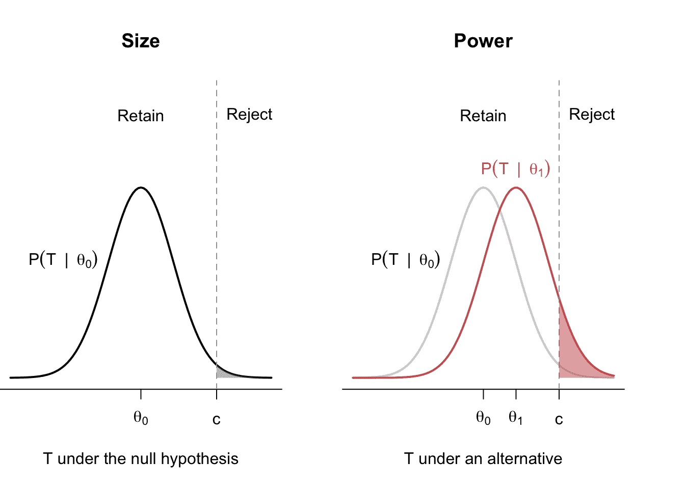
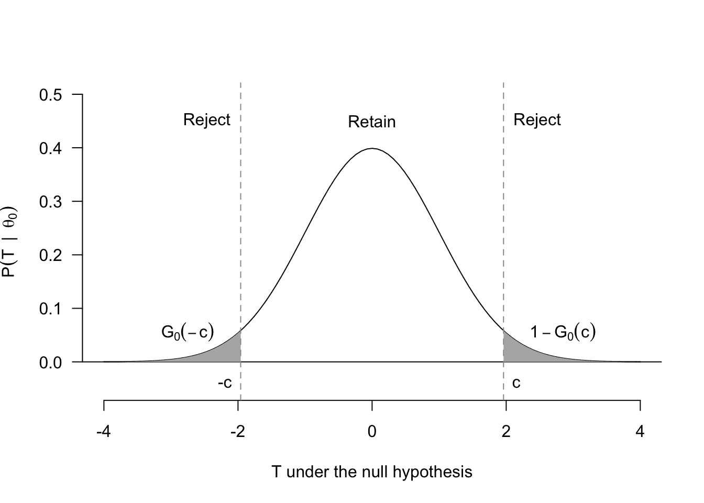
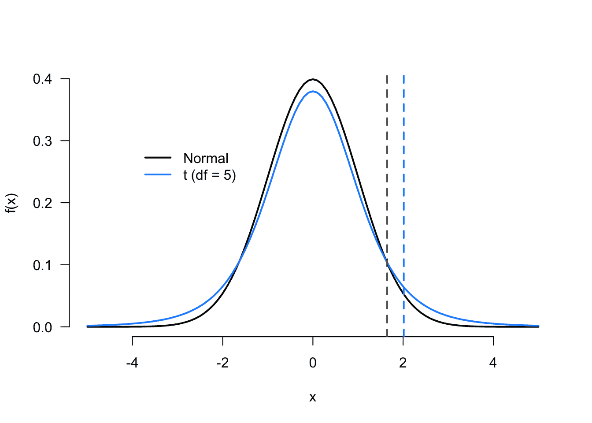

# 4 假设检验

> [`mattblackwell.github.io/gov2002-book/hypothesis_tests.html`](https://mattblackwell.github.io/gov2002-book/hypothesis_tests.html)

1.  统计推断

1.  4 假设检验

到目前为止，我们已经讨论了估计量的性质，这些性质允许我们在有限和大量样本中描述它们的分布。这些性质使我们能够说，例如，我们估计的均值差异等于重复样本中平均的真实处理效果，或者在大样本中它将收敛到真实值。然而，这些性质是重复样本的性质。另一方面，大多数研究人员只能接触到单个样本。“**统计推断**”是使用单个样本来了解总体参数的过程。正如我们将看到的，许多常见的统计推断技术直观上紧密相关。在社会科学中最普遍的一种是假设检验，这是一种统计思想实验。

## 4.1 女士品茶

女士品茶的故事是假设检验核心思想的例证。¹ 故事是这样的。20 世纪初的英国多才多艺的学者和统计学家 R.A.费舍尔为他的同事，算法学家 Muriel Bristol 准备了茶。知道她喜欢在茶中加牛奶，他先往茶杯里倒入牛奶，然后倒入热水并搅拌。但 Bristol 拒绝了这杯茶，说她更喜欢先倒茶再倒牛奶。费舍尔对任何人能否分辨出先倒牛奶还是先倒茶的区别表示怀疑，于是他和另一位同事 William Roach 设计了一个测试，看看 Bristol 能否分辨出两种不同的冲泡方法。

费舍尔和 Roach 准备了 8 杯茶，其中 4 杯先倒牛奶，4 杯先倒茶。然后他们随机地将这些杯子呈现给 Bristol（尽管她知道每种类型有 4 个），她正确地识别了所有的杯子。乍一看，这似乎是很好的证据表明她能分辨出两种不同的茶，但费舍尔作为一个天生的怀疑论者，提出了问题：“她只是随机猜测并碰巧猜对了？”这导致费舍尔进行了一个**统计思想实验**：如果她是在随机猜测，那么她识别正确杯子的概率会是多少？

要计算布里斯托尔正确识别四个先标记为牛奶的杯子的概率，请注意，“随机猜测”意味着她从 8 个杯子中选择一组 4 个杯子来标记为“先标记为牛奶”。使用基本的组合数学，从 8 个杯子中选择 4 个有 70 种方式，但只有 1 种排列是正确的。因此，如果随机猜测意味着在 70 个选项中平等地选择，那么猜对杯子组的概率是 1/70 或$\approx 0.014$。低概率意味着随机猜测的假设可能是不可信的。

女士品茶的故事概括了许多假设检验的核心要素。假设检验是关于观察到的估计（布里斯托尔正确识别所有四个杯子）在关于数据生成过程（布里斯托尔随机猜测）的某些假设或假设下有多可能。当观察到的估计在维持的假设下不太可能时，我们可能会将其视为对该假设的证据。因此，假设检验帮助我们评估对 DGP 特定猜测的证据。

**符号提醒** *在本章的其余部分，我们将按照过去章节中的符号介绍概念。我们将假设从分布$F$中抽取的随机变量$X_1, \ldots, X_n$是随机的（独立同分布）。我们将专注于估计该分布（如均值、中位数、方差等）的某些参数，并将$\Theta$称为$\theta$的可能值集合或**参数空间**。*  *## 4.2 假设

在假设检验的背景下，假设仅仅是关于总体分布的陈述。特别是，我们将做出$\theta = \theta_0$的陈述，其中$\theta_0 \in \Theta$是$\theta$的假设值，一个总体参数。假设在实证工作中无处不在。例如包括：

+   美国公民中自称为民主党人的比例是 0.33。

+   收到投票动员信件的家庭与未收到的家庭在平均选民投票率上的总体差异为 0。

+   签署了人权条约的国家与未签署的国家在平均人权侵犯发生率上的差异为 0。

这些都是关于真实 DGP 的陈述。后两个例子中，假设被表述为可能的非差异，这种情况非常常见。当$\theta$代表两组之间的均值差异时，$\theta = 0$是关于总体均值或无处理效应（如果识别了因果效应）没有实际差异的假设。

假设检验的目的是在两个互补假设之间进行裁决。

**定义 4.1** 假设检验中的两个假设被称为**零假设**和**备择假设**，分别表示为$H_0$和$H_1$。

这些假设是互补的，因此如果零假设是 $H_0: \theta \in \Theta_0$，那么备择假设就是 $H_1: \theta \in \Theta_0^c$。零假设中的“零”可能看起来有些奇怪，直到你意识到大多数零假设都是指没有某种治疗的效果或均值之间没有差异。例如，假设 $\theta$ 是接受了一些关于移民事实的亲移民信息治疗组的平均支持增加与仅接收移民事实的控制组之间的均值差异。通常的零假设会是均值之间没有差异或 $H_0: \theta = 0$，而备择假设会是 $H_1: \theta \neq 0$。实质上，零假设会假设两组之间在结果上没有平均差异——在这种情况下是增加合法移民的支持——之间。

有两种常见的测试类型，它们在零假设和备择假设的形式上有所不同。一种**双尾测试**的形式为 $$ H_0: \theta = \theta_0 \quad\text{versus}\quad H_1: \theta \neq \theta_0, $$ 其中“双尾”部分指的是备择假设包含了高于或低于零假设值 $\theta_0$ 的 $\theta$ 的值。

一种**单尾测试**的形式为 $$ H_0: \theta \leq \theta_0 \quad\text{versus}\quad H_1: \theta > \theta_0, $$ 或者 $$ H_0: \theta \geq \theta_0 \quad\text{versus}\quad H_1: \theta < \theta_0. $$ 其中“单尾”部分指的是备择假设只包含高于或低于零假设值的 $\theta$ 的值。双尾测试在社会科学中更为常见，主要是因为我们通常想知道是否有任何证据，无论是积极的还是消极的，反对没有治疗效应或两个变量之间没有关系的假设。单尾测试最适合具有明确方向性假设的情况，这些假设最好在收集数据之前预先注册。单尾测试方向的预先注册很重要，因为研究人员在看到数据后改变假设的方向可能会夸大对零假设的证据强度。因此，在非预先注册的设置中使用单尾测试应极其谨慎。尽管如此，不幸的是，双尾测试的数学也更为复杂。

## 4.3 假设检验的程序

在最基本层面上，**假设检验**是一个规则，它指定了样本数据的值，对于这些值我们将决定**拒绝**零假设。设 $\mathcal{X}_n$ 为样本的范围——即所有可能发生的有正概率的向量 $(x_1, \ldots, x_n)$。然后假设检验描述了这个空间的一个区域，$R \subset \mathcal{X}_n$，称为**拒绝域**，当 $(X_1, \ldots, X_n) \in R$ 时，我们将**拒绝**$H_0$，当数据不在这个区域时，$(X_1, \ldots, X_n) \notin R$，我们将**保留**、**接受**或**未能拒绝**零假设。²

我们如何决定拒绝域应该是什么？尽管我们用**样本空间**$\mathcal{X}_n$来定义拒绝域，但处理整个数据向量可能难以操作。我们通常用**检验统计量**$T = T(X_1, \ldots, X_n)$来表述拒绝域，其中拒绝域变为$$ R = \left\{(x_1, \ldots, x_n) : T(x_1, \ldots, x_n) > c\right\}, $$ 其中 $c$ 被称为**临界值**。这个表达式说明，拒绝域是那些使得检验统计量足够大的可能数据集的集合。因此，检验统计量是数据的函数，随着观测数据与零假设的不兼容性增加而增大。临界值（以及因此的拒绝域）标志着观测数据与零假设之间的差异足够大，以至于我们可以拒绝零假设。请注意，检验统计量是一个随机变量，并且具有分布。我们将在后面利用这一点来更好地理解假设检验的不同特性。

考虑一个简单的单侧检验，当你感觉有点不适时，试图确定你是否有一个正常的体温 98.7 华氏度，或者你是否发烧。在这种情况下，温度计读数是检验统计量，因为读数越大，与正常体温的一致性越低。然而，温度计是不完美且嘈杂的工具，所以即使一个人的体温正常，读数也可能与 98.7 不同。因此，我们可以使用如读数超过 100.5 度的拒绝域来确定何时拒绝正常体温的零假设。

**示例 4.1** 假设 $(X_1, \ldots, X_n)$ 代表一个美国公民的样本，其中 $X_i = 1$ 表示支持现任美国总统，$X_i = 0$ 表示反对（不支持）。一个良好且合理的零假设是总统没有得到大多数美国公民的支持。设 $\mu = \E[X_i] = \P(X_i = 1)$。那么，一侧测试将比较两个假设：$$ H_0: \mu \leq 0.5 \quad\text{versus}\quad H_1: \mu > 0.5. $$ 在这种情况下，我们可能会使用样本均值作为检验统计量，即 $T(X_1, \ldots, X_n) = \Xbar_n$，我们必须找到一些高于 0.5 的阈值，以便我们拒绝零假设，$$ R = \left\{(x_1, \ldots, x_n): \Xbar_n > c\right\}. $$ 用话来说，我们是在问，在拒绝总统缺乏多数支持的观点之前，我们应该看到多少支持？以下我们将选择临界值 $c$ 以具有有益的统计特性。

拒绝域的结构将取决于测试是一侧还是两侧。这是两种测试类型之间的重要区别点，我们将在下面再次提及。一侧测试将采取 $T > c$ 的形式，而两侧测试将采取 $|T| > c$ 的形式，因为我们希望将来自零假设两边的偏差都视为反对该零假设的证据。

## 4.4 测试错误

假设检验以拒绝零假设或不拒绝零假设的决定结束，但这种决定可能是不正确的。特别是，在这个设置中有两种犯错误的方式和两种正确的方式，如表 4.1 所示。标签可能令人困惑，但请记住，**第一类错误**（称为“第一类”）之所以被这样标记，是因为它们是两种错误中最糟糕的。第一类错误发生在我们拒绝了一个实际上是真的零假设时。例如，如果我们有一个关于治疗组和对照组之间没有治疗效应的零假设，并且我们拒绝了那个零假设（并得出结论说确实存在某种治疗效应），那么如果实际上零假设是真的——也就是说，没有真正的治疗效应，但我们得出结论说有——我们就会犯第一类错误。第一类错误就是我们看到的复制危机：许多后来被证明为零的“显著”效应。

**第二类错误**（称为“第二类”）通常被认为问题不大。对于这类错误，确实存在一种真实的关系，但我们无法用我们的测试检测到它。也就是说，我们不会拒绝一个错误为零的零假设。例如，如果我们有一个关于治疗组和对照组之间没有治疗效应的零假设，如果我们实际上在治疗组和对照组之间存在差异，但我们得出结论说没有差异（我们没有拒绝零假设），那么我们就会犯第二类错误。

表 4.1：测试错误的类型学

|  | $H_0$ True | $H_0$ False |
| --- | --- | --- |
| 保持 $H_0$ | 精彩 | 第二类错误 |
| 拒绝 $H_0$ | 第一类错误 | 很大 |

理想情况下，我们会尽量减少犯第一类或第二类错误的概率。不幸的是，因为测试统计量是一个随机变量，我们无法完全消除错误的概率。相反，我们将推导出具有某些保证性能的测试，以最小化第一类错误的概率，通常这是更令人反感的错误类型。为了推导这一点，我们可以定义测试的 **功效函数**，$$ \pi(\theta) = \P\left( \text{Reject } H_0 \mid \theta \right) = \P\left( T \in R \mid \theta \right), $$ 这是拒绝概率作为感兴趣参数 $\theta$ 的函数。功效函数告诉我们，例如，当我们改变实际的治疗效果大小（在这种情况下是 $\theta$）时，我们拒绝无治疗效果（无差异）的零假设的可能性有多大。

我们可以从功效函数中定义第一类错误的概率。

**定义 4.2** 对于零假设 $H_0: \theta = \theta_0$ 的假设检验的大小是 $$ \pi(\theta_0) = \P\left( \text{Reject } H_0 \mid \theta_0 \right). $$

你可以将测试的大小视为测试产生的假阳性（或假发现）的速率。图 4.1 展示了一个单侧测试的拒绝区域、大小和功率的示例。在左侧面板中，我们有在零假设 $H_0: \theta = \theta_0$ 下的测试统计量的分布，拒绝区域由 $T > c$ 的值定义。我们将零假设下的测试统计量的分布称为 **零分布** 或 **参考分布**。阴影灰色区域是在此零假设下拒绝的概率，即测试的大小。有时，即使是在零假设下，我们也会由于随机机会而得到极端样本，从而导致假发现。³

在右侧面板中，我们叠加了在特定备择假设下的测试统计量的分布，$\theta = \theta_1 > \theta_0$。红色阴影区域是在此备择假设为真时的拒绝零假设的概率——这是在零假设为假时正确拒绝零假设的概率。直观上，我们可以看到，产生测试统计量更接近拒绝区域的备择假设将具有更高的功效。这是有道理的：检测与零假设的大偏差应该比检测小偏差更容易。



图 4.1：测试的大小与备择假设的功率。

图 4.1 也暗示了大小和功率之间的权衡。注意，我们可以通过将临界值增加到 $c' > c$ 来减小大小（降低假阳性率）。这将使拒绝域的概率更小，$\P(T > c' \mid \theta_0) < \P(T > c \mid \theta_0)$，从而导致测试的大小降低。不幸的是，这也会在右侧面板中降低功率，因为在任何备择假设下，拒绝域的概率都会更低，$\P(T > c' \mid \theta_1) < \P(T > c \mid \theta_1)$。这意味着我们通常不能同时减少这两种错误。

## 4.5 确定拒绝域

如果我们不能同时优化测试的大小和功率，我们应该如何确定拒绝域的位置？也就是说，我们应该如何决定什么经验证据足够强大，以至于我们可以拒绝零假设？标准的方法是控制测试的大小（即控制假阳性的比率）并尝试在那种约束下最大化测试的功率。因此，我们说，“我愿意接受最多 X%”的发现将是假阳性，并尽我们所能在这个约束下最大化功率。

**定义 4.3** 一个测试如果其大小小于或等于 $\alpha$，或者 $\pi(\theta_0) \leq \alpha$，则具有**显著性水平** $\alpha$。

一个显著性水平为 $\alpha = 0.05$ 的测试将会有一个假阳性/第一类错误的比率不超过 0.05。这个水平在社会科学中很常见，尽管你也会看到 $\alpha = 0.01$ 或 $\alpha = 0.1$。频率主义者通过说这意味着当 $\alpha = 0.05$ 时，最多只有 5% 的研究会产生错误的发现来证明这一点。

我们的任务是构建一个拒绝域，使得测试统计量的**零分布** $G_0(t) = \P(T \leq t \mid \theta_0)$ 在该区域内的概率小于 $\alpha$。像图 4.1 中的单侧测试是最容易展示的，尽管我们警告你不要使用它们。我们希望选择 $c$，使得在该尾部中不会超过 $\alpha$ 的概率，或者 $$ \P(T > c \mid \theta_0) = 1 - G_0(c) \leq \alpha. $$ 记住，我们可以使用的 $c$ 的值越小，功率就越大，这意味着在保持显著性水平的同时，最大功率的临界值是 $1 - G_0(c) = \alpha$。我们可以使用零分布的**分位数函数**来找到所需的 $c$ 的确切值， $$ c = G^{-1}_0(1 - \alpha), $$ 这实质上意味着，“零分布中 $1-\alpha$ 的值所在的点。”

拒绝域的确定遵循双边检验的相同原则，但更为复杂，因为我们是在测试统计量的绝对值大时进行拒绝，即 $|T| > c$。展示了基本设置。请注意，由于存在两个（不相交）区域，一个在左侧，一个在右侧，我们可以将大小（假阳性率）表示为 $$ \pi(\theta_0) = G_0(-c) + 1 - G_0(c). $$ 在大多数情况下，此类检验的零分布将围绕 0 对称（通常是渐进标准正态分布，实际上），这意味着 $G_0(-c) = 1 - G_0(c)$。这反过来又意味着大小是 $$ \pi(\theta_0) = 2(1 - G_0(c)). $$ 解出使此 $\alpha$ 成立的临界值给出 $$ c = G^{-1}_0(1 - \alpha/2). $$ 再次，这个公式可能看起来很密集，但记住你在做什么：找到将零分布概率的 $\alpha/2$ 放在每个尾部的值。



图 4.2：双边检验的拒绝域。

## 4.6 样本均值假设检验

考虑以下关于样本均值假设检验的扩展示例，有时也称为**单样本检验**，因为我们通常只使用一个样本统计量（本例中的样本均值）并将其与某种自然概念基准进行比较。假设 $X_i$ 代表关于“自由主义者”作为一个群体在 0 到 100 的量表上的感觉温度计得分，数值接近 0 表示对自由主义者的感觉较冷，数值接近 100 表示对自由主义者的感觉较暖。（这与许多全国代表性调查中的许多调查项目类似，如美国的 ANES。）我们想知道总体平均值是否与 50 这个值不同，这是一个很好的基准，可以表明对自由主义者的感觉大致中立。我们可以将这个双边检验写成 $$ H_0: \mu = 50 \quad\text{versus}\quad H_1: \mu \neq 50, $$ 其中 $\mu = \E[X_i]$。此类检验的标准测试统计量是所谓的**t 统计量**， $$ T = \frac{\left( \Xbar_n - \mu_0 \right)}{\sqrt{s² / n}} =\frac{\left( \Xbar_n - 50 \right)}{\sqrt{s² / n}}, $$ 其中 $\mu_0$ 是感兴趣的零值，$s²$ 是样本方差。如果零假设为真，那么根据中心极限定理，我们知道 t 统计量是渐进正态的，$T \indist \N(0, 1)$。因此，我们可以用标准正态分布来近似零分布。

*警告* *各种检验的名称可能相当令人困惑，因为它们非常相似。之前，我们讨论了一元检验与二元检验的区别，它们在考虑的备择假设方面有所不同。一元检验和二元检验描述了我们要比较多少个组均值。在一元检验中，我们比较一个总体均值与一个固定值。对于二元检验（下面将更详细地描述），我们通常对两个总体均值之间的差异提出零假设。*  *让我们创建一个显著性水平为 $\alpha = 0.05$ 的双尾检验，这是我们对 I 类错误的容忍度。然后我们需要找到一个拒绝域，将 $0.05$ 的概率放在零分布的尾部，正如我们刚才看到的，它是 $\N(0,1)$。设 $\Phi()$ 为标准正态分布的累积分布函数（CDF），设 $\Phi^{-1}()$ 为标准正态分布的分位数函数。借鉴我们上面发展的内容，你可以找到值 $c$，使得 $\P(|T| > c \mid \mu_0)$ 为 0.05，有 $$ c = \Phi^{-1}(1 - 0.05/2) \approx 1.96, $$ 这意味着如果一个检验在 $|T| > 1.96$ 时拒绝，那么它从渐近意义上讲将具有 0.05 的显著性水平。*  *## 4.7 Wald 检验

我们可以将样本均值的假设检验推广到更广泛的估计量。设 $\widehat{\theta}_n$ 是某个参数 $\theta$ 的估计量，设 $\widehat{\textsf{se}}[\widehat{\theta}_n]$ 是估计量标准误差的一致估计，$\textsf{se}[\widehat{\theta}_n] = \sqrt{\V[\widehat{\theta}_n]}$。我们考虑双尾检验 $$ H_0: \theta = \theta_0 \quad\text{versus}\quad H_1: \theta \neq \theta_0. $$

在许多情况下，我们的估计量将根据中心极限定理（CLT）的某个版本渐近正态分布，因此在零假设下，我们有 $$ T = \frac{\widehat{\theta}_n - \theta_0}{\widehat{\textsf{se}}[\widehat{\theta}_n]} \indist \N(0, 1). $$ 当 $|T| > z_{\alpha/2}$ 时，**Wald 检验**拒绝 $H_0$，其中 $z_{\alpha/2}$ 将 $\alpha/2$ 放在标准正态分布的上尾。也就是说，如果 $Z \sim \N(0, 1)$，那么 $z_{\alpha/2}$ 满足 $\P(Z \geq z_{\alpha/2}) = \alpha/2$。

*注意* *在 R 中，你可以使用 `qnorm()` 函数轻松找到 $z_{\alpha/2}$ 的值：

```r
qnorm(0.05 / 2, lower.tail = FALSE)
```

*```r
[1] 1.959964
```**  ****定理 4.1** 从渐近意义上讲，Wald 检验的显著性水平为 $\alpha$，满足 $$ \P(|T| > z_{\alpha/2} \mid \theta_0) \to \alpha. $$

这个结果非常通用，意味着基于估计量的许多假设检验将具有相同的形式。不同估计量之间的主要区别将在于我们如何计算估计的标准误差。

**示例 4.2（比例差异）** 在政治科学中，投票动员（GOTV）实验很常见。一个典型的 GOTV 设计可能将一组公民随机分配到接收鼓励他们投票的邮件，而对照组则没有收到任何信息。我们将定义处理组中的投票变量，$Y_{1}, Y_{2}, \ldots, Y_{n_t}$，作为从成功概率为 $p_t$ 的伯努利分布中独立同分布抽取的样本，这代表了接受处理的群体的总体投票率。对照组的结果，$X_{1}, X_{2}, \ldots, X_{n_c}$，是从另一个成功概率为 $p_c$ 的伯努利分布中独立同分布抽取的样本，这代表了未收到邮件的公民的总体投票率。

我们的目标是了解这种治疗对公民投票的影响，$\tau = p_t - p_c$，我们将使用样本均值/比例的差异作为我们的估计量，$\widehat{\tau} = \Ybar - \Xbar$。要进行 Wald 检验，我们需要知道或估计这个估计量的标准误差。注意，因为这些样本是独立的，所以方差是 $$ \V[\widehat{\tau}_n] = \V[\Ybar - \Xbar] = \V[\Ybar] + \V[\Xbar] = \frac{p_t(1-p_t)}{n_t} + \frac{p_c(1-p_c)}{n_c}, $$ 其中第三个等式来自于事实，即潜在的因变量 $Y_i$ 和 $X_j$ 是二元的。显然，我们不知道真实的总体比例 $p_t$ 和 $p_c$（这就是我们进行检验的原因！），但我们可以通过用它们的估计值来估计标准误差 $$ \widehat{\textsf{se}}[\widehat{\tau}] = \sqrt{\frac{\Ybar(1 -\Ybar)}{n_t} + \frac{\Xbar(1-\Xbar)}{n_c}}. $$

在这个**双样本检验**中，典型的零假设检验是“无治疗效应”与“某些治疗效应”之间的比较：$$ H_0: \tau = p_t - p_c = 0 \quad\text{versus}\quad H_1: \tau \neq 0, $$ 这给出了 Wald 检验的以下统计量 $$ T = \frac{\Ybar - \Xbar}{\sqrt{\frac{\Ybar(1 -\Ybar)}{n_t} + \frac{\Xbar(1-\Xbar)}{n_c}}}. $$ 如果我们想要一个水平为$\alpha = 0.01$的检验，当$|T| > 2.58$时，我们将拒绝零假设，

```r
qnorm(0.01/2, lower.tail = FALSE)
```

*```r
[1] 2.575829
```*  ***示例 4.3（均值差异）** 考虑一个具有随机分配的处理组和对照组的类似例子，但现在处理是向政治运动呼吁财务捐款，结果是对个人捐赠金额的连续度量。处理数据 $Y_1, \ldots, Y_{n_t}$ 是从具有均值 $\mu_t = \E[Y_i]$ 和总体方差 $\sigma²_t = \V[Y_i]$ 的总体中独立同分布抽取的样本。对照组数据 $X_1, \ldots, X_{n_c}$ 是独立于 $Y_i$ 的从具有均值 $\mu_c = \E[X_i]$ 和总体方差 $\sigma²_c = \V[X_i]$ 的总体中独立同分布抽取的样本。感兴趣的参数与之前类似：总体均值差异，$\tau = \mu_t - \mu_c$。我们将形成通常的假设检验 $$ H_0: \tau = \mu_t - \mu_c = 0 \quad\text{versus}\quad H_1: \tau \neq 0. $$

与比例差异设置相比，这个设置与差异比例设置之间的唯一区别在于，这里的标准误差不同，因为我们不能依赖于二元结果。相反，我们将利用我们对样本均值抽样方差以及样本之间独立性的知识来推导$$ \V[\widehat{\tau}] = \V[\Ybar] + \V[\Xbar] = \frac{\sigma²_t}{n_t} + \frac{\sigma²_c}{n_c}, $$ 其中我们可以用样本方差来估计未知总体方差 $$ \widehat{\se}[\widehat{\tau}] = \sqrt{\frac{s²_t}{n_t} + \frac{s²_c}{n_c}}. $$ 我们可以使用这个估计量来推导 Wald 统计量 $$ T = \frac{\widehat{\tau} - 0}{\widehat{\se}[\widehat{\tau}]} = \frac{\Ybar - \Xbar}{\sqrt{\frac{s²_t}{n_t} + \frac{s²_c}{n_c}}}, $$ 如果我们希望渐进水平为 0.05，则当 $|T| > 1.96$ 时可以拒绝。***

假设检验框架侧重于在不确定性的情况下做出决策——拒绝零假设或不拒绝——。你选择一个你感到舒适的错误水平（假阳性率，或 $\alpha$），然后基于拒绝区域坚定地决定零假设与备择假设。

话虽如此，请注意，我们正在人为地丢弃有关观察数据与零假设之间距离的信息。在上一个例子中，如果 $T = 1.95$，我们会“接受”零假设，但如果 $T = 1.97$，我们会拒绝它，尽管这些非常相似。仅仅报告拒绝/保留决定也未能给我们一个关于我们可能在哪个水平上拒绝零假设的感觉。再次强调，如果我们需要做出单一决策，这是有意义的：其他测试无关紧要，因为我们仔细考虑了我们的 $\alpha$ 水平测试。但在学术社会科学的低风险世界中，我们可以提供更多信息。

报告拒绝/保留决定的一个替代方案是报告 **p 值**。

**定义 4.4** 测试的 **p 值**是在备择假设方向上观察到至少与观察到的测试统计量一样极端的测试统计量的概率。

“在备择假设的方向上”这一行处理了一侧测试与双侧测试之间的不幸头痛问题。对于一侧测试，其中 $T$ 的较大值对应于对 $H_1$ 的更多证据，p 值为 $$ \P(T(X_1,\ldots,X_n) > T \mid \theta_0) = 1 - G_0(T), $$ 而对于（对称的）双侧测试，我们有 $$ \P(|T(X_1, \ldots, X_n)| > |T| \mid \theta_0) = 2(1 - G_0(|T|)). $$

在任何情况下，p 值的解释都是相同的。它是测试会拒绝零假设的最小显著性水平$\alpha$。呈现 p 值允许读者确定自己的$\alpha$水平，并快速判断在这种情况下是否有足够的证据来拒绝$H_0$。因此，p 值是观察数据与零假设之间差异的**连续**度量。较低的值表示差异更大，因为观察结果在零假设下出现的可能性更小。

围绕 p 值的大部分争议集中在确定统计显著性的任意 p 值截断上，有时还涉及出版决策。这些问题不是 p 值的错，而是对拒绝/保留决策的过度关注，这种决策是基于任意的测试水平，如$\alpha = 0.05$。最好将 p 值视为将测试统计量转换到 0 到 1 之间共同尺度的变换。

**警告**：人们使用许多统计陈词滥调来识别那些不懂统计学的人，这些批评有时依赖于看似微妙的解释差异，这些差异很容易忽略。然而，如果你已经直觉性地掌握了核心概念，那么避免这些常见陷阱会容易得多。

关于 p 值的一个陈词滥调是，有时人们将它们解释为“零假设为真的概率。”但从我们的定义来看，这没有意义，因为 p 值**依赖于**零假设——它不能告诉我们任何关于零假设为真的概率。一个更有用的比喻是，假设检验是统计思维实验，而 p 值回答的问题是：如果零假设为真，我的数据会有多大概率？** 

想象一下，你投入了大量研究预算进行了一个大实验，以测试一个新颖且令人兴奋的理论，但结果却显示……你未能拒绝无处理效应的零假设。这种情况可能出现在两种可能的世界状态下：（1）零假设是真的，而你正确地未能拒绝它，或者（2）零假设是假的，但测试的效力不足，无法检测到真实效应（即，无法让你拒绝零假设）。由于这是事后不希望的不确定性，研究人员在收集数据之前进行**功效分析**是很常见的。这些分析预测了确保你可以在假设效应大小下拒绝零假设所需的样本量。这些假设效应大小对于这项练习至关重要，通常来自先前的研究或对该领域的实质性知识。

通常，功效分析涉及计算不同值下的功效函数 $\pi(\theta) = \P(T(X_1, \ldots, X_n) \in R \mid \theta)$。它还可能涉及特定备择假设 $\theta_1$，即假设的治疗效果的样本量计算。在这种情况下，我们试图找到样本量 $n$，使得功效 $\pi(\theta_1)$ 尽可能接近一个特定值（通常是 0.8）。对于更简单的单侧检验，求解样本量是直接的。然而，对于更一般的情况或双侧检验，我们通常需要数值或基于模拟的方法来找到最佳样本量。

使用 Wald 检验，我们可以很容易地描述功效函数，即使该检验不允许我们轻松地回推出样本量计算。

**定理 4.2** 对于具有渐近正态估计量的 Wald 检验，特定备择假设 $\theta_1 \neq \theta_0$ 的功效函数为 $$ \pi(\theta_1) = 1 - \Phi\left( \frac{\theta_0 - \theta_1}{\widehat{\se}[\widehat{\theta}_n]} + z_{\alpha/2} \right) + \Phi\left( \frac{\theta_0 - \theta_1}{\widehat{\se}[\widehat{\theta}_n]}-z_{\alpha/2} \right). $$

## 4.10 正态数据下的精确检验

上面的 Wald 检验依赖于大样本近似，但这些在有限样本中可能不成立。我们能否在任何样本量下得到**精确**推断？是的，如果我们对数据做出更强的假设。特别是，假设数据遵循**参数模型**，其中 $X_1,\ldots,X_n$ 是从 $N(\mu,\sigma²)$ 中独立同分布抽取的样本。在零假设 $H_0: \mu = \mu_0$ 下，我们可以证明 $$ T_n = \frac{\Xbar_n - \mu_0}{s_n/\sqrt{n}} \sim t_{n-1}, $$ 其中 $t_{n-1}$ 是具有 $n-1$ 个自由度的**学生 t 分布**。这个结果意味着零分布是 t 分布，因此我们使用 t 分布的分位数作为临界值。对于单侧检验，$c = G^{-1}_0(1 - \alpha)$，但现在 $G_0$ 是具有 $n-1$ 个自由度的 t 分布，因此我们使用 `qt()` 而不是 `qnorm()` 来计算这些临界值。

t 分布的临界值总是大于正态分布，因为 t 分布的尾部更厚，如 图 4.3 所示。然而，当 $n\to\infty$ 时，t 分布收敛到标准正态分布，因此它在渐近上等同于 Wald 检验，但在有限样本中稍微更保守。大多数软件包基于 t 分布计算 p 值和拒绝域，以利用这种保守性。



图 4.3：正态分布与 t 分布的比较。

## 4.11 置信区间和假设检验

初看起来，我们可能在上一章中使用 $\alpha$ 推导 $1 - \alpha$ 置信区间，在本章中使用 $\alpha$ 水平的检验时可能显得有些草率。实际上，我们是在预示置信区间和假设检验之间的深刻联系：每一个 $1-\alpha$ 置信区间都包含所有我们用 $\alpha$ 水平的检验**不会拒绝**的零假设。

这种联系可以通过渐近正态估计量 $\widehat{\theta}_n$ 最容易地看出。考虑以下假设检验：$$ H_0: \theta = \theta_0 \quad \text{vs.}\quad H_1: \theta \neq \theta_0, $$ 使用检验统计量，$$ T = \frac{\widehat{\theta}_{n} - \theta_{0}}{\widehat{\se}[\widehat{\theta}_{n}]}. $$ 如我们之前讨论的，当 $|T| > 1.96$ 时，或者当 $$ |\widehat{\theta}_{n} - \theta_{0}| > 1.96 \widehat{\se}[\widehat{\theta}_{n}]. $$ 这个零假设会被拒绝。注意，当 $$ \theta_{0} < \widehat{\theta}_{n} - 1.96\widehat{\se}[\widehat{\theta}_{n}]\quad \text{或}\quad \widehat{\theta}_{n} + 1.96\widehat{\se}[\widehat{\theta}_{n}] < \theta_{0} $$ 时，这将是真的，或者等价地，零假设位于 95% 置信区间之外，$$\theta_0 \notin \left[\widehat{\theta}_{n} - 1.96\widehat{\se}[\widehat{\theta}_{n}], \widehat{\theta}_{n} + 1.96\widehat{\se}[\widehat{\theta}_{n}]\right].$$

我们对零假设的选择是任意的，这意味着任何位于 95% 置信区间之外的零假设都会被 $\alpha = 0.05$ 水平的检验拒绝。而任何位于置信区间内的零假设是我们不会拒绝的。

这种关系更为广泛。任何 $1-\alpha$ 置信区间都包含所有可能的参数值，这些值在 $\alpha$ 水平的假设检验中不会被拒绝作为零假设。这种联系有两个原因：

1.  我们可以通过检查它是否落在置信区间中来快速确定在某个水平上是否会拒绝零假设。例如，快速查看 0 是否包含在置信区间中，是检查无治疗效应的零假设是否被拒绝的快速简单的方法——如果它包含在内，则零假设不能被拒绝。

1.  在某些情况下，确定置信区间可能很困难，但进行假设检验却很直接。然后，我们可以找到检验的拒绝域，并确定在 $\alpha$ 水平下哪些零假设不会被拒绝，从而制定 $1-\alpha$ 置信区间。我们称这个过程为**检验的逆运算**。这种方法的一个关键应用是基于有限总体分析中的随机化推断，制定治疗效应的置信区间。

## 4.12 摘要

在本章中，我们介绍了假设检验的基础，这是一种统计思维实验。我们假设我们知道世界的真实状态，并确定在我们的观察数据中，这种情况下的数据有多不可能。我们描述了不同类型的测试（单侧与双侧），介绍了测试的性质（大小和功效），并展示了如何确定测试的拒绝域。我们还描述了 Wald 测试，这是一种可以在广泛环境中使用的通用测试。P 值是观察数据与零假设之间差异的连续度量。功效分析允许研究人员预测他们需要多大的样本才能以足够的统计功效检测到不同的效应量。最后，置信区间和假设检验紧密相连，因为置信区间将包含所有在特定 $\alpha$ 下无法拒绝的零假设。

我们现在已经从高层次上涵盖了统计推断的基本工具，并展示了如何将它们应用于样本均值或样本均值差异等简单估计量。本书的第二部分，我们将转向将这些想法应用于定量社会科学中的主要估计量——普通最小二乘法。

Senn, Stephen. 2012\. “Tea for Three: Of Infusions and Inferences and Milk in First.” *Significance* 9 (6): 30–33\. https://doi.org/[`doi.org/10.1111/j.1740-9713.2012.00620.x`](https://doi.org/10.1111/j.1740-9713.2012.00620.x).

* * *

1.  这里的大部分分析来自 Senn (2012)↩︎

1.  不同的人和不同的教科书描述了当我们不拒绝零假设时应该怎么做是不同的。只要您理解拒绝零假设并不意味着零假设在逻辑上是错误的，以及“接受”（或未能拒绝）零假设并不意味着零假设在逻辑上是正确的，术语并不那么重要。↩︎

1.  留意细节的读者会注意到这里测试的零假设是一个点，而我们之前在单侧测试中将零假设定义为区域 $H_0: \theta \leq \theta_0$。技术上，测试的大小将根据我们选择哪个零假设而变化。在这个例子中，请注意，任何位于 $\theta_0$ 左侧的零假设都会导致更小的测试大小。因此，边界上的零假设 $\theta_0$ 将最大化测试的大小，使其成为最“保守”的零假设进行研究。技术上，我们应该将测试的大小定义为 $\alpha = \sup_{\theta \in \Theta_0} \pi(\theta)$↩︎******
