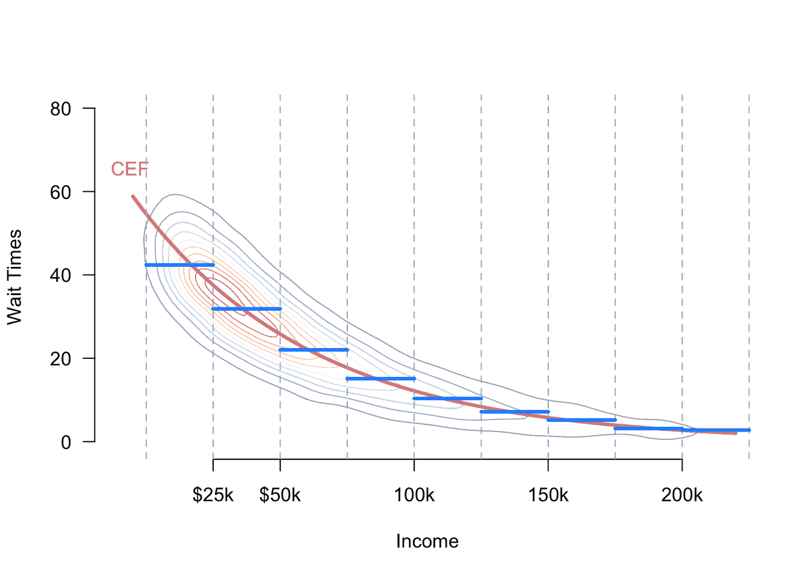
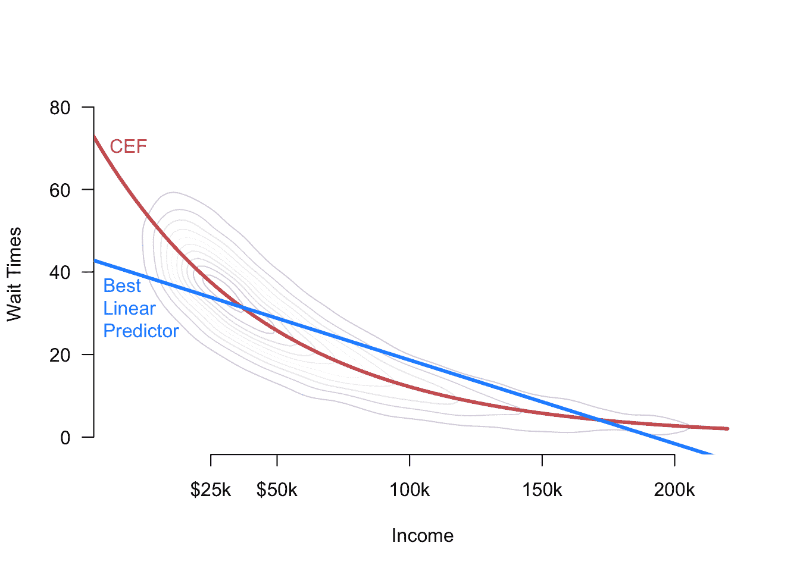
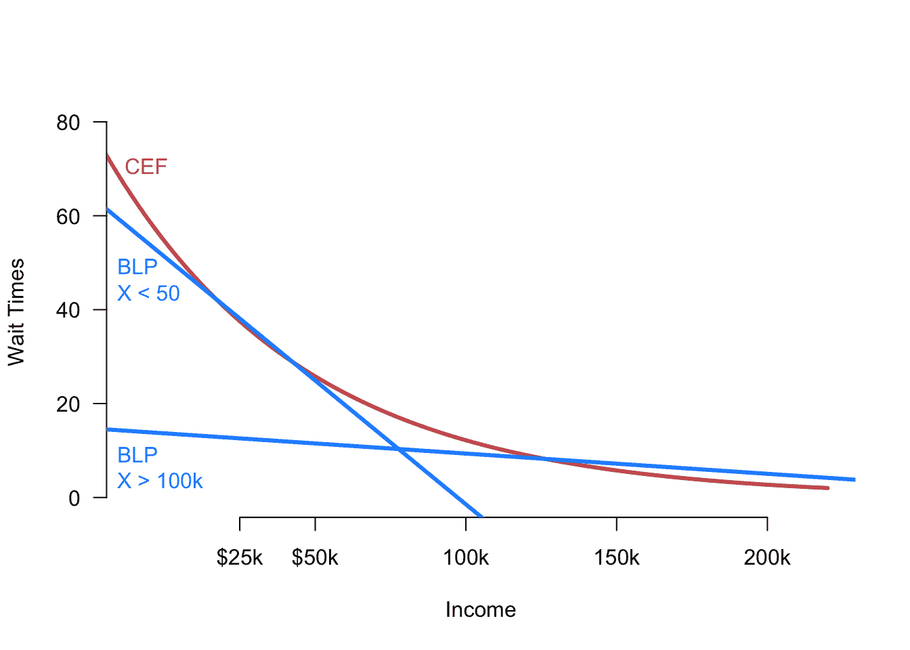

# 5  线性回归

> 原文：[`mattblackwell.github.io/gov2002-book/linear_model.html`](https://mattblackwell.github.io/gov2002-book/linear_model.html)

1.  回归

1.  5  线性回归

回归简单来说是一套评估**结果变量**，$Y_i$，和一组**协变量**，$\X_i$之间关系的工具。特别是，这些工具展示了$Y_i$的条件均值如何随$\X_i$的变化而变化。例如，我们可能想知道投票点的等待时间如何随该地区的各种社会经济特征（如收入和种族构成）的变化而变化。我们可以通过估计给定协变量的**回归函数**或**条件期望函数**（CEF）来完成这项任务，$$ \mu(\bfx) = \E[Y_i \mid \X_i = \bfx]. $$ 为什么这个回归函数的估计和推断是特殊的？为什么我们不能仅仅使用我们之前看到的均值、方差、协方差等方法呢？CEF 的基本问题是可能存在许多可以发生的值$\bfx$和许多不同的条件期望需要估计。如果$\X_i$中的任何变量是连续的，我们必须估计$\mu(\bfx)$的无限多个可能值，并且当我们向$\X_i$添加协变量时，这个问题会变得更糟。正因为如此，我们将这个问题称为**维度诅咒**。我们如何用我们可怜的有限数据来解决这个问题呢？

在本章中，我们将探讨两种解决“维度诅咒”的方法：（1）假设它不存在，和（2）将感兴趣的量改变为更容易估计的东西。

回归在许多科学领域都非常普遍，以至于它产生了很多习得的符号负担。特别是，$Y_i$和$\X_i$的标签差异很大：

+   结果也可以称为：响应变量、因变量、标签（在机器学习中）、左侧变量或回归量

+   协变量也被称为：解释变量、自变量、预测变量、右侧变量、回归变量、输入或特征

## 5.1 我们为什么需要模型？

初看起来，CEF 与参数模型之间的联系可能不太清晰。例如，假设我们感兴趣的是估计投票点（$Y_i$）中黑人选民（$X_i = 1$）与非黑人选民（$X_i=0$）的平均等待时间。在这种情况下，有两个参数需要估计，$$ \mu(1) = \E[Y_i \mid X_i = 1] \quad \text{和}\quad \mu(0) = \E[Y_i \mid X_i = 0], $$ 我们可以通过使用插值估计量来估计这些参数，这些估计量用样本均值代替总体均值，$$ \widehat{\mu}(1) = \frac{\sum_{i=1}^{n} Y_{i}\mathbb{1}(X_{i} = 1)}{\sum_{i=1}^{n}\mathbb{1}(X_{i} = 1)} \qquad \widehat{\mu}(0) = \frac{\sum_{i=1}^{n} Y_{i}\mathbb{1}(X_{i} = 0)}{\sum_{i=1}^{n}\mathbb{1}(X_{i} = 0)}. $$ 这些分别是黑人和非黑人选民等待时间的样本均值。由于这里的种族变量是离散的，我们只是在由种族定义的子群体内估计样本均值。如果有$k$个种族类别，我们就会有$k$个条件期望需要估计和$k$个（条件）样本均值。

现在假设我们想知道平均等待时间如何随着收入的变化而变化，使得$X_i$（本质上）是连续的。（也许这里的理论是，在选民更富裕的投票点中等待时间可能更低。）现在，对于从 0 到最富有收入者的收入，我们都有不同的条件期望。假设我们选择一个特定的收入，$42,238，并且我们感兴趣的条件期望是$\mu(42,238)= \E[Y_{i}\mid X_{i} = 42,238]$。我们可以使用与离散情况相同的插值估计量，$$ \widehat{\mu}(42,238) = \frac{\sum_{i=1}^{n} Y_{i}\mathbb{1}(X_{i} = 42,238)}{\sum_{i=1}^{n}\mathbb{1}(X_{i} = 42,238)}. $$ 这很简单，但这个估计量有一个明显的问题：在所有可能的情况下，特定的数据集中没有单位具有确切的收入，这意味着这个估计量是未定义的，因为我们将会除以零。

解决这个问题的方法之一是使用**子分类**将连续变量转换为离散变量，然后按照上述离散方法进行操作。例如，我们可以将收入分为$25,000 个区间，然后计算收入在，比如说，$25,000 到$50,000 之间的任何人的平均等待时间。当我们出于实际目的切换这个估计器时，我们需要将其与感兴趣的 DGP（数据生成过程）联系起来。我们可以**假设**感兴趣的 CEF（条件期望函数）只依赖于这些分组均值，从而得到：

$$ \mu(x) = \begin{cases} \E[Y_{i} \mid 0 \leq X_{i} < 25,000] &\text{if } 0 \leq x < 25,000 \\ \E[Y_{i} \mid 25,000 \leq X_{i} < 50,000] &\text{if } 25,000 \leq x < 50,000\\ \E[Y_{i} \mid 50,000 \leq X_{i} < 100,000] &\text{if } 50,000 \leq x < 100,000\\ \vdots \\ \E[Y_{i} \mid 200,000 \leq X_{i}] &\text{if } 200,000 \leq x\\ \end{cases} $$ 这种方法假设，也许是不正确的，平均等待时间在分组内不会变化。图 5.1 显示了收入和等待时间的假设联合分布，其中真实的 CEF，$\mu(x)$，以红色显示。该图还显示了由子分类创建的分组以及如果我们假设分组内均值恒定，所隐含的 CEF（蓝色）。请注意，蓝色函数近似真实的 CEF，但在分组边缘偏离。权衡是，一旦我们假设等待时间在分组内不变化，我们只需要为每个分组估计一个均值，而不是为每个可能的收入估计无限多个均值。

图 5.1：收入和排队等待时间的假设联合分布（等高线图），条件期望函数（红色），以及分箱收入的条件期望（蓝色）。

同样，我们可以**假设**CEF 遵循简单的函数形式，例如一条直线：$$ \mu(x) = \E[Y_{i}\mid X_{i} = x] = \beta_{0} + \beta_{1} x. $$ 这个假设将我们无限多的未知数（每个可能收入的条件均值）减少到只有两个未知数：（1）斜率和（2）截距。正如我们将看到的，我们可以使用标准的普通最小二乘法来估计这些参数。请注意，如果真实的 CEF 是非线性的，这个假设是不正确的，基于这个假设的任何估计可能是有偏的，甚至是不一致的。

我们称对$\mu(x)$的分组和线性假设为**函数形式**假设，因为它们限制了$\mu(x)$可以采取的函数类。虽然这些假设很有力，但它们可能会模糊定义感兴趣的数量和估计的角色。如果我们的估计量$\widehat{\mu}(x)$表现不佳，将很难判断这是否是因为估计量本身有缺陷，或者我们的函数形式假设是不正确的。

为了阐明这些问题，我们将采取不同的方法：首先理解线性回归在最小假设下可以估计什么，然后调查这种估计量如何近似真实的 CEF。

## 5.2 人口线性回归

### 5.2.1 双变量线性回归

让我们暂时放下条件期望函数的概念，转而寻找单个协变量 $X_i$ 的最佳线性函数来预测结果。回想一下你早期的数学训练，线性函数的形式是 $a + bX_i$。$Y_i$ 关于 $X_i$ 的最佳线性预测器（BLP）或**总体线性回归**定义为 $$ m(x) = \beta_0 + \beta_1 x \quad\text{其中， }\quad (\beta_{0}, \beta_{1}) = \argmin_{(b_{0}, b_{1}) \in \mathbb{R}^{2}}\; \E[(Y_{i} - b_{0} - b_{1}X_{i} )^{2}]. $$ 被最小化的表达式是预测误差的期望，或者说是观察到的结果与使用特定斜率和截距预测的结果之间的（平方）距离。最佳线性预测器是导致最低期望预测误差的线（即斜率和截距值）。请注意，这个函数是数据联合分布（DGP）的特征，因此我们无法直接观察到它。它必须被估计。BLP 是总结结果和协变量之间关系的另一种方法，尽管我们稍后讨论它们有时会相等。我们将 $(\beta_{0}, \beta_{1})$ 称为**总体线性回归系数**。请注意，如果后者是非线性的，$m(x)$ 可能会与 CEF $\mu(x)$ 差异很大。

我们可以使用标准微积分（对每个系数求导，将那些方程设为等于 0，并解这个方程组）来求解最佳线性预测器。在这种情况下，一阶条件是 $$ \begin{aligned} \frac{\partial \E[(Y_{i} - b_{0} - b_{1}X_{i} )^{2}]}{\partial b_{0}} = \E[-2(Y_{i} - \beta_{0} - \beta_{1}X_{i})] = 0 \\ \frac{\partial \E[(Y_{i} - b_{0} - b_{1}X_{i} )^{2}]}{\partial b_{1}} = \E[-2(Y_{i} - \beta_{0} - \beta_{1}X_{i})X_{i}] = 0 \end{aligned} $$ 由于期望的线性，我们可以很容易地用 $\beta_1$ 来求解 $\beta_0$，$$ \beta_{0} = \E[Y_{i}] - \beta_{1}\E[X_{i}]. $$ 我们可以将这个结果代入 $\beta_1$ 的一阶条件中，得到 $$ \begin{aligned} 0 &= \E[Y_{i}X_{i}] - (\E[Y_{i}] - \beta_{1}\E[X_{i}])\E[X_{i}] - \beta_{1}\E[X_{i}^{2}] \\ &= \E[Y_{i}X_{i}] - \E[Y_{i}]\E[X_{i}] - \beta_{1}(\E[X_{i}^{2}] - \E[X_{i}]^{2}) \\ &= \cov(X_{i},Y_{i}) - \beta_{1}\V[X_{i}]\\ \beta_{1} &= \frac{\cov(X_{i},Y_{i})}{\V[X_{i}]} \end{aligned} $$

因此，$Y_i$ 在 $X_i$ 上的种群线性回归的斜率等于这两个变量协方差与 $X_i$ 方差的比值。由此可知，协方差将决定斜率的符号：正协方差将导致正的 $\beta_1$，而负协方差将导致负的 $\beta_1$。此外，如果 $Y_i$ 和 $X_i$ 是独立的，则 $\beta_1 = 0$。斜率通过协变量的方差来缩放这个协方差，因此对于分布更广的协变量，斜率会较低，而对于分布较窄的协变量，斜率会较高。如果我们定义这些变量之间的相关系数为 $\rho_{YX}$，那么我们可以将系数与这个量联系起来，如下所示 $$ \beta_1 = \rho_{YX}\sqrt{\frac{\V[Y_i]}{\V[X_i]}}. $$

将这些各种结果汇总起来，我们可以将人口线性回归表示为 $$ m(x) = \beta_0 + \beta_1x = \E[Y_i] + \beta_1(x - \E[X_i]), $$ 这显示了我们是怎样通过协变量来调整对 $Y_i$ 的最佳猜测，即从结果的均值出发。

一定要记住，BLP（$m(x)$）、CEF（$\mu(x)$）是不同的实体。如果 CEF 是非线性的，如图 5.2 所示，这两个函数之间将存在差异，这意味着 BLP 可能产生较差的预测。我们将在下面推导 BLP 和 CEF 之间的正式联系。

图 5.2：CEF 和最佳线性预测器的比较。

### 5.2.2 超越线性近似

“最佳线性预测器”的线性部分比乍一看要宽松。我们可以轻松地将最小均方误差问题修改为寻找最佳二次、三次或一般多项式函数 $X_i$，以预测 $Y_i$。例如，最佳预测 $Y_i$ 的 $X_i$ 的二次函数将是 $$ m(X_i, X_i²) = \beta_0 + \beta_1X_i + \beta_2X_i² \quad\text{其中}\quad \argmin_{(b_0,b_1,b_2) \in \mathbb{R}³}\;\E[(Y_{i} - b_{0} - b_{1}X_{i} - b_{2}X_{i}^{2})^{2}]. $$ 虽然现在方程是协变量的二次函数，但它仍然是未知参数 $(\beta_{0}, \beta_{1}, \beta_{2})$ 的线性函数，所以我们仍然称这为最佳线性预测器。

我们可以用相同的方式将 $X_i$ 的高阶项包括在内，并且包括更多的多项式项，$X_i^p$，这将使 BLP 成为 $X_i$ 的更灵活的函数。然而，当我们估计 BLP 时，我们通常为此灵活性付出过拟合和估计高方差的成本。

### 5.2.3 基于多个协变量的线性预测

现在，我们将最佳线性预测器的概念推广到具有任意数量协变量的环境中，这可以更灵活地捕捉现实生活中的实证研究场景。在这个环境中，请记住，线性函数将是

$$ \bfx'\bfbeta = x_{1}\beta_{1} + x_{2}\beta_{2} + \cdots + x_{k}\beta_{k}. $$ 我们将定义**最佳线性预测器**（BLP）为 $$ m(\bfx) = \bfx'\bfbeta, \quad \text{其中}\quad \bfbeta = \argmin_{\mb{b} \in \real^k}\; \E\bigl[ \bigl(Y_{i} - \mb{X}_{i}'\mb{b} \bigr)²\bigr] $$

这个 BLP 解决了与双变量情况相同的根本优化问题：它选择一组系数，以最小化期望均方误差，这里的期望是关于数据的联合分布。

*最佳线性投影假设* *如果没有对数据的联合分布做出一些假设，以下“正则条件”将确保 BLP 的存在：

1.  $\E[Y²] < \infty$ (outcome has finite mean/variance)

1.  $\E\Vert \mb{X} \Vert² < \infty$ ($\mb{X}$ has finite means/variances/covariances)

1.  $\mb{Q}_{\mb{XX}} = \E[\mb{XX}']$是正定的（$\X$的列线性无关）*  *在这些假设下，可以使用矩阵微积分推导出**总体系数**$\bfbeta$的闭式表达式。为了建立优化问题，我们通过对平方误差的期望求导来找到一阶条件。首先，使用链式法则对平方预测误差求导：$$ \begin{aligned} \frac{\partial}{\partial \mb{b}}\left(Y_{i} - \X_{i}'\mb{b}\right)^{2} &= 2\left(Y_{i} - \X_{i}'\mb{b}\right)\frac{\partial}{\partial \mb{b}}(Y_{i} - \X_{i}'\mb{b}) \\ &= -2\left(Y_{i} - \X_{i}'\mb{b}\right)\X_{i} \\ &= -2\X_{i}\left(Y_{i} - \X_{i}'\mb{b}\right) \\ &= -2\left(\X_{i}Y_{i} - \X_{i}\X_{i}'\mb{b}\right), \end{aligned} $$ 其中第三个等式来自于$(Y_{i} - \X_{i}'\bfbeta)$是一个标量的事实。我们可以将这个结果代入期望中，得到一阶条件并求解$\bfbeta$，$$ \begin{aligned} 0 &= -2\E[\X_{i}Y_{i} - \X_{i}\X_{i}'\bfbeta ] \\ \E[\X_{i}\X_{i}'] \bfbeta &= \E[\X_{i}Y_{i}], \end{aligned} $$ 这意味着总体系数是 $$ \bfbeta = \left(\E[\X_{i}\X_{i}']\right)^{-1}\E[\X_{i}Y_{i}] = \mb{Q}_{\mb{XX}}^{-1}\mb{Q}_{\mb{X}Y} $$ 这给出了关于联合分布$(Y_{i}, \X_{i})$的总体最佳线性预测系数的表达式。

一些事实可能有助于实质性地解释这个表达式。回想一下，$\mb{Q}_{\mb{XX}} = \E[\X_{i}\X_{i}']$是一个$k\times k$矩阵，$\mb{Q}_{\X Y} = \E[\X_{i}Y_{i}]$是一个$k\times 1$列向量，这意味着$\bfbeta$也是一个$k \times 1$列向量。

*注意* *人口回归系数的表达式意味着什么？将截距或常数项分开是有帮助的，这样我们就有 $$ Y_{i} = \beta_{0} + \X'\bfbeta + e_{i}, $$ 因此 $\bfbeta$ 仅指协变量的系数向量。在这种情况下，我们可以以更可解释的方式写出系数：$$ \bfbeta = \V[\X]^{-1}\text{Cov}(\X, Y), \qquad \beta_0 = \mu_Y - \mb{\mu}'_{\mb{X}}\bfbeta $$

因此，人口系数取结果与协变量的协方差，并将其“除以”协变量方差和协方差的信息。截距将回归重新居中，使得投影误差的均值为零。这意味着这些系数将双变量公式推广到这个多个协变量环境中。*  *有了人口线性回归系数的表达式，我们可以将线性投影写为 $$ m(\X_{i}) = \X_{i}'\left(\E[\X_{i}\X_{i}']\right)^{-1}\E[\X_{i}Y_{i}] = \X_{i}'\mb{Q}_{\mb{XX}}^{-1}\mb{Q}_{\mb{X}Y} $$**  **### 5.2.4 投影误差

**投影误差**或是指 $Y_i$ 的实际值与投影之间的差异，$$ e_{i} = Y_{i} - m(\X_{i}) = Y_i - \X_{i}'\bfbeta, $$ 其中我们尚未对此误差做出任何假设。投影误差仅仅是针对数据中特定单位的最佳线性预测的预测误差。重新表述这个定义，我们可以看到我们总是可以将结果写成线性投影加上投影误差，$$ Y_{i} = \X_{i}'\bfbeta + e_{i}. $$ 注意这看起来与对 CEF 的线性假设非常相似，但我们在这里没有做出任何假设。相反，我们只是使用了投影误差的定义来写出一个自相矛盾的说法：$$ Y_{i} = \X_{i}'\bfbeta + e_{i} = \X_{i}'\bfbeta + Y_{i} - \X_{i}'\bfbeta = Y_{i}. $$ 与通常线性模型假设的关键区别在于 $e_{i}$ 所具有的性质。

投影误差的一个关键性质是，当协变量向量包括一个“截距”或常数项时，投影误差与协变量不相关。为了理解这一点，首先注意 $\E[\X_{i}e_{i}] = 0$，因为 $$ \begin{aligned} \E[\X_{i}e_{i}] &= \E[\X_{{i}}(Y_{i} - \X_{i}'\bfbeta)] \\ &= \E[\X_{i}Y_{i}] - \E[\X_{i}\X_{i}']\bfbeta \\ &= \E[\X_{i}Y_{i}] - \E[\X_{i}\X_{i}']\left(\E[\X_{i}\X_{i}']\right)^{-1}\E[\X_{i}Y_{i}] \\ &= \E[\X_{i}Y_{i}] - \E[\X_{i}Y_{i}] = 0 \end{aligned} $$ 因此，对于 $\X_{i}$ 中的每一个 $X_{ij}$，我们有 $\E[X_{ij}e_{i}] = 0$。如果 $\X_i$ 中的一个条目是常数 1，那么这也意味着 $\E[e_{i}] = 0$。这些事实共同表明，投影误差与每个 $X_{ij}$ 不相关，因为 $$ \cov(X_{ij}, e_{i}) = \E[X_{ij}e_{i}] - \E[X_{ij}]\E[e_{i}] = 0 - 0 = 0 $$ 注意，我们除了对结果和协变量的联合分布的一些温和的正规性条件外，对这些投影误差没有做出任何假设。因此，在非常一般的设置中，我们可以写出线性投影模型 $Y_i = \X_i'\bfbeta + e_i$，其中 $\bfbeta = \left(\E[\X_{i}\X_{i}']\right)^{-1}\E[\X_{i}Y_{i}]$，并通过定义得出 $\E[\X_{i}e_{i}] = 0$，而不是通过假设。

投影误差与协变量不相关，这意味着 CEF 是线性的吗？不幸的是，不是的。回想一下，虽然独立性意味着这种缺乏相关性，但反之则不然。因此，当我们观察 CEF 时，我们有 $$ \E[Y_{i} \mid \X_{i}] = \X_{i}'\bfbeta + \E[e_{i} \mid \X_{i}], $$ 而最后一个项 $\E[e_{i} \mid \X_{i}]$ 只有在误差与协变量独立时才会是 0，即 $\E[e_{i} \mid \X_{i}] = \E[e_{i}] = 0$。但在线性投影模型中，我们并没有假设这一点。因此，虽然我们几乎总是可以写出结果 $Y_i = \X_i'\bfbeta + e_i$ 并使这些投影误差与协变量不相关，但需要额外的假设来确保真实的 CEF 确实是线性的 $\E[Y_{i} \mid \X_{i}] = \X_{i}'\bfbeta$。

为了暂时回顾一下，我们在这里展示了什么？简而言之，我们展示了在非常一般的条件下存在总体线性回归，并且我们可以将总体线性回归的系数写成数据联合分布期望的函数。然而，我们没有假设 CEF 是线性的，也没有假设投影误差是正态分布的。

为什么这很重要？普通最小二乘估计量，社会科学中主要的回归估计量，在大样本中对这个感兴趣的数量进行估计，无论真实的 CEF 是否线性。因此，即使线性 CEF 假设不正确，投影误差不是正态分布的，OLS 仍然针对一个完全有效的感兴趣数量：从这一总体线性投影中得到的系数。**  **

最佳线性预测器（我们刚刚看到它普遍存在）与 CEF 之间的关系是什么？为了建立联系，请记住条件期望是$\X_i$的函数，它能最好地预测$Y_{i}$。总体回归是最好的**线性**预测器，但 CEF 是在所有表现良好的$\X_{i}$函数中（无论是线性的还是非线性的）的最佳预测器。特别是，如果我们把$L_2$定义为所有协变量函数$g()$的集合，这些函数具有有限的平方期望，即$\E[g(\X_{i})^{2}] < \infty$，那么我们可以证明 CEF 在这一类函数中具有最低的平方预测误差：$$ \mu(\X) = \E[Y_{i} \mid \X_{i}] = \argmin_{g(\X_i) \in L_2}\; \E\left[(Y_{i} - g(\X_{i}))^{2}\right], $$

因此，我们已经确定 CEF 是最好的预测器，总体线性回归$m(\X_{i})$是最好的线性预测器。这两个事实使我们能够将 CEF 与总体回归联系起来。

**定理 5.1** 如果$\mu(\X_{i})$是$\X_i$的线性函数，那么$\mu(\X_{i}) = m(\X_{i}) = \X_i'\bfbeta$。

这个定理表明，如果真实的 CEF 是线性的，它必须等于总体线性回归。这个证明是直接的：CEF 是最好的预测器，所以如果它是线性的，它也必须是最好的线性预测器。

通常，我们是在学习 CEF，所以我们不太可能知道它是否真正是线性的。然而，在某些情况下，我们可以证明 CEF 是线性的，而无需任何额外的假设。这些情况是协变量具有有限个可能值的情况。回到章节引言中的例子，假设我们感兴趣的是黑人（$X_i = 1$）和非黑人（$X_i = 0$）选民在投票点的等待时间的 CEF。在这种情况下，CEF 有两个可能的值，$\mu(1) = \E[Y_{i}\mid X_{i}= 1]$，黑人选民的平均等待时间，和$\mu(0) = \E[Y_{i}\mid X_{i} = 0]$，非黑人选民的平均等待时间。请注意，我们可以将 CEF 写成$$ \mu(x) = x \mu(1) + (1 - x) \mu(0) = \mu(0) + x\left(\mu(1) - \mu(0)\right)= \beta_0 + x\beta_1, $$这显然是$x$的线性函数。基于这个推导，我们得到这个线性 CEF 的系数，它们具有明确的实质性解释：

+   $\beta_0 = \mu(0)$：黑人选民的平均等待时间。

+   $\beta_1 = \mu(1) - \mu(0)$：黑人和非黑人选民之间平均等待时间的差异。在这里如何定义$X_{i}$很重要，因为截距将始终是当$X_i = 0$时的平均结果，而斜率将始终是$X_i = 1$组和$X_i = 0$组之间均值的差异。

那么对于具有超过两个水平的分类协变量呢？例如，我们可能对按政党身份划分的等待时间感兴趣，其中 $X_i = 1$ 表示民主党选民，$X_i = 2$ 表示共和党选民，而 $X_i = 3$ 表示无党派选民。我们可以将等待时间的 CEF 表示为该变量的线性函数，但这将假设民主党与共和党之间的差异与无党派与共和党之间的差异完全相同——这可能是错误的。当有超过两个水平时，我们可以将分类变量表示为二进制变量的向量，$\X_i = (X_{i1}, X_{i2})$，其中 $$ \begin{aligned} X_{{i1}} &= \begin{cases} 1&\text{如果为共和党} \\ 0 & \text{如果不是共和党} \end{cases} \\ X_{{i2}} &= \begin{cases} 1&\text{如果为无党派} \\ 0 & \text{如果不是无党派} \end{cases} \\ \end{aligned} $$ 这两个指标变量编码了与原始单三个水平变量 $X_{i}$ 相同的信息，因此如果我们知道 $X_{i1}$ 和 $X_{i2}$ 的值，那么我们就知道 $i$ 属于哪个政党。因此，$X_i$ 和指标变量对 $\X_i$ 的 CEF 是精确相同的，但后者允许有一个漂亮的线性表示，$$ \E[Y_i \mid X_{i1}, X_{i2}] = \beta_0 + \beta_1 X_{i1} + \beta_2 X_{i2}, $$ 其中

+   $\beta_0 = \E[Y_{i} \mid X_{i1} = 0, X_{i2} = 0]$ 是没有获得指标变量（在这种情况下为民主党）的群体的平均等待时间。这个群体有时被称为基准组或省略组。

+   $\beta_1 = \E[Y_{i} \mid X_{i1} = 1, X_{i2} = 0] - \E[Y_{i} \mid X_{i1} = 0, X_{i2} = 0]$ 表示共和党选民和民主党选民之间的均值差异，或者第一指标组和基准组之间的差异。

+   $\beta_2 = \E[Y_{i} \mid X_{i1} = 0, X_{i2} = 1] - \E[Y_{i} \mid X_{i1} = 0, X_{i2} = 0]$ 表示无党派选民和民主党选民之间的均值差异，或者第二指标组和基准组之间的差异。

这种方法可以轻松推广到具有任意数量水平的分类变量。

我们展示了什么？当存在分类协变量时，CEF 在没有额外假设的情况下是线性的。我们可以证明，即使我们有多个分类变量，这也仍然成立。我们现在有两个二元协变量：$X_{i1}=1$ 表示黑人选民，$X_{i2} = 1$ 表示退休选民与工作年龄选民。这两个二元变量给出了 CEF 的四个可能值：$$ \mu(x_1, x_2) = \begin{cases} \mu_{00} & \text{if } x_1 = 0 \text{ and } x_2 = 0 \text{ (非黑人，工作年龄)} \\ \mu_{10} & \text{if } x_1 = 1 \text{ and } x_2 = 0 \text{ (黑人，工作年龄)} \\ \mu_{01} & \text{if } x_1 = 0 \text{ and } x_2 = 1 \text{ (非黑人，退休)} \\ \mu_{11} & \text{if } x_1 = 1 \text{ and } x_2 = 1 \text{ (黑人，退休)} \end{cases} $$ 我们可以将其写为 $$ \mu(x_{1}, x_{2}) = (1 - x_{1})(1 - x_{2})\mu_{00} + x_{1}(1 -x_{2})\mu_{10} + (1-x_{1})x_{2}\mu_{01} + x_{1}x_{2}\mu_{11}, $$ 我们可以将其重写为 $$ \mu(x_1, x_2) = \beta_0 + x_1\beta_1 + x_2\beta_2 + x_1x_2\beta_3, $$ 其中实质性解释是

+   $\beta_0 = \mu_{00}$: 工作年龄非黑人选民的平均等待时间。

+   $\beta_1 = \mu_{10} - \mu_{00}$: 工作年龄黑人选民与工作年龄非黑人选民在均值上的差异。

+   $\beta_2 = \mu_{01} - \mu_{00}$: 退休的非黑人选民与工作年龄的非黑人选民在均值上的差异。

+   $\beta_3 = (\mu_{11} - \mu_{01}) - (\mu_{10} - \mu_{00})$: 退休种族差异与工作年龄种族差异的差异。

因此，当线性规范包括它们之间的乘法交互作用（$x_1x_2$）时，我们可以将包含两个二元协变量的 CEF 写成线性形式。这个结果适用于所有二元协变量的所有配对，并且我们可以将 CEF 中系数的解释推广为

+   $\beta_0 = \mu_{00}$: 当两个变量都为 0 时的平均结果。

+   $\beta_1 = \mu_{10} - \mu_{00}$: 当第二个协变量为 0 时，第一个协变量的平均结果差异。

+   $\beta_2 = \mu_{01} - \mu_{00}$: 当第一个协变量为 0 时，第二个协变量的平均结果差异。

+   $\beta_3 = (\mu_{11} - \mu_{01}) - (\mu_{10} - \mu_{00})$: 当第二个（第一个）协变量从 0 变为 1 时，第一个（第二个）协变量的“效应”变化。

这个结果也推广到任意数量的二元协变量。如果我们有 $p$ 个二元协变量，那么 CEF 将是线性的，包括所有双向交互作用，$x_1x_2$，所有三向交互作用，$x_1x_2x_3$，直到 $p$ 向交互作用 $x_1\times\cdots\times x_p$。此外，我们可以通过将每个变量扩展成一系列二元变量，然后包括这些二元变量之间的所有交互作用，推广到任意数量的分类变量。

我们已经确定，当我们有一组分类协变量时，真实的 CEF 将是线性的，我们也看到了表示该 CEF 的各种方法。请注意，当我们使用，例如，普通最小二乘法时，我们可以自由选择如何包含我们的变量。我们可以对 $Y_i$ 在 $X_{i1}$ 和 $X_{i2}$ 上进行回归，而不包含交互项，但这个模型只有在 $\beta_3$ 等于 0 时才是正确的，因此交互项是不相关的。如果一个模型中的系数数量与 CEF 的唯一值一样多，我们称其为**饱和模型**。一个饱和模型本质上总是可以写成没有假设的线性函数。上述例子展示了如何在各种情况下构建饱和模型。

## 5.4 回归系数的解释

我们已经看到，当 CEF 线性且没有假设时，如何解释总体回归系数。在其他情况下，我们如何解释总体系数 $\bfbeta$？

考虑最简单的情况，其中 $\X_{i}$ 中的每个条目代表一个不同的协变量，并且没有任何协变量是另一个协变量的函数（我们将在下面看到为什么这个注意事项是必要的）。在这种情况下，第 $k$ 个系数 $\beta_{k}$ 代表在保持所有其他协变量不变的情况下，第 $k$ 个协变量 $X_{ik}$ 变化一个单位时预测结果的改变。我们可以从以下公式中看出这一点：$$ \begin{aligned} m(x_{1} + 1, x_{2}) & = \beta_{0} + \beta_{1}(x_{1} + 1) + \beta_{2}x_{2} \\ m(x_{1}, x_{2}) &= \beta_{0} + \beta_{1}x_{1} + \beta_{2}x_{2}, \end{aligned} $$ 因此，当 $X_{i1}$ 增加 1 个单位时，预测结果的改变为 $$ m(x_{1} + 1, x_{2}) - m(x_{1}, x_{2}) = \beta_1 $$ 注意，当向向量中添加更多协变量时，这种解释不会发生变化，$$ m(x_{1} + 1, \bfx_{2}) - m(x_{1}, \bfx_{2}) = \beta_1, $$ 特定变量的系数是在保持所有其他协变量不变的情况下，对应协变量变化一个单位时预测结果的改变。每个系数总结了每个协变量在预测结果中的“其他条件相同”的差异。

### 5.4.1 协变量的多项式函数

当包括协变量的非线性函数时，人口回归系数的解释变得更加复杂。在这种情况下，多个系数控制协变量变化如何影响$Y_i$的预测值。例如，假设我们有一个关于$X_{i1}$的二次函数，$$ m(x_1, x_1², x_{2}) = \beta_{0} + \beta_{1}x_{1} + \beta_{2}x_{1}^{2} + \beta_{3}x_{2}, $$并尝试观察$x_1$的一个单位变化，$$ \begin{aligned} m(x_{1} + 1, (x_{1} + 1)^{2}, x_{2}) & = \beta_{0} + \beta_{1}(x_{1} + 1) + \beta_{2}(x_{1} + 1)^{2}+ \beta_{3}x_{2} \\ m(x_{1}, x_{1}^{2}, x_{2}) &= \beta_{0} + \beta_{1}x_{1} + \beta_{2}x_{1}^{2} + \beta_{3}x_{2}, \end{aligned} $$结果得到$\beta_1 + \beta_2(2x_{1} + 1)$。这个公式可能是一个有趣的量，但我们更常用$m(\bfx)$关于$x_1$的导数作为$X_{i1}$对$Y_i$预测值的边际效应的度量（保持所有其他变量不变），这里的“边际”意味着$X_{i1}$发生非常小的变化时预测的变化。¹在二次协变量的情况下，我们有 $$ \frac{\partial m(x_{1}, x_{1}^{2}, x_{2})}{\partial x_{1}} = \beta_{1} + 2\beta_{2}x_{1}, $$因此预测的边际效应随$x_1$的变化而变化。从这一点我们可以看出，系数的个体解释不太有趣：$\beta_1$是当$X_{i1} = 0$时的边际效应，而$\beta_2 / 2$描述了$X_{i1}$的一个单位变化如何改变边际效应。如希望所清楚，可视化非线性预测函数（可能使用第 5.5 节中的正交化技术）通常会更为直接。

### 5.4.2 交互

另一种常见的非线性函数出现在包含**交互项**或协变量时，这些协变量是另外两个协变量的乘积，$$ m(x_{1}, x_{2}, x_{1}x_{2}) = \beta_{0} + \beta_{1}x_{1} + \beta_{2}x_{2} + \beta_{3}x_{1}x_{2}. $$在这些情况下，我们可以使用 BLP 的导数来衡量一个变量或另一个变量对预测值$Y_i$的边际效应。特别是，我们有 $$ \begin{aligned} \frac{\partial m(x_{1}, x_{2}, x_{1}x_{2})}{\partial x_1} &= \beta_1 + \beta_3x_2, \\ \frac{\partial m(x_{1}, x_{2}, x_{1}x_{2})}{\partial x_2} &= \beta_2 + \beta_3x_1. \end{aligned} $$在这里，系数的解释稍微容易一些：

+   $\beta_1$: 当$X_{i2} = 0$时，$X_{i1}$对预测$Y_i$的边际效应。

+   $\beta_2$: 当$X_{i1} = 0$时，$X_{i2}$对预测$Y_i$的边际效应。

+   $\beta_3$: 由于$X_{i2}$增加一个单位而导致的$X_{i1}$的边际效应的变化**或者**由于$X_{i1}$增加一个单位而导致的$X_{i2}$的边际效应的变化。

如果我们向这个 BLP 添加更多协变量，这些解释将变为“保持所有其他协变量不变”。

交互作用是社会科学研究中的一个标准部分，因为它允许我们评估结果与自变量之间的关系如何随着另一个变量的值而变化。在我们对投票站等待时间的研究中，如果 $X_{i1}$ 是收入，$X_{i2}$ 是黑人/非黑人选民指标，那么 $\beta_3$ 代表了黑人和非黑人选民之间等待时间-收入关系斜率的变化。

*中心化变量以提高可解释性* *在许多情况下，低阶项（如 $X_{i1}$ 的 $\beta_1$ 和 $X_{i2}$ 的 $\beta_2$）的边际系数可能没有意义，因为它们代表了一个变量在另一个变量为 0 时的边际效应。如果 $X_{i1}$ 是年龄，$X_{i2}$ 是黑人/非黑人指标，那么 $\beta_2$ 就是估计的平均选民等待时间的差异，对于一个年龄为零年的选民来说，这是一个显然没有意义的参数。我们可以通过重新中心化年龄变量来提高系数的可解释性。假设我们用年龄的均值中心化版本 $$ \widetilde{X}_{i1} = X_{i1} - \overline{X}_1 $$ 来代替 $X_{i1}$。也就是说，我们将 $Y_i$ 对 $\widetilde{X}_{i1}$，$X_{i2}$ 和 $\widetilde{X}_{i1}X_{i2}$ 进行回归。在这种情况下，$\beta_2$（种族指标的系数）是当 $\widetilde{X}_{i1} = 0$ 或 $X_{i1} = \overline{X}_1$ 时 $X_{i2}$ 的边际效应。因此，这个系数现在是估计的平均年龄选民的平均选民等待时间的差异，这要远比原来的参数更有意义。这种重新中心化对 $\beta_1$ 或 $\beta_3$ 没有影响，这是相当引人注目的。*  *## 5.5 从二元回归到多元回归

在对两个协变量进行结果回归的情况下，理解一个变量的系数如何与另一个变量相关是有帮助的。考虑以下最佳线性投影：$$ (\alpha, \beta, \gamma) = \argmin_{(a,b,c) \in \mathbb{R}^{3}} \; \E[(Y_{i} - (a + bX_{i} + cZ_{i}))^{2}] \tag{5.1}$$ 我们能否从二元回归的角度来理解这里的 $\beta$ 系数？结果证明，可以。从上述结果中，我们知道截距具有简单的形式：$$ \alpha = \E[Y_i] - \beta\E[X_i] - \gamma\E[Z_i]. $$ 让我们来研究 $\beta$ 的一阶条件：$$ \begin{aligned} 0 &= \E[Y_{i}X_{i}] - \alpha\E[X_{i}] - \beta\E[X_{i}^{2}] - \gamma\E[X_{i}Z_{i}] \\ &= \E[Y_{i}X_{i}] - \E[Y_{i}]\E[X_{i}] + \beta\E[X_{i}]^{2} + \gamma\E[X_{i}]\E[Z_{i}] - \beta\E[X_{i}^{2}] - \gamma\E[X_{i}Z_{i}] \\ &= \cov(Y, X) - \beta\V[X_{i}] - \gamma \cov(X_{i}, Z_{i}) \end{aligned} $$ 从这个公式中我们可以看出，如果 $\cov(X_{i}, Z_{i}) = 0$，那么 $X_i$ 的系数将与简单回归情况相同，即 $\cov(Y_{i}, X_{i})/\V[X_{i}]$。当 $X_i$ 和 $Z_i$ 不相关时，我们有时称它们为**正交**。

当协变量不正交时，为了为 $\beta$ 写一个简单的公式，我们需要通过从 $X_i$ 在 $Z_i$ 上的群体线性回归中获得预测误差来**正交化** $X_i$：$$ \widetilde{X}_{i} = X_{i} - (\delta_{0} + \delta_{1}Z_{i}) \quad\text{其中}\quad (\delta_{0}, \delta_{1}) = \argmin_{(d_{0},d_{1}) \in \mathbb{R}^{2}} \; \E[(X_{i} - (d_{0} + d_{1}Z_{i}))^{2}] $$鉴于投影误差的性质，我们知道这个正交化的 $X_i$ 版本将与 $Z_i$ 不相关，因为 $\E[\widetilde{X}_{i}Z_{i}] = 0$。值得注意的是，方程 5.1 中的“长”BLP 在 $X_i$ 上的系数与 $Y_i$ 对这个正交化的 $\widetilde{X}_i$ 的回归相同，$$ \beta = \frac{\text{cov}(Y_{i}, \widetilde{X}_{i})}{\V[\widetilde{X}_{i}]} $$

我们可以将这个想法扩展到存在多个其他协变量的情况。假设我们现在对 $Y_i$ 在 $\X_i$ 上的回归感兴趣，并且我们感兴趣的是第 $k$ 个协变量的系数。令 $\X_{i,-k}$ 为省略第 $k$ 个条目的协变量向量，并让 $m_k(\X_{i,-k})$ 表示 $X_{ik}$ 在这些其他协变量上的 BLP。我们可以定义 $\widetilde{X}_{ik} = X_{ik} - m_{k}(\X_{i,-k})$ 作为相对于其他变量的第 $k$ 个变量正交化，并且我们可以将 $X_{ik}$ 上的系数写为 $$ \beta_k = \frac{\cov(Y_i, \widetilde{X}_{ik})}{\V[\widetilde{X}_{ik}]}. $$ 因此，BLP 中的群体回归系数与对 $X_{ik}$ 在所有其他协变量上的投影误差进行二元回归的系数相同。群体多重回归中系数的一种解释是，它们代表在移除所有其他变量的线性关系后，结果与协变量之间的关系。

## 5.6 漏掉变量偏差

在许多情况下，我们可能需要选择是否将变量包含在回归中，因此了解这种选择如何影响回归中其他变量的群体系数可能会有所帮助。假设我们有一个变量 $Z_i$，我们可能将其添加到我们的回归中，目前该回归以 $\X_i$ 作为协变量。我们可以将这个新的投影写为 $$ m(\X_i, Z_i) = \X_i'\bfbeta + Z_i\gamma, \qquad m(\X_{i}) = \X_i'\bs{\delta}, $$ 其中我们通常将 $m(\X_i, Z_i)$ 称为长回归，而将 $m(\X_i)$ 称为短回归。

从 BLP 的定义出发，我们可以将短系数写成 $$ \bs{\delta} = \left(\E[\X_{i}\X_{i}']\right)^{-1} \E[\X_{i}Y_{i}]. $$ 令 $e_i = Y_i - m(\X_{i}, Z_{i})$ 为长回归的投影误差，我们可以将其写成 $$ \begin{aligned} \bs{\delta} &= \left(\E[\X_{i}\X_{i}']\right)^{-1} \E[\X_{i}(\X_{i}'\bfbeta + Z_{i}\gamma + e_{i})] \\ &= \left(\E[\X_{i}\X_{i}']\right)^{-1}(\E[\X_{i}\X_{i}']\bfbeta + \E[\X_{i}Z_{i}]\gamma + \E[\X_{i}e_{i}]) \\ &= \bfbeta + \left(\E[\X_{i}\X_{i}']\right)^{-1}\E[\X_{i}Z_{i}]\gamma \end{aligned} $$ 注意到第二项中的向量是 $Z_i$ 在 $\X_i$ 上的总体线性回归的线性投影系数向量。如果我们称这些系数为 $\bs{\pi}$，那么短系数就是 $$ \bs{\delta} = \bfbeta + \bs{\pi}\gamma. $$

我们可以重写这个公式来展示这两个投影系数之间的差异是 $\bs{\delta} - \bfbeta= \bs{\pi}\gamma$ 或“排除”的 $Z_i$ 的系数与包含的 $\X_i$ 在排除项上的系数的乘积。大多数教科书将这个差异称为在 $\bfbeta$ 是真实推断目标的情况下，遗漏 $Z_i$ 的**遗漏变量偏差**。但这个结果比这更广泛，因为它告诉我们如何关联两个嵌套投影的系数。

最后两个结果（从双变量回归和遗漏变量偏差得到的多元回归）有时被呈现为下一章将要展示的普通最小二乘估计量的结果。我们在这里引入它们，作为特定人口数量特征，即线性投影或总体线性回归的特征。

## 5.7 BLP 的缺点

最佳线性预测器当然是 CEF 的**线性**近似，如果真实 CEF 高度非线性，这种近似可能相当差。BLP 的一个更微妙的问题是，当 CEF 非线性时，它对协变量的边缘分布敏感。让我们回到我们关于投票地点等待时间和收入的例子。在 图 5.3 中，我们展示了当限制收入低于 50,000 美元或高于 100,000 美元时的真实 CEF 和 BLP。BLP 在这里可能会有很大的变化。这个图是一个极端例子，但基本观点仍然成立，因为 $X_i$ 的边缘分布发生了变化。

图 5.3：当截断收入分布低于 50k 和高于 100k 时的线性投影。

## 5.8 摘要

正如我们在本章中讨论的那样，即使只有少量协变量，由于涉及的高维性，条件期望函数（也称为回归）变得非常难以估计。为了避免这个问题，我们可以关注一个不同的量，即**最佳线性预测器**，它是协变量的线性函数，在均方误差意义上最好地预测结果。在非常温和的条件下，BLP 存在，并且具有非常可解释的参数。另一种策略是对**条件期望函数**施加线性假设，使其更容易估计，在这种情况下，BLP 和 CEF 是同一个函数。对于少量离散协变量，可以**饱和**一个模型，使得线性关系机械地成立。具有多个独立变量的总体线性回归的系数总是可以写成对结果在一个相对于其他独立变量正交化的变量上的回归的形式。**遗漏变量偏差**公式显示了遗漏变量如何影响其他独立变量的系数。在下一章中，我们将转向使用数据来估计这些总体线性回归的系数。

* * *

1.  注意这里语言的选择。边际效应是在 $Y_i$ 的预测值上，而不是在 $Y_i$ 本身上。因此，这些边际效应是关联量，不一定是因果量。↩︎***
