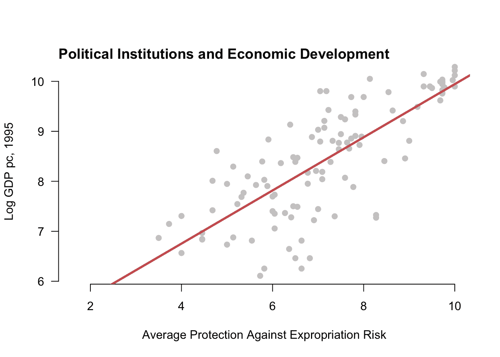
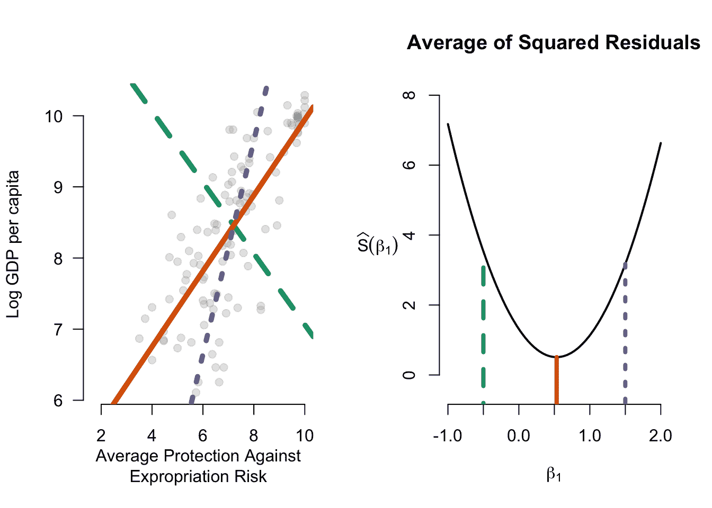
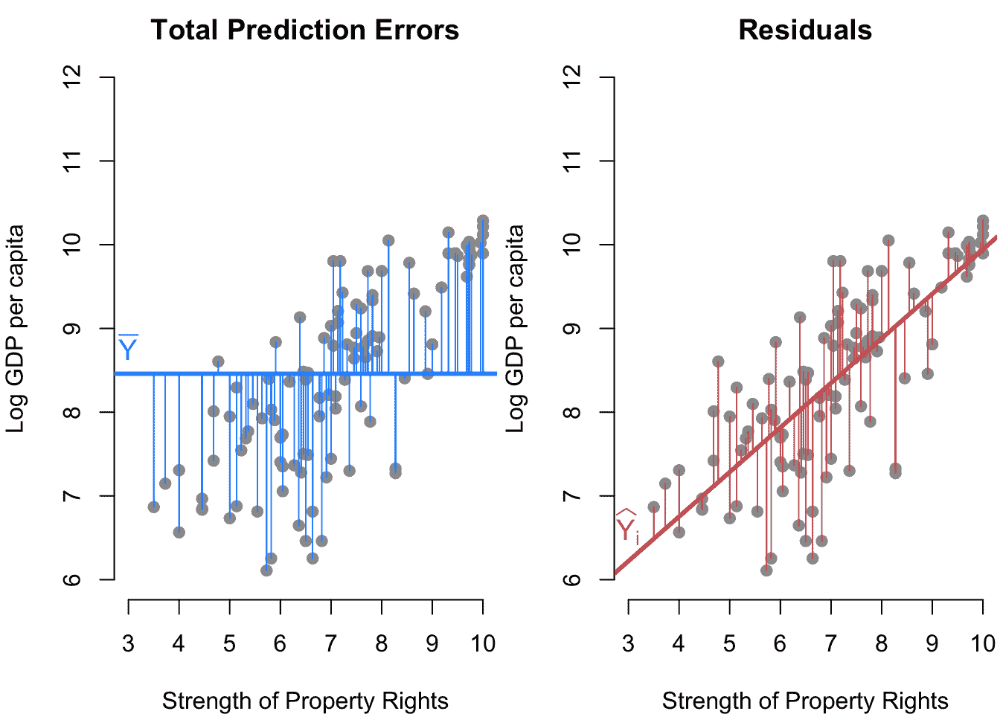
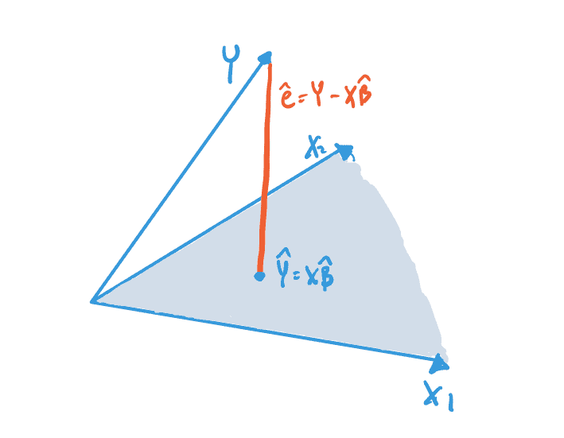
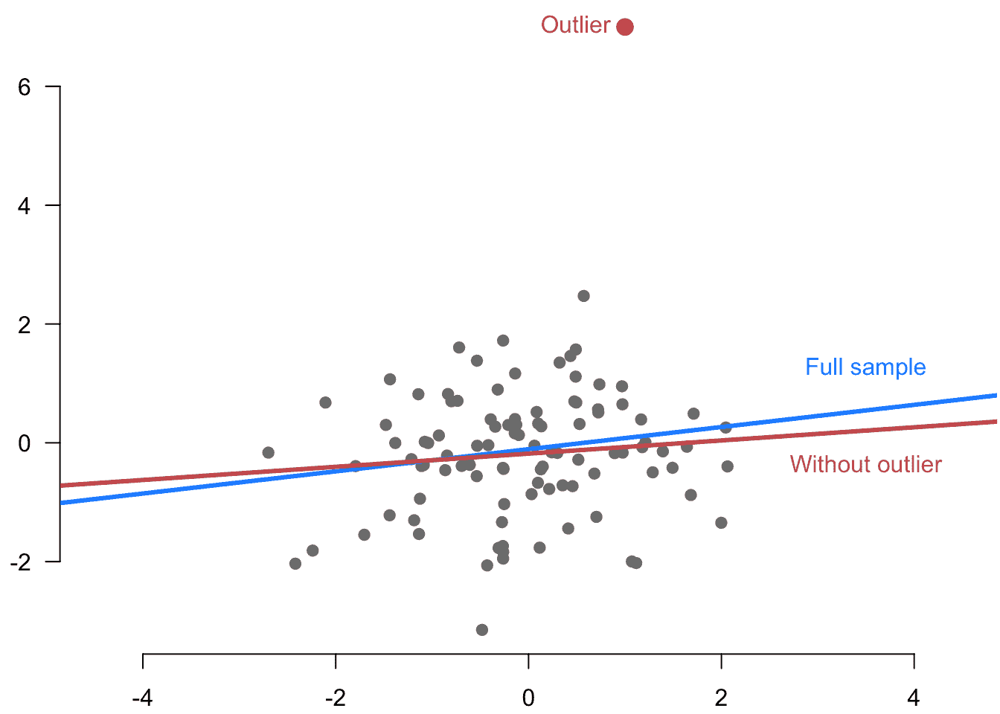
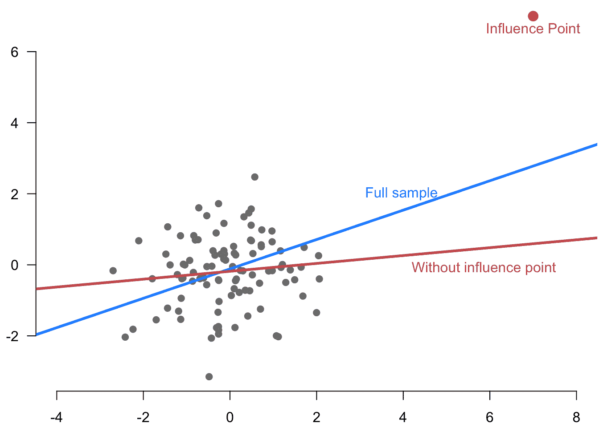

# 6  最小二乘法的原理

> 原文：[`mattblackwell.github.io/gov2002-book/least_squares.html`](https://mattblackwell.github.io/gov2002-book/least_squares.html)

1.  回归

1.  6  最小二乘法的原理

本章探讨了用于总体线性回归的最广泛使用的估计量：**普通最小二乘法** (OLS)。OLS 是上一章中描述的最佳线性投影（或总体线性回归）的插件估计量。其流行部分归因于其易于解释、计算简单和统计效率。由于大多数从事定量社会科学研究的人大量依赖 OLS 进行自己的研究，因此花时间深入了解这种方法将对你大有裨益。

在本章中，我们专注于说明估计量和 OLS 估计量的机械或代数性质。在下一章中，我们将研究其统计假设。教科书通常在条件期望为线性模型的假设下介绍 OLS，但如果我们把推断目标视为最佳线性预测器，则这是不必要的。我们将在下一章更详细地讨论这一点。

图 6.1：来自 Acemoglu、Johnson 和 Robinson（2001 年）的政治制度与经济发展之间的关系。

## 6.1 推导 OLS 估计量

最后一章关于线性模型和最佳线性投影完全是在总体中进行的，而不是在样本中。我们推导出了总体回归系数 $\bfbeta$，代表总体中最佳拟合线的系数。我们现在将这些作为我们感兴趣的量。我们现在关注如何使用来自总体的样本来对总体中最佳拟合线和总体系数进行推断。为此，我们将关注这些总体量的 OLS 估计量。

*假设* *变量 $\{(Y_1, \X_1), \ldots, (Y_i,\X_i), \ldots, (Y_n, \X_n)\}$ 是来自共同分布 $F$ 的独立同分布抽取。* *回想一下我们在上一章中推导出的总体线性系数（或最佳线性预测系数），$$ \bfbeta = \argmin_{\mb{b} \in \real^k}\; \E\bigl[ \bigl(Y_{i} - \mb{X}_{i}'\mb{b} \bigr)²\bigr] = \left(\E[\X_{i}\X_{i}']\right)^{-1}\E[\X_{i}Y_{i}] $$

我们将考虑两种不同的方法来推导这些系数的 OLS 估计量，这两种方法都是插入原理的版本。第一种方法是使用系数的闭式表示，然后替换任何期望值以样本均值，$$ \bhat = \left(\frac{1}{n} \sum_{i=1}^n \X_i\X_i' \right)^{-1} \left(\frac{1}{n} \sum_{i=1}^n \X_{i}Y_{i} \right), $$ 其中如果 $\sum_{i=1}^n \X_i\X_i'$ 是 **正定的** 并且因此可逆的话，则存在。我们将在下面回到这个假设。

在一个简单的二元线性投影模型 $m(X_{i}) = \beta_0 + \beta_1X_{i}$ 中，我们看到了总体斜率是 $\beta_1= \text{cov}(Y_{i},X_{i})/ \V[X_{i}]$。这种方法意味着斜率的估计量应该是 $Y_i$ 和 $X_i$ 的样本协方差与 $X_i$ 的样本方差的比值，或 $$ \widehat{\beta}_{1} = \frac{\widehat{\sigma}_{Y,X}}{\widehat{\sigma}^{2}_{X}} = \frac{ \frac{1}{n-1}\sum_{i=1}^{n} (Y_{i} - \overline{Y})(X_{i} - \overline{X})}{\frac{1}{n-1} \sum_{i=1}^{n} (X_{i} - \Xbar)^{2}}. $$

这种插件方法具有广泛的适用性，在独立同分布（iid）数据的大样本下往往具有优异的性质。但插件方法的简单性也隐藏了一些估计量的特征，这些特征在更明确地使用微积分推导估计量时变得更加明显。第二种方法将插件原理应用于系数的闭式表达式，而不是应用于优化问题本身。我们称这种方法为**最小二乘**估计量，因为它最小化了经验（或样本）预测误差的平方，$$ \bhat = \argmin_{\mb{b} \in \real^k}\; \frac{1}{n} \sum_{i=1}^{n}\bigl(Y_{i} - \mb{X}_{i}'\mb{b} \bigr)² = \argmin_{\mb{b} \in \real^k}\; SSR(\mb{b}), $$ 其中，$$ SSR(\mb{b}) = \sum_{i=1}^{n}\bigl(Y_{i} - \mb{X}_{i}'\mb{b} \bigr)² $$ 是残差的平方和。为了将其与其他更复杂的最小二乘估计量区分开来，我们称这种估计量为**普通最小二乘**估计量，或 OLS。

让我们解决这个最小化问题。我们将一阶条件写成 $$ 0=\frac{\partial SSR(\bhat)}{\partial \bfbeta} = 2 \left(\sum_{i=1}^{n} \X_{i}Y_{i}\right) - 2\left(\sum_{i=1}^{n}\X_{i}\X_{i}'\right)\bhat. $$ 我们可以将这个方程组重新排列为 $$ \left(\sum_{i=1}^{n}\X_{i}\X_{i}'\right)\bhat = \left(\sum_{i=1}^{n} \X_{i}Y_{i}\right). $$ 为了获得 $\bhat$ 的解，请注意 $\sum_{i=1}^{n}\X_{i}\X_{i}'$ 是一个 $(k+1) \times (k+1)$ 矩阵，而 $\bhat$ 和 $\sum_{i=1}^{n} \X_{i}Y_{i}$ 都是 $k+1$ 长度的列向量。如果 $\sum_{i=1}^{n}\X_{i}\X_{i}'$ 是可逆的，那么我们可以将这个方程的两边乘以该逆矩阵，得到 $$ \bhat = \left(\sum_{i=1}^n \X_i\X_i' \right)^{-1} \left(\sum_{i=1}^n \X_{i}Y_{i} \right), $$ 这与插件估计量（在消去 $1/n$ 项之后）具有相同的表达式。为了确认我们已经找到了一个最小值，我们还需要检查二阶条件，$$ \frac{\partial^{2} SSR(\bhat)}{\partial \bfbeta\bfbeta'} = 2\left(\sum_{i=1}^{n}\X_{i}\X_{i}'\right) > 0. $$ 矩阵“正定”意味着什么？在矩阵代数中，这个条件意味着矩阵 $\sum_{i=1}^{n}\X_{i}\X_{i}'$ 是**正定**的，这是一个我们在第 6.4 节中讨论的条件。

插件或最小二乘方法都给出了最佳线性预测器/总体线性回归系数的相同估计量。

**定理 6.1** 如果 $\sum_{i=1}^{n}\X_{i}\X_{i}'$ 是正定的，那么普通最小二乘估计量是 $$ \bhat = \left(\sum_{i=1}^n \X_i\X_i' \right)^{-1} \left(\sum_{i=1}^n \X_{i}Y_{i} \right). $$

*OLS 斜率公式* 几乎所有的回归都会包含一个截距项，通常在协变量向量中表示为常数 1。也可以分别获得截距和变量系数的 OLS 估计表达式。我们可以将最佳线性预测分解重写为 $$ Y_{i} = \alpha + \X_{i}'\bfbeta + \e_{i}. $$ 以这种方式定义，我们可以将 $\X_i$ 上的“斜率”的 OLS 估计量写为所有变量去均值后的 OLS 估计量： $$ \bhat = \left(\frac{1}{n} \sum_{i=1}^{n} (\X_{i} - \overline{\X})(\X_{i} - \overline{\X})'\right) \left(\frac{1}{n} \sum_{i=1}^{n}(\X_{i} - \overline{\X})(Y_{i} - \overline{Y})\right) $$ 这就是 $\X_i$ 的样本协方差矩阵的逆乘以 $\X_i$ 和 $Y_i$ 的样本协方差。截距是 $$ \widehat{\alpha} = \overline{Y} - \overline{\X}'\bhat. $$*  *当处理实际数据而不是总体时，我们将预测误差 $\widehat{e}_{i} = Y_i - \X_i'\bhat$ 称为**残差**。预测值本身，$\widehat{Y}_i = \X_{i}'\bhat$，也称为**拟合值**。在总体线性回归中，我们看到了投影误差 $e_i = Y_i - \X_i'\bfbeta$ 的均值为零且与协变量不相关 $\E[\X_{i}e_{i}] = 0$。残差在样本协变量方面具有类似的性质： $$ \sum_{i=1}^n \X_i\widehat{e}_i = 0. $$ 残差与协变量（当协变量包括常数/截距项时）完全不相关，这是 OLS 估计量的机械属性。

图 6.2 展示了在双变量情况下 OLS 是如何工作的。它显示了三条可能的回归线以及每条线的残差平方和。OLS 的目标是找到右侧函数最小化的线。

图 6.2：不同可能的线和它们对应的残差平方和。**  **## 6.2 模型拟合

我们已经学习了如何使用 OLS 来获得最佳线性预测的估计，但一个悬而未决的问题是这种预测是否有效。使用 $\X_i$ 是否有助于我们预测 $Y_i$？为了调查这个问题，我们考虑了两种不同的预测误差：（1）使用协变量的那些；（2）不使用的那些。

我们已经看到了使用协变量时的预测误差；它仅仅是**残差平方和**，$$ SSR = \sum_{i=1}^n (Y_i - \X_{i}'\bhat)². $$ 回想一下，没有协变量时$Y_i$的最佳预测因子仅仅是其样本均值$\overline{Y}$。没有协变量的预测误差就是我们所说的**总平方和**，$$ TSS = \sum_{i=1}^n (Y_i - \overline{Y})². $$ 图 6.3 显示了这两种预测误差之间的差异。

图 6.3：总平方和与残差平方和的比较。

我们可以通过添加这些协变量带来的**预测误差比例减少**来衡量这些协变量提高了回归预测能力多少。这个值，称为**确定系数**或$R²$，可以简单地表示为$$ R² = \frac{TSS - SSR}{TSS} = 1-\frac{SSR}{TSS}. $$ 分子，$TSS - SSR$，是从$\overline{Y}$到$\X_i'\bhat$作为预测因子时预测误差的减少。分母是使用$\overline{Y}$的预测误差。因此，$R²$值是使用$\X_i$预测$Y_i$所消除的总预测误差的比例。另一种思考这个值的方法是，它衡量了残差相对于$Y$的整体变异性减少的程度。需要注意的是，带有协变量的 OLS 将**始终**提高样本内拟合度，使得$TSS \geq SSR$，即使$\X_i$与$Y_i$无关。这种虚幻的改进发生是因为 OLS 的目标是最小化 SSR，即使它只是在追逐噪声。

由于回归总是提高样本内拟合度，$R²$将介于 0 和 1 之间。0 的值将表示所有协变量（除了截距）上的估计系数恰好为 0，因此$Y_i$和$\X_i$在数据中完全正交。（这种情况很少发生，因为很可能会由于随机机会存在一些最小但非零的关系。）1 的值表示完美的线性拟合，这发生在所有数据点都由模型完美预测且没有残差的情况下。

## 6.3 OLS 的矩阵形式

我们上面使用简单的代数和微积分推导了 OLS 估计量，但更常见的估计量表示依赖于向量和矩阵。我们通常为通用单位写出线性模型，$Y_i = \X_i'\bfbeta + e_i$，但显然，有 $n$ 个这样的方程，$$ \begin{aligned} Y_1 &= \X_1'\bfbeta + e_1 \\ Y_2 &= \X_2'\bfbeta + e_2 \\ &\vdots \\ Y_n &= \X_n'\bfbeta + e_n \\ \end{aligned} $$ 我们可以使用矩阵代数更紧凑地写出这个方程组。将这里的变量组合成随机向量/矩阵，我们得到：$$ \mb{Y} = \begin{pmatrix} Y_1 \\ Y_2 \\ \vdots \\ Y_n \end{pmatrix}, \quad \mathbb{X} = \begin{pmatrix} \X'_1 \\ \X'_2 \\ \vdots \\ \X'_n \end{pmatrix} = \begin{pmatrix} 1 & X_{11} & X_{12} & \cdots & X_{1k} \\ 1 & X_{21} & X_{22} & \cdots & X_{2k} \\ \vdots & \vdots & \vdots & \vdots & \vdots \\ 1 & X_{n1} & X_{n2} & \cdots & X_{nk} \\ \end{pmatrix}, \quad \mb{e} = \begin{pmatrix} e_1 \\ e_2 \\ \vdots \\ e_n \end{pmatrix} $$ 我们可以将上述方程组写成 $$ \mb{Y} = \mathbb{X}\bfbeta + \mb{e}, $$ 注意到 $\mathbb{X}$ 是一个 $n \times (k+1)$ 的矩阵，而 $\bfbeta$ 是一个 $k+1$ 长度的列向量。

用矩阵形式表示求和是 OLS 定义和矩阵表示之间的关键联系。特别是，我们有 $$ \begin{aligned} \sum_{i=1}^n \X_i\X_i' &= \Xmat'\Xmat \\ \sum_{i=1}^n \X_iY_i &= \Xmat'\mb{Y}, \end{aligned} $$ 这意味着我们可以将 OLS 估计量写成更易识别的形式，即 $$ \bhat = \left( \mathbb{X}'\mathbb{X} \right)^{-1} \mathbb{X}'\mb{Y}. $$

我们当然也可以定义残差向量，$$ \widehat{\mb{e}} = \mb{Y} - \mathbb{X}\bhat = \left[ \begin{array}{c} Y_1 \\ Y_2 \\ \vdots \\ Y_n \end{array} \right] - \left[ \begin{array}{c} 1\widehat{\beta}_0 + X_{11}\widehat{\beta}_1 + X_{12}\widehat{\beta}_2 + \dots + X_{1k}\widehat{\beta}_k \\ 1\widehat{\beta}_0 + X_{21}\widehat{\beta}_1 + X_{22}\widehat{\beta}_2 + \dots + X_{2k}\widehat{\beta}_k \\ \vdots \\ 1\widehat{\beta}_0 + X_{n1}\widehat{\beta}_1 + X_{n2}\widehat{\beta}_2 + \dots + X_{nk}\widehat{\beta}_k \end{array} \right], $$ 因此在这种情况下，残差平方和变为 $$ SSR(\bfbeta) = \Vert\mb{Y} - \mathbb{X}\bfbeta\Vert^{2} = (\mb{Y} - \mathbb{X}\bfbeta)'(\mb{Y} - \mathbb{X}\bfbeta), $$ 其中双竖线是参数的欧几里得范数，$\Vert \mb{z} \Vert = \sqrt{\sum_{i=1}^n z_i^{2}}$. 因此，OLS 最小化问题变为 $$ \bhat = \argmin_{\mb{b} \in \mathbb{R}^{(k+1)}}\; \Vert\mb{Y} - \mathbb{X}\mb{b}\Vert^{2} $$ 最后，我们可以将协变量和残差之间的不相关性表示为 $$ \mathbb{X}'\widehat{\mb{e}} = \sum_{i=1}^{n} \X_{i}\widehat{e}_{i} = 0, $$ 这也意味着这些向量是 **正交** 的。

## 6.4 排序、线性无关性和多重共线性

我们注意到，当 $\sum_{i=1}^n \X_i\X_i'$ 是正定的时候，OLS 估计量存在，或者说不存在“多重共线性”。这个假设等同于说矩阵 $\mathbb{X}$ 是满列秩，意味着 $\text{rank}(\mathbb{X}) = (k+1)$，其中 $k+1$ 是 $\mathbb{X}$ 的列数。从矩阵代数中回忆起，列秩是矩阵中线性无关列的数量，而**线性无关**意味着如果 $\mathbb{X}\mb{b} = 0$，那么 $\mb{b}$ 必须是一个全零列向量。换句话说，我们有 $$ b_{1}\mathbb{X}_{1} + b_{2}\mathbb{X}_{2} + \cdots + b_{k+1}\mathbb{X}_{k+1} = 0 \quad\iff\quad b_{1} = b_{2} = \cdots = b_{k+1} = 0, $$ 其中 $\mathbb{X}_j$ 是 $\mathbb{X}$ 的第 $j$ 列。因此，满列秩意味着所有列都是线性无关的，或者说不存在“多重共线性”。

这可能被违反吗？假设我们不小心包含了一个一元变量的线性函数，使得 $\mathbb{X}_2 = 2\mathbb{X}_1$。那么我们有 $$ \begin{aligned} \mathbb{X}\mb{b} &= b_{1}\mathbb{X}_{1} + b_{2}2\mathbb{X}_1+ b_{3}\mathbb{X}_{3}+ \cdots + b_{k+1}\mathbb{X}_{k+1} \\ &= (b_{1} + 2b_{2})\mathbb{X}_{1} + b_{3}\mathbb{X}_{3} + \cdots + b_{k+1}\mathbb{X}_{k+1} \end{aligned} $$ 在这种情况下，当 $b_3 = b_4 = \cdots = b_{k+1} = 0$ 且 $b_1 = -2b_2$ 时，这个表达式等于 0。因此，这些列的集合是线性相关的，所以我们知道 $\mathbb{X}$ 的秩必须小于满列秩（即小于 $k+1$）。希望也很清楚，如果我们移除了有问题的列 $\mathbb{X}_2$，得到的矩阵将会有 $k$ 个线性无关的列，这意味着 $\mathbb{X}$ 的秩是 $k$。

为什么这个秩条件对 OLS 估计量很重要？简而言之，$\Xmat$ 的列的线性无关性确保了逆 $(\Xmat'\Xmat)^{-1}$ 存在，因此 $\bhat$ 也存在。这是因为 $\Xmat$ 是满列秩当且仅当 $\Xmat'\Xmat$ 是非奇异的，而一个矩阵是可逆的当且仅当它是非奇异的。这个满秩条件进一步意味着 $\Xmat'\Xmat = \sum_{i=1}^{n}\X_{i}\X_{i}'$ 是正定的，这意味着估计量确实在寻找最小平方残差和。

哪些常见情况会导致违反无多重共线性？我们上面已经看到了一个例子，其中一个变量是另一个变量的线性函数。但这个问题可能以更微妙的方式出现。假设我们有一组对应于单个分类变量的虚拟变量，比如世界上的地区。这可能意味着对于亚洲的单位，$X_{i1} = 1$（否则为 0），对于欧洲的单位，$X_{i2} = 1$（否则为 0），对于非洲的单位，$X_{i3} = 1$（否则为 0），对于美洲的单位，$X_{i4} = 1$（否则为 0），对于大洋洲的国家，$X_{i5} = 1$（否则为 0）。每个单位必须恰好属于这五个区域之一，因此这些变量之间存在线性依赖性，$$ X_{i5} = 1 - X_{i1} - X_{i2} - X_{i3} - X_{i4}. $$ 这意味着如果一个单位不在亚洲、欧洲、非洲或美洲，我们知道它在大洋洲。如果我们包含所有这些变量并在回归中包含截距项，我们会得到线性依赖性。（注意 $X_{i5}$ 与其他变量之间的关系中的 1，这是为什么包含常数时会有线性依赖性的原因。）因此，我们通常从每个分类变量中省略一个虚拟变量。在这种情况下，剩余虚拟变量的系数是该类别与省略的类别之间均值差异（如果包含其他变量，则可能是条件均值差异）。所以如果我们省略了 $X_{i5}$（大洋洲），那么 $X_{i1}$ 的系数将是亚洲单位和大洋洲单位之间平均结果差异。

当同时包含截距项和一个不变化的变量时，也可能出现多重共线性。如果我们错误地子集我们的数据，这个问题通常会发生，例如在这个例子中，如果我们只对亚洲单位进行子集，但仍然在回归中包含了亚洲虚拟变量。

最后，请注意，大多数统计软件包将通过任意移除尽可能多的线性相关协变量来实现“解决”多重共线性问题，以达到满秩。在这些情况下，R 将显示估计系数为 `NA`。

## 6.5 二元和分类回归器的 OLS 系数

假设协变量只包括截距和一个单个二元变量，$\X_i = (1\; X_{i})'$，其中 $X_i \in \{0,1\}$。换句话说，右侧只包含一个协变量，一个指示变量。在这种情况下，$X_i$ 上的 OLS 系数 $\widehat{\beta_{1}}$ 与 $X_i = 1$ 组和 $X_i = 0$ 组中 $Y_i$ 的样本均值差异完全相等：$$ \widehat{\beta}_{1} = \frac{\sum_{i=1}^{n} X_{i}Y_{i}}{\sum_{i=1}^{n} X_{i}} - \frac{\sum_{i=1}^{n} (1 - X_{i})Y_{i}}{\sum_{i=1}^{n} 1- X_{i}} = \overline{Y}_{X =1} - \overline{Y}_{X=0} $$ 这个非常有用的结果不是近似值：它对任何样本大小都成立。

我们可以将这个想法推广到离散变量。假设我们有了上一节中的区域变量，并在协变量中包含一个常数以及亚洲、欧洲、非洲和美洲的虚拟变量（大洋洲再次作为省略的变量/类别）。那么西部的虚拟变量的系数将是 $$ \widehat{\beta}_{\text{Asia}} = \overline{Y}_{\text{Asia}} - \overline{Y}_{\text{Oceania}}, $$ 这正是 $Y_i$ 在亚洲单位和在大洋洲单位之间的样本均值之差。

注意，这些解释仅在回归仅由二元变量或一组分类虚拟变量组成时成立。当向模型中添加其他协变量时，这些确切的关系将失效。

## 6.6 最小二乘法的投影和几何

OLS 有一个非常漂亮的几何解释，这为该方法的各种方面增加了许多直观性。在这种几何方法中，我们将 $\mb{Y}$ 视为 $\mathbb{R}^n$ 中的 $n$ 维向量。如上所述，矩阵形式的 OLS 是关于找到协变量矩阵 $\Xmat$ 的线性组合，使其在欧几里得距离上最接近这个向量，这仅仅是平方和。

设 $\mathcal{C}(\Xmat) = \{\Xmat\mb{b} : \mb{b} \in \mathbb{R}^(k+1)\}$ 为矩阵 $\Xmat$ 的 **列空间**。这个集合包含了 $\Xmat$ 列的所有线性组合，或者说是从 $\Xmat$ 中可以得到的所有可能的线性预测。注意，OLS 拟合值 $\Xmat\bhat$ 就在这个列空间中。如果我们假设 $\Xmat$ 的列满秩为 $k+1$，那么列空间 $\mathcal{C}(\Xmat)$ 将是更大 $n$ 维空间中的一个 $k+1$ 维曲面。如果 $\Xmat$ 有两列，那么列空间将是一个平面。

OLS 估计器的另一种解释是，它找到线性预测器作为 $\Xmat$ 列空间中到结果向量 $\mb{Y}$ 最近的点。这被称为 $\mb{Y}$ 在 $\mathcal{C}(\Xmat)$ 上的 **投影**。图 6.4 展示了 $n=3$ 和 $\Xmat$ 中有 2 列的情况下的这个投影。阴影蓝色区域代表 $\Xmat$ 列空间的平面，$\Xmat\bhat$ 是在该空间中到 $\mb{Y}$ 最近的点。这说明了 OLS 估计器的整个思想：找到 $\Xmat$ 列的线性组合（列空间中的一个点），使得该点与结果向量（残差平方和）之间的欧几里得距离最小。

图 6.4：Y 在协变量列空间上的投影。

此图显示了残差向量，即 $\mb{Y}$ 向量与投影 $\Xmat\bhat$ 之间的差，与 $\Xmat$ 的列空间正交或垂直。这种正交性是残差与 $\Xmat$ 的所有列正交的结果，$$ \Xmat'\mb{e} = 0, $$ 正如我们上面所建立的。对所有列的正交性意味着它也将与所有列的线性组合正交。

## 6.7 投影和湮灭矩阵

在建立了 $\Xmat$ 的列空间投影的概念之后，我们可以定义一种将任何向量投影到该空间的方法。$n\times n$ 的 **投影矩阵**，$$ \mb{P}_{\Xmat} = \Xmat (\Xmat'\Xmat)^{-1} \Xmat', $$ 将一个向量投影到 $\mathcal{C}(\Xmat)$。特别是，我们可以看到这给出了 $\mb{Y}$ 的拟合值：$$ \mb{P}_{\Xmat}\mb{Y} = \Xmat (\Xmat'\Xmat)^{-1} \Xmat'\mb{Y} = \Xmat\bhat. $$ 因为我们有时将线性预测器写作 $\widehat{\mb{Y}} = \Xmat\bhat$，所以投影矩阵也称为 **帽矩阵**。无论使用哪个名称，将一个向量乘以 $\mb{P}_{\Xmat}$ 都给出了该向量作为 $\Xmat$ 的函数的最佳线性预测器。直观上，任何已经是 $\Xmat$ 列的线性组合的向量（因此位于 $\mathcal{C}(\Xmat)$ 中）应该不受此投影的影响：$\mathcal{C}(\Xmat)$ 中到已经位于 $\mathcal{C}(\Xmat)$ 的点的最近点是它自己。我们也可以通过代数方式看到任何线性组合 $\Xmat\mb{c}$，$$ \mb{P}_{\Xmat}\Xmat\mb{c} = \Xmat (\Xmat'\Xmat)^{-1} \Xmat'\Xmat\mb{c} = \Xmat\mb{c}, $$ 因为 $(\Xmat'\Xmat)^{-1} \Xmat'\Xmat$ 简化为单位矩阵。特别是，$\Xmat$ 投影到自身的投影就是它自己：$\mb{P}_{\Xmat}\Xmat = \Xmat$。

与投影相关的第二个矩阵是 **湮灭矩阵**，$$ \mb{M}_{\Xmat} = \mb{I}_{n} - \mb{P}_{\Xmat}, $$ 它将任何向量投影到 $\Xmat$ 的列空间的正交补，$$ \mathcal{C}^{\perp}(\Xmat) = \{\mb{c} \in \mathbb{R}^n\;:\; \Xmat\mb{c} = 0 \}. $$ 这个矩阵被称为湮灭矩阵，因为将其应用于 $\Xmat$ 的任何线性组合，都会得到 0：$$ \mb{M}_{\Xmat}\Xmat\mb{c} = \Xmat\mb{c} - \mb{P}_{\Xmat}\Xmat\mb{c} = \Xmat\mb{c} - \Xmat\mb{c} = 0. $$ 注意到 $\mb{M}_{\Xmat}\Xmat = 0$。我们为什么应该关心这个矩阵呢？也许一个更有启发性的名字可能是 **残差制造者**，因为它在应用于 $\mb{Y}$ 时会产生残差，$$ \mb{M}_{\Xmat}\mb{Y} = (\mb{I}_{n} - \mb{P}_{\Xmat})\mb{Y} = \mb{Y} - \mb{P}_{\Xmat}\mb{Y} = \mb{Y} - \Xmat\bhat = \widehat{\mb{e}}. $$

投影矩阵有几个有用的性质：

+   $\mb{P}_{\Xmat}$ 和 $\mb{M}_{\Xmat}$ 是 **幂等的**，这意味着当它们作用于自身时，仅仅返回自身：$\mb{P}_{\Xmat}\mb{P}_{\Xmat} = \mb{P}_{\Xmat}$ 和 $\mb{M}_{\Xmat}\mb{M}_{\Xmat} = \mb{M}_{\Xmat}$。

+   $\mb{P}_{\Xmat}$ 和 $\mb{M}_{\Xmat}$ 是对称的 $n \times n$ 矩阵，因此 $\mb{P}_{\Xmat}' = \mb{P}_{\Xmat}$ 和 $\mb{M}_{\Xmat}' = \mb{M}_{\Xmat}$。

+   $\mb{P}_{\Xmat}$ 的秩是 $k+1$（$\Xmat$ 的列数），而 $\mb{M}_{\Xmat}$ 的秩是 $n - k - 1$。

我们可以使用投影矩阵和湮灭矩阵来得到结果向量的正交分解：$$ \mb{Y} = \Xmat\bhat + \widehat{\mb{e}} = \mb{P}_{\Xmat}\mb{Y} + \mb{M}_{\Xmat}\mb{Y}. $$

## 6.8 残差回归

在许多情况下，我们可以将协变量分为两组，我们可能会想知道是否可以仅对一组协变量表达或计算 OLS 系数。特别是，让 $\Xmat$ 的列分为 $[\Xmat_{1} \Xmat_{2}]$，这样我们估计的线性预测是 $$ \mb{Y} = \Xmat_{1}\bfbeta_{1} + \Xmat_{2}\bfbeta_{2} + \mb{e}, $$ 其中估计系数和残差为 $$ \mb{Y} = \Xmat_{1}\bhat_{1} + \Xmat_{2}\bhat_{2} + \widehat{\mb{e}}. $$

现在我们记录另一种从回归中获取估计量 $\bhat_1$ 的方法，这种方法称为**残差回归**、**分割回归**或**弗里施-沃格-洛夫定理**。

*残差回归方法* 残差回归方法是：

1.  使用 OLS 对 $\mb{Y}$ 进行回归，以 $\Xmat_2$ 为因变量，并得到残差 $\widetilde{\mb{e}}_2$。

1.  使用 OLS 对 $\Xmat_1$ 的每一列进行回归，以 $\Xmat_2$ 为因变量，并得到残差 $\widetilde{\Xmat}_1$。

1.  使用 OLS 对 $\widetilde{\mb{e}}_{2}$ 进行回归，以 $\widetilde{\Xmat}_1$ 为因变量。***定理 6.2（弗里施-沃格-洛夫）*** 从对 $\widetilde{\mb{e}}_{2}$ 进行 $\widetilde{\Xmat}_1$ 回归得到的 OLS 系数与从对 $\mb{Y}$ 进行 $\Xmat_{1}$ 和 $\Xmat_2$ 回归得到的 $\Xmat_{1}$ 上的系数等价。

该定理的一个含义是，给定变量的回归系数捕捉了在考虑其他协变量后，结果残差变异与该变量之间的关系。特别是，这个系数专注于与其他协变量正交的变异。

虽然可能令人意外，但这个结果可能看起来并不特别有用。我们不是可以直接运行长回归吗？但这个技巧在 $\Xmat_2$ 由许多类别的分类变量的虚拟变量（或“固定效应”）组成时非常有用。例如，假设 $\Xmat_2$ 包含了受访者居住县的指标。在这种情况下，它将超过 3,000 列，这意味着直接计算 $\bhat = (\bhat_{1}, \bhat_{2})$ 将需要求逆一个大于 $3,000 \times 3,000$ 的矩阵。从计算的角度来看，这个过程将会非常慢。但上面我们看到了，在分类变量上的结果预测只是该变量每个水平内的样本均值。因此，在这种情况下，残差 $\widetilde{\mb{e}}_2$ 和 $\Xmat_1$ 可以通过在 $\Xmat_2$ 的虚拟变量水平内对结果和 $\Xmat_1$ 进行去均值计算，这在计算上可以快得多。

最后，使用残差回归允许研究人员在调整其他协变量后，可视化结果变量与单个自变量之间的条件关系。特别是，可以通过这种方法使用 $\widetilde{\mb{e}}_2$ 在 $\Xmat_1$ 上的散点图（当它是一列时）来检查这种关系。这种残差散点图允许研究人员检查这种条件关系是否呈现线性关系，或者应该以其他方式建模。*  *## 6.9 异常值、杠杆点和有影响力的观测值

由于 OLS 寻找最小化平方残差总和的系数，询问每个残差对解决方案的影响有多大是非常有帮助的。设 $\bhat_{(-i)}$ 为省略单位 $i$ 的 OLS 估计。直观上，**有影响力的观测值**应该对估计系数有显著影响，使得 $\bhat_{(-i)} - \bhat$ 的绝对值很大。

在什么条件下我们会有有影响力的观测值？OLS 尝试最小化平方残差的总和，因此它会在较大残差和较小残差之间移动更多。大残差可能出现在哪里？注意，任何具有常数的 OLS 回归线都会恰好通过结果和协变量的均值：$\overline{Y} = \overline{\X}\bhat$。因此，根据定义，这意味着当一个观测值接近协变量的平均值 $\overline{\X}$ 时，它不可能有太大的影响，因为 OLS 会迫使回归线通过 $\overline{Y}$。因此，有影响力的点将有两个特性：

1.  具有高**杠杆**，其中杠杆大致衡量 $\X_i$ 与 $\overline{\X}$ 的距离，并且

1.  在“残差大”（如果从回归中排除）的意义上，成为一个**异常值**。

我们将逐一讨论这些内容。

### 6.9.1 杠杆点

我们可以通过以下公式定义观察值的**杠杆作用**：$$ h_{ii} = \X_{i}'\left(\Xmat'\Xmat\right)^{-1}\X_{i}, $$ 这是对角投影矩阵 $\mb{P}_{\Xmat}$ 的第 $i$ 个对角元素。请注意，$$ \widehat{\mb{Y}} = \mb{P}_{\Xmat}\mb{Y} \qquad \implies \qquad \widehat{Y}_i = \sum_{j=1}^n h_{ij}Y_j, $$ 因此 $h_{ij}$ 表示观察 $j$ 对观察 $i$ 的拟合值的重要性。杠杆作用，因此，是观察对其自身拟合值的重要性。我们还可以用 $\X_{i}$ 的分布来解释这些值。粗略地说，这些值是 $\X_i$ 和 $\overline{\X}$ 之间的加权距离，其中权重归一化到协变量的经验方差/协方差结构（因此每个协变量的尺度大致相同）。当我们用 OLS（带有单个协变量和截距）拟合简单线性回归时，我们可以最清楚地看到这一点，此时杠杆作用为 $$ h_{ii} = \frac{1}{n} + \frac{(X_i - \overline{X})²}{\sum_{j=1}^n (X_j - \overline{X})²} $$

杠杆值有三个关键特性：

1.  $0 \leq h_{ii} \leq 1$

1.  如果模型包含截距，则 $h_{ii} \geq 1/n$

1.  $\sum_{i=1}^{n} h_{ii} = k + 1$

### 6.9.2 异常值和留一法回归

在 OLS 的背景下，**异常值**是指对于特定的 OLS 拟合，预测误差较大的观察值。图 6.5 展示了异常值的示例。

图 6.5：异常值的示例。

直观上看，我们似乎可以使用残差 $\widehat{e}_i$ 来评估给定单位的预测误差。但残差并不是有效的预测，因为 OLS 估计器旨在使这些值尽可能小（在机器学习的术语中，这些值在训练集中）。特别是，如果异常值有影响力，我们之前已经指出它可能会“拉”回归线向其靠近，并且产生的残差可能相当小。

为了更清晰地评估预测误差，我们可以使用**留一法回归**（LOO），它将 $\mb{Y}_{(-i)}$ 回归到 $\Xmat_{(-i)}$ 上，其中这些省略了单位 $i$：$$ \bhat_{(-i)} = \left(\Xmat'_{(-i)}\Xmat_{(-i)}\right)^{-1}\Xmat_{(-i)}\mb{Y}_{(-i)}. $$ 然后，我们可以计算 LOO 预测误差为 $$ \widetilde{e}_{i} = Y_{i} - \X_{i}'\bhat_{(-i)}. $$ 对于每个单位计算这些 LOO 预测误差似乎在计算上很昂贵，因为这似乎意味着我们必须拟合 OLS $n$ 次。幸运的是，对于 LOO 系数和预测误差，存在一个关于原始回归的闭式表达式，$$ \bhat_{(-i)} = \bhat - \left( \Xmat'\Xmat\right)^{-1}\X_i\widetilde{e}_i \qquad \widetilde{e}_i = \frac{\widehat{e}_i}{1 - h_{ii}}. \tag{6.1}$$ 这表明，当单位的杠杆作用高时，LOO 预测误差将与残差不同。这是有道理的！我们之前说过，杠杆作用低的观测值将接近 $\overline{\X}$，其中结果值对 OLS 拟合的影响相对较小（因为回归线必须通过 $\overline{Y}$）。

### 6.9.3 有影响力的观测

一个有影响力的观察（有时也称为有影响力的点）是一个能够改变特定 OLS 模型系数和拟合值的单位。图 6.6 展示了这样一个影响力点的例子。

图 6.6：一个影响力点的例子。

影响度的一个度量，称为 DFBETA$_i$，衡量 $i$ 对估计系数向量 $$ \bhat - \bhat_{(-i)} = \left( \Xmat'\Xmat\right)^{-1}\X_i\widetilde{e}_i, $$ 的影响程度，因此对于每个观测-协变量对有一个值。当除以估计系数的标准误时，这被称为 DFBETA**S**（其中“S”表示标准化）。如果我们关注特定的系数，这些很有帮助。

当我们想要总结一个观察结果对拟合的重要性时，我们可以通过比较整个样本的拟合值与留一法回归的拟合值来使用一个紧凑的观察结果影响力的度量。使用上述 DFBETA，我们有$$ \widehat{Y}_i - \X_{i}\bhat_{(-1)} = \X_{i}'(\bhat -\bhat_{(-1)}) = \X_{i}'\left( \Xmat'\Xmat\right)^{-1}\X_i\widetilde{e}_i = h_{ii}\widetilde{e}_i, $$ 因此，一个观察结果的影响力是其杠杆作用乘以它是异常值的程度。这个值有时被称为 DFFIT（拟合差异）。这个量的一个变换，**库克距离**，通过平方残差的和进行标准化：$$ D_i = \frac{n-k-1}{k+1}\frac{h_{ii}\widetilde{e}_{i}^{2}}{\widehat{\mb{e}}'\widehat{\mb{e}}}. $$ 识别“有影响力的”观察结果存在不同的截止点，但它们往往是临时的。无论如何，更重要的问题是“这个观察结果对我的实质性解释有多重要”，而不是特定阈值的问题。

找到有影响力的观察结果固然很好，但我们应该如何处理它们呢？首先需要检查数据是否以某种方式被损坏。影响点有时是由于编码或数据输入错误而产生的。如果错误出现在从另一个来源获取的数据中，我们可以考虑删除该观察结果，但如果这种情况出现，则应保持透明度。另一种方法是考虑对因变量或自变量进行变换，例如取自然对数，这可能有助于减弱异常值的影响。最后，考虑使用对异常值具有鲁棒性的方法，如最小绝对偏差或最小截尾平方和。

## 6.10 概述

在本章中，我们介绍了**普通最小二乘法**估计量，它找到使平方残差和最小的$\X_i$的线性函数，并且是上一章中最佳线性预测器的样本版本。$R²$统计量通过比较与简单基于样本均值的结果预测器相比预测结果的好坏来评估 OLS 的样本模型拟合。OLS 也可以使用矩阵代数以非常紧凑的方式表示，这使我们能够理解 OLS 作为独立变量线性函数空间的**投影**的几何形状。**弗里施-沃格-洛夫定理**描述了一种残差回归方法，用于获得系数子集的 OLS 估计，这可能有助于计算效率或数据可视化。最后，有影响力的观察结果是那些在从 OLS 估计中省略时改变估计系数的观察结果，并且有一些度量可以帮助评估这一点。在下一章中，我们将从 OLS 的机械属性转向其统计属性：无偏性、一致性和渐近正态性。***
